[← 用户侧功能规格](INDEX.md)

# 端到端验收用例集 · 跨屏旅程与红线专项

> **这份文档回答一件事:一条用户旅程横跨两屏以上时,谁来验;一条产品红线在全产品范围内怎么验。**
>
> 七份逐屏规格各自写清了自己那一屏的异常表,但**跨屏的完整旅程**与**红线的全局验收**在此之前没有一处统一说法。
> 这份文档就是那一处。
>
> **给谁用:** UI 设计(确认每条路径的每一态都有稿)、前后端开发(照着写断言)、发版前照表走查的执行者。
> **深度:** 详设 —— 每一行用例都要能被真的执行,不做摘要压缩。
>
> **基线:`origin/v1` @ `15accea`,fetch 于 2026-09-01T15:05Z。**
> **状态:活跃。** 新增一屏、改一条跨屏跳转、改一条红线的表述,本文同一次改动内更新。

---

## 一、总纲

### 1.1 分工边界:本文只写两类用例

🔴 **屏内用例不归本文。** 一条用例如果整条都发生在同一屏里,它归那一屏自己的规格文档,本文一个字都不复制。
复制过来就是第二处说法,而两处说法迟早对不上。

| 类型 | 归谁 | 例 |
|---|---|---|
| **屏内用例** | 七份逐屏规格各自的「异常全集」表 | 验证码输错 5 次锁定 → [登录与账号](登录与账号.md) `E-07` |
| **跨屏旅程用例** `J-xxx` | **本文 §二** | 记一条 → 打标 → 覆盖度变 → 盲区屏数字对得上(横跨 4 屏) |
| **红线专项用例** `RL-xx-xx` | **本文 §三** | 原图不出本机 —— 抓包、看日志、清空后核对,横跨全部有图的屏 |

**判定一条用例归哪边,只看一个问题:它的「预期」需不需要在第二块屏幕上观察。**
需要 → 本文;不需要 → 逐屏规格。

### 1.2 本文的用例与阶段验收判据不是一回事

[实施路径](../../decisions/实施路径.md) 里每个阶段末尾那张验收表(「两周内平均每天 ≥3 条」「盲区点击率 >30%」)
**是人判的 pass/fail,判的是需求成不成立**,不是本文的用例。

| | 阶段验收判据 | 本文的用例 |
|---|---|---|
| 判什么 | **需求成不成立** —— 有没有人愿意记、愿不愿意看盲区 | **功能对不对** —— 点下去屏幕上是不是那句话 |
| 谁判 | 人,pass/fail,不可调 | 机器或走查,可复现 |
| 失败了怎么办 | 停,或回上一阶段重想([实施路径](../../decisions/实施路径.md) 止损线) | 改代码,重跑 |
| 数据卡在临界线上 | **不许微调产品再试一轮**;同一关卡失败三次就是失败 | 不存在临界线,断言要么绿要么红 |

🔴 **本文全绿不代表任何一个阶段通过。** 一个功能全对但没人用的产品,阶段 0 照样不通过。
反过来也成立:本文有红线用例是红的,那不管阶段数据多好看,都不能上线。

### 1.3 用例的统一格式(全文遵守)

每条用例是一行表格,列固定为九列:

`# | 旅程/红线 | 前置(Given) | 操作(When) | 预期(Then,必须可观察) | 覆盖屏 | 关联规格与编号 | 端 | 优先级`

**「预期」必须可观察。** 这是本文最硬的一条写作纪律:

| ❌ 不算可观察 | ✅ 算可观察 |
|---|---|
| 「显示正确」 | 「屏幕上出现原文『今天记了 3 条』」 |
| 「记录被保存」 | 「`S-TL` 当天分组第一行出现这条,时间等于点击时刻」 |
| 「不上传原图」 | 「抓包在整个流程里 0 个出站请求体含图片字节」 |
| 「性能可接受」 | 「首屏骨架占位在 1 帧内出现,不出现转圈遮罩」 |

**写不出可观察的预期,说明这条用例还没想清楚,不许写进表里。**

### 1.4 编号规则

| 前缀 | 用于 | 起始 | 说明 |
|---|---|---|---|
| `J-001` … | 跨屏旅程用例 | `J-001` | **全文连续编号**,不按旅程分段重置。旅程分节只是阅读分组 |
| `RL-<红线号>-01` … | 红线专项用例 | 每条红线各自从 `01` 起 | 红线号见 §1.6。`RL-07-01` 是原图红线的第一条 |

⚠️ **编号只增不改。** 一条用例作废就在行尾标 `已作废`,**不回收它的号** —— 号被回收之后,
别的文档里引用它的那一行会静默指向另一件事。

### 1.5 优先级三档

| 档 | 含义 | 红了怎么办 |
|---|---|---|
| **P0** | 破了就不能上线 | **阻断发布。** 全部红线用例、以及「记录 → 看盲区 → 导出」主链路上的用例都是 P0 |
| **P1** | 影响可用 | 记入缺陷清单,同一个版本内修 |
| **P2** | 边角 | 可以带着上线,登记即可 |

**P0 没有「先上再修」这个选项。** 红线一旦上线破了一次,产品对用户讲边界时就再没有可信度。

### 1.6 十二条红线与它们的编号

红线原文的真源是 [项目现状与决策记录](../../decisions/INDEX.md) §2 与 [用户侧功能规格 · 总纲](INDEX.md) §2.3,
本文只给编号,**不重述、不改写、不加条件**。

| 红线号 | 一句话 | 专项用例节 |
|---|---|---|
| `RL-01` | 只回答有没有、几次、多久前;永不判断对不对 | §3.1 |
| `RL-02` | 不做学科教研,学科判断外包给用户自己接的模型 | §3.2 |
| `RL-03` | 不存培训机构课程内容,只记来源名称与时间 | §3.3 |
| `RL-04` | 数据库里没有能装下题干的字段,连预留位都不留 | §3.4 |
| `RL-05` | 闭集打标:只选一个 `nodeId` 或返回无匹配,永不生成标签文本 | §3.5 |
| `RL-06` | 宁缺毋滥:匹配不上就丢弃,不硬归类 | §3.6 |
| `RL-07` | 原图只在本机:不上云、不同步、不共享 | §3.7 |
| `RL-08` | 记录动作永不失败,可以失败的只有它的附加能力 | §3.8 |
| `RL-09` | 导出永远不限次数、无水印、不删减 | §3.9 |
| `RL-10` | 不做提醒机制;反馈形态只有 Toast / 页内提示 / 浮层三种 | §3.10 |
| `RL-11` | 付费墙不许出现在「记录 → 看盲区 → 导出」主链路上 | §3.11 |
| `RL-12` | ~~本机模式不是降级~~ **已作废 · 2026-09-02 取消本机模式** | §3.12 |

⚠️ **`RL-12` 于 2026-09-02 作废** —— 用户裁定「没有本地模式」,未登录只能看到产品说明与登录门,
**不能记、不能看盲区、不能导出**,「把本机模式做成体验版」这条红线保护的东西已不存在。
按 §1.4「编号只增不改」,**号不回收**:§3.12 整节保留 ID 并逐条标作废。**今天有效的红线是 11 条。**

### 1.7 「端」这一列怎么填

| 值 | 含义 |
|---|---|
| `全端` | 所有已存在的端都要跑 |
| `Web` | 只在浏览器里跑 |
| `Web·壳` | 浏览器与桌面壳都要跑,且**两端结果必须一致** |
| `服务端` | 不点界面,跑断言或看日志 |
| `小程序·App` | ⏸ 移动端 —— 见下方 |

⏸ **移动端今天跑不了。** 桌面壳没有 `[lib]` target,iOS / Android 不构建
([文档规范与目录](../../文档规范与目录.md) §2.6 `E4`);移动端是否上架也未定
([多端选型与端矩阵](../../technical/多端选型与端矩阵.md))。
标 `小程序·App` 的用例**今天一条都执行不了**,它们等的是端本身,不是等实现。

### 1.8 数字一律给指针

本文**一个阈值都不写死**。用例里凡出现上限、额度、条数、秒数,一律指向真源:

| 数字 | 真源 |
|---|---|
| 录音时长上限 | [记一次学习](记一次学习.md) §3.3 |
| 单次图片张数上限 | [记一次学习](记一次学习.md) §3.4 |
| 单批补录条数上限 | [记一次学习](记一次学习.md) §3.5 |
| 验证码倒计时、错误次数、锁定时长 | [登录与账号](登录与账号.md) §2.4 · §六 |
| 短信频控(单号 / 单 IP 当天上限) | [登录与账号](登录与账号.md) `E-04` `E-05` |
| AI 额度、档位、价格 | [商业化与额度设计](../商业化与额度设计.md);界面侧由服务端返回,[额度与购买](额度与购买.md) §3.1 明写前端不硬编码 |
| 本机原图张数上限 | [原图存储:判据层与存储层](../../technical/原图存储-判据层与存储层.md) |
| 候选考点条数上限 | [打标与未分类](打标与未分类.md) §3.2 |
| 支付轮询时长与间隔 | [额度与购买](额度与购买.md) §3.2 |
| 请求超时时限 | [用户侧功能规格 · 总纲](INDEX.md) §2.5 |
| 「近 5 年」这个统计窗口 | [骨架数据采集流水线](../../data/骨架数据采集流水线.md) |

⚠️ **执行用例时把指针里的当期数值代进去。** 如果发现真源里根本没有这个数,那不是用例写错了,
是这个数没定 —— 登记到 §六,不要自己填一个。

### 1.9 怎么跑、谁跑、什么时候跑

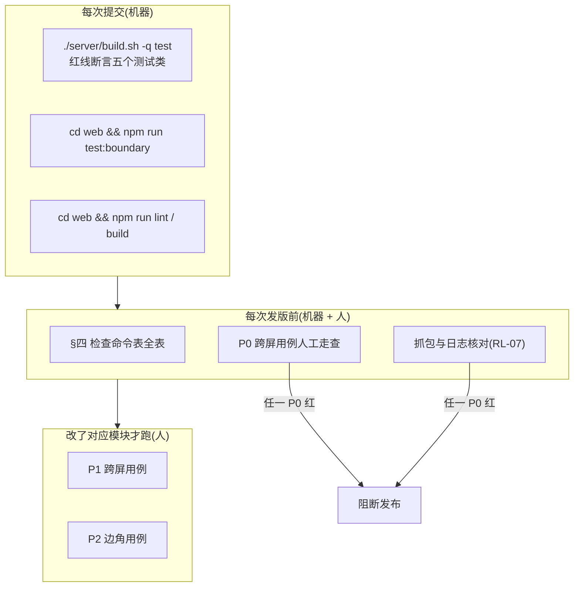

| 什么时候 | 跑什么 | 谁跑 | 红了怎么办 |
|---|---|---|---|
| **每次提交** | §四 表里标「机器 · 提交时」的全部命令 | CI / 本地提交钩子 | 提交不进去 |
| **每次发版前** | §四 全表 + 全部 `P0` 跨屏用例 + `RL-07` 抓包与日志核对 | 一个人,照表走一遍 | **阻断发布**,不许「先上再修」 |
| **改了某一屏** | 那一屏被卷进的跨屏用例(用 §5.1 反查) | 改的人自己 | 同版本内修 |
| **改了某条红线相关的代码** | 那条红线整节 | 改的人 + 一个复核的人 | 阻断合入 |

⚠️ **红线用例不许「按需跑」。** `RL-04` `RL-07` `RL-08` 的机器断言必须挂在每次提交上 ——
一条只在发版前才跑的断言,意味着破口平均要活半个迭代才被发现。

⚠️ **每一条断言都必须红过一次才算数。** 加新用例时先把被测处改坏,确认变红,再改回来。
没红过的断言与没有断言,事后是分不清的。

---

## 二、跨屏旅程用例

### 2.1 J-A 第一次用:装完到看见第一条

**首启先过登录门,登录之后可以全程离线。** 这是必须跑通的路径,**任何一条红了,产品就没法开始用**。

⚠️ **2026-09-02 用户裁定「没有本地模式」。** 未登录只能看到产品说明与登录门,
**不能记、不能看盲区、不能导出**;登录从「出口」变成「入口」 —— 不登录不能记,能记的一定已登录。
`J-002` `J-007` `J-012` 的断言按新形态**反过来写**,ID 不回收。
**已登录状态下的离线可用性完全不变**(见 §2.8 J-H)。


| # | 旅程 | 前置(Given) | 操作(When) | 预期(Then,必须可观察) | 覆盖屏 | 关联规格与编号 | 端 | 优先级 |
|---|---|---|---|---|---|---|---|---|
| `J-001` | J-A | 全新安装,首启登录已完成,零数据 | 打开 `S-HOME` | 一区出现原文「今天还没记」;最近记录区整块不渲染;主按钮「记一条」可点 | `S-HOME` | [记一次学习](记一次学习.md) §2.3 | 全端 | P0 |
| `J-002` | J-A | 全新安装,尚未登录 | 打开后不做任何操作,截屏比对 | **先出现首启说明屏**:产品说明三句 + 底部登录入口,**没有跳过入口**;除登录门外屏幕上**没有**引导蒙层、小红点、未读计数 | `S-LOGIN` | [登录与账号](登录与账号.md) §1.1 · [用户侧功能规格 · 总纲](INDEX.md) §2.2 | 全端 | P0 |
| `J-003` | J-A | 处在 `S-HOME` 空态 | 点主按钮「记一条」 | 进入 `S-REC` 手写模式;输入框已聚焦、键盘已唤起;占位符原文「刚才碰了什么?一句话就行」 | `S-HOME`→`S-REC` | [记一次学习](记一次学习.md) §3.2 · [用户侧功能规格 · 总纲](INDEX.md) §2.4 | 全端 | P0 |
| `J-004` | J-A | 在 `S-REC`,输入框为空 | 观察主按钮 | 「记下」禁用;输入任意一个字后立刻变可点 | `S-REC` | [记一次学习](记一次学习.md) §3.2 | 全端 | P1 |
| `J-005` | J-A | 输入了一句话,来源不填 | 点「记下」 | Toast 原文「已记下」并在 2 秒内消失;`S-HOME` 一区变成「今天记了 1 条」 | `S-REC`→`S-HOME` | [记一次学习](记一次学习.md) §五 · [用户侧功能规格 · 总纲](INDEX.md) §2.2 | 全端 | P0 |
| `J-006` | J-A | 刚记完 1 条 | 点 `S-HOME` 一区那个数字 | 进入 `S-TL`,当天分组小标题原文「今天」,第一行是刚记的那条,时间等于点「记下」的时刻 | `S-HOME`→`S-TL` | [记一次学习](记一次学习.md) §四 | 全端 | P0 |
| `J-007` | J-A | 全程未登录 | 依次尝试打开 `S-HOME`→`S-REC`→`S-TL` | **三屏一屏都进不去**,一直停在首启说明屏与登录门;**不能记、不能看盲区、不能导出**;门上**没有任何跳过入口**,也没有「解锁」「升级」「体验版」字样 | `S-LOGIN` `S-HOME` `S-REC` `S-TL` | [登录与账号](登录与账号.md) §1.1 | 全端 | P0 |
| `J-008` | J-A | 骨架尚未建好的科目 | 记一条 | 卡片小字原文「这个科目的考点表还没建好,先记着」;记录仍出现在 `S-TL` | `S-REC`→`S-TL` | [记一次学习](记一次学习.md) `R-13` | 全端 | P0 |
| `J-009` | J-A | 处在 `S-HOME` | 点「本来该记,但懒了」一次 | 二区数字变成「今天有 1 次没记」;Toast 原文「记下了」;**不弹表单、不问原因、无评价性文字** | `S-HOME` | [记一次学习](记一次学习.md) §2.2 | 全端 | P1 |
| `J-010` | J-A | 在 `S-REC` 有内容 | 把时间改到明天,点「记下」 | 就地提示原文「时间不能选到以后」;不发请求;输入内容保留 | `S-REC` | [记一次学习](记一次学习.md) `R-17` | 全端 | P2 |
| `J-011` | J-A | 首次使用 | 点 `S-HOME` 的「看盲区」 | 进入 `S-BLIND` 呈现空态而非错误态;文案是「这个科目的考点表还没建好」或「你还没记过东西,所以现在整张表都是没碰过」二选一 | `S-HOME`→`S-BLIND` | [看盲区](看盲区.md) §2.4 · [记一次学习](记一次学习.md) §2.1 | 全端 | P1 |
| `J-012` | J-A | 首次使用,尚未登录,全程断网 | 打开应用 | 停在登录门,门上直说原文「登录这一步必须联网」;**不出现任何「可以先用、以后再登录」的说法**;联网并登录成功后才进 `S-HOME`。**已登录后的离线可用性另验,见 §2.8 `J-098`–`J-100`** | `S-LOGIN` | [用户侧功能规格 · 总纲](INDEX.md) §2.5 · [登录与账号](登录与账号.md) §1.1 | 全端 | P0 |

### 2.2 J-B 记录到盲区的完整闭环

**覆盖度的前后一致性是重点。** 记录数、待确认数、已确认数、概览计数、榜单条数这五个数
在同一时刻必须互相说得通;说不通就是覆盖度失真,而覆盖度是这个产品唯一的产出。

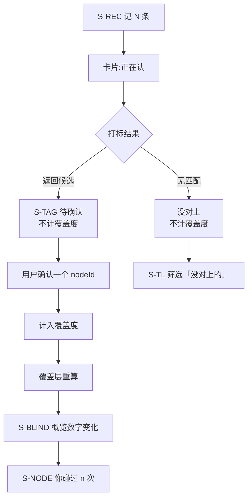

| # | 旅程 | 前置(Given) | 操作(When) | 预期(Then,必须可观察) | 覆盖屏 | 关联规格与编号 | 端 | 优先级 |
|---|---|---|---|---|---|---|---|---|
| `J-013` | J-B | 骨架就绪,概览记为「碰过 a 个」 | 记 1 条自动打标,**停在待确认不点** | 概览仍是「碰过 a 个」 —— **待确认不计覆盖度** | `S-REC`→`S-BLIND` | [打标与未分类](打标与未分类.md) §二 | 全端 | P0 |
| `J-014` | J-B | 承上,该条有候选 | 进 `S-TAG` 点中一个候选(该考点此前未碰过) | Toast 原文「已对上」;自动前进到下一条;`S-BLIND` 概览变成「碰过 a+1 个」 | `S-TAG`→`S-BLIND` | [打标与未分类](打标与未分类.md) §3.3 · [看盲区](看盲区.md) §2.1 | 全端 | P0 |
| `J-015` | J-B | 确认的是**此前已碰过**的考点 | 回 `S-BLIND` 再进 `S-NODE` | 概览「碰过」数字**不变**;`S-NODE` 上「你碰过」次数 +1 | `S-TAG`→`S-BLIND`→`S-NODE` | [看盲区](看盲区.md) §3.1 | 全端 | P0 |
| `J-016` | J-B | 一个考点上已有 2 条记录 | 进 `S-NODE` | 「我的相关记录」列出 2 行且时间倒序;「你碰过 2 次,最近 {d} 天前」的 `{d}` 等于最新那条的时间差 | `S-NODE` | [看盲区](看盲区.md) §3.1 | 全端 | P0 |
| `J-017` | J-B | 有已会断言,概览与榜单条数不一致 | 打开 `S-BLIND` | 概览数字下方出现原文「其中 {n} 个你标了『已经会了』,没在下面列出来」,`{n}` 等于断言数 | `S-BLIND` | [看盲区](看盲区.md) §2.3 · `B-02` | 全端 | P0 |
| `J-018` | J-B | 在 `S-NODE` 上 | 点「我已经会了」 | 该考点立刻置灰,Toast 原文「标了『已经会了』」;返回 `S-BLIND` 后该行从榜里消失,概览「没碰过」计数**不变** | `S-NODE`→`S-BLIND` | [看盲区](看盲区.md) §2.3 · §3.2 | 全端 | P0 |
| `J-019` | J-B | 承上,断言已生效 | 再点一次取消 | 不出现二次确认浮层;该行重新出现在榜里;断言归零时那行解释小字消失 | `S-NODE`→`S-BLIND` | [看盲区](看盲区.md) §3.2 | 全端 | P1 |
| `J-020` | J-B | 断言写入时网络失败 | 点「我已经会了」 | 乐观更新后**回滚**,考点恢复原样;Toast 原文「没标上,再试一次」;`S-BLIND` 数字未变 | `S-NODE`→`S-BLIND` | [看盲区](看盲区.md) `B-04` | 全端 | P1 |
| `J-021` | J-B | `S-TL` 有一条已确认标签的记录 | 左滑删除,浮层原文「删了就没了,和它一起的标签也会删掉」 | `S-NODE`「你碰过」次数 -1,归零则变成原文「你没碰过」;`S-BLIND` 概览「碰过」数同步减 1 | `S-TL`→`S-NODE`→`S-BLIND` | [记一次学习](记一次学习.md) §四 | 全端 | P0 |
| `J-022` | J-B | 覆盖层正在重算 | 打开 `S-BLIND` | 显示**上一次的数字** + 小字原文「正在重新算」;**不清空、不显示错误态** | `S-BLIND` | [看盲区](看盲区.md) `B-03` · §2.5 | 全端 | P0 |
| `J-023` | J-B | 记了 5 条:3 条已确认、1 条没对上、1 条待确认 | 分别看 `S-TL` 与 `S-BLIND` | `S-TL` 显示 5 条;筛选「没对上的」显示 1 条;覆盖度只反映那 3 条 —— **五个数互相说得通** | `S-TL`→`S-BLIND` | [打标与未分类](打标与未分类.md) §二 | 全端 | P0 |
| `J-024` | J-B | 某二级章节下 4 个考点碰过 1 个 | 进「按章看全部」 | 该章节右侧出现原文「1/4」;**没有百分号、没有进度条** | `S-BLIND`→骨架树 | [看盲区](看盲区.md) §四 | 全端 | P0 |
| `J-025` | J-B | 在骨架树里 | 搜一个考点名的一部分 | 只匹配考点名称;**不返回任何按记录内容匹配的结果** | 骨架树 | [看盲区](看盲区.md) §四 | 全端 | P1 |
| `J-026` | J-B | 网络失败但有上一次缓存 | 打开 `S-BLIND` | 显示缓存 + 标记原文「这是刚才的数据」;**不是空白、不是错误态** | `S-BLIND` | [看盲区](看盲区.md) `B-07` · §2.5 | 全端 | P1 |
| `J-027` | J-B | 从 `S-BLIND` 滚到中段进 `S-NODE` | 返回 | 回到 `S-BLIND` 并**保持滚动位置**,不跳回顶部 | `S-BLIND`↔`S-NODE` | [看盲区](看盲区.md) §3.2 | 全端 | P2 |

### 2.3 J-C 打标失败的四条支路

**四条支路各自走到底,记录始终在。** 这是同一个动作的四种结局,
[打标与未分类](打标与未分类.md) §二 已把它们分成不同状态,**文案不许合并**。

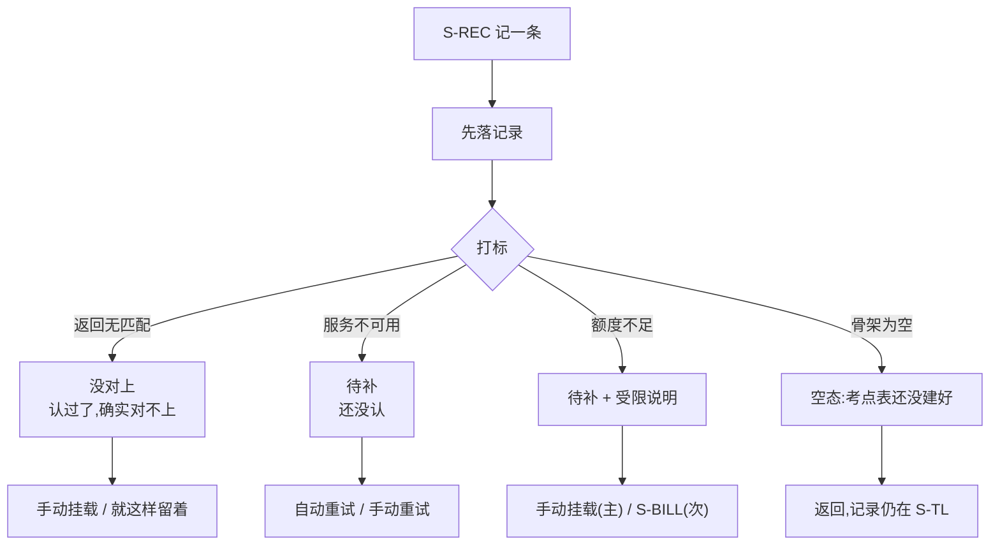

| # | 旅程 | 前置(Given) | 操作(When) | 预期(Then,必须可观察) | 覆盖屏 | 关联规格与编号 | 端 | 优先级 |
|---|---|---|---|---|---|---|---|---|
| `J-028` | J-C 没对上 | 打标服务返回无匹配 | 记一条后看 `S-TL` 卡片 | 状态徽标原文「这条没能对上任何考点」;**不是**「识别失败」;记录完整可见 | `S-REC`→`S-TL` | [打标与未分类](打标与未分类.md) `T-03` · §一 | 全端 | P0 |
| `J-029` | J-C 没对上 | 承上 | 在 `S-TL` 筛选「没对上的」 | 这条出现在结果里;筛选器只有「全部」「没对上的」两项,**没有第三个** | `S-TL` | [记一次学习](记一次学习.md) §四 | 全端 | P1 |
| `J-030` | J-C 没对上 | 承上 | 进 `S-TAG` 点「自己挑一个」选一个叶子 | 挂载成功;`S-TL` 状态变成「已对上:{考点名}」;`S-BLIND` 覆盖度相应变化 | `S-TL`→`S-TAG`→`S-BLIND` | [打标与未分类](打标与未分类.md) §3.3 · §3.4 | 全端 | P0 |
| `J-031` | J-C 没对上 | 点「都不是」丢弃全部候选 | 再找回 | 卡片内出现「看看丢掉的」,可恢复;记录始终可见 | `S-TL`→`S-TAG` | [打标与未分类](打标与未分类.md) `T-04` | 全端 | P2 |
| `J-032` | J-C 待补 | 分类服务不可用 | 记一条 | 卡片状态原文「稍后再认」;记录在 `S-TL` 可见;有重试入口 | `S-REC`→`S-TL` | [打标与未分类](打标与未分类.md) `T-01` | 全端 | P0 |
| `J-033` | J-C 待补 | 承上,服务恢复 | 点重试或等自动重试 | 状态从「稍后再认」变为候选行或「这条没能对上任何考点」;**不需要重新记一遍** | `S-TL`→`S-TAG` | [打标与未分类](打标与未分类.md) `T-01` | 全端 | P0 |
| `J-034` | J-C 待补 | 「待补」与「没对上」各有一条 | 同屏对比两张卡片 | 两条文案**不同**:一条「稍后再认」,一条「这条没能对上任何考点」 | `S-TL` | [打标与未分类](打标与未分类.md) §二 ⚠️ | 全端 | P0 |
| `J-035` | J-C 额度不足 | AI 额度为 0 | 用语音或拍照记一条 | 记录落下;受限说明原文「这个月 AI 次数用完了,可以自己挑一个考点」;**主入口是手动挂载** | `S-REC`→`S-TL` | [打标与未分类](打标与未分类.md) `T-02` · [记一次学习](记一次学习.md) `R-12` | 全端 | P0 |
| `J-036` | J-C 额度不足 | 承上 | 点手动挂载走到底 | 挂载成功,覆盖度变化;**整条路径没有支付浮层** | `S-TL`→`S-TAG`→`S-BLIND` | [额度与购买](额度与购买.md) §一 · §3.3 | 全端 | P0 |
| `J-037` | J-C 骨架未建好 | 该科目骨架为空 | 记一条后点卡片想挂载 | `S-TAG` 空态原文「考点表还没建好,先记着,建好了再来挂」;有返回入口 | `S-REC`→`S-TAG` | [打标与未分类](打标与未分类.md) `T-08` | 全端 | P0 |
| `J-038` | J-C 骨架未建好 | 承上 | 返回 `S-TL` | 那条记录仍在,内容与时间完整 | `S-TAG`→`S-TL` | [记一次学习](记一次学习.md) `R-13` | 全端 | P0 |
| `J-039` | J-C 骨架未建好 | 骨架随后建好了 | 再进 `S-TAG` 挂载 | 能挂上;**不要求用户重记** | `S-TAG`→`S-BLIND` | [打标与未分类](打标与未分类.md) §3.4 | 全端 | P1 |
| `J-040` | J-C | 在 `S-TAG` 队列中 | 点「跳过这条」 | 不发任何请求;进入下一条;该条状态不变 | `S-TAG` | [打标与未分类](打标与未分类.md) §3.3 | 全端 | P2 |
| `J-041` | J-C | 确认途中该记录已被别的端删掉 | 点某个候选 | Toast 原文「这条记录已经删了」;自动回列表,**不停留在一个已不存在的记录上** | `S-TAG`→`S-TL` | [打标与未分类](打标与未分类.md) `T-05` | 全端 | P1 |
| `J-042` | J-C | 骨架树在打标之后更新过 | 在 `S-TAG` 挂载 | 提示原文「考点表更新了,重新挑一次」;重挑后能挂上 | `S-TAG` | [打标与未分类](打标与未分类.md) `T-06` | 全端 | P1 |
| `J-043` | J-C | 处理到队列最后一条 | 确认它 | 空态原文「都处理完了」+「回时间线」入口 | `S-TAG`→`S-TL` | [打标与未分类](打标与未分类.md) §3.3 | 全端 | P2 |

### 2.4 J-D 登录入口与回跳

✅ **2026-09-02 用户裁定「没有本地模式」,这条旅程的 ⏸ 解除,方式是前提消失。**
原来卡住整条旅程的 [登录与账号](登录与账号.md) `L-4`(本机模式记的数据在登录后怎么办)
**一并作废** —— 登录已前置到首启,**登录前不产生数据**,就没有「这批数据去哪」这个问题;
它在 [设置与原图](设置与原图.md) `G-3` 的另一面同理。

**本节今天只剩三类仍然成立的用例:首启登录、令牌失效后的重新登录与回跳、微信登录后的绑手机提示。**
依附 `L-4` 的 `J-049` – `J-054`、依附「先不登录」那一行的 `J-045`,
**保留 ID 并逐条标作废,号不回收**(§1.4)。

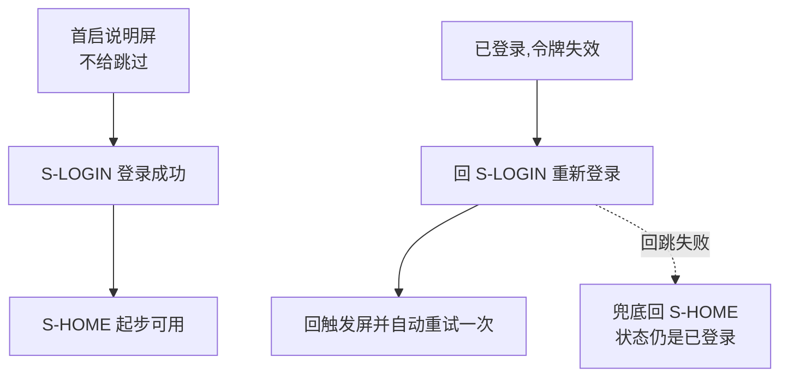

| # | 旅程 | 前置(Given) | 操作(When) | 预期(Then,必须可观察) | 覆盖屏 | 关联规格与编号 | 端 | 优先级 |
|---|---|---|---|---|---|---|---|---|
| `J-044` | J-D 首启 | 全新安装,尚未登录 | 打开应用,读首启说明屏底部那个入口 | 进入 `S-LOGIN`,副标题原文「登录后,这台设备和别的设备记的东西会算成同一个人」;**这是唯一的入口,没有跳过** | `S-LOGIN` | [登录与账号](登录与账号.md) §2.1 · §2.2 | 全端 | P0 |
| `J-045` | J-D | ~~处在 `S-LOGIN`~~ | ~~点「先不登录,继续用」~~ | **已作废 · 2026-09-02 取消本机模式**:「先不登录,继续用」这一行已删除,连同它的常驻/永不禁用/焦点顺序/对比度约束 | `S-LOGIN` | [登录与账号](登录与账号.md) §2.2 | 全端 | 已作废 |
| `J-046` | J-D 回跳 | 已登录,令牌失效后在 `S-EXP` 点「让 AI 代发」被要求重新登录 | 登录成功 | 自动回 `S-EXP` 并**自动重试代发**,不需要再点一次 | `S-EXP`→`S-LOGIN`→`S-EXP` | [登录与账号](登录与账号.md) §2.1 | 全端 | P0 |
| `J-047` | J-D 回跳 | 已登录,令牌失效后在 `S-BILL` 选了某档位被要求重新登录 | 登录成功 | 回 `S-BILL` 且**所选档位仍然选中**,不用重新挑 | `S-BILL`→`S-LOGIN`→`S-BILL` | [登录与账号](登录与账号.md) §2.1 | 全端 | P1 |
| `J-048` | J-D 回跳 | 登录成功但回跳失败 | 观察落点 | 兜底回 `S-HOME`;账号状态是**已登录**,**不重复走一次登录** | `S-LOGIN`→`S-HOME` | [登录与账号](登录与账号.md) `E-14` | 全端 | P1 |
| `J-049` | J-D | ~~本机 N 条,登录一个全新账号~~ | ~~登录成功~~ | **已裁定 · 作废(不存在本机模式,登录前不产生数据)** —— `L-4` 三种可能的共同前提消失 | `S-LOGIN`→`S-TL`→`S-BLIND` | [登录与账号](登录与账号.md) `L-4` | 全端 | 已作废 |
| `J-050` | J-D | ~~承上,上传途中断网~~ | ~~恢复网络~~ | **已裁定 · 作废(不存在本机模式,登录前不产生数据)** —— 没有「登录时要并进去的那批本机数据」 | `S-TL` | [登录与账号](登录与账号.md) `L-4` · [用户侧功能规格 · 总纲](INDEX.md) §2.5 | 全端 | 已作废 |
| `J-051` | J-D | ~~本机 N 条,登录成功~~ | ~~观察~~ | **已裁定 · 作废(不存在本机模式,登录前不产生数据)** —— 不会有「要不要上传」这个浮层 | `S-LOGIN` | [登录与账号](登录与账号.md) `L-4` · [用户侧功能规格 · 总纲](INDEX.md) §2.2 | 全端 | 已作废 |
| `J-052` | J-D | ~~承上,用户选「不上传」~~ | ~~观察 `S-TL`~~ | **已裁定 · 作废(不存在本机模式,登录前不产生数据)** —— 没有可选「不上传」的那份数据 | `S-TL` | [登录与账号](登录与账号.md) `L-4` | 全端 | 已作废 |
| `J-053` | J-D | ~~本机 N 条,登录成功~~ | ~~观察 `S-TL` 与 `S-BLIND`~~ | **已裁定 · 作废(不存在本机模式,登录前不产生数据)** —— 不存在「哪些是这台设备的、哪些是账号的」两份数据 | `S-TL`→`S-BLIND` | [登录与账号](登录与账号.md) `L-4` | 全端 | 已作废 |
| `J-054` | J-D | ~~承上~~ | ~~退出登录~~ | **已裁定 · 作废(不存在本机模式,登录前不产生数据)** —— 退出后的落点改为未登录的登录门,见 `J-119` `J-120` | `S-ACC`→`S-TL` | [登录与账号](登录与账号.md) §四 | 全端 | 已作废 |
| `J-055` | J-D | 令牌过期后的任一请求触发登录 | 重新登录成功 | 回触发屏并**自动重试一次**;用户不需要重走刚才的操作 | 任意→`S-LOGIN`→原屏 | [登录与账号](登录与账号.md) §2.1 · `E-22` · [用户侧功能规格 · 总纲](INDEX.md) §三 | 全端 | P0 |
| `J-056` | J-D | 微信登录成功但未绑手机 | 打开 `S-ACC` | 顶部一行原文「绑定手机号后,换设备也能看到这些记录」;**不弹窗、不拦路** | `S-LOGIN`→`S-ACC` | [登录与账号](登录与账号.md) §三 | 小程序·App | P1 |

### 2.5 J-E 账号合并:数字必须对得上

**这是全产品唯一一处刻意不给退路的地方**([登录与账号](登录与账号.md) §五),
所以用例重点全在**合并前后的数字一致性**上 —— 预览说的 `{n}` 条与 `{b}` 个考点,合并后必须真的是那两个数。

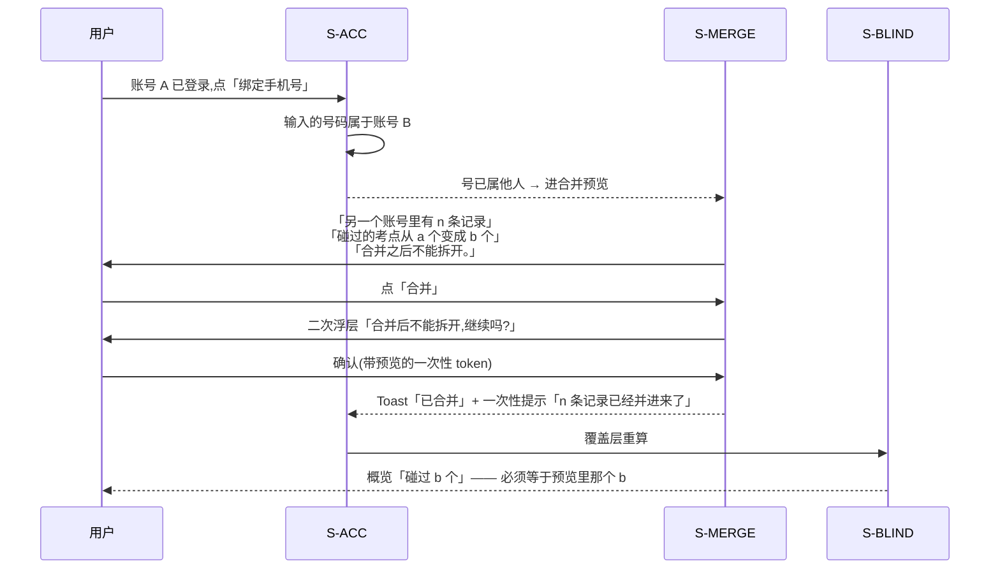

| # | 旅程 | 前置(Given) | 操作(When) | 预期(Then,必须可观察) | 覆盖屏 | 关联规格与编号 | 端 | 优先级 |
|---|---|---|---|---|---|---|---|---|
| `J-057` | J-E | 账号 A 已登录,账号 B 有 n 条记录 | 在 `S-ACC` 绑定 B 的手机号 | 进入 `S-MERGE` 预览;标题原文「这个手机号已经有记录了」 | `S-ACC`→`S-MERGE` | [登录与账号](登录与账号.md) §5.1 · `E-18` | 全端 | P0 |
| `J-058` | J-E | 处在预览 | 阅读主信息 | 出现「另一个账号里有 **{n} 条记录**,最早 {date},最近 {date}」,三个值都不是占位符 | `S-MERGE` | [登录与账号](登录与账号.md) §5.1 | 全端 | P0 |
| `J-059` | J-E | 处在预览 | 阅读变化说明 | 出现「碰过的考点从 **{a} 个**变成 **{b} 个**」;`{a}` 等于合并前 `S-BLIND` 概览的当前值 | `S-MERGE`↔`S-BLIND` | [登录与账号](登录与账号.md) §5.1 · [看盲区](看盲区.md) §2.1 | 全端 | P0 |
| `J-060` | J-E | 处在预览 | 观察不可逆声明的排版 | 原文「**合并之后不能拆开。**」**独立一行**,不与其他文字混排 | `S-MERGE` | [登录与账号](登录与账号.md) §5.1 🔴 | 全端 | P0 |
| `J-061` | J-E | 处在预览 | 点「合并」 | 弹出二次浮层,只有一句「合并后不能拆开,继续吗?」+「合并」/「再想想」 | `S-MERGE` | [登录与账号](登录与账号.md) §5.1 | 全端 | P0 |
| `J-062` | J-E | 二次浮层已弹出 | 点「再想想」 | 回到预览,**没有任何写入发生**;账号 B 的记录数不变 | `S-MERGE` | [登录与账号](登录与账号.md) §5.1 | 全端 | P0 |
| `J-063` | J-E | 合并已执行完成 | 观察 `S-ACC` | Toast 原文「已合并」;顶部出现一次性提示「{n} 条记录已经并进来了」;**再次进入不再显示** | `S-MERGE`→`S-ACC` | [登录与账号](登录与账号.md) §5.2 | 全端 | P0 |
| `J-064` | J-E | 合并刚完成,重算中 | 打开 `S-BLIND` | 显示原文「正在重新算,稍等」;**不是旧数字、不是错误态** | `S-ACC`→`S-BLIND` | [登录与账号](登录与账号.md) §5.2 · [看盲区](看盲区.md) `B-03` | 全端 | P0 |
| `J-065` | J-E | 重算完成 | 对比 `S-BLIND` 概览与预览里的 `{b}` | 两个数**完全相等**。不等即视为合并失真,阻断发布 | `S-BLIND` | [登录与账号](登录与账号.md) §5.1 · [看盲区](看盲区.md) §2.1 | 全端 | P0 |
| `J-066` | J-E | 合并完成 | 在 `S-TL` 翻到来自账号 B 的记录 | 时间戳与来源名称**原样保留**,没有被重排、没有被改写成合并时刻 | `S-TL` | [登录与账号](登录与账号.md) §5.2 | 全端 | P0 |
| `J-067` | J-E | 合并完成 | 在 `S-TAG` 看账号 B 带来的未确认标签 | 状态原样保留:待确认仍是待确认,**没有因为合并而被自动确认** | `S-TAG`→`S-BLIND` | [打标与未分类](打标与未分类.md) §二 | 全端 | P0 |
| `J-068` | J-E | 预览之后确认之前 B 又新增了记录 | 点确认 | 浮层原文「刚才那份数据变了,重新看一遍」;回到预览重新拉数 | `S-MERGE` | [登录与账号](登录与账号.md) `E-19` | 全端 | P1 |
| `J-069` | J-E | 合并执行途中断网 | 恢复后重试 | 错误态原文「合并没走完,再试一次」;重试后**记录数不翻倍** —— 幂等 | `S-MERGE`→`S-TL` | [登录与账号](登录与账号.md) `E-20` | 全端 | P0 |
| `J-070` | J-E | 处在预览 | 点「换一个手机号」或直接关闭 | 回到 `S-ACC`,绑定未发生;账号 A 与 B 都不变 | `S-MERGE`→`S-ACC` | [登录与账号](登录与账号.md) §5.1 | 全端 | P1 |
| `J-071` | J-E | 合并完成后 | 找「拆开 / 撤销」入口 | **找不到** —— 产品不做拆分与回滚 | `S-MERGE` `S-ACC` | [登录与账号](登录与账号.md) §5.3 | 全端 | P0 |

### 2.6 J-F 撞额度的三处

**三处撞墙:语音转写、拍照识别、AI 代发。** 共同预期只有一句:
**主按钮永远是免费兜底,且走兜底能把这件事做完。**

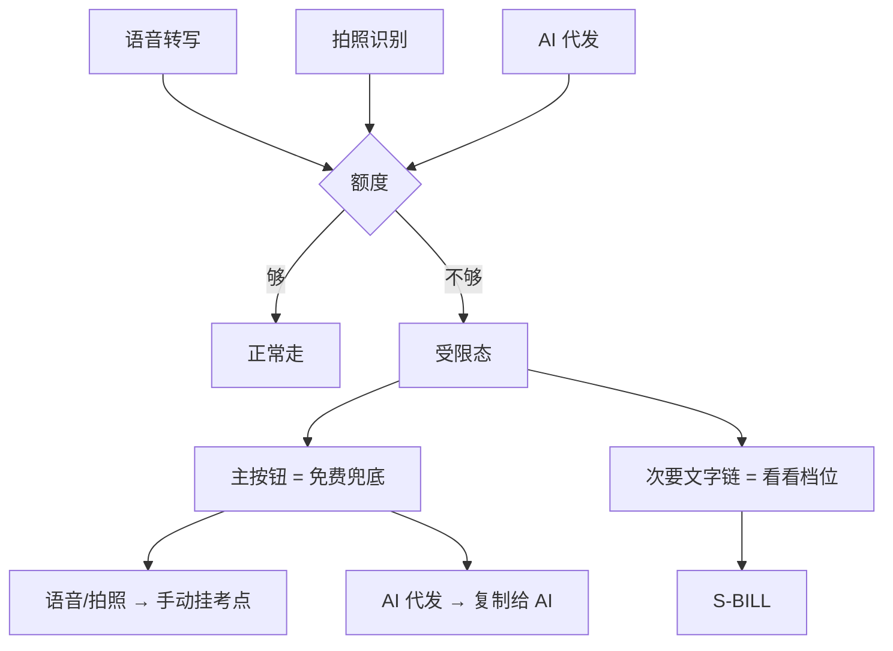

| # | 旅程 | 前置(Given) | 操作(When) | 预期(Then,必须可观察) | 覆盖屏 | 关联规格与编号 | 端 | 优先级 |
|---|---|---|---|---|---|---|---|---|
| `J-072` | J-F 语音 | AI 额度为 0 | 在 `S-REC` 录一段语音并松手 | **先落记录**:卡片立刻出现在 `S-TL`,带时间与「(语音)」标识;随后出现受限说明 | `S-REC`→`S-TL` | [记一次学习](记一次学习.md) §3.3 · `R-12` | 全端 | P0 |
| `J-073` | J-F 语音 | 承上 | 观察受限态的按钮布局 | 主按钮是免费兜底;「看看档位」是**次要文字链**,不是主按钮 | `S-TL` | [额度与购买](额度与购买.md) §3.3 ⚠️ | 全端 | P0 |
| `J-074` | J-F 语音 | 承上 | 点主按钮走兜底到底 | 手动补上文字并挂到一个考点;`S-BLIND` 覆盖度相应变化;**全程没有支付浮层** | `S-TL`→`S-TAG`→`S-BLIND` | [额度与购买](额度与购买.md) §一 | 全端 | P0 |
| `J-075` | J-F 拍照 | AI 额度为 0 | 拍一张照并点「记下」 | 记录落下 + 原图存本机;卡片受限说明出现;`S-RAW` 里能看到这张图 | `S-REC`→`S-TL`→`S-RAW` | [记一次学习](记一次学习.md) §3.4 · `R-12` | 全端 | P0 |
| `J-076` | J-F 拍照 | 承上 | 点手动挂载走到底 | 挂载成功;**整条路径没有付费墙** | `S-TL`→`S-TAG` | [额度与购买](额度与购买.md) §一 | 全端 | P0 |
| `J-077` | J-F 代发 | 已登录,AI 额度为 0 | 在 `S-EXP` 点「让 AI 直接回答」 | 受限态原文「这个月的 AI 次数用完了」;**主入口是「复制给 AI」这条免费路径** | `S-EXP` | [导出与问AI](导出与问AI.md) `X-07` · [额度与购买](额度与购买.md) §3.3 | 全端 | P0 |
| `J-078` | J-F 代发 | 承上 | 点「复制给 AI」 | 文本进剪贴板;预览框内容与复制内容一致;**不消耗额度、不要求付费** | `S-EXP` | [导出与问AI](导出与问AI.md) §一 · §2.3 | 全端 | P0 |
| `J-079` | J-F | 撞额度后点「看看档位」 | 进入 `S-BILL` | 档位、价格、次数**全部来自服务端返回**;拉取失败时原文「档位没拉到」,**屏幕上不出现任何价格数字** | `S-EXP`→`S-BILL` | [额度与购买](额度与购买.md) §3.1 · `P-02` | 全端 | P0 |
| `J-080` | J-F | ~~未登录~~ | ~~打开 `S-BILL`~~ | **已作废 · 2026-09-02 取消本机模式**:未登录只能看到产品说明与登录门,根本进不到 `S-BILL`,不存在这个受限态;令牌失效后的重新登录与档位保持由 `J-047` `J-055` 覆盖 | `S-BILL`→`S-LOGIN`→`S-BILL` | [额度与购买](额度与购买.md) `P-01` · [登录与账号](登录与账号.md) §2.1 | 全端 | 已作废 |
| `J-081` | J-F | 支付成功 | 观察额度与 `S-EXP` | Toast 原文「已到账」;返回 `S-EXP` 后剩余次数已刷新;此前被拦的操作可直接重做 | `S-BILL`→`S-EXP` | [额度与购买](额度与购买.md) §3.2 | 全端 | P1 |
| `J-082` | J-F | 已登录,额度还剩若干次 | 打开 `S-SET` | 出现一行原文「AI 次数:本月还剩 {n} 次」,点进 `S-BILL`;`{n}` 与 `S-BILL` 上一致 | `S-SET`→`S-BILL` | [额度与购买](额度与购买.md) §二 · §3.1 | 全端 | P1 |

### 2.7 J-G 导出与问 AI 的三条出口

**从盲区的某个考点出发,三条出口各自走通,并核对带出去的内容。**
核对内容是本旅程与逐屏规格的差别所在 —— 逐屏规格写了界面,**没人验过导出文件里到底有什么**。

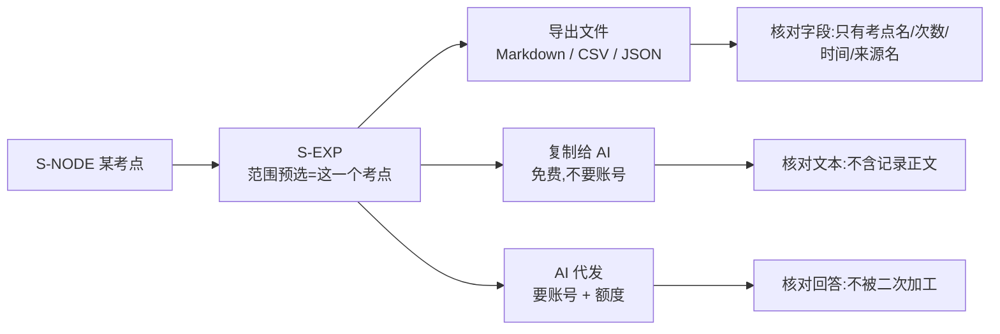

| # | 旅程 | 前置(Given) | 操作(When) | 预期(Then,必须可观察) | 覆盖屏 | 关联规格与编号 | 端 | 优先级 |
|---|---|---|---|---|---|---|---|---|
| `J-083` | J-G | 在 `S-NODE` 某考点上 | 点「把这个考点带去问 AI」 | 进入 `S-EXP`,顶部范围**已预选为这一个考点**,不是「全部」 | `S-NODE`→`S-EXP` | [导出与问AI](导出与问AI.md) §三 · §2.1 | 全端 | P0 |
| `J-084` | J-G | 承上 | 阅读预览框上方那行小字 | 出现原文「这段文字里只有:考点名称、你碰过几次、最近一次多久前、来源名称。**没有任何题目内容。**」 | `S-EXP` | [导出与问AI](导出与问AI.md) §2.2 | 全端 | P0 |
| `J-085` | J-G | 该考点下有 2 条记录,正文里有大段文字 | 阅读预览框内容 | 预览里**只有考点名与我的相关记录时间**;**不出现记录正文的任何一个字** | `S-EXP` | [导出与问AI](导出与问AI.md) §三 · `X-05` | 全端 | P0 |
| `J-086` | J-G | 处在 `S-EXP` | 编辑预览框里一句话再点「复制」 | 剪贴板里是**编辑后**的内容;不弹确认、不还原 | `S-EXP` | [导出与问AI](导出与问AI.md) §2.3 | 全端 | P1 |
| `J-087` | J-G | 已登录,有数据 | 点「导出」选 CSV | 文件正常产出;**不要求付费、不要求邮箱、不出现等待审核**;未登录时这一屏根本进不去 | `S-EXP` | [导出与问AI](导出与问AI.md) §一 · §2.4 | 全端 | P0 |
| `J-088` | J-G | CSV 已下载 | 用文本编辑器打开核对表头 | 表头只有:名称 · 章节 · 出现次数 · 我碰过几次 · 最近时间;**没有第六列** | `S-EXP` → 文件 | [导出与问AI](导出与问AI.md) §2.4 | 全端 | P0 |
| `J-089` | J-G | 导出 JSON | 核对记录列表部分 | 没有任何键的值是长文本正文;所有值都能归到「考点名 / 计数 / 时间 / 来源名」四类 | `S-EXP` → 文件 | [导出与问AI](导出与问AI.md) §2.4 · §2.2 | 全端 | P0 |
| `J-090` | J-G | 导出 Markdown | 打开核对结构 | 按章节分层的清单,层级与骨架树一致;**没有任何讲解性段落** | `S-EXP` → 文件 | [导出与问AI](导出与问AI.md) §2.4 | 全端 | P0 |
| `J-091` | J-G | 在小程序端(⏸ 端未就绪) | 点「导出」 | ⏸ 改为「复制全文」+ 说明原文「这个端不能下载文件,已经帮你复制了」 | `S-EXP` | [导出与问AI](导出与问AI.md) `X-03` | 小程序·App | P1 |
| `J-092` | J-G | 已登录,额度充足 | 点「让 AI 直接回答」 | 流式显示回答;底部一行小字原文「这是你接的模型给的回答」 | `S-EXP` | [导出与问AI](导出与问AI.md) §2.5 | 全端 | P0 |
| `J-093` | J-G | 模型的回答里出现了讲解性内容 | 观察产品对它做了什么 | 回答**原样显示、可复制**;**没有**被二次加工成任何计划或建议;**没有**被存成结构化条目 | `S-EXP` | [导出与问AI](导出与问AI.md) §2.5 🔴 | 全端 | P0 |
| `J-094` | J-G | 代发时模型调用超时 | 观察额度 | 错误态原文「模型没回,这次没算次数」;剩余次数**与调用前相同** | `S-EXP`→`S-BILL` | [导出与问AI](导出与问AI.md) `X-08` · §2.5 | 全端 | P0 |
| `J-095` | J-G | 范围选「全部」,数据量很大 | 点「导出」 | 先 Toast 原文「正在准备」,界面不阻塞;完成后触发下载 | `S-EXP` | [导出与问AI](导出与问AI.md) §2.4 | 全端 | P1 |
| `J-096` | J-G ⏸ | 预览文本超长 | 点「复制」 | ⏸ 待裁定([导出与问AI](导出与问AI.md) `X-1`):裁定前只能验「提示原文『太长了,先选一个科目』出现」,验不了阈值 | `S-EXP` | [导出与问AI](导出与问AI.md) `X-04` · `X-1` | 全端 | P1 |
| `J-097` | J-G | 完全没有数据 | 打开 `S-EXP` | 空态原文「还没有可以导出的东西」+「去记一条」入口 | `S-EXP`→`S-REC` | [导出与问AI](导出与问AI.md) `X-01` | 全端 | P1 |

### 2.8 J-H 离线到联网

**离线时能做的事,[用户侧功能规格 · 总纲](INDEX.md) §2.5 列了五屏:`S-HOME` `S-REC` `S-TL` `S-SET` `S-RAW`。**
`S-BLIND` 不在这张表里 —— 它离线时是什么样,没有一处说法(登记为 §六 `K-3`)。

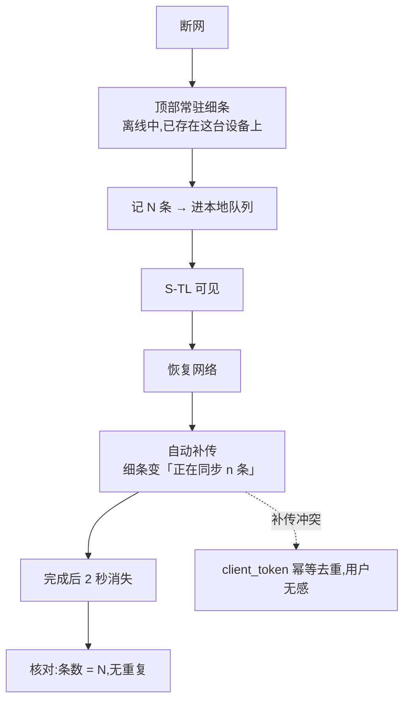

| # | 旅程 | 前置(Given) | 操作(When) | 预期(Then,必须可观察) | 覆盖屏 | 关联规格与编号 | 端 | 优先级 |
|---|---|---|---|---|---|---|---|---|
| `J-098` | J-H | 已登录,断开网络 | 打开 `S-HOME` | 顶部出现常驻细条,原文「离线中,已存在这台设备上,联网后自动同步」 | `S-HOME` | [用户侧功能规格 · 总纲](INDEX.md) §2.5 | 全端 | P0 |
| `J-099` | J-H | 离线中 | 记 3 条(手写) | 3 条都落下;`S-HOME` 显示「今天记了 3 条」;`S-TL` 3 行都在 | `S-REC`→`S-HOME`→`S-TL` | [记一次学习](记一次学习.md) `R-01` | 全端 | P0 |
| `J-100` | J-H | 离线中 | 打开 `S-SET` 与 `S-RAW` | 两屏照常可用;`S-RAW` 能看图、能删图 | `S-SET` `S-RAW` | [用户侧功能规格 · 总纲](INDEX.md) §2.5 · [设置与原图](设置与原图.md) §三 | 全端 | P1 |
| `J-101` | J-H ⏸ | 离线中 | 打开 `S-BLIND` | ⏸ 待裁定(§六 `K-3`)。**裁定前只验下限:不出现英文错误码、不出现堆栈、不无限转圈** | `S-BLIND` | [用户侧功能规格 · 总纲](INDEX.md) §2.1 · §2.5 | 全端 | P1 |
| `J-102` | J-H | 离线记了 3 条 | 恢复网络,不做任何操作 | 细条自动变成原文「正在同步 3 条」;**用户不需要点任何按钮** | `S-HOME` | [用户侧功能规格 · 总纲](INDEX.md) §2.5 | 全端 | P0 |
| `J-103` | J-H | 承上,同步完成 | 观察细条与 `S-TL` | 细条在 2 秒内消失;`S-TL` 仍是 3 条,**不是 6 条** | `S-HOME`→`S-TL` | [用户侧功能规格 · 总纲](INDEX.md) §2.5 · [记一次学习](记一次学习.md) `R-15` | 全端 | P0 |
| `J-104` | J-H | 补传过程中再次断网 | 恢复网络 | 剩余部分继续补传;`S-TL` 最终条数等于离线时记的条数,**一条不多一条不少** | `S-TL` | [记一次学习](记一次学习.md) `R-15` | 全端 | P0 |
| `J-105` | J-H | 补传成功后同一批被客户端重发一次 | 观察 `S-TL` | 静默去重,无提示、无重复行 —— `client_token` 幂等 | `S-TL` | [记一次学习](记一次学习.md) `R-15` · [技术架构与接口契约](../../technical/INDEX.md) §6.2 | 全端 | P0 |
| `J-106` | J-H | 离线记的记录补传完成 | 打开 `S-TAG` 与 `S-BLIND` | 这些记录开始走打标;覆盖度在打标确认后才变,**不因为补传本身而变** | `S-TL`→`S-TAG`→`S-BLIND` | [打标与未分类](打标与未分类.md) §二 | 全端 | P0 |
| `J-107` | J-H | 请求超时(超过总纲规定的时限) | 观察界面 | 按错误态处理,出现重试按钮;**不无限转圈** | 任意 | [用户侧功能规格 · 总纲](INDEX.md) §2.5(时限真源) | 全端 | P1 |
| `J-108` | J-H | 离线时用批量补录提交一批 | 恢复网络 | 整批补传;补传结果**逐条**可见,不是只有一个整体状态 | `S-REC`→`S-TL` | [记一次学习](记一次学习.md) §七 · §3.5 | 全端 | P1 |

### 2.9 J-I 换设备与多端:原图不跟着走

🔴 **这条旅程有一条专门的用例:数据跟着账号走,原图不跟着走。**
用户会遇到「我明明存过,这边一张都没有」([设置与原图](设置与原图.md) §3.4),
**这不是缺陷,是红线的直接后果,界面必须替产品把这句话说出来**。

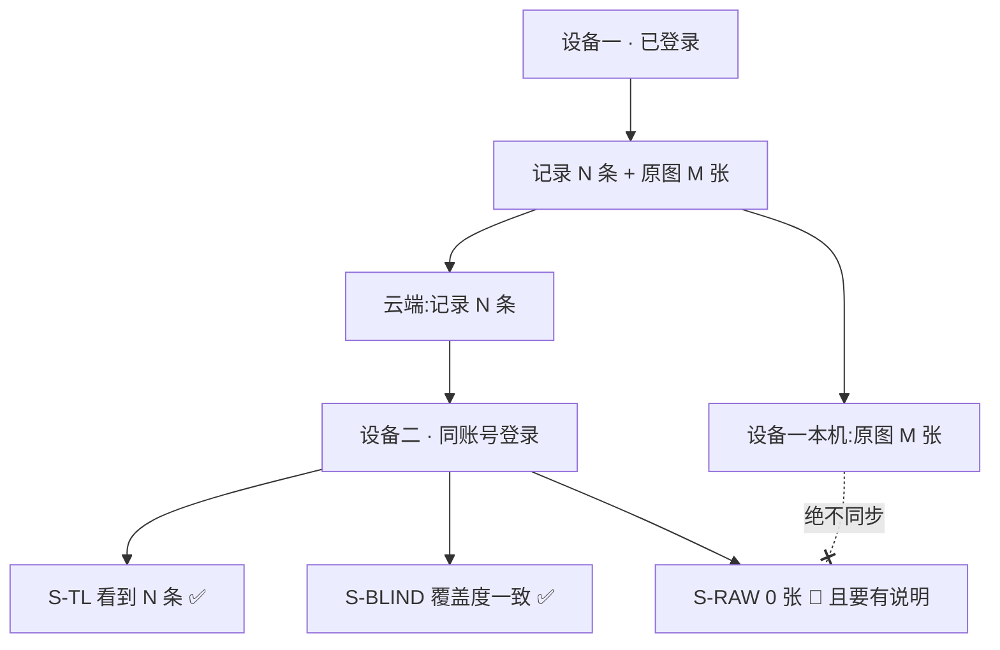

| # | 旅程 | 前置(Given) | 操作(When) | 预期(Then,必须可观察) | 覆盖屏 | 关联规格与编号 | 端 | 优先级 |
|---|---|---|---|---|---|---|---|---|
| `J-109` | J-I | 设备一已登录并记了 N 条 | 在设备二用同账号登录 | `S-TL` 显示同样的 N 条,时间与来源名一致 | `S-LOGIN`→`S-TL` | [登录与账号](登录与账号.md) §一 · [用户侧功能规格 · 总纲](INDEX.md) §四 | 全端 | P0 |
| `J-110` | J-I | 承上 | 在设备二打开 `S-BLIND` | 概览三个数字与设备一**完全相等** | `S-BLIND` | [看盲区](看盲区.md) §2.1 | 全端 | P0 |
| `J-111` | J-I 🔴 | 设备一本机有 M 张原图(M>0) | 在设备二打开 `S-RAW` | 显示原文「这台设备上还没有原图」;**0 张**;没有「同步」「恢复」「从云端拉取」任何入口 | `S-RAW` | [设置与原图](设置与原图.md) §3.2 · §3.3 🔴 | 全端 | P0 |
| `J-112` | J-I 🔴 | 承上 | 阅读设备二 `S-RAW` 顶部常驻说明 | 出现原文「这些图只在这台设备上。换设备看不到,也没有任何地方备份。」 | `S-RAW` | [设置与原图](设置与原图.md) §3.2 | 全端 | P0 |
| `J-113` | J-I | 设备二的记录里有当初带图的那条 | 点开该记录 | 记录本身完整(时间 / 内容 / 来源 / 标签);原图位置为空,**不显示破图、不报错** | `S-TL`→`S-RAW` | [设置与原图](设置与原图.md) §3.1 · [记一次学习](记一次学习.md) §3.4 | 全端 | P1 |
| `J-114` | J-I | 同一台机器上浏览器里存过图,现在打开桌面壳 | 打开 `S-RAW` | 当前形态 0 张且另一形态有数据时,出现原文「在浏览器里存的图,这个应用读不到 —— 它们是两个地方。」 | `S-RAW` | [设置与原图](设置与原图.md) §3.4 | Web·壳 | P0 |
| `J-115` | J-I | 承上 | 找「迁移」入口 | **找不到** —— 界面上没有跨形态迁移入口 | `S-RAW` | [设置与原图](设置与原图.md) §3.4 | Web·壳 | P0 |
| `J-116` | J-I | 两端同时在线,设备一新记一条 | 在设备二刷新 `S-TL` | 新记的那条出现;**没有「把别的设备踢下线」的提示** | `S-TL` `S-ACC` | [登录与账号](登录与账号.md) §四 | 全端 | P1 |
| `J-117` | J-I | 设备二上 `S-ACC` | 观察设备区块 | 显示当前设备名 + 「在别处也登录了 {n} 台」;**没有强制下线按钮** | `S-ACC` | [登录与账号](登录与账号.md) §四 | 全端 | P2 |
| `J-118` | J-I | 设备一标了「我已经会了」 | 设备二打开 `S-BLIND` | 断言跨端一致:该考点在设备二也不在榜里,解释小字里的 `{n}` 两端相同 | `S-BLIND` `S-NODE` | [看盲区](看盲区.md) §2.3 | 全端 | P1 |

### 2.10 J-J 退出、注销与清空数据

**三条路径,三种后果,不许混。** 用户对这三件事的预期完全不同,
而它们的残留检查是唯一能验出「说的和做的一不一致」的地方。

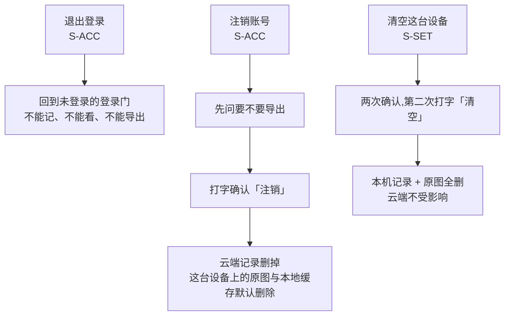

| # | 旅程 | 前置(Given) | 操作(When) | 预期(Then,必须可观察) | 覆盖屏 | 关联规格与编号 | 端 | 优先级 |
|---|---|---|---|---|---|---|---|---|
| `J-119` | J-J 退出 | 已登录,账号下有 N 条 | 在 `S-ACC` 点「退出登录」 | 浮层说清退出后回到登录门、这台设备上看不到记录;**不出现「这台设备上的记录还在」这类暗示未登录仍可用的说法** | `S-ACC` | [登录与账号](登录与账号.md) §四 | 全端 | P0 |
| `J-120` | J-J 退出 | 承上,确认退出 | 尝试打开 `S-TL` 与 `S-HOME` | 回到**未登录的登录门**;两屏都进不去;**不能记、不能看盲区、不能导出**;重新登录后 N 条原样回来 | `S-ACC`→`S-LOGIN` | [登录与账号](登录与账号.md) §1.1 · §四 | 全端 | P0 |
| `J-121` | J-J 退出 | 退出后 | 尝试打开 `S-EXP` | 停在登录门,进不到 `S-EXP` —— **导出跟着账号走,不跟着设备走**;重新登录后导出仍不限次数、无水印 | `S-EXP`→`S-LOGIN` | [导出与问AI](导出与问AI.md) §一 · [用户侧功能规格 · 总纲](INDEX.md) §四 | 全端 | P0 |
| `J-122` | J-J 注销 | 已登录 | 在 `S-ACC` 找「注销账号」 | 它在**次要位置**,不是红色大按钮,不在首屏最显眼处 | `S-ACC` | [登录与账号](登录与账号.md) §四 · §七 | 全端 | P1 |
| `J-123` | J-J 注销 | 点了「注销账号」 | 观察第一层浮层 | 出现原文「注销后,云端的记录会被删掉。**要不要先导出一份?**」;「先导出」是主按钮 | `S-ACC` | [登录与账号](登录与账号.md) §七 | 全端 | P0 |
| `J-124` | J-J 注销 | 承上 | 点「先导出」 | 走 `S-EXP` 导出流程,导完**回到注销的这一步**,不需要从 `S-ACC` 重新进 | `S-ACC`→`S-EXP`→`S-ACC` | [登录与账号](登录与账号.md) §七 | 全端 | P0 |
| `J-125` | J-J 注销 | 到二次确认 | 观察确认方式 | 要求打字输入「注销」两个字才可点 —— **全产品唯一一处要求打字确认的地方** | `S-ACC` | [登录与账号](登录与账号.md) §七 | 全端 | P0 |
| `J-126` | J-J 注销 ⏸ | 注销已执行 | 阅读界面对删除时点的表述 | ⏸ 待裁定([登录与账号](登录与账号.md) `L-3`)。**裁定前界面按「立即删除」写,屏幕上不许出现「可找回」「{n} 天内」字样** | `S-ACC` | [登录与账号](登录与账号.md) §七 ⚠️ · `L-3` | 全端 | P0 |
| `J-127` | J-J 注销 | 注销完成 | 观察落点 | 回到**未登录的登录门**;**这台设备上的原图与本地缓存默认删除**,注销流程里已经给过一次明确告知;注销第一步的「先导出」入口全程可点 | `S-ACC`→`S-LOGIN` | [登录与账号](登录与账号.md) §七 | 全端 | P0 |
| `J-128` | J-J 注销 | 注销后仍持旧令牌的另一端 | 发任意请求 | 受限态原文「这个账号已经注销了」;落到未登录的登录门,**不能继续记、不能继续看** | 任意→`S-LOGIN` | [登录与账号](登录与账号.md) `E-24` | 全端 | P1 |
| `J-129` | J-J 清空 | `S-SET` 上,已登录 | 点「清空这台设备上的数据」 | 两次确认;文案原文「这台设备上的记录和图会全部删掉,云端的不受影响」;第二次要打字「清空」 | `S-SET` | [设置与原图](设置与原图.md) `S-05` | 全端 | P0 |
| `J-130` | J-J 清空 | ~~未登录时清空~~ | ~~观察文案差异~~ | **已作废 · 2026-09-02 取消本机模式**:未登录进不到 `S-SET`,也不存在「没有同步过的本机数据」,这句区别文案没有触发条件 | `S-SET` | [设置与原图](设置与原图.md) `S-06` | 全端 | 已作废 |
| `J-131` | J-J 清空 | 清空执行完 | 依次看 `S-HOME` `S-TL` `S-RAW` | `S-HOME` 回到「今天还没记」;`S-TL` 空态「还没有记录」;`S-RAW` 显示「这台设备上还没有原图」 | `S-HOME` `S-TL` `S-RAW` | [记一次学习](记一次学习.md) §2.3 · [设置与原图](设置与原图.md) §3.2 | 全端 | P0 |
| `J-132` | J-J 清空 | 已登录时清空本机 | 重新拉云端数据 | 云端记录**一条不少**地回来;原图**不回来**(它从来没上过云) | `S-TL` `S-RAW` | [设置与原图](设置与原图.md) `S-05` · §3.2 | 全端 | P0 |
| `J-133` | J-J 清空 | 清空后 | 打开 `S-BLIND` | 覆盖度按剩余数据重算;账号下已无数据时回到「你还没记过东西」的空态 | `S-BLIND` | [看盲区](看盲区.md) §2.4 | 全端 | P1 |

### 2.11 J-K 权限被拒的降级

**麦克风、相机、相册三个权限各自被拒,共同预期只有一条:仍然能记录。**
权限是端给的,不是产品能控的 —— 产品能做的只有「换一条路,别把人堵死」。

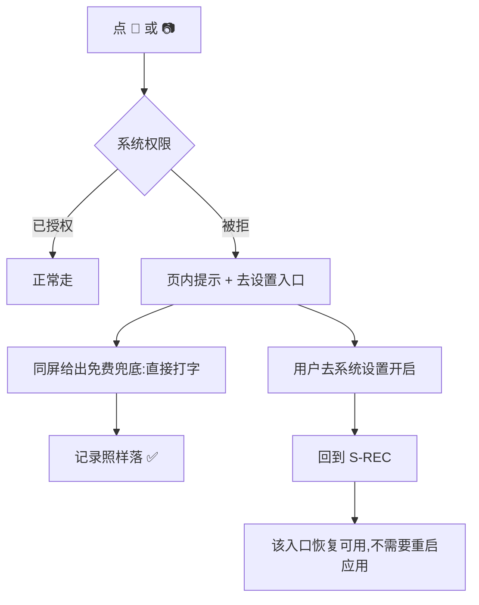

| # | 旅程 | 前置(Given) | 操作(When) | 预期(Then,必须可观察) | 覆盖屏 | 关联规格与编号 | 端 | 优先级 |
|---|---|---|---|---|---|---|---|---|
| `J-134` | J-K 麦克风 | 麦克风权限被拒 | 在 `S-REC` 点 🎤 | 页内提示原文「没有麦克风权限,去设置里打开,或者直接打字」;**同屏就能切到手写** | `S-REC` | [记一次学习](记一次学习.md) `R-04` | 全端 | P0 |
| `J-135` | J-K 麦克风 | 承上 | 直接打字并「记下」 | 记录落下,出现在 `S-TL`;**这条路没有被权限挡住** | `S-REC`→`S-TL` | [记一次学习](记一次学习.md) `R-04` · §一 | 全端 | P0 |
| `J-136` | J-K 麦克风 | 承上 | 去系统设置开启后回到 `S-REC` | 🎤 入口恢复可用;**不需要重启应用** | `S-SET`→`S-REC` | [记一次学习](记一次学习.md) `R-04` | 全端 | P1 |
| `J-137` | J-K 相机 | 相机权限被拒 | 在 `S-REC` 点 📷 | 页内提示 + 「从相册选」的备用入口;记录路径仍通 | `S-REC` | [记一次学习](记一次学习.md) `R-07` | 全端 | P0 |
| `J-138` | J-K 相册 | 相册权限也被拒 | 点「从相册选」 | 页内提示 + 去设置入口;**主按钮仍是「直接打字」这条兜底** | `S-REC` | [记一次学习](记一次学习.md) `R-07` · §一 | 全端 | P0 |
| `J-139` | J-K | 三个权限全被拒 | 完整走一遍记录流程 | 仍能记下至少一条,`S-HOME` 计数 +1 —— **红线 8 在权限维度上成立** | `S-REC`→`S-HOME`→`S-TL` | [记一次学习](记一次学习.md) §一 🔴 | 全端 | P0 |
| `J-140` | J-K | 浏览器禁用了本地存储(隐私模式) | 打开应用 | 顶部说明原文「这个浏览器不让存本地数据,图没法保存,文字记录不受影响」 | `S-SET` `S-REC` | [设置与原图](设置与原图.md) `S-02` `S-03` | Web | P1 |
| `J-141` | J-K | 承上 | 记一条纯文字 | 文字记录仍能落;**不因为存储被禁而拒绝记录** | `S-REC`→`S-TL` | [设置与原图](设置与原图.md) `S-02` · [记一次学习](记一次学习.md) §一 | Web | P0 |

### 2.12 J-L 中断与恢复

**四个中断点:录音中来电、上传中杀进程、支付中断网、合并中断网。**
中断用例的预期都要落在「恢复后是什么状态」,而不是「中断时提示了什么」。

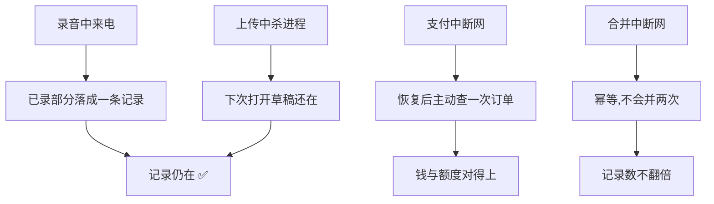

| # | 旅程 | 前置(Given) | 操作(When) | 预期(Then,必须可观察) | 覆盖屏 | 关联规格与编号 | 端 | 优先级 |
|---|---|---|---|---|---|---|---|---|
| `J-142` | J-L 录音 | 正在录音 | 来一通电话打断 | 已录部分落成一条记录,出现在 `S-TL`,标识「(语音)」;**不丢** | `S-REC`→`S-TL` | [记一次学习](记一次学习.md) §3.3 · §一 | 小程序·App | P0 |
| `J-143` | J-L 录音 | 录音时长达到上限 | 观察 | 自动停止;提示原文「录到 60 秒了,先记下这一段」;记录已落 | `S-REC`→`S-TL` | [记一次学习](记一次学习.md) `R-06` · §3.3(时长真源) | 全端 | P0 |
| `J-144` | J-L 进程 | 在 `S-REC` 输入了一半没点「记下」 | 杀进程后重新打开 | 出现原文「上次有一条没记完」;草稿内容完整;有「继续」与「丢弃」两个选择 | `S-REC` | [记一次学习](记一次学习.md) `R-16` | 全端 | P0 |
| `J-145` | J-L 进程 ⏸ | 草稿已存在若干天 | 打开应用 | ⏸ 待裁定([记一次学习](记一次学习.md) `C-1`)。裁定前只验「草稿存在时能恢复」,验不了过期行为 | `S-REC` | [记一次学习](记一次学习.md) `C-1` | 全端 | P1 |
| `J-146` | J-L 进程 | 图片上传识别途中杀进程 | 重新打开 | 记录在 `S-TL`;原图在 `S-RAW`;识别状态是「稍后再认」或已完成,**不是丢失** | `S-TL` `S-RAW` | [记一次学习](记一次学习.md) `R-08` · §一 | 全端 | P0 |
| `J-147` | J-L 支付 | 支付调起后断网 | 恢复网络回到 `S-BILL` | 客户端**主动查一次订单**;显示原文「支付成功,正在到账」或明确的失败态,**不停在未知状态** | `S-BILL` | [额度与购买](额度与购买.md) §3.2 · `P-05` | 全端 | P0 |
| `J-148` | J-L 支付 | 轮询到上限仍未到账 | 观察 | 提示原文「钱已经付了,到账慢了一点。订单在这里,过一会儿再看」+ 订单入口 | `S-BILL` | [额度与购买](额度与购买.md) `P-06` · §3.2(时长真源) | 全端 | P0 |
| `J-149` | J-L 支付 | 支付渠道重复通知 | 观察额度与订单 | 额度**只发放一次**;订单列表里只有一笔 | `S-BILL` | [额度与购买](额度与购买.md) `P-07` | 全端 | P0 |
| `J-150` | J-L 合并 | 合并执行途中断网 | 恢复后重试 | 记录数不翻倍;`S-BLIND` 概览等于预览承诺的那个数 | `S-MERGE`→`S-BLIND` | [登录与账号](登录与账号.md) `E-20` · §5.1 | 全端 | P0 |
| `J-151` | J-L | 「记下」按钮被连点两次 | 观察 `S-TL` | 只出现一条;按钮点后即禁用 | `S-REC`→`S-TL` | [记一次学习](记一次学习.md) `R-18` | 全端 | P1 |
| `J-152` | J-L | AI 代发流式回答中途断流 | 观察 | 保留已收到的部分,提示原文「回答只收到一半」;有重试入口 | `S-EXP` | [导出与问AI](导出与问AI.md) `X-10` | 全端 | P1 |
| `J-153` | J-L | 任意一屏有未保存内容 | 按返回键 | 用浮层问一次;**没有任何一屏是不可返回的** | 全部 | [用户侧功能规格 · 总纲](INDEX.md) §2.4 | 全端 | P1 |

**跨屏旅程用例合计:153 条(`J-001` – `J-153`)**,其中 `J-045` `J-049` – `J-054` `J-080` `J-130`
**九条于 2026-09-02 作废(取消本机模式),号不回收,今天有效 144 条**。

---

## 三、红线专项用例

**旅程用例问「这条路走不走得通」,红线用例问「这条边界在全产品范围内破没破」。**
所以红线用例的覆盖屏经常是「全部」,执行手段也经常不是点界面,而是抓包、看日志、grep 代码。

🔴 **本节全部是 `P0`。红线没有 P1。**

### 3.1 `RL-01` 只回答有没有、几次、多久前

**禁用词表**(真源 [用户侧功能规格 · 总纲](INDEX.md) §2.3,本文不重述、不增删):

```
正确率 · 得分 · 分数 · 排名 · 名次 · 击败了 x% · 掌握度 · 熟练度 · 等级
讲解 · 解析 · 答案 · 知识点讲解 · 学习建议 · 复习提醒 · 该复习了
连续打卡 · 连续 n 天 · 成就 · 徽章 · 勋章 · 里程碑 · 战绩
```

⚠️ **下面的用例一律用「禁用词表里的任何一个词」指代它,不逐个复述** ——
逐个复述会让这份文档自己成为全仓扫描的一个大命中源(处理方式见 §七)。

| # | 红线 | 前置(Given) | 操作(When) | 预期(Then,必须可观察) | 覆盖屏 | 关联规格与编号 | 端 | 优先级 |
|---|---|---|---|---|---|---|---|---|
| `RL-01-01` | 只回答三件事 | 代码库任意状态 | 跑能力边界文案扫描 | `npm run test:boundary` 退出码 0;硬名单一个都不命中 | 全部 | [用户侧功能规格 · 总纲](INDEX.md) §七 | Web·壳 | P0 |
| `RL-01-02` | 只回答三件事 | 承上 | 检查扫描的豁免表 | 豁免表里**没有匹配不到任何一行的死条目** —— 残留豁免会替下一处真的越界提前买单 | 全部 | `web/scripts/capability-boundary-allow.json` | Web·壳 | P0 |
| `RL-01-03` | 只回答三件事 | `S-BLIND` 有数据 | 逐字读整屏 | 每一句都能还原成「有没有 / 几次 / 多久前」之一;**没有一句是对用户的评价** | `S-BLIND` | [看盲区](看盲区.md) §一 | 全端 | P0 |
| `RL-01-04` | 只回答三件事 | `S-NODE` 打开 | 检查元素清单 | 屏幕上没有讲解类字段、例题、推荐资料、相关课程 | `S-NODE` | [看盲区](看盲区.md) §3.1 🔴 | 全端 | P0 |
| `RL-01-05` | 只回答三件事 | 骨架树展开 | 检查每个节点右侧 | 只有「{碰过}/{总数}」的计数;**没有百分号、没有进度条、没有环形图** | 骨架树 | [看盲区](看盲区.md) §四 | 全端 | P0 |
| `RL-01-06` | 只回答三件事 | `S-TAG` 有候选 | 检查候选行 | **不显示置信度数字**、不显示相似度、不显示星级 | `S-TAG` | [打标与未分类](打标与未分类.md) §3.2 🔴 | 全端 | P0 |
| `RL-01-07` | 只回答三件事 | `S-HOME` 有数据 | 检查首页 | 没有覆盖率进度条、连续天数、任何百分比、评价性文字 | `S-HOME` | [记一次学习](记一次学习.md) §2.1 🔴 | 全端 | P0 |
| `RL-01-08` | 只回答三件事 | 「本来该记,但懒了」计数不为 0 | 检查该区文案 | 只有中性计数;**不出现任何把它读成负面反馈的句子** | `S-HOME` | [记一次学习](记一次学习.md) §2.2 ⚠️ | 全端 | P0 |
| `RL-01-09` | 只回答三件事 | 三种格式的导出文件各一份 | 检查文件全文 | 三份都不含禁用词表里的任何一个词 | `S-EXP` → 文件 | [用户侧功能规格 · 总纲](INDEX.md) §2.3 | 全端 | P0 |
| `RL-01-10` | 只回答三件事 | 服务端已构建 | 跑 agent 边界断言 | 工具池不许有 `EFFECT` 级工具;spring-ai 的类型只待在 `agent.llm` 包里 | 服务端 | `server/kaodian-agent/src/test/java/com/kaodian/server/agent/AgentBoundaryTest.java` | 服务端 | P0 |
| `RL-01-11` | 只回答三件事 | 应用已启动,模型或端点刚改过 | 问 agent 一句要求判断对错的话 | 拒绝并导回「有没有 / 几次 / 多久前」;**不给出任何学科判断** | agent 会话 | `CLAUDE.md` 双提示词自查 | 服务端 | P0 |
| `RL-01-12` | 只回答三件事 | 全部空态、错误态、受限态 | 逐个截屏走查 | 四类文案(空 / 错误 / 受限 / Toast)里都没有禁用词表里的词 | 全部 | [用户侧功能规格 · 总纲](INDEX.md) §2.1 · §三 | 全端 | P0 |
| `RL-01-13` | 只回答三件事 | 错误码映射表 | 检查每一条错误文案 | 不出现错误码原文、不出现英文、不出现「请稍后重试」这种没有信息量的话 | 全部 | [用户侧功能规格 · 总纲](INDEX.md) §三 ⚠️ | 全端 | P0 |

### 3.2 `RL-02` 不做学科教研

**这条红线是其他所有优势的来源。** 验收不是「有没有说错」,而是「产品有没有在自己下判断的位置上放东西」。

| # | 红线 | 前置(Given) | 操作(When) | 预期(Then,必须可观察) | 覆盖屏 | 关联规格与编号 | 端 | 优先级 |
|---|---|---|---|---|---|---|---|---|
| `RL-02-01` | 不做教研 | `S-BLIND` 有榜单 | 检查榜单顶部 | 排序口径写在屏幕上,原文「按近 5 年出现次数排」,且可切换为「按最久没碰」 | `S-BLIND` | [看盲区](看盲区.md) §2.1 ⚠️ | 全端 | P0 |
| `RL-02-02` | 不做教研 | 承上 | 检查榜单每一行 | 每个字要么来自骨架统计字段,要么来自用户自己的行为记录;**没有第三来源** | `S-BLIND` | [看盲区](看盲区.md) §一 🔴 | 全端 | P0 |
| `RL-02-03` | 不做教研 | 承上 | 查找评价性标签 | 不出现「重点考点」「必考」这类学科判断 | `S-BLIND` `S-NODE` | [看盲区](看盲区.md) §一 | 全端 | P0 |
| `RL-02-04` | 不做教研 | `S-EXP` 预览框 | 阅读开头那句 | 是把差集交给用户自己接的模型来判断;**产品自己不给先学哪个的顺序** | `S-EXP` | [导出与问AI](导出与问AI.md) §2.3 | 全端 | P0 |
| `RL-02-05` | 不做教研 | 代发返回了含讲解的回答 | 检查产品对它做了什么 | 原样显示;**没有**被二次加工成计划或建议;**没有**被存成结构化条目 | `S-EXP` | [导出与问AI](导出与问AI.md) §2.5 🔴 | 全端 | P0 |
| `RL-02-06` | 不做教研 | 服务端上下文已加载 | 跑生成式模型 bean 断言 | 上下文里不存在任何生成式模型 bean;扫描范围是完整应用而非切片 | 服务端 | `server/kaodian-app/src/test/java/com/kaodian/server/redline/NoGenerativeModelBeanTest.java` | 服务端 | P0 |
| `RL-02-07` | 不做教研 | 承上 | 检查配对断言 | 配了模型 api-key 就必须同时配自动装配排除,否则**服务起不来** | 服务端 | `NoGenerativeModelBeanTest` | 服务端 | P0 |
| `RL-02-08` | 不做教研 | `S-SET` 的「这个产品不做什么」页 | 阅读全文 | 出现原文「学科判断不是这个产品干的事」;这一页与决策记录一一对应 | `S-SET` | [设置与原图](设置与原图.md) §二 | 全端 | P0 |
| `RL-02-09` | 不做教研 | `S-TAG` 候选排序 | 找排序理由的说明 | **没有**排序理由的解释 —— 产品不为候选顺序背书 | `S-TAG` | [打标与未分类](打标与未分类.md) §3.2 | 全端 | P0 |

### 3.3 `RL-03` 不存培训机构课程内容

**只记来源名称与时间,一个字都不多。** 这条红线最容易被「为了体验更好」侵蚀 ——
给来源做一个详情页,就已经开始存机构的东西了。

| # | 红线 | 前置(Given) | 操作(When) | 预期(Then,必须可观察) | 覆盖屏 | 关联规格与编号 | 端 | 优先级 |
|---|---|---|---|---|---|---|---|---|
| `RL-03-01` | 不存课程内容 | `S-REC` 手写模式 | 检查来源输入 | 只是一个名称输入 + 最近用过的下拉;**没有课程目录、章节选择、机构库** | `S-REC` | [记一次学习](记一次学习.md) §3.2 🔴 | 全端 | P0 |
| `RL-03-02` | 不存课程内容 | `S-NODE` 显示了来源集合 | 点一个来源名 | **不可点** —— 产品不为来源建页面 | `S-NODE` | [看盲区](看盲区.md) §3.2 | 全端 | P0 |
| `RL-03-03` | 不存课程内容 | 服务端领域记录 | 检查与来源相关的字段 | 只有一个名称字段和一个时间字段;没有课程 id、课时、章节、讲师、大纲 | 服务端 | `server/kaodian-domain/src/main/java/com/kaodian/server/collect/Touch.java` | 服务端 | P0 |
| `RL-03-04` | 不存课程内容 | 导出的 CSV / JSON | 检查来源相关的列 / 键 | 只有来源名称;没有任何承载课程内容的列 | `S-EXP` → 文件 | [导出与问AI](导出与问AI.md) §2.4 | 全端 | P0 |
| `RL-03-05` | 不存课程内容 | `S-EXP` 预览框 | 检查「不包含」清单是否成立 | 预览里不含机构名以外的课程内容 | `S-EXP` | [导出与问AI](导出与问AI.md) §2.3 | 全端 | P0 |
| `RL-03-06` | 不存课程内容 | 骨架数据 | 检查考点标签的措辞来源 | 考点标签自行命名,不沿用任何机构的既有体系与措辞;有推导过程记录 | 骨架 | [实施路径](../../decisions/实施路径.md) §1.2 合规 · [骨架数据采集流水线](../../data/骨架数据采集流水线.md) | 服务端 | P0 |
| `RL-03-07` | 不存课程内容 | `S-SET` 边界页 | 阅读 | 出现原文「它不存你的题目内容。数据库里没有能装题干的地方。」 | `S-SET` | [设置与原图](设置与原图.md) §二 | 全端 | P0 |
| `RL-03-08` | 不存课程内容 | 来源名输入框 | 输入一段超长文本 | 有长度上限并被截断;**来源名不能被当成一个自由文本容器用** | `S-REC` | [记一次学习](记一次学习.md) §3.2 · `NoStemFieldTest` | 全端 | P0 |

### 3.4 `RL-04` 数据库里没有能装下题干的字段

🔴 **这条红线可机器化程度最高,所以用例必须全部落到命令上,不许靠人读。**
「连预留位都不留」包含示例、占位、附录 —— 一个写在注释里的示例题干,和一个真的字段,后果是一样的。

**检查 schema 的做法**(仓库当前没有 SQL DDL,存储是逐字段手写落盘的文件存储):

```bash
# 1) 跑红线断言 —— 主检查,其余都是它的补充
./server/build.sh -q test -Dtest=NoStemFieldTest -Dsurefire.failIfNoSpecifiedTests=false

# 2) 列出所有领域记录类型的字段,人眼过一遍字段名
grep -rn "public record " server/*/src/main/java --include=*.java -A 20

# 3) 找出所有没有长度上限的自由文本字段(白名单之外一律要有 @Size)
grep -rn "String " server/*/src/main/java --include=*.java | grep -v "@Size" | grep -v "//"

# 4) 落盘文件的键全集 —— 文件里能出现哪些键,由逐字段手写的那处显式列出
grep -rn "toNode\|fromNode" server/kaodian-domain/src/main/java --include=*.java -A 15
```

**检查导出文件字段的做法**:

```bash
# CSV:表头必须只有 名称 / 章节 / 出现次数 / 我碰过几次 / 最近时间
head -1 <导出的.csv>

# JSON:列出所有出现过的键名,人眼过一遍
python3 - <导出的.json> <<'PY'
import json, sys
keys = set()
def walk(o):
    if isinstance(o, dict):
        keys.update(o.keys())
        for v in o.values(): walk(v)
    elif isinstance(o, list):
        for v in o: walk(v)
walk(json.load(open(sys.argv[1])))
print("\n".join(sorted(keys)))
PY

# JSON:再看最长的那个字符串值 —— 超过一个短名称该有的长度就要解释为什么
python3 - <导出的.json> <<'PY'
import json, sys
best = ("", "")
def walk(o, path=""):
    global best
    if isinstance(o, dict):
        for k, v in o.items(): walk(v, path + "/" + k)
    elif isinstance(o, list):
        for v in o: walk(v, path + "/*")
    elif isinstance(o, str) and len(o) > len(best[1]):
        best = (path, o)
walk(json.load(open(sys.argv[1])))
print(best[0], len(best[1]))
PY
```

| # | 红线 | 前置(Given) | 操作(When) | 预期(Then,必须可观察) | 覆盖屏 | 关联规格与编号 | 端 | 优先级 |
|---|---|---|---|---|---|---|---|---|
| `RL-04-01` | 无题干字段 | 代码库任意状态 | 跑 `NoStemFieldTest` | 全绿。「没有任何字段的名字在说题目本身」这条断言通过 | 服务端 | `server/kaodian-app/src/test/java/com/kaodian/server/redline/NoStemFieldTest.java` | 服务端 | P0 |
| `RL-04-02` | 无题干字段 | 承上 | 检查自由文本断言 | 每个自由文本字段要么有长度上限,要么在白名单里写明理由;**没有第三种** | 服务端 | `NoStemFieldTest` | 服务端 | P0 |
| `RL-04-03` | 无题干字段 | 承上 | 检查白名单本身 | 白名单里没有死行 —— 字段没了,那一行也必须跟着没 | 服务端 | `NoStemFieldTest` | 服务端 | P0 |
| `RL-04-04` | 无题干字段 | 承上 | 检查扫描范围 | 扫描确实扫到了东西 —— **一个扫不到东西的断言等于没有断言** | 服务端 | `NoStemFieldTest` | 服务端 | P0 |
| `RL-04-05` | 无题干字段 | 落盘文件已产生 | 打开落盘 JSON,列出键全集 | 每个键都能归到「id / 考点码 / 来源名 / 时间 / 计数 / 去重键 / 标志位」;**没有一个键装内容** | 服务端 | 上方命令 4 | 服务端 | P0 |
| `RL-04-06` | 无题干字段 | 导出 CSV | 核对表头 | 表头只有五列,与 [导出与问AI](导出与问AI.md) §2.4 完全一致 | `S-EXP` → 文件 | [导出与问AI](导出与问AI.md) §2.4 | 全端 | P0 |
| `RL-04-07` | 无题干字段 | 导出 JSON | 跑上方两个 `python3` 片段 | 键全集无内容类字段;最长字符串值仍是短名称量级 | `S-EXP` → 文件 | [导出与问AI](导出与问AI.md) §2.4 | 全端 | P0 |
| `RL-04-08` | 无题干字段 | `S-REC` 手写输入框 | 检查占位符、示例、帮助文案 | 三处都不出现任何题目样子的文字 —— **出现了用户就会开始往里抄题** | `S-REC` | [记一次学习](记一次学习.md) §3.2 🔴 | 全端 | P0 |
| `RL-04-09` | 无题干字段 | 全部文档 | 检查文档里的示例与附录 | 文档里也不出现题干样例;示例数据一律用考点名代替 | 文档 | [文档规范与目录](../../文档规范与目录.md) §五 | 文档 | P0 |
| `RL-04-10` | 无题干字段 | agent 落盘的对话 | 检查消息分段的类型全集 | 只有文本 / 工具调用 / 工具结果这几类;**没有图片类型、音频类型、原文类型** | 服务端 | `server/kaodian-agent/src/main/java/com/kaodian/server/agent/entity/MessagePart.java` | 服务端 | P0 |
| `RL-04-11` | 无题干字段 | 承上 | 检查落盘方式 | 落盘是**逐字段手写**,不走自动序列化 —— 否则将来多一个字段就自动流进每一个文件 | 服务端 | `FileRunRepository` | 服务端 | P0 |
| `RL-04-12` | 无题干字段 | 一个新增了字段的分支 | 跑 `NoStemFieldTest` | 新字段要么有上限,要么进白名单并写清理由;**过不了就是过不了** | 服务端 | `NoStemFieldTest` | 服务端 | P0 |
| `RL-04-13` | 无题干字段 | 去重键这类跨三层的字段 | 检查上限常量 | 三处引用**同一个常量**,编译期保证只有一个数;这个数装不下任何一段题干 | 服务端 | `Touch.MAX_CLIENT_TOKEN_LENGTH` | 服务端 | P0 |

### 3.5 `RL-05` 闭集打标:只选 id,不生成文本

🔴 **验收重点不是「正常情况下对不对」,而是「模型返回恶意响应时前端拒不拒绝」。**
模型是外部的,它随时可能返回一个不在候选集里的 id,或者干脆返回一段标签文本。
**产品不能假设它会守规矩。**

**构造两种恶意响应的做法**:

```bash
# 恶意响应一:返回一个不在候选集里的 nodeId
#   在分类服务的测试桩里返回一个随机 nodeCode,断言结果必须是「无匹配」,而不是把这个 id 挂上去
./server/build.sh -q test -Dtest=TaggingServiceTest -Dsurefire.failIfNoSpecifiedTests=false

# 恶意响应二:返回一段标签文本而不是 id
#   断言请求体里没有任何位置能接住这段文本
grep -rn "CreateTagRequest\|TagRequest" server/kaodian-app/src/main/java --include=*.java -A 12

# 标签记录本身有没有自由文本字段
grep -rn "record RecordTag" server/kaodian-domain/src/main/java --include=*.java -A 20
```

| # | 红线 | 前置(Given) | 操作(When) | 预期(Then,必须可观察) | 覆盖屏 | 关联规格与编号 | 端 | 优先级 |
|---|---|---|---|---|---|---|---|---|
| `RL-05-01` | 闭集打标 | 分类服务被桩成**返回不在候选集里的 nodeId** | 走一次自动打标 | 结果是「无匹配」;卡片显示「这条没能对上任何考点」;**这个 id 一次都没有被挂上去** | `S-TL` `S-TAG` | [打标与未分类](打标与未分类.md) §一 🔴 · [技术架构与接口契约](../../technical/INDEX.md) §6.3 | 全端 | P0 |
| `RL-05-02` | 闭集打标 | 分类服务被桩成**返回一段标签文本** | 走一次自动打标 | 请求体接不住这段文本;结果落到「无匹配」;**界面上不出现这段文本的任何一个字** | `S-TL` `S-TAG` | [打标与未分类](打标与未分类.md) §一 🔴 | 全端 | P0 |
| `RL-05-03` | 闭集打标 | 承上两种恶意响应 | 检查覆盖度 | `S-BLIND` 概览**不变** —— 恶意响应一次都没有污染覆盖度 | `S-BLIND` | [看盲区](看盲区.md) §2.1 | 全端 | P0 |
| `RL-05-04` | 闭集打标 | 树选择器打开 | 找「新建标签」入口 | **找不到**。搜不到就是没有,不提供新建 | `S-TAG` | [打标与未分类](打标与未分类.md) §一 · §3.4 | 全端 | P0 |
| `RL-05-05` | 闭集打标 | 一条记录已挂上标签 | 尝试编辑标签文字 | **不可编辑** —— 标签是树上的节点,不是一段文字 | `S-TL` `S-TAG` | [打标与未分类](打标与未分类.md) §一 | 全端 | P0 |
| `RL-05-06` | 闭集打标 | 挂载接口 | 检查请求体的键 | body **只接受 `nodeId`**;没有 `label` / `name` / `text` 这类键 | 服务端 | [打标与未分类](打标与未分类.md) §3.3 · [技术架构与接口契约](../../technical/INDEX.md) §6.3 | 服务端 | P0 |
| `RL-05-07` | 闭集打标 | 树选择器 | 尝试选中一个非叶子节点 | 提示原文「挑到具体考点」;**不允许挂到父节点** | `S-TAG` | [打标与未分类](打标与未分类.md) §3.4 | 全端 | P0 |
| `RL-05-08` | 闭集打标 | 骨架树更新后旧候选失效 | 挂载 | 提示原文「考点表更新了,重新挑一次」;**不静默挂到一个已不存在的节点上** | `S-TAG` | [打标与未分类](打标与未分类.md) `T-06` | 全端 | P0 |
| `RL-05-09` | 闭集打标 | 全仓代码 | 检查标签记录的字段 | 写标签的路径上只有考点码,**没有任何自由文本标签字段** | 服务端 | `server/kaodian-domain/src/main/java/com/kaodian/server/collect/RecordTag.java` | 服务端 | P0 |
| `RL-05-10` | 闭集打标 | 候选返回为空 | 观察界面 | `S-TAG` 显示「没有候选」;**不自动生成一个候选来填这个空** | `S-TAG` | [打标与未分类](打标与未分类.md) §3.2 | 全端 | P0 |

### 3.6 `RL-06` 宁缺毋滥:匹配不上就丢弃

**归错会让覆盖度失真,而覆盖度是这个产品唯一的产出。** 丢弃率高是设计,不是缺陷。

⚠️ **这一节没有任何机器断言**,判定全靠人看界面 —— 登记为 §六 `K-6`。

| # | 红线 | 前置(Given) | 操作(When) | 预期(Then,必须可观察) | 覆盖屏 | 关联规格与编号 | 端 | 优先级 |
|---|---|---|---|---|---|---|---|---|
| `RL-06-01` | 宁缺毋滥 | 一条记录与任何考点都不像 | 自动打标 | 返回无匹配;**不硬塞给最接近的那个考点** | `S-TL` | [打标与未分类](打标与未分类.md) §一 · `T-03` | 全端 | P0 |
| `RL-06-02` | 宁缺毋滥 | 承上 | 检查界面表述 | 文案是「这条没能对上任何考点」,**不是**「识别失败」 —— 没对上是正常结果 | `S-TL` `S-TAG` | [打标与未分类](打标与未分类.md) §一 | 全端 | P0 |
| `RL-06-03` | 宁缺毋滥 | `S-TAG` 有多个候选 | 找「强制归类」入口 | **没有**「选最接近的一个」这类按钮;有「都不是」 | `S-TAG` | [打标与未分类](打标与未分类.md) §3.2 | 全端 | P0 |
| `RL-06-04` | 宁缺毋滥 | `S-TAG` 队列 | 检查是否能批量确认 | **不做多选批量确认** —— 批量确认会让人不看内容就点 | `S-TAG` | [打标与未分类](打标与未分类.md) §3.3 | 全端 | P0 |
| `RL-06-05` | 宁缺毋滥 ⏸ | 高置信度候选 | 观察是否被自动确认 | ⏸ 待裁定([打标与未分类](打标与未分类.md) `T-3`)。**裁定前一律要用户点一次**;出现自动确认即视为红 | `S-TAG` | [打标与未分类](打标与未分类.md) `T-3` | 全端 | P0 |
| `RL-06-06` | 宁缺毋滥 | 待确认状态的标签 | 检查覆盖度 | **待确认不计覆盖度** —— 只有用户确认过的才计 | `S-BLIND` | [打标与未分类](打标与未分类.md) §二 | 全端 | P0 |
| `RL-06-07` | 宁缺毋滥 | 用户点了「都不是」 | 检查记录与覆盖度 | 标签全部置为丢弃,不计覆盖度;**记录本身仍可见** | `S-TL` `S-BLIND` | [打标与未分类](打标与未分类.md) §二 · §3.3 | 全端 | P0 |
| `RL-06-08` | 宁缺毋滥 ⏸ | 一条记录被挂多个考点 | 观察上限 | ⏸ 待裁定([打标与未分类](打标与未分类.md) `T-2`)。**没定之前批量挂载就是刷覆盖度的入口**,不许开这个口子 | `S-TAG` | [打标与未分类](打标与未分类.md) `T-2` | 全端 | P0 |
| `RL-06-09` | 宁缺毋滥 ⏸ | 丢弃率这个数存在于产品内部 | 找它在界面上的位置 | ⏸ 待裁定([打标与未分类](打标与未分类.md) `T-1`,倾向不给)。**裁定前界面上不出现丢弃率** | 全部 | [打标与未分类](打标与未分类.md) `T-1` | 全端 | P0 |

### 3.7 `RL-07` 原图只在本机

🔴 **这是产品对用户最硬的一条承诺,也是 Web 端最弱的一处。**
「发给模型前只在内存里、只用内联 base64、不落盘服务端、不写日志、不用厂商文件暂存 API」——
这五个「不」各自要有用例,而且要用**抓包和日志**去验,不能靠读代码就算过。

**三种可执行的检查手段**:

```bash
# ① 抓包核对无图片出站
#    DevTools Network 面板(或系统级抓包)过滤整个「拍照 → 记下 → 识别完成」流程:
#    - 除识别接口那一次内联 base64 外,不允许有第二个请求体带图片字节
#    - 出站域名必须全部在显式白名单里 —— 新增一个厂商就该被拦一次
./server/build.sh -q test -Dtest=ImageRetentionTest -Dsurefire.failIfNoSpecifiedTests=false

# ② 日志核对无图片(跑完一次带图流程后)
grep -rnE "data:image/|/9j/4|iVBORw0KGgo" <日志目录>      # 期望:0 命中

# ③ 清空后核对彻底消失
#    壳 / 服务端:在数据目录下按文件类型搜一遍
find <应用数据目录> -type f -print0 | xargs -0 file 2>/dev/null | grep -i image   # 期望:0 命中
#    Web:DevTools → Application → 逐个 IndexedDB / localStorage / Cache Storage 核对为空
```

| # | 红线 | 前置(Given) | 操作(When) | 预期(Then,必须可观察) | 覆盖屏 | 关联规格与编号 | 端 | 优先级 |
|---|---|---|---|---|---|---|---|---|
| `RL-07-01` | 原图只在本机 | 抓包工具已就绪 | 走完整「拍照 → 记下 → 识别完成」 | 除识别那一次内联 base64 外,**0 个出站请求体含图片字节** | `S-REC` | `server/kaodian-app/src/test/java/com/kaodian/server/redline/ImageRetentionTest.java` · [识别链路选型 · ASR 与图像识别](../../data/识别链路选型.md) §四 | Web·壳 | P0 |
| `RL-07-02` | 原图只在本机 | 承上 | 检查出站域名 | 全部出站域名都在显式白名单里;**新增一个厂商必须先被拦一次** | 服务端 | `ImageRetentionTest` | 服务端 | P0 |
| `RL-07-03` | 原图只在本机 | 承上 | 扫描生效代码 | 生效代码里不出现任何**厂商图片暂存 API** 的痕迹 | 服务端 | `ImageRetentionTest` | 服务端 | P0 |
| `RL-07-04` | 原图只在本机 | 跑完一次带图流程 | 在全部日志里搜图片特征 | 0 命中 —— 图片字节从没被打进日志 | 服务端 | `ImageRetentionTest` tripwire | 服务端 | P0 |
| `RL-07-05` | 原图只在本机 | 承上 | 在服务端磁盘上搜图片 | 0 命中 —— 识别包不许把图片字节落盘 | 服务端 | `ImageRetentionTest` tripwire | 服务端 | P0 |
| `RL-07-06` | 原图只在本机 | 握着原图 / 音频字节的调用方 | 跑同一条 tripwire | 调用方同样不许落盘、外发、打进日志 | 服务端 | `ImageRetentionTest` | 服务端 | P0 |
| `RL-07-07` | 原图只在本机 | 音频同理 | 跑一次语音流程后核对 | 上传的音频永不落盘 —— 容器的分片阈值必须高过单文件上限 | 服务端 | `server/kaodian-app/src/test/java/com/kaodian/server/redline/AudioRetentionTest.java` | 服务端 | P0 |
| `RL-07-08` | 原图只在本机 | 承上 | 检查上限配对 | 代码里的音频上限不得超过容器的上限 —— 否则「拒收由谁做」说不清 | 服务端 | `AudioRetentionTest` | 服务端 | P0 |
| `RL-07-09` | 原图只在本机 | `S-RAW` 打开 | 找上传 / 备份 / 同步 / 分享入口 | **四个都找不到**。这一屏不允许出现任何一种 | `S-RAW` | [设置与原图](设置与原图.md) §3.3 🔴 | 全端 | P0 |
| `RL-07-10` | 原图只在本机 | `S-RAW` 单张大图打开 | 找「保存到云」「分享到」 | **找不到**;只有本机读取 | `S-RAW` | [设置与原图](设置与原图.md) §3.3 | 全端 | P0 |
| `RL-07-11` | 原图只在本机 | 本机有 M 张图 | 执行「清空这台设备上的数据」后搜残留 | 本机存储里 0 张图;Web 端逐个 IndexedDB / localStorage / Cache Storage 核对为空 | `S-SET`→`S-RAW` | [设置与原图](设置与原图.md) `S-05` | Web·壳 | P0 |
| `RL-07-12` | 原图只在本机 🔴 Web 最弱处 | Web 端有图 | 在隐私模式或另一个会话里打开 | 图不跨会话泄漏;隐私模式按 `S-03` 给出提示而不是静默存下 | `S-RAW` | [设置与原图](设置与原图.md) `S-02` `S-03` | Web | P0 |
| `RL-07-13` | 原图只在本机 🔴 Web 最弱处 | Web 端有图 | 检查图有没有进入可被第三方脚本读到的位置 | 图不进全局变量、不进任何被上报的对象、不进任何监控 SDK 的采样 | `S-RAW` `S-REC` | [原图存储:判据层与存储层](../../technical/原图存储-判据层与存储层.md) | Web | P0 |
| `RL-07-14` | 原图只在本机 | 换设备(见 `J-111`) | 在设备二打开 `S-RAW` | 0 张 + 常驻说明原文「这些图只在这台设备上。换设备看不到,也没有任何地方备份。」 | `S-RAW` | [设置与原图](设置与原图.md) §3.2 | 全端 | P0 |
| `RL-07-15` | 原图只在本机 | 浏览器与壳各存过图 | 分别打开两边的 `S-RAW` | 两边互相看不见;当前形态为 0 时给出跨形态说明;**没有迁移入口** | `S-RAW` | [设置与原图](设置与原图.md) §3.4 | Web·壳 | P0 |
| `RL-07-16` | 原图只在本机 | 原图过了留存期 | 观察 `S-RAW` | 文案是「转入留存区」,**不是**「到期删除」 —— 存储层没有任何自动删除路径 | `S-RAW` | [设置与原图](设置与原图.md) §3.1 ⚠️ | 全端 | P0 |

### 3.8 `RL-08` 记录动作永不失败

**穷举失败注入点,每个注入点一条用例,预期一律是「记录仍在」。**
[记一次学习](记一次学习.md) §一 的判据是:异常表里每一行的「记录留住了吗」列必须是 ✅。
本节把它扩成跨屏的 —— 注入失败之后,**在 `S-TL` 上看得见那一条**。

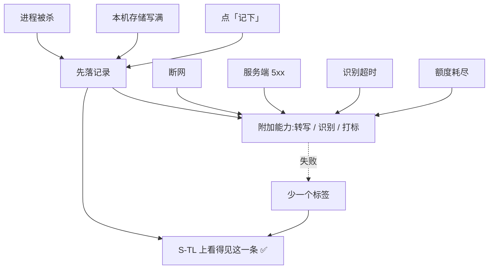

| # | 红线 | 前置(Given) | 操作(When) | 预期(Then,必须可观察) | 覆盖屏 | 关联规格与编号 | 端 | 优先级 |
|---|---|---|---|---|---|---|---|---|
| `RL-08-01` | 记录永不失败 | 注入:完全断网 | 记一条 | `S-TL` 上看得见这一条;顶部细条「离线中,已存在这台设备上」 | `S-REC`→`S-TL` | [记一次学习](记一次学习.md) `R-01` | 全端 | P0 |
| `RL-08-02` | 记录永不失败 | 注入:保存请求超时 | 记一条 | Toast 原文「已记下,等联网再同步」;`S-TL` 上看得见 | `S-REC`→`S-TL` | [记一次学习](记一次学习.md) `R-02` | 全端 | P0 |
| `RL-08-03` | 记录永不失败 | 注入:服务端返回 5xx | 记一条 | 同上;`S-TL` 上看得见 | `S-REC`→`S-TL` | [记一次学习](记一次学习.md) `R-03` | 全端 | P0 |
| `RL-08-04` | 记录永不失败 | 注入:转写超时 | 录一段语音 | 卡片原文「没转成文字,录音还在」;`S-TL` 上看得见这一条 | `S-REC`→`S-TL` | [记一次学习](记一次学习.md) `R-05` | 全端 | P0 |
| `RL-08-05` | 记录永不失败 | 注入:图像识别超时 | 拍一张照记下 | 卡片原文「没认出来,图还在」;`S-TL` 上看得见;`S-RAW` 里图也在 | `S-REC`→`S-TL`→`S-RAW` | [记一次学习](记一次学习.md) `R-08` | 全端 | P0 |
| `RL-08-06` | 记录永不失败 | 注入:AI 额度耗尽 | 语音或拍照记一条 | 记录落下;受限说明出现;主入口是免费兜底 | `S-REC`→`S-TL` | [记一次学习](记一次学习.md) `R-12` | 全端 | P0 |
| `RL-08-07` | 记录永不失败 | 注入:本机存储写满 | 拍照记一条 | 浮层原文「这台设备存不下新的原图了,去清理一下」;**文字记录照样落**,只是没图 | `S-REC`→`S-TL`→`S-RAW` | [记一次学习](记一次学习.md) `R-11` · [设置与原图](设置与原图.md) `S-01` | 全端 | P0 |
| `RL-08-08` | 记录永不失败 | 注入:保存途中杀进程 | 重新打开 | 草稿还在,原文「上次有一条没记完」 | `S-REC` | [记一次学习](记一次学习.md) `R-16` | 全端 | P0 |
| `RL-08-09` | 记录永不失败 | 注入:骨架未建好 | 记一条 | 卡片小字「这个科目的考点表还没建好,先记着」;`S-TL` 上看得见 | `S-REC`→`S-TL` | [记一次学习](记一次学习.md) `R-13` | 全端 | P0 |
| `RL-08-10` | 记录永不失败 | 注入:三个权限全被拒 | 打字记一条 | `S-TL` 上看得见;`S-HOME` 计数 +1 | `S-REC`→`S-HOME`→`S-TL` | [记一次学习](记一次学习.md) `R-04` `R-07` | 全端 | P0 |
| `RL-08-11` | 记录永不失败 | 注入:浏览器禁用本地存储 | 打字记一条 | 文字记录仍能落;提示只说图存不了,**不拒绝记录** | `S-REC`→`S-TL` | [设置与原图](设置与原图.md) `S-02` | Web | P0 |
| `RL-08-12` | 记录永不失败 | 注入:批量补录超过上限 | 提交一批 | 页内提示 + **保留剩余文本**;已提交的那部分全部落下 | `S-REC`→`S-TL` | [记一次学习](记一次学习.md) `R-14` · §3.5(上限真源) | 全端 | P0 |
| `RL-08-13` | 记录永不失败 | 注入:同一条被连点两次 | 观察 | 只有一条 —— **去重不能变成「一条都没落」** | `S-REC`→`S-TL` | [记一次学习](记一次学习.md) `R-18` | 全端 | P0 |
| `RL-08-14` | 记录永不失败 | 接口语义 | 检查记录接口的时序 | **先返回成功再做识别**,识别结果异步回来 —— 顺序反了「永不失败」就做不到 | 服务端 | [记一次学习](记一次学习.md) §七 | 服务端 | P0 |
| `RL-08-15` | 记录永不失败 | 六个注入点各跑一遍 | 汇总 `S-TL` | 六次注入之后 `S-TL` 上恰好多出六条;**一条都没丢** | `S-TL` | [记一次学习](记一次学习.md) §一 判据 | 全端 | P0 |

### 3.9 `RL-09` 导出永远不限次数、无水印、不删减

**这是承诺,不是策略。** 一个「导出要会员」的产品在讲「你的数据是你的」时没有可信度。

| # | 红线 | 前置(Given) | 操作(When) | 预期(Then,必须可观察) | 覆盖屏 | 关联规格与编号 | 端 | 优先级 |
|---|---|---|---|---|---|---|---|---|
| `RL-09-01` | 导出不限 | 已登录,账号下有数据 | 连续导出 10 次 | 10 次全部成功;**没有一次出现次数限制、没有一次要求付费** | `S-EXP` | [导出与问AI](导出与问AI.md) §一 🔴 | 全端 | P0 |
| `RL-09-02` | 导出不限 | 承上 | 检查产出文件 | 没有水印、没有「试用版」「免费版」标记、没有产品广告尾巴 | `S-EXP` → 文件 | [导出与问AI](导出与问AI.md) §一 | 全端 | P0 |
| `RL-09-03` | 导出不限 | 免费账号与付费账号,数据相同 | 两边各导一份,逐字节比对 | **两份内容一致** —— 免费账号的导出没有被删减 | `S-EXP` → 文件 | [用户侧功能规格 · 总纲](INDEX.md) §四 🔴 | 全端 | P0 |
| `RL-09-04` | 导出不限 | AI 额度为 0 | 点「导出」 | 正常导出;**额度与导出无关** | `S-EXP` | [额度与购买](额度与购买.md) §一 | 全端 | P0 |
| `RL-09-05` | 导出不限 | `S-BILL` 说明区 | 阅读 | 出现原文「导出永远免费、不限次数」 | `S-BILL` | [额度与购买](额度与购买.md) §3.1 | 全端 | P0 |
| `RL-09-06` | 导出不限 | `S-EXP` 导出区 | 阅读按钮下方那行说明 | 出现原文「不限次数,没有水印」 | `S-EXP` | [导出与问AI](导出与问AI.md) §2.1 | 全端 | P0 |
| `RL-09-07` | 导出不限 | 导出流程 | 检查是否需要审核 / 邮箱 | **不需要等待审核、不需要邮箱、不发到邮件** | `S-EXP` | [导出与问AI](导出与问AI.md) §2.4 | 全端 | P0 |
| `RL-09-08` | 导出不限 | 注销流程第 2 步 | 点「先导出」 | 导出可用且不受注销状态影响;导完能回到注销这一步 | `S-ACC`→`S-EXP` | [登录与账号](登录与账号.md) §七 | 全端 | P0 |
| `RL-09-09` | 导出不限 | ~~未登录的本机模式~~ | ~~导出并与已登录账号的结构比对~~ | **已作废 · 2026-09-02 取消本机模式**:未登录不能导出,不存在「本机模式那份导出」可比;免费与付费账号的导出比对仍由 `RL-09-03` 验 | `S-EXP` → 文件 | [登录与账号](登录与账号.md) §1.1 | 全端 | 已作废 |

### 3.10 `RL-10` 不做提醒机制

**反馈形态只有三种:Toast / 页内提示 / 浮层。没有第四种。**
小红点、气泡引导、未读计数都是提醒机制的变体 —— 它们不是「一个小功能」,它们是这条红线的破口。

**全产品文案与形态扫描的做法**:

```bash
# ① 机器扫描:能力边界文案(硬名单 + 灰名单 + 豁免表)
cd web && npm run test:boundary

# ② 形态扫描:找第四种反馈形态的痕迹
grep -rniE "badge|redDot|red-dot|unread|onboarding|coachmark|spotlight|guide-?tip" web/src
#    命中不等于违规,但每一处都要能说清它不是提醒机制;说不清就删

# ③ 权限扫描:根本不该申请通知权限
grep -rniE "Notification\.requestPermission|UNUserNotificationCenter|FCM|APNs|push[_-]?token" web/src shell
#    期望:0 命中
```

**人工走查清单**(每次发版前,照单逐屏看):

1. `S-HOME`:没有连续天数、没有目标进度、没有任何催促句
2. `S-BLIND` / `S-NODE`:没有「该看了」「好久没碰了,去看看」这类催促
3. `S-TAG`:顶部那个「{n} 条还没对上」是**页面标题**,不是角标;别处不出现这个数
4. `S-SET`:没有通知开关、提醒时间、每日目标、学习计划、主题皮肤
5. 全局:没有小红点、未读计数、引导蒙层、气泡引导
6. 系统层:安装后从未申请过通知权限;应用退到后台不产生任何推送

| # | 红线 | 前置(Given) | 操作(When) | 预期(Then,必须可观察) | 覆盖屏 | 关联规格与编号 | 端 | 优先级 |
|---|---|---|---|---|---|---|---|---|
| `RL-10-01` | 不做提醒 | 全新安装 | 从安装到用满一天 | **从未弹出过系统通知权限请求** | 全部 | [设置与原图](设置与原图.md) §一 🔴 | 全端 | P0 |
| `RL-10-02` | 不做提醒 | 应用退到后台 24 小时 | 观察系统通知栏 | **0 条推送** | 全部 | [设置与原图](设置与原图.md) §一 | 全端 | P0 |
| `RL-10-03` | 不做提醒 | `S-SET` 打开 | 逐项检查设置项 | **没有**通知开关、提醒时间、每日目标、学习计划、主题皮肤 | `S-SET` | [设置与原图](设置与原图.md) §一 🔴 | 全端 | P0 |
| `RL-10-04` | 不做提醒 | 任意一屏有未处理事项 | 检查各级导航与图标 | **没有**小红点、未读计数、角标 | 全部 | [用户侧功能规格 · 总纲](INDEX.md) §2.2 | 全端 | P0 |
| `RL-10-05` | 不做提醒 | 首次进入每一屏 | 观察 | **没有**引导蒙层、气泡引导、分步导览 | 全部 | [用户侧功能规格 · 总纲](INDEX.md) §2.2 | 全端 | P0 |
| `RL-10-06` | 不做提醒 | 任意一次反馈发生 | 归类它的形态 | 只能归到 Toast / 页内提示 / 浮层三种之一;归不进去即违规 | 全部 | [用户侧功能规格 · 总纲](INDEX.md) §2.2 | 全端 | P0 |
| `RL-10-07` | 不做提醒 | 连续用了 7 天 | 观察 `S-HOME` | 没有连续天数、没有成就类反馈、没有任何庆祝动效 | `S-HOME` | [记一次学习](记一次学习.md) §2.1 🔴 | 全端 | P0 |
| `RL-10-08` | 不做提醒 | 一个考点很久没碰 | 观察 `S-BLIND` 与 `S-NODE` | 只陈述「最近一次 {d} 天前」;**不催促、不建议、不排优先级** | `S-BLIND` `S-NODE` | [看盲区](看盲区.md) §一 | 全端 | P0 |
| `RL-10-09` | 不做提醒 | 代码库 | 跑上面 ② ③ 两条扫描 | ② 的命中逐条能说清;③ 期望 0 命中 | 全部 | 本节命令块 | Web·壳 | P0 |
| `RL-10-10` | 不做提醒 | `S-TAG` 有一批待处理 | 观察首页 | 首页**没有** `S-TAG` 入口 —— 打标不是每天要做的事,不占首页 | `S-HOME` `S-TAG` | [打标与未分类](打标与未分类.md) §3.1 | 全端 | P0 |
| `RL-10-11` | 不做提醒 | 刚记完一条,标签正在认 | 观察 | **不弹窗要求确认标签** —— 弹窗会把「再记一条」的成本抬高 | `S-REC` | [打标与未分类](打标与未分类.md) §四 ⚠️ | 全端 | P0 |

### 3.11 `RL-11` 主链路上不许有付费墙

**主链路是「记录 → 看盲区 → 导出」。** 一旦「盲区点击率低」可以被解释成「付费墙拦住了」,
这个验收就再也不会失败,而一次永远不会失败的验收等于没有验收([额度与购买](额度与购买.md) §一)。

| # | 红线 | 前置(Given) | 操作(When) | 预期(Then,必须可观察) | 覆盖屏 | 关联规格与编号 | 端 | 优先级 |
|---|---|---|---|---|---|---|---|---|
| `RL-11-01` | 主链路无付费墙 | **已登录**的免费账号,额度为 0 | 完整走「记录 → 看盲区 → 导出」 | 三步全部走通;**整条链路 0 个支付浮层、0 次登录拦截**(登录已在首启一次性完成) | `S-REC`→`S-BLIND`→`S-EXP` | [额度与购买](额度与购买.md) §一 🔴 | 全端 | P0 |
| `RL-11-02` | 主链路无付费墙 | 承上 | 检查 `S-HOME` `S-BLIND` `S-TL` 三屏 | 这三屏**一个字都不提额度** | `S-HOME` `S-BLIND` `S-TL` | [额度与购买](额度与购买.md) §二 | 全端 | P0 |
| `RL-11-03` | 主链路无付费墙 | 撞到额度的受限态 | 检查按钮主次 | 主按钮是免费兜底,「看看档位」是次要文字链;**主次不能反** | `S-REC` `S-TL` `S-EXP` | [额度与购买](额度与购买.md) §3.3 ⚠️ | 全端 | P0 |
| `RL-11-04` | 主链路无付费墙 | 撞到额度 | 观察付费入口的形态 | **不弹窗、不全屏、不倒计时、不做限时** | 全部 | [额度与购买](额度与购买.md) §一 | 全端 | P0 |
| `RL-11-05` | 主链路无付费墙 | 免费账号 | 点进 `S-BLIND` 看盲区 | 完全可用;**看盲区从不需要额度** —— 它是北极星指标的落点 | `S-BLIND` | [额度与购买](额度与购买.md) §一 · [看盲区](看盲区.md) 开篇 | 全端 | P0 |
| `RL-11-06` | 主链路无付费墙 | `S-BILL` 打开 | 检查续费与促销 | 没有自动续费开关、没有「连续包月更便宜」、没有限时促销 | `S-BILL` | [额度与购买](额度与购买.md) §3.1 🔴 | 全端 | P0 |
| `RL-11-07` | 主链路无付费墙 | 档位拉取失败 | 观察 `S-BILL` | 原文「档位没拉到」;**屏幕上不出现任何价格数字** | `S-BILL` | [额度与购买](额度与购买.md) `P-02` | 全端 | P0 |
| `RL-11-08` | 主链路无付费墙 | 额度只管三类 AI 能力 | 逐个动作核对是否被计费 | 只有语音转写、图片识别、AI 代发要额度;**手动记录、看盲区、导出、手动挂载都不要** | 全部 | [额度与购买](额度与购买.md) §一 | 全端 | P0 |
| `RL-11-09` | 主链路无付费墙 | 下单请求 | 检查请求体 | 下单请求**不带金额**;金额由服务端按档位定 | 服务端 | [额度与购买](额度与购买.md) §3.2 | 服务端 | P0 |

### 3.12 `RL-12` ~~本机模式不是降级~~ · 整节已作废

🔴 **已作废 · 2026-09-02 取消本机模式。** 用户裁定「没有本地模式」:未登录只能看到产品说明与登录门,
**不能记、不能看盲区、不能导出**;登录从「出口」变成「入口」。
这条红线保护的是「不许把本机模式做成体验版」 —— **它保护的东西已不存在**,
因此**整条红线作废,不改写成另一条红线**。

按 §1.4「编号只增不改」,`RL-12-01` – `RL-12-09` **九条全部保留 ID、逐条标作废,号不回收**。
原 `RL-12-09`(全新安装不弹登录门)的断言**反过来**之后落在 `J-002`:
首启先给一屏产品说明 + 登录入口,**不给跳过**。
导出不缩水这件事由 `RL-09` 整节继续验,**不随本节作废**。

| # | 红线 | 前置(Given) | 操作(When) | 预期(Then,必须可观察) | 覆盖屏 | 关联规格与编号 | 端 | 优先级 |
|---|---|---|---|---|---|---|---|---|
| `RL-12-01` | ~~本机不是降级~~ | ~~本机模式~~ | ~~连续记 200 条~~ | **已作废 · 2026-09-02 取消本机模式**:能记的一定已登录,不存在「记满了要登录」这个时点 | `S-REC`→`S-TL` | [登录与账号](登录与账号.md) §1.1 | 全端 | 已作废 |
| `RL-12-02` | ~~本机不是降级~~ | ~~本机模式有数据~~ | ~~导出并检查文件~~ | **已作废 · 2026-09-02 取消本机模式**:未登录不能导出;无水印无删减由 `RL-09-02` `RL-09-03` 继续验 | `S-EXP` → 文件 | [登录与账号](登录与账号.md) §1.1 · [用户侧功能规格 · 总纲](INDEX.md) §四 | 全端 | 已作废 |
| `RL-12-03` | ~~本机不是降级~~ | ~~本机模式~~ | ~~在全部屏上找诱导登录的文案~~ | **已作废 · 2026-09-02 取消本机模式**:没有「一边用一边被诱导登录」的形态可保护 | 全部 | [登录与账号](登录与账号.md) §1.1 | 全端 | 已作废 |
| `RL-12-04` | ~~本机不是降级~~ | ~~本机模式~~ | ~~依次打开五屏~~ | **已作废 · 2026-09-02 取消本机模式**:未登录一屏都进不去,见 `J-007` | 五屏 | [登录与账号](登录与账号.md) §1.1 · [用户侧功能规格 · 总纲](INDEX.md) §2.5 | 全端 | 已作废 |
| `RL-12-05` | ~~本机不是降级~~ | ~~本机模式,骨架能拉到~~ | ~~打开 `S-BLIND`~~ | **已作废 · 2026-09-02 取消本机模式**:未登录不能看盲区,这正是新形态本身 | `S-BLIND` | [用户侧功能规格 · 总纲](INDEX.md) §四 | 全端 | 已作废 |
| `RL-12-06` | ~~本机不是降级~~ | ~~本机模式~~ | ~~检查触发登录的场景~~ | **已作废 · 2026-09-02 取消本机模式**:登录前置到首启,不存在「用着用着才触发登录的四件事」 | 全部 | [登录与账号](登录与账号.md) §1.1 | 全端 | 已作废 |
| `RL-12-07` | ~~本机不是降级~~ | ~~被触发登录时~~ | ~~阅读提示原文~~ | **已作废 · 2026-09-02 取消本机模式**:没有「被触发登录」这个时点 | `S-LOGIN` | [登录与账号](登录与账号.md) §1.1 | 全端 | 已作废 |
| `RL-12-08` | ~~本机不是降级~~ | ~~`S-LOGIN` 打开~~ | ~~找「先不登录,继续用」~~ | **已作废 · 2026-09-02 取消本机模式**:这一行已删除,连同它的常驻/永不禁用/焦点顺序/对比度约束;与 `J-045` 同因 | `S-LOGIN` | [登录与账号](登录与账号.md) §2.2 | 全端 | 已作废 |
| `RL-12-09` | ~~本机不是降级~~ | ~~首次打开应用~~ | ~~观察~~ | **已作废 · 2026-09-02 取消本机模式**:断言反过来了 —— 首启必过登录门、不给跳过,由 `J-002` `J-044` 验 | `S-HOME` | [登录与账号](登录与账号.md) §1.1 | 全端 | 已作废 |

**红线专项用例合计:120 条**,其中 `RL-12` 九条于 2026-09-02 作废,**今天有效 111 条**。每条红线的条数见 §5.2。

---

## 四、可执行的检查命令表

**凡是能写成命令的都写在这里。** 这张表是 §1.9 里「每次提交 / 每次发版前」两栏的具体内容。

⚠️ **`./server/build.sh` 是后端唯一允许的入口**,裸跑 `./mvnw` 会去公司私有镜像拉依赖
([技术架构与接口契约](../../technical/INDEX.md) §1.3)。
多模块下 `-Dtest=X` 必须带 `-Dsurefire.failIfNoSpecifiedTests=false`,
否则缺这个类的模块会报「No tests matching pattern」而不是真实结果。

| 检查项 | 命令 / 做法 | 通过判据 | 在哪跑 | 时机 |
|---|---|---|---|---|
| `RL-01` 能力边界文案 | `cd web && npm run test:boundary` | 退出码 0;硬名单 0 命中;豁免表无死行 | 仓库根 | 机器 · 提交时 |
| `RL-01` agent 工具池 | `./server/build.sh -q test -Dtest=AgentBoundaryTest -Dsurefire.failIfNoSpecifiedTests=false` | 全绿;工具池非空且无 `EFFECT` 级工具 | 仓库根 | 机器 · 提交时 |
| `RL-01` 越界提问 | 对 agent 问一句要求判断对错的话 | 拒绝并导回「有没有 / 几次 / 多久前」 | 运行中的应用 | 人 · 改模型或端点后 |
| `RL-02` 无生成式模型 bean | `./server/build.sh -q test -Dtest=NoGenerativeModelBeanTest -Dsurefire.failIfNoSpecifiedTests=false` | 全绿;上下文是完整应用而非切片 | 仓库根 | 机器 · 提交时 |
| `RL-03` 来源字段范围 | `grep -rn "sourceName" server/*/src/main/java --include=*.java` | 只有名称;没有课程 id / 课时 / 章节 / 讲师 | 仓库根 | 机器 · 提交时 |
| `RL-04` 无题干字段 | `./server/build.sh -q test -Dtest=NoStemFieldTest -Dsurefire.failIfNoSpecifiedTests=false` | 全绿;白名单无死行;扫描未落空 | 仓库根 | 机器 · 提交时 |
| `RL-04` 字段清单过目 | `grep -rn "public record " server/*/src/main/java --include=*.java -A 20` | 每个字段名都能归到 id / 码 / 名称 / 时间 / 计数 / 标志位 | 仓库根 | 人 · 发版前 |
| `RL-04` 无上限的自由文本 | `grep -rn "String " server/*/src/main/java --include=*.java \| grep -v "@Size" \| grep -v "//"` | 每一处要么有上限,要么在白名单里写明理由 | 仓库根 | 人 · 发版前 |
| `RL-04` 落盘键全集 | `grep -rn "toNode\|fromNode" server/kaodian-domain/src/main/java --include=*.java -A 15` | 文件里能出现哪些键由这一处显式列出;没有一个键装内容 | 仓库根 | 人 · 发版前 |
| `RL-04` 导出 CSV 表头 | `head -1 <导出的.csv>` | 只有五列,与 [导出与问AI](导出与问AI.md) §2.4 一致 | 本机 | 人 · 发版前 |
| `RL-04` 导出 JSON 键与最长值 | §3.4 的两个 `python3` 片段 | 键全集无内容类字段;最长字符串值仍是短名称量级 | 本机 | 人 · 发版前 |
| `RL-05` 恶意 id 响应 | `./server/build.sh -q test -Dtest=TaggingServiceTest -Dsurefire.failIfNoSpecifiedTests=false` | 不在候选集里的 id → 无匹配,不挂载 | 仓库根 | 机器 · 提交时 |
| `RL-05` 挂载请求体只收 id | `grep -rn "CreateTagRequest\|TagRequest" server/kaodian-app/src/main/java --include=*.java -A 12` | body 只有 `nodeId`;没有 `label` / `name` / `text` | 仓库根 | 机器 · 提交时 |
| `RL-05` 标签无自由文本字段 | `grep -rn "record RecordTag" server/kaodian-domain/src/main/java --include=*.java -A 20` | 只有考点码,没有标签文本字段 | 仓库根 | 机器 · 提交时 |
| `RL-07` 原图不出本机 | `./server/build.sh -q test -Dtest=ImageRetentionTest -Dsurefire.failIfNoSpecifiedTests=false` | 全绿;厂商暂存 0 命中;出站域名在白名单里 | 仓库根 | 机器 · 提交时 |
| `RL-07` 音频不落盘 | `./server/build.sh -q test -Dtest=AudioRetentionTest -Dsurefire.failIfNoSpecifiedTests=false` | 全绿;容器分片阈值高过单文件上限 | 仓库根 | 机器 · 提交时 |
| `RL-07` 抓包核对 | DevTools Network 过滤整条拍照流程 | 除识别那一次内联 base64 外,0 个请求体含图片字节 | 浏览器 / 抓包工具 | 人 · 发版前 |
| `RL-07` 日志核对 | `grep -rnE "data:image/\|/9j/4\|iVBORw0KGgo" <日志目录>` | 0 命中 | 服务器 | 人 · 发版前 |
| `RL-07` 清空后残留 | `find <应用数据目录> -type f -print0 \| xargs -0 file 2>/dev/null \| grep -i image` | 0 命中 | 本机 | 人 · 发版前 |
| `RL-07` Web 端存储残留 | DevTools → Application → 逐个 IndexedDB / localStorage / Cache Storage | 清空后全部为空 | 浏览器 | 人 · 发版前 |
| `RL-08` 失败注入六点 | 按 §3.8 的六个注入点各跑一遍 | `S-TL` 上恰好多出六条 | 运行中的应用 | 人 · 发版前 |
| `RL-09` 免费与付费导出比对 | 两个账号同数据各导一份,`diff` | 逐字节一致 | 本机 | 人 · 发版前 |
| `RL-10` 第四种反馈形态 | `grep -rniE "badge\|redDot\|red-dot\|unread\|onboarding\|coachmark\|spotlight" web/src` | 每处能说清不是提醒机制;说不清就删 | 仓库根 | 机器 · 提交时 |
| `RL-10` 通知权限 | `grep -rniE "Notification\.requestPermission\|UNUserNotificationCenter\|FCM\|APNs\|push[_-]?token" web/src shell` | 0 命中 | 仓库根 | 机器 · 提交时 |
| `RL-11` 价格不硬编码 | `grep -rnE "¥\|￥\|price *[:=] *[0-9]" web/src` | 0 命中(价格全部来自服务端返回) | 仓库根 | 机器 · 提交时 |
| ~~`RL-12` 无诱导登录文案~~ | ~~`grep -rnE "解锁\|升级到\|体验版\|试用版" web/src`~~ | **已作废 · 2026-09-02 取消本机模式**(§3.12 整节作废,这条检查保护的红线已不存在) | — | — |
| 全量后端断言 | `./server/build.sh -q test` | 四个模块全绿 | 仓库根 | 机器 · 提交时 |
| 前端静态检查 | `cd web && npm run lint && npm run build` | 均退出码 0 | 仓库根 | 机器 · 提交时 |
| 壳构建 | `./shell/build.sh` | 成功,且 `git status` 显示 `web/` `server/` 零改动 | 仓库根 | 机器 · 发版前 |
| 提交钩子是否开着 | `git config core.hooksPath` | 输出 `.githooks`;**为空说明两个提交闸门都是关的** | 仓库根 | 人 · 每次换机器后 |
| 本文自身的禁用词分布 | §七 的两条 grep | 命中行号全部落在 §3.1 的禁用词表代码块内 | 仓库根 | 机器 · 提交时 |

⚠️ **`git config core.hooksPath .githooks` 是本地配置,不随 clone 走。** 换一台机器不设,
上面标「机器 · 提交时」的检查一条都不会跑 —— 而它们不跑的时候,**看起来和全绿一模一样**。

---

## 五、用例覆盖度自查

### 5.1 十三屏 × 是否被至少一条跨屏用例覆盖

| 屏幕 | 被哪些跨屏用例覆盖 | 覆盖 |
|---|---|---|
| `S-HOME` | `J-001` `J-005` `J-006` `J-009` `J-011` `J-048` `J-098` `J-099` `J-102` `J-103` `J-131` `J-139` | ✅ |
| `S-REC` | `J-003`–`J-005` `J-010` `J-028` `J-032` `J-035` `J-037` `J-072` `J-075` `J-097` `J-099` `J-108` `J-134`–`J-146` `J-151` | ✅ |
| `S-TL` | `J-006` `J-007` `J-021` `J-023` `J-028`–`J-034` `J-041` `J-072` `J-099`–`J-108` `J-113` `J-116` `J-131` | ✅ |
| `S-BLIND` | `J-011` `J-013`–`J-027` `J-064` `J-065` `J-074` `J-101` `J-106` `J-110` `J-118` `J-133` `J-150` | ✅ |
| `S-NODE` | `J-015`–`J-021` `J-027` `J-083` `J-118` | ✅ |
| `S-TAG` | `J-014` `J-030`–`J-043` `J-067` `J-074` `J-076` `J-106` | ✅ |
| `S-EXP` | `J-046` `J-077` `J-078` `J-081` `J-083`–`J-097` `J-121` `J-124` `J-152` | ✅ |
| `S-LOGIN` | `J-002` `J-007` `J-012` `J-044` `J-046`–`J-048` `J-055` `J-056` `J-109` `J-120` `J-121` `J-127` `J-128` | ✅ |
| `S-ACC` | `J-056` `J-057` `J-063` `J-070` `J-071` `J-117` `J-119`–`J-128` | ✅ |
| `S-MERGE` | `J-057`–`J-071` `J-150` | ✅ |
| `S-BILL` | `J-047` `J-079` `J-081` `J-082` `J-094` `J-147`–`J-149` | ✅ |
| `S-SET` | `J-082` `J-100` `J-129` `J-136` `J-140` | ✅ |
| `S-RAW` | `J-075` `J-100` `J-111`–`J-115` `J-131` `J-132` `J-146` | ✅ |

**十三屏全部被至少一条跨屏用例覆盖。**

⚠️ **2026-09-02 取消本机模式后,九条作废用例(`J-045` `J-049` – `J-054` `J-080` `J-130`)已从上表移除**
—— 作废的用例不算覆盖。十三屏依旧各有至少一条**有效**用例。

⚠️ **覆盖不等于验够。** 下面三屏的跨屏覆盖偏薄,发版前要额外走一遍它们屏内规格的异常表:

| 屏 | 为什么薄 |
|---|---|
| `S-NODE` | 只被 10 条覆盖,而它是北极星指标落点的第二跳。断言相关的跨屏用例集中在 `J-018`–`J-020` |
| `S-BILL` | 今天大部分用例执行不了 —— **依赖支付资质**,资质没下来跑不了([额度与购买](额度与购买.md) `Q-3`) |
| `S-MERGE` | 用例齐但**跑起来成本高**:要造两个各有数据的账号,而合并不可逆,每跑一次都要重建数据 |

### 5.2 十二条红线 × 专项用例条数

| 红线 | 用例区间 | 条数 | 达标(≥6) | 其中有可执行命令的 |
|---|---|---|---|---|
| `RL-01` 只回答三件事 | `RL-01-01` – `RL-01-13` | 13 | ✅ | 4 |
| `RL-02` 不做教研 | `RL-02-01` – `RL-02-09` | 9 | ✅ | 2 |
| `RL-03` 不存课程内容 | `RL-03-01` – `RL-03-08` | 8 | ✅ | 2 |
| `RL-04` 无题干字段 | `RL-04-01` – `RL-04-13` | 13 | ✅ | 8 |
| `RL-05` 闭集打标 | `RL-05-01` – `RL-05-10` | 10 | ✅ | 4 |
| `RL-06` 宁缺毋滥 | `RL-06-01` – `RL-06-09` | 9 | ✅ | **0** |
| `RL-07` 原图只在本机 | `RL-07-01` – `RL-07-16` | 16 | ✅ | 7 |
| `RL-08` 记录永不失败 | `RL-08-01` – `RL-08-15` | 15 | ✅ | 1 |
| `RL-09` 导出不限 | `RL-09-01` – `RL-09-09` | 9 | ✅ | 1 |
| `RL-10` 不做提醒 | `RL-10-01` – `RL-10-11` | 11 | ✅ | 3 |
| `RL-11` 主链路无付费墙 | `RL-11-01` – `RL-11-09` | 9 | ✅ | 1 |
| ~~`RL-12` 本机不是降级~~ | `RL-12-01` – `RL-12-09` | ~~9~~ **0(全部作废)** | **已作废 · 2026-09-02 取消本机模式** | ~~1~~ **0** |
| **合计** | | **120(有效 111)** | **11 / 11 有效** | **33** |

⚠️ **`RL-06`(宁缺毋滥)一条可执行命令都没有,这是本文最弱的一格。**
判定全靠人看界面 —— 而「有没有硬归类」恰恰最容易在一次「优化匹配率」的改动里被悄悄放宽。登记为 §六 `K-6`。

### 5.3 没被覆盖的,如实列出

| 项 | 状态 | 说明 |
|---|---|---|
| 移动端(小程序 / App) | ❌ **今天一条都跑不了** | `J-056` `J-091` `J-142` 以及全部标 `小程序·App` 的用例。端本身不构建([文档规范与目录](../../文档规范与目录.md) §2.6 `E4`) |
| Apple 登录 | ❌ 无用例 | ⏸ [登录与账号](登录与账号.md) `L-1`:做不做由上架决定,不由登录设计决定 |
| 账号封禁 | ❌ 无用例 | ⏸ [登录与账号](登录与账号.md) `L-2`:产品从没定过什么情况下封号。**没定之前后端不该有这个状态**,所以不为它写用例 |
| 退款 | ❌ 无用例 | ⏸ [额度与购买](额度与购买.md) `Q-1`:界面上没有入口,因为没人裁定过流程 |
| 开票 | ❌ 无用例 | ⏸ [额度与购买](额度与购买.md) `P-12`:只占位 |
| 「我卡住了」反向断言 | ❌ 无用例 | ⏸ [看盲区](看盲区.md) `B-1`:界面上没有这个按钮,定下来之前不写用例 |
| 只读令牌 / MCP | ⚠️ 覆盖极薄 | 只有 [导出与问AI](导出与问AI.md) `X-11` `X-12` 的屏内说法;本文没有跨屏用例,**待补** |
| 骨架数据采集流水线 | ❌ 不在范围 | 它没有用户界面,不占用户侧任何一屏([用户侧功能规格 · 总纲](INDEX.md) §六) |
| 多科目并存 | ❌ 无用例 | ⏸ [看盲区](看盲区.md) `B-2`:概览分科目还是合并,没定 |
| 大骨架树的首屏表现 | ⚠️ 只有屏内说法 | ⏸ [看盲区](看盲区.md) `B-3`:没有实测数,写不出可观察的预期 |
| 迁移失败的残留 | ❌ 无用例 | ⏸ [设置与原图](设置与原图.md) `G-1`:那些行在界面上就看不见,没有可观察的落点 |
| 埋点四个事件 | ❌ 无用例 | 见 §六 `K-5`:离线状态下这四个数怎么算、什么时候回传没有说法,写不出可观察的预期 |

---

## 六、缺口登记

**下面每一条都是本文在写的过程中撞上的、且本文无权裁定的。不猜、不替用户定。**

| # | 缺口 | 为什么卡住 | 它挡住了哪几条用例 |
|---|---|---|---|
| `K-1` | ~~**本机模式的数据在登录后怎么办**~~ | **已裁定 · 作废(不存在本机模式,登录前不产生数据)** —— 2026-09-02 用户裁定「没有本地模式」,[登录与账号](登录与账号.md) `L-4` 的三种可能前提消失,[设置与原图](设置与原图.md) `G-3` 的另一面同理。**行保留,号不回收** | `J-049` – `J-054` 六条随之作废;`J-044` `J-046` 改写为首启登录与令牌失效后的回跳,不再依赖本缺口 |
| `K-2` | **覆盖层重算的完成信号** | [看盲区](看盲区.md) `B-03` 写了重算中显示「正在重新算」,但**没有一处说明前端怎么知道它算完了** —— 轮询?推送?有没有时限?超时了显示什么?七份规格与总纲都没有 | `J-022` `J-064` `J-065` 只能验「重算中的样子」,验不了「什么时候不再显示这句话」;`J-014` `J-021` 的一致性核对没有明确的等待终点 |
| `K-3` | **离线时 `S-BLIND` 是什么样** | [用户侧功能规格 · 总纲](INDEX.md) §2.5 列了离线照常可用的五屏,`S-BLIND` 不在其中;而 §一 的屏幕表又写它的网络要求是「需要」。**盲区依赖骨架,骨架要联网拉 —— 拉过一次之后能不能离线看,没有说法** | `J-101` 只能验一个下限;**已登录用户离线时盲区是什么样,今天仍没有可观察的预期**(原来搭在 `RL-12-05` 上的那半句随 §3.12 作废) |
| `K-4` | **七份规格的异常编号命名空间互相冲突** | [记一次学习](记一次学习.md) 用 `R-01`…,[看盲区](看盲区.md) 用 `B-01`…,[设置与原图](设置与原图.md) 用 `S-01`…。其中 `R-xx` 与全局决策编号撞,`S-xx` 与屏幕编号 `S-HOME` 撞。**本文只能靠每次都带上文档链接来消歧**,这是缓解不是修复 | 不挡用例,但让「关联规格与编号」列必须写全链接;任何人只写编号引用都有歧义 |
| `K-5` | **离线状态下的埋点怎么回传** | [用户侧功能规格 · 总纲](INDEX.md) §五 只埋四个事件,其中主动查看盲区那个是北极星。2026-09-02 取消本机模式后,未登录不能记也不能看盲区,**未登录那一半不再产生埋点**;但离线时不联网 —— **离线状态下这四个数怎么算、什么时候回传,仍没有一处说法**。而阶段 0 的两个数字全部产生在已登录用户手里,其中相当一部分发生在离线 | 本文所有旅程用例的可观察点都落在屏幕上,**没有一条能验埋点本身** —— 这意味着阶段判据的数据链路今天没有验收手段 |
| `K-6` | **`RL-06`(宁缺毋滥)没有任何机器断言** | 「有没有硬归类」是关于阈值与策略的判断,今天只能靠人看界面。而它最容易在一次「提高匹配率」的改动里被悄悄放宽 —— 放宽之后覆盖度失真,而覆盖度是产品唯一的产出 | `RL-06-01` – `RL-06-09` 九条全部靠人工;其中三条另外还卡在 `T-1` `T-2` `T-3` 上 |
| `K-7` | **合并预览里的「合并后碰过几个」由谁算** | [登录与账号](登录与账号.md) §八 要求预览返回覆盖度前后值,但**预览是只读无副作用的**,而前后值意味着要先算一遍合并后的差集。这个预算的耗时上限、以及它与真正合并后重算结果不一致时怎么办,没有说法 | `J-059` `J-065` 的「必须完全相等」在预算与重算走不同路径时可能天然对不上 —— **对不上时分不清是缺陷还是设计** |
| `K-8` | **注销的删除时点** | [登录与账号](登录与账号.md) `L-3` 已登记,[技术架构与接口契约](../../technical/INDEX.md) §6.1 也登记为未决 | `J-126` ⏸;`J-128` 只能验旧令牌被拒,验不了数据是否真的没了 |
| `K-9` | **草稿的生命周期** | [记一次学习](记一次学习.md) `C-1` 已登记 | `J-145` ⏸ |
| `K-10` | **删除记录后当天计数怎么算** | [记一次学习](记一次学习.md) `C-3` 已登记,而且它**直接影响阶段 0 判据的可信度** —— 「今天记了几条」如果删一条就变,那两周的记录就不是一条稳定的曲线 | `J-021` 只验了覆盖度联动,**没验 `S-HOME` 当天计数怎么变** —— 口径没定,写不出可观察的预期 |
| `K-11` | **预览文本长度上限** | [导出与问AI](导出与问AI.md) `X-1` 已登记 | `J-096` ⏸ |
| `K-12` | **一条记录最多挂几个考点 / 自动确认门槛 / 丢弃率给不给看** | [打标与未分类](打标与未分类.md) `T-1` `T-2` `T-3` 已登记 | `RL-06-05` `RL-06-08` `RL-06-09` ⏸ |
| `K-13` | **移动端不构建** | 桌面壳没有 `[lib]` target([文档规范与目录](../../文档规范与目录.md) §2.6 `E4`);是否上架也未定([多端选型与端矩阵](../../technical/多端选型与端矩阵.md)) | 全部标 `小程序·App` 的用例今天执行不了 —— **它们等的是端,不是等实现** |
| `K-14` | **留存区之后还有没有第二个时点** | [设置与原图](设置与原图.md) `G-2` 已登记:「转入留存区」之后呢?没有第二个时点,也没人裁定过要不要有 | `RL-07-16` 只能验文案用词,验不了留存区本身的生命周期 |
| `K-15` | **AI 代发的回答存不存** | [导出与问AI](导出与问AI.md) `X-2` 已登记,而且**存的话必须先确认它不构成题干存储** | `J-093` 只验了「没被二次加工」,验不了「有没有被存下来」;这一条与 `RL-04` 直接相关 |

---

## 七、红线自查

**本文自己有没有破红线。** 逐条走一遍,包括「写用例」这类文档特有的那几个坑。

| 检查 | 做法 | 结果 |
|---|---|---|
| **用例的示例数据里有没有题目内容** | 通读全文的示例;示例一律用考点名、计数、时间 | ✅ 全文**没有出现任何题干、选项、答案**。`RL-04-09` 明写文档里也不许出现题干样例 |
| 有没有预留一个「装内容」的位置 | 检查本文提到的字段、导出列、请求体 | ✅ 全文只引用已有字段,**没有新提出任何字段**;`RL-04` 整节反过来在验这件事 |
| 有没有出现禁用词 | 见下方 ⚠️ | ⚠️ **有,且是必须的** —— 见下一格 |
| 禁用词的集中处理 | 全部禁用词**只出现在 §3.1 的那一个代码块里**,其余各处一律写成「禁用词表里的任何一个词」 | ✅ 已集中,并给出核对命令 |
| 有没有做学科判断 | 检查用例里有没有替用户排先学哪个 | ✅ 没有。`RL-02` 整节在验它 |
| 有没有引入提醒机制 | 检查本文有没有建议加任何提醒 | ✅ 没有;`RL-10` 整节在验它 |
| 数字有没有写死 | 全文搜阈值 | ✅ 全文不写死任何阈值,一律走 §1.8 的指针 |
| 有没有替用户裁定未决项 | 检查 ⏸ 标记 | ✅ 15 个缺口原样交出,**其中 `K-1` 于 2026-09-02 由用户裁定后作废(行保留),今天有效 14 个**;依赖它们的用例一律标 ⏸ 并写清卡在哪一条 |
| 有没有把结论写成判决 | 检查本文的定位表述 | ✅ §1.2 明写:本文全绿不代表任何阶段通过;阶段判据由人判 |
| 有没有和总纲冲突 | 逐条比对 [用户侧功能规格 · 总纲](INDEX.md) §一 的屏幕表与 §二 的全局约定 | ✅ 十三屏编号、骨架 / 网络要求、四种态、三种反馈形态、错误码映射,全部沿用未改;**登录要求随 2026-09-02 裁定统一收紧(未登录只剩产品说明与登录门),以总纲与 [登录与账号](登录与账号.md) §1.1 的新表述为准,本文不另立说法** |
| 有没有复制屏内用例 | 逐条检查每条用例的「覆盖屏」列 | ✅ 每条跨屏用例的预期至少要在两块屏上观察,或是全局性的红线检查 |
| 流程图有没有用 mindmap | 全文搜 | ✅ 12 张图全部是 `flowchart` 或 `sequenceDiagram`,**没有 mindmap** |

⚠️ **本文与 [用户侧功能规格 · 总纲](INDEX.md) §七 那条 grep 的关系,必须说清:**

总纲 §七 的检查是对 `docs/product/specs/` 全目录 grep 禁用词。**本文会命中它**,
因为 §3.1 必须携带禁用词表才能写出红线 1 的用例。这与总纲自己 §2.3 那张对照表是同一种情况:
**一条写在否定式里的合规声明,天然含有它禁止的词。**

处理方式(与 `CLAUDE.md` 里「黑名单不得匹配本仓库自身的合规注释」同一条纪律):

```bash
# 1) 总纲 §七 的扫描,排除本文
grep -rnE '正确率|得分|排名|讲解|解析|学习建议|复习提醒|打卡|徽章' docs/product/specs/ \
  --exclude=端到端验收用例集.md
# 期望:除总纲 §2.3 那张对照表外 0 命中

# 2) 再单独确认本文的命中只落在 §3.1 那一个代码块里
grep -nE '正确率|得分|排名|讲解|解析|学习建议|复习提醒|打卡|徽章' \
  docs/product/specs/端到端验收用例集.md
# 期望:命中的行号全部落在 §3.1 的禁用词表代码块内
```

🔴 **如果哪天本文的命中跑出了那个代码块,那就是本文自己开始复述禁用词了 —— 改本文,不是改 grep。**

---

---

## 八、变更记录

| 日期 | 改了什么 | 依据 |
|---|---|---|
| 2026-09-02 | **用户裁定「没有本地模式」**:登录从「出口」变成「入口」。`J-002` `J-007` `J-012` `J-044` `J-046` `J-047` `J-078` `J-087` `J-119` – `J-121` `J-127` `J-128` `J-133` `RL-09-01` `RL-11-01` 断言按新形态改写;`J-045` `J-049` – `J-054` `J-080` `J-130` 与 `RL-12` 整节(`RL-12-01` – `RL-12-09`)保留 ID 标作废;缺口 `K-1` 作废、`K-5` 收窄;§四 `RL-12` 那条 grep 检查作废 | 用户拍板(KUBI-72)· [登录与账号](登录与账号.md) §1.1 |
| 2026-09-02 | **用户裁定「取消功能分期」**:功能的有无不再由阶段决定,按一个完整 App 写。§5.1 `S-BILL` 那格删掉「阶段 2 之后才做」,只留真实依赖(支付资质);§5.3「只读令牌 / MCP」那格的「阶段 2 后再补」改为「待补」。**用例与缺口 ID 一个没动,断言一条没改。**§1.2、§2.1、§六 `K-5` `K-10`、§七里的「阶段」全部保留 —— 它们说的是验收判据与关卡由人判 pass/fail,不是功能有没有 | 用户拍板(KUBI-72)+ `ruling-no-staging.md` |

---

**跨屏旅程用例 153 条(`J-001` – `J-153`,有效 144)· 红线专项用例 120 条(有效 111,11 条红线各 ≥8 条)· 缺口 15 个(有效 14)。**
