[← 用户侧功能规格](INDEX.md) ｜ [模块 B · 采集层](../modules/模块B-采集层.md)

# 记一次学习 · 逐屏规格

> **这份文档回答:用户怎么把「我刚才碰过这个」记下来,以及记不成的时候屏幕上发生什么。**
> 覆盖 `S-HOME` `S-REC` `S-TL` 三屏。**这是整个产品唯一一块服务阶段 0 的功能** ——
> 阶段 0 的验收判据就是「自己用两周,每天记两个数」(`实施路径` §阶段 0 的验收),那两个数从这三屏产生。
>
> **写到什么程度为止:设计师照着能出稿,前端照着能写组件,后端照着能对接口。**
> 每一屏有区块划分与布局约束、元素清单(含取值来源 / 为空时 / 可点吗 / 禁用条件 / 无障碍朗读文本)、
> 状态枚举与状态机;每一种采集方式有逐步骤流程与时序图;每一条异常有触发条件、界面表现、
> **上屏原文文案**、用户下一步、后端行为、**以及「记录留住了吗」这一列**。
>
> **不是**采集层的产品判断(在 [`模块 B · 采集层`](../modules/模块B-采集层.md))、**不是**接口签名与字段类型(在 [`技术架构与接口契约`](../../technical/INDEX.md) §6.2)、
> **不是**原图的存储判据与到期语义(在 [`原图存储：判据层与存储层`](../../technical/原图存储-判据层与存储层.md))、
> **不是**识别链路的选型与成本(在 [`识别链路选型 · ASR 与图像识别`](../../data/识别链路选型.md))、
> **不是**端的技术选型(在 [`多端选型与端矩阵`](../../technical/多端选型与端矩阵.md))、**不是**视觉稿(在设计侧)、
> **不是**排期(在 [`执行清单`](../../execution/执行清单.md))。
> 全局约定在 [`总纲`](INDEX.md) §二,冲突时一律以被引文档为准。
>
> **本文不写任何阈值、上限、时长、条数的字面量,一律给指针指向真源。** 本文**新提出**的端点标 `🚧 待技术定稿` ——
> 它是产品意图,不是契约。
>
> **基线:`origin/v1` @ `15accea`,fetch 于 2026-09-01T15:05Z。**
> **状态:活跃。** 采集入口增删、离线队列行为变化、每日两个数字的口径变化,本文同一次改动内更新。

---

## 零、目录

| 节 | 内容 | 主要读者 |
|---|---|---|
| §一 | 这一块只有一条硬规则,以及它的四条推论 | 全体 |
| §二 | 术语对齐 | 全体 |
| §三 | `S-HOME` 首页:结构 · 布局约束 · 元素清单 · 状态机 | 设计 · 前端 |
| §四 | `S-REC` 记一次:五种方式逐步骤 + 五张时序图 + 中途退出矩阵 | 设计 · 前端 · 后端 |
| §五 | `S-TL` 时间线:结构 · 元素清单 · 状态机 · 删除 | 设计 · 前端 |
| §六 | 一条记录的生命周期状态机 + 状态到文字的对照 | 全体 |
| §七 | 边界值与输入约束 | 前端 · 后端 |
| §八 | 权限与系统能力 | 前端 · 设计 |
| §九 | 离线与弱网逐条 | 前端 · 后端 |
| §十 | 多端差异 | 全体 |
| §十一 | 性能与体感预算 | 前端 · 设计 |
| §十二 | 无障碍 | 设计 · 前端 |
| §十三 | 接口对照与对响应的语义要求 | 后端 · 前端 |
| §十四 | 埋点:两个数的口径写死 | 全体 |
| §十五 | 异常全集(68 条) | 全体 |
| §十六 | 验收用例(85 条,其中 14 条打红线) | 全体 |
| §十七 | 缺口登记(15 条) | 产品裁定人 |
| §十八 | 红线自查 | 产品裁定人 |

---

## 一、🔴 这一块只有一条硬规则

> **记录动作永不失败。**(`总路线图 · 脑图与父子待办` `1.3.7.1`)

离线、识别服务挂了、额度用完了、骨架还没建好、登录态失效了、麦克风没权限、相册只授权了三张、
本机磁盘写满了、进程刚才被系统杀掉 —— **这一条记录都必须落下来**。
可以失败的只有它的**附加能力**(转写、识别、打标、原图留存),失败时记录本身照样在,只是少了那一样。

### 1.1 这条规则的四条推论,每一条都能单独证伪一个实现

| # | 推论 | 反面判据(踩上就是违规) |
|---|---|---|
| 1 | **本地落盘即反馈。** Toast「已记下」由本地写入触发,不等任何一次网络往返 | 界面上出现过一次「正在保存…」的转圈遮罩 |
| 2 | **识别是第二次往返,不是第一次的后半段。** 落地与识别之间没有等待 | 提交按钮在识别返回之前保持禁用 |
| 3 | **附加能力的失败只改卡片上的一行小字,不改记录的存在。** | 任何一条失败路径把已落地的记录回滚掉 |
| 4 | **每一条失败路径都要指向一个「用户此刻还能做的事」。** | 出现「请稍后重试」这种没有下一步的死路 |

**这四条不是设计原则,是可执行的检查。** 每一条都对应 §十六 里的一组用例:
推论 1 → `A-43`;推论 2 → `A-02` `A-03`;推论 3 → `A-03` 至 `A-14`;推论 4 → §十五 全表的「用户下一步」列不许有空格。

### 1.2 允许失败的清单 —— 穷举,不在这张表上的都不许失败

| 能失败的 | 失败之后记录变成什么 | 用户看到的下一步 |
|---|---|---|
| 语音转写 | 记录在,内容是空的,标着「(语音)」 | 重试 / 自己补一句文字 / 自己从树里挑考点 |
| 图片识别 | 记录在,原图在本机,没有考点 | 重试 / 手动挂载 |
| 闭集打标 | 记录在,标着「没对上」或「待补」 | 手动挂载 / 就这样留着 |
| 原图本机留存 | 记录在,这条记录没有图 | 去清理本机空间 / 什么都不做 |
| 补传到服务端 | 记录在本机队列里,条数可见 | 什么都不用做,联网自动补 |
| 挂载到某个考点 | 记录在,没挂上 | 换一个考点再挂 |

**这张表之外的任何一样东西失败,都不允许影响「这一条记录存在」这件事。**
尤其:骨架树拉不到、额度查不到、账号令牌过期、覆盖度算不出来 —— 四样都不在表上,四样都不许挡住记录。

**判据**:任何一条「点了记录但什么都没留下」的路径都是违规。§十五 的异常表里,每一行的「记录留住了吗」列必须是 ✅。
§十六 的验收用例里有 `A-01`…`A-14` 共 14 条专门打这条线。

### 1.3 三个角色从这份文档里各拿什么

| 角色 | 拿什么 | 到哪一节 | 拿不到什么 |
|---|---|---|---|
| **UI 设计** | 三屏的区块划分与折叠线、元素清单、四种态的画法、全部上屏文案原文、无障碍与动态字体的降级顺序 | §三 §四 §五 §十二 §十五 | 视觉风格、间距、色板 |
| **前端** | 逐步骤流程与时序图、状态机、禁用条件、边界值、权限申请时机、离线队列行为、多端差异、性能预算、埋点触发点 | §四 §六 §七 §八 §九 §十 §十一 §十四 | 组件库选型、路由实现 |
| **后端** | 每个动作打哪个端点、产品对响应的语义要求(必须能区分到哪一档)、幂等与去重口径、埋点的计数口径 | §十三 §十四 | 字段类型、索引、时序 |

---

## 二、术语对齐 —— 这三个词在本文里各指一件事

同一件事在模块文档、契约文档、代码里有三套叫法,本文统一用左列,右两列只作对照,**不在正文里混用**。

| 本文用词 | 模块 B 的叫法 | 契约 / 实现里的对应物 |
|---|---|---|
| **一条记录** | 一笔 | `POST /records` 落下的那一行 |
| **落本地** | 本地排队 | 客户端本机存储写入成功那一刻 |
| **已同步** | 已落地 | 服务端返回记录标识那一刻 |
| **附加能力** | 打标 / 转写 / 识别 | `/records/{id}/audio` `/records/{id}/image` `/records/{id}/tags/suggest` |
| **来源** | 来源名称 | 请求体里那个只放名字的字段(长度上限见 `技术架构与接口契约` §6.2 与该字段自己的常量) |
| **去重键** | 客户端幂等键 | 请求体里那个有长度上限的标识字段 |
| **考点** | 骨架节点 | 骨架树里的一个节点标识 |

⚠️ **「已同步」不是「记录完成」。** 用户的动作在「落本地」那一刻就完成了 —— 这是 §一 推论 1 的另一种说法。
界面上任何一处把「已同步」说成「记好了」的文案都是错的:它会让待传的那几条看起来像是没记上。

---

## 三、`S-HOME` 首页

**首页只干一件事:让「再记一条」的距离尽可能短。** 它不是仪表盘,也不是今日概览。

### 3.1 屏幕结构:五个区,一条折叠线

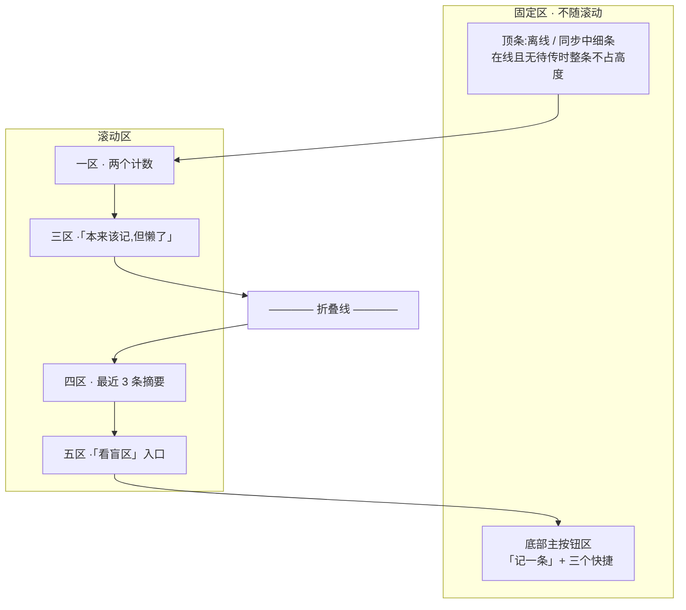

**折叠线以上必须完整出现的四样(任何机型、任何字号)**:

| 必须在折叠线以上 | 理由 |
|---|---|
| 两个计数(今天记了几条 / 今天有几次没记) | 它们是阶段 0 的全部输入,用户每天要看到自己在填这张表 |
| 主按钮「记一条」 | 首页的唯一目的 |
| 三个快捷(说 · 拍 · 写) | 省掉「进 `S-REC` 再选模式」这一步 |
| 「本来该记,但懒了」 | 它与「记一条」是一对,分开放会让第二个数被系统性少记 |

**折叠线以下可以放**:最近 3 条摘要、「看盲区」入口。**这两样一条都不许上移到主按钮之上。**

### 3.2 布局约束 —— 「距离尽可能短」的可测量形态

| 约束 | 数值口径 | 依据 |
|---|---|---|
| 主按钮**固定在底部**,不随滚动离开视口 | 贴安全区上沿,横向占满减两侧页边距 | 单手握持时拇指自然弧的最优区在屏幕下三分之一 |
| 主按钮与三个快捷**全部落在拇指可达区** | 三个快捷紧贴主按钮上方一行,与主按钮同一横向分布 | 同上 |
| **点击次数预算:冷启动到能开始输入不超过 2 次** | ① 打开应用 ② 点快捷或主按钮 | 多一次点击就是多一次放弃的机会(`模块 B · 采集层` §一) |
| **从任意屏回来再记一条不超过 2 次** | ① 回首页 ② 点按钮 | 同上 |
| **桌面壳上是 0 次** | 全局热键直接唤起 `S-REC`,不经首页 | `多端选型与端矩阵` §3.3.3 那张原生能力表 |
| 三个快捷与主按钮的**热区互不相邻到会误触** | 相邻热区之间留出不小于一个热区高度的三分之一 | §十二 的最小热区规则 |
| 顶条在线且无待传时**不占高度** | 不是隐藏内容而保留占位,是整条不渲染 | 否则首页永远少一行,而那一行 99% 的时间是空的 |
| 首页**没有横向滚动** | 三个快捷横排必须在最窄机型上放得下;放不下就换成两行,不做横滑 | 横滑会藏起第三个入口,而第三个入口是「写」 |

🔴 **首页不出现:覆盖率进度条、任何百分比、任何评价性文字、任何形式的连续天数。** 只有两个计数和一个按钮(`总纲` §2.3)。

### 3.3 元素清单

| 区 | 元素 | 取值来源 | 为空时 | 可点吗 | 禁用条件 | 无障碍朗读文本 |
|---|---|---|---|---|---|---|
| 顶 | 离线细条 | 设备网络状态 | 在线且队列为空时不渲染 | 否 | —— | 「离线中,已存在这台设备上,联网后自动同步」 |
| 顶 | 同步中细条 | 本地队列长度 | 队列为空时不渲染 | 否 | —— | 「正在同步 {n} 条」 |
| 一 | **今天记了 {n} 条** | 本机当日 `record_created` 计数(口径见 §十四) | 「今天还没记」 | 是 → `S-TL` 并定位到当天 | 无 | 「今天记了 {n} 条,点两下打开今天的记录」 |
| 一 | **今天有 {m} 次没记** | 本机当日 `record_skipped` 计数(口径见 §十四) | 显示 0,不显示为空 | 否 | —— | 「今天有 {m} 次没记」 |
| 二 | **主按钮「记一条」** | —— | 常驻 | 是 → `S-REC` 默认模式 | **永不禁用**(§一 推论 4) | 「记一条,按钮」 |
| 二 | 快捷 🎤 说 | —— | 常驻 | 是 → `S-REC` 语音模式 | 端不支持录音时改为不渲染,**不是灰掉**(见 §十) | 「用说的记一条,按钮」 |
| 二 | 快捷 📷 拍 | —— | 常驻 | 是 → `S-REC` 拍照模式 | 端不承接原图通道时不渲染(见 §十) | 「拍一张记一条,按钮」 |
| 二 | 快捷 ✍️ 写 | —— | 常驻 | 是 → `S-REC` 手写模式 | **永不禁用** | 「打字记一条,按钮」 |
| 三 | 「本来该记,但懒了」 | —— | 常驻 | 是,点一次 `m+1` | 计数写入本机失败时**仍可点**,失败进队列 | 「本来该记但懒了,按钮,点一次计一次」 |
| 四 | 最近 3 条摘要 | 本机 + 已同步的最新 3 条,按 §7.7 的排序 | **整个区隐藏**,不显示空插画 | 是 → `S-TL` | —— | 「最近记的:{时间} {来源} {标签状态}」 |
| 四 | 单条摘要里的标签状态 | 那条记录的当前状态(见 §六) | 无标签时显示「还没对上考点」 | 否 | —— | 「状态:{已对上 n 个考点 / 待补 / 没对上 / 正在认}」 |
| 四 | 单条摘要里的待传角标 | 本机队列 | 已同步时不渲染 | 否 | —— | 「还没同步」 |
| 五 | 「看盲区」入口 | —— | 骨架未就绪时仍显示,进去后是空态 | 是 → `S-BLIND` | 无 | 「看盲区,按钮」 |

🔴 **这张表里没有任何一格允许用户输入或系统存放题目内容。** 摘要那一格显示的是时间、来源名与标签状态,
**内容摘要只在 `S-TL` 上出现,而且它的上限由服务端字段的长度上限管住**(真源 `技术架构与接口契约` §八 那条「摘要有长度上限」)。

### 3.4 「本来该记,但懒了」这个按钮为什么在首页

它是阶段 0 两个数字里的第二个,而且**它衡量的是产品的摩擦,不是用户的懒**。
点一下就完,**不问原因、不填表单、不弹任何东西**,Toast「记下了」。

⚠️ **这个按钮永远不能被做成负面反馈**(不许出现「今天已经偷懒 3 次了」)。它只是计数。
⚠️ **它也不能被做成正面反馈** —— 不许在它旁边显示「比昨天少了 2 次」。两个方向都是在替用户判断。

**误点没有撤回路径**,这是一个已登记的缺口(§十七 `G-8`),不是已经想清楚的设计。

### 3.5 状态枚举

| 状态 | 触发 | 屏幕 | 四种态里的哪一种 |
|---|---|---|---|
| `HOME_FIRST` 首次打开 | 本机零记录且零队列 | 一区显示「今天还没记」;四区整区隐藏;主按钮下方一行说明「随手记一句就行,不用写完整」 | 空 |
| `HOME_NORMAL` 有数据 | 本机或云端有当日数据 | 见 §3.3 | —— |
| `HOME_LOADING` 首屏加载 | 已登录且需要拉云端当日计数 | 两个计数位置出骨架条,**主按钮与三个快捷正常可点** | 加载 |
| `HOME_OFFLINE` 离线 | 设备离线 | 顶条「离线中,已存在这台设备上」;计数只算本机 | —— |
| `HOME_SYNCING` 同步中 | 队列长度大于 0 且在线 | 顶条「正在同步 {n} 条」,完成后停留 2 秒消失 | —— |
| `HOME_CLOUD_ERROR` 云端读失败 | 已登录但当日计数拉不到 | 计数**回落到本机数**并在计数下方一行小字「云端的数还没拿到,这是这台设备上的」+ 重试 | 错误 |

🔴 **`HOME_LOADING` 与 `HOME_CLOUD_ERROR` 都不许挡住主按钮。** 首页加载失败时唯一不能失败的东西就是「再记一条」。

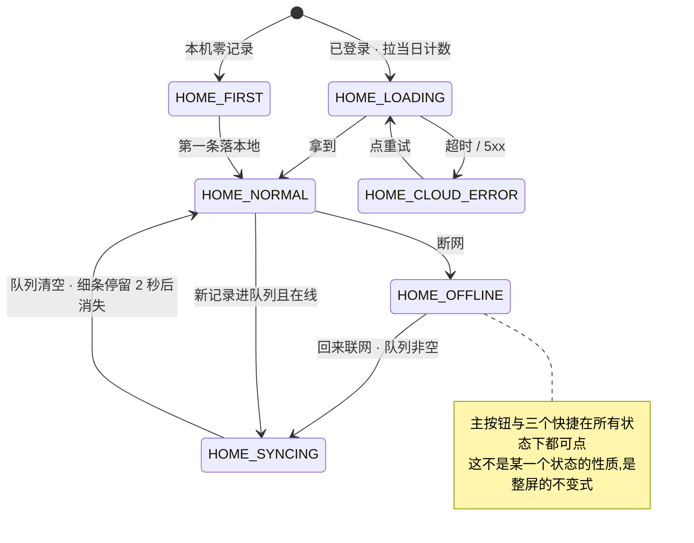

## 四、`S-REC` 记一次

**这一屏只有一件事:让「我刚才碰过这个」落成本机里的一条记录。** 它不判断对错、不给反馈、不算分,
记完唯一能听到的一句话是「已记下」,而那句话由本机写入触发,不发生在任何一次网络往返之后(§一 推论 1)。

> ⚠️ **目录 §零 登记的「五种方式」与真源对不上,本节写四种。** 采集入口的真源是
> [`模块 B · 采集层`](../modules/模块B-采集层.md) §2.2,它登记的是**四个入口** —— 语音记、拍照记、粘一段、记做题。
> 目录那五个词里:「手写文字」并入「粘一段」(两者是同一个 `text` 采集,打字与粘贴同路,`capture_type` 都是 `text`);
> 「从相册选图」不是独立入口,是拍照记在相机不可用时的降级子路径([`首次使用与权限申请`](首次使用与权限申请.md) §2.3);
> 「批量导入」不是采集方式,是离线队列补传(§九)。
> **本节以真源为准,按四种写。**

| 方式 | 用户动作 | 走不走识别 | 落本地那一刻记下什么 |
|---|---|---|---|
| 语音记 | 说一句 | 走(转写 + 打标) | 一条 `voice` 记录,内容空,标「(语音)」 |
| 拍照记 | 连拍合并 | 走(识别 + 打标) | 一条 `photo` 记录 + 原图留本机 |
| 粘一段 | 打字或粘贴 | 走(打标) | 一条 `text` 记录,内容即用户写的字 |
| 记做题 | 从树里选考点 | 🔴 **不走** —— 考点已选出,直接进覆盖层 | 一条带 nodeCode 的记录,直接挂考点 |

四种方式只在「采集」这一段不同,「落本地 → 记下 → 附加能力异步跑 → 卡片状态更新」这条主干完全同一根(§4.6)。
后面四种方式共享 `S-REC` 一屏,靠顶部模式段控(写 · 说 · 拍 · 做题)切换。

**`S-REC` 一屏的共享结构,四种方式逐份元素清单里不再重复:**

| 区 | 元素 | 取值来源 | 为空时 | 可点吗 | 禁用条件 | 无障碍朗读文本 |
|---|---|---|---|---|---|---|
| 顶 | 返回 | —— | 常驻 | 是 → `S-HOME` | **永不禁用** | 「返回首页」 |
| 顶 | 模式段控(写 · 说 · 拍 · 做题) | 当前模式 | 常驻 | 是,切换时**不打断已落本地的记录** | 端不支持的那一种不渲染(不是灰掉,见 §十) | 「记一次方式,写,说,拍,做题,当前{模式}」 |
| 顶 | 离线细条 / 同步中细条 | 设备网络状态 / 本地队列 | 在线且无待传时不渲染 | 否 | —— | 同 `S-HOME` 顶条(§3.3) |
| 中 | 采集区(随模式变) | 见 §4.1–§4.4 | 见各模式 | 见各模式 | 见各模式 | 见各模式 |
| 中 | 来源框 | 用户输入(机构名/书名) | 可留空 | 是 | 无 | 「来源,选填,机构或书名」 |
| 底 | 主按钮「记下」 | —— | 常驻 | 是 | 内容为空时禁用(见各模式) | 「记下,按钮」 |

🔴 **模式段控切换时,已落本地的记录不受影响。** 用户可以说一句、再切到「写」补一句、再切到「拍」拍一张 ——
每次落本地都独立成立,段控只是换采集形态,不是换「当前这一条」。

**一屏四区,自上而下:**

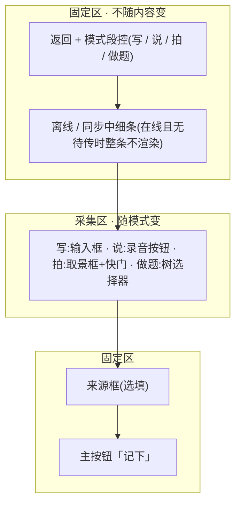

**主按钮「记下」在四种模式下永远是屏幕的最后一个动作,而且它永远是本机写入的触发点,不是网络请求的触发点。**
用户走到这里,离「记录成立」只差一次点击;点击之后,无论网络怎样,记录都在。

---

### 4.1 语音记

**入口。** 三处:① 首页快捷「🎤 说」→ 进 `S-REC` 语音模式;② `S-REC` 内模式段控切到「说」;
③ 桌面壳全局热键(⌥空格)唤起 `S-REC` 后切「说」([`多端选型与端矩阵`](../../technical/多端选型与端矩阵.md) §3.3.3)。

**进来时的初始状态:** 麦克风权限按「点开始录那一次」申请,**不是**进屏时、**不是**点「🎤 说」时申请
([`首次使用与权限申请`](首次使用与权限申请.md) §2.1)。首次进来出麦克风说明卡片(页内卡片,不是浮层);
已授权则直接停在录音按钮,按钮可点,来源框为空。

**屏幕与元素清单**(共享结构见 §四 开头那张表,这里只列语音独有的):

| 元素 | 取值来源 | 为空时 | 可点吗 | 禁用条件 | 无障碍朗读文本 |
|---|---|---|---|---|---|
| 录音按钮「按住说话」 | —— | 常驻 | 是,按住即录、松开即记 | 🔴 麦克风被永久拒绝时**不灰掉**,点了先出「去设置」说明卡片,仍能切手写 | 「按住说话,松开记下」 |
| 波形 + 计时 | 正在录制的音频 | 未录时不渲染 | 否 | —— | 「开始录音」「已记下」两句,不逐秒播报 |

**逐步骤交互:**

| 步 | 用户动作 | 端做什么 | 落本地时点 | 端点 | 响应下屏幕怎么变 |
|---|---|---|---|---|---|
| 1 | 按住录音按钮说话 | 开录,出波形+计时;首次先走权限说明卡片 | —— | —— | 波形随声音起伏 |
| 2 | 松手 | 🔴 **先写本机存储**:一条 `voice` 记录,内容空、标「(语音)」,然后弹 Toast「已记下」 | **松手这一刻,任何网络往返之前** | 本机写入 | Toast「已记下」,2 秒消失 |
| 3 | ——(自动) | 本机写入成功后,再发 `POST /records` | 已发生 | `POST /records`(在线时;离线进队列,见 §九) | 无感 |
| 4 | ——(自动) | 拿到标识后发音频转写 | 已发生 | `POST /records/{id}/audio` | 无感 |
| 5 | ——(自动) | 转写文本回填,触发闭集打标 | 已发生 | `POST /records/{id}/tags/suggest` | 卡片「正在认」→「已对上」或「没对上」 |
| 6 | 转写失败时 | 记录仍在,内容空、标「(语音)」,给三条下一步 | 已发生 | —— | 「重录 / 补一句文字 / 自己从树里挑」 |

🔴 **第 2 步先于第 3 步,这是不可打乱的次序。** 转写、打标全部在落本地之后;它们失败只改卡片上的一行小字,不改记录的存在(§一 推论 2、3)。
音频字节在转写完成前只在本机内存,不落本机盘、不落服务端盘;转写失败即弃,不留存([`总路线图 · 脑图与父子待办`](../../execution/INDEX.md) `1.1.1.5`)。

**各响应分支下屏幕怎么变**(`POST /records` 与转写的返回,分档处理,错误码见 [`总纲`](INDEX.md) §三):

| 分支 | 屏幕 | 记录留住了吗 |
|---|---|---|
| 在线,`POST /records` 成功 | 无感,继续转写 | ✅ |
| 离线 | 顶条「离线中,已存在这台设备上」,记录进队列,条数可见 | ✅ |
| 额度尽(转写时) | 卡片标「(语音)」,下方「手动补一句」+「看看档位」文字链 | ✅ |
| 识别服务 5xx / 超时 | 卡片标「(语音)」,可重试 | ✅ |
| `NO_MATCH` | 卡片「没对上」,可手动挂 / 就这样留着 | ✅ |

**时序:**

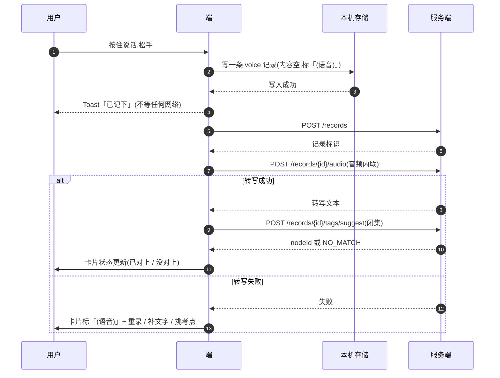

**中途退出:**

| 退出点 | 按返回键 | 切后台 | 杀进程 |
|---|---|---|---|
| 录音中(未松手) | 丢弃这次未完成的录音,**记录还没产生** | 录音暂停,松手前仍无记录 | 录音丢弃,**记录还没产生** |
| 松手后、转写前 | 记录已在本机,返回后卡片仍在 | 记录已在本机,回来即见 | 🔴 记录已在本机,**不丢**;音频不持久化,转写要重录 |
| 转写中 | 记录在本机,转写继续跑,结果下次可见 | 同左 | 记录在本机,转写结果不回填(音频不补),下次可重录 |

**这一种独有的失败**(通用失败留给 §十五):

| 失败 | 界面 | 记录留住了吗 |
|---|---|---|
| 静音 / 太短,没有可识别的语音 | 卡片标「(语音)」+「重录」 | ✅ |
| 时长超上限(上限见 `总路线图 · 脑图与父子待办` `1.1.1.4`) | 自动切断,切出的这段照样落 | ✅ |
| 麦克风权限被拒 | 就地切手写,输入框已聚焦 | ✅(换手写仍能记) |
| 转写失败(服务不可用 / 额度尽) | 卡片标「(语音)」+ 手动补 | ✅ |

**四端:** Web/H5/Pad ✅ · 桌面壳 ✅ · 移动 App ✅ · 小程序 ✅(录音屏在)。差异见 §十。

---

### 4.2 拍照记

**入口。** 三处:① 首页快捷「📷 拍」→ 进 `S-REC` 拍照模式;② `S-REC` 内模式段控切到「拍」;
③ 桌面壳全局热键唤起后切「拍」。

**进来时的初始状态:** 相机权限按「点打开相机那一次」申请,点「📷 拍」只出说明卡片不申请(同 §2.1)。
首次进来出相机说明卡片(页内卡片),文案里有「图只存在这台设备上」这一句;已授权则直接进取景框。

**屏幕与元素清单**(共享结构见 §四 开头,这里只列拍照独有的):

| 元素 | 取值来源 | 为空时 | 可点吗 | 禁用条件 | 无障碍朗读文本 |
|---|---|---|---|---|---|
| 取景框 | 相机画面 | —— | 否 | 相机不可用时整区换成「从相册选」+「先打字」 | 「相机已打开,拍一张然后点记下」 |
| 快门 | —— | 常驻 | 是 | 相机永久拒绝时不灰掉,点了先出「去设置」说明卡片 | 「拍一张」 |
| 连拍缩略图 | 本次已拍的原图 | 一张都未拍时不渲染 | 是,点开可删掉某张 | 无 | 「已拍 {n} 张」 |
| 来源框 | 用户输入 | 可留空 | 是 | 无 | 「来源,选填,机构或书名」 |
| 主按钮「记下」 | —— | 常驻 | 是 | 一张都未拍时**禁用** | 「记下,按钮」 |

**逐步骤交互:**

| 步 | 用户动作 | 端做什么 | 落本地时点 | 端点 | 响应下屏幕怎么变 |
|---|---|---|---|---|---|
| 1 | 点「打开相机」 | 申请相机(首次),出取景框 | —— | —— | 取景框亮起 |
| 2 | 拍一张 / 连拍 | 原图写本机(留存,到期转归档),出缩略图 | 原图先落本机 | 本机原图留存 | 缩略图 +1 |
| 3 | 点「记下」 | 🔴 **先写本机存储**:一条 `photo` 记录,再弹 Toast「已记下」 | **点记下这一刻,任何网络往返之前** | 本机写入 | Toast「已记下」 |
| 4 | ——(自动) | 再发 `POST /records` | 已发生 | `POST /records`(离线进队列) | 无感 |
| 5 | ——(自动) | 发识别:原图内联 base64,不上传不落服务端盘 | 已发生 | `POST /records/{id}/image` | 无感 |
| 6 | ——(自动) | 识别回填 → 闭集打标 | 已发生 | `POST /records/{id}/tags/suggest` | 卡片「正在认」→「已对上」/「没对上」 |
| 7 | 识别失败时 | 记录仍在,原图在本机,没考点,给「重试 / 手动挂载」 | 已发生 | —— | 「重试 / 手动挂载」 |

🔴 **原图只在本机**:识别时原图内联 base64 发模型,服务端全程不落盘、不落对象存储、不打进日志
([`原图存储：判据层与存储层`](../../technical/原图存储-判据层与存储层.md)、[`技术架构与接口契约`](../../technical/INDEX.md) §八)。
连拍单次张数有上限(上限见 `技术架构与接口契约` §6.2),超了由本屏拦。

**各响应分支下屏幕怎么变:**

| 分支 | 屏幕 | 记录留住了吗 |
|---|---|---|
| 在线,`POST /records` 成功 | 无感,继续识别 | ✅ |
| 离线 | 顶条「离线中,已存在这台设备上」;记录进队列,**原图仍在本机** | ✅ |
| 额度尽(识别时) | 卡片下方「手动挂考点」+「看看档位」文字链;原图仍在本机 | ✅ |
| 识别服务 5xx / 超时 | 卡片「没对上」,可重试 / 手动挂,原图仍在本机 | ✅ |
| `NO_MATCH` | 卡片「没对上」,可手动挂 / 就这样留着 | ✅ |

**时序:**

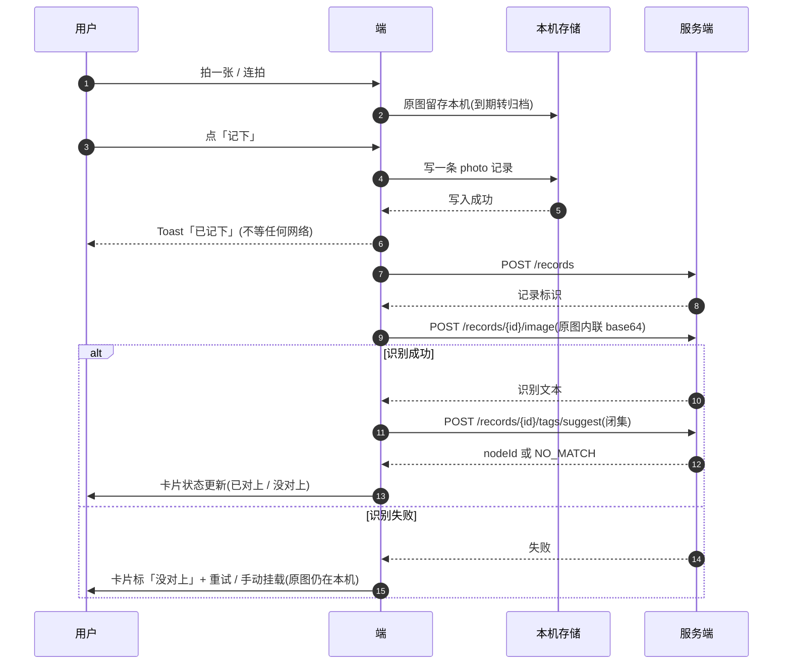

**中途退出:**

| 退出点 | 按返回键 | 切后台 | 杀进程 |
|---|---|---|---|
| 取景 / 连拍中(未记下) | 已拍的缩略图作废,**记录还没产生** | 取景暂停,回来继续取景 | 已拍缩略图丢失,**记录还没产生** |
| 点记下后、识别前 | 记录已在本机,原图在本机,返回后卡片在 | 记录已在本机,回来即见 | 🔴 记录与原图都在本机,**不丢**;识别下次补 |
| 识别中 | 记录与本机原图都在,识别继续跑,结果下次可见 | 同左 | 记录与本机原图都在,识别结果不回填,下次可重试 |

**这一种独有的失败:**

| 失败 | 界面 | 记录留住了吗 |
|---|---|---|
| 对焦失败 / 拍糊 | 提示重拍,那张不落 | ✅(还没落,不算失败) |
| 连拍超张数上限(见 `技术架构与接口契约` §6.2) | 本屏拦下,提示已达上限 | ✅ |
| 相机权限被拒 | 降级「从相册选」→ 相册也不行 → 手写(§2.3 权限表) | ✅ |
| 相册只授权部分(iOS 受限) | 给「改选照片」入口,不劝给全部 | ✅ |
| 识别失败 | 记录在,原图在本机,可重试 / 手动挂 | ✅ |
| 图片过大 / 格式不支持 | 提示重拍 | ✅ |

**四端:** Web/H5/Pad ✅(需安全上下文/HTTPS)· 桌面壳 ✅ · 移动 App ✅ · 小程序 ❌(不做拍照、不落原图字节)。差异见 §十。

---

### 4.3 粘一段

**入口。** 四处:① 首页快捷「✍️ 写」→ 进 `S-REC` 手写模式;② 主按钮「记一条」→ `S-REC` 手写模式(默认模式);
③ `S-REC` 内模式段控切到「写」;④ 桌面壳全局热键唤起(默认落在手写模式)。

**进来时的初始状态:** 输入框已聚焦、键盘已起,来源框为空,占位符「刚才碰了什么?一句话就行」。

**屏幕与元素清单**(共享结构见 §四 开头,这里只列粘一段独有的):

| 元素 | 取值来源 | 为空时 | 可点吗 | 禁用条件 | 无障碍朗读文本 |
|---|---|---|---|---|---|
| 内容输入框 | 用户打字 / 粘贴 | 占位符「刚才碰了什么?一句话就行」 | 是 | 无 | 「刚才碰了什么,一句话就行,输入框」 |
| 来源框 | 用户输入 | 可留空 | 是 | 无 | 「来源,选填,机构或书名」 |
| 主按钮「记下」 | —— | 常驻 | 是 | 🔴 输入为空时**禁用** —— 空不是一条记录,这是内容约束不是识别等待(不违反 §一 推论 2) | 「记下,按钮」 |

**逐步骤交互:**

| 步 | 用户动作 | 端做什么 | 落本地时点 | 端点 | 响应下屏幕怎么变 |
|---|---|---|---|---|---|
| 1 | 打字 / 粘贴文本 | 输入内容,超长按上限截断并页内提示 | —— | —— | 输入框随输入变化 |
| 2 | 点「记下」 | 🔴 **先写本机存储**:一条 `text` 记录,内容即用户写的字,再弹 Toast「已记下」 | **点记下这一刻,任何网络往返之前** | 本机写入 | Toast「已记下」 |
| 3 | ——(自动) | 再发 `POST /records` | 已发生 | `POST /records`(离线进队列) | 无感 |
| 4 | ——(自动) | 触发闭集打标 | 已发生 | `POST /records/{id}/tags/suggest` | 卡片「正在认」→「已对上」/「没对上」 |

🔴 **文本长度有上限**(见 `技术架构与接口契约` §八 那条「摘要有长度上限」),截断不是失败,是内容边界。
🔴 **闭集打标**:识别只从候选里选一个考点标识或返回「没对上」,永不生成标签文本(§二 · `R-07`)。

**各响应分支下屏幕怎么变:**

| 分支 | 屏幕 | 记录留住了吗 |
|---|---|---|
| 在线,`POST /records` 成功 | 无感,继续打标 | ✅ |
| 离线 | 顶条「离线中,已存在这台设备上」,记录进队列 | ✅ |
| 打标服务 5xx / 超时 | 卡片「待补」,稍后自动重试(§九) | ✅ |
| `NO_MATCH` | 卡片「没对上」,可手动挂 / 就这样留着 | ✅ |

**时序:**

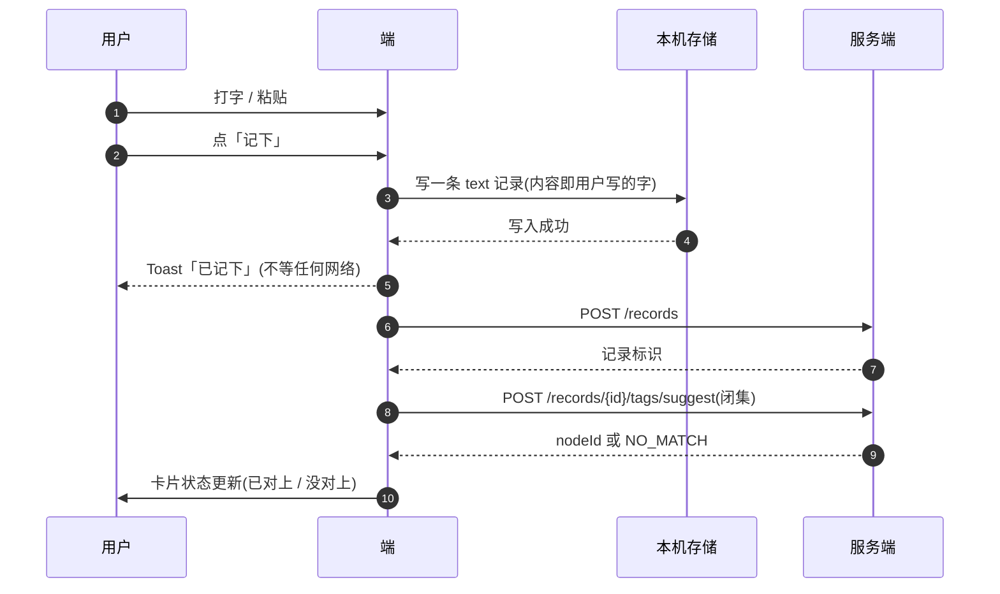

**中途退出:**

| 退出点 | 按返回键 | 切后台 | 杀进程 |
|---|---|---|---|
| 输入中(未记下) | 浮层问一次「有没写完的内容」,选放弃则**记录还没产生** | 输入内容保留,回来继续 | 输入内容丢失,**记录还没产生** |
| 点记下后、打标前 | 记录已在本机,返回后卡片在 | 记录已在本机,回来即见 | 🔴 记录已在本机,**不丢** |
| 打标中 | 记录在本机,打标继续跑,结果下次可见 | 同左 | 记录在本机,打标结果不回填,下次可手动挂 |

**这一种独有的失败:**

| 失败 | 界面 | 记录留住了吗 |
|---|---|---|
| 粘贴超长文本 | 按上限截断 + 页内提示「只留了前面这些」 | ✅ |
| 粘贴的是图片 / 富文本 | 剥离成纯文本,剥离不掉则清空 | ✅ |
| 输入为空时点「记下」 | 「记下」本身禁用,点不到 | ✅(空不是记录) |

**四端:** Web/H5/Pad ✅ · 桌面壳 ✅ · 移动 App ✅ · 小程序 ✅(文字采集屏)。差异见 §十。

---

### 4.4 记做题

**入口。** 两处:① `S-REC` 内模式段控切到「做题」;② 桌面壳全局热键唤起后切「做题」。
首页三个快捷里**没有**它,主按钮默认进手写 —— 记做题是唯一一条不依赖模型的完整路径,是保底,但不抢首页入口。

**进来时的初始状态:** 骨架树选择器展开;骨架未就绪时「做题」给空态理由(「考点表还没建好」),可切其他方式记。

**屏幕与元素清单**(共享结构见 §四 开头,这里只列记做题独有的):

| 元素 | 取值来源 | 为空时 | 可点吗 | 禁用条件 | 无障碍朗读文本 |
|---|---|---|---|---|---|
| 树选择器 | `GET /syllabus/tree` | 骨架未就绪时空态 | 是 | 骨架未就绪时禁用 | 「从考点表里挑一个」 |
| 已选考点名 | 用户所选叶子节点 | 未选时不渲染 | 否 | —— | 「已选,{考点名}」 |
| 来源框 | 用户输入 | 可留空 | 是 | 无 | 「来源,选填,机构或书名」 |
| 主按钮「记下」 | —— | 常驻 | 是 | 未选考点时**禁用** | 「记下,按钮」 |

**逐步骤交互:**

| 步 | 用户动作 | 端做什么 | 落本地时点 | 端点 | 响应下屏幕怎么变 |
|---|---|---|---|---|---|
| 1 | 从树里选一个叶子考点 | 高亮选中,不能新建、不能填文本 | —— | —— | 已选考点名亮起 |
| 2 | 点「记下」 | 🔴 **先写本机存储**:一条带 nodeCode 的记录,再弹 Toast「已记下」 | **点记下这一刻,任何网络往返之前** | 本机写入 | Toast「已记下」 |
| 3 | ——(自动) | 再发 `POST /records`(带 nodeCode) | 已发生 | `POST /records` | 无感 |

🔴 **记做题不走打标。** 考点是用户自己选的,写进去即挂考点、直接进覆盖层
([`模块 B · 采集层`](../modules/模块B-采集层.md) §2.2)。它是模型全挂时产品仍可用的保底。

**各响应分支下屏幕怎么变:**

| 分支 | 屏幕 | 记录留住了吗 |
|---|---|---|
| 在线,`POST /records` 成功 | 卡片「已对上」,直接进覆盖层 | ✅ |
| 离线 | 顶条「离线中,已存在这台设备上」,记录进队列 | ✅ |
| 选中考点已被归档 / 下线 | 提交时提示「考点变了」,重新选 | ✅(还没落,不算失败) |

**时序:**

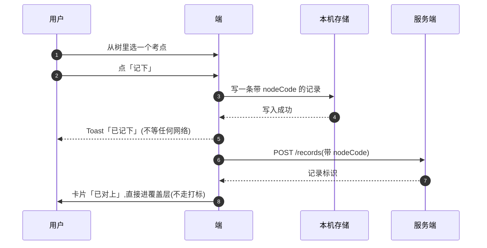

**中途退出:**

| 退出点 | 按返回键 | 切后台 | 杀进程 |
|---|---|---|---|
| 选考点中(未记下) | 选中态作废,**记录还没产生** | 选中态保留,回来继续 | 选中态丢失,**记录还没产生** |
| 点记下后、同步前 | 记录已在本机,返回后卡片在 | 记录已在本机,回来即见 | 🔴 记录已在本机,**不丢** |

**这一种独有的失败:**

| 失败 | 界面 | 记录留住了吗 |
|---|---|---|
| 骨架未就绪,树拉不到 | 空态「考点表还没建好」+ 可切其他方式记 | ✅(换方式仍能记) |
| 选中考点在提交前被归档 / 下线 | 提交时提示「考点变了」,重新选 | ✅ |

**四端:** Web/H5/Pad ✅ · 桌面壳 ✅ · 移动 App ✅ · 小程序 ❌(无骨架树屏)。差异见 §十。

---

### 4.5 中途退出矩阵

**行 = 四种方式 × 每种的关键步骤;列 = 五种退出。** 每一格是「记录状态 + 用户回来时看到什么」。
➖ = 记录还没产生(用户没完成采集动作,不算丢);✅ = 记录已在本机,永不丢。

| 方式 · 关键步骤 | 按返回键 | 切后台 | 被系统杀 | 断网 | 强制退出 |
|---|---|---|---|---|---|
| 语音 · 录音中(未松手) | ➖ 未产生 · 回来是空录音态 | ➖ 未产生 · 录音暂停,松手前仍无记录 | ➖ 未产生 · 回来是空录音态 | ➖ 未产生 | ➖ 未产生 · 回来是空录音态 |
| 语音 · 松手后(已落本地) | ✅ 在本机 · 回来卡片在 | ✅ 在本机 · 回来即见 | ✅ 在本机 · 转写要重录(音频不持久化) | ✅ 在本机 · 待传,细条可见 | ✅ 在本机 · 同被杀 |
| 拍照 · 取景/连拍中(未记下) | ➖ 未产生 · 缩略图作废 | ➖ 未产生 · 取景暂停 | ➖ 未产生 · 缩略图丢失 | ➖ 未产生 | ➖ 未产生 · 缩略图丢失 |
| 拍照 · 点记下后(已落本地) | ✅ 在本机 · 原图在本机,卡片在 | ✅ 在本机 · 回来即见 | ✅ 在本机 · 原图在本机,识别下次补 | ✅ 在本机 · 待传,原图在本机 | ✅ 在本机 · 同被杀 |
| 粘一段 · 输入中(未记下) | ➖ 未产生 · 浮层问一次 | ➖ 未产生 · 输入保留 | ➖ 未产生 · 输入丢失 | ➖ 未产生 | ➖ 未产生 · 输入丢失 |
| 粘一段 · 点记下后(已落本地) | ✅ 在本机 · 回来卡片在 | ✅ 在本机 · 回来即见 | ✅ 在本机 · 不丢 | ✅ 在本机 · 待传,细条可见 | ✅ 在本机 · 同被杀 |
| 记做题 · 选考点中(未记下) | ➖ 未产生 · 选中态作废 | ➖ 未产生 · 选中态保留 | ➖ 未产生 · 选中态丢失 | ➖ 未产生 | ➖ 未产生 · 选中态丢失 |
| 记做题 · 点记下后(已落本地) | ✅ 在本机 · 回来卡片在 | ✅ 在本机 · 回来即见 | ✅ 在本机 · 不丢 | ✅ 在本机 · 待传,细条可见 | ✅ 在本机 · 同被杀 |

🔴 **没有任何一格允许出现「记录丢了」。** 上半区(➖)是「记录还没产生」—— 用户没完成采集动作,不是丢;
下半区(✅)是「记录已在本机」—— 任何退出方式都不影响它存在。断网只影响同步与识别,不影响记录本身(§九)。
「被系统杀」与「强制退出」在已落本地之后等价:本机存储已写,记录照在。

---

### 4.6 四种方式的共同骨架

**主干只有一条,四种方式只在「采集」这一段不同。** 落本地永远发生在第一次网络往返之前,「已记下」由本机写入触发。

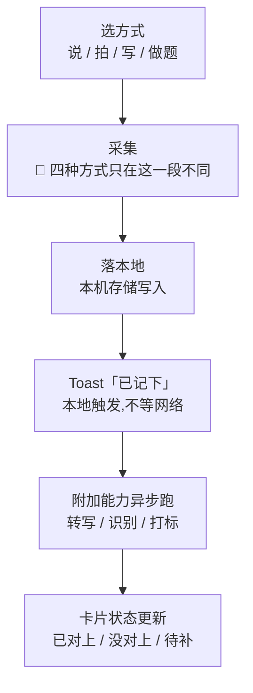

- **`B 采集` 这一段**:语音 = 说一句;拍照 = 连拍合并;粘一段 = 打字/粘贴;记做题 = 从树里选考点。
- **`C 落本地`**:所有失败路径里唯一不许失败的一步(§一)。它写的是「碰过什么、来源是什么、什么时候」,没有任何字段装得下题干。
- **`E 附加能力`**:可失败,失败只改 `F` 卡片上的一行小字,不改记录的存在(§一 1.2 那张穷举表)。
- **`F 卡片状态`**:状态全集与状态名在 [`打标与未分类`](打标与未分类.md) §4.1,这里只引用不重定义。

## 五、`S-TL` 时间线

**时间线是「这一条记录存在」的用户可见证明。** 它不排序、不评分、不总结,只把已经落下的记录按天摊开。
用户从首页两个计数点进来、从这里删掉一条、从这条线的任何一张卡片回看「我当时记了什么」。它只回答有没有、几次、多久前(`用户侧功能规格 · 总纲与全局约定` §2.3)。

### 5.1 屏幕结构:一个固定区,一个按天分组的滚动区

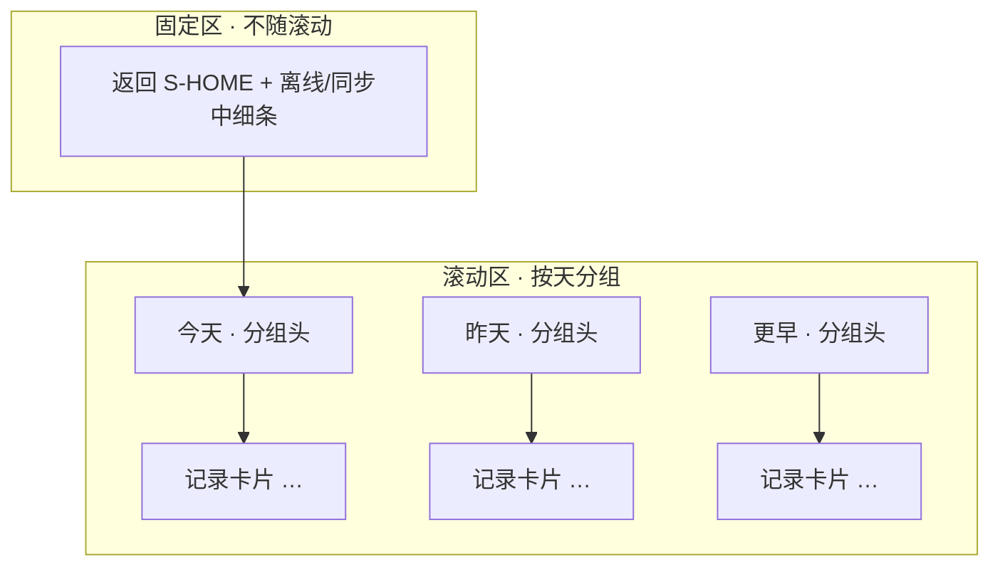

**没有筛选器、没有搜索框、没有横向滚动的多栏**(见 5.5 为什么)。整个滚动区只有一种结构:分组头 + 卡片。

### 5.2 元素清单

| 区 | 元素 | 取值来源 | 为空时 | 可点吗 | 禁用条件 | 无障碍朗读文本 |
|---|---|---|---|---|---|---|
| 顶 | 返回 | —— | 常驻 | 是 → `S-HOME` | **永不禁用** | 「返回首页」 |
| 顶 | 离线 / 同步中细条 | 设备网络状态 / 本地队列长度 | 在线且无待传时不渲染 | 否 | —— | 同 `S-HOME` 顶条(§3.3) |
| 滚 | 「今天」分组头 | 设备本地自然日(§7.6) | 今天无记录时不渲染 | 否 | —— | 「今天,{n} 条」 |
| 滚 | 记录卡片 | 本机 + 已同步,按 §7.7 排序 | 整屏空态「还没有记录」+ 按钮「记一条」 | 是 → 记录详情 | 无 | 「{时间} {来源} {标签状态}」 |
| 滚 | 卡片上的标签状态 | 那条记录的当前状态(§六) | 无标签显示「还没对上考点」 | 否 | —— | 见 §六 状态到文字对照表 |
| 滚 | 卡片上的待传角标 | 本地队列 | 已同步时不渲染 | 否 | —— | 「还没同步」 |
| 滚 | 卡片上的图标记 | 本机原图 | 无原图时不渲染 | 否(纯标记) | —— | 「有图」 |

🔴 **这张表里没有任何一格允许用户输入或系统存放题目内容。** 卡片上的内容摘要上限由服务端字段的长度上限管住(真源 [`技术架构与接口契约`](../../technical/INDEX.md) §5.1、§八),§3.3 那条约束在这里同样成立。

### 5.3 按天分组与「今天」的分组头

- 分组键是**设备本地自然日**(§7.6),不是「24 小时内」,跨零点后新的一天另起一个分组头。
- 「今天」分组头永远置顶;**昨天、更早**按时间倒序往下排。分组头右侧不放任何条数计数——那条线不引入「连续」这一概念。
- 首页两个计数(§3.3)点进来的深链,定位到当天分组头并把它滚到视口顶部。

### 5.4 每条卡片上显示什么

| 卡片上出现 | 取值 | 为空/无时 |
|---|---|---|
| 时间 | 相对时间 + 绝对时间(§7.6 口径) | —— |
| 来源名 | 用户填的来源 | 显示「没写来源」,不隐藏这一格 |
| 标签状态 | §六 那张表 | 无标签显示「还没对上考点」 |
| 待传角标 | 本地队列 | 已同步不渲染 |
| 图标记 | 本机原图存在 | 无原图不渲染 |

**卡片上不出现**内容全文、不出现任何评价性文字。内容摘要只在详情里按上限截断显示。

### 5.5 筛选与搜索:没有,这里写明为什么没有

**没有筛选、没有搜索。** 三条理由,任一条单独成立:

1. **数据量级**:阶段 0 是自己用两周,时间线一屏就能装下,筛选是在为不存在的规模买单。
2. **检索会诱使产品去存内容**:搜索的天然对象是「这条记了什么」,而内容的摘要长度受服务端字段上限管住、且本产品结构上不承载题干——一旦做了搜索,「把能装题干的东西当索引」就只差一步。
3. **这一屏只回答三件事**:有没有、几次、多久前。按考点筛选属于 `S-BLIND`,按标签处理属于 `S-TAG`,都不是时间线的职责。

若将来确实需要,登记进 §十七,不在这里直接加。

### 5.6 下拉刷新与上拉加载的三态

| 动作 | 三态 | 超时兜底 |
|---|---|---|
| 下拉刷新 | 空闲 → 刷新中 → 完成(回到空闲) | 按 `用户侧功能规格 · 总纲与全局约定` §2.5 的错误态,不无限转圈 |
| 上拉加载 | 有更多 → 加载中 → 到底(无更多则不显示「加载中」) | 同上 |

骨架屏与超时时机的阈值一律指针,不写字面量:[`首次使用与权限申请`](首次使用与权限申请.md) §1.6.2、[`全局组件与交互模式库`](全局组件与交互模式库.md) `P-LIST`。刷新**不重建 DOM、不夺焦点**,见 [`无障碍与多端适配`](无障碍与多端适配.md) §7.1。

### 5.7 删除一条记录的完整路径

**入口**:Web / 桌面是行内「删除」按钮(键盘可达,见 [`无障碍与多端适配`](无障碍与多端适配.md) §11.1);移动是左滑出删除;小程序是长按或按钮(无左滑,系统返回手势冲突,见 [`无障碍与多端适配`](无障碍与多端适配.md) §二)。

**确认**:删除不可逆 → 浮层(总纲 §2.2 三形态里的第三种)。

> 「删除这条记录?删了以后盲区里的数字会跟着变。**原图不受影响,还在原图管理里。**
> [删除] [取消]」

**删了之后三样东西各自的去向**:

| 被删掉的 | 去向 |
|---|---|
| 记录本身 | 真删。`DELETE /records/{id}`,真源 [`技术架构与接口契约`](../../technical/INDEX.md) §6.2 |
| 标签与覆盖度 | 级联删标签,覆盖层重算。已计入覆盖度的考点随之减,盲区数字跟着变(§6.2 同一条) |
| 🔴 原图 | **不删。** 原图有独立的生命周期:到期转归档、只在 `S-RAW` 由用户手动删(真源 [`原图存储：判据层与存储层`](../../technical/原图存储-判据层与存储层.md)、[`设置与原图`](设置与原图.md))。删记录不连带删图 |

**能不能撤销**:🚧 **形态未定。** 前端有删除动作、后端有级联契约,中间「能不能撤销、撤销窗口多长」没有人定过——这是 [`模块 B · 采集层`](../modules/模块B-采集层.md) §六 `B-2` 已登记的缺口,阶段 0 自用阶段误删可以直接改库。

### 5.8 状态枚举

| 状态 | 触发 | 屏幕 | 四种态 |
|---|---|---|---|
| `TL_EMPTY` 空 | 本机 + 云端都无记录 | 「还没有记录」+ 按钮「记一条」 | 空 |
| `TL_LOADING` 首屏加载 | 已登录需要拉云端 | 骨架占位保持卡片形状,返回与离线细条正常 | 加载 |
| `TL_NORMAL` 有数据 | 拿到数据 | 见 §5.2–§5.4 | —— |
| `TL_LOADING_MORE` 上拉加载 | 滚动到底且有更多 | 底部一行加载中,不盖住已有卡片 | 加载 |
| `TL_ERROR` 云端读失败 | 超时 / 5xx | 本机记录照常显示,云端段给错误态 + 重试 | 错误 |
| `TL_OFFLINE` 离线 | 设备离线 | 只显示本机记录,顶条离线细条 | —— |

🔴 **`TL_ERROR` 与 `TL_OFFLINE` 都不许把本机已有的记录藏起来。** 云端拉不到,本机那份照样能看——「记录存在」不依赖云端读数。

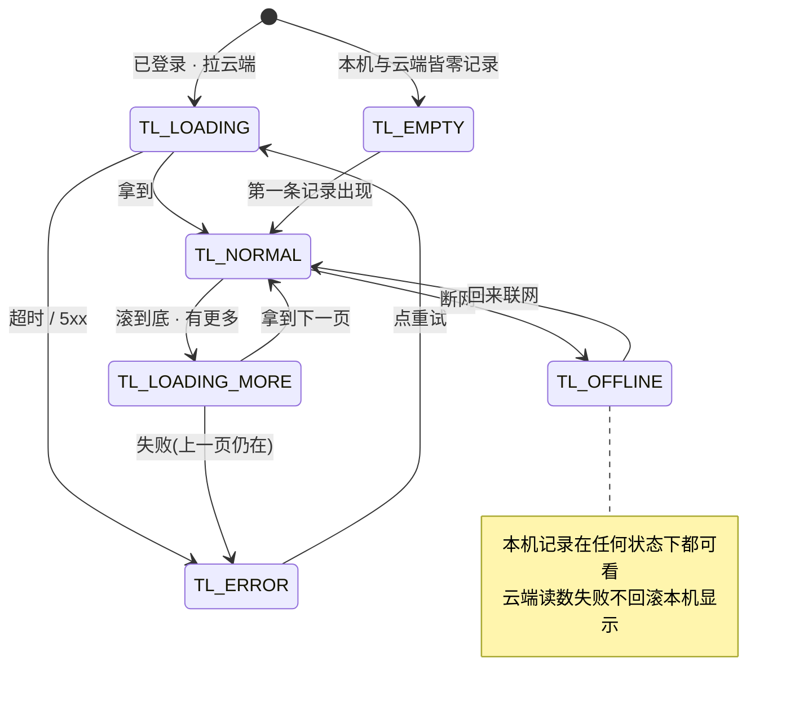

---

## 六、一条记录的生命周期状态机 + 状态到文字的对照

**一条记录有两条轨**:主轨是记录本身(草稿 → 已落本地 → 待上传 → 已同步),附加能力轨是它身上的标签(正在认 → 待确认 → 已确认,或拐进没对上 / 待补 / 已丢弃)。两条轨并行,主轨决定「这条记录在不在」,附加能力轨决定「它身上挂没挂考点」。状态全集与状态名的真源在 [`打标与未分类`](打标与未分类.md) §4.1,这里只画「落在三屏上」的那一部分,不重定义。

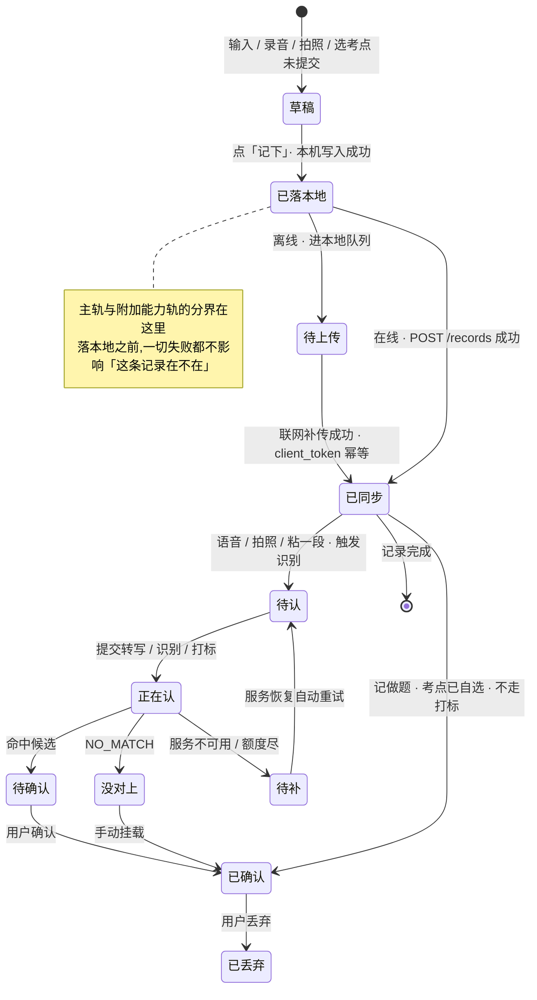

🔴 **「记做题」不经过附加能力轨**:考点是用户自己选的,`已同步` 之后直接 `已确认`(§4.4)。它是模型全挂时产品仍可用的保底。

### 6.1 每个状态的触发、可逆性、计不计覆盖度、卡片原文

| 状态 | 触发 | 可逆吗 | 计不计覆盖度 | 卡片上显示的原文 |
|---|---|---|---|---|
| 草稿 | 采集动作进行中,未点「记下」 | 可(丢弃或继续) | 不计(记录还没产生) | 不出现(没有卡片) |
| 已落本地 | 点「记下」,本机写入成功 | 可(删除,§5.7) | 不计 | 卡片出现,带「还没同步」角标 |
| 待上传 | 离线,进本地队列 | 可(删除) | 不计 | 「还没同步」 |
| 已同步 | 服务端返回记录标识 | 可(删除) | 覆盖度由标签决定,记录本身与覆盖无关 | 无角标 |
| 正在认 | 触发转写 / 识别 / 打标 | 可(不影响记录) | 不计 | 「正在认」 |
| 待确认 | 命中候选,等用户确认 | 可(丢弃 / 改选) | 不计(确认前) | 「待确认」 |
| 已确认 | 用户确认 / 记做题 / 手动挂载 | 可(丢弃) | ✅ **计** | 「已对上:{考点名}」 |
| 没对上 | 识别返回 `NO_MATCH` | 可(手动挂) | 不计 | 「没对上」 |
| 待补 | 识别服务不可用 / 额度尽 | 可(手动挂 / 就这样留着) | 不计 | 「待补」 |
| 已丢弃 | 用户丢弃某个标签 | 可(重新确认) | 不计(可见但不计,`宁缺毋滥`) | 「已丢弃」 |

### 6.2 状态 → 上屏文字对照表

**记录详情 = `S-TL` 内的单条详情子视图**(route `records.detail`,见 [`无障碍与多端适配`](无障碍与多端适配.md) §3.4 深链表);它承载的手动挂载、确认、丢弃操作在 [`打标与未分类`](打标与未分类.md) 里,本节只写它在对照表里那一列的上屏文字。

**同一个状态,在首页摘要、时间线卡片、记录详情三处的文字可以不同,但都在这张表里。** 三处不许冒出这张表之外的第四种说法。

| 状态 | 首页摘要(最近 3 条) | 时间线卡片 | 记录详情 |
|---|---|---|---|
| 正在认 | 「正在认」 | 「正在认」 | 「正在认,稍后自动出结果」 |
| 待确认 | 「待确认」 | 「待确认」 | 「有 {n} 个候选,等你挑」 |
| 已确认 | 「已对上 {n} 个考点」 | 「已对上:{考点名}」 | 「已对上:{考点名}(你自己选的 / 认出来的)」 |
| 没对上 | 「没对上」 | 「没对上」 | 「这条没能对上任何考点,可以自己挂一个」 |
| 待补 | 「待补」 | 「待补」 | 「识别没看成,等自动重试,也可以自己挂」 |
| 已丢弃 | 「已丢弃」 | 「已丢弃」 | 「这条不计入盲区,可以改回来」 |
| 待上传(未同步) | 「还没同步」(角标) | 「还没同步」(角标) | 「还没同步,联网后自动」 |
| 已同步 | 无 | 无 | 无 |

🔴 **「已同步」永远是「无」,不是「记好了」。** 见 §二 那条警告——把「已同步」说成「记好了」,会让待传的那几条看起来像没记上。

---

## 七、边界值与输入约束

**本节所有数值一律给指针,不写字面量。** 超出时的行为在这里写死,数值在哪、就指到哪。

| 约束项 | 取值口径 | 超出时的行为 | 真源指针 |
|---|---|---|---|
| 文本长度上限 | 见指针 | 截断 + 页内提示「只留了前面这些」,不是失败 | [`技术架构与接口契约`](../../technical/INDEX.md) §5.1(那条「摘要有长度上限」)、§八 |
| 来源名称长度 | 见指针 | 截断 | 同上 §5.2 |
| 语音最短 / 最长时长 | 见指针 | 太短无有效语音 → 标「(语音)」+ 重录;超上限自动切断,切出的这段照样落 | [`总路线图 · 脑图与父子待办`](../../execution/INDEX.md) `1.1.1.4`、[`技术架构与接口契约`](../../technical/INDEX.md) §6.2 |
| 静音检测 | 见指针 | 无有效语音 → 标「(语音)」+ 重录 | 同上 `1.1.1.4` |
| 图片张数 | 见指针 | 本屏拦下,提示已达上限 | [`技术架构与接口契约`](../../technical/INDEX.md) §6.2(连拍单次上限) |
| 图片尺寸 / 格式 | 见指针 | 过大 / 不支持 → 提示重拍 | 同上 §八、[`识别链路选型 · ASR 与图像识别`](../../data/识别链路选型.md) |
| HEIC 转码 | 见指针 | 采集时转成内联可读格式,原始字节仍留本机 | 🚧 转码细节待技术定稿;[`原图存储：判据层与存储层`](../../technical/原图存储-判据层与存储层.md) |
| 补传批次条数上限 | 见指针 | 分批补传 | [`技术架构与接口契约`](../../technical/INDEX.md) §6.2(单批上限) |
| 批次格式容错与编码 | 见指针 | 坏请求整体失败重试,不影响本机已落记录 | 同上 §六(JSON / UTF-8 统一约定) |
| 时间选择范围 | **不能补记**(见 7.5) | 无时间选择器,时间取落本地时刻 | [`总路线图 · 脑图与父子待办`](../../execution/INDEX.md) `R-79` |
| 时区与「今天」 | 设备本地自然日(见 7.6) | 跨时区按新时区重算 | [`看盲区`](看盲区.md) §2.7.3、[`全局组件与交互模式库`](全局组件与交互模式库.md) `P-NUM` |
| 时间线分页大小 | 见指针 | cursor 分页 | [`技术架构与接口契约`](../../technical/INDEX.md) §6.2 |
| 排序稳定性 | 三级链(见 7.7) | 确定性,禁止随机 | 本节 7.7 |
| 去重键长度 | 见指针 | 生成失败 → 本地记录仍留,进队列 | [`技术架构与接口契约`](../../technical/INDEX.md) §6.2、[`端到端验收用例集`](端到端验收用例集.md) `RL-04-13`(那个长度常量) |
| 本地队列长度上限 | 🚧 **未定** | 计数显示「99+」 | [`打标与未分类`](打标与未分类.md) `T-4`、§十七 |

### 7.1 文本与来源长度

文本上限与来源名上限是两条独立的长度约束,真源都在 [`技术架构与接口契约`](../../technical/INDEX.md) §5.1–§5.2。**截断不是失败,是内容边界**(§4.3):超长文本按上限截断并页内提示,粘贴富文本剥成纯文本,剥不干净则清空。

### 7.2 语音时长与静音

最短、最长、静音检测的阈值真源在 [`总路线图 · 脑图与父子待办`](../../execution/INDEX.md) `1.1.1.4`。**超上限自动切断是正常路径不是异常**——切出的这段照样落本地(§4.1)。

### 7.3 图片张数、尺寸、格式与 HEIC

张数上限真源 [`技术架构与接口契约`](../../technical/INDEX.md) §6.2;尺寸与格式约束在 §八。**HEIC 是本端转码,不是上传后转**:采集时把原始字节留本机、另出一份内联可读格式发给模型,模型侧永远只见 base64 内联(`识别链路选型 · ASR 与图像识别` §四坑二)。转码的具体格式与失败降级 🚧 待技术定稿。

### 7.4 补传批次与编码

「批量」在本文只指离线队列补传(`POST /records/batch`),**没有面向用户的「导入文件」入口**(§四已写死)。批次条数上限与编码真源 [`技术架构与接口契约`](../../technical/INDEX.md) §6.2 与 §六统一约定;🔴 **图片不走批量**,逐条走 `/image`——base64 内联下一整批带图会把单次请求体推到不可接受的量级([`模块 B · 采集层`](../modules/模块B-采集层.md) §2.4)。

### 7.5 时间选择范围:不能补记

**界面没有时间选择器,不能补记昨天、不能补记更早。** 记录时间取「落本地那一刻」,由服务端按时钟打戳,客户端不自报时间——这是刻意不让「多久前」变成一个可被随手改掉的状态([`总路线图 · 脑图与父子待办`](../../execution/INDEX.md) `R-79`)。由此带来的「离线补传会整体偏移」是 `R-79` 已登记的未决项,阶段 0 不影响(判据是日均条数,不是时点)。

### 7.6 时区与「今天」的定义

- 「今天」按**设备本地自然日**切分,不是「24 小时内」;跨零点后新的一天另起分组([`全局组件与交互模式库`](全局组件与交互模式库.md) `P-NUM`)。
- 天数按设备当前时区取两个日历日之差,换时区用新时区重算([`看盲区`](看盲区.md) §2.7.3)。
- ⚠️ 产品级「一天从哪儿开始」至今没有文档条目,配置里有 `timeline.zone` 但那是代码替文档做的决定——真源缺口在 [`总路线图 · 脑图与父子待办`](../../execution/INDEX.md) `R-81`。本文按「设备本地自然日」写,待 `R-81` 落笔后以它为准。

### 7.7 排序稳定性

**同秒时次级排序写死,任何端、任何一次请求都给同一个顺序**(§3.3 首页摘要、§5.2 时间线都按这条排):

| 级 | 键 | 方向 |
|---|---|---|
| 1 | 记录时间(落本地时刻) | 降序(新的在前) |
| 2 | 记录标识 | 字典序升序 |

🔴 **禁止随机、禁止按「最近更新时间」兜底。** 用户会用「昨天第三位那条」来定位一条记录,顺序一变他会以为数据变了([`看盲区`](看盲区.md) §2.8.2 是同一条纪律)。补传回来的记录按**原始落本地时间**排,不用补传时刻。

---

## 八、权限与系统能力

**权限的完整矩阵、上屏原文、拒绝路径在 [`首次使用与权限申请`](首次使用与权限申请.md) §二,本节一个字都不重复。** 本节只写这些能力在 `S-HOME` / `S-REC` / `S-TL` 这三屏上的落点,以及一条不变式。

🔴 **不变式:任何一个权限被拒,记录照样能落。** 三屏里没有任何一处把「先有权限、再能记录」做成前置条件。

| 能力 | 在这三屏的落点 | 申请时机(真源) | 拒绝后在这三屏去哪 | 记录能不能落 |
|---|---|---|---|---|
| 麦克风 | `S-REC` 语音模式的「按住说话」 | 点开始录那一次,不是进屏时([`首次使用与权限申请`](首次使用与权限申请.md) §2.1) | 就地切手写,输入框已聚焦 | ✅ 永远能 |
| 相机 | `S-REC` 拍照模式的「打开相机」 | 点打开相机那一次(同上 §2.1) | 降到「从相册选」,相册也不行就切手写 | ✅ |
| 相册读取 | `S-REC` 拍照降级的「从相册选」 | 默认走系统照片选择器不申请;不可用才申请(同上 §2.1) | 「用相机拍」,相机也不行就切手写 | ✅ |
| 文件读取 | 桌面壳「从相册选」走文件选择对话框 | 不申请(一次性选择,非持久权限,同上 §2.1) | 取消选择即回拍照 / 手写 | ✅ |
| 剪贴板 | `S-REC` 粘一段的输入框粘贴 | 🔴 永不主动读,只接受用户粘贴(同上 §2.1) | 无 | ✅ |
| 系统分享入口 | **不提供** | —— | —— | 不涉及 |

**系统分享入口为什么不接**:它会让用户从别处把一段内容「分享进来」当作一条记录,而那段内容可能正是题干——它绕过「用户同意留存的那一刻」,与 [`无障碍与多端适配`](无障碍与多端适配.md) §3.1 拒绝「拖文件进窗口」是同一条边界。记录来源只有 §四 四种方式,没有第五种。

---

## 九、离线与弱网逐条

🔴 **每一格都必须保住「这一条记录存在」。** 失败只发生在上半区(附加能力)与下半区(补传),记录本身落在本机,不因任何一格回滚。

| 动作 | 完全离线 | 弱网 | 请求超时 | 中途断网 | 补传冲突 |
|---|---|---|---|---|---|
| 落本地(记一条) | ✅ 照落,进队列 | ✅ 照落 | ✅ 本地先落,不等网络(§一 推论 1) | ✅ 照落 | 不涉及 |
| 同步 `POST /records` | 进队列,条数可见 | 进队列 | 进队列,稍后重试 | 进队列,下次续传 | `client_token` 幂等去重,用户无感 |
| 转写 | 不发起,等联网 | 进待补 | 标「(语音)」+ 重录 / 补文字 | 标「(语音)」,音频不补 | 不涉及 |
| 识别 | 不发起,原图留本机 | 进待补 | 标「没对上」+ 重试,原图留本机 | 同左 | 不涉及 |
| 打标 | 不发起 | 进待补 | 标「待补」,稍后自动重试 | 同左 | 不涉及 |
| 补传 | 停在队列 | 逐批 | 下一批重试 | 下一批续传 | 幂等去重,不产生第二条 |
| 删除 | 本机即删,云端待补 | 本机即删 | 本机即删 | 本机即删 | 不涉及 |

### 9.1 离线队列的可见性

**用户必须看得出「我记的东西还在」。** 队列条数在首页 / 记一次 / 时间线三屏的顶条里可见(§3.3、§5.2):离线时「离线中,已存在这台设备上」,联网补传中「正在同步 {n} 条」,完成后停留 2 秒消失。**不需要用户点任何按钮**,联网自动补传(总纲 §2.5)。

### 9.2 补传顺序、幂等、降级

| 项 | 规则 |
|---|---|
| 补传顺序 | 按入队顺序逐批,每条之间不加人为延迟([`打标与未分类`](打标与未分类.md) §9) |
| 幂等去重 | 每条带 `client_token`,重试 / 重发不产生第二条记录,静默去重、无提示、无重复行(真源 [`技术架构与接口契约`](../../technical/INDEX.md) §6.2) |
| 队列满降级 | 🚧 队列上限未定(§7 那张表、[`打标与未分类`](打标与未分类.md) `T-4`);现状按「不设上限 + 计数 99+」实现,离线两周攒下的量会不会拖垮补传,没实测过 |
| 图片 | 逐条走 `/image`,不走批量(base64 内联的形状决定,见 [`模块 B · 采集层`](../modules/模块B-采集层.md) §2.4) |

### 9.3 联网后自动补传,不需要用户点任何按钮

🔴 **这是三条硬性不变式,违反任何一条都是缺陷:**

1. 恢复联网后,队列**自动**开始补传,顶条变「正在同步 {n} 条」,**没有任何「手动同步」「立即同步」按钮**(真源 总纲 §2.5)。
2. 补传进度**不播报、不打扰**,只在「同步完成」播一次([`无障碍与多端适配`](无障碍与多端适配.md) §9)。
3. 补传途中再断网,剩余部分留在队列,下次联网继续——**一条不多、一条不少**(幂等去重,§9.2)。

---

## 十、多端差异

**完整矩阵在 [`无障碍与多端适配`](无障碍与多端适配.md) §二,本节不重复。** 这里只写三屏在各端的不同或不提供。

| 三屏 | 桌面壳(macOS) | 移动 App | Web / H5 | 小程序 |
|---|---|---|---|---|
| `S-HOME` | 完整;全局热键 ⌥空格直接唤起采集,不经首页 | 完整 | 完整 | **不提供**(进入即历史列表,无独立首页) |
| `S-REC` | 完整(写 / 说 / 拍);无摄像头设备时相机入口不渲染 | 完整 | 完整;🔴 麦克风 / 相机需安全上下文(HTTPS,壳的回环地址可信) | 降级:只文字 + 录音,不做拍照、不落原图字节 |
| `S-TL` | 完整;删除是行内按钮(键盘可达) | 完整;删除走左滑 | 完整 | 降级:无左滑删除,走长按 / 按钮 |

**桌面壳独有的**:全局热键唤起采集、`⌥空格`([`多端选型与端矩阵`](../../technical/多端选型与端矩阵.md) §3.3.3)、键盘快捷键与 Enter 触发主按钮(见 [`无障碍与多端适配`](无障碍与多端适配.md) §11.2)。**Web 独有**:麦克风 / 相机非安全上下文不可用,线上必须 HTTPS。**小程序独有**:录音走 `wx.getSetting` / `wx.authorize`,拒绝后只能 `wx.openSetting` 且必须用户点击触发(见 [`首次使用与权限申请`](首次使用与权限申请.md) §2.1)。其余端差异细节全部指针,不复制。

---

## 十一、性能与体感预算

**所有阈值、时长一律给指针,不写字面量。** 冷启动那些数值真源在 [`首次使用与权限申请`](首次使用与权限申请.md) §1.6,超时口径在总纲 §2.5 与 [`全局组件与交互模式库`](全局组件与交互模式库.md) `P-TIME`。

| 指标 | 预算 | 依据 |
|---|---|---|
| 冷启动到可交互(「记一条」可点) | 见指针 | [`首次使用与权限申请`](首次使用与权限申请.md) §1.6.1 |
| 点「记一条」到可输入 | 见指针(输入框聚焦那行) | 同上 §1.6.1 |
| 点「记下」到 Toast「已记下」 | 🔴 **本地落盘即反馈,不等任何网络往返**(§一 推论 1);耗时 = 本机存储一次写入,无网络预算 | 本节,§一 |
| 语音转写的等待表现与上限 | 不阻塞:界面只给「正在认」;转写是后台异步,结果下次可见(§4.1) | §4.1、[`模块 B · 采集层`](../modules/模块B-采集层.md) §二 |
| 时间线首屏与分页阈值 | 见指针(骨架时机 + 分页) | [`首次使用与权限申请`](首次使用与权限申请.md) §1.6.2、§7 |
| 超过多久出骨架屏 | 见指针 | [`首次使用与权限申请`](首次使用与权限申请.md) §1.6.2 |
| 超过多久算超时 | 见指针 | 总纲 §2.5、[`全局组件与交互模式库`](全局组件与交互模式库.md) `P-TIME` |

🔴 **整张表唯一真正属于本文的预算是「点提交到 Toast」那一行**:它的口径是本地写入,不是网络。任何让 Toast 等一次网络往返的实现,都是在推翻 §一 推论 1。

---

## 十二、无障碍

**下限总表、焦点顺序、朗读模板、播报节流、颜色载体的全文在 [`无障碍与多端适配`](无障碍与多端适配.md) §七–§十,本节不复制。** 这里只写这三屏专属的落点。

| 项 | 三屏专属落点 |
|---|---|
| 焦点顺序 | `S-HOME`:主按钮 → 三快捷 →「本来该记,但懒了」→ 最近 3 条 →「看盲区」;`S-REC`:输入框 / 录音按钮 → 来源框 →「记下」;`S-TL`:列表逐行 → 返回(见 [`无障碍与多端适配`](无障碍与多端适配.md) §8.2) |
| 朗读文本模板 | 首页两个计数连成一句「今天记了 {n} 条,今天有 {m} 次没记」;记录卡片整卡合读「{时间} {来源} {标签状态}」;「本来该记但懒了」读「本来该记但懒了,按钮,点一次计一次」(同上 §8.3–§8.4) |
| 最小热区 | 44×44 逻辑像素,含文字链;三个快捷热区互不相邻到会误触(同上 §七、§3.2) |
| 动态字体放大到 200% | 见下方三屏降级顺序(同上 §七) |
| 录音状态播报 | 按下读「开始录音」,松开读「已记下」;录音时长**不逐秒播报**,波形 / 计时是视觉的(同上 §9) |
| 「正在认」播报节流 | 打标状态批量变化 2 秒窗口合并成一条「{n} 条认完了」,不是每条都播(同上 §9) |
| 颜色不作唯一载体 | 标签状态不能只靠颜色:每个状态独立文字 + 图形不同(三点脉动 / 空心圆 / 实心勾等,同上 §十) |

**200% 字体下三屏的降级顺序**(跨屏总则见 [`无障碍与多端适配`](无障碍与多端适配.md) §七,这里只写三屏各自的落点):

1. `S-HOME`:三个快捷与一行两个计数横向放不下 → 纵向堆叠,**不做横滑**(§3.2 那条不变)。
2. `S-REC`:采集区随字号放大纵向拉伸,来源框与主按钮始终贴底部,主按钮不被推出视口。
3. `S-TL`:卡片内「时间 / 来源 / 状态」一行放不下 → 每格独立一行、读成完整句子,不做截断、不缩小字号。

---

## 十三、接口对照与对响应的语义要求

**动作打哪个端点、字段类型在 [`技术架构与接口契约`](../../technical/INDEX.md) §6.2,本节只写「产品对响应的语义要求」——不是字段类型,是「必须能区分到哪一档」。**

| 动作 | 端点 | 真源 | 产品对响应的语义要求 |
|---|---|---|---|
| 创建一条记录 | `POST /records` | 同上 §6.2 | 返回记录标识即成功;失败不改变「记录已在本机」这一事实 |
| 上传音频转写 | `POST /records/{id}/audio` | 同上 §6.2 | 必须能区分**转写成功 / 无有效语音 / 服务不可用 / 额度不足**四档 |
| 上传图片识别 | `POST /records/{id}/image` | 同上 §6.2 | 必须能区分**识别成功 / `NO_MATCH` / 服务不可用 / 额度不足**四档 |
| 触发打标 | `POST /records/{id}/tags/suggest` | 同上 §6.3 | 只返回 `nodeId` 或 `NO_MATCH`,不接受调用方指定标签文本 |
| 确认 / 丢弃 | `POST /records/{id}/tags/{tagId}/confirm` `/discard` | 同上 §6.3 | 幂等,重复确认 / 丢弃返回成功 |
| 手动挂载 | `POST /records/{id}/tags` | 同上 §6.3 | 只接受 `nodeId`,不接受 `name`(闭集打标) |
| 离线补传 | `POST /records/batch` | 同上 §6.2 | 🔴 幂等,重试不产生第二条记录 |
| 时间线 | `GET /records` | 同上 §6.2 | cursor 分页,排序见 §7.7 |
| 删除 | `DELETE /records/{id}` | 同上 §6.2 | 级联删标签、触发覆盖层重算 |

### 13.1 三条硬要求

1. 🔴 **识别失败必须能区分「服务不可用 / 额度不足 / 没对上」三档**,因为三档的界面表现完全不同:「服务不可用」给重试,「额度不足」给「手动挂考点 + 看看档位」,「没对上」给「手动挂 / 就这样留着」(§4.1、§4.2、§4.3 各自的分支表)。
2. 🔴 **补传必须幂等**,重试 / 重发不许产生第二条记录——`client_token` 唯一,静默去重(真源 [`技术架构与接口契约`](../../technical/INDEX.md) §6.2)。
3. 🔴 **额度耗尽不得让记录动作失败**:`record_event` 照常落库,只是不打标,降级为手动([`技术架构与接口契约`](../../technical/INDEX.md) §6.7.2)。

**本文新提出的端点**:无。本轮所有动作都落在既有端点上;若要新端点,标 `🚧 待技术定稿` 并登记进 §十七。

---

## 十四、埋点:两个数的口径写死

**只允许总纲 §五 那四个事件,一个不多。** `record_created` 与 `record_skipped` 就在 `S-HOME` / `S-REC` / `S-TL` 这三屏产生——**这两个数是阶段 0 验收的全部输入**,口径必须写到无歧义。

| 事件 | 来源 | 真源 |
|---|---|---|
| `record_created` | 手动 / 语音 / 拍照 / 批量 | [`用户侧功能规格 · 总纲与全局约定`](INDEX.md) §五 |
| `record_skipped` | 用户点「本来该记,但懒了」 | 同上 |
| `blindspot_opened` | 不在三屏,在 `S-BLIND` | 同上 |
| `signup_created` | 不在三屏 | 同上 |

### 14.1 `record_created` 的口径(无歧义)

| 口径问题 | 口径 |
|---|---|
| 什么时候算一条 | **本地落盘成功那一刻**计一次,带来源;不等网络、不等识别(§一 推论 1) |
| 补记算哪一天 | 没有补记(§7.5)。一条记录归属**落本地那一刻的设备本地自然日** |
| 失败重试算不算两条 | **不算。** 一条记录一个 `client_token`,重试 / 补传不产生第二条;`record_created` 只在本地落盘时记一次 |
| 跨设备去重 | 记录只在已登录后产生,由 `client_token` 跨设备去重,同一记录不重复计 |
| 离线补传何时计数 | **落本地时即计**,不是补传成功时;补传成功不增加计数 |
| 删除一条要不要减 | **不减。** `record_created` 是「发生过」的累计,删记录是另一个动作,历史计数不变 |
| 来源枚举与 §四 四种方式 | 以总纲 §五 为准(手动 / 语音 / 拍照 / 批量);手动 ← 粘一段,语音 ← 语音记,拍照 ← 拍照记,记做题 ← 手动;🔴「批量」在 §四 无对应采集方式(§四已写死「批量导入不是采集方式」),这是总纲与 §四 的一处对不上的地方,登记进 §十七 |

### 14.2 `record_skipped` 的口径(无歧义)

| 口径问题 | 口径 |
|---|---|
| 什么时候算一次 | 用户点一次「本来该记,但懒了」即 +1,不问原因、不填表单 |
| 「本来该记但懒了」点两次 | **算两次。** 不去重,每点一次计一次;误点无撤回路径(§3.4 `G-8` 已登记) |
| 计数写入失败 | 仍可点,计数进本地队列(§3.3) |
| 算哪一天 | 点击那一刻的设备本地自然日 |

🔴 **要新事件就写进 §十七 缺口,不要直接加进这张表。** 加一个就要说清它服务哪条判据,说不清就是不该加(总纲 §五)。

---

## 十五、异常全集

**列全 68 条。** 映射底座是 [`用户侧功能规格 · 总纲与全局约定`](INDEX.md) §三 那张全局错误码表,本表只补三屏与四种采集方式特有的部分;未在两处出现的错误码一律走总纲的「未知错误」行。后端行为列与 §三 对齐:能落到哪个错误码就写哪个,落不到的是纯本机行为。

| # | 触发条件 | 界面表现 | 上屏原文文案 | 用户下一步 | 后端行为 | 记录留住了吗 |
|---|---|---|---|---|---|---|
| `C-01` | 麦克风权限被拒 | 就地切手写,输入框已聚焦 | 「麦克风用不了,先打字记下来吧,一样能记。」 | 打字记 | 本机行为,不发请求 | ✅ |
| `C-02` | 麦克风永久拒绝 | 录音按钮不灰,点后先出说明卡片 | 「麦克风被关掉了。要去系统设置里打开,或者先打字记。」 | 去设置 / 打字记 | 本机行为,不发请求 | ✅ |
| `C-03` | 录音中来电 | 录音自动停,已录部分照落 | 「刚才那段已经记下了。」 | 接完再记 | 本机写入 | ✅ |
| `C-04` | 录音中切后台 | 录音暂停,松手前无记录 | 「切走的时候没录成,回来重录一次。」 | 重录 | 本机行为 | ✅(记录还没产生) |
| `C-05` | 录音中被系统杀 | 回到空录音态 | 「刚才没录上,再说一次。」 | 重录 | 本机行为 | ✅(记录还没产生) |
| `C-06` | 录音过短 / 全程静音 | 卡片标「(语音)」+ 重录 | 「没听清说了什么,再录一次,或者打一句字补上。」 | 重录 / 补文字 | 转写判定无有效语音 | ✅ |
| `C-07` | 录音文件损坏 | 卡片标「(语音)」 | 「这段录音没存好,重录一次就行。」 | 重录 | 本机判定,不发转写 | ✅ |
| `C-08` | 存储写满导致录音落不下来 | 卡片标「(语音)」,提示清理空间 | 「这台设备存满了,先清理一点空间。刚才那条还在。」 | 清空间 / 打字记 | 本机写失败,音频不入盘 | ✅ |
| `C-09` | 相机权限被拒 | 降级「从相册选」 | 「相机用不了,从相册挑一张,或者先打字记。」 | 选图 / 打字记 | 本机行为,不发请求 | ✅ |
| `C-10` | 相机永久拒绝 | 快门不灰,点后先出说明卡片 | 「相机被关掉了。要去系统设置里打开,或者从相册选、先打字。」 | 去设置 / 选图 / 打字 | 本机行为,不发请求 | ✅ |
| `C-11` | 设备无摄像头 | 相机入口不渲染,只剩选图与打字 | 「这台设备没有摄像头,从相册选一张,或者打字记。」 | 选图 / 打字记 | 端能力探测 | ✅ |
| `C-12` | 相机被别的应用占用 | 提示先关掉占用方 | 「相机正在被别的应用用着,关掉它再拍,或者先打字记。」 | 关掉再拍 / 打字 | 系统返回占用 | ✅ |
| `C-13` | 拍照后立刻杀进程(未记下) | 缩略图作废,回来空取景态 | 「刚才拍的那张没留住,重新拍一张。」 | 重拍 | 本机行为 | ✅(记录还没产生) |
| `C-14` | 对焦失败 / 拍糊 | 提示重拍,那张不落 | 「这张糊了,重新拍一张。」 | 重拍 | 本机判定 | ✅(那张没落) |
| `C-15` | 相册权限被拒 | 降级「用相机拍」→ 打字 | 「读不到相册,用相机拍,或者先打字记。」 | 拍照 / 打字 | 本机行为,不发请求 | ✅ |
| `C-16` | iOS 只授权部分照片且不含目标 | 给「改选照片」入口 | 「这张不在你允许的范围里,去改选一下。」 | 改选照片 | 系统照片选择器 | ✅ |
| `C-17` | 选中的图已被系统清理 | 提示重选 | 「这张图已经不存在了,重新选一张。」 | 重选 | 本机行为 | ✅(那张没落) |
| `C-18` | 图片过大 | 提示重拍 | 「这张太大了,重新拍一张,或者换一张小的。」 | 重拍 / 换图 | 本机判定,不发识别 | ✅ |
| `C-19` | 图片格式不支持 | 提示重拍 | 「这个格式用不了,重新拍一张。」 | 重拍 | 本机判定,不发识别 | ✅ |
| `C-20` | HEIC 转码失败 | 原图仍在本机,识别跳过 | 「这张没能转成能看的格式,先这样,记录还在,原图在这台设备上。」 | 手动挂 / 就这样留着 | 本机转码失败 | ✅ |
| `C-21` | 一次选太多张 | 本屏拦下,提示达上限 | 「一次只能挑这些,先记这些,剩下的下次再记。」 | 删掉几张 / 就这样记 | 本机判定 | ✅ |
| `C-22` | 语音转写超时 | 卡片标「(语音)」+ 重录 / 补文字 | 「转写没等到结果,先这样,你重录一次或者自己补一句文字。」 | 重录 / 补文字 | `NETWORK_TIMEOUT` | ✅ |
| `C-23` | 转写服务 5xx | 卡片标「(语音)」+ 重录 | 「转写这会儿没通,重录一次,或者自己补一句文字。」 | 重录 / 补文字 | `SERVER_ERROR` | ✅ |
| `C-24` | 转写返回空 | 卡片标「(语音)」 | 「没转出文字,重录一次,或者自己补一句。」 | 重录 / 补文字 | 成功但内容空,按无有效语音 | ✅ |
| `C-25` | 转写返回乱码 | 卡片标「(语音)」 | 「转出来的文字没法用,重录一次,或者自己补一句。」 | 重录 / 补文字 | 丢弃乱码,按无有效语音 | ✅ |
| `C-26` | 转写额度不足 | 卡片标「(语音)」+ 补文字 + 看档位 | 「这个月的 AI 次数用完了(还剩 0 次),这条先没转写。你可以自己补一句,记录已经存下来了。」 | 补文字 / 看看档位 | `QUOTA_EXHAUSTED` | ✅ |
| `C-27` | 图片识别超时 | 卡片「没对上」+ 重试 / 手动挂,原图在本机 | 「识别没等到结果,先这样,原图在这台设备上,你可以重试或者自己挂考点。」 | 重试 / 手动挂 | `NETWORK_TIMEOUT` | ✅ |
| `C-28` | 图片识别 5xx | 同上 | 「识别这会儿没通,先这样,原图在这台设备上,可以重试或者自己挂。」 | 重试 / 手动挂 | `SERVER_ERROR` | ✅ |
| `C-29` | 图片识别返回空 | 卡片「没对上」 | 「这张没认出考点,可以自己挂一个,或者就这样留着。」 | 手动挂 / 就这样 | 按 `NO_MATCH` | ✅ |
| `C-30` | 图片识别额度不足 | 卡片「手动挂考点」+ 看档位,原图在本机 | 「这个月的 AI 次数用完了(还剩 0 次),这条先没识别。你可以自己挑考点,记录和原图都在这台设备上。」 | 手动挂 / 看看档位 | `QUOTA_EXHAUSTED` | ✅ |
| `C-31` | 闭集打标返回不在候选集里的标识 | 整条当无匹配 | 「这条没能对上任何考点,可以自己挂一个。」 | 手动挂 / 就这样 | 出口自检拒绝,上报契约违规 | ✅ |
| `C-32` | 闭集打标返回了标签文本 | 整条响应丢弃,当无匹配 | 「这条没能对上任何考点,可以自己挂一个。」 | 手动挂 / 就这样 | 整条丢弃,最高级上报(`R-07`) | ✅ |
| `C-33` | 骨架该科目未建好 | 空态「考点表还没建好」 | 「这个科目的考点表还没建好,现在还没法挂。先记着,建好了这条还在。」 | 就这样留着 | `SYLLABUS_EMPTY` | ✅ |
| `C-34` | 打标服务不可用 | 卡片「待补」+ 自动重试 | 「还没认上,服务这会儿没通。它会自己再试,你不用管。」 | 等 / 手动挂 | 进待补队列,恢复自动重试 | ✅ |
| `C-35` | 批量导入部分行失败 | 提示成功 / 失败条数 | 「这一批里有几条没进来,其余都记下了。失败的那几条可以再来一次。」 | 重试失败行 | 部分写入,回失败清单 | ✅ |
| `C-36` | 批量导入编码错误 | 整批失败,提示重试 | 「这批没读出来,重新导一次,不影响已经记下的。」 | 重导 | 整体拒绝 | ✅ |
| `C-37` | 批量导入行数超上限 | 拦下,提示分批 | 「一次只能导入这么多,分成几批再导。」 | 分批导 | 拒绝超限批 | ✅ |
| `C-38` | 文件不是预期格式 | 提示重选 | 「这个文件格式不对,换一个再试。」 | 重选文件 | 整体拒绝 | ✅ |
| `C-39` | 批量导入中断 | 已导入的保留,提示继续 | 「导到一半断了,已经进来的都在,剩下的再来一次。」 | 继续导 | 已入的不回滚 | ✅ |
| `C-40` | 剪贴板为空 | 不提示,输入框不动 | —— | 手动打字 | 本机行为 | ✅ |
| `C-41` | 剪贴板权限被拒 | 页内提示(仅点粘贴后) | 「读不到剪贴板,手动打一下。」 | 手动打 | 本机行为 | ✅ |
| `C-42` | 系统分享传来非法内容 | 提示不作记录 | 「这个不能当作一条记录,直接打开本应用手动记吧。」 | 手动记 | 拒绝接收 | ✅ |
| `C-43` | 分享来的内容超长 | 截断 + 页内提示 | 「这段太长了,只留了前面这些。」 | 继续记 / 删改 | 本机截断 | ✅ |
| `C-44` | 离线队列满 | 新记录照落,计数显示「99+」 | 「待同步的攒得有点多,它们会一条条自己传,记录都在。」 | 等 / 删掉几条 | 不再入队,记录照落本机 | ✅ |
| `C-45` | 本地存储写满 | 记录照落,提示清理 | 「这台设备存满了,先清理一点空间。这条已经记下了。」 | 清空间 | 本机写失败降级 | ✅ |
| `C-46` | 本地存储不可写 | 记录进内存并提示 | 「这台设备这会儿存不了东西,这条先记在内存里,联网后自动补上。」 | 检查系统设置 | 本机写失败,进队列 | ✅ |
| `C-47` | 本地数据库损坏 | 记录进内存并提示 | 「本机数据有点问题,这条先记在内存里。别担心,不影响你继续记。」 | 继续用 / 备份导出 | 本地重建 + 进队列 | ✅ |
| `C-48` | 补传时服务端已存在同一条 | 静默去重,无提示 | —— | 无,已同步 | `client_token` 幂等去重 | ✅ |
| `C-49` | 补传返回 4xx | 该条标失败,本地保留 | 「这一条没能传上去,你可以删了它,或者改一下再传。」 | 删 / 改 | 拒绝,不回滚本机 | ✅ |
| `C-50` | 补传返回 5xx | 留在队列自动重试 | 「正在同步,有几条还没传上去,会自动再试。」 | 无,自动重试 | 进队列重试 | ✅ |
| `C-51` | 补传中断网 | 剩余留在队列,下次续传 | 「同步到一半断了,剩下的联网后接着传。」 | 无,自动续传 | 幂等续传 | ✅ |
| `C-52` | 跨设备同时记录同一件事 | 去重成一条 | 「这条记录已经同步过来了。」 | 无 | `client_token` 去重,时间以先到为准 | ✅ |
| `C-53` | 时钟被用户改回过去 | 记录照落,时间取落本地时刻 | 「记录时间以系统打的时间为准。」 | 校准系统时间 | 服务端打戳,不自报时间 | ✅ |
| `C-54` | 时钟被改到未来 | 同上 | 「记录时间以系统打的时间为准。」 | 校准系统时间 | 服务端打戳 | ✅ |
| `C-55` | 跨零点提交导致算错哪一天 | 归到落本地那一刻的自然日 | 「这条记在今天 / 昨天,以记下的那一刻为准。」 | 无 | 服务端按打戳时刻归日 | ✅ |
| `C-56` | 登录态失效后用各条附加能力 | 记录照落,附加能力受限 | 「这一步需要先登录。」 | 去登录 / 继续记 | `UNAUTHORIZED` | ✅ |
| `C-57` | 令牌过期 | 静默续期,用户无感 | —— | 无 | `POST /auth/refresh` | ✅ |
| `C-58` | 令牌续期失败 | 原地渲染登录门 | 「登录状态过期了,重新登一下。」 | 重新登 | `UNAUTHORIZED` | ✅ |
| `C-59` | 同一条记录重复提交 | 静默去重,不产生第二条 | —— | 无 | `client_token` 幂等 | ✅ |
| `C-60` | 用户在等待中删了这条记录 | 卡片消失,Toast | 「这条删掉了。」 | 回列表 | 分类结果回来丢弃 | ✅(用户自己删的) |
| `C-61` | 用户在等待中退出登录 | 先拦一次未传记录 | 「还有 {n} 条没传上去,先传完再退。」 | 先传完 | 拦截退出 | ✅ |
| `C-62` | 提交瞬间应用被系统回收 | 本机已写,记录在,下次补传 | 「上次有记录没同步,联网后自动补上。」 | 无,自动补 | 本机已写,进队列 | ✅ |
| `C-63` | 首次启动即离线 | 照常可用,进队列 | 「离线中,已存在这台设备上,联网后自动同步。」 | 继续记 | 本机写入 | ✅ |
| `C-64` | 系统语言非中文 | 界面仍为中文 | —— | 照常用 | 多语言未定 | ✅ |
| `C-65` | 动态字体放大导致按钮换行 | 按钮文字换行,热区不变 | —— | 照常用 | 本机布局 | ✅ |
| `C-66` | 麦克风被其他应用占用 | 提示先关掉占用方 | 「麦克风正被别的应用用着,关掉它再说,或者先打字记。」 | 关掉再录 / 打字 | 系统返回占用 | ✅ |
| `C-67` | 相机使用中权限被收回 | 提示重开 | 「相机权限没了,去设置里打开,或者先打字记。」 | 去设置 / 打字 | 本机行为 | ✅ |
| `C-68` | 系统照片选择器不可用 | 降到「用相机拍」→ 打字 | 「选照片这会儿用不了,用相机拍,或者先打字记。」 | 拍照 / 打字 | 本机行为 | ✅ |

🔴 **「记录留住了吗」这一列必须全部是 ✅。** 这一列一旦出现 ❌,就是必须先修的设计缺陷,不是可接受的边界——「记录动作永不失败」(§一)是这个产品最硬的一条承诺,任何一条失败路径把已落地的记录弄丢,都直接违反它。
🔴 **「用户下一步」这一列没有空格。** 每一行都给出用户此刻还能做的一件事,这是 §一 推论 4 的逐行兑现;出现「请稍后重试」这种没有下一步的死路,就是违反推论 4。
**「上屏原文文案」是真要显示在屏幕上的那句话,不是描述。** 不出现错误码、不出现英文、不出现「请稍后重试」;其中 `C-40`、`C-48`、`C-57`、`C-59`、`C-64`、`C-65` 六行是**静默路径**,屏幕上不显示任何东西,文案列写 `——`,这不是漏写,是刻意的「用户无感」。

---

## 十六、验收用例

**Given / When / Then,85 条,其中 14 条打红线。** Then 必须是**可观察**的:「显示正确」不算,要写到「屏幕上出现原文『今天记了 3 条』」这一层。优先级三档:`P0` 破了不能上线(红线与主链路)、`P1` 影响可用、`P2` 边角。`A-01`–`A-14` 是打「记录永不失败」这条红线的 14 个失败注入点;`A-43` 是打 §一 推论 1(本地落盘即反馈)的那一条,编号落在它说好的位置。

### 16.1 🔴 记录永不失败:14 个失败注入点

| # | Given | When | Then | 覆盖屏 | 关联 | 优先级 |
|---|---|---|---|---|---|---|
| `A-01` | 全程断网 | 用四种方式各记一条 | 四条都落本机,顶条「离线中,已存在这台设备上」,每张卡片带「还没同步」角标,记录全都在 | 三屏 | §九 · `C-44` | P0 |
| `A-02` | 转写服务返回 5xx | 语音记一条并松手 | 屏幕先弹 Toast「已记下」,卡片标「(语音)」,记录仍在;附加能力失败不触发回滚 | `S-REC` | §一 推论 3 · `C-23` | P0 |
| `A-03` | 识别请求超时 | 拍照记一条并点「记下」 | 卡片「没对上」可重试,原图仍在 `S-RAW`,记录仍在时间线 | `S-REC` | `C-27` | P0 |
| `A-04` | 额度耗尽 | 语音 / 拍照各记一条 | 两条都落,卡片给「手动补 / 手动挂考点」,记录不丢 | `S-REC` | `C-26` `C-30` | P0 |
| `A-05` | 本机磁盘写满 | 记一条 | 记录仍落(进内存 + 队列),提示「先清理一点空间」,记录不丢 | `S-REC` | `C-08` `C-45` | P0 |
| `A-06` | 进程被系统杀 | 点「记下」后立即杀进程 | 重进后那条记录在时间线里,队列补传继续 | `S-TL` | §4.5 · `C-62` | P0 |
| `A-07` | 麦克风 / 相机权限被拒 | 尝试语音 / 拍照记 | 就地降级手写 / 选图,仍能记下一条 | `S-REC` | §八 · `C-01` `C-09` | P0 |
| `A-08` | 骨架未建好 | 走「做题」记一条 | 空态「考点表还没建好」,切其他方式仍能记 | `S-REC` | `C-33` | P0 |
| `A-09` | 令牌过期 | 已登录状态下记一条 | 静默续期并自动重试,记录照落,用户无感 | `S-REC` | `C-57` | P0 |
| `A-10` | 覆盖度算不出 | 打开 `S-BLIND` | 该屏出错误态 + 重试,但时间线里的记录一条不少 | `S-BLIND` | §5.7 · `看盲区` | P0 |
| `A-11` | 待传队列满 | 离线继续记 | 新记录照落,计数显示「99+」,记录不丢 | `S-HOME` | `C-44` | P0 |
| `A-12` | 设备时钟被改 | 记一条 | 记录照落,时间取服务端打戳;日期归属可能偏移但记录在 | `S-REC` | `C-53` `C-54` | P0 |
| `A-13` | HEIC 转码失败 | 拍照记一条 | 原图仍在 `S-RAW`,记录在,卡片无考点可手动挂 | `S-REC` | `C-20` | P0 |
| `A-14` | 补传时服务端已有同一条 | 重放同一条 | 静默去重,不产生第二条,不重复计数 | 三屏 | `C-48` `C-52` | P0 |

### 16.2 三屏正常路径

| # | Given | When | Then | 覆盖屏 | 关联 | 优先级 |
|---|---|---|---|---|---|---|
| `A-15` | 全新安装,零记录 | 打开 `S-HOME` | 一区显示原文「今天还没记」,四区整区隐藏,主按钮可点 | `S-HOME` | §3.5 | P1 |
| `A-16` | 首页滚动区 | 看折叠线以上 | 「两个计数 + 主按钮 + 三快捷 + 本来该记但懒了」全部可见,任何字号下都在 | `S-HOME` | §3.1 | P1 |
| `A-17` | 首页 | 点一次「本来该记,但懒了」 | 屏幕上出现原文「今天有 1 次没记」,Toast「记下了」 | `S-HOME` | §3.3 · §14.2 | P1 |

### 16.3 四种采集方式的完整链路

| # | Given | When | Then | 覆盖屏 | 关联 | 优先级 |
|---|---|---|---|---|---|---|
| `A-18` | 在线,麦克风已授权 | 按住说话后松手 | 屏幕先弹 Toast「已记下」,再后台转写;卡片经历「正在认」→ 出结果 | `S-REC` | §4.1 | P0 |
| `A-19` | 转写失败 | 语音记一条 | 卡片标「(语音)」,给「重录 / 补一句文字 / 自己从树里挑」三个下一步 | `S-REC` | §4.1 · `C-23` | P1 |
| `A-20` | 麦克风权限被拒 | 进语音模式点录音 | 就地切手写,输入框已聚焦,能立刻打字 | `S-REC` | §4.1 · `C-01` | P1 |
| `A-21` | 在线,相机已授权 | 拍一张点「记下」 | 一张都未拍时「记下」禁用;拍满一张后「记下」可点,Toast「已记下」 | `S-REC` | §4.2 | P0 |
| `A-22` | 识别失败 | 拍照记一条 | 卡片「没对上」可重试 / 手动挂,原图仍在 `S-RAW` | `S-REC` | §4.2 · `C-28` | P1 |
| `A-23` | 拍照记完一条 | 打开 `S-RAW` | 原图在那里,`S-TL` 卡片上带「有图」标记,识别全程未上传原图 | `S-RAW` | §4.2 · §5.2 | P0 |
| `A-24` | 在线 | 打字记一条点「记下」 | Toast「已记下」,卡片「正在认」→ 出候选 | `S-REC` | §4.3 | P0 |
| `A-25` | 输入为空 | 点「记下」 | 「记下」本身禁用,点不到;空不是一条记录 | `S-REC` | §4.3 | P1 |
| `A-26` | 骨架已建好 | 「做题」选一个考点点「记下」 | 卡片直接「已对上:{考点名}」,不走打标,直接进覆盖层 | `S-REC` | §4.4 | P0 |
| `A-27` | 选中考点已被归档 | 点「记下」 | 提示「考点变了」,重新选;记录还没落,不算失败 | `S-REC` | §4.4 | P1 |
| `A-28` | 语音松手后、转写前 | 切换到「写」补一句 | 两条记录各自独立成立,段控切换不打断已落本地的记录 | `S-REC` | §四 | P1 |
| `A-29` | 语音松手后 | 立即杀进程 | 重进后记录在时间线;音频不持久化,转写要重录 | `S-TL` | §4.5 | P1 |

### 16.4 中途退出与离线到联网

| # | Given | When | Then | 覆盖屏 | 关联 | 优先级 |
|---|---|---|---|---|---|---|
| `A-30` | 四种方式 · 采集未完成 | 按返回 / 切后台 / 杀进程 | 记录「还没产生」,回来是空态,不报「丢失」 | `S-REC` | §4.5 | P1 |
| `A-31` | 离线 | 记一条 | 顶条「离线中,已存在这台设备上」,卡片带「还没同步」角标 | `S-REC` | §九 | P0 |
| `A-32` | 离线队列有 {n} 条 | 恢复联网 | 顶条变「正在同步 {n} 条」,自动补传,完成后 2 秒消失,**没有手动同步按钮** | `S-HOME` | §9.3 | P0 |
| `A-33` | 离线 | 看队列 | 条数在三屏顶条可见,不给「查看队列」入口 | 三屏 | §9.1 | P1 |
| `A-34` | 转写超时 | 语音记一条 | 卡片标「(语音)」+ 重录 / 补文字,记录仍在 | `S-REC` | `C-22` | P1 |
| `A-35` | 额度耗尽 | 语音记一条 | 卡片标「(语音)」+「手动补一句」+「看看档位」文字链,记录仍在 | `S-REC` | `C-26` | P1 |
| `A-36` | 文本超长 | 粘贴超长文本 | 按上限截断 + 页内提示「只留了前面这些」,记录照落 | `S-REC` | §7.1 · `C-43` | P1 |
| `A-37` | 语音超时长 | 录到超上限 | 自动切断,切出的这段照样落,Toast「已记下」 | `S-REC` | §7.2 | P1 |
| `A-38` | 连拍超张数 | 拍到超上限 | 本屏拦下,提示「已达上限」,已拍的照样记 | `S-REC` | §7.3 | P1 |
| `A-39` | 时间线有多天记录 | 打开 `S-TL` | 按设备本地自然日分组,「今天」置顶,跨零点另起分组头 | `S-TL` | §5.3 | P1 |
| `A-40` | 时间线有一条记录 | 删除它 | 记录真删、标签级联删、盲区数字跟着变;**原图不受影响,还在原图管理里** | `S-TL` | §5.7 | P0 |
| `A-41` | 删除一条记录后 | 看首页计数 | 屏幕上「今天记了 {n} 条」**不减**(删除不减计数) | `S-HOME` | §14.1 | P1 |
| `A-42` | 同一条记录重试 | 断网重连补传 | 不产生第二条,`record_created` 不重复计 | 三屏 | §14.1 | P1 |

### 16.5 权限申请与降级 + 推论 1

| # | Given | When | Then | 覆盖屏 | 关联 | 优先级 |
|---|---|---|---|---|---|---|
| `A-43` | 离线,任何方式 | 点「记下」 | 屏幕在**任何网络往返之前**弹 Toast「已记下」;抓包确认无请求,记录已落本机 | `S-REC` | §一 推论 1 · §十一 | P0 |
| `A-44` | 麦克风永久拒绝 | 点「按住说话」 | 录音按钮**不灰**,先出「去设置」说明卡片,仍能切手写 | `S-REC` | `C-02` | P1 |
| `A-45` | 相机永久拒绝 | 点「打开相机」 | 快门**不灰**,先出「去设置」说明卡片,降级「从相册选」→ 手写 | `S-REC` | `C-10` | P1 |
| `A-46` | iOS 相册部分授权且不含目标 | 从相册选图 | 给「改选照片」入口,**不劝给全部** | `S-REC` | `C-16` | P1 |
| `A-47` | 离线队列有 5 条,联网 | 自动补传 | 顶条「正在同步 5 条」,逐条出队,完成后 2 秒消失,全程不弹浮层 | `S-HOME` | §9.3 · §9.4 | P1 |
| `A-48` | 完全离线 | 记一条 | 顶条「离线中,已存在这台设备上」,记录进队列,条数可见 | `S-REC` | §九 | P0 |
| `A-49` | 转写失败 | 语音记一条 | 卡片标「(语音)」,给「重录 / 补文字 / 挑考点」,记录在 | `S-REC` | §4.1 | P1 |
| `A-50` | 额度耗尽(转写) | 语音记一条 | 卡片标「(语音)」+ 手动补 + 看档位,记录在 | `S-REC` | §4.1 | P1 |
| `A-51` | 文本超长 | 粘贴 | 按上限截断 + 页内提示「只留了前面这些」 | `S-REC` | §7.1 | P1 |
| `A-52` | 语音超时长 | 录音中 | 自动切断,切出的这段照样落 | `S-REC` | §7.2 | P1 |
| `A-53` | 连拍超张数 | 拍照 | 本屏拦下,提示已达上限 | `S-REC` | §7.3 | P1 |
| `A-54` | 时间线多天 | 打开 `S-TL` | 按设备本地自然日分组,跨零点新起分组头 | `S-TL` | §5.3 | P1 |
| `A-55` | 删除一条记录 | 确认删除 | 记录真删、标签级联删、盲区数字变,**原图不受影响还在原图管理里** | `S-TL` | §5.7 | P0 |

### 16.6 埋点口径与边界值

| # | Given | When | Then | 覆盖屏 | 关联 | 优先级 |
|---|---|---|---|---|---|---|
| `A-56` | 删除一条记录 | 看首页计数 | 屏幕上「今天记了 {n} 条」**不减** | `S-HOME` | §14.1 | P1 |
| `A-57` | 同一条记录重试 / 补传 | 观察计数 | 不产生第二条,`record_created` 只计一次 | 三屏 | §14.1 | P1 |
| `A-58` | 读屏开启 | 打开 `S-HOME` | 朗读「今天记了 {n} 条,今天有 {m} 次没记」连成一句 | `S-HOME` | §12 | P2 |
| `A-59` | 动态字体 200% | 打开 `S-HOME` | 三个快捷与两个计数纵向堆叠,**无横向滚动** | `S-HOME` | §12 | P1 |
| `A-60` | 动态字体 200% | 看主按钮 | 主按钮文字可换行,热区不被推出视口 | `S-HOME` | §12 · `C-65` | P1 |
| `A-61` | 系统语言非中文 | 打开三屏 | 界面仍为中文,照常可用 | 三屏 | `C-64` | P2 |
| `A-62` | 已登录,两设备记同一条 | 观察时间线 | 去重成一条,不重复计数 | `S-TL` | §14.1 · `C-52` | P1 |
| `A-63` | 最窄机型 | 打开 `S-HOME` | 折叠线以上四样完整可见,三快捷横排放得下 | `S-HOME` | §3.1 | P1 |
| `A-64` | 遍历异常全集 68 条 | 逐条走一遍 | 「记录留住了吗」列**全部为 ✅**,没有任何一条失败导致记录丢失 | 三屏 | §十五 | P0 |

### 16.7 红线专项复核

| # | Given | When | Then | 覆盖屏 | 关联 | 优先级 |
|---|---|---|---|---|---|---|
| `A-65` | 遍历 14 个失败注入点 | 逐条注入 | 每一条的预期都是「记录仍在」 | 三屏 | §16.1 | P0 |
| `A-66` | 遍历 §十六 全部 Then | 逐条读 | 每一条都是可观察断言,没有「显示正确」这类空话 | 三屏 | §十六 | P1 |
| `A-67` | 全程断网 | 四种方式各记一条 | 四条都落本机,记录全都在 | 三屏 | `A-01` | P0 |
| `A-68` | 转写 5xx | 语音记一条 | Toast「已记下」先行,卡片标「(语音)」,记录仍在 | `S-REC` | `A-02` | P0 |
| `A-69` | 识别超时 | 拍照记一条 | 卡片「没对上」,原图仍在本机,记录仍在 | `S-REC` | `A-03` | P0 |
| `A-70` | 额度耗尽 | 记一条 | 记录照落,给手动入口 | `S-REC` | `A-04` | P0 |
| `A-71` | 存储写满 | 记一条 | 记录照落(内存 + 队列),提示清理,记录不丢 | `S-REC` | `A-05` | P0 |
| `A-72` | 点记下后杀进程 | 重进 | 记录在时间线,补传继续 | `S-TL` | `A-06` | P0 |
| `A-73` | 权限被拒 | 尝试语音 / 拍照 | 降级手写 / 选图,仍能记 | `S-REC` | `A-07` | P0 |
| `A-74` | 骨架未建好 | 做题记一条 | 空态 + 切其他方式仍能记 | `S-REC` | `A-08` | P0 |
| `A-75` | 令牌过期 | 记一条 | 静默续期自动重试,记录照落 | `S-REC` | `A-09` | P0 |
| `A-76` | 覆盖度算不出 | 打开 `S-BLIND` | 该屏错误态,时间线记录一条不少 | `S-BLIND` | `A-10` | P0 |
| `A-77` | 队列满 | 离线继续记 | 记录照落,计数「99+」 | `S-HOME` | `A-11` | P0 |
| `A-78` | 时钟被改 | 记一条 | 记录照落,时间取服务端打戳 | `S-REC` | `A-12` | P0 |
| `A-79` | HEIC 转码失败 | 拍照记一条 | 原图在本机,记录在,可手动挂 | `S-REC` | `A-13` | P0 |
| `A-80` | 补传已有同一条 | 重放 | 静默去重,不产生第二条 | 三屏 | `A-14` | P0 |
| `A-81` | 记录一条 | 看埋点 | 「补记算哪一天」落本地那一刻自然日;「重试算不算两条」不算;「删除减不减」不减 | 三屏 | §14 | P0 |
| `A-82` | 记录一条 | 看归属 | 归落本地那一刻的设备本地自然日,不因补传时刻偏移 | `S-TL` | §7.5 · §14.1 | P1 |
| `A-83` | 跨零点记一条 | 看分组 | 归到记下的那一刻所属自然日 | `S-TL` | §7.6 · `C-55` | P1 |
| `A-84` | 全屏文案 | 逐词查禁用词表 | 不出现正确率 / 得分 / 排名 / 讲解 / 解析 / 答案 / 学习建议 / 复习提醒 / 打卡 / 徽章等任何一个 | 三屏 | 总纲 §2.3 | P0 |
| `A-85` | 全屏元素清单 | 逐格检查 | 没有任何字段能装下题干、选项、答案;示例只用「行政处罚」这类考点名,不出现任何题干原文 | 三屏 | 总纲 §七 | P0 |

---

## 十七、缺口登记

**不猜、不替用户裁定。** 每一条都写清「这一条由人拍板」。

缺口用 `G-` 前缀,异常用 `C-` 前缀,**两套编号不共用字母** —— 本表正文里出现的 `C-xx` 一律指 §十五 的异常,不是缺口。`G-8` 落在 §3.4 已引用的位置。

| # | 缺口 | 为什么卡住 | 不定它会挡住什么 |
|---|---|---|---|
| `G-1` | **本地队列长度上限** | 队列无上限时,离线两周攒下的量会不会拖垮补传,没实测过;现状按「不设上限 + 计数 99+」实现 | 挡住 §7 那张表的队列上限、`C-44` 的降级行为。**由人拍板** |
| `G-2` | **离线补传的时间归属偏移** | 不能补记(§7.5),时间取落本地时刻、由服务端打戳;离线补传整体后移会怎么算到哪一天,`R-79` 已登记未决 | 挡住跨零点后补传的记录归到哪一天。**由人拍板** |
| `G-3` | **跨零点归属与「一天从哪儿开始」** | 产品级「一天从哪儿开始」没有文档条目,配置里有 `timeline.zone` 但那是代码替文档做的决定(`R-81`) | 挡住 §7.6「今天」的口径。**由人拍板,待 `R-81` 落笔** |
| `G-4` | **删除后覆盖度怎么回退** | 删记录级联删标签、覆盖层重算(§5.7),但重算完成前盲区屏显示什么、有没有过渡态,没定 | 挡住删除瞬间 `S-BLIND` 的中间态。**由人拍板** |
| `G-5` | **删除能不能撤销、撤销窗口多长** | 前端有删除、后端有级联契约,中间「能不能撤销」没人定过,是 `模块 B · 采集层` §六 `B-2` 已登记缺口 | 挡住 §5.7 的撤销形态。**由人拍板** |
| `G-6` | **批量导入的文件格式** | §四已写死「没有面向用户的导入文件入口」,批量只指离线补传;但补传批次到底接受什么格式、有没有用户侧导入入口,未定 | 挡住 `C-35`–`C-39` 那五条异常的实现。**由人拍板** |
| `G-7` | **原图与记录的删除联动** | 删记录不删原图(§5.7),原图只由 `S-RAW` 手动删;但原图到期归档后,引用它的记录卡片上的「有图」标记怎么处理,没定 | 挡住 `S-TL` 卡片图标记与 `S-RAW` 的联动。**由人拍板** |
| `G-8` | **「本来该记,但懒了」误点没有撤回路径** | 计数是「发生过」的累计,§3.4 已登记;点错了怎么回退(还是不回退),没人定过 | 挡住首页第二个数的可修正性。**由人拍板** |
| `G-9` | **语音最短时长** | 太短 / 静音判「无有效语音」(§7.2),但最短时长的具体值是真源(`1.1.1.4`)没有量化的部分 | 挡住 `C-06` 的阈值。**由人拍板,以真源为准** |
| `G-10` | ~~**多设备同时记录同一件事的去重口径**~~ | **已裁定 · 作废(不存在本机模式,登录前不产生数据)** —— 2026-09-02 用户裁定「没有本地模式」。原前提是「未登录本机模式下无法跨设备去重」,该形态已取消;已登录后的跨设备去重由 `client_token` 负责(§9.2 · `C-52` · `A-62`) | 不再挡住任何东西。**ID 保留,不静默删除** |
| `G-11` | **HEIC 转码的具体格式与失败降级** | 转码是本端行为(§7.3),但转成什么内联格式、失败降级路径,🚧 待技术定稿 | 挡住 `C-20` 的实现细节。**由人拍板 / 技术定稿** |
| `G-12` | **「批量」来源与 §四 的对不上** | 总纲 §五 的 `record_created` 来源枚举含「批量」,§四写死「批量导入不是采集方式」;两处说法冲突 | 挡住 `record_created` 来源枚举的唯一口径。**由人拍板** |
| `G-13` | **多语言做不做** | `C-64` 现在的答案是「界面仍为中文」,但那是默认值不是决定;文案是红线最吃语义的部分 | 挡住非中文系统语言下的产品形态。**由人拍板** |
| `G-14` | **「本来该记但懒了」的撤回与去重** | 点两次算两次(§14.2),误点无撤回(见 `G-8`);两个数会不会被同一件事重复计,没单独定过 | 挡住 §14.2 的去重口径。**由人拍板** |
| `G-15` | **队列满降级的实测口径** | `C-44` 写「记录照落 + 99+」,但队列上限本身未定(`C-1`),降级行为是跟着上限走的 | 挡住 `C-44` 与 `C-1` 的先后关系。**由人拍板** |

---

## 十八、红线自查

| 检查项 | 怎么检 | 本文的结论 |
|---|---|---|
| 🔴 **记录永不失败** | 逐条读 §十五 68 行的「记录留住了吗」列;逐条走 §16.1 的 14 个失败注入点 | ✅ 68 行全为 ✅,`A-01`–`A-14` 每一条的预期都是「记录仍在」 |
| 🔴 **不评判,只回答三件事(有没有 / 几次 / 多久前)** | 通读三屏所有上屏文案与数字来源 | ✅ 全文数字只有条数、次数、时间点;没有任何一个评价性词汇(§3.3、§5.4、§6.2) |
| 🔴 **没有任何字段能装下题干**(含示例、占位、附录) | 逐格检查 §3.3、§四四种方式、§5.2 的元素清单里的可输入 / 可存放字段 | ✅ 可输入只有内容输入框(粘一段)、来源框、树选择器(输出只有 `nodeId`);示例只出现「行政处罚」这类考点名,无题干、选项、答案 |
| 🔴 **原图只在本机** | 检查 §4.2 的原图路径、§5.7 删除去向、§十 各端原图能力 | ✅ 识别时内联 base64 发模型、服务端不落盘;删除记录不删原图;小程序端不承接原图通道(§4.2、§5.7、§十) |
| 🔴 **闭集打标** | 检查 §4.3 打标、§十三 `/tags/suggest` 语义 | ✅ 只返回 `nodeId` 或 `NO_MATCH`,永不生成标签文本;`C-31` `C-32` 是前端最后一道闸 |
| 🔴 **宁缺毋滥** | 检查 `NO_MATCH` / `没对上` 是否是正常终态、有没有硬归类入口 | ✅ §6.1 状态表:`没对上` 可手动挂 / 就这样留着,没有「换一个更接近的」 |
| 🔴 **不做提醒** | 检查是否有小红点、未读计数、连续天数、待办清零 | ✅ 三个快捷与主按钮之外无提醒;「本来该记但懒了」只是计数,不做任何正负反馈(§3.4) |
| 🔴 **反馈只有三种** | 检查 §十五、§十六 的反馈形态 | ✅ 只有 Toast / 页内提示 / 浮层三种,没有第四种(总纲 §2.2) |
| 🔴 **数字全是指针,没有字面量** | 逐行读 §七、§十一;`grep -nE '[0-9]+ ?(秒|次|条|张|个|分钟)' docs/product/specs/记一次学习.md` 命中处核对是否都带指针或标未定 | ✅ §七每一行都有真源列或指向 §十七;§十一每一行都有依据列 |
| 🔴 **禁用词零命中** | `grep -nE '正确率|得分|分数|排名|名次|掌握度|熟练度|等级|讲解|解析|答案|学习建议|复习提醒|打卡|成就|徽章|勋章|里程碑' docs/product/specs/记一次学习.md` —— 命中处逐条核对 | ✅ 命中仅出现在「红线自查」这一节的禁用词表与 §3.4「不许出现」的否定句里,界面文案零命中 |

