[← 用户侧功能规格](INDEX.md) ｜ [原图存储：判据层与存储层](../../technical/原图存储-判据层与存储层.md)

# 设置与原图 · 逐屏规格

> **这份文档回答:用户在设置里能做什么,以及他拍的那些原图到底在哪、什么时候消失。**
> 覆盖 `S-SET` `S-RAW`。**原图这一块是产品对用户最硬的一条承诺**,界面必须把它说清楚。
>
> **受众=UI 设计 / 前端 / 后端** ｜ **深度档位=详设** ｜ **篇幅上限=1400 行**
>
> **不是**原图的到期/归档判据(在 [`原图存储：判据层与存储层`](../../technical/原图存储-判据层与存储层.md))、
> **不是**端的选型(在 [`多端选型与端矩阵`](../../technical/多端选型与端矩阵.md))。
>
> **基线:`origin/v1` @ `15accea`,fetch 于 2026-09-01T15:05Z。** **状态:活跃。**

---

## 零、这份文档写到什么程度,以及数字在哪

**写到 UI 设计与前后端可以直接动手为止。** 每一屏有区块划分与元素清单,每个可点元素有取值来源、
禁用条件、朗读文本;每一条异常有触发条件、界面表现、上屏原文、用户下一步、后端行为、
数据是否留住;每一条承诺有一条可跑的验收用例。

⚠️ **2026-09-02 用户裁定「没有本地模式」之后,这两屏都只有已登录能进** —— 未登录看到的是产品说明与登录门
([登录与账号](登录与账号.md) §1.1)。原先每张元素表里的「未登录时」一列描述的是一个**到不了的状态**,
随裁定删除;涉及它的用例与异常按新形态改写,编号一律保留(见 §十九)。

🔴 **本文一个留存数字都不写。** 原图保留多久、活跃段最多几张、归档段占多少空间上限 ——
这些数全部由判据层产生,真源是 [`原图存储：判据层与存储层`](../../technical/原图存储-判据层与存储层.md);
界面上显示的是**判据层算出来的结果**,不是界面自己抄的一个数。理由写在那份文档 §2.2 第二条:
**「一次重试延不了留存期」是靠类型上写不出来守住的,界面自己抄一个数就等于开了第二个真源。**

| 这里写 | 这里不写(去哪儿看) |
|---|---|
| 屏幕结构、元素、状态、文案、异常、无障碍、多端差异 | 留存时长 / 条数上限 / 归档阈值 → `原图存储：判据层与存储层` |
| 产品对接口响应的语义要求 | 字段类型、签名、错误码定义 → [`技术架构与接口契约`](../../technical/INDEX.md) §六 |
| 危险操作的入口样式与位置约束 | 注销与合并的完整流程 → [登录与账号](登录与账号.md) §七 |
| 端上「这两屏有什么不同」 | 端的选型理由 → [`多端选型与端矩阵`](../../technical/多端选型与端矩阵.md) |

本文**新提出**的端点一律标 `🚧 待技术定稿` —— 它是产品意图,不是契约。
契约冲突时以 [`技术架构与接口契约`](../../technical/INDEX.md) 为准。

---

## 一、`S-SET` 设置

| 分组 | 条目 | 说明 |
|---|---|---|
| **我的数据** | 原图管理 | 「{n} 张,占 {size}」→ `S-RAW` |
| | 导出我的全部数据 | → `S-EXP` |
| | 清空这台设备上的数据 | 浮层二次确认 |
| **账号** | 账号 | → `S-ACC`,状态行显示手机号尾号 |
| | ~~在另一台设备上也用~~ **已裁定 · 作废** | 它是「说服未登录的人去登录」的入口;登录已是前置条件,进得到这一屏的人都已登录,这条永远不显示(见 `E-SET-05`) |
| **AI** | 本月还剩 {n} 次 | → `S-BILL` |
| **关于** | 这个产品不做什么 | 见 §二 |
| | 用户协议 / 隐私政策 | —— |
| | 版本号 · 反馈方式 | —— |

🔴 **这一屏未登录进不来。** 未登录只能看到产品说明与登录门,不能记、不能看盲区、不能打标、不能导出
(2026-09-02 用户裁定,`登录与账号` §1.1)。原表最后一列「未登录时」随该裁定删除。

🔴 **设置里没有:通知开关、提醒时间、每日目标、学习计划、主题皮肤。**
前四个是提醒机制的入口(`R-05` 边界),第五个是没人要的功能。

### 1.1 屏幕结构:四组,顺序由「用户来这一屏最可能为了什么」定

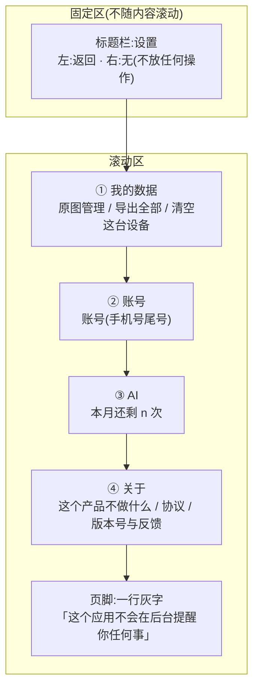

**分组顺序的依据,逐条写死,不是审美:**

| 序 | 分组 | 为什么在这个位置 |
|---|---|---|
| ① | 我的数据 | 用户主动进设置最高频的三件事都在这:找我的图、把数据拿走、把数据清掉。**「你的数据是你的」这句话如果是真的,它就该在第一屏。** |
| ② | 账号 | 🚫 原写「登录是可选项,不是前置条件」——**2026-09-02 用户裁定「没有本地模式」后作废**:登录是前置条件,进得到这一屏的人**必然已登录**。仍放第二组的理由变了:它此刻不是待办事项,只是一行状态;放第一组等于把一件已经办完的事摆在用户最常来的位置 |
| ③ | AI | 只有一行,而且是**唯一与钱有关**的一行。单独成组是为了让它不混进「我的数据」——AI 次数是产品的成本,不是用户的资产 |
| ④ | 关于 | 「这个产品不做什么」必须在设置里有一个稳定的位置(§三),但它不该抢在数据前面。协议与版本号是行业惯例位置 |

**层级只有两层:分组 → 条目。没有二级设置页,除了「这个产品不做什么」这一页。**
理由:一个只回答「有没有、几次、多久前」的产品,可配置的东西本来就少;
造出三层结构的那一刻,就会有人想往里填东西。

### 1.2 折叠线以上必须能看到的三样

**折叠线**指首屏不滚动时的可视底边(按最窄支持宽度 360 × 640 计算,见 §七 `B-22`)。

| 必须在折叠线以上 | 为什么 |
|---|---|
| 「原图管理」及其副标题「{n} 张,占 {size}」 | 🔴 用户对原图的疑问是产品要主动回答的,不是等他滚下去找的。**副标题里的数字本身就是承诺的证据** |
| 「导出我的全部数据」 | 导出是无条件承诺(`1.3.6.1`),它被滚动隐藏就等于打了折 |
| 账号组的**状态行**(已登录的手机号尾号) | 用户要能一眼看到自己登录的是哪个号,不需要点进去 |

**明确允许被折叠线切掉的:** AI 剩余次数、关于组全部、页脚。

### 1.3 元素清单

**类型**只有四种:`跳转`(进另一屏)/`展示`(不可点,只显示一个值)/`开关`(本屏立即生效)/`危险`(不可逆,必须浮层)。
🔴 **这一屏没有任何 `开关` 类型的条目** —— 见 §1.4。

| # | 条目 | 类型 | 取值来源 | 可点吗 | 禁用条件 | 无障碍朗读文本 |
|---|---|---|---|---|---|---|
| `E-SET-01` | 原图管理 | 跳转 | 本机:`listMeta()` 的条数 + `RawImageCapacity.usedBytes` | ✅ | **永不禁用**(0 张也能进,进去看到空态) | 「原图管理,{n} 张,占 {size},按钮,双击进入」 |
| `E-SET-02` | 导出我的全部数据 | 跳转 | —— | ✅ | **永不禁用** | 「导出我的全部数据,不限次数,没有水印,按钮」 |
| `E-SET-03` | 清空这台设备上的数据 | **危险** | —— | ✅ | 本机零记录且零原图时禁用,副标题变「这台设备上没有数据」 | 「清空这台设备上的数据,不可撤销,按钮」 |
| `E-SET-04` | 账号 | 跳转 | `GET /account` 取手机号尾号 | ✅ | **永不禁用** | 「账号,尾号 {4 位},按钮」 |
| `E-SET-05` | ~~在另一台设备上也用~~ **已裁定 · 作废(2026-09-02)** | —— | —— | —— | 原禁用条件是「已登录时整条隐藏」,而这一屏**只有已登录能进** —— 它永远处在隐藏态,等于不存在 | ➖ 无元素,无朗读文本 |
| `E-SET-06` | 本月还剩 {n} 次 | 跳转 | `GET /quota` 的 `ai_ask.remaining` | ✅ | 取不到值时不禁用,值位显示「联网后才知道」 | 「这个月的 AI 次数,还剩 {n} 次,按钮,双击查看额度」 |
| `E-SET-07` | 这个产品不做什么 | 跳转 | 本地静态文案(§三) | ✅ | **永不禁用,永不隐藏,离线可读** | 「这个产品不做什么,按钮」 |
| `E-SET-08` | 用户协议 | 跳转 | 本地静态文案 | ✅ | 永不禁用 | 「用户协议,按钮」 |
| `E-SET-09` | 隐私政策 | 跳转 | 本地静态文案 | ✅ | 永不禁用 | 「隐私政策,按钮」 |
| `E-SET-10` | 版本号 | **展示** | 构建期注入 | ❌ | —— | 「版本 {版本号}」 |
| `E-SET-11` | 反馈方式 | 跳转(拉起系统邮件 / 复制) | 本地静态 | ✅ | 系统无邮件客户端时降级为「复制邮箱地址」+ Toast | 「反馈方式,{地址},按钮,双击复制」 |
| `E-SET-12` | 退出登录 | **危险** | —— | ✅ | —— | 「退出登录,按钮」(详见 §四) |
| `E-SET-13` | 注销账号 | **危险** | —— | ✅ | 离线时禁用(§9.1) | 「注销账号,不可撤销,按钮」(详见 §四) |
| `E-SET-14` | 页脚说明 | **展示** | 本地静态 | ❌ | —— | 「这个应用不会在后台提醒你任何事」 |

⚠️ `E-SET-12` / `E-SET-13` 的**位置**在 `S-ACC` 内,不在 `S-SET` 首屏。
本表列出它们是为了让「设置这一层总共有几个危险操作」这件事在一张表里数得清 —— **三个,一个不多。**

🔴 **这张表里没有任何一格能让用户输入自由文本。** 唯一要求打字的地方是清空 / 注销的二次确认,
它接受的字符串只有一个固定值,输入框内容既不落库也不上屏回显。
这一条是「没有任何字段能装下题干」在设置屏的落点 —— **不是靠校验,是靠这一屏没有输入框。**

### 1.4 为什么这一屏一个开关都没有

| 想加的开关 | 判 | 理由 |
|---|---|---|
| 通知开关 | ❌ | 产品不做提醒(`R-05`)。开关存在就意味着「打开会有提醒」,而没有 |
| 提醒时间 | ❌ | 同上 |
| 每日目标 | ❌ | 目标 = 一个可比较的数 = 判断「够不够」,越过能力边界 |
| 学习计划 | ❌ | 同上,而且它是教研 |
| 主题皮肤 | ❌ | 没人为它来,维护面却是全屏 |
| 原图自动上传 | 🔴 **永不** | 它是红线本身 |
| 原图留存时长可调 | 🔴 **永不** | 可调 = 用户能把它调到无限 = 「短期缓存」四个字失效;而且它会立刻长出「延长一次」的入口 |
| 选择原图存放目录 | 🔴 **永不** | 用户选到任何云盘同步目录的那一刻红线就破了,**而产品这边不会有任何征兆**(`原图存储：判据层与存储层` §3.4) |
| 深色模式 | ⚪ 跟随系统,不给开关 | 系统已经有这个开关,再造一个是重复 |

**判据只有一条:一个开关如果打开之后产品的行为不变,它就是假的;如果变了,先回答它变到了红线的哪一侧。**

### 1.5 `S-SET` 的全适用状态枚举

这一屏**没有加载态**(数据全在本机,首屏同步渲染),但有其余三态的局部形态:

| 态 | 触发 | 屏幕上是什么 | 影响范围 |
|---|---|---|---|
| **正常** | 默认(已登录) | 四组全显示 | 全屏 |
| **离线** | 网络不可达 | 仅 `E-SET-06` 的值位变「联网后才知道」;`E-SET-13` 禁用;**其余条目一格不变** | 两条 |
| **空数据** | 本机零记录零原图 | `E-SET-01` 副标题「这台设备上还没有原图」;`E-SET-03` 禁用 | 两条 |
| **令牌失效** | `TOKEN_EXPIRED` 续期失败 | 🔴 **离开这一屏,回到未登录的登录门**(2026-09-02 裁定后:这一屏的每一条都需要账号,不存在「留在屏上的未登录形态」) | 整屏离开 |

🚫 **原「未登录」这一行已作废。** 作废原因:未登录到不了 `S-SET` —— 它不再是这一屏的一个状态,
而是这一屏之外的一个位置(登录门)。

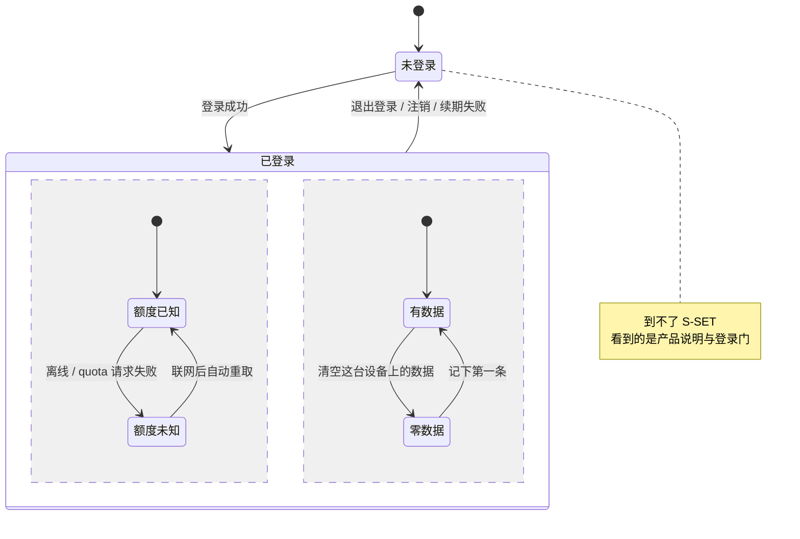

**「零数据」挂在已登录之下,而且只影响两个条目(`E-SET-01` 副标题、`E-SET-03` 禁用),不是整屏空态。**

🔴 **这张图里没有「加载中」这个态。** 设置屏在任何时候都不允许出现整屏骨架屏 ——
它显示的东西本来就不依赖网络(见 §九)。

---

## 二、「这个产品不做什么」——把边界写给用户看

设置里有一页,**原文就是这几句**:

> - 它不判断你答得对不对,也不给你讲题。**它只记录你碰过什么、碰过几次、多久以前。**
> - 它不存你的题目内容。数据库里没有能装题干的地方。
> - 你拍的原图**只存在这台设备上**,不上传、不同步、不备份到任何服务器。
> - 它不会提醒你学习,不给你排计划,也不给你发徽章。
> - 要判断先学哪个,把差集导出来交给你自己接的 AI —— **学科判断不是这个产品干的事**。

**这一页不是营销文案,是产品边界的用户可读版本。** 它与 `项目现状与决策记录` §2 一一对应,改那边就要改这里。

---

## 三、「这个产品不做什么」这一页的完整规格

上面 §二 是这一页的**正文原文**,一个字不动。这一节写它作为一个屏的其余部分。

### 3.1 它放在哪、怎么进

| | |
|---|---|
| **屏幕编号** | 不给新编号。它是 `S-SET` 的子页,不进 [`用户侧功能规格 · 总纲与全局约定`](INDEX.md) §一 的屏幕表 —— 判据是「是别的屏的子页」,不是屏数(屏数 2026-09-03 已从十三变十四) |
| **唯一入口** | `S-SET` → 关于组第一条(`E-SET-07`) |
| **第二入口** | 🔴 **登录之后没有。** 不在首页放、不在空态放、不在记录流程里放。**边界不靠反复提醒建立,靠产品行为本身。** 一个被到处放的「我们不做什么」是营销,不是边界。⚠️ **登录之前有且只有一次**:首启说明屏取前三句,屏上的「看完整的一页」能打开本页(静态、无登录要求)。判据与理由见 §3.3 —— 那一次不是「反复提醒」,它是这条边界第一次也是唯一一次主动出现 |
| **可否直达** | ✅ 有独立 URL,路由表见 [`多端选型与端矩阵`](../../technical/多端选型与端矩阵.md) §4.6.2。用户要把这一页发给别人看,地址必须能发 |
| **登录要求** | 无 |
| **网络要求** | 🔴 **无。文案是构建期打进包里的静态字符串,不是接口下发的。** 接口下发意味着它可以被服务端悄悄改掉,而它是边界 |
| **返回** | 系统返回键 / 左上角返回,回 `S-SET`,无二次确认 |

### 3.2 页面结构

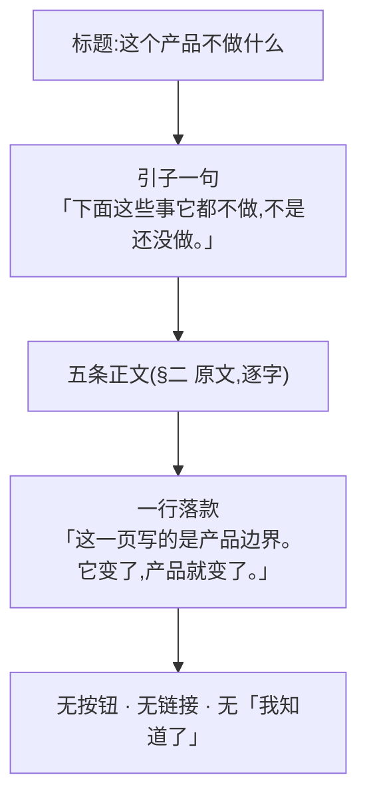

🔴 **这一页上没有任何可点元素。** 没有「了解更多」、没有跳去隐私政策的链接、没有确认按钮。
理由:任何一个可点元素都会让这一页变成一个**流程的一步**,而它是一份声明。

**引子那一句「不是还没做」是必须的。** 用户读「它不判断你答得对不对」的默认理解是「这版还没做」;
这一页要防的正是这个理解。

### 3.3 首次使用时要不要展示一次

🔴 **展示 —— 但形态是「登录前的一屏」,不是弹窗**(2026-09-03 产品裁定 `M0-G1`,推翻本节 2026-09-02 之前的「不展示」)。

**这一节此前判「不展示」,理由是三条,而它们针对的是一个已经不存在的形态**:那时的备选是
「首启全屏展示一次,要点『我知道了』」。2026-09-02 用户裁定「没有本机模式」之后,
登录本身成了硬门,登录前必然有一屏;问题从「要不要多插一屏」变成「已经在那儿的那一屏上说不说这三句」。
三条否决理由里有两条(必须被点掉的弹窗、「我知道了」会被无脑点掉)针对的是**关闭动作**,
而现在这一屏没有关闭动作 —— 唯一出口是「登录」,那是用户本来就要做的动作,不是一次敷衍的确认。

| 方案 | 判 | 理由 |
|---|---|---|
| 首启全屏展示一次,要点「我知道了」 | ❌ **仍然否决** | ① 它是一个**必须被点掉的弹窗**,而总纲 §2.2 的浮层只用在「必须二选一」上,这里没有二选一;② 「我知道了」会被无脑点掉,而被点掉的声明等于没说 |
| **登录之前的第一屏,三句 + 登录入口,没有关闭、没有跳过、没有「我知道了」** | ✅ **采用** | ① 它不是新插的一屏,它就是登录门前面那一屏 —— 未登录的人只看得到产品说明与登录门(2026-09-02 用户裁定);② **没有可被点掉的确认动作**,前一行那两条否决理由在这个形态上不成立;③ 「不存你的题目内容」在**交出账号之前**的那一刻恰恰是具体的,不是抽象的 —— 用户正要把自己交出去。逐屏规格见 [首次使用与权限申请](首次使用与权限申请.md) §1.3.3 |
| 首启不展示,但在**第一次拍照的同意点**里出现相关的那一条 | ✅ **同时采用,不互斥** | 两者是两个时刻两件事:说明屏是**交账号之前的声明**,同意点是**存这一张图之前的同意动作**。第三条在两处都出现,且逐字同源(§3.3 承诺句表 + `boundary-copy-check.py`)。同意点文案见 `原图存储：判据层与存储层` §五 发现二 |
| 完全不主动展示,只在设置里放着 | ⚪ 其余两条如此 | 第四、第五条的正确验证方式是**用户发现产品真的没做这些事**,不是他读到过一段话 —— 所以说明屏只取前三句,不取五句 |

⚠️ **裁定同时收窄了 §3.1 的「第二入口没有」**:那条红线现在的范围是**登录之后**。
登录之前,说明屏上的「看完整的一页」是通往本页的合法入口 —— 一屏只放三句却不给用户看全五句的路,
是在交账号那一刻给了一份截断的边界。红线的实质是**不反复提醒**,不是「只许有一个地址」。

🔴 **变的是首启路径,没变的是这一页本身**:§3.1 的形态、§3.2 的结构(无可点元素)、§二 五条原文,一个字都没动。

🔴 **由此产生一条对同意点的约束:同意点里那句关于原图的**承诺句**,与本页第三条必须逐字同源。**
两处写法不一致,用户会认为其中一处是营销。

**承诺句与附加句是两件事,这里裁定清楚**(此前 §3.3 要求「逐字同源」而 §6.4 的同意点比第三条多三个分句,
两处自相矛盾,谁也没法照着做):

| | 是什么 | 规则 |
|---|---|---|
| **承诺句** | 「你拍的原图**只存在这台设备上**,不上传、不同步、不备份到任何服务器。」 | 🔴 **逐字同源,一个字都不许改**。它就是本页第三条 |
| **附加句** | 「{时长}后转为本机留存,不再用于识别,随时可以手动删。」 | 可以加、可以按端删,**但不许改写承诺句、不许与它冲突**。时长由判据层给,界面不写死 |

**为什么这么切:**「只存在这台设备上」是产品红线,它必须只有一种说法;
「到期之后怎么样」是这条红线的**后果说明**,它在拍照那一刻是必要的,在首启卡片上是抽象的。
两者混成一句,就会出现「为了塞下后果而改写红线」这种改动 —— 那正是现在要堵的。

判据可跑:`python3 scripts/boundary-copy-check.py`。

### 3.4 这一页的文案能不能改

🔴 **能改,但改它 = 改产品边界,走的是决策流程不是文案流程。**

| 改动类型 | 谁能改 | 走什么 |
|---|---|---|
| 错别字、标点 | 任何人 | 普通提交 |
| 语气、断句(**不改变任何一条的含义**) | 产品 | 普通提交 + 在提交信息里写「不改变含义」 |
| **删掉一条 / 加一条 / 让一条的范围变松** | 🔴 只有人审 | 先改 `项目现状与决策记录` §2 的对应条,再改这一页。**顺序不可颠倒** |
| A/B 两个版本 | 🔴 **永不** | 边界没有两个版本。一个产品对自己不做什么有两种说法,等于没有说法 |
| 按端给不同版本 | 🔴 **永不** | 唯一例外是小程序端**不出现第三条**(那个端上没有原图,这句话没有主语),见 §十 |

**可执行的判据:这一页的五条与 `项目现状与决策记录` §2 的对应关系写在一张表里,
两边条数不等就是漏改。** 见 §十八 红线自查第 4 行、验收用例 `A-29`。

---

## 四、数据管理条目逐条

「我的数据」这一组是设置屏存在的主要理由。四条,逐条写全。

### 4.1 导出我的全部数据

| | |
|---|---|
| **入口** | `E-SET-02`,「我的数据」组第二条 |
| **样式** | 普通条目,**不加任何强调色**。它是常规能力,不是特权 |
| **副标题** | 「不限次数,没有水印」——🔴 这句话常驻,不是营销位 |
| **行为** | 跳 `S-EXP`,范围预选「全部」 |
| **未登录** | ➖ 不适用:未登录到不了 `S-SET`,也不能导出(2026-09-02 裁定)。**导出的无条件性对已登录用户一格不变** |
| **禁用条件** | **无。零数据时也可点**,由 `S-EXP` 自己显示空态 |
| **本文不重复的** | 格式、内容、导出文件里有什么没什么 → [导出与问AI](导出与问AI.md) |

🔴 **导出永远不限次数、无水印、不删减、不因为没付费而缩水**(`1.3.6.1`)。
设置屏这一侧要守的具体形态:**这一条永不禁用、永不加锁图标、永不在副标题里出现任何条件。**

⚠️ **导出文件里没有原图。** 导出的是记录(碰过什么、几次、多久前),不是图片字节。
理由与 §6.3 第三条同源:一份含图片的压缩包就是一条把原图搬离本机存储的通路。
`S-EXP` 里就此有一句常驻说明,原文见 §十五 `S-27`。

### 4.2 清空这台设备上的数据

| | |
|---|---|
| **入口** | `E-SET-03`,「我的数据」组第三条 |
| **样式** | 🔴 **普通条目 + 文字为次要色,不是红色大按钮**(理由见 4.5) |
| **副标题** | 「记录和图都会删掉,云端的不受影响」(**只有这一种** —— 原未登录版副标题随 `S-06` 一并作废) |
| **禁用条件** | 本机零记录且零原图 → 禁用,副标题变「这台设备上没有数据」 |
| **可撤销** | ❌ 完全不可撤销,没有回收站、没有撤销 Toast |

**流程(两次确认,第二次要打字):**

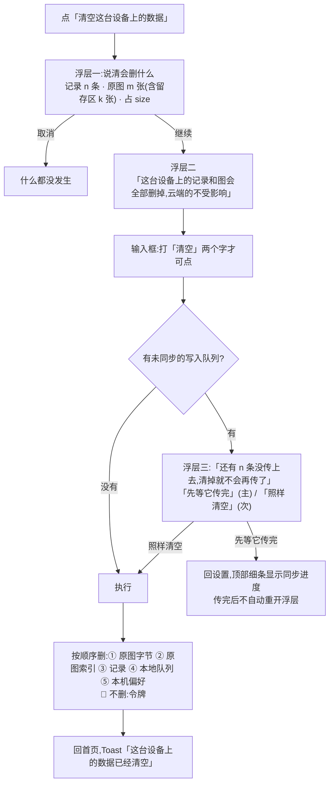

**删除顺序为什么是这个顺序:**

| 序 | 删什么 | 为什么在这个位置 |
|---|---|---|
| ① | 原图**字节** | 与 `delete` 的既有顺序一致(`原图存储：判据层与存储层` §9.2):**先字节后索引**。反过来会出现「用户按了删,而字节还在磁盘上」 |
| ② | 原图索引 | 崩在①②之间只留残行,`read` 返回 `null`,判据层照常处理 |
| ③ | 记录 | 记录比图便宜,先删图能让「空间释放」这件事在中断时也部分成立 |
| ④ | 本地写入队列 | 放在记录之后:队列先删而记录没删完,会出现「记录在但永远传不上去」 |
| ⑤ | 本机偏好(同意点、上次进的科目等) | 最后。它最不重要,但**必须删** —— 留着同意点会让下一次拍照不再问一遍 |

🔴 **令牌不删。** 清空的是**数据**,不是登录状态。清空之后用户仍然登录着,
下一次同步会把云端的数据拉回来 —— 这正是浮层二承诺的「云端的不受影响」。
**要退出请用「退出登录」,两件事不合并**(合并会让「清空」变成一个用户预期之外的登出)。

### 4.3 退出登录

| | |
|---|---|
| **入口** | `S-ACC` 内(`E-SET-12`),**不在 `S-SET` 首屏** |
| **样式** | 普通条目,次要色 |
| **浮层** | 一次确认,原文逐字引自 [登录与账号](登录与账号.md) §4.7 的真源表:「退出后,这台设备上的原图一张不动;已经同步过的记录会从这台设备上清掉 —— 它们在你的账号里,重新登录就回来」 |
| **后端** | `POST /auth/logout`,只吊销当前令牌 |
| **本机数据** | 🔴 **原图一张不删** —— 它没有服务端副本,只有注销才删(§4.4)。已同步过的记录缓存会清掉(账号里还在,重新登录就回来);队列里还没上传的记录**先拦一次**,传完再退。清除范围以 [登录与账号](登录与账号.md) §4.7 那张表为准,本页不另立说法 |
| **离线时** | 可点。本地先清令牌,顶部细条「已退出,联网后会通知服务器」(见 §9.1) |
| **完整流程** | [登录与账号](登录与账号.md) §四 |

### 4.4 注销账号

| | |
|---|---|
| **入口** | `S-ACC` 内(`E-SET-13`),**次要位置、非红色大按钮、不在首屏** |
| **浮层链** | 「注销后,云端的记录会被删掉,**这台设备上的原图与本地缓存也会一起删掉**。**要不要先导出一份?**」→ 先导出(主)/ 直接注销(次)→ 打字确认「注销」。🔴 **「先导出」这个入口保持不变、永不禁用**(`1.3.6.1` 在注销流程里的落点) |
| **后端** | `DELETE /account`,同时删除这台设备上的原图与本地缓存 |
| **🔴 本机原图** | **注销默认删除这台设备上的原图与本地缓存**(2026-09-02 裁定),而这件事必须在浮层里**明确告知一次**,说在用户决定要不要先导出之前 —— 见 §十五 `S-21`、[登录与账号](登录与账号.md) §6.1。删完**不再给「要不要也删掉」的二选一** |
| **离线时** | 🔴 **禁用**,副标题「注销要联网」。本地假装成功会让用户以为账号没了而它还在 |
| **完整流程** | [登录与账号](登录与账号.md) §七。**本文不重复** |

### 4.5 危险操作的入口样式与位置约束(三条,全端适用)

🔴 **危险操作不用红色大按钮、不在首屏。** 这条约束的三个具体形态:

| # | 约束 | 为什么 |
|---|---|---|
| 1 | **不用填充色按钮**,用普通列表条目 + 次要色文字。红色只允许出现在**浮层内的确认按钮**上 | 一个红色大按钮在列表里是视觉焦点,而这三个操作都不该被顺手点到。**危险不靠颜色警告,靠多一次确认** |
| 2 | **不在首屏第一位**:「清空」在「我的数据」组第三条(前面有原图管理、导出);退出 / 注销在 `S-ACC` 里 | 用户来设置最可能是为了前两件事。把不可逆操作放在他手指的落点上是设计的失误,不是他的 |
| 3 | **浮层里主按钮永远是「取消」或「先导出」,不是执行** | 默认焦点落在安全选项上;读屏用户第一个听到的也是安全选项(见 §十二) |

⚠️ **例外:`S-RAW` 的批量删除确认里,主按钮是「删除」。**
理由:用户在那一刻已经明确选中了若干张,取消是他的第二意图不是第一意图。
**但它仍然要浮层,仍然写明「删了就没了」。**

---

## 五、`S-RAW` 原图管理

### 5.1 原图的三种状态,用户必须能分清

| 状态 | 含义 | 界面 |
|---|---|---|
| **活跃** | 在留存期内,随时能看 | 正常缩略图 |
| **留存区** | 过了留存期,**转入留存区而不是删除** | 缩略图加一个角标 + 分组「留存区」 |
| **已删除** | 用户自己删的 | 不显示 |

⚠️ **文案统一用「转入留存区」,不用「到期删除」。** 存储层已经没有任何自动删除路径 ——
界面上写「到期会删」是描述一个不存在的行为(`原图存储：判据层与存储层` 已就此统一过五处文案)。

### 5.2 元素清单

| 区 | 元素 | 取值 | 为空时 |
|---|---|---|---|
| 顶 | 「{n} 张 · 占 {size} · 都在这台设备上」 | 本机存储 | 「这台设备上还没有原图」 |
| 顶 | 🔴 一行常驻说明 | 「这些图只在这台设备上。换设备看不到,也没有任何地方备份。」 | 常驻 |
| 一 | 按时间分组的缩略图网格 | 本机 | —— |
| 一 | 「留存区」分组 | 本机 | 没有则隐藏 |
| 二 | 单张:点开大图 · 删除 · 「看它属于哪条记录」 | —— | —— |
| 三 | 批量:「清理留存区」 | —— | 留存区为空则禁用 |
| 四 | 存储上限说明 | 「这台设备最多存 {n} 张」(数值取自存储层) | —— |

### 5.3 交互

| 动作 | 行为 |
|---|---|
| 删除单张 | 浮层「删了就没了,和它一起的记录还在」→ 删除;**记录本身不受影响** |
| 清理留存区 | 浮层显示将删除的张数与释放空间 → 执行 |
| 点开大图 | 本机读取;**没有分享、没有保存到云、没有上传** |
| 存储写满 | 见 [记一次学习](记一次学习.md) `R-11`:**文字记录照落**,只是不存图 |

🔴 **这一屏不允许出现任何形式的「上传」「备份」「同步」「分享到」入口。**
这是产品边界:用户上传的原图只存在他自己的机器上,到期转为归档保留,**绝不上云、不同步、不共享**。

### 5.4 两种形态的原图互相看不见 —— 必须告诉用户

浏览器里存的图和桌面壳里存的图**结构上不互通**(`R-114`),用户会遇到「我明明存过,这边一张都没有」。

**界面处理**:`S-RAW` 顶部,当检测到当前形态的原图为 0 但本产品在这台设备的另一形态有数据时,显示一行:

> 「在浏览器里存的图,这个应用读不到 —— 它们是两个地方。」

**不做跨形态迁移**(那需要一条把原图搬出原存储的通路,`R-04` 不为这点便利开门)。

### 5.5 屏幕结构:三区,固定区只有两行

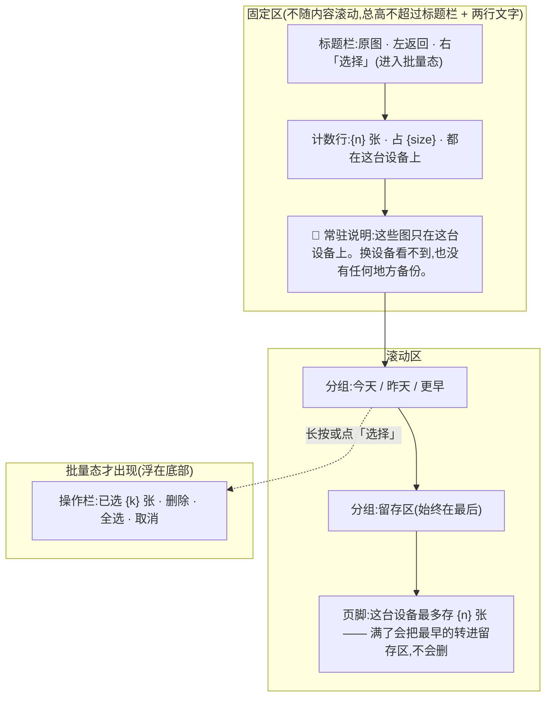

**固定区为什么只有两行:** 缩略图网格是这一屏的主体,固定区每多一行就少一行图。
但那句常驻说明**不能折进滚动区** —— 它是承诺,不是补充信息;滚一下就没了的承诺不算承诺。

**「留存区」分组始终排在最后,不参与时间排序。** 它不是「更早」的延续:
一张图在留存区不代表它更早(条数上限也会把新图转进去,见 §6.4)。
把它按时间混排会让用户以为留存区 = 老图。

### 5.6 元素清单 · 列表项(单张缩略图)

| # | 元素 | 类型 | 取值来源 | 可点吗 | 禁用条件 | 无障碍朗读文本 |
|---|---|---|---|---|---|---|
| `E-RAW-01` | 缩略图 | 跳转(开单张详情) | 本机;写入时生成并随索引存(`B-07`) | ✅ | 缩略图生成失败 → 显示占位,**仍可点**(详情里能删) | 「{label},{storedAt 的相对时间},图片,双击查看」 |
| `E-RAW-02` | 留存区角标 | 展示 | `archivedAt !== null` | ❌ | —— | 追加朗读「已在留存区」 |
| `E-RAW-03` | 未挂载角标 | 展示 | `recordId === null` | ❌ | —— | 追加朗读「还没挂到任何一条记录上」 |
| `E-RAW-04` | 损坏占位 | 展示 | `read` 返回 `null` 或字节解不开 | ✅(可进详情删) | —— | 「这张图读不出来了,双击查看处理方式」 |
| `E-RAW-05` | 选择态圆点 | 开关(仅批量态) | 本地选中集合 | ✅ | 选中数达上限时,未选中项禁用(`B-13`) | 「{label},复选框,{已选中/未选中}」 |

🔴 **`label` 是本机文件名,只在本机显示,不进任何请求体**(`RawImageMeta.label` 的原注释)。
**不提供重命名。** 重命名 = 一个用户可写的自由文本字段挂在一张图上 = 一个能装下题干的位置。
这一条不是过度谨慎:它是「没有任何字段能装下题干」在这一屏唯一可能的破口。

### 5.7 元素清单 · 批量操作栏

| # | 元素 | 类型 | 取值来源 | 可点吗 | 禁用条件 | 无障碍朗读文本 |
|---|---|---|---|---|---|---|
| `E-RAW-06` | 「已选 {k} 张 · {size}」 | 展示 | 本地选中集合 | ❌ | —— | 「已选 {k} 张,共 {size}」 |
| `E-RAW-07` | 删除 | **危险** | —— | ✅ | `k === 0` 时禁用 | 「删除选中的 {k} 张,不可撤销,按钮」 |
| `E-RAW-08` | 全选 / 取消全选 | 开关 | —— | ✅ | 当前分组为空时禁用 | 「全选,按钮」/「取消全选,按钮」 |
| `E-RAW-09` | 「清理留存区」 | **危险** | 留存区条数 | ✅ | 留存区为空则禁用 | 「清理留存区,{k} 张,释放 {size},不可撤销,按钮」 |
| `E-RAW-10` | 取消(退出批量态) | 跳转 | —— | ✅ | 永不禁用 | 「退出选择,按钮」 |

🔴 **这一栏里没有:分享、导出选中、移动到、上传、备份。**
`E-RAW-07` 与 `E-RAW-09` 是这一栏仅有的两个写操作,**两个都是删。**

### 5.8 元素清单 · 单张详情

| # | 元素 | 类型 | 取值来源 | 可点吗 | 禁用条件 | 无障碍朗读文本 |
|---|---|---|---|---|---|---|
| `E-RAW-11` | 大图 | 展示 | 本机 `read(id)` | 双指缩放 ✅,长按 ❌ | 读不出来时显示占位 | 「原图,{label}」 |
| `E-RAW-12` | 「多久前存的」 | 展示 | `storedAt` → 相对时间(`B-20`) | ❌ | —— | 「{相对时间}存下的」 |
| `E-RAW-13` | 「什么时候转进留存区」 | 展示 | 活跃:由 `expiresAt` 算出的相对时间;已在留存区:`archivedAt` | ❌ | —— | 「还有 {相对时间}转进留存区」/「{相对时间}转进了留存区」 |
| `E-RAW-14` | 「看它属于哪条记录」 | 跳转 | `recordId` | ✅ | `recordId === null` 时**隐藏整条**,不禁用 | 「看它属于哪条记录,按钮」 |
| `E-RAW-15` | 「占 {size}」 | 展示 | `byteSize` | ❌ | —— | 「这张图占 {size}」 |
| `E-RAW-16` | 删除这张 | **危险** | —— | ✅ | 永不禁用(损坏的图也要能删) | 「删除这张,不可撤销,按钮」 |
| `E-RAW-17` | 一行说明 | 展示 | 静态 | ❌ | —— | 「这张图只在这台设备上」 |

🔴 **长按大图不弹系统菜单。** 移动端 WebView 默认长按图片会给出「存储图片 / 拷贝 / 分享」——
那三项每一项都是一条把原图搬出本机存储的通路。必须显式关掉
(`-webkit-touch-callout: none` + `user-select: none` + 阻止 `contextmenu`),并由 `A-07` 守住。

**详情里没有「分享」「保存到相册」「设为」——一个都没有。**
「保存到相册」看起来无害(相册也在本机),但相册是**系统级同步范围**:iCloud 照片、
Google 相册默认开着同步。把图存进相册 = 把它交给一个会上云的地方。

### 5.9 `S-RAW` 的全适用状态枚举

| 态 | 触发 | 屏幕上是什么 | 可否进入批量态 |
|---|---|---|---|
| **正常** | 有图 | 网格 + 分组 | ✅ |
| **加载** | 首次读索引且超过骨架屏阈值(`P-04`) | 网格位置的灰块骨架,**固定区照常显示** | ❌ |
| **空** | 索引为空 | 「这台设备上还没有原图」+ 一个「去记一条」的入口 | ❌ |
| **空 · 另一形态有数据** | 本形态 0 张,探测到另一形态非空 | 空态文案下加 §5.4 那一行 | ❌ |
| **受限 · 本机存储用不了** | `RawImageStorageError` | 整屏说明「这个浏览器不让存本地数据」+「文字记录不受影响」 | ❌ |
| **批量** | 点「选择」或长按一张 | 底部操作栏浮起,标题栏右侧变「取消」 | —— |
| **删除进行中** | 批量删除执行中 | 操作栏变进度条「正在删 {i}/{k}」,**列表不可点** | ❌ |
| **部分失败** | 批量删除中途失败 | 成功的消失,失败的留在原位并加错误角标 + 顶部一条说明 | ✅ |

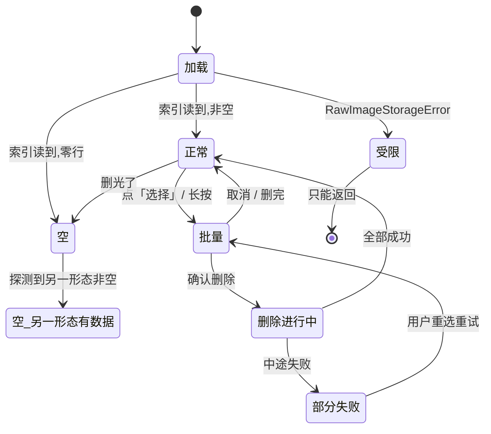

---

## 六、🔴 原图在哪、什么时候消失

**这一节是本文的核心。用户读完这一节不应该有第二个疑问。**
判据:把这一节念给一个没用过产品的人听,他能回答出「我换手机了,那些图还在吗」。

### 6.1 原图存在哪

| 形态 | 存在哪(概念,不写绝对路径) | 界面上怎么说 |
|---|---|---|
| **桌面壳(macOS)** | 系统给这个应用的**应用数据目录**下的一个专用文件夹。**不是**文稿、不是桌面、不是图片库 | 「这些图在这台电脑上,这个应用自己的文件夹里」 |
| **浏览器 / Web** | 浏览器给这个网址(origin)的**本地数据库**,按网址隔离 | 「这些图在这个浏览器里,换个浏览器就看不到」 |
| **移动 App** | 系统给这个 App 的**私有目录**,别的 App 读不到 | 「这些图在这台手机上,这个应用自己的地方」 |
| **微信小程序** | 🔴 **不存原图,这个端没有这一屏** | 见 §十 |

🔴 **为什么不落文稿 / 桌面 / 图片库**(`原图存储：判据层与存储层` §3.4):
macOS 的 iCloud「桌面与文稿」同步默认可开,开着就等于**原图自动上云** ——
而这条破口**不在你写的代码里、不报错、不出现在任何 review 里、测试全绿**。
**这个目录选择本身就是红线的物理落点**,不是一个实现细节。

**界面上不显示绝对路径,也不提供「在访达中显示」。**
理由:给出路径的下一步必然是「让我换一个路径」,而那正是 §1.4 里永不提供的那一条。
用户真的要找,他找得到 —— 但产品不带路。

### 6.2 占多少空间、怎么看

**两个数,两个位置:**

| 数 | 在哪看 | 取值 | 单位与精度 |
|---|---|---|---|
| 全部原图占多少 | `S-SET` 的「原图管理」副标题 + `S-RAW` 计数行 | `RawImageCapacity.usedBytes` | `B-10` |
| 单张占多少 | `S-RAW` 单张详情 `E-RAW-15` | `RawImageMeta.byteSize` | `B-11` |

🔴 **留存区的图也算在「占多少」里,而且必须能单独看到。**
这是 `原图存储：判据层与存储层` §2.3 明确登记的一个缺口(「界面上今天没有任何地方显示归档占了多少」),
本文就此给出界面答案:

- `S-RAW` 的「留存区」分组标题右侧显示 **「{k} 张 · {size}」**;
- 归档**不释放空间**,所以这个数是「你现在清理能拿回多少」的直接答案;
- 🔴 **但它只是一个数,不进判据层。** `RawImageCapacity` 由界面读,不进 `RawImageBackend`、
  不进 `RawImageCache` —— 判据层拿得到容量,「归档也淘汰」就从后门回来了。

**取不到 `usedBytes` 时**(浏览器不给容量估算、壳侧目录读不动):
显示「{n} 张」,**省略占用部分,不显示 0、不显示「—」、不显示「计算中」**。
一个显示 0 的空间数会让用户以为图不占地方。

### 6.3 界面上必须明说的三个「没有」

🔴 **这三句必须以肯定形式写在界面上,不能只靠「找不到那个按钮」让用户自己推断。**
一个功能不存在和一个功能被藏起来,在用户那里长得一模一样。

| # | 明说什么 | 写在哪 | 为什么这个东西不存在 |
|---|---|---|---|
| 1 | **没有上传按钮** | `S-RAW` 常驻说明第一句 + 「这个产品不做什么」第三条 | 上传 = 原图离开本机。这是红线本身,不是一个还没做的功能 |
| 2 | **没有云备份** | `S-RAW` 常驻说明第二句「也没有任何地方备份」 | 备份需要一份长期云端副本,而红线原文写的是「不做长期云端存储和任何形式的共享」。**备份是共享的最温和形态,但它仍然是** |
| 3 | **没有同步开关** | `S-RAW` 常驻说明第一句「换设备看不到」+ §6.7 换设备说明 | 同步意味着两台设备上各有一份,而红线是「只存在他自己的机器上」——**单数**。有了同步,「他的机器」就变成一个不断增长的集合 |

**常驻说明的完整原文(逐字,不可改写):**

> 「这些图只在这台设备上。换设备看不到,也没有任何地方备份。」

⚠️ **不要把这句话写成「为了保护隐私,我们不上传」。**
那是在解释动机,而动机可以改变;这句话陈述的是事实,事实不会因为下个版本想通了就变。

**识别那一步呢?** 这是用户唯一会疑惑的地方,必须在同意点回答:
拍照识别时**字节内联发给模型一次**,那一次不落任何盘、不写日志、不用厂商的文件暂存接口
(`识别链路选型 · ASR 与图像识别` §四 坑二:**禁止使用 Files API,必须走 base64 内联**)。
接口层的证据见 §十三。

### 6.4 到期与归档的规则怎么呈现给用户

**规则的数字给指针,界面上显示的是判据层算出来的结果。** 三个位置,三种说法:

| 位置 | 显示什么 | 取值 |
|---|---|---|
| 单张详情 `E-RAW-13` | 「还有 {相对时间}转进留存区」 | 由 `expiresAt` 减当前时刻算出,**界面不知道留存时长是多少** |
| `S-RAW` 页脚 | 「这台设备最多存 {n} 张 —— 满了会把最早的转进留存区,不会删」 | `n` 由判据层暴露,**界面不写死** |
| 同意点(拍照前) | **承诺句**(逐字同源,见 §3.3):「你拍的原图**只存在这台设备上**,不上传、不同步、不备份到任何服务器。」 **附加句**:「{时长}后转为本机留存,不再用于识别,随时可以手动删。」 | 承诺句逐字等于 §二第三条;时长由判据层给,界面不写死。**文案已定稿**,`G-4` 不再挡这一行 |

🔴 **界面上永远不出现「到期删除」「自动删除」「N 小时后删掉」。**
存储层已经**没有任何自动删除路径**(`R-106` 裁定①:条数上限也改成归档)。
写「会删」是描述一个不存在的行为,而且是往危险的方向描述错 ——
用户会以为图已经没了,于是不去清理,于是空间一直占着。

**两条转入留存区的路径,用户都要能理解:**

| 路径 | 触发 | 界面上怎么说 |
|---|---|---|
| **到期** | 过了留存期 | 单张详情的倒计时走完;那张图移到「留存区」分组 |
| **活跃段满了** | 活跃段条数达到上限,最早到期的那几张让位 | 页脚那句「满了会把最早的转进留存区,不会删」 |

⚠️ **第二条路径必须写出来。** 它意味着**一张没到期的图也可能出现在留存区**,
而用户对此的默认理解是「它到期了」。不写,他会以为倒计时是假的。

### 6.5 归档(留存区)之后

| 问题 | 答案 | 界面上在哪回答 |
|---|---|---|
| 还能不能看? | ✅ **能。** `read` 读得出已归档的行 —— 归档不是删除 | 留存区分组里点开就是大图,和活跃的图一样 |
| 占不占空间? | 🔴 **占。归档一个字节都不释放** | 留存区分组标题右侧的「{k} 张 · {size}」 |
| 能不能恢复成活跃? | ❌ **不能,而且不提供这个操作** | 详情里没有「恢复」按钮 |
| 什么时候真正删除? | 🔴 **永远不会自动删除。只有用户手按才真删** | 页脚那句「不会删」 |
| 还能不能用于识别? | ❌ 不能。它已经不是短期缓存了 | 同意点文案里那句「不再用于识别」 |

🔴 **为什么不给「恢复」:** 恢复 = 把 `archivedAt` 抹掉 = 一次重试就把留存期延到无限。
`RawImageBackend` 的五个方法里**写不出这个操作**(没有 `extendExpiry`、没有 `touch`,
`archive` 碰不到 `expiresAt`),这是类型上的约束不是自觉。
界面上加一个「恢复」按钮就等于要求存储层开第六个方法 —— 而那个口一开,红线在接口层就没了证据。

### 6.6 单张原图的生命周期状态机

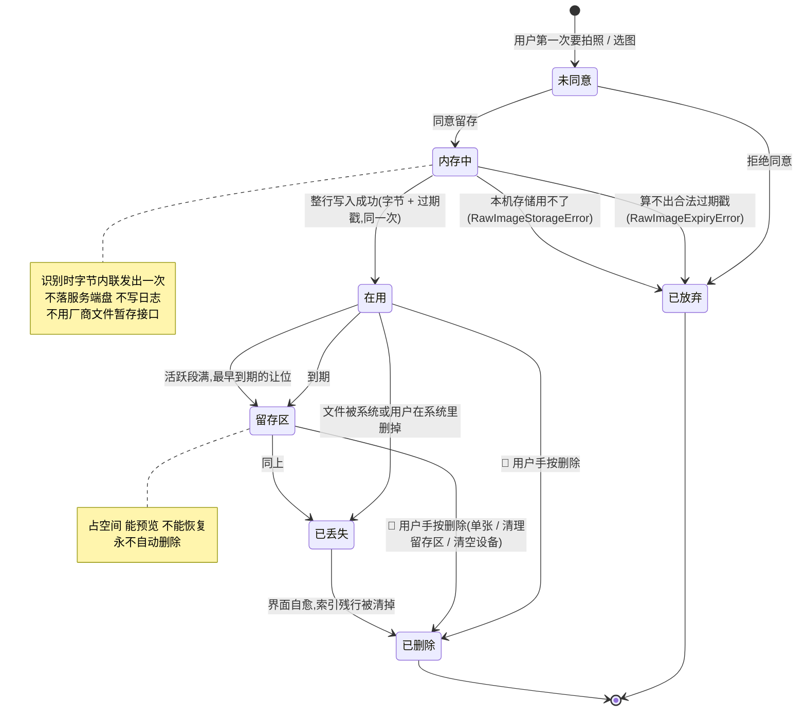

**每个态的三个属性,逐态写死:**

| 态 | 占不占本机空间 | 能不能预览 | 能不能恢复到上一个态 | 用户在界面上看到 |
|---|---|---|---|---|
| **未同意** | ❌ | ❌ | —— | 同意点浮层 |
| **内存中** | ❌(只在内存) | ✅(拍照预览) | —— | 采集屏的预览图 |
| **在用** | ✅ | ✅ | —— | `S-RAW` 时间分组里的缩略图 + 倒计时 |
| **留存区** | ✅ **仍然占,归档不释放** | ✅ | ❌ **不能回到「在用」**(§6.5) | 「留存区」分组 + 角标 |
| **已丢失** | ❌(字节没了,索引残行占极少) | ❌ 显示占位 | ❌ | 损坏占位 `E-RAW-04`,一次刷新后自愈消失 |
| **已删除** | ❌ | ❌ | 🔴 **永不能恢复,没有回收站** | 不显示 |
| **已放弃** | ❌ | ❌ | —— | 一句失败说明,**记录照落**(见下) |

🔴 **「已放弃」不影响记录。** `RawImageExpiryError` / `RawImageStorageError` 的界面必须说
「这张图没被本地缓存」,**不是「记不下来」**(`原图存储：判据层与存储层` §2.1)。
与 `1.3.7.1`「识别挂了 ≠ 记录挂了」同构:**降级方向是少功能,不是少记录。**

### 6.7 换设备 / 重装 / 清空数据 —— 三种情况

**三种情况的后果都一样(图没了),但事前警告的时机和文案完全不同。**

| | 换设备 | 重装 App | 清空这台设备上的数据 |
|---|---|---|---|
| **原图** | 🔴 **不跟着走。旧设备上那些图不会出现在新设备上** | 视端而定,见下表 | 🔴 全部删除 |
| **记录** | ✅ 跟着走(云端)。**不存在「未登录攒下的记录」** —— 登录前不产生数据(2026-09-02 裁定) | 同左 | 🔴 本机删除,云端不受影响 |
| **事前能不能警告** | ❌ 做不到(产品不知道用户要换设备) | ⚠️ 部分能 | ✅ 能,而且必须 |
| **产品能做的** | 在 `S-RAW` 常驻说明里**提前一直说着** | 卸载前无法拦截,只能靠常驻说明 | 两次确认 + 打字(§4.2) |

**重装 / 卸载的端上差异:**

| 端 | 卸载 App 会怎样 | 只是重装(不卸载)会怎样 |
|---|---|---|
| 桌面壳(macOS) | 应用数据目录**通常保留**(手动删应用不会删数据目录) | 图还在 |
| 移动 App(iOS / Android) | 🔴 **私有目录随 App 一起删,图全没** | 卸载再装 = 全没 |
| Web | 卸载没有意义;**清除浏览器站点数据 = 图全没** | 同左 |

⚠️ **这张表的每一格都是端事实,不是产品选择。** 产品能做的只有一件事:**提前说**。
所以 `S-RAW` 那句常驻说明不是可选的补充信息 —— **它是这三种情况唯一的事前警告。**

**三条事前警告文案(逐字):**

| 场景 | 出现时机 | 原文 |
|---|---|---|
| 换设备 | `S-RAW` 常驻(一直在) | 「这些图只在这台设备上。换设备看不到,也没有任何地方备份。」 |
| 登录后的期待落差 | 首次登录成功后回到 `S-RAW` 时,顶部一条可关闭的提示 | 「登录同步的是你的记录,不是图。图仍然只在这台设备上。」 |
| 清空数据 | 浮层一 | 「这台设备上的 {n} 条记录和 {m} 张图(含留存区 {k} 张,占 {size})会全部删掉。」 |

🔴 **第二条最容易被漏掉,也最容易让用户产生误解。**
用户的心智模型是「登录 = 我的东西都上云了」,而这个产品里登录同步的是记录不是图。
**不在登录后立刻说清楚,他会在换设备时才发现,而那时已经晚了。**

### 6.8 用户主动删除:单张 / 批量 / 全部

**三条路径,一条共同的承诺:🔴 用户手按的删就是真删。**
`delete` 在存储层的顺序是**先删字节、后改索引**,理由就是这一条 ——
反过来会出现「用户按了删,而字节还在磁盘上」(`原图存储：判据层与存储层` §9.2)。

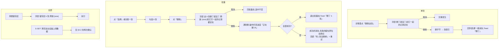

**四条路径的差异表:**

| | 单张 | 批量 | 清理留存区 | 清空设备 |
|---|---|---|---|---|
| 确认次数 | 1 次浮层 | 1 次浮层 | 1 次浮层 | **2 次 + 打字** |
| 浮层里必须写的数 | —— | 张数 + 释放空间 | 张数 + 释放空间 | 记录数 + 张数 + 留存区张数 + 空间 |
| 主按钮 | 删除 | 删除 | 删除 | **取消** |
| 删记录吗 | ❌ | ❌ | ❌ | ✅ |
| 可撤销 | ❌ | ❌ | ❌ | ❌ |
| Toast 里有没有「撤销」 | 🔴 **没有** | 🔴 没有 | 🔴 没有 | 🔴 没有 |

🔴 **为什么不给「撤销」:** 撤销要求删除是软删除(先标记、延迟真删),
而「用户手按的删就是真删」是这条链路上**唯一不能打折的承诺**。
一个五秒可撤销的删除意味着有五秒钟那些字节还在盘上 —— **在这条线上,五秒也是打折。**

### 6.9 🔴 删了原图之后,记录还在吗

**在。记录与原图是两件事。**

这是用户最容易搞错、也最影响他敢不敢删图的一件事。产品的回答必须在**每一次删除浮层里**出现:

| 场景 | 浮层里必须有的那半句 |
|---|---|
| 删单张 | 「……**和它一起的记录还在**」 |
| 批量删 | 「……**和它们一起的记录都还在**」 |
| 清理留存区 | 「……**记录都还在**」 |
| 清空设备 | ⚠️ **这里相反**:「记录和图**都会**删掉」——因为这一条真的删记录 |

**为什么记录不依赖原图:**

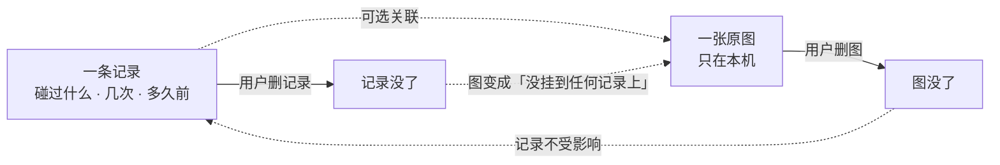

- 一张图进本机缓存的时刻**常常早于记录存在的时刻**,所以 `recordId` 允许是 `null` ——
  **图的生命周期不依赖任何一条记录**(`RawImageMeta.recordId` 的原注释);
- 反过来也成立:记录的生命周期不依赖图。覆盖度由记录算,**不由图算**;
- 所以删图**不改变任何一个盲区数字**。这一句要在删除浮层之外再说一次:
  `S-RAW` 的空态文案是「这台设备上还没有原图」,**不是**「还没有记录」。

⚠️ **删记录时,挂在它上面的图怎么办?** 🔴 **不跟着删,变成「没挂到任何记录上」**(`E-RAW-03` 角标)。
理由:删记录是一次「我记错了」的更正,不是一次「我要清空间」的动作;
顺手把图删了 = 用一个动作做两件事,而其中一件用户没同意。
它照常按自己的判据走到留存区,用户随时能在 `S-RAW` 里手动删。

---

## 七、边界值与输入约束

**凡涉及留存判据的数一律给指针;其余为本文新提出,标注来源并登记 `G-12`。**

| # | 项 | 值 | 来源 |
|---|---|---|---|
| `B-01` | 原图保留时长 | 🔴 **不在本文写死** | `原图存储：判据层与存储层`(判据层常量) |
| `B-02` | 活跃段条数上限 | 🔴 **不在本文写死** | 同上 |
| `B-03` | 归档段条数 / 空间上限 | 🔴 **没有上限**(归档不淘汰) | 同上,`R-106` 裁定① |
| `B-04` | 浏览器端存储配额 | 由 `RawImageCapacity.limitBytes` 给;**壳侧恒为 `null`** | 同上 §2.3 |
| `B-05` | 原图列表分页大小 | **60 项 / 页**,滚到底自动取下一页,不给「加载更多」按钮 | 本文新提出 |
| `B-06` | 缩略图尺寸 | 短边 **240 px**,`cover` 裁切,2 倍屏取 480 px | 本文新提出 |
| `B-07` | 缩略图生成策略 | **写入时生成一次并随索引存**;不在列表渲染时现算。生成失败 → 存一个失败标记,列表显示占位,**不重试** | 本文新提出 |
| `B-08` | 缩略图格式 | 与原图 `mime` 一致,不转格式(转格式 = 又一次完整解码全部字节) | 本文新提出 |
| `B-09` | 单张原图最大尺寸 | 🔴 **不设产品侧上限。** 存不下由存储层报 `RawImageStorageError`,界面按 `S-11` 处理 | 本文裁定,理由见下 |
| `B-10` | 总占用显示单位 | ≥1 GB → `x.x GB`(一位小数);≥1 MB → `xxx MB`(整数);<1 MB → **「不到 1 MB」** | 本文新提出 |
| `B-11` | 单张占用显示单位 | 同 `B-10`,但 <100 KB 显示 `xx KB`(整数) | 本文新提出 |
| `B-12` | 空间数的进制 | **1 GB = 1024 MB**,与系统一致;界面不解释进制 | 本文新提出 |
| `B-13` | 批量选择上限 | **200 张**;达上限后未选中项禁用,顶部提示「一次最多选 200 张」 | 本文新提出 |
| `B-14` | 批量删除的批次 | 一次 `deleteMany` 最多 200 个 id(与 `B-13` 同数,保证「选中的一次删完」) | 本文新提出 |
| `B-15` | 设备名长度 | 显示上限 **20 个字符**,超出**中间省略**(保留头 8 尾 8);🔴 **不可编辑** | 本文新提出 |
| `B-16` | 版本号格式 | `主.次.修`,三段十进制;壳 / App 追加 `(build {n})`。🔴 **连点版本号不触发任何隐藏入口** | 本文新提出 |
| `B-17` | 列表排序 | 按 `expiresAt` **倒序**(不是 `storedAt`) | 判据层既有实现 |
| `B-18` | 同秒时的次级排序 | `expiresAt` 相同 → 按 `id` **字典序升序**。🔴 必须是确定性的:两次进屏顺序不同 = 用户以为图动了 | 本文新提出 |
| `B-19` | 时间分组的切分 | 按 `storedAt` 的**本地日期**分「今天 / 昨天 / 更早」;「更早」内部不再分组 | 本文新提出 |
| `B-20` | 相对时间的粒度 | <1 分钟「刚刚」;<1 小时「{n} 分钟前」;<24 小时「{n} 小时前」;≥24 小时「{n} 天前」。**不显示具体时刻** | 本文新提出 |
| `B-21` | 二次确认的输入 | 只接受固定的两个字(「清空」/「注销」);**去首尾空白后精确匹配**,不接受近似 | 本文新提出 |
| `B-22` | 最窄支持宽度 | 360 px;折叠线按 360 × 640 计算(§1.2) | 本文新提出 |

🔴 **`B-09` 为什么不设产品侧上限:**
设一个上限意味着界面要在存图之前**读一遍字节大小**并判断,那是一处判据落在了界面上。
判据只有一份,而它在判据层。界面要做的是**把存储层的失败翻译成人话**,不是提前替它判。
代价是用户可能选了一张超大的图然后失败 —— 而那条路径本来就要有(磁盘满也走同一条),
多设一个上限不会少写这条路径,只会多一处要维护的数。

⚠️ **`B-05` 的分页只对留存区有意义。** 活跃段的条数上限本来就小(`B-02`),一页装得下;
留存区不淘汰,它会长。**分页做在留存区分组内部,活跃段不分页。**

---

## 八、权限与系统能力

**四项,逐项写:申请时机、申请前说明、拒绝后、永久拒绝后、拒绝后原图管理还能不能用。**

🔴 **一条贯穿全部四项的原则:任何一项被拒,`S-RAW` 都仍然可用。**
`S-RAW` 是「看我已经有的图」,它不需要任何一个新权限。
权限只影响**新图能不能进来**,不影响**已经在的图能不能管**。

### 8.1 相册读取(含 iOS 受限访问)

| | |
|---|---|
| **申请时机** | 🔴 **用户点了「从相册选」之后**,不在启动时、不在进 `S-RAW` 时 |
| **申请前说明** | 系统弹窗之前先给一句自己的说明:「要从相册里挑一张图记下来。**挑中的那张只存在这台设备上。**」 |
| **拒绝后** | 回采集屏,页内提示「没拿到相册权限,可以直接拍一张,或者手动记一条」+ 两个入口。**不再弹第二次系统弹窗** |
| **永久拒绝后** | 同上,并在下面加一行可点文字「去系统设置里打开」→ 跳系统设置(§8.4) |
| **`S-RAW` 还能用吗** | ✅ **完全能用。** 已经存下的图与相册权限无关 |
| **iOS 受限访问** | 用户可以只授权部分照片。**产品对此不做任何提示、不引导「授权全部」** —— 我们每次只要一张,受限访问对这个产品是**足够**的,不是降级 |

⚠️ **iOS 受限访问下不要弹「你只授权了部分照片,建议改为全部」。**
那是一个把用户往更大授权推的提示,而产品实际只需要他选中的那一张。
**要得比需要的多,是这条红线最常见的破口形态。**

### 8.2 文件系统写入(壳 / App)

| | |
|---|---|
| **申请时机** | 🔴 **不申请。** 应用数据目录是系统给这个应用的私有空间,不需要用户授权 |
| **为什么不申请** | 一旦出现「选择文件夹」的系统弹窗,用户就能选到 iCloud Drive / Dropbox / OneDrive ——**那一刻红线破了,而产品这边不会有任何征兆**(`原图存储：判据层与存储层` §3.4) |
| **白名单** | Tauri capability 白名单**只开这一个目录**。配置文件本身就是断言 |
| **失败形态** | 目录不可写(权限被系统改、磁盘只读、外接盘拔出)→ 全部归到 `RawImageStorageError`,**不新增一种需要界面单独处理的形态**;见 `S-28` `S-30` |

### 8.3 存储空间查询

| | |
|---|---|
| **申请时机** | 不需要权限 |
| **浏览器** | 用浏览器自带的存储估算接口。可能不可用(旧内核、隐私模式)→ 见 §6.2 的降级 |
| **持久化申请** | ⚪ 可以向浏览器申请「不要主动清理」。**被拒不阻断任何流程,也不提示用户** —— 它只是一次尝试,不是承诺 |
| **壳 / App** | 读自己那个目录的大小(计算时机见 §11.1) |
| **拒绝 / 不可用后** | 只是那个数不显示,`S-RAW` 全部功能照常 |

### 8.4 系统设置跳转

| | |
|---|---|
| **出现时机** | 🔴 **只在权限被永久拒绝之后**,作为一行可点文字出现在页内提示里 |
| **不出现在** | 设置屏(`S-SET` 里没有「系统权限」这一条)、首次申请的说明里 |
| **为什么不放设置屏** | 放进去意味着产品鼓励用户去改系统权限,而产品要的权限只有一个(相册),而且只在用它的那一刻要 |
| **跳不过去时** | 部分端 / 系统不支持深链 → 降级为一段静态说明:「在系统设置 → 应用 → {应用名} → 照片 里打开」,**不弹错误** |

### 8.5 权限流程图

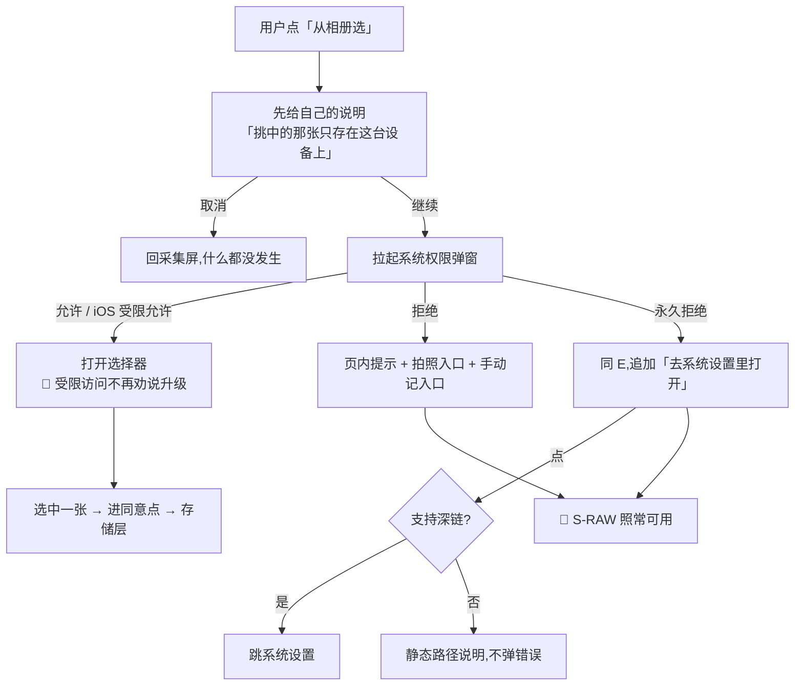

---

## 九、离线与弱网:逐条确认

**总纲 §一 屏幕表写死:`S-SET` 网络要求「不需要」,`S-RAW` 网络要求「不需要」。**
这一节把「不需要」拆到条目一级 —— 一屏标着不需要网络,里面却有一条转圈的,那句承诺就没了。

### 9.1 `S-SET` 逐条

| 条目 | 离线可用 | 离线时怎么显示 |
|---|---|---|
| `E-SET-01` 原图管理 | ✅ 完全可用 | 张数与占用照常(全是本机数据) |
| `E-SET-02` 导出我的全部数据 | ✅ 入口可用 | 入口照常;导出**本机数据**这条路离线成立(云端范围那部分由 `S-EXP` 自己处理) |
| `E-SET-03` 清空这台设备上的数据 | ✅ 完全可用 | 照常,包括那条「还有 n 条没传上去」的第三层浮层(§4.2)——**离线时这条几乎必现** |
| `E-SET-04` 账号 | ⚠️ 入口可用,进去受限 | 条目照常显示已缓存的手机号尾号;点进 `S-ACC` 后由那一屏处理 |
| ~~`E-SET-05` 在另一台设备上也用~~ | ➖ **已裁定 · 作废(2026-09-02)** | 该条目不再存在(见 §1.3),**离线行为随之无对象** |
| `E-SET-06` 本月还剩 {n} 次 | ⚠️ **值拿不到** | 🔴 值位显示**「联网后才知道」**。不显示 0、不显示「—」、不转圈、不禁用条目 |
| `E-SET-07` 这个产品不做什么 | ✅ 完全可用 | 静态文案,构建期打进包里(§3.1) |
| `E-SET-08/09` 协议 / 隐私 | ✅ 完全可用 | 同上。🔴 **协议不能是一个网页链接** —— 离线读不到的协议等于没有协议 |
| `E-SET-10` 版本号 | ✅ | 构建期注入 |
| `E-SET-11` 反馈方式 | ✅ 可点 | 拉起邮件客户端 / 复制地址都不需要网络 |
| `E-SET-12` 退出登录 | ⚠️ **可点,但要说清** | 请求打不通 → 本地先清令牌,顶部细条「已退出,联网后会通知服务器」。🔴 **不能因为网络失败就不让用户退出** |
| `E-SET-13` 注销账号 | ❌ **禁用** | 副标题变「注销要联网」。🔴 注销是服务端动作,本地假装成功会让用户以为账号没了而它还在 |

🔴 **`E-SET-06` 的「联网后才知道」是这一屏唯一一处离线降级,而且它降的是显示不是能力。**
条目仍然可点,进 `S-BILL` 后由那一屏报网络 —— **不在设置屏堵住用户。**

### 9.2 `S-RAW` 逐条

| 元素 | 离线可用 | 说明 |
|---|---|---|
| 计数行 / 占用 | ✅ | 全本机 |
| 常驻说明 | ✅ | 静态 |
| 缩略图网格 | ✅ | 本机读 |
| 留存区分组 | ✅ | 本机判据 |
| 单张详情 / 大图 | ✅ | 本机读 |
| 倒计时 `E-RAW-13` | ✅ | 由本机时钟与 `expiresAt` 算 |
| 删除(单张 / 批量 / 清理留存区) | ✅ | 🔴 **纯本机操作,没有任何网络往返** |
| 「看它属于哪条记录」 | ⚠️ | 跳到时间线,本机记录能看;云端记录由那一屏处理 |
| 另一形态提示(§5.4) | ✅ | 本机探测 |

🔴 **`S-RAW` 整屏零网络请求。** 这不是「离线也能用」,是**它本来就没有联网的理由**。
一次抓包如果在这一屏上抓到任何出站请求,就是红线破口(`A-01`)。

---

## 十、多端差异

| 项 | 桌面壳(Tauri macOS) | 移动 App(Tauri iOS / Android) | Web / H5 | 微信小程序 |
|---|---|---|---|---|
| `S-SET` | ✅ 全部条目 | ✅ 全部条目 | ✅ 全部条目 | ⚠️ 简化,见 10.1 |
| `S-RAW` | ✅ | ✅ | ✅ | 🔴 **整屏不存在** |
| 原图存储位置 | 应用数据目录(§6.1) | 应用私有目录 | 浏览器本地数据库,按网址隔离 | 🔴 不存 |
| 空间上限 | **无软上限**(`limitBytes = null`) | 无软上限 | 浏览器配额 | —— |
| 「占多少」怎么算 | 读目录大小 | 同左 | 浏览器存储估算接口 | —— |
| 相册权限 | ❌ 不涉及(拖拽 / 文件选择) | ✅ 涉及(§八) | ❌ 不涉及(文件选择控件) | —— |
| 启动清理孤儿字节 | 🔴 **必须**(文件系统没有事务) | 必须 | 不需要(数据库事务保证) | —— |
| 长按大图的系统菜单 | 需关闭 | 🔴 **必须关闭**(默认给「存储图片 / 分享」) | 需关闭 | —— |
| 「这个产品不做什么」第三条 | ✅ 显示 | ✅ | ✅ | 🔴 **不显示**(10.1) |
| 卸载后原图 | 通常保留(数据目录不随应用删) | 🔴 **随 App 删光** | 清站点数据即删光 | —— |
| 常驻说明用哪一版 | 通用版 | 通用版 | 🔴 **Web 专版**(10.2) | 不适用 |

### 10.1 微信小程序:这两屏在这个端上的形态

**裁定已冻结**(`多端选型与端矩阵` §3.6.1):**小程序端不开原图通道。**

| | 小程序上的样子 |
|---|---|
| `S-RAW` | 🔴 **不存在这一屏**,`S-SET` 里没有「原图管理」这一条 |
| 「这个产品不做什么」第三条 | 🔴 **不显示。这个端上没有原图,这句话没有主语** |
| `S-SET` 保留什么 | 导出、账号、AI 次数、这个产品不做什么(四条)、协议、版本号 |
| 「清空这台设备上的数据」 | ✅ 保留,但文案里不提图:「这台设备上的记录会删掉」 |

**为什么不做一个弱化版:** 微信沙盒里「原图只存在你自己的机器上」**物理上不成立** ——
本地存储上限很小,图片临时文件由微信按自己的策略管理与清理,**这条承诺的执行权不在我们手上**。
在那个端上降级承诺(「我们保证不了它待多久」)会把**其余端那条承诺一起变成「看情况」** ——
用户不按端记忆承诺,只记住这个产品对原图的说法是有条件的。

### 10.2 🔴 Web 端的「本机存储」是什么,以及它有多弱

**这是原图承诺在 Web 端最容易破的地方,必须写清楚。**

**是什么:** 浏览器给这个网址(origin)分配的一块本地数据库。
它**确实在用户自己的机器上** —— 这一点和壳形态没有区别,红线在 Web 端**成立**。

**弱在哪 —— 四条,逐条:**

| # | 弱点 | 后果 |
|---|---|---|
| 1 | **按网址隔离** | 换浏览器、换配置文件、甚至同一台机器上的壳(回环地址)与网页(线上地址)**互相读不到**(`R-114`) |
| 2 | **浏览器可以主动清理** | 磁盘压力下浏览器会驱逐非持久化存储;⚠️ **部分浏览器对长期未访问的站点存储有主动驱逐策略**(外部事实,动手前复核,登记为 `G-7`) |
| 3 | **用户一键清除** | 「清除浏览数据」「清除站点数据」会一起清掉,而用户不会觉得那是在删他的图 |
| 4 | **隐私模式下直接不可用** | `RawImageStorageError`,一张都存不下(`S-02` `S-03`) |

**要不要在界面上告诉用户 —— 🔴 要,而且要区别于其他端。**

| | 壳 / App 上的常驻说明 | **Web 上的常驻说明** |
|---|---|---|
| 原文 | 「这些图只在这台设备上。换设备看不到,也没有任何地方备份。」 | 「这些图只在这个浏览器里。**换个浏览器看不到,清浏览器数据会一起清掉**,也没有任何地方备份。」 |

**再加一条 Web 独有的、可关闭的提示**(关闭后本设备不再出现):

> 「浏览器可能在空间不够时清理掉这些图。要它们更稳一点,可以装桌面版。」

⚠️ **这句话必须点名「浏览器可能清理」,不能只写「建议装桌面版」。**
后者是推广,前者是告知。**产品在这里的义务是告知一个它控制不了的事实,不是导流。**

🔴 **不做的事:** 不因为 Web 端弱就在 Web 端加一个「备份到云」的口子。
弱是端的事实,加口子是破红线 —— **这两件事不能拿来交换。**

---

## 十一、性能与体感预算

**给区间,并说明依据。数字是产品对体感的要求,不是实现指标。**

| # | 项 | 预算 | 依据 |
|---|---|---|---|
| `P-01` | `S-SET` 首屏可见 | **< 100 ms** | 这一屏零网络、零磁盘(除了两个已缓存的数),它慢只可能是渲染写错了 |
| `P-02` | `S-SET` 出骨架屏的阈值 | 🔴 **永不出骨架屏** | 见 §1.5。它没有任何依赖网络的首屏内容 |
| `P-03` | `S-RAW` 首屏(固定区 + 首屏缩略图) | **< 400 ms** | 一次索引读 + 首屏那些缩略图的解码。索引是一个文件 / 一次数据库事务 |
| `P-04` | `S-RAW` 出骨架屏的阈值 | **> 300 ms 才出** | 低于这个数出骨架屏 = 一次可见的闪烁,比等一下更差 |
| `P-05` | 缩略图加载 | 首屏项**同步给出**(已随索引存好,`B-07`);屏外项按需 | 写入时生成一次、列表不现算,是 `P-03` 能成立的前提 |
| `P-06` | 虚拟滚动阈值 | **> 120 项**才启用 | 活跃段本来就小(`B-02`),只有留存区会长。120 以下全量渲染更简单也更快 |
| `P-07` | 空间占用统计的计算时机 | 🔴 **不在每次进屏时全盘扫描** | 见 11.1 |
| `P-08` | 批量删除的进度反馈 | 超过 **8 张**才出进度条;8 张以内直接做完给 Toast | 短操作出进度条会让它显得比实际慢 |
| `P-09` | 批量删除单张耗时预期 | < 30 ms / 张;总时长超过 **3 秒**时进度条必须已经在屏上 | 与 `P-08` 一致:200 张(`B-13`)约 6 秒,必须有进度 |
| `P-10` | 删除后列表更新 | **乐观更新**:确认后立刻从列表移除,失败再放回并提示 | 删除是本机操作,失败率极低;等一次往返会让它显得卡 |
| `P-11` | 大图打开 | **< 200 ms** 出图;超过则先显示缩略图放大版,再换真图 | 缩略图已在手上,不用让用户盯着空白 |

### 11.1 `P-07` 展开:空间占用什么时候算

🔴 **每次进屏全盘扫描是错的** —— 留存区不淘汰,它会长到几百张;
每次进 `S-RAW` 都读一遍全部文件大小,这一屏会随使用越来越慢,
而**慢下来的正是那些最认真用产品的人**。

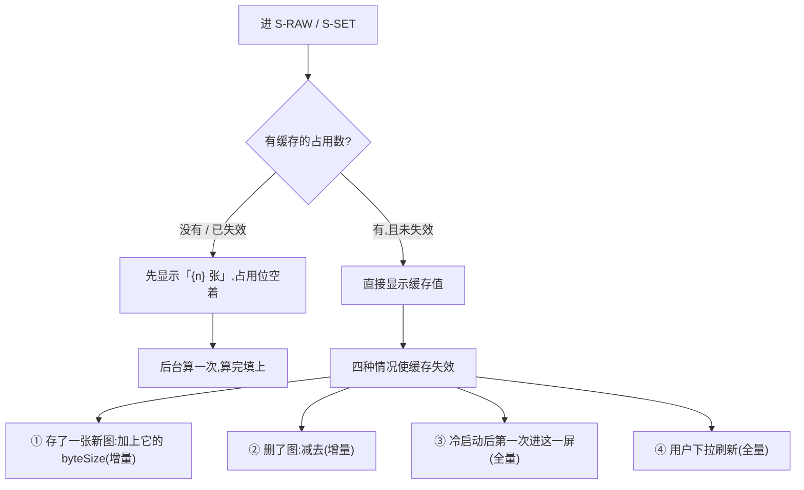

| 时机 | 算法 | 为什么 |
|---|---|---|
| 存一张 / 删一张 | **增量**:缓存值 ± `byteSize` | 索引里已经有这个数,不用碰字节 |
| 冷启动后第一次进屏 | **全量一次** | 上一次运行期间系统可能清理过文件,增量会漂 |
| 用户下拉刷新 | 全量 | 用户明确要求一个准数 |
| 其余每一次进屏 | 🔴 **不算,读缓存** | —— |

⚠️ **全量扫描优先读索引里的 `byteSize` 之和,而不是逐个文件去问系统。**
只有在「索引与磁盘可能不一致」的场景(冷启动、自愈之后)才落到真的文件遍历。
**这一层的全部纪律是「少碰几次字节」,统计不该是例外。**

---

## 十二、无障碍

### 12.1 焦点顺序

| 屏 | 顺序 |
|---|---|
| `S-SET` | 返回 → 分组①标题(不可聚焦,只被朗读为分组名)→ ①的三条 → 分组② → …… → 页脚(只读) |
| `S-RAW` | 返回 →「选择」→ 计数行(只读)→ 常驻说明(只读,**必须被朗读,不能设 `aria-hidden`**)→ 分组标题 → 各缩略图 → 页脚 |
| `S-RAW` 批量态 | 焦点**立刻移到操作栏**,并朗读「已进入选择模式,已选 0 张」;`Esc` / 返回退出 |
| 浮层 | 焦点陷阱在浮层内;初始焦点在**安全按钮**上(§4.5 第 3 条);关闭后焦点回到触发它的那个元素 |

### 12.2 朗读文本

每个元素的朗读文本已写在 §1.3 / §5.6 / §5.7 / §5.8 各表最后一列。补三条通用规则:

1. **数字要带单位念全**:「占 1.2 GB」不是「1.2」;
2. **状态要念出来,不靠视觉**:留存区角标追加朗读「已在留存区」(`E-RAW-02`);
3. 🔴 **危险操作在朗读文本里就要带「不可撤销」**,不等浮层才说 —— 读屏用户是在**听列表**,
   等他点下去才知道危险,已经晚了一步。

### 12.3 危险操作的读屏警示

| 场景 | 要求 |
|---|---|
| 三个危险条目 | 朗读文本内含「不可撤销」(见各表) |
| 危险浮层 | 用 `alertdialog` 语义,打开时**整段浮层正文被朗读**,不只念标题 |
| 打字确认 | 输入框朗读「输入「清空」两个字来确认」;不匹配时按钮保持禁用并朗读「还不能确认」 |
| 删除执行中 | 进度用 `aria-live="polite"` 播报,**每 10% 播一次**,不是每张都播 |
| 删除完成 | `aria-live` 播报「删了 {k} 张」;失败时用 `assertive` 播报「有 {j} 张没删掉」 |

### 12.4 最小点击热区

| 元素 | 最小热区 |
|---|---|
| 列表条目 | 整行可点,高度 ≥ **48 dp / 44 pt** |
| 缩略图 | 整格可点,格子边长 ≥ 44 pt(与 `B-06` 的显示尺寸解耦:图可以小,热区不能小) |
| 批量态圆点 | **热区扩展到整格**,不是只有那个圆点 |
| 浮层按钮 | 高度 ≥ 48 dp,两个按钮之间间距 ≥ 8 dp(防误触) |
| 「去系统设置里打开」这类内联文字链 | 上下各扩 8 dp |

### 12.5 动态字体放大到 200% 的降级

| 元素 | 降级 |
|---|---|
| 列表条目 | 主标题与副标题**改为上下两行**,行高跟随;条目高度自适应,**不截断主标题** |
| 副标题(如「{n} 张,占 {size}」) | 允许换行到第二行;**允许尾部省略,但数字部分不能被省略掉** |
| `S-RAW` 计数行 + 常驻说明 | 常驻说明允许占到三行;🔴 **不允许折叠成「展开查看」** |
| 缩略图网格 | 列数 4 → 3 → 2 递减,**不缩小热区** |
| 批量操作栏 | 从「横排三键」变「上下两行」,`E-RAW-06` 计数单独一行 |
| 浮层 | 内容区可滚动,**按钮区固定在底部永远可见** |

### 12.6 颜色不作为唯一信息载体

| 信息 | 颜色之外的载体 |
|---|---|
| 留存区 | **分组标题文字**「留存区」+ 角标图形 + 朗读文本,三重 |
| 未挂载 | 角标图形 + 朗读文本 |
| 损坏 | 占位图形 + 「这张图读不出来了」文字 |
| 危险操作 | **不靠红色**(§4.5 第 1 条),靠「不可撤销」的文字与多一次确认 |
| 禁用条目 | 降低不透明度 **+ 副标题写明原因**(如「这台设备上没有数据」),不只是变灰 |
| 批量选中 | 勾选图形 + 边框,不只是变色 |

---

## 十三、接口对照

| 动作 | 端点 | 真源 | 产品对响应的语义要求 |
|---|---|---|---|
| 读 AI 剩余次数 | `GET /quota` 的 `ai_ask.remaining` | [`技术架构与接口契约`](../../technical/INDEX.md) | 必须能区分「0 次」和「取不到」——两者界面表现完全不同(§9.1) |
| 读账号信息 | `GET /account` | [登录与账号](登录与账号.md) §八 | 只要手机号尾号;🔴 **不要昵称、头像、任何自由文本字段** |
| 退出登录 | `POST /auth/logout` | 同上 | 失败也要让本地退出(§9.1 `E-SET-12`) |
| 注销账号 | `DELETE /account` | 同上 | 必须能区分「已受理」与「已完成」——删除时点是未决项(`L-3` / `G-10`) |
| 导出 | `GET /export?format=` | [导出与问AI](导出与问AI.md) | 🔴 响应里**没有原图字节**,任何格式都没有 |
| 记录识别(拍照) | `POST /records/{id}/image` | [`技术架构与接口契约`](../../technical/INDEX.md) §6.2 | 🔴 **JSON + base64 内联,一次性**。multipart 打上去必须被拒 —— 它不是一个会落盘的上传接口 |
| **原图列表 / 读一张 / 删 / 归档 / 统计** | 🔴 **没有端点。一个都没有。** | 本文 | 见 13.1 |

### 13.1 🔴 原图相关操作没有任何端点 —— 这是红线在接口层的证据

**`S-RAW` 这一整屏,零个后端端点。** 不是「暂时还没做」,是**结构上不该有**:

| 假想的端点 | 为什么不存在 |
|---|---|
| `GET /images` | 服务端能列出我的图 ⇒ 服务端有我的图 ⇒ 红线已破 |
| `GET /images/{id}` | 同上,而且它是一条**能在浏览器里直接打开原图的链接** |
| `DELETE /images/{id}` | 服务端能删我的图 ⇒ 它存过 |
| `POST /images/archive` | 归档判据在本机判据层,服务端参与就有了第二份判据 |
| `GET /images/usage` | 空间是本机的事;服务端知道我占多少 ⇒ 它至少知道我有几张、多大 |

**这条约束在三个层次上各有一份证据,任何一层失守其余两层都能发现:**

| 层 | 证据 | 谁保证 |
|---|---|---|
| **类型层** | `RawImageMeta` 八个字段全是本机语义,**签名里没有 URL / bucket / fileId 的位置** | `原图存储：判据层与存储层` §2.2 第三条 |
| **接口层** | 本表:零端点。`POST /records/{id}/image` 是识别不是存储,multipart 打上去被拒 | 服务端测试 |
| **界面层** | `S-RAW` 整屏零网络请求(§9.2),抓包可验 | `A-01` `A-03` |

⚠️ **壳侧的本地回环通道不是端点。** 它是**同一台机器上两个进程之间的通道**,
路径前缀**刻意不是 `/api/*`** —— 那条路整条反代给上游,这条路一个字节都不出这台机器
(`原图存储：判据层与存储层` §9.1)。产品侧对它的唯一要求:
🔴 **响应的 `content-type` 恒为 `application/octet-stream`,不按图片类型回** ——
按图片类型回的话,这个本地地址就成了一条能在浏览器里直接打开原图的链接。

---

## 十四、埋点

🔴 **这两屏不新增任何埋点事件。** 总纲 §五 那四个事件之外一个都不加。

| 想埋的 | 判 | 理由 |
|---|---|---|
| `raw_screen_opened`(有多少人看过自己的图) | ❌ | 它服务不了任何一条阶段判据,也不是北极星。**说不清它服务哪条判据,就是不该加** |
| `raw_deleted`(删了多少张) | ❌ | 同上。而且它离「用户的图」太近 —— 一个记录删图行为的事件是这条红线上最不该出现的埋点 |
| `settings_opened` | ❌ | 行为分析,产品不做 |
| `boundary_page_opened`(有多少人读了「不做什么」) | ⚪ **想要,但按规矩登记到缺口** | 见 `G-8`。它诱人是因为它看起来像在验证边界有没有被理解,但它服务不了任何一条已有判据 |

**这两屏与四个既有事件的关系:一个都不触发。** `record_created` / `record_skipped` /
`blindspot_opened` / `signup_created` 的触发点都不在这两屏上。

---

## 十五、异常全集

### 15.1 既有(原文保留)

| # | 触发 | 表现 | 文案 | 下一步 |
|---|---|---|---|---|
| `S-01` | 本机存储写满 | 浮层 | 「这台设备存不下新的原图了」 | 去清理 |
| `S-02` | 本地存储被浏览器策略禁用 | 顶部说明 | 「这个浏览器不让存本地数据,图没法保存,文字记录不受影响」 | 换端 / 继续用 |
| `S-03` | 隐私模式 | 同上 | 同上 | —— |
| `S-04` | 图读不出来(文件损坏) | 该张显示占位 | 「这张图读不出来了」 | 删除它 |
| `S-05` | 清空设备数据 | **两次确认**,第二次要打字「清空」 | 「这台设备上的记录和图会全部删掉,云端的不受影响」 | 执行 |
| `S-06` | ~~未登录时清空~~ **已裁定 · 作废(2026-09-02)** | 前提不存在:未登录到不了 `S-SET`,也不存在「没同步过的本机数据」 | ——(原文案随之作废) | —— |
| `S-07` | 迁移(浏览器 → 壳)中断 | 静默重试 | 「上次搬了一半,这次接着搬」 | 无需操作 |
| `S-08` | 迁移失败的残留 | 见 `R-115` | 🚧 **界面上现在看不到它们** | 见 §十七 `G-1` |

### 15.2 续编

| # | 触发条件 | 界面表现 | 上屏原文文案 | 用户下一步 | 后端行为 | 数据留住了吗 |
|---|---|---|---|---|---|---|
| `S-09` | 原图文件被用户在系统里手动删了(索引有行、字节没有) | 该张显示损坏占位;🔴 **下一次进屏自愈**,索引残行被清掉,那一格消失 | 「这张图不在了 —— 可能在系统里被删掉了」 | 无需操作,刷新即消失 | 无(纯本机) | 记录留住了,图没了 |
| `S-10` | 一次自愈清掉多张(用户清空了整个目录) | 顶部一条可关闭说明 | 「有 {n} 张图不在了。记录都还在。」 | 无需操作 | 无 | 记录全在 |
| `S-11` | 存储空间不足(写入时磁盘满) | 浮层 | 「这台设备存不下新的原图了。文字记录已经记下来了。」 | 去 `S-RAW` 清理 / 继续 | 无(`RawImageStorageError`) | 🔴 **文字记录照落** |
| `S-12` | 空间不足到连索引重写都写不下 | 页内提示 + 重试 | 「空间太满了,连删除都没写进去。腾一点空间再试。」 | 系统里腾空间 | 无 | 图还在(没删掉) |
| `S-13` | 缩略图生成失败(解码失败 / 内存不足) | 该张显示通用占位(**不是损坏占位**),仍可点开 | 「这张的预览没生成出来」 | 点开看大图 / 删除 | 无 | 图在,只是没缩略图 |
| `S-14` | 原图损坏无法预览(字节在,但解不开) | 详情里大图位显示占位 + 说明 | 「这张图读不出来了。可以把它删掉。」 | 删除它 | 无 | 索引在,图不可用 |
| `S-15` | 批量删除中途失败 | 成功的消失;失败的留在原位加错误角标;顶部说明 | 「删了 {i} 张,有 {j} 张没删掉。」+「再试一次」 | 点重试(只重试失败的那些) | 无 | 失败的那些**还在** |
| `S-16` | 批量删除全部失败 | 列表不变;顶部说明 | 「一张都没删掉。」+「再试一次」 | 重试 / 退出批量态 | 无 | 全在 |
| `S-17` | 清空数据时有未同步队列 | 浮层三(§4.2) | 「还有 {n} 条没传上去,清掉就不会再传了。」+「先等它传完」(主)/「照样清空」(次) | 二选一 | 选「照样清空」→ 队列本地丢弃,**服务端从不知道这些记录** | 云端已传的留住,未传的没了 |
| `S-18` | 清空数据时正在录音 | 浮层拦在最前 | 「正在录音。先停下来,再清空。」 | 停止录音 / 取消 | 无 | 录音内容按采集屏规则处理 |
| `S-19` | 清空数据时正在上传识别 | 浮层拦在最前 | 「有一张图正在识别。等它完事,或者取消它。」+「取消识别」 | 二选一 | 取消识别 = 中断那次请求 | 记录已落,标签没有 |
| `S-20` | 清空执行到一半崩溃 / 被杀 | 下次启动后台续跑,不打扰用户 | 无(静默) | 无需操作 | 无 | 部分删除是可接受中间态(顺序见 §4.2) |
| `S-21` | 注销时本机还有原图 | 注销浮层里**明确告知一次**(说在「要不要先导出」之前) | 「注销后,云端的记录会被删掉,这台设备上的 {n} 张原图与本地缓存也会一起删掉。要不要先导出一份?」+「先导出」(主)/「直接注销」(次) | 先导出 / 直接注销 | `DELETE /account` 删云端;**同时删除这台设备上的原图与本地缓存** | 🔴 **本机原图随注销一起删除**(2026-09-02 裁定);告知只说一次,**不再给「要不要也删掉」的二选一** |
| `S-22` | 退出登录时本机还有数据 | 退出浮层原文 | 「退出后,这台设备上的原图一张不动;已经同步过的记录会从这台设备上清掉 —— 它们在你的账号里,重新登录就回来」(逐字引自 [登录与账号](登录与账号.md) §4.7) | 确认 / 取消 | `POST /auth/logout` | 全留着 |
| `S-23` | 相册权限被拒 | 采集屏页内提示 | 「没拿到相册权限。可以直接拍一张,或者手动记一条。」 | 拍照 / 手动记 | 无 | 🔴 `S-RAW` 照常可用 |
| `S-24` | 相册权限被永久拒绝 | 同上 + 一行可点文字 | 同上 +「去系统设置里打开」 | 跳系统设置 / 换方式 | 无 | 同上 |
| `S-25` | 系统设置深链跳不过去 | 页内静态说明,**不弹错误** | 「在系统设置 → 应用 → {应用名} → 照片 里打开」 | 自己去 | 无 | —— |
| `S-26` | iOS 受限访问下选不到想要的图 | 系统选择器行为,产品不介入 | 🔴 **不出任何劝说升级授权的提示** | 用户自己在系统里改 | 无 | —— |
| `S-27` | 用户在 `S-EXP` 里找不到导出原图的选项 | `S-EXP` 常驻一行说明 | 「导出的是你的记录,不含原图 —— 图只在这台设备上,不打包、不上传。」 | 无需操作 | 无 | —— |
| `S-28` | 外接存储被拔出(数据目录在外接盘上的极端情况) | `S-RAW` 整屏受限态 | 「读不到存图的地方了。文字记录不受影响。」 | 插回去 / 继续用 | `RawImageStorageError` | 图在那块盘上,没丢 |
| `S-29` | 文件被系统清理程序回收(磁盘清理 / 优化存储) | 走 `S-09` / `S-10` 的自愈路径 | 「有 {n} 张图不在了。记录都还在。」 | 无需操作 | 无 | 记录全在 |
| `S-30` | 归档目录不可写(权限被改 / 只读挂载) | 到期的图暂时留在活跃分组;顶部一条说明 | 「暂时改不了这些图的状态。图都还在,记录也在。」 | 无需操作(下次启动重试) | `RawImageStorageError`;**归档是幂等的,重跑安全** | 全在 |
| `S-31` | 索引文件读不动(损坏) | 🔴 **启动清理什么都不做并报错**,`S-RAW` 受限态 | 「读不出这台设备上的图的清单。图还在盘上,先别清理。」 | 反馈 / 等下次启动 | 🔴 **绝不把「读不动」当成「索引是空的」** —— 那会把目录里每一张都当孤儿删光 | 🔴 **字节全在** |
| `S-32` | 索引重写失败(写临时索引文件时失败) | 上一步操作报失败并回滚显示 | 「刚才那一步没成。」+「再试一次」 | 重试 | 索引保持上一个完整版本 | 全在 |
| `S-33` | 孤儿字节文件(索引里没有的字节文件) | 用户完全看不到 | 无 | 无需操作 | 🔴 **启动清理删掉** —— 它是一张没有过期戳的原图,而没有过期戳 = 永不过期 | 那些字节被删(设计如此) |
| `S-34` | 同名文件冲突(同一 id 的字节文件已存在) | 用户看不到 | 无 | 无需操作 | `put` 走临时文件 + 原子改名,**覆盖是原子的**;id 由随机数生成,冲突概率可忽略 | 整行一致 |
| `S-35` | 时钟被往前拨(跳到未来) | 大量图同时进留存区 | 留存区分组正常显示,不弹任何浮层 | 无需操作,可手动删 | 归档是**一次性**的,反复扫描不会把 `archivedAt` 一路往后推 | 🔴 **一张都没删** |
| `S-36` | 时钟被往后拨(回到过去) | 倒计时显示异常长 | 🔴 **不显示负数、不显示「已过期」**;超过判据层允许的最大值时,该行只显示「在留存期内」 | 无需操作 | 已归档的**不会**因为时钟回拨变回活跃(`archive` 碰不到 `expiresAt`,没有反向操作) | 全在 |
| `S-37` | 算不出合法过期戳(`RawImageExpiryError`) | 采集屏页内提示 | 「这张图没被本地缓存。」🔴 **不是「记不下来」** | 继续(记录已落) | 🔴 **一个字节都没落** | 记录留住了 |
| `S-38` | 活跃段满,最早的几张被转进留存区 | 那几张移到「留存区」分组;**不打断用户** | 无浮层。页脚常驻:「这台设备最多存 {n} 张 —— 满了会把最早的转进留存区,不会删」 | 无需操作 | 转归档,**不删** | 全在 |
| `S-39` | 批量选择超过上限 | 顶部一条提示,未选中项禁用 | 「一次最多选 {n} 张。」 | 分两次删 | 无 | —— |
| `S-40` | 删除进行中用户按返回 | 拦一次 | 「还在删,退出会停在这儿。」+「继续删」(主)/「停下」(次) | 二选一 | 「停下」= 已删的保持已删,不回滚 | 已删的没了,没删的在 |
| `S-41` | `usedBytes` 取不到 | 只显示张数,**占用位整个省略** | 「{n} 张 · 都在这台设备上」 | 无需操作 | 无 | —— |
| `S-42` | 本形态 0 张,另一形态有数据 | 空态下加一行 | 「在浏览器里存的图,这个应用读不到 —— 它们是两个地方。」 | 无需操作 | 🔴 **不做跨形态迁移** | 两边各自都在 |
| `S-43` | Web 端存储被浏览器驱逐 | 图消失,记录还在;顶部可关闭说明 | 「浏览器清掉了存在这里的图。记录都还在。要它们更稳一点,可以装桌面版。」 | 无需操作 | 无 | 记录全在,图没了 |
| `S-44` | 首次登录成功后回到 `S-RAW` | 顶部一条可关闭提示 | 「登录同步的是你的记录,不是图。图仍然只在这台设备上。」 | 关闭 | 无 | —— |
| `S-45` | 清空数据后立刻再进 `S-RAW` | 空态 | 「这台设备上还没有原图」 | 去记一条 | 无 | 🔴 **确实一张都没有了**,不是被隐藏 |
| `S-46` | 注销后仍持旧令牌,尝试进 `S-SET` | 静默回到**未登录的登录门**,**不弹浮层** | 无(不弹任何浮层;登录门自己的文案) | 要继续用就重新登录 | 全部令牌已吊销 | 这台设备上的原图与本地缓存**在注销那一步已按 §4.4 删除** |

---

## 十六、验收用例

**Given / When / Then。**

### 16.1 🔴 「原图不出本机」专项

| # | Given | When | Then |
|---|---|---|---|
| `A-01` | 已存下若干张原图 | 从进入 `S-RAW` 到退出,全程抓包 | **零个出站请求**。壳形态下只有回环地址上的本地通道,无任何非回环目的地 |
| `A-02` | 拍一张照并同意留存,走完识别 | 抓包看识别请求 | 请求体是 JSON + base64 内联;🔴 **没有任何一次请求把图传给厂商的文件暂存接口**;没有 `file_id` 出现在任何请求或响应里 |
| `A-03` | 同 `A-01` | 在 `S-RAW` 里删一张、批量删、清理留存区 | 三个动作各自**零出站请求**;壳形态下只出现回环删除调用 |
| `A-04` | 服务端开着全量访问日志与错误日志 | 走完一次完整的拍照 → 识别 → 存图 | 🔴 **日志里没有任何图片字节、没有 base64 片段、没有原图文件名**(`label` 从不进请求体) |
| `A-05` | 壳形态,应用数据目录已知 | 检查目录位置与 capability 配置 | 🔴 目录**不在**文稿 / 桌面 / 图片库之下;白名单只含这一个目录 |
| `A-06` | 存了若干张图 | 在 `S-SET` 与 `S-RAW` 上逐元素检查 | 🔴 **不存在任何标签为上传 / 备份 / 同步 / 分享 / 保存到相册 / 导出图片的可点元素** |
| `A-07` | 移动端,详情里打开大图 | 长按图片 2 秒 | 🔴 **不出现系统菜单**(无「存储图片」「拷贝」「分享」) |
| `A-08` | 存了若干张图,记录若干条 | `S-SET` → 清空 → 走完两次确认 | 🔴 磁盘上的字节文件与索引文件**全部不存在**(不是标记删除);再进 `S-RAW` 是空态;云端记录不受影响 |
| `A-09` | Web 端,浏览器 A 存了图 | 换浏览器 B 打开同一个网址 | 🔴 一张都看不到;`S-RAW` 是空态;常驻说明用的是 Web 专版(§10.2) |
| `A-10` | Web 端存了图 | 浏览器里执行「清除站点数据」,回到应用 | 图全没;顶部出现 `S-43` 的说明,**不出现任何「从云端恢复」入口** |
| `A-11` | 壳形态,写完字节后崩溃(索引未写) | 重启应用 | 🔴 孤儿字节文件被启动清理删掉;`S-RAW` 里看不到这张;**没有一张没有过期戳的图存活** |
| `A-12` | 任意端 | 扫描全部接口定义 | 🔴 **不存在任何以原图为资源的端点**(list / get / delete / archive / usage 一个都没有);`POST /records/{id}/image` 收 multipart 被拒 |

### 16.2 `S-SET`

| # | Given | When | Then |
|---|---|---|---|
| `A-13` | 未登录(全新安装,或刚退出登录) | 尝试打开 `S-SET` | 🔴 **到不了这一屏** —— 看到的是产品说明与登录门;这台设备上**不存在任何未登录状态下产生的记录**(断言随 2026-09-02 裁定反过来写,与 `登录与账号` `AC-02` 同口径) |
| `A-14` | **已登录**,本机零记录零原图 | 进 `S-SET` | 「原图管理」副标题为「这台设备上还没有原图」;「清空」禁用且副标题为「这台设备上没有数据」;**「导出」仍然可点** |
| `A-15` | 已登录,断网 | 进 `S-SET` | 「本月还剩」的值位显示「联网后才知道」;**其余条目一格不变,整屏无骨架屏、无转圈** |
| `A-16` | 已登录 | 在 360 × 640 下进 `S-SET` 不滚动 | 折叠线以上能看到:原图管理(含张数与占用)、导出、账号状态行 |
| `A-17` | 任意登录态 | 逐条检查 `S-SET` 的元素 | 🔴 不存在通知开关、提醒时间、每日目标、学习计划、主题皮肤;**不存在任何 `开关` 类型条目** |
| `A-18` | 任意登录态 | 逐条检查 `S-SET` 的元素 | 🔴 **没有任何一个自由文本输入框**(二次确认的固定字确认除外) |
| `A-19` | 已登录 | 在 `S-ACC` 里找退出与注销 | 两条都是普通条目 + 次要色,**不是红色填充按钮**;都不在 `S-SET` 首屏 |
| `A-20` | 已登录,断网 | 点「退出登录」并确认 | 本地令牌被清,回到**未登录的登录门**;门上细条「已退出,联网后会通知服务器」;🔴 **原图一张不少**;已同步的记录缓存按 §4.3 清掉(账号里还在,重新登录就回来),队列非空时先拦一次(`S-22` / §4.3) |
| `A-21` | 已登录,断网 | 看「注销账号」 | 禁用,副标题「注销要联网」 |
| `A-22` | 已登录,本机有 n 条未同步 | 点「清空这台设备上的数据」并走到底 | 出现第三层浮层「还有 {n} 条没传上去」;选「先等它传完」→ 回设置且不自动重开浮层 |
| `A-23` | 正在录音 | 点「清空这台设备上的数据」 | 浮层拦在最前:「正在录音。先停下来,再清空。」 |
| `A-24` | 已登录,已清空 | 检查登录态 | 🔴 **仍然登录着**(令牌不删);下一次同步把云端记录拉回来 |
| `A-25` | 动态字体 200% | 进 `S-SET` | 所有条目主标题不被截断;副标题里的数字不被省略;无横向滚动 |
| `A-26` | 读屏开启 | 焦点走过「清空这台设备上的数据」 | 朗读文本含「不可撤销」;打开浮层后**整段正文被朗读**,初始焦点在「取消」上 |

### 16.3 「这个产品不做什么」

| # | Given | When | Then |
|---|---|---|---|
| `A-27` | 全新安装,第一次打开 | 走完首启 | 出现首启说明屏(三句 + 登录入口),🔴 **它不是弹窗**:没有「我知道了」、没有蒙层、没有关闭、没有跳过。**登录成功后不再出现**,此后这一页只能从 `S-SET` 进(2026-09-03 裁定 `M0-G1` 后改写) |
| `A-28` | 断网,飞行模式 | 进这一页 | 五条正文完整显示(构建期打进包里);**没有加载态、没有失败态**;页面上**没有任何可点元素** |
| `A-29` | 任意端(小程序除外) | 逐条比对 | 五条与 `项目现状与决策记录` §2 对应条**逐条可对上**,两边条数相等 |
| `A-30` | 小程序端 | 进这一页 | 🔴 **不显示原图那一条**;其余四条与别端逐字一致 |
| `A-31` | 第一次拍照 | 走到同意点 | 同意点里关于原图的那句,与本页第三条**同源同义**(同一处词表) |

### 16.4 `S-RAW` 与原图生命周期

| # | Given | When | Then |
|---|---|---|---|
| `A-32` | 有活跃图与留存区图 | 进 `S-RAW` | 固定区两行始终可见;「留存区」分组排在最后且带「{k} 张 · {size}」 |
| `A-33` | 一张图刚过留存期 | 拨时钟越过到期时刻并触发一次扫描 | 🔴 那张图**移到留存区,没有被删**;点开仍能看到大图;占用总数**不减少** |
| `A-34` | 活跃段已满 | 再存一张 | 最早到期的那张进留存区,**不是被删**;页脚那句说明一直在屏上 |
| `A-35` | 留存区有图 | 在详情里找「恢复」 | 🔴 **不存在恢复入口**;倒计时行显示「{相对时间}转进了留存区」 |
| `A-36` | 一张图挂在某条记录上 | 删掉这张图 | 浮层含「和它一起的记录还在」;删完后那条记录仍在时间线上,**盲区数字不变** |
| `A-37` | 一张图挂在某条记录上 | 删掉那条**记录** | 🔴 图**不跟着删**,变成「没挂到任何记录上」并带角标;仍按自己的判据走 |
| `A-38` | 选中 200 张 | 再点第 201 张 | 未选中项禁用,顶部提示「一次最多选 {n} 张」 |
| `A-39` | 批量删 30 张,第 12 张时注入失败 | 执行 | 前 11 张消失;失败的与其后的留在原位;顶部「删了 11 张,有 19 张没删掉」;重试只作用于剩下的 |
| `A-40` | 用户在系统里手动删掉了 3 个字节文件 | 回到 `S-RAW` 并刷新 | 🔴 **列表自愈**:那 3 格消失,索引残行被清;顶部「有 3 张图不在了。记录都还在。」 |
| `A-41` | 索引文件被改坏 | 启动应用 | 🔴 启动清理**什么都不做并报错**;`S-RAW` 受限态显示「图还在盘上,先别清理」;**目录里的字节文件一个都没被删** |
| `A-42` | 磁盘已满 | 拍一张并同意留存 | 浮层「这台设备存不下新的原图了。文字记录已经记下来了。」;🔴 **那条文字记录确实落下来了** |
| `A-43` | 隐私模式 / 存储被禁用 | 拍一张并同意留存 | 提示「这张图没被本地缓存」——🔴 **不是「记不下来」**;记录照落 |
| `A-44` | 系统时间往后拨(回到过去) | 进 `S-RAW` | 倒计时**不显示负数、不显示「已过期」**;已在留存区的**没有变回活跃** |
| `A-45` | 已登录用户第一次登录成功 | 回到 `S-RAW` | 顶部出现「登录同步的是你的记录,不是图。图仍然只在这台设备上。」,可关闭且不再出现 |
| `A-46` | 留存区有 300 张 | 滚动到底 | 按 `B-05` 分页,无「加载更多」按钮;虚拟滚动按 `P-06` 启用;滚动不掉帧 |
| `A-47` | 冷启动后第二次进 `S-RAW` | 进屏 | 🔴 **不发生全盘扫描**,占用数直接来自缓存;下拉刷新才全量重算 |
| `A-48` | 读屏开启,批量删除 12 张 | 执行 | 进度以 `aria-live="polite"` 每 10% 播一次;完成播「删了 12 张」 |
| `A-49` | 动态字体 200% | 进 `S-RAW` | 常驻说明可占三行且**不折叠成「展开查看」**;网格列数递减但热区不小于 44 pt |
| `A-50` | 任意端 | 检查列表项与详情 | 🔴 **没有重命名入口**;`label` 只读显示 |
| `A-51` | 小程序端 | 进 `S-SET` | 🔴 没有「原图管理」这一条;`S-RAW` 这一屏不存在;「清空」文案不提图 |
| `A-52` | 两张图 `expiresAt` 相同 | 连续两次进 `S-RAW` | 🔴 两次的顺序**完全一致**(按 `B-18` 的次级排序),没有跳位 |

---

## 十七、缺口登记

| # | 缺口 | 卡在哪 |
|---|---|---|
| `G-1` | **迁移失败的行在界面上不可见** | `R-115` 已登记:迁移失败的图留在旧存储里,用户看不见也收不到提示。现状是缓解不是修复 |
| `G-2` | **留存区保留多久** | 「转入留存区」之后呢?没有第二个时点,也没人裁定过要不要有 |
| `G-3` | ~~**换设备时的数据交接**~~ **已裁定 · 作废(不存在本机模式,登录前不产生数据)** | 前提消失:2026-09-02 用户裁定「没有本地模式」。它问的是「这台设备上那份无主数据怎么交接」,而**登录前不产生数据** —— 记录一产生就在账号下,换设备跟着账号走;原图不跟着走是红线不是缺口(§6.7)。与它是同一件事两面的 [登录与账号](登录与账号.md) `L-4` 已一并作废 |

### 17.1 续登记

| # | 缺口 | 为什么卡住 | 不定它会挡住什么 |
|---|---|---|---|
| `G-4` | **要不要向既有用户重新征询一次同意** | `R-107` 已登记:用户当初同意的是「N 小时后删掉」,产品做的是「N 小时后转留存区、无限期留着」。**承诺的性质变了而同意键没变,于是没有人被重新问一遍**。换键 = 一次面向全部既有用户的动作,不该由实现方决定 | **不挡开发**。① 文案已在 §3.3 / §6.4 定稿(承诺句逐字 + 附加句已把「转留存」写进同意点),② 阶段 0 一个既有用户都没有,**重新征询的对象是空集**。它挡的是「上线后第一批用户之后再改留存语义」那一次动作,到那时才必须裁 |
| `G-5` | **留存区会长到多大,以及要不要提醒** | `G-2` 的下游:留存区不淘汰、不释放空间,长期使用后它是这台设备上最大的一块。**但「提醒用户去清」是提醒,而产品不做提醒**(`R-05`)。目前的答案是「把数摆在那里,用户自己看」,没人裁定过这够不够 | 挡住:留存区占用超过某个比例时界面要不要变化。**不定就按现状:什么都不变** |
| `G-6` | **`RawImageCapacity` 还没落地** | `原图存储：判据层与存储层` §2.3 明说这是**已知缺口,不是已经做完的事**:界面上今天没有任何地方显示归档占了多少 | 挡住 §6.2 的两个数、留存区分组标题、`S-SET` 副标题 —— **本文写的界面依赖一个还没有的值** |
| `G-7` | **浏览器驱逐策略的确切行为** | §10.2 第 2 条标着「外部事实,动手前复核」。各浏览器策略不同且会变,产品这边**验证不了也控制不了** | 挡住 `S-43` 与 Web 版常驻说明的措辞强度:说「可能清理」还是「会清理」,取决于这个事实 |
| `G-8` | **「这个产品不做什么」有多少人读过,产品不知道** | 想埋 `boundary_page_opened`,但它服务不了任何一条阶段判据,按总纲 §五 就是不该加(§十四) | 不挡任何开发。**登记它是为了记住:这个数产品主动选择了不要** |
| `G-9` | **「删了图记录还在」有没有被用户理解,无从验证** | 同 `G-8`:验证它需要埋点或问用户,前者不许加,后者要有用户 | 不挡开发。挡的是「§6.9 这一节写对了没有」的验证 |
| `G-10` | **注销的删除时点** | `L-3` 已登记为未决(`技术架构与接口契约` §6.1) | 挡住 `S-21` 浮层里能不能写「立刻删」——现在写的是「云端的记录会被删掉」,没有时点 |
| `G-11` | **移动端系统「优化存储」会不会回收原图目录** | 无真机上架经验,`多端选型与端矩阵` §3.4 里上架本身还是未验风险 | 挡住 `S-29` 在移动端的实际发生率,以及要不要给移动端一句额外的常驻说明 |
| `G-12` | **`B-05` 到 `B-22` 这一批新提出的界面数字没有人审过** | 它们是本文新提出的,不是从判据层来的。**产品可以定,但没定过** | 不挡设计动手(可先按本文值做),挡的是「这些数写进代码时算不算已裁定」 |
| `G-13` | **「另一形态有数据」怎么探测** | §5.4 / `S-42` 要求检测到「另一形态非空」才显示那一行,但壳与浏览器按网址隔离,**结构上读不到对方**(`原图存储：判据层与存储层` §四点五)。目前没有一个不破红线的探测手段 | 挡住 `S-42` 的触发条件。**不定就退化成:那一行常驻显示,不做条件判断** |
| `G-14` | **`S-RAW` 到底有没有人打开过** | 这是 `G-8` 的另一面,而且更要紧:原图这一整块是产品对用户最硬的承诺,**而产品不知道有没有人来验证过它** | 不挡开发。挡的是「这一块值不值得继续投入」这个判断 |
| `G-15` | **清空数据时「正在录音 / 识别」的状态谁来提供** | `S-18` `S-19` 要求清空前知道有没有在跑的采集任务,而这个状态今天没有一个跨屏可读的来源 | 挡住 `S-18` `S-19` 的实现。**不定就退化成:清空时直接中断,不拦截** —— 而那会丢一次录音 |

🔴 **十五条里没有一条是「已经解决但记一笔」。** 一个看起来合理的推断不能关闭其中任何一条。
唯一的例外是 `G-3`,而它**不是被推断关闭的** —— 是 2026-09-02 用户裁定让它的前提不存在了,行保留并标作废。

---

## 十八、红线自查

| # | 检查 | 结果 |
|---|---|---|
| 1 | 原图无上传 / 备份 / 同步 / 分享入口 | ✅ §5.3 · §5.7 · §5.8 · §6.3 三个「没有」明写 · `A-06` |
| 2 | 文案用「转入留存区」不用「到期删除」 | ✅ §5.1 · §6.4 明令界面上永不出现「自动删除」 |
| 3 | 设置里无通知 / 提醒 / 目标 / 计划 / 皮肤入口 | ✅ §一 原文 · §1.4 逐条判否 · `A-17` |
| 4 | 边界页与决策记录一一对应 | ✅ §二 原文保留 · §3.4 规定改动流程与顺序 · `A-29` 要求两边条数相等 |
| 5 | 🔴 原图只在本机,不上云、不同步、不共享 | ✅ §6.1 目录 · §6.3 三个「没有」· §十三 零端点 · `A-01` 到 `A-12` 十二条专项 |
| 6 | 🔴 图在内存里直到发给模型,不落服务端盘、不写日志、不用厂商暂存接口 | ✅ §6.3 末段 · §十三 识别那一行 · `A-02` `A-04` |
| 7 | 🔴 只回答「有没有、几次、多久前」 | ✅ §5.6 / §5.8 全部展示元素只有:多久前存的、还有多久转留存区、占多大、几张。**没有任何一处对图或记录做判断** |
| 8 | 界面禁用词表零命中 | ✅ 本文新增文案逐句核对;复扫按 [`用户侧功能规格 · 总纲与全局约定`](INDEX.md) §七 第一行那条命令 |
| 9 | 🔴 没有任何字段能装下题干(含示例、占位、附录) | ✅ §1.3 末段:设置屏零输入框;§5.6 末段:不提供重命名;`A-18` `A-50` |
| 10 | 🔴 导出不限次数、无水印、不删减 | ✅ §4.1:永不禁用、永不加锁图标、副标题常驻「不限次数,没有水印」 |
| 11 | 不存培训机构课程内容 | ✅ 本文两屏不涉及任何来源内容;`label` 是本机文件名且只读、不出本机 |
| 12 | 自动打标不生成标签文本 | ⚪ 不适用(这两屏不打标) |
| 13 | ~~本机模式(不登录)是正常形态~~ **已作废** | 🚫 **2026-09-02 用户裁定「没有本地模式」**:未登录到不了 `S-SET` / `S-RAW`,这一条要检查的形态**已不存在**。按裁定**不改写成别的检查**,直接作废(§零 · §一 · §1.5) |
| 14 | 数字给指针,不在本文写死 | ✅ §零 · `B-01` 到 `B-04` 全部指向 [`原图存储：判据层与存储层`](../../technical/原图存储-判据层与存储层.md);本文新提出的数在 §七 标明并登记 `G-12` |
| 15 | 新提出的端点标 `🚧 待技术定稿` | ✅ **本文没有新提出任何端点** —— 这两屏零端点(§13.1),所以这一条无对象 |
| 16 | 埋点不超出总纲 §五 那四个 | ✅ §十四:零新增;想加的登记为 `G-8` |
| 17 | 危险操作不用红色大按钮、不在首屏 | ✅ §4.5 三条约束 · `A-19` |
| 18 | 只增不删:既有分组、边界页原文、`S-SET` / `S-RAW` 各节、`S-01` 到 `S-08`、`G-1` 到 `G-3` 全部保留 | ✅ §一 §二 §5.1–5.4 §15.1 §十七 逐段原文保留,编号连续往后加。⚠️ **2026-09-02 用户裁定带来三处例外**:① `E-SET-05` `S-06` `G-3` 与本表第 13 条**保留行、标作废、写原因**,不静默删除;② 元素表的「未登录时」一列删除(未登录到不了这两屏);③ §4.4 / `S-21` 的注销本机原图处置由「不删」改为「默认删除并明确告知一次」。**边界页五条原文一个字未动** |

---

## 十九、变更记录

| 日期 | 改的是什么 | 依据 | 受影响章节 |
|---|---|---|---|
| **2026-09-02** | **用户裁定「没有本地模式」,本机模式整体取消。** 产品只剩「未登录 / 已登录」两种态,**未登录到不了 `S-SET` / `S-RAW`**(看到的是产品说明与登录门);「本机模式」一词从本文删除,元素表的「未登录时」一列随之删除;`E-SET-05`(在另一台设备上也用)、`S-06`(未登录时清空)、`G-3`(换设备时的数据交接)、§十八 第 13 条**保留编号并标作废**;注销改为**默认删除这台设备上的原图与本地缓存 + 浮层里明确告知一次**,「先导出」入口保持不变、永不禁用。🔴 **原图红线与边界页五条原文一个字未改** | **用户拍板**(KUBI-72,2026-09-02),不是与真源对齐 —— 它推翻的是 `登录与账号` 原 §1.1 冻结的「本机模式是一种正常形态」 | §零、§一(入口表)、§1.1(分组顺序 ② · 结构图 G2)、§1.2(折叠线状态行)、§1.3(元素清单 `E-SET-04` `E-SET-05` + 删列)、§1.5(状态枚举与状态机)、§4.1(未登录行)、§4.2(副标题 · 清空流程图 · 浮层二措辞)、§4.4(注销:浮层链 / 后端 / 本机原图)、§5.6(删列)、§6.7(换设备 · 记录行)、§9.1(`E-SET-04` `E-SET-05`)、§15.1(`S-06`)、§15.2(`S-21` `S-46`)、§16.2(`A-13` `A-14` `A-20`)、§十七(`G-3` + 收尾那句)、§十八(第 13 / 18 条)。**未动**:§二 边界五条原文、§三、§5.1–5.5、§6.1–6.6、§6.8 及以后的原图生命周期各节、§十三 零端点、§十四 埋点 |
| **2026-09-02** | **用户裁定「取消功能分期」**:功能的有无不再由阶段决定,按一个完整 App 写。逐条核对后**本文正文一个字没改** —— 全文三处「阶段」都不是功能可用性前提:§十四 与 `G-8` 说的是「这个埋点服务不了任何一条阶段判据,所以不加」,`G-4` 里的「阶段 0 一个既有用户都没有」是当初下裁定的事实依据。🔴 **原图红线与边界页五条原文仍一字未改** | 用户拍板(KUBI-72)+ `ruling-no-staging.md` | 无(仅登记) |
| **2026-09-03** | **产品裁定 `M0-G1`:首启说明屏留着。** §3.3 的结论从「不展示」改为「展示,形态是登录之前的一屏、不是弹窗」;三行方案表重判,**拍照同意点那一行仍然 ✅ —— 两者是两个时刻两件事,不互斥**;§3.1 的 🔴「第二入口没有」收窄为「**登录之后**没有」,登录前说明屏上的「看完整的一页」是合法入口;`A-27` 从「不出现任何全屏边界声明弹窗」改为「出现说明屏,但它不是弹窗;登录成功后不再出现」。🔴 **§二 边界五条原文一个字未动,说明屏三句仍逐字取前三句,`boundary-copy-check.py` 仍绿 —— 改的是「展不展示」,不是「说什么」** | **产品裁定**(KUBI-76,2026-09-03)。依据是 2026-09-02 用户裁定「没有本机模式」写死的「未登录只能看到产品说明与登录门」;本节此前判「不展示」时否的是「带『我知道了』的弹窗」,而那个形态已不存在。裁定全文见 `U0.1` §五 | §3.1(第二入口行)、§3.3(整节)、§16.2(`A-27`)。**未动**:§二 边界五条原文、§3.1 其余各行、§3.2 页面结构、§3.4 |

`E-SET-01`–`E-SET-14`、`E-RAW-*`、`S-01`–`S-46`、`A-01`–`A-52`、`G-1`–`G-15` **编号全部保留,编号连续往后加**。
