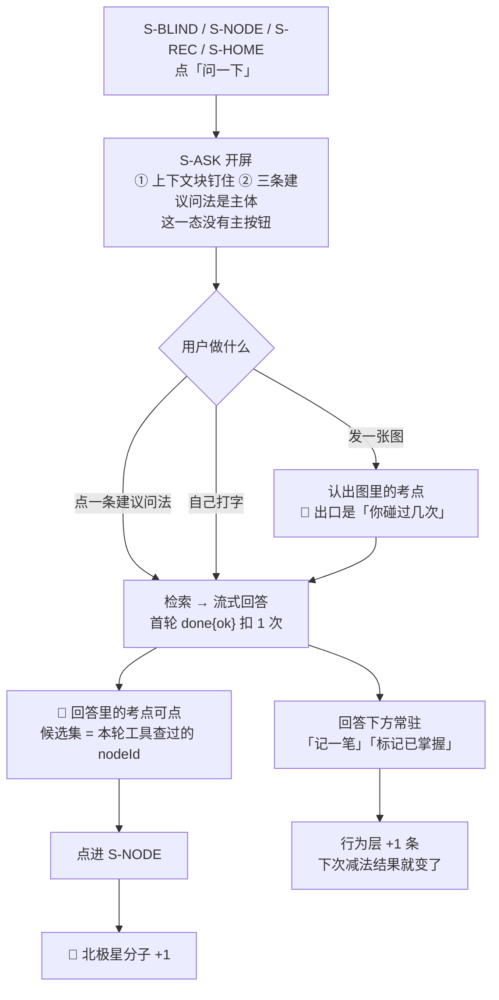

> **屏号 `S-ASK`。** 这一屏的唯一存在理由：**让「看完盲区清单」有下一步。**
> 在它之前，用户看完清单只能把清单递出去（导出 / 复制给 AI / 代发提问）——
> 看一次没有后续，就不会有第二次。

# 问一下 · 逐屏规格

| | |
|---|---|
| **屏号** | `S-ASK` |
| **登录要求** | **需要**（口径 1：登录是记录的前置） |
| **骨架要求** | **需要**（回答里的考点锚点要能指回 `S-NODE`） |
| **网络要求** | **需要**（流式回答走服务端） |
| **线框与交互规格** | `modules/M3-盲区与覆盖度/U3.7-问一下.md` —— **不在本文重画** |
| **接口契约** | `technical/接口契约-签名与错误码全集.md` §十二 —— **不在本文重抄** |
| **本文的唯一真源职责** | 🔴 **这一屏的用户可见文案全集** + 流程定义（服务于哪个关卡、可观测信号） |

---

## 一、它在减法的哪一端

**在出口端，而且是出口端唯一一条能走回入口的路。**

`看盲区.md` §1.2 说 `S-BLIND` / `S-NODE` 是「差值第一次变成用户能看见的东西」。
那两屏的出口全部朝外（导出、复制、代发）。**这一屏的出口朝内**：

| 回答里的这一格 | 走回减法的哪一端 |
|---|---|
| 正文里可点的考点 → `S-NODE` | 🌟 **回到「把差集端出来」那一端**，直接生产北极星的分子 |
| 回答下方「记一笔」→ `POST /records` | **回到「记录用户碰过什么」那一端**，下一次差集就变了 |
| 回答下方「标记已掌握」→ `POST /assertions` | 同上 |

🔴 **一个只会吐文字的对话框对北极星零贡献。** 这一屏的每一处设计，都要能说出它落在上面哪一行。

### 1.1 服务于哪个关卡

| | 关卡 | 出处 |
|---|---|---|
| 🌟 **主** | 「看到缺口清单后点进去的比例 **>30%**」 | `实施路径` §关卡 |
| 次 | 阶段 1「差集结果符合你的自我认知」 | `实施路径` §阶段 1 |

### 1.2 可观测信号

| 信号 | 怎么测 | 今天有没有 |
|---|---|---|
| 🌟 从 `S-ASK` 的回答点进 `S-NODE` 的次数 | 埋点 `POST /events/blindspot-opened` 的 `from=S-ASK`，与 `from=S-BLIND` **分得开** | ✅ 契约 §12.4.2 |
| 次：对话里发起的记录真的改变了差集 | 🔴 **不是比值，是那一条**：对话里点了「记一笔」→ 行为层多一条 → 下一次 `/coverage/blindspots` 少一个。**查库就能看见，不需要埋点** | ✅ 阶段 1 用这个形态 |

🔴 **阶段 1 不为「次」信号造埋点，理由要写下来**：埋点唯一买的是**归因**（这条记录是不是从对话里来的）。
而阶段 1 的验收形态是自用两周，**用的人就是观察的人，归因由他自己承担**。
**解锁条件**：第一次出现「我需要知道这条记录是不是从对话里来的，而我不是那个用的人」。
到那时它是 `/events/` 下与 `blindspot-opened` **并列的新事件名**，不是往旧端点里塞第二种事件（契约 §12.5.1）。

---

## 二、用户可见文案全集 🔴

**本节是这些句子的唯一真源。** 服务端的模板全集、界面上的槽位，都以本节为准。
🔴 **模板 id 是契约的一部分，正文是产品的一部分** —— 契约 §12.3 只持有 `id` 与结构，正文回指本节。

⚠️ **闭集模板 + 服务端填数，不过模型**（契约 §12.3.1）。
新增一条是一次产品改动（改本节）+ 一次代码改动（改服务端模板表），**不是一次配置改动**。

### 2.1 上下文摘要 `contextSummary`

一行，出现在上下文块与 `meta` 帧里。`{}` 是服务端填的槽位。

| 入口 | 模板 id | 原文 |
|---|---|---|
| `S-BLIND` | `ctx.blind` | 带着你的 {n} 个盲区 |
| `S-NODE` | `ctx.node` | 带着「{name}」这一个考点 |
| `S-REC` | `ctx.rec` | 带着你刚记的那一条 |
| `S-HOME` | `ctx.home` | 带着你的整体情况 |
| 空态 | `ctx.empty` | 你还没有记录，先看看这里能回答什么 |

### 2.2 三条建议问法

每个入口三条，**开屏出现一次**（§2.2.1 说明为什么只有这一次）。

**从 `S-BLIND` 进来**

| 模板 id | 原文 |
|---|---|
| `blind.top_freq` | 这些里哪几个近几年考得最多？ |
| `blind.by_chapter` | 按章节分，我哪一块空得最厉害？ |
| `blind.recent_fill` | 我最近两周记的，补上了其中几个？ |

**从 `S-NODE` 进来**

| 模板 id | 原文 |
|---|---|
| `node.my_touch` | 我碰过这个考点几次？最近一次是什么时候？ |
| `node.freq` | 它近几年出现得多吗？ |
| `node.siblings` | 同一章里我还有哪些没碰过？ |

**从 `S-REC` 进来**

| 模板 id | 原文 |
|---|---|
| `rec.matched` | 我刚记的这条挂上了哪些考点？ |
| `rec.still_blank` | 这一条之后，同一章还剩哪些没碰过？ |
| `rec.count_now` | 这几个考点我现在各碰过几次？ |

**从 `S-HOME` 进来**

| 模板 id | 原文 |
|---|---|
| `home.overview` | 我现在碰过多少、还剩多少没碰过？ |
| `home.gap_chapter` | 哪一章是我空得最多的？ |
| `home.recent` | 我最近两周记的都落在哪些地方？ |

**空态**（从 `S-HOME` 进来而这个账号还没有任何记录）

| 模板 id | 原文 |
|---|---|
| `empty.what_here` | 这里能回答我什么？ |
| `empty.syllabus_size` | 考点全集里一共有多少个考点？ |
| `empty.how_start` | 我要怎么记下第一条？ |

🔴 **空态返回的是这一组模板，不是空数组**（契约 §12.3.2）——
空数组会让开屏退化成一个空白输入框，而那正是这一屏要防的东西。

⚠️ **十五条全部落在「有没有 / 几次 / 多久前」里**，一条都没有越到「对不对」那一侧。
这不是巧合，是这一屏的引导之所以能当第一道防线的原因：
🔴 **用引导把问题带到产品答得好的地方，比用拒绝话术挡住答不了的地方要好。**

#### 2.2.1 为什么只在开屏出现一次

**每一段回答之后不再出现建议问法。** 回答下方已经有两条回产品的路（记一笔 / 标记已掌握），
正文里还有可点的考点 —— 再摆三条「接着问」的路，是在跟自己的北极星抢用户。

**开屏那一次要解决的问题是「别对着空框发呆」，而那个问题只在开屏存在。**
回答之后用户不缺话题，缺的是一条走回产品的路，那条路已经在了。

### 2.3 额度

| 位置 | 原文 |
|---|---|
| 开屏，说一次 | 这一段会用掉 1 次 · 本月还有 {k} 次 |
| 一段满 20 轮 | 这一段已经聊得够长了，开一段新的吧 |
| 上一句旁边的按钮 | 开一段新的 |

🔴 **会话内一处余量都不显示。** `done.remaining` 在一段会话内是恒定的，**拿得到不等于该显示**；
逐轮递减会把多轮对话变成让人数着说话。
🔴 **20 轮不预警**（不在第 18 轮提醒），到顶是一句陈述加一个动作。

⚠️ **`5` 与 `20` 都是没有数据支撑的占位。** 定死它们需要「一次会话平均几轮」，
而那个数要真有人用两周才有 —— 见 §四 `Q-3`。

### 2.4 发图那一句留存声明 🔴

**不可关闭、不可「不再提示」，出现在点开发图之后、选图之前：**

> 这张图不会留在任何地方，包括这台设备。它只用来认出图里的考点。

**为什么这一句必须有**：用户在同一个 App 里刚学会「拍了的图会留在本机、到期归档、可以立刻删」（`设置与原图.md`）。
这一格沉默，他就会按那个心智以为这张也留了 ——
🔴 **一个用户以为存在、而产品并不打算兑现的承诺，比没有承诺更糟。**

⚠️ **原图三处承诺在这一屏一处都不出现，而这不是弱化**：没有留存就没有到期，没有到期就没有倒计时。
三处本体在 `设置与原图.md`，本文不重画也不弱化。

### 2.5 备考档案收集那一次

**收集时点：第一次进 `S-ASK` 时，收一次。**（裁定见 §三·裁定 2）

| 位置 | 原文 |
|---|---|
| 标题 | 你要考的是哪一场？ |
| 说明 | 填了它，问一下的时候会知道你考的是哪一场。不填也能用。 |
| 字段一 | 考试 |
| 字段二 | 考试日期 |
| 跳过 | 以后再说 |

🔴 **只显示日期本身，不显示任何由它算出来的天数。** 契约不返回天数是第一道闸，
**界面不自己算天数是第二道**（契约 §12.9.2）。少任何一道都拦不住「还有 {n} 天，你有 {m} 个盲区」这句话。

🔴 **跳过之后不再自动出现**，只能在 `S-SET` 改（`设置与原图.md` 账号组第二行）。
不留小红点、不反复弹、不在别处催。

---

## 三、流程定义

### 3.1 每一步的前后端职责

| 步 | 前端行为意图 | 后端契约意图 |
|---|---|---|
| 入口 | 四个入口各带上下文进，**没有空手进来的通道** | `context` **只传锚点不传数据本身**；只在首轮传、服务端绑会话；中途改 → `409` |
| 开屏 | 上下文块钉在最上面不随滚动消失；三条建议问法是主体 | `GET /agent/suggestions`，闭集模板填数、**不过模型**；空态返模板不返空数组 |
| 提问 | 多轮、流式；上一轮不用用户重述 | 上下文由服务端持有，**前端不回传整段历史** |
| 发图 | 选图前先出 §2.4 那一句 | 字节只活到发给模型为止：不落盘、不进相册、不打日志 |
| 回答 | 按字符偏移量渲染可点区域，**一个字都不做名字匹配** | `node-ref` 帧；🔴 候选集 = 本轮工具调用实际返回过的 `nodeId` |
| 回答下方 | 两个动作常驻 | 复用已有写入路径，**不加来源字段、不加 `sessionId`** |
| 越界 | **不给拒绝做任何样式** —— 前端拿不到那个信号，也不该拿 | 不发 `refused` 帧；拒答产出的就是一段正常正文 |

### 3.2 三条产品裁定

| # | 裁定 | 理由 |
|---|---|---|
| 1 | **`S-ASK` 不开新域，落在 `M3` 盲区与覆盖度** | 把它放进「盲区与覆盖度」，等于在文档骨架上说死**它是盲区清单的下一步，不是一条独立的 AI 产品线**。单开一个域恰好是骨架层的 AI 味 |
| 2 | **备考档案收集挪出首启，改到第一次进 `S-ASK`** | 见下 |
| 3 | **建议问法只在开屏出现一次** | §2.2.1 |

**裁定 2 的完整理由**（它推翻了本议题 2026-09-03 早些时候的一次产品裁定）：

| 事实 | 推论 |
|---|---|
| 备考档案**不抬北极星**，它只服务 `S-ASK` 的上下文 | 它没有资格占用北极星唯一依赖的那条路上的一次点击 |
| 首启时这个账号零记录、零盲区 | **它在首启那一刻无事可服务** |
| `首次使用与权限申请` §1.2 承诺「登录之后 2 次点击、0 个系统弹窗落下第一条记录」 | 放在首启把 2 变成 3 —— 🔴 **而那两个数不改，正是这条裁定的检验**：要改它们，就说明在拿北极星换一个今天没用的字段 |

⚠️ **这是对用户 2026-09-03「可以进来就收集点用户信息」的一次收窄读法**：
那句话的目的是让 agent 知道你考哪一场，**第一次进 `S-ASK` 正是它第一次被需要的时刻**。
🔴 **一句话可推翻** —— 用户说「就要放首启」，那就放首启，并把 §1.2 那两个数改成 3。

---

## 四、缺口登记

| # | 缺口 | 为什么卡住 | 该谁定 |
|---|---|---|---|
| `Q-1` | **五个 `/agent/**` 端点服务端不校验令牌**，会话读删不校验归属 | 与口径 1「不登录不能记」直接冲突。**界面这一侧无能为力**：前端已经在发 `Bearer`，服务端不读 | 已升级给人，技术侧修 |
| `Q-2` | **`S-ASK` 的多端矩阵在 `无障碍与多端适配.md` 里没有行** | 该文的「十三屏 × 四端」全表与逐屏焦点顺序需要新增一屏，属于用户 2026-09-02 明确搁置的加厚范围 | 产品，**解除搁置之后** |
| `Q-3` | **免费 5 次 / 一段 20 轮，两个数没有数据支撑** | 缺的是「一次会话平均几轮」，那个数要真有人用两周才有 | 产品，等阶段 1 的真实使用 |
| `Q-4` | **`S-ASK` 没有跨屏验收用例** | `端到端验收用例集.md` §5.1 的覆盖表按十三屏写，这一屏还没有任何一条用例 | 产品，与 `Q-2` 同一次解除搁置时一起补 |

---

## 五、红线自查

| 检查 | 结果 |
|---|---|
| 十五条建议问法一条都不问「对不对」 | ✅ §2.2 逐条落在「有没有 / 几次 / 多久前」 |
| 禁用词表整表适用，本文零命中 | ✅ 判据见 `INDEX.md` §七第一行那条命令 |
| 没有任何字段能装题干 | ✅ 输入是自由文本上限 2000 字，**它不是一个存储位**：不落库、不进导出 |
| 自动打标不生成文本 | ✅ 回答里的考点锚点**候选集 = 本轮工具查过的 `nodeId`**，模型没查过的永不产生可点区域 |
| 原图不出本机 | ✅ §2.4：这一屏的图**哪儿都不去**，字节只活到发给模型为止 |
| 排序口径一格不动 | ✅ 界面清单的排序仍只有四个可解释口径；agent 可以按客观计数说明先后，**那不是界面排序** |

---

## 六、真源与指针

| 这一格 | 真源在哪 |
|---|---|
| 这一屏的用户可见文案 | 🔴 **本文 §二** |
| 线框、元素清单、四种态、交互规格 | `modules/M3-盲区与覆盖度/U3.7-问一下.md` |
| 备考档案那两个字段在 `S-SET` 上的形态 | `设置与原图.md` |
| 接口签名、帧、错误码、额度机制 | `technical/接口契约-签名与错误码全集.md` §十二 |
| 屏 × 端的能力矩阵 | `modules/M6-端与形态/U6.2-屏与端的能力矩阵.md`（🔴 小程序端**不提供**） |
| 原图三处留存承诺本体 | `设置与原图.md` |
