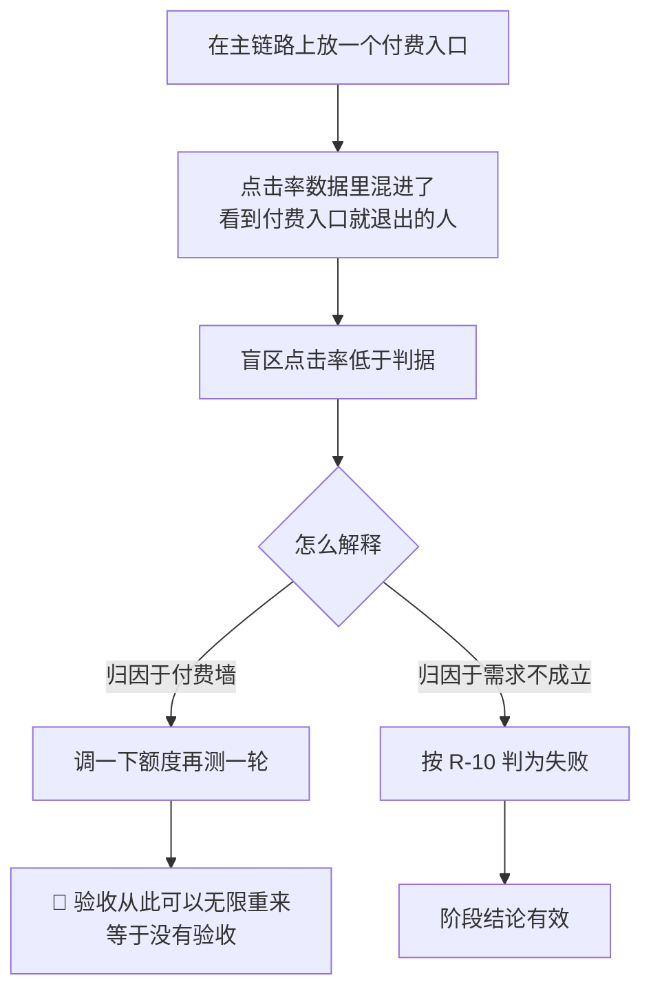
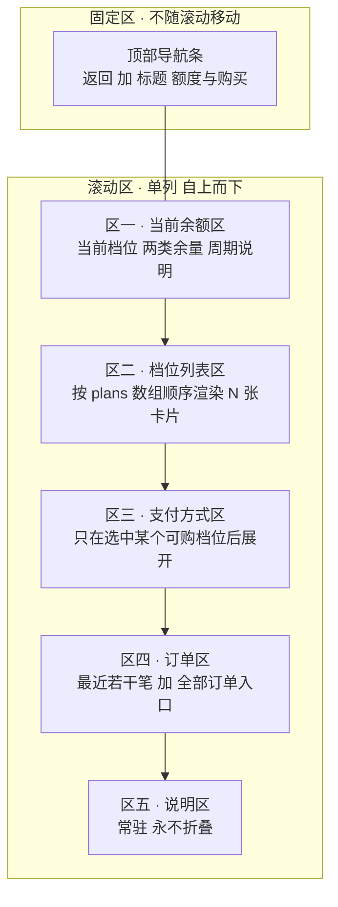
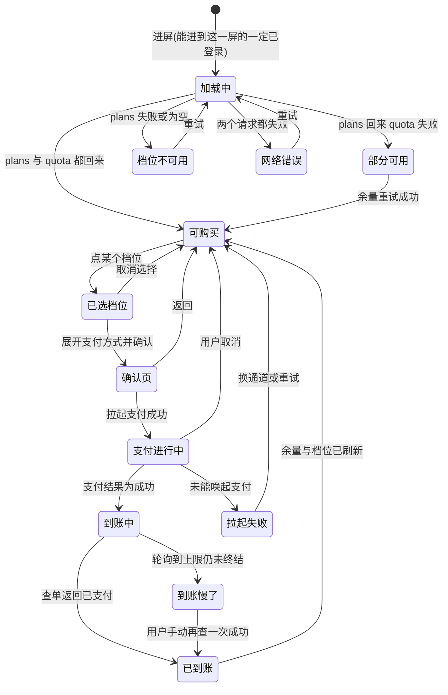
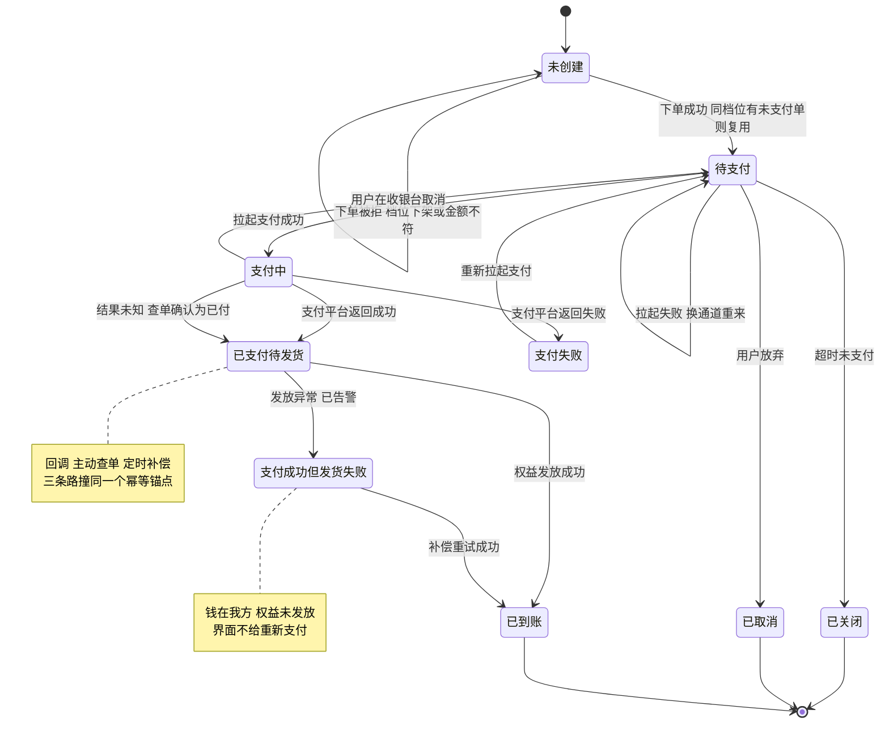
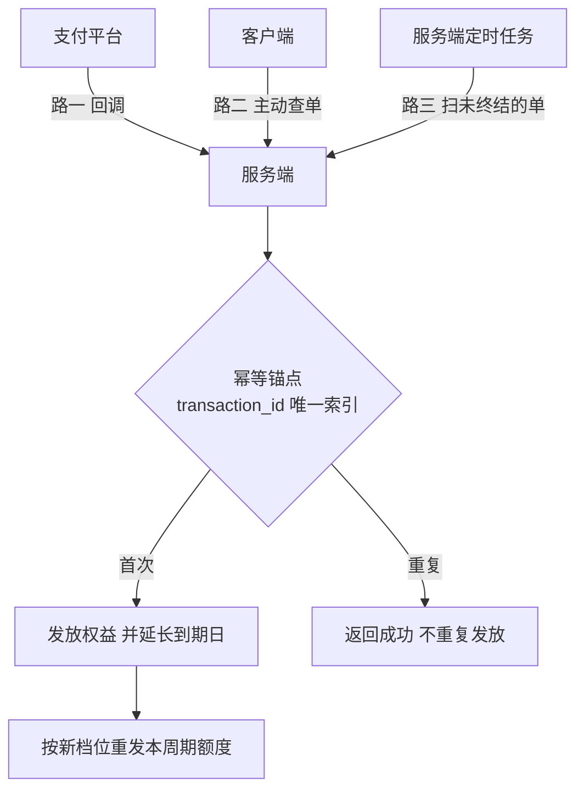
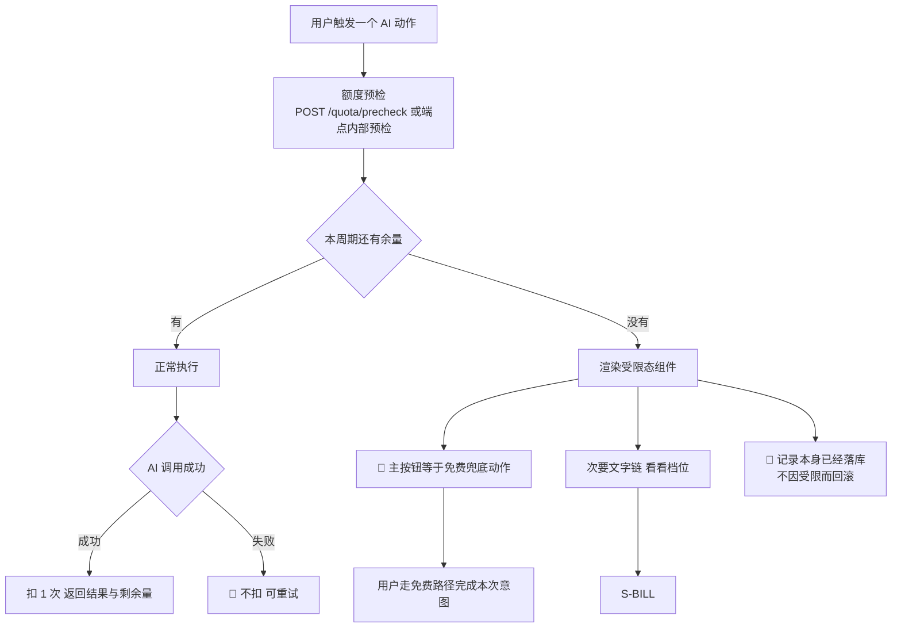

[← 用户侧功能规格](INDEX.md) ｜ [模块 G · 商业化](../modules/模块G-商业化.md)

# 额度与购买 · 逐屏规格

> **这份文档回答:用户什么时候撞到额度、撞到之后屏幕上是什么、怎么付钱。**
> 覆盖 `S-BILL`,以及嵌在各屏的额度受限态。**额度与购买是完整 App 的一部分,不带阶段前提**;
> 支付通道能不能上线只受备案与资质这一个外部前提管(`Q-3`),那是合规,不是功能分期。
>
> **受众:UI 设计 · 前端 · 后端**,与 [`用户侧功能规格 · 总纲与全局约定`](INDEX.md) §零 的三类读者一致;写到可以直接动手为止,**篇幅上限 1400 行**。
>
> **不是**定价与额度数字(在 [`商业化与额度设计`](../商业化与额度设计.md) §一,**本文一个数字都不写死**)、
> **不是**支付接口(在 [`技术架构与接口契约`](../../technical/INDEX.md) §6.6/§6.7)。
>
> **基线:`origin/v1` @ `15accea`,fetch 于 2026-09-01T15:05Z。** **状态:活跃 · 冻结待触发。**

---

## 导读

**章节编号只增不删,新增内容一律接在既有编号之后。** 按主题找:

| 你要找 | 去哪一节 |
|---|---|
| 为什么额度不能挡主链路 | §一 |
| 额度在哪几屏出现、哪几屏绝对不出现 | §二 |
| `S-BILL` 长什么样、有哪些元素、每个元素取值从哪来 | §三 |
| 出错时屏幕上写什么字 | §四(`P-01`–`P-56`) |
| 没人裁定过的事 | §五(`Q-1`–`Q-16`) |
| 红线检查结论 | §六 · §二十二 |
| 订单从下单到到账经过哪些态 | §七 |
| **撞到额度时每一处界面长什么样** | §八 —— 本文最核心的一节 |
| 额度怎么算、怎么显示、什么时候刷新 | §九 |
| 支付一步一步怎么走、每一步偏离了怎么办 | §十 |
| iOS 内购为什么是特殊的 | §十一 |
| 发票、订单历史、自动续费管理 | §十二 |
| 边界值与输入约束 | §十三 |
| 离线与弱网 | §十四 |
| 各端差异 | §十五 |
| 性能与体感预算 | §十六 |
| 无障碍 | §十七 |
| 接口对照 | §十八 |
| 合规与资质依赖 | §十九 |
| 埋点 | §二十 |
| 验收用例 | §二十一(`A-01`–`A-46`) |

---

## 一、🔴 一条不能碰的红线:额度不许污染阶段验收

`R-37` 说的是:一旦「盲区点击率低」可以被解释成「付费墙拦住了」,**这个验收就再也不会失败**,而一次永远不会失败的验收等于没有验收。

对界面的直接后果:

| 规则 | 说明 |
|---|---|
| **免费用户能完整走通「记录 → 看盲区 → 导出」** | 付费墙**不许**出现在这条主链路的任何一步 |
| 额度只管**AI 能力** | 语音转写、图片识别、AI 代发 —— 只有这三类 |
| 撞到额度时,主入口永远是**免费兜底路径** | 手动记录、手动挂载、复制给 AI |
| 付费入口是次要位置 | 不弹窗、不全屏、不倒计时、不做「限时」 |

### 1.1 污染是怎么发生的:一条只有三步的链



**关键的一步是 `D`。** 只要那个分叉存在,人就会走左边 —— 这不是纪律问题,是结构问题。
**所以要断的是 `A`,不是 `D`。** 主链路上没有付费入口,`D` 就不存在。

### 1.2 三条不许被绕过的推论

| # | 推论 | 常见的绕法(全部禁止) |
|---|---|---|
| 1 | 主链路上**不出现付费入口**,包括入口的任何变体 | 角标、小红点、「升级可用」灰字、盲区列表底部的「解锁更多」卡片 |
| 2 | 受限态里**付费入口的视觉权重必须低于免费兜底** | 把「看看档位」做成主按钮;把免费兜底做成灰色次要按钮;把两个做成同等权重的并排双按钮 |
| 3 | 额度信息**不进入主链路三屏**,连只读展示都不行 | 首页顶栏挂「本月还剩 {n} 次」;盲区页顶部挂余额条;时间线卡片上标「AI」小标 |

⚠️ **推论 3 最容易被当成「只是展示一下,又没挡住」放过去。** 展示本身就改变行为:
用户看到余量在掉就会开始省着用,而「省着用」会压低 `record_created` 与 `blindspot_opened` 两个数 —— 那正是阶段判据的两个输入。

### 1.3 这一条与「记录动作永不失败」是同一条

🔴 额度耗尽时,**记录照样落下来**,失败的只有识别与转写(`技术架构与接口契约` §6.7.2 第 4 条)。
界面上的形态是:记录卡片已经在时间线里了,只是没有考点标签,旁边一个「手动挂考点」。
**用户永远不会因为没付钱而丢掉一条记录。**

---

## 二、额度在界面上出现的三个地方

| 位置 | 形态 | 内容 |
|---|---|---|
| 触发点(记录卡片 / `S-EXP`) | 受限态 | 「这个月的 AI 次数用完了」+ 免费兜底(主) + 「看看档位」(次) |
| `S-SET` | 一行 | 「AI 次数:本月还剩 {n} 次」→ 点进 `S-BILL` |
| `S-BILL` | 整屏 | 见 §三 |

**不出现的地方**:首页、盲区、时间线。**这三屏一个字都不提额度** —— 它们是主链路。

### 2.1 三个位置的强度不一样,不能互相拷贝

| 位置 | 强度 | 什么时候出现 | 什么时候不出现 |
|---|---|---|---|
| 触发点受限态 | **被动** | 只在用户已经点了某个 AI 动作、且额度不足时 | 额度充足时一个字都不显示;**不做「还剩 3 次」这种预警** |
| `S-SET` 那一行 | **常驻只读** | 已登录后常驻 | 没有不出现的情况 —— 进得到 `S-SET` 的一定已登录 |
| `S-BILL` | **主动进入** | 用户从 `S-SET` 或受限态次要入口点进来 | 没有任何自动跳转到 `S-BILL` 的路径 |

🔴 **没有第四个位置。** 新增任何一处额度展示,先回答它服务哪一个关卡 —— 答不上来就是不该做。

### 2.2 「不做预警」是刻意的

「还剩 3 次」「快用完了」是**倒计时的变体**,而倒计时是 §一 明令禁止的促销心理机制。
额度只有两种状态在界面上有意义:**够用(什么都不显示)** 与 **不够用(受限态)**。
中间那段「快不够了」的焦虑是为了推动购买而制造的,产品不制造它。

---

## 三、`S-BILL` 额度与购买

### 3.1 元素清单

| 区 | 元素 | 取值来源 | 为空时 |
|---|---|---|---|
| 一 | 当前档位 | `GET /billing/subscription` | 拉不到时不显示、**不猜**;登录态过期见 `P-49` |
| 一 | 本月额度:`{used}/{granted}`,两类分开(记录识别 / 问 AI) | `GET /quota` | 显示 0 |
| 一 | 周期说明 | 「每月 1 号重置」 | —— |
| 二 | **档位列表** | `GET /billing/plans` —— 🔴 **档位、价格、额度全部由服务端返回,前端不硬编码** | 拉取失败时见 `P-02` |
| 二 | 每档:名称 · 价格 · 包含的两类次数 · 「选这个」 | 同上 | —— |
| 三 | 支付方式 | 端支持的通道 | —— |
| 四 | 订单记录入口 | `GET /billing/orders` | 「还没有订单」 |
| 五 | 说明区 | 「导出永远免费、不限次数」「不自动续费」 | 常驻 |

🔴 **`autoRenew` 恒为 false,不是一个可变字段**(`技术架构与接口契约` §6.6)。
界面上**不出现**「自动续费」开关、不出现「连续包月更便宜」。

### 3.2 购买流程

```mermaid
flowchart TD
    A[点某个档位] --> B{登录态还在?}
    B -- 否 · 过期 --> L[S-LOGIN → 回来并保持所选档位]
    B -- 是 --> C[确认页:档位 · 价格 · 包含次数 · 协议]
    C --> D[POST /billing/orders<br/>body 只有 planCode + channel]
    D --> E[调起支付]
    E --> F{结果}
    F -- 成功 --> G[客户端主动查一次<br/>GET /billing/orders/&#123;outTradeNo&#125;]
    F -- 取消 --> H[回 S-BILL,不报错]
    F -- 失败 --> I[错误态 + 重试]
    G --> J[额度立刻刷新 + Toast「已到账」]
```



| 规则 | 说明 |
|---|---|
| 下单请求**不带金额** | 金额由服务端按 `plans` 定(`技术架构与接口契约` §6.6) |
| 支付后**必须主动查一次** | 回调可能延迟或丢失,不能只等回调 |
| 查询未到账 | 显示「支付成功,正在到账」+ 每 2 秒轮询,最多 30 秒;超时见 `P-06` |
| 协议 | 必选,未勾不可支付 |

### 3.3 受限态的标准长相(所有触发点复用同一个组件)

```
这个月的 AI 次数用完了(还剩 0 次)

[ 手动挂考点 ]        ← 主按钮,免费路径
  看看档位            ← 次要文字链
```

⚠️ **主次不能反。** 把「看看档位」做成主按钮,就等于在主链路上立了付费墙,`R-37` 当场成立。

### 3.4 屏幕结构:五个区、固定区与滚动区

`S-BILL` 是**一屏到底的单列滚动页**,没有横向 Tab、没有分步向导、没有底部悬浮购买条。



| 规则 | 说明 |
|---|---|
| **没有底部悬浮购买条** | 悬浮条会把购买动作提升成全屏级别的主动作,与「付费入口是次要位置」冲突 |
| **区三默认收起** | 未选中档位时不渲染支付方式,避免「还没决定买什么就先看到怎么付钱」 |
| **区五永不折叠** | 「导出永远免费」「不自动续费」两句是承诺,不是可折叠的补充说明 |
| **返回键任何时候可用** | 与 `用户侧功能规格 · 总纲与全局约定` §2.4 一致;进入确认页后返回退回 `S-BILL`,不弹「确定放弃购买吗」 |
| 滚动位置 | 从受限态次要入口进入时,**滚动位置停在区二顶部**,不停在区一 —— 用户是带着「看看档位」的意图来的 |

### 3.5 从不同入口进来时的预选档位

**「预选」只影响滚动位置与卡片的视觉焦点,不代表已选中,更不触发下单。**

| 入口 | 预选 | 滚动落点 | 理由 |
|---|---|---|---|
| `S-SET` 的额度行 | **不预选** | 区一顶部 | 用户是来看余量的,不是来买的 |
| 触发点受限态的「看看档位」 | **不预选** | 区二顶部 | 预选一个档位等于替用户做了决定 |
| `S-BILL` 内部返回(从确认页退回) | **保持上次选中的档位** | 回到该卡片位置 | 退回不等于放弃 |
| 登录态过期后重登回跳(`P-49`) | **保持重登前所选档位** | 回到该卡片 | 见 `P-14`;丢了就是让用户重选一遍 |
| 订单历史里点某笔未支付订单 | **预选该订单对应的档位** | 区二该卡片 | 这一次用户的意图是明确的 |
| 深链或外部唤起 | **不预选** | 区一顶部 | 深链带 `planCode` 也不预选,防止被当成推广落地页 |

🔴 **任何入口都不允许「进来就弹确认页」。** `S-BILL` 的第一屏永远是信息,不是决策。

### 3.6 元素清单 · 档位卡片区

| 元素 | 取值来源 | 为空时 | 可点吗 | 禁用条件 | 无障碍朗读文本 |
|---|---|---|---|---|---|
| 卡片容器 | `plans[]` 数组逐项 | 数组为空 → 见 `P-15` | 是 | 该项 `purchasable=false` 时整卡不可点 | 「档位,{名称},{价格朗读句},{额度朗读句}」 |
| 档位名称 | `plans[i].name` | 缺失 → 整卡不渲染 | 否 | —— | 随卡片一起读 |
| 价格 | `plans[i].priceFen`,由前端格式化 | 缺失 → 整卡不渲染 | 否 | —— | 见 §十七 金额朗读规则 |
| 计费周期 | `plans[i]` 的周期字段 🚧 待技术定稿 | 缺失 → 不显示周期,只显示价格 | 否 | —— | 「每{周期}」 |
| 两类额度换算行 | `plans[i].quota.ai_capture` 与 `.ai_ask`,由前端换算成日均用量 | 任一缺失 → 该行不显示 | 否 | —— | 「包含{类别}{次数}次,折合每天约{n}次」 |
| 「选这个」按钮 | —— | —— | 是 | ① `purchasable=false` ② 该端无可用支付通道 ③ 同档位已有「支付中」订单 | 「选这个,进入确认」 |
| 「当前档位」标记 | `GET /billing/subscription` 的 `planCode` 与本卡 `code` 相同 | 订阅拉取失败 → 不标记,**不猜** | 否 | —— | 「这是你当前的档位」 |
| 推荐标记 | 🚧 待技术定稿 · 服务端字段 | 无字段 → 不显示 | 否 | —— | 「推荐」**必须朗读得出来** |

🔴 **推荐标记不能只靠颜色。** 见 §十七:颜色不作为唯一信息载体,推荐档位必须同时有文字标记。
🔴 **价格与额度一个都不在前端硬编码**,包括「兜底默认值」「本地缓存的上次价格」—— 拉不到就不显示卡片(`P-02`)。

### 3.7 元素清单 · 当前余额区

| 元素 | 取值来源 | 为空时 | 可点吗 | 禁用条件 | 无障碍朗读文本 |
|---|---|---|---|---|---|
| 当前档位名 | `GET /billing/subscription` | 拉取失败 → 不显示、**不猜**;登录态过期 → `P-49` | 否 | —— | 「当前档位,{名称}」 |
| 到期时间 | 同上的 `expiresAt` | 免费档无到期 → 整行不渲染 | 否 | —— | 「{日期}到期,到期就停,不会自动扣费」 |
| 记录识别余量 | `GET /quota` 的 `ai_capture` | 见 §9.5 三种文案 | 否 | —— | 「记录识别,本月还剩{n}次,共{granted}次」 |
| 问 AI 余量 | `GET /quota` 的 `ai_ask` | 见 §9.5 | 否 | —— | 「问 AI,本月还剩{n}次,共{granted}次」 |
| 周期说明 | 固定文案 + `GET /quota` 的 `periodYm` | `periodYm` 缺失 → 只显示固定文案 | 否 | —— | 「每月 1 号重置,当前是{periodYm}」 |
| 「刷新」 | —— | —— | 是 | 距上次刷新不足 3 秒时禁用 | 「刷新余量」 |
| 「这是刚才的数据」小字 | 仅在 `P-09` 状态下出现 | —— | 否 | —— | 「余量没能刷新,显示的是上一次的数据」 |

⚠️ **余量用「还剩 {n} 次」,不用进度条、不用百分比、不用环形图。** 进度条会把余量变成一个可以「看着它变少」的对象,那是 §2.2 拒绝的东西。

### 3.8 元素清单 · 订单区

| 元素 | 取值来源 | 为空时 | 可点吗 | 禁用条件 | 无障碍朗读文本 |
|---|---|---|---|---|---|
| 区标题 | 固定文案「订单」 | —— | 否 | —— | 「订单」 |
| 订单行 · 商品名 | `GET /billing/orders` 的 `productName` | 缺失 → 整行不渲染 | 是(进详情) | —— | 「订单,{商品名}」 |
| 订单行 · 金额 | `amountFen`,由前端格式化 | 缺失 → 整行不渲染 | 否 | —— | 见 §十七 |
| 订单行 · 状态 | 后端状态映射到 §7.2 的界面态 | 未知状态 → 显示「处理中」并按「确认中」处置 | 否 | —— | 「状态,{界面态文案}」 |
| 订单行 · 时间 | `createdAt` | 缺失 → 显示「时间未知」 | 否 | —— | 「{相对时间}」 |
| 「再查一次」 | —— | 仅「确认中」类订单显示 | 是 | 距上次查询不足 2 秒时禁用 | 「再查一次这笔订单」 |
| 「先去看盲区」 | —— | 仅「确认中」类订单显示 | 是 | —— | 「先去看盲区」 |
| 「继续支付」 | —— | 仅「待支付」订单显示 | 是 | 订单已超时关闭时禁用 | 「继续支付这笔订单」 |
| 「全部订单」入口 | —— | 订单为空时不渲染 | 是 | —— | 「查看全部订单」 |
| 空态文案 | 固定 | 「还没有订单」 | 否 | —— | 「还没有订单」 |

🔴 **「确认中」的订单永远不给「重新支付」按钮**(`模块 G · 商业化` §2.4)。
给了这个按钮,用户会在已经扣款的情况下再付一次 —— **那是产品主动诱导重复付款。**

### 3.9 元素清单 · 自动续费区

**本期这个区只有文字,没有任何控件。**

| 元素 | 取值来源 | 为空时 | 可点吗 | 禁用条件 | 无障碍朗读文本 |
|---|---|---|---|---|---|
| 「不自动扣费,到期就停」 | 固定文案 | 常驻 | 否 | —— | 「不自动扣费,到期就停」 |
| 「导出永远免费、不限次数」 | 固定文案 | 常驻 | 否 | —— | 「导出永远免费,不限次数」 |
| 「盲区和骨架树不收费」 | 固定文案 | 常驻 | 否 | —— | 「盲区和骨架树不收费」 |
| 自动续费开关 | **不存在** | —— | —— | —— | —— |
| 「退订」入口 | **不存在**(没有可退订的东西) | —— | —— | —— | —— |

🔴 **`autoRenew` 恒为 `false`,不是一个可变字段。** 界面上不出现开关、不出现默认勾选、不出现「连续包月更便宜」。
**如果将来开了自动续费**(条件见 `商业化与额度设计` §6.3),这一区必须同时出现:显式未勾选的勾选框 + 与它同屏、同层级的退订入口。**先有退订入口,再有勾选框** —— 顺序不能反。

### 3.10 `S-BILL` 的屏幕状态枚举



| 态 | 屏幕上是什么 | 不允许 |
|---|---|---|
| 加载中 | 区一、区二各自骨架占位 | 不允许整屏转圈遮罩 |
| 可购买 | 完整五个区 | —— |
| 部分可用 | 区二正常,区一显示上次余量 + 「这是刚才的数据」 | 不允许因为余量拉不到就禁用购买 |
| 档位不可用 | 区二整块错误态 + 重试 | 🔴 **不允许显示任何本地兜底价格** |
| 网络错误 | 整屏错误态 + 重试 | 不允许出现错误码原文或英文 |
| 已选档位 | 该卡片高亮 + 区三展开 | 不允许自动进确认页 |
| 确认页 | 档位 · 价格 · 包含次数 · 协议勾选 · 支付按钮 | 不允许默认勾选协议 |
| 支付进行中 | 本屏置为不可交互的等待态,顶部一行「正在支付」 | 不允许倒计时 |
| 到账中 | 「支付成功,正在到账」+ 轮询 | 不允许显示剩余秒数 |
| 到账慢了 | `P-06` 文案 + 订单入口 + 「先去看盲区」 | **不允许「重新支付」** |
| 已到账 | Toast「已到账」+ 余量与档位刷新 | 不允许弹庆祝浮层 |
| 拉起失败 | 页内提示 + 换通道 | —— |

🔴 **枚举里没有「未登录」这一态。**(2026-09-02 用户裁定:没有本地模式。)
未登录只能停在产品说明与登录门那一屏,**进不到 `S-BILL`**,所以本屏不存在「未登录进来看档位」的形态;
唯一与登录有关的运行时情况是**登录态中途过期**,按 `P-49` 处置(静默续期,失败则提示重登)。

### 3.11 档位卡片自身的状态枚举

| 卡片态 | 触发条件 | 视觉 | 可点 |
|---|---|---|---|
| 可购买 | `purchasable=true` 且该端有可用通道 | 正常 | ✅ |
| 当前档位 | `subscription.planCode` 命中 | 加「当前档位」文字标记 | ✅(可续期) |
| 不可购买 | `purchasable=false` | 常态显示,但没有「选这个」按钮 | ❌ |
| 通道不可用 | 该端所有支付通道均不可用 | 按钮置灰 + 一行说明 | ❌ |
| 已有进行中订单 | 同档位存在「支付中」订单 | 按钮换成「继续上一笔」 | ✅ |

---

## 四、异常全集

**列的口径:`#` / 触发条件 / 界面表现 / 上屏原文文案 / 用户下一步 / 后端行为 / 钱与数据的最终状态。**
文案列里的字**就是屏幕上的字**,不允许实现时改写;`{}` 是变量占位。

| # | 触发条件 | 界面表现 | 上屏原文文案 | 用户下一步 | 后端行为 | 钱 / 数据的最终状态 |
|---|---|---|---|---|---|---|
| `P-01` | ~~未登录进 `S-BILL`~~ | **已裁定 · 作废**(2026-09-02:没有本地模式,进得到 `S-BILL` 的一定已登录;登录态中途过期见 `P-49`) | —— | —— | —— | —— |
| `P-02` | `plans` 拉取失败 | 区二错误态 | 「档位没拉到」 | 重试;**不显示任何硬编码价格** | 无 | 无订单、无扣款 |
| `P-03` | 支付被用户取消 | 静默回 `S-BILL` | 无 | —— | 订单留在「待支付」 | 未扣款,订单可续付或超时关闭 |
| `P-04` | 支付渠道不可用 | 页内提示 | 「这个支付方式暂时用不了,换一个」 | 换通道 | 不建单或建单后不拉起 | 未扣款 |
| `P-05` | 支付成功但回调未到 | 轮询中 | 「支付成功,正在到账」 | 等 | 主动查单 + 定时补偿 | 钱已付,权益待发放 |
| `P-06` | 轮询到上限仍未到账 | 提示 + 订单入口 | 「钱已经付了,到账慢了一点。订单在这里,过一会儿再看」 | 看订单 | 定时补偿继续扫 | 钱已付,权益最终会到 |
| `P-07` | 重复通知 | 无感 | —— | —— | **不重复发放**(按 `transaction_id` 幂等) | 只发放一次 |
| `P-08` | 金额被篡改 | 服务端拒绝 | 「这笔订单有问题,没有扣款」 | 重新下单 | 拒绝并告警,不发放 | 未扣款 |
| `P-09` | 额度查询失败 | 显示上次值 + 小字 | 「这是刚才的数据」 | 重试 | 无 | 数据不变 |
| `P-10` | 周期切换瞬间 | 以服务端 `periodYm` 为准 | —— | —— | 服务端按 `period_ym` 判周期 | 数据不变 |
| `P-11` | 退款请求 | 🚧 **界面上没有入口** | —— | 见 §五 `Q-1` | 未定义 | 未定义 |
| `P-12` | 开票 | 🚧 **只占位,不展开** | —— | `执行清单` `L-D` 档 | 端点占位 | 无 |
| `P-13` | ~~未登录点某个档位的「先登录」~~ | **已裁定 · 作废**(2026-09-02:没有本地模式,档位卡片上不存在「先登录」这个按钮态) | —— | —— | —— | —— |
| `P-14` | 登录成功回跳但预选档位丢了 | 回到区二顶部,不预选 | 「回来了,重新挑一个档位」 | 重选 | 无 | 无订单 |
| `P-15` | `plans` 返回空数组 | 区二空态 | 「现在没有可买的档位」 | 只给「回去看盲区」 | 无 | 无订单 |
| `P-16` | `plans` 里没有一项 `purchasable=true` | 区二只展示,无购买按钮 | 「现在没有可买的档位」 | 同上 | 无 | 无订单 |
| `P-17` | `plans` 超时 | 区二骨架转错误态 | 「档位没拉到」 | 重试 | 无 | 无订单 |
| `P-18` | 确认页显示的价格与下单返回的金额不一致 | 阻断,退回区二并刷新 `plans` | 「价格刚刚变了,重新看一下再决定」 | 重看 | **以服务端金额为准,不静默继续** | 未扣款,旧订单作废 |
| `P-19` | 所选 `planCode` 已下架 | 该卡片消失 + 页内提示 | 「这个档位已经没有了」 | 重选 | 下单被拒 | 未扣款 |
| `P-20` | 下单接口超时,不知道单建没建 | 等待态转查询态 | 「刚才那一步没确认上,正在查」 | 等 | **按 `planCode` 复用未支付订单,不新建** | 最多一笔待支付订单 |
| `P-21` | 同档位已有未支付订单 | 直接复用,不新建 | 「上一笔还没付完,接着付」 | 继续支付 | 复用 `outTradeNo` | 不会出现两笔待支付 |
| `P-22` | 支付客户端未安装 | 页内提示 | 「这台设备上没装{通道名},换一个支付方式」 | 换通道 | 订单留「待支付」 | 未扣款 |
| `P-23` | 调起支付无响应或被系统拦截 | 页内提示 | 「没能打开支付,再试一次或者换个支付方式」 | 重试或换通道 | 订单留「待支付」 | 未扣款 |
| `P-24` | 支付过程中切后台,回来时状态未知 | 进「到账中」并主动查单 | 「正在查这笔订单」 | 等 | 查单 | 以查单结果为准 |
| `P-25` | 支付中断网 | 进「到账中」,轮询失败则转 `P-06` | 「网络断了,这笔订单的结果要联网才能查」 | 联网后再查 | 定时补偿 | **前端不做任何乐观展示** |
| `P-26` | 支付平台返回未识别的结果码 | 一律按「结果未知」处置 | 「这笔的结果还没确认,正在查」 | 等 | 查单为准 | 以服务端为准 |
| `P-27` | 回调彻底丢失 | 同 `P-06` | 「钱已经付了,到账慢了一点。订单在这里,过一会儿再看」 | 看订单 | 定时补偿最终发放 | 钱已付,权益最终到账 |
| `P-28` | 同一订单被支付两次 | 无感 | —— | —— | 第二笔按 `transaction_id` 幂等,**不重复发放** | 重复付款的退还路径未定,见 `Q-1` |
| `P-29` | 订单已关闭后又完成支付 | 订单详情显示异常态 | 「这笔订单已经关了,钱如果扣了会退回来」 | 走说明区的联系方式 | 告警,不发放 | 🚧 退还路径未定,见 `Q-1` |
| `P-30` | 用户停在收银台直到订单超时关闭 | 回来时订单显示「已关闭」 | 「这笔订单超时关了,没有扣款」 | 重新下单 | 关单 | 未扣款 |
| `P-31` | 在 A 端下单,在 B 端支付 | B 端订单列表可见该单并可继续支付 | 「这笔是在别的设备上下的,可以在这里接着付」 | 继续支付 | 同一 `outTradeNo` | 只发放一次 |
| `P-32` | 额度已到账但当前屏未刷新 | 进屏或操作后自动刷新 | —— | 无需操作 | 无 | 以服务端为准 |
| `P-33` | 订单显示已支付但余量没变 | 区一显示「这是刚才的数据」+ 刷新 | 「余量还没刷出来,点一下刷新」 | 刷新 | 无 | 服务端已发放 |
| `P-34` | 支付成功但发放失败 | 订单停在「确认中」界面态 | 「钱收到了,权益还在处理。订单在这里,过一会儿再看」 | 看订单或先去看盲区 | 告警 + 补偿重试 | 钱已付,权益待补 |
| `P-35` | 自动续费扣款失败 | **本期不应出现** | —— | —— | 无代扣字段(`技术架构与接口契约` §5.5.3) | 结构上不可能发生 |
| `P-36` | 用户想退款 | **界面上没有入口** | 说明区里的联系方式 | 走说明区的联系方式 | 未定义 | 未定义,见 `Q-1` |
| `P-37` | 后台已执行退款 | 订单显示「已退款」 | 「这笔已经退了」 | —— | 🚧 退款后额度与权益怎么算未定义 | 见 `Q-1` |
| `P-38` | 注销账号时还有未消耗额度 | 注销确认浮层里一行事实陈述 | 「你这个月还有没用完的 AI 次数,注销后不再保留」 | 确认或取消 | 🚧 见 `Q-9` | 见 `Q-9` |
| `P-39` | 合并账号时两边都有额度 | 合并预览里一行事实陈述 | 「两个账号这个月都有 AI 次数,合并后按服务端的口径算」 | 确认或取消 | 🚧 见 `Q-10` | 见 `Q-10` |
| `P-40` | 合并账号时两边都有有效会员期 | 同上 | 「两个账号都还在有效期内,合并后按服务端的口径算」 | 确认或取消 | 🚧 见 `Q-10` | 见 `Q-10` |
| `P-41` | 开票失败 | 页内提示 | 「这张发票没开出来」 | 重试或走联系方式 | 🚧 见 `Q-7` | 钱不受影响 |
| `P-42` | 订单未到账就申请开票 | 入口禁用 | 「这笔还没到账,到账后才能开」 | 等到账 | 拒绝 | 无 |
| `P-43` | 订单历史分页游标失效 | 回到第一页 | 「订单列表刷新了一下」 | 继续翻 | 重新签发游标 | 无 |
| `P-44` | 订单历史为空 | 空态 | 「还没有订单」 | 回去看盲区 | 无 | 无 |
| `P-45` | 会员到期当天 | 区一显示到期日 | 「{日期}到期,到期就停,不会自动扣费」 | —— | 到期后 `plan_code` 回落 | 不扣款 |
| `P-46` | 会员已过期但当月额度尚未重置 | 区一按服务端返回显示 | 「当前档位,{名称}」 | —— | 服务端口径为准 | 以服务端为准 |
| `P-47` | 设备系统时间被改 | 不影响任何周期判断 | —— | —— | 一律以 `periodYm` 为准 | 无影响 |
| `P-48` | 服务端 `periodYm` 与设备本地月份不一致 | 显示服务端的 | 「每月 1 号重置,当前是{periodYm}」 | —— | 服务端为准 | 无影响 |
| `P-49` | `GET /quota` 返回未授权 | 先静默续期,失败转受限 | 「登录状态过期了,重新登一下」 | 重登 | `POST /auth/refresh` | 无影响 |
| `P-50` | 只读令牌访问 `/billing/**` 或 `/quota/**` | 无界面(非用户路径) | —— | —— | 403(`技术架构与接口契约` §6.5 锁 4) | 无影响 |
| `P-51` | iOS 内购收据校验失败 | 页内提示 | 「这笔没能确认,过一会儿再看订单」 | 看订单 | 重试校验 + 告警 | 钱可能已扣,权益待补,见 `Q-4` |
| `P-52` | iOS 上次未完成的内购事务残留 | 进屏时自动接续 | 「上一笔还没走完,正在接着处理」 | 等 | 接续处理 | 只发放一次 |
| `P-53` | 未勾协议就点支付 | 页内提示 + 协议行抖动一次 | 「先勾一下同意协议」 | 勾选 | 不发请求 | 无订单 |
| `P-54` | 网络恢复后下单请求被重复提交 | 无感 | —— | —— | 按 `planCode` 复用未支付订单 | 不会出现两笔 |
| `P-55` | ~~在受限态点「看看档位」但未登录~~ | **已裁定 · 作废**(2026-09-02:没有本地模式,受限态本身只出现在已登录之后) | —— | —— | —— | —— |
| `P-56` | 同一账号在两端并发用光额度 | 后一次操作按耗尽处理 | 「这个月的 AI 次数用完了(还剩 0 次)」 | 走免费兜底 | 条件更新受影响行数为 0 则回滚 | **不会扣穿** |

⚠️ **上表里没有一条的界面表现是「弹窗」。** 全屏浮层只用于不可逆或必须二选一的动作,而上面 56 条里没有这样的动作。

---

## 五、缺口登记

**「缺口」的定义:没人裁定过的事。本文不猜、不替用户裁定,只写清「缺什么 / 为什么卡住 / 不定它会挡住什么」。**

| # | 缺口 | 为什么卡住 | 不定它会挡住什么 |
|---|---|---|---|
| `Q-1` | **退款走哪条路** | `产品模块地图与产品逻辑` §3.1 已把「退款」列为填不出阶段的四格之一。**没人裁定过,所以界面上没有入口** —— 有入口而没有流程比没有入口更糟 | `P-11` `P-28` `P-29` `P-36` `P-37` 五条异常的「钱的最终状态」全部悬空;`模块 G · 商业化` §2.5 指出的「按已用比例扣」那一种**必须事先写在支付页**,写什么现在写不出来 |
| `Q-2` | **额度用完后的下一档是什么** | `商业化与额度设计` 只有免费与一个付费档。用满付费档之后呢?没定 | 撞顶用户在受限态里没有第二条路;`R-48` 的价格锚点缺失也挂在这里 |
| `Q-3` | **支付资质与备案的时点** | 这一屏能不能上线不由产品决定 —— 它在 `执行清单` 合规轨 | 整屏都不能上线;§十九 每一行都等它 |
| `Q-4` | **iOS 是否上架** | [`多端选型与端矩阵`](../../technical/多端选型与端矩阵.md) §七:一旦注册开发者账号,**主体就定死了**;而域名实名主体、备案主体、小程序主体、签名主体四者必须同一,错一个整条重来。文档建议在营业执照与经营范围核对出结论前不要注册 | §十一 整节、`P-51` `P-52`、以及 §十五 iOS 那一列全部悬空 |
| `Q-5` | **Apple 内购价格档命中不了同一数字时怎么办** | 决策层已定「iOS 与非 iOS 同价,不做分端差价」(`商业化与额度设计` §6.2 · §八),而 Apple 内购只能从它自己的价格档里选,**不保证存在与非 iOS 完全相同的那个数字**。两条约束可能同时无法满足,**本文不裁定牺牲哪一条** | §十一 的价格呈现规则只能写到「不骗用户」为止,写不出最终呈现 |
| `Q-6` | **自然月边界用哪个时区** | `技术架构与接口契约` §5.5 只定了 `period_ym` 一列,没定时区口径 | 跨月零点前后的扣减归属;`P-10` `P-48` 的判定口径;§9.2 只能写「一律以服务端 `periodYm` 为准」,写不出边界的秒级行为 |
| `Q-7` | **发票:能开几次、能不能改抬头、开票主体是谁** | `技术架构与接口契约` §6.6 的开票端点标着「只占端点位,不展开」,税务在 `执行清单` `L-D` 档 | §12.2 只能写入口位置,写不出流程;`P-41` 的后端行为悬空 |
| `Q-8` | **支付宝通道做不做** | `技术架构与接口契约` §6.6 的 `channel` 只有微信两个取值,支付宝从未出现在契约里 | §十五 各端支付方式那一列;`GET /billing/channels` 🚧 的返回集合 |
| `Q-9` | **注销时未消耗额度怎么处理** | 注销的删除时点本身就是未决项(`技术架构与接口契约` §6.1 ⚠),额度是它的下游 | `P-38` 的文案只能写成事实陈述,写不出承诺 |
| `Q-10` | **合并账号时两边的额度与会员期怎么合** | `技术架构与接口契约` §6.1 的合并预览返回「迁移多少条记录、覆盖度会怎么变」,**没有额度与会员期** | `P-39` `P-40` 的后端行为悬空;合并预览屏少一块内容 |
| `Q-11` | **会员到期提醒发不发、发几条** | `商业化与额度设计` §7.2 把「到期前提醒」列为缓解方向并写了上限两条,但那是缓解方向不是裁定;而 `用户侧功能规格 · 总纲与全局约定` §2.2 写着本产品不做提醒机制 | 两条约束直接冲突,**不裁定**;在裁定前界面上没有任何到期提醒 |
| `Q-12` | **订单历史保留多久、能翻多远** | 没人定过 | §十三 的分页边界只能写页大小,写不出总量上限 |
| `Q-13` | **要不要加付费漏斗埋点** | `用户侧功能规格 · 总纲与全局约定` §五 写死只有四个事件,加一个就要说清它服务哪条判据。**付费漏斗服务的是转化率,而转化率不是北极星** | 见 §二十:在裁定前**一个付费相关埋点都不加** |
| `Q-14` | **「钱收到了权益没发」的人工兜底通道** | `P-34` 的补偿重试若最终仍失败,用户要找谁 —— 客服形态、响应时效、联系方式都没定 | 说明区里那条「联系方式」现在指向空;`P-29` `P-36` `P-41` 也指向它 |
| `Q-15` | **年付档** | `商业化与额度设计` §7.3 的原话是「阶段 3 之前不要设计界面」。⚠️ 该句的**功能分期部分已与 2026-09-02 用户裁定(取消功能分期,按完整 App 做)冲突**,本文不替商业化线改口径 —— 原话照录,冲突交由该文的负责人复核 | 不挡任何东西 —— **这一条登记的目的是防止有人提前画它**;裁定之后它的理由改成「档位本身没定过」,不是「阶段没到」 |
| `Q-16` | **用户协议里的额度条款由谁定稿** | 律师稿在 `执行清单` `L-A5` / `L-D` | 确认页上那个必须勾选的协议现在没有正文;`Q-1` 的退款规则最终也落在这里 |

🔴 **上面 16 条,一条都不许由本文自行裁定。** 拿不准边界时停下来问,不自行放宽。

---

## 六、红线自查

| 检查 | 结果 | 依据 |
|---|---|---|
| 主链路无付费墙 | ✅ | §一 · §3.3 · §八 · §二十一 `A-01`–`A-07` |
| 额度不出现在首页、盲区、时间线 | ✅ | §二 · §1.2 推论 3 · `A-02`–`A-04` |
| 撞额度时主按钮是免费兜底 | ✅ | §8.2 逐处写死 · §8.3 三条机械判据 · `A-08`–`A-14` |
| 记录动作永不失败 | ✅ | §1.3 · §8.2「记录留住了吗」列全为留住 |
| 失败不扣额度 | ✅ | §9.3 · `A-15`–`A-20` |
| 导出不限次数、无水印、不删减 | ✅ | §8.2 第 7 行 · §3.9 说明区常驻 · `A-05` `A-06` |
| 不硬编码价格与额度 | ✅ | §3.6 · §十八 · §二十二 全文扫描 |
| 无自动续费暗坑 | ✅ | §3.9 · §12.3 |
| 无限时促销、无倒计时、无「仅剩 N 个」 | ✅ | §3.10 不允许列 · §2.2 不做预警 · §8.4 |
| 不弹窗、不全屏 | ✅ | §四 表末注 · §3.4 无悬浮购买条 |
| 不含禁用词 | ✅ | §二十二 |
| 只回答「有没有、几次、多久前」 | ✅ | §二十二 |
| 未决项不自行裁定 | ✅ | §五 16 条全部登记,无一条给出结论 |

---

## 七、订单状态机

### 7.1 状态图

**界面态比后端态多,因为后端的「确认中」在界面上要分成三种说法。**
后端状态的真源是 `模块 G · 商业化` §2.4 与 `技术架构与接口契约` §5.5.2,本节不改它,只做界面细分。



### 7.2 每个态:用户看到什么、能做什么、系统会不会自动推进

| 界面态 | 后端态 | 用户看到的状态文案 | 能做什么 | 不能做什么 | 系统自动推进 |
|---|---|---|---|---|---|
| **未创建** | 无记录 | —— | 选档位 | —— | 否 |
| **待支付** | `待支付` | 「还没付」 | 继续支付或放弃 | —— | **是** —— 超时自动关闭 |
| **支付中** | `确认中` | 「正在支付」 | 只能等 | 返回不取消订单 | **是** —— 拉起后自动查单 |
| **已支付待发货** | `确认中` | 「支付成功,正在到账」 | 再查一次 / 先去看盲区 | 🔴 **没有「重新支付」** | **是** —— 轮询 + 服务端定时补偿 |
| **已到账** | `已支付` | 「已到账」 | 看订单详情 / 申请开票(见 `Q-7`) | —— | 否 |
| **支付失败** | `待支付` | 「没付上」 | 重新拉起支付或换通道 | —— | 否 |
| **已取消** | `待支付` 转 `已关闭` | 「已取消」 | 重新下单 | —— | **是** —— 到期关闭 |
| **已关闭** | `已关闭` | 「已关闭」 | 重新下单 | 不能在这笔上继续付 | 否 |
| **支付成功但发货失败** | `确认中` | 「钱收到了,权益还在处理」 | 再查一次 / 先去看盲区 / 联系方式 | 🔴 **没有「重新支付」** | **是** —— 补偿重试 |
| **已退款** | `已退款` | 「这笔已经退了」 | —— | 界面上没有发起退款的入口 | 否 · 见 `Q-1` |

### 7.3 为什么「支付成功但发货失败」必须是独立一态

**它和「已支付待发货」在钱这一侧完全一样,在处置这一侧完全不同。**

| | 已支付待发货 | 支付成功但发货失败 |
|---|---|---|
| 钱 | 已到我方 | 已到我方 |
| 权益 | 还没发,**预期会发** | 发放动作**已经失败过至少一次** |
| 是否告警 | 否 | **是** |
| 用户看到的话 | 「支付成功,正在到账」 | 「钱收到了,权益还在处理」 |
| 兜底通道 | 不需要 | **需要人工兜底,而人工兜底通道还没定** —— `Q-14` |

**两个态合并的后果是:一笔已经失败过的发放,会一直穿着「正在到账」这件衣服,直到用户自己放弃。**
`模块 G · 商业化` §2.4 已经写过同构的一句:**归到失败会诱导重复付款,归到成功会没收到钱就发权益。**
这里是它的第三种错法 —— **归到「正在处理」会让失败永远不被发现。**

### 7.4 三条路指向同一次发放



🔴 **客户端不能只等回调**(`技术架构与接口契约` §6.6)。
🔴 **三条路都不改变界面文案** —— 用户不需要知道是哪条路让权益到的账。

---

## 八、🔴 额度受限态的统一规格

**这一节是本文的核心。** 前面所有的红线,最终都落在这一节「主按钮是哪个」那一列上。

### 8.1 一个组件,若干个触发点

所有受限态复用**同一个组件**,组件只接三个参数:① 受限的能力类别 ② 免费兜底动作 ③ 次要入口是否显示。
**组件内部没有任何「更醒目一点」的开关。**



### 8.2 逐处规格:每一个触发点写全

**「主按钮」这一列是本文最不能改的一列。**

| # | 触发点 | 能力类别 | 屏幕上是什么 | **主按钮(免费兜底)** | 次要入口 | 上屏原文文案 | 记录 / 数据留住了吗 |
|---|---|---|---|---|---|---|---|
| 1 | `S-REC` 按住说话录完,准备转写 | 语音转写 | 记录卡片下方内嵌受限态,**卡片本身已存在** | **「手动补一句」** —— 打开文本输入,用户自己写 | 「看看档位」文字链 | 「这个月的 AI 次数用完了(还剩 0 次)」 | ✅ 记录已落库;音频不留存,提示用户手动补 |
| 2 | `S-REC` 拍照或选图后,准备识别 | 图片识别 | 同上,内嵌在该条记录卡片下 | **「手动挂考点」** —— 进 `S-TAG` 从骨架树里选 | 「看看档位」文字链 | 「这个月的 AI 次数用完了(还剩 0 次)」 | ✅ 记录已落库;原图仍在本机(见 [`设置与原图`](设置与原图.md)) |
| 3 | `S-REC` 批量补传时撞到额度 | 图片识别 / 语音转写 | 顶部一行细条,**不打断补传** | **「先都记下来,回头手动挂」** | 「看看档位」文字链 | 「这个月的 AI 次数用完了(还剩 0 次),记录都存下来了」 | ✅ 全部记录落库,只是没有标签 |
| 4 | `S-TAG` 点「让 AI 试一次」 | 图片识别(闭集分类) | 该条目下方内嵌受限态 | **「从树里选」** —— 手动挂载,`POST /records/{id}/tags` | 「看看档位」文字链 | 「这个月的 AI 次数用完了(还剩 0 次)」 | ✅ 条目仍在待补列表里,不消失 |
| 5 | `S-NODE` 点「问 AI」 | AI 代发 | 上下文卡片正常展开,受限态在卡片底部 | **「复制上下文,自己去问」** —— `商业化与额度设计` §5.3 的免费路径 | 「看看档位」文字链 | 「这个月的问 AI 次数用完了(还剩 0 次)」 | ✅ 上下文照常组装并可复制 |
| 6 | `S-EXP` 点「代我问 AI」 | AI 代发 | 同上,受限态在代发按钮位置 | **「复制上下文,自己去问」** | 「看看档位」文字链 | 「这个月的问 AI 次数用完了(还剩 0 次)」 | ✅ 上下文照常给 |
| 7 | `S-EXP` 点「导出」 | **不受额度管** | **不存在受限态** | —— | —— | —— | 🔴 导出永远不限次数、无水印、不删减 |
| 8 | `S-BLIND` / `S-HOME` / `S-TL` | **不受额度管** | **不存在受限态,也不显示余量** | —— | —— | —— | 🔴 主链路三屏一个字都不提额度 |
| 9 | AI 调用中途余量被另一端用光 | 三类均可能 | 就地转为受限态 | 与该触发点的主按钮一致 | 「看看档位」文字链 | 「这个月的 AI 次数用完了(还剩 0 次)」 | ✅ 记录留住;**未扣额度**(条件更新失败即回滚) |

### 8.3 「主次不能反」的三条机械判据

**这三条可以被设计评审和代码评审机械核对,不需要判断力。**

| # | 判据 | 违反的样子 |
|---|---|---|
| 1 | 受限态里**只有一个按钮控件**,它是免费兜底;付费入口必须是**文字链**,不是按钮 | 两个并排按钮;付费入口做成描边按钮 |
| 2 | 付费入口的**字号不大于**正文,**颜色不使用**主色 | 「看看档位」用主色加粗 |
| 3 | 受限态**不改变页面焦点**,焦点留在免费兜底上;键盘与读屏的默认落点也是它 | Tab 第一站落到「看看档位」 |

🔴 **第 3 条容易被漏。** 视觉上主次分明、但焦点顺序把付费入口排在前面,对读屏用户来说主次就是反的。

### 8.4 受限态的三种「不做」

| 不做 | 理由 |
|---|---|
| 不弹窗、不全屏、不遮罩 | `用户侧功能规格 · 总纲与全局约定` §2.2:浮层只用于不可逆或必须二选一;「额度不够」既不是不可逆,也不是二选一 |
| 不倒计时、不显示「距离下月重置还有 N 天」 | 倒计时是促销机制的变体;而且它把「等下个月」包装成了一种损失 |
| 不做「首次免费体验」「邀请得次数」 | 两者都是让某个数变好看的路径,而不是让主动查看盲区的人变多 |

---

## 九、额度的口径与呈现规范

### 9.1 三类能力,两个池子

**真源:`商业化与额度设计` §一 的权益表,与 `技术架构与接口契约` §5.5.2 的 `quota_period.quota_type`(只有两个取值)。**

| 池子 | 装的是哪几类能力 | 契约里的 `quota_type` |
|---|---|---|
| **记录识别** | 语音转写 + 图片识别打标 | `ai_capture` |
| **问 AI** | AI 代发提问 | `ai_ask` |

| 规则 | 说明 |
|---|---|
| **两个池子互不借用** | 记录识别用完了,不能拿问 AI 的余量顶上,反之亦然 |
| **语音与图片共享同一个池子** | 它们是同一个 `quota_type`,界面上**合并显示为一行**,不拆成两行 |
| 界面显示两行,不是三行 | 「记录识别:本月还剩 {n} 次」「问 AI:本月还剩 {n} 次」 |
| 不结转、不透支、不卖单次加油包 | `商业化与额度设计` §一 —— 加油包会是第三个计费维度 |

⚠️ **不要因为「三类能力」就在界面上做三行。** 三类是能力口径,两个是计费口径,**界面跟计费口径走** —— 否则用户会以为语音和图片各有一份余量。

### 9.2 重置时点、时区、跨月边界

| 口径 | 规定 |
|---|---|
| 重置周期 | **自然月**,不按购买日滚动(`商业化与额度设计` §一) |
| 周期标识 | 服务端返回的 `periodYm`(`技术架构与接口契约` §6.7) |
| 🔴 前端怎么判周期 | **不判。** 前端不做任何本地月份计算,一律显示服务端返回的 `periodYm` |
| 设备时间被改 | 无影响 —— 因为前端根本不参与判断(`P-47`) |
| 跨月零点前后的一次操作归到哪个月 | **由服务端裁定,前端不预测。** 界面上不出现「即将重置」「本周期剩余时间」 |
| 时区口径 | 🚧 **未裁定** —— `技术架构与接口契约` §5.5 只定了 `period_ym` 一列。见 `Q-6` |
| 重置发生时用户正开着 `S-BILL` | 不做自动跳变;下一次刷新(进屏、操作后、手动刷新)时更新 |

**文案:「每月 1 号重置」。** 这句话描述的是自然月这个事实,不是一个可以倒数的时刻。

### 9.3 一次操作扣几次

**真源:`技术架构与接口契约` §6.7.1 的时序图与 §6.7.2 的四条硬约束。**

| 情形 | 扣几次 | 依据 |
|---|---|---|
| 一次成功的 AI 端点调用 | **1 次** | 扣减发生在端点内部、调用成功之后,`used = used + 1` |
| 连拍多张合并成一次识别调用 | **1 次** | 扣减挂在端点调用上,不挂在图片张数上;**若后端改为按张计,属契约变更,须先改 `技术架构与接口契约` §6.7** |
| 🔴 调用失败 | **0 次** | §6.7.2 第 1 条:外部调用失败时用户没有拿到任何东西,扣他的额度是在为自己的故障收费 |
| 🔴 用户点重试 | **0 次**(同一 `idempotencyKey`) | §6.7.2 第 2 条:幂等键唯一索引;客户端复用 `record_event.client_token` |
| 离线队列补传重发同一条 | **0 次** | 同上 —— 没有这条,一次断网重连就能把用户的额度扣光 |
| 部分成功(识别回来了但没匹配上,返回 `NO_MATCH`) | **1 次** | 外部账单已经产生了。`NO_MATCH` 是有效结果,不是失败 |
| 结果被用户丢弃 | **1 次,不退还** | 账单已产生;丢弃是用户的判断,不是我方的故障 |
| 并发扣穿 | **不会发生** | §6.7.2 第 3 条:条件更新,受影响行数为 0 即回滚并按耗尽处理(`P-56`) |

🔴 **写死:失败不扣。而且因为失败根本不扣,所以不存在「退还」这个动作,也不存在「退还时机」。**
**界面上永远没有「额度退还中」「已退还 1 次」这样的态。** 用户看到的只有两种:调用成功后余量减一,或调用失败后余量原样不动。

⚠️ **这一条要在界面上被看见才算数:** AI 调用失败的错误提示里,必须紧跟一句「这次不算次数」。
否则用户会自己脑补「失败也扣了」,而这种脑补一旦形成,产品说什么都晚了。

### 9.4 余额显示的刷新时机与缓存

| 时机 | 行为 |
|---|---|
| 进入 `S-BILL` | **必刷**,发 `GET /quota` |
| 进入 `S-SET` | 必刷(那一行是常驻只读) |
| 一次 AI 调用成功返回 | **就地更新** —— 响应里带剩余量(`技术架构与接口契约` §6.7.1 时序图末),不再单独发一次 `GET /quota` |
| 一次 AI 调用失败 | **不更新**,余量保持原值 |
| 订单到账 | 必刷 |
| 手动点「刷新」 | 必刷,3 秒内不可重复点 |
| 从后台回到前台 | 距上次刷新超过 60 秒才刷 |
| 缓存有效期 | **60 秒**;超过即视为陈旧,下一次展示前必须重新拉 |
| 🔴 不一致时 | **一律以服务端为准。** 本地缓存只用于「服务端拉不到时的降级展示」,并且必须打上「这是刚才的数据」 |

**前端不做任何本地扣减推算。** 不允许「本地先减 1,等服务端回来再对齐」—— 那是钱的乐观展示,§十四 已经禁掉。

### 9.5 余额为 0 / 余额未知 / 登录态过期:三种完全不同的文案

**这三种在屏幕上不能长得一样,因为用户要做的事完全不同。**

| 情况 | 区一显示 | 触发点受限态显示 | 用户要做的事 |
|---|---|---|---|
| **余额为 0** | 「记录识别:本月还剩 0 次」 | 「这个月的 AI 次数用完了(还剩 0 次)」+ 免费兜底主按钮 | 走免费兜底,或看看档位 |
| **余额未知**(请求失败) | 上次值 + 小字「这是刚才的数据」;若从未拉到过则显示「余量没拉到」 | **不渲染受限态** —— 让请求正常发出去,由服务端裁定 | 点刷新 |
| **登录态过期**(`P-49`) | 「登录状态过期了,重新登一下」 | 「这一步需要先登录」+ 登录入口 | 重新登录 |

⚠️ **第三种不是「从没登录过」** —— 没有那种态(2026-09-02 用户裁定:没有本地模式,额度一律挂在账号上,
能用到 AI 能力的一定已登录)。它只可能是**登录态中途过期**。

🔴 **余额未知时不许当成 0 处理。** 把「拉不到」当成「用完了」,会让一次网络抖动变成一次假的付费墙 —— 那正是 `R-37` 要防的东西。
🔴 **余额未知时也不许当成「有」处理。** 前端不预判,直接把请求发给服务端,让服务端的预检给出结论。

---

## 十、支付流程逐步骤

### 10.1 时序

```mermaid
sequenceDiagram
    autonumber
    participant U as 用户
    participant C as 客户端
    participant S as 服务端
    participant P as 支付平台
    participant Q as 额度与会员

    U->>C: 在 S-BILL 点某个档位
    C->>C: 展开区三 支付方式
    U->>C: 选通道 勾协议 点支付
    C->>S: POST /billing/orders 只带 planCode 与 channel
    Note over S: 金额由服务端按 plans 定<br/>客户端不报价
    S-->>C: outTradeNo 与调起参数
    C->>P: 调起支付
    P-->>U: 收银台
    U->>P: 完成付款
    P-->>C: 前端结果 仅作参考

    par 路一 回调
        P->>S: 支付结果通知
    and 路二 主动查单
        C->>S: GET /billing/orders/&#123;outTradeNo&#125;
    and 路三 定时补偿
        S->>S: 扫未终结的单 反查支付平台
    end

    S->>Q: 幂等发放 延长到期日并重发本周期额度
    Q-->>S: 完成
    S-->>C: 订单已支付
    C->>S: GET /quota 与 GET /billing/subscription
    C-->>U: Toast 已到账 余量与档位刷新
```



### 10.2 逐步骤规格

| 步 | 动作 | 屏幕上是什么 | 失败落点 |
|---|---|---|---|
| 1 | 选档位 | 卡片高亮,区三展开 | 档位下架 → `P-19` |
| 2 | 确认页 | 档位 · 价格 · 包含次数 · 协议勾选(默认不勾) | 未勾协议 → `P-53` |
| 3 | 下单 | 支付按钮进等待态,**不禁用返回** | 超时 → `P-20`;金额不符 → `P-18`;重复提交 → `P-54` |
| 4 | 拉起支付 | 本屏置为等待态 | 未安装 → `P-22`;无响应 → `P-23`;通道不可用 → `P-04` |
| 5 | 用户在收银台 | 本屏保持等待态,**不倒计时** | 取消 → `P-03`;切后台 → `P-24` |
| 6 | 支付结果回到客户端 | 一律转入「到账中」 | 未知结果码 → `P-26`;断网 → `P-25` |
| 7 | 主动查单 | 「支付成功,正在到账」 | 查单失败 → 按轮询节奏重试 |
| 8 | 轮询 | 同上,**不显示剩余秒数** | 到上限 → `P-06` |
| 9 | 到账 | Toast「已到账」,区一余量与档位刷新 | 发放失败 → `P-34` |

🔴 **第 6 步写死:客户端拿到的支付结果只作为「该去查单了」的信号,不作为「已经成功了」的结论。**

### 10.3 八条偏离路径

| 偏离 | 处置 | 界面 | 钱的最终状态 |
|---|---|---|---|
| **拉起失败** | 订单留在「待支付」,可换通道重来 | 页内提示 + 换通道 | 未扣款 |
| **用户取消** | 静默回 `S-BILL`,订单留「待支付」 | 无提示、无挽留 | 未扣款 |
| **支付成功但回调未到** | 主动查单 + 兜底轮询 + 服务端定时补偿 | 「支付成功,正在到账」 | 钱已付,权益最终到账 |
| **重复下单** | 同 `planCode` 复用未支付订单,不新建 | 「上一笔还没付完,接着付」 | 最多一笔待支付 |
| **订单超时关闭** | 关单,可重新下单 | 「这笔订单超时关了,没有扣款」 | 未扣款 |
| **跨端下单在另一端支付** | 同一 `outTradeNo`,任一端可继续付,只发放一次 | 「这笔是在别的设备上下的,可以在这里接着付」 | 只扣一次 |
| **已关闭后又完成支付** | 告警,不发放 | 「这笔订单已经关了,钱如果扣了会退回来」 | 🚧 退还路径见 `Q-1` |
| **同一订单付两次** | 幂等,不重复发放 | 无感 | 🚧 重复付款的退还路径见 `Q-1` |

⚠️ **「无挽留」是刻意的:** 取消支付时不弹「再想想」「优惠即将过期」。挽留是促销心理机制。

### 10.4 主动查单与兜底轮询

| 项 | 规定 | 理由 |
|---|---|---|
| 触发 | 支付结果回到客户端后**立即查一次**,不等 | 回调可能已经到了,也可能永远不到 |
| 轮询间隔 | 2 秒固定间隔 | 与 §3.2 一致;固定间隔比退避更容易向用户解释 |
| 轮询上限 | 30 秒 | 到上限转 `P-06`,**不是失败,是「慢了」** |
| 上限后 | 停止自动轮询,给「再查一次」+「先去看盲区」 | `模块 G · 商业化` §2.2:盲区永不上锁,所以它能当降级出口 |
| 手动「再查一次」 | 2 秒内不可重复点 | 防止用户连点打穿服务端 |
| 服务端定时补偿 | 独立于客户端,扫未终结的单 | 用户关掉应用也能到账 |
| 🔴 前端乐观展示 | **禁止** | 钱的事一律以服务端查单为准 |

---

## 十一、🔴 Apple 内购的特殊规格

### 11.1 事实

| 事实 | 后果 |
|---|---|
| iOS 上架后,虚拟内容必须走 Apple 内购 | 支付通道多一条,`channel` 需新增取值 🚧 待技术定稿 |
| Apple 内购的价格只能从苹果的价格档里选 | **不保证存在与非 iOS 完全相同的那个数字** |
| Apple 抽成与微信通道抽成不同 | 分端毛利差,真源 `商业化与额度设计` §4.3 |
| 决策层已定「iOS 与非 iOS 同价,不做分端差价」 | `商业化与额度设计` §6.2 · §八:**分端差价本身就是一条指向外部支付的箭头** |

**这两条约束可能同时无法满足。** 本文不裁定牺牲哪一条 —— 登记为 `Q-5`。

### 11.2 在裁定之前,界面必须遵守的三条

| # | 规则 | 说明 |
|---|---|---|
| 1 | **每一端只显示这一端自己 `GET /billing/plans` 返回的价格** | 前端不知道、也不查询别端的价格 |
| 2 | 🔴 **不出现任何跨端价格比较** | 不写「网页版更便宜」「其它设备上价格不同」「应用内价格含平台费」;这既是不骗用户,也是 `R-36`:任何指向外部支付的暗示都禁止 |
| 3 | **如果同一档位在本端的价格与用户预期不同,只陈述事实,不解释、不比较、不道歉** | 例如一行小字:「这个价格是这台设备上的价格」。**这句话不写原因** —— 写原因就滑向了「别处更便宜」 |

⚠️ **第 3 条是裁定前的临时最小承诺,不是最终呈现方案。** 最终怎么呈现要等 `Q-5`。

### 11.3 iOS 专有的流程差异

| 项 | 非 iOS | iOS 内购 |
|---|---|---|
| 下单 | `POST /billing/orders` 带 `planCode` + `channel` | 同上,`channel` 为内购取值 🚧 |
| 拉起 | 唤起支付客户端 | 系统内购弹层,**不可定制** |
| 结果确认 | 主动查单 | **收据校验** 🚧 `POST /billing/orders/{outTradeNo}/receipt/verify` 待技术定稿 |
| 校验失败 | —— | `P-51`:「这笔没能确认,过一会儿再看订单」 |
| 未完成事务 | —— | `P-52`:进屏时自动接续,**不需要用户操作** |
| 退款 | 见 `Q-1` | **由 Apple 侧发起,我方无入口** —— 同样落在 `Q-1` |
| 订阅管理 | 无(本期不做自动续费) | 系统设置里的订阅页 —— **本期不做自动续费,所以这一项不存在** |

### 11.4 这一条对是否上架 iOS 的依赖

**是否上架 iOS 本身没定,而且它不可逆。**

`多端选型与端矩阵` §七:一旦注册开发者账号,**主体就定死了**;而域名实名主体、备案主体、小程序主体、签名主体四者必须同一,错一个整条重来。文档建议在营业执照与经营范围核对出结论前不要注册。

**所以本节整节是「如果上架 iOS,界面必须怎么做」,不是「我们要上架 iOS」。** 登记为 `Q-4`,本文不裁定。

---

## 十二、发票、订单历史、自动续费管理

### 12.1 订单历史

| 项 | 规定 |
|---|---|
| 入口 | `S-BILL` 区四的「全部订单」 —— **只有这一个入口**,不进 `S-SET` 一级菜单 |
| 屏幕 | 复用 `S-BILL` 的样式,不新开编号屏(它是 `S-BILL` 的子页) |
| 列表元素 | 商品名 · 金额 · 状态 · 时间 —— **四类,与 `技术架构与接口契约` §6.6 的返回字段一一对应** |
| 排序 | 按创建时间倒序 |
| 分页 | cursor,不用页码(`技术架构与接口契约` §六 统一约定) |
| 详情 | 点一行进详情:商品名 · 金额 · 状态 · 下单时间 · 支付时间 · 订单号 |
| 「确认中」的订单 | 详情里给「再查一次」+「先去看盲区」,🔴 **没有「重新支付」** |
| 空态 | 「还没有订单」+ 一个「回去看盲区」 |
| 保留期限 | 🚧 **未定** —— `Q-12` |

### 12.2 发票

**本期只占入口位,不展开流程。**

| 项 | 规定 |
|---|---|
| 入口位置 | 订单详情里,**仅「已到账」的订单可见** |
| 未到账的订单 | 入口禁用 + 「这笔还没到账,到账后才能开」(`P-42`) |
| 开票流程 | 🚧 **未定,不画。** `技术架构与接口契约` §6.6 的开票端点自己标着「只占端点位,不展开」 |
| 能开几次 | 🚧 未定 —— `Q-7` |
| 能不能改抬头 | 🚧 未定 —— `Q-7` |
| 抬头长度上限 | 见 §十三(界面侧的输入约束可以先定,流程不能) |
| 开票失败 | `P-41`:「这张发票没开出来」 |

🔴 **没有裁定过的流程一律不补。** 画一个看起来完整的开票流程,比留一个明写「未定」的入口更糟 —— 前者会被下游当成契约来实现。

### 12.3 自动续费管理

**本期没有自动续费,所以也没有「自动续费管理」这块界面。**

| 项 | 本期 | 将来若开通(条件见 `商业化与额度设计` §6.3) |
|---|---|---|
| 开关 | **不存在** | 必须**显式勾选**,默认不勾 |
| 默认勾选 | 🔴 **禁止** | 🔴 **仍然禁止** |
| 退订入口 | 不存在(没有可退的东西) | 🔴 **必须与开关同屏、同层级、同等视觉权重**,不许藏进二级菜单或用户协议 |
| 界面上的话 | 「不自动扣费,到期就停」—— 常驻在说明区 | 需重写,且不得把「已开启自动续费」写成一种优惠 |
| 「连续包月更便宜」 | 🔴 **不出现** | 🔴 **仍然不出现** —— 那是用价格差把用户推向默认续费 |

🔴 **顺序写死:先有退订入口,再有开通开关。** 任何「先上开关、退订下个版本补」的排期一律拒绝。

---

## 十三、边界值与输入约束

| 项 | 约束 | 超出或不满足时 |
|---|---|---|
| 档位个数 | **前端不假设个数**,按 `plans` 数组长度渲染 | 数组为空 → `P-15`;个数多到一屏放不下 → 单列继续向下排,**不做横滑、不做折叠** |
| 档位卡片高度 | 内容自适应,不固定 | 额度换算行缺失时卡片自然变矮,**不留空位** |
| 价格显示 | 服务端以「分」为单位的整数,前端格式化为带两位小数的人民币 | 非整数或负数 → 该卡片不渲染并按 `P-02` 上报 |
| 币种 | **只有人民币**,符号前置 | 出现其它币种 → 不渲染该卡片(本期不支持) |
| 订单号长度 | 展示时**完整显示,不截断** | 过长时允许换行,**不允许省略号** —— 订单号被截断就没法用来找人 |
| 订单号可复制 | 长按或右键可复制,复制后 Toast「订单号已复制」 | —— |
| 金额格式 | 与档位价格同一套格式化规则 | —— |
| 发票抬头长度 | 输入上限 100 字符,超出截断 | 失焦才校验(`用户侧功能规格 · 总纲与全局约定` §2.4) |
| 发票抬头字符集 | 🚧 未定 —— `Q-7` | 在裁定前只做长度限制,不做字符校验 |
| 订单历史分页大小 | 每页 20 条 | 到底部自动加载下一页,不做「加载更多」按钮 |
| 订单历史总量 | 🚧 未定 —— `Q-12` | —— |
| 查单轮询间隔 | 2 秒 | —— |
| 查单轮询上限 | 30 秒 | 到上限转 `P-06` |
| 手动「再查一次」冷却 | 2 秒 | 冷却期内按钮禁用 |
| 手动「刷新余量」冷却 | 3 秒 | 同上 |
| 支付超时(订单自动关闭) | 🚧 **以支付平台的收银台超时为准,本文不另定** | 关闭后 `P-30` |
| 单次请求超时 | 10 秒(全局口径,`用户侧功能规格 · 总纲与全局约定` §2.5) | 超时按错误态处理,不无限转圈 |
| 协议勾选 | 默认不勾,必勾才能支付 | `P-53` |

⚠️ **上表里的秒数与条数都是界面节奏,不是价格与额度。** 价格与额度一个都不在本文,见 §二十二。

---

## 十四、离线与弱网

### 14.1 这一屏需要网络

| 情况 | `S-BILL` 的行为 |
|---|---|
| 完全离线进入 `S-BILL` | 整屏错误态:「这一屏要联网才能看」+ 重试;**不显示任何缓存的价格** |
| 离线时 `S-SET` 的额度行 | 显示上次值 + 「这是刚才的数据」;**不显示 0** |
| 弱网(首屏超过 800ms) | 骨架占位,见 §十六 |
| 请求超时 | 按错误态处理,不无限转圈 |
| 恢复联网 | 自动重试一次;成功则正常渲染,不需要用户点任何按钮 |

🔴 **`S-BILL` 不进离线写入队列。** `用户侧功能规格 · 总纲与全局约定` §2.5 的离线队列是给记录动作的;**下单不是记录动作,不能排队补传** —— 一笔延后几小时才发出去的订单,用户早就忘了。

### 14.2 支付过程中断网,逐时点

| 断网时点 | 处置 | 界面 | 钱的最终状态 |
|---|---|---|---|
| 下单请求发出前 | 不发请求 | 「网络没通,这一步没成」+ 重试 | 无订单 |
| 下单请求已发,响应未回 | 恢复后**先查有没有未支付订单,再决定是否重下** | 「刚才那一步没确认上,正在查」 | 最多一笔待支付(`P-20`) |
| 拉起支付前 | 订单已建,停在「待支付」 | 「网络没通,支付没能打开」 | 未扣款 |
| 收银台内 | 由支付平台自己处理;回到我方后一律进「到账中」 | 「网络断了,这笔订单的结果要联网才能查」 | 以服务端查单为准 |
| 支付完成、查单前 | 进「到账中」,联网后自动查 | 同上 | 钱已付,权益最终到账 |
| 轮询过程中 | 轮询失败不计入上限,联网后继续 | 同上 | 同上 |
| 到账后、刷新余量前 | 余量显示「这是刚才的数据」 | 「余量还没刷出来,点一下刷新」 | 权益已发放 |

### 14.3 🔴 钱的事不做乐观展示

| 禁止 | 理由 |
|---|---|
| 本地先把档位改成已购,等服务端确认 | 用户会以为买到了,而实际可能没扣款成功 |
| 本地先把余量加上,等服务端确认 | 同上,而且会导致下一次 AI 调用意外失败 |
| 断网时把「到账中」显示成「已到账」 | 这是在替服务端撒谎 |
| 把「结果未知」显示成「支付失败」 | `模块 G · 商业化` §2.4:归到失败会诱导用户再付一次 |

**唯一允许的本地展示是「上一次从服务端拿到的值」,且必须打上「这是刚才的数据」。**

---

## 十五、多端差异

| 项 | 桌面壳(Tauri macOS) | 移动 App · iOS | 移动 App · Android | Web | 微信小程序 |
|---|---|---|---|---|---|
| `S-BILL` 是否提供 | ✅ | ✅ 见 `Q-4` | ✅ | ✅ | ✅(三屏之一由 `L-C6` 定,见 `Q-3`) |
| 支付通道 | 🚧 待定 —— 桌面上唤不起小程序支付,见 `Q-8` | **Apple 内购**(§十一) | 🚧 待定,见 `Q-8` | 🚧 待定,见 `Q-8` | 微信虚拟支付(`技术架构与接口契约` §6.6 的两个 `channel` 取值) |
| 价格来源 | `GET /billing/plans` | 同左 | 同左 | 同左 | 同左 |
| 🔴 跨端价格比较 | 禁止 | 禁止 | 禁止 | 禁止 | 禁止(同时触 `R-36`) |
| 🔴 引导去别处付款 | 禁止 | 禁止 | 禁止 | 禁止 | **禁止,且是红线** —— `R-36` |
| 订单历史 | ✅ | ✅ | ✅ | ✅ | ✅ |
| 发票入口 | 占位 | 占位 | 占位 | 占位 | 占位 |
| 额度受限态 | ✅ 全部触发点 | ✅ | ✅ | ✅ | **部分** —— 小程序不开原图通道(`多端选型与端矩阵` §3.6.1),所以图片识别相关的受限态在小程序上不存在 |
| 余量显示 | ✅ | ✅ | ✅ | ✅ | ✅ |
| 无障碍 | 系统读屏 | 系统读屏 | 系统读屏 | 读屏 + 键盘 | 读屏能力受限,见 §十七 |
| 返回手势 | 窗口内返回 | 侧滑 | 系统返回键 | 浏览器返回 | 小程序返回 |
| 深链带 `planCode` | 支持但不预选(§3.5) | 同左 | 同左 | 同左 | 同左 |

⚠️ **小程序那一列的每一格都压在 `Q-3`(备案与资质)上。** 备案没下来之前,这一列全部不成立。

---

## 十六、性能与体感预算

**依据:`用户侧功能规格 · 总纲与全局约定` §2.1(骨架占位、不无限转圈)与 §2.5(超时 10 秒按错误态)。本节只把它们落到这一屏。**

| 指标 | 预算 | 超出时 | 依据 |
|---|---|---|---|
| `S-BILL` 首屏可见 | ≤ 800ms | 出骨架占位,保持最终布局形状 | 低于 1 秒用户不觉得在等 |
| `GET /billing/plans` | ≤ 1s(P95) | 骨架继续,不转圈 | 它只是一个小数组 |
| `GET /quota` | ≤ 500ms(P95) | 区一骨架 | 单表按唯一索引查 |
| 骨架占位出现阈值 | 请求超过 300ms 才出骨架 | 低于 300ms 直接出内容,**避免闪一下** | 闪烁比慢更难受 |
| 下单响应 | ≤ 2s(P95) | 按钮保持等待态,**不禁用返回** | 它要跟支付平台交互 |
| 下单超时判定 | 10s | 转 `P-20`,先查再重下 | 全局超时口径 |
| 拉起支付 | ≤ 1s 内应有系统响应 | 超过转 `P-23` | —— |
| 查单轮询节奏 | 2 秒一次,共 30 秒 | 到上限转 `P-06` | 与 §3.2 一致 |
| 到账后余量刷新 | ≤ 500ms | 显示「这是刚才的数据」 | —— |
| 「已到账」Toast | 2 秒自动消失 | —— | `用户侧功能规格 · 总纲与全局约定` §2.2 |
| 单次请求超时 | 10s | 错误态 + 重试 | 同上 §2.5 |
| 列表滚动 | 60fps | 降到 30fps 以下时先砍卡片阴影与动效,不砍信息 | —— |

⚠️ **不做任何「加载动画兜底 3 秒」这类掩饰性等待。** 快就快,慢就出骨架,超时就报错。

---

## 十七、无障碍

### 17.1 焦点顺序

**`S-BILL` 的 Tab 顺序:** 返回 → 区一刷新 → 区二第一张卡片 → 后续卡片 → 区三支付方式 → 协议勾选 → 支付按钮 → 区四订单行 → 区五说明。

🔴 **受限态组件的焦点第一站是免费兜底按钮,不是「看看档位」**(§8.3 第 3 条)。

| 规则 | 说明 |
|---|---|
| 焦点可见 | 键盘焦点必须有可见轮廓,不能只靠颜色变化 |
| 焦点不跳 | 轮询刷新余量时**不夺走焦点**,不重建 DOM |
| 浮层焦点 | 本屏没有浮层,所以没有焦点陷阱 |
| 返回 | 任何时候可用(`用户侧功能规格 · 总纲与全局约定` §2.4) |

### 17.2 朗读文本

| 元素 | 朗读成 | 不能朗读成 |
|---|---|---|
| 金额 | **完整句子**:「每月 {金额} 元」 | 光读符号串 |
| 余量 | 「记录识别,本月还剩 {n} 次,共 {granted} 次」 | 「{n} 斜杠 {granted}」 |
| 档位卡片 | 「档位,{名称},每月 {金额} 元,包含记录识别 {n} 次、问 AI {n} 次」 | 只读名称 |
| 推荐标记 | 「推荐」 | 只用颜色,不给文本 |
| 当前档位 | 「这是你当前的档位」 | 只用边框 |
| 订单状态 | 「状态,{界面态文案}」 | 只读色块 |
| 受限态 | 「这个月的 AI 次数用完了,还剩 0 次。主要操作:{免费兜底动作}」 | 不读出主次关系 |
| 到期时间 | 「{日期} 到期,到期就停,不会自动扣费」 | 只读日期 |

### 17.3 触控与视觉

| 项 | 规定 |
|---|---|
| 最小点击热区 | 44×44pt;「看看档位」这类文字链热区也必须达标,**不因为它是次要入口就缩小** |
| 动态字体 200% | 卡片改为单列纵向堆叠;价格与额度换行不截断;**按钮文案不出现省略号** |
| 颜色不作为唯一信息载体 | 推荐档位 = 文字标记 +(可选)颜色;当前档位 = 文字标记;订单状态 = 文案 +(可选)色点 |
| 对比度 | 正文与背景 ≥ 4.5:1;「看看档位」虽是次要入口,**对比度不许降到 4.5:1 以下** |
| 动效 | 不做入场动画;协议未勾选时的抖动是唯一动效,且尊重系统「减弱动态效果」 |

⚠️ **「次要入口」指的是视觉权重与焦点顺序,不是可读性。** 把付费入口做成看不清的浅灰色,是另一种欺骗。

---

## 十八、接口对照

| 动作 | 端点 | 真源 | 产品对响应的语义要求 |
|---|---|---|---|
| 拉档位与价格 | `GET /billing/plans` | `技术架构与接口契约` §6.6 | 🔴 **档位、价格、额度必须由服务端返回,前端不硬编码。** 响应是数组,前端按长度渲染;必须带 `autoRenew: false`;必须能区分 `purchasable` |
| 查当前档位 | `GET /billing/subscription` | 同上 | 必须能区分免费档与付费档到期时间;`autoRenew` 恒 false |
| 查余量 | `GET /quota` | `技术架构与接口契约` §6.7 | 必须同时返回 `granted` / `used` / `remaining` 与 `periodYm` —— 缺 `granted` 就没法做换算行,缺 `periodYm` 就要前端自己算月份(禁止) |
| 额度预检 | `POST /quota/precheck` | 同上 | 🔴 只读不扣;耗尽时必须能与「网络错误」区分开 —— 否则 §9.5 的三种文案分不出来 |
| 额度扣减 | **没有端点** | `技术架构与接口契约` §6.7.1 | 🔴 扣减只在 AI 端点内部发生;**AI 端点成功响应里必须带剩余量**,否则界面要多发一次请求 |
| 下单 | `POST /billing/orders` | §6.6 | 🔴 只收 `planCode` + `channel`,**不收金额**;同档位有未支付单则复用;返回 `outTradeNo` + 调起参数 |
| 查单笔订单 | `GET /billing/orders/{outTradeNo}` | §6.6 | 必须能区分待支付、确认中、已支付、已关闭、已退款五态 —— 少一态,§7.2 的界面映射就落不下来 |
| 订单列表 | `GET /billing/orders` | §6.6 | 只返回商品名、金额、状态、时间四类;cursor 分页 |
| 支付回调 | `POST /billing/notify/wxpay` | §6.6 | 🔴 独立验签;按 `transaction_id` 幂等;金额不符拒绝并告警 |
| 开票 | `POST /billing/orders/{outTradeNo}/invoice` | §6.6 | 🚧 只占位,流程未定 —— `Q-7` |
| 查本端可用支付通道 | `GET /billing/channels` | 🚧 **本文新提出,待技术定稿** | 让区三知道这一端能显示哪些支付方式;缺它前端只能按端硬编码,而那是另一种硬编码 |
| Apple 收据校验 | `POST /billing/orders/{outTradeNo}/receipt/verify` | 🚧 **本文新提出,待技术定稿** | 仅 iOS;失败时必须能与「网络错误」区分 —— `P-51` |
| 主动关单 | `POST /billing/orders/{outTradeNo}/close` | 🚧 **本文新提出,待技术定稿** | 用户明确放弃时清掉待支付单,避免下次进来被 `P-21` 拦住;**不是必需项**,没有它就靠超时关闭 |
| 发票列表 | `GET /billing/invoices` | 🚧 **本文新提出,待技术定稿** | 依赖 `Q-7`;`Q-7` 不定就不做 |

🔴 **写死一条:档位与价格必须由服务端返回,前端不硬编码。**
包括但不限于:兜底默认值、本地缓存的上次价格、离线时的展示值、埋点里带的价格、测试用的假数据进生产。
**理由只有一条:写死一次,改价就要发版。**

---

## 十九、合规与资质依赖

**逐条列出依赖什么、谁负责、没有它会卡住哪一步。本文不裁定任何一条,也不重排 `执行清单` 的合规轨。**

| # | 依赖 | 谁负责 | 没有它会卡住哪一步 |
|---|---|---|---|
| 1 | ICP 备案 | 合规轨 `执行清单` `L-B` | 小程序立项,进而卡住微信支付通道 —— §十五 小程序那一列整列不成立 |
| 2 | 小程序注册与认证,类目选「工具 / 效率」 | 合规轨 `L-C1`–`L-C3` | 小程序上没有 `S-BILL` |
| 3 | 虚拟支付的**商品类目审核** | 合规轨 `L-C3` | `R-40` 已登记:「AI 工具点数」能不能在「工具 / 效率」类目下过审没人问过。**不过审等于整屏上不了线** |
| 4 | 对公账户 | `执行清单` `L0-3` | 微信支付与支付宝开通 |
| 5 | 微信支付开通 | 合规轨 `L-D` | 所有支付通道 |
| 6 | 发票与税务 | 合规轨 `L-D` | §12.2 的开票流程 —— 这也是 `Q-7` 卡住的原因之一 |
| 7 | 用户协议与隐私政策(律师稿) | `L-A5` / `L-D` | 确认页那个必勾的协议没有正文;`Q-1` 的退款规则也落在这里 —— `Q-16` |
| 8 | 生成式 AI 公示位(模型名称与备案号) | 合规轨 `L-C8` | AI 代发一上线就必须公示(`商业化与额度设计` §5.2:公示位从可选变必需);**没有公示位,代发不能上线,进而问 AI 那一类额度没有消耗场景** |
| 9 | 虚拟商品的公示要求(计费规则、有效期、是否支持退款) | 合规轨 + 律师稿 | 购买页缺少必须公示的条款;而「不支持退款」这句话能不能写,取决于 `Q-1` |
| 10 | Apple 开发者账号与主体一致性 | 见 `多端选型与端矩阵` §七 | §十一 整节;**且这一步不可逆** —— `Q-4` |
| 11 | 支付平台规则复核 | 合规轨执行前 | `R-45`:规则截至 2026-08 且未逐条留存出处,**执行前当作没查过重查一遍** |

🔴 **上面 11 条没有一条由产品决定。** 本节的作用是让排期方看见这一屏压在多少件事上面,不是催任何一件。

---

## 二十、埋点

### 20.1 只有四个事件,一个不加

`用户侧功能规格 · 总纲与全局约定` §五 写死了四个事件:`record_created` / `record_skipped` / `blindspot_opened` / `signup_created`。

🔴 **本屏与额度受限态一个新事件都不加。** 不埋:
`plan_viewed` · `plan_selected` · `order_created` · `pay_started` · `pay_success` · `pay_failed` ·
`quota_exhausted_shown` · `quota_upsell_clicked` · `bill_screen_opened` · 任何形式的付费漏斗。

### 20.2 为什么不做付费漏斗埋点

| 后果 | 展开 |
|---|---|
| **它会诱导按转化率调产品** | 有了漏斗,就会有人问「受限态的转化率为什么只有 2%」,而提高那个数最快的办法,就是把「看看档位」做成主按钮 —— 那一刻 `R-37` 成立 |
| **它服务的不是北极星** | 北极星是**主动查看盲区的人数**。转化率高低不改变这个数,但为提高转化率做的每一次改动都可能压低它 |
| **它让一个失败的验收有了新的解释口径** | 「点击率低是因为漏斗上游流量少」—— 又一条让验收永不失败的路 |

⚠️ **技术侧的服务端流水不受本节约束。** `ai_call_log` 与 `payment_order` 本来就要记,那是账,不是埋点。
**区别在于:账是给自己对钱用的,埋点是拿来改产品的。** 本节禁的是后者。

### 20.3 如果确实要加

**写进缺口登记,由人裁定 —— `Q-13`。** 加之前必须回答 `用户侧功能规格 · 总纲与全局约定` §五 的那一句:**它服务哪一条阶段判据。** 答不上来就是不该加。

---

## 二十一、验收用例

**格式 Given / When / Then。`A-01`–`A-46` 共 46 条,三条红线各有专项用例。**

### 21.1 🔴 红线一:主链路无付费墙(`A-01`–`A-07`)

**`A-01`**
- **Given** 已登录、免费档、两类额度余量均为 0
- **When** 依次走「记一条 → 看盲区 → 导出」
- **Then** 三步全部走通,过程中**没有任何一屏出现付费入口**

**`A-02`**
- **Given** 同上
- **When** 停留在 `S-HOME`
- **Then** 屏幕上**不出现任何额度相关的字**,包括余量、角标、灰字提示

**`A-03`**
- **Given** 同上
- **When** 进入 `S-BLIND` 并展开任意考点
- **Then** 不出现余量、不出现「升级可用」、不出现任何指向 `S-BILL` 的入口

**`A-04`**
- **Given** 同上
- **When** 进入 `S-TL` 滚动到底
- **Then** 时间线卡片上没有任何标识把「AI 记的」与「手动记的」在计费上区分开

**`A-05`**
- **Given** 已登录、免费档、设备完全离线(数据只存在这台设备上)
- **When** 导出这台设备上的数据
- **Then** 导出成功,**不限次数、无水印、内容不删减**,且不出现重新登录或付费提示

**`A-06`**
- **Given** 已登录、付费档已过期
- **When** 查看盲区并导出
- **Then** 两者均正常,与付费档期内完全一致

**`A-07`**
- **Given** 任意登录态
- **When** 对 `S-HOME` / `S-BLIND` / `S-TL` 三屏做全文本扫描
- **Then** 扫不到「次数」「额度」「档位」「购买」「升级」任何一个词

### 21.2 🔴 红线二:撞额度时主按钮是免费兜底(`A-08`–`A-14`)

**`A-08`**
- **Given** 记录识别余量为 0
- **When** 在 `S-REC` 录一段语音并松手
- **Then** 记录卡片已存在;卡片下方受限态的**唯一按钮**是「手动补一句」;「看看档位」是文字链

**`A-09`**
- **Given** 同上
- **When** 拍一张照并确认
- **Then** 记录已落库、原图仍在本机;受限态唯一按钮是「手动挂考点」

**`A-10`**
- **Given** 问 AI 余量为 0
- **When** 在 `S-NODE` 点「问 AI」
- **Then** 上下文照常组装并可复制;受限态唯一按钮是「复制上下文,自己去问」

**`A-11`**
- **Given** 任一受限态已渲染
- **When** 用键盘 Tab 进入该组件
- **Then** 焦点第一站是免费兜底按钮,**不是「看看档位」**

**`A-12`**
- **Given** 任一受限态已渲染
- **When** 检查 DOM 与样式
- **Then** 组件内只有一个按钮控件;付费入口是文字链;其字号不大于正文、不使用主色

**`A-13`**
- **Given** 任一受限态已渲染
- **When** 等待 60 秒
- **Then** **不出现**弹窗、全屏页、遮罩、倒计时、「限时」「仅剩」任何字样

**`A-14`**
- **Given** 记录识别余量为 0,用户在 `S-REC` 批量补传 20 条
- **When** 补传完成
- **Then** 20 条记录**全部落库**;顶部只有一行细条提示;没有任何一条因额度失败

### 21.3 🔴 红线三:失败不扣额度(`A-15`–`A-20`)

**`A-15`**
- **Given** 记录识别余量为 `n`,外部识别服务返回错误
- **When** 用户拍照识别一次
- **Then** 余量仍为 `n`;错误提示里带一句「这次不算次数」

**`A-16`**
- **Given** 同上
- **When** 用户在同一条记录上点重试三次,三次全失败
- **Then** 余量仍为 `n`

**`A-17`**
- **Given** 余量为 `n`,一次调用成功后客户端断网未收到响应
- **When** 客户端用同一 `idempotencyKey` 重试
- **Then** 返回上一次的结果;余量为 `n-1`,**不是 `n-2`**

**`A-18`**
- **Given** 离线队列里有 5 条待补传记录,补传过程中断网重连两次
- **When** 全部补传完成
- **Then** 余量最多减少 5,**不因重连而多扣**

**`A-19`**
- **Given** 余量为 1,同一账号在两端同时发起 AI 调用
- **When** 两端几乎同时提交
- **Then** 只有一端成功且余量变 0;另一端按耗尽处理走受限态;**余量不出现负数**

**`A-20`**
- **Given** 任意时刻
- **When** 扫描全部界面文案与状态枚举
- **Then** 不存在「额度退还中」「已退还」这样的态 —— 因为失败根本不扣

### 21.4 `S-BILL` 屏幕(`A-21`–`A-30`)

**`A-21`**(断言按新形态反过来写,2026-09-02 用户裁定:没有本地模式)
- **Given** 未登录(只能停在产品说明与登录门那一屏)
- **When** 用深链或外部唤起直接打开 `S-BILL`
- **Then** 落到登录门,**进不到 `S-BILL`**;屏幕上不出现任何档位与价格

**`A-22`**
- **Given** `GET /billing/plans` 返回失败
- **When** 进入 `S-BILL`
- **Then** 区二错误态 +「档位没拉到」+ 重试;🔴 **屏幕上不出现任何价格数字**

**`A-23`**
- **Given** `plans` 返回 3 项
- **When** 渲染区二
- **Then** 渲染 3 张卡片;前端代码里搜不到档位个数的硬编码

**`A-24`**
- **Given** `plans` 返回空数组
- **When** 进入 `S-BILL`
- **Then** 区二空态「现在没有可买的档位」+ 一个「回去看盲区」

**`A-25`**
- **Given** 从受限态的「看看档位」进入
- **When** `S-BILL` 打开
- **Then** 滚动落点在区二顶部;**没有任何档位被预选**;没有自动弹确认页

**`A-26`**
- **Given** 在确认页
- **When** 未勾协议就点支付
- **Then** 页内提示「先勾一下同意协议」+ 协议行抖动一次;**不发请求**

**`A-27`**
- **Given** 在确认页
- **When** 检查协议勾选框初始状态
- **Then** **未勾选**

**`A-28`**
- **Given** 已登录、已有付费档
- **When** 查看区五说明区
- **Then** 「不自动扣费,到期就停」与「导出永远免费、不限次数」两句常驻可见,不可折叠

**`A-29`**
- **Given** 任意状态
- **When** 检查 `S-BILL` 全屏
- **Then** 不存在自动续费开关、不存在默认勾选、不存在「连续包月更便宜」

**`A-30`**
- **Given** 系统字体放大到 200%
- **When** 渲染区二
- **Then** 卡片纵向堆叠、价格与额度换行不截断、按钮文案不出现省略号

### 21.5 支付与订单(`A-31`–`A-40`)

**`A-31`**
- **Given** 已选档位并确认
- **When** 抓包检查 `POST /billing/orders`
- **Then** body 只有 `planCode` 与 `channel`,**不含金额**

**`A-32`**
- **Given** 下单成功、拉起支付后用户取消
- **When** 回到 `S-BILL`
- **Then** 静默回到列表,**不报错、不弹挽留**;订单留在「待支付」

**`A-33`**
- **Given** 同一档位已有一笔未支付订单
- **When** 再次点「选这个」并确认
- **Then** 复用原 `outTradeNo`,**不新建订单**

**`A-34`**
- **Given** 支付平台返回成功但服务端回调未到
- **When** 客户端拿到结果
- **Then** 立即主动查一次;未终结则每 2 秒轮询,最多 30 秒;界面显示「支付成功,正在到账」

**`A-35`**
- **Given** 轮询 30 秒仍未终结
- **When** 到达上限
- **Then** 显示「钱已经付了,到账慢了一点。订单在这里,过一会儿再看」+「再查一次」+「先去看盲区」;🔴 **没有「重新支付」**

**`A-36`**
- **Given** 一笔订单处于「支付成功但发货失败」
- **When** 打开订单详情
- **Then** 文案是「钱收到了,权益还在处理」,与「支付成功,正在到账」**不同**;🔴 没有「重新支付」

**`A-37`**
- **Given** 同一笔订单收到两次回调
- **When** 服务端处理
- **Then** 只发放一次权益;界面无感知

**`A-38`**
- **Given** 在设备 A 下单、在设备 B 支付
- **When** 两端都刷新订单
- **Then** 两端看到同一笔订单、同一状态;权益只发放一次

**`A-39`**
- **Given** 支付过程中断网
- **When** 恢复联网
- **Then** 界面进入「到账中」并自动查单;🔴 **在查单返回前不显示任何已购状态**

**`A-40`**
- **Given** 订单超时未支付
- **When** 用户回到订单列表
- **Then** 状态显示「已关闭」+「这笔订单超时关了,没有扣款」;可重新下单

### 21.6 额度口径与呈现(`A-41`–`A-46`)

**`A-41`**
- **Given** 记录识别余量为 0、问 AI 余量大于 0
- **When** 在 `S-NODE` 点「问 AI」
- **Then** **正常执行**,不因另一个池子耗尽而受限

**`A-42`**
- **Given** `GET /quota` 请求失败且本地无缓存
- **When** 进入 `S-SET`
- **Then** 显示「余量没拉到」,🔴 **不显示 0、不渲染受限态**

**`A-43`**
- **Given** `GET /quota` 请求失败但本地有缓存
- **When** 进入 `S-BILL`
- **Then** 显示上次值 + 小字「这是刚才的数据」;购买功能**不被禁用**

**`A-44`**
- **Given** 设备系统时间被手动改到下个月
- **When** 进入 `S-BILL`
- **Then** 周期显示仍为服务端返回的 `periodYm`;余量不变

**`A-45`**
- **Given** 一次连拍 6 张合并成一次识别调用且成功
- **When** 查看余量
- **Then** 余量减少 **1**,不是 6

**`A-46`**
- **Given** 一次识别成功但返回 `NO_MATCH`
- **When** 查看余量
- **Then** 余量减少 1;界面提示「这条没能对上任何考点」+ 手动挂载入口,**不是错误态**

---

## 二十二、最后一道自查:全文价格数字扫描

**这一节的存在理由:写死一次,改价就要发版。**

| 检查项 | 做法 | 结论 |
|---|---|---|
| 全文有没有出现具体价格 | 搜金额符号与 `priceFen` 的具体取值 | ✅ 全文没有任何一个价格数字。价格一律写成 `{金额}` / `plans[i].priceFen` / 「由 `GET /billing/plans` 返回」 |
| 全文有没有出现具体额度次数 | 搜额度相关的具体数值 | ✅ 全文没有。次数一律写成 `{n}` / `{granted}` / `plans[i].quota.*` |
| 全文有没有写死档位个数 | 搜「两档」「三档」这类说法 | ✅ 没有。§3.6 与 §十三 明写「前端不假设个数,按数组长度渲染」 |
| 出现的数字都是什么 | 逐个核对 | 只有**界面节奏与边界值**:2 秒轮询间隔、30 秒轮询上限、2 秒与 3 秒冷却、60 秒缓存、800ms 首屏、300ms 骨架阈值、10 秒请求超时、20 条分页、100 字符抬头、44pt 热区、200% 字体、4.5:1 对比度。**没有一个是价格或额度** |
| 有没有「兜底默认价格」 | 搜降级展示逻辑 | ✅ 没有。`P-02` / `A-22` / §14.1 三处都写死「拉不到就不显示,不显示任何硬编码价格」 |
| 有没有本地缓存价格 | 检查 §9.4 与 §十四 | ✅ 缓存只用于余量的降级展示,且必须打标;价格不缓存 |
| 禁用词扫描 | 按 `用户侧功能规格 · 总纲与全局约定` §2.3 的词表逐词搜 | ✅ 全文不含任何一个 |
| 三件事口径 | 全部界面文案能否还原成「有没有、几次、多久前」 | ✅ 余量是「几次」,到期是「还有多久」,档位是「有没有」 |
| 促销心理机制 | 搜限时、折扣、倒计时、仅剩、名额、挽留 | ✅ 一个都没有;§2.2 · §8.4 · §10.3 三处显式禁止 |
| 未决项 | 是否有本文自行裁定的 | ✅ 16 条全部登记在 §五,无一条给出结论 |

**最后一句照抄 `模块 G · 商业化`:这里面没有一个数字来自真实用户。**
**本文把界面写清楚了,写清楚不等于它已经被验证过。自检仍只有一条:`1.1.4` 那张表有没有在填。阶段 0 都还没过。**

---

## 二十三、变更记录

| 日期 | 改了什么 | 依据 |
|---|---|---|
| 2026-09-02 | **用户裁定「没有本地模式」**:本屏不再有「未登录」形态 —— 进得到 `S-BILL` 的一定已登录,额度一律挂在账号上。删掉 §3.10 状态机与状态表里的「未登录」态、§3.11 的「未登录不可购」卡片态、§3.6 「选这个」的「未登录」禁用条件;`P-01` / `P-13` / `P-55` 标为**已裁定 · 作废**(ID 保留);§9.5 第三种情况由「未登录」改为「登录态过期」(`P-49`);`A-05` 断言改为已登录 + 离线,`A-21` 断言按新形态反过来写。**导出红线不动** —— 不限次数、无水印、不删减与登录无关 | 用户拍板(KUBI-72),`登录与账号` §1.1 原「本机模式是一种正常形态」同日推翻 |
| 2026-09-02 | **用户裁定「取消功能分期,按完整 App 做」。** 额度与购买不再挂任何阶段前提:导语的「**阶段 2 之后才做**」删除,改为「支付通道只受备案与资质这一个外部前提管(`Q-3`)」;§2.1 `S-SET` 那一行的「已进入阶段 2 后的形态 / 阶段 2 之前整行不渲染」**直接去掉条件** —— 这一行已登录就常驻;`Q-15` 保留 `商业化与额度设计` §7.3 的原话并加注该句的功能分期部分与本裁定冲突,**不代改他文**;§二十二 末句「写清楚不等于它该被做出来」改为「写清楚不等于它已经被验证过」——**改的是功能该不该做那半句,后面「自检仍只有一条:`1.1.4` 那张表有没有在填。阶段 0 都还没过」一个字没动**。**阶段作为验收判据的用法一个字没动** —— §一 红线「额度不许污染阶段验收」、§1.1 流程图「阶段结论有效」、§1.2 「阶段判据的两个输入」、§20.3 「它服务哪一条阶段判据」、§二十二 「阶段 0 都还没过」全部原样保留;`Q-1` 里「填不出阶段的四格」是引用 `产品模块地图与产品逻辑` §3.1 的历史论证依据,同样保留。**受影响章节:导语、§2.1、§五 `Q-15`、§二十二** | **用户拍板**(KUBI-72,2026-09-02):「把登录三屏属阶段 2 这个干掉,就是正常的做完整 app 功能」 |
