[← 用户侧功能规格](INDEX.md) ｜ [模块 G · 商业化](../modules/模块G-商业化.md)

# 额度与购买 · 逐屏规格

> **这份文档回答:用户什么时候撞到额度、撞到之后屏幕上是什么、怎么付钱。**
> 覆盖 `S-BILL`,以及嵌在各屏的额度受限态。**阶段 2 之后才做** —— 支付通道依赖备案与资质。
>
> **不是**定价与额度数字(在 [`商业化与额度设计`](../商业化与额度设计.md) §一,**本文一个数字都不写死**)、
> **不是**支付接口(在 [`技术架构与接口契约`](../../technical/INDEX.md) §6.6/§6.7)。
>
> **基线:`origin/v1` @ `83b9632`,fetch 于 2026-09-01T14:00Z。** **状态:活跃 · 冻结待触发。**

---

## 一、🔴 一条不能碰的红线:额度不许污染阶段验收

`R-37` 说的是:一旦「盲区点击率低」可以被解释成「付费墙拦住了」,**这个验收就再也不会失败**,而一次永远不会失败的验收等于没有验收。

对界面的直接后果:

| 规则 | 说明 |
|---|---|
| **免费用户能完整走通「记录 → 看盲区 → 导出」** | 付费墙**不许**出现在这条主链路的任何一步 |
| 额度只管**AI 能力** | 语音转写、图片识别、AI 代发 —— 只有这三类 |
| 撞到额度时,主入口永远是**免费兜底路径** | 手动记录、手动挂载、复制给 AI |
| 付费入口是次要位置 | 不弹窗、不全屏、不倒计时、不做「限时」 |

---

## 二、额度在界面上出现的三个地方

| 位置 | 形态 | 内容 |
|---|---|---|
| 触发点(记录卡片 / `S-EXP`) | 受限态 | 「这个月的 AI 次数用完了」+ 免费兜底(主) + 「看看档位」(次) |
| `S-SET` | 一行 | 「AI 次数:本月还剩 {n} 次」→ 点进 `S-BILL` |
| `S-BILL` | 整屏 | 见 §三 |

**不出现的地方**:首页、盲区、时间线。**这三屏一个字都不提额度** —— 它们是主链路。

---

## 三、`S-BILL` 额度与购买

### 3.1 元素清单

| 区 | 元素 | 取值来源 | 为空时 |
|---|---|---|---|
| 一 | 当前档位 | `GET /billing/subscription` | 未登录时显示「先登录才能看」 |
| 一 | 本月额度:`{used}/{granted}`,两类分开(记录识别 / 问 AI) | `GET /quota` | 显示 0 |
| 一 | 周期说明 | 「每月 1 号重置」 | —— |
| 二 | **档位列表** | `GET /billing/plans` —— 🔴 **档位、价格、额度全部由服务端返回,前端不硬编码** | 拉取失败时见 `P-02` |
| 二 | 每档:名称 · 价格 · 包含的两类次数 · 「选这个」 | 同上 | —— |
| 三 | 支付方式 | 端支持的通道 | —— |
| 四 | 订单记录入口 | `GET /billing/orders` | 「还没有订单」 |
| 五 | 说明区 | 「导出永远免费、不限次数」「不自动续费」 | 常驻 |

🔴 **`autoRenew` 恒为 false,不是一个可变字段**(`技术架构与接口契约` §6.6)。
界面上**不出现**「自动续费」开关、不出现「连续包月更便宜」。

### 3.2 购买流程

```mermaid
flowchart TD
    A[点某个档位] --> B{已登录?}
    B -- 否 --> L[S-LOGIN → 回来并保持所选档位]
    B -- 是 --> C[确认页:档位 · 价格 · 包含次数 · 协议]
    C --> D[POST /billing/orders<br/>body 只有 planCode + channel]
    D --> E[调起支付]
    E --> F{结果}
    F -- 成功 --> G[客户端主动查一次<br/>GET /billing/orders/&#123;outTradeNo&#125;]
    F -- 取消 --> H[回 S-BILL,不报错]
    F -- 失败 --> I[错误态 + 重试]
    G --> J[额度立刻刷新 + Toast「已到账」]
```



| 规则 | 说明 |
|---|---|
| 下单请求**不带金额** | 金额由服务端按 `plans` 定(`技术架构与接口契约` §6.6) |
| 支付后**必须主动查一次** | 回调可能延迟或丢失,不能只等回调 |
| 查询未到账 | 显示「支付成功,正在到账」+ 每 2 秒轮询,最多 30 秒;超时见 `P-06` |
| 协议 | 必选,未勾不可支付 |

### 3.3 受限态的标准长相(所有触发点复用同一个组件)

```
这个月的 AI 次数用完了(还剩 0 次)

[ 手动挂考点 ]        ← 主按钮,免费路径
  看看档位            ← 次要文字链
```

⚠️ **主次不能反。** 把「看看档位」做成主按钮,就等于在主链路上立了付费墙,`R-37` 当场成立。

---

## 四、异常全集

| # | 触发 | 表现 | 文案 | 下一步 |
|---|---|---|---|---|
| `P-01` | 未登录进 `S-BILL` | 受限 | 「先登录才能看你的额度」 | 登录后回来 |
| `P-02` | `plans` 拉取失败 | 错误态 | 「档位没拉到」 | 重试;**不显示任何硬编码价格** |
| `P-03` | 支付被用户取消 | 静默回 `S-BILL` | 无 | —— |
| `P-04` | 支付渠道不可用 | 页内提示 | 「这个支付方式暂时用不了,换一个」 | 换通道 |
| `P-05` | 支付成功但回调未到 | 轮询中 | 「支付成功,正在到账」 | 等 |
| `P-06` | 轮询 30 秒仍未到账 | 提示 + 订单入口 | 「钱已经付了,到账慢了一点。订单在这里,过一会儿再看」 | 看订单 |
| `P-07` | 重复通知 | 无感 | —— | **不重复发放**(按 `transaction_id` 幂等) |
| `P-08` | 金额被篡改 | 服务端拒绝 | 「这笔订单有问题,没有扣款」 | 重新下单 |
| `P-09` | 额度查询失败 | 显示上次值 + 小字 | 「这是刚才的数据」 | 重试 |
| `P-10` | 周期切换瞬间 | 以服务端 `periodYm` 为准 | —— | —— |
| `P-11` | 退款请求 | 🚧 **界面上没有入口** | —— | 见 §五 `Q-1` |
| `P-12` | 开票 | 🚧 **只占位,不展开** | —— | `执行清单` `L-D` 档 |

---

## 五、缺口登记

| # | 缺口 | 卡在哪 |
|---|---|---|
| `Q-1` | **退款走哪条路** | `产品模块地图与产品逻辑` §3.1 已把「退款」列为填不出阶段的四格之一。**没人裁定过**,所以界面上没有入口 —— 有入口而没有流程比没有入口更糟 |
| `Q-2` | **额度用完后的下一档是什么** | `商业化与额度设计` 只有 `free` 与 `plus` 两档。用满 `plus` 之后呢?没定 |
| `Q-3` | **支付资质与备案的时点** | 这一屏能不能上线不由产品决定 —— 它在 `执行清单` 合规轨 |

---

## 六、红线自查

| 检查 | 结果 |
|---|---|
| 主链路无付费墙 | ✅ §一 · §3.3 |
| 不硬编码价格与额度 | ✅ §3.1 |
| 无自动续费、无限时促销 | ✅ §3.1 |
| 导出免费的承诺在屏幕上 | ✅ §3.1 说明区 |
| 不含禁用词 | ✅ |
