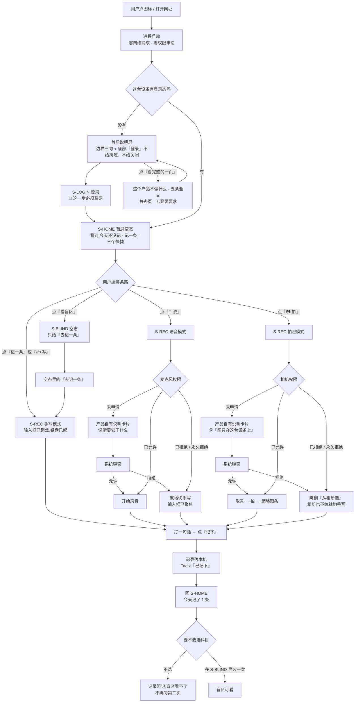
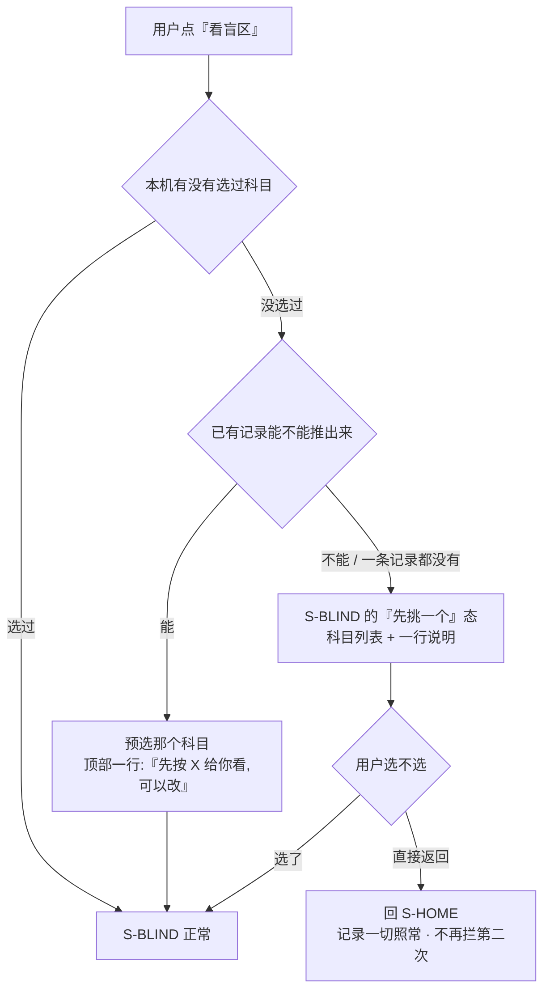
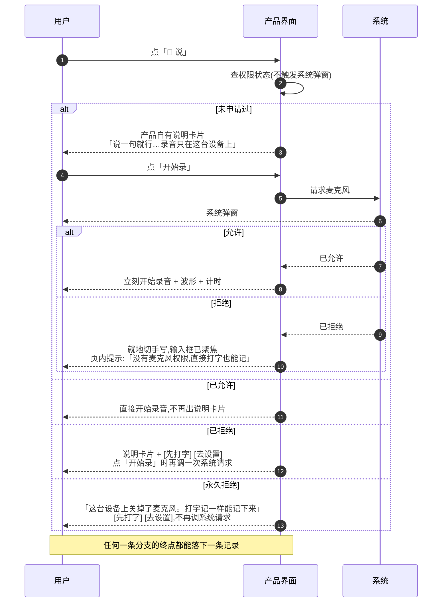
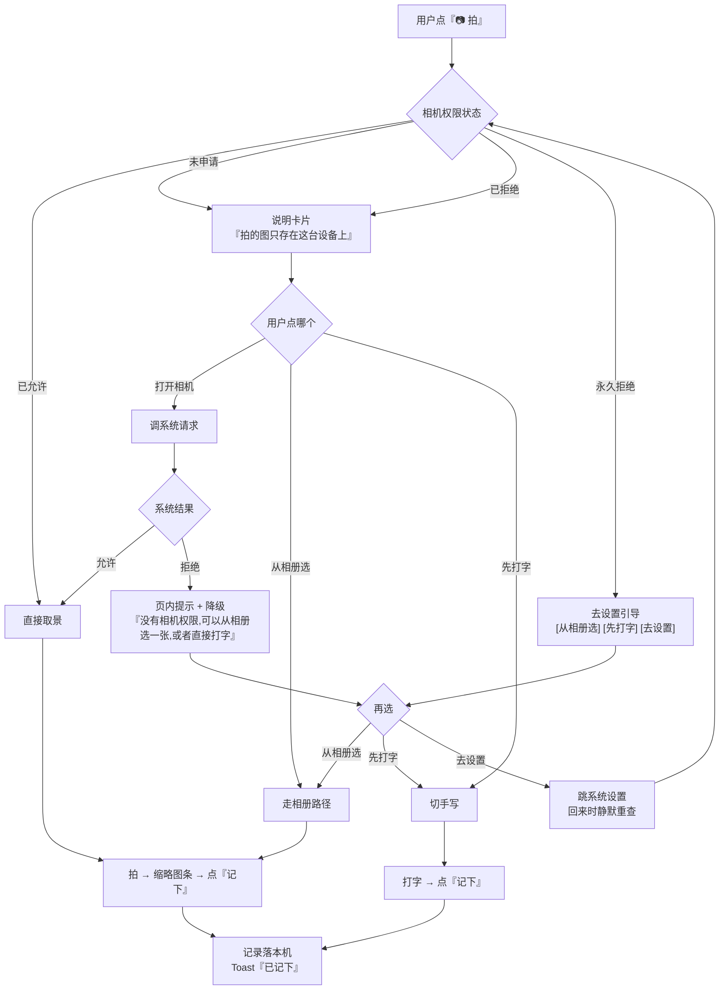
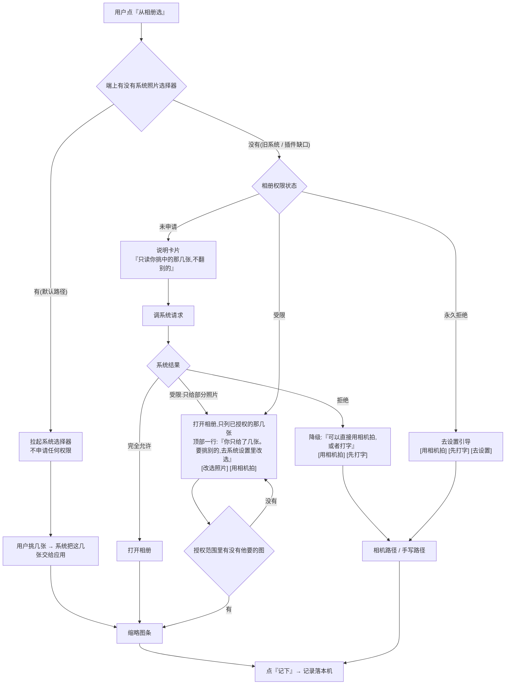
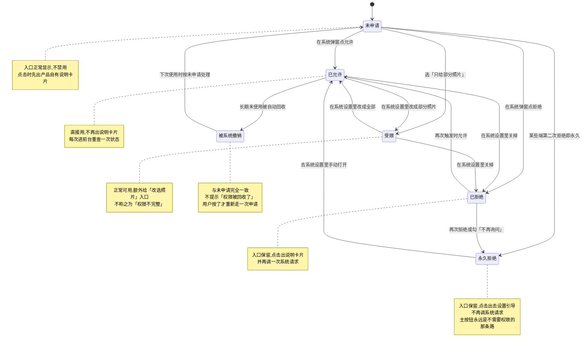

[← 用户侧功能规格](INDEX.md) ｜ [多端选型与端矩阵](../../technical/多端选型与端矩阵.md)

# 首次使用与权限申请 · 横切规格

> **这份文档回答两件事:用户第一次打开这个产品会经历什么,以及每一个系统权限在哪一刻被申请、被拒之后走哪条路。**
>
> **受众=UI 设计与前后端开发 · 篇幅上限=940 行 · 深度档位=详设。** 每一行都要能直接用来画界面或写代码。
>
> 它是**横切**的。七份逐屏规格各写了自己那一屏用到的权限([记一次学习](记一次学习.md) `R-04` / `R-07`、
> [设置与原图](设置与原图.md) `S-02`),但「第一次打开发生什么」和「权限在整个产品里怎么被要」**在此之前没有一处统一说法**。
> 这份文档是那一处 —— 逐屏规格里凡涉及权限,以本文为准;本文不重复任何一屏的元素清单。
>
> **不是**某一屏的规格(在七份逐屏规格里)、**不是**端的技术选型(在 [多端选型与端矩阵](../../technical/多端选型与端矩阵.md))、
> **不是**原图的存储判据(在 [原图存储：判据层与存储层](../../technical/原图存储-判据层与存储层.md))、
> **不是**合规轨的排期(在 [执行清单](../../execution/执行清单.md))。
> 全局约定在 [用户侧功能规格 · 总纲与全局约定](INDEX.md) §二,本文一条都不重复,只在冲突处点名。
>
> **基线:`origin/v1` @ `15accea`,fetch 于 2026-09-01T15:05Z。**
> **状态:活跃。** 新增一个权限、改一句权限说明文案、改首次路径的任何一步,本文同一次改动内更新。

---

## 零、这份文档的五条前提,后面每一节都在兑现它们

| # | 前提 | 它管住了什么 |
|---|---|---|
| 1 | **首次打开先给一屏产品说明,底部是登录入口,不给跳过。** 登录是**入口**不是出口:不登录不能记、不能看盲区、不能导出(2026-09-02 用户裁定「没有本地模式」) | §1.1 全流程图第一步就是这一屏;§1.5 十三屏的首次进入态一律按「刚登录完」写 |
| 2 | **不做提醒。** 通知权限根本不申请 | §2.8 逐条给理由;§2.1 主表里通知那一行的「申请时机」是「永不」 |
| 3 | **不在冷启动一次性索要全部权限。** 每个权限在它真正被用到的那一刻申请 | §2.1 的「申请时机」列精确到用户的哪一次点击;§1.6 把「启动时申请权限」写进不许做的事 |
| 4 | **任何权限被拒都不许把用户堵死。** 记录动作永不失败 | §2.4–§2.6 每张流程图的终点都有一条不需要权限的路;§5.1 异常表「记录留住了吗」列必须全 ✅ |
| 5 | **没有蒙层引导、气泡引导、强制教程、轮播引导页。** 反馈形态只有三种 | §1.3 把一次性说明做成登录之前的首启说明屏,不是第四种反馈形态,也不是第十四屏 |

**这五条不是本文提出的,是产品边界。** 本文只负责让它们在「第一次打开」这个场景里各自落到一个具体的界面行为上。

---

## 一、首次使用的完整路径

### 1.1 从安装到第一条记录落下来

🔴 **这张图里没有注册、没有引导页轮播、没有权限打包申请,登录只出现一次而且在最前面。**
登录之后,从 `S-HOME` 到「今天记了 1 条」**一次账号动作都没有,最少一次权限动作都没有**(走手写路径时,权限申请数为零)。

### 1.2 每一步的三个数:看到什么 · 能不能跳过 · 最少几次点击

「最少点击数」从**登录成功、落到 `S-HOME` 之后**开始算,不含系统弹窗上的那一下(那一下单独计,见「系统弹窗」列)。
登录之前的两步单独列在最上面,它们**不计入这个数**,也**一步都不能跳**。

| # | 步骤 | 用户看到什么 | 能不能跳过 | 累计最少点击 | 系统弹窗 |
|---|---|---|---|---|---|
| 0a | 首启说明屏(仅无登录态时) | 边界三句 + 底部「登录」+「看完整的一页」 | 🔴 **不能跳过、不能关闭** | 不计入 | 0 |
| 0b | 登录 | `S-LOGIN`,流程见 [登录与账号](登录与账号.md) §二 | 🔴 **不能跳过;这一步必须联网** | 不计入 | 0 |
| 0 | 冷启动(已有登录态) | 首帧即 `S-HOME` 骨架,不是闪屏 | — | 0 | 0 |
| 1 | `S-HOME` 首次空态 | 「今天还没记」+ 主按钮 + 三个快捷(**边界卡片已在 0a 出现过,不在这里**) | — | 0 | 0 |
| 2a | 点「记一条」/「✍️ 写」 | `S-REC` 手写模式,输入框已聚焦、键盘已起 | — | 1 | 0 |
| 3a | 打字 → 点「记下」 | Toast「已记下」,回 `S-HOME` | 不可跳过,这是目的本身 | **2** | 0 |
| 2b | 点「🎤 说」 | 麦克风说明卡片(首次)或直接进录音界面(已授权) | 说明卡片可点「先打字」直接跳走 | 1 | 0 |
| 3b | 点「开始录」 | 系统权限弹窗(仅首次) | 拒了就落到手写,不阻断 | 2 | **1** |
| 4b | 说完松手 | 立刻「已记下」,转写在后台跑 | — | **3** | 1 |
| 2c | 点「📷 拍」 | 相机说明卡片(首次) | 可点「从相册选」或「先打字」 | 1 | 0 |
| 3c | 点「打开相机」 | 系统权限弹窗(仅首次) | 拒了降到相册,再拒落手写 | 2 | **1** |
| 4c | 拍一张 → 点「记下」 | 缩略图条 + Toast「已记下」 | — | **4** | 1 |
| 5 | 边界说明 | 已在 0a 看过(三句 + 「看完整的一页」) | 🔴 **不可跳过**,见 0a | 不计入 | 0 |
| 6 | 科目选择 | **首次不问**。进 `S-BLIND` 时才问一次 | **可以永远不选** | 见 §1.4 | 0 |

**登录之后的最短成功路径 = 2 次点击、0 个系统弹窗。** 记录动作本身**不等任何网络往返**(先落这台设备,再后台补传),
冷启动到可交互之间的网络请求数仍然是 0(§1.6.3)。这个数是这一节的验收口径,`FT-01` 与 `FT-03` 测它。
登录那一步的点击数与网络由 [登录与账号](登录与账号.md) 负责,本文不重复计。

### 1.3 首屏是什么:先是首启说明屏,登录之后才是 `S-HOME` 的首次空态

**无登录态时首屏是首启说明屏(§1.3.3);有登录态时首屏就是 `S-HOME`。**
两者都**不做闪屏页、不做欢迎页、不做轮播、不做「跳过」按钮**。
`S-HOME` 的常规元素清单在 [记一次学习](记一次学习.md) §2.1,本节只写**零记录且刚登录完**这一种状态。

#### 1.3.1 元素清单(首次空态)

| 区 | 元素 | 首次空态下的取值 | 可点 | 备注 |
|---|---|---|---|---|
| 顶 | 离线细条 | 在线时不显示;离线时显示 | 否 | 首启离线是正常的,见 `FP-14` |
| 一 | 今天记了 {n} 条 | **「今天还没记」** | 是 → `S-TL`(进去也是空态) | 不显示 0 |
| 一 | 今天有 {m} 次没记 | 「0」 | 否 | 首次也显示,不隐藏 |
| 二 | **主按钮「记一条」** | 常驻 | 是 → `S-REC` 手写 | **屏幕上最大的一个可点元素** |
| 二 | 三个快捷 🎤 说 · 📷 拍 · ✍️ 写 | 常驻 | 是 | 三个都不带角标、不带小红点 |
| 二 | 主按钮下一行说明 | 「随手记一句就行,不用写完整」 | 否 | 与 [记一次学习](记一次学习.md) §2.3 同一句,不另写 |
| 三 | 「本来该记,但懒了」 | 常驻 | 是 | 首次也在,不因为没数据而隐藏 |
| 四 | 最近 3 条记录 | **整区隐藏** | — | 不画空插画,不占位 |
| 五 | 「看盲区」入口 | 常驻 | 是 → `S-BLIND` 空态 | 首次进去只有「去记一条」 |
| 六 | ~~边界卡片~~ | 🔴 **不在 `S-HOME` 上**。2026-09-02 裁定后它是登录之前的首启说明屏(§1.3.3),用户到得了 `S-HOME` 就说明已经看过一次 | — | 该区在 `S-HOME` 上整区不存在 |

#### 1.3.2 那一个能立刻做的动作

**是「记一条」,不是别的。** 空态的规矩([用户侧功能规格 · 总纲与全局约定](INDEX.md) §2.1)是「一句话说清为什么空 + 一个能立刻做的动作」——
首屏这两样分别是「今天还没记」和主按钮。

🔴 **首屏不允许出现的东西**,逐条写死,因为每一条都有人会想加:

| 不许有 | 为什么 |
|---|---|
| 闪屏 / 品牌页 / 加载动画页 | 它把「点图标到能点记一条」的时间变长,而那正是 §1.6 的预算 |
| 引导蒙层、气泡、聚光灯、分步教程 | 反馈形态只有 Toast / 页内提示 / 浮层三种,引导蒙层是第四种 |
| 带「跳过」按钮的轮播介绍页 | 该说的三句在首启说明屏一次说完,而且那一屏不轮播、不分步、也没有「跳过」;再加一个介绍页就是第二遍 |
| 登录弹窗、登录浮层、登录横条 | 前提 1:到得了 `S-HOME` 的人一定已经登录,没有可提示的对象 |
| 权限申请(任何一个) | 前提 3 |
| 空数据插画 | 它占的位置本该给那一个动作 |
| 任何百分比、进度条、评价性文字 | 产品只回答有没有、几次、多久前 |

#### 1.3.3 首启说明屏:唯一一次性的说明,它就是产品的门

**结论(2026-09-02 用户裁定「没有本地模式」后改写):有这个说明,而且它是首启的第一屏 ——
用户在登录之前先读到这三句,底部按钮是登录入口,不给跳过。**

原先它是 `S-HOME` 里的一张可关闭卡片,理由是屏幕编号:
[用户侧功能规格 · 总纲与全局约定](INDEX.md) §一 写着「十三屏,一屏不多」。
**这条约束现在仍然成立,处置是不给它新屏号** —— 它没有第二个入口、不被任何路由引用、
一台设备上只出现到登录成功为止;它是十三屏之**前**的那一屏,不是第十四屏。

| 属性 | 结论 |
|---|---|
| 形态 | **首启的第一屏**,在 `S-HOME` 之前、`S-LOGIN` 之前 |
| **一屏** | ✅ 三句话,不折叠、不展开;字号放大时可纵向滚动(`FP-25`) |
| **可关闭** | 🔴 **不可关闭、不可跳过、没有返回**。唯一往下走的出口是底部的「登录」 |
| **阻塞** | 🔴 **它就是门。** 未登录时进不到任何一屏(深链也一样,见 `FP-26`) |
| **不轮播** | ✅ 只有一页,没有翻页点、没有左右滑 |
| 出现条件 | 这台设备没有登录态 |
| 消失条件 | **登录成功。** 不因为读过、关过、记过而消失 |
| 重新看 | 去 `S-SET` 的「这个产品不做什么」(五条全文);屏上的「看完整的一页」在登录前也能点开那一页(静态、无登录要求,见 [设置与原图](设置与原图.md) §3.1) |

**卡片上屏原文(三句,一字不改):**

> - 它不判断你答得对不对,也不给你讲题。**它只记录你碰过什么、碰过几次、多久以前。**
> - 它不存你的题目内容。数据库里没有能装题干的地方。
> - 你拍的原图**只存在这台设备上**,不上传、不同步、不备份到任何服务器。
>
> [看完整的一页] [登录]

✅ **与 [设置与原图](设置与原图.md) §3.3 的矛盾已消解(2026-09-03 产品裁定 `M0-G1`)**:那一节此前判「首次使用不展示」,现已改齐为「展示,形态是登录前的一屏、不是弹窗」,连带 §3.1 的「第二入口没有」收窄为「登录之后没有」、`A-27` 改写。**本节结论未变,不需要跟着改。**

✅ **上面这三句已确认(2026-09-02 用户裁定:不回滚)** —— 保持 `a7453de` 那次「改为逐字复制」的结果,
即 [设置与原图](设置与原图.md) §二 五句的前三句逐字复制,不退回改动之前的旧措辞。
**这三句一个字不许动**,判据见 §1.3.4(`python3 scripts/boundary-copy-check.py`)。

#### 1.3.4 这三句话与设置里那一页的关系 —— 真源在哪

**同一份内容两处说法是要治的病。** 处置写死:

| 层 | 是什么 | 谁改 |
|---|---|---|
| `项目现状与决策记录` §2 | **决策真源。** 边界本身 | 改边界才改 |
| `S-SET` 的「这个产品不做什么」([设置与原图](设置与原图.md) §二) | **文案真源。** 用户可读的完整五句,产品里唯一一份边界全文 | 决策改了就改 |
| 首启说明屏 | **不是真源。** 它取上面那一页的前三句,**逐字复制,不重写、不缩写、不换说法** | 上面改了就跟着改,不单独改 |

🔴 **这一屏上不许出现设置那一页没有的句子。** 加一句就是产品对自己的边界有了第二种说法 ——
而边界只要有两种说法,以后每一次「这算不算越界」的讨论都会先花时间确认按哪一份说。

⚠️ **判据(可跑):** `python3 scripts/boundary-copy-check.py` —— 首启说明屏三句必须逐字等于
[设置与原图](设置与原图.md) §二 的**前三句**,同意点承诺句必须逐字等于**第三条**。不等就退出码 1。
**这条判据以前只写在文档里没有实现,写下来的那天它就是红的**(卡片三句无一逐字);现在它是绿的。

### 1.4 科目 / 考试类型的首次选择

#### 1.4.1 什么时候问

**不在首次打开时问。不在第一条记录时问。只在用户第一次进 `S-BLIND` 时问一次。**

理由是这个减法本身:记录不需要科目(记的是「我碰过这个」),**只有做差集时才需要知道减的是哪一张考点表**。
首启就问科目,等于把一次注册式表单摆在产品的门口,而门口那一步本该只有一个按钮。

#### 1.4.2 能不能不选,以及不选的后果

| 问题 | 结论 |
|---|---|
| 能不能不选 | ✅ **能,而且可以永远不选** |
| 不选影响什么 | **只影响 `S-BLIND` / `S-NODE` 两屏**:没有科目就没有考点表,差集无从算起 |
| 不选还能做什么 | 记录(三种方式全部)、时间线、导出、原图管理、设置 —— 全部照常 |
| 会不会反复问 | ❌ **一次。** 用户在选择态直接返回,就当他选了「先不挑」,下次进 `S-BLIND` 直接给空态,**不再拦** |
| 之后怎么改 | `S-BLIND` 顶部的科目切换器(见 [看盲区](看盲区.md) §2.1);`S-SET` 里**不放**科目设置项 —— 一个东西一个入口 |
| 能不能选多个 | 🚧 未定,见 §5.3 `FG-3`(与 [看盲区](看盲区.md) `B-2` 是同一件事) |

🔴 **不许做成必填的注册式引导:** 没有「请先选择你的考试类型」的整屏拦截、没有「下一步」、没有进度点、
没有「完成设置」按钮、**没有一个不选就退不出去的界面**。选择态的返回键必须能退回 `S-HOME`。

#### 1.4.3 首次选择态的上屏原文

> **先挑一个考试**
> 挑了才能算「哪些考点你还没碰过」。记录不受影响,现在不挑也行。
>
> [公务员 · 行测] [公务员 · 申论] [考研 · 政治] [考研 · 英语] …
>
> 先不挑

「先不挑」是文本链,**常驻,不做成灰色小字**:选科目是可选的,不选也照常记。
⚠️ 这条规矩以前挂在登录屏的「先不登录,继续用」上,**那一行已随 2026-09-02 裁定删除**,这里不再引用它。

### 1.5 首次进入每一屏是什么(十三屏全集)

**首次进入 = 刚登录完、这个账号还没有任何数据、没选科目。** 十三屏一屏不漏。
🔴 **没有登录态时这十三屏一屏也进不去** —— 屏幕上只有首启说明屏与登录门(2026-09-02 裁定)。

| 屏幕 | 首次进入时是什么 | 那一个能立刻做的动作 | 上屏原文 |
|---|---|---|---|
| `S-HOME` 首页 | 空态,四区隐藏(边界三句已在登录前的首启说明屏看过) | **记一条** | 「今天还没记」/「随手记一句就行,不用写完整」 |
| `S-REC` 记一次 | 手写模式,输入框已聚焦、键盘已起,来源框为空 | **打一句话** | 占位符「刚才碰了什么?一句话就行」 |
| `S-TL` 时间线 | 空态,无分组、无筛选器 | **记一条** | 「还没有记录」 |
| `S-BLIND` 盲区总览 | 未选科目 → 选择态;已选但骨架空 → 空态 | **先挑一个考试** / **去记一条** | 「挑了才能算『哪些考点你还没碰过』」/「这个科目的考点表还没建好」 |
| `S-NODE` 考点详情 | 首次通常进不来(要先有考点表);深链进来时:考点信息在,我的部分全为空 | **去记一条** | 「你没碰过」/「没有相关记录」 |
| `S-TAG` 待补与手动挂载 | 空态(没有任何待处理记录) | **回时间线** | 「都处理完了」 |
| `S-EXP` 导出与问 AI | 空态,预览区整块隐藏,格式选择保留但导出按钮禁用 | **去记一条** | 「还没有可以导出的东西」 |
| `S-LOGIN` 登录 | 只有手机号框(`IDLE` 态);🔴 **首次使用路径必经这里**,它接在首启说明屏后面 | **填手机号** | 「登录后,这台设备和别的设备记的东西会算成同一个人」+「登录这一步必须联网」 |
| `S-ACC` 账号 | 已登录态,刚登录还没绑过第二种方式、还只有这一台设备 | **导出我的全部数据** | 「账号 · 尾号 {4 位}」 |
| `S-MERGE` 合并确认 | **首次进不来。** 它只由 `PHONE_TAKEN` 触发 | — | —(无首次态) |
| `S-BILL` 额度与购买 | 已登录首次进入,形态见 [额度与购买](额度与购买.md)。**原「未登录受限态」在新形态下进不来,该态作废** | **回去** | 见 [额度与购买](额度与购买.md) |
| `S-SET` 设置 | 全部条目可见;AI 组显示本月剩余次数;原图管理显示「0 张」 | **这个产品不做什么** | 「账号 · 尾号 {4 位}」/「0 张,占 0 KB」 |
| `S-RAW` 原图管理 | 空态,常驻说明照常显示 | **回去记一条** | 「这台设备上还没有原图」/「这些图只在这台设备上。换设备看不到,也没有任何地方备份。」 |

⚠️ **`S-RAW` 那句常驻说明在空态下也要显示。** 它是承诺,不是数据摘要 —— 零张图的时候把它藏起来,
等于用户第一次看到这句话是在他已经拍完之后。

### 1.6 冷启动性能预算

#### 1.6.1 时间预算(按端分列)

**T0 = 用户点图标 / 回车打开网址的那一刻。**

| 里程碑 | Web / H5 | 桌面壳 macOS | iOS / Android | 小程序 |
|---|---|---|---|---|
| 首帧非白屏 | ≤ 800ms | ≤ 600ms | ≤ 900ms | ≤ 1000ms(含微信下载包) |
| **可交互:「记一条」可点** | **≤ 1.5s** | **≤ 1.2s** | **≤ 1.8s** | **≤ 2.0s** |
| 输入框聚焦、键盘起(点进 `S-REC` 后) | ≤ 300ms | ≤ 300ms | ≤ 400ms | ≤ 400ms |
| 首屏两个数字出现 | ≤ 可交互 + 200ms | 同左 | 同左 | 同左 |

**「可交互」的定义写死:主按钮能接受点击并且点下去 300ms 内进得了 `S-REC`。** 按钮画出来但点了没反应不算。
**无登录态时同一条按首启说明屏算:底部「登录」能接受点击并且点下去 300ms 内进得了 `S-LOGIN`。**

#### 1.6.2 骨架屏的时机

| 时点 | 行为 |
|---|---|
| 0 – 400ms | **什么都不画。** 400ms 以内出内容的话,骨架屏本身就是一次多余的闪烁 |
| 400ms – 3s | 出骨架占位:保持 `S-HOME` 最终布局的形状(两行数字位 + 一个主按钮位 + 三个快捷位) |
| > 3s | 转错误态:「没打开,再试一次」+ 重试。**不无限转圈** |
| 任何时候 | **不转圈遮罩、不整屏 loading** |

#### 1.6.3 🔴 启动时不许做的事

**这张表是硬约束,每一条都有人会想加。** 判据统一:**首次冷启动到「可交互」之间,网络请求数应为 0。**

| 不许做 | 为什么 | 什么时候才做 |
|---|---|---|
| 预取骨架树 | 首启还没选科目,预取的是随便一棵树;而且它是这个产品里最大的一次请求 | 用户第一次进 `S-BLIND` 并选定科目之后 |
| 预热模型 / 预连模型通道 | 记录不需要模型。预热等于在用户还没决定记什么的时候先花掉一次调用 | 用户提交语音或图片之后 |
| 上报设备信息 / 采集设备指纹 | 设备标识不申请(§2.8),没有采集的对象也就没有上报这件事 | 永不 |
| 申请任何权限 | 前提 3 | 见 §2.1 各自的时机 |
| 校验登录态 / 静默续期 | 没有登录态时压根没有令牌可校验(那是一次必然失败的请求);有登录态时令牌本地可读,冷启动不必先问服务器 | 第一次发起需要账号的动作时 |
| 拉额度 / 拉档位 / 初始化支付 SDK | 三者都属于 `S-BILL`,而首屏一个字都不提额度 | 进 `S-BILL` 时 |
| 建长连接 / WebSocket / 轮询 | 首屏没有任何需要推送过来的东西 | 永不(本产品没有推送) |
| 读相册 / 扫描截图目录 / 读取任何本机媒体 | 它绕过「用户同意的那一刻」,而且不需要权限也能踩线 | 用户点了「📷 拍」并选「从相册选」之后 |
| 埋点上报启动事件 | 埋点只有四个,启动不在其中;加一个就要说清它服务哪条判据 | 永不 |
| 检查更新 / 拉公告 / 拉配置 | 首启拉配置会让「离线首启」变成「首启失败」 | 见 §5.3 `FG-6` |

#### 1.6.4 允许在后台做、但不许挡住可交互的事

| 事 | 时机 | 约束 |
|---|---|---|
| 打开本机存储 | 首帧之后 | 打不开时降级为纯内存,见 `FP-16` |
| 恢复上次未记完的草稿 | 可交互之后 | 只在 `S-HOME` 顶部一行提示,**不弹浮层**([记一次学习](记一次学习.md) `R-16`) |
| 桌面壳的后台定时器(到期转留存区) | 进程启动后 | 🔴 **不得发起任何网络请求**([多端选型与端矩阵](../../technical/多端选型与端矩阵.md) §3.3.3) |

---

## 二、权限矩阵

**这一节是本文的核心。** 三张表分工:表 A 说「在哪一刻要」,表 B 说「屏幕上写什么字」,表 C 说「被拒了走哪」。
三张表的行是同一批权限,顺序一致。

🔴 **申请时点一个都没变**(2026-09-02 裁定明确不动这一节):相机仍在**第一次点「打开相机」**那一下申请,
麦克风仍在**第一次点「开始录」**那一下申请。变的只有一件事:**这些时刻现在必然发生在登录之后**——
`S-REC` 在登录之后才进得去,所以「没登录也能拍、也能记」这种路径不再存在。

### 2.1 表 A · 权限全表(哪一端有 · 用在哪个动作 · 申请时机)

| 权限 | 桌面壳 macOS | iOS | Android | Web | 小程序 | 用在哪个动作 | **申请时机(精确到哪一次点击)** |
|---|---|---|---|---|---|---|---|
| **麦克风** | ✅ | ✅ | ✅ `RECORD_AUDIO` | ✅ | ✅ `scope.record` | `S-REC` 语音录制 | 用户在 `S-REC` 语音模式里点**「开始录」/ 按住录音按钮**的那一次 —— 不是进 `S-REC` 时,不是点「🎤 说」时 |
| **相机** | ✅ | ✅ | ✅ `CAMERA` | ✅ | ❌ **该端不申请** | `S-REC` 拍照 | 用户在拍照模式里点**「打开相机」**的那一次。点「📷 拍」只出说明卡片,不申请 |
| **相册读取** | ⚠️ 见下 | ⚠️ 见下 | ⚠️ 见下 | ❌ 无此概念 | ❌ 无此概念 | `S-REC` 从相册选图 | **默认不申请** —— 走系统照片选择器(iOS `PHPicker` / Android Photo Picker),它不需要权限。只有选择器不可用时才申请,时机是点**「从相册选」**那一次 |
| **相册写入** | ❌ | ❌ | ❌ | ❌ | ❌ | **无** | 🔴 **永不申请。** 界面上没有「存到相册」入口,理由见 §2.8 |
| **文件系统读写** | ✅ 应用数据目录 | ✅ 应用私有目录 | ✅ 应用私有目录 | ⚠️ 配额,非权限 | ⚠️ ~10MB,非权限 | 原图存储 · 导出文件落盘 | **不申请**:应用私有目录不需要系统授权。导出落盘走系统保存对话框,那是一次性选择不是持久权限 |
| **剪贴板读** | ❌ | ❌ | ❌ | ❌ | ❌ | 验证码粘贴自动填充 | 🔴 **永不主动读。** 只接受用户自己发起的粘贴动作,那不需要权限 |
| **剪贴板写** | ✅ 无弹窗 | ✅ 无弹窗 | ✅ 无弹窗 | ⚠️ 需用户手势 | ✅ `wx.setClipboardData` | 「复制给 AI」·「复制令牌」 | **不申请**:必须在用户点击的同一个手势里写,写完就结束 |
| **网络** | 无权限概念 | 无权限概念 | ✅ `INTERNET`(安装期授予,不弹窗) | 无权限概念 | 域名白名单(配置期) | 同步 · 转写 · 识别 · 登录 · 支付 | **不申请**(Android 是安装期普通权限)。后台限制见 §4.2 |
| **通知** | ❌ | ❌ | ❌ `POST_NOTIFICATIONS` **不声明** | ❌ | ❌ | **无** | 🔴 **永不申请。** 见 §2.8 |
| **定位** | ❌ | ❌ | ❌ | ❌ | ❌ | **无** | 🔴 **永不申请** |
| **通讯录** | ❌ | ❌ | ❌ | ❌ | ❌ | **无** | 🔴 **永不申请** |
| **日历** | ❌ | ❌ | ❌ | ❌ | ❌ | **无** | 🔴 **永不申请** |
| **设备标识**(IDFA / IMEI / OAID) | ❌ | ❌ 不弹跟踪授权 | ❌ | ❌ | ❌ | **无** | 🔴 **永不申请。** iOS 上因此也**没有跟踪授权弹窗** |
| **蓝牙** | ❌ | ❌ | ❌ | ❌ | ❌ | **无** | 🔴 **永不申请** |

⚠️ **表里「相册读取」那三个 ⚠️ 要说清:** 现代系统的照片选择器是**进程外**的,选中的图由系统交给应用,
应用从头到尾没有相册访问权。**这是本产品的默认路径** —— 它把「相册读取」这个权限在绝大多数情况下变成不存在的问题。
只有当端上的选择器不可用(旧系统、Tauri 移动端插件缺口)时,才回落到申请权限的老路,而那条路仍然要走表 B 的说明卡片。

🚧 **Tauri 2 在 iOS / Android 上把媒体请求与照片选择器接到系统能力的具体形态未验**,见 §5.3 `FG-1`。

### 2.2 表 B · 上屏原文(产品自有说明 + 系统弹窗用途描述 + 去设置引导)

**三段文字的分工:** 产品自有说明在**系统弹窗之前**出现,由产品自己的界面显示,说清「为什么要」;
系统弹窗的用途描述由系统显示,**用户在那一刻只会读一行**;去设置引导只在**永久拒绝之后**出现。

#### 2.2.1 麦克风

| 段 | 原文 |
|---|---|
| **产品自有说明**(页内卡片,不是浮层) | 「**说一句就行。** 要用麦克风把你说的这段录下来。录音转成文字之后,服务器上就不留它了;原始录音只在这台设备上。 [开始录] [先打字]」 |
| **iOS `NSMicrophoneUsageDescription`** | 「用来录下你随口说的一句学习记录。录音转成文字后不在服务器上保留。」 |
| **Android 系统弹窗** | —(系统固定文案,产品只能给前置说明) |
| **小程序 `scope.record` 说明** | 「用来录下你随口说的一句学习记录。」 |
| **去系统设置引导**(仅永久拒绝后) | 「这台设备上关掉了麦克风。**打字记一样能记下来**,想用语音的话去系统设置里打开。 [先打字] [去设置]」 |

#### 2.2.2 相机

| 段 | 原文 |
|---|---|
| **产品自有说明** | 「**拍一张就行。** 要用相机拍下讲义或者屏幕。 你拍的原图**只存在这台设备上**,不上传、不同步、不备份到任何服务器。 {时长}后转为本机留存,不再用于识别,随时可以手动删。 [打开相机] [从相册选] [先打字]」 |
| **iOS `NSCameraUsageDescription`** | 「用来拍下讲义或屏幕,记录你碰过哪个考点。照片只存在这台设备上。」 |
| **去系统设置引导** | 「这台设备上关掉了相机。**可以从相册选一张,或者直接打字。** [从相册选] [先打字] [去设置]」 |

🔴 **「图只存在这台设备上」这句必须在系统弹窗之前出现。** 系统弹窗上那一行由系统排版,长了会被截断 ——
**这条承诺不能只活在一个可能被截断的地方**。

⚠️ **由此,系统弹窗文案(`NSCameraUsageDescription` / Android / 小程序 `scope.*`)是唯一豁免逐字同源的一类** ——
它的长度不由产品决定。豁免的代价已经付过了:承诺句在系统弹窗**之前**由产品自有说明逐字给足。
`boundary-copy-check.py` 因此只校验产品自有说明,不校验系统弹窗那几行。

#### 2.2.3 相册读取

| 段 | 原文 |
|---|---|
| **产品自有说明**(仅当要走权限老路时) | 「**从相册里挑几张。** 只读你挑中的那几张,不翻别的。挑中的图只存在这台设备上,不上传。 [去挑图] [先打字]」 |
| **iOS `NSPhotoLibraryUsageDescription`** | 「用来选出你已经拍好的讲义照片,记录你碰过哪个考点。选中的图只存在这台设备上。」 |
| **iOS 受限访问下的追加说明** | 「你只给了这个应用几张照片的权限。要挑别的,**去系统设置里改选**,或者直接拍一张。 [改选照片] [用相机拍] [先打字]」 |
| **Android 部分照片(`READ_MEDIA_VISUAL_USER_SELECTED`)** | 同上,按钮改为 [重新挑几张] |
| **去系统设置引导** | 「这台设备上关掉了相册。**可以直接用相机拍,或者打字。** [用相机拍] [先打字] [去设置]」 |

#### 2.2.4 其余权限的文案

| 权限 | 有没有产品自有说明 | 有没有系统弹窗 | 上屏原文 |
|---|---|---|---|
| 相册写入 | **无** | **无** | —— 界面上没有触发它的入口 |
| 文件系统 | 无(私有目录) | 无 | 导出保存失败时:「没存下来,换个位置试试」 |
| 剪贴板写 | 无 | 无(或系统一次性提示) | 失败时页内提示:「这个端不让自动复制,长按选中自己复制」 |
| 网络 | 无 | 无 | 离线时走 [用户侧功能规格 · 总纲与全局约定](INDEX.md) §2.5 的常驻细条 |
| 通知 / 定位 / 通讯录 / 日历 / 设备标识 / 蓝牙 | **无** | **无** | —— **产品里没有任何一个字提到它们**,包括「我们不申请通知权限」这种自夸 |

⚠️ **最后一行是有意的:不申请的权限,在界面上不出现。** 写一句「我们不会打扰你」就是把提醒这个话题引进产品里,
而边界那一页([设置与原图](设置与原图.md) §二)已经用一句「它不会提醒你学习」把这件事说完了,不需要第二处。

### 2.3 表 C · 拒绝后走哪条路

| 权限 | 拒绝后 | 永久拒绝后 | 这个功能还能不能用 | 记录能不能落 |
|---|---|---|---|---|
| **麦克风** | 就地切手写,输入框已聚焦;录音按钮保留但点了先出说明卡片 | 说明卡片换成「去系统设置」引导;**每次点仍然能重新看到,不禁用按钮** | 语音 ❌ · 手写 ✅ · 拍照 ✅ | ✅ **永远能** |
| **相机** | 降到「从相册选」;相册也不行就切手写 | 同上 + 去设置引导 | 相机 ❌ · 相册 ⚠️ · 手写 ✅ | ✅ |
| **相册读取** | 降到「用相机拍」;相机也不行就切手写 | 同上 + 去设置引导 | 相册 ❌ · 相机 ⚠️ · 手写 ✅ | ✅ |
| **相册受限**(只给部分照片) | **不视为拒绝**,正常继续;要挑别的给「改选照片」入口 | — | ✅ 在已授权的那几张范围内 | ✅ |
| **文件系统写失败** | 文字记录照落,图不存;顶部提示 | 同左 | 原图 ❌ · 记录 ✅ | ✅([记一次学习](记一次学习.md) `R-11`) |
| **剪贴板写失败** | 页内提示,文本仍在预览框里可手动选中 | 同左 | 自动复制 ❌ · 手动复制 ✅ | 不涉及 |
| **网络不可用** | 进本地队列,顶部常驻细条 | 同左 | 同步/转写/识别 ⏸ · 记录 ✅ | ✅ |
| **通知 / 定位 / 通讯录 / 日历 / 设备标识 / 蓝牙** | **不存在这一格** —— 没有申请就没有拒绝 | — | — | — |

🔴 **「永久拒绝」这一列里没有任何一格是「功能不可用,请去开启权限」。** 每一格都先给一条不需要权限的路,
**去系统设置永远排在最后一个** —— 它前面是这一格全部不需要权限的路。

⚠️ **原文写的是「次要位置的第二个按钮」,2026-09-02 改为「最后一个」(`M0-G2` 裁定,§七)。**
不是松口径,是把两按钮情形的特例写成通则:麦克风那格只有两个按钮,「最后一个」就是「第二个」;
而相机 / 相册那两格有三个按钮,照字面套「第二个」会排成 `[从相册选] [去设置] [先打字]`——
**把去系统设置插到「永远能用的那条路」前面,正好破掉这条红线自己的实质。**

**全产品按钮序只有两条规则,这一格与说明卡片(§2.2 的第一行)照的是同一条:**

| # | 规则 | 为什么 |
|---|---|---|
| 1 | 🔴 **会把用户带出应用的那条路永远排最后。** 全产品符合这一条的只有「去系统设置」 | 它不是用户此刻能在应用里走完的动作,而且走出去了不保证回得来。把它摆第一个,不用写「功能不可用」四个字也已经是那个意思 |
| 2 | 剩下的按**应用内能走完的顺序**排:用户刚点的那条在前,兜底在末位 | 说明卡片是 `[开始录] [先打字]`,去设置引导是 `[先打字] [去设置]`——两处不是相反,是**同一条规则下「刚点的那条」还在不在**的区别 |

**主次那一半原文未动**:去系统设置不是主按钮,这一格里也没有主按钮
(`S-REC` 的主按钮是「记下」,`全局组件与交互模式库` `C-BTN` 写死一屏最多一个主按钮)。

⚠️ **三个按钮的两格必须纵向排列**(`C-BTN` 边界值:并排按钮 ≤ 2,三个及以上改纵向)。
纵向时顺序不变,去系统设置在最下。

### 2.4 麦克风的申请流程

| 再次触发时的行为 | 规则 |
|---|---|
| 已允许 | 直接录,**不再出说明卡片**(说明只出一次) |
| 已拒绝(可再问) | 出说明卡片,点「开始录」**再调一次**系统请求 |
| 永久拒绝 | 出去设置引导,**不再调系统请求** —— 调了也不会弹,只会让按钮看起来坏了 |
| 从系统设置回来 | 前台恢复时重新查一次状态;变成已允许则**不弹任何东西**,静默把录音按钮恢复 |

### 2.5 相机的申请流程

⚠️ **权限允许了不等于相机能用。** 硬件不可用(没有摄像头、被别的应用占着)是另一回事,见 `FP-09` / `FP-10`。
界面必须能区分这两句:「没有相机权限」和「这台设备的相机现在用不了」。

### 2.6 相册的申请流程(含 iOS 受限访问)

🔴 **受限访问不是错误态,是一种正常授权。** 界面上不许出现「权限不完整」「请授予完整访问」这类说法 ——
用户只给几张就是他的决定,产品要做的是让他能随时改选,不是劝他给全部。

### 2.7 权限状态机

| 状态 | 入口显示 | 点击时 | 会不会调系统请求 | 会不会提示用户 |
|---|---|---|---|---|
| 未申请 | 正常 | 说明卡片 | ✅ 用户点确认后 | 只有说明卡片 |
| 已允许 | 正常 | 直接用 | ❌ | ❌ |
| 已拒绝 | 正常,**不禁用** | 说明卡片 | ✅ 再试一次 | 说明卡片 |
| 永久拒绝 | 正常,**不禁用** | 去设置引导 | ❌ | 引导卡片 |
| 受限 | 正常 | 直接用 + 改选入口 | ❌ | 一行说明 |
| 被系统撤销 | 正常 | 同「未申请」 | ✅ | 无额外提示 |

🔴 **任何状态下入口都不禁用。** 一个灰掉的按钮不告诉用户任何事,而且它把「去哪儿改」这个问题留给了用户自己 ——
产品的处置是:按钮永远能点,点下去永远有一条走得通的路。

### 2.8 不申请的权限:逐条给理由

**格式统一:为什么不要 / 如果将来有人提议要,它会破坏哪条红线。**

#### 通知

| 项 | 内容 |
|---|---|
| **为什么不要** | 这个产品不做提醒。没有一个事件是「用户不打开就会损失」的:原图到期是**转入留存区**不是删除,字节仍在本机([设置与原图](设置与原图.md) §3.1);记录不会过期;差集不会失效。**通知需要一个损失事件才有正当理由,而这里一个都没有** |
| **提议要的话破坏哪条红线** | 破坏「不做提醒」这一条,而且是连锁的:有了通知就会有「今天还没记」的推送,有推送就会有发送时机,有时机就会有「连续几天」这类计数 —— 那正是 [用户侧功能规格 · 总纲与全局约定](INDEX.md) §2.3 禁用词表里被点名的一整类东西。**通知不是一个功能,是一个坡** |
| 顺带 | Android 上**不声明** `POST_NOTIFICATIONS`。不声明就永远不会弹那个弹窗 —— 这比「声明了但不申请」更硬 |

#### 定位

| 项 | 内容 |
|---|---|
| **为什么不要** | 产品只回答有没有、几次、多久前。**「在哪儿」不在这三件事里。** 用户在图书馆还是在家,对差集没有任何影响 |
| **提议要的话破坏哪条红线** | 最可能的提议是「按地点分组记录」或「到自习室自动提示」。前者制造了一个产品不回答的维度,后者直接破坏「不做提醒」。而且定位一旦在,商店的隐私清单里就多一项最敏感的声明,§3.2 每一格的成本都上升 |

#### 通讯录

| 项 | 内容 |
|---|---|
| **为什么不要** | 产品里没有任何一处需要知道另一个人。没有分享、没有邀请、没有好友 |
| **提议要的话破坏哪条红线** | 提议一定是「邀请同学一起用」或者「看看朋友的覆盖度」。后者是名次的变体,直接命中禁用词表;前者是增长手段,而增长要涨的是「主动查看盲区的人数」,拉人头对这个数没有贡献 —— 它只让注册数好看,而注册数好看正是产品明确说过不算数的那种数 |

#### 日历

| 项 | 内容 |
|---|---|
| **为什么不要** | 提议它的场景只有一个:排学习计划。**产品不排计划** |
| **提议要的话破坏哪条红线** | 「学习计划」在禁用词表里以近义词的形式被点名,而写进日历的计划还多了一层:它会在系统层面产生提示,等于绕开「不申请通知权限」这条从侧门做了提醒 |

#### 设备标识(IDFA / IMEI / OAID / 广告标识)

| 项 | 内容 |
|---|---|
| **为什么不要** | 不做行为分析、不做漏斗、不做留存曲线,埋点只有四个。**没有一个需要跨应用识别同一台设备。** 跨端识别的锚点是手机号,而且是用户主动登录才有的 |
| **提议要的话破坏哪条红线** | 提议一定是「看看用户从哪来的」或「防刷额度」。前者是增长分析,埋点那一节已经写死「这四个之外不加」;后者的正解是服务端频控(已有),不是设备指纹。**iOS 上的连带好处很实在:不采集就不需要跟踪授权弹窗,首次打开因此少一个系统弹窗** |

#### 蓝牙

| 项 | 内容 |
|---|---|
| **为什么不要** | 没有任何外设。产品的输入是打字、说话、拍照,三样都不经过蓝牙 |
| **提议要的话破坏哪条红线** | 蓝牙扫描在多数系统上与定位是同一档敏感度,提议它等于顺带把定位提议进来。而且蓝牙唯一可能的用途是「附近的人」,那是通讯录那条的翻版 |

#### 相册写入

| 项 | 内容 |
|---|---|
| **为什么不要** | 唯一可能的用途是「把原图存到系统相册」。**而系统相册默认开着云端照片同步** —— 存进去就等于把原图交给了云,用户还会以为它仍在本机 |
| **提议要的话破坏哪条红线** | 直接破坏「原图只存在他自己的机器上,绝不上云、不同步、不共享」。这与 [多端选型与端矩阵](../../technical/多端选型与端矩阵.md) §4.2 禁止把原图落进会被云同步的目录是同一条判断,只是换了个出口 |

⚠️ **这七条的共同点:它们都不是「暂时不做」,是「做了就得先推翻一条边界」。**
所以它们不在缺口登记里 —— 缺口是没定的事,这七条是定了的事。

---

## 三、隐私与合规的用户可见部分

### 3.1 首次使用时的隐私告知

#### 3.1.1 说什么、在哪说

| 场景 | 在哪说 | 说什么 | 要不要勾选 |
|---|---|---|---|
| **首次打开(还没登录)** | 首启说明屏(§1.3.3)+ 它上面的「看完整的一页」 | 三句边界 + 可点进边界全文 | ❌ **不勾选、不拦截**;勾选发生在下一步的登录门上 |
| **首次登录** | `S-LOGIN` 的协议勾选行 | 「已阅读并同意《用户协议》《隐私政策》」 | ✅ **必勾**,默认不勾([登录与账号](登录与账号.md) §2.2) |
| **首次购买** | `S-BILL` 确认页 | 购买相关协议 | ✅ 必勾([额度与购买](额度与购买.md) §3.2) |
| **首次用需要权限的能力** | 该权限的产品自有说明卡片(§2.2) | 这一个权限要来干什么 | ❌ 不勾选,点按钮即表示继续 |

#### 3.1.2 不同意的后果

| 用户做了什么 | 后果 |
|---|---|
| 首次打开,**没读任何政策** | 能读到首启说明屏的三句,也能点进边界全文;**要记、要看盲区、要导出都得先登录**,而登录那一步必须勾协议 |
| 在首启说明屏上找关闭 / 跳过 | 🔴 **没有。** 唯一出口是「登录」(§1.3.3、`FP-02`) |
| 在 `S-LOGIN` 不勾协议 | 不能登录(`E-02`);🔴 **没有绕过登录的第二条路**,停在首启说明屏 |
| 在 `S-BILL` 不勾协议 | 不能支付,其余不受影响 |

🚧 **这一节有一处不能由产品裁定,登记为缺口 `FG-4`:**
**未登录时不做任何同意动作,在境内合规口径上成不成立。** 本文按「成立」写(理由:未登录时屏幕上只有一屏静态说明与一道登录门,
不收集、不上传、不产生个人信息处理行为;一切处理行为都发生在**必勾协议的登录之后**),
**但这是产品的理解,不是法务结论。** 如果结论是「首次运行必须有一次明示同意」,那么要改的是这一节。

⚠️ 原先挂在这里的 🔴「**无论结论如何,不许把「不同意就不能用」当作解法**」**已随 2026-09-02 裁定作废** ——
它保护的是「本机模式」,而不登录已经什么都不能做,这条约束没有保护对象了。**不改写成别的红线。**
剩下的部分仍然是:拿不准就**停下来问,不自行放宽**。

### 3.2 各端的商店合规要求

**这张表逐条写「依赖什么、谁负责、没有它会卡住哪一步」。本文不裁定任何一格能不能过 —— 它不是产品能决定的事。**

| 端 | 要求项 | 依赖什么 | 谁负责 | 没有它会卡住哪一步 |
|---|---|---|---|---|
| **App Store** | 隐私营养标签(App Privacy) | 逐项声明收集了什么。本产品的答案接近全空:不收集设备标识、不收集位置、不收集通讯录 | 产品填,主体账号提交 | 不填不能提交构建版本 |
| | 权限用途描述(`NS*UsageDescription`) | §2.2 的原文,逐条写进 `Info.plist` | 产品给文案,壳侧注入 | 缺一条即被自动打回 |
| | 账号删除入口 | 已有([登录与账号](登录与账号.md) §七) | 产品 | 有登录功能而无删除入口会被打回 |
| | **4.2 最小功能条款** | 壳独有能力要真实存在并被用上([多端选型与端矩阵](../../technical/多端选型与端矩阵.md) §3.4) | 技术 + 产品 | 卡的是整个上架,不是某一步 |
| | 未成年人分级问卷 | §3.3 的结论 | 🚧 未定,见 `FG-5` | 不填不能提交 |
| | Apple 登录 | 若提供了第三方登录则必须提供([登录与账号](登录与账号.md) `L-1`) | 产品 + 主体 | 卡上架 |
| **Google Play** | Data Safety 表单 | 同 App Privacy,逐项声明 | 产品填 | 不填不能发布 |
| | 敏感权限声明理由 | 本产品不申请任何敏感权限,这一格因此接近空 | 产品 | — |
| | 目标 API 版本要求 | 壳侧构建配置 | 技术 | 卡发布 |
| | 家庭政策 / 目标年龄段 | §3.3 的结论 | 🚧 未定,见 `FG-5` | 卡发布 |
| **微信小程序** | 主体认证 | 域名实名主体 = 备案主体 = 小程序主体 = 签名主体,四者必须同一([多端选型与端矩阵](../../technical/多端选型与端矩阵.md) §七) | 合规轨 | 卡小程序立项本身 |
| | 服务类目 | 类目决定要不要额外资质 | 合规轨 | 卡提审 |
| | 用户隐私保护指引 | 逐项声明用到的 `scope`。本产品只有 `scope.record` | 产品填 | 不填不能提审 |
| | `wx.requirePrivacyAuthorize` | 采集用户信息前的授权流程 | 技术 | 未接入会在审核期被打回 |
| **国内 Android 应用商店** | ICP 备案 | 域名主体 | 合规轨 | 卡上架 |
| | 软件著作权 | 主体 | 合规轨 | 多数商店要求 |
| | 隐私政策与权限清单公示 | 与 App Store 同一份内容 | 产品 | 卡上架 |
| | 个人信息收集清单 / SDK 清单 | 本产品无第三方 SDK,壳侧有构建期黑名单拦截([多端选型与端矩阵](../../technical/多端选型与端矩阵.md) §3.3.3) | 技术出清单 | 卡上架 |
| **Web / H5** | 无商店 | 备案(境内域名) | 合规轨 | 卡域名解析 |

⚠️ **这张表里凡是「谁负责」写着合规轨的,产品都不裁定,也不替它估时点。**
它们在 [执行清单](../../execution/执行清单.md) 的合规轨上,与 [额度与购买](额度与购买.md) `Q-3` 是同一条依赖。

### 3.3 未成年人与年龄门槛

| 问题 | 现状 |
|---|---|
| 产品面向谁 | 公考与考研考生,**绝大多数是成年人** |
| 会不会有未成年用户 | 可能有(应届生、跨考生里有未满 18 的);产品**不主动识别年龄** |
| 现在有没有年龄门槛 | ❌ 没有。首次打开不问年龄、不问身份、不问任何东西 |
| 需不需要 | 🚧 **产品不裁定。** 见 `FG-5` |
| 如果需要,放在哪一步 | 两种可能,**都不是首次打开**:① 首次登录时(已有一次协议勾选,可以合并);② 首次购买时(支付涉及未成年人限制)。**首次打开加年龄门槛等于把注册式表单摆回门口**,前提 1 当场失效 |
| 商店问卷怎么填 | 依赖上面这一条,填不了 |

🔴 **在这一条定下来之前,界面上不出现任何年龄相关的输入、选择或声明。**
有入口而没有流程比没有入口更糟 —— 与 [额度与购买](额度与购买.md) `Q-1` 对退款的处置是同一条规矩。

---

## 四、多端差异

### 4.1 首次使用路径的各端差异

| 项 | 桌面壳 macOS | iOS | Android | Web / H5 | 微信小程序 |
|---|---|---|---|---|---|
| 首次触达 | 下载 `.dmg` → 拖进应用 → 双击 | App Store 安装 | 商店 / apk 安装 | **打开网址即用,零安装** | 扫码 / 搜索进入 |
| 首屏 | 首启说明屏 → 登录 → `S-HOME`,窗口指向回环地址 | 同左 | 同左 | 同左,先落说明屏再谈路由 | 首启说明屏 → 登录 → 小程序首页(三屏形态) |
| 首启弹窗数 | **0** | **0**(无跟踪授权、无通知请求) | **0**(不声明通知权限) | **0** | **0** |
| 首启说明屏 | ✅ | ✅ | ✅ | ✅ | ⚠️ **删掉原图那一句** —— 该端没有原图,那句话没有主语([多端选型与端矩阵](../../technical/多端选型与端矩阵.md) §3.6.1);删掉之后该端只剩两句 |
| 首次可用的记录方式(**登录之后**) | 写 · 说 · 拍 | 写 · 说 · 拍 | 写 · 说 · 拍 | 写 · 说 · 拍 | **写 · 说**(无拍照) |
| 科目首次选择 | 同一套 | 同一套 | 同一套 | 同一套 | ❌ 该端无 `S-BLIND`,转场网页端 |
| 首次离线可用性 | 🔴 **首次必须联网** —— 卡在登录这一步(`FP-14`);登录之后离线可用性完整 | 同左 | 同左 | ⚠️ 首次必须联网拿到页面,**登录同样要联网**;登录之后可离线 | ❌ 首次必须联网下载包,登录同样要联网 |
| 深链进入 | `kaodian://<path>` | Universal Links(未上架前无) | App Links(同左) | 就是 URL | route id 子集,子集外转场网页端 |
| 安装后残留态 | 卸载即清空应用数据目录(登录态一并清空,下次装回来重走首启说明屏) | 同左 | 同左 | 清浏览器数据即清空 | 微信自行管理 |

🔴 **深链在所有端上都先过登录门。** 没有登录态时,深链一律落到首启说明屏;登录成功之后再落到目标屏(`FP-26`)。
**不做「先看一眼目标屏再让登录」的预览态** —— 那就是把「未登录也能看点什么」从后门放回来。

⚠️ **「首启弹窗数 = 0」这一行仍然成立。** 登录门不是系统弹窗,是产品自己的一屏;
这一行数的是系统级授权弹窗(跟踪、通知、权限),它们在首启一个都不出现。

### 4.2 每个权限在各端的差异

| 权限 | 桌面壳 macOS | iOS | Android | Web / H5 | 微信小程序 |
|---|---|---|---|---|---|
| **麦克风** | WebView 内的媒体请求 → 系统隐私弹窗,需 `Info.plist` 的用途描述;**壳与浏览器是两套授权记录**,壳里授权过浏览器仍要再问一次 | `NSMicrophoneUsageDescription`;拒绝后只能去系统设置 | `RECORD_AUDIO` 运行时权限;两次拒绝或勾「不再询问」→ 永久拒绝 | 浏览器权限提示,按 origin 记住;Safari 多数情况**每个会话重问**;非安全上下文没有这个能力(壳的回环地址属于可信来源,可用) | `scope.record`,`wx.getSetting` 查、`wx.authorize` 申请;**拒绝后只能 `wx.openSetting`,而它必须由用户点击触发** |
| **相机** | 同上,另需相机的用途描述 | `NSCameraUsageDescription` | `CAMERA` 运行时权限 | 同麦克风;`<input type=file capture>` 走系统相机时**不需要网页权限** | ❌ **该端没有拍照** |
| **相册读取** | 不涉及(桌面用文件选择对话框,不是相册) | 优先 `PHPicker`(无权限);回落时 `NSPhotoLibraryUsageDescription`,**有「只给部分照片」这一档** | 优先 Photo Picker(无权限);回落 API 33+ 用 `READ_MEDIA_IMAGES`,Android 14 起有 `READ_MEDIA_VISUAL_USER_SELECTED`(部分照片) | `<input type=file>`,**不需要任何权限** | `wx.chooseMedia` 由微信托管,**无独立授权档** |
| **相册写入** | ❌ 无入口 | ❌ 无入口 | ❌ 无入口 | ❌ 无入口 | ❌ 无入口 |
| **文件系统** | ✅ 真实文件系统,Tauri capability **白名单只开应用数据目录**;🔴 不得落 `~/Documents` / `~/Desktop`(云端「桌面与文稿」同步默认可开,落进去等于原图上云) | 应用私有目录 | 应用私有目录 | ⚠️ **不是权限是配额**:浏览器给多少是多少,会撞墙;隐私模式下可能整个不给 | ⚠️ 约 10MB,且临时文件由微信按自己的策略清理 —— **这就是该端不开原图通道的原因** |
| **剪贴板写** | 系统 API,无弹窗 | 用户手势内可写 | 用户手势内可写 | 必须在用户手势内;部分浏览器仍会拒 | `wx.setClipboardData`,**微信会自己弹一个「已复制」提示,产品不再叠一个 Toast** |
| **剪贴板读** | ❌ 不主动读 | ❌ | ❌ | ❌ | ❌ |
| **网络** | 无权限概念 | 无权限概念;蜂窝数据可被系统按应用关闭 | `INTERNET` 安装期授予;🔴 **后台限制是真的**:Doze / 省电模式 / 后台数据受限会让补传队列在后台停住 —— 处置是**回前台补传**,并且**不申请忽略电池优化的白名单**(那会弹一个系统级请求,而本产品的后台定时器只做本地留存区转移、不发网络请求) | 无权限概念;后台标签页会被节流 | 域名白名单在小程序后台配置,**配错是发布期问题不是运行期权限** |
| **通知 / 定位 / 通讯录 / 日历 / 设备标识 / 蓝牙** | 全部不声明 | 全部不声明,**无跟踪授权** | **全部不写进 manifest** | 全部不调 | 全部不申请 |

⚠️ **一条容易被忽略的端差异:桌面壳与浏览器的授权记录是两套。**
用户在浏览器里给过麦克风权限,装了桌面壳之后**还要再给一次** —— 这不是缺陷。
界面处置:壳里第一次点「🎤 说」照常出说明卡片,**不许写「你之前不是给过吗」**。
这与 [设置与原图](设置与原图.md) §3.4 说的「两个地方」是同一件事的另一面。

---

## 五、异常与验收

### 5.1 异常全集

**「文案」列是上屏原文,不是描述。「记录留住了吗」列必须全部是 ✅ 或「不涉及」—— 出现一个 ❌ 就是违反红线。**

🔴 **2026-09-02 裁定后的统一前提:除非某一行自己写明「无登录态」,下表所有触发条件都发生在完成首启登录之后。**
未登录时屏幕上只有首启说明屏与登录门(§1.3.3),别的异常连触发的机会都没有。

| # | 触发条件 | 界面表现 | 上屏原文文案 | 用户下一步 | 记录/数据留住了吗 |
|---|---|---|---|---|---|
| `FP-01` | 首次打开,用户直接点主按钮 | `S-REC` 手写模式,输入框聚焦 | —(无额外文案) | 打字 | ✅ |
| `FP-02` | **无登录态**:在首启说明屏上找关闭 / 跳过 / 返回 | **三个都没有**,系统返回键在这一屏上不响应;唯一往下走的出口是底部「登录」 | —(不解释「为什么不能跳过」,也不出任何拦截浮层) | 点「登录」 | ✅ 不涉及 |
| `FP-03` | **无登录态**:首启说明屏点「看完整的一页」 | 打开边界全文那一页,**登录之前也能看**(静态、无登录要求);返回即回说明屏 | 见 [设置与原图](设置与原图.md) §二 五句 | 返回 / 点「登录」 | ✅ 不涉及 |
| `FP-04` | 首次点「🎤 说」,系统弹窗被用户拒绝 | 就地切手写,输入框聚焦 | 「没有麦克风权限,直接打字也能记」 | 打字 | ✅ |
| `FP-05` | 麦克风永久拒绝后再点「🎤 说」 | 去设置引导卡片,**不再调系统请求** | 「这台设备上关掉了麦克风。打字记一样能记下来,想用语音的话去系统设置里打开」 | 打字 / 去设置 | ✅ |
| `FP-06` | **权限弹窗被系统抑制**(短时间内申请太频繁 / 系统策略) | 系统请求立刻返回拒绝,**看起来像用户拒了**。产品按「永久拒绝」处理 | 「这台设备现在弹不出授权框了。**先打字记一条**,想用语音的话去系统设置里打开」 | 打字 / 去设置 | ✅ |
| `FP-07` | **用户在系统设置里中途关掉权限**(录音进行中) | 录音立刻停止,**已录的部分照样落成一条记录** | 「录音停了,已经录到的这一段给你记下来了」 | 继续 / 补文字 | ✅ |
| `FP-08` | 用户去系统设置打开权限后回到应用 | 前台恢复时静默重查,入口恢复 | —(**不弹任何东西**) | 继续录 | ✅ |
| `FP-09` | 权限已允许但**设备没有摄像头** | 拍照入口不隐藏,点击后页内提示 | 「这台设备上没有可用的相机。从相册选一张,或者直接打字」 | 相册 / 打字 | ✅ |
| `FP-10` | 权限已允许但**麦克风被别的应用占着** | 页内提示 + 切手写 | 「麦克风被别的应用占着,先打字记一条」 | 打字 / 重试 | ✅ |
| `FP-11` | **iOS 受限访问下,选的照片里没有他要的那张** | 相册界面顶部一行 + 两个入口 | 「你只给了这个应用几张照片。要挑别的,去系统设置里改选,或者直接拍一张」 | 改选 / 拍照 / 打字 | ✅ |
| `FP-12` | 受限访问下用户点「改选照片」 | 拉起系统的重新选择界面 | — | 挑图 | ✅ |
| `FP-13` | 相机和相册都被拒 | 拍照模式整体降级为手写,**不禁用入口** | 「相机和相册现在都用不了,**打字一样能记下来**」 | 打字 | ✅ |
| `FP-14` | **启动即离线** | 有登录态 → 正常进 `S-HOME`,顶部常驻细条,记录照常;**无登录态 → 停在首启说明屏,点「登录」也过不去**,门上给一行说明 | 有登录态:「离线中,已存在这台设备上,联网后自动同步」/ 无登录态:「登录这一步必须联网」 | 照常记 / 连上网再登录 | ✅(无登录态时还没有可丢的记录) |
| `FP-15` | 首次启动离线 + 用户点「看盲区」 | `S-BLIND` 错误态 | 「没拉到考点表。记录不受影响,先记着」 | 去记一条 | ✅ |
| `FP-16` | **首次启动存储不可写**(隐私模式 / 浏览器策略 / 磁盘满) | 顶部说明 + 降级为纯内存 | 「这个端不让存本地数据,记的东西关掉就没了。**先记着,联网之后能存住**」 | 继续 / 换端 | ⚠️ **本次会话内在**,关掉即失 —— 界面已明说,见 `FG-8` |
| `FP-17` | 首次启动存储可写但原图目录建不出来 | 文字记录照常,拍照入口给页内提示 | 「这台设备现在存不了图,文字记录不受影响」 | 打字 | ✅ |
| `FP-18` | **从旧版本升级上来的用户**(这台设备上已有数据) | 有登录态 → 与老用户完全一致,**不出首启说明屏、不问科目、不重走任何首次流程**;无登录态 → 照常先过首启说明屏与登录门(裁定不给例外) | —(与老用户完全一致) | 照常用 | ✅ **既有数据原样不动**;这批数据在登录时的去向 🚧 见 `FG-7` 的残留问题 |
| `FP-19` | 升级后本机数据结构不认识 | 顶部一行 + 数据原样保留不动 | 「有一批老记录这次没读出来,它们还在这台设备上,没有被删掉」 | 反馈 | ✅ **不删,不覆盖** |
| `FP-20` | **同一设备多用户**(系统多账户 / 多浏览器配置) | 各自独立,互相看不到 | —(各自都是首次) | 各自用 | ✅ 互不影响 |
| `FP-21` | 同一设备上先用浏览器、后装桌面壳 | 壳里是全新的首次态,**先过首启说明屏与登录门** | `S-RAW` 顶部:「在浏览器里存的图,这个应用读不到 —— 它们是两个地方」 | 继续 | ✅ 两边各自都在 |
| `FP-22` | **系统语言非中文** | 界面仍是中文,**不做半吊子翻译** | —(不提示语言) | 照常用 | ✅ |
| `FP-23` | 系统语言非中文导致系统弹窗是外语 | 产品自有说明卡片仍是中文,**说明卡片承担解释职责** | 见 §2.2 各条原文 | 授权 / 降级 | ✅ |
| `FP-24` | **系统字体放到最大** | 布局纵向撑开,主按钮**不许被挤出可视区** | — | 照常用 | ✅ |
| `FP-25` | **无登录态**:系统字体最大 + 首启说明屏 | 整屏纵向滚动,**三句一句不减、一字不改**(不折叠、不收起、不换短句);底部「登录」固定可见,不随滚动移出可视区 | —(三句原文见 §1.3.3,不为窄屏另写一版) | 滚动读完 / 点「登录」 | ✅ 不涉及 |
| `FP-26` | **深链直接进入某屏,跳过了首屏** | 有登录态 → 目标屏正常渲染,**首次态标记照常处理**;**无登录态 → 落到首启说明屏,登录成功后再落到目标屏**,不给目标屏的预览 | 目标屏自己的空态文案 | 返回即回 `S-HOME` | ✅ |
| `FP-27` | 深链进入 `S-NODE` 但没选过科目 | 考点信息正常,我的部分为空,顶部一行 | 「你还没挑考试,这一格先空着」 | 去挑 / 去记一条 | ✅ |
| `FP-28` | 深链进入小程序上不存在的那一屏 | **明确转场,不是错误页** | 「这一屏在小程序上没有,去网页端看」 | 跳网页端 | ✅ |
| `FP-29` | 首次进 `S-BLIND` 的科目选择态直接按返回 | 回 `S-HOME`,**当他选了「先不挑」** | —(无提示) | 照常记 | ✅ **不再拦第二次** |
| `FP-30` | 首次冷启动超过 3 秒仍未可交互 | 错误态,不无限转圈 | 「没打开,再试一次」 | 重试 | ✅ 不涉及 |
| `FP-31` | 冷启动时后台补传队列有内容 | 顶部细条,**不阻塞可交互** | 「正在同步 {n} 条」 | 无需操作 | ✅ |
| `FP-32` | 首次拍照,存储写满 | 浮层 + 文字记录照落 | 「这台设备存不下新的原图了,去清理一下」 | 清理 / 继续打字 | ✅ **文字照落,只是没图** |
| `FP-33` | 首次录音,时长到 60 秒 | 自动停止,立刻成一条 | 「录到 60 秒了,先记下这一段」 | 再录一条 | ✅ |
| `FP-34` | 剪贴板写失败(端不允许) | 页内提示,文本仍在框里 | 「这个端不让自动复制,长按选中自己复制」 | 手动复制 | ✅ 不涉及 |
| `FP-35` | Android 后台补传被系统挂起 | 回前台时自动继续 | 「正在同步 {n} 条」 | 无需操作 | ✅ |
| `FP-36` | 首次启动时系统时间偏差很大 | 记录时间按本机时间落,**不阻断** | —(不提示) | 可在 `S-REC` 里改时间 | ✅ |
| `FP-37` | 用户在系统设置里把权限从「全部照片」改成「部分」 | 下次使用时按受限档走,**不提示「权限降级了」** | 见 `FP-11` 文案 | 挑图 / 改选 | ✅ |
| `FP-38` | **权限长期不用被系统自动回收** | 下次点击时按「未申请」走一遍完整流程 | 见 §2.2 各条说明原文 | 授权 / 降级 | ✅ |

### 5.2 验收用例

**格式 Given / When / Then。三条红线各有专项组,专项组的用例编号带后缀。**

🔴 **2026-09-02 裁定后的统一前提:除非某条用例的 Given 自己写明「未登录」,所有 Given 都含「已完成首启登录」。**
未登录时产品上只有首启说明屏与登录门,别的操作一个都做不了(§1.3.3)。**用例 ID 一个都没删** ——
断言按新形态改写,确实不成立的标注作废原因。

#### 5.2.1 🔴 红线专项一:首启必过登录门,登录之前什么都记不了(`FT-R1-*`)

⚠️ **这一组的组名与断言在 2026-09-02 反过来了。** 原组名是「首次打开不弹登录」,它依附的红线已作废(§5.4 第 1、2 条);
**ID 保留、条数不变**,现在测的是「门在不在、跳不跳得过去」。

| # | Given | When | Then |
|---|---|---|---|
| `FT-R1-01` | 全新安装、**未登录**、这台设备上无数据 | 点应用图标打开 | 屏幕上是**首启说明屏**:三句 +「看完整的一页」+「登录」;**找不到关闭、跳过、返回中的任何一个**(`FP-02`);点「登录」进 `S-LOGIN` |
| `FT-R1-02` | 同上 | 完成一次完整的手写记录并返回首页 | **这条路径必须先登录**;登录之后从 `S-HOME` 到「今天记了 1 条」全程没有再出现任何账号界面,首页显示「今天记了 1 条」 |
| `FT-R1-03` | 同上 | 依次尝试打开 `S-REC` / `S-TL` / `S-SET` / `S-RAW` / `S-EXP` | 未登录时**五屏一屏都进不去**,一律停在首启说明屏(深链也一样,`FP-26`);登录之后五屏全部可进、可用,**没有一屏再要求登录** |
| `FT-R1-04` | 已登录、从未选过科目 | 进 `S-BLIND` 并挑一个考试 | 挑考试的流程里没有额外的账号步骤;挑完直接看盲区 |
| `FT-R1-05` | 已登录,且已记 20 条 | 检查是否出现过任何「登录解锁」「体验版」「上限」提示 | 一次都没有;条数无上限、导出无水印。⚠️ 这条原本测「本机模式不是体验版」,**那条红线已随裁定作废**(§5.4 第 2 条);用例保留,断言现在挂在 [额度与购买](额度与购买.md) 的导出红线上 —— 登录之后不许再有第二道解锁 |
| `FT-R1-06` | ~~同上~~ | ~~主动点 `S-SET` → 登录 → 在登录屏点「先不登录,继续用」~~ | 🚫 **已裁定 · 作废(2026-09-02 用户裁定「没有本地模式」)。** 作废原因:「先不登录,继续用」这一行已删除,且未登录进不到 `S-SET`,这条路径在新形态下不存在。**ID 保留、不再执行,也不改写成别的断言** |

#### 5.2.2 🔴 红线专项二:权限被拒仍能记录(`FT-R2-*`)

| # | Given | When | Then |
|---|---|---|---|
| `FT-R2-01` | 麦克风权限已拒绝 | 点「🎤 说」→ 说明卡片 → 点「先打字」→ 打一句 → 点「记下」 | 记录落库;`S-TL` 里能看到它 |
| `FT-R2-02` | 相机权限已永久拒绝 | 点「📷 拍」→ 去设置引导 → 点「从相册选」→ 选一张 → 点「记下」 | 记录落库,原图存在本机 |
| `FT-R2-03` | 相机与相册都永久拒绝 | 点「📷 拍」→ 点「先打字」→ 打一句 → 点「记下」 | 记录落库;**入口全程未被禁用** |
| `FT-R2-04` | 麦克风允许,录音进行中用户在系统设置里关掉它 | 回到应用 | 录音停止;**已录的部分成为一条记录**,不丢 |
| `FT-R2-05` | iOS 受限访问,授权照片里没有目标图 | 点「用相机拍」→ 相机也被拒 → 点「先打字」 | 记录落库 |
| `FT-R2-06` | 权限弹窗被系统抑制 | 点「开始录」 | 按永久拒绝处理,给出 `FP-06` 文案;点「先打字」后记录落库 |
| `FT-R2-07` | 任意权限的任意拒绝状态 | 遍历 `S-REC` 的四种输入方式 | **至少有一种方式在任何权限状态下都可用**(手写),且它永远在同一屏上可达 |

#### 5.2.3 🔴 红线专项三:不申请通知权限(`FT-R3-*`)

| # | Given | When | Then |
|---|---|---|---|
| `FT-R3-01` | 全新安装的 Android 包 | 检查 manifest | **不存在** `POST_NOTIFICATIONS` 声明 |
| `FT-R3-02` | 全新安装的 iOS 包 | 首次打开并完整用一遍(记录 / 盲区 / 导出 / 设置) | **通知授权弹窗一次都没有出现**;系统通知设置里没有本应用的授权记录 |
| `FT-R3-03` | 桌面壳首次启动 | 完整用一遍 | 无系统通知、无角标、无托盘数字 |
| `FT-R3-04` | 任意端 | 全文检索界面文案 | 没有任何一句提到推送、提醒、通知开关 —— **包括「我们不打扰你」这种反向自夸** |
| `FT-R3-05` | 任意端 | 打开 `S-SET` | 没有通知开关、没有提醒时间、没有每日目标、没有学习计划 |

#### 5.2.4 首次路径(`FT-*`)

| # | Given | When | Then |
|---|---|---|---|
| `FT-01` | 全新安装 | 从点图标到落下第一条记录,走手写路径 | **总点击数 = 2**,系统弹窗数 = 0 |
| `FT-02` | 全新安装,桌面壳 | 点图标 | 首帧 ≤ 600ms,可交互 ≤ 1.2s |
| `FT-03` | 全新安装 | 冷启动过程中抓包 | 到「可交互」为止,**网络请求数为 0** |
| `FT-04` | 全新安装 | 观察启动到可交互之间的行为 | 没有预取骨架、没有预热模型、没有上报设备信息、没有请求任何权限 |
| `FT-05` | 首次打开 | 观察 0–400ms | **不出骨架屏**;400ms 之后才出 |
| `FT-06` | 首次打开且刻意让启动卡住 | 等 3 秒以上 | 转错误态「没打开,再试一次」,**不无限转圈** |
| `FT-07` | 首次打开 | 观察 `S-HOME` | 四区(最近 3 条)整块隐藏,不画空插画 |
| `FT-08` | **未登录**,首次打开 | 观察首启说明屏 | 一屏、三句、**不可关闭、不可跳过、无返回**、无翻页点;底部只有「看完整的一页」与「登录」 |
| `FT-09` | **未登录**,停在首启说明屏 | 杀进程重开 | **仍然是首启说明屏** —— 它不因为读过、关过而消失 |
| `FT-10` | 登录成功之后 | 回 `S-HOME`,再杀进程重开 | 说明屏**不再出现**,直接落 `S-HOME`;消失条件是登录成功,**不是记过一条** |
| `FT-11` | 首启说明屏三句 | 与 `S-SET` 边界页比对,并跑 `python3 scripts/boundary-copy-check.py` | **三句能在那五句里逐字找到**,一字不差;脚本退出码 0 |
| `FT-12` | 从未选过科目 | 首次进 `S-BLIND` | 出选择态;点返回能回 `S-HOME` |
| `FT-13` | 在选择态点返回之后 | 再次进 `S-BLIND` | 直接给空态,**不再拦** |
| `FT-14` | 从未选过科目 | 记 10 条记录 | 10 条全部落库;科目从头到尾没被要求过 |
| `FT-15` | 已选科目 | 去 `S-BLIND` 顶部切换器换一个 | 切换成功;`S-SET` 里**找不到**第二个科目入口 |
| `FT-16` | 全新安装、刚登录完 | 遍历十三屏的首次进入态 | 每一屏都有「为什么空」和「一个能立刻做的动作」,**没有一屏是纯插画** |
| `FT-17` | 全新安装、刚登录完 | 进 `S-RAW` | 常驻说明「这些图只在这台设备上…」**在零张图时也显示** |
| `FT-18` | ~~全新安装~~ | ~~进 `S-BILL`~~ | 🚫 **已裁定 · 作废(2026-09-02 用户裁定「没有本地模式」)。** 作废原因:`S-BILL` 的「未登录受限态」已随 [额度与购买](额度与购买.md) `P-01` 一并作废 —— 进得到 `S-BILL` 的一定已登录,没有「受限态」可测。**ID 保留、不再执行** |

#### 5.2.5 权限行为(`FT-P*`)

| # | Given | When | Then |
|---|---|---|---|
| `FT-P01` | 麦克风未申请 | 点「🎤 说」 | **只出产品自有说明卡片,不调系统请求**;系统弹窗此刻不出现 |
| `FT-P02` | 承上 | 在说明卡片上点「开始录」 | 此时才调系统请求,系统弹窗出现 |
| `FT-P03` | 麦克风已允许 | 再次点「🎤 说」 | **不再出说明卡片**,直接开始录 |
| `FT-P04` | 麦克风已拒绝(非永久) | 点「开始录」 | 再调一次系统请求 |
| `FT-P05` | 麦克风永久拒绝 | 点「开始录」 | **不调系统请求**,直接出去设置引导 |
| `FT-P06` | 权限从系统设置里打开后 | 回到应用 | 静默恢复,**不弹任何提示** |
| `FT-P07` | 相机说明卡片 | 阅读文案 | **「图只存在这台设备上」这句在系统弹窗之前就出现过** |
| `FT-P08` | iOS 构建 | 检查 `Info.plist` | 三条用途描述与 §2.2 原文逐字一致 |
| `FT-P09` | iOS 构建 | 检查 `Info.plist` | **不存在**位置、通讯录、日历、蓝牙、跟踪授权的任何用途描述键 |
| `FT-P10` | Android 构建 | 检查 manifest | 只有 `RECORD_AUDIO` / `CAMERA` /(回落路径的)媒体读取 / `INTERNET`,**没有别的** |
| `FT-P11` | 支持系统照片选择器的端 | 点「从相册选」 | **不申请相册权限**,直接拉起系统选择器 |
| `FT-P12` | iOS 受限访问 | 点「从相册选」 | 正常可用;界面上**不出现「权限不完整」这类说法** |
| `FT-P13` | 任意端 | 遍历所有权限状态 | **没有任何一个入口在任何状态下被禁用** |
| `FT-P14` | 任意端 | 检查有没有「存到相册」入口 | **一个都没有** |
| `FT-P15` | 任意端 | 检查有没有主动读剪贴板的调用 | **一个都没有**;粘贴只由用户自己发起 |
| `FT-P16` | Android | 进入省电模式并切后台 | 补传队列停住;回前台自动继续;**未申请忽略电池优化** |
| `FT-P17` | 桌面壳 | 用户此前在浏览器里授过麦克风 | 壳里第一次仍出说明卡片,文案**不提「你之前给过」** |
| `FT-P18` | 小程序 | 完整用一遍 | 只申请过 `scope.record`;**没有相机权限申请**(该端无拍照) |

#### 5.2.6 异常与合规(`FT-E*`)

| # | Given | When | Then |
|---|---|---|---|
| `FT-E01` | 首次启动离线 | 记一条 | 落本机,顶部细条正确;联网后自动补传 |
| `FT-E02` | 首次启动存储不可写 | 记一条 | 记录在本次会话内可见;**界面已明说关掉就没了** |
| `FT-E03` | 旧版本升级上来,**登录态还在** | 打开 | **不出首启说明屏、不问科目、不走任何首次流程**;既有数据原样在(登录态不在时按 `FP-18` 走登录门) |
| `FT-E04` | 升级后有一批数据读不出来 | 打开 | 提示已给;**那批数据没有被删除或覆盖** |
| `FT-E05` | 系统字体最大 | 打开 `S-HOME` | 主按钮仍在可视区内可点 |
| `FT-E06` | 系统语言非中文 | 打开 | 界面中文;产品自有说明卡片仍能解释清楚每个权限 |
| `FT-E07` | 深链直接进 `S-EXP` | 打开 | 正常渲染空态;按返回回到 `S-HOME` |
| `FT-E08` | 同一台设备两个系统用户 | 各自打开 | 数据互相不可见;**各自都是首次态,各自从首启说明屏开始、各自登录** |
| `FT-E09` | 首启说明屏 + 登录门 + 刚登录完的十三屏空态 | 通读全部首次可见文案 | 不含 [用户侧功能规格 · 总纲与全局约定](INDEX.md) §2.3 禁用词表里的任何一个词 |
| `FT-E10` | 同上 | 通读所有权限说明与首次文案 | **没有任何一处能容纳题目内容**,也没有诱导用户抄题目的示例或占位 |
| `FT-E11` | 首次打开 | 检查有没有蒙层、气泡、聚光灯、分步教程、轮播 | **一个都没有** |
| `FT-E12` | 首次打开 | 检查反馈形态 | 只出现过 Toast / 页内提示 / 浮层三种中的某几种,没有第四种 |

### 5.3 缺口登记

**不裁定、不替用户猜。每一条写清:缺口 / 为什么卡住 / 不定它会挡住什么。**

| # | 缺口 | 为什么卡住 | 不定它会挡住什么 |
|---|---|---|---|
| `FG-1` | **Tauri 2 在 iOS / Android 上怎么接系统的相机、麦克风、照片选择器** | 移动端只在模拟器上跑通过首页([多端选型与端矩阵](../../technical/多端选型与端矩阵.md) §3.4 / §3.5),媒体能力一次都没实测过。系统 WebView 里的媒体请求要靠壳侧的委托实现,Android 侧要靠 WebView 的权限回调,**两处都还没有代码** | 挡住移动端的语音与拍照能否落地,以及 §2.1 那三个 ⚠️ 到底走选择器还是走权限老路。**复现:在真机上打开 `S-REC` 语音模式点「开始录」,看有没有系统弹窗** |
| `FG-2` | **桌面壳里的媒体权限走哪一层** | 壳是回环地址上的 WebView,系统认的是宿主应用,而网页层认的是 origin。**两层授权谁先谁后、拒绝之后网页层拿到的是什么错误,没有实测** | 挡住 `FP-06`(弹窗被抑制)在桌面上的判定逻辑,以及去设置引导该跳系统设置的哪一页 |
| `FG-3` | **能不能同时准备两门考试** | 与 [看盲区](看盲区.md) `B-2` 是同一件事。首次选择是单选还是多选,取决于概览是分科目还是合并 | 挡住 §1.4 的选择态到底给单选还是多选;定错了首次流程要重做一遍 |
| `FG-4` | **「首次运行必须明示同意」能不能由登录门上的必勾协议满足** —— 2026-09-02 裁定后,原问法「本机模式下不做任何同意动作合规上成不成立」的前提没了(不存在不登录也能用的形态),**但合规问题本身没消失,只是主体换成了登录之前的那一屏产品说明** | 产品的理解是「登录之前只有一屏静态说明,不收集、不上传、没有处理行为,明示同意发生在登录门的必勾协议上就够了」,**但这是产品的理解,不是法务结论**。境内口径若要求同意必须发生在**首次运行的第一屏**,那就得在首启说明屏上再加一次 | 挡住 §3.1 那张表第一行「首次打开(还没登录)= ❌ 不勾选、不拦截」这一格,以及 `FG-5`。🚫 原先挂在这条上的 🔴「不许把「不同意就不能用」当作解法」**已随裁定作废**(它保护的是本机模式),见 §3.1。**复现:读 §3.1 表第一行,问法务这一格能不能是 ❌** |
| `FG-5` | **要不要年龄门槛,以及放在哪一步** | 依赖 `FG-4` 的合规结论,以及商店的未成年人问卷口径。产品面向的是成年考生,但产品**不能自己裁定**未成年人保护的适用性 | 挡住 App Store 与 Google Play 的分级问卷,而问卷不填不能提交。也挡住 §3.3 那一格 |
| `FG-6` | **首启要不要拉一次远程配置** | §1.6.3 现在写死「不拉」,理由是它会把离线首启变成首启失败。但如果将来出现必须在首启前就知道的东西(比如服务下线公告),这条要重估 | 现在不挡任何事。**登记它是为了让下一次「顺手在启动时加个请求」的提议先回到这一行** |
| `FG-7` | ~~**本机模式的数据在登录后怎么办**~~ | 🚫 **已裁定 · 作废(2026-09-02 用户裁定「没有本地模式」:登录前不产生数据,无主数据不再出现)。** 与 [登录与账号](登录与账号.md) `L-4` 是同一条,`L-4` 同日一并作废。**行保留,不静默删除** | 原先挡住的那一步已不存在(登录在最前面,后面没有「本机数据并入账号」这件事)。**残留一件事:2026-09-02 之前已装旧版本、这台设备上已有数据的用户,登录时这批数据怎么办(`FP-18` 最后一格)** —— 产品不裁定,已上报待拍板 |
| `FG-8` | **`FP-16` 那一格能不能变成 ✅** | 存储不可写时记录只活在内存里,关掉就没了 —— 这是本文唯一一处「记录留住了吗」不是纯 ✅ 的地方。要变成 ✅ 需要一条不依赖这台设备存储的落点,也就是服务端。**账号在新形态下一定已经有了**,所以卡住的收窄成「离线 + 存储不可写」这一格 | 挡住的是「记录动作永不失败」在极端端上的完整成立。**现状是界面已明说,不是悄悄丢** |

### 5.4 红线自查

| # | 红线 | 检查结论 | 落在哪一节 |
|---|---|---|---|
| 1 | ~~**首次打开不弹登录,直接进首页;阶段 0/1 可以一次都不登录**~~ | 🚫 **已作废(2026-09-02 用户裁定「没有本地模式」)。** 作废原因:登录从「出口」变成「入口」,这条红线保护的形态已不存在 —— §1.1 流程图第一步就是首启说明屏,第二步就是登录门。**不改写成别的红线**;新形态写在 §零 前提 1,不在这张表里。`FT-R1-01`–`FT-R1-06` ID 全保留,断言已反过来 | §零 · §1.1 · §1.3.3 · §5.2.1 |
| 2 | ~~**本机模式不是降级,不做成「体验版」**~~ | 🚫 **已作废(2026-09-02 用户裁定「没有本地模式」)。** 作废原因:它保护的「本机模式」已不存在,没有保护对象了。**不改写成别的红线** —— 「登录之后不许再有第二道解锁」挂在 [额度与购买](额度与购买.md) 的导出红线上,不在这里重立一条 | §5.2.1 `FT-R1-05`(用例保留) |
| 3 | **不做提醒;通知权限根本不申请** | ✅ 表 A 通知那一行是「永不申请」;Android **不声明** `POST_NOTIFICATIONS`;§2.8 给了理由;`FT-R3-01`–`FT-R3-05` 五条专项。**连「我们不打扰你」这种反向自夸也禁掉了**(§2.2.4) | §2.1 · §2.8 · §5.2.3 |
| 4 | **不在冷启动一次性索要全部权限;每个权限在被用到的那一刻申请,申请前先用产品自己的界面说清为什么** | ✅ §2.1「申请时机」列精确到哪一次点击;§1.6.3 把「启动时申请权限」写进不许做的事;§2.2 给了每条的产品自有说明原文;`FT-P01` / `FT-P02` 分别测「点入口不申请」和「点确认才申请」 | §1.6.3 · §2.1 · §2.2 |
| 5 | **任何权限被拒都不许把用户堵死;记录动作永不失败** | ✅ 表 C 每一格都先给一条不需要权限的路;§2.4–§2.6 三张流程图的所有分支终点都能落一条记录;§5.1「记录留住了吗」列除 `FP-16` 外全 ✅,而 `FP-16` 是端能力缺失且界面已明说,已登记为 `FG-8` | §2.3 · §2.4–§2.6 · §5.1 |
| 6 | **没有蒙层引导、气泡引导、强制教程、带「跳过」的轮播引导页** | ✅ §1.3.2 逐条列为禁止项;一次性说明做成**登录之前的首启说明屏**,只有一页、不轮播、不分步、没有「跳过」,不是第四种反馈形态,也不是第十四屏(§1.3.3);`FT-E11` / `FT-E12` 测这两件事 | §1.3.2 · §1.3.3 |
| 7 | **产品只回答有没有、几次、多久前;界面不出现禁用词** | ✅ 本文所有上屏文案都是计数、时间、动作三类;`FT-E09` 用总纲 §2.3 的词表跑一遍 | 全文 · §5.2.6 |
| 8 | **原图只存在用户自己的机器上,权限说明文案里要说清** | ✅ 相机说明卡片第一句就是「拍的图只存在这台设备上 —— 不上传、不同步、不备份」;iOS 用途描述里也带这句;§4.2 写死桌面壳不得落会被云同步的目录;**相册写入权限永不申请**,理由正是系统相册默认开着云同步 | §2.2.2 · §2.2.3 · §2.8 · §4.2 |
| 9 | **没有任何字段能装下题干,含示例、占位、附录** | ✅ 本文没有引入任何新字段;所有示例文案都是界面提示语,**没有一句长得像题目**;`FT-E10` 专测 | 全文 · §5.2.6 |
| 10 | **不做学科教研,不存培训机构课程内容** | ✅ 本文不涉及内容,科目选择只挑一张考点表的名字,不挑内容 | §1.4 |
| 11 | **自动打标只从候选集选 id,不生成标签文本** | ✅ 本文不碰打标;首次路径在记录落下之后就交给 [打标与未分类](打标与未分类.md) | §1.1 |
| 12 | **匹配不上就丢弃,不硬归类** | ✅ 同上,本文不改这条 | — |

---

## 六、这份文档对阶段 0 的贡献

**首次使用路径直接影响阶段 0 的第一个数字。** 阶段 0 要的是「自己用两周,每天记两个数」,
而那两个数的分母是「打开之后有没有真的记下来」—— 首屏多一步、权限多弹一次,掉的都是同一个数。
2026-09-02 的裁定把登录门放到了最前面,**这一道是明知会掉一部分人也要收的**:不登录就没有记录,
没有记录就没有盲区可减,而盲区是这个产品唯一的产出。
§1.2 那个「登录之后 2 次点击、0 个系统弹窗」加上 §1.6.3 的「到可交互 0 次网络请求」,
是这份文档唯一的量化承诺。

**但也要说清它不产生什么:** 这份文档写完,那两个数字仍然是空的。
让它们有值的是有人开始用,不是把首次路径写得更细。

---

## 七、变更记录

| 日期 | 改了什么 | 依据 |
|---|---|---|
| 2026-09-02 | **`M0-G2` 裁定:去系统设置永远排最后一个。** §2.3 末那条 🔴 的「次要位置的**第二个**按钮」改为「排在**最后一个**」,并补出全产品按钮序的两条规则(会把用户带出应用的那条路永远排最后 / 剩下的按应用内能走完的顺序排,刚点的那条在前、兜底在末位)。落败方全部改齐:§2.2.1 `[先打字] [去设置]`、§2.2.2 `[从相册选] [先打字] [去设置]`、§2.2.3 `[用相机拍] [先打字] [去设置]`,§2.4 / §2.5 / §2.6 三张流程图里的同一行,§5.2 `FP-05` 的「用户下一步」。**主次那一半一个字没动**(全是次按钮);**文案本身没有新增或删除任何一句**,改的只有子句与按钮的先后。连带:`记一次学习` `C-02` / `C-10` / `C-67`、`端到端验收用例集` `J-134` 同向改齐(那三张表里另外六格本来就是对的)。另记一条 `C-BTN` 边界值的直接后果:三个按钮的两格必须纵向排列,纵向时序不变 | `M0-G2`(`U0.2` §五)。判据不是两边理由谁更漂亮:§2.2.2 / §2.2.3 的引导句**整句没提去设置**(「可以从相册选一张,或者直接打字」),按钮组却把 `[去设置]` 摆第一个 —— 同一格里文案与按钮序说的是两件事;§2.2.1 的文案也是打字在前。旁证三条:`FP-06` 与 `记一次学习` `C-01`/`C-09`/`C-11`/`C-66`/`C-68` 早已是这个序;`全局组件与交互模式库:1748,1752`「默认落点是免费兜底按钮」「纵向排列,兜底在上」;`U1.2` §6.3 与 `U1.3` §6.4 的线框画的就是去设置在最后 |
| 2026-09-02 | **用户裁定「没有本地模式」**:首启不再直接进 `S-HOME`,先给一屏首启说明屏(§1.3.3,原 `S-HOME` 边界卡片),底部是登录入口、不给跳过、不可关闭;§1.1 流程图与 §1.2 点击预算按「登录之后」重算;§1.5 十三屏首次态一律改成「刚登录完」,`S-ACC`/`S-BILL`/`S-SET` 的未登录形态删除;§4.1 各端首屏与首次离线可用性按「首次必须联网登录」改写,深链一律先过登录门;§5.1 `FP-02` / `FP-03` / `FP-14` / `FP-18` / `FP-25` / `FP-26` 断言反过来写;§5.2 全组加统一前提,`FT-R1-01`–`FT-R1-05` / `FT-08`–`FT-11` / `FT-E03` / `FT-E08`–`FT-E10` 断言改写,`FT-R1-06`(先不登录继续用)与 `FT-18`(`S-BILL` 未登录受限态)标为**已裁定 · 作废**,**用例 ID 一个没删**;§5.3 `FG-4` 收窄为「明示同意能不能由登录门的必勾协议满足」(合规问题本身仍在,主体换成登录前那一屏)、`FG-7` 随 `L-4` 作废并留残留问题、`FG-8` 收窄;§5.4 红线 1、2 标为**已作废**且不改写成别的红线。**不动的三处:首启说明屏三句仍是边界五句前三句逐字复制(`scripts/boundary-copy-check.py` 绿)、相机/相册申请时点仍在第一次拍照时、原图红线(只存这台设备、不上云、不同步、不共享)一字未改** | 用户拍板(KUBI-72)+ `ruling-no-local-mode.md`;`登录与账号` §1.1 原「本机模式是一种正常形态」同日推翻 |
| 2026-09-02 | **用户裁定「取消功能分期」**:功能的有无不再由阶段决定,按一个完整 App 写。逐条核对后**本文正文一个字没改** —— 全文三处「阶段」都不是功能可用性前提:§5.4 红线 1 那句在删除线里,是已作废红线的历史原文(保留原样,不回退);§六 说的是这份文档影响阶段 0 的哪个数字,属验收度量。权限申请时机、降级路径、`FP-xx` / `FT-xx` / `FG-x` ID 与断言全部不动 | 用户拍板(KUBI-72)+ `ruling-no-staging.md` |
