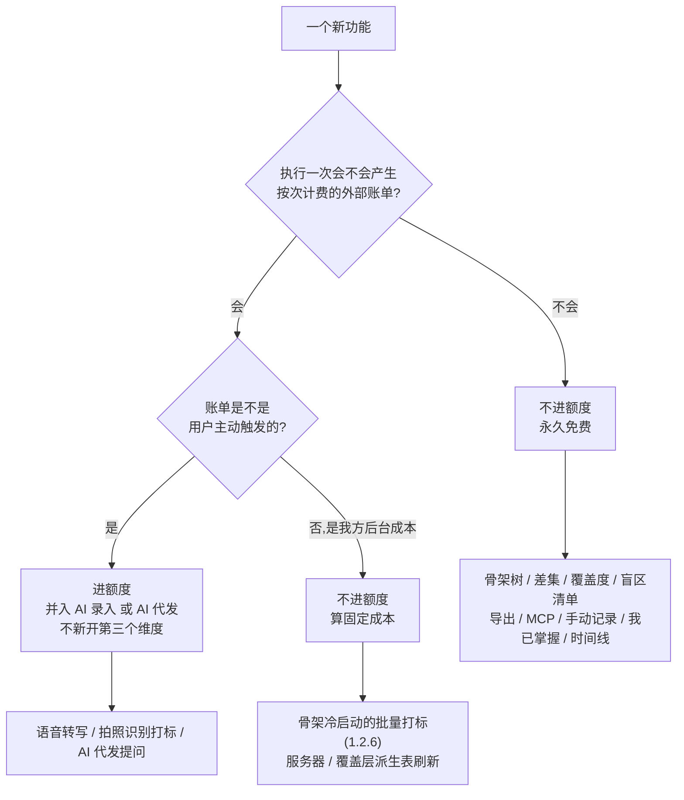
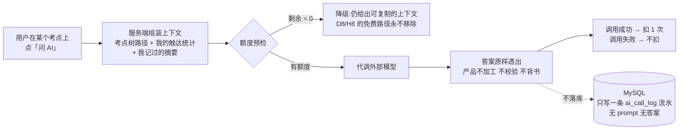

# 商业化与额度设计

> 这份文档只回答一个问题:**如果这东西要收钱,收什么、收多少、哪些永远不收。**
>
> **它比阶段 2 早两格,这一点必须先说清楚。** `实施路径` 把付费验证放在阶段 4(阶段 3 后),`执行清单` `L-D` 档与 `总路线图 · 脑图与父子待办` §2.4 把「支付 / 发票」同样放在阶段 3 后。而支付**通道**最早能存在的时点是阶段 2 之后——它依赖小程序,小程序依赖 `L-C` 档,`L-C` 依赖 ICP 备案。**阶段 0-2 一个支付界面都不需要,阶段 2 的 10 个用户是完全免费的**(`实施路径` §2.1 原文)。
>
> 那为什么现在写?因为其中两条是**不可逆决策**(§二),它们和原图红线一样属于「第一天不定、后面改不回来」;还有一条是**会污染阶段验收判据的陷阱**(`R-37`),必须在有人顺手加额度之前写下来。**其余全部是选型记录,不是待办。**
>
> **定价先只做一个付费档,这是刻意的临时状态,不是「想清楚了」。** 在没有任何真实用量分布之前,多定一档就是多猜一组数字,而多猜的那组数字会被当成结论引用。要不要第二档、第二档给多少,等 ¥9.9 档用户的**额度用尽率**有真实数据之后再决定(§4.4 / §八)。**代价也是明写的:单档没有价格锚点(`R-48`)。**
>
> **写完这份文档不构成任何进度。** 自检仍只看 `总路线图 · 脑图与父子待办` §六那一条:`1.1.4` 那张表有没有在填。
>
> **调研数据截至 2026 年 8 月,支付平台规则与佣金比例会过时。** 带 `⚠` 的项执行前必须复核。成本单价来自 `识别链路选型 · ASR 与图像识别` §二/§三 的实测,**AI 代发的单价是估算不是实测**,已在 §四 显式标注。

---

## 零、这份文档最早在哪个阶段才被执行

**这一节放在最前面,是为了防止它被当成待办清单。**

| 阶段 | 需要支付界面吗 | 依据 |
|---|---|---|
| 阶段 0(第 1-2 周) | **不需要。** 无界面、无账号、无库 | `实施路径` §阶段 0 |
| 阶段 1(第 3-8 周) | **不需要。** 单人自用,localhost | `技术架构与接口契约` §九 |
| 阶段 2(第 9-14 周) | **不需要。10 个用户完全免费** | `实施路径` §2.1「完全免费」 |
| 阶段 2 通过后 | 支付**通道**第一次可能存在:`L-C` 档启动小程序,`L-C` ⛔ ICP 备案 | `执行清单` `L-C` / `总路线图 · 脑图与父子待办` §2.3 |
| 阶段 3 通过后 | **付费验证本身在这里。** 微信支付开通、发票、税务 | `实施路径` §阶段 4 / `执行清单` `L-D` / `总路线图 · 脑图与父子待办` §2.4 |


**本文不重排任何一件事。** 合规轨的排期在 `执行清单` 与 `总路线图 · 脑图与父子待办`,商户号、类目、对公账户的时点在那里,本文只引用不搬运。

> **`实施路径` 阶段 4 的原问题没有被本文回答:** 「在有免费替代品(OneNote、Obsidian、AI 直接问)的前提下,有没有人肯为骨架和采集掏钱?」**定价表不是答案,它只是把问题变得可测。** 答案只能来自阶段 3 之后的真实付费行为。

---

## 一、定价与额度表

| 权益 | 免费 | 记多点 ¥9.9/月 |
|---|---|---|
| AI 录入(语音转写 / 拍照识别打标) | 30 次/月 | 300 次/月 |
| AI 代发提问 | 5 次/月 | 50 次/月 |
| 手动记录(记做题 / 粘一段自己挂考点) | 不限 | 不限 |
| 骨架树 · 覆盖 · 盲区诊断 | 不限 | 不限 |
| 导出 Markdown / CSV / JSON | 不限 | 不限 |
| MCP / CLI 只读接入 | 不限 | 不限 |

**这张表的形状比数字重要:上面两行有额度,下面四行没有——而下面四行才是产品的全部差异化。**

**只有一个付费档,而且这一档之上是空的。** 原先还有一个 ¥19.9 的上层档,**整档删除**,依据来自本文自己登记的 `R-39`:记多点的 300 次已经是 `识别链路选型 · ASR 与图像识别` 活跃假设的 2.2 倍,大多数付费用户碰不到天花板,那个上层档就没有购买理由。**删掉一个卖不动的档不是少赚,是少维护一组没有依据的数字。** 它的代价(没有价格锚点)见 `R-48`,它的副产品(最紧的安全倍数放宽)见 §4.5,以后要加第二档必须先过的规则见 §4.4。

三个必须一起读的口径:

| 口径 | 说明 |
|---|---|
| 额度按**自然月**重置,不按购买日滚动 | 少一套按用户周期计算的逻辑,`技术架构与接口契约` §5.5 的 `quota_period` 用 `period_ym` 一个列就够 |
| 额度**不结转、不透支、不可购买单次加油包** | 加油包是第三个计费维度,而 §三 只允许两个。要更多次数就升档;**而 ¥9.9 之上暂时没有档**——撞到天花板的人是加第二档的**依据**,不是现在就该被满足的需求(§4.4) |
| 额度耗尽**不影响记录动作** | 降级为手动记录,`1.3.7.1`「记录动作本身永不失败」不因商业化而改。**这是硬约束不是体验优化** |

---

## 二、永不上锁的两样东西 🔴

**这一节是全文最重要的一节。它记录的是两条不可逆决策,不是两条产品偏好。**

### 2.1 盲区诊断不进付费墙

北极星指标是 **主动查看盲区的人数**(`实施路径` §总览 / `总路线图 · 脑图与父子待办` `1.3.5.4`)。阶段 2 的第二个判据是 **看到缺口清单后点进去的比例 >30%**,`实施路径` §2.2 明确写着「第二个指标最关键」。

把盲区诊断放进付费墙,后果不是「少了些免费用户」,是:

| 后果 | 展开 |
|---|---|
| **用收费压住自己唯一的指标** | 北极星从「有多少人想看」变成「有多少人肯为看付钱」。这是两个指标,而后者不是产品在验证的东西 |
| **阶段 2 的判据永远无法再被测量** | 付费墙之后,「点进去的比例」里混进了支付转化率。`实施路径` §止损线 说阶段 2 的盲区点击率不过就停——**判据被污染的结果不是数字变差,是数字变得没有意义** |
| **`R-10` 的高发区** | 「点击率 28%,是不是付费墙拦掉了?」——一旦能这么解释,阶段验收就再也不会失败了。而一次永远不会失败的验收等于没有验收 |

### 2.2 导出不进付费墙

`项目现状与决策记录` §2.2 的原文是「数据开放:用户数据可完整导出」,`1.3.6.1` 把它落成「**无删减、无水印、不限次数**」。

**「不限次数」这四个字里没有留下任何可以插进一道计费的位置。** 导出一旦收费——无论是限次、加水印、还是只让付费用户导 JSON——`项目现状与决策记录` §2.2 的开放性承诺就是空话,而 `思考模式与选择框架` 记录的三个推理盲区里没有一条比「自己写下的承诺自己不认」更贵。

MCP 只读是同一条线的延伸:`项目现状与决策记录` §2.6 已经把它定成**营销资产不是收入来源**,对它收费等于把一个营销资产改造成一条又小又贵的收入线。

### 2.3 为什么这两条是「不可逆」

和 `项目现状与决策记录` §2.3 的原图红线同构:**上锁容易,解锁不可能。**

一个从第一天就免费的能力,后来收费叫「涨价」,用户会走但产品还在;一个从第一天就收费的能力,后来免费叫「降价」,但**在它收费的那段时间里,北极星指标已经被记错了,而那段数据是不可重建的。** 阶段 2 只能过一次。

| 决策 | 结论 | 何时改变 |
|---|---|---|
| 盲区诊断是否可进付费墙 | **永不** | **不改变。** 与「不做教研」同级 |
| 导出是否可进付费墙 | **永不** | **不改变。** `1.3.6.1` 的「不限次数」是字面意思 |

---

## 三、计费的是成本,不是价值

**收费维度只有两个,它们的共同点不是「用户觉得值钱」,是「每执行一次,我方会收到一张按次计费的外部账单」。**

| 维度 | 外部账单来自 | 单据 |
|---|---|---|
| **AI 录入** | 腾讯云一句话识别 + 多模态闭集分类 | `识别链路选型 · ASR 与图像识别` §二 实测单价 |
| **AI 代发提问** | 外接模型的一次推理调用 | 估算,见 §四 |

产品的核心价值——差集运算、骨架树、覆盖度、盲区排序——**边际成本近似为零**:一条 SQL(`技术架构与接口契约` §5.4)就是全部,**这条路径上没有任何一次外部模型调用**(导出同理,`技术架构与接口契约` §三 是流式直出,不落对象存储)。对它们收费是「按价值定价」,而按价值定价在这个产品上等于**对自己唯一的差异化点设一道摩擦**,理由已在 §二 说完。

### 3.1 判定规则(以后每加一个功能都跑一遍)



**一句话版本:这个动作会不会让我收到一张按次的外部账单?会,进额度;不会,永久免费。**

### 3.2 一个必须写下来的例外

**短信验证码是按次外部账单,而且是用户主动触发的,但它不进额度。** 因为对它计费等于对注册计费。它由 `1.3.1.1.3` 的频控与滑块管住,**不由额度管住**——频控解决的是薅羊毛,额度解决的是成本分摊,两者不能互相替代。

这个例外不削弱规则,它划出规则的适用面:**额度管的是「用得越多花得越多的能力」,不是「一次性的准入动作」。**

### 3.3 这条原则的代价,要认

它意味着:**产品最有价值的部分永远免费,收费的是最没有差异化的部分——调 API 谁都会。**

这个代价是被接受的,理由只有一条:**北极星指标是主动查看盲区的人数。** 商业模型必须服从指标,不能反过来。真正的护城河不在收费项里,在 `项目现状与决策记录` §2.6 那三样:采集端的脏活、骨架数据的持续维护、跨设备托管。**额度卖的是第一样,后两样靠它们让人留下来。**

---

## 四、单位经济测算

### 4.1 单价口径

⚠️ **本表的单价全部是 `识别链路选型 · ASR 与图像识别` §二/§三 的副本,本文不是它们的真源**(`文档规范与目录` §3.1「表格与数字不得跨文档复制」)。
留副本的理由只有一个:§4.2–§4.5 的边际成本、毛利率、盈亏平衡全部由它们算出来,不摆在这里就没法读。
**代价按 `文档规范与目录` §4.2 触发条件 2 明写在这里:`识别链路选型 · ASR 与图像识别` §二 的任何一个单价一变,本节以下四张表全部即刻过期,
不需要另行判定** —— 改单价的那次改动负责回来扫这四张表。


| 项 | 单价 | 性质 |
|---|---|---|
| 图片识别(多模态一步到位) | ¥0.0022–0.0053/张 | **`识别链路选型 · ASR 与图像识别` §二 实测。** 低值为考点树 prompt 缓存命中,高值为高峰、无缓存 |
| 语音转写(腾讯云一句话识别) | ¥0/次(账户级免费额度 5,000 次/月内)· ¥0.0032/次(超出) | **`识别链路选型 · ASR 与图像识别` §二 实测** |
| **AI 录入 · 加权单价** | **保守 ¥0.004/次 · 乐观 ¥0.0007/次** | 按 `识别链路选型 · ASR 与图像识别` §三 的语音:图片 = 2:1 推算 |
| **AI 代发提问 · 单价** | **≈¥0.02/次(¥0.016–0.022)** | ⚠ **估算,不是 `识别链路选型 · ASR 与图像识别` 的实测值** |

**AI 代发单价的推导过程(必须留在这里,否则以后没人知道它是怎么来的):**

按 `识别链路选型 · ASR 与图像识别` §二 的 `deepseek-v4-flash` 档价(输入 · 缓存未命中 $0.44/M,输出 $1.32/M,汇率 ~7.1),上下文约 2–4k tokens 输入 + 约 1k 输出:

```
中值 3k 输入:  3,000 × $0.44/M = $0.00132
    1k 输出:  1,000 × $1.32/M = $0.00132
    合计     ≈ $0.00264 × 7.1 ≈ ¥0.019   → 取 ¥0.02/次
    区间     ¥0.016(2k 输入)– ¥0.022(4k 输入)
```

> ⚠ **这个数字有一个巨大的前提:代发走的是 flash 档模型。** 换成推理模型,单价会翻 5–20 倍,而 §4.5 的敏感度表说明**代发这一格只有 7.5 倍余量**(全表最紧的一格是录入的 6.4 倍)。**所以 §五 的模型选择不是技术问题,是定价问题。**

### 4.2 免费档与记多点的满额边际成本

按**保守单价**、**用户把额度用光**计算——是上界,不是期望值。

> ⚠ **但只在录入那一列是真上界。** 录入用的 ¥0.004 是区间高值,代发用的 ¥0.02 是区间**中值**(§4.1 的区间是 ¥0.016–0.022)。若代发按 ¥0.022 取,记多点的满额边际成本是 ¥2.30 不是 ¥2.20,iOS 毛利率 64.8% 不是 65.8%(§4.3 取整作 66%)。**差 1 个百分点,不改变结论,但别把这张表当成最坏情况引用**——真正的最坏情况在 §4.5。

| 档位 | 月售价 | AI 录入额度 | 代发额度 | 录入成本 | 代发成本 | **满额边际成本** |
|---|---|---|---|---|---|---|
| 免费 | ¥0 | 30 | 5 | ¥0.12 | ¥0.10 | **¥0.22** |
| 记多点 | ¥9.9 | 300 | 50 | ¥1.20 | ¥1.00 | **¥2.20** |

**满额边际成本占售价 22.2%(¥2.20 / ¥9.9)。这个比例是 §4.4 那条规则的基准线,以后任何新档都必须低于它。**

### 4.3 微信费率后到手与毛利率 —— 必须分端看

| 档位 | 渠道 | 通道抽成 | 到手 | 满额边际成本 | 毛利 | **毛利率** |
|---|---|---|---|---|---|---|
| 记多点 ¥9.9 | 非 iOS | 约 0.6% 标准费率 | ¥9.84 | ¥2.20 | ¥7.64 | **77%** |
| 记多点 ¥9.9 | **iOS** | **12% 苹果佣金** | ¥8.71 | ¥2.20 | ¥6.51 | **66%** |

> **口径别中途换:毛利率 = 毛利 / 售价,不是毛利 / 到手。** 77% = 7.64 / 9.9,66% = 6.51 / 9.9。用到手做分母会把 iOS 那一行算成 75%,看着好看,但那样渠道抽成就凭空消失了。

> ⚠ **一个必须在开通商户号时复核的口径:** 上表假设 iOS 走小程序虚拟支付的苹果通道时,微信侧不在 12% 之上再叠一道标准费率。这是按 2026-08 的公开规则理解的,**没有书面确认**。若两者叠加,iOS 那一行的毛利率再降约 0.6 个百分点——不改变结论,但要知道数字是怎么来的。已登记为 `R-44`。

**分端毛利率差 11 个百分点。这就是 iOS 12% 的全部代价,而它对 2-3 人的团队来说是可承受的、且不可谈判的。**

### 4.4 以后加第二档时必须遵守的规则

**这一节原本论证的是「为什么上层档给 2.7 倍额度而不是 3 倍」。那个档已经整档删掉(§一),算例作废——但算例推出来的规则不作废,而且那条规则才是这一节存在的全部理由。**

> **规则:上层档位的边际成本增速必须低于价格增速。**
> 可操作的形式:**满额边际成本占售价的比例必须逐档下降**,不能持平、更不能上升。当前基准是 ¥9.9 档的 **22.2%**(§4.2)。

**一个不体面但必须记下来的事实:被删掉的那个上层档,按这条可操作形式本来就不合格。** 它的满额边际成本占售价 31.2%,比 22.2% 高出九个百分点——价格涨 2.01 倍而边际成本涨 2.82 倍,正是规则禁止的方向。**规则当时写下来了,却没有被用来检验写下它的那一档。** 这不是给规则减分,是给它加分:**它本来就能提前判掉那一档,只是没人拿它去判。**

作废的算例里唯一还站得住的部分是它的量级,而上一段已经把它算完了:**成本占售价从 22.2% 抬到 31.2%,毛利率就在两个渠道上同时掉 8.9 个百分点**(iOS 65.8%→56.8%,非 iOS 77.2%→68.2%)。占比涨几个点、毛利率掉几个点,是同一个减法,不需要另算一遍。由此两层结论,两层都与档位数量无关:

1. **同一档里把毛利从 77% 压到 66% 的是 iOS 的 12%(§4.3,差 11.4 个百分点);跨档时,倍数放额度这一头是 8.9 个百分点——只比渠道那一头小三成,不是数量级差距。** 想在毛利上省钱,先看渠道结构仍然对;但**「额度那几百次不要紧」是错的**,而这正是上面那条规则要拦的东西。
2. **那为什么在只剩一档的时候还要把这条规则留着?** 恰恰因为现在只有一档——**没有上层档位,这条规则就没有任何反对者**,写下来不需要跟「这样定用户会不买」妥协。等真要加第二档、第三档的时候,「每档按倍数放」会把毛利率一路吃穿,而**那时候再改额度就是对已付费用户降配。这条规则现在写下来是免费的,以后写要付代价。**

加第二档前的三条自检,**全过才加**:

| # | 自检 | 不过怎么办 |
|---|---|---|
| 1 | 新档的满额边际成本占售价比例是否**低于 22.2%** | 不低就重定额度,**不是重定价格**——价格是拿来验证付费意愿的,不是拿来补毛利的 |
| 2 | ¥9.9 档用户的**额度用尽率**是否已有 ≥3 个月真实数据 | 没有就不加。加档的依据是撞顶的人,不是「多一档能多赚」(§八) |
| 3 | 撞顶的是不是**同一批人反复撞**,而不是一次性峰值 | 是峰值就不加——**加档解决的是持续高用量,不是偶发峰值**,而偶发峰值的所有解法(结转、加油包)已被 §一 与 §三 否掉 |

### 4.5 盈亏平衡敏感度(最坏一格:iOS · 满额消耗)

每一行都是「另一维取当前值、这一维涨到毛利归零」的单价。**能被成本吃掉的预算是 iOS 到手的 ¥8.71,不是售价 ¥9.9** —— 这一节算的是「成本吃光到手金额」的临界点,与 §4.3 毛利率拿售价做分母是两个不同口径,别互相套用。

| 变量 | 当前估算 | 记多点 · iOS 平衡单价 | **安全倍数** |
|---|---|---|---|
| AI 代发 | ¥0.02/次 | (8.71 − 300×0.004) / 50 = **¥0.150/次** | 7.5× |
| AI 录入 | ¥0.004/次 | (8.71 − 50×0.02) / 300 = **¥0.0257/次** | **6.4×** |

**最紧的一格是 6.4 倍。** 单价涨到现在的 6.4 倍之前,最差情况(唯一的付费档 · iOS · 用户把额度用光)都还有毛利。

**一个值得单独记下来的副产品:砍掉上层档位,把最紧的一格从 4.5× 放宽到 6.4×。** 原因不是省了钱,是**原先最紧的那一格就长在上层档上**——那一档的额度倍数放得比价格倍数快(§4.4 那条规则的反面),于是它同时是毛利最薄的一档和风险敞口最大的一档。**删掉它等于把全表最脆的一格连同它的购买理由一起删了。**

> **但这个「放宽」得读准,别当成利好:¥9.9 档自己一直就是 6.4×,一次都没动过。** 变的只是「全表最紧的一格」这个统计量的取值范围——**是敞口消失了,不是余量变大了。** 单价真涨 6.4 倍时,唯一的付费档照样归零。

**但「代发换一个推理模型」这一个动作仍然能吃掉 5–20 倍——6.4× 挡得住 5×,挡不住 20×。** `R-42` 不因为砍档而降级。

### 4.6 免费额度的真实作用是成本封顶,不是转化杠杆

`识别链路选型 · ASR 与图像识别` §三 的活跃假设是每天 3 条(语音 2 + 图片 1)= **135 次 AI 录入/月**。对照:

| | 额度 | 折合日均 | 对 `识别链路选型 · ASR 与图像识别` 活跃假设的倍数 |
|---|---|---|---|
| 免费 | 30 次/月 | **约 1 次/天** | **0.22×** |
| 记多点 | 300 次/月 | 约 10 次/天 | 2.2× |

两个结论,一个好一个坏:

- **好的:** 免费额度把免费用户的成本从「无上界」压到 ¥0.22/人/月,1,000 个满额免费用户 = ¥220/月(封顶值,不是期望值)。**免费额度买的是成本确定性。**
  > ⚠ **两个口径必须说破,否则这个对比会被读错。** `识别链路选型 · ASR 与图像识别` §三 那个 ¥510/月 **只含 AI 录入、不含代发**,可比的是本档的录入部分 ¥120/月(30 × ¥0.004 × 1,000),不是 ¥220。而且 **¥510 是「按每天 3 条的活跃假设算出来的期望值」,不是上界**——没有额度时真正的上界是无穷,这才是额度存在的理由。**不要把 ¥220 vs ¥510 当成「省了 57%」来引用。**
- **坏的:** **记多点的 300 次是活跃假设的 2.2 倍,大多数付费用户根本碰不到它的天花板。** 这条原来的形式是「那 ¥19.9 档就没有购买理由」,而上层档已经被删掉(§一)——**问题没有跟着一起消失,它只是换了个表现形式:** 天花板碰不到,说明额度相对真实用量定得太松;若真实用量低于 `识别链路选型 · ASR 与图像识别` 的活跃假设,那免费的 30 次就已经够用,**唯一的付费档就没有被需要的那一刻**。同一个根因,从「上层档卖不动」变成「付费档卖不动」。`R-39`(编号沿革见 §九)。**这条只能靠阶段 3 之后的真实用量分布关掉,现在不要靠调数字去猜。**

> 🔴 **还有一条更硬的,单独列出来:免费档 30 次/月 ≈ 日均 1 次,而阶段 0 的判据是「日均 ≥3 条」。** 额度只要在阶段 2 之前生效,阶段 0 必然不通过——不是因为地基不成立,是因为额度把它卡住了。`R-37`。

---

## 五、AI 代发提问的能力边界

### 5.1 链路是三步,产品只做第一步和第三步的搬运



**产品不产出任何学科内容。** 这与 `项目现状与决策记录` §2.2「不做教研:不产出学科讲解,学科判断外包给外接模型」逐字一致,与 `总路线图 · 脑图与父子待办` §三b「组装上下文交给外接模型 / 不自己产出学科内容」逐字一致。**它不构成红线变更,它是那条红线的既有表述的一次实现。**

### 5.2 和 `R-05` 的关系,必须说破

`R-05` 是「产品判断『对不对』」。代发的答案里当然有对错判断——**但那是模型说的,不是产品说的。** 这个区分只有在界面上成立才算数:

| 要求 | 落在哪 |
|---|---|
| 答案区必须显式标注来源模型,与产品自身的输出在视觉上可区分 | 界面需求,不是文档条款 |
| 产品不对答案做任何摘要、评分、"重点提示"式再加工 | 一旦再加工,产出的就是产品的学科内容了 |
| 答案不参与覆盖度计算,不生成 `record_tag` | 问过 ≠ 学过。它连行为层都不进 |
| **须公示所用模型的名称与备案号/上线编号** | `L-C8` / `识别链路选型 · ASR 与图像识别` §五。代发让这条义务从「后台用了模型」变成「用户直接读到模型输出」,**公示位从可选变成必需** |

### 5.3 它是 D8/H8 的付费增强版,不是新能力

`D8`/`H8`「问 AI 时带上的东西」(demo 与设计稿里的编号,决策层与 `技术架构与接口契约` 都未收录)已经存在:产品把上下文组装好,用户**复制出去自己粘**到豆包、Qwen、ChatGPT。

代发做的唯一一件事,是把「复制出去自己粘」变成「点一下直接发」。

| | 免费路径(D8/H8) | 付费路径(AI 代发) |
|---|---|---|
| 上下文组装 | ✅ 一样 | ✅ 一样 |
| 谁去调模型 | 用户自己 | 我方代调 |
| 谁付 token 钱 | 用户(或用户的免费额度) | 我方 |
| 答案质量 | 一样 | 一样 |

**免费复制路径永不移除。** 理由和 §二 同构:如果代发上线时顺手把复制按钮撤了,那就等于把「能问 AI」这件事整体锁进了付费墙,而 §三 的规则说得很清楚——**组装上下文是零边际成本的,它不该计费。计费的只有「我方替你付了那次 token」。**

### 5.4 答案不落库,这是有意的

`技术架构与接口契约` §5.1 已经禁用了全库的 `TEXT` / `JSON` 大字段,**所以库里根本没有一个字段能装下一段模型答案。** 这不是限制,是设计:

- 答案落库 → 库里出现学科内容 → `R-06`「存储机构课程内容」的近亲,而且是自己造的
- 答案落库 → 「按答案质量给考点排序」只差一条 SQL → `R-05`
- 落库的只有 `ai_call_log` 一行:谁、什么时候、哪个模型、成功还是失败、花了多少微元。**没有 prompt,没有答案。**

**代价是真实的:用户刷新页面答案就没了。** 要留就自己复制走——这与 `项目现状与决策记录` §2.2「不碰内容」是同一条线,也与 `技术架构与接口契约` §5.1「这会让『回看我当时记了什么』的体验变弱,这是有意付出的代价」是同一种取舍。

---

## 六、支付合规(2026-08 调研,会过时)

> **本节全部内容截至 2026 年 8 月。微信支付与小程序的平台规则变动频繁(`R-22`),执行前必须整节复核一次。** 本节只记结论与它对产品的约束,**不重排 `执行清单` 的合规轨排期**。

### 6.1 三条硬事实

| 事实 | 对产品的约束 |
|---|---|
| **微信小程序虚拟支付 2026-04-01 起全终端强制接入** | 不再有「只在安卓收钱、iOS 引导别处」这种选项。要在小程序里卖,就得全终端走虚拟支付 |
| **会员订阅、AI 工具点数属虚拟商品** | 本产品的两个收费维度(会员档位 + AI 额度)**都在虚拟商品范围内**,没有一个能按实物商品报 |
| **iOS 渠道 12% 苹果佣金**(2026 年从 15% 降至 12%) | §4.3 的分端毛利表。**这是渠道成本,不是可优化项** |

### 6.2 🔴 不得引导用户至外部完成支付

**不得在小程序内以任何形式引导用户至 APP / 公众号 / H5 / 外部网站完成支付。** 包括但不限于:文案暗示、二维码、跳转链接、客服话术、"网页版更便宜"。

**小程序必须自带完整支付路径。** 这条是红线不是建议——它同时踩平台规则与 `项目现状与决策记录` §2.4 已定的形态结论。已登记为 `R-36`。

顺带一条推论:**不做分端差价。** iOS 抽 12%、非 iOS 抽 0.6%,看起来「iOS 卖贵一点」是自然的补偿,但那正是平台规则要防的引导行为——**分端差价本身就是一条指向外部支付的箭头。** 同价,毛利差认了。

### 6.3 自动续费(委托代扣)初期开不了

| 门槛 | 我方状态 |
|---|---|
| 企业主体 | ✅ 已有(`执行清单` `L0`「主体已就位」;**`项目现状与决策记录` §三 没有这一条,别往那儿引**) |
| 微信支付认证客服电话 | ⚠ 待办,`L-D` 档 |
| 标准费率(结算周期不调整) | ⚠ 待确认 |
| **最近 4 自然周去重付费用户 ≥300** | ❌ **阶段 3 的判据是累计 ≥50 个陌生注册。300 个付费用户在阶段 3 之后还有很长距离** |
| **投诉率 ≤0.05%** | ❌ 没有付费用户就没有这个数,连分母都没有 |

**结论:本期只做手动续费。**

**而且要把「不自动扣费,到期就停」当卖点写在界面上,不是当缺陷藏在协议里。** 国内订阅类产品最集中的投诉恰好是「自动续费难取消」,这个约束刚好落在用户不满的那一侧。**但卖点成立的前提是明说** ——写在购买页而不是用户协议第 14 条。

**何时重新评估自动续费:**

| 触发条件 | 说明 |
|---|---|
| 连续 4 自然周去重付费用户 ≥300,且投诉率 ≤0.05% | 平台门槛本身。**这两个数字必须同时满足,不是先攒用户再治投诉** |
| 手动续费的月续费率已被测量过至少 3 个月 | 没有基线就无法判断自动续费带来的提升是真的还是错觉 |
| 客服电话与标准费率两项已完成 | `L-D` 档 |

**三条全满足才评估,不是满足一条就去申请。** 与 `技术架构与接口契约` §2.3「满足两条以上才评估」是同一种纪律。

### 6.4 与 `执行清单` 合规轨的衔接(引用,不重排)

| 事项 | 在哪 |
|---|---|
| 小程序注册、认证、类目选「工具 / 效率」不选教育 | `执行清单` `L-C1`-`L-C3` / `总路线图 · 脑图与父子待办` §2.3 / `R-16` |
| 业务域名校验(域名主体须与小程序主体一致) | `执行清单` `L-C4` |
| 微信支付 / 支付宝开通(需对公账户 + 类目匹配) | `执行清单` `L-D` 档 |
| 发票与税务 | `执行清单` `L-D` 档 |
| 对公账户状态核对 | `执行清单` `L0-3` / `总路线图 · 脑图与父子待办` `2.1.2.5` |
| 生成式 AI 公示位 | `执行清单` `L-C8` / `识别链路选型 · ASR 与图像识别` §五。代发让它从可选变必需(§5.2) |

> ⚠ **一个需要在 `L-C3` 执行时一起想的冲突:** 类目定的是「工具 / 效率」不是「教育」(`R-16`,教育类目约 60% 需办学许可)。而**虚拟支付的商品类目审核是另一套口径**——"AI 工具点数" 能不能在"工具/效率"类目下正常过审,`执行清单` 与 `总路线图 · 脑图与父子待办` 都没有覆盖。已登记为 `R-40`,**在 `L-C3` 提交前一次问清,不要分两次问。**

### 6.5 取证状态:本节比 `识别链路选型 · ASR 与图像识别` 弱一档

**`识别链路选型 · ASR 与图像识别` §七 给出了每一条价格的原始出处链接,本节没有。** 6.1 的三条硬事实来自 2026-08 对微信开放社区与小程序虚拟支付规则页的一次性检索,**没有逐条留存链接与抓取日期**。

这不是格式问题,是证据强度问题:

| | `识别链路选型 · ASR 与图像识别` 的价格数据 | 本节的平台规则 |
|---|---|---|
| 出处 | 逐条列了 URL | **未留存** |
| 变动频率 | 中(降价为主) | **高**(`R-22` / `R-45`) |
| 用错的后果 | 成本估偏 | **上不了架,或上架后被下** |

**所以本节的复核标准比 `识别链路选型 · ASR 与图像识别` 更严:`L-C`/`L-D` 执行前不是「看一眼有没有变」,是当作没查过重新查一遍,并把 URL 补进来。** 已并入 `R-45`。

---

## 七、手动续费的代价与缓解

### 7.1 代价是结构性的,不是体验问题

**订阅制的核心机制是「默认继续」,手动续费是「默认停止」。**

每个月要用户重新做一次购买决策——**那就是每个月一次流失机会。** 这不是可以靠提醒文案抹平的差距:自动续费的月流失是「主动取消的人」,手动续费的月流失是「没想起来的人」+「想起来但当月不想付的人」,后者的基数大得多。

**单档与手动续费叠加之后,用户每个月可选的动作只剩两个:买,或不买。** 多档定价至少还留着「降一档继续用」这个中间态,那个中间态同时干两件事——**它是一个留存动作,也是判断「¥9.9 贵不贵」的内部参照物。** 现在两件都没有:续费决策是全有或全无,而定价决策没有锚点(`R-48`),用户只能拿外部产品来比,而外部比对物是谁、贵还是便宜,我方完全不可控。**这两个问题各自都能忍,叠在一起会互相放大。**

**这条没有好的缓解方案,只有三个不完整的。**

### 7.2 三个缓解,按有效性排序

| # | 缓解 | 有效性 | 代价 |
|---|---|---|---|
| 1 | **评估年付档** | 最高。把 12 次流失机会压成 1 次 | 价格待定,见 7.3;且会削弱「到期就停」这个卖点 |
| 2 | 到期前提醒(站内 + 微信服务通知) | 中。只能救「没想起来」那部分 | **不得变成骚扰。** 一次到期前提醒 + 一次到期提醒,上限就是两条 |
| 3 | 把「不自动扣费」明确写成卖点 | 低,但免费 | 只有写在购买页才算数 |

### 7.3 年付档:标为待定,不发明价格

**本文不给年付价格。** 定价必须等真实的月续费率数据,而那要到阶段 3 之后。

**定价时该考虑的六件事(现在写下来,免得到时候拍脑袋):**

| # | 考虑项 | 为什么它在这个产品上特殊 |
|---|---|---|
| 1 | **备考周期有终点** | 公考、考研都有确定的考试日期。年付跨过考试日,就是在卖用户明知不需要的月份。**这与其它 SaaS 的年付逻辑根本不同**,大多数 SaaS 没有这个天然终点 |
| 2 | `项目现状与决策记录` §四 修正后的年流失 40-60% | 年付折扣的上限,是它锁住的那部分留存所带来的收益。折扣给过头,等于给本来就会续的人发钱 |
| 3 | **手动续费下的实际月续费率** | 这才是年付价值的分母。**没有这个数就没有定价依据**,只能拍脑袋 |
| 4 | 虚拟商品的退款义务 | 年付是预收 12 个月。退款规则怎么写、退多少,是律师稿的事(`L-A5` / `L-D`) |
| 5 | iOS 12% 对年付的影响 | 按笔抽成,年付一次抽一次——**对毛利率没有差异,对现金流有**(一次性拿到 12 个月的钱) |
| 6 | 它会削弱 6.3 的卖点 | 「不自动扣费、到期就停」在年付上说服力弱得多。**两个卖点不能同时最大化,要选一个主打** |

> **一条纪律:年付档在阶段 3 之前不要设计界面。** 它现在的状态是「已知的缓解方向」,不是「待实现的功能」。

---

## 八、建议登记到 `项目现状与决策记录` §7 决策日志的行

> **本文不修改 `docs/决策记录`。** 下表是**建议**,由人决定是否并入。每一行都带「何时改变」列,格式与 `项目现状与决策记录` §7 现有行一致。

| 决策 | 结论 | 何时改变 |
|---|---|---|
| 盲区诊断的付费墙 | **永不上锁** | **不改变。** 上锁会污染北极星指标与阶段 2 判据,而那段数据不可重建 |
| 导出的付费墙 | **永不上锁** | **不改变。** `1.3.6.1` 的「无删减、无水印、不限次数」是字面意思 |
| 计费维度 | 只对**真实产生按次外部账单**的动作计费,当前只有 AI 录入与 AI 代发两维 | 出现第三类真实按量外部成本时可新增一维;**价值型收费一律不新增** |
| 定价档位 | **先只做一个付费档:免费 / ¥9.9 两档**,额度见 `商业化与额度设计` §一 | ¥9.9 档用户的**额度用尽率**有至少 3 个月真实数据之后,再决定加不加第二档,加之前跑 `商业化与额度设计` §4.4 的三条自检。**若撞顶比例长期很低,该动的是降额度或降价,不是加高档**——撞不到天花板的人不会为更高的天花板付钱。**数字可改,维度不可改** |
| 续费方式 | **只做手动续费**,并把「到期就停」作为卖点 | `商业化与额度设计` §6.3 的三条触发条件**同时**满足后重新评估自动续费 |
| 分端定价 | iOS 与非 iOS **同价**,不做分端差价 | **不改变。** 分端差价本身就是一条指向外部支付的箭头 |
| AI 代发的能力边界 | 只组装上下文 + 代调 + 原样透出,**产品不产出学科内容**;免费复制路径永不移除 | **不改变。** 与「不做教研」同级 |
| 年付档 | **待定,不定价** | 手动续费的月续费率有至少 3 个月真实数据之后 |
| 商业化界面的最早时点 | 阶段 2 前不做任何支付/额度界面 | **不改变。** 见 `R-37`:额度提前生效会让阶段 0 必然不过 |

---

## 九、风险登记(建议并入 `总路线图 · 脑图与父子待办` §四)

> ⚠ **编号说明:`R-35` 已被 `总路线图 · 脑图与父子待办` §四 的「视觉模型是实验版本」占用,故本文从 `R-36` 起编。** 新风险按 `总路线图 · 脑图与父子待办` 的既有约定统一收在那里,本节只是待并入的草稿。

### 🔴 红线 · 触碰即终止或违法

| ID | 风险 | 挂接节点 | 防线 |
|---|---|---|---|
| `R-36` | **小程序内引导用户至 APP / 公众号 / H5 / 外部网站完成支付** | `L-C` 档 / `商业化与额度设计` §6.2 | 小程序自带完整支付路径;**不做分端差价**(差价本身就是引导);客服话术一并纳入检查 |
| `R-37` | **额度在阶段 2 之前生效 → 污染阶段 0 与阶段 2 的判据** | `1.1.4` / `1.3.5` / `商业化与额度设计` §4.6 | 免费档 30 次/月 ≈ 日均 1 次,而阶段 0 的判据是**日均 ≥3 条**——额度提前生效,阶段 0 必然不过,而且会被误读成「地基不成立」。**阶段 0-2 不实现任何额度计数**,`技术架构与接口契约` §5.5 的表在阶段 2 后才建 |

> `R-37` 为什么算红线而不是高危:`总路线图 · 脑图与父子待办` 对 🔴 的定义是「触碰即终止或违法」。**它确实会导致终止**——`实施路径` §止损线 写着「阶段 0 不通过 = 停」,而这次「停」的原因是自己设的额度,不是需求不成立。**一个被自己污染的阶段,和一个通不过的阶段,在决策上无法区分。**

### 🟠 高危 · 会导致方向作废或重大返工

| ID | 风险 | 挂接节点 | 早期信号 / 处理 |
|---|---|---|---|
| `R-38` | **手动续费导致流失** —— 每月一次主动决策 = 每月一次流失机会 | `商业化与额度设计` §七 | 结构性,无完整缓解。年付档是最有效的一个,但**价格待定且需真实续费率数据**。信号:首月续费率显著低于同类订阅产品 |
| `R-39` | **额度相对真实用量定得过松 → 唯一的付费档没有被需要的那一刻**<br/>**编号沿革:** 原文是「额度设计过松 → ¥19.9 档没有购买理由」。上层档已按这条风险整档删除(§一),**风险本身没有关闭,只是变形**——同一个根因换了个受害者,故沿用 `R-39` 不另起编号 | `商业化与额度设计` §一 / §4.6 | 300 次仍是 `识别链路选型 · ASR 与图像识别` 活跃假设(135 次/月)的 2.2 倍;真实用量若低于活跃假设,免费的 30 次就够用。信号:付费用户额度使用率中位数 <30%,或免费用户月均触顶比例长期极低。**只能靠阶段 3 后的真实用量分布关掉,不要靠猜着调数字**(`R-10` 的同类错误)。**关掉它的动作是降额度或降价,不是加档** |
| `R-40` | **虚拟支付的商品类目审核不通过,或与「不选教育」冲突** | `L-C3` / `L-D` | 类目定的是「工具 / 效率」(`R-16`),但"AI 工具点数"在虚拟支付下是另一套类目口径,`执行清单`/`总路线图 · 脑图与父子待办` 均未覆盖。**在 `L-C3` 提交前一次问清,不要分两次问** |

### 🟡 关注 · 有缓解方案

| ID | 风险 | 缓解 |
|---|---|---|
| `R-41` | **iOS 12% 苹果佣金侵蚀毛利** —— 毛利率从 77% 降到 66% | 不可谈判的渠道成本。**同价、不做分端差价**(否则触 `R-36`)。缓解只有一条:非 iOS 端的自然占比越高越好,而这与 `项目现状与决策记录` §2.4「Web 为主」的形态结论方向一致 |
| `R-42` | **AI 代发单价是估算,换推理模型会翻 5-20 倍** | §4.5:最紧的安全倍数是 6.4×(砍掉上层档后从 4.5× 放宽而来)。**6.4× 挡得住 5×,挡不住 20×**。**代发的模型选择要按定价来定,不是按效果来定**;上线前用 100 次真实调用测出实际单价,替换掉本文的估算 |
| `R-43` | **免费档被批量注册薅** —— 30 次/月 × N 个小号 | 由 `1.3.1.1.3` 的频控与滑块管住,**不由额度管住**(§3.2)。信号:注册数与 `1.3.5.1` 的 7 日行为事件比例背离 |
| `R-44` | **iOS 通道费率口径未书面确认** —— 12% 之上是否再叠标准费率 | §4.3 已标注。开通商户号时复核一次,影响约 0.6 个百分点,不改变结论 |
| `R-45` | **支付平台规则会变,且本文没留出处** —— §六 数据截至 2026-08,**未逐条留存 URL**(§6.5) | 与 `R-22`(小程序平台规则变动)同源。**`L-C`/`L-D` 档执行前当作没查过重查一遍,并把出处补进 §六** |
| `R-48` | **只有一个付费档 → 没有价格锚点** —— 用户判断「¥9.9 贵不贵」时没有任何内部参照物,只能拿外部产品比,而拿谁比、那东西贵还是便宜,**我方完全不可控**。这是砍掉上层档实实在在的代价,**不是顺带的小问题**(编号新起,不占用 `R-36`-`R-47`) | 代价是认下来的:换掉的是一个本来就卖不动的档(`R-39`)与全表最脆的一格(§4.5)。与手动续费叠加后,用户可选动作只剩「买 / 不买」(§7.1),锚点缺失被放大。缓解只有一条且很弱:**购买页把额度换算成用量而不是价格**(300 次 ≈ 日均 10 次),用**用量**做锚点顶替**价格**锚点。真正的解只能是阶段 3 后按真实用量分布决定加不加第二档(§4.4 / §八)。**在那之前不要为了造锚点而凭空加一档——那是先有锚点再找理由** |

### ⚪ 待确认 · 需外部输入

| ID | 事项 | 谁来关 | 何时 |
|---|---|---|---|
| `R-46` | 自动续费(委托代扣)的资质门槛与开通条件 —— 客服电话、标准费率、去重付费用户 ≥300、投诉率 ≤0.05% | 微信支付侧 | §6.3 的三条触发条件满足时,**不提前问** |
| `R-47` | 年付档的价格与退款规则 | 你 + 律师(`L-A5` / `L-D`) | 手动续费月续费率有 ≥3 个月数据后 |

---

## 十、这份文档最容易被用错的方式

`思考模式与选择框架` §盲区二 的原文:**注意力单向流向能动手做的部分,而不是最不确定的部分。**

**商业化文档是这个失败模式的顶级高发区**,而且比架构文档更危险——架构文档至少还只是"能动手做",商业化文档给的是**一种已经在赚钱的错觉**。定价表看起来像一个决策,毛利率算出来像一个成果,而实际上:

**这里面没有一个数字来自真实用户。** ¥9.9 是猜的,300 次是猜的,30 次是猜的,毛利率是从这些猜的数字里算出来的,连"有人肯掏钱"这个前提本身都还没被验证过——`实施路径` 阶段 4 的原问题一个字都没变。

**还有一个这一版新增的用错方式:把「先做一档」当成「已经想清楚了」。** 砍掉上层档消掉的是一个已登记风险的**旧形式**(`R-39`),不是把定价想明白了;同一次动作还新欠下一个价格锚点(`R-48`)。**一个付费档是待验证的起点,不是结论。少一个数字要猜,不等于剩下的数字更靠谱。**

四条自检:

1. **有没有开始画支付界面。** 阶段 2 之前一屏都不该有(§零)。
2. **有没有开始调数字。** 「¥9.9 是不是有点低」「300 次会不会太多」「是不是该再加一档」——这是 `R-10` 的完整形态,只不过换了一个变量。**定价不是变量,付费意愿才是。**
3. **有没有把「一档」当成简洁的设计成果。** 它是信息不足时的最小承诺,`R-48` 就挂在它上面。
4. **`1.1.4` 那张表有没有在填。** 这条从 `执行清单`、`总路线图 · 脑图与父子待办`、`技术架构与接口契约` 一路抄到这里,一个字没改。

**阶段 0 都还没过。**

**产品不是变量,需求才是。**
