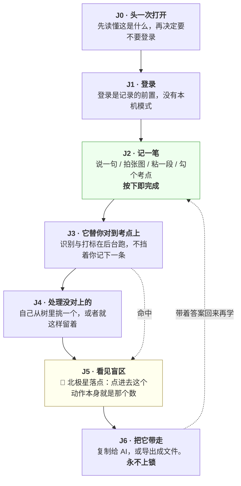
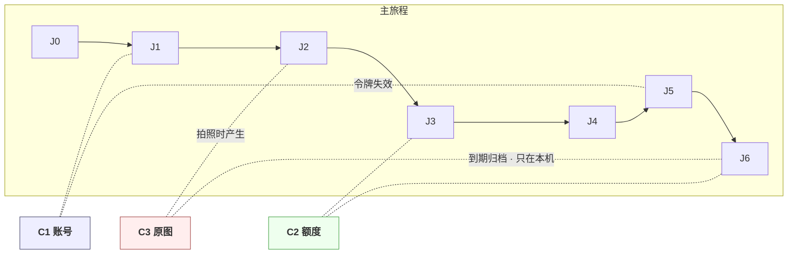

# 用户价值与主流程

> **基线**：`origin/v1` @ `73041df`，fetch 于 2026-09-02。
> **状态：活跃。** 旅程节点增删、或某个模块服务的节点变化，本文同一次改动内更新。
> **过期判定**：§四 那张「模块 → 旅程节点」表里出现一个填不出节点号的模块，即为过期。
>
> **上一层**：[产品总纲](INDEX.md) ｜ **下一层**：[模块地图](modules/INDEX.md)
> 本文不定义任何字段、错误码、界面原文，也不写跨模块技术不变量（那在模块地图 §三）。

---

## 一、用户是谁，他现在怎么办，卡在哪

### 1.1 一个人

**在职或全职备考公考 / 考研，同时在用不止一个来源。** 典型的一周：粉笔刷题、B 站看网课、
线下班一次、自己买的书两章。四个来源，四套进度，互不知道对方。

这个人不缺题、不缺课、也不缺讲解 —— 那三样市面上多到过剩。他缺的是一句话的答案：
**「整张考点表，我到底还有哪儿没碰过。」**

### 1.2 他现在怎么解决

三种，都不成立：

| 现在的办法 | 为什么不成立 |
|---|---|
| 看某一家 App 的学习报告 | 只算得出在这一家学了什么。他在别处学的，这家结构上看不见 |
| 自己拉一张 Excel 手动打勾 | 记一次的成本高到不可持续。坚持两周就停了 —— 而两周正是这个产品自己的第一道关卡 |
| 凭感觉 | 感觉会系统性偏向「最近学过的」，而盲区恰好全在「很久没碰的」那一侧 |

### 1.3 卡点只有一个

**不是不想记，是记一次太贵。**

所以这个产品全部的设计压力都落在同一个地方：**把「记一次」的成本压到几秒钟，并且永不失败。**
一个记录工具只要有一次让用户觉得「记了但好像没记上」，他就不会再记第二个月。

---

## 二、端到端主旅程

**一条线，七个节点。** 节点号 `J0`–`J6` 是模块层回指的锚 —— 每个模块必须点名它服务于哪一个（或哪几个）节点，
点不出来的模块就是还不该做。

### 2.1 每个节点，用户得到什么

| 节点 | 用户在做什么 | 他得到什么 | 这一步失败会怎样 |
|---|---|---|---|
| **J0** | 读一屏产品说明 | 知道这东西不判对错、不存题干、原图不上云 —— 三件他会担心的事 | 他不知道自己在装什么，登录率与留存都无从谈起 |
| **J1** | 手机号验证码，或微信授权 | 一个能跨设备取回记录的身份 | **记录无处可去**。登录是记录的前置，这条是 2026-09-02 裁定，没有本机模式 |
| **J2** | 按一下，说一句话 / 拍一张 / 粘一段 / 勾一个考点 | 「记下了」—— 立刻，不等任何模型 | **整个产品作废**。这一步是唯一不许失败的一步 |
| **J3** | 什么都不做 | 过一会儿卡片上出现「已对上：{考点名}」 | 退化成 J4，用户自己挂 —— 慢，但不丢数据 |
| **J4** | 从考点树里挑一个，或者不管它 | 这一条进入行为层，开始参与减法 | 这条记录停在「没对上」，可见但不计覆盖度 |
| **J5** | 打开盲区清单 | **一份他从来没碰过的考点，按真题频次排序** | 前面五步全部白做 —— 这是唯一那个数的落点 |
| **J6** | 复制，或导出 | 一段可以直接粘给任何 AI 的文本 / 一个文件 | 他看见了盲区却带不走，下一步动作断在这里 |

### 2.2 这条线上有两处不能动

1. **J2 完成于 J3 之前。** 记录先落地，识别与打标全部发生在落地之后。
   断网、模型超时、密钥没配、额度用尽 —— 任何一种都不许让 J2 失败。
   任何把识别放到写入之前的重构，都是在拆掉这条线。
2. **J4 没走完的记录不进 J5 的减数。** 记了但没对上 ≠ 碰过这个考点。
   计进去就是拿记录条数冒充覆盖度，而覆盖度是唯一的产出。

---

## 三、十四屏在这条线上的位置

**屏幕编号 `S-XXX` 是设计与开发共用的锚**，全集与登录/骨架/网络要求在 [逐屏规格总纲](specs/INDEX.md) §一，本节只放位置。

| 节点 | 屏 |
|---|---|
| **J0** | `S-LOGIN`（首启先给一屏产品说明，再给登录门） |
| **J1** | `S-LOGIN` → `S-ACC` `S-MERGE`（合并只在两个通道撞上时出现） |
| **J2** | `S-HOME` → `S-REC` |
| **J3** | 无独立屏 —— 状态嵌在 `S-TL` 卡片与 `S-REC` 记完那一刻 |
| **J4** | `S-TAG` |
| **J5** | `S-BLIND` → `S-NODE`（以及「按章看全部」的骨架树） |
| **J5′** | `S-ASK` 问一下 —— 四个入口全在这条线上（`S-BLIND` 清单 / `S-NODE` 单考点 / 刚记完的一条 / `S-HOME` 全局）。它不新增减法的任何一端,🌟 **它是「把差集端出来」那一端的第二个出口**:回答里的考点带 id 回来、点回 `S-NODE`,与 `S-BLIND` 共用 `POST /events/blindspot-opened`（`from` 字段分开计数） |
| **J6** | `S-EXP` |
| 横切 | `S-SET` `S-RAW` `S-BILL` |

**`S-TL` 时间线不在主旅程上**，它是 J2 之后的回看入口 —— 用户翻它是为了确认「我记的东西还在」，
而不是为了完成某一步。它的产品价值是**信任**，不是流程。

---

## 四、模块 → 它服务于哪一步

**这张表是模块存在的唯一许可。** 一个模块填不出节点号，它就不该有文档。

| 模块 | 服务节点 | 在减法的哪一端 |
|---|---|---|
| **M0 首次使用与权限** | `J0` `J2` | 都不在 —— 它是让 J0 与 J2 能发生的前置 |
| **M1 记录** | `J2` | **收减数** |
| **M2 打标与未分类** | `J3` `J4` | **减数成形** |
| **M3 盲区与覆盖度** | `J5` | **减法本身** |
| **M4 出口** | `J6` | **把差值端出去** |
| **M5 账号** | `J1` | 支撑 —— 它决定记录归谁 |
| **M6 端与形态** | 全部 | 支撑 —— 同一条旅程在四个端上都要走得通 |
| **M7 商业化** | `J3` `J6` | 支撑 —— 只在外部模型调用这两处出现 |
| **M8 边界的用户可见落点** | `J0` `J6` | 约束全部 —— 它是负空间 |

**注意 M7 只挂在 J3 与 J6。** 额度只计外部模型调用，J2 记录动作不经过额度 ——
额度耗尽时记录照样成功，只是这一条不打标、进未分类（2026-09-02 裁定）。
这条隔离是为了让关卡数字与付费墙物理无关：**关卡验收的是有没有人记、有没有人看盲区，不是有没有人付钱。**

---

## 五、三条横切：什么时候出现在旅程上

主旅程之外有三条线贯穿始终。它们不是节点，是**在某些节点上会冒出来的东西**。

### 5.1 C1 · 账号

**出现在 J1，以及任何一处令牌失效的时候。**

- 未登录访问任何一屏，一律渲染登录门，**门上没有「继续用」这个出口**
- 已登录后令牌失效，走受限态，主按钮「去登录」，**这一档没有免费兜底**
- 两个通道（手机号 / 微信）撞上同一个人时走合并，**用哪个通道登录就登进哪个账号**，不替用户选
- 退出登录**不碰原图** —— 原图没有服务端副本，清掉就是永久毁掉。只有注销才删

### 5.2 C2 · 额度

**只出现在 J3（自动打标）与 J6（AI 代发）**，因为只有这两处调用外部模型。

- **J2 永不受额度影响。** 额度为 0 时记录照样成功，只是这一条不打标、进未分类，用户可以在 J4 自己挂
- **J5 永不上锁。** 盲区诊断不因为没付费而被删减
- **J6 的免费路径永不移除。** 「复制给 AI」是零边际成本的组装，不计费；只有「让 AI 直接回答」才扣额度
- 额度耗尽时，J6 的主入口必须是免费兜底，不是购买按钮

### 5.3 C3 · 原图

**在 J2 拍照时产生，此后一直只在用户自己的机器上。**

- 送去识别时内联一次即弃，服务端全程不落盘
- 到期**转归档，不是删除** —— 界面上永远不出现「自动删除」这种说法
- 不上云、不同步、不共享，**没有任何分享入口**
- 用户可以在 `S-RAW` 自己清掉，清掉就是永久毁掉，这件事在动手之前要说清楚一次

---

## 六、这条线上现在断着的地方

**产品可以指出缺口，契约由技术同事定。** 以下三处是「前端有行为、后端无契约」，本文只登记，不裁定：

| 缺口 | 断在哪一步 | 为什么要紧 |
|---|---|---|
| **「问 AI 时带上的东西」两条路径都没有接口契约** | `J6` | 它接在北极星正下游 —— 用户点进 J5 之后的**第一个动作**就是这个。没有契约意味着 J5→J6 靠记忆传递 |
| **反向断言「我卡住了」契约缺席** | `J5` | 「碰过但没通过」这一类在 `盲区 = 骨架层 − 行为层` 里完全不可见：碰过就算覆盖。这是差集定义本身的一个已知盲点 |
| **退款：界面已画，后端从未定义** | `C2` | 订单列表里已经画了已退款订单，而「退款之后额度怎么算」无处定义。规则属于用户协议，待律师稿 |

另有一处**待人裁定**：`FG-4` 首次运行必须明示同意在新形态下的具体形态（主体从本机模式换成 J0 那一屏产品说明）
—— **需要法务口径，产品定不了。**

---

## 七、这份文档不产生任何一个关卡数字

画旅程图一个数都不产生。关卡要的仍然是「自用两周、每天记两个数」。

这条线值得画的唯一理由是：**它是判断一个模块该不该存在的那把尺子。**
在它之前，「这个功能服务于哪一步」这个问题没有可指的答案，于是每个模块都能自证合理。
