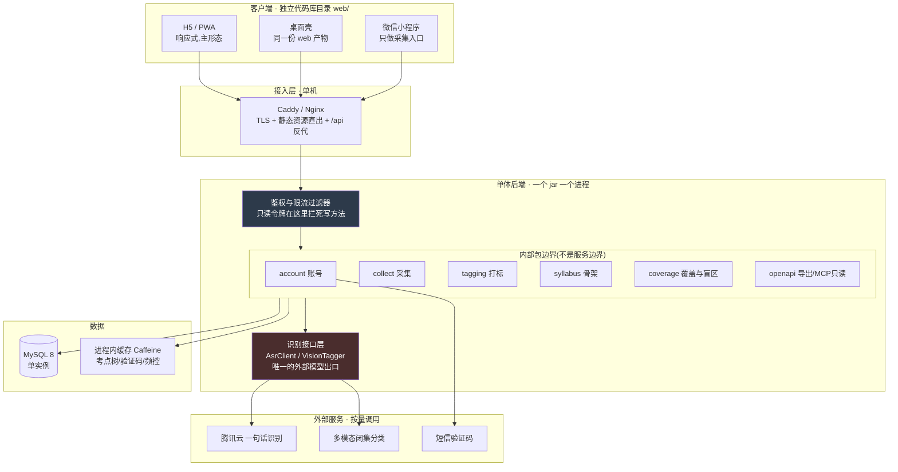
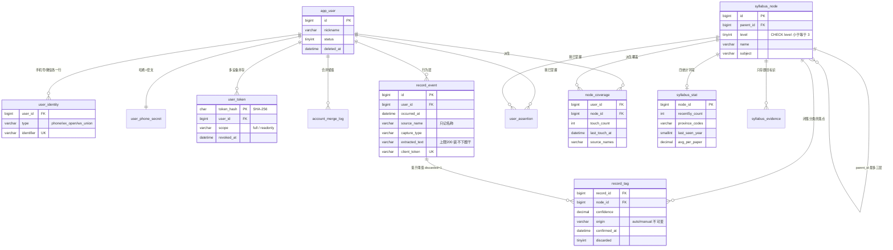
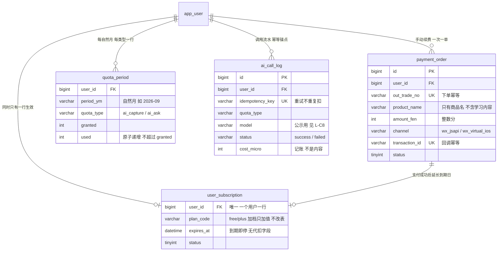
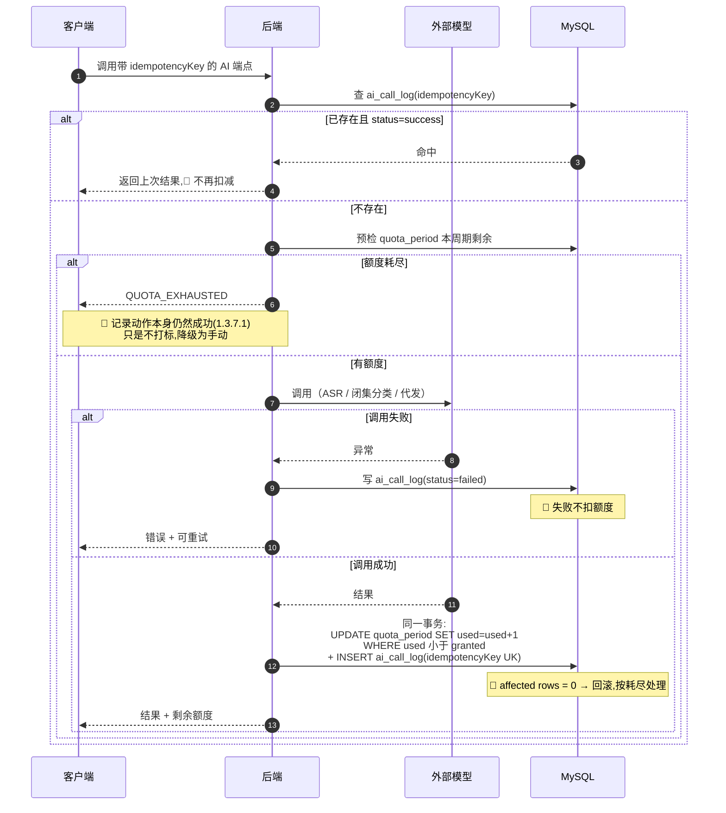
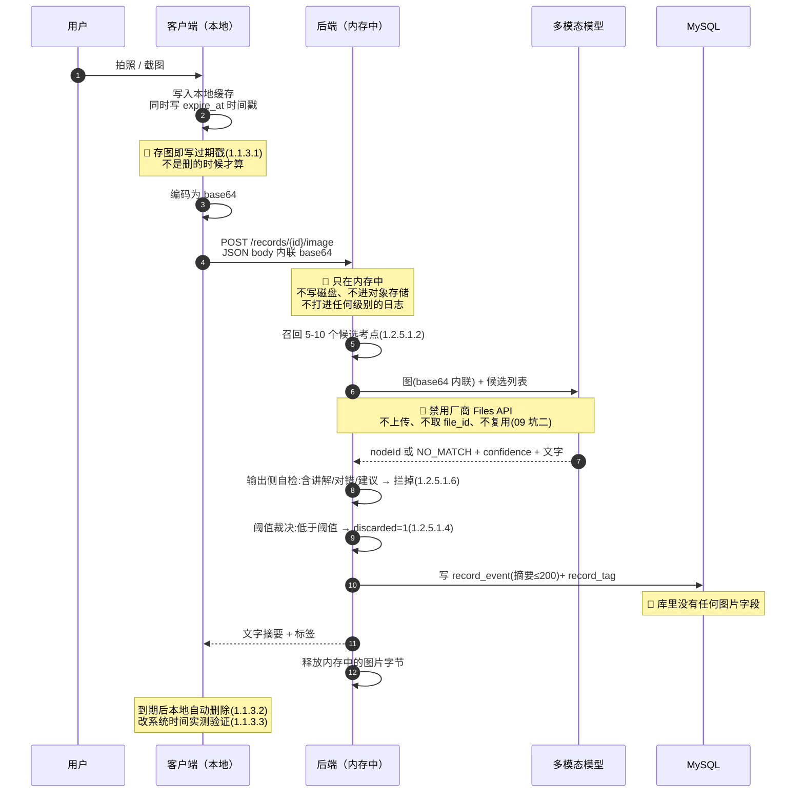
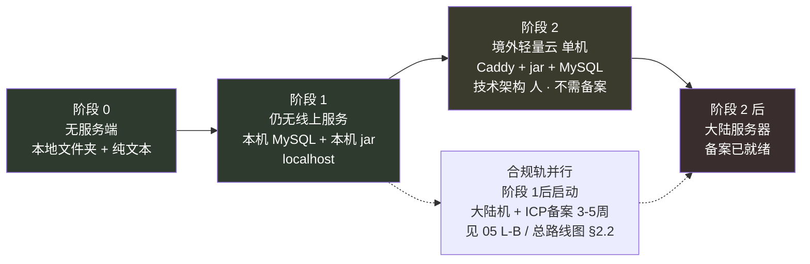

# 技术架构与接口契约

> 这份文档只回答一个问题:**这东西如果要建,用什么建、接口长什么样。**
>
> **它是选型记录,不是开工许可。** 实施路径 §阶段 0 的原文是「不做界面,不做账号,不做数据库设计」——**除 §八 的原图到期处置(`1.1.3`,第一天不定就改不回来;2026-08-29 由「删除」改为「本机归档」)外,本文没有一节需要现在就动手**。每节开头仍标着「最早落地阶段」,那是排期上的先后。
>
> ⚠️ **2026-09-02 用户裁定「取消功能分期」:产品按一个完整的 App 设计与开发,功能的有无不再由阶段决定。** 上面引的那句「不做界面,不做账号,不做数据库设计」**作为功能裁剪已作废** —— 界面、账号、数据库都是完整 App 的一部分,**就是有的**;原文留在这里只为可追溯。本文里「最早落地阶段」从此只表示**开发排期上的先后**,不表示那个功能有没有;**排期顺序另行由项目经理重排,本文不重排。**
>
> 思考模式 §盲区二 记录的失败模式是:注意力单向流向能动手做的部分,而不是最不确定的部分。**写完这份文档不构成任何进度。** 自检仍只看 `总路线图 · 脑图与父子待办` §六那一条:`1.1.4` 那张表有没有在填。
>
> **只写到阶段 2。** 阶段 2 之后的部署形态、服务拆分、多端扩展一律不展开——曾经为一个方向写过 12 个月详细路线,整个作废。
>
> **一个例外,必须自己点破:§5.5 / §5.6 / §6.6 / §6.7 这一整块商业化内容留在这里,是因为它记的是不建什么**(不建代扣字段、不建加油包表、不建 prompt/答案列、不给扣减开端点),而「不建」写晚了就已经建上了。**它是一条边界线,不是一份开工图。** 判据仍在 `实施路径`,排期仍在 `执行清单`/`总路线图 · 脑图与父子待办`,本文一件都不重排。
>
> ⚠️ **2026-09-02 裁定后,额度与购买是完整 App 的一部分,不再「跑在阶段 2 后面」。** 原来挂着的第二个理由 —— `商业化与额度设计` `R-37`「额度只要提前生效,阶段 0 的『日均 ≥3 条』必然不过」—— 是当时下判断的依据,**原样保留可追溯;它与新口径的冲突不由本文裁定,已登记待产品/技术侧回头重述。**
>
> 后端技术栈来自 `~/SecondJob/Step2/geo` 的实测选型,**但那是公司代码库,只采纳选型不采纳代码,见 §一**。识别链路的选型依据在 `识别链路选型 · ASR 与图像识别`,本文只写它在架构里的位置。

---

## 零、每节最早落地阶段

**这张表的作用是防止本文被当成待办清单。**

> **「最早落地阶段」这一列是开发排期上的先后,不是功能有没有**(2026-09-02 裁定,见引言)。

| 节 | 内容 | 最早落地阶段 | 在此之前 |
|---|---|---|---|
| §一 | 与 Step2 的隔离红线 | **现在** | — |
| §二 | 总体架构 | 阶段 1(单机)/阶段 2(上线) | 无 |
| §三 | 后端技术栈 | 阶段 1 `1.2.4` 数据层落库 | — |
| §四 | 前端技术栈 | 阶段 1 `1.2.9` 最小两屏(裸工程即可) | — |
| §五 | 数据模型 | 阶段 1 `1.2.4` | — |
| §六 | 接口契约 | 阶段 2 `1.3.x`;本机单机跑通时可不走 HTTP(那是部署形态,不是契约有没有) | 无 |
| §七 | 鉴权与会话 | 阶段 2 `1.3.1`(手机号通道);微信通道的前置是 ICP 备案与主体资质,不是阶段(§7.2) | 短信签名报备 `2.1.5` **现在就能办** |
| §八 | 原图处理链路 | **阶段 0 `1.1.3`**(到期归档写死那条) | 这条第一天不定就改不回来 |
| §九 | 部署形态 | ⚠️ 与 2026-09-02 裁定冲突,见 §九 头注 | —— |
| §十 | 不做什么 | 全程 | — |

**§一 和 §八 是仅有的两条现在就有约束力的内容,其余都是「将来如果建,这么建」。**

> **商业化相关的 §5.5 / §5.6 / §6.6 / §6.7 是完整 App 的一部分,不带阶段前提**(2026-09-02 裁定)。设计依据在 `商业化与额度设计`,本文只写它在数据模型与接口契约里的位置。⚠️ 原文那条「🔴 这几张表在阶段 2 之前一张都不建」**作为功能裁剪已作废**;它的依据 `商业化与额度设计` `R-37`(额度提前生效会让阶段 0 的「日均 ≥3 条」判据必然不过)留在原处可追溯,**是否仍成立不由本文裁定,已登记待产品/技术侧回头重述。**

---

## 一、与 Step2 的隔离红线 🔴

**最早落地阶段:现在。本文唯一一条与进度无关、立刻生效的内容。**

### 1.1 事实

`Step2/geo/geo-server/pom.xml` 的坐标是:

```
<groupId>com.fenbi.geo</groupId>
<artifactId>geo-server</artifactId>
```

**`com.fenbi` 是公司命名空间。整个 `Step2/geo` 是公司项目的代码库。** 决策记录 §3 的约束是「不用公司非公开材料、设备、上班时间」,`总路线图 · 脑图与父子待办` 已把它登记为红线 `R-08`。

### 1.2 采纳与不采纳的分界

分界线是:**版本号与依赖组合是公开事实,源码、表结构、脚本是公司资产。**

| 类别 | 具体内容 | 结论 |
|---|---|---|
| 依赖坐标与版本 | Spring Boot 3.5.3 / Java 21 / `starter-web` / `starter-jdbc` / `mysql-connector-j` / Lombok | ✅ 采纳。这些在官网首页就能查到 |
| 「用 JdbcTemplate 不用 JPA」这类工程判断 | — | ✅ 采纳判断,不采纳实现 |
| 本地起服务的**形态**(一个脚本拉起多进程 + 健康检查轮询) | `scripts/dev-up.sh` | ✅ 采纳形态,**重写脚本**。不复制文件 |
| `com.fenbi.*` 包下任何一行源码 | 全部 | ❌ 不复制 |
| `db/schema.sql` 的表结构、字段名、注释 | 全部 | ❌ 不复用。本项目的表在 §五 独立设计 |
| `application.yml` / `config/` 下配置 | 全部 | ❌ 不复用,含内网地址与密钥形态 |
| `geo-crawler` 的抓取实现 | 全部 | ❌ 不复用。数据轨的抓取纪律见 `数据线 · 骨架原料的获取与隔离`,`3.3.1.4` 明确「不是不用,是不写」 |
| jsoup、echarts 等具体依赖 | — | ⚪ 用不上就不引;要引是独立决定,不因为那边有 |

### 1.3 一个容易漏掉的交集点 ⚠

`geo-server/pom.xml` 显式声明了 Maven Central,注释写明的原因是:不这么做,本机 `settings.xml` 里配的**公司私服镜像**会导致部分依赖拉不到。

> **原注释不逐字抄进本仓库。** §1.2 的分界线对注释同样适用——注释是公司源码文件的一部分。这里只记事实,不搬原文。

**这说明本机 `~/.m2/settings.xml` 里配着公司私服镜像。** 如果副业项目直接 `mvn package`,构建流量会走公司私服——那就是一次实打实的交集,而且不会有任何报错提醒你。

必须做的隔离:

| 项 | 动作 |
|---|---|
| Maven 配置 | 用独立配置文件构建:`mvn -s ~/.m2/settings-side.xml`,该文件里只有 Maven Central,无任何私服 mirror |
| 本地仓库 | 建议同时隔离:`-Dmaven.repo.local=~/.m2/repo-side` |
| pom | 不写任何 `<repositories>` 指向内网地址;需要显式声明时只写 `repo1.maven.org` |
| Git | 独立账号、独立 remote,`git config user.email` 用个人邮箱(仓库级配置,不是全局) |
| 密钥 | 云厂商账号、API key、支付方式全套独立(`1.1.6` 已列) |
| IDE | 不在同一个 IDE 配置档里同时登录公司账号与副业仓库 |

### 1.4 新坐标

| 项 | 值 | 说明 |
|---|---|---|
| groupId | `com.kaodian` | 中性,不含任何公司标识。惯例是主域名反写 |
| artifactId | `kaodian-server` | |
| 根包名 | `com.kaodian.server` | |
| 数据库名 | `kaodian` | |
| 仓库名 | 不含公司词、不含产品对标词 | |

> **前缀取 `com.` 不取 `io.`,这不是审美问题。** `执行清单` `L-A1` 定的是 `.com` 主域名,`L-A3` 定的是国内注册商(备案要求)。**`.io` 不在工信部可备案 TLD 名单里**(2026-08 口径,`L-A1` 执行前复核一次),而 `L-B` 的 ICP 备案与 `L-C` 的小程序业务域名校验整条链路都依赖备案。**包名跟着一个备不了案的域名走,是在给自己埋一次必然的改名。**
>
> **groupId 依赖一个未完成项:** 域名 `L-A1` 还没注册,`com.kaodian` 是占位值,域名定了要一次性改掉。**改 groupId 的成本随代码量增长**,所以要么域名先注册,要么接受这次改名,不要拖到有几千行代码之后。

### 1.5 自检(每次开新机器或换环境时跑一遍)

| 检查 | 期望 |
|---|---|
| `grep -ri "fenbi" server/ web/ shared/` | 零命中。**范围是代码目录,不是整仓** |
| `mvn help:effective-settings -s ~/.m2/settings-side.xml \| grep mirror` | 无内网地址 |
| `git remote -v` | 个人账号 |
| `git config user.email` | 个人邮箱,且是仓库级不是全局 |
| 云控制台登录的是哪个账号 | 独立账号 |

> **为什么第一条只查代码目录:** 这份文档本身就写着 `com.fenbi.geo`——那是红线的**定义**,不是被复制的资产。把判据定成「整仓 grep 零命中」等于给自己发一条永远失败的自检,而永远失败的自检和没有自检是一回事。**约束的对象是产物,不是记录。**

---

## 二、总体架构:代码分离,服务不分离

**最早落地阶段:阶段 1(单机跑通)/ 阶段 2(第一次上线)**

### 2.1 一句话

**前端和后端是两份独立的代码、两条独立的构建流水线、两份独立的产物;但后端只有一个进程,不拆微服务。**



### 2.2 「代码分离、服务不分离」具体是什么形态

| 维度 | 形态 | 理由 |
|---|---|---|
| **仓库** | **一个仓库,三个顶层目录** `server/` `web/` `shared/` | 2 人团队,改一个接口要同时改两边。分仓会引入版本对齐成本,而这个成本没有任何收益 |
| **构建** | **完全分离。** `server/` 走 `mvn package` 出 jar;`web/` 走 `vite build` 出静态目录 | **前端产物不打进 jar。** 打进去就意味着改一行文案要重启后端进程 |
| **契约** | `server` 出 `openapi.json` → 生成 `shared/` 里的 TS 类型 | 单向生成,前端不手写接口类型 |
| **本地开发** | 三个进程各自起(前端 dev server / 后端 / MySQL),前端 dev server 代理 `/api` 到后端 | 与 Step2 的 `dev-up.sh` 同构:**形态可学,脚本重写** |
| **部署** | **同一台机器。** 静态资源交给 Caddy 直出,jar 是一个 systemd 单元或一个容器,`/api/*` 反代到 `:8080` | 一台机器上的两个进程,不是两个服务 |
| **后端内部** | 一个 jar,按包切成 6 块,**包之间只通过接口调用,不共享 DAO** | 这是拆服务唯一有价值的预备动作,而它的成本接近零 |

### 2.3 什么时候才值得拆服务

**现在不规划微服务。下面是触发条件,不是路线图。**

| # | 触发条件 | 怎么判断 |
|---|---|---|
| T1 | 打标/识别的资源占用挤掉了 Web 请求,**且垂直扩容(加内存/换机型)已到顶** | 监控里 Web 请求 P99 与打标并发数强相关 |
| T2 | 打标需要独立于 Web 的发版节奏 | 一周内为改 prompt 重启了三次线上进程 |
| T3 | 团队 > 3 人,且出现两人频繁改同一模块导致的发布冲突 | 一个月内两次以上 |
| T4 | MCP 只读需要与主站不同的限流与故障隔离 | 只读流量打挂了写入路径 |

**满足两条以上才评估。只满足 T1 一条时,正确动作是加内存。**

> ⚠️ **加注(2026-08-28):`server/` 已拆成 4 个 Maven 模块(`domain` / `auth` / `agent` / `app`),这不是拆服务,不要按本节读。**
>
> 产物仍是**一个 jar**(`kaodian-app` 是唯一的 Spring Boot 应用),部署形态一台机器一个进程,T1–T4 一条都没触发。
> 它落的是 §2.2 最后一行「包之间只通过接口调用,不共享 DAO」—— **只不过从约定变成了编译器强制**:
> `domain` 看不见 `auth`,`agent` 看不见 `app`,依赖方向写在 pom 里而不是靠自觉。
>
> 这是 §2.2 说的「拆服务唯一有价值的预备动作,而它的成本接近零」被真的做了一次。**§2.3 的触发条件一个字都不改。**

> 这四条里,T3 和 T4 在阶段 2 之前不可能成立(团队 2 人、MCP 在阶段 3)。T1 和 T2 的前提是有真实负载,而阶段 2 是 10 个人。**所以阶段 2 之前拆服务这件事不需要再想。**

---

## 三、后端技术栈

**最早落地阶段:阶段 1 `1.2.4` 数据层落库 —— 排期位置,不是功能前提。** ⚠️ `阶段 0 至阶段 2 · 详细排期` §技术选型 那条「先用本地文件夹 + 纯文本」**作为功能裁剪已作废**(2026-09-02):数据层是完整 App 的一部分。排期另行由项目经理重排,本文不重排。

| 项 | 选型 | 理由 | 何时换 |
|---|---|---|---|
| **框架** | Spring Boot **3.5.x** ⚠**已分叉,见下注** | Step2 实测跑得起来的版本线,少踩一遍版本坑。生态里所有东西都是现成的 | 不换。3.x 在维护期内 |
| **JDK** | **Java 21**(LTS) | 虚拟线程直接吃到收益——本产品的后端几乎全是 IO 等待(等 ASR、等多模态、等短信),不是 CPU 密集 | 25 转 LTS 且生态跟上后再评估,不急 |
| **Web 层** | `spring-boot-starter-web`(Tomcat)+ 虚拟线程 | **不上 WebFlux。** 响应式的调试成本对 2 人团队是净负债,而虚拟线程已经把「阻塞写法 + 高 IO 并发」这件事解决了 | 不换 |
| **持久层** | `spring-boot-starter-jdbc` + `JdbcClient`,**手写 SQL** | 表少(§五 十张出头)、查询形态明确(树遍历 + 差集 + 聚合)。ORM 在这里唯一的作用是把 N+1 藏起来 | 表数 > 25 或出现多数据源时,评估 MyBatis。**不上 JPA** |
| **数据库** | **MySQL 8.x**,单实例 | 备案接入商的托管实例最省事;`WITH RECURSIVE` 够用,而且考点树只有三层、单模块量级,大多数场景直接全量装进内存 | 需要 `pgvector` 时换 PG——但 `1.2.5.3.3` 明确候选召回用关键词,**这个需求当前不存在** |
| **缓存** | **Caffeine 进程内缓存**,不引 Redis | 单实例部署,考点树是只读小数据,验证码与频控计数用 TTL 缓存即可。诚实代价有两条:**重启后未使用的验证码失效**(用户重发一次),以及 **`1.3.1.1.3` 的频控计数一并清零**——防刷计数不是持久的,这条要知道 | 出现第二个后端实例的那一天。在此之前引 Redis 是纯粹多运维一个进程 |
| **鉴权** | **自研不透明令牌 + 一张 token 表**,不用 JWT,不引 Spring Security / Sa-Token | 三个硬理由:①`1.4.2.1` 要求令牌前缀 `ro_` 把只读写进凭证本身,不透明令牌天然支持;②`1.3.1.3` 注销要立即失效,JWT 撤销要另建黑名单等于绕回查库;③单体单库,查一次 token 表的成本可忽略 | 服务拆分或需要无状态横向扩展时换 JWT |
| **对象存储** | **不引入。** 导出流式生成直接返回 | 导出文件是几十 KB 的 CSV/JSON,不需要落对象存储 | 导出需要异步生成 + 下载链接时引腾讯云 COS。🔴 **无论何时,不建图片桶**(§八) |
| **任务调度** | Spring `@Scheduled` + 数据库表当队列 | 任务只有四类:打标重试、覆盖层派生表刷新、过期 token 清理、注销后的删除(**时点见 §6.1 的待定项,本文不自行定**)。单实例不需要分布式锁 | 多实例时加 ShedLock。**不上 MQ**(§十) |
| **配置** | Spring profiles + 环境变量注入密钥;`application-local.yml` 进 `.gitignore` | 密钥不进仓库是 `R-08` 的延伸 | 出现第二个环境且需要动态开关时,再评估配置中心。**不上 Nacos/Apollo** |
| **日志与监控** | Logback(默认)输出结构化日志 + `actuator` 健康检查 + 一张 `error_event` 表 | `1.3.7.3` 要的是「关键路径错误率超阈值告警」,一张表加一个日汇总就够 | 用户 > 100,或出现无法从日志复现的线上问题 → 上 Sentry。**不自建 LGTM 全家桶** |
| **AI 网关** | **不引网关组件。自己写接口层。** | 调用点只有三个(ASR / 闭集分类 / 未来的上下文组装),而 one-api / new-api 是一个要额外运维的进程 | 「多模型路由 + 记账 + 限流」三者同时成为需求时 |
| **HTTP 客户端** | Spring 6 `RestClient` | 同步写法 + 虚拟线程,不需要 WebClient | 不换 |

> ⚠ **`3.5.x` 这一格已与代码分叉,数字保留不改,在这里记指针。**
>
> `server/pom.xml` 实际是 **Spring Boot 4.1.1**(`spring-boot-starter-webmvc` / Jackson 3),已通过全部测试。
> 分叉不是本表的错,但它决定了 AI 框架能用哪条线:
>
> | | Spring Boot 3.5.x | Spring Boot 4.1.1(实际) |
> |---|---|---|
> | `spring-ai` | 1.1.x GA | **2.0.1 GA** ✅ |
> | `spring-ai-alibaba` | 1.1.2.3 GA ✅ | **无正式版**,里程碑实测起不来(`R-50`) |
>
> **`后端系统设计与组件接入` §三 是这条分叉的实测与裁定**,结论是按 4.1.1 继续、不引 `spring-ai-alibaba`。
> 若将来要退回 3.5.x,代价是明确的:`starter-webmvc` → `starter-web`、**Jackson 3 → 2**(`application.properties` 里两处键名要改)、现有测试全部重跑。

### 3.1 识别接口层:`识别链路选型 · ASR 与图像识别` 坑三的硬要求

`识别链路选型 · ASR 与图像识别` §四坑三:推荐的视觉模型是实验版本,官方**没有任何稳定性承诺与下线时间表**(`R-35`)。缓解手段写在那里:**识别调用必须走接口层抽象,保留一个切换点。**

在架构里,这条落成两个接口,是整个后端**唯一**允许出现外部模型调用的地方:

```
interface AsrClient {
    String transcribe(byte[] audio, String mime);   // 失败抛异常,不返回半成品
}

interface VisionTagger {
    // 闭集分类:输入图 + 候选节点,输出候选里的一个 ID 或 NO_MATCH
    TagVerdict classify(byte[] image, List<CandidateNode> candidates);
}

record TagVerdict(Long nodeId, BigDecimal confidence, boolean noMatch) {}
```

| 约束 | 落在哪 |
|---|---|
| **输出只能是候选里的 nodeId 或 NO_MATCH**,不接受自由生成的字符串 | 返回类型里根本没有 `String label` 字段——`1.2.5.1.3b` 的类型级实现 |
| base64 内联编码在实现类内部完成,**接口不暴露任何 fileId 概念** | `识别链路选型 · ASR 与图像识别` 坑二 / `R-04` |
| 换厂商 = 换一个实现类 | `R-35` |
| 输出侧自检(不得含讲解、对错判断、学习建议) | 在 `VisionTagger` 的实现之外、`tagging` 包内做一层校验——`1.2.5.1.6` 明确「不是靠 prompt 里写一句,是在输出侧检」 |

**这两个接口的签名是本文档里唯一值得现在就写下来的代码。** 它们的稳定性决定了模型下线那天要改多少东西。

---

## 四、前端技术栈

**最早落地阶段:阶段 1 `1.2.9` 最小两屏。但阶段 1 只有你一个用户、只有两屏,裸 Vite + React 工程即可,不引路由和查询库。下表是完整 App 的目标态,不是排期第一步的起点。**

### 4.1 为什么不沿用 Step2 的 Angular 14 + ng-zorro

§一 采纳的选型只覆盖后端。前端必须另选,有两个独立的理由,任一条单独成立:

| # | 理由 | 展开 |
|---|---|---|
| 1 | **ng-zorro 的默认习语正好是要避开的东西** | 它的标准骨架是 `Layout.Sider + Breadcrumb + Card + Table`——这就是调研里点名的「AI 味后台」。而候选设计方向之一「极客暗色 · 命令条驱动」(`阶段 0 至阶段 2 · 详细排期` §第 8 周、`R-29`)**全部前提是没有侧边栏、没有面包屑、没有卡片**。用组件库然后逐个覆盖它的默认样式,是拿着一套主张去对抗另一套主张,成本比不用高 |
| 2 | **Angular 14 已过 LTS** | 2022 年版本,长期支持早已结束。新起项目用一个不再收安全补丁的大版本,没有任何理由 |

> **注意这不是说 Angular/ng-zorro 不好。** 它在 Step2 那个场景(数据密集的监测后台,恰好就要 Sider + Table)是对的选择。**选型跟着形态走,而两个项目的形态相反。**

### 4.2 选型对照

| 方案 | 三端复用 | 暗色密集 UI 可控性 | ⌘K 生态 | 小程序 | 桌面封装 | 2 人维护成本 |
|---|---|---|---|---|---|---|
| Angular 14 + ng-zorro | 中 | **差**(要对抗默认主张) | 弱 | 需另起 | 一般 | 高(版本已 EOL) |
| **React + Vite + Tailwind + Radix + cmdk** ✅ | 高 | **强**(无预设视觉,全是无样式原语) | **最强**(`cmdk` 是事实标准) | Taro 复用逻辑层 | Tauri/Electron 直接吃 | **低** |
| Vue 3 + Vite + Naive UI | 高 | 中(Naive 主题可控但仍有主张) | 弱,多为自研 | **最好**(uni-app 同语言) | 同上 | 低 |
| uni-app 一套三端 | **最高** | 差(要迁就小程序的能力交集) | 弱 | 原生 | 弱 | 中 |
| Taro 4 一套三端 | 高 | 中 | 中 | 原生 | 中 | 中 |
| SvelteKit | 中 | 强 | 中 | 需另起 | 可 | 中(生态薄,遇坑无人踩过) |

**推荐:React + Vite + TypeScript + Tailwind + Radix 原语(shadcn 式复制进仓库,不当依赖)+ cmdk + TanStack Query。**

决定性的一条:**Radix / shadcn 的模式是把组件源码复制进自己的仓库,而不是引一个包。** 这意味着改一个控件的视觉不需要跟组件库的主张搏斗——直接改那份源码。对一个「视觉风格本身就是差异化」的产品,这比任何组件库的完成度都重要。

`cmdk` 让命令条驱动这条设计方向从「要自己写一个 fuzzy 匹配 + 键盘导航 + 无障碍焦点管理」变成「引一个库」。这是选 React 生态最实在的收益。

### 4.3 三端方案与共享策略

> ⚠ **本节已被 `多端选型与端矩阵` 推翻,原文一个字不改,在这里加指针(2026-08-30,`KUBI-71`)。** 六个形态的最终选型以 `多端选型与端矩阵` 为准。
>
> 被推翻的三处:① **小程序不再用 Taro 4**,改原生小程序 + 手抄 token —— 本节自己已经写了「小程序不复用 UI 是有意的」,那 Taro 只剩逻辑层复用,而逻辑层本来就不需要它;② **桌面不是「先用 PWA」**,是 Tauri 2,且与 iOS/Android 共用同一个 crate 同一份 dist;③ 本表缺 **Pad** 与 **PC/Windows** 两格,`多端选型与端矩阵` 补齐(Pad 不是端,是 H5 的一组断点)。
>
> **共享策略那两张表仍然成立**,只有一处要注意:`shared/` 与 OpenAPI codegen **至今不存在**,`types.ts` 是手写的。`多端选型与端矩阵` 把 codegen 从「早晚要做的好事」改判成**小程序开工的前置条件**。

| 端 | 方案 | 定位 | 排期位置(功能上都属完整 App) |
|---|---|---|---|
| **H5 / PWA** | React + Vite,响应式,PWA 装到主屏 | **主形态**(决策记录 §2.4 已定,小程序方案已被推翻) | `1.3.2` |
| **桌面客户端** | 先用 PWA 安装;真需要本地能力时套 Tauri 2 壳 | 复盘场景(考点树 + 盲区清单) | 见 4.4(2026-08-29 已拍板开工) |
| **微信小程序** | Taro 4(React 语法),**只复用逻辑层不复用 UI** | `L-C6`:只做采集入口,分析跳网页端 | `2.3` C 档;真实前置是 ICP 备案与主体认证链,不是阶段 |

共享策略——**共享的是契约和逻辑,不是界面:**

| 共享物 | H5 | 桌面 | 小程序 | 方式 |
|---|---|---|---|---|
| OpenAPI 契约与 TS 类型 | ✅ | ✅ | ✅ | 后端生成,三端消费,无人手写 |
| API 客户端(鉴权/重试/离线队列) | ✅ | ✅ | ✅ | 放在 `shared/` 下的独立包,**无 DOM 依赖**——这是能被小程序复用的前提 |
| 领域纯函数(盲区排序、覆盖度展示口径) | ✅ | ✅ | ✅ | 同上 |
| UI 组件 | ✅ | ✅ | ❌ | 桌面就是同一份 web 产物 |
| 设计 token(暗色 CSS 变量) | ✅ | ✅ | ⚪ 手抄一份 | 小程序界面面积极小,手抄比搭构建管线便宜 |

**小程序不复用 UI 是有意的。** `L-C6` 已经把小程序限定成采集入口——一屏录音、一屏拍照、一个历史列表。为这三屏搭一套跨端组件构建,投入远大于收益。

### 4.4 桌面客户端:先不做

> ⚠ **本节已被推翻,原文一个字不改,在这里加指针(2026-08-29,`KUBI-61` 项目所有者拍板)。** 方案在 `壳技术方案：Tauri 2 包现有 Web 工程`;端的完整矩阵(含 Windows / iOS / Android / 小程序)在 `多端选型与端矩阵`。
>
> **推翻的不是判断,是判断的输入。** 本节列的三个触发候选(全局快捷键 / 监听截图目录 / 悬浮窗)**至今一个都不成立**,而且前两个正好撞 `web/README.md` 的「替你听、替你截,不行」。真正成立的是两个本节没列的:**后台定时器**(浏览器页面关掉之后没有任何定时器能处理到期原图)与**真实文件系统**(归档段只增不减,浏览器配额是一堵会撞上的墙)。**这两条都是红线的执行装置,不是新功能** —— 本节那句「桌面壳的唯一产出是看起来像个正经软件」对三个候选成立,对这两条不成立。
>
> **⚠ 但本节的警告仍然成立且已被接受:它不属于任何阶段。** 工时上限不另开一份,与 `R-71` 合并计入同一个「≤ 2 个周六」,见 `壳技术方案：Tauri 2 包现有 Web 工程` §0.3 与 `R-112`。

| 方案 | 包体积 | 额外成本 | 结论 |
|---|---|---|---|
| **PWA 安装** | 0 | 无 | ✅ **先用这个,§十 已把桌面壳列进「不做」** |
| Tauri 2 | ~10MB | Rust 工具链 + 双份签名证书 | 触发条件满足后再比 |
| Electron | ~150MB | 体积与内存代价大 | 同上 |

**什么时候才值得做桌面壳:** 出现 PWA 拿不到的本地能力需求,**且不止一个**。候选:全局快捷键唤起采集、监听截图目录自动入队、系统级悬浮窗。**在此之前,桌面壳的唯一产出是「看起来像个正经软件」,而那不是阶段 2 要验证的东西。**

> **壳工程怎么搭、CI 怎么出双包、签名怎么配,这里一律不展开。** 引言那句「阶段 2 之后的多端扩展一律不展开」管的就是这一节:触发条件都没满足,写构建流程就是 思考模式 §盲区二 的标准动作——一件能立刻动手、有完成感、且完全不需要面对真实用户的事。

⚪ **一个待确认项:** 桌面分发要代码签名——Apple Developer $99/年 + Windows 代码签名证书。**签名主体应与域名实名、ICP 备案、小程序主体保持一致**(`2.1.1.3` 的同一条逻辑)。这是一笔新增年费和一次新增实名,不在 `总路线图 · 脑图与父子待办` §五 的成本表里。**阶段 2 之前不需要,但要记着它存在。**

> ⚠ **这条 ⚪ 的前半截已在 `壳技术方案：Tauri 2 包现有 Web 工程` §4.4 关闭,后半截仍然开着(2026-08-29)。** 关闭的理由是**本轮没有分发**:macOS ad-hoc 自签自用、iOS 只上模拟器、Android debug keystore —— **一分钱不花,一次实名不做**。仍然开着的是「签名主体应与域名实名、ICP 备案保持一致」这一句:真要分发的那天它原样成立,而域名 `L-A1` 还没注册。**本条不进 `总路线图 · 脑图与父子待办` §五 的成本表,理由从「阶段 2 之前不需要」变成「本轮不分发」——判据变了,金额没变,仍是 0。**

---

## 五、数据模型

**最早落地阶段:阶段 1 `1.2.4`。**

### 5.1 一条约束先于所有表

`R-01` / `R-06` / `3.3.2.3` 的原文是「线上库不存在能装下题干的字段,连预留位都不留」。**落到 DDL 上,这条不是「不往里填」,是「不建这个列」:**

| 规则 | 具体 |
|---|---|
| **全库禁用 `TEXT` / `MEDIUMTEXT` / `LONGTEXT` / `BLOB` / `JSON` 大字段类型** | 一个都不建。Step2 的 `schema.sql` 里有 `raw_answer MEDIUMTEXT`——**那正是本项目绝对不能有的形状** |
| 全库最长的字符列是 `record_event.extracted_text VARCHAR(200)` | 一句语音、一条笔记摘要放得下;**一道资料分析题的题干放不下,一段课程讲义放不下** |
| 来源只记名称 | `source_name VARCHAR(64)`,例如「某机构资料分析强化课」。**记的是名字,不是内容** |
| 推导留证只存题目标识 | `paper_ref VARCHAR(64)`,形如 `2024-国考-行测-115`。**不存题干**(`1.2.3.4` / `P1-5`) |
| OCR/ASR 的完整长文本 | **只在内存里过一次**,用于打标;落库的是截断摘要 + 标签 |

**这会让「回看我当时记了什么」的体验变弱,这是有意付出的代价。** 一个能装下完整讲义的字段,建出来的那天起就只差有人往里写了。

### 5.2 建表要点

| 表 | 层 | 关键字段 | 要点 |
|---|---|---|---|
| `app_user` | 账号 | `id` / `nickname` / `status` / `created_at` / `deleted_at` | 主表不放任何登录凭证 |
| `user_identity` | 账号 | `user_id` / `type`(`phone`/`wx_open`/`wx_union`)/ `identifier` / `bound_at` | **唯一索引 `(type, identifier)`。** 双通道统一到一个账号靠这张表,合并时只改归属,不动主表 |
| `user_phone_secret` | 账号 | `user_id` / `phone_hash`(HMAC,唯一)/ `phone_enc`(AES) | 手机号不明文落库。哈希用于查,密文用于发短信 |
| `user_token` | 账号 | `token_hash` / `user_id` / `scope`(`full`/`readonly`)/ `expires_at` / `revoked_at` / `device_label` | 存 SHA-256 不存原值。`scope=readonly` 是 MCP 的全部实现基础(§六) |
| `account_merge_log` | 账号 | `from_user_id` / `to_user_id` / `moved_record_count` / `merged_at` | 合并不可逆,必须留痕(`R-33`) |
| `syllabus_node` | 骨架 | `id` / `parent_id` / `level`(1模块 2题型 3考点)/ `name` / `subject` / `sort` / `version` | **`level` 有 CHECK 约束 ≤ 3。** 决策记录 §2.5 不做第四层,写进约束不靠自觉 |
| `syllabus_stat` | 骨架 | `node_id` / `recent5y_count` / `province_codes` / `last_seen_year` / `avg_per_paper` | 决策记录 §2.5 的四个纯统计字段。离线加工区产出,线上只读(`数据线 · 骨架原料的获取与隔离` 三区隔离)。⚠️ **本行是目标表设计,不是现状**:2026-09-03 实测全仓无建表 DDL,四统计只有 `recent5y_count` 有值。**这不改变契约** —— 契约先定、数据跟上(`接口契约:签名与错误码全集` §12.9.3)。🔴 但数据侧有一条必须先解决:`基础数据 · 抓取范围与渠道` §2.5 指出**按省份计数的统计单位从第一天起就是错的**(正确单位是 `(年份, 考试, 卷种)` 三元组)——在它改对之前填 `province_codes`,填进去的是一个口径错误的数字 |
| `syllabus_evidence` | 骨架 | `node_id` / `paper_ref` | 推导留证,`R-26` 待律师确认格式是否足以自证 |
| `record_event` | **行为** | `id` / `user_id` / `occurred_at` / `source_name` / `capture_type`(`voice`/`photo`/`text`)/ `extracted_text`(≤200)/ `client_token` | **产品的真实价值全在这张表。** `client_token` 唯一,用于离线队列补传去重 |
| `record_tag` | 行为 | `record_id` / `node_id` / `confidence`(DECIMAL(4,3))/ `origin`(`auto`/`manual`,**写入后不可变**)/ `confirmed_at` / `discarded` | `discarded=1` 即宁缺毋滥的落地:**可见,但不计覆盖度**(`P1-7`)。**`origin` 记的是这条标签从哪来,不是它现在什么状态**——用户确认只写 `confirmed_at`,不把 `auto` 改成 `manual`。改了,`1.2.5.2` 那套准确率口径(标对的/标了的)在真实数据上就再也算不出来了 |
| `user_assertion` | 行为 | `user_id` / `node_id` / `asserted_at` | 「我已掌握」。**独立状态,不计入覆盖度**(决策记录 §5.2:补丁不是解法)。导出时可区分 |
| `node_coverage` | 覆盖 | `user_id` / `node_id` / `touch_count` / `last_touch_at` / `source_names` | **派生表,不手工维护**(`1.2.4.4`)。可随时从行为层重算 |
| `user_exam_profile` 🆕 | **行为** | `user_id`(PK)/ `exam_type` / `exam_date` / `updated_at` | 2026-09-03 新增。用户自填的备考档案(考什么、哪天考)。🔴 **不放进 `app_user`** —— 那是账号域的表,而这张表进公式(将来影响盲区排序),放过去等于让 `kaodian-auth` 长出业务字段。🔴 **只存当前值,不留历史** —— 留了就长出「你的备考轨迹」,那是学习分析。形状见 `接口契约:签名与错误码全集` §12.6 |
| `error_event` | 运维 | `path` / `error_code` / `count` / `bucket_at` | `1.3.7.3` 的最小实现,不上监控栈 |

**不建的表:**

| 不建 | 理由 |
|---|---|
| 任何图片表(路径、缩略图、对象存储 key) | 服务端一张都不建。原图元数据只存在客户端本地库(§八) |
| 任何音频表 | `1.1.1.5`:ASR 失败提示重录,**不留存音频** |
| 任何存题干、讲义、课程内容的表 | `R-01` / `R-06` |
| 验证码表 | 放进程内缓存,重启失效是可接受代价 |
| `practice_log`(练了几道 / 对了几道)⚠ | **本文一度设计了这张表,现已撤回。** 理由不是它写不出来,是**它不在 `项目现状与决策记录`-`识别链路选型 · ASR 与图像识别` 任何一处**——「正确率」这个字段在整个文档集里从未被定义过,决策记录 §2.2 的能力边界只有「有没有、几次、多久前」。哪怕数字是用户自填的,只要它进了库,「按正确率排薄弱考点」就只差一条 SQL,而那正是 `R-05`。**要不要有这个能力是 01 的决定,架构文档不能自己裁定「这没有越过能力边界」**——先在 `项目现状与决策记录` §7 记一条带「何时改变」的决策,再回来建表 |

### 5.3 ER 图

> ⚠ **这张图画的是<u>将来那套 MySQL 表</u>,写于 `auth` 与 `agent` 落地之前(8 个实体)。**
> 代码里<b>此刻真实存在</b>的实体关系见 `后端详设 §八` —— 那边有 20 个实体、三座互不相连的岛,
> 以及两条把它们隔开的裂缝(行为层无 `userId`、agent 与账号的 `userId` 类型不一致)。
> **两张图不一样是正常的**:一张是目标,一张是现状。按惯例这里只加指针,上面这张图不动。




### 5.4 核心运算落到 SQL 是什么

**盲区 = 骨架层 − 行为层**,在这套表里是:

```
level=3 的 syllabus_node
  ← LEFT JOIN node_coverage(当前用户)
  ← LEFT JOIN user_assertion(当前用户)
  ← LEFT JOIN syllabus_stat(同一 node_id,排序字段的来源)
  WHERE node_coverage.node_id IS NULL AND user_assertion.node_id IS NULL
  ORDER BY syllabus_stat.recent5y_count DESC
```

`record_tag.discarded=1` 的行不进 `node_coverage`——**丢弃的标签可见但不计覆盖度,这条在派生逻辑里就是一个 `WHERE discarded=0`。**

### 5.5 会员 / 订单 / 额度

**设计依据在 `商业化与额度设计`,本节只写表。** `商业化与额度设计` §一 定了两档额度(免费 / 记多点 ¥9.9),`商业化与额度设计` §三 定了「只对产生按次外部账单的动作计费」。

> **付费档由两档收成一档(删掉「记到够 ¥19.9」)之后,这四张表一个字段都没改。** 依据是 `商业化与额度设计` `R-39` 自己写下的话:记多点的 300 次已是 `识别链路选型 · ASR 与图像识别` 活跃假设(日均 3 条 = 135 次/月)的 2.2 倍,上层档没有购买理由。
>
> **能不改表,是因为档位从一开始就是数据——`plan_code` 的一个取值加一行服务端定价配置,不是每档一列。** 这与 §2.2「代码分离、服务不分离」是同一类取舍:**现在按最简单的形态建,以后加档或改额度都不用重构。** 反过来说,如果当初把 `plus_quota` / `max_quota` 拆成列,今天这次删档就是一次改表。

#### 5.5.1 §5.1 的约束在这四张表上一个字都不放松

| 规则 | 在这四张表上具体是什么 |
|---|---|
| **全库禁用 `TEXT` / `JSON` / `BLOB`** | 仍然一个都不建。**微信支付的原始回调报文不落库**——只存解析后的 `transaction_id` 与金额,原始报文进结构化日志且不含任何学习内容 |
| **线上库不存在能装课程内容的字段** | 订单表里最长的字符列是 `product_name VARCHAR(64)`,内容形如「记多点 · 月度」。**是商品名,不是学习内容** |
| **AI 代发的答案不落库** | `ai_call_log` 没有 prompt 列、没有答案列。库里根本没有能装下一段模型输出的字段(`商业化与额度设计` §5.4) |
| 金额一律用**整数分** | `amount_fen INT`。不用 `DECIMAL`,不用浮点 |

#### 5.5.2 建表要点

| 表 | 层 | 关键字段 | 要点 |
|---|---|---|---|
| `user_subscription` | 会员 | `user_id`(**UK**)/ `plan_code`(**当前只有 `free`/`plus` 两个值**,对应 `商业化与额度设计` §一 的 免费 / 记多点)/ `started_at` / `expires_at` / `granted_by`(`order`/`manual`)/ `status` | **一个用户一行,唯一索引就建在 `user_id` 上。** 续费 = 延长 `expires_at`,不新建行,所以不需要「只对生效态唯一」那种索引——MySQL 没有部分索引,`(user_id, status)` 联合唯一反而会挡住同一用户的第二条历史行。**历史在 `payment_order` 里,不在这张表里**。`plan_code` 是行里的一个值,**不是每档一列**——将来若重开第二个付费档,加的是一个取值和一行定价配置,DDL 不动 |
| `payment_order` | 订单 | `user_id` / `out_trade_no`(**UK**)/ `plan_code` / `product_name`(≤64)/ `amount_fen` / `channel`(`wx_jsapi`/`wx_virtual_ios`)/ `status` / `transaction_id`(**UK**,可空)/ `paid_at` / `refunded_at` | **只有商品名与金额,不含任何学习内容。** `out_trade_no` 唯一 → 下单幂等;`transaction_id` 唯一 → **回调幂等**,重复通知撞唯一索引即视为已处理 |
| `quota_period` | 额度 | `user_id` / `period_ym`(如 `2026-09`)/ `quota_type`(`ai_capture` = `商业化与额度设计` §一 的 AI 录入,`ai_ask` = AI 代发提问,**只有这两个值**)/ `granted` / `used` | 唯一索引 `(user_id, period_ym, quota_type)`。**自然月重置,不按购买日滚动**(`商业化与额度设计` §一)——所以周期只需要一个 `period_ym` 列,不需要起止时间。**`granted` 是发放时写进这一行的数字,不是编译期常量**——`商业化与额度设计` §八 的「数字可改,维度不可改」落到数据模型上就是这一条 |
| `ai_call_log` | 流水 | `user_id` / `quota_type` / `idempotency_key`(**UK**)/ `provider` / `model` / `status`(`success`/`failed`)/ `latency_ms` / `cost_micro` / `created_at` | **额度扣减的幂等锚点。** `cost_micro` 是记账用的整数微元,`1.2.5.3.4`「记录每日调用量与成本,对照订阅价测算毛利」的落点。**无 prompt、无答案、无图片**。收成单档后最坏一格(iOS · 满额)的安全倍数是 6.4×(`商业化与额度设计` §4.5;两档时最紧的一格在记到够上,只有 4.5×)——**这张表是验证那个倍数的唯一数据源,倍数本身不在本文重算** |

#### 5.5.3 三个「不建」

| 不建 | 理由 |
|---|---|
| `subscription_contract` / `next_charge_at` / `contract_id` 等委托代扣字段 | **不做自动续费**(`商业化与额度设计` §6.3:平台门槛要求近 4 自然周去重付费用户 ≥300,而阶段 3 的判据才是累计 50 个陌生注册)。**与「不建图片桶」同构——不是不用,是不建。** 建了这几个列,「顺手接上代扣」就只差一次开通 |
| 加油包 / 点数余额表 | 加油包是第三个计费维度,`商业化与额度设计` §三 只允许两个。**额度不结转、不透支、不可单次购买** |
| 积分 / 成长值 / 签到表 | 见 §十 |
| 任何存 prompt 或模型答案的表 | `商业化与额度设计` §5.4:答案落库 → 库里出现学科内容 → `R-05` / `R-06` 的近亲,而且是自己造的 |

### 5.6 ER 图 · 商业化侧(独立小图)

**不并进 §5.3 那张图。** 理由是这四张表与骨架层、行为层**没有一条外键关系**——它们只挂在 `app_user` 上。硬并进去只会在主图里拉出四根横穿全图的线,而那张图的信息量正好在于「谁和谁真的有关系」。



**注意这张图里没有一条线连到 `syllabus_node` 或 `record_event`。** 这不是画漏了——**商业化侧不碰行为层,行为层也不因为付没付钱而改变形状。** 免费用户和付费用户在 `record_event` / `record_tag` / `node_coverage` 三张表里长得一模一样,差别只在于**有没有额度去触发那次 AI 调用**。

---

## 六、接口契约

**本节所有接口都属于完整 App,不带阶段前提**(2026-09-02 裁定;下面各表原有的「阶段」列已随之删除)。**排期位置在 `1.3.x`;本机单机跑通时 `1.2.8` 打通闭环可以完全不走 HTTP —— 那是部署形态的事,不是契约的事。**

统一约定:前缀 `/api/v1`,JSON,时间用 ISO-8601 带时区,错误体 `{code, message, traceId}`,分页用 cursor 不用 offset。

> ⚠️ **2026-09-02 用户裁定「没有本地模式」:登录是记录的前置。** 未登录只能看到产品说明与登录门,**不能记、不能看盲区、不能打标、不能导出**;
> **已登录之后的离线可用性完全不变** —— 本地先落盘、联网后同步,`/records/batch` 补传照旧,「记录动作永不失败」这条红线不动。
> **下面几张契约表没有一列写鉴权要求**,而在新形态下 §6.2 采集、§6.3 打标、§6.4 查询、§6.5 导出**全部是登录后接口**。
> 按惯例**此处只加注,契约原文不改** —— 鉴权列怎么补由技术侧定(现状与它的距离见 `后端系统设计与组件接入` §8.1)。
>
> ✅ **2026-09-03 已补**:鉴权列、字段与类型、错误码全集、分页与幂等语义全部落在
> [`接口契约:签名与错误码全集`](接口契约-签名与错误码全集.md)。**本节仍是「端点该不该存在」的真源,那一份只补形状。**

### 6.1 鉴权

| Method | Path | 用途 | 关键约束 |
|---|---|---|---|
| POST | `/auth/sms/send` | 发验证码 | 频控:单号 1/60s、10/日;单 IP 20/日,**外加 `1.3.1.1.3` 要的滑块或行为验证**——纯计数频控挡不住换 IP 刷短信费。**依赖短信签名与模板已报备**(`2.1.5`) |
| POST | `/auth/sms/verify` | 验证码换令牌 | 5 分钟有效、**单次使用**、错 5 次锁定 |
| POST | `/auth/wechat/login` | 小程序 code 换会话 | 命中已存在 unionid → 直接登录 |
| POST | `/auth/bind/phone` | 已登录账号绑手机号 | 目标手机号已属他人 → 返回可合并提示,**不自动合并** |
| POST | `/auth/bind/wechat` | 已登录账号绑微信 | 同上 |
| POST | `/auth/merge/preview` | 合并预览 | 返回将迁移多少条记录、覆盖度会怎么变。**只读,不产生副作用** |
| POST | `/auth/merge/confirm` | 执行合并 | **不可逆**,需带 preview 返回的一次性 token;写 `account_merge_log` |
| POST | `/auth/refresh` | 令牌续期 | 滑动续期,多设备并存 |
| POST | `/auth/logout` | 退出 | 只吊销当前令牌 |
| DELETE | `/account` | 注销 | **响应里必须带导出入口提示**(`1.3.1.3.3`);吊销全部令牌;**删除时点待定,见下** |

> ⚠ **`DELETE /account` 的删除时点是一个未决项,本文不自行定。** `1.3.1.3.2` 的原文是「**注销即删除**行为层与本地缓存」;「软删 → T+7 硬删」是行业惯例(防误删),但它把 08 的判据改松了。**采用哪个由 `L-A5` 的律师稿(用户协议与隐私政策)定**,定完回填 `总路线图 · 脑图与父子待办` `1.3.1.3.2`。架构文档不能顺手把一条已写死的合规判据改宽。

### 6.2 采集

| Method | Path | 用途 | 关键约束 |
|---|---|---|---|
| POST | `/records` | 创建一条记录 | `client_token` 幂等。**记录动作本身永不失败**(`1.3.7.1`)——识别挂了也先落库 |
| POST | `/records/{id}/audio` | 上传音频转写 | multipart,**≤60s**(`1.1.1.4`);转写完成后**服务端不留存音频**;失败提示重录 |
| POST | `/records/{id}/image` | 上传图片识别 | 🔴 **JSON body,base64 内联,不是 multipart 落盘。** 单次 ≤6 张(连拍合并,`1.1.2.3`)。见 §八 |
| POST | `/records/batch` | 离线队列补传 | 按 `client_token` 去重;单批 ≤50 条。**只补传文本与元数据,图片逐条走 `/image`**——base64 内联下 50 条带图会把单次请求体推到百 MB 级 |
| GET | `/records` | 时间线 | cursor 分页 |
| DELETE | `/records/{id}` | 删记录 | 级联删标签,触发覆盖层重算 |

### 6.3 打标

| Method | Path | 用途 | 关键约束 |
|---|---|---|---|
| POST | `/records/{id}/tags/suggest` | 触发闭集分类 | 🔴 **请求体不接受调用方指定标签文本。** 候选由服务端召回,响应是 `nodeId + confidence` 或 `NO_MATCH`(`1.2.5.1.3b`) |
| POST | `/records/{id}/tags/{tagId}/confirm` | 确认 | 写 `confirmed_at`,计入覆盖度。**不改 `origin`**——它是来源不是状态(§5.2) |
| POST | `/records/{id}/tags/{tagId}/discard` | 丢弃 | 置 `discarded=1`。**可见但不计覆盖度** |
| POST | `/records/{id}/tags` | 手动挂载 | body **只接受 `nodeId`**,不接受 `name`。从树里选,不能新建 |

**「只接受 nodeId,不接受 name」是 `R-07` 在接口层的实现。** 只要 API 上没有传入自由文本标签的通道,自由生成的考点就进不了库——无论模型输出什么。

### 6.4 查询

| Method | Path | 用途 | 关键约束 |
|---|---|---|---|
| GET | `/syllabus/tree` | 骨架树 + 覆盖 | `?subject=&withCoverage=true`。单模块整棵树一次返回,前端不做懒加载 |
| GET | `/syllabus/nodes/{id}` | 考点详情 | 四统计字段 + 我的触达次数/最近触达/来源集合。**没有讲解字段**(`R-05`) |
| GET | `/coverage/summary` | 覆盖概览 | 分母 = level 3 节点数;分子 = `discarded=0` 的触达节点数;断言单列不并入 |
| GET | `/coverage/blindspots` | **盲区 Top N** | `?top=20&orderBy=recent5y_count`。排除已断言节点。**这是北极星指标的落点接口**。🔴 **暂不加 `province` 参数**(2026-09-03 裁定):拒绝理由**不是「今天没数据」**(那条已作废),是 `基础数据 · 抓取范围与渠道` §2.5 指出的**按省份计数的统计单位从第一天起就是错的**(同年同省 3 张卷被算成 1 次)。🔴 **数据还没采 vs 口径本身是错的,是两回事**:前者照定契约、缺失时 key 不出现;后者定了就是把一个已知算错的数固化进契约。解锁条件与到时候的完整形状见 `接口契约:签名与错误码全集` §12.9.3 |
| GET | `/timeline` | 时间线聚合 | 按天/周聚合触达 |
| POST/DELETE | `/assertions` | 我已掌握 / 取消 | body 只接受 `nodeId` |

### 6.5 导出与 MCP 只读

| Method | Path | 用途 | 关键约束 |
|---|---|---|---|
| GET | `/export?format=md\|csv\|json` | 全量导出 | **无删减、无水印、不限次数**(`1.3.6.1`);内容只含来源名称、时间、考点标签与统计,**不含机构内容**(`R-06`)。⚠️ **本行未提归档清单,但 `R-49` 要求「导出带完整归档清单」** —— 实现按 `R-49` 走(`ExportResponse.archivedNodes`):归档若跟着覆盖度一起藏掉,导出就成了「把空白全归档、44% 变 100%」的同谋。此处加注,原文不改 |
| POST | `/tokens/readonly` | 签发只读令牌 | 前缀 `ro_`,**在 Web 界面手动签发**。scope 一经签发不可提升 |
| GET | `/tokens` / DELETE `/tokens/{id}` | 列出/吊销令牌 | 用 `full` 令牌管理,只读令牌不能管理令牌 |

**MCP 只读在契约层面的实现——四道锁,不靠每个 controller 自觉:**

| 锁 | 内容 |
|---|---|
| 1 · 令牌 | 只读令牌前缀 `ro_`,`user_token.scope='readonly'`。**只读写进凭证本身**(`1.4.2.1`) |
| 2 · 过滤器 | **网关过滤器里:`scope=readonly` 的请求命中任何非 GET 方法 → 直接 403。** 这是一行判断,不是一套权限模型 |
| 3 · 工具白名单 | MCP server 只注册 5 个 tool,各自映射到一个 GET:`syllabus.tree` / `node.detail` / `coverage.blindspots` / `timeline` / `export`。**不存在 `record.create`、`tag.confirm` 这样的 tool——不是禁用,是不注册** |
| 4 · 路径前缀黑名单 | **`scope=readonly` 命中 `/billing/**` 或 `/quota/**` → 403,不论方法。** 见 §6.7,这条是锁 2 挡不住的 |

> 四道锁是冗余的,冗余是有意的。决策记录 §2.6:「MCP 开放的是读,不是写入和采集。这条线划清楚,开放不会伤到商业模型。」**一道锁失效不该导致整条线失守。**
>
> 同时记住 `1.4.2.2`:MCP **投入不超过总精力两成**,它是营销资产不是收入来源。

### 6.6 支付与订单

**设计依据在 `商业化与额度设计`。本节只写端点,不写支付页怎么长。**

| Method | Path | 用途 | 关键约束 |
|---|---|---|---|
| GET | `/billing/plans` | 定价与额度查询 | **匿名可访问。** 档位、价格、额度**由服务端返回,前端不硬编码**——改价、改额度、加档都不发版。**当前只返回两档:`free` 与 `plus`(¥9.9)。** 响应里必须带 `autoRenew: false`(`商业化与额度设计` §6.3) |
| POST | `/billing/orders` | 下单 | body **只接受 `planCode` + `channel`,不接受金额。** 金额由服务端按 `plans` 定;返回 `outTradeNo` + 调起支付所需参数。同一用户同一 `planCode` 存在未支付订单时复用,不新建。**当前 `planCode` 唯一合法值是 `plus`**(`free` 不可下单),但**校验依据是服务端 `plans` 列表,不是写死在代码里的枚举**——重开第二档时这个端点不动 |
| POST | `/billing/notify/wxpay` | 微信支付回调 | 🔴 **不走应用鉴权链路,独立验签。** 按 `transaction_id` 唯一索引幂等——**重复通知返回成功但不重复发放权益**;金额与 `payment_order.amount_fen` 不符 → 拒绝并告警,不发放 |
| GET | `/billing/orders` | 订单列表 | cursor 分页。只返回商品名、金额、状态、时间四类字段 |
| GET | `/billing/orders/{outTradeNo}` | 单笔订单查询 | **客户端支付后必须主动查一次,不能只等回调。** 回调可能延迟或丢失 |
| GET | `/billing/subscription` | 当前会员状态 | 返回档位 + `expiresAt` + `autoRenew: false`(**恒为 false,不是可变字段**) |
| POST | `/billing/orders/{outTradeNo}/invoice` | 开票申请 | 🚧 **只占端点位,不展开。** 发票与税务在 `执行清单` `L-D` 档,`商业化与额度设计` §零 已说明本文不重排 |

> ⚠️ **`GET /billing/plans` 那格的「匿名可访问」与 2026-09-02 裁定的新形态对不上:** 未登录只能看到产品说明与登录门,
> **没有一个未登录的用户走得到定价这一屏**。这一格是为「未登录也能逛」设计的,前提没有了。
> **它是契约,本文不自行改** —— 保留原文并登记:要么改成需登录,要么明确「匿名只为一个不存在的界面留着」。**由技术侧裁定。**
>
> ✅ **2026-09-03 技术侧已裁定:改成需登录**(`接口契约:签名与错误码全集` §8.1)。**上面这段原文不改,留作可追溯。**

`GET /billing/plans` 的返回形状(**数字以 `商业化与额度设计` §一 为准,本文只定形状**):

```
{
  "autoRenew": false,
  "plans": [
    { "code": "free", "name": "免费",   "priceFen": 0,
      "quota": { "ai_capture": 30,  "ai_ask": 5  }, "purchasable": false },
    { "code": "plus", "name": "记多点", "priceFen": 990,
      "quota": { "ai_capture": 300, "ai_ask": 50 }, "purchasable": true  }
  ]
}
```

**只有一个 `purchasable: true` 的档。** 三点要注意:

| 点 | 说明 |
|---|---|
| `plans` 是**数组**,不是 `free`/`plus` 两个固定字段 | 前端按数组渲染,加档时前端不改。**这就是「现在简单、以后不重构」在接口层的形态** |
| 数字从服务端来 | 30 / 300 / 5 / 50 与 990 分都不在前端与客户端里出现。改额度 = 改一行配置 |
| **单档意味着页面上没有价格锚点**(定级见 `商业化与额度设计` §九 `R-48`,本文不另行定级) | 多档定价的作用之一是给用户一个参照系,砍掉上层档就把这个参照系一起砍了——用户只能拿外部产品比。**这是删档实实在在的代价,不是接口能补的**,已登记为 `商业化与额度设计` `R-48`,此处只标明前端不要靠加个「原价划线」自己造一个锚点回来 |

**三条不做:**

| 不做 | 理由 |
|---|---|
| 任何形式的「去网页版购买」跳转 | 🔴 `商业化与额度设计` `R-36`:不得引导用户至 APP / 公众号 / H5 / 外部网站完成支付 |
| 按渠道返回不同价格 | `商业化与额度设计` §6.2:分端差价本身就是一条指向外部支付的箭头。**`/billing/plans` 对所有 `channel` 返回同一个价** |
| 客户端传金额 | 下单接口若接受金额,就等于把定价交给客户端。**服务端定价是唯一口径** |

### 6.7 额度

| Method | Path | 用途 | 关键约束 |
|---|---|---|---|
| GET | `/quota` | 当前周期额度 | 返回 `ai_capture` / `ai_ask` 两类的 `granted` / `used` / `remaining` + `periodYm`。**只读** |
| POST | `/quota/precheck` | 额度预检 | 🔴 **只读,不扣减。** 剩余为 0 → 返回 `QUOTA_EXHAUSTED`,响应体带手动记录入口提示 |
| — | **额度扣减** | — | 🔴 **没有独立端点。** 见 6.7.1 |

#### 6.7.1 扣减是服务端内部动作,不是一个可被调用的端点

**如果扣减有端点,客户端就能只调不扣、或只扣不调。** 所以它不存在于契约里——扣减只发生在 `/records/{id}/audio`、`/records/{id}/image`、`/records/{id}/tags/suggest`、以及代发端点的**内部**,在 AI 调用返回成功之后。



#### 6.7.2 四条硬约束

| # | 约束 | 落在哪 |
|---|---|---|
| 1 | 🔴 **扣减在 AI 调用成功之后,失败不扣** | 外部调用失败时用户没有拿到任何东西,扣他的额度是在为自己的故障收费 |
| 2 | 🔴 **幂等:同一 `idempotencyKey` 重试不重复扣** | `ai_call_log.idempotency_key` 唯一索引。客户端可复用 `record_event.client_token`——离线队列补传(`/records/batch`)本来就会重发,**没有这条,一次断网重连就能把用户的额度扣光** |
| 3 | 🔴 **扣减用条件更新,不用「先读后写」** | `UPDATE ... SET used = used + 1 WHERE ... AND used < granted`,受影响行数为 0 即视为耗尽并回滚。**并发下先读后写会扣穿** |
| 4 | 🔴 **额度耗尽不得让记录动作失败** | `1.3.7.1`「记录动作本身永不失败」不因商业化而改。耗尽时:`record_event` 照常落库,只是不打标,`商业化与额度设计` §一 已把手动记录定为不限次 |

#### 6.7.3 支付与额度一律不暴露给 MCP

**§6.5 的锁 4 就是为这一条存在的,这里说明它为什么不能省。**

锁 1-3 各自漏一个口子:锁 2 拦的是「非 GET 方法」,而 `GET /billing/orders`、`GET /quota` 都是 GET——**它们会原样穿过锁 2。** 锁 3 虽然只注册 5 个 tool,但那是 MCP server 侧的白名单,挡不住有人拿 `ro_` 令牌直接打 HTTP。锁 1 只标明身份,不做拦截。

所以必须有一道按**路径**而不是按方法拦的锁——即 §6.5 表里的第 4 道:`scope=readonly` 命中 `/billing/**` 或 `/quota/**` → 403,不论方法,与锁 2 同一个过滤器,多一行判断。

**MCP 的 tool 白名单仍然是 5 个,一个不加。** 不注册 `billing.*`、不注册 `quota.*`——`项目现状与决策记录` §2.6 的原文是「MCP 开放的是读,不是写入和采集」,**而订单和额度既不是学习数据,也不是用户想通过 AI 助手读的东西。**

### 6.8 产品内问答与备考档案 🆕

**2026-09-03 新增。这一节与上面七节有一个根本区别:它记的端点已经在生产代码里跑着了。**

| Method | Path | 用途 | 关键约束 |
|---|---|---|---|
| POST | `/agent/chat` | **产品内问答**(`S-ASK`) | 🔴 **第二个流式端点**(SSE)。多轮 · 带工具池 · 图片 base64 内联 ≤6 张不落盘。`message` ≤2000 字——把「问一句话」和「贴一段材料」分在两边。**首轮带 `context`**(四个入口:清单/单考点/刚记的一条/全局),🔴 **只传锚点不传数据本身**,且**只在首轮传**——上下文由服务端持有 |
| GET | `/agent/suggestions` | **开屏建议问法** | 🔴 **闭集模板填数,不过模型。** 让模型生成这三句等于凭空多一个没有工具池约束、直接产出用户可见文案的注入点。不计费 |
| GET | `/agent/sessions` | 会话列表 | cursor 分页 |
| GET/PATCH/DELETE | `/agent/sessions/{id}` | 详情 / 改名 / 删除 | 🔴 **归属校验在 `app`**,不属本人 → `403`,**不是 `404`** |
| GET/PUT | `/profile/exam` | 备考档案 | 考试类型(闭集)+ 考试日期。🔴 **服务端不返回「还剩几天」**,只返回绝对日期——与 §六 头注「不返回相对描述」同一条。🔴 **`PUT` 照存全闭集**(`national` + 省级行政区代码),**不因为「这一场暂无考情数据」而拒** —— 口径算错的是统计不是用户的陈述,理由与 `EXAM_TYPE_UNSUPPORTED` 的去向见 `接口契约:签名与错误码全集` §12.9.4 |

🔴 **回答里的考点必须带 id 回来。** SSE 多一帧 `node-ref{nodeId, name, start, end}`,前端按偏移量渲染可点区域,**一个字都不做名字匹配**——反查会把「名字对上了」当成「是同一个考点」。而这一帧真正的约束是:**候选集只能是本轮工具调用实际返回过的 `nodeId`**,模型没查过的考点永不可点。**「可点与否」于是成了「查没查过」的可见信号。**

🌟 **这一帧是北极星的落点**:从 `S-ASK` 回答点进 `S-NODE`,直接生产 `实施路径` 那条「看到缺口清单后点进去的比例 >30%」的分子。埋点复用 `POST /events/blindspot-opened`,**新增 `from` 字段区分 `S-BLIND` 与 `S-ASK`**——分不开就永远说不清它有没有在抬那个数。

🔴 **这一节是本文「端点该不该存在」真源身份的一次例外,方向是反的:实现先于契约存在。**

`POST /api/agent/chat` 与四个会话端点自 2026-08 起就在跑(`api/agent/AgentController.java:74`、
`AgentSessionController.java:54,68,90,110`),前端也已接上(`web/src/api/agent.ts:190`),
**而本节直到今天才第一次记下它们**。产品文档的十三屏里同样没有对话屏(`U6.2:43-55`)。

**直接后果是一处仍然敞着的越权**:这五个端点今天**完全不校验令牌**,`userId` 恒为 `0L`,
任何人可读、可删他人的对话会话。它与 §九 待办 1(`/api/records` 不经鉴权)是同一个根因、同一个修法。

**教训写在这里而不是聊天里**:一个端点能被用户点到、却在两份契约文档里都查不到,
说明「契约先行」这条工作方式在这一处**没有发生**——而没有发生的地方,鉴权也一起没有发生。

签名、字段与类型、错误码、幂等与分页语义、以及八条落差的逐条登记,见
[`接口契约:签名与错误码全集`](接口契约-签名与错误码全集.md) §十二。

---

## 七、鉴权与会话

**最早落地阶段:阶段 2 `1.3.1`(手机号通道)—— 排期位置,不是功能前提。微信通道同属完整 App,它的真实前置是 ICP 备案与主体资质(§7.2),不是阶段。**

### 7.1 双通道统一到一个账号

**账号的锚点是 `app_user.id`,不是手机号也不是 openid。** 手机号和微信各自只是 `user_identity` 里的一行。

| 场景 | 处理 |
|---|---|
| 手机号首次登录 | 建 `app_user` + 一行 `type=phone` 的 identity |
| 已登录状态下授权微信 | 加一行 `type=wx_union` 的 identity。**这是最顺的路径,产品应主动引导走这条** |
| 微信登录,unionid 已存在 | 直接登录对应账号 |
| 微信登录,unionid 不存在且未登录 | 建新账号。**此时可能已经产生了第二个账号**——引导补绑手机号 |
| 两端各建过一个账号 | 走 `merge/preview` → `merge/confirm` |

**合并默认不自动执行。** `R-33` 说的是「两端账号未打通 → 行为层被拆两半,盲区凭空多出来」,但反向的错误更严重:**手机号会被运营商回收,微信会被借用登录。自动合并可能把两个人的记录并到一起,而那会让覆盖度彻底失真——那个指标就是整个产品。**

所以合并必须:用户显式发起 → 预览会迁移多少条 → 二次确认 → 写日志 → 不可逆。

### 7.2 顺序上的一个既定事实

`1.3.1.1.1` 已定:**阶段 2 只做手机号,不做微信登录**,因为微信登录依赖小程序、小程序依赖 ICP 备案。

> ⚠ **这条因果链不完整,结论不变(`后端系统设计与组件接入` §6.1,2026-08 实测)。** 公众号的**网页授权域名同样要求 ICP 备案**,所以「绕开小程序、先上公众号 H5」并不能绕开备案 —— **真正的那道门是 ICP 备案,不是小程序**。另外:网页授权只有**已认证的服务号**才有,订阅号与未认证服务号都没有。按惯例这里只加指针,上面那句原文不改。
>
> ⚠️ **2026-09-02 用户裁定「取消功能分期」后,上面那句里的分期部分作废:微信登录是完整 App 的一部分,不带阶段前提。** 原文留着可追溯。仍然成立的是它的**真实前置** —— ICP 备案与已认证服务号(见上一条注);备案没下来这条通道就打不通,那是客观依赖,不是功能裁剪。**谁先谁后由项目经理排,本文不重排。**

但 `1.3.1.2.2` 要求**阶段 2 就把 openid/unionid 的位置留出来**——在本文的设计里,「留位」不是加两个空列,是**从第一天就用 `user_identity` 这张表**。多态 identity 表的成本和两个空列一样低,而它让阶段 2 后接微信变成插入一行数据,不是一次表结构迁移。

### 7.3 短信是长周期项

**短信签名与模板报备各需 1-3 个工作日,需主体资质**(`2.1.5` / `L-A`)。`总路线图 · 脑图与父子待办` §三 已把它标成 `1.3.1` 的前置依赖,并写明「**现在就能办**」。

**本文不重排这件事,只重复一遍它的后果:签名没批,第 9 周的登录写不出来,阶段 2 直接停在起点。**(`R-34`)

### 7.4 令牌方案

| 项 | 设计 |
|---|---|
| 形态 | 不透明随机串,32 字节,base62。**不用 JWT** |
| 前缀 | `at_` = 应用令牌;`ro_` = 只读令牌。前缀参与语义,不只是装饰 |
| 存储 | 库里只存 SHA-256,不存原值。签发时返回一次,不可再查看 |
| 有效期 | 30 天,滑动续期 |
| 多设备 | 并存(`1.3.1.1.4`),每条记 `device_label` |
| 吊销 | 单条吊销 / 注销时全量吊销。**JWT 做不到这一点,这是不用它的主要原因** |
| 传输 | `Authorization: Bearer <token>` |

---

## 八、原图处理链路 🔴

**最早落地阶段:阶段 0 `1.1.3` —— 本文唯一一条现在就要定死的内容:第一天不定,后面改不回来。**

红线原文(决策记录 §2.3):原图 OCR 抽取文字和考点标签后,**只做本地缓存或短期留存,不做长期云端存储和任何形式的共享**。「这条第一天不定,后面改不回来。」

> ⚠️ **2026-08-29:「短期留存」已改判为「本机无限期归档」**(决策原文与守住/改变的边界见 `决策记录 §2.3` 的修正块)。
> **本节其余内容一字未改** —— 改判动的是本机保留时长,不上云、不同步、不共享这三条一条没动。
> **客户端那一侧的落地契约(判据层 / 存储层怎么切、浏览器与桌面壳两形态如何共存、迁移路径)在 `原图存储：判据层与存储层`。**
> ⚠️ 下方时序图末尾那句 Note「到期后本地自动删除」**是改判前的原文,尚未落笔更新** —— 见 `原图存储 §五` 发现三。



### 8.1 这条链路上的五条禁令

| # | 禁令 | 为什么容易踩 |
|---|---|---|
| 1 | **不调用模型厂商的图片暂存接口**(Files API 及同类) | 它是免费的,看起来像白送的优化(`识别链路选型 · ASR 与图像识别` 坑二 / `L-A8b` / `1.2.5.3.6`) |
| 2 | **服务端不写磁盘、不进对象存储、不建图片桶** | 「先落个临时文件再处理」是最自然的写法。**不是不用这个桶,是不建这个桶** |
| 3 | **不把 base64 打进日志的任何级别** | 一次 `log.debug(request)` 就等于把原图落了盘,而且落在最不容易想到的地方。图片接口必须显式排除请求体日志 |
| 4 | **不做任何形式的图片分享/外链** | 「让用户把错题图发给朋友」是一个看起来很自然的功能。做了就是盗版课件托管方 |
| 5 | **接入层不得把请求体落盘** | 应用层守住了,反代可能背着你落盘:Nginx 的请求体一超 `client_body_buffer_size`(默认 8-16KB,**6 张图的 base64 必然超**)就整体写进 `client_body_temp` 临时文件。**这是「服务端不写磁盘」最隐蔽的破口**——它不在你写的代码里,不会报错,也不会出现在任何 review 里 |

### 8.2 元数据放在哪

| | 服务端 | 客户端本地 |
|---|---|---|
| 原图字节 | ❌ 从不落盘 | ✅ 短期缓存 |
| 本地路径 | ❌ 不存(路径也是设备信息) | ✅ ⚠️ **web 形态上不成立** —— 浏览器不给文件的本地路径。实现存的是**文件名**(只留本机、不进任何请求体)。这一格是按桌面/小程序壳写的,而 `决策记录 §2.4` 定的主形态是响应式 web。此处加注,原文不改 |
| 过期时间戳 | ❌ | ✅ **存图那一刻写入** |
| 「这条记录来自照片」 | ✅ 仅 `record_event.capture_type='photo'` | ✅ |

**服务端关于图片知道的全部信息,是一个枚举值。**

---

## 九、部署形态

⚠️ **本节与 2026-09-02 用户裁定「取消功能分期,按完整 App 做」冲突,未自行修改。**
登录是记录的前置(同日前一条裁定),而登录必须有服务端 —— 「第一次需要服务器」不再有一个可以推迟的时点。
下面这段部署阶梯**保留原样**,因为部署形态与容量不由产品裁定;**请技术同事重述它**:
要么改成「开发环境的演进顺序」,要么给出完整 App 口径下的第一版部署形态。

✅ **2026-09-03 技术侧已重述**:「第一次需要服务器」这个时点消失,取代它的是「第一次需要一台**公网可达**的服务器」;
§9.1 的三容器形态从第一天就成立,只是先跑在开发机上。全文见 [`接口契约:签名与错误码全集`](接口契约-签名与错误码全集.md) §九·待办 5。**下面这段原文不改。**

~~**最早落地阶段:阶段 2 才第一次需要服务器。**~~



| 阶段 | 部署形态 | 需要服务器吗 | 需要备案吗 |
|---|---|---|---|
| **阶段 0** | 无。本地文件夹 + 纯文本(`阶段 0 至阶段 2 · 详细排期` §技术选型),识别走本机模型/系统 OCR | **不需要** | 不需要 |
| **阶段 1** | 仍无线上服务。本机一个 MySQL(容器)+ 本机 jar,浏览器开 localhost。`1.2.4` 的「数据层落库」是**落本机的库** | **不需要** | 不需要 |
| **阶段 2** | **第一次需要。** 境外轻量云单机(`L-A7`,¥60-100/月):Caddy 出 TLS 与静态资源,一个 jar,一个 MySQL 容器 | 需要 | **不需要**(`执行清单` 已写明阶段 0-2 完全不需要备案) |
| **阶段 1 后** | 合规轨并行启动大陆服务器采买与 ICP 备案(`L-B` / `2.2`,首次 3-5 周纯等待) | — | 排期见 `执行清单` `阶段 0 至阶段 2 · 详细排期`,**本文不重排** |
| **阶段 2 后** | 迁大陆机 + 小程序 + `L-C8` 生成式 AI 公示位 | 需要 | 需要 |

### 9.1 部署方式:容器化,但不编排

**用 Docker Compose 起三个容器(caddy / app / mysql),不用 K8s。**

> 🔴 **接入层有一条 §八 的配置义务:图片接口的请求体不许落盘。** 选 Caddy 的一个附带理由就是它默认在内存里转发、不像 Nginx 那样超出缓冲就写临时文件;真用 Nginx 就必须显式关掉 `/api/v1/records/*/image` 的请求体缓冲。**这条要写进部署检查清单,不是写进注释。**

理由不是「容器时髦」,而是**这个项目已经确定要迁一次机器**(境外 → 大陆,`L-B` / `执行清单` §迁移)。容器化把那次迁移从「重装环境」压成「拷一份 compose 文件加一次数据导入」。**为一次已知的迁移做准备是值得的;为一次假想的扩容上 K8s 不是。**

### 9.2 一个需要提前复核的坑 ⚠

**阶段 2 的服务器在境外,而 ASR、短信、多模态都是国内云的 API。**

| 风险 | 说明 |
|---|---|
| 延迟 | 境外机器调国内云 API 会多一个跨境往返。语音转写是同步等待的,用户能感知 |
| 稳定性 | 跨境链路抖动会让 `1.3.7.1`「记录动作本身永不失败」的降级路径被频繁触发 |
| 短信 | 部分短信服务对调用来源 IP 有要求,需确认境外出口是否可用 |
| **个人信息出境** ⚪ | 阶段 2 的 10 个用户是境内自然人,机器在境外:手机号密文、行为记录、图片 base64 全部跨境。10 人量级远在任何申报门槛之下,但「境外机处理境内个人信息」这件事**整个文档集里一次都没提过**。**并进 `L-A5` 的律师一次问完,不单开一项、不单排期** |

**这是一个新增的待复核项,不是新增的排期。** 复核动作:阶段 2 开始前,在目标机房实测一次三个 API 的 P95 延迟。如果不可接受,可选项是把识别调用留在客户端侧发起,或提前用大陆机——**但后者会把备案拖进阶段 2 的关键路径,而 `执行清单` 明确说了不要这么做。**

---

## 十、不做什么

**最早落地阶段:全程有效。**

**这一节是本文最重要的一节。** 前面九节写的是「如果建,怎么建」;这一节写的是「先别建」。

`思考模式与选择框架` §盲区二 的原文:注意力单向流向能动手做的部分,而不是最不确定的部分。**架构文档是这个失败模式的高发区——它每一段都能变成一个可以立刻动手、有明确完成感、且完全不需要面对任何真实用户的任务。**

| 不做 | 为什么 | 什么条件下重新评估 |
|---|---|---|
| 微服务 / 服务网格 | 用户数是 0 | §2.3 的四条触发条件满足两条 |
| K8s / 容器编排 | 一台机器,Compose 够 | 需要多机且需要自动故障转移 |
| 消息队列(Kafka / RocketMQ / RabbitMQ) | 数据库表当队列,单实例轮询 | 队列日均 > 10 万条,或需要多消费者组 |
| 向量数据库(pgvector / Milvus) | `1.2.5.3.3` 明确候选召回用**便宜手段**;单模块考点树只有几百个节点,关键词匹配就够 | 关键词召回的候选命中率被评测集证明不够 |
| Redis | 单实例,Caffeine 够 | 出现第二个后端实例 |
| 多区域部署 / CDN | 阶段 2 是 10 个人 | 出现真实的「访问太慢」反馈(`执行清单` 同一判据) |
| ORM(JPA / Hibernate) | 表少、SQL 形态明确 | 表数 > 25 |
| API 网关(Spring Cloud Gateway / Kong) | 单体前面一个 Caddy 就是网关 | 拆服务之后 |
| SSO / IAM(Keycloak / Casdoor / Auth0) | 两种登录方式、一张 identity 表 | 需要企业客户的组织架构 |
| SSR / Next.js / 微前端 | 这是登录后才有内容的工具,**SEO 对它没有价值**。⚠ 顺带提醒:GEO/SEO 是 `已证伪方向与调研结论` 里已证伪的方向,别顺手带进来 | 不评估 |
| 前端重型状态管理(Redux / MobX) | TanStack Query + 组件内状态够 | 出现跨路由共享的复杂客户端状态 |
| 自建监控栈(Prometheus + Grafana + Loki) | 一张 `error_event` 表满足 `1.3.7.3` | 用户 > 100 |
| Feature Flag 平台 / 灰度 | 10 个用户不需要灰度 | 不评估 |
| 分库分表 / 读写分离 | 单表百万行以内 | 不评估 |
| **对象存储的图片桶** | 🔴 **不是不用,是不建**——与 `3.3.1.4`「不是不用,是不写」同构 | **永不** |
| 桌面客户端壳 ⚠**已推翻** | PWA 顶着,§4.4 的触发条件未满足 | 出现两个以上 PWA 拿不到的本地能力需求 —— ⚠ **2026-08-29 由项目所有者拍板开工,方案见 `壳技术方案：Tauri 2 包现有 Web 工程`。指针在 §4.4,本行原文不改;成立的两条是后台定时器与真实文件系统,不是本列写的那两个候选** |
| **自动续费(委托代扣)** | **资质不够。** 平台门槛要求最近 4 自然周去重付费用户 ≥300 且投诉率 ≤0.05%,而阶段 3 的判据才是累计 50 个陌生注册。**连同 §5.5.3 的代扣字段一起不建** | `商业化与额度设计` §6.3 的三条触发条件**同时**满足 |
| **分端差价**(iOS 卖贵一点补 12%) | 🔴 `商业化与额度设计` `R-36`:分端差价本身就是一条指向外部支付的箭头,踩平台规则 | **永不** |
| **积分 / 成长体系 / 签到打卡** | 它奖励的是「打开次数」,而北极星是**主动查看盲区的人数**。**用一个更容易涨的指标去代理一个更难涨的指标,是把指标本身换掉** | 不评估 |
| 加油包 / 单次点数购买 | 第三个计费维度,`商业化与额度设计` §三 只允许两个:AI 录入、AI 代发 | 出现第三类真实按次外部账单 |
| 优惠券 / 促销码 / 裂变返现 | 10 个用户不需要增长工具;而每一件都要在订单表上加字段 | 阶段 3 之后,且有真实付费基线 |
| **多档定价(第二个付费档)** | 原本的 ¥19.9 档是被 `商业化与额度设计` `R-39` 自己判掉的:记多点的 300 次已是 `识别链路选型 · ASR 与图像识别` 活跃假设(135 次/月)的 2.2 倍,**大多数付费用户碰不到天花板,上层档没有购买理由**。删它是消掉一条已登记的风险,不是简化。**两项代价要认:①单档没有价格锚点,用户只能拿外部产品比(`商业化与额度设计` `R-48`);②`R-39` 的根因(额度相对真实用量太松)没消失,只是从「¥19.9 卖不动」变形成「300 次可能定得过高」** | **不看时点,看数据:¥9.9 档用户的额度用尽率有 ≥3 个月真实数据(`商业化与额度设计` §八「定价档位」行),且 `商业化与额度设计` §4.4 的三条自检全过**——第一条就是新档满额边际成本占售价比例必须低于 ¥9.9 档的 22.2%,即**上层档位边际成本增速必须低于价格增速**,这条规则不因为现在只剩一档而作废。**撞顶比例长期极低时该动的是降额度或降价,不是加档。数字可改,维度不可改** |
| 支付页的 A/B 实验 | `R-10` 的完整形态,只是换了个变量。**定价不是变量,付费意愿才是** | 不评估 |

### 10.1 最后一次自检

这份文档有十节,其中**八节在阶段 0 之前一行代码都不该写**。

真正现在就有约束力的只有两条:

1. **§一** —— Maven settings 隔离、独立 groupId、代码目录 `grep fenbi` 零命中。这是红线,与进度无关。
2. **§八 的过期时间戳** —— `1.1.3`,阶段 0 就要写死,因为「第一天不定,后面改不回来」。

**其余全部是选型记录。`总路线图 · 脑图与父子待办` §六的自检没有变:如果这份文档写完了,而 `1.1.4` 那张表还是空的——老毛病又犯了。**

**产品不是变量,需求才是。**
