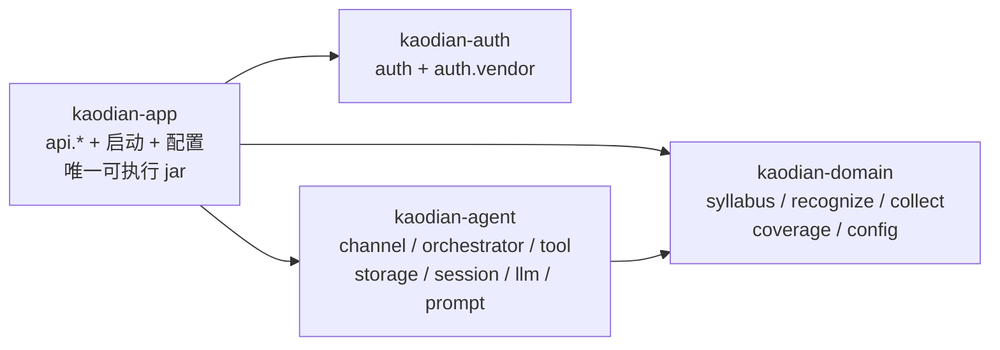

<!-- 受众=后端开发组(stage 2 六份模块设计执行人)+ stage 3 总装人 | 篇幅上限=910 行 / 3.8 万字 | 深度档位=详设 -->

> **基线:`origin/v1` @ `ad58fca`**(2026-09-04 刷新)。**代码侧取证基线仍是 `81a2c23`,行号即该基线的行号且今天仍然有效** ——
> `git diff --stat 81a2c23..ad58fca -- server/ web/src/` 实测 **0 字节**,本议题全程 0 行代码改动。
>
> **这份文档是 stage 2 六份模块设计的唯一公共前提。** 它只回答「六份都要用、六份不许各答一遍」的那十件事,不回答任何一个模块自己的业务问题。
>
> **本轮代码 0 行。** 下面出现的所有类名、签名、配置键都是**待实现的目标形态**,不是现状 —— 现状一律另起一行标「现状」并给出文件与行号。
>
> 与两份既有文档的关系:`接口契约-签名与错误码全集` 是**总契约**(端点面),`后端系统设计与组件接入` 是**现状说明**(代码面)。本文补的是两份之间那一层:**契约要落地时,横切的那部分怎么落。** 与两份冲突时,冲突逐条登记在 §十四,要合进总契约的原文写进 §十五 `§契约增量`,**本轮不改那两份文件一个字。**

## 一、十条结论速查

**每一条都配一条可跑判据。判据跑不了的结论不算结论。**

| # | 题目 | 结论(一句话) | 判据 |
|---|---|---|---|
| `B0-1` | 持久化形态 | 六份模块设计**写 store 接口,不写 DDL**。文件 → MySQL 由「第一次需要一台公网可达的服务器」触发,不由日期触发 | 本轮结束时 `find . -name '*.sql' \| wc -l` 仍为 `0`(§二) |
| `B0-2` | ID 统一 | 统一为 **`long`(int64)**,JSON 里以字符串传输。`kaodian-auth` 的 `u_`+UUID 是唯一的出格方 | 启动期读到 `u_` 开头的 id → 拒绝启动(§三) |
| `B0-3` | 行为层租户列 | 三个实体加 **`long userId`,必填、无默认、无 `0` 哨兵**。存量孤儿数据拒绝启动,出路是显式配置项 | `domain` 不出现 `CurrentUser`/`SecurityContext`/`Principal`(§四) |
| `B0-4` | 鉴权默认值 | **一个过滤器 + 一张写死的**七行**白名单常量**,白名单外无令牌一律 `401` | 一个测试枚举全部端点,断言白名单外的每一个无令牌时都 `401`(§五) |
| `B0-5` | 响应包络与错误码 | `code` 落成**枚举** `ErrorCode`,HTTP 状态挂在枚举上。`ApiError` 补第四个可选字段 `details` | 测试从 `接口契约` §十 抽出 **80 个码**,与 `ErrorCode.values()` 双向比对(§六) |
| `B0-6` | 分页与幂等 | 分页只有游标一种,形状 `{items, nextCursor?}`;幂等三种键各有其名。**请求键的端点全集以 `接口契约` §3.3 那张表为唯一真源（🔴 **行数只在那张表上有，本文不复述** —— 复述过一次，它就过期过一次）**,其中**不含退款** | DTO 里 `total`/`hasMore`/`page`/`offset` 零命中 —— **今天不是零**(§七) |
| `B0-7` | 配置与密钥 | 密钥只走环境变量;`auth-keys.properties` 属于数据。已有两道装置,缺的是**不依赖本地 git config 的那一道** | CI 上跑同一条敏感文件扫描(§八) |
| `B0-8` | Spring Boot 分叉 | 按**实际的 4.1.1** 推进。`技术架构与接口契约` §三 那一行**不改**,原处加指针 —— 原文写进 §十五(§九) |
| `B0-9` | 依赖图闸门 | `maven-enforcer-plugin` 的 `bannedDependencies`,装在 `kaodian-domain` 与 `kaodian-agent` 上 | `./server/build.sh -q test` 构建期失败,**且拦得住传递依赖**(§十) |
| `B0-10` | 红线闸门 | 八条各一条判据,**三条已有装置、两条半有、三条待建** | 逐条见 §十一 |

外加唯一的一个端点:`GET /api/v1/auth/agreements/current`(§十二)。

🔴 **十条里没有一条是「待定」。** 需要人拍板的两处写在 §16.1 —— **2026-09-04 两处都已拍板**:前缀**现在**迁(§16.2)、用户自填的正确率**算**禁词(§11.4)。两条都改变了 `B0-4` 与 `B0-10` 的落法,动手前先读这两节。

---

## 二、`B0-1` 持久化形态:本轮写 store 接口,不写 DDL

### 2.1 现状与目标

| | 形态 | 出处 |
|---|---|---|
| **现状** | 文件 JSON,11 个落盘位置 | `后端系统设计与组件接入` §8.6 |
| **目标** | MySQL 8,§5.2 列了 15 张表、§5.3 画了其中 8 张的 ER | `技术架构与接口契约` §五 |
| **实测** | 全仓 `.sql` 文件 **0 个** | `find . -name '*.sql' \| wc -l` → `0` |

### 2.2 裁定:交付物是 store 接口,不是 DDL

**理由不是「DDL 以后再说」,是写现在这一版 DDL 一定会分叉。**

现成的证据就在仓库里:`技术架构与接口契约` §5.3 那张 ER 图与 `后端系统设计与组件接入` §八 的现状图**对不上**(8 个实体 vs 20 个实体、`bigint id` vs `u_`+UUID),而两张图都还在。**一份没有任何代码消费的 DDL,就是下一张对不上的图。**

`后端系统设计与组件接入` §8.6 已经把方向写死了,本文照抄:

> **换 JDBC 那天,`auth-accounts.json` 那一条变成一个事务,形状不变。**

**「形状不变」这四个字就是本轮的交付物。** 每份模块设计给的是:

| 给 | 不给 |
|---|---|
| 实体的**字段清单 + 类型**(Java 类型,不是 SQL 类型) | `CREATE TABLE` |
| **store 接口的方法签名**(`find` / `save` / `deleteBy…` 的入参与返回类型) | 索引、字符集、引擎 |
| 唯一性约束**说成什么组合唯一**(`(type, identifier)` 唯一) | `UNIQUE KEY` 的写法 |
| 哪几次写必须**原子**(同一次落盘 / 同一个事务) | 事务隔离级别 |

### 2.3 迁移时点:由判据触发,不由日期触发

| # | 触发条件(哪个先到算哪个) | 为什么是它 |
|---|---|---|
| 1 | **第一次需要一台公网可达的服务器** | `接口契约` §待办5 已重述这个时点:「『第一次需要服务器』这个时点消失了;取代它的是『第一次需要一台公网可达的服务器』,而那个时点仍然存在」 |
| 2 | **进程需要第二个实例** | 文件存储的全部前提是「整个进程一份 `touches.json`」。第二个实例出现的那一刻这个前提消失,而它消失是**无声的** |

🔴 **不写「阶段 X」也不写日期。** 排期由项目经理排(`技术架构与接口契约` 引言:本文不重排),而这两个条件是技术事实,谁排期都改不动。

### 2.4 判据

> ✅ **2026-09-05 KUBI-112:§2.3 的触发条件 1 已经命中,下面判据 ① 的期望值随之作废。**
> MySQL + Redis 已部署到 `62.234.164.41`,后端经同机 Caddy 反代对外联调 ——「第一次需要一台公网可达的服务器」
> 就是那一天。**§2.3 的两条触发条件与下面这段原文一个字不改**,失效的只是判据 ① 的那个数字:
>
> - 判据 ① 现在期望 **1**,而不是 0:唯一的那个 `.sql` 是 `server/db/schema.sql`。
>   多出第二个,才说明有人绕开了「表结构改动一律追加进同一个文件」这条纪律。
> - 🔴 判据 ① 原本还兼职守着一条红线(「没有一份模块设计偷偷写了建表语句」)。它现在守不住了,
>   而 `.sql` 恰好是 R-01 唯一的盲区 —— `NoStemFieldTest` 扫的是编译后的 Class,`ImageRetentionTest` 只扫 `.java`。
>   接替它的是 `server/kaodian-app/src/test/java/com/kaodian/server/redline/NoStemColumnTest.java`:
>   拿 `NoStemFieldTest` 的**同一份**禁用词表扫建表脚本的列名,并要求任何自由文本列的上限不超过 200。
> - 判据 ② 不再是空转,可以真跑了。实测:**六个 store 接口(`TouchStore` / `RecordTagStore` / `AssertionStore` /
>   `SyllabusStore` / `SmsCodeStore` / `SmsRateLimiter`)一行未改**,`git diff origin/v1` 里它们一个都不出现。
>   变的只有实现侧:新增五个 `Jdbc*` / `Redis*` 类;`File*` 实现各加一行 `@ConditionalOnProperty`(3~4 行),
>   例外是 `FileTouchStore` —— 它的种子解析被抽成 `TouchSeed` 给两种后端共用(净 −102 行,行为不变)。
>
> 迁移范围与**没有迁的部分**(账号 / 令牌 / agent 运行记录)见 `deploy/README.md` §5。

```bash
# ① 本轮结束时仍无 DDL —— 六份模块设计没有一份偷偷写了建表语句
find . -name '*.sql' -not -path './node_modules/*' | wc -l          # 期望 0

# ② 迁移那天的判据(现在跑是空转,留着是为了那天有人跑):
#    store 接口的方法签名在换 JDBC 前后逐字不变
git diff <换库前> <换库后> -- 'server/*/src/main/java/**/*Store.java' \
                             'server/*/src/main/java/**/*Repository.java'   # 期望只有实现类变,接口 0 行
```

---

## 三、`B0-2` ID 统一:`long`,而且出格的只有一方

### 3.1 现状是三个答案,不是两个

`R-93` 登记的是两个(`String` vs `long`)。**实读基线得到三个:**

| 出处 | 类型 | 取证 |
|---|---|---|
| `技术架构与接口契约` §5.3 目标 ER | **`bigint id PK`** / `bigint user_id FK` | `docs/technical/INDEX.md:439,451,471` |
| `kaodian-auth` 运行时 | **`String id`**,`u_` + 32 位 UUID | `server/kaodian-auth/src/main/java/com/kaodian/server/auth/AppUser.java:22` |
| `kaodian-agent` 运行时 | **`long userId`**,恒为 `0L` | `server/kaodian-agent/src/main/java/com/kaodian/server/agent/session/AgentSession.java:23`;硬编码在 `server/kaodian-app/src/main/java/com/kaodian/server/api/agent/AgentController.java:76` |

**还有第四处,而且它是已冻结的契约:**

> `接口契约` §1.1:**标识 —— 服务端标识一律 `int64`,JSON 里以字符串传输**(`"nodeId": "10231"`)。理由:JS `Number` 在 2^53 之上丢精度,而四个端里有两个是 JS。

### 3.2 裁定:统一为 `long`(int64),JSON 以字符串传输

**不是投票,是数出格的有几方。**

| 候选 | 与 §1.1 一致? | 与 §5.3 目标 DDL 一致? | 与 `agent` 一致? | 要改几个模块 |
|---|---|---|---|---|
| **`long`** ✅ | ✅ | ✅ | ✅ | **1**(`auth`) |
| `String` | ❌ 破坏一条已冻结的全局约定 | ❌ | ❌ | 2(`agent` + 目标 DDL 一起改) |

选 `String` 要同时推翻 §1.1 与 §5.3 两处已写死的东西。**为一个字段破一条全局规则,换来的是「哪些标识是 int64」从此变成一件要记的事。**

### 3.3 落法

| 项 | 目标形态 |
|---|---|
| 类型 | `long`。`AppUser.id` / `UserIdentity.userId` / `AccessToken.userId` / `AccountMergeLog.fromUserId`·`toUserId` / `SignupEntry.userId` / `AgentSession.userId` / `AgentRun.userId` 全部 `long` |
| JSON | **字符串**。`AccountDto.userId` / `LoginResponse.userId` 保持 `String` 类型不变 —— 变的是里面装什么(`"u_3f2a…"` → `"10001"`) |
| 发号(文件态) | `auth-accounts.json` 顶层加 `nextUserId`,**与账号数据同一次原子落盘**。理由与 §6.11 密钥指纹同一条:分两次写会出现「发了号但账号没写进去」的中间态 |
| 发号(MySQL 态) | `app_user.id BIGINT AUTO_INCREMENT`。迁移时 `nextUserId` 这个键丢弃 |
| **起始值 `10001`** | 🔴 **`0` 必须在结构上不是一个合法 userId** —— `0L` 正是 `AgentController.java:76` 那个硬编码哨兵。从 `10001` 起号,任何残留的 `0L` 一眼就是错的,而不是「一个恰好存在的用户」 |
| `domain` 校验 | `userId > 0`(`接口契约` §11.2 允许列已写)。**不查「这个用户存不存在」** |
| **业务实体主键** | 🆕 **同样 `long`,JSON 里同样是字符串。** `Touch.id` / `RecordTag.id` / `RecordTag.recordId` / `TagAttempt.recordId` / `jobId` / `nodeId` 全部 `long`。⚠️ **例外只有一个:令牌标识 `tokenId` 是不透明字符串** —— `接口契约` §1.1 第三行 + `M5` §十三 增量 4。**两个令牌面都算(`GET /tokens` 登录设备 · `GET /tokens/readonly` 只读令牌),它们读同一张表。** ⚠️ **2026-09-04 更正(codex 审核轮):本行上一版把例外写成「只读令牌的」,把范围缩小了一半,正好和 `M4` 那边写成 `long` 撞在一起** |

⚠️ **2026-09-03 补(KUBI-89 审核轮):上一版的 §3.3 只点名了「用户标识」那一族字段,没说业务实体主键。**
结果是 `M2` 的 `TagAttempt.recordId` 写成 `String`、`M4` 的 `jobId`/`tokenId` 写成 `long` —— **两份都没错,因为 B0 没说。**
这一行补的就是那句没说的话:`B0-2` 管的不只是 userId,是**所有内部标识**。判据与 §3.5 判据 ① 同一条 `grep`,扫描面从 `*.userId` 扩到「实体上的 `id` / `*Id` 字段」。

### 3.4 迁移与兼容窗口:**窗口为零,而且不写迁移代码**

**为什么零:没有需要兼容的对象。**

- KUBI-76 `metadata.redline_hit` 实读记录:**「无对外部署证据,不称已上线」**
- `auth-accounts.json` 只存在于开发机(`.githooks/pre-commit:31` 的 `SENSITIVE` 正则拦着它进仓库)

**所以不写迁移器。** 一个只会跑一次、跑完就是死代码的迁移类,是为一个不存在的存量付成本。改类型那次提交在说明里写一行「删掉本机 `~/.kaodian/auth-*.json` 重新注册」。

🔴 **但这个「不存在」是一个假设,假设要有执行装置。** 照抄 `后端系统设计与组件接入` §6.11 `PhoneKeyGuard` 的形态 —— **有守卫、有出路、出路留痕:**

```java
// kaodian-auth,启动期。约 5 行,不是一个迁移器。
if (accounts.stream().anyMatch(u -> u.id().startsWith("u_"))) {
    throw new IllegalStateException("""
        检测到 B0-2 之前的存量账号数据(id 以 u_ 开头),共 %d 条。
        本机开发数据:删掉 ~/.kaodian/auth-*.json 重新注册即可。
        这台机器上的数据不能删:停手上报,不要绕过这一条。
        """.formatted(n));
}
```

**为什么是拒绝启动而不是 WARN:** 放行的后果是老账号的 `u_` id 与新账号的 `10001` 并存,而两种 id 都能通过 `String` 字段的类型检查 —— **那正好是一次「接口全部 200、日志一条没有」的 `R-59` 同构失败。**

**令牌不失效:** `AccessToken` 按 `tokenHash` 索引,`userId` 只是它的一个字段。既然不做数据迁移(直接删文件),这一条自然成立 —— 写在这里是因为「换 ID 会不会强制全体重新登录」必然被问到,答案是**这一轮压根没有「全体」**。

### 3.5 判据

```bash
# ① auth 侧不再有 u_ 前缀的发号
grep -rn 'startsWith("u_")\|"u_" +' server/kaodian-auth/src/main/java   # 期望只剩上面那条守卫
# ② agent 侧不再有硬编码 0L
grep -rn 'new AgentRequest(0L\|userId = 0L' \
     server/kaodian-app/src/main/java server/kaodian-agent/src/main/java   # 期望 0 命中
# ③ 起始值不是 0/1
grep -rn 'nextUserId' server/kaodian-auth/src/main/java                    # 期望初值 10001
```

⚠️ 判据 ② 的**动手时间**由 KUBI-78 决定(已裁定延后)。**延后的是动手时间,不是这条判据** —— 它现在是红的,红着是对的,`in_review` 时如实报红。

---

## 四、`B0-3` 行为层租户列:加 `long userId`,且不许顺手建出那条边

### 4.1 现状

| 实体 | 文件 | 现有字段 | 有 `userId`? |
|---|---|---|---|
| `Touch` | `server/kaodian-domain/.../collect/Touch.java` | `id` `nodeCode` `sourceName` `kind` `occurredAt` `drill` `clientToken` | **不存在**(不是可空) |
| `RecordTag` | `.../collect/RecordTag.java` | `id` `recordId` `nodeCode` `confidence` `origin` `confirmedAt` `discarded` | **不存在** |
| `UserAssertion` | `.../collect/UserAssertion.java` | `nodeCode` `assertedAt` | **不存在**(只有两个字段) |

### 4.2 落法

| 项 | 目标形态 |
|---|---|
| 字段 | 三个实体各加 `long userId`,**位置在 `id` 之后第一位** |
| 可空性 | **必填,无默认值,无 `0` 哨兵。** `0` 不是合法 userId(§3.3),构造器里 `userId > 0` 不成立即抛 |
| `RecordTag` | `userId` **冗余存一份**,不靠 `recordId` 反查 —— 覆盖度计算是按用户过滤的热路径,反查会让每次差集多一次连接;而且它让「一条 tag 的归属」在数据里可以自证 |
| `UserAssertion` | 主键从 `nodeCode` 变为 **`(userId, nodeCode)`**。现在这个单列主键就是「所有人共用一份『我已掌握』」的物理形态 |
| 谁传进来 | 🔴 **`app` 从鉴权上下文取出 `userId`,显式传给 `domain` 的方法参数。** `domain` 自己不去拿 |

### 4.3 🔴 那条不许建出来的边

**`接口契约` §11.2 那张表原样执行,一格不改:**

| 允许 | 不允许 |
|---|---|
| `domain` 的方法签名里出现 `long userId` 参数 | `domain` 里出现任何 `CurrentUser` / `SecurityContext` / `Principal` / `@AuthenticationPrincipal` |
| `app` 从鉴权上下文取出 `userId`,显式传给 `domain` | `domain` 依赖 `kaodian-auth` 的任何类型 |
| `domain` 校验 `userId > 0` | `domain` 自己去查「这个用户存不存在」 |

**最省事的实现(给 `domain` 注入一个「当前用户」)会建出 `domain → auth`,而它是四模块无环图里唯一还没被建出来的那条边。** 执行装置见 §十 —— 从 `B0-9` 起这不再是一条要记住的规矩,是构建会不会过。

### 4.4 存量「不归任何人」的数据

**处置:拒绝启动,出路是显式配置项,放行时丢弃且留痕。** 形态照抄 `accept-key-loss`(`后端系统设计与组件接入` §6.11)。

| 情形 | 处置 |
|---|---|
| 三个文件全空 | 放行(全新环境) |
| 有无 `userId` 的条目,`kaodian.collect.accept-orphan-loss=false`(默认) | **拒绝启动**,消息里写明三个文件各有多少条 |
| 同上,配置为 `true` | 放行,**丢弃**那些条目,记 ERROR + 每个文件的确切条数 |

🔴 **为什么是丢弃,不是认领给第一个用户。** 认领的那一版会把别人记的东西算进这个人的覆盖度 —— 而覆盖度是这个产品**唯一的那个指标**。宁可丢一批开发期的假数据,不可以让唯一的指标带着一批来路不明的记录出生。这与「宁缺毋滥」是同一条推理:错的标签比没有标签更贵。

### 4.5 判据

```bash
# ① 那条边没有被建出来(结构层)
grep -n 'kaodian-auth' server/kaodian-domain/pom.xml         # 期望 0 命中
# ② 那条边没有被绕过来(语义层)—— 换个名字引进来也算
grep -rn 'CurrentUser\|SecurityContext\|Principal\|AuthenticationPrincipal' \
     server/kaodian-domain/src/main/java                      # 期望 0 命中
# ③ 三个实体真的有 userId
grep -n 'long userId' \
  server/kaodian-domain/src/main/java/com/kaodian/server/collect/{Touch,RecordTag,UserAssertion}.java   # 期望各 1
```

判据 ① ② 缺一不可:① 是构建工具的事,但它只看 `pom.xml`;② 抓的是「没加依赖却把概念搬进来了」—— 比如在 `domain` 里自己定义一个叫 `CurrentUser` 的接口。

---

## 五、`B0-4` 鉴权默认拒绝:一个过滤器 + 七行白名单

### 5.1 现状:鉴权是「作者记得写」的,不是默认的

**实读基线,四条同时成立:**

- 全仓 **0 个** `OncePerRequestFilter` / `SecurityFilterChain` / `HandlerInterceptor`,**0 个** `spring-boot-starter-security` 依赖
- 鉴权靠参数解析器 `server/kaodian-app/src/main/java/com/kaodian/server/api/support/CurrentSessionResolver.java`,**只对声明了 `CurrentSession` 参数的方法生效**
- `RecordController.java:92` 起的四个方法**没有一个**声明 `CurrentSession`
- `AgentController.java:76` 的 `userId` 恒 `0L`

`CurrentSessionResolver` 的类注释自己把代价写清楚了:「**代价是『公开』仍然是默认值**」。

### 5.2 裁定:修的是那个默认值

🔴 **判据只有一条:新增一个 controller 忘了加鉴权,它必须默认打不通。**

```java
// kaodian-app · api/support/ApiAuthFilter.java —— 目标形态
@Component
public class ApiAuthFilter extends OncePerRequestFilter {

    /** 🔴 匿名端点全集,七行。加一行要在 接口契约 §三 同时加一行,两处不一致由 §5.5 判据 ② 判红。 */
    static final List<Anonymous> WHITELIST = List.of(
            new Anonymous(POST, "/api/v1/auth/sms/send"),
            new Anonymous(POST, "/api/v1/auth/sms/verify"),
            new Anonymous(POST, "/api/v1/auth/wechat/login"),
            new Anonymous(GET,  "/api/v1/auth/agreements/current"),
            new Anonymous(POST, "/api/v1/auth/wechat/phone-login"),     // M5 增量 1
            new Anonymous(GET,  "/api/v1/auth/wechat/authorize-url"),   // M5 增量 1
            new Anonymous(POST, "/api/v1/billing/notify/wxpay"));   // 另一条鉴权链,见下表
}
```

| 项 | 落法 |
|---|---|
| 生效范围 | `/api/v1/**`。**健康检查不在 `/api/v1` 下**,所以它不需要进白名单(`接口契约` §三 已写) |
| 匹配 | **`(method, path)` 全等,不是前缀匹配。** 前缀匹配会让 `/api/v1/auth/sms/send/../../records` 这类路径落进白名单;而且 `/api/v1/auth/**` 一整段匿名会把 `/auth/logout`、`/auth/merge/**` 一起放出去 |
| 白名单外无令牌 | `401 UNAUTHORIZED` |
| 白名单外令牌**仅仅是过期** | `401 TOKEN_EXPIRED`(§5.3) |
| 只读令牌命中非 `GET` | `403 READONLY_TOKEN` |
| 只读令牌命中 `/billing/**` `/quota/**` `/agent/**` `/tokens/**` | `403 READONLY_TOKEN`,**不论方法**(`接口契约` §3.1 锁 2 / 锁 4) |
| `POST /auth/refresh` | **唯一接受 `TOKEN_EXPIRED` 令牌的端点**;已吊销的令牌仍 `401 UNAUTHORIZED`(`接口契约` §3.1) |
| `/billing/notify/wxpay` | 🔴 **不是匿名,是另一条鉴权链** —— 独立验签,过滤器放行后由该 controller 自己验签。放进这张表是为了让「**七行里真正匿名的只有六行**」不被误读成「回调漏了」 —— 🔴 **常量与 `接口契约` §三 都是七行**,第七行是它,只是它那一行走的不是令牌那条链 |
| `CurrentSessionResolver` | **保留**。过滤器负责「能不能进」,解析器负责「进来的是谁」。两件事,不合并 |

### 5.3 🔴 一处必须点破:`401` 要拆三档,而现在的代码刻意不拆

⚠️ **2026-09-03 更正(KUBI-89 审核轮):本节上一版写的是「两档」,漏掉了 `ACCOUNT_DEACTIVATED`。**
以 `接口契约` §1.2 与 `M5-账号与登录通道` §4.3 为准。**B0 是六份模块设计的唯一公共前提,它停在两档,读它的人就会漏掉一整档。**

**`接口契约` §1.2 要求:**「`401` 必须能区分『从没登录』/『登录过期』/『已注销』:`UNAUTHORIZED` / `TOKEN_EXPIRED` / `ACCOUNT_DEACTIVATED`。`U5.1` 要前两档 —— 区分不出来登录门的副标题就写不出来;`U5.5` 要第三档。」

**而 `CurrentSessionResolver.java` 的注释是反过来写的,而且给了理由:**

> 🔴 四种失败(没带头、格式不对、查不到、已过期/已吊销)对外是同一个 401。区分它们对用户没有区别(都要重新登录),对攻击者却是信息。

**裁定:契约赢,拆三档不是四档。**

| 情形 | 判定依据 | `code` | 泄露了什么 |
|---|---|---|---|
| 令牌存在、**仅仅过了 `expiresAt`** | 令牌 | `TOKEN_EXPIRED` | **什么都没有** —— 持有这个令牌的人本来就知道它曾经有效 |
| 令牌已吊销,**账号仍 `ACTIVE`** | 令牌 + 账号 | `UNAUTHORIZED` | 已吊销与查不到仍然分不开,解析器注释那条顾虑原样保住 |
| 令牌已吊销,**账号 `DEACTIVATED`** | **账号** | `ACCOUNT_DEACTIVATED` | 只对已注销本人说出「你已注销」—— 而他本人就是执行注销的那个人 |
| 没带头 / 格式不对 / 查不到 | 令牌 | `UNAUTHORIZED` | 同第二行 |

**「已吊销」不能单独成档**,那才是真的送信息:它等于告诉持有者「这个令牌曾经是真的」,而 `POST /tokens/revoke-all` 存在的意义正是让被吊销的一方什么都不知道。

🔴 **第三档不破上面这一条,因为它的依据是账号状态不是令牌状态:** 被踢下线而账号还活着的一方走第二行 `UNAUTHORIZED`,原样什么都不知道。而**查不到令牌行的时候永远说不出 `ACCOUNT_DEACTIVATED`** —— 那时候根本没有 `userId` 可查,泄露面由结构限死,不靠实现者自觉。

**需要的签名变更(`kaodian-auth`。现状 `TokenService.verify` 返回 `Optional<AccessToken>`,把四种失败折叠成一个空值):**

```java
sealed interface TokenCheck permits Valid, Expired, Revoked, Invalid {
    record Valid(AccessToken token) implements TokenCheck {}
    record Expired() implements TokenCheck {}            // 令牌确实存在过,只是过了 expiresAt
    record Revoked(long userId) implements TokenCheck {} // 🔴 内部档,不直接映射成一个 code
    record Invalid() implements TokenCheck {}            // 其余全部(没带头 / 格式不对 / 查不到)
}
TokenCheck check(String plaintext);               // 新增
Optional<AccessToken> verify(String plaintext);   // 保留,给不关心档位的调用方
```

🔴 **`Revoked` 带 `userId` 是这三档能落地的唯一原因** —— 没有它就查不到账号状态,`UNAUTHORIZED` 与 `ACCOUNT_DEACTIVATED` 分不开。它本身**不对外映射成一个 `code`**:对外是查完账号之后在那两个码里二选一。

**这一格归 `M5`(KUBI-94)实现,`B0` 只定形状与理由。**

### 5.4 `/api/records` 与 `/api/agent/**`

| 端点组 | 本轮 | 依据 |
|---|---|---|
| `/api/records/**` | **补鉴权,与 `B0-3` 的租户列同一次改动落地** | `接口契约` 待办 1。🔴 顺序不能倒:先加鉴权后加租户列,会造出 `CurrentSessionResolver` 注释里说的那个「看起来分了用户其实没分」的假象 |
| `/api/agent/**` 五端点 | **给目标形态,本轮不动手** | KUBI-78 已裁定延后。目标形态:走同一个过滤器 + `app` 把 `userId` 作为 `AgentRequest` 的入参传进去,**不许 agent 自己开一个「从会话里读出当前用户」的入口**(`接口契约` §11.2 末段) |

🔴 **延后的是动手时间,不是那条冲突。** KUBI-76 `metadata.redline_hit` 实读记录着它:五端点不校验令牌、`userId` 恒 `0L`、会话读删不校验归属,**与已冻结口径 1「不登录不能记」直接冲突**。本文不撤销这条登记。

### 5.5 判据

```java
// ① 默认拒绝 —— 这条是 B0-4 的全部意义。新增 controller 忘了鉴权,这个测试变红。
@Test void 白名单之外的每一个端点在无令牌时都是401() {
    for (var m : handlerMapping.getHandlerMethods().keySet()) {
        for (var path : pathsOf(m)) {
            if (ApiAuthFilter.WHITELIST.contains(anonymousOf(m, path))) continue;
            assertThat(mvc.perform(request(methodOf(m), path)))
                .as("端点 %s 没有令牌却不是 401 —— 忘了它默认应当打不通", path)
                .hasStatus(401);
        }
    }
}

// ② 白名单与契约同源 —— 代码里七行,接口契约 §三 的表也必须是同七行
@Test void 白名单与接口契约第三节逐行一致() { /* 解析 md 表格,双向比对 */ }
```

**判据 ② 存在的理由写在 `接口契约` §三 里:**「这张表的行数只许因为『真的多了一个匿名入口』而变……**白名单存在的意义正是『匿名入口的全集在这一处数得清』**」。两处各写各的就会各漏各的 —— `后端系统设计与组件接入` §4.2 那份自动装配排除清单漏掉 `moderation`,正是这个成因。

---

## 六、`B0-5` 响应包络与错误码落点

### 6.1 响应包络

**成功响应:裸对象,没有 `{code:0, data:…}` 这层壳。**

理由:HTTP 状态码已经承担了「成不成」,再包一层等于让每个端先解一次壳再判一次 —— 而两处判定不一致时(HTTP 200 + `code:500`),端要写一条规矩决定听谁的。**现状就是裸对象,本条是把现状写成约定,不是改动。**

**错误响应:`ApiError`,现状三个字段,补第四个。**

```java
// 现状:server/kaodian-app/src/main/java/com/kaodian/server/api/dto/common/ApiError.java
public record ApiError(String code, String message, String traceId) {}

// 目标:补 details,且 null 时整个 key 不出现
@JsonInclude(JsonInclude.Include.NON_NULL)
public record ApiError(String code, String message, String traceId, Map<String, Object> details) {}
```

| 字段 | 类型 | 必填 | 说明 |
|---|---|---|---|
| `code` | `string` | ✅ | 取值域 = `ErrorCode` 枚举全集,见 §6.2 |
| `message` | `string` | ✅ | **仅供日志与排查,端一律不直接展示。** 展示文案由端按 `code` 查自己的词表 |
| `traceId` | `string` | ✅ | 排查用。已实现 |
| `details` | `object` | — | 🔴 **只在 `接口契约` 逐个端点明确写了形状时才有。没写形状就不许有** |

🔴 **`@JsonInclude(NON_NULL)` 不是风格选择,是 `接口契约` §1.1 空值规则的执行装置:**「『没有这个字段』与『值是 0/空串』必须能被区分:没有就不出现这个 key」。返回 `"details": null` 就是把这条规则破掉。

**已知要用 `details` 的三处**(形状在各自模块设计里定,`B0` 只登记它们存在):`PHONE_LOCKED` 带准确解锁时点、`CODE_WRONG` 带剩余次数、`QUOTA_EXHAUSTED` 带手动记录入口提示(`接口契约` §10.5 / §10.7 三处逐字要求)。

### 6.2 `code` 落成枚举,不是常量

```java
// kaodian-app · api/dto/common/ErrorCode.java
public enum ErrorCode {
    UNAUTHORIZED(401), TOKEN_EXPIRED(401), READONLY_TOKEN(403),
    VALIDATION_FAILED(400), INVALID_LIMIT(400), IN_PROGRESS(409),
    SERVER_ERROR(500), /* … 共 80 个 */;

    private final int status;
    public HttpStatus httpStatus() { return HttpStatus.valueOf(status); }
}
```

| 为什么枚举而不是 `String` 常量 | |
|---|---|
| **判据可跑** | 「端上不许出现 §十 之外的码」这句话,只有在码是一个**封闭类型**时才测得了。散落的字符串常量 grep 不出「少了哪一个」 |
| **HTTP 状态不再散落** | 状态挂在枚举上,`ApiExceptionHandler` 不再自己决定用哪个状态。`接口契约` §1.3 把状态收窄到九个,而收窄只有在一处决定时才守得住 |
| **迁移成本低** | `ApiException` 已经是 `(HttpStatus, String code, String message)` 三参构造。加一个 `(ErrorCode, String message)` 构造器,老构造器标 `@Deprecated`,不需要一次改完 |

### 6.3 🔴 判据:枚举与契约 §十 双向比对(已实测可跑)

**这条是 `B0-5` 的核心交付,形态照抄仓库里已有的 `scripts/boundary-copy-check.py`(文案同源检查)—— 文档是真源,代码跟着,不一致就红。**

**抽取规则(逐条写死,因为 §十 里有三处「长得像码但不是码」的东西):**

1. 只取 **§10.2 / §10.3 / §10.4 / §10.5 / §10.6 / §10.7** 六节的表格**首列**
2. **不取 §10.1** —— 那是「四处码名对不上」的登记表,左列是**已废弃的错名**(`SMS_CODE_WRONG` 等),取进来会把废名当现役
3. 首列一格多码时按反引号逐个抽(`MISSING_AUDIO / AUDIO_TOO_LARGE / …` 一格四个)
4. 带删除线 `~~X~~` 的行**跳过**(`EXAM_TYPE_UNSUPPORTED` 今天没有端点能抛出它)
5. 表头行与分隔行跳过

**这条规则已在基线 `81a2c23` 上实跑验证:**

| 结果 | 值 |
|---|---|
| 抽出的码 | **80 个,零重复** |
| `NETWORK_TIMEOUT` 被抽到? | ❌ 否 —— 它只在正文里,不在任何表格首列。§10.2 正文明写「服务端永远不会返回它」 |
| `NO_MATCH` 被抽到? | ❌ 否 —— 同上。它是 `POST /tags/suggest` **成功响应**里的 `state` 取值 |
| `EXAM_TYPE_UNSUPPORTED` 被抽到? | ❌ 否 —— 删除线行被规则 4 跳过 |

**三处「长得像码但不是码」全部自然落在规则外,规则不需要维护一张例外名单。**

🔴 **本文不写「80」这个数字进代码,也不写进任何断言。** 写死一个总数,它就会和表分叉:`接口契约` 里 §12.10 写「8 个」而 §10.8 只列了 7 个,两处对不上 —— **那就是把总数写死的代价**。比对脚本每次自己数。

### 6.4 落差登记:80 个码里,代码今天有 55 个

**实测(基线 `81a2c23`,grep 四个模块 `src/main/java` 的全部大写下划线字符串字面量):**

| | 数 |
|---|---|
| 契约 §十 定义 | **80** |
| 代码里已出现 | **55** |
| **契约有、代码无** | **25** |

```
ACCOUNT_DEACTIVATED · AGREEMENT_VERSION_STALE · AI_TEXT_TOO_LONG · CAPTCHA_REQUIRED ·
CONTEXT_ALREADY_BOUND · EXAM_DATE_OUT_OF_RANGE · IDEMPOTENCY_KEY_REQUIRED · IMAGE_TOO_MANY ·
INVALID_LIMIT · IN_PROGRESS · MESSAGE_REQUIRED · MESSAGE_TOO_LONG · NODE_ARCHIVED ·
ORDER_ALREADY_PAID · ORDER_NOT_FOUND · QUOTA_EXHAUSTED · RECEIPT_INVALID · REVOKE_ALL_FAILED ·
SERVER_ERROR · SESSION_EXPIRED · SESSION_TURN_LIMIT · SYLLABUS_EMPTY · TOKEN_EXPIRED ·
UNKNOWN_CONTEXT_SOURCE · UNKNOWN_ORDER_BY
```

**两条要点破:**

- **`SERVER_ERROR` 在这 25 个里,不是因为没实现,是因为代码里叫 `INTERNAL_ERROR`。** §10.2 已写「本表统一为 `SERVER_ERROR`」—— 这是一次**改名**,不是一次新增
- **`TOKEN_EXPIRED` 在这 25 个里** —— 与 §5.3 是同一件事的两个投影:代码把四种 401 折叠成一个,所以这个码没有出生的地方

🔴 **这 25 个不是 `B0` 的活。** 每一个都属于某个模块,由 stage 2 的六份各自认领。`B0` 只保证:**枚举建起来那天,这 25 个必须在枚举里**(否则 §6.3 的比对判红),**而它们各自在哪个端点抛出,由模块设计写。**

---

## 七、`B0-6` 分页与幂等的统一形状

### 7.1 分页:只有游标一种

**`接口契约` §1.4 已冻结,本文不重述规则,只定形状与落点。**

```java
// kaodian-app · api/dto/common/Page.java —— 全库唯一的分页响应形状
@JsonInclude(JsonInclude.Include.NON_NULL)
public record Page<T>(List<T> items, String nextCursor) {}
```

| 项 | 约定 | 落点 |
|---|---|---|
| `cursor` | 不透明字符串。端不许解析、构造、跨会话持久化 | 现有 `RecordCursor`(`(occurredAtMillis, id)` 两级,Base64URL)**就是这个形状**,提升为 `api/dto/common/Cursor`,`RecordCursor` 变成它的一个 `Position` 类型 |
| `limit` | `1..100`,默认 `20`。超界 → `400 INVALID_LIMIT` | 一处校验,不是每个 controller 各写一遍 |
| `nextCursor` | 🔴 没有下一页时**整个 key 不出现**。不是 `null`,不是 `""` | `@JsonInclude(NON_NULL)` |
| 解不开的游标 | `400 INVALID_CURSOR`,**且不许把原值回显** | 现有 `RecordCursor` 类注释已写明理由(查询参数没有 `@Size` 管得着,它能塞满整个请求行) |

🔴 **不返回 `total` / `pageCount` / `hasMore`。**

### 7.2 ⚠️ 这一条今天是红的:`RecordPageResponse` 三个字段都在

**实读 `server/kaodian-app/src/main/java/com/kaodian/server/api/dto/record/RecordPageResponse.java:48-56`:**

```java
public record RecordPageResponse(
        int total,          // 🔴 §1.4 明令不返回
        int returned,
        boolean hasMore,    // 🔴 §1.4 明令不返回
        @Size(max = MAX_CURSOR_LENGTH) String nextCursor,
        List<TimelineItemDto> items
) {}
```

**这是契约与代码之间的一处活冲突,不是文档落差。** §1.4 给的理由是:「一个 `total` 字段会立刻长出页码条,而页码条要求随机跳页,游标做不到」,并且 `U5.6` 逐字要求「前端不猜总数」、`U7.6` 要求「不做『加载更多』按钮」。

**裁定:删这三个字段(`total` / `returned` / `hasMore`),收敛成 `Page<TimelineItemDto>`。** 归 `M1`(KUBI-90)执行,`B0` 登记冲突并给判据。

⚠️ **删之前先 `grep -rn 'hasMore\|\.total' web/src`。** 这一步不能省:契约赢不等于可以不看调用方 —— 前端要是读着 `hasMore` 做「加载更多」,那是 `U7.6` 的另一处违反,要一起报,**不是悄悄改后端让前端断掉**。

### 7.3 幂等:三种键各有其名,而第三处不是退款

**`接口契约` §1.5 定的三种键原样执行:**

| 类型 | 键 | 用在哪 | 重复时 |
|---|---|---|---|
| **业务键** | body 里的 `clientToken`(端生成 UUIDv4) | `POST /records`、`POST /records/batch` | **`200` + 返回上一次的结果,不是 `409`** |
| **请求键** | HTTP 头 `Idempotency-Key` | 所有触发**外部账单**、所有**不可逆**改变账号状态的端点 | 上次成功 → 返回上次结果,🔴 不再扣额度、不再产生第二笔账单;上次进行中 → `409 IN_PROGRESS`;上次失败 → 允许重试 |
| **自然键** | `outTradeNo` / `transactionId` | 支付下单与回调 | 唯一索引兜底,与 `Idempotency-Key` 并存不冲突 |

🔴 **本议题描述里把第三处写成「退款」,那一处不成立。** `接口契约` §8.8 的裁定是「**退款:一个端点都不补**」,§10.7 补了一句「`/billing/**` 与 `/quota/**` 下不存在任何以 `REFUND` 开头的码」。**没有端点就没有幂等语义。**

🔴 **要用 `Idempotency-Key` 的端点全集,见 `接口契约` §3.3 那张表 —— 那是唯一真源,**行数不在本文复述**。**
下面这张三行表是本文上一版自己数的,⚠️ **已作废,保留只为存证**(数漏了五处,更正见表下):

| # | 端点 | 为什么 | 出处 |
|---|---|---|---|
| 1 | `POST /billing/orders`(下单) | 外部账单 | §1.5 + §8.6 |
| 2 | `POST /ai/ask`(AI 代发提问) | 🔴 **外部模型调用 = 按次外部账单**,重放一次就是扣两次额度 | §1.5「所有会触发外部账单的端点」+ §6.5 |
| 3 | `DELETE /account`(注销) | 不可逆改变账号状态 | §1.5「所有会不可逆改变账号状态的端点」 |
| ⚠️ **更正** | **不是三处 —— 见 `接口契约` §3.3 那张表** | 见下 | KUBI-96 stage 3 冲突裁定 1 + KUBI-89 审核轮 |

⚠️ **2026-09-03(KUBI-96 stage 3 + KUBI-89 审核轮):上面这个「三处」数漏了。** 已取并集落进 `接口契约` §3.3,**行数只在那张表上数** —— 它先更正为八行、审核轮又发现漏了 `M5` 一行改为九行,**两次都说明这个数不该在本文再存一份**。
`M2` 补 `POST /records/{id}/tags/suggest`(§4.1 正文写死它必带);`M4` 补 `POST /export/jobs` 与 `POST /tokens/revoke-all`(两行签名里逐字写着这个头);`M7` 补 `POST /billing/orders/{outTradeNo}/close` 与 `.../receipt/verify`(§8.4 / §8.5 示例里逐字写着)。
**裁定判据:以端点级签名为准** —— 那些签名是先写的,本节的横切归纳是后写的。**这一处不是错在判据上,是错在数漏了。**
🔴 **全集、各自的保留期与判据,以 [`接口契约:签名与错误码全集`](../接口契约-签名与错误码全集.md) §3.3 为唯一真源**,本节不再复述(复述一份就是第二真源)。

**统一形状(`app` 层,一个组件,三处共用):**

```java
// kaodian-app · api/support/IdempotencyGuard.java
// 锚定键 = (userId, path, Idempotency-Key)。🔴 不是参数哈希。
// 理由(§1.5 原文):参数哈希在「重试」与「合法的二次操作」之间分不出来 ——
// 用户真的想再问一次同样的问题,哈希去重会把第二次静默吞掉。
sealed interface Outcome permits Fresh, Replay, InFlight {}
Outcome begin(long userId, String path, String key);
void complete(long userId, String path, String key, Object result);
```

| 项 | 约定 |
|---|---|
| 标了要带而没带 | `400 IDEMPOTENCY_KEY_REQUIRED` |
| 哪些端点要带 | 🔴 **`接口契约:签名与错误码全集` §3.3 那张表,唯一真源(**行数只在那张表上数**)**(KUBI-96 已合入;本文 §十五 增量 2 是它的来源原文,保留作历史记录,**不要再合第二遍**) |
| 保留期 | **由各模块定,`B0` 不定一个统一天数** —— 下单与注销的合理窗口差一个数量级,统一成一个数就是给其中一个定错 |

### 7.4 判据

```bash
# ① 分页只有一种,禁词零命中(今天是红的,见 §7.2)
grep -rn '\btotal\b\|hasMore\|pageCount\|pageNo\|\boffset\b' \
     server/kaodian-app/src/main/java/com/kaodian/server/api/dto/    # 期望 0 命中
# ② 幂等键不是参数哈希拼出来的
grep -rn 'hashCode()\|DigestUtils\|sha256(' \
     server/kaodian-app/src/main/java/com/kaodian/server/api/support/IdempotencyGuard.java   # 期望 0
# ③ 退款确实一个端点都没有
grep -rni 'refund\|退款' server/kaodian-app/src/main/java            # 期望 0 命中
```

---

## 八、`B0-7` 配置与密钥

### 8.1 三条规则,两条已有装置

| # | 规则 | 装置 | 强度 |
|---|---|---|---|
| 1 | **密钥只走环境变量,不进仓库**(`R-08` 延伸) | `application.properties` 里一律 `${KAODIAN_MODEL_KEY}` 形式,不写字面值 | 检查层 |
| 2 | **`auth-keys.properties`(600)属于数据不属于配置** | `.githooks/pre-commit:31` 的 `SENSITIVE` 正则已经拦着它 ✅ **已存在** | 检查层(见 §8.2 的洞) |
| 3 | **换了密钥 = 启动期的一次响亮失败**(`R-59`) | `PhoneKeyGuard`,四种情形四种处置,只有一种拒绝启动 ✅ **已存在**,`PhoneKeyGuardTest` 14 个用例钉住 | 运行时不变式 |

### 8.2 🔴 缺的那一道:`pre-commit` 不随 clone 传播

**CLAUDE.md 自己写着:**「`git config core.hooksPath .githooks` 是**不随 clone 传播的本地配置**;不设,两道提交闸门静默关闭。」

**所以规则 2 今天的真实强度是「纪律」,不是「检查层」** —— 一台新机器上它默认是关的,而且关着的时候看起来一切正常。

**补法:同一条正则在 CI 上再跑一遍。** CI 是唯一一处「不装也躲不掉」的位置(`.github/workflows/ci.yml:139` 已经在跑 `./server/build.sh -q test`)。

```yaml
# .github/workflows/ci.yml · 加一个 step,不改现有的
- name: 敏感文件扫描(与 .githooks/pre-commit 同一条正则)
  run: |
    if git -c core.quotepath=false ls-files | grep -E -f scripts/sensitive-paths.txt; then
      echo "::error::仓库里有密钥/运行时数据/原图缓存"; exit 1
    fi
```

⚠️ **正则必须与 `.githooks/pre-commit` 同源,不是抄两遍。** 落法是两处都读同一个 `scripts/sensitive-paths.txt`;抄两遍那一版三个月后一定分叉 —— 与 §5.5 判据 ② 是同一条理由,也与 §4.2 那份自动装配清单漏掉 `moderation` 是同一个成因。

🔴 **`core.hooksPath` 这条洞本身不由 `B0` 修** —— 它不是横切契约,是仓库配置。本文只登记:**在 CI 那一步落地之前,规则 2 的强度是纪律。**

### 8.3 配置项命名

| 项 | 约定 |
|---|---|
| 前缀 | `kaodian.<模块>.<域>.<项>`,与现状一致(`kaodian.auth.keys.accept-key-loss`、`kaodian.agent.storage.root`) |
| 密钥类 | **一律 `${ENV_VAR}` 占位,不写默认值。** 写了默认值,漏配就变成静默用默认值 |
| 「我确认后果」类开关 | 🔴 **一律默认 `false`,而且必须存在。** `accept-key-loss` / `accept-orphan-loss` 同一形态 —— 理由在 §6.11:「一个没有出路的守卫,会被撞上它的人在半夜关掉 —— 然后它就永远关着了」 |
| 判据 | `grep -n 'secret\|api-key\|password' server/kaodian-app/src/main/resources/application.properties`,每一处右边都必须是 `${…}` 或整行注释掉 |

---

## 九、`B0-8` Spring Boot 分叉收口

| | 值 | 出处 |
|---|---|---|
| `技术架构与接口契约` §三 写的 | Spring Boot **3.5.x** | 「Step2 实测跑得起来的版本线,少踩一遍版本坑」 |
| `server/pom.xml` 实际 | Spring Boot **4.1.1** | 实读基线,`spring-boot-starter-parent` `<version>4.1.1</version>` |
| `后端系统设计与组件接入` | 按 **4.1.1** 推进 | §0.2 |

**裁定:按 4.1.1,原处加指针不改那一行。**

理由:4.1.1 已经在跑,而且通过全部测试。把文档改成 4.1.1 很省事,但那会抹掉「为什么当初选 3.5.x」这条信息 —— 仓库惯例(`文档规范与目录`:更正下游、上游加注、永不静默改写)对这种情况有现成答案:**在原处加指针。**

🔴 **本轮不动 `docs/technical/INDEX.md` 一个字。** 要加的原文写在 §十五 增量 8,stage 3 串行合并时落地。

---

## 十、`B0-9` 依赖图闸门:让它变成构建工具的事

### 10.1 现状:四条边,无环,今天是干净的

**实读四个 `pom.xml`:**



| 模块 | `pom.xml` 里的 `kaodian-*` 依赖 | 状态 |
|---|---|---|
| `kaodian-domain` | 无 | ✅ |
| `kaodian-auth` | 无 | ✅ |
| `kaodian-agent` | `kaodian-domain` | ✅ **never auth** |
| `kaodian-app` | 全部三个 | ✅ |

### 10.2 裁定:`maven-enforcer-plugin`,不是一个自写脚本

**议题要的是「脚本形态 + 接哪个 hook」。答案是:不写脚本 —— Maven 自带这个能力。**

```xml
<!-- kaodian-domain/pom.xml 与 kaodian-agent/pom.xml,各加一段 -->
<plugin>
  <groupId>org.apache.maven.plugins</groupId>
  <artifactId>maven-enforcer-plugin</artifactId>
  <executions><execution>
    <id>无环依赖图</id>
    <goals><goal>enforce</goal></goals>
    <configuration><rules><bannedDependencies>
      <excludes><exclude>com.kaodian:kaodian-auth</exclude></excludes>
      <message>
        依赖图上唯一不许有的那条边。domain/agent 依赖 auth,
        领域层就再也不能脱离账号体系被测。见 B0-平台底座与横切契约 §十。
      </message>
    </bannedDependencies></rules></configuration>
  </execution></executions>
</plugin>
```

| 为什么是 enforcer 而不是 `grep pom.xml` | |
|---|---|
| **拦得住传递依赖** | 🔴 `grep` 只看直接依赖。有人给 `kaodian-domain` 加一个自己引了 `kaodian-auth` 的库,`pom.xml` 里一个 `kaodian-auth` 字样都没有,而**那条边已经建出来了**。enforcer 看的是解析后的依赖树 |
| **构建层,不是检查层** | 按 `后端系统设计与组件接入` §七 的强度分级,构建层「构建期,自动」,检查层「发现依赖于记得跑那条检查」。§7.1 已点破:「一条只靠『记得 grep 一下』维持的红线,在赶工的那一周最先失效」 |
| **不用维护** | 自写脚本要处理 XML 解析、注释掉的依赖、`<dependencyManagement>` 与 `<dependencies>` 的区别 —— 每一处都是一个可以静默漏掉的地方 |

### 10.3 接哪个 hook

| 位置 | 跑什么 | 强度 |
|---|---|---|
| **`./server/build.sh -q test`** | enforcer 随 `validate` 阶段自动跑 | 🔴 **主防线。** CI 的后端 job 就是这一条(`.github/workflows/ci.yml:139`),所以它在 CI 上**自动生效,不需要加任何 step** |
| `.githooks/pre-commit` | 追加一行 `grep`,给本地一个快速反馈 | ⚠️ **不是防线** —— `core.hooksPath` 不随 clone 传播(§8.2 同一条洞) |

### 10.4 判据

```bash
# ① 一行 grep(快,但只看直接依赖)
grep -n 'kaodian-auth' server/kaodian-domain/pom.xml server/kaodian-agent/pom.xml   # 期望 0 命中

# ② 真判据:构建期失败(含传递依赖)。做法是先把它弄红一次再改回去 ——
#    「Every assertion must have been red once before it counts」(CLAUDE.md)
#    在 kaodian-domain/pom.xml 临时加上 kaodian-auth 依赖,然后:
./server/build.sh -q test   # 期望 validate 阶段失败,消息里出现「依赖图上唯一不许有的那条边」

# ③ 语义层(换个名字搬进来也算),见 §4.5 判据 ②
grep -rn 'CurrentUser\|SecurityContext\|Principal\|AuthenticationPrincipal' server/kaodian-domain/src/main/java
```

---

## 十一、`B0-10` 红线闸门:八条,每条一个可跑判据

**共同前提表那 8 条,逐条给判据。🔴 三条已有装置、两条半有、三条待建 —— 待建的如实标出来,不写成已完成。**

| # | 红线 | 判据(可跑) | 状态 |
|---|---|---|---|
| 1 | **不登录不能记。** 采集面必须带 `userId` | §4.5 判据 ③(三个实体各有 `long userId`)+ §5.5 判据 ①(`/api/records/**` 无令牌 401) | 🔴 **待建**(`B0-3` + `B0-4` 落地后转绿) |
| 2 | **额度只计外部模型调用;额度不许为负** | `M7` 的并发测试:N 个线程同时扣 1,断言余额 `>= 0` 且成功次数 == 初始额度。扣减用条件更新(`UPDATE … WHERE remaining > 0`),**受影响 0 行即视为耗尽**,不靠先查后写 | 🔴 **待建**,归 `M7`(KUBI-95) |
| 3 | **永不判断对不对。** 字段名与错误文案里不得出现正确率/得分/排名/讲解/学习建议/复习提醒/打卡/徽章 | `NoStemFieldTest` 已反射扫 Java 字段名(21 个英文词 + 12 个中文词)。⚠️ **它的禁词表里没有这八个词** —— 要补:`accuracy` `score` `rank` `grade` `badge` `streak` `checkin` + `正确率` `得分` `排名` `讲解` `学习建议` `复习提醒` `打卡` `徽章`。**错误文案(`message`)也要扫**,今天只扫字段名 | ⚠️ **半有**:装置在,禁词表要补 |
| 4 | **库里没有能装下题干的字段,连预留位都不留** | `NoStemFieldTest`(`kaodian-app/src/test/java/com/kaodian/server/redline/NoStemFieldTest.java`,619 行,反射扫 DTO 与实体)+ §2.4 判据 ①(无 DDL 可扫,所以本轮就是扫实体) | ✅ **已有** |
| 5 | **原图只在用户本机。** 后端不得有图片二进制/URL/缩略图字段与端点 | `ImageRetentionTest`(661 行)+ `grep -rn 'fileId\|imageUrl\|ossUrl\|thumbnail' server/*/src/main/java` 零命中 | ✅ **已有** |
| 6 | **打标只从候选集选 id 或返回「无匹配」,永不生成标签文本** | `ClosedSetTaggingTest` + `enforceClosedSet` 在出口核 code 是否真在候选集里。🔴 **解析层拒绝,不是 prompt 里求它** —— `RecognitionResult` 里没有 `label`/`tag`/`text` 字段,自由生成的标签**编译期就没地方放** | ✅ **已有**(类型层 + 运行时) |
| 7 | **模块依赖图无环** | §10.4 判据 ① ② ③ | 🔴 **待建**(`B0-9`) |
| 8 | **`recognize` 之外不得出现 HTTP 调模型;密钥只走环境变量** | `NoGenerativeModelBeanTest`(311 行,断言容器里没有越界的模型 bean)+ `VendorPairingTest`。⚠️ 装配层挡住的是「注入一个 `ChatModel`」,**挡不住实现类里手写一次 HTTP** —— `后端系统设计与组件接入` §7.1 已把这个软处点破并登记为 `R-75`。密钥侧见 §8.3 判据 | ⚠️ **半有**:装配层已有,「别处不手写 HTTP」仍是检查层 |

### 11.1 不含糊过去

**`后端系统设计与组件接入` §7.1 的原话值得在这里再说一次:**

> **检查层与纪律这两档是这张表的软肋,不该被含糊过去。**……一条只靠「记得 grep 一下」维持的红线,在赶工的那一周最先失效。

**所以上表的「状态」列一定要有 🔴 和 ⚠️,不能整列打勾。** 一张全绿的红线表,读的人会以为八条都有装置守着 —— 而实际上第 1、2、7 条今天一条装置都没有。

### 11.2 归属

| 判据 | 谁建 |
|---|---|
| 1(不登录不能记) | `B0-3` + `B0-4` 的实现落地时,不单独立项 |
| 2(额度不为负) | `M7` · KUBI-95 |
| 3(禁词表补八组) | 🔴 **`B0` 认领** —— 它是横切的,六个模块都可能违反它。补进 `NoStemFieldTest` 的 `BANNED_WORDS` / `BANNED_CJK`,并把扫描范围从「字段名」扩到「字段名 + 错误文案字符串字面量」 |
| 7(依赖图) | `B0-9`,§10.2 |

### 11.3 🔴 2026-09-04(codex 审核轮):禁词闸门今天扫不到界面稿,而它的豁免依据引不出原文

**实测三条,都可复跑:**

```
$ grep -roE '正确率|得分|排名|讲解|学习建议|复习提醒|打卡|徽章' design/ui-a --include='*.html' | wc -l
76                          # 采纳稿六份里的命中数
$ grep -n 'SRC_ROOT' web/scripts/capability-boundary-scan.mjs
44:const SRC_ROOT = join(WEB_ROOT, 'src')     # 🔴 扫描根只有 web/src,design/ 一个字节都不进
$ grep -rn '用户自己填的练习条数不算判定' docs/
                            # 🔴 零命中
```

**第三条是关键的那条。** `capability-boundary-scan.mjs:5-8` 把「正确率/rank 在本仓合法」这条豁免的依据写成
**「`docs/execution/INDEX.md` 给 UI 审核留的原话」**,并逐字引了一句「用户自己填的练习条数不算判定,产品替他判断对错才算」。
**那句话不在 `docs/execution/INDEX.md` 里,也不在 `docs/` 任何一处** —— 全仓只有这个脚本自己的第 8 行和第 290 行有它。

而 `design/README.md:45` 写的是平铺禁令:「界面上**不得出现**正确率、得分、排名、题目讲解、学习建议、复习提醒、打卡、徽章」。

🔴 **裁定(只裁流程,不替产品裁边界):**

| # | 结论 | 理由 |
|---|---|---|
| 1 | **扫描根必须同时覆盖 `web/src` 与 `design/ui-a`** | 这一条与「正确率算不算」无关,是**覆盖面漏了**:采纳稿一个字节都没进过闸门,所以那 76 处里哪些是界面文案、哪些是设计稿自己的批注,今天没有任何机械手段分得开 |
| 2 | **豁免的依据必须在被引的文档里找得到;引不出原文的豁免即刻失效** | 一条「依据在别处」的豁免,等于**没有依据的豁免**。⚠️ **2026-09-04 已被下面那条拍板终结:那句判据不会被写进 `docs/execution/INDEX.md`,`正确率` 的豁免整条删除**。✅ **KUBI-107 已落地**(§11.4.1):九条豁免删完,脚本头改引 `docs/execution/INDEX.md:591` 与 `design/README.md:45` 两条原文 |
| 3 | **批注层要有机械标记,不靠肉眼分** | 设计稿里「不判断对错。正确率是你自己填的数。」这类**否定式边界声明**本身是合规注释,不该判红;但它必须能被**扫描器**认出来(约定一个 `data-boundary-note` 属性或统一类名),而不是靠人一处处看 |

⛔ **本格不动手,也不代改:** 扫描脚本在 `web/scripts/`(代码面,本议题 0 行代码),采纳稿在 `design/ui-a/`(归 KUBI-79 界面稿轨)。
**上面三条是交给那两轨的规格,不是我已经改完的东西。**

### 11.4 🔴 2026-09-04 chenyj 拍板:**算**

**问的是:**「用户自己填的两个整数相除得到的正确率」算不算 `design/README.md:45` 禁的那个「正确率」。
**答:算。** `design/README.md:45` 的平铺禁令赢,`capability-boundary-scan.mjs:5-13` 那条「正确率/rank 在本仓合法」的豁免**整条作废**。

**这条拍板的连带后果比它看起来大 —— 因为 `正确率` 不只在设计稿里,它在今天跑着的代码里:**

```
$ grep -rcoE '正确率' web/src | ...        # web/src   16 处(9 个文件)
$ grep -roE '正确率' design/ui-a --include='*.html' | wc -l    # design/ui-a 39 处
```

| 落点 | 处数 | 谁改 |
|---|---|---|
| `web/src`(`derive.ts` 2 · `mock.ts` 4 · `types.ts` 2 · `format.ts` 2 · `StatusBar.tsx` 2 · `BlindSpotSide.tsx` · `CaptureSheet.tsx` · `CoverageHeader.tsx` · `index.css` 各 1) | **16** | stage 1 新议题,**必须先于 stage 2 合入** |
| `design/ui-a`(`desktop.html` · `h5.html` 为主) | **39** | KUBI-79 界面稿轨 |
| `web/scripts/capability-boundary-scan.mjs` | 豁免删除 + `正确率` 从灰名单升**硬名单** | 同 stage 1 新议题 |

🔴 **为什么这一条必须排在 stage 2 之前:** `cd web && npm run test:boundary` 是 stage 2 六条各自的过闸项。
豁免一删,`web/src` 那 16 处**当场判红** —— 六条谁都推不了。**先改代码再收严闸门,不是先收严再让六个人各自撞。**

**改法(技术侧只定形状,不替产品写文案):删掉那个比值,两个原始数照留。**
`design/README.md:45` 禁的是 `正确率`,没有禁「练了几道 / 对了几道」—— 那两个整数是用户自己敲进来的事实,不是产品的判断。
⚠️ 这是**按 README 字面推的**,不是 chenyj 拍的。`M4` §十四 里「导出留不留练/对两个数」那条产品问**仍然开着**,动它就越界了。

**范围只到 `正确率` 一个词。** `讲解`(`web/src` 1 处 · `design/ui-a` 29 处)、`复习提醒`(6)、`徽章`(1)、`排名`(1)
**不在这次拍板里**,按脚本现有的硬/灰两级与豁免表原样走 —— 拿一次拍板去顺手改别的词,是把人没说过的话记成他说过的。

**脚本改完那条注释要重写:** 现在它引的是 `docs/execution/INDEX.md` 里一句**不存在的原话**。
新依据是本节(`B0` §11.3 / §11.4)+ `design/README.md:45`,**引得出原文**。

#### 11.4.1 ✅ 已落地(KUBI-107,基线 `origin/v1` @ `fbfe613`)

**顺序按本节写的走:先改代码,再收严闸门。** 中间跑了一次红:闸门收严而豁免还在时,
脚本报的是「`正确率` 不在灰名单里。它是硬名单词 —— 硬名单没有豁免这一说」。

| 步 | 落法 |
|---|---|
| 1 · `web/src` 16 处 | **5 处是界面文案,11 处是注释。**文案按本节的形状改:删掉比值,`练/对` 两个原始数照留 —— `blindReason` 从「练 12 对 10 · 正确率 83%」变成「练 12 对 10」;`NodeList` 那一列(`accuracyText`)整列删掉;`CoverageHeader` 的列名说明、`StatusBar` 的截断降级提示、`CaptureSheet` 输入框旁的说明、`BlindSpotSide` 那句常驻边界声明各去掉这个词。注释改说「用户自填的对/练」,机制一个字没动 |
| 2 · 灰 → 硬 | `正确率` 移进 `HARD`,`SOFT` 里删掉;豁免表删 **9 条**(`正确率`)+ **1 条**空转(`NodeList.tsx` / `accuracy` —— `accuracyText` 删掉之后那个文件里再没有这个词)。表从 48 条降到 38 条,全部命中 |
| 3 · 注释重写 | 脚本头那段现在引两条**能逐字找到**的原文:`docs/execution/INDEX.md:591` 红线表 `R-05`、`design/README.md:45` 平铺禁令。失败与通过两处输出里同一句幻影引文一并换掉 |
| 4 · 红过一次 | 临时把 `正确率` 塞回 `web/src/index.css` 跑一次 → `【硬名单】1 处 src/index.css:187 · 正确率 · 硬名单`,撤回后复跑 → 通过 |

🔴 **`accuracy` 这个字段没跟着删。** 本节写的范围是「只到 `正确率` 一个词」,而 `accuracy` 是服务端 `NodeDetailDto` 的契约字段,
`web/src/api/types.ts` 逐字段对着后端 DTO 写。删掉的是**显示它的那条路**(`accuracyText` 与那一列),不是契约本身。

⚠️ **五处界面文案是按本节「删掉比值、两个原始数照留」的形状机械改的,不是产品定过的措辞。**
本节自己写着「技术侧只定形状,不替产品写文案」,而 `M4` §十四 那条产品问仍然开着 —— 措辞要改,以产品那边为准。

---

## 十二、`GET /api/v1/auth/agreements/current` —— `M0` 的唯一后端面

### 12.1 🔴 路径:`/auth/agreements/current`,不是 `/public/agreements/current`

> **本节点名了一次已撤回的路径改动,这不是版本演进叙述:** `接口契约` §三 已把它写成一条现行红线 ——「不许靠改路径前缀把匿名入口移出白名单统计」,而这条红线的内容就是「协议端点被这么挪过一次,已撤回」。不点名那次改动,这条约束说不出口。**红线本身是业务内容,不是过程。**

**本议题描述里写的是 `GET /public/agreements/current`,同一段又写着「🔴 不许靠挪路径前缀把入口移出白名单统计(对协议端点这么做过一次,已撤回)」。这两句互斥,取后者。**

**契约里的三处,两处已经是 `/auth/`:**

| 出处 | 写的路径 |
|---|---|
| `接口契约` §三 白名单第 4 行 | `GET /auth/agreements/current` ✅ |
| `接口契约` §7.1 正文与撤回说明 | `GET /api/v1/auth/agreements/current` ✅ |
| `接口契约` §11.1 落点表 | `GET /public/agreements/current` ⚠️ **与前两处不一致** |

§7.1 的撤回理由原样成立:「挪出去并不会让它少一个匿名入口,只是让白名单的行数变好看 —— 而白名单存在的意义正是『匿名入口的全集在这一处数得清』。一个靠改路径前缀维持的数字,下一个人查审计时会漏掉它。」

**§11.1 那一行的更正原文写进 §十五 增量 4,本轮不改那份文件。**

### 12.2 签名

```
GET /api/v1/auth/agreements/current
     鉴权:匿名(白名单第 4 行)
     无请求参数
→ 200 { "version": "2026-09-01", "url": "https://.../agreement" }
```

| 字段 | 类型 | 必填 | 说明 |
|---|---|---|---|
| `version` | `string` | ✅ | 协议版本号。端本机记住它,与已同意的版本比对 |
| `url` | `string` | ✅ | 正文地址。⚠️ 正文本身在 `L-A5` 律师稿里,本文不填内容,也不定版本号格式之外的任何东西 |

**错误码:无本端点专属码。** 拉不到就是拉不到(网络层),端侧表现为 `NETWORK_TIMEOUT` —— 而那是端自己产生的值,服务端永远不返回它(§10.2)。

### 12.3 🔴 它必须匿名,而且必须只返回这两个字段

| 约束 | 理由 |
|---|---|
| **匿名** | 协议版本必须在登录**前**拿得到,否则 `agreedVersion` 填不出、登录门点不动 |
| **不返回任何用户数据** | 它是匿名端点。返回任何与调用者有关的东西,这个端点就成了一个不需要令牌的用户数据出口 |
| 🔴 **不返回 `agreed: true/false`** | `U5.2` 要三档(有新版本 / 没有新版本 / **正文拉不到**),且第三档不许被当成「已同意」。**靠结构挡不靠规则挡**:这个端点不表达任何「已同意」语义,同意由**提交时携带版本号**表达 —— 拉不到 → 端填不出 `agreedVersion` → 提交必然被拒。**第三档在结构上不可能变成已同意** |

**连带约束(归 `M5` · KUBI-94 实现,`B0` 登记):** `POST /auth/sms/verify` 与 `POST /auth/wechat/login` 的请求体增加**必填**字段 `agreedVersion`。缺失 → `400 VALIDATION_FAILED`;版本对不上 → `409 AGREEMENT_VERSION_STALE`。

### 12.4 落点与判据

| 项 | 值 |
|---|---|
| 模块 | `app`(静态配置,不进 `domain`,也不进 `auth` —— 它不碰账号) |
| 配置 | `kaodian.agreements.version` / `kaodian.agreements.url` |

```bash
# ① 它在白名单里(否则登录门点不动)
grep -n 'agreements/current' \
  server/kaodian-app/src/main/java/com/kaodian/server/api/support/ApiAuthFilter.java   # 期望 1 命中

# ② 它不返回用户数据 —— 响应 DTO 只有两个字段
grep -c 'String' \
  server/kaodian-app/src/main/java/com/kaodian/server/api/dto/auth/AgreementResponse.java   # 期望 2

# ③ 路径没有被挪出 /auth
grep -rn '/public/' server/kaodian-app/src/main/java                                        # 期望 0 命中
```

判据 ③ 是这一节最重要的一条:**它把 §12.1 那条红线变成一行可跑的东西,而不是一句要记住的话。**

---

## 十三、本文触及的模块依赖方向

**本文没有新建任何一条边,而且它的主要产出之一就是让「不许有的那条边」变成构建工具能拦的东西。**

| 改动 | 落在哪个模块 | 有没有新建那条不许有的边 |
|---|---|---|
| `ApiAuthFilter` + 白名单常量(§五) | `app` | ❌ 无。`app` 依赖 `auth` 是既有边 |
| `ErrorCode` 枚举 + `ApiError.details`(§六) | `app` | ❌ 无 |
| `Page<T>` + `Cursor`(§七) | `app` | ❌ 无 |
| `IdempotencyGuard`(§七) | `app` | ❌ 无。🔴 它锚在 `userId` 上,而 `userId` 由过滤器给,不是它自己去查 |
| `TokenCheck` 密封接口(§5.3) | `auth` | ❌ 无。`auth` 仍然不依赖任何模块 |
| 三个实体加 `long userId`(§四) | `domain` | 🔴 **这是唯一有风险的一处** —— §4.3 那张表 + §10.4 判据 ① ② ③ 就是防它的 |
| `AgentSession.userId` / `AgentRun.userId` 不再恒 `0L`(§三) | `agent` | ❌ 无。它**本来就是 `long`**,变的是值由 `app` 作为 `AgentRequest` 的入参传进去 |
| `maven-enforcer-plugin`(§十) | `domain` + `agent` 的 `pom.xml` | ❌ 无(它是构建插件,不是依赖) |
| `GET /auth/agreements/current`(§十二) | `app` | ❌ 无 |

🔴 **`agent` 那一行要单独说一次。** 让 `agent` 拿到真实 `userId` 有两条路,只有一条是对的:

| | 做法 | 结果 |
|---|---|---|
| ❌ | `agent` 自己从会话/上下文里读出当前用户 | 建出 `agent → auth`,而且**绕过 `app` 过滤器上的全部四道锁** |
| ✅ | `app` 从鉴权上下文取出 `userId`,放进 `AgentRequest` 的入参 | `agent` 拿到一个 `long`,它不知道也不需要知道账号体系存在 |

---

## 十四、四处契约与代码的活冲突

**每一处都是实读基线得出的,不是推测。**

| # | 冲突 | 两边各说什么 | 裁定 |
|---|---|---|---|
| 1 | **`RecordPageResponse` 有 `total` / `hasMore`** | `接口契约` §1.4:🔴 不返回 `total`/`pageCount`/`hasMore`;代码 `RecordPageResponse.java:49,51` 两个都有 | **契约赢,删这三个字段**(§7.2)。⚠️ 删前必须 `grep web/src` 看前端有没有在读 —— 读了的话是 `U7.6` 的另一处违反,一起报 |
| 2 | **`401` 拆不拆档** | `接口契约` §1.2:必须区分 `UNAUTHORIZED` / `TOKEN_EXPIRED` / `ACCOUNT_DEACTIVATED`(**三档**);`CurrentSessionResolver.java` 注释:四种失败对外同一个 401,「对攻击者却是信息」 | **契约赢,拆三档**(§5.3)。⚠️ **2026-09-03 更正(KUBI-89 审核轮):本行上一版写「两档」。** 「已吊销」本身仍不单独成档,解析器那条顾虑原样保住 —— 第三档 `ACCOUNT_DEACTIVATED` 的依据是**账号状态不是令牌状态** |
| 3 | **协议端点路径** | §三 与 §7.1 写 `/auth/agreements/current`;§11.1 那一行写 `/public/agreements/current` | **取 `/auth/`**(§12.1)。更正原文见 §十五 增量 4 |
| 4 | **userId 类型三个答案** | §5.3 目标 DDL `bigint` / `auth` 现状 `u_`+UUID / `agent` 现状 `long` | **统一 `long`**(§3.2)。这一条同时消掉 `R-93` 与这处文档冲突 |

**另有一处是本议题描述自身的笔误,不是仓库里的冲突:** 描述里说幂等「至少三处要用:`POST /records` 补传重放、订单 `outTradeNo`、**退款**」,而 `接口契约` §8.8 判定退款一个端点都不补。第三处应为 `POST /ai/ask`(§7.3)。

---

## 十五、§契约增量

**下面每一段都是「要合进 `接口契约-签名与错误码全集.md` 的原文」。🔴 本轮一个字都不自己去改那份文件,stage 3 串行合并。增量 8 / 9 指向别的文件,已单独标出,合并时不要合错地方。**

### 增量 1 · §1.1 之后,补一行 ID 类型的落点

> | 用户标识 | `long`(int64),JSON 里以字符串传输,与本表「标识」行同一条规则。**起始值 `10001`,`0` 不是合法 userId** —— `0L` 是 `AgentController` 那个硬编码哨兵,起号避开它,任何残留的 `0` 一眼就是错的。`R-93`(`AppUser.id` 是 `u_`+UUID 而 `AgentRun.userId` 是 `long`)由此收口,出格的是 `kaodian-auth` 一方。落法见 `B0-平台底座与横切契约` §三 |

### 增量 2 · §三 鉴权总表,补一列「幂等」

⚠️ **2026-09-03 更正(KUBI-89 审核轮):本增量上一版写「今天要标 `Idempotency-Key` 的只有三行」,那个数是错的。**
四份模块设计各数出一个数(`B0` 三 / `M2` 四 / `M4` 五 / `M7` 五),stage 3 已取**并集**并落进 `接口契约` §3.3(⚠️ 那次并集后来又发现漏了 `M5` 一行 —— 所以本文更不该记这个数)。
🔴 **照上一版合并会把 §3.3 那张表改回三行,直接丢掉其余端点的幂等要求** —— 下面是终稿,行数断言已删。

> **这张表补第四列 `幂等`,取值 `—` / `Idempotency-Key`。** **要标 `Idempotency-Key` 的端点全集见 §3.3 那张表 —— 那是唯一真源,本列逐行照它标,不在别处另数一遍。**
> `B0` 自己认领其中三行:`POST /billing/orders`(外部账单)、`POST /ai/ask`(🔴 外部模型调用 = 按次外部账单,重放一次扣两次额度)、`DELETE /account`(不可逆改变账号状态)。**其余各行分别归 `M2` / `M4` / `M5` / `M7` 认领,有几行以 §3.3 那张表为准 —— 本段不数。**
>
> §1.5 写着「哪些端点必须带 `Idempotency-Key`,在 §三 的总表里逐行标 `幂等` 列」,而那一列此前不存在 —— 一条指向空处的指针,读的人会以为自己看漏了。

### 增量 3 · §8.8 退款那一节,补一句幂等的话

> ⚠️ **顺带关掉一处会被反复问起的联想:退款既然一个端点都不补,它就没有幂等语义。** §1.5 的三种幂等键里,「请求键」的端点全集(`接口契约` §3.3 那张表)**不含退款**,一行都没有。

### 增量 4 · §11.1 落点表,更正协议端点那一行

> | ~~`GET /public/agreements/current`(§7.1)~~ → **`GET /auth/agreements/current`(§7.1)** | `app` | 静态配置,不在鉴权域内。⚠️ **本行与 §三 白名单第 4 行、§7.1 正文不一致** —— 那两处写的一直是 `/auth/agreements/current`,以那两处为准。为什么不许挪回 `/public/**`:见 §7.1 |

### 增量 5 · §1.4 分页,补一处落差登记

> ⚠️ **2026-09-03 实测落差:`RecordPageResponse.java:49,51` 有 `int total` 与 `boolean hasMore` 两个字段,本节明令不返回。** 这是契约与代码的一处活冲突,不是文档没写。裁定:删这三个字段(含 `returned`),收敛成 `{items, nextCursor?}`。归 `M1` 执行,删前先确认 `web/` 有没有在读 —— 读了的话那是 `U7.6`「不做『加载更多』按钮」的另一处违反,要一起报。

### 增量 6 · §1.2 鉴权,补 `401` 三档的落法

⚠️ **2026-09-03 更正(KUBI-89 审核轮):本增量上一版写的是「两档」,已随 §5.3 一并更正为三档。**
合入去向不变。`接口契约` §1.2 已按下面这段落地,本段是终稿。

> **`401` 三档的落法(与 `CurrentSessionResolver` 现注释的冲突已裁定):** 令牌存在、仅仅过了 `expiresAt` → `TOKEN_EXPIRED`;令牌已吊销**且账号仍 `ACTIVE`**、以及没带头 / 格式不对 / 查不到 → `UNAUTHORIZED`;令牌已吊销**且账号 `DEACTIVATED`** → `ACCOUNT_DEACTIVATED`。
>
> 🔴 **「已吊销」本身不单独成档** —— 那才是真的送信息:它等于告诉持有者「这个令牌曾经是真的」,而 `POST /tokens/revoke-all` 存在的意义正是让被吊销的一方什么都不知道。「过期」不同:持有它的人本来就知道它曾经有效,分出来不泄露任何东西。
> **第三档的依据是账号状态不是令牌状态,所以它不破这一条**:被踢下线而账号还活着的一方,走的仍是 `UNAUTHORIZED`。
>
> 需要的签名:`TokenService.check(String) → TokenCheck`(密封,`Valid`/`Expired`/`Revoked(long userId)`/`Invalid`),`verify` 保留。
>
> 🔴 **四叶怎么落成三个 `code`,这一步必须写死,不许各写各的:** `Expired` → `TOKEN_EXPIRED`;`Invalid` → `UNAUTHORIZED`;**`Revoked(userId)` 不直接映射** —— 它带着 `userId` 就是为了让过滤器**再查一次账号状态**:账号 `ACTIVE` → `UNAUTHORIZED`,账号 `DEACTIVATED` → `ACCOUNT_DEACTIVATED`。
> **所以第三档不需要第五叶。** 「三个 `code`」是三档**对外**的答案,「四叶」是**对内**的判定输入,两者本来就不是同一个计数 —— 而 `Invalid` 那一叶查不到令牌行,也就永远没有 `userId` 可查,`ACCOUNT_DEACTIVATED` 在结构上说不出口。

### 增量 7 · §十 错误码全集,补一段抽取规则与落差

> **§十 是机器可读的真源。** 抽取规则:只取 §10.2–§10.7 六节表格首列的反引号内容;**不取 §10.1**(那是废名登记表);一格多码按反引号逐个拆;带删除线的行跳过。按此规则实跑(基线 `81a2c23`)得 **80 个码、零重复**,且 `NETWORK_TIMEOUT` / `NO_MATCH` / `EXAM_TYPE_UNSUPPORTED` 三个「长得像码但不是码」的东西全部自然落在规则外,不需要例外名单。
>
> **落差(同一次实测):代码里已出现 55 个,契约有代码无 25 个。** `SERVER_ERROR` 在这 25 个里不是因为没实现,是因为代码里叫 `INTERNAL_ERROR`(§10.2 已裁定统一为前者)—— 那是一次改名不是一次新增。`TOKEN_EXPIRED` 在这 25 个里,与上面 §1.2 那条冲突是同一件事的两个投影。
>
> 🔴 **不要把「80」写进任何断言。** 写死总数它就会和表分叉:§12.10 写「8 个」而 §10.8 只列了 7 个,两处对不上,就是这么来的。比对脚本每次自己数。

### 增量 8 · ⚠️ 这一段进 `docs/technical/INDEX.md` §三,不进 `接口契约`

> ⚠️ **2026-09-03:本行写的 Spring Boot 3.5.x 与 `server/pom.xml` 实际的 4.1.1 分叉。** 按仓库惯例本行不改 —— 它记录的是当初选 3.5.x 的理由(「Step2 实测跑得起来的版本线,少踩一遍版本坑」),抹掉它就抹掉了那条信息。**实际推进按 4.1.1**,理由与代价见 `后端系统设计与组件接入` §0.2 与 §三.4,收口见 `B0-平台底座与横切契约` §九。

### 增量 9 · ⚠️ 三份导航文件的登记行,本轮一份都不改

| 文件 | stage 3 要补什么 |
|---|---|
| `docs/文档规范与目录` §二 | 新目录 `docs/technical/backend/` + 本轮七份文档各一行(简称、状态、读者) |
| `docs/technical/INDEX.md` | 指向 `docs/technical/backend/` 的一条路由 |
| `docs/INDEX.md` | 后端模块设计这条线的入口 |

---

## 十六、stage 2 六条子议题的放行判定

**逐条确认它依赖的 `B0-1` / `B0-2` / `B0-3` / `B0-4` 是不是都已经有结论。**

| 依赖项 | 结论落在 | 有结论? |
|---|---|---|
| `B0-1` 持久化形态 | §二:写 store 接口不写 DDL,迁移由两个判据触发 | ✅ |
| `B0-2` ID 统一 | §三:`long`,起始 `10001`,不写迁移器,启动期守卫 | ✅ |
| `B0-3` 租户列 | §四:三个实体加 `long userId` 必填,存量拒绝启动,§4.3 的边约束 | ✅ |
| `B0-4` 鉴权默认值 | §五:过滤器 + **七行**白名单,`401` 拆**三档**,默认拒绝的判据 | ✅ |

**四条全部有结论,六条全部放行,没有一条留在 `backlog`。**

| 议题 | 模块 | 这条特别依赖 `B0` 的哪一格 |
|---|---|---|
| KUBI-90 | `M1` 记录采集 | `B0-3` 租户列 + `B0-4` `/api/records` 补鉴权(**顺序:先鉴权后租户列会造假象,见 §5.4**)+ §7.2 删 `total`/`hasMore` |
| KUBI-91 | `M2` 打标管线 | `B0-1` store 接口形态(`tagging` 包未建)+ 红线 6 闭集打标 |
| KUBI-92 | `M3` 覆盖度差集 | `B0-3` 租户列(差集是按用户算的)+ §7.1 分页形状 |
| KUBI-93 | `M4` 出口与令牌 | `B0-4` 只读令牌四道锁 + `B0-6` 幂等(`POST /ai/ask` 在 `接口契约` §3.3 那张表上) |
| KUBI-94 | `M5` 账号与登录 | `B0-2` ID 统一(**改的就是这个模块**)+ §5.3 `TokenCheck` + §12.3 `agreedVersion` |
| KUBI-95 | `M7` 额度与订单 | `B0-6` 幂等三种键 + 红线 2 额度不为负 |

🔴 **放行时要说清楚一处:KUBI-94(`M5`)拿到的活比其它五条重** —— `B0-2` 的 ID 统一、§5.3 的 `TokenCheck`、§12.3 的 `agreedVersion` 三样都落在它身上,而且前两样是**改已有代码**不是写新代码。放行,但它不是一份等量的模块设计。

### 16.1 两处需要人拍板的

**`B0` 不自行放宽,列在这里等人。两处都不拦 stage 2 开工。**

| # | 事 | 谁 | 什么时候 | 结果 |
|---|---|---|---|---|
| 1 | **`web/` 有没有在读 `total` / `hasMore`** —— 读了的话删字段会打断前端,而那同时是 `U7.6` 的另一处违反 | `M1` 开工第一件事跑 `grep -rn 'hasMore\|\.total' web/src` | stage 2 内 | ✅ **已实测:在读,三处**(`types.ts:217` / `derive.ts:59` / `mock.ts:261`)。删字段与换前端截断闸门**同一次落地**,整块归 `M1` |
| 2 | **`/api/**` → `/api/v1/**` 什么时候迁** | 项目经理排 | `B0-4` 动手前 | ✅ **2026-09-04 chenyj 拍板:现在迁**(见 §16.2) |

### 16.2 🔴 2026-09-04 chenyj 拍板:前缀**现在**迁

**所以 `B0-4` 走的是「同时迁前缀」那一支,不是「白名单临时写 `/api`」那一支。本文的白名单常量按 `/api/v1` 原样写,不改回 `/api`。**

**这次迁移的实测面(基线 `fe5fa33`):**

| 面 | 实测 | 改什么 |
|---|---|---|
| `server/kaodian-app` | `@RequestMapping("/api/…")` **11 处**(`/api/account` · `/api/agent` · `/api/agent/sessions` · `/api/assertions` · `/api/auth` · `/api/coverage` · `/api/records` · `/api/records/{id}` · `/api/records/{id}/tags` · `/api/syllabus` ×2) | 前缀改 `/api/v1` |
| `web/src` | 10+ 个文件引用 `/api` | 客户端 base path 一处收口,不要 10 个文件各写各的 |
| `shell/` | `config.rs` · `main.rs` · `raw_image_store.rs` · `strings.rs` 里 `/api/*` 的转发与文案 | 代理匹配前缀。⚠️ **`shell/build.sh` 步骤 ③ 用 `git status` 强制「壳不改 `web/` 与 `server/`」** —— 这次是三边同时改,得走一条不触发那道守卫的顺序 |

🔴 **一次落地,不许分两批。** 前缀是端与端之间那条唯一的约定:server 迁了而 web 没迁,前端整屏 404;web 迁了而 shell 的代理没迁,壳里一律 502。**中间那一刻没有一个「只坏一半」的形态。**

🔴 **合并顺序:前缀迁移先合 `v1`,`B0` 后合。** 反过来的话,`B0-4` 那七行白名单在合入的那一刻匹配不到任何东西,而
§5.5 判据 ① 会返回「白名单外的端点都 `401`」的**假绿** —— 因为白名单里那七个路径当时一个都不存在,自然「白名单外的全部 `401`」。

**仍然不许两个前缀都写一遍** —— 那会让「匿名入口的全集在这一处数得清」当场失效,而那正是白名单存在的全部理由。

#### 16.2.1 ✅ 已落地(KUBI-107,基线 `origin/v1` @ `fbfe613`)

**三边一次落地,`server` / `web` / `shell` 同一个提交序列,没有出现过「只坏一半」的中间态。**

| 面 | 拍板时点的数 | 实际改动 |
|---|---|---|
| `server/kaodian-app` | `@RequestMapping` 11 处 | 11 处 **+ 3 处拍板时没点到的**:`@GetMapping("/api/export")`、`@GetMapping("/api/timeline")` 两个写全路径的端点,以及 `ApiCorsConfig` 的 4 条 `addMapping`。加上测试与 javadoc 里的路径,`server` 全树 `/api/` 已无非 `v1` 残留(package 路径 `com/kaodian/server/api/` 与外部 URL 除外) |
| `web/src` | 「10+ 个文件引用 `/api`」 | 🔴 **收口成一个常量**:`api/client.ts` 导出 `API_BASE = '/api/v1'`,`request()` 与 `api/agent.ts` 那三处绕开 `client.ts` 的 `fetch`(两条会话管理 + 一条 SSE)全部从它拼。**前端侧前缀只写这一次** |
| `shell/` | 「`config.rs` · `main.rs` · `raw_image_store.rs` · `strings.rs` 里 `/api/*` 的转发与文案」 | ⚠️ **代码零改动,而且这是对的** —— 见 §16.2.2 |

**`shell/build.sh` 步骤 ③ 那道守卫怎么过的:** 它跑的是 `git status --porcelain -- server`,拦的是**工作区未提交的改动**,不是「与 `v1` 的 diff」。
所以提交顺序就是答案:**`server` 的改动先提交,工作区干净之后再跑 `./shell/build.sh`**。守卫原样留着,一个字没关。

#### 16.2.2 🔴 更正:壳的代理不需要改,而 §16.2 原文说需要

**原文写的是「web 迁了而 shell 的代理没迁,壳里一律 502」。实测这句话在本仓库不成立。**

```
$ grep -n 'starts_with("/api' shell/src/local_server.rs
231:        if path == "/api" || path.starts_with("/api/") {
```

壳的路由是**前缀匹配**,不是端点白名单;`proxy()` 又把 `path_and_query` 原样带给上游("路径与 query 原样带走,壳不重写、不补默认值")。
于是 `/api/v1/*` 本来就落在 `starts_with("/api/")` 里面,**迁移前后都会被转发,不存在 502 那一刻**。
其余四个文件(`config.rs` / `main.rs` / `raw_image_store.rs` / `strings.rs`)里的 `/api` **全部是注释与文案**,没有一处参与路由。

**并且不该收窄成 `/api/v1` 前缀:** 收窄之后,一个走旧路径的请求会掉进静态直出、拿到 `index.html`,
而 `client.ts` 对这种情况报的是「返回的不是 JSON —— `/api` 没被反代到后端?」——
一句指向部署问题的错误,成因却是路径写错了。留着宽匹配,旧路径拿到的是上游真实的 `404`,那才是它该看见的东西。
