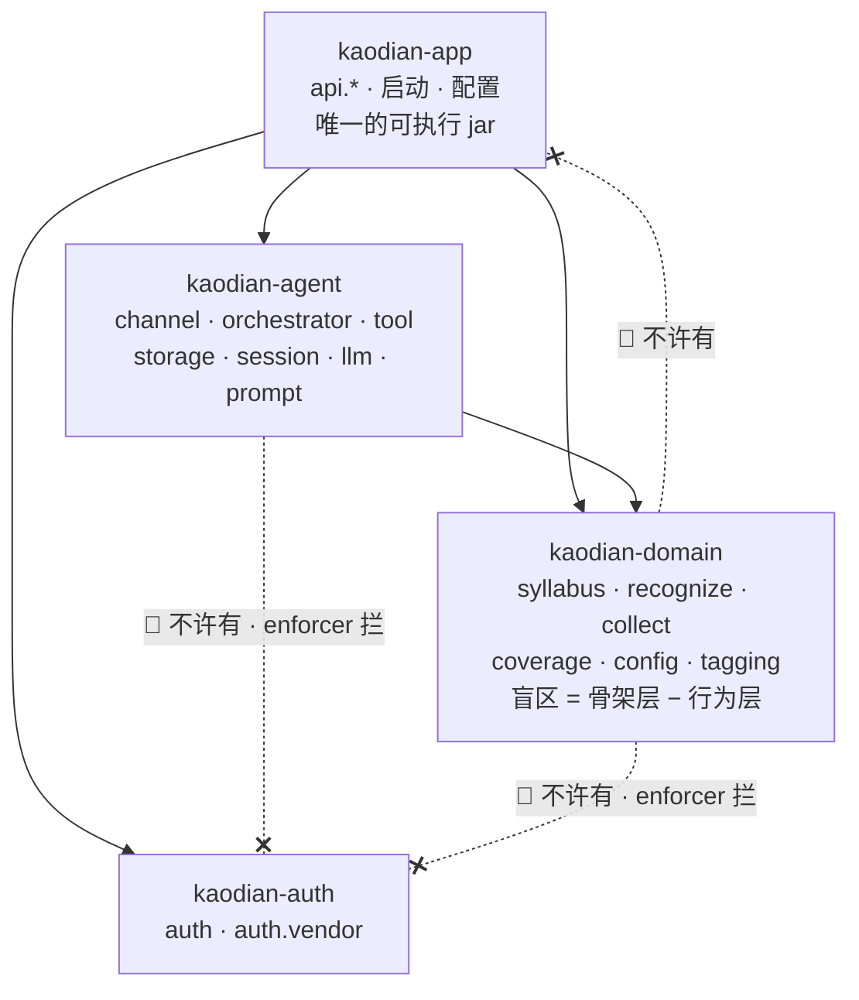

> **这一份是 `docs/technical/backend/` 的主文档。** 它回答三个问题：**七份后端设计各自是什么的唯一真源**、
> **目标态的实体关系与模块依赖长什么样**、以及 **`§契约增量` 合并时把哪些冲突判给了谁**。
>
> **它不产生任何新结论。** 七份文档里的判据、`接口契约：签名与错误码全集` 的字段与错误码，本文一个字都不改；
> §四 记的是「哪两份撞了、判给谁、为什么」，判词的原文已经落在被判的那一处。
>
> **基线：`origin/v1` @ `81a2c23`**，七份于 2026-09-03 按依赖序合入。
>
> **状态：活跃。** `technical/backend/` 下增删任一份、或 §二 / §三 两张图与 `server/` 实际分叉时，本文与
> [`文档规范与目录`](../../文档规范与目录.md) §二 必须**同一次改动内**更新；不更新即视为该文档不存在（§六 同一条规则）。

---

## 零、先读哪一份

🔴 **`B0` 不是可选前置。** 六份模块设计的存储形态、ID 类型、租户列、鉴权默认值、响应包络、分页与幂等，
全部在 `B0` 里定，模块文档只引用不重定。**跳过 `B0` 直接读模块文档，会得到六套互不兼容的假设。**

```
B0（读完再往下）
 ├─ M1 记录采集      ← 四入口一次写入，记录永不失败
 ├─ M2 打标管线      ← 四段每段可丢弃，只选候选 id
 ├─ M3 骨架与差集    ← 唯一那个数怎么算
 ├─ M4 出口与令牌    ← 导出作业、AI 代发、只读令牌
 ├─ M5 账号与登录    ← 验证码四道闸、微信三通道、注销
 └─ M7 额度与订单    ← 额度不许为负，三条路一次幂等写入
```

**M0 / M6 / M8 没有后端设计文档，这是有意的**：`M0` 的唯一后端面是 `GET /auth/agreements/current`（落在 `B0` §十二）；
`M6` 端矩阵 🔴 **不许有契约行**（`接口契约` §二）；`M8` 边界是「不做什么」，它的后端形态是**没有那些字段与端点**。

---

## 一、唯一真源位置与过期判定

**「唯一真源」的意思是：同一件事只在一处定义，别处一律写指针。** 下表第三列是**过期判定依据** —— 命中即这一份需要复核。

| 文档 | 它是什么的唯一真源 | 过期判定依据 |
|---|---|---|
| [`B0-平台底座与横切契约`](B0-平台底座与横切契约.md) | 存储形态（store 接口 vs DDL）· ID 类型与起号 · 行为层租户列 · 鉴权默认拒绝与白名单 · `ErrorCode` 枚举落点 · 分页与幂等三种键的**形状** · 密钥装置 · 模块依赖闸门 · 红线闸门八条 | `B0-1`…`B0-10` 任一条被实现推翻；`server/pom.xml` 的模块依赖边变化；Spring Boot 版本线再次分叉 |
| [`M1-记录采集与离线补传`](M1-记录采集与离线补传.md) | `/records` 六个端点 · 「记录永不失败」的服务端语义 · `clientToken` 业务键 · 批量部分成功的形状 · `occurredAt` 补传语义 · 音频上限落点 · 删记录与注销的交界 | `U1.x` 任一条变化；`/records` 面增删；`G-1`/`G-2` 被人拍板 |
| [`M2-打标管线与模型接入`](M2-打标管线与模型接入.md) | 四段管线与逐段丢弃条件 · 闭集强制的三处装置 · 未分类四种成因的库内形态（`TagAttempt.Outcome`）· 待补队列与重试 · 视觉供应商切换点 | `U2.x` 任一条变化；候选召回上限或违规阈变化；视觉模型配置键变化 |
| [`M3-骨架与覆盖度差集`](M3-骨架与覆盖度差集.md) | 覆盖度公式与五态推导 · 「为 0」与「没查到」的区分 · 口径下发与偏离登记 · 北极星埋点字段 · 备考档案 · `S-ASK` 的服务端面 | 覆盖度公式或五态推导变化；`NORTH_STAR_SURFACES` 口径被产品裁定；`blindspotTop` 来源变化 |
| [`M4-出口与只读令牌`](M4-出口与只读令牌.md) | 导出十行端点全集 · 导出作业生命周期与落盘 · 导出字段清单 · `POST /ai/ask` 的帧语义与计费时点 · **只读令牌**的上限/有效期/列表语义 | `U4.x` 任一条变化；导出字段清单变化；`E-5`「全部」怎么改被拍板 |
| [`M5-账号与登录通道`](M5-账号与登录通道.md) | 验证码五道闸 · 微信三条通道 · 令牌与鉴权面 · 注销 · 退出登录 · **登录设备列表**语义 · 手机号两种形态与密钥轮换 | `U5.x` 任一条变化；`L-3` 律师稿落地；账号合并（当前空缺）被补上 |
| [`M7-额度与订单`](M7-额度与订单.md) | 额度账本与条件更新 · 订单三条路与状态机 · 档位/通道/订阅 · 退款做死的那两条 · 回调鉴权链 | `U7.x` 任一条变化；退款政策落地；`granted` 下调写法 A/B 被拍板 |

**跨界的三处，写清楚哪一半归谁**（这三处最容易被两边各写一遍）：

| 事 | 谁定义 | 谁调用 |
|---|---|---|
| `?tagState=unclassified` 的取值域 | `M2`（`TagAttempt.Outcome`） | `M1` 只做过滤；`M3` 算计数 |
| `deleteAllOf(long userId)` | `M1`（签名与语义） | `M5` 编排注销时点 |
| 额度扣减 | `M7`（`QuotaStore.consume`） | `M2` 在第 ② 段前、`M4` 在 `done{ok}` 后 |

### 1.1 与外层三份的分工

| 文件 | 说什么 | 冲突时 |
|---|---|---|
| [`技术架构与接口契约`](../INDEX.md) §六 | **有哪些端点**（索引） | 以下面两层为准，回它加指针，🔴 **不静默改它的原文** |
| [`接口契约：签名与错误码全集`](../接口契约-签名与错误码全集.md) | **端点长什么样**：签名 / 字段类型 / 错误码全集 / 分页与幂等 | 端点级签名 > 横切归纳（§四 冲突 1 的判据） |
| `backend/`（本目录） | **怎么落、为什么这么落**：store 接口、装置、判据 | — |

🔴 **七份里的 `§契约增量` 一节，已合并进上面第二层与 `后端系统设计与组件接入`。**
那一节保留是判词出处，**不要再合第二遍**。合并结果与冲突裁定见 §四。

---

## 二、目标态 ER 图

> 🔴 **这是<u>目标态</u>，不是现状。** 现状那张「三座岛，互不相连」在
> [`后端系统设计与组件接入`](../后端系统设计与组件接入.md) §八，**那一节一个字都没改** ——
> 两张图不一样是正常的，**差在哪里由 §2.3 逐行写出**。不看 §2.3 就拿本图去读代码，会读出一堆不存在的关联。
>
> **形态说明**：`B0-1` 已裁定**交付 store 接口，不交付 DDL**。下面每个「实体」对应一个 record 类型 + 一个 store 接口，
> 「唯一索引」对应 store 接口承诺的组合唯一。换 JDBC 那天**形状不变**（`后端系统设计与组件接入` §8.6）。

```mermaid
erDiagram
    app_user ||--o{ user_identity      : "一人多条身份 · 锚点是 app_user.id"
    app_user ||--o{ auth_token         : "at_ 应用令牌 / ro_ 只读令牌"
    app_user ||--o{ record_event       : "B0-3 租户列 userId"
    app_user ||--o{ record_tag         : "B0-3 租户列 userId"
    app_user ||--o{ tag_attempt        : "B0-3 租户列 userId"
    app_user ||--o{ user_assertion     : "B0-3 租户列 userId"
    app_user ||--o{ blindspot_event    : "UK(user, date, surface)"
    app_user ||--o{ quota_period       : "UK(user, periodYm, quotaType)"
    app_user ||--o{ ai_call_log        : "UK(user, endpoint, idemKey)"
    app_user ||--o{ payment_order      : "outTradeNo 自然键"
    app_user ||--o| user_subscription  : "一人一行 · 无 status 列"
    app_user ||--o{ export_job         : "按 userId 分目录落盘"
    app_user ||--o{ agent_session      : "userId 由 app 作为入参传入"
    app_user ||--o{ idempotency_record : "锚定 (userId, path, key)"

    record_event  ||--o{ record_tag     : "一条记录多个标签"
    record_event  ||--o| tag_attempt    : "一条记录一行最近尝试"
    syllabus_node ||--o{ record_tag     : "只挂 level 3 · 闭集选 id"
    syllabus_node ||--o{ user_assertion : "断言是没碰过的子集"
    syllabus_node ||--o{ syllabus_node  : "三层树 · level 3 是分母"
    payment_order ||--o| user_subscription : "支付成功后延长 expires_at"
    agent_session ||--o{ agent_run      : "S-ASK 会话与轮次"

    app_user {
        long    id           PK "B0-2 起始 10001 · 0 不是合法值"
        string  status          "ACTIVE / DEACTIVATED"
    }
    user_identity {
        long   userId  FK
        string type       "phone / wechat_openid / wechat_unionid"
        string identifier "UK(type, identifier)"
    }
    auth_token {
        string  tokenHash  PK "对外发的是 long tokenId 不是 hash"
        long    userId     FK
        string  scope         "full / readonly"
        string  deviceLabel   "服务端从 User-Agent 归一化 · 不可改"
        instant lastUsedAt    "从没用过时整个 key 不出现"
        instant expiresAt     "at_ 30 天滑动 / ro_ 90 天不滑动"
        instant revokedAt
    }
    syllabus_node {
        long    id       PK
        long    parentId FK
        int     level       "1..3"
        boolean archived    "归档 · 无 includeArchived 开关"
    }
    record_event {
        long    id          PK
        long    userId      FK "B0-3 必填 · 无默认 · 无哨兵"
        string  clientToken    "UK(userId, clientToken) · 不设去重窗口"
        string  kind          "语音 / 拍照 / 粘一段 / 记做题"
        instant occurredAt    "batch 必带 · 单条不带 · 上界钳到 now"
    }
    record_tag {
        long    id          PK
        long    userId      FK
        long    recordId    FK
        long    nodeId      FK "只从候选集选 · 永不生成标签文本"
        boolean discarded      "宁丢勿错"
        instant confirmedAt    "restore 必须把它清成 null"
    }
    tag_attempt {
        long    recordId PK "一条记录一行"
        long    userId   FK
        string  outcome     "9 值枚举 · NOT_RECALLED 与 NO_MATCH 库里必须分得开"
        int     attempts    "0..3"
        instant nextRetryAt "不再重试时这个 key 不存在"
    }
    user_assertion {
        long    userId FK
        long    nodeId FK  "UK(userId, nodeId) · POST/DELETE 都天然幂等"
        instant assertedAt "重复 POST 不刷新它"
    }
    blindspot_event {
        long   userId    FK
        string localDate    "端上本地自然日 · 窗口 建号-1d..UTC今天+1d"
        string surface      "S-BLIND / S-ASK · 闭集"
        string entry        "home / deeplink"
        string outcome      "data / empty"
    }
    quota_period {
        long   userId    FK
        string periodYm     "自然月 · 不按购买日滚动"
        string quotaType    "ai_capture / ai_ask · 互不借用"
        int    granted
        int    used         "不变式 0 <= used <= granted · 条件更新保证"
    }
    ai_call_log {
        long    userId         FK
        string  endpoint          "UK 第二列 · 单列唯一会串答案"
        string  idempotencyKey
        string  status            "SUCCESS / FAILED"
        boolean settled           "false = 回答已出但扣减受影响 0 行"
        long    costMicro         "记账 · 无 prompt 无答案无图片"
    }
    payment_order {
        string  outTradeNo PK "可枚举 → 归属校验用 404 不用 403"
        long    userId     FK
        string  state         "PENDING/CONFIRMING/PAID/CLOSED/REFUNDED"
        int     amountFen     "整数分"
    }
    user_subscription {
        long    userId    FK "UK · 一人一行"
        string  planCode     "free / plus · 是行里的值不是每档一列"
        instant expiresAt    "active 派生自它 · 🔴 不建 status 列"
    }
    export_job {
        long    jobId     PK "不可枚举 → 归属失败也返 404（含已过期）"
        long    userId    FK
        string  state        "RUNNING/SUCCEEDED/FAILED/CANCELLED · 无第五值"
        string  format       "md / csv / json"
        instant expiresAt    "30 分钟 · 与幂等键同寿"
    }
    idempotency_record {
        long   userId FK
        string path      "锚定三元组 · 🔴 不是参数哈希"
        string key
        string outcome   "Fresh / Replay / InFlight"
    }
    agent_session {
        string sessionId PK "不可枚举 → 归属校验用 403"
        long   userId    FK "🔴 由 app 传入 · agent 不认识账号体系"
    }
    agent_run {
        long   id        PK
        string sessionId FK
        long   userId    FK "今天恒 0L · B0-2 收口后是真值"
    }
```



### 2.1 图上没有的东西，比图上有的更要紧

| 不存在 | 因为 |
|---|---|
| **任何能装下题干的字段** | 冻结口径 4。`record_event` 无正文列，`tag_attempt` 不留档模型响应，`ai_call_log` 无 prompt 无答案。判据是 `NoStemFieldTest` 反射扫描，**不是纪律** |
| **任何图片二进制 / URL / 缩略图字段与端点** | 冻结口径 5。原图内联送一次即弃；`MessagePart` 结构上没有图片类型。判据 `ImageRetentionTest` |
| **正确率 / 得分 / 排名 / 掌握度字段** | 冻结口径 3。⚠️ **今天这条是红的**：`NodeDetailDto.accuracy` / `CoverageService.Summary#ratio()` / `NodeState.WEAK_BELOW`，归 `M3` / `M4` 清理（`接口契约` §5.10、§6.4 两条落差登记） |
| **`user_subscription.status`** | 一个需要定时任务写进去才准的状态列，是 `expires_at` 的第二真源 |
| **`export_job.state = EXPIRED`** | 与「作业不存在」下一步完全相同，而 `state` 的取值域是端用来分支的 |
| **`user_assertion.kind` / `NodeState.STUCK`** | 反向断言「我卡住了」一个端点都不补，**连位都不留** —— 留好的位置会让下一个人在不做产品裁定的情况下把它填上 |
| **`syllabus_node` 的 `?includeArchived`** | 归档是唯一一个不用真学就能让覆盖度上升的操作，`R-49` 要求它不做成开关 |
| **任何浮点字段（`M3` 全域）** | 「有没有 / 几次 / 多久前」的答案是 `bool` / `int` / 带时区的绝对时间。一个浮点出现在这一域，它一定是一个比值 |

### 2.2 `app_user` 为什么连到那么多张表

**因为 `B0-3` 的租户列就是这么落的，而且它有一条必须守住的落法。**
🔴 **`domain` 拿到的是一个 `long userId` 参数，不是一个「当前用户」。**

| | 做法 | 结果 |
|---|---|---|
| ❌ | 给 `CaptureService` / `TaggingService` 注入一个「当前用户」 | 建出 `domain → auth`，四模块无环图里唯一还没被建出来的那条边 |
| ✅ | `app` 从 `CurrentSession` 取出 `userId`，作为方法参数显式传给 `domain` | `domain` 拿到一个 `long`，它不知道也不需要知道账号体系存在 |

**判据一行能测**：`kaodian-domain/pom.xml` 出现 `kaodian-auth` 即违规；
`grep -rn 'CurrentUser\|SecurityContext\|Principal\|@AuthenticationPrincipal' server/kaodian-domain/src/main/java/` 期望 0 命中。

### 2.3 🔴 现状图与本图差在哪（逐行）

| # | 现状（`后端系统设计与组件接入` §八，实读 `81a2c23`） | 目标态（§二） | 由哪一条收口 |
|---|---|---|---|
| 1 | **三座岛互不相连**：`auth` / `domain` / `agent` 之间**一条关联都没有** | `app_user.id` 是唯一锚点，十四条关联全从它出发 | `B0-3` 租户列 |
| 2 | `AppUser.id` 是 `u_`+UUID（`String`），`AgentRun.userId` 是 `long` —— **连类型都对不上** | 统一 `long`，起始 `10001`，JSON 里字符串 | `B0-2`（`R-93` 由此关闭） |
| 3 | `Touch` / `RecordTag` / `UserAssertion` **没有 `userId` 列** | 三个都有，**必填、无默认、无哨兵**；存量「不归任何人」的数据**拒绝启动**而不是静默归零 | `B0-3` |
| 4 | `AgentSession.userId` / `AgentRun.userId` **恒 `0L`** | 由 `app` 作为 `AgentRequest` 入参传入真值 | `B0-2` + `B0-3` |
| 5 | 落盘是 **JSON 文件**（`auth-accounts.json` / `touches.json` …），「唯一索引」是 `Map` 的键 | 形状不变，**store 接口承诺组合唯一**；换 JDBC 那天一条 JSON 写变成一个事务 | `B0-1` |
| 6 | `tag_attempt` / `blindspot_event` / `quota_period` / `export_job` / `idempotency_record` **五个实体都不存在** | 五个都在，store 接口签名在对应模块文档 | `M2` §10.2 · `M3` §5.7 · `M7` §2.2 · `M4` §5.6 · `B0` §7.3 |
| 7 | `RecordPageResponse` 有 `total` / `returned` / `hasMore` | 收敛成 `{items, nextCursor?}`；前端截断闸门换成「`nextCursor` 这个 key 不出现」 | `接口契约` §1.4（🔴 前后端**同一次落地**） |
| 8 | `SessionDto` 对外发 `tokenHash` | 对外只发 `long tokenId` | `M4` §十三 增量 9，执行归 `M5` |
| 9 | `user_subscription` 有 `status` 列、`ai_call_log` 单列 `idempotency_key` 唯一 | 前者删；后者改三列 `(user_id, endpoint, idempotency_key)` | `M7` §十三 增量 5 / 增量 2 |

🔴 **第 5 行最容易被误读：交付的是 store 接口，`find . -name '*.sql' | wc -l` 今天是 `0`，落地之后还是 `0`。**
本图画成 ER 的样子，是因为**组合唯一与关联方向这两件事与存储介质无关** —— 它们是换 JDBC 那天要原样搬过去的东西。

---

## 三、模块依赖图

> 🔴 **这张图与现状是<u>一致</u>的** —— 与 §二 那张不同，本图今天就成立：实读 `server/*/pom.xml` 得四条边、无环。
> 七份设计加起来**新增的边为零**。



| 模块 | 依赖 | 刻意不依赖 | 为什么这个「刻意」重要 |
|---|---|---|---|
| `kaodian-domain` | **无** | web、`auth` | 公式本身不该知道 HTTP 存在，也不该知道账号体系存在。**这是唯一还没被建出来的那条边，也是最省事的实现最容易建出来的那条** |
| `kaodian-auth` | **无** | `domain` | 账号体系不该知道业务领域存在。反过来也让「`auth` 改坏了业务不受影响」成立 |
| `kaodian-agent` | `domain` | **`auth`** | agent 拿到的是一个 `long userId` 入参。它自己去读「当前用户」的那一版会**绕过 `app` 过滤器上的全部四道锁** |
| `kaodian-app` | 全部 | — | 唯一的可执行 jar；鉴权、包络、幂等守卫、租户列取值全在这一层 |

**为什么没有 `kaodian-common`**：一个 common 模块会立刻成为「不知道放哪就放这」的垃圾桶，而它被所有模块依赖 ——
垃圾桶一旦被所有人依赖，上面那三条「刻意不依赖」全部失效（`后端系统设计与组件接入` §二）。

### 3.1 这条约束由构建工具强制，不靠自觉

**`maven-enforcer-plugin` 的 `bannedDependencies`，挂在 `kaodian-domain` 与 `kaodian-agent` 的 `pom.xml` 上**（`B0` §10.2）。
选它不选自写脚本的理由：**它在 `mvn` 生命周期里，跑不跑不由人决定**；自写脚本要靠 CI 记得调它，而
`git config core.hooksPath .githooks` 是**不随 clone 传播的本地配置**（`B0` §8.2）。

```bash
# ① 四条边、无环 —— 期望恰好 agent→domain / app→domain / app→auth / app→agent
grep -h '<artifactId>kaodian-' server/*/pom.xml | grep -v 'kaodian-parent'
# ② domain 不依赖 auth —— 期望 0
grep -c 'kaodian-auth' server/kaodian-domain/pom.xml
# ③ domain 里不出现任何「当前用户」符号 —— 期望 0 命中
grep -rn 'CurrentUser\|SecurityContext\|Principal\|@AuthenticationPrincipal' \
     server/kaodian-domain/src/main/java/
```

### 3.2 七份各自触及的方向（新增边合计为零）

| 模块 | 改动落在 | 新建那条不许有的边？ |
|---|---|---|
| `B0` | `app`（过滤器 / 枚举 / 分页 / 幂等守卫）· `auth`（`TokenCheck`）· `domain`（三个实体加 `userId`）· 两个 `pom.xml`（enforcer） | ❌ 无。`domain` 那一行是唯一有风险的一处，§2.2 那张表就是防它的 |
| `M1` | `domain`（`Touch`/`RecordTag` 加 `userId`、`deleteAllOf`）· `app`（`CurrentSession` / `Page<T>`） | ❌ 无 |
| `M2` | `domain · tagging`（`TagAttempt` / `ModelCallGate`）· `app`（三个端点） | ❌ 无。`ModelCallGate` 是额度闸在 `domain` 侧的接口，实现在 `app` |
| `M3` | `domain`（覆盖度与差集）· `app`（口径下发 / 埋点 / 档案） | ❌ 无 |
| `M4` | `domain`（`ExportReader` 取数）· `app`（`ExportJobStore` 作业账本）· `agent`（`/ai/ask`） | ❌ 无。🔴 **作业不进 `domain`** —— 它是一次搬运的账本，不是公式的任何一部分 |
| `M5` | `auth`（验证码 / 令牌 / 注销）· `app`（编排） | ❌ 无。`auth` 仍然不依赖任何模块 |
| `M7` | `app · billing`（`QuotaStore` / `PaymentOrderStore` / `SubscriptionStore`） | ❌ 无。额度扣减发生在 `app` 的 AI 端点内部 |

---

## 四、三处冲突判给了谁

**「同一个字段两份定得不一样，不许都留着让开发去挑」** —— 下面三处是真冲突（两份都写了、写的不一样、开发照做会打架）。
**判词的原文已经落在被判的那一处**，本表只记「判给谁、为什么」。

| # | 冲突 | 两边各说什么 | 裁定 | 判词落点 |
|---|---|---|---|---|
| 1 | **必须带 `Idempotency-Key` 的端点有几个** | `B0` §7.3 说三个；`M2` 增量 1 说四个；`M4` 增量 1 说五个；`M7` 增量 1 说五个（且与 `M4` 那五个不是同一组） | **取并集。** ⚠️ **2026-09-03 更正（KUBI-89 审核轮）：那次并集只取了四份、漏了 `M5` 的 `POST /auth/wechat/phone-login`，八个更正为九个** —— 判据是「端点签名里逐字写着这个头」，按「有几份文档」取并集就会漏掉没被数进来的那一份。 判据是**端点级签名里逐字写着这个头**，不是哪一份文档大 —— 那些签名是先写的，横切归纳是后写的。三处那句话不是错在判据上，是**数漏了** | [`接口契约`](../接口契约-签名与错误码全集.md) §3.3（唯一真源）+ `B0` §7.3 就地更正 |
| 2 | **`401` 拆两档还是三档** | `B0` 增量 6：**两档**，且逐字写「已吊销不单独成档」；`M5` 增量 3：**三档**，第三档是 `ACCOUNT_DEACTIVATED` | **三档，`M5` 赢。** 🔴 `B0` 那条红线**原样保住**：它挡的是「令牌曾经有效」这条信息，而第三档的判定依据是**账号状态不是令牌状态** —— 被踢下线的一方（账号还活着）仍然什么都不知道。且 `接口契约` §7.5 与 §10.5 早就是三档，`B0` 的两档是三处里唯一的外来说法 | [`接口契约`](../接口契约-签名与错误码全集.md) §1.2 |
| 3 | **`GET /tokens` 返回什么** | `M4` 增量 9：只读令牌列表，裸数组不分页，**已吊销与已过期仍在列表里**；`M5` 增量 6：登录设备列表，游标分页，**只返此刻可用的行** | **按资源拆路径，两边语义各自原样保留：`GET /tokens` 判给 `M5`（既有契约行 §7.4，`deviceLabel` / `U5.6`），只读令牌改挂 `GET /tokens/readonly`。** 拆而不是二选一的理由：两边要的成员集合与分页形态**都是对的**，撞的只是路径名；而 §3.1 的鉴权表里 `/tokens` 与 `/tokens/readonly` 本来就并列写着，`M4` 签发用的也已经是 `POST /tokens/readonly` | [`接口契约`](../接口契约-签名与错误码全集.md) §6.7 |

**冲突 3 的连带**：`M4` §二 那张「十行端点全集」里第 8 行改成 `GET /tokens/readonly`、第 9 行改成
`DELETE /tokens/readonly/{tokenId}`。🔴 **行数仍是十行，那条端点全集测试的判据一个字不改。**

### 4.1 不是冲突、只是数没对上的三处

| 事 | 结论 |
|---|---|
| 匿名白名单**五行还是七行** | **七行。** `M5` 补的 `POST /auth/wechat/phone-login` 与 `GET /auth/wechat/authorize-url` 是**两个一直开着的口终于被数进来了**，不是新开的口（实测基线 `81a2c23` 就不需要令牌） |
| 只读令牌路径前缀黑名单**四条还是五条** | **五条**，补 `/export/jobs/**`。只读令牌发不起作业，给它两个只会返回 404 的 `GET` 是多开两个面换零个能力 |
| 错误码全集**多少个** | 🔴 **不写死总数。** §十 给了抽取规则，比对脚本每次自己数 —— 写死它就会和表分叉（`§12.10` 写「8 个」而 `§10.8` 只列 7 个，就是这么来的） |

### 4.1.1 ⚠️ 2026-09-03 KUBI-89 审核轮：上面这些裁定当时只登记在本表，被判的那一处没改

**问题不在裁定，在裁定的落地面。** 冲突 1 / 2 与 4.1 白名单三处的判词都在本表写着，
但 `B0`（唯一公共前提）、`M4`、`M3` 的正文当时仍停在旧答案上 —— **开发组读的是模块文档，不是本表。**
一次审核轮把四处补齐，判词一个字没改：

| 落地项 | 改了哪 |
|---|---|
| 冲突 2（`401` 三档） | `B0` §5.3 主文 + §十五 增量 6 改为三档、`TokenCheck` 补第四叶 `Revoked(long userId)`；`接口契约` §7.5 标题从「两档」改为「三档」（表格本来就是三行）；`M3` §十 错误码表补 `ACCOUNT_DEACTIVATED` 并标明**归鉴权过滤器抛、M3 域内不主动抛** |
| 4.1 白名单七行 | `B0` §5.2 的 `WHITELIST` 常量从五行补到七行。🔴 **不补它，`B0` §5.5 判据 ② 会判 `B0` 自己红** —— 那条判据逐字写着「两处不一致即判红」 |
| 冲突 1（幂等八处） | `M4` §2.2 / §12.4 / §13.1 增量 7 四处从「更正为五处」改为**指向 `接口契约` §3.3 唯一真源**；`M7` §十二 冲突 3 与 §十三 增量 1 同改。**四份都不再自己数这个数** —— 一个横切的数被四份各存一份，这次数漏就是那个形态本身的结果 |

### 4.1.2 新登记两处：`M7` 与目标态 ER 打架（两边都是目标态，不是「现状 vs 目标」）

| # | 冲突 | 裁定 | 落点 |
|---|---|---|---|
| 7 | `payment_order.channel` 二值（`技术架构与接口契约` §5.5.2 + ER 图）vs 三值含 `apple_iap`（`M7` §5.4 + `接口契约` §8.3） | **三值。** 🔴 这一条不能只登记不改：`M7` §一 第 4 行的判据是 `values().length == 3`，照二值建枚举**当场跑红** | `INDEX.md` §5.5.2 已补更正行；`M7` §十三 增量 11 |
| 8 | 订单状态列名 `status`（同上）vs `state`（`M7` 全文 + `接口契约` §8.4/§8.5/§8.7） | **`state`，库列与 API 字段同名。** 不同名就要有一层映射，而那层映射没有任何一份文档写过 —— 没人写下来的映射等于每个人各写一遍 | 同上；`M7` §十三 增量 12 |

### 4.2 增量落到了哪份文件（不要再合第二遍）

| 落点 | 合了什么 |
|---|---|
| [`接口契约：签名与错误码全集`](../接口契约-签名与错误码全集.md) | 主体。新增 §3.3 / §3.4 / §三.5 / §4.1.1 / §4.1.2 / §5.8 / §5.9 / §5.10 / §6.7 / §6.8 / §8.11，其余就地补注 |
| [`后端系统设计与组件接入`](../后端系统设计与组件接入.md) | 4 处：§1.2 时序图指针（🔴 不改图）· §5.3 音频落点更正 · §4.2 视觉模型配置落差 · §八 目标态指针（🔴 不改现状图） |
| [`技术架构与接口契约`](../INDEX.md) | 6 处：§三 版本收口指针 · §5.5.2 两处更正 · §六 两行端点参数 · §六 三层分工指针 |
| [`文档规范与目录`](../../文档规范与目录.md) §二 · [`docs/INDEX.md`](../../INDEX.md) | 新目录 + 八份文档各一行 + 一条读法路线 |
| 本文 §四 | 3 处冲突裁定 |
| ⛔ **未合，退回** | 3 条，见 §4.3 |

### 4.3 ⛔ 三条增量指向产品线文档，不代改

**理由：本目录的改动面是技术线三份 + 本目录。产品线文档的字由产品侧改 —— 技术侧代改一次，
下次产品复核时会发现自己没写过这句话，而它已经在被引用了。**

| 增量 | 落点 | 要改什么 | 退回给 |
|---|---|---|---|
| `M2` 增量 5 | `docs/product/specs/打标与未分类.md` §十三 | 「树内搜索 \| `GET /syllabus/search?q=` \| 🚧 待技术定稿」→ **树内搜索 · 无端点**（`T-6` 关闭）。理由：一个 `q` 参数在结构上就是一个能装下题干的字段，而且它会进访问日志 | `M2` + 产品组 |
| `M2` 增量 3（后半） | `docs/product/specs/打标与未分类.md` §七 第 4 行 | 「超过 20 视为响应异常」→ **12**。不改的后果：端上按 20 放行 13–20 个候选，而契约说它们是违规 | `M2` + 产品组 |
| `M5` 增量 9 | `docs/product/modules/M5-账号/U5.6-退出登录.md` §五 | `L-9`（设备名从哪来、能不能改）标为**已定**：服务端签发时从归一化 `User-Agent` 生成，不可改 | `M5` + 产品组 |

> ⚠️ **第三条的技术结论已经在契约里生效**（`接口契约` §7.4 那段 `deviceLabel` 从来就是这么写的），
> 退回的只是产品文档里那个 `L-9` 标记 —— **不改它不会让开发做错事，只会让下一个人以为 `L-9` 还开着。**

---

## 五、交给开发组之前的最后一问

**「开发组拿着这七份 + 接口契约，能不能不问人就开工？」** 逐份过一遍，任何一处答「得再问一下」，退回对应模块补。

| 模块 | 能不能不问人就开工 | 卡住的话卡在哪 |
|---|---|---|
| `B0` | ✅ 能 | 十条全部有结论。唯一「写了今天不生效」的是白名单常量按 `/api/v1` 写而代码在 `/api/**` 下 —— `B0` §16.1 已写明二选一怎么办，不是开放问题 |
| `M1` | ✅ 能 | 三处待人拍板（五秒撤销 / `G-1` 队列上限 / `G-2` 跨零点归属）**都不拦服务端**，`M1` §十三 逐条写了「不拦」的理由 |
| `M2` | ✅ 能 | `M2-G1`（`suggest` 今天调不到模型）是**已知且已登记**的，不是缺口 —— 按目标形态实现，素材那条路归 `M1` |
| `M3` | ✅ 能 | `NORTH_STAR_SURFACES` 的口径冲突已取收窄默认值 `{S-BLIND}`，并写明「改它是改一个常量，不是一次迁移」 |
| `M4` | ✅ 能 | 三处待拍板都不拦。导出字段「练了几道 / 对了几道」留还是删挂给产品；**删「正确率 / 状态 / 五态分布」不用等** |
| `M5` | ⚠️ **能，但有一处空缺要说清** | 🔴 **账号合并（`U5.4` / `POST /auth/merge/preview` · `confirm`）没有实现设计**（chenyj 2026-09-03「先不用考虑」）。契约行保留不动。**在 `B0-3` 租户列落地之前，「A 的记录」这个概念在数据里不存在**，先出的合并设计每一个数都会是 0 |
| `M7` | ✅ 能 | ⚠️ **2026-09-03 更正**：上一版写「有一个数没定」（`POST /billing/orders` 三行的幂等键保留期）。**`M7` §10.2 早给了数与理由：24 小时** —— 缺口是那个数没被搬进 `接口契约` §3.3，不是数不存在。已搬，缺口关闭。另：`granted` 下调写法 A/B 需人拍板，`M7` §十四 已登记，**不拦开工** |

🔴 **一处必须在开工前对齐的，不属于任何单个模块：**
删 `RecordPageResponse` 的 `total` / `returned` / `hasMore` 是**后端删字段 + 前端换截断闸门的同一次落地**（`接口契约` §1.4）。
前端在读，实测三处（`types.ts:217` / `derive.ts:59` / `mock.ts:261`）。**后端单方删掉会打断 `buildDrillIndex`。**

---

## 六、这一目录服务于哪个关卡

**阶段 0 要的是「自用两周、每天记两个数」，本目录一个数都不产生。** 这句留在最后，是因为它正好属于
`思考模式与选择框架` §盲区二 点名的那类工作：进展可量化、做起来舒服、不需要面对任何一个真实用户。

**它的实际价值只有一条：让「实现这七个模块」这件事不需要在实现过程中再做四十次口径裁定。**
