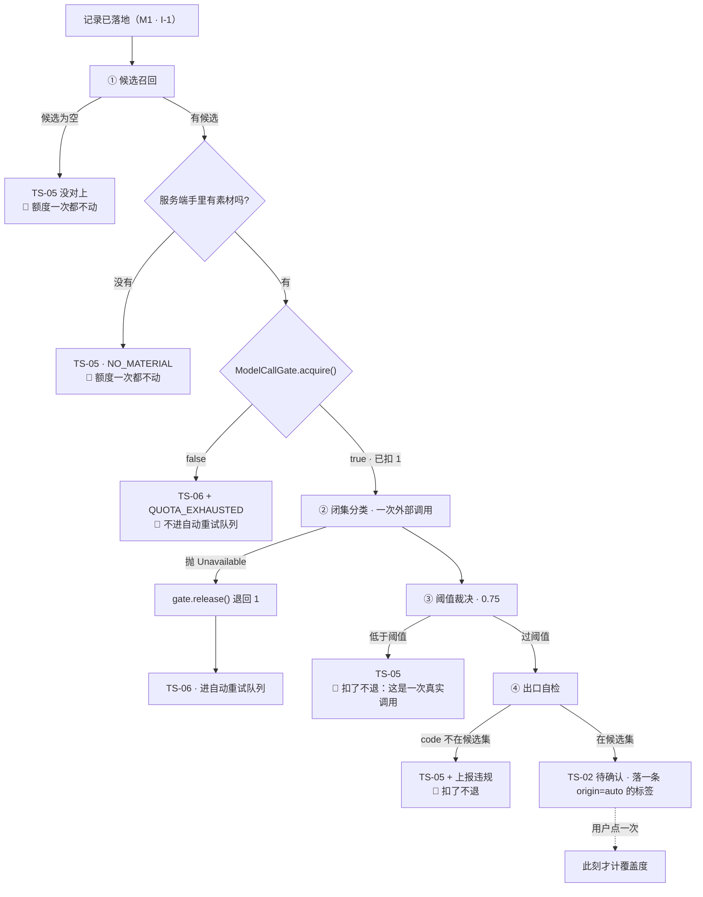
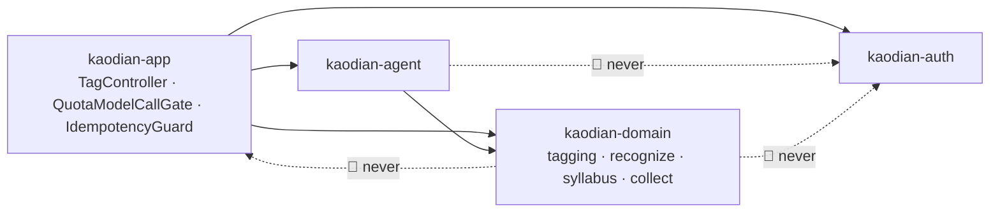

# M2 · 打标管线与模型接入

> **基线**：`origin/v1` @ `81a2c23`，fetch 于 2026-09-03。
> **前提**：`B0-平台底座与横切契约`（`KUBI-97` 分支 `20b69f8`，本轮未合 `v1`）的十条结论**原样取用，不另定**。
> **状态：活跃。** 管线段数增删、任一段的丢弃条件变化、`tagging` 包的位置或依赖方向变化、外部模型接入点增减，本文同一次改动内更新。
> **代码：0 行。** 本轮只出设计。**受众**：后端组照此写代码，前端组照此对接，两边不需要口头补充。

---

## 一、结论速查

**七条必答，每条一个可跑判据。判据跑不出结果的结论不算结论。**

| # | 结论 | 判据（可跑） |
|---|---|---|
| 1 | 四段：召回 → 闭集分类 → 阈值裁决 → 出口自检。**①③④ 只会丢，② 唯一在产出**。额度扣在 **② 之前**（真要调模型的那一刻），调用抛不可用则**退回**，`NO_MATCH` **不退**；召回为空与无素材一次都不扣 | `TaggingBoundaryTest#recallEmptyDoesNotTouchQuota`：召回为空时额度账本读数前后相等 |
| 2 | 召回上限 **10**（`CandidateRecall.MAX_CANDIDATES`，实读），契约违规阈 **12**（契约 §4.1）。闭集**在解析层拒绝**：`enforceClosedSet` 把候选集外的 code 一律降级 `noMatch()`；解析层只取 code，**自由文本一个字都不进对象** | `RecognitionResult` 无 `String label/name/text` 字段；`enforceClosedSet` 已有单测 |
| 3 | 未分类四种成因落**一个枚举**（`TagAttempt.outcome`），不是四个字段。`GET /records/unclassified/count` 的口径由 `domain` 的 `TagState` 一处算，`M3` 只调不重算 | 全仓判「什么算未分类」的地方只许有 `TagState` 一处，见 §4.3 那条 `grep` |
| 4 | 待补队列：长度 **200**、重试 **3 次**、退避 **30s/5min/30min**（契约 §4.1 已关 `T-4`/`T-5`）。**只有 `UNAVAILABLE` 进队**。重试复用首次 `Idempotency-Key`，幂等重放不扣额度 | `QuotaLedgerTest#retryDoesNotDoubleCharge` |
| 5 | `tagging` 落 `kaodian-domain`（`com.kaodian.server.tagging`），**不碰 `auth`、不碰额度账本**；`recognize` 之外不得 HTTP 调模型 | `maven-enforcer` `bannedDependencies`（`B0-9`）+ `TaggingBoundaryTest` 源码扫描 |
| 6 | 🔴 **「改一行 `base-url`」今天对视觉打标不成立** —— `application.properties:232` 那一行是 agent 与视觉共用的。视觉必须自己造 `ChatClient`，切换点才真是一行 | `grep -c 'KAODIAN_VISION_MODEL' application.properties` 今天 = **0** |
| 7 | 恢复丢掉的标签：`discarded=false` **且 `confirmedAt=null`**，落 `TS-02`。少后半句，「曾确认→丢弃→恢复」会变成一条系统触发且让覆盖度上升的转移 | `TagStateTest#restoreNeverRaisesCoverage` |

**树内搜索**：契约 §4.3 已判**不该有端点**，本文不设计它，也不留切换开关。判据：`grep -rn 'syllabus/search' server/ web/src` 零命中。

---

## 二、四段管线：输入 · 输出 · 丢弃条件 · 可观测信号

### 2.1 段编号对齐（关闭 `U2.1` §五「段编号两套」）

`后端系统设计与组件接入` §1.3 编到 ③（不给模型调用编号），`打标与未分类` §5.1 编到 ④。
🔴 **本文取四段编号**（与产品侧一致），技术侧三段一一对上，两处从此不分叉：

| 本文 | 后端详设 §1.3 | 落在哪一行代码 |
|---|---|---|
| ① 候选召回 | ① | `CandidateRecall.recall(Syllabus, String hint)` |
| ② 闭集分类 | （未编号） | `VisionTagger.classify(byte[], String mime, List<Candidate>)` |
| ③ 阈值裁决 | ② | `RecognitionResult.of(String, double)` —— **接口层静态方法** |
| ④ 出口自检 | ③ | `VisionTagger.enforceClosedSet(RecognitionResult, List<Candidate>)` —— **接口层静态方法** |

🔴 **③④ 是接口上的静态方法，不是实现类的方法。换厂商换的是实现类，换不掉这条线。**
在 `TaggingService` 里补一个「顺手放宽一点」的判断，等于把红线从接口层搬进业务类 —— `识别链路选型` 坑三要的切换点会顺带把红线也切换掉。

### 2.2 四段逐段

| 段 | 输入 | 输出 | 丢弃条件 | 可观测信号（结构化日志字段，**不含任何记录文本**） |
|---|---|---|---|---|
| ① 候选召回 | `Syllabus` + `touch.sourceName()` | `List<Candidate>`，`Candidate(String code, String name)`，`0..10` 项 | **为空 → 直接未分类，不调模型、不扣额度** | `stage=recall` `recordId` `candidateCount` `keywordCount` |
| ② 闭集分类 | `byte[] material` + `mimeType` + 候选 code 列表 | `RecognitionResult(nodeCode, confidence, aboveThreshold)` | 抛 `RecognitionUnavailableException` → 未分类且**进待补队列** | `stage=classify` `recordId` `candidateCount` `latencyMs` `vendorStatus` |
| ③ 阈值裁决 | `RecognitionResult.of(code, confidence)` | 同上 | `confidence < MIN_CONFIDENCE`(**0.75**) → `noMatch(confidence)` | `stage=threshold` `recordId` `confidence` `passed` |
| ④ 出口自检 | 上一段结果 + 本次候选集 | 同上 | `nodeCode` 不在候选集 → 一律降级 `noMatch()` | `stage=closedset` `recordId` `inSet`；🔴 `violation=true` 时**按最高级别上报**（`R-07` 失守的唯一服务端信号） |

🔴 **可观测信号里没有一个字段能装下记录内容、候选名、模型原始响应。** `vendorStatus` 只记 HTTP 状态与厂商错误码，不记 body。
⚠️ 「不落日志」这条 `后端系统设计与组件接入` §7.1 已标为**纪律不是形态**（语法 `grep` 抓不住字符串拼接），本文不假装它已经硬起来。

### 2.3 管线走向与额度闸的位置



🔴 **管线的出口不是「已确认」，是「待确认」。** 判据：`TagStateTest#pipelineNeverProducesConfirmed` —— `suggest` 任何分支落下的标签 `confirmedAt` 必为 `null`。

### 2.4 额度：扣在哪一段、调用前还是调用后、失败退不退

**与 `M7` 的交界只写自己这一侧。账本形状、余量语义、月度重置全部归 `M7`，本文一个字不定。**

| 问题 | 结论 | 为什么不是另一种 |
|---|---|---|
| 哪一段扣 | **② 之前**，即「决定要发起外部调用」的那一刻 | 扣在调用后，并发下两个请求同时看到「还剩 1 次」各调一次 → 额度为负（破红线 2）。扣在 ① 之前，召回为空也要付钱（破 `I-4`） |
| 怎么扣 | **条件更新**：`remaining >= 1` 才减 1，**受影响 0 行即视为耗尽** | 「先读后写」在并发下会超发 |
| 调用抛不可用 | **退**（`gate.release()`） | 不退的话这条进待补队列重试 3 次，用户为一次没成功的识别付四次钱 |
| `NO_MATCH` / 阈值不过 / 自检降级 | 🔴 **不退** | 模型**真的看了**，外部账单已产生。退它等于让「宁可丢弃率高」这条纪律变成免费的 |
| 幂等重放（同键命中已成功） | **不扣**，返回上次结果 | 契约 §1.5 逐字：「不再扣额度、不再产生第二笔账单」 |
| 额度耗尽 | 记录**照样成功**，这条不打标、进 `TS-06` + `QUOTA_EXHAUSTED`，🔴 **不进自动重试队列** | `U2.5` §2.2：额度是用户侧状态不是链路故障 |

**恒等式（可测）**：`额度净扣减次数 == 未退回的外部调用次数 == {SUGGESTED, NO_MATCH, 阈值不过, 自检降级} 四种结局之和`。
判据：`QuotaLedgerTest#chargeEqualsUnrefundedCalls`，用桩 `VisionTagger` 计数厂商调用，与账本流水逐次比对。

### 2.5 🔴 额度闸怎么放进 `domain` 而不建出那条边

**问题是真的**：「召回为空不扣」要求扣额度发生在**召回之后**，而召回在 `domain` 里；契约 §11.1 又写死「商业化不进 `domain`」。两条约束正面撞上。

**解法是一个函数式接口，不是一次依赖**：

```java
// kaodian-domain · com.kaodian.server.tagging.ModelCallGate
// domain 只知道「要调模型前先问一句能不能」，它不知道额度、账单、订单存在。
public interface ModelCallGate {
    /** 拿一次外部调用的许可。false = 拿不到（domain 不需要知道原因）。 */
    boolean acquire();
    /** 退回一次未兑现的许可。只在「压根没看成」时调用。 */
    void release();
}
```

| 落点 | 谁实现 | 依赖方向 |
|---|---|---|
| 接口 `ModelCallGate` | `kaodian-domain` · `tagging` | 无新增依赖 |
| 实现 `QuotaModelCallGate` | `kaodian-app` | `app → domain` + `app →` 商业化，**两条都是既有边** |
| 传入方式 | `TagController` 构造实现，作为 `suggest(...)` 的入参传进去 | `domain` 不注入、不查找、不知道实现类名 |

**判据**：`grep -rniE 'quota|billing|order|额度' server/kaodian-domain/src/main/java` 零命中。
🔴 **接口名与 javadoc 里也不出现「额度」二字** —— 一旦出现，下一个人就会在 `domain` 里加一个「查还剩多少」的方法，而那是那条边的第一节。

---

## 三、候选召回与闭集强制

### 3.1 召回：怎么召、上限多大

| 项 | 值 | 出处 |
|---|---|---|
| 召回方式 | 关键词 / 规则，从 `touch.sourceName()` 切词后在树上匹配。**不调模型** | `CandidateRecall`（已建） |
| 关键词最短 | **2 字符**（`MIN_KEYWORD_LENGTH`） | 实读 |
| 召回上限 | **10**（`MAX_CANDIDATES`） | 实读 |
| 契约违规阈 | **12** | 契约 §4.1（同时关闭 `T-10`） |
| 召回为空 | 🔴 **直接未分类，不回落到整棵树** | §1.3：「调了也只能瞎猜」 |

🔴 **10 ≤ 12 恒成立，所以 12 那道闸在服务端永远不触发 —— 这不是冗余。**
它是给端上用的：端不知道服务端今天是 10，它要防的是「服务端某天被换成了别的东西」。一道锁失效不该导致整条线失守。
判据：`CandidateRecallTest#neverExceedsContractCap` —— 造一棵能命中 50 个节点的树，断言返回 ≤ 10。

⚠️ `打标与未分类` §七 第 4 行写的「`T-10` 定之前超过 20 视为响应异常」**已作废**（契约关成 12）。原文进 §契约增量 3。

### 3.2 🔴 「只许返回 id 或『无匹配』」的强制手段：解析层拒绝

**不是在 prompt 里求它。** prompt 那句是第二道防线，它只是**请求**模型别做某事，模型可以不听，而且不会有任何东西报错（§4.1 原话）。
真正让它做不到的是三处结构，**缺一处这条线就漏**：

| # | 强度 | 形态 | 违反它怎么暴露 |
|---|---|---|---|
| 1 | **类型层** | `RecognitionResult(String nodeCode, double confidence, boolean aboveThreshold)` —— **没有 `label`/`name`/`text` 字段，自由生成的标签根本没地方放** | 编译期 |
| 2 | **解析层** | 实现类解析模型响应时**只取一个字段：候选 code**。响应里其余部分（自由文本、解释、「最接近的一个」）**不进任何对象，连临时变量都不留** | 检查层：喂一段带 `"label":"行政处罚"` 的响应，断言返回对象里找不到这个字符串 |
| 3 | **运行时** | `enforceClosedSet(result, candidates)`：`nodeCode` 不在本次候选集 → 一律 `noMatch()` | 每次执行，自动。已有单测 |

🔴 **模型返回候选集外的 id、或返回自由文本 —— 两种都按「无匹配」丢弃，不做任何补救。**
不做的补救包括：不做模糊匹配（「它说的这个名字最像哪个候选」）、不重问一遍（那是「摇到满意为止」）、不取第二候选。
这条记录停在 `TS-05`，用户有一条完整的人工出口（`U2.4`），代价可承受；而一个来路不明的标签会让覆盖度失真，那是这个产品唯一的指标。

```bash
# ① 类型层
grep -nE 'String (label|name|text|tagName|title)' \
  server/kaodian-domain/src/main/java/com/kaodian/server/recognize/RecognitionResult.java   # 期望零命中
# ② 解析层（待建）
./server/build.sh -q test -Dtest=OpenAiVisionTaggerTest -Dsurefire.failIfNoSpecifiedTests=false
# ③ 运行时
./server/build.sh -q test -Dtest=VisionTaggerTest -Dsurefire.failIfNoSpecifiedTests=false
```

⚠️ **①③ 今天已在，② 待建** —— `recognize` 里今天只有 `StubVisionTagger`，还没有真实厂商实现，解析层不存在。**如实标红，不整列打勾。**

---

## 四、未分类的四种成因：库里怎么区分，计数由谁算

### 4.1 现状：成因根本没落库

`TaggingService.Outcome` 今天有六个取值（`SUGGESTED`/`ALREADY_TAGGED`/`NOT_RECALLED`/`NO_MATERIAL`/`NO_MATCH`/`UNAVAILABLE`），
但它**只是一次方法调用的返回值，一落地就没了** —— `RecordTag` 里没有它，`Touch` 里也没有。
后果：进程重启后「这条为什么没对上」在库里查不出答案，而 `U2.3` 的四张空态各要说一句不同的话。

### 4.2 裁定：一个枚举，一张新表，不是四个字段

```java
// kaodian-domain · com.kaodian.server.tagging.TagAttempt —— 一条记录一行，可覆盖
public record TagAttempt(
        String   recordId,     // 主键：一条记录只有一行「最近一次打标尝试」
        long     userId,       // B0-3 租户列：必填、无默认、无哨兵
        Outcome  outcome,      // 🔴 一个枚举，不是四个布尔
        int      attempts,     // 已自动重试次数，0..3
        Instant  nextRetryAt,  // 不再自动重试时这个 key 不存在
        Instant  updatedAt
) {}

public enum Outcome {
    PENDING,         // TS-00 已落地未触发（离线记的、批量补录的）
    RUNNING,         // TS-01 已触发结果未回
    SUGGESTED,       // 落了候选 → TS-02
    NOT_RECALLED,    // 成因⑤ 召回为空 —— 界面上与 NO_MATCH 一格不差，库里必须分得开
    NO_MATERIAL,     // 有候选但服务端没有可送的素材 —— 今天 /suggest 的常态，见 §十二 冲突 2
    NO_MATCH,        // 成因① 认过了确实对不上
    UNAVAILABLE,     // 成因② 链路不通 —— 唯一进自动重试队列的一档
    QUOTA_EXHAUSTED, // 成因③ 额度不足 —— 🔴 不进队列
    SYLLABUS_EMPTY   // 成因④ 该科目骨架未建好 —— 不进队列，人工出口也禁用
}
```

| | 一个枚举 | 四个布尔字段 |
|---|---|---|
| 「同时是无匹配又是额度不足」 | 结构上写不出来 | 写得出来，而它没有对应的界面 |
| 加第五种成因 | 加一个枚举值，编译器逼所有 `switch` 补齐 | 加一个字段，所有旧判断静默地少考虑一种 |
| 查「未分类的有几条」 | 一个 `IN` 谓词 | 布尔组合，组合数随字段数指数增长 |

🔴 **`NOT_RECALLED` 与 `NO_MATCH` 在库里必须分得开，即使界面上一格不差。**
`U2.3` §2.5 裁定「不在界面上区分」，但缺口 `C-1`（纪律生效 vs 召回太窄）要靠一次抽样人工复核来分 ——
**那次复核查的就是这个字段**。库里合并它们，`C-1` 就从「已知盲点」变成「永远查不出来」。

### 4.3 `GET /records/unclassified/count` 的口径：由谁算

🔴 **由 `domain` 的一个函数算，`M3` 只调它。不许两边各算一次。**

```java
// kaodian-domain · com.kaodian.server.tagging.TagState —— 全库唯一的状态推导入口
public enum TagState { TS_00, TS_01, TS_02, TS_03, TS_04, TS_05, TS_06, TS_07, TS_09 }

/** 记录级状态：由标签集合 + 最近一次尝试推出来，🔴 不落库、不给端返回第二份。 */
static TagState of(Touch touch, List<RecordTag> tags, TagAttempt attempt, Syllabus syllabus);

/** 未分类计数的唯一口径。M3 的 controller 调这一个方法，不自己写谓词。 */
static boolean isUnclassified(TagState state);   // = state ∈ {TS_05, TS_06}
```

| 项 | 结论 |
|---|---|
| 口径 | `TS-05` ∪ `TS-06` 的记录条数。**`TS-00`/`TS-01` 不算** —— 它们还没走完，算进去这个数会随后台重试自己跳动，而用户什么都没做 |
| `TS-08` | **服务端不存在这个态**（它是端上本地队列的态），不进计数 |
| 平面 | 🔴 **记录平面，单位「条」**；覆盖度那三个数是「个（节点）」。物理隔在两个端点上，不合进同一响应 —— 「放进同一个响应，早晚有人把它们加起来」（契约 §5.2） |
| 落点 | 端点归 `M3` 实现（契约 §11.1 已定 `domain`+`app`），**它调用的谓词归本模块提供** |

```bash
# 全仓只有一处在判「什么算未分类」
grep -rn 'TS_05\|TS_06\|unclassified' server/kaodian-domain/src/main/java server/kaodian-app/src/main/java \
  | grep -v 'TagState.java' | grep -vc 'isUnclassified('     # 期望 0：除 TagState 外只许调不许判
```

`M3` 若在自己的 `CoverageService` 里再写一遍这个谓词，上面这条立刻非零。

### 4.4 四种成因 → 状态 → 错误码 → 会不会重试

| 成因 | `Outcome` | 状态 | HTTP + `code` | 自动重试 | 人工出口 |
|---|---|---|---|---|---|
| ① 无匹配（认过了） | `NO_MATCH` | `TS-05` | `200` + `state=NO_MATCH` | ❌ | ✅ |
| ② 服务不可用 / 超时 | `UNAVAILABLE` | `TS-06` | `502`/`504` `SERVER_ERROR` | ✅ **唯一进队的一档** | ✅ |
| ③ 额度不足 | `QUOTA_EXHAUSTED` | `TS-06` | `403 QUOTA_EXHAUSTED` | ❌ | ✅ **这是主动作** |
| ④ 骨架未建好 | `SYLLABUS_EMPTY` | `TS-05` | `422 SYLLABUS_EMPTY` | ❌ | ❌ **禁用并说明原因** |
| ⑤ 召回为空 | `NOT_RECALLED` | `TS-05` | `200` + `state=NO_MATCH` | ❌ | ✅ |
| ⑥ 无素材 | `NO_MATERIAL` | `TS-05` | `200` + `state=NO_MATCH` | ❌ | ✅ |

🔴 **`NO_MATCH` 与 `SYLLABUS_EMPTY` 不许共用一个值**：前者可以手动挂载，后者手动挂载入口禁用 —— 两张空态里用户的正确动作相反。
🔴 **⑤⑥ 在 wire 上合进 `NO_MATCH`，在库里分开。** wire 合并是产品裁定（区分了也没有一个用户动作不同）；库里分开是为了 `C-1` 那次复核。

---

## 五、待补队列与重试

### 5.1 队列不是一张新表

**队列 = `TagAttempt` 里 `outcome=UNAVAILABLE` 且 `attempts < 3` 的行。不建第二个存储。**
一个独立队列表必然与 `TagAttempt` 分叉（出队了但 `outcome` 没改，或反过来），而两份数据的唯一区别就是一个谓词。
`U2.5` §2.4 的判据是「用户全程不知道队列存在也能正常用完产品」—— **一个连自己的存储都不需要的队列最符合它**。

```java
// kaodian-domain · com.kaodian.server.tagging.TagAttemptStore
public interface TagAttemptStore {
    TagAttempt find(String recordId);
    TagAttempt put(TagAttempt attempt);
    /** 待补队列：到点该重试的行，按 nextRetryAt 升序，最多 limit 条。 */
    List<TagAttempt> dueForRetry(Instant now, int limit);
    /** 队列长度 —— 顶栏那个计数读的就是它。 */
    int pendingCount(long userId);
    int deleteByRecord(String recordId);
}
```

### 5.2 重试参数（契约 §4.1 已关 `T-4`/`T-5`，本文不代填、原样执行）

| 项 | 值 |
|---|---|
| 队列长度上限 | **200 条**，超出**丢最旧**并在界面上说一次（`T-36`） |
| 自动重试次数 | **3 次**；退避 **30s / 5min / 30min** |
| 到上限 | 停在 `TS-06`，**停止自动重试**，手动重试与手动挂载两个出口都留着 |
| 哪几档进队 | 🔴 **只有 `UNAVAILABLE`**。`QUOTA_EXHAUSTED` / `NO_MATCH` / `SYLLABUS_EMPTY` / `NOT_RECALLED` / `NO_MATERIAL` **一次都不试** |
| 手动重试 | **复用 `POST /records/{id}/tags/suggest`，不新增重试端点** —— 后端看不出这次是首次还是重试 |
| 队列内容查询 | **不提供端点**（`U2.5` §三）。只有 `pendingCount` |

🔴 **队列满时丢最旧，记录照样落地**（`I-1`）。判据：`TagAttemptStoreTest#queueFullNeverTouchesTouchStore` —— 塞满 201 条后断言 `touches.json` 条数不变。

### 5.3 🔴 重试不重复扣额度：与 `B0-6` 幂等键同一套

| 项 | 结论 |
|---|---|
| 幂等键 | HTTP 头 `Idempotency-Key`（`B0-6` 的**请求键**，不是 `clientToken`、不是 `outTradeNo`） |
| 锚定 | `(userId, path, Idempotency-Key)`，由 `app` 的 `IdempotencyGuard` 统一处理。🔴 **不是参数哈希** —— `suggest` 请求体是空对象，参数哈希会把「用户真的想再认一次」和「网络重试」压成同一个值 |
| 自动重试用哪个键 | **复用首次那一个** |
| 命中已成功 | 返回上次结果，🔴 **不再扣额度、不再调模型** |
| 命中进行中 | `409 IN_PROGRESS` |
| 命中已失败 | 允许重试 —— 首次失败时额度**已经退过**（§2.4），所以这次重新扣是**第二次真实调用的钱**，不是重复扣 |
| 没带 | `400 IDEMPOTENCY_KEY_REQUIRED` |
| 保留期 | 🔴 **本模块定 24 小时**（`B0` §7.3：保留期各模块自定）。理由：最长退避 30min × 3 次 < 2h，24h 覆盖「离线一整晚后补传」，再长只是为不会发生的重放付存储 |

**恒等式**：`额度净扣减 == 未退回的外部调用次数`。
⚠️ 写成「== 打到厂商的次数」会红 —— 失败的那几次都退了。这条断言**必须先按错误形式跑红一次再改对**（`CLAUDE.md`：Every assertion must have been red once before it counts）。

---

## 六、`tagging` 包的位置与依赖方向

### 6.1 位置

| 项 | 结论 |
|---|---|
| 模块 / 包名 | `kaodian-domain` · `com.kaodian.server.tagging` |
| 现状 | 🔴 **未建**（`grep -rn 'package .*tagging' server/` 零命中；`后端系统设计与组件接入` §二 实测行同结论） |
| 今天在哪 | `TaggingService` 与 `CandidateRecall` 在 `collect` 包里 |
| 要不要现在搬 | **不搬，本轮 0 行代码。** 落地时新写的（`TagAttempt`/`TagAttemptStore`/`TagState`/`ModelCallGate`）进 `tagging`，那两个类**在同一次改动里挪过去** —— 分两次挪会留下「一半在 `collect` 一半在 `tagging`」的中间态，而那个中间态没人会记得收尾 |

### 6.2 依赖方向（本模块**新增的边为零**）



| 新增的东西 | 落在 | 新建了那条不许有的边吗 |
|---|---|---|
| `TagAttempt` / `TagAttemptStore` / `TagState` / `ModelCallGate` | `domain` · `tagging` | ❌ 无 |
| `QuotaModelCallGate` | `app` | ❌ 无，`app` 依赖全部是既有边 |
| `POST …/restore` | `app`（controller）+ `domain`（迁移逻辑） | ❌ 无 |
| `OpenAiVisionTagger` | `domain` · `recognize` | ❌ 无。它持有 `spring-ai` 的类型，而 `spring-ai` 是第三方库不是本仓模块 |

🔴 **`domain` 里出现 `CurrentUser`/`SecurityContext`/`Principal`/`@AuthenticationPrincipal` 即违规。**
`userId` 一律作为 `long` 参数由 `app` 显式传入，`domain` 只校验 `userId > 0`，**不查「这个用户存不存在」**。

```bash
grep -n 'kaodian-auth' server/kaodian-domain/pom.xml                    # ① 结构层，期望零命中
./server/build.sh -q test                                               # ② 真判据：构建期失败，含传递依赖（B0-9）
grep -rnE 'CurrentUser|SecurityContext|Principal|@AuthenticationPrincipal' server/kaodian-domain/src/main/java   # ③ 语义层
```

### 6.3 🔴 `recognize` 之外不得出现 HTTP 调模型

| 允许的模型注入点 | 今天几个 | 由什么钉住 |
|---|---|---|
| `com.kaodian.server.recognize` 的实现类 | 1（视觉 + 语音，今天全是 Stub） | 本节判据 |
| `com.kaodian.server.agent.llm` | 1（`R-75` 已登记的第二个） | `AgentBoundaryTest#springAiStaysInsideLlmPackage` |

🔴 **`tagging` 不是注入点。** `TaggingService` 只认 `VisionTagger`/`AsrClient` 两个接口，它不知道 `spring-ai` 存在，也不知道 base-url 是什么。

```java
// kaodian-app · test/…/redline/TaggingBoundaryTest.java（与 AgentBoundaryTest 同形）
@Test void springAiStaysOutOfTagging()    // 扫源码：tagging 包里不出现 org.springframework.ai.*
@Test void noHttpClientOutsideRecognize() // 扫源码：domain 内 RestClient/WebClient/HttpClient 只许在 recognize 包
```

⚠️ **这两条今天「待建」** —— `tagging` 包还不存在，扫描无对象。**如实标红**，落地时与包一起建。

---

## 七、供应商切换成本落在哪一行

### 7.1 文档说的与代码里的，今天不是一回事

`后端系统设计与组件接入` §3.5 的结论是「视觉闭集分类这条路上，换供应商 = 改一行 `base-url`，不改代码」。
**这句话对「协议」成立，对「今天这份代码」不成立。** 实读：

| 实读位置 | 原文 | 问题 |
|---|---|---|
| `application.properties:199` | `spring.ai.openai.api-key=${KAODIAN_MODEL_KEY:}` | ✅ 密钥只走环境变量。**空默认值是有意的**：没配密钥 → Stub 生效 → 诚实失败，不是静默降级成假数据 |
| `application.properties:231` | `spring.ai.openai.base-url=${KAODIAN_MODEL_BASE_URL:https://openrouter.ai/api/v1}` | ⚠️ 默认端点是 **OpenRouter**，不是 `识别链路选型` §一 定的 DeepSeek |
| `application.properties:232` | `spring.ai.openai.chat.options.model=${KAODIAN_AGENT_MODEL:minimax/minimax-m3:free}` | 🔴 **这一行 agent 与视觉共用**，环境变量名就叫 `KAODIAN_AGENT_MODEL` |
| `后端系统设计与组件接入` §4.2 | `spring.ai.openai.chat.options.model=${KAODIAN_VISION_MODEL}` | 🔴 **`KAODIAN_VISION_MODEL` 在配置文件里根本不存在** |

**后果说破**：今天只有一个 `spring-ai` 自动装配出来的 `ChatModel` bean。
视觉打标一旦落地并复用它，**「换视觉供应商」会连带把对话 agent 的模型也换掉** —— 切换成本不是 1 行，是 1 行 + 一次没人预料到的连带影响。

### 7.2 裁定：视觉不复用 agent 那个 bean

| 项 | 落点 |
|---|---|
| 端点 | `kaodian.recognize.vision.base-url=${KAODIAN_VISION_BASE_URL}` |
| 模型 | `kaodian.recognize.vision.model=${KAODIAN_VISION_MODEL}` |
| 密钥 | `kaodian.recognize.vision.api-key=${KAODIAN_VISION_KEY:}` —— 🔴 **只走环境变量，空默认触发 Stub** |
| 谁读 | `OpenAiVisionTagger` **自己造一个 `ChatClient`**，不注入自动装配的那个 `ChatModel` |
| 命名前缀 | `kaodian.<模块>.<域>.<项>`，与 `B0` §8.3 一致 |

**换供应商 = 改 `KAODIAN_VISION_BASE_URL` 一个环境变量。这一行的位置就是本文对必答 6 的回答。**
⚠️ **代价认下**（§3.5 已说破的第二层）：闭集分类依赖的结构化输出在两家兼容端点上行为是否一致**没有实测**。真要切换，那一次必须端到端跑评测集，**不是改完配置就发版**。

```bash
grep -nE 'secret|api-key|password' server/kaodian-app/src/main/resources/application.properties   # ① 每处右边必须是 ${…} 或整行注释
grep -c 'KAODIAN_VISION_MODEL' server/kaodian-app/src/main/resources/application.properties       # ② 今天 = 0 → 红；落地后 = 1
grep -c 'KAODIAN_AGENT_MODEL'  server/kaodian-app/src/main/resources/application.properties       #   两者必须不同行
./server/build.sh -q test -Dtest=ImageRetentionTest -Dsurefire.failIfNoSpecifiedTests=false       # ③ 禁用厂商文件暂存，装置已在
```

⚠️ **判据 ② 今天是红的**：`KAODIAN_VISION_MODEL` 命中 0 次。这是本文登记的落差，不是已完成态。

---

## 八、恢复丢掉的标签 · 树内搜索为什么不该有端点

### 8.1 恢复：状态迁移

契约 §4.2 已定端点与三档错误码，**本文补它没写死的那一格：`confirmedAt` 怎么办**。

| 标签当前形态 | `restore` 之后 | 状态 |
|---|---|---|
| `discarded=true`, `confirmedAt=null`（从 `TS-02` 丢的） | `discarded=false`, `confirmedAt=null` | `TS-02` |
| `discarded=true`, `confirmedAt!=null`（从 `TS-03`/`TS-07` 丢的） | `discarded=false`, 🔴 **`confirmedAt` 清成 `null`** | `TS-02` |

🔴 **第二行的后半句是本节的全部理由。** 不清空的话，一个曾确认又被丢弃的标签在 `restore` 之后会直接落回 `TS-03` ——
那是一条**系统触发、且终点计覆盖度**的转移，而 `U2.2` §2.4 的形式化表述是：

> **没有任何一条系统触发的转移会让覆盖度上升。**

恢复表达的是「我想再看看」，不是「我确认」。用户还得再点一次。

| 其余语义 | 结论 |
|---|---|
| 触发重新分类 | ❌ 不触发（契约 §4.2 逐字） |
| 改 `origin` | ❌ 不改 —— 来源是来源不是状态；`RecordTagStore.put` 结构上就拒绝改它 |
| 幂等 | ✅ 天然幂等。已经是 `TS-02` → `200` 原样返回，不报错 |
| 额度 | ❌ 一次都不扣。恢复不调外部模型（`I-4`） |

判据：`TagStateTest#restoreNeverRaisesCoverage` —— 造一条「确认 → 丢弃 → 恢复」的标签，断言三步之后覆盖度与第一步之前**相等**，且状态为 `TS-02`。

### 8.2 树内搜索：写下来它就不再是缺口

**契约 §4.3 已判 `GET /syllabus/search` 不该有端点，`U2.4` §五 `T-6` 已关闭。本文不重开，只把判据固化。**

1. 🔴 **一个把用户自由输入送上服务端的接口，就是一条能装下题干的通道。** `q` 参数在结构上正是 `文档规范与目录` §五 禁的那个字段，而且它会进访问日志 —— 「用户不会那么用」挡不住它。
2. **树已经整棵在本地**（`GET /syllabus/tree` 单模块一次返回、不分页、不懒加载）。搜索需要的数据已经在端上，再建端点是把同一份数据要第二遍。

**三档一个都没丢**：有结果 / 零结果 / **树没拉到**（`GET /syllabus/tree` 的错误档）。第三档比原来的「搜不动」更准确 —— 用户此刻真实的处境是「这棵树没在手上」。

判据（防它被顺手加回来）：`grep -rn 'syllabus/search\|searchNodes' server/ web/src` 零命中。

⚠️ `打标与未分类` §十三 那张表里仍有一行 `GET /syllabus/search?q=`（标「🚧 待技术定稿」），与 §4.3 矛盾。**本轮不改那份文件**，原文进 §契约增量 5。

---

## 九、接口签名：三个端点

**前缀按契约 §1.1 写 `/api/v1`。** ⚠️ 代码里十个 controller 全挂在 `/api/**` 下，迁移时点由项目经理排（`B0` §16.1 第 2 条）——
本文与 `B0` 白名单一样属于「写了但今天不生效」，**不两个前缀都写一遍**。

### 9.1 `POST /api/v1/records/{recordId}/tags/suggest`

```
POST /api/v1/records/{recordId}/tags/suggest
Authorization: Bearer at_…            // scope=full；只读令牌 → 403 READONLY_TOKEN
Idempotency-Key: <uuid>               // 🔴 必带（触发外部模型调用 = 外部账单）
Content-Type: application/json

{ }                                   // 🔴 空对象。不接受标签文本、候选、阈值、模型名
```

**成功响应 `200` —— 两种形态，二选一，不存在第三种：**

```json
// 形态 A · 有候选
{ "state": "MATCHED",
  "candidates": [ { "nodeId": "10231", "path": "法律 / 行政法 / 行政处罚的种类" } ],
  "selectedNodeId": "10231", "tagId": "88117", "remaining": { "ai_capture": 271 } }

// 形态 B · 无匹配（含召回为空、无素材、阈值不过、出口自检降级）
{ "state": "NO_MATCH", "candidates": [ … ], "remaining": { "ai_capture": 271 } }
```

| 字段 | 类型 | 必填 | 说明 |
|---|---|---|---|
| `state` | `"MATCHED"` \| `"NO_MATCH"` | ✅ | 🔴 「无匹配」是明确取值，**不是空数组、不是 `null`、不是 200 空体** |
| `candidates` | `array`，`0..10` 项 | ✅ | 🔴 **本次候选集全集，两种形态下都必须返回** —— 前端靠它自行判定 `selectedNodeId` 在不在集内（`I-3` 在客户端的第二道校验）。长度 > **12** 即契约违规 |
| `candidates[].nodeId` | `string` | ✅ | 对应实体 `RecordTag.nodeCode` / `Syllabus.Node.code`，见 §十二 冲突 1 |
| `candidates[].path` | `string` | ✅ | 完整章节路径。🔴 **只有这两个字段，没有第三个** |
| `selectedNodeId` | `string` | `MATCHED` 时 ✅ | 必须是 `candidates` 里某个 `nodeId` |
| `tagId` | `string` | `MATCHED` 时 ✅ | 新建标签标识，供 confirm/discard/restore 使用 |
| `remaining` | `object` | ✅ | 就地更新余量。**内部形状归 `M7`**，本模块只透传 |
| 🔴 `confidence` | — | ❌ | **不返回置信度。** 阈值裁决在服务端做完，端上没有任何理由拿到它 |
| 🔴 自由文本字段 | — | ❌ | `label`/`name`/`tagName`/`reason`/`matchedKeyword`/兜底「最接近的一个」id —— **一个都没有** |

| 档 | HTTP | `code` | 落到 | 进队 | 额度 |
|---|---|---|---|---|---|
| 无匹配 | `200` | —（`state=NO_MATCH`） | `TS-05` | ❌ | `NO_MATCH`/阈值/自检 **扣不退**；召回为空、无素材 **不扣** |
| 服务不可用 | `502` | `SERVER_ERROR` | `TS-06` | ✅ | 扣后**退** |
| 上游超时 | `504` | `SERVER_ERROR`（端上自产 `NETWORK_TIMEOUT`，服务端永不返回它） | `TS-06` | ✅ | 扣后**退** |
| 额度不足 | `403` | `QUOTA_EXHAUSTED` | `TS-06` | ❌ | 未扣。🔴 响应体必须带手动记录入口提示（契约 §10.7） |
| 该科目无骨架 | `422` | `SYLLABUS_EMPTY` | `TS-05` | ❌ | 不扣 |
| 记录不存在 | `404` | `RECORD_NOT_FOUND` | — | ❌ | 不扣 |
| 没带幂等键 | `400` | `IDEMPOTENCY_KEY_REQUIRED` | — | ❌ | 不扣 |
| 幂等键进行中 | `409` | `IN_PROGRESS` | — | ❌ | 不扣 |

**分页**：不适用（单条资源，无列表）。**幂等**：`Idempotency-Key`，锚定 `(userId, path, key)`，保留期 **24 小时**（§5.3）。

### 9.2 `POST /api/v1/records/{recordId}/tags/{tagId}/restore`

```
POST /api/v1/records/{recordId}/tags/{tagId}/restore
Authorization: Bearer at_…
（无请求体）
→ 200 { "tagId": "88117", "tagState": "TS-02" }
```

| 字段 | 类型 | 必填 | 说明 |
|---|---|---|---|
| `tagId` | `string` | ✅ | 原样回显 |
| `tagState` | `string` | ✅ | 🔴 取值域 = `TS-02` 一个值。恢复的终点只有一个 |

| 档 | HTTP | `code` | 界面下一步 |
|---|---|---|---|
| 置回成功 | `200` | — | 回到 `TS-02` |
| 标签行已不存在 | `404` | `TAG_NOT_FOUND` | 就地说明 + 「重新挑一个」 |
| 标签还在，考点已归档/失效 | `409` | `NODE_ARCHIVED` | 同上 |
| 记录已被删 | `404` | `RECORD_NOT_FOUND` | 回列表 |

**界面两档，契约三档 —— 后两档走同一个界面分支，但码不合并**（契约 §4.2 的理由原样成立）。
**分页**：不适用。**幂等**：天然幂等，**不需要 `Idempotency-Key`**（不触发外部账单、可无限重放）。

### 9.3 `GET /api/v1/syllabus/tree`

**端点归 `M3`（骨架侧）实现，本文只写 `M2` 作为消费方的硬要求 —— 少任何一条，手动挂载与出口自检就做不了。**

| 要求 | 少了会怎样 |
|---|---|
| 整棵树一次返回，**不分页、不懒加载** | 端内搜索不成立（§8.2 第二条理由塌掉），`GET /syllabus/search` 会自己长回来 |
| 🔴 **必须带归档标记** | 归档节点无法「可见不可选」，`I-6`（归档同时退分子分母）在界面上做不出来 |
| 层级**恒为三层** | 出现第 4 层是契约违规，端只渲染前三层并上报（`T-35`） |
| 节点标识与 `candidates[].nodeId` **同一值域** | 出口自检比不了 —— 前端拿候选 id 去树里查名字会查不到 |

**分页**：🔴 本端点不分页，是契约 §1.4 的显式例外。**幂等**：`GET`，天然幂等。

---

## 十、store 接口与实体字段清单（`B0-1` 形态：写接口，不写 DDL）

**给字段清单 + Java 类型 + store 方法签名 + 唯一性说成什么组合唯一 + 哪几次写必须原子。不给 `CREATE TABLE`、不给索引、不给字符集。**

### 10.1 `RecordTag`（已存在，本模块要动两处）

```java
// kaodian-domain（落地时随 TaggingService 迁入 tagging 包）
public record RecordTag(
        String    id,           // ≤64
        String    recordId,     // ≤64
        String    nodeCode,     // ≤64，考点节点标识
        long      userId,       // 🆕 B0-3 租户列：必填、无默认、无哨兵
        double    confidence,   // 落库，🔴 不上 wire
        TagOrigin origin,       // AUTO | MANUAL —— 是来源不是状态，任何路径都不许改
        Instant   confirmedAt,  // null = 还没人确认
        boolean   discarded
) {}
```

**标签三态由两个字段推出**（不新增状态字段）：`discarded=true` → 已丢弃；`confirmedAt != null` → 已确认；否则 → 候选。
**唯一性**：`(recordId, nodeCode)` 唯一 —— 同一条记录不许挂两次同一考点（`T-07` 幂等去重的落点）。
加 `userId` 是 `B0-3` 的裁定，**本模块照做不重裁**。

### 10.2 `TagAttempt` / `TagAttemptStore`（新增，§4.2 与 §5.1 已给全）

**唯一性**：`recordId` 唯一（一条记录一行「最近一次尝试」）。
🔴 **必须原子的写**：`TagAttempt.outcome` 与 `RecordTag` 的落库**必须同一次落盘**。
分两次写会出现「标签写进去了但 `outcome` 还停在 `RUNNING`」—— 那条记录会被队列反复捞起来重认，而它其实已经认成了。
换 JDBC 那天，这一条变成一个事务，**形状不变**。

### 10.3 不新建的东西

| 不建 | 为什么 |
|---|---|
| 待补队列表 | 它等于 `TagAttempt` 上的一个谓词（§5.1） |
| 记录级状态字段 | `TS-nn` 是推出来的不是存的；存一份就会与标签集合分叉 |
| 置信度历史 / 模型响应留档 | 🔴 **留档就是把模型输出的自由文本落了盘**，`R-07` 的类型层保护当场绕过 |
| 未分类率 / 丢弃率聚合表 | `T-1` 未定且倾向不给；可从库里直接算，不需要预聚合 |

🔴 **全表没有一个字段能装下题干、转写文本、图片二进制、图片 URL、缩略图。**
判据：`./server/build.sh -q test -Dtest=NoStemFieldTest,ImageRetentionTest -Dsurefire.failIfNoSpecifiedTests=false`（两条装置已在）。

---

## 十一、本模块错误码全集

**全部复用契约 §十 已有的码，🔴 本模块不新起任何一个。**

| `code` | HTTP | 何时 | 出处 |
|---|---|---|---|
| `RECORD_NOT_FOUND` | 404 | 记录不存在 / 已删 | §10.4 已有 |
| `TAG_NOT_FOUND` | 404 | 标签行不存在（含恢复时） | §10.4 已有 |
| `NODE_ARCHIVED` | 409 | 恢复时该考点已归档 | §10.3 已有 |
| `NODE_NOT_FOUND` | 404 | 手动挂载的节点不存在 | §10.3 已有 |
| `NODE_NOT_IN_SYLLABUS` | 400 | 节点不在本科目树里 | §10.3 已有 |
| `SYLLABUS_EMPTY` | 422 | 该科目骨架未建好 | §10.3 已有 |
| `QUOTA_EXHAUSTED` | 403 | 额度耗尽。🔴 响应体带手动记录入口提示 | §10.7 已有 |
| `SERVER_ERROR` | 502 / 504 | 上游模型错误与超时。🔴 与 `500` 分开 | §10.2 已有（代码今天叫 `INTERNAL_ERROR`，`B0-5` 已裁定统一） |
| `RECOGNIZER_UNAVAILABLE` | 503 | 识别服务本地判定不可用（未发出外部调用） | §10.4 已有 |
| `IDEMPOTENCY_KEY_REQUIRED` | 400 | `suggest` 没带幂等键 | §10.2 已有 |
| `IN_PROGRESS` | 409 | 同一幂等键上一次仍在进行 | §10.2 已有 |
| `READONLY_TOKEN` | 403 | 只读令牌命中写方法 | §10.2 已有 |
| `UNAUTHORIZED` / `TOKEN_EXPIRED` | 401 | 两档，`B0-5` 已裁定拆法 | §10.2 已有 |

🔴 **`NO_MATCH` 不是一个 `code`** —— 它是成功响应里的 `state` 取值，不进错误体（契约 §10.4 已说死）。
🔴 **`NETWORK_TIMEOUT` 服务端永不返回** —— 它是端在超时/断网时自产的值，用来复用同一张界面映射表。

**错误文案红线**：本模块的 `message` 与 `details` 里不得出现正确率 / 得分 / 排名 / 讲解 / 学习建议 / 复习提醒 / 打卡 / 徽章。
判据：对 `tagging` 与 `api/record` 两处目录跑禁词 `grep`（**本仓自身的禁止式合规注释是已知假阳性**，`CLAUDE.md` 已登记）。

---

## 十二、活冲突登记（实读 `81a2c23`，不是推测）

### 冲突 1 · `nodeCode` vs `nodeId`：名字与类型都对不上

| 出处 | 写的是 |
|---|---|
| `RecordTag.java`（实读） | `String nodeCode`，`@Size(max=64)` |
| `接口契约` §4.1（实读） | wire 字段 `nodeId`，`string`（int64 字符串传输，§1.1） |
| `打标与未分类` §十三（实读） | 「body 只接受 `nodeId`」 |

**裁定：wire 用 `nodeId`，实体保持 `nodeCode`，两者是同一个值的两个名字，映射写在 DTO 一处。**
理由：改实体字段名要动 `RecordTag`/`RecordTagStore`/`FileRecordTagStore`/`Syllabus.Node`/`CandidateRecall`/`CoverageService` 六处，
而 wire 名已在两份产品文档里被逐字引用 —— **改代价小的那一侧，而 wire 名的代价是零：它今天还没有实现**。

⚠️ **类型这一格不是改名能收的**：§1.1 说「标识一律 int64」，而 `nodeCode` 今天是任意 ≤64 字符的字符串，`syllabus.json` 里的值不是数字。
🔴 **本模块不裁这一格** —— 节点标识的值域归骨架侧。登记为 `M2-G2`。

### 冲突 2 · `NO_MATERIAL` 是契约里没有的第五档，而它今天是常态

`TaggingService.java:196-198` 实读：候选非空但 `material` 为空 → 返回 `NO_MATERIAL`，**不调模型**。
类注释写得很清楚：「这一支今天是 `/tags/suggest` 的常态」—— 因为服务端一份素材都没留（原图内联送一次即弃、转写文本用完即弃、`Touch` 结构上没有能装下它们的字段）。

🔴 **后果说破：`POST /records/{id}/tags/suggest` 这条事后补标的路，今天走到第 ② 段就停，一次模型都不会调。**
契约 §4.1 把它写成「会触发外部模型调用 = 外部账单，必带 `Idempotency-Key`」，那是**目标形态**，不是今天的行为。

**裁定**：`NO_MATERIAL` 在 wire 上合进 `NO_MATCH`，在库里单列一个枚举值。**不新建错误码，也不新建界面** ——
用户对「服务端没留素材」既无从判断也无从补救，他能做的只有「自己挑一个」，而那条在 `TS-05` 上本来就在。
⚠️ **这一处不是本模块能关掉的**：要让 `suggest` 真的调模型，得先有一条**记录落地时同步打标**的路（素材还在手上那一刻），入口归 `M1`。**登记为 `M2-G1`，不裁定。**

### 冲突 3 · `B0` §7.3 的「三处幂等」漏了 `suggest`

`B0` §7.3 列的三处是 `POST /billing/orders`、`POST /ai/ask`、`DELETE /account`。
而契约 §4.1 **已逐字写死** `POST /records/{id}/tags/suggest` 必带 `Idempotency-Key`。

**裁定：四处，不是三处。** `B0` 增量 2 要补的「幂等」列**要标四行**，理由与它给 `POST /ai/ask` 的理由逐字相同：外部模型调用 = 按次外部账单，重放一次就是扣两次额度。
🔴 **必须在 stage 3 合并时一起改** —— 否则 `B0` 增量 2 落地后，「哪些端点要带幂等键」在 §三 总表数出来是三个，而 §4.1 正文里躺着第四个，**对不上的那一处会扣两次钱**。

### 冲突 4 · `打标与未分类` §十三 仍留着 `GET /syllabus/search?q=`

那张表里有一行 `树内搜索 | GET /syllabus/search?q= | 🚧 待技术定稿`，而契约 §4.3 已判**不该有端点**、`T-6` 已关闭、`U2.4` §7.3 已改口径。
**这是那份文档自己的落败方没改齐**（与 `U2.4` §7.3 记的是同一类问题）。**裁定：删那一行，改为一句指针。** 原文进 §契约增量 5。

---

## 十三、§契约增量

**每一段都是「要合进 `接口契约-签名与错误码全集.md` 的原文」。🔴 本轮一个字都不自己去改那份文件，stage 3 串行合并。
增量 5 / 6 指向别的文件，已单独标出，合并时不要合错地方。**

### 增量 1 · §三 鉴权总表「幂等」列，标的是**四行**不是三行

> **`POST /records/{id}/tags/suggest` 是第四行。** `B0-平台底座与横切契约` §7.3 列的三处（下单 / `POST /ai/ask` / 注销）漏了它，而 §4.1 正文已逐字写死它必带 `Idempotency-Key`。
> 理由与 `POST /ai/ask` 逐字相同：**外部模型调用 = 按次外部账单，重放一次就是扣两次额度。**
> 保留期由本模块定为 **24 小时**（`B0` §7.3：保留期各模块自定）。

### 增量 2 · §4.1 之后，补一节「`suggest` 今天走不到第 ② 段」

> ⚠️ **2026-09-03 实读落差：`TaggingService.java:196-198` 有一条契约里没有的分支** —— 候选非空但服务端手里没有素材时返回 `NO_MATERIAL`，**不调模型**。
> 而服务端一份素材都不留（原图内联送一次即弃、转写文本用完即弃、`Touch` 结构上没有能装下它们的字段），
> 所以 **`POST /records/{id}/tags/suggest` 这条事后补标的路今天一次模型都不会调**。
>
> 本节写的「会触发外部模型调用 = 外部账单」是**目标形态**，不是今天的行为。
> wire 上 `NO_MATERIAL` 合进 `state=NO_MATCH`（用户看到的与「认过了对不上」一格不差），库里单列一个枚举值。
> 要让它真的调模型，需要一条**记录落地时同步打标**的路（素材还在手上那一刻），入口归 `M1`。登记为 `M2-G1`，不在本节关闭。

### 增量 3 · §4.1 候选上限那一句，补一行落差与去向

> **服务端召回上限实测为 10**（`CandidateRecall.MAX_CANDIDATES`），契约违规阈 12。
> 10 ≤ 12 恒成立，所以 12 那道闸在服务端永远不触发 —— **它是给端上用的**：端不知道服务端今天是 10，它要防的是服务端某天被换成别的东西。一道锁失效不该导致整条线失守。
>
> ⚠️ 顺带作废一处：`打标与未分类` §七 第 4 行写的「`T-10` 定之前，超过 20 视为响应异常」已被本节的 12 关闭。
> **那一行要改成 12**，否则端上会按 20 放行 13–20 个候选，而契约说它们是违规。

### 增量 4 · §4.2 恢复那一节，补一句 `confirmedAt` 的处置

> 🔴 **`restore` 置 `discarded=false` 的同时，必须把 `confirmedAt` 清成 `null`。**
> 不清空的话，一个「曾确认 → 丢弃 → 恢复」的标签会直接落回 `TS-03`，那是一条**系统触发、且终点计覆盖度**的转移 ——
> `U2.2` §2.4「没有任何一条系统触发的转移会让覆盖度上升」当场破。
> 恢复表达的是「我想再看看」，不是「我确认」；用户还得再点一次。
> 判据：造一条「确认 → 丢弃 → 恢复」的标签，断言三步之后覆盖度与第一步之前相等。

### 增量 5 · ⚠️ 这一段进 `docs/product/specs/打标与未分类.md` §十三，不进 `接口契约`

> | ~~树内搜索 \| `GET /syllabus/search?q=` \| 🚧 待技术定稿~~ → **树内搜索 · 无端点** | `接口契约：签名与错误码全集` §4.3 | ✅ 2026-09-03 裁定**不该有端点**，搜索全在端内做（树本来就整棵在本地）。`T-6` 随之关闭 |
>
> 理由：一个 `q` 参数在结构上就是一个能装下题干的字段，而且它会进访问日志（`文档规范与目录` §五）。
> 这一行与 `接口契约` §4.3 的裁定矛盾已久，是本文档自己的落败方没改齐 —— 与 `U2.4` §7.3 记的是同一类问题。

### 增量 6 · ⚠️ 这一段进 `docs/technical/后端系统设计与组件接入.md` §4.2，不进 `接口契约`

> ⚠️ **2026-09-03 实读：本节写的 `spring.ai.openai.chat.options.model=${KAODIAN_VISION_MODEL}` 与 `application.properties` 对不上。**
> 实际那一行是 `${KAODIAN_AGENT_MODEL:minimax/minimax-m3:free}`（`application.properties:232`），
> **`KAODIAN_VISION_MODEL` 在配置文件里根本不存在**，且这一行是**对话 agent 与视觉打标共用**的。
>
> 后果：视觉打标一旦复用这个自动装配的 `ChatModel`，「换视觉供应商」会连带把对话 agent 的模型也换掉 ——
> §3.5「换供应商 = 改一行 `base-url`」这句话对协议成立，**对今天这份代码不成立**。
> 收口见 `M2-打标管线与模型接入` §七：视觉自己造 `ChatClient`，切换点落在 `kaodian.recognize.vision.base-url` 一行。

### 增量 7 · §10.4 记录与打标，补一句 `NO_MATERIAL` 不是码

> ⚠️ 与 `NO_MATCH` 同理：**`NO_MATERIAL` 也不是一个 `code`。** 它是服务端库内 `TagAttempt.outcome` 的一个取值，
> wire 上合进 `state=NO_MATCH`，**不进错误体、不进本表**。列在这里只为说明这一点。

---

## 十四、缺口登记（不代填）

| 缺口 | 缺的是哪一半 | 该谁定 |
|---|---|---|
| `M2-G1` **`suggest` 今天调不到模型** | 素材在记录落地那一刻还在手上，之后就没了。要么加一条「落地时同步打标」的路（入口归 `M1`），要么承认事后补标永远只能走人工出口。**两者都没定过** | 产品 + `M1` |
| `M2-G2` **节点标识的值域** | §1.1 说「标识一律 int64」，而 `nodeCode` 今天是任意 ≤64 字符串。**`M3` 若收成 int64，`RecordTag.nodeCode` 与全部存量标签要一起迁；若不收，§1.1 的「一律」要加一个例外行。不许两边都不动** | `M3`（骨架侧） |
| `T-2` **单条记录最多挂几个考点** | 语义那一半是产品的，拒绝形态那一半是接口层的。前端现按「无上限 + 服务端拒绝」实现。**本文不代填数字**，只登记拒绝形态：达上限 → `409` + 提示先丢一个再挂 | 产品 + 技术 |
| `C-1` **未分类率高的两种成因分不开** | 「纪律生效」与「召回太窄」在数据上同形。§4.2 的 `NOT_RECALLED` 枚举值是**为那次抽样人工复核准备的原料**，它本身不解决 `C-1` | 登记，不裁定 |

🔴 **本文没有关闭 `T-1`（丢弃率要不要给用户看）** —— 它是产品的，且倾向不给。本文因此不提供任何丢弃率聚合端点与字段。

---

## 十五、红线自查（八条逐条）

| # | 红线 | 本模块的形态 | 今天的强度 |
|---|---|---|---|
| 1 | 不登录不能记 | `suggest`/`restore` 都要 `scope=full`；`userId` 由 `app` 传入，`domain` 只校验 `> 0` | **过滤器**（`B0-4`，⚠️ 前缀迁移前不生效） |
| 2 | 额度只计外部模型调用、不许为负 | §2.4：条件更新、受影响 0 行即耗尽；召回为空/无素材一次都不扣 | **运行时**，并发下可测 |
| 3 | 永不判断对错 | §十一 文案红线 + 响应无难度/点评/讲解字段 | **检查层**（`grep`） |
| 4 | 库里没有能装题干的字段 | §10.3：不留档模型响应、不存转写文本 | **类型层 + 已有装置**（`NoStemFieldTest`） |
| 5 | 原图只在本机 | 图在实现类内部内联一次即弃；接口入参 `byte[]`，签名里没有 URL/fileId 的位置 | **类型层 + 已有装置**（`ImageRetentionTest`）；⚠️ **日志那一侧只有纪律** |
| 6 | 只从候选集选 id 或「无匹配」 | §3.2 三处：类型层无文本字段 / 解析层只取 code / 运行时 `enforceClosedSet` | 🔴 **①③ 已在，② 待建**（真实厂商实现还不存在） |
| 7 | 模块依赖图无环 | §6.2：新增边为零；`ModelCallGate` 让额度闸不建出那条边 | **构建层**（`B0-9` enforcer） |
| 8 | `recognize` 之外不得 HTTP 调模型 · 密钥只走环境变量 | §6.3 两条源码扫描判据 + §7.2 三条配置判据 | ⚠️ **扫描判据待建**（`tagging` 包还不存在）；密钥判据已在 |

🔴 **第 6 与第 8 条今天各有一半是「待建」，如实标红，不整列打勾。**
待建的原因是同一个：`tagging` 包未建、真实厂商实现未写 —— 它们随本设计落地时一起建，不是另一批待办。
