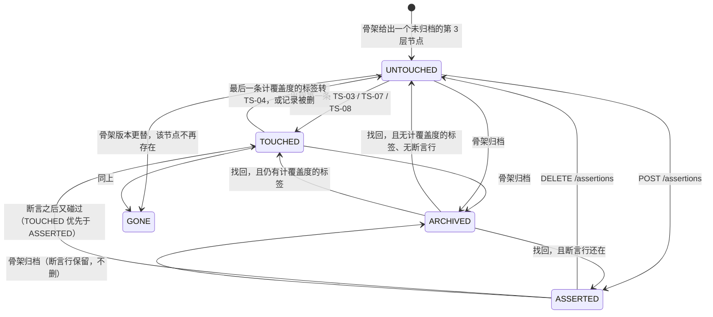
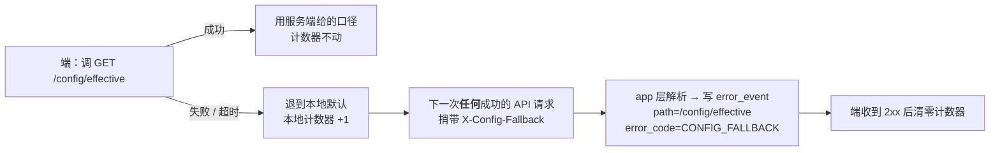
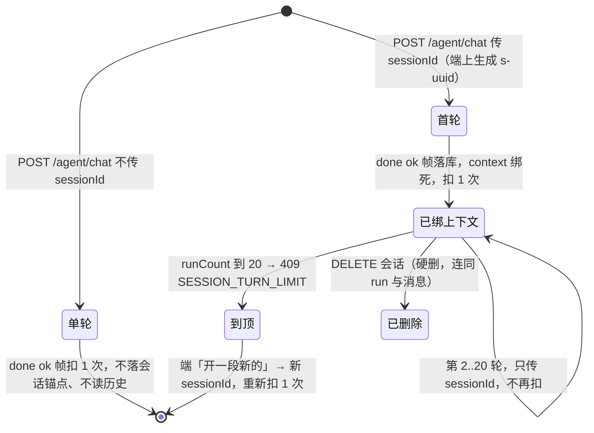
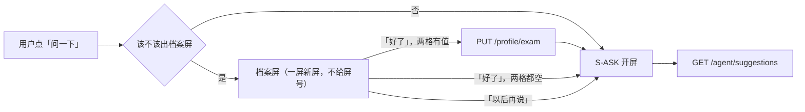
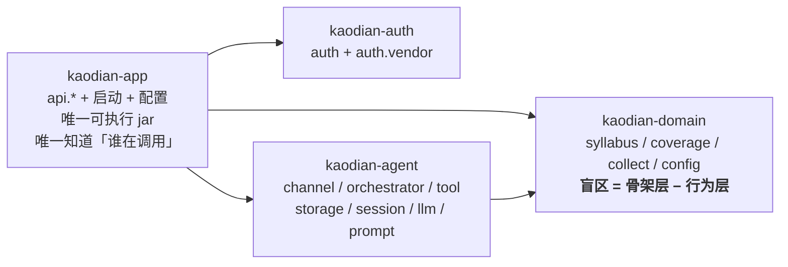

# M3 骨架与覆盖度差集：唯一那个数怎么算 · 问一下 `S-ASK` · 北极星埋点

> **基线**：`origin/v1` @ `81a2c23`，`git fetch origin` 于 2026-09-03。
> **前提**：`B0`（`KUBI-97`）的结论在本文落笔时**尚未回评**。本文**不自己另定**任何 `B0` 范围内的横切口径 —— 存储形态、ID 统一、鉴权默认拒绝、依赖图闸门四项一律**引用**已冻结的真源（`接口契约` §一 / §三 / §11.2，`技术架构与接口契约` §5.2 / §6.5），并在 §十六 登记「这一条等 `B0` 覆盖」。`B0` 与本文冲突时以 `B0` 为准，本文对应行由 stage 3 总装改写。
> **受众**：前端组 · 开发组 · stage 3 总装。**深度档位：详设。**
> **范围**：骨架层的读与写、五态推导 / 覆盖率 / 差集、`U3.2`–`U3.5`、断言 `U3.6`、`S-ASK`、备考档案。
> **不做**：打标管线（`M2`）· 导出与代发（`M4`）· 额度账本（`M7`）。
> **本轮代码 0 行。** 本文只出设计。

---

## 零、这份文档是什么，不是什么

**是**：`M3` 这一域前后端各自开工所需的那一份契约 —— 接口签名、请求与响应字段及类型、错误码全集、分页与幂等语义、本次改动触及的模块依赖方向。**判据是：前后端各拿这一份能独立开工，不需要口头补充。**

**不是**：

- **不是排期**。本文不写「先做哪个」，落差在 §十五 只登记不排序。
- **不是产品裁定**。产品侧真源是 `看盲区` / `U3.1`–`U3.8` / `问一下`；本文引用它们，一个字不改、不抄文案。凡本文与它们冲突处，**冲突登记在 §十四，等产品复核，不擅自选边**。
- **不是那份契约文件本身**。要合进 `接口契约：签名与错误码全集` 的原文全部集中在 **§十四 契约增量**，stage 3 串行合并。**本轮不改那份文件，也不改任何 `INDEX.md`。**

**本文的一条自律**：每一节的结论都配一个**可跑的判据**（`grep` / 测试 / 启动期失败）。写不出判据的结论，本文不写。

---

## 一、覆盖度公式与五态推导（必答 1）

### 1.1 五个状态：一个考点在覆盖度里的位置

`M3 盲区与覆盖度` `INDEX.md` §五把这张图定成「**一个考点节点在覆盖度里的位置**」，不是屏幕状态机。本文把它落成**服务端唯一一处推导**，取值域五个，**互斥且穷尽**：

| # | 状态 | 含义 | 进分母 | 进分子 | 进榜 | 进 `assertedCount` |
|---|---|---|---|---|---|---|
| 1 | `UNTOUCHED` 未触达 | 未归档的第 3 层节点，没有任何计覆盖度的标签 | ✅ | ❌ | ✅ | ❌ |
| 2 | `TOUCHED` 已触达 | 该节点上有 ≥1 条 `TS-03` / `TS-07` / `TS-08` 标签 | ✅ | ✅ | ❌ | ❌ |
| 3 | `ASSERTED` 已断言 | `UNTOUCHED` 且用户声明过「我已经会了」 | ✅ | ❌ | ❌ | ✅ |
| 4 | `ARCHIVED` 已归档 | 骨架归档 —— **同时退分子与分母**，单列计数 | ❌ | ❌ | ❌ | ❌ |
| 5 | `GONE` 不在本版骨架 | 该 `nodeId` 在当前骨架版本里查不到 | ❌ | ❌ | ❌ | ❌ |



**🔴 推导优先级写死，一行代码顺序定死一条产品不变量：**

```
GONE  >  ARCHIVED  >  TOUCHED  >  ASSERTED  >  UNTOUCHED
```

**为什么优先级必须是这个顺序，而不是「断言优先」：**

`U3.3` §2.1 与 `U3.6` §2.2 都写着「被断言的节点**仍计入『没碰过』**」，`U3.3` §2.4 的四选一段控更把它写死成集合关系：`没碰过 ∪ 已经会了 = 没碰过`，即 **`ASSERTED ⊆ 没碰过`**。而界面不禁止用户断言一个已经碰过的考点（`U3.6` §2.1 只在**归档**时禁用开关）。

于是「断言了之后又碰过」这一格必须有人定。**本文定为 `TOUCHED`，断言行保留不删**：

| 选法 | 后果 |
|---|---|
| ❌ `ASSERTED` 优先 | 一个已经碰过的节点会从分子里掉出来 —— **点一下按钮就能让覆盖度下降**，而 `U3.6` §2.2 逐字写着断言之后三个数一个都不变 |
| ✅ `TOUCHED` 优先 | `ASSERTED ⊆ 没碰过` 从一条**要靠自觉的约定**变成一条**结构上不可能被破坏的事实**：`ASSERTED` 这个取值的定义里就含着「不是 `TOUCHED`」 |

**断言行为什么保留不删**：用户断言后碰了一次、随后把那条标签丢弃（`TS-04`），节点回到 `UNTOUCHED`；此时断言应当**还在**（他从没取消过）。删了就要求他再断言一次，而那是产品从没许诺过的一次额外操作。

**判据（可跑）**

```bash
./server/build.sh -q test -Dtest=CoverageStateTest -Dsurefire.failIfNoSpecifiedTests=false
```

`CoverageStateTest` 至少四条断言：① 断言一个 `UNTOUCHED` 节点 → `ASSERTED`，三个数一个不变；② 再打一条 `TS-03` → `TOUCHED`，`assertedCount` 减一，**断言行仍在**；③ 丢弃那条标签 → 回到 `ASSERTED`（不是 `UNTOUCHED`）；④ 归档 → `ARCHIVED`，同时退分子与分母，`archivedCount` 加一。

### 1.2 三个数怎么算出来 —— `盲区 = 骨架层 − 行为层`

设当前用户 `u`、当前科目 `s`、当前骨架版本 `v`：

```
D  (分母集合) = { n ∈ Syllabus(s, v) | n.level == 3 ∧ ¬n.archived }
N  (分子集合) = { n ∈ D | ∃ t ∈ Tag(u, n) : t.state ∈ { TS-03, TS-07, TS-08 } }
B  (盲区集合) = D ∖ N                      ← 这就是那条公式
A  (断言集合) = { n ∈ B | asserted(u, n) }
R  (归档集合) = { n ∈ Syllabus(s, v) | n.level == 3 ∧ n.archived }

nodeTotal     = |D|
nodeTouched   = |N|
nodeUntouched = |B|                        ← 🔴 数出来的，不是减出来的
archivedCount = |R|
assertedCount = |A|
```

三条计算规则，逐条对着 `U3.1` §2.2 与 `后端系统设计与组件接入` §1.4：

| 规则 | 落在公式的哪一处 |
|---|---|
| **未分类记录不计入分子** | `N` 的定义里只认三个标签态；`TS-00` / `TS-01` / `TS-02` / `TS-05` / `TS-06` 一条都不把节点推进 `N`（`I-2`） |
| **已归档节点同时退分子与分母** | `n.archived` 在 `D` 的定义里就被排除，`N ⊆ D` 因此也排除了它（`I-6`） |
| **归档计数常驻可见** | `archivedCount` 是响应的**必填字段**，为 0 也返回，重算中也返回（`R-49`） |

**内部比值与用户侧的分界**（`U3.1` §四那处「口径差」，本文两边都不改）：`后端系统设计与组件接入` §1.4 的 `覆盖率 = 行为层 ÷ 骨架层` 是一个**内部量**，可以存在于 `domain` 的日志与运维视图里；**但它不许跨过 HTTP 边界**。`看盲区` §2.9 写死用户侧任何位置不出现百分比 —— 落在契约上就是一句更硬的话：**`M3` 的响应体里没有任何一个浮点字段**（判据 §7.2）。

### 1.3 🔴 覆盖率不许算出负数 —— 为什么它结构上算不出来

**先说清它会怎么变成负数。** 差集是这个仓里第一个能产出负数的形状，而产出负数的写法恰好是最自然的那一种：

```sql
-- ❌ 会算出负数的写法：两个数来自两次口径不同的查询，再相减
SELECT COUNT(*)                   FROM syllabus_node WHERE level=3 AND archived=0 AND subject=?;  -- total
SELECT COUNT(DISTINCT rt.node_id) FROM record_tag rt WHERE rt.user_id=? AND rt.discarded=0;       -- touched
-- untouched = total - touched
```

第二条查询里 `record_tag` 的 `node_id` **不受 `level=3`、不受 `archived=0`、不受 `subject`、不受骨架版本约束**。四个缺口任意一个被踩到，`touched > total`，`untouched` 立刻为负：

| 缺口 | 什么时候踩到 | 现实触发路径 |
|---|---|---|
| 标签挂在已归档节点上 | 归档发生在打标之后 | `SyllabusAdminController` 的归档端点今天就能做到 |
| 标签挂在第 1 / 2 层节点上 | 手动挂载挂到了题型上 | 手动挂载端点不校验 `level` |
| 标签跨科目 | 多科目下同一用户 | `record_tag` 上没有 `subject` |
| 标签指向旧版骨架的节点 | 骨架版本更替 | 换版之后旧 `node_id` 不在新树里（`GONE`） |

**本文的落法，一句话：`N` 只能由 `D` 过滤而来，`nodeUntouched` 只能由 `|D∖N|` 数出来。**

```
🔴 nodeUntouched = |D ∖ N|                    合法
🔴 nodeUntouched = nodeTotal − nodeTouched    禁止。哪怕今天两边恰好相等
```

**为什么连「今天恰好相等」都不许写成减法**：减法把「`N ⊆ D`」从一条**结构事实**降级成一条**巧合**。一旦降级，上面四个缺口里任何一个被引入时，**不会有任何东西报错** —— 屏幕上直接出现「没碰过 −3 个」，而那一屏是这个产品唯一的产出。

**三个数必须来自同一次遍历。** `D`、`N`、`A`、`R` 四个集合在一次对 `Syllabus(s, v)` 的遍历里同时产出；`GroupCoverage` 与 `Summary` 从同一份中间结果投影。理由与 `CoverageService` 类注释里那句原话一致：「两处算同一个数就一定会算出两个数」。

**判据（可跑）**

```bash
./server/build.sh -q test -Dtest=CoverageNonNegativeTest -Dsurefire.failIfNoSpecifiedTests=false
```

`CoverageNonNegativeTest` 必须**先红过一次**才算数（`CLAUDE.md` §Delivery）。构造四条脏数据各一次，每次断言 `nodeUntouched ≥ 0` 且 `nodeTouched + nodeUntouched == nodeTotal`：① 一条 `TS-03` 挂在**已归档**节点上；② 一条挂在 **level 2** 节点上；③ 一条挂在**别的科目**；④ 一条挂在**当前骨架版本里不存在**的 `nodeId` 上。

四条脏数据都必须被**安静忽略**（不抛异常、不报错）—— 它们是数据问题，不是请求问题，报错会让一屏正常内容因为一条脏标签整个打不开。

再加一条**结构判据**，它比测试更早红：

```bash
grep -rnE 'nodeTotal *- *nodeTouched|total *- *covered' \
  server/kaodian-domain/src/main/java/com/kaodian/server/coverage/ \
  | grep -vE '^[^:]+:[0-9]+: *(\*|//|/\*)' ; echo "expect: 0 hits"
```

⚠️ 今天这一行**是红的**：`CoverageService.summarize` 末尾就是 `new Summary(total, covered, total - covered, ...)`。它今天算不出负数（`total` 与 `covered` 来自同一个循环），但它是上面那条降级的第一块砖 —— 登记在 §十五 落差 1。

### 1.4 🔴 这条公式必须能脱离 HTTP 被测

依赖图上「`domain` 无依赖」那条边就是为这条公式留的（`接口契约` §十一）。落法：

| 项 | 约束 |
|---|---|
| 计算入口 | `domain.coverage` 的纯方法，签名形如 `summarize(Syllabus, List<RecordTag>, List<UserAssertion>, long userId, Instant now)` |
| 时间 | **注入 `Clock` / `Instant`，不许 `Instant.now()`** —— 「多久前」是这一域的三件事之一，不可注入就不可回放 |
| 用户 | 🔴 方法签名里可以有 `long userId`；**不许出现 `CurrentUser` / `SecurityContext` / `Principal` / `@AuthenticationPrincipal`**（`接口契约` §11.2） |
| 测试 | `CoverageStateTest` / `CoverageNonNegativeTest` **不启动 Spring 上下文、不发一个 HTTP 请求** |

```bash
grep -c kaodian-auth server/kaodian-domain/pom.xml ; echo "expect: 0"
grep -rnE 'CurrentUser|SecurityContext|Principal|AuthenticationPrincipal|org\.springframework\.web' \
  server/kaodian-domain/src/main/java/ ; echo "expect: 0 hits"
grep -rn 'Instant\.now()\|LocalDate\.now()' \
  server/kaodian-domain/src/main/java/com/kaodian/server/coverage/ ; echo "expect: 0 hits"
```

### 1.5 现状与目标的落差（不代劳修，只登记）

实测 `origin/v1` @ `81a2c23`：

| # | 落差 | 现状证据 | 严重度 |
|---|---|---|---|
| 1 | **五态是另一套**：`EMPTY` / `TOUCHED_ONLY` / `RUSTY` / `WEAK` / `STABLE` | `coverage/NodeState.java` | 🔴 高 |
| 2 | 🔴 **`WEAK` 由正确率推出，`NodeCoverage.accuracy()` 返回 `Double`** | `NodeState.WEAK_BELOW`、`CoverageService.NodeCoverage#accuracy` | 🔴 **最高，见 §七** |
| 3 | 🔴 **`Summary.ratio()` / `percent()` 直接产出比值与百分比** | `CoverageService.Summary` | 🔴 **最高，见 §七** |
| 4 | `Summary` 没有 `archivedCount` / `recalculating` / `statsAsOfYear` | 同上 | 高 |
| 5 | `GET /coverage/**` 无 `userId`、无鉴权、无 `subject` 参数 | `CoverageController.java:36,56` | 🔴 高（与冻结口径 1 冲突） |
| 6 | `GET /coverage/blindspots` **有 `top` 参数、无 `orderBy` 参数**，与契约 §5.3 正好相反 | `CoverageController.java:44-60` | 高 |
| 7 | `RUSTY` 的 30 天阈值是一条时间判断，但它作为**状态**出现在响应里 | `NodeState.RUSTY_AFTER` | 中（§七） |

---

## 二、「为 0」与「没查到」怎么在响应里区分（必答 2）

界面上是两句不同的话（`看盲区` §2.7.6），响应里就必须是两个值。**落法是 `接口契约` §1.1 的空值规则，不新造机制：**

| 档 | 响应形态 | 界面 |
|---|---|---|
| **数过了，是零** | key **在**，值 `0` | 恒等式项照常显示 0；非恒等式附加行整行隐藏 |
| **没数过** | key **整个不出现**（不是 `null`，不是 `0`，不是 `""`） | 写该项的缺失文案 |
| **骨架还没建好** | 不是字段档，是**状态码档**：`422 SYLLABUS_EMPTY` | 整屏进空态，一个数都不显示，连 `total = 0` 都不写 |

**🔴 第三档必须与前两档分开，这是本节唯一要说破的一句。** 骨架没建好时返回 `{ "nodeTotal": 0, ... }` 在语法上完全合法，界面也拿得到一个数 —— 而那个「0 个考点」是一句假话（`U3.1` §2.4）。所以它走状态码，不走字段。

**本域逐字段落表：**

| 字段 | 端点 | 有值为 0 | 没数过 |
|---|---|---|---|
| `nodeTotal` / `nodeTouched` / `nodeUntouched` | `/coverage/summary` | key 在，值 0 | 🔴 **重算中三个 key 整个不出现**（`recalculating: true`） |
| `archivedCount` | `/coverage/summary` | ✅ **恒在**，为 0 也返回，重算中也返回 | 不存在「没数过」这一档 |
| `assertedCount` | `/coverage/summary` | key 在，值 0 | 🔴 **重算中 key 不出现**，理由见下 |
| `recent5yCount` / `lastSeenYear` / `avgPerPaper` | `/coverage/blindspots` · `/syllabus/nodes/{id}` | key 在，值 0 | key 不出现 → 「这个考点没有出现次数记录」 |
| `touchCount` | `/syllabus/nodes/{id}` | key 在，值 0 → 界面写「你没碰过」，**不写「碰过 0 次」** | 不存在「没数过」这一档 |
| `lastTouchAt` | `/syllabus/nodes/{id}` · `/coverage/blindspots` | —（时间没有 0） | 没碰过 → key 不出现 |
| `count` | `GET /records/unclassified/count`（口径归 `M2`，本域**消费**） | key 在，值 0 → 整行隐藏 | key 不出现 → 写缺失文案 |

**🔴 `assertedCount` 重算中也必须消失 —— 这一条与契约 §5.1 现文冲突，进 §十四。**

契约 §5.1 现文写着「重算中 `archivedCount` 与 `assertedCount` 照常出现」。**`archivedCount` 对，`assertedCount` 不对**，理由是它俩的依赖不一样：

| 字段 | 依赖 | 重算中还算得出来吗 |
|---|---|---|
| `archivedCount` = \|R\| | **只依赖骨架层**，与用户行为无关，不参与这次重算 | ✅ 算得出，照常返回 |
| `assertedCount` = \|A\| = \|{ n ∈ **B** \| asserted }\| | 定义里含 `B = D∖N`，**依赖行为层** | ❌ 算不出 |

把 `assertedCount` 实现成「数一遍断言表的行数」就能在重算中返回一个数 —— 但那个数在「断言过、后来又碰过」的节点上会比屏上该显示的**多一个**（§1.1 的优先级）。`看盲区` §2.7.5 独立地写着重算中**断言注脚隐藏**，两份文档在这里其实是一致的，只是契约那一行没跟上。

**判据（可跑）**

```bash
./server/build.sh -q test -Dtest=NullKeyOmissionTest -Dsurefire.failIfNoSpecifiedTests=false
```

`NullKeyOmissionTest`：把 `SummaryDto` 在 `recalculating=true` 下序列化，断言 `nodeTotal` / `nodeTouched` / `nodeUntouched` / `assertedCount` **四个 key 都不在 JSON 文本里**，且 `archivedCount` **在**。

---

## 三、默认口径下发与偏离登记（必答 3）

### 3.1 `GET /config/effective`

```
GET /api/v1/config/effective
Authorization: Bearer at_xxx
→ 200 { "blindspotOrderBy": "recent5y_count", "blindspotTop": 20 }
```

| 字段 | 类型 | 必填 | 语义 |
|---|---|---|---|
| `blindspotOrderBy` | `string` | ✅ **恒在** | `GET /coverage/blindspots` 的默认口径。取值域四个（§9.3） |
| `blindspotTop` | `int` | ✅ **恒在** | 「先补这几个」的 N。`1..100` |

| 项 | 契约 |
|---|---|
| 鉴权 | `full`。🔴 **不进 §三 那张五行匿名白名单** —— 一个匿名可读的口径端点会立刻被端当成「登录前就能拿到默认值」，而那正好是把默认值搬回端上的路 |
| 只读令牌 | 不在 MCP 五个 tool 的映射面里 → 仅 `full` |
| 分页 / 幂等 | 无 / `GET` 天然 |
| 缺值 | 🔴 **两个字段恒在，不许有「服务端也没配」这一档** —— 它是「同一个数只许有一个来源」的兜底端点，它自己缺值就等于没有来源 |
| 落点模块 | `domain.config` + `app` |

**🔴 为什么 `blindspotTop` 在这里而不是 `/coverage/blindspots` 的一个查询参数**：见 §9.3 与 §十四 增量 1。

### 3.2 偏离登记：🔴 不建端点、不建表

`U3.3` §2.2 要的只有一句：**这次退让发生过就要留下痕迹。** 契约 §5.4 已把落点定了，本文补齐它的语法与服务端处理 —— 不补的话「这个头长什么样」会在四个端各猜一遍。



请求头语法（闭集，写死）：`X-Config-Fallback: blindspotOrderBy=3,blindspotTop=1`

| 项 | 约束 |
|---|---|
| 语法 | 🔴 `^[a-zA-Z]+=[0-9]+(,[a-zA-Z]+=[0-9]+)*$`，总长 ≤ 256 字节 |
| 名字取值域 | **闭集两个**：`blindspotOrderBy` · `blindspotTop`。随 `/config/effective` 的字段增长逐条加 |
| 值 | 正整数，累计次数 |
| 🔴 装什么 | **只装口径名与次数。** 不装科目、不装用户输入、不装任何自由文本 —— 它过不了红线就不该存在 |
| 解析失败 / 名字不在闭集 | 🔴 **整条头丢弃，落一行 `error_code=CONFIG_FALLBACK_MALFORMED`，然后继续处理请求。永不返回 4xx。** 一个诊断头不许让它搭车的那个请求失败 —— 那会把「口径拿不到」升级成「功能用不了」 |
| 清零时点 | 端收到该请求的 **2xx** 之后清零。🔴 **至少一次语义**：网络在响应回程上断掉时会重复计数。**这个偏差登记，不补** —— 补它需要一个确认端点，而那正是「不建端点」要挡的东西 |
| 落点模块 | `app` 的一个 `Filter` / `HandlerInterceptor`。🔴 **不进 `domain`** —— 它是诊断，不是领域 |

**🔴 为什么不是「发生时上报一次」**（契约 §5.4 原话，本文不改）：偏离恰好发生在服务端够不着的那一刻，那一刻上报也发不出去。

**判据（可跑）**

```bash
grep -rn 'X-Config-Fallback' server/kaodian-app/src/main/java/ ; echo "expect: 恰好 1 个 Filter/Interceptor"
./server/build.sh -q test -Dtest=ConfigFallbackHeaderTest -Dsurefire.failIfNoSpecifiedTests=false
grep -rn 'config/fallback\|configFallback\|config_fallback_event' server/ ; echo "expect: 0 hits"
grep -rniE 'fallback' server/kaodian-domain/src/main/java/ ; echo "expect: 0 hits"
```

`ConfigFallbackHeaderTest` 三条畸形输入：`blindspotOrderBy=abc`、`科目=1`、`x=1;DROP TABLE`。三条都必须 **2xx**，且三条都在 `error_event` 里留下 `CONFIG_FALLBACK_MALFORMED`。

---

## 四、反向断言「我卡住了」：🔴 一个端点都不给（必答 4）

**`U3.6` §2.4 的产品侧结论是「登记它、说清后果、不裁定」。技术侧的回答对称：本文连端点名都不给。** 契约 §5.6 已裁定过一次；本文的任务是把「为什么它不该有端点」从一句立场变成一条**能被检验的结构论证**，并且**不顺手设计它**。

### 4.1 它缺的不是端点，是差集定义里的一个位置

`盲区 = 骨架层 − 行为层` 是一个**集合差**，而集合差要求行为层是一个**二值谓词**：这个考点，碰过 / 没碰过。「碰过但没通过」要的是第三个值。

一旦有第三个值，`D` 就从二分变成三分，而 `碰过 + 没碰过 = 考点总数` 这条恒等式（`U3.1` §2.3、`看盲区` §2.7.1）**只有在有人决定「卡住」归到哪一边之后才重新成立**：

| 「卡住」归哪边 | 恒等式 | 后果 |
|---|---|---|
| 归「碰过」 | ✅ 成立 | 与今天完全一样 —— 那这个功能什么都没改变 |
| 归「没碰过」 | ✅ 成立 | **产品在判断「他没学会」** —— 正面撞红线一 |
| 单列第三格 | ❌ **不成立** | 摘要区那三个数加不起来，而 `U3.1` §2.4 写死了恒等式的项一个都不能少 |

**这三格里没有一格是技术侧能填的。** 第一格让功能不存在，第二格越红线，第三格拆恒等式。**填这一格是一次产品裁定，不是一次实现选择。**

### 4.2 🔴 所以补一个端点比不补更糟

补 `POST /assertions/stuck` 出来，它的实现必然要在上面三格里选一格 —— 而选的那一格**不会出现在任何一份文档里**，它会以「代码就是这么写的」的形式存在。`接口契约` §二对「不补」这一档的定义逐字如此：**「上游产品规则本身悬空。有契约没规则比没契约更糟：补了端点，规则就会被实现反向定义。」**

### 4.3 🔴 不留位，一格都不留

**这一条比「不补端点」更容易被绕过**，所以逐项写死：

| 不许有 | 为什么 |
|---|---|
| `POST /assertions/stuck`；或 `POST /assertions` 加 `kind` / `direction` / `type` 字段 | 一个二值枚举里的第二个值，是这条规则被实现定义的最短路径 |
| `user_assertion` 表加一列 `kind` | 「先把列加上，值先都填 `mastered`」—— 加完之后填第二个值不再需要任何裁定 |
| `UserAssertion` 加一个 `Kind` 枚举，哪怕只有一个取值 | 同上 |
| `NodeState` 加第六态 `STUCK` | 它会立刻进 `assertedCount` 或 `nodeUntouched` 的定义 —— 也就是替 §4.1 那三格选了一格 |
| 契约里为它留一行「待定」 | 留一个待填的位置就是在画一个解决方案（`U3.6` §6.3 逐字） |

**`B-1` 保持开着。它关闭的条件是有人先定「碰过但没通过」在差集里算什么，不是有人写了个端点。**

```bash
grep -rniE 'stuck|卡住|blocked_by_user|assertionKind|AssertionType' \
  server/kaodian-domain/src/main/java/ \
  server/kaodian-app/src/main/java/com/kaodian/server/api/ ; echo "expect: 0 hits"
```

**这条断言必须先红过一次**：往 `UserAssertion` 上加一个 `String kind`，`grep` 必须命中。

---

## 五、问一下 `S-ASK`（必答 5）

### 5.1 会话模型



| 项 | 契约 | 真源 |
|---|---|---|
| 会话标识 | `s-<uuid>`，**端上生成**。服务端在首轮 `done{ok}` 时落库 | 契约 §12.2 |
| 上下文 | **只在首轮传**，服务端绑在会话上；后续轮次只传 `sessionId` | 契约 §12.2.2 |
| 中途改上下文 | `409 CONTEXT_ALREADY_BOUND` | 同上 |
| `from` 取值域 | 闭集四值 `S-BLIND` / `S-NODE` / `S-REC` / `S-HOME`；未知 → `422 UNKNOWN_CONTEXT_SOURCE`。🔴 **不许有 `other` 或自由文本** | 同上 |
| `S-BLIND` 锚点 | `orderBy` · `subject?` · `filter?` —— **三个，没有第四个**。🔴 **没有 `province`**，这不是漏写 | 契约 §12.2.2 / §12.9.3 |
| `context` 装什么 | 🔴 **只传锚点，不传数据本身** —— 传 `orderBy` 不传那 50 行清单 | 契约 §12.2.2 |
| 轮数上限 | 20，到顶 `409 SESSION_TURN_LIMIT`。⚠️ 成本闸，不是产品判断 | 契约 §12.6 |
| 归属 | 不属于当前 `userId` → 🔴 **`403 NOT_YOUR_SESSION`，不是 `404`** | 契约 §12.2.1 |
| 归属校验落在哪 | 🔴 **`app`**。`agent` 拿不到账号体系，这条边永不建 | 契约 §12.11 |
| 分页 | 🔴 `GET /agent/sessions` **游标分页**（本域唯一一个分页端点） | 契约 §12.7 |

### 5.2 额度扣点

| 项 | 契约 |
|---|---|
| 维度 | `quota_type = ai_ask`。🔴 **不新增 `agent_chat`** |
| 计量单位 | 🔴 **一次会话 = 1 次**，在该会话**首轮**的 `done{ok}` 扣。会话内后续轮次不再扣 |
| 扣减充要条件 | 服务端把 `done{reason:"ok"}` 成功写出去了。之后条件更新 `used = used+1 WHERE used < granted`，affected rows = 0 → 回滚按耗尽 |
| 🔴 额度不许为负 | 由上面那句**条件更新**保证，不是由前置检查保证。前置检查只省下一次模型调用 |
| 前置失败 | `403 QUOTA_EXHAUSTED`，响应体带手动记录入口提示 |
| `GET /agent/suggestions` | 🔴 **不计费** —— 它不过模型（契约 §12.3.1），没有外部账单 |
| 扣在哪一层 | 🔴 **`app`**。`app` 传 `userId` 与额度校验结果给 `agent`，`agent` 不自己查账号 |
| 幂等 | 🔴 触发外部账单 → **必须带 `Idempotency-Key`**，缺 → `400 IDEMPOTENCY_KEY_REQUIRED`。命中且上次成功 → 返回上次结果，**不再扣** |

**🔴 一处契约今天没堵上的口子，本文堵上（进 §十四 增量 4）：**

契约 §12.2 写着「`sessionId` 不传 = 单轮提问：不读历史、不建会话锚点」，而 §12.6 写着「一次**会话** = 1 次，在该会话首轮的 `done` 扣」。两句放在一起，**不传 `sessionId` 就没有会话，也就没有「首轮」，于是没有扣点时点** —— 单轮提问成了一条不限量的免费模型通道。

> 🔴 **裁定：不传 `sessionId` 的单轮提问，按「一次只有一轮的会话」计，在它的 `done{ok}` 扣 1 次。** 计量单位是「用户按了一次发送并拿到一段回答」，会话只是它的容器；容器不建，账照记。

```bash
./server/build.sh -q test -Dtest=AgentQuotaTest -Dsurefire.failIfNoSpecifiedTests=false
```

`AgentQuotaTest` 三条：① 传 `sessionId` 连聊 3 轮 → `used` 只 +1；② **不传 `sessionId` 连发 3 次 → `used` +3**；③ 并发 10 次发送、`granted − used == 1` → 恰好 1 次成功，**任何时刻 `granted − used ≥ 0`**。

### 5.3 只读令牌一律 `403`，不论方法

`/agent/**` 六个端点（`POST /agent/chat`、`GET /agent/suggestions`、`GET`/`PATCH`/`DELETE /agent/sessions/**`）**与 `/billing/**` 同档**：只读令牌命中即 `403 READONLY_TOKEN`，**不论方法**。它写会话、扣额度。

**🔴 落法是路径黑名单，不是每个 controller 的注解。** 与契约 §3.2 逐字同一条：「新增一个 controller 而忘了加鉴权注解时，它应当**默认打不通**」。今天 `AuthWebConfig` 只注册了一个参数解析器 —— 方法签名不写 `CurrentSession` 就是公开端点，默认值是「公开」。**这个默认值本身是待办 1 / 落差 3 的成因，归 `B0`**；本文只写 `M3` 这一域的期望结果。

```bash
./server/build.sh -q test -Dtest=ReadonlyTokenDenyTest -Dsurefire.failIfNoSpecifiedTests=false
```

`ReadonlyTokenDenyTest` 参数化跑**六条 `/agent/**` 路径 × 各自的方法**，外加 `PUT`/`GET /profile/exam`、`POST`/`DELETE /assertions`、`POST /events/blindspot-opened`，全部期望 `403 READONLY_TOKEN`；同一组不带令牌再跑一遍，全部期望 `401 UNAUTHORIZED`。

### 5.4 第一次进 `S-ASK` 时收一次用户信息

**🔴 收集时点已从「登录成功之后、`S-HOME` 之前」挪走**（2026-09-03 产品裁定，真源 `问一下` §2.5 / §3.2 裁定 2）。**不要按旧位置设计。**



**「该不该出」这个判定归端上，服务端不提供任何字段。** 判定式：

```
出档案屏  ⟺  （本机没记过「跳过」） ∧ （GET /profile/exam 的响应体是空对象）
```

| 问 | 答 |
|---|---|
| 服务端要不要一个 `profileSkipped` / `hasSeenProfilePrompt` 标记 | 🔴 **不要**（契约 §12.9.1）。加了它就长出「催他填」的落点，而产品裁定是跳过后不留任何催促痕迹 |
| 「跳过了」与「还没填」在契约里怎么分 | 🔴 **不分，本来就是同一件事** —— 两个字段本来就可为空，没设过时整个 key 不出现 |
| 「跳过」在契约上的形状 | 🔴 **不调 `PUT`**。不是 `PUT` 一个空体 |
| 两格都空时点「好了」 | 等同跳过 → **不调 `PUT`** |
| ⚠️ 代价 | 重装 App / 换一个端，**跳过状态不跟着走，会再问一次**。这是「不加服务端标记」这条裁定的已知代价，**登记，不补** —— 补它就要回到那个会长出催促的标记 |
| ⚠️ 「填了」跟不跟着走 | ✅ 跟着走 —— `GET /profile/exam` 有值就不出这一屏，跨端一致 |

```bash
grep -rniE 'profileSkipped|hasSeenProfile|promptShown|skipFlag' server/ ; echo "expect: 0 hits"
```

### 5.5 `/api/agent/**` 今天的形态：只给目标态，不动代码

实测 `origin/v1` @ `81a2c23`：五个端点**完全不校验令牌**，`userId` 恒 `0L`（`AgentController.java:76-79`、`AgentSessionController.java:42-43`），任何人可读 / 删任意 `sessionId`。

**🔴 本轮只给目标形态，不动代码**（[KUBI-78](mention://issue/01a065d7-df5d-7a25-a843-12707c974dfb)）。上面 §5.1–§5.4 全部是目标态。**这一条与冻结口径 1「不登录不能记」直接冲突，它的修法归 `B0` 的「鉴权默认拒绝」，不归本文。**

---

## 六、`POST /events/blindspot-opened`（必答 6）

> 🌟 **这一条比本文其它任何一条都更该被算对。** 它是北极星「主动查看盲区的人数」的**唯一数据源**。

### 6.1 签名

```
POST /api/v1/events/blindspot-opened
Authorization: Bearer at_xxx
{ "localDate": "2026-09-03", "surface": "S-BLIND", "entry": "home", "outcome": "data" }
→ 200 { }
```

| 字段 | 类型 | 必填 | 取值域 | 语义 |
|---|---|---|---|---|
| `localDate` | `string` | ✅ | `YYYY-MM-DD` | 🔴 **端上产生这次动作时的本地自然日，不是上报时刻。** 补传时原样带上 |
| `surface` | `string` | ✅ | 闭集 `S-BLIND` \| `S-ASK` | 这一次「主动查看」发生在哪一屏。见 §6.4 |
| `entry` | `string` | ✅ | 闭集 `home` \| `deeplink` | 怎么到达这一屏的。🔴 `restore`（冷启动恢复）**恒不上报**，所以它不在取值域里 |
| `outcome` | `string` | ✅ | 闭集 `data` \| `empty` | 上屏时有没有数据。🔴 空态**也打**，但必须可区分 |

**🔴 响应体是空对象，不回显是不是第一次。** 端知道了就会有人拿它做「今天你已经看过了」的界面，而这两屏没有第四种反馈形态（红线七：没有小红点、未读计数、推送）。

**🔴 不带的属性，一个都不加**：科目、排序口径、筛选、停留时长、滚动深度、点了几个考点、设备指纹、`identity_kind`（新形态下恒为 `user`，一个恒定值不是一个字段）。带上任何一个，这个事件就从「一个人来看了」变成一份行为画像，而产品不做行为分析（`看盲区` §13.6）。

### 6.2 什么时候打，什么时候不打

| 情形 | 打不打 | 理由（`U3.2` §2.5） |
|---|---|---|
| 首屏内容**真正上屏之后** | ✅ | 🔴 **不是路由进入时打。** 路由进入只说明他点了，不说明他看到了 |
| 缓存先渲染 | ✅ **缓存上屏那一刻就打** | 他确实看到了内容 |
| 空态上屏 | ✅ `outcome=empty` | 空态也是一次查看，但必须可区分 |
| 从首页点进来 | ✅ `entry=home` | 标准的主动 |
| 外部深链打开这一屏 | ✅ `entry=deeplink` | **最强的主动信号** —— 他绕过了产品的导航 |
| 深链直接进考点详情 | ❌ | 北极星只数这一屏 |
| 从详情 / 打标 / 出口 / 树 返回 | ❌ | 同一次查看的一部分 |
| 切科目 / 切排序 / 切筛选 / 下拉刷新 | ❌ | 否则切一下就能刷 |
| **冷启动恢复到这一屏** | 🔴 ❌ | 这不是这一次的主动选择，是上一次的残留 |
| 从通知点进来 | —— | **不存在**，产品没有通知机制 |
| 把这一屏设成默认落地页 | —— | 🔴 **这个设置项不存在** |

### 6.3 🔴 怎么去重、怎么算人数、重复打开算几次

**去重在服务端，不在客户端。** 客户端去重挡不住重装与多端，而这个数是北极星 —— **它不能被客户端状态左右**（契约 §5.7）。端上仍要有本地队列（防丢），但正确性由服务端的唯一索引兜。

| 项 | 契约 |
|---|---|
| **落库唯一索引** | `UNIQUE (user_id, local_date, surface)` |
| **身份** | `user_id`。🔴 事件只在已登录时产生 —— 这不是靠自觉，是 §5.3 那条「默认拒绝」的结构后果 |
| **窗口** | 一个自然日，按**设备本地时区**。跨零点 22:00 打过一次、次日 00:30 再进 → **算第二次** |
| **重复上报** | `200`，不报错，**不计第二次**（唯一索引冲突 → 静默吞掉） |
| **补传** | 按**原始 `localDate`** 去重，不按补传时刻 |
| **端的责任** | 只管上报与本地队列补传，**不做去重** |
| **端的队列纪律** | 🔴 收到 **4xx → 从队列里删掉，不重试**（它是脏数据，重试到天荒地老也不会变好）；**5xx / 网络失败 → 保留重试** |

**北极星怎么算出来：**

```sql
-- 🔴 这个式子写死在服务端一处，不是查询参数，不下发，不可配置
主动查看盲区的人数(某日) =
  SELECT COUNT(DISTINCT user_id) FROM blindspot_opened_event
  WHERE local_date = ? AND surface IN (<NORTH_STAR_SURFACES>)
```

**「重复打开算几次」逐格答清楚：**

| 情形 | 事件行数 | 北极星计几人 |
|---|---|---|
| 同一天、同一屏、打开 5 次 | **1 行**（唯一索引） | **1** |
| 同一天、`S-BLIND` 与 `S-ASK` 各一次 | **2 行** | **1** —— `COUNT(DISTINCT user_id)` |
| 同一天、手机端 + 网页端各一次 | **1 行**（同 `user_id`、同 `local_date`、同 `surface`） | **1** |
| 跨零点前后各一次 | **2 行**（`local_date` 不同） | **两天各 1** |
| 一次 `outcome=data`、一次 `outcome=empty`，同日同屏 | **1 行**（先到的那条） | **1** |
| 补传三天前的一条，当天也有一条 | **2 行**（`local_date` 不同） | **各自那天各 1** |

🔴 **四条不许**（`U3.2` §2.5 / `看盲区` §十三）：改成「打开次数」· 改成「人均打开次数」· 加分母做成率（**北极星是人数，不是率**）· 把 `outcome=empty` 混进来不做区分。

**`localDate` 的合法窗口**（本文新定，进 §十四 增量 3）：`账号创建日 − 1 天 ≤ localDate ≤ 服务端 UTC 今天 + 1 天`。`±1` 天是跨时区的合法余量。超窗 → **`400 INVALID_ARGUMENT`**（🔴 不新起码），端按上面那条队列纪律删掉。

> **为什么超窗不接受、也不归一化到服务端当天**：一台时钟坏掉的设备会产出 `2035-01-01` 的行，那一行会在未来某一天的人数里凭空多一个人；而归一化会让今天的人数多一个**从没打开过这一屏的人**。两种都是编数据 —— **丢弃是少一条数据，编是多一条假的**（`U3.8` §2.7 的同一句话）。

### 6.4 ⚠️ 一处必须停下来问的冲突：`surface` 集合里有没有 `S-ASK`

**两份都是 2026-09-03 的冻结口径，它们在这一点上说的不是同一件事。本文不选边。**

| 真源 | 说的是 |
|---|---|
| `看盲区` §十三 · `U3.2` §2.5 · `U3.4` §2.4 | 🔴 **北极星只数总览屏。** 深链直接进考点详情 ❌ 不算，「一个数只能有一个定义」 |
| `接口契约` §12.4.2 · §12.13 | 埋点**新增一个 `from` 字段**，`S-ASK` = 「从对话回答里点进」，「**直接生产这个指标的分子**」 |

**冲突有两层，第二层比第一层硬：**

1. **口径层**：只数总览屏，则一个只用 `S-ASK` 的用户永远不进北极星；数上 `S-ASK`，则「主动查看盲区」这个动作有了两个定义。
2. **端点层**：§12.4.2 的 `from` 记的是「**点进了 `S-NODE`**」，而 §5.7 的这个事件记的是「**`S-BLIND` 首屏内容上屏**」。**这是两件事共用一个端点名** —— 而 `接口契约` §12.5.1 在同一份文档里逐字禁掉了这个做法：「🔴 **不是往 `blindspot-opened` 里塞第二种事件** —— 一个端点名一旦开始撒谎，读它的人就再也不能只看名字判断它记了什么。」

**本文的处置：把存储形态做成对两种读法都成立的样子，把选择留给产品。**

| 项 | 落法 |
|---|---|
| 字段名 | 用 `surface`（这一次查看**发生在哪一屏**），**不用 `from`** —— `from` 在 §12.2.2 里已经是 `context.from`，同名不同义会让两处混起来 |
| 存储 | 每一行都存 `surface`，唯一索引带上它。**两种读法的数据都在库里** |
| 北极星口径 | 🔴 `NORTH_STAR_SURFACES` 是**服务端一处常量**，不是查询参数、不下发、不可配置。改它是一次代码改动 + 一条决策记录 |
| 默认值 | `{ S-BLIND }` —— 取**收窄**的那一读。理由：`看盲区` §十三 被 `M3 INDEX.md` §一点名为「这个数的**全部输入**」，是这一域的指定真源；且收窄可以随时放开，放开之后再收窄会让历史数据的口径断成两段 |
| 待产品拍板 | ✅ **`NORTH_STAR_SURFACES` 要不要含 `S-ASK`。** 一句话可改，改的是一个常量，不是一次迁移 |

**⚠️ 另一件事本文明确不做：`S-ASK` 回答里点进 `S-NODE` 的次数，本文不给端点。** 它是 §12.4.2 想要的那个信号，但它记的是**次数不是人数**，与本事件不是同一种东西。契约 §12.5.1 已经写死了它将来的形状：「`POST /events/` 下与 `blindspot-opened` **并列的一个新事件名**」。**在产品确认 §6.4 这个冲突之前，本文不发明那个事件名** —— 发明了就等于替产品选了「两个数」那一边。

### 6.5 落 `app`，不进 `domain`

| 项 | 契约 |
|---|---|
| 落点模块 | 🔴 **`app`**（契约 §11.1：「埋点，不进领域」） |
| 为什么 | `domain` 是那条公式。埋点是**观测公式的人**，不是公式的一部分。让 `domain` 认识一张事件表，下一步就有人从事件表里读一个数去参与覆盖度 |
| 表 | `blindspot_opened_event(user_id, local_date, surface, entry, outcome, created_at)`，`UNIQUE(user_id, local_date, surface)` |
| 鉴权 | `full`。🔴 **不在 §三 那张五行匿名白名单里**。只读令牌 `POST` → `403 READONLY_TOKEN` |
| 分页 / 幂等 | 无 / 🔴 **由唯一索引天然幂等，不要 `Idempotency-Key`** —— 它不触发外部账单、不改账号状态 |

```bash
grep -rniE 'blindspot|north_?star' server/kaodian-domain/src/main/java/ ; echo "expect: 0 hits"
./server/build.sh -q test -Dtest=BlindspotEventShapeTest -Dsurefire.failIfNoSpecifiedTests=false
./server/build.sh -q test -Dtest=BlindspotDedupTest      -Dsurefire.failIfNoSpecifiedTests=false
grep -rn 'NORTH_STAR_SURFACES' server/ ; echo "expect: 恰好 1 处 static final"
grep -rniE 'north_?star' server/kaodian-app/src/main/resources/ ; echo "expect: 0 hits（不在配置文件里）"
```

`BlindspotEventShapeTest`：断言事件 DTO 的分量名集合**恰好等于** `{localDate, surface, entry, outcome}`；多一个字段即红。
`BlindspotDedupTest`：跑 §6.3 那张「重复打开算几次」表的六行，逐行断言事件行数与 `COUNT(DISTINCT user_id)`。

---

## 七、覆盖度是覆盖，不是掌握度（必答 7）

**响应字段里不许出现正确率 / 得分 / 排名 / 进度百分比式的掌握度指标。** 判据三道，从松到紧。

### 7.1 判据一：字段名黑名单（`grep`）

```bash
grep -rniE 'accuracy|correct_?rate|score|rank(ing)?|mastery|proficiency|percent|progress|weak|rusty|stable|正确率|得分|排名|掌握度|进度|星级|评分' \
  server/kaodian-domain/src/main/java/com/kaodian/server/coverage/ \
  server/kaodian-app/src/main/java/com/kaodian/server/api/dto/common/ \
  server/kaodian-app/src/main/java/com/kaodian/server/api/dto/insight/ \
  server/kaodian-app/src/main/java/com/kaodian/server/api/insight/ \
  | grep -vE '^[^:]+:[0-9]+: *(\*|//|/\*)' ; echo "expect: 0 hits"
```

末尾那个 `grep -vE` 是**必要的，不是省事**：这个仓的红线注释是用否定句写的，句子里必然含着被禁的词（`CLAUDE.md` §Delivery：「黑名单不得命中本仓自己的合规注释」）。**去掉注释行之后仍然命中的，才是真的。**

⚠️ **今天这条是红的**，至少命中三处（§1.5 落差 2 / 3）：`NodeState.WEAK`、`NodeCoverage.accuracy()`、`Summary.ratio()` / `percent()`。

### 7.2 判据二：`M3` 的响应体里没有任何浮点字段（结构判据）

```bash
./server/build.sh -q test -Dtest=CoverageNoRatioTest -Dsurefire.failIfNoSpecifiedTests=false
```

`CoverageNoRatioTest` 反射遍历 `SummaryDto` / `BlindSpotDto` / `NodeDetailDto` / `SyllabusNodeDto` 的全部分量类型，断言**没有一个是 `double` / `float` / `Double` / `Float` / `BigDecimal`**。

**这条比字段名黑名单硬**：「有没有 / 几次 / 多久前」三件事的答案分别是 `bool` / `int` / 带时区的绝对时间，**三种里没有一种需要小数**。一个浮点字段出现在这一域，它一定是一个比值 —— 而比值只有两种：掌握度，或百分比。两种都不许上屏。**改个名字绕不过这一条。**

### 7.3 判据三：文案侧（归 `web/`，本文只登记落点）

`web/src/` 的 `capability-boundary-scan.mjs` 守「天数与盲区数不许出现在同一句话里」等文案级约束（`U3.8` §2.4）。**契约层守不住文案** —— 契约不返回天数只是让它更难被写出来，不等于守住了。**两道都要有。**

### 7.4 顺带说清 `NodeState` 五态的替换不是改名

§1.5 落差 1 里那五个态（`EMPTY` / `TOUCHED_ONLY` / `RUSTY` / `WEAK` / `STABLE`）**不是本文那五态的旧名字**，两套是不同维度：

| 现状五态 | 它在回答什么 | 判定 |
|---|---|---|
| `EMPTY` / `TOUCHED_ONLY` | 有没有、练没练 | ✅ 在「有没有 / 几次」里 |
| `RUSTY` | 多久没碰 | ⚠️ 「多久前」是事实，但把它做成**状态**就成了「你该复习了」的结构形态 |
| `WEAK` / `STABLE` | 🔴 **答得怎么样** | ❌ 正面撞红线一 |

**替换不是重命名，是把后三个态从状态机里拿掉**，它们承载的事实改由**字段**承载：`lastTouchAt`（多久前，由端算天数）；而 `WEAK` / `STABLE` 背后的 `practiced` / `correct` **一并从响应里去掉**。理由不是「用户自填就没事」：字段在响应里，第二个消费方就会把它当成产品记的分，而 `U3.4` §2.6 逐字禁掉了「置信度 / 匹配分」的**屏上形态**，掌握度禁得更早。

⚠️ **这一段是本文对现有实现的判断，不是一次改动授权。** 真正的改法与影响面（导出格式、既有测试、前端）归 stage 3 与后续开发议题。

---

## 八、备考档案 `GET` / `PUT /profile/exam`（必答 8）

```
GET  /api/v1/profile/exam  → 200 { "examType": "national", "examDate": "2027-11-28" }
                           → 200 { }        ← 没设过：两个 key 都不出现
PUT  /api/v1/profile/exam  ← { "examType": "national", "examDate": "2027-11-28" }
```

| 字段 | 类型 | 必填 | 语义 |
|---|---|---|---|
| `examType` | `string` | — | 闭集：`national` \| 省级行政区代码。🔴 **没设过时整个 key 不出现**，不返回 `null` / `"unknown"` |
| `examDate` | `string` | — | `YYYY-MM-DD`，🔴 **`date` 不是 `datetime`**。同样，没设过则 key 不出现 |

| 项 | 契约 |
|---|---|
| **鉴权：`GET` 也要 `full`** | 🔴 备考档案是**用户数据**，不属于 MCP 五个 tool 的只读面。只读令牌命中 `GET` → `403 READONLY_TOKEN` |
| **鉴权：`PUT`** | `full`。只读令牌 → `403 READONLY_TOKEN` |
| 语义 | 🔴 **全量覆盖**。两个字段都可为空（等于清空这一项） |
| 两字段互不依赖 | 🔴 只填日期不选场次是合法的，反过来也是。**不做「必须两个都填」的表单校验** |
| 存哪 | 表 `user_exam_profile(user_id PK, exam_type, exam_date, updated_at)` |
| 🔴 为什么不加到 `app_user` | 那是 `kaodian-auth` 的表，而备考档案**进公式**。加进去等于让账号体系长出业务字段，而 `kaodian-auth` 刻意不依赖 `domain` |
| 落点模块 | `domain` + `app`。🔴 **不进 `auth`** |
| 留不留历史 | 🔴 **不留。** 留了就长出「你的备考轨迹」，那是学习分析 |
| 🔴 不返回天数 | 允许返回 `examDate` 这个绝对日期；**不许返回 `daysUntilExam` / `remainingDays` / 任何派生天数** |
| `examType` 非法值 | `400 INVALID_ARGUMENT`（🔴 **不新起码**）。这一格界面是闭集选择器，用户选不出非法值，走到这里就是端上的 bug —— 而「界面需要后端能区分 N 档」是新码的判据，bug 不是一档 |
| `examType` 是今天没有考情数据的省 | 🔴 **照存，不拒。** `EXAM_TYPE_UNSUPPORTED` 今天没有任何端点能抛出它（契约 §12.9.4） |
| `examDate` 超范围 | `400 EXAM_DATE_OUT_OF_RANGE`，窗口 `今天 −1 年 .. 今天 +2 年` |
| 分页 / 幂等 | 无 / 全量覆盖天然幂等，**不要 `Idempotency-Key`** |
| 「跳过」 | 🔴 **不调 `PUT`**，不是 `PUT` 一个空体。契约上没有「已跳过」这个状态位（§5.4） |

```bash
grep -rniE 'daysUntil|remainingDays|daysLeft|countdown|倒计时' \
  server/kaodian-domain/src/main/java/ server/kaodian-app/src/main/java/com/kaodian/server/api/ \
  | grep -vE '^[^:]+:[0-9]+: *(\*|//|/\*)' ; echo "expect: 0 hits"
grep -rniE 'examType|exam_type|examDate|ExamProfile' server/kaodian-auth/src/ ; echo "expect: 0 hits"
```

---

## 九、接口签名全集

前缀 `/api/v1`（⚠️ 代码里今天全部挂在 `/api/**`，是全局落差，本文不单独修）。全部端点默认需要 `scope=full` 的有效令牌；**本域没有一个匿名端点。**

### 9.1 `GET /coverage/summary` —— 覆盖概览

```
GET /api/v1/coverage/summary?subject=<code>
→ 200
{ "nodeTotal": 412, "nodeTouched": 180, "nodeUntouched": 232,
  "archivedCount": 6, "assertedCount": 3, "statsAsOfYear": 2024, "recalculating": false }
```

| 字段 | 类型 | 必填 | 语义 |
|---|---|---|---|
| `nodeTotal` / `nodeTouched` / `nodeUntouched` | `int` | 重算中三个 key 全不出现 | 🔴 **三个数一律由服务端算并返回，前端不做任何一次减法。** 定义见 §1.2 |
| `archivedCount` | `int` | ✅ **恒在** | 🔴 常驻，为 0 也返回，**重算中也返回** |
| `assertedCount` | `int` | 重算中 key 不出现（§二） | 🔴 单列，不并入三个数 |
| `statsAsOfYear` | `int` | — | 统计截止年。没有统计 → key 不出现 |
| `recalculating` | `bool` | ✅ | 🔴 「重算中」与「已是最新」两档就是这一个布尔 |

| 项 | 契约 |
|---|---|
| `subject` | 必填。缺 → `400 VALIDATION_FAILED`；科目没加载 → `404 SUBJECT_NOT_LOADED` |
| 骨架为空 | `422 SYLLABUS_EMPTY` |
| 🔴 没有的字段 | 任何比值、任何百分比、任何浮点。判据 §7.2 |
| 分页 / 幂等 / 模块 | 无 / `GET` 天然 / `domain.coverage` + `app` |

### 9.2 `GET /syllabus/tree` —— 骨架树 + 覆盖

```
GET /api/v1/syllabus/tree?subject=<code>&withCoverage=true
→ 200
{ "subject": "ziliao", "syllabusVersion": "2026-08",
  "groups": [ { "code": "...", "name": "...", "level": 1,
                "touchedCount": 43, "untouchedCount": 77,
                "children": [ { "code": "...", "level": 2, "touchedCount": 12, "untouchedCount": 9,
                                "children": [ { "code": "...", "level": 3,
                                                "recent5yCount": 14, "touchCount": 0, "asserted": false } ] } ] } ],
  "archived": { "count": 6, "nodes": [ { "code": "...", "name": "...", "level": 3 } ] } }
```

| 项 | 契约 |
|---|---|
| 分页 | 🔴 **不分页，不懒加载。单模块整棵树一次返回。** 分批上屏是端上的渲染策略，不是分次请求 |
| 层级 | 三层。🔴 服务端结构上不可能返回第 4 层（`syllabus_node.level` 有 `CHECK ≤ 3`）；`U3.5` §2.6 的「第 4 层当叶子渲染」是端上的第二道防线，不是服务端的行为 |
| 归档区 | 🔴 **`archived` 恒在响应里，`count` 为 0 也在。没有 `?includeArchived=` 这类参数**，见下 |
| 非叶子的两个计数 | 🔴 **由服务端给**，端不从子树求和 —— `U3.1` §2.1 那条「前端不做任何一次减法」在树上同样成立 |
| 统计缺失 | `recent5yCount` key 不出现，不返回 0 |
| 骨架为空 | `422 SYLLABUS_EMPTY`（🔴 **不是空数组**） |
| 幂等 / 模块 | `GET` 天然 / `domain.syllabus` + `domain.coverage` + `app` |

**🔴 为什么归档区不能是一个查询参数**：`R-49` 要求归档三件事都**不做成开关**。一个 `?includeArchived=false` 就是那个开关 —— 它不会报错，屏幕上归档区消失，覆盖度看起来完全合理。**把它做成「结构上没有这个参数」，是这条红线最省的守法方式。**

```bash
grep -rniE 'includeArchived|showArchived|withArchived|hideArchived' server/ ; echo "expect: 0 hits"
```

### 9.3 `GET /coverage/blindspots` —— 「先补这几个」

```
GET /api/v1/coverage/blindspots?subject=<code>&orderBy=recent5y_count&filter=untouched&hasStatsOnly=false
→ 200
{ "orderBy": "recent5y_count", "top": 20,
  "items": [ { "nodeId": "10231", "name": "增长率计算", "path": "资料分析 / 增长率 / 增长率计算",
               "recent5yCount": 14, "touchCount": 0 } ] }
```

| 参数 | 类型 | 必填 | 取值域 |
|---|---|---|---|
| `subject` | `string` | ✅ | 科目代码 |
| `orderBy` | `string` | — | `recent5y_count` \| `last_touch_at` \| `touch_count` \| `syllabus_order` —— **四个，没有第五个**。不传 → 用服务端默认，响应回显 |
| `filter` | `string` | — | `all` \| `untouched` \| `touched` \| `asserted`。默认 `untouched` |
| `hasStatsOnly` | `bool` | — | 「只看有出现次数记录的」。默认 `false` |
| ~~`top`~~ | —— | 🔴 **没有这个参数** | 见下与 §十四 增量 1 |

| 项 | 契约 |
|---|---|
| `orderBy` 默认值 | 🔴 **由服务端给，响应里回显 `orderBy`。前端不硬编码默认值。** 端拿默认值的正式通道是 `GET /config/effective` |
| 未知 `orderBy` | `422 UNKNOWN_ORDER_BY`。🔴 **不许静默按默认返回** |
| 未知 `filter` | `400 INVALID_ARGUMENT`（🔴 **不新起码**）。与 `orderBy` 不同档的理由：`filter` **没有服务端默认值**，不存在「静默按默认返回」这个诱惑；而界面是四选一段控，用户选不出非法值 → 走到这里是端上的 bug |
| N | 🔴 **服务端定，前端不硬编码。** 响应回显实际用的 `top` |
| 分页 | 🔴 **不分页。** 超出 N 一律走树。响应里**没有 `nextCursor` / `total` / `hasMore`** |
| 排序稳定性 | 🔴 **三级链在服务端满足**：当前口径 → 骨架自然序 → `nodeId` 字典序。禁止随机、禁止打散、禁止按更新时间兜底 |
| 分组 | 🔴 **不加 `group` / `section` 字段。** 分组边界由排序键的 key 缺不缺唯一确定（`last_touch_at` 下没碰过的没有 `lastTouchAt`、`recent5y_count` 下没统计的没有 `recent5yCount`），服务端已经把它们排在该在的一端，端只在 key 状态变化处画一条分隔。加一个字段就是给同一个事实造第二个来源 |
| 已断言节点 | 🔴 **榜排除，概览不减**（`filter=asserted` 时反过来只列它们）。两条都保留，不为了对齐改任何一条 |
| 归档节点 | 不进榜 |
| 统计字段缺失 | key 不出现，**不返回 0**；在出现次数口径下沉到末尾 |
| 骨架为空 | `422 SYLLABUS_EMPTY`（🔴 一档独立结果，不是空数组） |
| 幂等 / 模块 | `GET` 天然 / `domain.coverage` + `app` |

**🔴 为什么去掉 `top` 参数**：`接口契约` §5.3 与 `技术架构与接口契约` §6.4 在这里写法不一致（前者「服务端定，前端不硬编码」，后者示例里带 `?top=20`）。**两句只有一种一致的落法**：只要 `top` 还是一个请求参数，「前端不硬编码」就只能靠自觉 —— 而端上写下 `top=20` 的那一刻不会有任何东西报错。N 的唯一来源是 `GET /config/effective` 的 `blindspotTop`。⚠️ 今天代码是 `@RequestParam(defaultValue = "20") int top`（`CoverageController.java:57`），登记在 §十五。

### 9.4 `GET /syllabus/nodes/{id}` —— 考点详情

```
GET /api/v1/syllabus/nodes/10231
→ 200
{ "nodeId": "10231", "name": "增长率计算", "path": "资料分析 / 增长率 / 增长率计算", "level": 3,
  "archived": false, "asserted": false,
  "recent5yCount": 14, "lastSeenYear": 2024, "statsAsOfYear": 2024,
  "touchCount": 3, "lastTouchAt": "2026-08-28T21:14:00+08:00",
  "sourceNames": ["某网课", "某讲义"] }
```

| 字段组 | 字段 | 关于谁 |
|---|---|---|
| **骨架事实** | `recent5yCount` · `lastSeenYear` · `statsAsOfYear` · `avgPerPaper` | 关于**真题** |
| **我的事实** | `touchCount` · `lastTouchAt` · `sourceNames` | 关于**用户** |
| **节点自身** | `nodeId` · `name` · `path` · `level` · `archived` · `asserted` | —— |

| 项 | 契约 |
|---|---|
| 🔴 **没有的字段** | `extractedText` · 讲解 / 解析 / 例题 / 相关课程 · 难度 · 掌握度 / 正确率 / 得分 / 星级 · 置信度 / 匹配分 · 相似考点 · 任何比值 · 任何天数。**这不是「不查」，是结构上没有这一列** |
| 时间 | 🔴 `lastTouchAt` 是**带时区的绝对时间**，服务端**不返回「多久前」**。「今天 / 昨天 / n 天前 / 超过一年前」全部由端算 |
| `touchCount = 0` | key **在**，值 `0`（「数过了是零」）；`lastTouchAt` 与 `sourceNames` 的 key **不出现** |
| 统计缺失 | `recent5yCount` 等 key 不出现（→ 「这个考点没有出现次数记录」） |
| 已归档 | `200`，`archived: true`，**内容照常返回**。🔴 归档不是删除 |
| 不存在 | `404 NODE_NOT_FOUND`。🔴 **「不存在」与「已归档」必须能区分到两档** —— 合成一档，用户会以为自己的记录被删了 |
| 非第 3 层 | `200` 照常返回（树导航要用），只是 `level != 3`，不进分母 |
| 分页 / 幂等 / 模块 | 无 / `GET` 天然 / `domain.syllabus` + `domain.coverage` + `app` |

### 9.5 `POST` / `DELETE /assertions` —— 断言

```
POST   /api/v1/assertions   { "nodeId": "10231" }  → 200 { "coverageChanged": false }
DELETE /api/v1/assertions   { "nodeId": "10231" }  → 200 { "coverageChanged": false }
```

| 项 | 契约 |
|---|---|
| 请求体 | 🔴 **只接受 `nodeId`，不接受任何文本** |
| `coverageChanged` | `bool`，✅ 必填。🔴 **断言之后它恒为 `false`** —— 三个数一个都不变，这个字段存在是为了让「不变」被**显式说出来**，而不是让前端去猜 |
| 归档节点 | `409 NODE_ARCHIVED` —— 🔴 **要能被单独区分**，不是一个泛化的失败 |
| 节点不存在 | `404 NODE_NOT_FOUND` |
| 非第 3 层节点 | `400 INVALID_ARGUMENT`（🔴 **不新起码**）。树上非叶子不可点进详情，而断言只在详情里发起 —— 走到这里是端上的 bug |
| 幂等（`POST`） | 天然：已断言再 `POST` → `200`，不报错，**不刷新断言时刻** |
| 幂等（`DELETE`） | 🔴 **天然：取消一个没断言过的 → `200`，不是 `404`**（见下） |
| 只读令牌 / 分页 / 模块 | `403 READONLY_TOKEN`（两个方法都是写）/ 无 / `domain.collect` + `app` |

**🔴 `DELETE` 重复取消为什么返 `200` 而不是 `404`**（进 §十四 增量 6）：断言是一次**集合成员关系**，不是一个有身份的资源。`POST` 侧契约 §5.5 已写死「已断言再 `POST` → `200`」，`DELETE` 侧必须对称 —— 否则端上的离线队列补传一条「取消」时会拿到 `404`，按 §6.3 那条队列纪律（4xx 删掉）丢弃，而它本来是**成功**的。**一半天然幂等的接口比不幂等更危险。**

### 9.6–9.8 其余端点

`POST /events/blindspot-opened` 见 §六 · `GET /config/effective` 见 §3.1 · `GET`/`PUT /profile/exam` 见 §八。

### 9.9 `POST /agent/chat` · `GET /agent/suggestions` · `/agent/sessions/**`

签名以 `接口契约` §12.2 / §12.3 / §12.7 为准，本文不复述、不改一个字段。本域补充的只有 §5.2 那条**单轮提问计费**（§十四 增量 4）与 §5.4 的**收集时点**。

### 9.10 `GET /records/unclassified/count` —— 本域只消费，不定义

```
GET /api/v1/records/unclassified/count
→ 200 { "count": 12 }      // 数过了
→ 200 { }                  // 没查到
```

🔴 **口径归 `M2`，本文不改。** 本域的责任只有两条：① **不把它并进 `/coverage/summary`** —— 它是**记录平面**的数，单位是「条」，另外三个是「个（节点）」，放进同一个响应早晚有人把它们加起来；② **不为它造第二个来源** —— `M3` 界面上那一行「另有 {u} 条记录没能对上任何考点」只由这个端点供数。

---

## 十、错误码全集

**🔴 本文一个新错误码都不新增。** 每一处界面需要区分的档，今天都有码。

| `code` | HTTP | 端点 | 何时 | 界面靠它区分什么 |
|---|---|---|---|---|
| `UNAUTHORIZED` | 401 | 本域全部 | 没带令牌 / 令牌无效 | 「从没登录」（与下一行是两句话） |
| `TOKEN_EXPIRED` | 401 | 本域全部 | 令牌过期，可续期 | 「登录过期了」 |
| `READONLY_TOKEN` | 403 | `/assertions` · `/events/**` · `/agent/**` · `GET`+`PUT /profile/exam` | 只读令牌命中写方法或黑名单路径 | 「这个令牌只能看，不能改」 |
| `NOT_YOUR_SESSION` | 403 | `/agent/sessions/**` · `POST /agent/chat` | 会话不属于当前 `userId` | 🔴 **不是 `404`** —— 返 `404` 等于把「这个 id 存不存在」告诉了不该知道的人 |
| `QUOTA_EXHAUSTED` | 403 | `POST /agent/chat` | 额度耗尽（前置或条件更新 affected=0） | 「额度用完了」（与 `SESSION_TURN_LIMIT` 是两句完全不同的话） |
| `VALIDATION_FAILED` | 400 | 本域全部 | 缺必填 / 类型不对 | 端上 bug 档 |
| `INVALID_ARGUMENT` | 400 | `POST/DELETE /assertions`（非叶子）· `PUT /profile/exam`（`examType` 闭集）· `POST /events/blindspot-opened`（`localDate` 超窗、三个闭集字段越界）· `GET /coverage/blindspots`（未知 `filter`） | 参数值不合法 | 端上 bug 档 —— **bug 不是一档，所以不给它专码** |
| `UNKNOWN_FIELD` / `MALFORMED_BODY` | 400 | 本域全部 | 请求体多字段 / JSON 解不开 | 端上 bug 档 |
| `IDEMPOTENCY_KEY_REQUIRED` | 400 | `POST /agent/chat` | 要求幂等键而没带 | 端上 bug 档 |
| `IN_PROGRESS` | 409 | `POST /agent/chat` | 同一幂等键的上一次仍在进行 | 「上一句还在处理」 |
| `INVALID_LIMIT` / `INVALID_CURSOR` | 400 | `GET /agent/sessions` | 分页参数不合法 | 端上 bug 档 |
| `MESSAGE_REQUIRED` | 400 | `POST /agent/chat` | `message` 与 `images` 皆空 | 「你还没写问题」 |
| `MESSAGE_TOO_LONG` | 400 | `POST /agent/chat` | `message` > 2000 字 | 「写太长了」。🔴 **服务端不静默截断** |
| `IMAGE_TOO_MANY` | 400 | `POST /agent/chat` | `images` > 6 张 | 「最多 6 张」 |
| `UNKNOWN_CONTEXT_SOURCE` | 422 | `POST /agent/chat`（首轮） | `context.from` 不在闭集四值里 | 与「参数类型不对」分开 |
| `CONTEXT_ALREADY_BOUND` | 409 | `POST /agent/chat`（后续轮） | 已有上下文的会话又传了 `context` | 「这条会话已经绑在别的上下文上，要不要新开一条」 |
| `SESSION_TURN_LIMIT` | 409 | `POST /agent/chat` | 会话轮数到 20 | 「这次聊得够长了，新开一次」 |
| `SESSION_NOT_FOUND` | 404 | `/agent/sessions/{id}` | 会话不存在 | —— |
| `TITLE_REQUIRED` / `TITLE_TOO_LONG` | 400 | `PATCH /agent/sessions/{id}` | 标题空 / 超 40 字 | —— |
| `EXAM_DATE_OUT_OF_RANGE` | 400 | `PUT /profile/exam` | `examDate` 超出 `今天 −1 年 .. 今天 +2 年` | 「日期格式不对」vs「这个日期不像考试日期」 |
| `NODE_NOT_FOUND` | 404 | `/syllabus/nodes/{id}` · `/assertions` | 节点标识指不到任何地方 | 🔴 与下一行**必须两档** —— 「找不到这个考点，可能考点表更新了」 |
| `NODE_ARCHIVED` | 409 | `POST /assertions` | 节点已归档，标不了 | 「这个考点已经归档了，标不了」 |
| `NODE_NOT_IN_SYLLABUS` | 400 | `/syllabus/**` · `/coverage/**` | 节点不在本科目树里 | —— |
| `SUBJECT_NOT_LOADED` | 404 | `/coverage/**` · `/syllabus/tree` | 科目没加载 | —— |
| `SYLLABUS_EMPTY` | 422 | `/coverage/summary` · `/coverage/blindspots` · `/syllabus/tree` | 该科目骨架还没建好 | 🔴 与 `500`/`502`/`504` **必须两档**（`U4.4`：缺骨架 ≠ 请求失败） |
| `UNKNOWN_ORDER_BY` | 422 | `GET /coverage/blindspots` | `orderBy` 不在四个取值里 | 🔴 **不许静默按默认返回** |
| `SYLLABUS_DATA_BROKEN` | 500 | `/syllabus/**` · `/coverage/**` | 骨架数据自身坏了 | —— |
| `SERVER_ERROR` | 500 | 本域全部 | 服务端自身错误 | 与 `SYLLABUS_EMPTY` 分档 |
| `NETWORK_TIMEOUT` | —— | —— | ⚠️ **端自己产生的值，服务端永不返回** | 列在这里只为说明这一点 |

**🔴 不存在的码，逐条写明它为什么不存在：**

| 不该有的码 | 为什么 |
|---|---|
| 反向断言相关的任何码 | §四 |
| `EXAM_TYPE_UNSUPPORTED` | 今天没有任何端点能抛出它（`PUT` 照存全闭集，会拒省级代码的统计路径暂不加）。留着就等于契约说端会收到它、行为是永远收不到 |
| `INVALID_LOCAL_DATE` | 界面不需要区分这一档 —— 端只需要知道「4xx 就从队列里删掉」。走 `INVALID_ARGUMENT` |
| `UNKNOWN_FILTER` | 同上，端上 bug 不是一档 |
| `NODE_NOT_LEAF` | 同上。⚠️ `接口契约` §1.3 拿「`nodeId` 不是 level 3」当 `422` 的举例，本文登记：**那个例子今天没有落点**（§十四 增量 5） |
| `COVERAGE_NEGATIVE` 之类的自检码 | 🔴 覆盖度算出负数不是一个要报给端的错误，是一个**结构上不该发生的状态**（§1.3）。给它一个码，就等于承认它会发生 |

---

## 十一、分页与幂等语义

### 11.1 分页

| 端点 | 分页 |
|---|---|
| `GET /coverage/summary` · `/syllabus/nodes/{id}` · `/config/effective` · `/profile/exam` | 无 |
| `GET /coverage/blindspots` | 🔴 **不分页。** 超出 N 一律走树。响应里没有 `nextCursor` / `total` / `hasMore` |
| `GET /syllabus/tree` | 🔴 **不分页，不懒加载。** 单模块整棵树一次返回 |
| `POST`/`DELETE /assertions` · `POST /events/blindspot-opened` | 无 |
| `GET /records/unclassified/count` | 无（它是计数本身，是产品要回答的问题，**不是分页的 `total`**） |
| `GET /agent/sessions` | ✅ **本域唯一一个分页端点**，游标分页：`?cursor=<opaque>&limit=20`，`limit` `1..100`，`nextCursor` 没有下一页时 key 不出现 |

**🔴 本域一个 `total` / `pageCount` / `hasMore` 都不返回。** 一个 `total` 会立刻长出页码条，而页码条要求随机跳页，游标做不到。⚠️ 今天 `SessionRepository.findByUser(long)` 一次全返，登记在 §十五。

### 11.2 幂等

| 端点 | 幂等形态 | 键 |
|---|---|---|
| 全部 `GET` | 天然 | 无 |
| `POST /assertions` | 天然：已断言再 `POST` → `200`，不刷新断言时刻 | 无 |
| `DELETE /assertions` | 天然：取消一个没断言过的 → `200`（§9.5） | 无 |
| `PUT /profile/exam` | 天然：全量覆盖 | 无 |
| `POST /events/blindspot-opened` | 🔴 **由唯一索引 `(user_id, local_date, surface)` 兜底** | 无 —— 不触发外部账单、不改账号状态 |
| `POST /agent/chat` | 🔴 **必须带 `Idempotency-Key`** —— 触发外部账单。缺 → `400 IDEMPOTENCY_KEY_REQUIRED`；命中且上次成功 → 返回上次结果，**不再扣额度**；命中且上次进行中 → `409 IN_PROGRESS` | HTTP 头，服务端按 `(userId, path, Idempotency-Key)` 锚定 |
| `GET`/`PATCH`/`DELETE /agent/sessions/**` | 天然 / 天然 / 重复删返 `404` | 无 |

🔴 **不许「服务端自己兜着」**：兜的那一版一定是「按参数哈希去重」，而参数哈希在重试与合法二次操作之间分不出来。

---

## 十二、本模块触及的模块依赖方向



**🔴 本文一条边都没多。**

| 端点 / 组件 | 落点模块 | 理由 |
|---|---|---|
| 五态推导 · 三个数 · 差集（§一） | `domain.coverage` | 🔴 **`domain` 无依赖** —— 这条公式必须能脱离 HTTP 被测 |
| `GET /coverage/summary` · `/coverage/blindspots` | `domain.coverage` + `app` | —— |
| `GET /syllabus/tree` · `/syllabus/nodes/{id}` | `domain.syllabus` + `domain.coverage` + `app` | —— |
| `POST`/`DELETE /assertions` | `domain.collect` + `app` | 断言是领域写入 |
| `GET /config/effective` | `domain.config` + `app` | 口径下发 |
| `X-Config-Fallback` 的解析与落 `error_event` | 🔴 **`app`** | 诊断不是领域 |
| `POST /events/blindspot-opened` | 🔴 **`app`** | **埋点，不进领域**（契约 §11.1） |
| `GET`/`PUT /profile/exam` · 表 `user_exam_profile` | `domain` + `app` | 🔴 备考档案**进公式，不进 `auth`** |
| `POST /agent/chat` · `/agent/sessions/**` | `agent` + `app` | 🔴 `userId` 与额度校验由 `app` 传入；**会话归属校验在 `app`** —— 会话归属是账号问题，不是对话问题 |
| `GET /agent/suggestions` | `domain` + `app` | 🔴 **不落 `agent`** —— 它不过模型，是一次纯查询 + 模板填数 |
| `GET /records/unclassified/count` | `domain` + `app`（口径归 `M2`） | 记录平面的派生计数 |

**四条不可越的边，各配一行判据：**

```bash
grep -c kaodian-auth server/kaodian-domain/pom.xml                ; echo "expect: 0   # domain 不依赖 auth"
grep -c kaodian-auth server/kaodian-agent/pom.xml                 ; echo "expect: 0   # agent never auth"
grep -cE 'kaodian-(domain|agent|app)' server/kaodian-auth/pom.xml ; echo "expect: 0   # auth 无依赖"
grep -rnE 'springframework\.web|CurrentUser|SecurityContext|Principal' \
  server/kaodian-domain/src/main/java/ ; echo "expect: 0 hits   # domain 不依赖 web"
```

🔴 **判据可查这一点本身是重点**：`kaodian-domain/pom.xml` 里出现 `kaodian-auth` 即为违规，一行 `grep` 就能测。**这比「大家注意别引错」强，因为它是构建工具的事，不是自觉的事。**

⚠️ **一条会被顺手破坏的边**：`Touch` / `RecordTag` / `UserAssertion` 加 `userId`（`B0` 待办 2）时，最省事的实现是让 `domain` 注入一个「当前用户」—— **那一步就把 `domain → auth` 这条边建出来了**。允许 `domain` 方法签名里出现 `long userId`；不允许 `domain` 里出现任何 `CurrentUser` / `SecurityContext` / `Principal` / `@AuthenticationPrincipal`。

---

## 十三、判据总表（可跑，从仓库根目录）

| # | 结论 | 判据 | 今天 |
|---|---|---|---|
| 1 | 五态取值域闭集，优先级 `TOUCHED > ASSERTED` | `-Dtest=CoverageStateTest` | ⬜ 待建 |
| 2 | 🔴 覆盖度不许算出负数 | `-Dtest=CoverageNonNegativeTest` | ⬜ 待建 |
| 3 | 🔴 三个数不许由减法得出 | §1.3 那条 `grep` | 🔴 **红**（落差 1） |
| 4 | 公式脱离 HTTP 可测 | §1.4 第二条 `grep` | ✅ 绿 |
| 5 | `domain` 不依赖 `auth` | `grep -c kaodian-auth server/kaodian-domain/pom.xml` → `0` | ✅ 绿 |
| 6 | `agent` never `auth` | `grep -c kaodian-auth server/kaodian-agent/pom.xml` → `0` | ✅ 绿 |
| 7 | 空值规则：重算中四个 key 消失、`archivedCount` 在 | `-Dtest=NullKeyOmissionTest` | ⬜ 待建 |
| 8 | 偏离登记不建端点、不建表 | §3.2 第三条 `grep` | ✅ 绿 |
| 9 | `X-Config-Fallback` 永不导致 4xx | `-Dtest=ConfigFallbackHeaderTest` | ⬜ 待建 |
| 10 | 🔴 反向断言不留位 | §4.3 那条 `grep` | ✅ 绿 |
| 11 | 只读令牌一律 403 | `-Dtest=ReadonlyTokenDenyTest` | 🔴 **红**（落差 3） |
| 12 | 额度不许为负 · 单轮提问也扣 | `-Dtest=AgentQuotaTest` | 🔴 **红**（落差 4） |
| 13 | 没有服务端「已跳过」标记 | §5.4 那条 `grep` | ✅ 绿 |
| 14 | 🔴 埋点不进 `domain` | §6.5 第一条 `grep` | ✅ 绿 |
| 15 | 🔴 埋点字段集是闭的 | `-Dtest=BlindspotEventShapeTest` | ⬜ 待建 |
| 16 | 🔴 北极星口径不可配置 | `grep -rn 'NORTH_STAR_SURFACES' server/` → 恰好 1 处 `static final` | ⬜ 待建 |
| 17 | 🔴 去重在服务端，重复打开算一次 | `-Dtest=BlindspotDedupTest` | ⬜ 待建 |
| 18 | 🔴 字段名里没有掌握度指标 | §7.1 那条 `grep`（**必须带去注释行的 `grep -vE`**） | 🔴 **红**（落差 2） |
| 19 | 🔴 `M3` 响应体里没有浮点字段 | `-Dtest=CoverageNoRatioTest` | 🔴 **红**（落差 2） |
| 20 | 归档区不是一个开关 | §9.2 那条 `grep` | ✅ 绿 |
| 21 | 不返回派生天数 | §八 第一条 `grep` | ✅ 绿 |
| 22 | 备考档案不进 `auth` | §八 第二条 `grep` | ✅ 绿 |
| 23 | 边界文案同源 | `python3 scripts/boundary-copy-check.py` | ✅ 绿 |

测试类一律走 `./server/build.sh -q test -Dtest=<类名> -Dsurefire.failIfNoSpecifiedTests=false`（多模块下尾巴不可省）。

**🔴 每一条断言必须先红过一次才算数**（`CLAUDE.md` §Delivery）。上表标 ✅ 绿的那些，验收时逐条给出「怎么让它变红」的那一次改动：例如第 10 条 —— 往 `UserAssertion` 上加一个 `String kind`，`grep` 必须命中。**没红过的绿，是没进网的面。**

---

## 十四、§契约增量

> **本节是要合进 `接口契约：签名与错误码全集` 的原文，stage 3 串行合并。本轮不自己去改那份文件。**

### 增量 1 · 改 §5.3：`GET /coverage/blindspots` 去掉 `top` 查询参数

> **落点**：§5.3 表格「`top` / N」那一行。原文：`| top / N | 服务端定，前端不硬编码；🔴 不分页 —— 超出 N 一律走树 |`
>
> **改为：**
>
> | `top` / N | 🔴 **不是查询参数。** N 的唯一来源是 `GET /config/effective` 的 `blindspotTop`，服务端在本端点执行它并在响应里回显 `top`。🚫 不分页 —— 超出 N 一律走树。**只要 `top` 还是参数，「前端不硬编码」就只能靠自觉 —— 而端上写下 `top=20` 的那一刻不会有任何东西报错** |
>
> **同时**：`技术架构与接口契约` §6.4 那一行示例 `?top=20&orderBy=recent5y_count` 与本条不一致，**由 stage 3 一并改成 `?subject=&orderBy=&filter=&hasStatsOnly=`**。⚠️ 今天代码是 `@RequestParam(defaultValue = "20") int top`（`CoverageController.java:57`）。

### 增量 2 · 改 §5.1：重算中 `assertedCount` 的 key 也不出现

> **落点**：§5.1 正文倒数第二段。原文：「🔴 **重算中时，三个数的 key 整个不出现**（§1.1 空值规则），`archivedCount` 与 `assertedCount` 照常出现。」
>
> **改为：**
>
> > 🔴 **重算中时，三个数与 `assertedCount` 的 key 整个不出现**（§1.1 空值规则）；`archivedCount` **照常出现**。
> >
> > 两者待遇不同，是因为依赖不同：`archivedCount` 只依赖骨架层，与用户行为无关，不参与这次重算；而 `assertedCount` 的定义含着「未触达」这个条件（`U3.6`：断言是「没碰过」的子集），它和三个数同源。把它实现成「数一遍断言表的行数」确实能在重算中返回一个数 —— 但那个数在「断言过、后来又碰过」的节点上会比屏上该显示的**多一个**。`看盲区` §2.7.5 独立地写着重算中断言注脚隐藏，两份文档本来就一致。

### 增量 3 · 改 §5.7：埋点字段、`localDate` 合法窗口、`from` → `surface`

> **落点**：§5.7 全节替换。
>
> ```
> POST /api/v1/events/blindspot-opened
> { "localDate": "2026-09-03", "surface": "S-BLIND", "entry": "home", "outcome": "data" }
> → 200 { }
> ```
>
> | 项 | 契约 |
> |---|---|
> | 去重键 | `UNIQUE (user_id, local_date, surface)` —— 🔴 **不含任何设备指纹** |
> | `localDate` | 🔴 端上产生这次动作时的本地自然日，不是上报时刻；补传时原样带上。**合法窗口 `账号创建日 −1 天 .. 服务端 UTC 今天 +1 天`**，超窗 → `400 INVALID_ARGUMENT`（🔴 不新起码，也**不归一化到服务端当天** —— 归一化会多一个从没打开过这一屏的人） |
> | `surface` | 闭集 `S-BLIND` \| `S-ASK`。🔴 **字段名不用 `from`** —— `from` 在 §12.2.2 已是 `context.from`，同名不同义 |
> | `entry` | 闭集 `home` \| `deeplink`。🔴 `restore` 恒不上报，所以不在取值域里 |
> | `outcome` | 闭集 `data` \| `empty`。空态也打，但必须可区分 |
> | 响应体 | 🔴 **空对象，不回显是不是第一次。** 端知道了就会有人拿它做「今天你已经看过了」的界面，而这两屏没有第四种反馈形态 |
> | 重复上报 | `200`，不报错，不计第二次 |
> | 端的队列纪律 | 🔴 收到 **4xx → 从队列删掉不重试**；**5xx / 网络失败 → 保留重试** |
> | 幂等 | 🔴 由唯一索引天然幂等，**不要 `Idempotency-Key`** |
> | 北极星式子 | `COUNT(DISTINCT user_id) WHERE local_date=? AND surface IN (NORTH_STAR_SURFACES)`。🔴 `NORTH_STAR_SURFACES` 是**服务端一处常量**，不是查询参数、不下发、不可配置 |
>
> **⚠️ 冲突登记（待产品裁定，技术侧不选边）**：`NORTH_STAR_SURFACES` 默认取 `{ S-BLIND }`。
> `看盲区` §十三 / `U3.2` §2.5 / `U3.4` §2.4 写死「北极星只数总览屏」；而本文件 §12.4.2 / §12.13 写着从 `S-ASK` 点进 `S-NODE`「直接生产这个指标的分子」。
> 两层冲突：① 口径层 —— 数不数 `S-ASK`，是「一个数一个定义」的两种答案；② 端点层 —— §12.4.2 的 `from` 记的是「点进了 `S-NODE`」，而本节记的是「`S-BLIND` 首屏内容上屏」，**两件事共用一个端点名**，而 §12.5.1 在同一份文档里逐字禁掉了这个做法。
> 取收窄默认值的理由：收窄可以随时放开，放开之后再收窄会让历史数据的口径断成两段。**改它是改一个常量 + 一条决策记录，不是一次迁移。**

### 增量 4 · 改 §12.6：不传 `sessionId` 的单轮提问按一次会话计

> **落点**：§12.6 表格「计几次」那一行之后加一行。
>
> | 不传 `sessionId` 的单轮提问 | 🔴 **按「一次只有一轮的会话」计，在它的 `done{ok}` 扣 1 次。** §12.2 写着不传 `sessionId` = 不建会话锚点，而本节写着「在该会话首轮扣」—— 两句放在一起，单轮提问就没有扣点时点，成了一条不限量的免费模型通道。**计量单位是「用户按了一次发送并拿到一段回答」，会话只是它的容器；容器不建，账照记。** |

### 增量 5 · 改 §1.3：`422` 的举例今天没有落点

> **落点**：§1.3 状态码表 `422` 那一行。原文：`| 422 | 结构合法但语义不成立（如 nodeId 不是 level 3） |`
>
> **就地加注（不改原句）：**
>
> > ⚠️ 括号里那个例子今天**没有落点**：`nodeId` 不是 level 3 的唯一入口是 `POST /assertions`，而树上非叶子不可点进详情、断言只在详情里发起 —— 走到那里是端上的 bug，按 §12.9.4 结论 2 的同一条判据走 `400 INVALID_ARGUMENT`，不新起码。`422` 在 `M3` 真实的落点是 `SYLLABUS_EMPTY` 与 `UNKNOWN_ORDER_BY` 两个。

### 增量 6 · 改 §5.5：`DELETE /assertions` 重复取消返 `200`

> **落点**：§5.5 表格「幂等」那一行。原文：`| 幂等 | 天然幂等：已断言再 POST → 200，不报错 |`
>
> **改为：**
>
> | 幂等 | 天然幂等，🔴 **两个方法都是**：已断言再 `POST` → `200`，不报错，**不刷新断言时刻**；取消一个没断言过的节点 → `DELETE` 也返 `200`，**不是 `404`**。断言是一次集合成员关系，不是一个有身份的资源；`DELETE` 侧不对称的话，离线队列补传一条「取消」会拿到 `404` 被端当失败丢弃，而它本来是成功的。**一半天然幂等的接口比不幂等更危险。** |

### 增量 7 · 改 §5.4：`X-Config-Fallback` 的语法与服务端处理

> **落点**：§5.4 那张三步表之后追加。
>
> | 项 | 约束 |
> |---|---|
> | 语法 | 🔴 `^[a-zA-Z]+=[0-9]+(,[a-zA-Z]+=[0-9]+)*$`，总长 ≤ 256 字节 |
> | 名字取值域 | 闭集两个：`blindspotOrderBy` · `blindspotTop`，随 `/config/effective` 的字段逐条加 |
> | 解析失败 / 名字不在闭集 | 🔴 **整条头丢弃，落一行 `error_code=CONFIG_FALLBACK_MALFORMED`，继续处理请求。永不返回 4xx** —— 一个诊断头不许让它搭车的那个请求失败，那会把「口径拿不到」升级成「功能用不了」 |
> | 清零时点 | 端收到该请求的 2xx 之后清零。🔴 **至少一次语义**，网络在响应回程断掉时会重复计数；**这个偏差登记，不补** —— 补它需要一个确认端点，而那正是「不建端点」要挡的东西 |
> | 落点模块 | `app` 的一个 `Filter` / `HandlerInterceptor`。🔴 **不进 `domain`** |

### 增量 8 · 新增 §5.8：`GET /syllabus/tree` 没有 `includeArchived` 这类参数

> 🔴 **`GET /syllabus/tree` 的响应里 `archived` 区恒在，`count` 为 0 也在；没有 `?includeArchived=` / `?showArchived=` 这类参数。**
>
> `R-49` 要求归档三件事都不做成开关。一个 `?includeArchived=false` 就是那个开关 —— 它不会报错，屏幕上归档区消失，覆盖度看起来完全合理，而**归档是唯一一个不用真学就能让覆盖度上升的操作**。把它做成「结构上没有这个参数」，是这条红线最省的守法方式。判据：`grep -rniE 'includeArchived|showArchived|withArchived' server/` 期望 0 命中。
>
> 同理，非叶子节点右侧的两个计数（`touchedCount` / `untouchedCount`）**由服务端给**，端不从子树求和 —— `U3.1` §2.1 那条「前端不做任何一次减法」在树上同样成立。

### 增量 9 · 新增 §5.9：反向断言不留位

> §5.6 已裁定「一个端点都不补」。**本条补上它的落位形态**，因为「不补端点」挡不住「先把位留出来」：
>
> 🔴 **不许有**：`POST /assertions` 加 `kind` / `direction` / `type` 字段 · `user_assertion` 加一列 `kind` · `UserAssertion` 加一个只有一个取值的枚举 · `NodeState` 加第六态 `STUCK` · 契约里为它留一行「待定」。
>
> 理由不是洁癖，是 §5.6 那条论证的直接后果：`盲区 = 骨架层 − 行为层` 是集合差，集合差要求行为层是二值谓词。「碰过但没通过」要第三个值，而它归「碰过」等于功能不存在、归「没碰过」等于产品在判断对错（红线一）、单列第三格等于 `碰过 + 没碰过 = 考点总数` 这条恒等式不成立。**三格里没有一格是技术侧能填的 —— 填它是一次产品裁定。** 而一个留好的位置，会让下一个人在不做裁定的情况下把它填上。
>
> 判据：`grep -rniE 'stuck|卡住|assertionKind|AssertionType' server/kaodian-domain/src/main/java/ server/kaodian-app/src/main/java/com/kaodian/server/api/` 期望 0 命中。

### 增量 10 · 新增 §5.10：`M3` 的分页总表与「一个浮点都没有」

> **`M3` 全域只有一个分页端点**：`GET /agent/sessions`（游标）。`/coverage/summary` · `/coverage/blindspots` · `/syllabus/tree` · `/syllabus/nodes/{id}` · `/config/effective` · `/profile/exam` · `/assertions` · `/events/blindspot-opened` · `/records/unclassified/count` **一个都不分页**，响应里没有 `total` / `pageCount` / `hasMore` / `nextCursor`。
>
> 🔴 **`M3` 的响应体里没有任何浮点字段**（`double` / `float` / `Double` / `Float` / `BigDecimal`）。「有没有 / 几次 / 多久前」三件事的答案分别是 `bool` / `int` / 带时区的绝对时间，三种里没有一种需要小数。一个浮点字段出现在这一域，它一定是一个比值 —— 而比值只有两种：掌握度，或百分比，两种都不许上屏。**这条比字段名黑名单硬：改个名字绕不过它。**
> 判据：反射遍历 `SummaryDto` / `BlindSpotDto` / `NodeDetailDto` / `SyllabusNodeDto` 的分量类型，任何一个是浮点即红。
>
> ⚠️ **今天这条是红的**：`CoverageService.Summary#ratio()` / `#percent()`、`NodeCoverage#accuracy()`、`NodeState.WEAK_BELOW`。

---

## 十五、落差登记：契约与实现今天差在哪

**每一行都是「契约已定、代码未到」，不是待讨论项。本轮不代劳修。**

| # | 落差 | 现状证据（`origin/v1` @ `81a2c23`） | 严重度 | 归谁 |
|---|---|---|---|---|
| 1 | `nodeUntouched` 由减法得出 | `CoverageService.summarize`：`new Summary(total, covered, total - covered, ...)` | 中（今天不产生负数，但它是 §1.3 那条降级的第一块砖） | `M3` 开发 |
| 2 | 🔴 **五态是掌握度维度**：`WEAK` 由正确率推出；`accuracy()` / `ratio()` / `percent()` 三个方法直接产出比值 | `NodeState.java`、`CoverageService.NodeCoverage`、`CoverageService.Summary` | 🔴 **最高** —— 正面撞红线三 | `M3` 开发 |
| 3 | 🔴 `/api/agent/**` 五端点完全不校验令牌，`userId` 恒 `0L`，可读删他人会话 | `AgentController.java:76-79`、`AgentSessionController.java:42-43,69-71,111-113` | 🔴 **最高** —— 已在主干上的越权 | `B0` / [KUBI-78](mention://issue/01a065d7-df5d-7a25-a843-12707c974dfb) |
| 4 | 无额度扣减挂钩点 | 全仓 `quota｜额度` 在 agent 链路零命中 | 🔴 高 | `M7` + `M3` |
| 5 | `GET /coverage/**` 无 `userId`、无 `subject` 参数、不鉴权 | `CoverageController.java:36,56` | 🔴 高（与冻结口径 1 冲突） | `B0` + `M3` |
| 6 | `GET /coverage/blindspots` 有 `top` 参数、无 `orderBy` / `filter` / `hasStatsOnly` | `CoverageController.java:44-60` | 高 | `M3` |
| 7 | `Summary` 缺 `archivedCount` / `recalculating` / `statsAsOfYear` | `CoverageService.Summary` | 高 | `M3` |
| 8 | 无 `GET /config/effective`、无 `X-Config-Fallback` 处理 | 无此 controller / filter | 中 | `M3` |
| 9 | 无 `POST /events/blindspot-opened`，**北极星今天一条数据都没有** | 无此 controller | 🔴 高（北极星唯一数据源） | `M3` |
| 10 | 无 `GET`/`PUT /profile/exam`、无 `user_exam_profile` | 无此 controller / 表 | 中 | `M3` |
| 11 | 无 `GET /agent/suggestions`，开屏是空白输入框 | 无此 controller | 高 | `M3` |
| 12 | 无 `context` 入参、无 `node-ref` 帧、帧名未收敛 | `AgentRequest.java`、`AgentChunk.java`、`SseChannelAdapter.java` | 高 | `M3` |
| 13 | 会话列表未分页；改名前端 `POST` / 服务端 `PATCH` → 405 | `SessionRepository.java`、`web/src/api/agent.ts:102` | 低 / 中 | `M3` |
| 14 | 全仓无建表 DDL，存储是 `~/.kaodian/*.json` 文件 | `find . -iname '*.sql'` 零命中 | —— | 🔴 **归 `B0`「存储形态」，本文不定** |
| 15 | 路径无 `/v1` 前缀 | 十个 controller 全挂 `/api/**` | 低 | 全局落差，不单独修 |

**🔴 第 2、3 两条与其余不是一个量级。** 其余是「功能没做完」；这两条是**已经在主干上的红线现场** —— 一个把正确率算进了产品的核心状态机，一个让任何人不带令牌就能读删别人的对话。**它们不该排在这一波功能后面。**

---

## 十六、待确认（⚪ 不裁定，只登记）

| # | 待确认 | 归谁 | 为什么本文不定 |
|---|---|---|---|
| 1 | 🔴 `NORTH_STAR_SURFACES` 含不含 `S-ASK`（§6.4） | **产品** | 两份 2026-09-03 冻结口径直接冲突；「一个数只能有一个定义」这条不许技术侧代选 |
| 2 | `S-ASK` 回答里点进 `S-NODE` 的**次数**要不要一个并列的新事件名 | **产品** | 它取决于 #1 的答案；先发明事件名等于替产品选了「两个数」那一边 |
| 3 | 覆盖度重算由什么触发、多久算完、算不完怎么办 | 技术（`M3` 开发） | `A-2`「频次统计的更新周期未定」还开着；`recalculating` 这个布尔的**产生条件**依赖它 |
| 4 | 离线缓存的最长可用期（`B-12`） | 产品 + 技术 | 「显示一份三个月前的覆盖度，和显示一个错的数区别不大」—— 但那条线要真实使用数据 |
| 5 | 断言写入要不要进离线队列 | 产品 | `U3.6` §七：两侧真源都没写，本文照失败回滚画，不替它拍板 |
| 6 | 存储形态（表 vs 文件）、ID 统一、鉴权过滤器的具体形态 | 🔴 **`B0`** | 本文所有表名与字段是**目标形态的名字**，不是建表授权；`B0` 定完之后 stage 3 对齐 |
| 7 | `B-7` 覆盖度下降的成因不可解释 | 产品 | 「分母变大与分子变小在界面上长得一样」，而现在没有任何接口返回这个区分。**本文不发明一个 `reason` 字段** —— 发明了就等于替产品定了它要怎么解释 |

---

## 十七、这一节服务于哪个关卡

按 `总路线图 · 脑图与父子待办` §六 的自检（「am I adding a tool to the agent, or am I finding those two daily numbers?」），本文自己回答一次：

| 这一条 | 关卡 | 可观测信号 |
|---|---|---|
| 🌟 §六 `POST /events/blindspot-opened` | 北极星「主动查看盲区的人数」 | **它是这个数的唯一数据源，而今天这条链路一行代码都没有**（落差 9） |
| §一 覆盖度公式与五态 | `实施路径` 阶段 1「差集结果符合你的自我认知」 | 三数守恒（`看盲区` §14.1 `AC-01`–`AC-07`）在服务端可测 |
| §七 覆盖度不是掌握度 | 红线三 | §7.1 / §7.2 两条判据，**今天两条都是红的** |
| §五 `S-ASK` | `实施路径:126`「看到缺口清单后点进去的比例 >30%」 | ⚠️ **它的可测形状取决于 §6.4 那个冲突的答案** —— 冲突不解，这条改判永远无法证伪 |

🔴 **本文交付之后，`1.1.4` 仍然 0 行。** 契约让前后端能独立开工，它不产生一条真实使用记录 —— 这两件事不互相替代。

---

## 十八、最后一次自检

| 问 | 答 |
|---|---|
| 前后端各拿这一份能独立开工吗 | 能。签名（§九）· 字段与类型（§九各表）· 错误码全集（§十）· 分页与幂等（§十一）· 模块依赖方向（§十二）齐备 |
| 每条结论都有可跑判据吗 | 有，汇总在 §十三，共 23 条 |
| 有没有替产品做裁定 | 没有。两处冲突（§6.4 北极星口径、§7.4 五态替换的影响面）与七条待确认（§十六）全部登记，不选边 |
| 有没有为一条悬空的规则补契约 | 没有。反向断言 §四：一个端点、一张表、一个字段、一个枚举值都不加 |
| 新增了几个错误码 | **0 个** |
| 依赖图多了几条边 | **0 条** |
| 改了几个已存在的文件 | **0 个**（含两份技术文档与所有 `INDEX.md`）。要改的原文全在 §十四，stage 3 串行合并 |
| 写了几行代码 | **0 行** |
