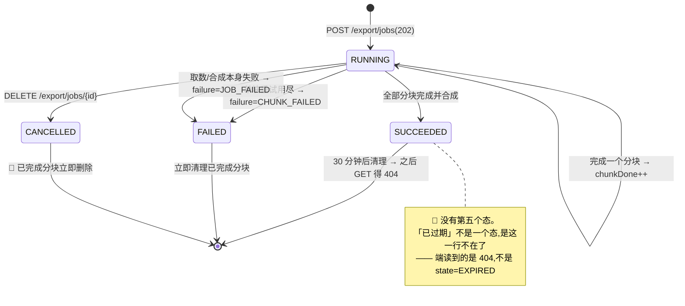
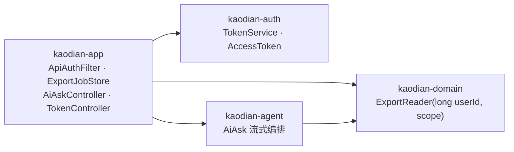

<!-- 受众=后端开发组(实现 M4 的人)+ 前端(照此对接)+ stage 3 总装人 | 深度档位=详设 -->

> **基线:`origin/v1` @ `81a2c23`,fetch 于 2026-09-03 15:15 CST。** 代码侧取证全部实读该基线,行号即该基线的行号。
>
> **前提取 `B0`(`KUBI-97-后端B0底座` @ `20b69f8`,`docs/technical/backend/B0-平台底座与横切契约.md`),本文不另定。** 存储形态(`B0-1` 写 store 接口不写 DDL)、ID(`B0-2` `long`,JSON 里字符串)、租户列(`B0-3`)、鉴权默认拒绝与只读令牌四道锁的落点(`B0-4`)、响应包络与 `ErrorCode` 枚举(`B0-5`)、分页与幂等三种键(`B0-6`)—— 六条直接引用,冲突处在 §十二 逐条登记。
>
> **本轮代码 0 行。** 下面出现的所有类名、签名、配置键都是**待实现的目标形态**;现状一律另起一行标「现状」并给出文件与行号。
>
> 与既有文档的关系:`接口契约-签名与错误码全集` §六 是**本模块的总契约**(端点面,已冻结),`导出与问AI` §6.1–§6.3 是**导出字段的真源**(产品面),`M4/INDEX.md` 与 `U4.1`–`U4.7` 是行为口径。本文补的是三者之间那一层:**契约要落地时,这七个端点各自怎么落。** 要合进 `接口契约` 的原文写进 §十三 `§契约增量`,**本轮一个字都不改那份文件。**

## 一、十条结论速查

**每一条都配一条可跑判据。判据跑不了的结论不算结论。**

| # | 题目 | 结论(一句话) | 判据 |
|---|---|---|---|
| `M4-1` | 免费复制 | **这里不该有的端点有六个,逐个点名写下来**(§三 五个 + §7.3 一个)。写下来它就不再是缺口 | 端点全集测试:M4 面下的 `(method, path)` 恰好十行,六个点名的一个都不在 |
| `M4-2` | 小数据量导出 | `GET /export` 补 `scope` / `scopeId` 两个参数 —— 产品的四步第一步就是选范围,而契约那一行只有 `format` | `grep -n 'scope' ExportController.java` 期望 ≥1(今天是 0) |
| `M4-3` | 导出作业 | 状态机四态(契约冻结,**不许加第五个**);单用户并发上限 **1**;结果文件落服务端临时目录,**30 分钟**后清理;过期后 `404 EXPORT_JOB_NOT_FOUND` | 起两个作业,第二个必须 `409 IN_PROGRESS`;`chunkTotal` == 导出文件考点表行数 |
| `M4-4` | 导出字段 | 字段集合以 `导出与问AI` §6.1–§6.3 三张表为**唯一真源**,代码跟着。今天多出**五列一整块**(§12.1) | 字段集合同源测试,形态照抄 `scripts/boundary-copy-check.py`:文档是真源,不一致就红 |
| `M4-5` | `kaodian-export/1` | **不升 `/2`**(照 §6.4 已冻结的裁定,不重开)。同时给出 `/1` 与 `/2` 真的并存那天的读写规则(§七) | 旧文件读得开:`if account_mode == "local"` 恒走 `else`,结论仍然对 |
| `M4-6` | AI 代发 | 六档错误 = 两档 HTTP + 四档 `done.reason`;`meta` 先于首个 `delta`;`done` 必发(三条路径都要走到) | 上游第一帧就抛异常的测试,断言流里仍有 `done` |
| `M4-7` | 扣减 | 充要条件是 `done{reason:"ok"}` 写出去了。🔴 **契约里「回滚」两个字在流式下没有对象** —— 回答已经发出去了,受影响 0 行时不撤回、不追扣,余额停在 0(§8.5) | 并发扣减测试:余额 `>= 0`,且 `settled=false` 的流水条数 == 超发次数 |
| `M4-8` | `userId` | 🔴 `app` 从鉴权上下文取出,作为 `AgentRequest` 的入参传给 `agent`。**`agent` 里没有一个能读出「当前用户」的入口** | `grep -rn 'CurrentUser\|SecurityContext\|Principal\|getSession' server/kaodian-agent/src/main/java` 期望 0 |
| `M4-9` | 只读令牌 | 立即硬失效(§1.9 排除 JWT,不许回头);`/tokens/**` 一律 `full`;黑名单前缀补第五条 `/export/jobs/**` | `grep -rn 'jwt\|jsonwebtoken' server/*/pom.xml server/*/src/main/java` 期望 0 |
| `M4-10` | 全部吊销 | 两档:`200 {revokedCount}` / `500 REVOKE_ALL_FAILED`,**全成或全不成**,靠一次原子落盘。永不吊销当前 `full` 令牌 | 吊销后当前令牌仍可调 `GET /account`;中途断电后重启,要么全吊销要么一条没吊 |

🔴 **十条里没有一条是「待定」。** 需要人拍板的三处写在 §十四,都指了名、指了时点,且**都不拦开发开工**。

---

## 二、端点全集:十行,一行都不多

**M4 的面就是这十行 `(method, path)`,去重后是九个资源路径。** 鉴权档取自 `接口契约` §3.1,幂等键取自 §1.5,分页取自 §1.4。

| # | Method | Path | 鉴权 | 幂等 | 分页 | 落点模块 |
|---|---|---|---|---|---|---|
| 1 | GET | `/api/v1/export` | `full` 或 `readonly` | — | 🔴 **禁止分页** | `domain` + `app` |
| 2 | POST | `/api/v1/export/jobs` | `full` | `Idempotency-Key` | — | `domain` + `app` |
| 3 | GET | `/api/v1/export/jobs/{jobId}` | `full` | — | — | `app` |
| 4 | DELETE | `/api/v1/export/jobs/{jobId}` | `full` | — | — | `app` |
| 5 | GET | `/api/v1/export/jobs/{jobId}/file` | `full` | — | 🔴 **禁止分页** | `app` |
| 6 | POST | `/api/v1/ai/ask` | `full` | `Idempotency-Key` | — | `agent` + `app` |
| 7 | POST | `/api/v1/tokens/readonly` | `full` | — | — | `auth` + `app` |
| 8 | GET | `/api/v1/tokens/readonly` | `full` | — | 🔴 **不分页,返回全集** | `auth` + `app` |
| 9 | DELETE | `/api/v1/tokens/readonly/{tokenId}` | `full` | 🔴 **端点自身幂等** | — | `auth` + `app` |
| 10 | POST | `/api/v1/tokens/revoke-all` | `full` | `Idempotency-Key` | — | `auth` + `app` |

⚠️ **2026-09-03 更正(KUBI-89 审核轮):第 8 / 9 行的路径上一版写的是 `/tokens` 与 `/tokens/{tokenId}`。**
`INDEX.md` §四 冲突 3 已裁定:`GET /tokens` 判给 `M5`(登录设备列表,契约 §7.4),**只读令牌面改挂 `/tokens/readonly`**;`接口契约` §6.7 已按此冻结。
🔴 **行数仍是十行,那条端点全集测试的判据一个字不改。**

🔴 **判据数的是 `(method, path)` 这十行,不是九个路径。** 同一个路径上多挂一个方法,就是多一个面 —— `/tokens/{tokenId}` 上如果哪天多出一个 `PUT`,按路径数是数不出来的。

**第 5 行是本文新增的**(契约 §6.3 只列了 2/3/4 三行,但它的响应里有 `downloadUrl`,那个 URL 得指向某处)。落法见 §5.5,原文写进 §13.3。

### 2.1 三条横切规则,本模块的落法

| 规则 | 出处 | 在 M4 的落法 |
|---|---|---|
| 前缀 `/api/v1` | §1.1 | ⚠️ **现状全部挂在 `/api/**`**(`ExportController.java:97` 是 `/api/export`)。迁移时点由项目经理排(`B0` §16.1 第 2 条),**M4 不自行迁**。本文一律按 `/api/v1` 写,与 `B0` 白名单常量同一处落差 |
| 标识 `int64`,JSON 里字符串 | §1.1 / `B0-2` | `jobId` / `tokenId` / `nodeId` 全部 `long`,响应里是 `"9021"` 不是 `9021` |
| 空值:没有就不出现这个 key | §1.1 | `downloadUrl` 只在 `state=SUCCEEDED` 时出现;`failure` 只在 `state=FAILED` 时出现;`lastUsedAt` 从没用过时**整个 key 不出现**,不是 `null` |

### 2.2 幂等:M4 占八处中的两处,而 `B0` 那张表当时只写了三处

**`B0` §7.3 列的三处是下单、`POST /ai/ask`、注销。实读 `接口契约`,M4 这边还有两处它没数进去:**

| 端点 | 契约原文 | 为什么它要带 |
|---|---|---|
| `POST /export/jobs` | §6.3「`Idempotency-Key` 必带。同键重发 → 返回同一个 `jobId`,不新建任务」 | 不是外部账单,是**不可逆占用服务端资源** —— 一次重发多一份含全部数据的临时文件 |
| `POST /tokens/revoke-all` | §6.6 签名里逐字写着 `Idempotency-Key: <uuid>` | 命中 `B0` 自己那条「不可逆改变账号状态」——吊销是不可逆的 |

🔴 **裁定:以端点级契约(§6.3 / §6.6)为准,`B0` §7.3 那句「三处」数漏了。** 理由不是谁大谁小,是**那两行签名里逐字写着这个头**,而横切归纳是后写的。

⚠️ **2026-09-03 更正(KUBI-89 审核轮):本文上一版把它更正为「五处」,那也是数漏的 —— 五处只加上了 M4 自己的两处。**
四份模块设计各数出一个数(`B0` 三行 / `M2` 四行 / `M4` 五行 / `M7` 五行),KUBI-96 stage 3 已按同一条判据取**并集八行**并落进 `接口契约` §3.3。
🔴 **本文不再自己数这个数** —— **`接口契约` §3.3 是唯一真源**,M4 只认领其中第 6 行 `POST /export/jobs` 与第 7 行 `POST /tokens/revoke-all` 的保留期。更正原文见 §13.1。

**三个保留期(`B0` §7.3 明确「由各模块定」):**

| 端点 | 保留期 | 为什么是它 |
|---|---|---|
| `POST /export/jobs` | **30 分钟**,与作业本身同寿 | 键活得比作业久没有意义:作业都清了,重放拿回一个指向空文件的 `jobId` 比报错更糟 |
| `POST /ai/ask` | **24 小时** | 端的重试窗口是网络抖动级别的。再长就会把「用户真的想再问一次同样的问题」静默吞掉 —— 那正是 §1.5 拒绝参数哈希的同一条理由 |
| `POST /tokens/revoke-all` | **24 小时** | 同上。这个动作的重发场景只有一个:用户点了没反应又点一次 |

**`DELETE /tokens/{tokenId}` 不带 `Idempotency-Key`,它自身就是幂等的**(§9.6):已吊销、已过期、根本不存在,三种都返回 `200`。理由是 `U4.7` 的界面语义 —— 吊销走的是乐观更新,而「你要吊销的那个已经不在了」在用户那里就是成功。**给它一个 `404` 只会让乐观更新回滚一次,然后用户再点一次,再成功。**

### 2.3 分页:M4 有三个「不分页」,每个理由不同

| 端点 | 处置 | 理由 |
|---|---|---|
| `GET /export` | 🔴 **禁止分页** | 「无删减、不限条数」(`U4.2` §2.2)。一个 `nextCursor` 就等于「这次只给你一部分」—— 承诺当场失效 |
| `GET /export/jobs/{id}/file` | 🔴 **禁止分页** | 同上。分段下载是**端侧**的降级路径(`E-3`,未实测),不是服务端的分页 |
| `GET /tokens` | **不分页,返回裸数组** | 令牌数有硬上限 10(§9.5)。给一个最多十行的列表加游标,是白开一个 `cursor` 面 —— `B0` §7.1 定的是「分页只有游标一种」,不是「所有列表都必须分页」 |

**判据:`grep -rn 'cursor\|limit\|nextCursor' ` 在 M4 三个 DTO 上零命中。** M4 全模块不出现 `Page<T>`。

---

## 三、`M4-1` 免费复制:这里不该有的端点,逐个点名

**议题要的是「把『这里不该有端点』逐条写下来」。** `接口契约` §6.1 已经写下了那一行总的;本节做的是把它拆成**可以被测出来的五条**。

> 🔴 **组装「问 AI 的文本」全部在端上完成。契约里没有、也不许有任何接收或返回这段文本的端点。**(§6.1 原文)

### 3.1 五个不存在的端点,各自不存在的理由

| # | 不存在的端点 | 它长什么样(如果有人加了) | 加了它会破掉什么 |
|---|---|---|---|
| 1 | **接收模板文本的端点** | `POST /ai/template` `{ text }` | 免费路径从零网络请求变成有网络请求,**「它没有开关」的前提当场消失**(`U4.4`)。它没有开关,是因为它没有端点 |
| 2 | **返回模板文本的端点** | `GET /ai/template?scope=` | 同上,而且更糟:文本改由服务端拼,**内容边界就要核两遍** —— 端一遍服务端一遍,而核两遍的东西迟早只核一遍(`U4.5` §一) |
| 3 | **下发分档阈值的端点** | `GET /config/thresholds` | §6.2 已裁定端上写死。一旦阈值要从服务端拿,§6.1 那一行契约当场失效。🔴 **发一次版的代价可以承受,把一条零依赖路径变成有依赖是不可逆的** |
| 4 | **接收预览框改动的端点** | `PUT /ai/draft` | 用户改过的那一版是**他自己写的文字**(`U4.5` §2.5)。收下来就等于产品读了它、存了它 —— 而产品对「用户在自己设备上写了什么」不读、不存、不分析、不上传 |
| 5 | **「复制了一次」的埋点端点** | `POST /events/copied` | `M4/INDEX.md` §三:导出次数、复制次数、代发次数**都不是关卡指标,也都不埋点**。埋了它,下一步就是想办法把它做高,而做高它不会让任何一个人多看一次自己的盲区 |

### 3.2 这条路径实际用到的两个端点,以及它们要给出的一档区分

**免费复制的全部输入是两个已有的只读端点**(§6.1),M4 不新增取数面:

```
GET /api/v1/syllabus/nodes/{nodeId}      → 考点详情。🔴 没有 extractedText,也没有讲解字段
GET /api/v1/coverage/blindspots?...      → 盲区清单
```

**`U4.1` §三 要求「骨架为空要能被区分出来,不能与请求失败共用一个错误」。落法(§6.1 已写,本文只补落点):**

| 档 | HTTP | `code` | 落在哪 |
|---|---|---|---|
| 缺骨架 | `422` | `SYLLABUS_EMPTY` | 两个取数端点各一处 |
| 请求失败 | `500` / `502` / `504` | `SERVER_ERROR` / (端侧 `NETWORK_TIMEOUT`) | `ApiExceptionHandler` 兜底 |

⚠️ `NETWORK_TIMEOUT` 是**端自己产生的值,服务端永远不返回它**(§10.2)。写在这里是因为「四档区分」这句话必然被问到落点。

### 3.3 判据:端点全集测试

**「不该有端点」这句话,只有做成一条会红的断言才算写下来了。** 形态复用 `B0` §5.5 判据 ① 已经建起来的 `handlerMapping` 枚举:

```java
// kaodian-app · 红线测试。与 B0 的白名单测试共用同一个 handlerMapping 注入。
@Test void M4面下的端点全集恰好十行() {
    var actual = handlerMapping.getHandlerMethods().keySet().stream()
            .flatMap(M4EndpointTest::methodAndPathsOf)
            .filter(mp -> mp.path().startsWith("/api/v1/export")
                       || mp.path().startsWith("/api/v1/ai")
                       || mp.path().startsWith("/api/v1/tokens"))
            .collect(toSet());
    assertThat(actual).containsExactlyInAnyOrderElementsOf(M4_ENDPOINTS);   // §二 那张表,十行
}
```

🔴 **这条断言的价值不在「少了会红」,在「多了会红」。** 上面五个不该有的端点,任何一个被加出来,这一条立刻变红 —— 而**加它的人不需要读过本节**。

---

## 四、`M4-2` 小数据量导出:`GET /export`

### 4.1 签名

```
GET /api/v1/export?format=md|csv|json&scope=all|subject|node&scopeId=10231
     鉴权:full 或 readonly(§3.1;它是 MCP 五个 tool 之一 export 的落点)
     幂等:—      分页:🔴 禁止
→ 200  Content-Type 随 format;Content-Disposition: attachment; filename="..."
→ 400  UNKNOWN_EXPORT_FORMAT / VALIDATION_FAILED
→ 404  NODE_NOT_FOUND
→ 422  SYLLABUS_EMPTY
```

| 参数 | 类型 | 必填 | 取值域 | 说明 |
|---|---|---|---|---|
| `format` | `string` | ✅ | `md` / `csv` / `json` | 🔴 **没有默认值。** 挑一个当默认等于替用户决定哪种才是「正经的」导出,另外两种会慢慢变成没人跑的分支(`ExportFormat` 类注释,照抄不改) |
| `scope` | `string` | ✅ | `all` / `subject` / `node` | 🆕 **本文新增。** 产品四步的第一步就是选范围(`U4.2` §2.3),而 §6.5 那一行只有 `format` |
| `scopeId` | `string`(int64) | `scope != all` 时必填 | 科目 code / 考点 `nodeId` | `scope=all` 时**整个 key 不出现**,不是空串 |

**响应形态:三种格式装的是同一份数据**(§6.5)。`json` 直接是 §六 那三块;`md` / `csv` 由同一份数据渲染,**列表与行不许各自硬编码**(现状 `ExportRenderer` 已经是这个形态,保留)。

### 4.2 三条承诺各自落在哪(现状已成立的照抄,不重造)

| 承诺 | 落点 | 状态 |
|---|---|---|
| **无删减** | 取数没有 `limit`、没有 `cursor`、没有过滤 | ✅ 现状成立(`ExportResponse.of` 直接吃 `touches`) |
| **无水印** | 渲染层一个产品名都没有,文件名里也没有 | ✅ 现状成立 |
| **不限次数** | 🔴 这个端点**没有任何依赖**与频控或额度有关 | ✅ 现状成立(`ExportController` 构造器里只有 `CoverageReader`) |
| **不因付费而少给** | 响应里不接受、也不返回任何额度字段 | 判据:`grep -n 'quota\|remaining\|plan' ExportController.java ExportResponse.java` 期望 0 |

🔴 **「不限次数」这一条要点破一次:它的判据是「数不到」,不是「写了没有」。** `U4.1` §6.1 ※2 用的就是这个判法 —— 这一区里没有一个额度槽位、没有一处锁形、没有一句额度提示。落到服务端就是:**这个类的构造器参数表里不许出现 `QuotaService`**。一旦它被注入进来,「不限次数」就变成一件靠人记住的事。

### 4.3 🔴 但它今天既不鉴权,也不按用户过滤 —— 两条红线同时在这一处

**实读基线:**

- `ExportController.java:97-99`:`export(@RequestParam String format)` —— **没有 `CurrentSession` 参数**,`B0` §5.1 已点破这意味着什么(鉴权靠参数解析器,只对声明了 `CurrentSession` 的方法生效)
- `reader.read()` 读的是**整个进程那一份** `touches.json`,没有 `userId` 这个概念(`B0` §4.1:`Touch` 里 `userId` 不是可空,是不存在)

**所以 `GET /api/export` 今天的真实语义是:任何人不带令牌,可以把这台机器上所有人的记录整份导走。**

| 红线 | 怎么破的 |
|---|---|
| 1 · 不登录不能记 | 采集面必须带 `userId` —— 出口面不带,等于从另一头把这条线拆了 |
| `B0-4` · 鉴权默认拒绝 | 它正是「忘了加就裸奔」的第二个现场(第一个是 `/api/records/**`,§九 待办 1) |

**落法与顺序,照 `B0` §5.4 那条不能倒的顺序:**

```
① ApiAuthFilter 上线(B0-4)          → 这个端点默认打不通
② Touch/RecordTag/UserAssertion 加 userId(B0-3)
③ CoverageReader.read(long userId)   → domain 方法签名加参数,🔴 不注入「当前用户」
④ ExportController 声明 CurrentSession,把 userId 显式传进去
```

🔴 **③④ 不许对调。** 先加鉴权后加租户列,会造出 `CurrentSessionResolver` 注释里那个「看起来分了用户其实没分」的假象 —— 接口全部 `200`、日志一条没有。

**判据:**

```bash
# ① 出口面带上了鉴权
grep -n 'CurrentSession' server/kaodian-app/src/main/java/com/kaodian/server/api/insight/ExportController.java   # 期望 1
# ② domain 拿的是参数,不是上下文
grep -rn 'CurrentUser\|SecurityContext\|Principal' server/kaodian-domain/src/main/java                            # 期望 0
# ③ 真判据:两个用户各记一条,A 的令牌导出,文件里不出现 B 的那一条
```

---

## 五、`M4-3` 大数据量导出:发起 + 轮询

**契约 §6.3 定死了签名与四个字段,本节补它没写的四件事:作业状态机、单用户并发上限、结果文件存哪、多久删。**

### 5.1 三个端点的签名(§6.3 冻结,逐字照抄 + 补类型)

```
POST /api/v1/export/jobs
Idempotency-Key: <uuid>
{ "format": "md" | "csv" | "json", "scope": "all" | "subject" | "node", "scopeId": "10231" }
→ 202 { "jobId": "9021", "chunkTotal": 37 }

GET /api/v1/export/jobs/{jobId}
→ 200 { "state": "RUNNING",   "chunkDone": 12, "chunkTotal": 37 }
→ 200 { "state": "SUCCEEDED", "chunkDone": 37, "chunkTotal": 37,
        "downloadUrl": "/api/v1/export/jobs/9021/file", "expiresAt": "2026-09-03T15:45:00+08:00" }
→ 200 { "state": "FAILED",    "chunkDone": 12, "chunkTotal": 37, "failure": "CHUNK_FAILED" }
→ 404 { "code": "EXPORT_JOB_NOT_FOUND" }

DELETE /api/v1/export/jobs/{jobId}
→ 200 { "state": "CANCELLED", "chunkDone": 12, "chunkTotal": 37 }
```

| 字段 | JSON 类型 | Java 类型 | 必填 | 说明 |
|---|---|---|---|---|
| `jobId` | `string` | `long` | ✅ | `B0-2`:int64,JSON 里字符串 |
| `state` | `string` | `enum ExportJobState` | ✅ | `RUNNING` / `SUCCEEDED` / `FAILED` / `CANCELLED`。🔴 **四个值,不许加第五个** —— 见 §5.4 |
| `chunkDone` / `chunkTotal` | `number` | `int` | ✅ | 🔴 两个整数,不是百分比、不是进度条。分块单位是**考点节点**,不是字节 |
| `failure` | `string` | `enum ExportFailure` | `state=FAILED` 时 | `CHUNK_FAILED`(这一块失败,服务端已自动重试有限次)/ `JOB_FAILED`(整个任务失败)。**少这一档界面只能说「没成」** |
| `downloadUrl` | `string` | `String` | `state=SUCCEEDED` 时 | 🆕 站内相对路径,见 §5.5 |
| `expiresAt` | `string` | `Instant` | `state=SUCCEEDED` 时 | 🆕 ISO-8601 带时区。端靠它决定「再存一次」还来不来得及 |

**其余三态整个 key 不出现 `downloadUrl` / `expiresAt` / `failure`** —— §1.1 空值规则,不是返回 `null`。

### 5.2 作业状态机



🔴 **为什么「已过期」不做成第五个状态值:** 契约 §6.3 把 `state` 的取值域写死成四个,端按这四个分支。加一个 `EXPIRED` 等于让每个端补一个分支,而那个分支要说的话(「这份文件已经过期了,重新导一次」)与「这个作业根本不存在」**下一步完全相同**。`B0-5` 的 `code` 窄度判据反过来也成立:**两个值让端做同一件事,就该是同一个值。**

**⚠️ 与 `U4.2` §2.4 那张产品状态机的对应关系,不是一一对应,写清楚免得下一个人去对齐:**

| 产品态(`导出与问AI` §4.2) | 服务端态 | 差在哪 |
|---|---|---|
| 空闲 / 生成中 / 已生成 / 失败 / 已取消 | 无 / `RUNNING` / `SUCCEEDED` / `FAILED` / `CANCELLED` | 一一对应 |
| **已保存 / 已分享 / 已下载 / 未落地** | **服务端没有** | 🔴 落地全在端上(`U4.2` §三)。服务端知道文件生成好了,**不知道用户点没点保存** —— 想知道就得加一个「我存好了」的端点,那是第六个不该有的端点 |

**「未落地 → 再存一次」这条产品转移,服务端侧就是 `expiresAt` 之前 `GET .../file` 还打得通。** 这是 §5.4 那 30 分钟存在的全部理由。

### 5.3 单用户并发上限:1

| 项 | 值 |
|---|---|
| 上限 | **同一 `userId` 同时只允许一个 `state=RUNNING` 的作业** |
| 超出时 | `409 IN_PROGRESS`(`B0-5` 枚举里已有这个码,不新增) |
| 换了范围/格式呢 | 一样拒。**要换先 `DELETE` 掉当前那个** |

**为什么是 1 而不是 3 或 5:** 第二个并发作业读的是同一份快照、导的是同一批数据,它唯一多产生的东西是**第二份含全部数据的临时文件**。而 `U4.2` §2.5 已经写死「不做后台继续导出、完了通知你」—— 用户在前台盯着一个进度,他没有第二个进度可看。**一个用户看不到的并发,只会在磁盘上留下他不知道存在的文件。**

⚠️ **这条与幂等不是同一件事,别合并:** 同键重发 → 返回同一个 `jobId`(§6.3);**不同键**的第二次发起 → `409 IN_PROGRESS`。前者是「你重试了」,后者是「你想同时导两份」。

### 5.4 结果文件存哪、多久删

| 项 | 值 | 理由 |
|---|---|---|
| 落点 | `${kaodian.export.jobs.root}/{userId}/{jobId}.{md\|zip\|json}`,默认 `~/.kaodian/export-jobs` | 与 `auth-keys.properties` / `touches.json` 同一形态(`B0-1`:文件态,换 JDBC 那天形状不变)。🔴 **按 `userId` 分目录不是为了好看,是让「导出串了用户」在文件系统上就不可能** |
| 作业元数据 | `export-jobs.json`,一条一行:`jobId` / `userId` / `format` / `scope` / `scopeId` / `state` / `chunkDone` / `chunkTotal` / `failure` / `createdAt` / `expiresAt` / `idempotencyKey` | `B0-1`:写 store 接口不写 DDL。接口见 §5.6 |
| 保留期 | **30 分钟**(`kaodian.export.jobs.ttl`,可配) | `E-10` 产品侧给的占位就是 30 分钟,技术侧确认它:**太短,用户取消保存面板后回来「再存一次」就失效;太长,一份含全部数据的文件在临时目录里躺着**。30 分钟够走完一次「保存面板 → 选错目录 → 重来」 |
| 清理时机 | ① 启动期扫一次 ② 每 5 分钟一次定时 ③ `DELETE` 与 `FAILED` **立即删** | 🔴 只删文件与作业行,**不动任何用户数据** —— 出口层的任何一次失败都不该动用户的数据(`M4/INDEX.md` §一) |
| 清理之后 | 作业行也删掉,`GET` 得 `404 EXPORT_JOB_NOT_FOUND` | 留一行 `state=EXPIRED` 的墓碑,就等于把 §5.2 拒绝掉的第五个态从后门放回来 |
| 磁盘满 | `500 SERVER_ERROR`,作业置 `FAILED / JOB_FAILED`,**已完成分块立即删** | 🔴 不交付半份文件 |

**判据:**

```bash
# ① 30 分钟这个数只有一处,是配置项不是字面量
grep -rn 'ofMinutes(30)\|1800' server/kaodian-app/src/main/java/com/kaodian/server/api/insight/   # 期望 0(应当读配置)
grep -n 'export.jobs.ttl' server/kaodian-app/src/main/resources/application.properties            # 期望 1
# ② 清理只删导出产物,碰不到别的
grep -rn 'delete\|deleteIfExists' server/kaodian-app/src/main/java/.../ExportJobCleaner.java      # 路径必须全部落在 jobs.root 之下
# ③ 真判据:作业 SUCCEEDED 后把时钟推 31 分钟 → GET 得 404,且 jobs.root 下没有残留文件
```

### 5.5 🔴 `downloadUrl` 必须仍然走 Bearer,不许是一个签名 URL

**契约 §6.3 写了 `"downloadUrl": "..."`,没写它长什么样。这一格如果按最省事的做法落,会开出一个绕过全部四道锁的口子。**

| 做法 | 后果 |
|---|---|
| ❌ 带签名的临时外链(`?sig=...&exp=...`) | 那个 URL **不带令牌也能打开**,而它指向一份含全部数据的文件。它可以被贴进聊天、进浏览器历史、进访问日志 —— 四道锁全在 `app` 的过滤器上,而这条路根本不经过过滤器 |
| ❌ 落到对象存储 / CDN | 同上,而且数据出了本机。⚠️ 与 `I-5` 对原图的处置同构:**不上云** |
| ✅ **站内相对路径 `/api/v1/export/jobs/{jobId}/file`,照常 `Authorization: Bearer`** | 它就是第 5 行端点。端拿到的是一个要自己带令牌去取的路径,不是一把钥匙 |

| 约束 | 落法 |
|---|---|
| 鉴权 | `full`。🔴 **`readonly` 一律 `403`** —— 见 §5.7 |
| 归属校验 | `jobId` 不属于当前 `userId` → `404 EXPORT_JOB_NOT_FOUND`,**不是 `403`** |
| 为什么是 404 不是 403 | `403` 等于告诉调用者「这个 jobId 是真的,只是不是你的」。与 `B0` §5.3 拒绝把「已吊销」单独成档是同一条推理:**不送信息** |
| 响应 | `Content-Disposition: attachment`;`Content-Type` 随 `format`(`csv` 是 `application/zip`) |
| 可重复取吗 | ✅ 可以,直到 `expiresAt`。「再存一次」就是再取一次 |

### 5.6 store 接口(`B0-1`:给签名,不给 DDL)

```java
// kaodian-domain · 导出内容取数(🔴 userId 是参数,不是上下文)
interface ExportReader {
    ExportSnapshot read(long userId, ExportScope scope);       // scope 是 (kind, scopeId) 的值对象
    int countChunks(long userId, ExportScope scope);           // == 范围内考点节点数,含归档节点
}

// kaodian-app · 作业本身不进领域层:它是一次搬运的账本,不是那条公式的一部分
interface ExportJobStore {
    ExportJob create(long userId, ExportJobSpec spec, String idempotencyKey);
    Optional<ExportJob> find(long userId, long jobId);         // 🔴 两个参数,归属校验在 store 层就成立
    Optional<ExportJob> findRunning(long userId);              // 并发上限 1 的判据来源
    Optional<ExportJob> findByIdempotencyKey(long userId, String key);
    void update(ExportJob job);                                // chunkDone / state / failure
    int purgeExpired(Instant now);                             // 返回清了几个,进日志
}
```

| 哪几次写必须原子 | 说明 |
|---|---|
| 创建作业 + 记幂等键 | 分两次写会出现「作业建了但键没记上」—— 下一次重发就多建一个作业。与 `B0` §3.3 发号那一条同构 |
| 置 `SUCCEEDED` + 写入结果文件 | 先置态后落文件,中间挂掉就是一个指向空文件的 `SUCCEEDED`。**顺序:先落文件(临时名)→ 改名 → 再置态** |

🔴 **`ExportJobStore` 落在 `app` 不落在 `domain`。** 理由:作业是一次搬运的账本,它记的是「谁在什么时候要过一份文件」,不是 `盲区 = 骨架层 − 行为层` 的任何一部分。放进 `domain` 会让领域层多背一个与那条公式无关的生命周期。⚠️ **契约 §11.1 把这三个端点整体标成 `domain` + `app`,那说的是导出内容的取数(`ExportReader`)** —— 本文把两半分开,取数在 `domain`,作业在 `app`,依赖方向不变。

### 5.7 只读令牌与导出作业:`/export/jobs/**` 一律 `full`,不论方法

**`readonly` 打得通 `GET /export`(它是 MCP 五个 tool 之一),打不通 `/export/jobs/**` 的任何一个方法 —— 包括那两个 `GET`。**

| 端点 | `readonly` | 靠哪道锁 |
|---|---|---|
| `GET /export` | ✅ 允许 | tool 白名单里的 `export` |
| `POST` / `DELETE /export/jobs/**` | `403 READONLY_TOKEN` | 锁 2(非 GET 直接拒) |
| `GET /export/jobs/{id}` · `GET .../file` | `403 READONLY_TOKEN` | 🔴 **锁 4,路径前缀黑名单补第五条** |

**为什么两个 GET 也要拒,而不是让它们自然穿过锁 2:**

只读令牌**发不起作业**(`POST` 被锁 2 拒了),所以它永远查不到属于自己的作业。给它两个只会返回 `404` 的 GET,是多开两个面换零个能力 —— 而「多一个没人知道的注入点,能力边界就少一道防线」。**锁 4 存在的理由本来就是「订单查询与额度查询都是读方法,它们会原样穿过锁 2」,这里是同一形状的第三例。**

**判据(`B0` §5.5 判据 ① 的同一个测试里加一组):**

```java
@Test void 只读令牌命中黑名单前缀一律403不论方法() {
    for (String prefix : List.of("/api/v1/billing", "/api/v1/quota", "/api/v1/agent",
                                 "/api/v1/tokens", "/api/v1/export/jobs")) {   // 🔴 五条,第五条是本文补的
        for (HttpMethod m : List.of(GET, POST, DELETE)) {
            assertThat(mvc.perform(request(m, prefix + "/x").header(AUTH, readonlyToken)))
                .hasStatus(403).hasCode("READONLY_TOKEN");
        }
    }
}
```

---

## 六、`M4-4` 导出字段清单:逐字段类型

**真源是 `导出与问AI` §6.1–§6.3 三张表,本节做两件事:补每一格的类型,以及说清代码今天与它差在哪(§12.1)。**

🔴 **三种格式的字段集合完全一致,只是包装不同。** `md` / `csv` / `json` 的差异只在编码、换行、空值写法(§6.5,已冻结,本文不重述)。

### 6.1 命名与类型的两条总规则

| 规则 | 落法 | 为什么 |
|---|---|---|
| **文件里的字段名是 `snake_case`** | `node_id` / `touch_count` / `exported_at` | 真源 §6.12 的样例就是这个形状,而它是 `kaodian-export/1` 这个 schema 的一部分。改成 `camelCase` 就是**改字段名**,命中 §6.13 的升版本条件 |
| **文件里的 id 是数字,不是字符串** | `"node_id": 10241` | ⚠️ 这与 §1.1「标识一律 int64,JSON 里以字符串传输」**方向相反**,而它是对的:§1.1 管的是 API 响应,导出文件是**产物**,它的 schema 由 `kaodian-export/1` 定死。改成字符串命中「改类型」,那才是必须升 `/2` 的一次改动 —— 见 §7.2 |

### 6.2 元信息块 · 13 个字段

| 字段 | JSON 类型 | Java 类型 | 可空 | 值域 / 上界 |
|---|---|---|---|---|
| `schema` | `string` | `String` 常量 | 否 | 🔴 恒为 `"kaodian-export/1"`(§七) |
| `exported_at` | `string` | `Instant` | 否 | ISO-8601 带时区。🔴 相对时间不进文件 |
| `scope` | `string` | `enum ExportScopeKind` | 否 | `all` / `subject` / `node` |
| `scope_name` | `string` | `String` | `scope=all` 时**整个 key 不出现** | 🔴 来自骨架闭集,取值只能是树上已有的名字 |
| `syllabus_version` | `string` | `String` | 否 | 版本串,形如 `2026.08` |
| `account_mode` | `string` | `String` 常量 | 否 | 🔴 **冻结为常量 `"cloud"`**,取值域只有这一个值(§6.4)。**不删它** |
| `node_total` / `node_touched` / `node_untouched` | `number` | `int` | 否 | ≥ 0。恒等式:`touched + untouched == total` |
| `node_archived` | `number` | `int` | 否 | ≥ 0。🔴 **必须等于考点表里 `archived=true` 的行数**(`A-22`) |
| `node_asserted` | `number` | `int` | 否 | ≥ 0。必须等于 `asserted=true` 的行数 |
| `record_total` | `number` | `int` | 否 | ≥ 0。必须等于记录表行数 |
| `notice` | `string` | `String` 常量 | 否 | 🔴 逐字常量,三种格式一致。原文在 §6.1,**本文一个字不抄**(抄进来就是第二处说法) |

### 6.3 考点表 `nodes` · 16 个字段,一行一个考点

| 字段 | JSON 类型 | Java 类型 | 可空 | 值域 / 上界 |
|---|---|---|---|---|
| `node_id` | `number` | `long` | 否 | 整数主键 |
| `node_name` | `string` | `String` | 否 | 🔴 **闭集**:只能是树上已有的节点名。上界 **64 字**(§6.6) |
| `node_path` | `array<string>` | `List<String>` | 否 | 最多三层(`level` CHECK ≤ 3),每格同 `node_name`。`md`/`csv` 里拼成 `法律 / 行政法 / …` |
| `subject` | `string` | `String` | 否 | 枚举式短串 |
| `level` | `number` | `int` | 否 | `1` / `2` / `3` |
| `recent5y_count` | `number` | `int` | 骨架无统计时缺席 | ≥ 0 |
| `last_seen_year` | `number` | `Integer` | 可空 | 四位年份 |
| `avg_per_paper` | `number` | `Double` | 可空 | 小数 |
| `province_codes` | `array<string>` | `List<String>` | 可空 | 代码串,不是内容 |
| `touch_count` | `number` | `int` | 否 | ≥ 0。**这是「几次」** |
| `last_touch_at` | `string` | `Instant` | 没碰过时缺席 | 时间戳。**这是「多久前」** |
| `source_names` | `array<string>` | `List<String>` | 可空 | 🔴 **本表唯一的自由文本**,每格 `VARCHAR(64)` |
| `asserted` | `boolean` | `boolean` | 否 | 真布尔,不用 `0/1` |
| `asserted_at` | `string` | `Instant` | 未标记时缺席 | 时间戳 |
| `archived` | `boolean` | `boolean` | 否 | 🔴 `I-6` 的落点:归档节点**占与普通节点完全一样的一行** |
| `archived_at` | `string` | `Instant` | 未归档时缺席 | 时间戳 |

🔴 **归档不是第四张表,也不是单独一节。** 单独一节可以被下游读取程序**漏读**,漏读之后覆盖率看起来就是满的。⚠️ 现有实现的 `ExportResponse.archivedNodes` 是顶层数组 —— **那是内部形态,允许保留**,条件是渲染成文件时必须并进 `nodes` 并写上两列(§6.4 已裁定,本文照办)。

### 6.4 记录表 `records` · 10 个字段,一行一条记录

| 字段 | JSON 类型 | Java 类型 | 可空 | 值域 / 上界 |
|---|---|---|---|---|
| `record_id` | `number` | `long` | 否 | 整数主键 |
| `occurred_at` | `string` | `Instant` | 否 | 时间戳 —— 「多久前」的原料 |
| `source_name` | `string` | `String` | 手动记且没填时缺席 | 🔴 `VARCHAR(64)`,只记名字 |
| `capture_type` | `string` | `enum` | 否 | `voice` / `photo` / `text` |
| `node_ids` | `array<number>` | `List<Long>` | 一个都没挂上时缺席 | 整数列表 |
| `node_names` | `array<string>` | `List<String>` | 同上 | 闭集名字 |
| `tag_origin` | `string` | `enum TagOrigin` | 否 | `auto` / `manual`,**写入后不可变** |
| `tag_confirmed_at` | `string` | `Instant` | 未确认时缺席 | 时间戳 |
| `tag_discarded` | `boolean` | `boolean` | 否 | 宁缺毋滥的落地:可见但不计覆盖度 |
| `tag_confidence` | `number` | `BigDecimal(4,3)` | 手动挂载时缺席 | 🔴 **只在文件里,屏上一处都不出现** |

🔴 **这张表里没有 `extracted_text`。** 它是全库唯一一个用户有可能把题干抄进去的字段;它进了导出文件,导出文件就有了一个「题干形状」的列 —— **而这份文件会被用户粘给 AI、发到群里、存到网盘。**

🔴 **也没有任何图片相关的列。** 文件名、尺寸、张数一个都没有。

### 6.5 🔴 服务端侧的执行装置:字段集合同源测试

**`U4.3` §三 写着「服务端不依赖客户端那道自检 —— 它是最后一道,不是唯一一道」。那服务端这一道长什么样?不是运行时再检一遍,是构建期的一条同源断言:**

```python
# scripts/export-fields-check.py —— 形态照抄 scripts/boundary-copy-check.py
# 真源:docs/product/specs/导出与问AI.md §6.1–§6.3 三张表的首列
# 消费者:ExportResponse 及其三个分量的字段名
# 不一致就退出码 1 —— 导出字段有两种说法,以后每次「这一列该不该导」都要先确认按哪一份说
```

| 项 | 落法 |
|---|---|
| 抽取规则 | 只取 §6.1 / §6.2 / §6.3 三节表格首列的反引号内容;表头与分隔行跳过 |
| 比对对象 | **双向**:文档有代码无 → 红;代码有文档无 → 红。🔴 **后者才是这条断言存在的理由** —— 今天红的正是这一侧(§12.1) |
| 接哪个 hook | CI(`.github/workflows/ci.yml`)。⚠️ 不接 `.githooks/pre-commit` 作为防线:`core.hooksPath` 不随 clone 传播(`B0` §8.2 同一条洞) |
| 🔴 不写死总数 | 不在断言里写「39 个字段」。写死总数它就会和表分叉 —— 脚本每次自己数(`B0` §6.3 同一条理由) |

### 6.6 `M4-G2` 闭合:单值长度的上界

**`U4.3` §五 登记的缺口是「来源名称有上界,章节路径没有」。技术侧给这个数:**

| 值 | 上界 | 依据 |
|---|---|---|
| `source_name` / `source_names` 每格 | **64** | 已有真源(§5.1) |
| `node_name` | **64** | 🆕 与 `source_name` 同一个刻度。**不给它一个独立的数** —— 独立的数意味着自检要记两个,而 64 已经是全库那个「装得下名字、装不下题干」的刻度,复用它不需要重新论证一遍 |
| `node_path` 拼接串(`md` / `csv`) | **194** = 3 × 64 + 2 个分隔符 | 由 `level ≤ 3` 直接推出 |

🔴 **194 逼近 `extracted_text` 那个 200 的洞,但它不是一个洞。** 分辨点只有一条:**洞的大小看的是「能不能写进去」,不是「渲染出来有多长」。** `node_path` 没有任何写入路径 —— 它是由三个已经各自受 64 约束的闭集名字**拼出来的**,产品没有任何接口能往这一列写一个字。`extracted_text` 是用户直接写进去的,所以那 200 是洞,这 194 不是。

**判据:** 自检第 2 条按上表三个数跑;`json` 格式下 `node_path` 是数组,**每格独立按 64 检**,不检拼接后的长度。

---

## 七、`M4-5` `kaodian-export/1` 不升版本 —— 以及 `/2` 真的来那天怎么读

### 7.1 议题描述与已冻结的契约在这一格不一致,取契约

| 出处 | 说法 |
|---|---|
| 本议题描述 · 必须回答 2 | 「按文档自己的规矩**该升** `kaodian-export/2`」 |
| `接口契约` §6.4(已合入 `origin/v1` @ `81a2c23`) | 「待办 4 说……**裁定:不升。**」 |

🔴 **取 §6.4。** 理由不是「契约更大」,是**它给的三条判据可以逐条复核,而复核结果支持它**:

| §6.13 的升版本条件 | `account_mode` 从 `{local, cloud}` 收窄到 `{cloud}` 命中了吗 |
|---|---|
| 改字段含义 | ❌ 它仍然回答同一个问题:这份数据属于哪种账号形态 |
| 删字段 | ❌ 字段还在,§6.4 明确**不删** |
| 改类型 | ❌ 仍是枚举串 |

**决定性的一条:一个按 `/1` 写的消费方,代码里若有 `if account_mode == "local"`,在新数据上恒走 `else` 分支 —— 它得到的结论仍然是对的。** §6.13 要求这三种变更升版本的理由写得很清楚:「会让老的消费方读出**错误的结论**」。**这里没有错误结论。**

⚠️ **本文不重开这条裁定,只做一件 §6.4 没做的事:把「那天真的要升」的读写规则写下来。** 议题问的后半句(「两个版本并存时的读写规则,旧文件还读得开吗」)在 §6.4 里没有答案,而它迟早要被问一次。

### 7.2 什么时候才真的要升 `/2` —— 三个具体的触发点

| # | 触发 | 属于三条里的哪一条 |
|---|---|---|
| 1 | **删掉 `account_mode`** | 删字段。§6.4 已经写死:「删它才是删字段,那时候才升 `/2`。保留一个单值常量的成本是 20 个字节;删掉它的成本是每一个消费方都要改」 |
| 2 | **`node_id` / `record_id` 从数字改成字符串** | 改类型。触发条件是 id 逼近 `2^53`(§1.1 那条 JS 精度理由在导出文件的消费方身上同样成立 —— 消费方也可能是一段 JS 脚本) |
| 3 | **`touch_count` 或 `tag_confidence` 的口径变了** | 改含义。例如 `touch_count` 从「碰过几次」改成「有效碰过几次」 |

🔴 **加字段永远不升版本。** 消费方按「未知字段忽略」写(§6.13),而加一列不会让任何人读出错误的结论。

### 7.3 `/1` 与 `/2` 并存那天的读写规则

**服务端一侧:**

| 规则 | 内容 |
|---|---|
| **只写一个版本** | 🔴 服务端**永远只生成当前版本**。没有 `?schema=1` 这样的参数,也不许有 —— 一个可选的旧格式意味着两条渲染路径要一起活着,而 §6.5 那条「三种格式共用一个 record」的理由(半年后没人说得清哪一份才是全的)在这里等价成立 |
| 不做转换端点 | 没有 `/export/convert`。这是**第六个不该有的端点**,并进 §3.1 那张表一起数 |
| 迁移旧文件 | ❌ **不做。** 文件在用户手上,服务端根本够不着它 |

**消费方一侧(这就是「旧文件还读得开吗」的答案):**

| 问 | 答 |
|---|---|
| 用户手上那份 `/1` 的文件,升版本之后还读得开吗 | ✅ **读得开,而且永远读得开。** 它是一个躺在用户硬盘上的文件,没有任何东西会去动它 |
| 那「读得开」到底指什么 | 指**按 `/1` 写的消费方读 `/1` 的文件**,结论仍然对。这句话像同义反复,而它正是版本号存在的意义:🔴 **版本号不是给文件用的,是给读文件的程序用的** |
| 按 `/1` 写的程序去读 `/2` 的文件呢 | ⚠️ **不保证。** 这正是升版本要表达的那句话:「我改了一件会让你读出错误结论的事」。程序**必须先读 `meta.schema` 再决定要不要往下读** |
| 那程序该怎么写 | 🔴 **读到不认识的 `schema` 就停下并说出来,不要尽力而为。** 「尽力解析一个不认识的版本」等于把「读出错误结论」这件事从不可能变成可能 —— 而那正是三条升版本条件想挡的 |
| 服务端要不要同时支持两个版本 | ❌ 不要。见上表第一行 |

**判据(现在跑是空转,留着是为了那天有人跑):**

```bash
# ① 全仓只有一个 schema 常量
grep -rn 'kaodian-export/' server/ web/ scripts/          # 期望全部命中是同一个版本串
# ② 没有为旧版本留的分支
grep -rn 'schemaVersion\|legacyExport\|exportV1' server/  # 期望 0 命中
# ③ 升版本那次提交的判据:diff 里必须同时出现 schema 常量的改动
#    与一条「删字段 / 改类型 / 改含义」的改动。只改常量不改结构 = 白升一版
```

---

## 八、`M4-6` / `M4-7` / `M4-8` AI 代发:`POST /ai/ask`

**这是全库唯一一个流式端点里的第一个**(§1.6:第二个是 `POST /agent/chat`,已存在;**约束已从「不允许有第二个」改为「不允许有第三个」**)。

### 8.1 签名

```
POST /api/v1/ai/ask
Authorization: Bearer at_...          鉴权:full(🔴 readonly 命中锁 2 与锁 4,双重 403)
Idempotency-Key: <uuid>               必带,缺 → 400 IDEMPOTENCY_KEY_REQUIRED
Accept: text/event-stream
{ "text": "<端上组装好的那段文本>", "sessionId": "8812" }
```

| 字段 | JSON 类型 | Java 类型 | 必填 | 上界 | 说明 |
|---|---|---|---|---|---|
| `text` | `string` | `String` | ✅ | **20000 字符**(`kaodian.ai.ask.max-text`) | 🔴 **请求体只有这段文本。服务端不额外附加任何库里的字段** |
| `sessionId` | `string` | `Long`(int64) | 追问时必填 | — | 首轮不传;整个 key 不出现,不是空串 |

**两个长度上界是技术侧取的值(`E-12` 里那两个「长度」),`kaodian.ai.ask.*` 可配:**

| 参数 | 值 | 为什么是它 |
|---|---|---|
| `max-text` | **20000 字符** | 主流模型 32k 上下文的一半以内,留出回答的空间。⚠️ 这是**保守值**,不是实测值 —— 它随接的模型变,所以是配置项不是常量 |
| `max-follow-up` | **2000 字符** | 追问是一句话,不是一份文档。上下文的形状在第一轮就固定了(`U4.6` §2.6),追问只该往上加一句 |

### 8.2 前置失败:三档 HTTP,流还没开始

| 档 | HTTP | `code` | 备注 |
|---|---|---|---|
| 未登录 / 登录过期 / 已注销 | `401` | `UNAUTHORIZED` / `TOKEN_EXPIRED` / `ACCOUNT_DEACTIVATED` | **三档**由 `B0` §5.3 的 `TokenCheck`(四叶,含 `Revoked(long userId)`)给出,M4 只消费。⚠️ **2026-09-03 更正(KUBI-89 审核轮):本行上一版写「两档」** |
| 额度耗尽 | `403` | `QUOTA_EXHAUSTED` | 🔴 响应体**必须带手动记录入口提示**(§10.7),界面靠它决定兜底文案 |
| 文本超长 | `413` | `AI_TEXT_TOO_LONG` | 🔴 **必须与其它失败分得开,且服务端不静默截断** —— 一段被悄悄截掉一半的文本,用户拿到的是基于残缺数据的回答,**而他不会知道数据是残缺的** |
| 追问上下文过期 | `409` | `SESSION_EXPIRED` | 30 分钟(§8.6)。🔴 **这个码只属于 `/ai/ask`,不适用于 `/agent/chat`**(§10.6) |
| 追问轮数到上限 | `409` | `SESSION_TURN_LIMIT` | 20 轮,§8.6 |

### 8.3 流的形状:三种帧,顺序固定

```
event: meta
data: {"model":"...","filingId":"..."}                     // 🔴 必须先于首个 delta

event: delta
data: {"text":"..."}

event: done
data: {"reason":"ok","remaining":{"ai_ask":12}}
```

| 帧 | 契约 | 落法 |
|---|---|---|
| `meta` | 🔴 模型名称与备案标识**必须先于首帧返回**。拿不到就不发 —— 硬前置,不是降级项 | 它**取自服务端配置,不取自上游**(`kaodian.ai.model.name` / `.filing-id`),所以它永远拿得到。⚠️ 反过来:**配置缺了就应当启动期失败**,不是运行时才发现发不出去 |
| `delta` | 只有文本 | 🔴 服务端**不得删改回答**。越界内容的处置是界面加一行标注,不是在服务端剪掉 |
| `done` | 🔴 **一定要发出去,三条路径(成功 / 失败 / 上游断流)都要走到** | 落法是 `finally`,不是三个分支各写一遍:**漏发的表现是界面永远转圈**,而三个分支里漏掉一个是必然会发生的事 |

**`done.reason` 取值域(§6.5 冻结,五个值):** `ok` / `upstream_timeout` / `upstream_error` / `upstream_blocked` / `empty`。

🔴 **为什么后四档是帧字段而不是 HTTP 状态:`meta` 帧一发出去,HTTP 状态就已经是 `200` 了,改不回来。**「结束帧一定要发出去」与「错误分六档」是同一件事的两半。

**判据(这一条必须先红过一次):**

```java
@Test void 上游第一帧就抛异常时流里仍然有done帧() {
    upstream.failOnFirstChunk(new IOException("boom"));
    var frames = sse(mvc.perform(post("/api/v1/ai/ask")...));
    assertThat(frames).extracting(Frame::event).containsSubsequence("meta", "done");
    assertThat(last(frames).data()).contains("upstream_error");
}
```

### 8.4 六档 vs 七种:两个集合不要去对齐

**§6.5.1 已经确认过读法,本文照抄结论并只补一件事 —— 服务端要实现的枚举值是几个:**

| | 数量 | 说明 |
|---|---|---|
| 产品层「一律不扣」的情形 | **七种** | 用户主动停 / 连接断开 / 首字超时 / 帧间隔超时 / 上游错误 / 返回空 / 上游审核拒绝 |
| 界面能说出哪一种 | **六档** | 未登录 / 额度耗尽 / 上游超时 / 上游错误 / 上游拦截 / 返回空 |
| 🔴 **服务端要实现的枚举值** | **一个** | `ok`。扣减的充要条件只有一条,七种全被它覆盖 |

🔴 **下一个人不要去把两个集合对齐** —— 对齐意味着要么给界面加两个说不出下一步的档,要么把两个前置失败塞进流里。

### 8.5 🔴 扣减:契约里「回滚」两个字在流式下没有对象

**§6.5 原文:「扣减在那之后用条件更新完成,受影响 0 行即按耗尽处理并回滚」。**

**这句话在一次性请求上是对的,在流式上有一处落不了地,必须点破:`done{reason:"ok"}` 已经写出去了,回答已经在用户屏幕上了 —— 此时「回滚」没有可回滚的对象。**

**落法:**

| 步 | 动作 |
|---|---|
| 1 | 上游正常结束 → 服务端写出 `done{reason:"ok"}` |
| 2 | 条件更新扣 1:`UPDATE … SET remaining = remaining - 1 WHERE userId = ? AND quotaType = 'ai_ask' AND remaining > 0` |
| 3 | 受影响 **1** 行 → 正常。`done.remaining` 带上新值 |
| 4 | 受影响 **0** 行(并发下被别的请求扣光了)→ 🔴 **回答不撤回、不改写、不追扣**;`ai_call_log` 记一条 `settled=false`;余额停在 `0`,**永不为负** |

| 问 | 答 |
|---|---|
| 那不就等于送了一次 | 是。**代价上限 = 单用户并发度**,而一个人同时点两次「让 AI 直接回答」的场景本来就少 |
| 为什么不先扣后调 | 先扣后调会在「调用失败」时欠一次,而「失败不扣」是产品写死的(`U4.6` §2.2),而且它是让用户敢点第二次的唯一方式。**两害相权:宁可偶尔送一次,不可以在失败时扣钱** |
| 为什么不预留额度 | 预留 = 再加一套「预留 → 结算 / 释放」的状态机,而释放本身也会在断流时丢。**换来的只是把「偶尔送一次」变成「偶尔占一次」** |
| `remaining` 为什么要出现在 `done` 里 | 界面要说「还剩几次」,而它必须是扣完之后的数。⚠️ 拿不到时**留空不写 0** —— 写 0 会被读成「已经用完了」 |

**判据(红线 2「额度不许为负」在 M4 这一侧的形态):**

```java
@Test void 并发结束时余额不为负且超发次数可数() {
    givenQuota("ai_ask", 1);
    var results = runConcurrently(5, () -> askAndWaitForDone());   // 5 条流同时正常结束
    assertThat(quotaOf("ai_ask")).isGreaterThanOrEqualTo(0);       // 🔴 红线 2
    assertThat(callLog().count(l -> !l.settled())).isEqualTo(4);   // 送出去 4 次,可数
}
```

### 8.6 追问:上下文的形状在第一轮就固定

| 项 | 值 | 出处 / 理由 |
|---|---|---|
| 上下文有效期 | **30min**,过期 `409 SESSION_EXPIRED` | §6.5 冻结 |
| 轮数上限 | **20**,超出 `409 SESSION_TURN_LIMIT` | 🆕 复用 `/agent/chat` 那个码与那个数。⚠️ **这个码从此有两个抛出点** —— 允许复用的判据是 §1.3 那条:两条链路下一步都是「开一个新的一问」,端写出来的是同一句话 |
| 带什么上下文 | 模板那段文本 + 上一轮的问答 | 🔴 **追问不重新读库** —— 不会因为「用户在别的屏改了数据」而带上新的字段 |
| 判据 | 首轮之后改一条记录,再追问 → 请求体里的字段集合与首轮**逐字节相同** | 这是「形状在第一轮就固定」唯一可测的形态 |

**四个超时(§6.5 冻结,照抄):** 首字 `20s` · 帧间隔 `15s` · 整体 `180s` · 上下文 `30min`。
⚠️ **首字超时与整体超时必须是两个数** —— 拿一次性请求的超时去套整体等于每次都超时。

### 8.7 幂等:只保证不重复扣,不保证还你上次那段回答

**这一格有第二个洞,也必须点破:`B0` §7.3 说「命中且上次成功 → 返回上次结果」,而 §6.5 同时写死「请求体那段文本与回答都不落库、不入日志」。回答没存,拿什么返回?**

**裁定:**

| 情形 | 处置 |
|---|---|
| 键没见过 | 正常调用 |
| 键见过、上次**进行中** | `409 IN_PROGRESS` |
| 键见过、上次**失败** | 允许重试,正常调用 |
| 键见过、上次**成功** | 🔴 `200` 流式,只发 `meta` + `done{"reason":"ok","replayed":true}`,**不发任何 `delta`,不调模型,不扣额度** |

| 问 | 答 |
|---|---|
| 为什么不加一个新的 `reason` 值 | `reason` 的取值域是端用来分支「能不能重试」的。`replayed` 不改变那个分支 —— 它答的是另一个问题(「这次有没有新回答」)。**塞进同一个枚举会让端把两个正交的问题读成一个** |
| 端读到 `replayed:true` 该显示什么 | 「上一次已经问成了,这次没有算次数」。🔴 **不许伪装成一段空回答** —— 那与 `U4.6` §2.2「保留已收到的部分时不许伪装成完整回答」是同一条 |
| 那用户想再问一次一模一样的问题呢 | **换一个 `Idempotency-Key` 就是一次新的提问。** 幂等键由端生成,「重试」与「再问一次」的区别本来就只能由端表达 —— 这正是 §1.5 拒绝参数哈希的理由 |
| 保留期 | **24 小时**(§2.2) |

`replayed` 字段原文写进 §13.5。

### 8.8 🔴 `M4-8` `userId` 与额度校验由 `app` 传入,`agent` 不自己去查账号

**§11.1 那一行只写了结论,本节写它的执行形态。**

| | 做法 | 结果 |
|---|---|---|
| ❌ | `agent` 从会话 / 上下文里读出当前用户 | 建出 `agent → auth`,而且**绕过 `app` 过滤器上的全部四道锁** |
| ✅ | `app` 从鉴权上下文取出 `userId`,放进 `AgentRequest` 的入参 | `agent` 拿到一个 `long`,**它不知道也不需要知道账号体系存在** |

**签名(目标形态):**

```java
// kaodian-app · AiAskController —— app 是唯一知道「谁在调用」的地方
@PostMapping(value = "/api/v1/ai/ask", produces = TEXT_EVENT_STREAM_VALUE)
public SseEmitter ask(CurrentSession session,                       // ← 鉴权在这里
                      @RequestHeader("Idempotency-Key") String key,
                      @Valid @RequestBody AiAskRequest req) {
    long userId = session.userId();                                 // ← 唯一的取用户处
    quota.requireAvailable(userId, QuotaType.AI_ASK);               // ← 额度校验在 app,不在 agent
    return aiAsk.stream(new AgentRequest(userId, req.text(), req.sessionId()));
}
```

| 约束 | 判据 |
|---|---|
| `agent` 里没有任何取当前用户的入口 | `grep -rn 'CurrentUser\|SecurityContext\|Principal\|@AuthenticationPrincipal\|currentUser\|getSession()' server/kaodian-agent/src/main/java` → **0** |
| `agent` 不知道额度存在 | `grep -rni 'quota\|额度\|remaining' server/kaodian-agent/src/main/java` → **0** |
| `agent` 不依赖 `auth` | `grep -n 'kaodian-auth' server/kaodian-agent/pom.xml` → **0**,且 `maven-enforcer-plugin` 的 `bannedDependencies` 拦得住传递依赖(`B0-9`) |
| `userId` 是入参 | `AgentRequest` 的第一个分量是 `long userId`,且**没有一个无 `userId` 的构造器** —— 有一个就会有人用它 |

⚠️ **现状实读:`AgentController.java:75-79` —— 方法签名不收 `CurrentSession`,`userId` 硬编码 `0L`;`/api/agent/**` 五个端点完全不校验令牌**(KUBI-76 `metadata.redline_hit` 已登记,KUBI-78 已裁定延后动手)。**延后的是动手时间,不是这四条判据** —— 它们现在是红的,红着是对的。

### 8.9 只写一条调用流水,没有提示词,没有答案

| 写什么 | 不写什么 |
|---|---|
| `ai_call_log`:谁、什么时候、哪个模型、成功还是失败、花了多少、`settled` | 🔴 **没有提示词,没有答案** |

**请求体那段文本与回答一次性过内存送给模型,与 `I-5` 对原图的处置同构。**

**判据:** 跑一次完整代发,然后 `grep` 落盘目录与日志文件,**请求文本里的任意一个 8 字以上的片段零命中**。这条比「检查有没有写日志的代码」硬 —— 它管的是结果不是意图。

---

## 九、`M4-9` / `M4-10` 只读令牌

### 9.1 四道锁各自落在哪个模块

| 锁 | 内容 | 落点 | 状态 |
|---|---|---|---|
| 1 · 令牌本身 | `scope` 写进凭证,一经签发不可提升 | `auth` · `AccessToken.scope` | ✅ **已存在**(`TokenScope` 枚举,`FULL`/`READONLY`) |
| 2 · 方法过滤 | `readonly` 命中任何非 `GET` → `403 READONLY_TOKEN` | `app` · `ApiAuthFilter`(`B0-4`) | 🔴 **待建** |
| 3 · 工具白名单 | 客户端只注册 5 个只读 tool,**不是禁用是不注册** | **不在本仓**(MCP server 侧) | ⚠️ 本文只登记映射(§9.2) |
| 4 · 路径前缀黑名单 | `readonly` 命中五条前缀 → `403`,**不论方法** | `app` · `ApiAuthFilter` | 🔴 **待建**,且第五条是本文补的(§5.7) |

🔴 **锁 4 不能省:订单查询与额度查询都是读方法,它们会原样穿过锁 2。** 锁 3 是客户端侧的白名单,挡不住有人拿凭证直接打接口;锁 1 不做拦截。**一道锁失效不该导致整条线失守 —— 冗余是有意的。**

**黑名单前缀全集(五条,与 `B0` §5.2 那四条的差别只是补了第五条):**

```
/api/v1/billing/**   /api/v1/quota/**   /api/v1/agent/**   /api/v1/tokens/**   /api/v1/export/jobs/**
```

### 9.2 5 个 tool ↔ 端点映射,一一对应不多不少

| tool | 端点 | 它读到什么 |
|---|---|---|
| `syllabus.tree` | `GET /api/v1/syllabus/tree` | 我的考点树与覆盖情况 |
| `node.detail` | `GET /api/v1/syllabus/nodes/{nodeId}` | 某一个考点的详情。🔴 **没有讲解字段,也没有 `extractedText`** |
| `coverage.blindspots` | `GET /api/v1/coverage/blindspots` | 我的盲区清单 |
| `timeline` | `GET /api/v1/timeline` | 我的时间线 |
| `export` | `GET /api/v1/export` | 我的导出文件 |

🔴 **工具返回值的字段集合与导出、与代发请求体同源。** 任何一处多带一类东西都是内容边界变更 —— 而 §6.5 那条同源测试同时守着这三处:**它们本来就是同一个 `ExportResponse`。**

🔴 **「有人想加一个『读题干』的工具,它注册不上,因为它要读的列不存在。这条边界不是由提示词守的,是由建表守的。**

**判据:**

```bash
# 只读令牌打得通这五个 GET,其余全部 401/403
for p in /syllabus/tree /syllabus/nodes/10241 /coverage/blindspots /timeline "/export?format=json"; do
  curl -s -o /dev/null -w "%{http_code} $p\n" -H "Authorization: Bearer ro_..." "$BASE/api/v1$p"
done          # 期望五个 200
```

### 9.3 `POST /tokens/readonly` —— 签发

```
POST /api/v1/tokens/readonly
Authorization: Bearer at_...          鉴权:full。🔴 只读令牌不能管理令牌
{ "name": "我的 MacBook · Claude Desktop" }
→ 201 { "tokenId": "4471", "name": "...", "plaintext": "ro_xxxxx…",
        "issuedAt": "2026-09-03T15:20:00+08:00", "expiresAt": "2026-12-02T15:20:00+08:00" }
→ 400 VALIDATION_FAILED       名称缺失或超长
→ 409 TOKEN_LIMIT_REACHED     已有 10 个未吊销的只读令牌
```

| 字段 | 类型 | 必填 | 说明 |
|---|---|---|---|
| `name` | `string` | ✅ | 上界 **32 字**。🔴 **重名允许,不做唯一校验** —— 两台电脑都叫「电脑」是用户自己的事,产品替他改名比重名更烦 |
| `plaintext` | `string` | ✅ | 🔴 **这是它唯一一次出现的地方。** 服务端存的是 `SHA-256`,不是原值 —— **它不是「不给看」,是真的没有** |
| `tokenId` | `string`(int64) | ✅ | 见 §9.4 |

🔴 **名称的两种失败都走 `400 VALIDATION_FAILED`,不新增码。** 判据是 §1.3 那条:这个端点只有**一个**可校验字段,端不需要靠 `code` 分辨是哪个字段错了 —— 界面上就那一个输入框。

**`plaintext` 的存续范围(服务端这一侧的三条否定):** 不写日志、不进埋点、不进错误上报。判据:签发一次,`grep -r "ro_" ~/.kaodian/*.log` 零命中。

### 9.4 🔴 令牌 id 是 `long tokenId`,不是 `tokenHash`

| | 做法 | 后果 |
|---|---|---|
| ❌ | 把 `tokenHash` 当 id 发给端(**现状 `SessionDto.java:31` 就是这么做的**) | ① 它是**账号内部标识**,而 `U4.3` §2.1 明写「不导出令牌指纹」—— 出口面把它发出去,与那一条自相矛盾;② 任何「按 hash 查 / 改」的端点从此都收一个来自客户端的哈希,而那正是校验凭据在库里的主键 |
| ✅ | 独立的 `long tokenId`,与 `tokenHash` 一一对应但互不可推 | 端拿到的是一个**只在这个账号内有意义的序号**;`B0-2` 定的 id 一律 `long`,这一条顺带满足 |

**判据:** `grep -rn 'tokenHash' server/kaodian-app/src/main/java/com/kaodian/server/api/dto/` → **0 命中**。
⚠️ **今天不是零** —— `SessionDto.tokenHash` 与 `RevokeSessionRequest.tokenHash` 两处。它们属于 `/account/sessions`(`M5` 的面),**本文只登记(§12.3),不越界去改。**

### 9.5 三个数:个数上限 / 名称长度 / 有效期(`E-8` 闭合)

| 项 | 值 | 配置键 | 为什么是它 |
|---|---|---|---|
| 个数上限 | **10** | `kaodian.tokens.readonly.max-per-user` | 产品侧已定的是**行为**:达到上限时提示先吊销一个再签。10 覆盖「一台电脑一个、一个客户端一个」的真实用法,又小到让这张表永远不需要分页(§2.3) |
| 名称长度 | **32 字** | `kaodian.tokens.readonly.max-name-length` | 它是标签不是来源名,比 64 小一档;够写「我的 MacBook · Claude Desktop」 |
| 有效期 | **90 天,🔴 不滑动续期** | `kaodian.tokens.readonly.ttl` | 与 `at_` 的「30 天滑动」**刻意不同**:滑动续期意味着一个一直在用的令牌**永远不会过期**,那就没有「到期」这回事了 —— 而 `U4.7` 要的正是「到期自动失效、不自动续期」。90 天够跨一个备考周期 |

⚠️ **「已吊销 / 已过期」不计入上限**,否则用户吊销十次就再也签不了了。判据:签满 10 个 → 吊销 1 个 → 还能签 1 个。

### 9.6 `GET /tokens/readonly` 与 `DELETE /tokens/readonly/{tokenId}`

⚠️ **2026-09-03 更正(KUBI-89 审核轮):本节路径上一版是 `/tokens` 与 `/tokens/{tokenId}`,已按 `INDEX.md` §四 冲突 3 与 `接口契约` §6.7 改挂 `/tokens/readonly`。**
🔴 **只有路径变,语义一个字不变** —— 裸数组不分页、已吊销与已过期仍在列表里、用 `status` 区分,这三条正是当初判「拆而不是二选一」的理由。`GET /tokens` 归 `M5` 的登录设备列表。

```
GET /api/v1/tokens/readonly
→ 200 [ { "tokenId":"4471", "name":"...", "scope":"readonly", "status":"ACTIVE",
          "issuedAt":"...", "lastUsedAt":"...", "expiresAt":"..." }, … ]

DELETE /api/v1/tokens/readonly/{tokenId}
→ 200 { "tokenId":"4471", "status":"REVOKED" }
```

| 项 | 契约 |
|---|---|
| 响应形状 | **裸数组,不是 `Page<T>`**,不接受 `cursor` / `limit`(§2.3) |
| 只列哪些 | 🔴 **只列 `scope=readonly`。** `scope=full` 的行不出现在这个面上 —— 那是登录设备,归 `/account/sessions`(§12.3) |
| `status` | `ACTIVE` / `REVOKED` / `EXPIRED` | 
| 🔴 已吊销与已过期**仍在列表里** | 沉到最下。**列表里凭空少一行,和「我是不是吊销错了那个」是同一种不确定** |
| `lastUsedAt` | 🔴 **必须返回**,这是用户判断「哪一个在被别人用」的**唯一线索**。从没用过时**整个 key 不出现**,不是 `null` 也不是签发时刻 |
| 排序 | 按 `issuedAt` 倒序;已吊销与已过期沉到最下 |
| `DELETE` 幂等 | 🔴 **已吊销 / 已过期 / 根本不存在,三种都 `200`。** 吊销走乐观更新,「你要吊销的那个已经不在了」在用户那里就是成功 —— 给它 `404` 只会让乐观更新回滚一次,然后用户再点一次,再成功 |
| 归属校验 | `tokenId` 不属于当前 `userId` → 同样 `200`,**什么都不做**。理由同 §5.5:不送信息 |
| 吊销的强度 | 🔴 **即时硬失效,不是软标记。** 一个「稍后生效」的吊销在泄露场景下等于没有吊销 |

### 9.7 `POST /tokens/revoke-all` —— 全部吊销,两档

```
POST /api/v1/tokens/revoke-all
Idempotency-Key: <uuid>
{ "scope": "readonly" }        // 不传则默认 readonly,🔴 永不吊销当前 full 令牌
→ 200 { "revokedCount": 4 }
→ 500 { "code": "REVOKE_ALL_FAILED" }
```

| 档 | 语义 |
|---|---|
| `200` | 🔴 **全成或全不成,没有中间态。** 界面因此可以说出那句确定的话:「配了它的地方现在开始读不到任何东西」 |
| `500 REVOKE_ALL_FAILED` | 整个动作没生效,**一个都没吊销**。界面给重试 |

**「全成或全不成」的落法(`B0-1` §2.2「哪几次写必须原子」):** 文件态下是**一次原子落盘**(先写临时文件 → 改名),不是逐条 `replace`。逐条那一版在第三条上挂掉就是「吊销了两个」—— 而那正是这个端点存在的场景里**最不能出现的结果**。

🔴 **为什么不选端上循环:** 端上循环只能给出「哪几个成了、哪几个没成」—— **那正是这一步不能说的话。** 这个入口存在的场景是泄露(认不出是哪一个),用户此刻需要的是一个确定的结论,不是一份部分成功的清单。**服务端一个事务能给的确定性,端上循环给不了。**

**判据:**

```bash
# ① 当前 full 令牌不受影响
POST /tokens/revoke-all → 200;再用同一个 at_ 调 GET /account → 期望 200
# ② 全成或全不成:在第三条与第四条之间杀进程,重启后
GET /tokens → 期望「四条全 REVOKED」或「四条全 ACTIVE」,🔴 不许出现两条两条
```

### 9.8 🔴 立即失效这四个字,不许回头把 JWT 设计回来

**`后端系统设计与组件接入` §1.9 已经因此排除了 JWT,本文只补一条会红的判据 —— 因为「不许回头」这种约束靠记忆是守不住的。**

> JWT 在过期前无法撤销,要撤销就得另建黑名单表 —— **那等于每次请求都回库查一次,绕一圈回到有状态,还多背一套签名机制。既然一定要回库,那就干脆只回库。**

```bash
grep -rniE 'jwt|jsonwebtoken|jjwt|JwsHeader|SignedJWT' server/*/pom.xml server/*/src/main/java   # 期望 0 命中
```

**这条判据放在 M4 而不是 M5,理由是:两处硬要求撤销必须立刻生效,其中一处(全部吊销)就是本模块的端点** —— 而另一处(注销账号)在 `M5`。**判据在两边各挂一次不算重复,它拦的是同一次改动。**

---

## 十、本模块的错误码全集

**取值域 = `ErrorCode` 枚举的一个子集(`B0-5`)。🔴 端上不许出现 §十 之外的码,而本表的每一行都能指回 §十。**

### 10.1 复用的码 · 15 个

| `code` | HTTP | 抛在哪 | 界面要说的那句话 |
|---|---|---|---|
| `UNAUTHORIZED` | 401 | 全部十行 | 从没登录 |
| `TOKEN_EXPIRED` | 401 | 全部十行 | 登录过期(`B0` §5.3 拆的**三档**之一) |
| `ACCOUNT_DEACTIVATED` | 401 | 全部十行 | 🆕 账号已注销、旧令牌仍在被使用(`U5.5`)。由 `B0-4` 的过滤器抛,**M4 域内不主动抛** —— 列在这里是因为端要认它 |
| `READONLY_TOKEN` | 403 | 锁 2 / 锁 4 | 这个凭证只能读 |
| `QUOTA_EXHAUSTED` | 403 | `POST /ai/ask` | 🔴 响应体必须带手动记录入口提示 |
| `AI_TEXT_TOO_LONG` | 413 | `POST /ai/ask` | 太长了,缩小范围。🔴 **不静默截断** |
| `SESSION_EXPIRED` | 409 | `POST /ai/ask`(追问) | 回到新的一问 |
| `SESSION_TURN_LIMIT` | 409 | `POST /ai/ask`(追问) | 同上。⚠️ 本文起它有两个抛出点 |
| `IDEMPOTENCY_KEY_REQUIRED` | 400 | `/export/jobs` · `/ai/ask` · `/tokens/revoke-all` | 端漏带头,不是用户能看懂的失败 |
| `IN_PROGRESS` | 409 | `POST /export/jobs` | 已经在导了 / 上次那次还没结束 |
| `REVOKE_ALL_FAILED` | 500 | `POST /tokens/revoke-all` | 一个都没吊销,再试一次 |
| `UNKNOWN_EXPORT_FORMAT` | 400 | `GET /export` | 只认 md / csv / json |
| `VALIDATION_FAILED` | 400 | `POST /tokens/readonly` · `GET /export` 的 `scope` | 名称 / 范围不合法 |
| `NODE_NOT_FOUND` | 404 | `scopeId` 指向的考点不存在 | 这个考点没了 |
| `SYLLABUS_EMPTY` | 422 | 取数侧 | 🔴 缺骨架,**与请求失败两句话不共用** |
| `SERVER_ERROR` / (`502` / `504`) | 500 / 502 / 504 | 兜底 | 上游错误与超时**必须与 500 分开** —— 六档里有两档就靠它 |

### 10.2 本文新增的码 · 2 个

| `code` | HTTP | 指回哪一条「界面需要后端能区分 N 档」 |
|---|---|---|
| `EXPORT_JOB_NOT_FOUND` | 404 | `U4.2` §2.4「未落地 → 临时文件到期清理 → 已生成」。端要说的是「这份文件过期了,重新导一次」,而它与「服务端挂了」下一步不同。**也承担归属校验的失败(不是 `403`,§5.5)** |
| `TOKEN_LIMIT_REACHED` | 409 | `U4.7` §6.3 受限态 ②「到上限:签发禁用 + 先吊销一个再签」。少这一档,界面只能说「签不了」 |

🔴 **只加了两个,而且各自砍掉了一批本来会加的:**

| 本来会加 | 为什么不加 |
|---|---|
| `TOKEN_NOT_FOUND` | `DELETE /tokens/{id}` 做成幂等了(§9.6),不存在也返回 `200` —— **没有失败就不需要码** |
| `TOKEN_NAME_REQUIRED` / `TOKEN_NAME_TOO_LONG` | 端点只有一个可校验字段,`400 VALIDATION_FAILED` 已经窄到端不需要自己编一句话(§1.3 的判据) |
| `UNKNOWN_EXPORT_SCOPE` | 三选一枚举走 `VALIDATION_FAILED`,`scopeId` 不存在走已有的 `NODE_NOT_FOUND` |
| `EXPORT_JOB_EXPIRED` | 与 `EXPORT_JOB_NOT_FOUND` 下一步完全相同。**两个值让端做同一件事,就该是同一个值** |

### 10.3 两组不是 `code` 的取值域(端要按它们分支)

| 位置 | 字段 | 取值域 |
|---|---|---|
| `POST /ai/ask` 的 `done` 帧 | `reason` | `ok` / `upstream_timeout` / `upstream_error` / `upstream_blocked` / `empty` |
| `POST /ai/ask` 的 `done` 帧 | `replayed` | `true`,🆕 只在幂等重放时出现(§8.7);否则**整个 key 不出现** |
| `GET /export/jobs/{id}` | `state` | `RUNNING` / `SUCCEEDED` / `FAILED` / `CANCELLED` |
| `GET /export/jobs/{id}` | `failure` | `CHUNK_FAILED` / `JOB_FAILED` |
| `GET /tokens` | `status` | `ACTIVE` / `REVOKED` / `EXPIRED` |

---

## 十一、本模块触及的模块依赖方向

**本模块没有新建任何一条边,而且它有两处最容易顺手建出那条唯一不许有的边。**



| 改动 | 落在 | 新建了那条边吗 |
|---|---|---|
| `GET /export` 补 `scope` + 鉴权 + 租户过滤(§四) | `app` + `domain` | 🔴 **风险处 1** —— `ExportReader.read(long userId, …)` 必须是**参数**。给 `domain` 注入一个「当前用户」就把 `domain → auth` 建出来了 |
| `ExportJobStore` 与作业状态机(§五) | `app` | ❌ 无。🔴 **作业不进 `domain`** —— 它是一次搬运的账本,不是 `盲区 = 骨架层 − 行为层` 的任何一部分 |
| `ExportReader` 取数(§5.6) | `domain` | ❌ 无。导出内容全部来自领域层,与 §11.1 一致 |
| `POST /ai/ask` 编排与流式(§八) | `agent` + `app` | 🔴 **风险处 2** —— `agent` 连 `userId` 都只能从 `app` 的调用参数里拿。**不许有一个「从会话里读出当前用户」的入口**,那等于绕过 `app` 过滤器上的四道锁 |
| 额度校验(§8.8) | `app` | ❌ 无。`agent` 不知道额度存在;`domain` 也不知道(商业化不进 `domain`) |
| `/tokens/**` 四个端点(§九) | `auth` + `app` | ❌ 无。`auth` 仍然不依赖任何模块 |
| `ApiAuthFilter` 的锁 2 / 锁 4(§9.1) | `app` | ❌ 无。`app` 依赖 `auth` 是既有边 |

**两处风险共用同一个执行装置(`B0-9`):`maven-enforcer-plugin` 的 `bannedDependencies`,装在 `kaodian-domain` 与 `kaodian-agent` 上。** 🔴 **它比 `grep pom.xml` 强的地方是拦得住传递依赖** —— 有人给 `domain` 加一个自己引了 `auth` 的库,`pom.xml` 里一个 `kaodian-auth` 字样都没有,而那条边已经建出来了。

**三条判据,缺一不可:**

```bash
grep -n 'kaodian-auth' server/kaodian-domain/pom.xml server/kaodian-agent/pom.xml   # ① 结构层,期望 0
grep -rn 'CurrentUser\|SecurityContext\|Principal\|AuthenticationPrincipal' \
     server/kaodian-domain/src/main/java server/kaodian-agent/src/main/java          # ② 语义层,期望 0
./server/build.sh -q test                                                            # ③ 构建层(含传递依赖)
```

判据 ② 抓的是「没加依赖却把概念搬进来了」—— 比如在 `agent` 里自己定义一个叫 `CurrentUser` 的接口。

---

## 十二、六处与代码的活冲突(全部实读基线 `81a2c23`)

### 12.1 🔴 导出文件今天有五列一整块是评价性的

**实读:**

| 位置 | 内容 |
|---|---|
| `ExportRenderer.java:78-80` | 考点表列名含 **「练了几道」「对了几道」「正确率」「状态代码」「状态」** |
| `ExportRenderer.java:126` | 整整一块 **「五态分布」** |
| `NodeDetailDto.java:49` | `Double accuracy` —— 字段名就是 `accuracy` |
| `NodeState.java:37-40` | `WEAK("弱")` / `STABLE("稳")`,判据是 `accuracy < 0.60`(`NodeState.java:105`) |

**与三处冲突,而且是同一条红线的三个投影:**

| 出处 | 原文 |
|---|---|
| 共同前提 3 | 字段与错误文案里**不得出现正确率、得分、排名** |
| `U4.3` §四 | 「文件里没有正确率、得分、排名、**掌握度**这一类的任何一个数」 |
| `导出与问AI` §6.2 | 考点表的字段清单里**没有**这四样中的任何一个 |

**裁定:字段集合以 `导出与问AI` §6.1–§6.3 为唯一真源。**

| 列 | 处置 | 理由 |
|---|---|---|
| `正确率` / `accuracy` | 🔴 **删。没有商量** | 红线直接命中。它还是一次**产品做出的评价** —— 由两个数相除得出,而产品从不提供这个判断 |
| `状态代码` / `状态` / 「五态分布」整块 | 🔴 **删** | `WEAK("弱")` / `STABLE("稳")` 就是掌握度。`U4.3` §四 点名了「掌握度」 |
| `练了几道` / `对了几道` | ⚠️ **不在真源清单里,按真源不进导出;但删它是产品口径变更的一半** | 它们是**用户自填的两个整数**,不是评价 —— 与「正确率」性质不同。**技术侧不自行放宽也不自行收窄产品的字段集合**:见 §14.1 |

⚠️ **`NoStemFieldTest` 今天拦不住这一条** —— 实读 `NoStemFieldTest.java:123-135`,`BANNED_WORDS` 是 `stem/content/body/text/…`,**没有 `accuracy` / `score` / `rank`**;`BANNED_CJK` 是 `题干/原文/解析/…`,**没有「正确率」「得分」**。`B0` §11.2 已经认领了补这八组词。**补上之后 `NodeDetailDto.accuracy` 会立刻变红 —— 那正是这条裁定的执行装置,不是一次意外。**

### 12.2 🔴 `GET /api/export` 今天不鉴权、不按用户过滤

见 §4.3。**两条红线同时在这一处**:红线 1(不登录不能记 —— 出口面不带 `userId` 等于从另一头把这条线拆了)与 `B0-4`(鉴权默认拒绝)。**归属:`B0-3` + `B0-4` 落地时一起改,不单独立项;顺序 ③④ 不许对调。**

### 12.3 `/tokens/**` 四个端点在代码里不存在

| 契约 | 现状 |
|---|---|
| `POST /tokens/readonly` · `GET /tokens` · `DELETE /tokens/{id}` · `POST /tokens/revoke-all` | **一个都没有。** 今天只有 `GET /api/account/sessions` 与 `POST /api/account/sessions/revoke`(`AccountController.java:73,95`) |

**裁定:两组端点不合并,分工写死。**

| 面 | 端点 | 列什么 | 归谁 |
|---|---|---|---|
| **我授权出去的程序** | `/tokens/**` | `scope=readonly` | **M4** |
| **我登录着的设备** | `/account/sessions` | `scope=full` | `M5`(设备管理页 D26) |

**它们读同一张 `AccessToken` 表,但面不同、语义不同。** 合成一个会让「只读令牌不能管理令牌」这句话失去落点 —— 一个统一的令牌管理面,要么把设备也交给只读令牌,要么得在里面再写一层过滤。

⚠️ **顺带登记一处归 `M5` 的落差,本文不改:`SessionDto.java:31` 与 `RevokeSessionRequest` 把 `tokenHash` 发给端 / 从端收回来。** 与 `U4.3` §2.1「不导出令牌指纹」是同一条(§9.4)。

### 12.4 `B0` §7.3 的幂等「三处」漏了 M4 的两处

见 §2.2。**裁定:以端点级契约(§6.3 / §6.6)为准。**
⚠️ **2026-09-03 更正(KUBI-89 审核轮):不是「更正为五处」,是并集八处** —— 见 `接口契约` §3.3(唯一真源)与 `INDEX.md` §四 冲突 1。更正原文见 §13.1。

### 12.5 议题描述与 §6.4 在 `kaodian-export/2` 上不一致

见 §7.1。**裁定:取 §6.4「不升」,并补上它没写的并存读写规则(§7.3)。**

### 12.6 契约里「回滚」两个字在流式扣减上没有对象

见 §8.5。**裁定:回答不撤回、不追扣,余额停在 0 且永不为负;送出去的次数用 `settled=false` 记成可数的流水。** 原文见 §13.5。

---

## 十三、§契约增量

**下面每一段都是「要合进 `接口契约-签名与错误码全集.md` 的原文」。🔴 本轮一个字都不自己去改那份文件,stage 3 串行合并。**
**增量 7 指向 `B0-平台底座与横切契约.md`,已单独标出,合并时不要合错地方。**

### 增量 1 · §三 鉴权总表那一列「幂等」,本模块认领其中两行

⚠️ **2026-09-03 更正(KUBI-89 审核轮):本增量上一版的标题是「取值补到五行」。**
四份模块设计各数出一个数,stage 3 已取**并集八行**并落进 `接口契约` §3.3(唯一真源),本增量的行数断言已被它覆盖。
🔴 **本段不再复述行数** —— 照上一版合并会把 §3.3 那张八行表改回五行。下面两行是 **M4 认领的那两行**(即 §3.3 的第 6、7 行),不是全集。

> **`B0` §十五 增量 2 说「今天要标 `Idempotency-Key` 的只有三行」,实读本文 §6.3 与 §6.6,M4 这边另有两行它没数进去:**
>
> | Method | Path | 幂等 | 为什么 |
> |---|---|---|---|
> | POST | `/export/jobs` | `Idempotency-Key` | §6.3 签名里逐字写着这个头。它不是外部账单,是**不可逆占用服务端资源** —— 一次重发多一份含全部数据的临时文件 |
> | POST | `/tokens/revoke-all` | `Idempotency-Key` | §6.6 签名里逐字写着这个头,并命中 §1.5 那条「不可逆改变账号状态」 |
>
> **三种键的保留期由各模块定,M4 认领的三处是:`/export/jobs` 30 分钟(与作业同寿)、`/ai/ask` 24 小时、`/tokens/revoke-all` 24 小时。** 这三处的保留期已随 `接口契约` §3.3 落地。

### 增量 2 · §3.1 逐域鉴权表,补一行并把黑名单前缀补到五条

> | 导出 | `/export/jobs/**` | `full` | 🔴 **只读令牌一律 `403 READONLY_TOKEN`,不论方法** —— 含那两个 `GET`。只读令牌发不起作业,给它两个只会返回 404 的 GET 是多开两个面换零个能力。与 `/billing/**` 同档 |
>
> **由此,只读令牌的路径前缀黑名单是五条,不是四条:**
> `/billing/**` · `/quota/**` · `/agent/**` · `/tokens/**` · `/export/jobs/**`

### 增量 3 · §6.3 大数据量导出,补四件签名没写的事

> | 项 | 契约 |
> |---|---|
> | **单用户并发上限** | **1**。同一 `userId` 已有 `state=RUNNING` 的作业时,再发起(不同幂等键)→ `409 IN_PROGRESS`。要换范围或格式,先 `DELETE` |
> | **结果文件落点** | 服务端 `${kaodian.export.jobs.root}/{userId}/{jobId}.{md\|zip\|json}`。🔴 **按 `userId` 分目录**,让「导出串了用户」在文件系统上就不可能 |
> | **保留期** | **30 分钟**(`kaodian.export.jobs.ttl`)。清理时机:启动期一次 + 每 5 分钟一次 + `CANCELLED`/`FAILED` 立即删。🔴 清理只删导出产物,不动任何用户数据 |
> | **过期之后** | 作业行一并删除,`GET /export/jobs/{id}` → `404 EXPORT_JOB_NOT_FOUND`。🔴 **不做 `state=EXPIRED` 第五个状态值** —— 它与「作业不存在」下一步完全相同,而 `state` 的取值域是端用来分支的 |
>
> **`downloadUrl` 的形状定死:站内相对路径 `/api/v1/export/jobs/{jobId}/file`,照常 `Authorization: Bearer`。**
> 🔴 **不是签名临时外链,不落对象存储 / CDN** —— 一个不带令牌也能打开、指向一份含全部数据的文件的 URL,不经过 `app` 的过滤器,等于绕过全部四道锁。
> 归属校验失败返回 `404` 而不是 `403`:`403` 等于告诉调用者「这个 `jobId` 是真的,只是不是你的」。

### 增量 4 · §6.3 补第三个端点

> ```
> GET /api/v1/export/jobs/{jobId}/file
>      鉴权:full(🔴 readonly 403,见 §3.1)
> → 200  Content-Disposition: attachment;Content-Type 随 format(csv 是 application/zip)
> → 404  EXPORT_JOB_NOT_FOUND(不存在 / 已过期清理 / 不属于当前用户)
> ```
> 可在 `expiresAt` 之前重复取 —— 「再存一次」就是再取一次。

### 增量 5 · §6.5 `POST /ai/ask`,补 `done.replayed` 并把「回滚」说清

> **`done` 帧补一个可选字段 `replayed`(`boolean`,只在为 `true` 时出现):**
> 命中一个上次已成功的 `Idempotency-Key` 时,服务端发 `meta` + `done{"reason":"ok","replayed":true}`,**不发任何 `delta`,不调模型,不扣额度**。
> 🔴 **不给 `reason` 加第六个值**:`reason` 的取值域是端用来分支「能不能重试」的,`replayed` 答的是另一个问题(「这次有没有新回答」)。塞进同一个枚举会让端把两个正交的问题读成一个。
> ⚠️ **本节「重复提交返回上次结果」这条通用语义在本端点上只能做到一半**:§6.5 同时写死「请求体那段文本与回答都不落库」,所以**上次那段回答服务端没有,拿不出来**。幂等在这里保证的是「不重复扣额度」,不是「还你上次那段字」。端读到 `replayed:true` 要说的是「上一次已经问成了,这次没有算次数」,🔴 **不许伪装成一段空回答**。
>
> **同时把扣减那一句里的「回滚」说清:** 扣减发生在 `done{reason:"ok"}` 成功写出去之后,而那时**回答已经在用户屏幕上了**。所以条件更新受影响 0 行时:🔴 **回答不撤回、不改写、不追扣;`ai_call_log` 记一条 `settled=false`;余额停在 `0`,永不为负。** 代价上限 = 单用户并发度。**不能先扣后调**(失败不扣是产品写死的),**也不做预留-结算**(那只是把「偶尔送一次」换成「偶尔占一次」,还多一套会在断流时丢的状态机)。

### 增量 6 · §6.5 小数据量导出,补 `scope` / `scopeId` 两个参数

> ```
> GET /api/v1/export?format=md|csv|json&scope=all|subject|node&scopeId=10231
> ```
> `scope` 必填,三选一;`scopeId` 在 `scope != all` 时必填,`scope=all` 时**整个 key 不出现**。
> 不合法的 `scope` → `400 VALIDATION_FAILED`;`scopeId` 指向的考点不存在 → `404 NODE_NOT_FOUND`。
> **补它的理由:产品的四步第一步就是选范围(`U4.2` §2.3),而 `技术架构与接口契约` §6.5 那一行只有 `format`。** 这不是新能力,是那一行少写了一个参数 —— 少了它,「这一个考点」这条入口在服务端没有落点。
> 🔴 **这个端点禁止分页**:「无删减、不限条数」,一个 `nextCursor` 就等于「这次只给你一部分」。

### 增量 7 · ⚠️ 这一段进 `docs/technical/backend/B0-平台底座与横切契约.md` §7.3,不进 `接口契约`

> ⚠️ **2026-09-03(`M4`):本节「实际要用 `Idempotency-Key` 的三处」数漏了。** M4 这边漏掉的两处是 `POST /export/jobs`(§6.3 签名里逐字写着这个头)与 `POST /tokens/revoke-all`(§6.6 同上,并命中本节自己那条「不可逆改变账号状态」)。
> **裁定:以端点级契约为准** —— 那两行签名是先写的,横切归纳是后写的。三处那句话不是错在判据上,是错在**数漏了**。
>
> ⚠️ **2026-09-03 二次更正(KUBI-89 审核轮):最终不是五处,是并集八处。** `M2` 另有 `POST /records/{id}/tags/suggest`,`M7` 另有 `close` 与 `receipt/verify`。
> 🔴 **本节不再列这个清单,改为一条指针:全集见 `接口契约` §3.3** —— 一个横切的数被四份文档各存一份,这次数漏就是那个形态本身的结果,不是谁不小心。

### 增量 8 · §6.4 导出文件格式,补一处落差登记

> ⚠️ **2026-09-03 实读落差(`M4`):导出实现今天比 `导出与问AI` §6.2 的字段清单多出五列一整块。** `ExportRenderer.java:78-80` 的考点表列名含「练了几道 / 对了几道 / 正确率 / 状态代码 / 状态」,`:126` 有整块「五态分布」;`NodeDetailDto.java:49` 是 `Double accuracy`;`NodeState.java:37-40` 的 `WEAK("弱")` / `STABLE("稳")` 判据是 `accuracy < 0.60`。
> **裁定:字段集合以 §6.1–§6.3 三张表为唯一真源。**「正确率 / 状态 / 五态分布」删,红线直接命中(共同前提 3、`U4.3` §四 点名了「掌握度」);「练了几道 / 对了几道」是用户自填的两个整数、性质不同,**技术侧不自行收窄产品的字段集合**,挂给产品与 `E-5`(那句「全部」怎么改)一起拍。
> **执行装置:`scripts/export-fields-check.py`,形态照抄 `scripts/boundary-copy-check.py` —— 文档是真源,代码跟着,双向比对,代码有文档无同样判红(今天红的正是这一侧)。不写死字段总数。**
> ⚠️ `NoStemFieldTest` 今天拦不住它(`BANNED_WORDS` 无 `accuracy`/`score`,`BANNED_CJK` 无「正确率」「得分」);`B0` §11.2 补上那八组词之后它会自动变红。

### 增量 9 · §6.6 只读令牌,补三个数与两条端点语义

> | 项 | 值 | 配置键 |
> |---|---|---|
> | 个数上限 | **10**(已吊销与已过期不计入) | `kaodian.tokens.readonly.max-per-user` |
> | 名称长度 | **32 字**,🔴 重名允许不做唯一校验 | `kaodian.tokens.readonly.max-name-length` |
> | 有效期 | **90 天,🔴 不滑动续期** | `kaodian.tokens.readonly.ttl` |
>
> 有效期与 `at_` 的「30 天滑动」**刻意不同**:滑动续期意味着一个一直在用的令牌永远不会过期,那就没有「到期」这回事了 —— 而 `U4.7` 要的正是「到期自动失效、不自动续期」。达到上限 → `409 TOKEN_LIMIT_REACHED`。
>
> **`DELETE /tokens/{tokenId}` 端点自身幂等:已吊销 / 已过期 / 不存在 / 不属于当前用户,四种都返回 `200`。** 吊销走乐观更新,给它 `404` 只会让界面回滚一次然后用户再点一次;`403` 则等于告诉调用者「这个 id 是真的,只是不是你的」。
>
> **`GET /tokens` 只列 `scope=readonly`,返回裸数组不分页**(上限 10,给一个最多十行的列表加游标是白开一个 `cursor` 面)。`lastUsedAt` 必须返回,从没用过时整个 key 不出现。已吊销与已过期**仍在列表里**。
>
> 🔴 **令牌对外的标识是 `long tokenId`,不是 `tokenHash`。** `tokenHash` 是账号内部标识,而 `U4.3` §2.1 明写「不导出令牌指纹」;把它发给端还会让后续每一个「按 hash 查/改」的端点都收一个来自客户端的哈希。⚠️ 现状 `SessionDto.java:31` 与 `RevokeSessionRequest` 是反例,归 `M5`。

### 增量 10 · §10.6 错误码表,补两行

> | `EXPORT_JOB_NOT_FOUND` | 404 | 🆕 §6.3。作业不存在 / 已过期清理 / 不属于当前用户 —— **三种合成一个码是有意的**:下一步都是「重新导一次」,而 `403` 会送信息 |
> | `TOKEN_LIMIT_REACHED` | 409 | 🆕 §6.6。`U4.7` 受限态「到上限」那一档,界面要说「先吊销一个再签」 |
>
> **两组不是 `code` 的取值域,补两行:** `GET /export/jobs/{id}` 的 `state`(`RUNNING`/`SUCCEEDED`/`FAILED`/`CANCELLED`,🔴 **不许加第五个**)、`GET /tokens` 的 `status`(`ACTIVE`/`REVOKED`/`EXPIRED`);`POST /ai/ask` 的 `done` 帧补可选字段 `replayed`。

### 增量 11 · §6.1,把「不该有的端点」补成可数的六条

> **§6.1 已经写下了总的那一行,下面是它可以被测出来的形态 —— 六个不存在的端点,各自不存在的理由:**
> ① 接收模板文本的端点(免费路径从零网络请求变成有网络请求,「它没有开关」的前提消失);② 返回模板文本的端点(内容边界要核两遍,而核两遍的东西迟早只核一遍);③ 下发分档阈值的端点(§6.2 已裁定端上写死);④ 接收预览框改动的端点(那是用户自己写的文字,产品不读不存);⑤「复制了一次」的埋点端点(出口三个动作都不是关卡指标,也都不埋点);⑥ 导出格式转换端点 `/export/convert`(§6.4 的「只写一个版本」的推论)。
> **判据是一条端点全集测试**:枚举 `handlerMapping`,断言 `/export` `/ai` `/tokens` 三个前缀下的 `(method, path)` 恰好是 §二 那张表的十行。🔴 **它的价值不在「少了会红」,在「多了会红」** —— 上面六个里任何一个被加出来它立刻变红,而加它的人不需要读过这一节。

---

## 十四、需人拍板的三处,以及缺口的去向

**本文不自行放宽,列在这里等人。🔴 三处都不拦开发开工。**

### 14.1 需要拍板的三处

| # | 事 | 谁 | 什么时候 | 不拍会怎样 |
|---|---|---|---|---|
| 1 | **`practiced` / `correct` 进不进导出** —— 它们不在 `导出与问AI` §6.2/§6.3 的字段清单里,但它们是用户自填的两个整数,不是评价。删它等于「记做题」这个入口的数据没有出口 | **产品。** 与 `E-5`(「导出我的全部数据」这句「全部」怎么改)是同一格 | 实现导出字段那次改动之前 | 按真源执行(不进导出)。🔴 **技术侧不自行放宽也不自行收窄产品的字段集合** —— 收窄了用户会问「我的做题记录为什么没导出来」,而那句答复的口径不在技术侧 |
| 2 | **`E-9` 桌面壳算不算「Web 界面」** —— 契约写死「在 Web 界面手动签发」,而桌面壳内嵌的就是同一份 web 产物 | **产品不自行放宽**,这是安全边界的变更 | 桌面壳上那个签发按钮要决定可点还是禁用时 | 桌面壳上签发按钮**禁用 + 一行去哪里签**(`U4.7` §6.3 受限态 ①)。🔴 **不做一个弱化版的签发**;查看能力在任何端上都不减 |
| 3 | **`E-3` 分块阈值与单文件大小上限** —— 多大的量会让端上拼文件卡住、多大的文件会让 Web 端撑不住 | **技术侧,但需要实测**,不是拍一个数 | 大数据量导出真正上量之前 | 🔴 **本文不拍一个数顶上。** 两个端点(`GET /export` 与 `/export/jobs`)都常备,**阈值住在端上** —— 与 §6.2 分档阈值端上写死同一条理由:服务端下发阈值会让免费侧长出一个网络依赖 |

### 14.2 本模块相关缺口的去向

| # | 缺口 | 本文的处置 |
|---|---|---|
| `E-1` | 免费复制 / 付费代发两条路径没有契约行 | ✅ 已闭合(§6.1 / §6.5)。本文把「不该有端点」补成**六条可数的**(§三)并给了判据 |
| `E-3` | 分块阈值与单文件上限 | ⏸ **仍开着,需实测。** 处置见 §14.1 第 3 条 |
| `E-4` | 分档天数与节奏统计窗口 | ➖ **不属于本模块** —— 分档全在端上算,服务端不参与(§3.1 第 3 条) |
| `E-5` | 记录正文进不进导出 + 那句「全部」 | ⏸ 产品侧。正文**不进导出**已定;那句文案与 §14.1 第 1 条一起拍 |
| `E-6` | 越界内容要不要做输出侧词表闸(`R-91`) | ⏸ **需人裁定。** 🔴 **无论做不做,服务端都不得删改回答**(§8.3)—— 这一条本文已经写死,不等那个裁定 |
| `E-7` | AI 代发的回答存不存 | ⏸ **未定,但本文按「不存」实现**(§6.5 已写死不落库)。⚠️ 它挡住的那件事在本文里现了形:**幂等重放拿不回上次那段回答**(§8.7) |
| `E-8` | 令牌个数上限 / 名称长度 / 有效期 | ✅ **本文闭合**:10 / 32 字 / 90 天不滑动(§9.5) |
| `E-9` | 桌面壳算不算 Web 界面 | ⏸ 产品。处置见 §14.1 第 2 条 |
| `E-10` | 导出临时文件保留多久 | ✅ **本文闭合**:30 分钟,可配(§5.4) |
| `E-11` | 预览文本长度上限 / 每档最多列几个 | ⏸ 端侧的那一半仍开着;**代发一侧的服务端上界本文给了**:`text` 20000 字符 / 追问 2000 字符(§8.1) |
| `E-12` | 代发的四个时间与两个长度 | ✅ **本文闭合**:四个时间照 §6.5 冻结值(20s / 15s / 180s / 30min),两个长度见上一行 |
| `M4-G2` | 单值长度的合理上界 | ✅ **本文闭合**:`node_name` 64 / `node_path` 拼接串 194,并说清 194 为什么不是一个洞(§6.6) |
| `M4-G3` | 元信息里版本标识的取值形态 | ✅ **本文闭合**:恒为 `kaodian-export/1`(§七),升 `/2` 的三个触发点也写下来了 |
| `M4-G4` | 分档阈值由谁持有 | ✅ 已闭合(§6.2 裁定端上写死),本文只登记它是 §三 第 3 条不该有的端点的依据 |

### 14.3 最后一次自检

| 问 | 答 |
|---|---|
| 开发组拿着这一份 + `接口契约`,能不能不问人就开工 | **能。** 十行端点的签名、请求/响应字段与类型、错误码全集、分页与幂等语义全在;三处要拍板的都给了「不拍就按这个走」的默认值 |
| 每条结论都有可跑判据吗 | 有。§一 十条各一条,其余散在各节的 `判据` 块里 —— **没有一条写成「大家注意」** |
| 有没有新建那条不许有的边 | 没有。两处风险(§十一)各自有 `grep` 判据 + `enforcer` 构建期拦截 |
| 有没有偷偷写 DDL | 没有。`find . -name '*.sql' | wc -l` 仍为 `0`;给的是 store 接口签名(§5.6) |
| 本轮代码几行 | **0 行。** 只新建了这一个文件 |
