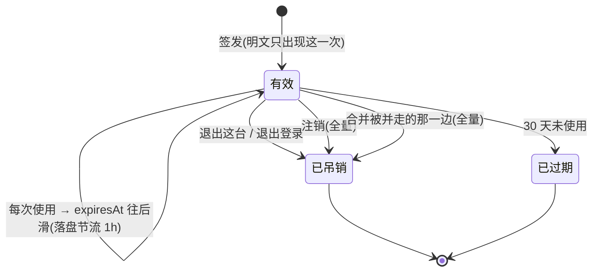
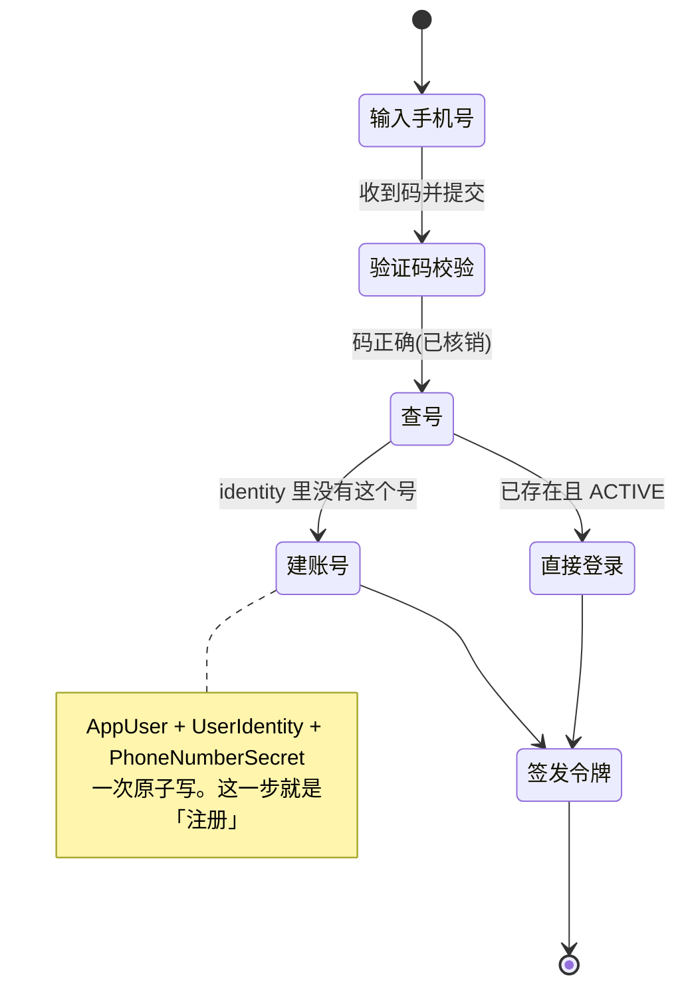

<!-- 受众=后端开发组 + 四个端的实现人 + stage 3 总装人 | 篇幅=1218 行 | 深度档位=详设 -->

> **基线:`origin/v1` @ `81a2c23`,fetch 于 2026-09-03 15:31 CST。** 代码侧取证全部实读该基线,行号即该基线的行号。
>
> **前提取 `B0`,不自己另定。** `B0` 落在分支 `KUBI-97-后端B0底座` @ `20b69f8`(尚未合 `v1`)。本文用到的四格:
> `B0-2` ID 统一为 `long`(起始 `10001`)、`B0-4` 过滤器 + 白名单默认拒绝、`B0-5` `ErrorCode` 枚举与 `details`、`B0-6` 游标分页与三种幂等键。
>
> **本轮代码 0 行。** 下面出现的类名、签名、配置键都是**待实现的目标形态**;现状一律另起一行标「现状」并给出文件与行号。
>
> 🔴 **本轮不做账号合并冲突**(`U5.4` / `/auth/merge/**`),见 §十四。契约行保留不动。

## 一、结论速查

**每一条都配一条可跑判据。判据跑不了的结论不算结论。**

| # | 题目 | 结论(一句话) | 判据 |
|---|---|---|---|
| `M5-1` | 四道闸的顺序 | 实际是**五道**:第 ⓪ 道号码锁定在滑块之前,因为它比滑块更早、更便宜地拒绝(§2.1) | 一个测试断言锁定态下 `captcha.verify` **一次都没被调用**(§2.5) |
| `M5-2` | 五道闸各自的存储语义 | 判据只有一句:**重启失效算放松的必须落盘,算收紧的必须不落盘**。三样在内存不是遗漏(§2.3) | 重启后锁定仍在、`state` 已没 —— 两条断言缺一不可(§2.5) |
| `M5-3` | 微信三条通道 | 三个应用、三套 appid、三笔认证费,`WeChatEntry` 里**分开的枚举不许合并**;`state` 只对有回跳的两条存在(§3.1) | `grep` 枚举三值 + 小程序分支显式写明无 `state`(§3.6) |
| `M5-4` | 微信一步登录的频控 | 🔴 **契约 §7.2「共用同一组计数器」与 `R-64`「按 openid 独立计数」正面冲突。裁定:IP 维度共用、openid 维度独立、手机号维度事后回填**(§3.4) | 同一 IP 走两条路命中同一个日限桶(§3.6) |
| `M5-5` | 令牌为什么不是 JWT | 「立即失效」有两处硬要求(注销 / 退出这台),JWT 要撤销就得每请求回库 —— 那就干脆只回库(§4.1) | 全仓无 JWT 依赖(§4.6) |
| `M5-6` | 🔴 `401` 是**三档不是两档** | `B0` §5.3 只看了令牌维度,漏了账号维度。`ACCOUNT_DEACTIVATED` 的依据是**账号状态**不是令牌状态,所以它与 `B0` 那条「已吊销不单独成档」**不冲突**(§4.3) | 退出这台 → `UNAUTHORIZED`;注销 → `ACCOUNT_DEACTIVATED`。两条断言缺一不可(§4.6) |
| `M5-7` | 🔴 匿名端点全集是**七行不是五行** | `/auth/wechat/phone-login` 与 `/auth/wechat/authorize-url` 是真匿名入口,契约 §三 漏登记;`/account/signup-count` 今天匿名是**缺陷**,收进鉴权面(§4.4) | 枚举全部端点断言白名单外无令牌一律 `401`(§4.6) |
| `M5-8` | 注销:删什么、什么时候删 | **顺序写死:先账号状态 + 摘 identity + 吊销全部令牌(一次原子落盘),后删行为层。** 反过来会造出「账号还活着但记录没了」这个不可重试的中间态(§5.2) | `deleteAllOf` 调用点在 `deactivate` 之后(§5.6) |
| `M5-9` | `L-A5` 未闭时的兜底 | **契约里没有 `hardDeleteAt`,响应里也没有。** `AppUser.deletedAt` 是服务端内部字段,不出现在任何 DTO 上 —— 写清它待定,不等于没设计(§5.4) | `grep` 三个响应 DTO 无 `deletedAt` / `hardDeleteAt` / 任何天数(§5.6) |
| `M5-10` | `movableRecordCount()` 的真实语义 | 有了 `userId` 之后它是「`fromUserId` 名下的 `Touch` 条数」,而 🔴 **`auth` 算不出这个数** —— 它必须由 `app` 算好传进来,否则就建出 `auth → domain` 这条边(§5.5) | `kaodian-auth` 里 `TouchStore` 零命中(§5.6) |
| `M5-11` | 退出登录 | 服务端提供的只有「吊销这一条,立即生效」;🔴 **不提供的那一半才是重点**:它不知道也不该知道端上有没有未上传的记录,更没有原图(§六) | 退出链路上服务端零像素字段、零队列语义(§6.4) |
| `M5-12` | 手机号两种形态 | `hmac` 用于查(唯一索引建它上面)、`ciphertext` 用于发短信、`masked` 只为显示。**不带密钥的哈希对手机号等于没哈希**(§7.1) | 全岛无手机号明文列(§7.4) |
| `M5-13` | `R-59` 密钥轮换 | 指纹与账号数据**同一次原子落盘**;四种情形四种处置,**只有一种拒绝启动**,而且出路留痕(§7.2) | `PhoneKeyGuardTest` 那条「换钥自愈后 `isNewAccount == false`」(§7.4) |
| `M5-14` | 注册即登录 | 没有 `/auth/register`。`AppUser + UserIdentity + PhoneNumberSecret` **一次原子写**;流水与令牌允许偏差,但偏差要能被发现(§八) | 启动期对账一次,差值记 WARN + 确切条数(§8.4) |
| `M5-15` | `GET /tokens` | 契约与代码在**路径、字段名、行的范围、分页**四处都不一致,四处逐条裁定(§9.7) | 响应里 `total`/`hasMore`/`revokedAt` 三个词零命中(§9.7) |

🔴 **十五条里没有一条是「待定」。** 需要人拍板的三处写在 §十五,指了名、指了时点,且都不拦实现开工。

---

## 二、`M5-1` `M5-2` 验证码:五道闸,以及每道闸的重启语义

### 2.1 顺序:文档写的是四道,代码跑的是五道,而多出来的那道位置是对的

**`后端系统设计与组件接入` §1.8 的图是四道:滑块 → 单号频控 → 单 IP 频控 → 发送。**

**实读 `SmsCodeService.java:84-87`,滑块前面还有一道:**

```java
PhoneLock lock = store.lockOf(phoneHmac);
if (lock.isLockedAt(now)) {
    return new SendOutcome.PhoneLocked(lock.lockedUntil());
}
// ① 行为验证 —— 一分钱没花的那一步
```

**裁定:这不是文档漏写,是文档那张图少了一格,而代码是对的。把它补成第 ⓪ 道。**

理由与 §1.8 自己给的理由同构:**闸的排序判据是「这一道拦下来省了多少钱」。**

| 闸 | 拦一次省下什么 | 它自己花多少 |
|---|---|---|
| ⓪ 号码锁定 | 一条短信 + 一次滑块调用 | **一次本地读**,零外部调用 |
| ① 行为验证 | 一条短信 | 一次厂商 HTTP(免费额度内) |
| ②③ 频控 | 一条短信 | 一次本地读改写 |
| ④ 发送 | —— | **这一步开始花钱** |

**⓪ 比 ① 更早、更便宜,所以它必须在前面。** 把它挪到滑块后面的代价很具体:一个被锁定的号,每次重发都会白白消耗一次滑块厂商调用 —— 而滑块调用同样有额度。

🔴 **`SmsCodeService` 的类注释今天写的是四道,与它自己第 84 行的代码不一致。** 这一处归 `M5` 实现时顺手改注释,**不是一次行为变更**。

### 2.2 五道闸的完整形态

```mermaid
flowchart TD
    REQ["POST /auth/sms/send"] --> G0{"⓪ 号码锁定<br/>PhoneLock · 落盘"}
    G0 -->|锁着| X0["429 PHONE_LOCKED<br/>details 带准确解锁时点<br/><b>零外部调用</b>"]
    G0 -->|没锁| G1{"① 行为验证<br/>captchaTicket"}
    G1 -->|未通过| X1["400 CAPTCHA_FAILED<br/><b>一分钱没花</b>"]
    G1 -->|通过| G2{"② 单号频控<br/>1/60s · 10/日"}
    G2 -->|超限| X2["429 SMS_TOO_FREQUENT<br/>429 SMS_PHONE_DAILY_LIMIT<br/>details 带准确重置时点"]
    G2 -->|通过| G3{"③ 单 IP 频控<br/>20/日"}
    G3 -->|超限| X3["429 SMS_IP_DAILY_LIMIT"]
    G3 -->|通过| W["先写 SmsCode 再发<br/>反过来会出现<br/>用户收到了服务端不认的码"]
    W --> SEND["④ 调运营商<br/><b>这一步开始花钱</b>"]
    SEND -->|确定没送达| REL["退日额度 + 丢弃这条码<br/>🔴 不退 60 秒冷却"]
    SEND -->|不确定| KEEP["不清 —— 短信可能在路上"]

    style SEND fill:#2a1a1a,stroke:#FF6B5A
    style G0 fill:#1a2a1a,stroke:#C9F24D
```



**「先占名额再发」不是风格**(`SmsCodeService.java:96-97`):反过来的话并发的两个请求会同时通过检查,而两条短信都是真的账单。

**失败退不退额度分两档**(`SmsCodeService.java:124-136`,`SmsRateLimiter.java:28-37`):

| 档 | 日额度 | 60 秒冷却 | 那条码 |
|---|---|---|---|
| 确定没送达(签名没批 / 模板没审 / 余额不足) | **退** —— 那是用户的额度,我们的配置问题不该吃掉它 | 🔴 **不退** —— 退了等于允许客户端对着一个正在故障的接口连打 | **丢弃** |
| 不确定 | 不退 | 不退 | 🔴 **不清** —— 删掉它等于让用户即将收到的码验不过去 |

### 2.3 🔴 存储 / 过期 / 重启:一句判据,七个落点

**判据只有一句:重启导致它失效,算放松一道防线还是收紧一道防线?**

| 落点 | 装什么 | 存储 | 过期 | 重启失效算什么 | 落不落盘 |
|---|---|---|---|---|---|
| `PhoneLock` | 号码锁定 30 分钟 | `auth-sms.json` | `lockedUntil` | 🔴 **放松** —— 攻击者重启一次就洗掉锁定 | **必须落盘** |
| `RateCounter`(号) | 1/60s + 10/日 | `auth-sms-quota.json` | 自然日(`Asia/Shanghai`) | 🔴 **放松** | **必须落盘** |
| `RateCounter`(IP) | 20/日 | 同上 | 自然日 | 🔴 **放松** | **必须落盘** |
| `RateCounter`(`wxphone:openid`) | 微信一步登录频控 | 同上 | 自然日 | 🔴 **放松** —— 它守的是 0.03 元/次 | **必须落盘** |
| `SmsCode` 两个槽 | 最新 + 被顶掉的上一条 | `auth-sms.json` | 5 分钟 | **放松** —— 用户手里的码会突然验不过 | **必须落盘** |
| 微信 `state` | 一次性防 CSRF 绑号 | `OneTimeStateStore` **内存** | 10 分钟 + 一次性 | ✅ **收紧** —— 重启后所有在途授权作废,最坏是用户重来一次 | **不落盘** |
| 合并预览令牌 | `pendingMerges` | `AccountService.java:61` **内存** | 5 分钟 | ✅ **收紧** —— 它授权的是一件不可逆的事 | **不落盘** |

🔴 **这两类不许混成一类。** 把 `state` 落盘不会让它更安全,只会让一个一次性凭证多一份可被翻出来的副本;把 `PhoneLock` 留在内存则是把「错 5 次锁定 30 分钟」变成「错 5 次锁定到下次部署」。

**`auth-sms.json` 与 `auth-sms-quota.json` 分成两个文件是有理由的**(`后端系统设计与组件接入` §6.11 末段):换钥时前者作废、后者被清零,而那是一次**有意的、短暂的**防线削弱;合在一个文件里会让「换钥要不要重写它」变成一次要临场判断的事。

### 2.4 四种终态,四句不同的话 —— 而第五种是被测试逼出来的

| 终态 | `code` | 用户该做的事 | 说成同一句的代价 |
|---|---|---|---|
| 输错 | `CODE_WRONG` + `details.remaining` | 重输 | —— |
| 已过期 | `CODE_EXPIRED` | **重发** | 拿着过期的码反复输,把自己输到锁定 |
| 已作废(同号发了新的) | `CODE_SUPERSEDED` | **用最新那条** | 再发一条把手里能用的也顶掉,陷在循环里 |
| 一条都没有 | `CODE_NONE` | 先发一条 | —— |
| 锁定 | `PHONE_LOCKED` + `details.lockedUntil` | 等到具体时点 | 「请稍后再试」只惩罚真实用户 |

🔴 **`SUPERSEDED` 的判定必须在计错误次数之前**(`SmsCodeService.java:165-177`)。拿着自己刚收到过的码不是在猜 —— 计进错误次数等于让「用旧码」这个正常动作把用户推向锁定。

⚠️ **作废槽里的码同样要判 TTL**(同处,`filter(old -> now.isBefore(old.expiresAt()))`):一条三天前的旧码回「请用最新收到的那一条」是误导 —— 那条新的多半也早过期了。

### 2.5 判据

```bash
# ① 第 ⓪ 道在第 ① 道之前 —— 锁定态下滑块一次都不该被调用
#    形态:Mockito verify(captcha, never()).verify(any(), any(), any())
grep -n 'lockOf' server/kaodian-auth/src/main/java/com/kaodian/server/auth/SmsCodeService.java
#    期望:命中行号 < 「captcha.verify」那一行的行号(实测 84 < 90)

# ② 重启语义 —— 两条断言缺一不可
#    落盘的:新建一个 FileSmsCodeStore 指向同一个文件,lockOf 仍然锁着
#    不落盘的:新建一个 OneTimeStateStore,上一次 issue 的 state 必须核销失败
grep -rn 'class OneTimeStateStore' server/kaodian-auth/src/main/java   # 期望:字段全是内存容器,无 Path/File

# ③ 五道闸一道都没被绕过去:sms/send 这一条路上出现的外部调用只有两个
grep -nE 'captcha\.|sender\.' \
     server/kaodian-auth/src/main/java/com/kaodian/server/auth/SmsCodeService.java   # 期望 2 处
```

---

## 三、`M5-3` `M5-4` 微信:三条通道,不是一条

### 3.1 三条通道的参数与门槛

| 入口 | `WeChatEntry` | 拿 code 的方式 | 需要 `state`? | 独有的门槛 |
|---|---|---|---|---|
| 小程序 | `mini` | `wx.login` 直接给 | 🔴 **不需要** —— 没有回跳就没有 CSRF 面 | 非个人主体 + 已认证 |
| 公众号 H5 | `official_h5` | 跳 `connect/oauth2/authorize` 回跳带 code | **必须** | 只有**已认证的服务号**有网页授权 |
| PC 扫码 | `open_web` | 跳 `connect/qrconnect` 回跳带 code | **必须** | 开放平台资质 + 网站应用审核 |

🔴 **三个入口是三个应用、三套 appid/secret。用错的表现是 `errcode 40029 invalid code`** —— 字面是「code 无效」,而排查时几乎所有人先去怀疑 code 本身。所以 `WeChatEntry` 里三个值**分开的枚举不许合并成一个 `wechat`**,`WeChatCredentials#of` 缺配置时抛出的消息要直接点名是哪一条入口。

⚠️ **ICP 备案是三条入口的共同前置**(`R-65`),不只是小程序的 —— 公众号的网页授权域名同样要求已备案。**「绕开小程序先上公众号 H5」这条路绕不开备案。**

### 3.2 `state` 不校验会发生什么

具体到一次攻击:攻击者先自己走一遍授权,拿到**属于他自己**的 `code`;然后诱导已登录的受害者访问带这个 code 的回跳地址。受害者的浏览器带着自己的登录态提交上来,服务端一看「这个 unionid 没绑过」→ **把攻击者的微信绑到了受害者的账号上**。此后攻击者用自己的微信就能登进受害者的账号。

**落地:`OneTimeStateStore`,10 分钟、一次性、服务端生成与服务端校验。**

🔴 **前端自己生成的 `state` 无从验证,等于没有。** 这是 `GET /auth/wechat/authorize-url` 必须存在、且必须匿名的全部理由 —— 它不是一个便利端点,它是这道防线本身(§4.4 把它补进白名单)。

**小程序那条分支没有 `state`,这一点要在 `AuthController#exchange` 里显式写明**,不能靠「传空就跳过」——空值跳过与「这条路本来就没有回跳」是两件事,前者会在某次重构里悄悄扩大到别的入口。

### 3.3 拿不到 `unionid` 就是 `R-33` 本身

`openid` 是「这个人在**这个应用**里」的 id,同一个人在小程序和网站应用下的 openid **不同**。拿不到 `unionid` 的唯一原因是该应用**没绑定到同一个微信开放平台账号** —— 一次控制台配置。

**后果很具体:同一个人从不同入口进会得到两个账号,行为层被拆两半,盲区凭空多出来。**

**裁定原样保留:`kaodian.auth.wechat.require-unionid` 默认 `true`,拿不到就 `503 WECHAT_UNIONID_MISSING`,不降级建号。**

| 为什么是 `503` 不是 `502` | 它的语义是「我们的配置没做对」,不是「微信挂了」。消息里直接点名要去绑什么 |
|---|---|
| 为什么留 `false` 这条出路 | 与 `accept-key-loss` 同一条:**一个没有出路的守卫,会被撞上它的人在半夜关掉 —— 然后它就永远关着了** |

### 3.4 🔴 契约表覆盖不到的两条 + 一条正面冲突

**契约 §7.1 那张场景表有一个没写出来的前提:它假设 `unionid` 从第一天就有。**

#### 一、`unionid` 从无到有 —— 一条我们自己造出来的 `R-33`

照契约表逐字实现:openid-only 时建了账号 A,后来控制台绑好开放平台,同一个人再登录时 unionid 查不到 → **建账号 B**。用户什么都没做错,记录被拆成两半。

**处理(`AccountService.java:305-316` 已实现,本文只是把它写成契约):`unionid` 查不到时按 `openid` 再查一次,查到就给那个账号补一行 unionid identity,不建新号。**

🔴 **而且必须是「并查比对」,不能是「回退」**(同处的类注释):回退在查到 unionid 的那一刻就返回,openid 那个账号连同它的记录一起消失在视野里,**用户不会收到任何合并提示**。

#### 二、分裂已经发生时:登进 `unionid` 那个,**建议**合并

一次登录里 unionid 与 openid 命中两个不同账号时,登进 unionid 那个(它是「现在这个人」的权威身份),返回一次性 `splitMergeToken`。**绝不自动合并** —— 自动合并可能把两个人的记录并到一起,而那会让覆盖度彻底失真。

🔴 **一次只处理一个分裂**(`AccountService.java:318-345`):一次登录最多牵出三个账号,但合并令牌只给一个 —— 合并是不可逆的,一次确认只该授权一次合并。剩下的不会消失,**合并完之后的下一次登录会把下一个分裂重新报出来**。

#### 三、🔴 `M5-4` 频控口径:契约自己和自己打架,必须裁

| 出处 | 说什么 |
|---|---|
| `接口契约` §7.2 | 🔴 **与 `/auth/sms/send` 共用同一组计数器**,同一手机号共享单号日限,同一 IP 共享 IP 日限;**复用 `SMS_*` 错误码,不新起码** |
| `接口契约` §10.5 | `WECHAT_PHONE_TOO_FREQUENT` / `WECHAT_PHONE_DAILY_LIMIT` / `WECHAT_PHONE_IP_LIMIT` 三个码,标注**已有** |
| `后端系统设计与组件接入` §6.4 / `R-64` | 频控键用 **openid**,加 `wxphone:` 前缀,**与短信计数空间独立** |

**裁定:按维度拆开,三处各对一半。**

| 维度 | 共用还是独立 | 为什么 |
|---|---|---|
| **IP 日限** | 🔴 **共用同一个桶** | 两条路花的是同一家的钱,而 IP 在两条路上都拿得到。各做一套的后果是攻击者只打便宜的那一条 |
| **openid 60s + 日限** | **独立** | 短信那条路上根本没有 openid,无从共用 |
| **手机号日限** | 🔴 **事后回填,不前置拦截** | `R-64` 说的是物理事实:**手机号要花完那 0.03 元才知道**。按它前置限流等于限流发生在花钱之后 |

**「事后回填」的落法:** 换到手机号之后,把这一次**计入该手机号的当日计数**(不再拒绝——钱已经花了)。这样这个人接着走短信通道时,单号日限已经反映了这一次消耗。**契约 §7.2「共享单号日限」的意图由此兑现,而不违反物理。**

**错误码:`WECHAT_PHONE_*` 三个保留。** §7.2「不新起码」那句已被 §10.5 自己推翻(那三个码在表里标「已有」),而且端确实需要区分:**微信这条路被限时,出路是换短信通道;短信被限时,出路不是换回微信。** 两句不同的话,两个码。

⚠️ **`R-68` 原样保留为登记的差异,不假装等强度:** 微信换手机号那条路今天没有第 ① 道滑块。`captchaTicket` 在契约 §7.2 的请求体里已经有位置 —— **本文把它定为可选字段**,服务端可返回 `403 CAPTCHA_REQUIRED`。**不扩大 §6.8 的拒绝启动到这条路**:拿到有效 `phoneCode` 需要真人在微信内主动点授权,门槛与短信不是一个量级。

### 3.5 🔴 §6.8 那条被写成「起不来」的配对红线

**默认组合(假短信 + 不校验滑块)是安全的:没有账单可刷。危险的只有 `真短信 + 不校验滑块` 这一种组合** —— 而它恰好是「先把短信配上,验证码回头再说」这个**最自然的接入顺序**会产生的中间状态。

```
拒绝启动:短信已切到真实供应商,但行为验证仍是 disabled。
```

**警告会被划过去,账单不会。**(`AuthBeans.java:198` `checkVendorPairing`)

**这条红线本文一个字不改,只补一条它的判据:**

```bash
# 配对红线必须是「起不来」,不是「打条日志」——把它降级成 WARN 会在某次重构里悄悄发生
grep -n -A3 'checkVendorPairing' server/kaodian-app/src/main/java/com/kaodian/server/api/support/AuthBeans.java
# 期望:方法体里出现 throw,不出现 log.warn 作为唯一出口
```

**什么时候才走 `phone-login`(§6.6 那条按次账单):**

| 情形 | 走不走 |
|---|---|
| 小程序端,用户**主动点**了手机号授权按钮 | ✅ 走 |
| 小程序端,用户只是打开了 App | ❌ **不走** —— 它是按次账单,不是「顺手拿一下」 |
| H5 / PC / 桌面端 | ❌ 走不了(这个能力只有小程序有) |
| 作为「登录失败后的自动兜底」 | 🔴 **禁止** —— 那会把一次失败变成一笔账单,而失败是可以被刷的 |

### 3.6 判据

```bash
# ① 三条入口没有被合并成一个
grep -n 'mini\|official_h5\|open_web' \
     server/kaodian-auth/src/main/java/com/kaodian/server/auth/vendor/WeChatEntry.java   # 期望三值各 1

# ② 小程序那条分支显式写明「没有 state」,不是靠传空跳过
grep -n 'state' server/kaodian-app/src/main/java/com/kaodian/server/api/auth/AuthController.java
#    期望:小程序分支处有一条显式注释或分支,而不是一个 null 判断顺带覆盖

# ③ 昵称头像一概丢弃 —— 「不碰内容」在身份侧的延伸
grep -rniE 'nickname|avatar|headimg|昵称|头像' \
     server/kaodian-auth/src/main/java/com/kaodian/server/auth/vendor/    # 期望 0 命中

# ④ IP 日限是同一个桶:两条路调的是同一个 SmsRateLimiter 实例
grep -rn 'SmsRateLimiter' server/kaodian-app/src/main/java/com/kaodian/server/api/auth/AuthController.java
#    期望:只有一个注入的字段,不是两个
```

---

## 四、`M5-5` `M5-6` `M5-7` 令牌与鉴权面

### 4.1 为什么不是 JWT

产品里有两处硬要求**撤销必须立刻生效**:注销账号(`U5.5`),以及设备管理页的「退出这台」(`U5.6` §2.5「被退的那台设备下一个请求就被拒,不等令牌自然过期」)。

**JWT 在过期前无法撤销,要撤销就得另建黑名单表 —— 那等于每次请求都回库查一次,绕一圈回到有状态,还多背一套签名机制。既然一定要回库,那就干脆只回库。**

| 项 | 形态 | 出处 |
|---|---|---|
| 明文 | `at_` / `ro_` + 43 个 base62 字符(≈256 位熵) | `TokenService.java:33-43` |
| 库里 | **只有含前缀的完整明文的 SHA-256** | `TokenService.java:179-193` |
| 有效期 | 30 天滑动;落盘节流 1 小时(否则每个请求全量重写一次令牌文件) | `TokenService.java:46,56` |
| 多设备 | 并存,每条一行 | —— |
| 续期 | 🔴 **不换发新令牌** —— 同一台设备上多个标签页同时刷新会互相作废,表现为随机掉线 | `RefreshResponse` 类注释 |

🔴 **哈希的是含前缀的完整明文。** 只哈希后半段的话,`at_XXX` 与 `ro_XXX` 会算出同一个哈希 —— 于是把只读令牌的前缀改成 `at_` 就能查到那条 `FULL` 的行。**前缀参与哈希,这条路就是死的。**

### 4.2 生命周期



**吊销是幂等的**(`TokenService.java:121-133`):重复调用返回 `false`,不报错。「退出登录」在网络不稳时会被点两次,而第二次报错只会让人以为没退成功。

**按哈希吊销与按明文吊销是两个方法**(`TokenService.java:143`):设备管理页列出的是别的设备,服务端手里只有它们的哈希,拿不到明文。🔴 **越权吊销别人的会话必须是显式失败**(`403 NOT_YOUR_SESSION`),不是静默无事发生。

### 4.3 🔴 `M5-6` `401` 是三档,而 `B0` §5.3 只定了两档

**`B0` §5.3 的裁定:令牌存在仅仅是过期 → `TOKEN_EXPIRED`;其余全部(含已吊销)→ `UNAUTHORIZED`。理由是「已吊销」单独成档等于告诉持有者「这个令牌曾经是真的」。**

**而 `U5.5` §三 逐字要求:「旧令牌仍被使用时,门上说的是『已注销』,不是『登录过期』」,契约 §7.5 已把它落成 `401 ACCOUNT_DEACTIVATED`。**

**这两条今天在同一格上打架:注销会 `revokeAll`,所以注销后的旧令牌走的正是「已吊销」那一档 —— 按 `B0` 它永远说不出「已注销」。**

**裁定:拆三档,而且第三档的判定依据是账号维度不是令牌维度。**

| 情形 | 判定依据 | 对外 `code` | 泄露了什么 |
|---|---|---|---|
| 令牌行存在、仅仅过了 `expiresAt` | 令牌 | `TOKEN_EXPIRED` | **什么都没有** —— 持有它的人本来就知道它曾经有效 |
| 令牌行存在、已吊销,**且账号仍是 `ACTIVE`** | 令牌 + 账号 | `UNAUTHORIZED` | 🔴 什么都没有 —— **被踢下线的一方仍然什么都不知道**,`B0` 那条顾虑原样保住 |
| 令牌行存在、已吊销,**且账号是 `DEACTIVATED`** | **账号** | `ACCOUNT_DEACTIVATED` | 只告诉「拿着一条曾属于该账号的令牌的人」这个账号注销了 —— 而他本来就知道这个账号存在 |
| 没带头 / 格式不对 / 查不到 | 令牌 | `UNAUTHORIZED` | 已吊销与查不到仍然分不开 |

🔴 **关键的结构性限制:查不到令牌行的时候,永远说不出 `ACCOUNT_DEACTIVATED`** —— 因为那时候根本没有 `userId` 可查。**泄露面因此被结构限死,不靠一条要记住的规矩。**

**需要的签名(`kaodian-auth`。现状 `TokenService.verify` 返回 `Optional<AccessToken>`,把四种失败折叠成一个空值,`TokenService.java:91-105`):**

```java
sealed interface TokenCheck permits Valid, Expired, Revoked, Invalid {
    record Valid(AccessToken token) implements TokenCheck {}
    record Expired() implements TokenCheck {}          // 令牌确实存在过,只是过了 expiresAt
    record Revoked(long userId) implements TokenCheck {} // 🔴 内部档,不直接映射成一个 code
    record Invalid() implements TokenCheck {}          // 没带 / 格式不对 / 查不到
}
TokenCheck check(String plaintext);                    // 新增
Optional<AccessToken> verify(String plaintext);        // 保留,给不关心档位的调用方
```

**`Revoked` 带着 `userId` 而对外没有对应的码 —— 这正是它存在的形状:它是过滤器再查一次账号状态的入口,不是一个响应。**

### 4.4 🔴 `M5-7` 匿名端点全集是七行

**实读基线,`/api/auth/**` 与 `/api/account/**` 上今天不需要令牌就能打通的端点有七个:**

| # | 端点 | 现状取证 | 裁定 |
|---|---|---|---|
| 1 | `POST /auth/sms/send` | `AuthController.java:121` | ✅ 真匿名,契约 §三 已有 |
| 2 | `POST /auth/sms/verify` | `:166` | ✅ 真匿名,契约 §三 已有 |
| 3 | `POST /auth/wechat/login` | `:229` | ✅ 真匿名,契约 §三 已有 |
| 4 | `GET /auth/wechat/authorize-url` | `:204` | 🔴 **真匿名,契约 §三 漏登记** —— `state` 必须在跳授权页之前拿到,而那时还没有令牌 |
| 5 | `POST /auth/wechat/phone-login` | `:257` | 🔴 **真匿名,契约 §三 漏登记** —— 它是小程序那条路的登录入口。契约 §7.2 补了它的行,却没往 §三 加行 |
| 6 | `POST /auth/logout` | `:188`(自己从 header 抠令牌,没有 `CurrentSession`) | ❌ **不该匿名。** 收进鉴权面(见下) |
| 7 | `GET /account/signup-count` | `AccountController.java:137`(没有 `CurrentSession`) | ❌ **不该匿名。** 它是一个不需要令牌的运营数字出口 |

**加上 `GET /auth/agreements/current`(`B0` §十二)与 `POST /billing/notify/wxpay`(另一条鉴权链),白名单是七行:**

```java
// kaodian-app · api/support/ApiAuthFilter.java —— 在 B0 §5.2 那五行基础上加两行
new Anonymous(GET,  "/api/v1/auth/wechat/authorize-url"),   // 🔴 M5 补:state 必须在登录前拿到
new Anonymous(POST, "/api/v1/auth/wechat/phone-login"),     // 🔴 M5 补:小程序那条路的登录入口
```

🔴 **老实加两行,不靠改路径前缀把它们移出统计。** 契约 §三 自己写着这条红线,理由是「白名单存在的意义正是『匿名入口的全集在这一处数得清』」。

**第 6、7 行的裁定要各说一句:**

| | 裁定 | 语义变化 |
|---|---|---|
| `POST /auth/logout` | **需要有效 `full` 令牌**;过期令牌 → `401 TOKEN_EXPIRED` | **没有变化。** 一条已经失效的令牌不需要被吊销,端直接本地清即可 —— `U5.6` §7.1「离线时允许本地退出,服务端令牌稍后自然过期,无需补偿」正是这一格 |
| `GET /account/signup-count` | **需要 `full` 令牌** | 🔴 **不删这个端点。** 它是阶段 3 判据的唯一读口(`AccountController.java:126-136`),删掉等于把那个数藏起来。要的是给它加一道门,不是关掉它 |

⚠️ **`POST /auth/refresh` 是唯一接受 `TOKEN_EXPIRED` 令牌的端点**(契约 §3.1)。**被吊销的令牌不行 → `401`**,按 §4.3 的三档决定说哪一句。这一条在过滤器上是一个显式的路径例外,**不是一个「过期也放行」的通用开关**。

### 4.5 只读令牌在本模块的四道锁

`ro_` 前缀不是装饰:**拿着 `ro_` 的客户端换不出写能力,不是被判断为不许写。**

| 命中 | 结果 |
|---|---|
| 任何非 `GET` 方法 | `403 READONLY_TOKEN` |
| `/tokens/**` | 🔴 `403 READONLY_TOKEN`,**不论方法** —— 只读令牌不能管理令牌 |
| `/auth/**`(除白名单) · `DELETE /account` | `403 READONLY_TOKEN` |
| `/billing/**` `/quota/**` `/agent/**` | `403 READONLY_TOKEN`,不论方法(归 `M4` / `M7`) |

🔴 **「只读令牌不能管理令牌」这条要单独说一次:** 少了它,一条泄露出去的 `ro_` 就能把账号里所有的 `at_` 全吊销掉 —— 一个只读凭证不该有制造拒绝服务的能力。

### 4.6 判据

```bash
# ① 401 三档 —— 两条断言缺一不可,少任何一条都测不出 §4.3 那个冲突
#    A 退出这台后用旧令牌请求 → 401 且 code == UNAUTHORIZED
#    B 注销后用旧令牌请求     → 401 且 code == ACCOUNT_DEACTIVATED
grep -rn 'ACCOUNT_DEACTIVATED' server/kaodian-app/src/main/java   # 期望:枚举 1 处 + 过滤器 1 处

# ② 白名单七行,且与契约 §三 逐行一致(B0 §5.5 判据 ② 在 M5 的落点)
grep -c 'new Anonymous' \
     server/kaodian-app/src/main/java/com/kaodian/server/api/support/ApiAuthFilter.java   # 期望 7

# ③ 没有第八个匿名入口:auth 面每一个端点要么在白名单里,要么拿得到「进来的是谁」
grep -cE '@(Get|Post|Put|Delete)Mapping' \
     server/kaodian-app/src/main/java/com/kaodian/server/api/auth/{AuthController,AccountController}.java
grep -c 'CurrentSession session' \
     server/kaodian-app/src/main/java/com/kaodian/server/api/auth/{AuthController,AccountController}.java
#    期望:端点数 − CurrentSession 数 == 白名单里属于 auth 面的行数(5)
#    实测基线:16 − 9 = 7 ≠ 5 —— 今天是红的,红的正是第 6、7 行

# ④ 没有 JWT
grep -rn 'jsonwebtoken\|jjwt\|JWT' server/*/pom.xml server/*/src/main/java   # 期望 0 命中

# ⑤ 前缀参与哈希 —— 改掉它就等于给只读令牌开一条提权路
grep -n 'sha256(plaintext)' \
     server/kaodian-auth/src/main/java/com/kaodian/server/auth/TokenService.java   # 期望:入参是完整明文
```

---

## 五、`M5-8` `M5-9` `M5-10` 注销

### 5.1 删什么

| | 注销时 | 谁执行 |
|---|---|---|
| 账号状态 | `ACTIVE` → `DEACTIVATED`,写 `deletedAt` | `auth` |
| 全部 identity | 🔴 **摘掉。** 不摘的话那个手机号永远登不回来也永远给不了别人 —— 而手机号会被运营商回收 | `auth` |
| `PhoneNumberSecret` | 删 | `auth` |
| 全部令牌(所有设备) | **吊销,立即生效** | `auth` |
| 云端记录与行为层(`Touch` / `RecordTag` / `UserAssertion`) | **删** | 🔴 `app` 编排,调 `domain` 的三个 `deleteAllOf` |
| `SignupEntry` 注册流水 | 🔴 **不删** —— 删了阶段 3 的「累计注册」会凭空变小 | `auth` |
| 本机原图与本地缓存 | **删** | 🔴 **端。服务端从来没有原图的副本,删不了它** |
| 别的设备上的原图 | ⚠️ 删不掉 —— 原图从不上云,没有一处能统一删它(`M5-G5`,产品侧已登记) | —— |

⚠️ **`AccountStore.java:45` 的接口注释写的是「只改状态与 `deletedAt`」,而 `FileAccountStore.java:161-165` 实际会把 identity 与手机号密文一并摘掉。** 这是同一个模块内文档与实现的一处不一致 —— 读接口的人会以为 identity 还在。**归 `M5` 实现时改注释,不是行为变更。**

### 5.2 🔴 什么时候删:顺序是唯一要点

```mermaid
flowchart TD
    A["DELETE /account<br/>Idempotency-Key 必带"] --> B["① 一次原子落盘:<br/>status=DEACTIVATED + deletedAt<br/>+ 摘全部 identity + 删手机号密文"]
    B --> C["② 吊销全部令牌"]
    C --> D["③ 删行为层<br/>TouchStore.deleteAllOf(userId)<br/>RecordTagStore.deleteAllOf(userId)<br/>UserAssertionStore.deleteAllOf(userId)"]
    D --> E["200 { exportHint }"]
    C -.->|③ 失败| R["🔴 可重试:账号已经进不去了,<br/>再调一次 deleteAllOf 即可(幂等)"]
    B -.->|② 失败| R2["🔴 也可重试:状态已落,<br/>下一次请求走 ACCOUNT_DEACTIVATED"]

    style B fill:#1a2a1a,stroke:#C9F24D
    style D fill:#2a1a1a,stroke:#FF6B5A
```



**为什么是这个顺序,而不是「先删数据再关账号」:**

| 顺序 | 中途失败会留下什么 | 可不可以重试 |
|---|---|---|
| ✅ **先关账号,后删数据** | 账号进不去了,数据还在 | **可以** —— `deleteAllOf` 是幂等的,重跑一次即可 |
| ❌ 先删数据,后关账号 | **数据没了,账号还活着** | 🔴 **不可以** —— 用户下次登录进来看见一个空白的盲区页,而那是这个产品的首屏 |

**「不可重试的中间态」这个判据比「哪个更快」重要得多。**

🔴 **第 ③ 步必须是三个 `deleteAllOf`,不是一个循环。** `M1` §7.3 已经写死这条并给了理由:`FileTouchStore.delete` 每次全量重写整个文件并 `fsync`,一个记了三年的用户注销一次 = N 次全量重写 —— **而注销是一个用户按下之后必须完成的动作,超时了没有第二次机会。**

⚠️ **`M1` 只定义了两个 `deleteAllOf`(`TouchStore` / `RecordTagStore`),漏了 `UserAssertionStore`。** `B0` §4.2 已把 `UserAssertion` 的主键改成 `(userId, nodeCode)`,所以断言同样是按用户存的,注销必须一并删。**签名归 `collect` 包(`M1` 的地界),本文只登记这个缺口并给判据**,不替它定 —— 见 §十五 第 3 条。

### 5.3 幂等

| 项 | 值 | 理由 |
|---|---|---|
| 键 | `Idempotency-Key` 请求头,锚定 `(userId, path, key)`(`B0` §7.3) | 「不可逆改变账号状态」的端点必须带 |
| 缺失 | `400 IDEMPOTENCY_KEY_REQUIRED` | —— |
| 上次成功 | 返回上次结果 | —— |
| 上次进行中 | `409 IN_PROGRESS` | `U5.5` §2.6「执行中重复点击幂等,不产生第二次注销」 |
| **保留期** | 🔴 **10 分钟** | 见下 |

**为什么是 10 分钟而不是一天:吊销生效之后,重放根本到不了守卫。** 第 ② 步一落,同一条令牌的下一个请求会在过滤器上就被 `401 ACCOUNT_DEACTIVATED` 拦住 —— 它永远走不到 `IdempotencyGuard`。**所以保留期只需要覆盖「吊销落盘之前的并发重试」这个窗口,而那是秒级的。** 定 10 分钟是给时钟偏差和一次慢重试留的余量,不是给「用户明天再点一次」留的 —— 那种情况本来就该走「已注销」那条路。

`B0` §7.3 把保留期留给各模块定,理由是「下单与注销的合理窗口差一个数量级」。**这就是注销那一端的数。**

### 5.4 🔴 `M5-9` `L-A5` 未闭时的兜底

**删除时点(立即硬删 vs 软删 T+N)属用户协议不属架构,待律师稿。本文不裁定,但「待定」不等于「没设计」——下面这四条现在就成立:**

| # | 现在就成立的 | 为什么它不依赖 `L-A5` |
|---|---|---|
| 1 | **契约里没有 `hardDeleteAt` 字段** | 加了它就等于替律师稿选了「软删」那一支(契约 §7.4 已写) |
| 2 | **`AppUser.deletedAt` 是服务端内部字段,不出现在任何响应 DTO 上** | 它今天已经存在(ER 图),而响应里出现一个删除时刻就是在暗示一个天数 |
| 3 | **响应里不出现任何天数、任何「找回」入口** | 两种写错的代价不对称:写了「可找回」而实际是硬删是产品在骗人,反过来只是少给一个入口(`U5.5` §2.4) |
| 4 | **注销后同号登录 = 走建号分支,记一次 `signup_created`** | identity 已摘,号又空出来了 —— 这在两种口径下都成立,只是软删口径下还要额外决定旧账号怎么办 |

**`L-A5` 定下来之后要改的只有一处:第 ③ 步(删行为层)是当场做还是排进 T+N。** 前两步与全部对外契约**一个字都不用改** —— 这就是这个设计对未定项的处理方式:**把未定的那一格缩到最小,而不是等它。**

### 5.5 🔴 `M5-10` `movableRecordCount()` 的真实语义

**现状:`AccountService.java:484-486` 恒返回 `0`,而且注释写明这不是 bug —— 行为层没有 `userId`,「把 A 的记录搬到 B」在今天的数据模型里无处可搬。**

**`B0-3` 给了 `userId` 之后,它的真实语义是:「`fromUserId` 名下的 `Touch` 条数」。**

🔴 **而 `auth` 算不出这个数。**

| 想怎么算 | 后果 |
|---|---|
| ❌ `AccountService` 注入一个 `TouchStore` | 建出 `auth → domain` 这条边。`kaodian-auth/pom.xml` 今天只有两个 starter(实测),这条边一旦建出来,**注销一个账号就会牵动覆盖度计算** —— 而那正是 `CLAUDE.md` 那两个「刻意」之一 |
| ❌ 传一个 `LongToIntFunction` 进去 | 边没建出来,但「什么时候算这个数」这个决定被藏进了 `auth`。那次查询可能很贵,而调用点看不见它 |
| ✅ **`app` 算好,把 `int` 传进来** | 边没建出来,而且那次查询在调用点是可见的 |

**签名变更:**

```java
// 现状:MergePreview previewMerge(String userId, String mergeToken)
// 目标:数由 app 算好传进来 —— auth 只负责把它写进预览与留痕
MergePreview previewMerge(long userId, String mergeToken, int movableRecordCount);
AccountMergeLog confirmMerge(long userId, String mergeToken, int movableRecordCount);
```

⚠️ **本轮只定语义与签名方向,不出合并的实现设计**(§十四)。**写在这里是因为「`movableRecordCount` 恒为 0 什么时候不再是 0」必然被问到,而答案不是「等合并做的时候再说」——答案是「它取决于一条不许建出来的边怎么绕过去」,那是现在就要定的。**

### 5.6 判据

```bash
# ① 顺序:先关账号,后删数据
grep -n 'deactivate\|deleteAllOf' \
     server/kaodian-app/src/main/java/com/kaodian/server/api/auth/AccountController.java
#    期望:deactivate 的行号 < 三个 deleteAllOf 的行号

# ② 不是一个循环
grep -nE 'for *\(|\.forEach|\.stream\(\)' \
     server/kaodian-app/src/main/java/com/kaodian/server/api/auth/AccountController.java
#    期望:注销那个方法体内 0 命中

# ③ auth 够不到 collect(M1 §7.3 判据在 M5 的落点)
grep -n 'kaodian-domain' server/kaodian-auth/pom.xml                          # 期望 0
grep -rn 'TouchStore\|RecordTagStore\|UserAssertionStore' \
     server/kaodian-auth/src/main/java                                        # 期望 0

# ④ 没有任何天数、没有 hardDeleteAt 泄进响应
grep -rniE 'hardDeleteAt|deletedAt|[0-9]+ *天|T\+[0-9]' \
     server/kaodian-app/src/main/java/com/kaodian/server/api/dto/auth/         # 期望 0 命中

# ⑤ 注册流水注销不删
grep -n 'signups\.' server/kaodian-auth/src/main/java/com/kaodian/server/auth/AccountService.java
#    期望:只有 record 与 totalCount,没有任何 delete/remove
```

---

## 六、`M5-11` 退出登录:服务端提供什么,以及**不提供什么**

### 6.1 服务端这一侧只有两件事

| 提供 | 落点 |
|---|---|
| 吊销**当前这一条**令牌,立即生效,不影响别的设备 | `POST /auth/logout` |
| 吊销**指定那一条**令牌(设备列表里的单条退出),立即生效 | `POST /tokens/{tokenId}/revoke` |

**就这两件。下面这张表才是本节的全部内容。**

### 6.2 🔴 服务端**不**提供的四样

| 不提供 | 为什么 |
|---|---|
| **它不知道端上有没有未上传的记录** | 离线队列在设备本地。`U5.6` §2.3 那次拦截**跑在被退的那台设备上**,是端的责任 —— 服务端连「有几条」都拿不到 |
| **它不清任何本地缓存** | 已同步的记录在账号里,重新登录就回来。清不清是端的事 |
| 🔴 **它碰不到原图,一张也碰不到** | **原图从不上传,账号里没有副本。** 「退出时要不要删原图」在契约层根本不是一个问题 —— 它只在客户端存在,而答案是不删 |
| **它不因为「有未传记录」而拒绝退出** | 拒绝退出等于把一次本地状态变成一个服务端策略,而服务端看不见那个状态 |

🔴 **「清掉本地缓存」与「清掉原图」在端上常常是同一个目录、同一次清理。** 这一条要在服务端契约上说清楚,不是因为服务端要做什么,而是因为**它一个字都不说的话,端会以为这里有一个可以问的接口。**

**`U5.6` §2.2 的判据一句话:清它之前,先问账号里有没有它的副本。**

```mermaid
flowchart TD
    A["退出登录要清的每一样"] --> B{"账号里有没有它的副本"}
    B -->|有| C["清 —— 重新登录就回来<br/>令牌 · 会话 · 已同步的记录缓存"]
    B -->|没有 · 但能补上去| D["🔴 先拦一次,补传完再退<br/>队列里还没上传的记录 —— <b>端的责任</b>"]
    B -->|没有 · 也永远补不上去| E["🔴 一张不动<br/>原图 —— <b>服务端连碰的可能都没有</b>"]

    style E fill:#2a1a1a,stroke:#FF6B5A
```



### 6.3 退出 × 注销:后端这一侧的逐格差别

| | 退出登录 | 注销 |
|---|---|---|
| 令牌 | 吊销**一条** | 吊销**全部** |
| 账号状态 | 不动 | `DEACTIVATED` + 摘 identity |
| 行为层 | **一条不动** | 三个 `deleteAllOf` |
| 幂等键 | **不要** —— 它可逆,重复吊销返回 `false` 即可 | `Idempotency-Key` **必带** |
| 旧令牌下一个请求 | `401 UNAUTHORIZED` | `401 ACCOUNT_DEACTIVATED` |
| 离线 | 端本地退出即可,**服务端无需补偿** | 🔴 入口禁用,它必须联网 |

**最后一行的两个 `401` 就是 §4.3 那三档存在的全部理由。**

### 6.4 判据

```bash
# ① 退出链路上服务端零像素字段
grep -rniE 'image|photo|thumbnail|原图|图片' \
     server/kaodian-app/src/main/java/com/kaodian/server/api/dto/auth/    # 期望 0 命中

# ② 退出不碰行为层
grep -n 'logout' -A 12 \
     server/kaodian-app/src/main/java/com/kaodian/server/api/auth/AuthController.java
#    期望:方法体里只出现 tokens.revoke,没有任何 collect 包的符号

# ③ 服务端没有一个「队列还有几条」的字段或参数
grep -rniE 'pendingUpload|queueSize|unsynced' \
     server/kaodian-app/src/main/java/com/kaodian/server/api/dto/          # 期望 0 命中
#    ⚠️ 今天不是 0:RevokeSessionRequest 有 confirmedPendingUploads,见 §9.7 冲突 4
```

---

## 七、`M5-12` `M5-13` 手机号的两种形态与密钥轮换

### 7.1 库里的三种形态,各有各的去处

| 形态 | 算法 | 去处 | 参不参与判断 |
|---|---|---|---|
| `hmac` | **HMAC-SHA256** | `UserIdentity.identifier`(`type=phone` 时)—— **唯一索引建在它上面** | ✅ 查号、绑定冲突判定 |
| `ciphertext` | AES-256-GCM(随机 IV) | `PhoneNumberSecret`,只在要给这个号发短信时解一次 | ❌ |
| `masked` | `138****8000` | **只为显示** | ❌ 不参与任何判断 |

🔴 **为什么必须是 HMAC 而不是 SHA-256:** 手机号取值空间只有约 2×10⁹,一台笔记本几分钟就能把全部中国手机号的 SHA-256 算完做成彩虹表。**不带密钥的哈希对手机号等于没哈希 —— 那把密钥才是这条防线本身。**

⚠️ **`auth-sms.json` 与 `auth-sms-quota.json` 也按手机号 HMAC 建键,但那里的号可能还没有账号**(正在注册的人,以及正在被锁定的刷子)—— 它们**没有密文**,所以算不出新 HMAC。这一条决定了 §7.2 的一个副作用。

### 7.2 `R-59`:换了密钥必须是启动期的一次响亮失败

**不做任何事的话,这是本模块唯一一个会毁数据而且全程无声的失败模式:** HMAC 密钥换一把,同一个手机号算出的 `identifier` 就变了,于是**每一次登录都会走「查不到 → 建号」分支**。接口全部 `200`、日志一条没有,而老用户各自多出一个空账号,记录留在再也查不到的旧账号上 —— 等到有人发现时,`SignupLedger` 上已经多了一批假注册,**而那是阶段 3 判据的数据源。**

**「请记得备份密钥文件」是一句叮嘱,不是一道防线。**

#### 做法:指纹与账号数据同一次原子落盘

指纹 = 用密钥对一个固定常量算 HMAC 的前 16 个十六进制字符。常量公开,但没有密钥算不出这 16 个字符;拿到这 16 个字符也推不回 256 位密钥 —— 所以它可以明文躺在 `auth-accounts.json` 里。

🔴 **必须同一次原子落盘。** 分两次写会出现「盖了章但数据没写进去」的中间态,而那恰好会让下一次启动认为「密钥没变」—— **把守卫本身骗过去。**

#### 🔴 丢一把和丢两把,后果完全不同

| 丢的是 | 能不能救 | 怎么救 |
|---|---|---|
| **只有 HMAC** | **能,而且零损失** | AES 密文还在 → 解出手机号 → 用新密钥重算一遍 |
| **AES**(无论 HMAC 在不在) | **不能** | 手机号明文再也拿不回来,`identifier` 也就再也算不出来 |

**而「只丢 HMAC」恰恰是最常见的那种** —— 配置项写错一个字符、`auth-keys.properties` 被部分覆盖、环境变量少注入一个。**把两把合成一个指纹的话,这两种情况长得一模一样,于是本可以自动治好的那种也会变成一次半夜的事故。**

```mermaid
flowchart TD
    A["启动:比对指纹"] --> B{"库里盖过章?"}
    B -->|没有| C["补盖 + WARN<br/>老数据,没依据说密钥变过"]
    B -->|有| D{"两把都没变?"}
    D -->|是| E["放行"]
    D -->|否| F{"AES 没变?"}
    F -->|是| G["<b>自动换钥</b><br/>解密文 → 重算 HMAC<br/><b>零账号丢失</b>"]
    F -->|否| H{"配了旧密钥?"}
    H -->|是| G
    H -->|否| I{"库里有手机号?"}
    I -->|没有| C
    I -->|有| J{"accept-key-loss?"}
    J -->|否| K["<b>拒绝启动</b>"]
    J -->|是| L["记 ERROR + 确切条数<br/>账号成为孤儿,不可逆"]

    style G fill:#1a2a1a,stroke:#C9F24D
    style K fill:#2a1a1a,stroke:#FF6B5A
```



**为什么必须留一条出路:一个没有出路的守卫,会被撞上它的人在半夜关掉 —— 然后它就永远关着了。**

`kaodian.auth.keys.accept-key-loss=true` 不是「跳过检查」,而是「我确认这些账号找不回来了」:日志里留一条 ERROR 和**确切的条数**,因为那批人再次登录会被当成新用户建号 —— **阶段 3 的累计注册数据据此人工扣减,而这一行是唯一的线索。**

🔴 **异常消息里把三条出路按可能性排全,而不是只说「指纹不匹配」** —— 只说不匹配的异常,会让人直接去找怎么把它关掉。

#### 一个不藏着的副作用

换钥之后:**未核销的验证码作废**(重发一次即可),**而号码锁定与当日频控计数会被清零** —— 因为那两个文件里的号可能还没有账号,没有密文就算不出新 HMAC(§7.1)。

**这是一次真实但短暂的防线削弱,代价远小于「拿不准就拒绝启动」,而换钥是罕见且有人在场的操作。**

⚠️ **它与 §2.3「号码锁定必须落盘」不矛盾:** 落盘防的是**重启**,换钥清零发生在**一次有人在场的密钥变更**里。**把「有人在场的一次操作」和「随时可能发生的重启」当成同一件事,才会得出「那干脆别落盘了」这种结论。**

### 7.3 密钥与配置的分界

| 项 | 归属 | 判据 |
|---|---|---|
| `auth-keys.properties`(600) | 🔴 **数据,不是配置** | `.githooks/pre-commit` 的 `SENSITIVE` 正则拦着它进仓库 |
| `kaodian.auth.keys.phone-hmac` / `phone-aes` | 配置项,**一律 `${ENV_VAR}` 占位,不写默认值** | 写了默认值,漏配就变成静默用默认值 |
| `phone-hmac-previous` / `phone-aes-previous` | 自动换钥用的旧密钥 | —— |
| `accept-key-loss` | 「我确认后果」类开关,**默认 `false` 且必须存在** | 与 `accept-orphan-loss`(`B0` §4.4)同一形态 |

### 7.4 判据

```bash
# ① 全岛没有一个手机号明文列
grep -rniE 'String +phone *;|phonePlain|rawPhone' \
     server/kaodian-auth/src/main/java/com/kaodian/server/auth/{AppUser,UserIdentity,PhoneNumberSecret}.java
#    期望 0 命中(方法参数上的 phone 是过路值,不是存储列)

# ② HMAC 带密钥 —— 不带密钥的哈希对手机号等于没哈希
grep -n 'Mac.getInstance\|HmacSHA256' \
     server/kaodian-auth/src/main/java/com/kaodian/server/auth/PhoneCipher.java   # 期望命中
grep -n 'MessageDigest' \
     server/kaodian-auth/src/main/java/com/kaodian/server/auth/PhoneCipher.java   # 期望 0:裸哈希不许出现在这里

# ③ 换钥自愈之后再登录 isNewAccount == false —— 那一行为 true 就意味着 R-59 正在发生
grep -n 'isNewAccount' \
     server/kaodian-auth/src/test/java/com/kaodian/server/auth/PhoneKeyGuardTest.java   # 期望命中

# ④ 密钥不进仓库
grep -nE 'phone-hmac|phone-aes' server/kaodian-app/src/main/resources/application.properties
#    期望:每一处右边都是 ${…} 或整行注释掉(实测 :100,101,111,112 全部注释)
```

---

## 八、`M5-14` 注册即登录:原子性在哪一格

### 8.1 没有 `/auth/register`,以后也不会有



**少一个页面是次要的,少一个「我到底注册过没有」的犹豫才是主要的** —— 而这个犹豫恰好发生在用户离开成本最低的那一秒。

### 8.2 🔴 三样必须一起落,三样可以偏差

| 一起落(同一次原子写) | 为什么 |
|---|---|
| `AppUser` + 第一条 `UserIdentity` + `PhoneNumberSecret` | 只建了账号没建 identity,**那个账号谁也登不进去,而且它会占着一个 id 永远存在**。这正是 `auth-accounts.json` 把四类数据放在一个文件里的理由 —— 换 JDBC 那天它变成一个事务,**形状不变** |

| 允许偏差(`R-69` 的裁定,本文原样继承) | 偏差的后果 |
|---|---|
| `SignupEntry`(`auth-signups.json`) | `create` 成功后崩溃 → 少记一笔阶段 3 的注册。**只影响统计,不影响可用性** |
| `AccessToken`(`auth-tokens.json`) | 同上 → 用户重登一次即可 |

🔴 **但「允许偏差」不等于「偏差不可见」。本文给它补一条判据:**

```java
// kaodian-auth,启动期。与 PhoneKeyGuard 同一形态,但只 WARN 不拒绝启动。
int accounts = accountStore.countCreated();
int entries  = signupLedger.totalCount();
if (entries < accounts) {
    log.warn("""
        注册流水少于账号数:账号 %d 条,流水 %d 条,差 %d 条。
        成因通常是 R-69(建号跨三个文件不原子)。
        🔴 阶段 3 的「累计注册」据此人工加回,这一行是唯一线索。
        """.formatted(accounts, entries, accounts - entries));
}
```

**为什么是 WARN 不是拒绝启动:** 与 `accept-key-loss` 那格的判据是同一条 —— **拒绝启动要留给「放行就会毁数据」的情形**。这里数据没毁,毁的是一个统计口径,而统计口径可以由人补回来,前提是有人知道要补。

**为什么不干脆做成原子的:** 那要求三个文件一起写,而文件态下「三个文件一起原子写」本身就是一次要自己实现的两阶段提交。**换 JDBC 时它自然变成一个事务** —— 在那之前,一条能发现偏差的日志比一套自制的两阶段提交划算得多。

### 8.3 建号竞态:撞上「这个身份刚被别人建走了」不许报错

**用户在登录页连点两次、或前端网络抖动时重试一次,两个请求都会查不到身份、都走进 `create`。** store 内的 `synchronized` 保证不会真建出两个账号,但第二个会拿到 `IdentityTakenException` → 逃到兜底 handler → **`500`**。

🔴 **而这条路上最糟的一格是微信一步登录:那 0.03 元已经花掉了,换号也成功了,用户拿到的却是一句「服务器内部错误」。**

**正确语义本来就是幂等的:查不到就建、撞上已存在就登进去**(`AccountService.java:249-279`)。重试 3 次的唯一情形是「抢赢的那个账号在两步之间又被注销了」—— 注销会摘掉 identity,于是这个身份又空了出来。

⚠️ **`isNewAccount` 只在「真的由我们建的」那一次为 `true`**(`Created.freshlyCreated`)。抢输了登进别人刚建的账号**不记注册流水** —— 记了阶段 3 的数就会翻倍。

### 8.4 判据

```bash
# ① 没有 register 端点,以后也不会有
grep -rn 'register' server/kaodian-app/src/main/java/com/kaodian/server/api/auth/   # 期望 0 命中

# ② 三样一次原子写:create 的签名一次收三样
grep -n 'AppUser create' server/kaodian-auth/src/main/java/com/kaodian/server/auth/AccountStore.java
#    期望:三个入参(user, firstIdentity, phoneSecret)

# ③ 建号竞态不报 500:IdentityTakenException 在 createOrJoin 里被接住
grep -n 'IdentityTakenException' \
     server/kaodian-auth/src/main/java/com/kaodian/server/auth/AccountService.java   # 期望:catch 而不是 throws

# ④ 并发下一条验证码只换得出一个会话(ConcurrencyTest 那条断言)
#    撤掉 consumeIfSent 的 CAS 之后它必须变红 —— 一个改前改后都绿的测试等于没写
grep -n 'consumeIfSent' server/kaodian-auth/src/main/java/com/kaodian/server/auth/SmsCodeStore.java

# ⑤ 流水对账那条 WARN 存在
grep -rn '注册流水少于账号数' server/kaodian-auth/src/main/java                      # 期望 1 命中(待建)
```

---

## 九、端点契约:签名、字段、错误码、幂等、分页

> 路径前缀按 `B0` §16.1 第 2 条写 `/api/v1`。⚠️ **今天代码在 `/api/**` 下**(`AuthController.java:79` `/api/auth`,`AccountController.java:36` `/api/account`),前缀迁移由项目经理排 —— 与 `B0` 白名单常量是同一处「写了但今天不生效」,不是本文新开的。
>
> **全局约定(编码 / 时间 / 布尔 / 空值 / 标识)不在此重复**,见 `接口契约` §一。**空值规则在本节反复用到:没有这个字段就不出现这个 key,不用 `null` 也不用 `""`。**

### 9.1 `POST /api/v1/auth/sms/send` —— 发验证码

```
     鉴权:匿名(白名单第 1 行)  ·  幂等:—
     body { phone, purpose, captchaTicket?, captchaRandstr? }
→ 200 { "expiresAt": "2026-09-03T14:10:00+08:00" }
```

| 字段 | 类型 | 必填 | 说明 |
|---|---|---|---|
| `phone` | `string` | ✅ | 用户原样输入,服务端规整。**不是 E.164** |
| `purpose` | `string` | ✅ | `login` / `bind`。🔴 **防跨场景重放** —— 登录的码不能拿去绑定 |
| `captchaTicket` / `captchaRandstr` | `string` | — | 第 ① 道闸。`captcha.provider=disabled` 时可缺省 |
| `expiresAt` | `string` | ✅ | 🔴 前端拿它做倒计时,**不自己写死 5 分钟** —— 写死的那份会在服务端调整时长时静默错开 |

⚠️ **现状 `SmsSendResponse` 还有一个 `devCode` 字段,仅本机开发模式非空**(`SmsCodeService.java:139-140`:`sender.isReal() ? null : code`)。**裁定:实现里保留,但它不进契约** —— 契约里出现一个「有时候会带着验证码回来」的字段,读的人会去实现它。

🔴 **而实测它已经被实现了:`web/src` 在读它,而且读了三处。**

| 出处 | 干什么 |
|---|---|
| `web/src/api/auth.ts:48` | 类型里声明了 `devCode: string \| null` |
| `web/src/features/LoginGate.tsx:61,109` | 存进 state |
| `web/src/features/LoginGate.tsx:253-262` | **上屏显示,还给了一个一键填入** |

**这不是「前端写错了」——本机开发时它确实好用。裁定分两条,分开说:**

| # | 裁定 | 判据 |
|---|---|---|
| 1 | **不删这个字段,也不悄悄改后端让前端断掉。** 它与 `M1` 那处 `total`/`hasMore` 是同一种形态:**契约赢不等于可以不看调用方** | `grep -rn 'devCode' web/src` —— **非空即为「删字段要与前端同批落地」**,不是一次后端单方改动 |
| 2 | 🔴 **但「真实供应商在用时它永远是 `null`」这一条必须有测试钉住。** 今天它靠 `sender.isReal()` 一个三目运算符 —— 那一行被改成 `true` 就是一次「验证码从接口里明文流出」,而接口全部 `200` | 一个测试:装配真实 `SmsSender` 时 `send` 的响应里 `devCode` 必须为 `null` |

**错误码:** `BAD_PHONE`(400) · `CAPTCHA_FAILED`(400) · `CAPTCHA_REQUIRED`(403) · `SMS_TOO_FREQUENT`(429) · `SMS_PHONE_DAILY_LIMIT`(429) · `SMS_IP_DAILY_LIMIT`(429) · `PHONE_LOCKED`(429) · `SMS_SEND_FAILED`(502)

🔴 **四个 429 的 `details` 形状(`B0` §6.1 登记的三处之一,这里定形状):**

```json
{ "code": "PHONE_LOCKED", "message": "...", "traceId": "...",
  "details": { "retryAt": "2026-09-03T14:40:00+08:00" } }
```

| `code` | `details` | 为什么必须带 |
|---|---|---|
| `SMS_TOO_FREQUENT` | `{ "retryAt": <时刻> }` | 「请稍后再试」只惩罚真实用户;刷子不会因为文案含糊而少刷 |
| `SMS_PHONE_DAILY_LIMIT` / `SMS_IP_DAILY_LIMIT` | `{ "resetAt": <时刻>, "limit": <整数> }` | 同上 |
| `PHONE_LOCKED` | `{ "retryAt": <时刻> }` | `U5.2` 逐字要求「锁定带解锁时点」 |

### 9.2 `POST /api/v1/auth/sms/verify` —— 验证码换令牌(注册即登录)

```
     鉴权:匿名(白名单第 2 行)  ·  幂等:—
     body { phone, code, agreedVersion, deviceLabel?, referrer? }
→ 200 LoginResponse
```

| 字段 | 类型 | 必填 | 说明 |
|---|---|---|---|
| `agreedVersion` | `string` | ✅ | 🔴 **`B0` §12.3 的连带约束在这里落地。** 缺失 → `400 VALIDATION_FAILED`;对不上当前版本 → `409 AGREEMENT_VERSION_STALE`。**这一条让「拉不到协议就当同意」在契约层面无法表达** |
| `deviceLabel` | `string` | — | 有 `@Size` 上限。⚠️ **它是全局唯一一处写进令牌的自由文本**,上限只在这三个请求 DTO 上,见 §9.7 冲突 3 |
| `referrer` | `string` | — | 只在建号时记进 `SignupLedger`。🔴 **「陌生」两个字库里没有,靠它人工判定** |

**`LoginResponse`(三个登录端点共用):**

| 字段 | 类型 | 必填 | 说明 |
|---|---|---|---|
| `token` | `string` | ✅ | 🔴 **明文令牌唯一一次出现的地方** |
| `expiresAt` | `string` | ✅ | —— |
| `userId` | `string` | ✅ | `long` 以字符串传输(`B0` §3.3)。**值从 `"u_3f2a…"` 变成 `"10001"`,类型不变** |
| `isNewAccount` | `bool` | ✅ | 🔴 阶段 3 判据靠它区分新老;产品据此决定要不要走引导 |
| `maskedPhone` | `string` | — | 没绑手机号时**整个 key 不出现** |
| `needsPhoneBinding` | `bool` | ✅ | 没有手机号 = 这个人下次换个入口进来可能又多一个账号 |
| `splitMergeToken` | `string` | — | 🔴 只表示「可以合并」,**不代表已经合并**。没有分裂时**整个 key 不出现** |

**错误码:** `BAD_PHONE` · `WRONG_PURPOSE` · `CODE_WRONG`(+`details.remaining`) · `CODE_EXPIRED` · `CODE_SUPERSEDED` · `CODE_NONE` · `PHONE_LOCKED`(+`details.retryAt`) · `VALIDATION_FAILED` · `AGREEMENT_VERSION_STALE`

### 9.3 `POST /api/v1/auth/wechat/login` —— 微信授权登录

```
     鉴权:匿名(白名单第 3 行)  ·  幂等:—
     body { entry, code, state?, agreedVersion, deviceLabel? }
→ 200 LoginResponse
```

| 字段 | 说明 |
|---|---|
| `entry` | `mini` / `official_h5` / `open_web`。🔴 **三个应用,不是一个** |
| `state` | 🔴 **`official_h5` 与 `open_web` 必填;`mini` 必须不带** —— 小程序没有回跳因而没有 state。**「不带」与「带了空串」是两件事**,后者按 `400 WECHAT_STATE_INVALID` 处理 |

**错误码:** `WECHAT_ENTRY_INVALID`(400) · `WECHAT_STATE_INVALID`(400) · `WECHAT_UNIONID_MISSING`(**503**,不是 502) · `WECHAT_EXCHANGE_FAILED`(502) · `WECHAT_NOT_ENABLED`(**503**,不是 404) · `AGREEMENT_VERSION_STALE`(409)

### 9.4 `GET /api/v1/auth/wechat/authorize-url` —— 取授权地址与 `state`

```
     鉴权:🔴 匿名(白名单第 4 行,本文新增)  ·  幂等:—
     query entry=official_h5&redirectUri=<已备案域名下的回跳地址>
→ 200 { "url": "https://open.weixin.qq.com/...", "state": "<一次性>", "entry": "official_h5" }
```

🔴 **它必须匿名,而且 `state` 必须由服务端生成** —— 前端自己生成的 state 无从验证,等于没有(§3.2)。

**错误码:** `WECHAT_ENTRY_INVALID`(400) · `WECHAT_AUTHORIZE_BUSY`(**429**,不是 500 —— 这是频控不是服务端出错) · `WECHAT_NOT_ENABLED`(503)

⚠️ **这是整个鉴权面上少数几个「任何人都能施压」的入口之一**,所以它自己也要有频控(`OneTimeStateStore` 的签发上限)。

### 9.5 `POST /api/v1/auth/wechat/phone-login` —— 小程序一步两身份

```
     鉴权:🔴 匿名(白名单第 5 行,本文新增)  ·  幂等:Idempotency-Key 必带
     body { code, phoneCode, captchaTicket?, agreedVersion, deviceLabel? }
→ 200 LoginResponse + { "billed": true }
```

| 项 | 契约 |
|---|---|
| `billed` | `bool`,✅ 必填。🔴 **`true` = 这一次产生了按次外部账单**(0.03 元)。`U5.3` 要的那两档就是它 |
| 顺序 | 🔴 **`wx.login` 的 code 换 openid(免费)→ 按 openid 频控 → 换手机号(开始花钱)**。第一步必须在前面:它免费,而且它产出了限流所需的身份 |
| 频控 | 按 §3.4:IP 日限**共用**、openid 维度**独立**、手机号日限**事后回填** |
| 幂等 | `Idempotency-Key` 必带(按次外部账单)。⚠️ **2026-09-03 更正(KUBI-89 审核轮):上一版写「`B0` §7.3 三处之一」,它不在那三处里** —— 本端点是 `接口契约` §3.3 的**第 9 行**,保留期 24 小时。🔴 **它是匿名端点,锚定是 `(openid, path, key)` 不是 `(userId, path, key)`**:上面那条顺序保证了花钱之前 openid 一定在手上。缺键 → `400 IDEMPOTENCY_KEY_REQUIRED` |
| 人机验证 | `captchaTicket` 可选;服务端可返回 `403 CAPTCHA_REQUIRED`。⚠️ `R-68` 登记的差异原样保留 |

**错误码:** `WECHAT_PHONE_TOO_FREQUENT` / `WECHAT_PHONE_DAILY_LIMIT` / `WECHAT_PHONE_IP_LIMIT`(429) · `WECHAT_PHONE_FAILED`(502) · `WECHAT_UNIONID_MISSING`(503) · `WECHAT_NOT_ENABLED`(503) · `IDEMPOTENCY_KEY_REQUIRED`(400) · `IN_PROGRESS`(409) · `AGREEMENT_VERSION_STALE`(409)

### 9.6 `POST /api/v1/auth/refresh` · `POST /api/v1/auth/logout`

```
POST /auth/refresh   鉴权:🔴 唯一接受 TOKEN_EXPIRED 令牌的端点;被吊销的令牌不行 → 401
→ 200 { "expiresAt": "..." }        // 🔴 不换发新令牌,理由见 §4.1

POST /auth/logout    鉴权:full(本文把它从匿名收进鉴权面,§4.4)
→ 200 { "revoked": true|false }     // 幂等:重复退出返回 false,不报错
```

### 9.7 🔴 `M5-15` `GET /api/v1/tokens` —— 设备列表:四处不一致,逐条裁定

**契约 §7.4 与代码在四处对不上,每一处都要裁,不能只挑好裁的那几处。**

| # | 契约说 | 代码是 | 裁定 |
|---|---|---|---|
| 1 | `GET /tokens` | `GET /api/account/sessions`(`AccountController.java:73`) | **取契约的 `/tokens`。** `/tokens/readonly` 与 `/tokens/revoke-all` 归 `M4`,三者同域;把设备列表留在 `/account` 下会让「只读令牌不能管理令牌」这条锁要写两处路径 |
| 2 | 字段 `tokenId` | 字段 `tokenHash` | **对外叫 `tokenId`,值仍是那个哈希。** 外部名字不该泄露它是怎么算出来的 |
| 3 | 「已吊销/已过期的行仍在列表里」+ `revokedAt?` | `.filter(t -> t.isUsableAt(now))` 只返回可用的 | 🔴 **取代码口径,连带删掉 `revokedAt` 字段。** `U5.6` §6.2 ※11 逐字要求「陈旧列表上的『退出这台』若仍可点,用户会以为退掉了一台其实已经不在的设备」——那一页回答的是「现在有谁登着」,不是历史。**而一个只会返回可用行的接口带一个永远不出现的字段,是在邀请端去实现一段永远跑不到的分支** |
| 4 | (无) | `RevokeSessionRequest.confirmedPendingUploads` | 🔴 **删。** 服务端看不见别人机器上的队列,收一个它无法验证、也无法据以改变行为的布尔,只会让端以为服务端在管这件事(§6.2)。⚠️ 那条日志有价值,**改成登录设备侧的端上埋点**,不占契约字段 |

**裁定后的形状:**

```
GET /api/v1/tokens?cursor=<opaque>&limit=20
     鉴权:full  ·  🔴 只读令牌一律 403 READONLY_TOKEN,不论方法
→ 200 { "items": [ { "tokenId", "deviceLabel", "lastUsedAt", "issuedAt", "expiresAt", "scope", "current" } ],
        "nextCursor": "..." }        // 没有下一页时整个 key 不出现

POST /api/v1/tokens/{tokenId}/revoke
     鉴权:full  ·  幂等:重复吊销返回 revoked=false
→ 200 { "revoked": true|false }
→ 403 NOT_YOUR_SESSION              // 🔴 越权吊销别人的会话是显式失败,不是静默无事发生
```

| 字段 | 类型 | 必填 | 说明 |
|---|---|---|---|
| `tokenId` | `string` | ✅ | 🔴 **不透明字符串,不是 `int64`** —— 与 §1.1「标识一律 int64」的例外,理由见 §十三 增量 4 |
| `scope` | `string` | ✅ | `full` / `readonly` |
| `current` | `bool` | ✅ | 🔴 **界面必须标出来**,否则用户会把自己踢下线然后以为是 bug |
| `deviceLabel` | `string` | ✅ | 🔴 **服务端签发时生成,取自归一化后的 `User-Agent` 机型串,不可改**(关闭 `L-9`)。**能改就多一个自由文本字段**,而自由文本字段是红线要盯的东西。代价认下:两台同型号设备看起来一样,用 `lastUsedAt` 区分 |

🔴 **不返回 `total` / `hasMore`**(`B0` §7.1 / `U5.6` §三「分页用游标,前端不猜总数」)。

### 9.8 `DELETE /api/v1/account` —— 注销

```
     鉴权:full  ·  幂等:Idempotency-Key 必带,保留期 10 分钟(§5.3)
→ 200 { "exportHint": "...", "revokedSessions": 3 }
```

| 字段 | 类型 | 必填 | 说明 |
|---|---|---|---|
| `exportHint` | `string` | ✅ | 🔴 **契约要求,不是客套话**(`U5.5` §2.2:第一次给机会,这一次是兜底) |
| `revokedSessions` | `int` | ✅ | 顺带吊销了几条会话 |

🔴 **响应里没有 `hardDeleteAt`、没有任何天数、没有「找回」入口**(§5.4)。

**错误码:** `IDEMPOTENCY_KEY_REQUIRED`(400) · `IN_PROGRESS`(409) · `ACCOUNT_NOT_FOUND`(404) · `READONLY_TOKEN`(403)

### 9.9 `GET /api/v1/account` —— 我的账号

```
     鉴权:full 或 readonly
→ 200 { "userId", "createdAt", "identities": ["phone","wx_union"], "activeSessionCount": 3,
        "maskedPhone": "138****8000" }     // 没绑手机号时整个 key 不出现
```

🔴 **这里没有手机号明文、没有 `openid`、没有 `unionid`、没有昵称头像。** `identities` 只是一串通道名,回答的是「我绑了什么」,而不是「我绑的是哪一个」。

⚠️ **现状 `AccountDto` 有一个 `nickname` 字段。裁定:删。** 微信那条路上昵称头像**一概丢弃**(`U5.3` §三),而手机号那条路根本没有昵称来源 —— **一个永远为 `null` 的字段,下一个人会去把它填上。**

### 9.10 本模块端点总表

| 端点 | 鉴权 | 幂等 | 分页 |
|---|---|---|---|
| `POST /auth/sms/send` | 🔴 匿名 | — | — |
| `POST /auth/sms/verify` | 🔴 匿名 | — | — |
| `GET /auth/wechat/authorize-url` | 🔴 匿名(**本文新增白名单行**) | — | — |
| `POST /auth/wechat/login` | 🔴 匿名 | — | — |
| `POST /auth/wechat/phone-login` | 🔴 匿名(**本文新增白名单行**) | `Idempotency-Key`(`接口契约` §3.3 第 9 行,锚 `openid`) | — |
| `POST /auth/refresh` | **过期令牌可调** | — | — |
| `POST /auth/logout` | `full` | — | — |
| `POST /auth/bind/phone` · `bind/wechat` | `full` | — | — |
| `GET /tokens` | `full` | — | 🔴 **游标** |
| `POST /tokens/{tokenId}/revoke` | `full` | 天然幂等 | — |
| `GET /account` | `full` 或 `readonly` | — | — |
| `DELETE /account` | `full` | `Idempotency-Key` | — |
| `GET /account/signup-count` | `full`(**本文从匿名收进来**) | — | — |
| `POST /auth/merge/preview` · `confirm` | `full` | 🔴 本轮不做,见 §十四 | — |

---

## 十、错误码全集(本模块认领的)

**`B0` §6.4 登记的「契约有、代码无」25 个里,本模块认领 3 个:**

| `code` | HTTP | 何时 | 现状 |
|---|---|---|---|
| `TOKEN_EXPIRED` | 401 | 令牌确实存在过,只是过了 `expiresAt` | 🔴 **代码里没有出生的地方** —— `verify` 把四种失败折叠成一个空值。§4.3 的 `TokenCheck` 是它的落点 |
| `ACCOUNT_DEACTIVATED` | 401 | 令牌已吊销**且**账号是 `DEACTIVATED` | 🔴 待建,§4.3 |
| `AGREEMENT_VERSION_STALE` | 409 | `agreedVersion` 对不上当前版本 | 🔴 待建,§9.2 |

**本模块已有、不动的 22 个**(契约 §10.5 全表,本文一个都不新增):

`BAD_PHONE` · `WRONG_PURPOSE` · `BAD_PURPOSE` · `CAPTCHA_FAILED` · `CAPTCHA_REQUIRED` · `SMS_TOO_FREQUENT` · `SMS_PHONE_DAILY_LIMIT` · `SMS_IP_DAILY_LIMIT` · `PHONE_LOCKED` · `SMS_SEND_FAILED` · `CODE_WRONG` · `CODE_EXPIRED` · `CODE_SUPERSEDED` · `CODE_NONE` · `BIND_REFUSED` · `MERGE_TOKEN_INVALID` · `ACCOUNT_NOT_FOUND` · `NOT_YOUR_SESSION` · `WECHAT_ENTRY_INVALID` · `WECHAT_STATE_INVALID` · `WECHAT_AUTHORIZE_BUSY` · `WECHAT_UNIONID_MISSING` · `WECHAT_EXCHANGE_FAILED` · `WECHAT_NOT_ENABLED` · `WECHAT_PHONE_TOO_FREQUENT` · `WECHAT_PHONE_DAILY_LIMIT` · `WECHAT_PHONE_IP_LIMIT` · `WECHAT_PHONE_FAILED`

🔴 **`SMS_CODE_WRONG` / `SMS_CODE_EXPIRED` / `SMS_LOCKED` / `PHONE_TAKEN` 是废名**(契约 §10.1),本模块一处都不许出现 —— 按那张废名表实现的前端会把四种处境合成一句「没成,再试一次」。

```bash
# 判据:废名零命中
grep -rnE 'SMS_CODE_WRONG|SMS_CODE_EXPIRED|SMS_LOCKED|PHONE_TAKEN' \
     server/ web/src/                                                   # 期望 0 命中

# 判据:错误文案里不出现那八组词(B0 §11.2 认领的禁词表,在 M5 的落点)
grep -rniE 'accuracy|score|rank|grade|badge|streak|checkin|正确率|得分|排名|讲解|学习建议|复习提醒|打卡|徽章' \
     server/kaodian-auth/src/main/java server/kaodian-app/src/main/java/com/kaodian/server/api/auth/
# 期望 0 命中
```

---

## 十一、本模块触及的模块依赖方向

**本文没有新建任何一条边。**

| 改动 | 落在 | 有没有新建不许有的边 |
|---|---|---|
| `TokenCheck` 密封接口(§4.3) | `auth` | ❌ 无。`auth` 仍然不依赖任何模块 |
| 白名单加两行 + `/logout` `/signup-count` 收进鉴权面(§4.4) | `app` | ❌ 无 |
| 三个 `401` 档的映射(§4.3) | `app`(过滤器) | ❌ 无。🔴 **账号状态那一次查询落在 `app`,不落在 `TokenService`** —— 令牌服务只回答令牌的事 |
| `AppUser.id` / `AccessToken.userId` 等改 `long`(`B0` §3.3) | `auth` | ❌ 无 |
| 注销编排:关账号 → 吊令牌 → 删行为层(§5.2) | 🔴 **`app`** | ❌ 无 —— **而这一条是本模块唯一有风险的一处** |
| `movableRecordCount` 由 `app` 传入(§5.5) | `app` + `auth` | ❌ 无(正是为了不建那条边) |

🔴 **注销那一行要单独说一次。** 它要同时碰账号体系与行为层,而 `auth` 与 `domain` 互不依赖 —— **有两条路,只有一条是对的:**

| | 做法 | 结果 |
|---|---|---|
| ❌ | `AccountService.deactivate` 里注入一个 `TouchStore` | 建出 `auth → domain`。此后**注销一个账号会牵动覆盖度计算**,而 `kaodian-auth` 再也不能脱离业务领域被测 |
| ✅ | `app` 依次调 `AccountService.deactivate` 与三个 `deleteAllOf` | 两边都不知道对方存在。**依赖图本身就是这条边界的执行装置**(`M1` §7.3) |

**执行装置是 `B0-9` 的 `maven-enforcer` `bannedDependencies`,不是一句提醒** —— 从 `B0-9` 起这不再是一条要记住的规矩,是构建会不会过。

---

## 十二、契约与代码的活冲突登记

**每一处都是实读基线得出的,不是推测。前四处本文裁定,第五处指回 `B0`。**

| # | 冲突 | 两边各说什么 | 裁定 |
|---|---|---|---|
| 1 | **匿名端点是五行还是七行** | 契约 §三:白名单**是匿名端点的全集,五行**;实测 `/auth/wechat/authorize-url`(`AuthController.java:204`)与 `/auth/wechat/phone-login`(`:257`)都不需要令牌,且都**必须**不需要 | **七行**(§4.4)。契约 §7.2 补了 `phone-login` 的端点行却没往 §三 加行 —— **两处各写各的就会各漏各的** |
| 2 | **`401` 拆两档还是三档** | `B0` §5.3:两档,「已吊销」不单独成档;契约 §7.5 + `U5.5`:三档,注销后要说「已注销」 | **三档**(§4.3)。`B0` 那条顾虑在「账号仍 `ACTIVE`」那一格原样保住,第三档的依据是**账号维度** |
| 3 | **微信一步登录的频控口径** | 契约 §7.2:共用同一组计数器、复用 `SMS_*` 码不新起码;契约 §10.5:`WECHAT_PHONE_*` 三个码标「已有」;`R-64`:按 openid 独立计数 | **按维度拆**(§3.4)。契约自己两节打架,而 `R-64` 说的是物理事实 |
| 4 | **`GET /tokens` 四处对不上** | 路径 / 字段名 / 行的范围 / 分页,四处全对不上 | 四处逐条裁定(§9.7)。**其中第 3 处取代码口径,理由是 `U5.6` 的界面要求,不是「代码先到」** |
| 5 | **`userId` 类型** | `AppUser.id` 是 `u_`+UUID(`AccountService.java:562-564`);`AgentRun.userId` 是 `long` | 🔴 **`B0` §3.2 已裁定统一为 `long`,起始 `10001`。改的就是本模块** —— 但这一处**归 `B0` 的启动期守卫执行**,本文不重复裁一遍 |

**另有两处是同一模块内文档与实现的不一致,不是契约冲突,归 `M5` 实现时顺手改注释:**

| 出处 | 不一致 |
|---|---|
| `SmsCodeService` 类注释 | 写「四道闸」,而它自己 `:84` 起是五道(§2.1) |
| `AccountStore.java:45` | 写「只改状态与 `deletedAt`」,而 `FileAccountStore.java:161-165` 会把 identity 与手机号密文一并摘掉(§5.1) |

---

## 十三、§契约增量

**下面每一段都是「要合进 `接口契约-签名与错误码全集.md` 的原文」。🔴 本轮一个字都不自己去改那份文件,stage 3 串行合并。**

### 增量 1 · §三 白名单,补两行(五行 → 七行)

> | POST | `/auth/wechat/phone-login` | 🔴 **小程序那条路的登录入口。** §7.2 补了它的端点行却没补这一行 —— 而它和 `/auth/wechat/login` 一样,是「不匿名就登不进来」的那一类 |
> | GET | `/auth/wechat/authorize-url` | 🔴 **`state` 必须由服务端生成,而它必须在跳授权页之前拿到** —— 那时候还没有令牌。前端自己生成的 `state` 无从验证,等于没有(`后端系统设计与组件接入` §6.2) |
>
> **这张表现在是七行。** 行数从五变七不是「多开了两个口」,是**两个一直开着的口终于被数进来了** —— 实测基线 `81a2c23`,这两个端点今天就不需要令牌。落法与判据见 `M5-账号与登录通道` §4.4。

### 增量 2 · §三 之后,补一段「不在白名单里但今天打得通的」

> ⚠️ **2026-09-03 实测,另有两个端点今天不需要令牌就能打通,而它们不该匿名:**
>
> | 端点 | 现状 | 裁定 |
> |---|---|---|
> | `POST /auth/logout` | `AuthController.java:188` 自己从 header 抠令牌,没有 `CurrentSession` | **收进鉴权面,需 `full`。** 语义不变:一条已经失效的令牌不需要被吊销,端本地清即可 |
> | `GET /account/signup-count` | `AccountController.java:137` 没有 `CurrentSession` | **收进鉴权面,需 `full`。🔴 不删这个端点** —— 它是阶段 3 判据的唯一读口 |

### 增量 3 · §1.2 鉴权,把 `401` 两档改成三档

> **`401` 三档的落法:**
>
> | 情形 | 判定依据 | `code` |
> |---|---|---|
> | 令牌存在、仅仅过了 `expiresAt` | 令牌 | `TOKEN_EXPIRED` |
> | 令牌已吊销,**账号仍 `ACTIVE`** | 令牌 + 账号 | `UNAUTHORIZED` |
> | 令牌已吊销,**账号 `DEACTIVATED`** | **账号** | `ACCOUNT_DEACTIVATED` |
> | 没带头 / 格式不对 / 查不到 | 令牌 | `UNAUTHORIZED` |
>
> 🔴 **第三档的依据是账号状态不是令牌状态,所以它与「已吊销不单独成档」不冲突:** 被踢下线的一方(账号还活着)仍然什么都不知道,`POST /tokens/revoke-all` 存在的意义原样保住。而**查不到令牌行的时候永远说不出 `ACCOUNT_DEACTIVATED`** —— 那时候根本没有 `userId` 可查,泄露面由结构限死。
>
> 需要的签名:`TokenService.check(String) → TokenCheck`(密封,`Valid`/`Expired`/`Revoked(userId)`/`Invalid`)。`Revoked` 是内部档,不直接映射成一个 `code`。

### 增量 4 · §1.1 标识那一行之后,补一条例外

> | 令牌标识 | 🔴 **不透明字符串,不是 `int64`** —— 与上一行的唯一例外。理由:它不是发号器发的号,是令牌哈希的一次对外投影。**改成 `int64` 等于给令牌加一个可枚举的序号**,而可枚举意味着「这个账号有几条令牌」变成一个能被数出来的事实 |

### 增量 5 · §7.2 频控那两行,更正为按维度拆

> | 频控 | 🔴 **按维度拆,不是整组共用:** **IP 日限共用同一个桶**(两条路花的是同一家的钱);**openid 维度独立**(短信那条路上没有 openid);**手机号日限事后回填** —— 换到手机号之后计入该号当日计数,但不再拒绝。
> **为什么手机号维度不能前置共用:** 手机号要花完那 0.03 元才知道(`R-64`),按它前置限流等于限流发生在花钱之后。 |
> | 频控错误码 | ~~复用 `SMS_TOO_FREQUENT` / `SMS_PHONE_DAILY_LIMIT` / `SMS_IP_DAILY_LIMIT`,**不新起码**~~ → **保留 `WECHAT_PHONE_*` 三个码**(§10.5 已把它们标为「已有」,本行原写法与那张表相互矛盾)。端确实需要区分:**微信这条路被限时出路是换短信通道,反过来不成立。** |

### 增量 6 · §7.4 `GET /tokens` 那一行,更正四处

> | `GET /tokens` | 设备标签 + 最近使用时间 + 游标分页 | `{ items: [ { tokenId, deviceLabel, issuedAt, lastUsedAt, expiresAt, scope, current } ], nextCursor? }`。🔴 **不返回 `total`**(§1.4)。
> ⚠️ **本版三处更正**:① **只返回此刻可用的行**,已吊销/已过期的不在列表里 —— `U5.6` §6.2 ※11 要求「陈旧列表上的『退出这台』不许可点」,而那一页回答的是「现在有谁登着」;② 连带**删掉 `revokedAt` 字段** —— 一个只会返回可用行的接口带一个永远不出现的字段,是在邀请端实现一段永远跑不到的分支;③ 补 `current`(是不是当前这台),**界面必须标出来**,否则用户会把自己踢下线然后以为是 bug。 |
> | `POST /tokens/{tokenId}/revoke` | 单条吊销,立即生效 | `200 { revoked: true|false }`;越权 → `403 NOT_YOUR_SESSION`。🔴 **本行此前不存在** —— `U5.6` §2.5 要的「设备列表里的单条退出」在契约里没有落点。**请求体不带任何「本机队列还有几条」的字段**:服务端看不见别人机器上的队列,收一个它无法验证的布尔只会让端以为服务端在管这件事。 |

### 增量 7 · §7.4 `DELETE /account` 那一行,补幂等保留期

> | 同上 · 幂等保留期 | **10 分钟** | 吊销生效之后重放根本到不了幂等守卫 —— 同一条令牌的下一个请求会在过滤器上就被 `401 ACCOUNT_DEACTIVATED` 拦住。**所以保留期只需覆盖「吊销落盘之前的并发重试」这个秒级窗口**,10 分钟是给时钟偏差留的余量。§1.5 把保留期留给各模块定,这是注销那一端的数。 |

### 增量 8 · §10.5 鉴权与账号,补三处落差登记

> ⚠️ **2026-09-03 实测落差:本表 28 个码里有 3 个代码里还没有出生的地方。**
>
> | `code` | 为什么今天没有 |
> |---|---|
> | `TOKEN_EXPIRED` | `TokenService.verify` 把四种失败折叠成一个空值(`TokenService.java:91-105`),所以这个码没有出生的地方 |
> | `ACCOUNT_DEACTIVATED` | 同上的连带 —— 注销后旧令牌走的是「已吊销」那一档 |
> | `AGREEMENT_VERSION_STALE` | `agreedVersion` 字段还没进三个登录请求体 |
>
> 三个都归 `M5` 实现,落法见 `M5-账号与登录通道` §4.3 与 §9.2。

### 增量 9 · ⚠️ 这一段进 `docs/product/modules/M5-账号/U5.6-退出登录.md` §五,不进 `接口契约`

> | `L-9` 设备名从哪来、能不能改 | ✅ **已定(技术侧,2026-09-03)**:🔴 **服务端在签发令牌时生成,取自归一化后的 `User-Agent` 机型串,不可改。** 理由是本单元自己写的那句「能改就多一个自由文本字段」。**代价认下**:两台同型号设备看起来一样,用 `lastUsedAt` 区分 |

---

## 十四、🔴 本轮不做:账号合并冲突

**`U5.4` / `POST /auth/merge/preview` · `confirm` —— chenyj 2026-09-03「先不用考虑」。契约行保留不动,本轮不出实现设计。**

**它为什么空着:** 合并的产出物是「把 A 的记录搬到 B」,而**在 `B0-3` 的租户列落地之前,「A 的记录」这个概念在数据里不存在** —— `movableRecordCount()` 恒返回 `0` 不是 bug,是这件事的准确投影。**先出一份合并的实现设计,它的每一个数都会是 0。**

**什么时候回来做:** `B0-3` 的三个实体拿到 `userId`、且 `M1` 的三个 `deleteAllOf` 与查询面隔离都落地之后。那时 §5.5 定的签名(`app` 把 `movableRecordCount` 算好传进来)是它唯一需要的前置。

**现行产品口径记在这里,不展开设计:**

> **用哪个通道登录就登进哪个账号,不替用户选。** 技术侧把「通道」定义为「这次登录动作的**发起边**」(契约 §7.3):小程序一键手机号里发起边是微信授权,手机号那条身份即使命中另一个账号,也只作为 `mergeCandidate` 返回。

🔴 **旧的选边理由(「微信必然更晚建号」)已随 2026-09-02「取消功能分期」失效,本文不继承。** 新规则不依赖谁先建号,所以它不会随排期变化再次失效。

⚠️ **`AccountService.java:176-181` 的类注释今天还写着那条已失效的理由**(「阶段 2 只做手机号,所以微信那个账号必然更晚建」)。**这一处归合并那一轮改,不在本轮动** —— 本文只登记它已经失效。

---

## 十五、需要人拍板的三处

**`M5` 不自行放宽,列在这里等人。三处都不拦实现开工。**

| # | 事 | 谁 | 什么时候 |
|---|---|---|---|
| 1 | **`L-A5` 律师稿:注销的删除时点(立即硬删 vs 软删 T+N)** | 律师 + 产品 | 🔴 **不拦实现**:§5.4 那四条现在就成立,定下来之后要改的只有「第 ③ 步是当场做还是排进 T+N」一处 |
| 2 | **`L-5` 退出登录拦截的形态**(强制先传 / 可跳过 / 只显示条数) | 由人拍板(产品缺) | 🔴 **不拦后端**:拦截整段跑在端上,服务端这一侧不因为它改任何一个字段(§6.2) |
| 3 | ⚠️ **`UserAssertionStore.deleteAllOf(long userId)` 谁来定签名** | **`M1`(KUBI-90)**,它是 `collect` 包的地界 | 注销实现开工前。`M1` §7.3 只定义了 `TouchStore` / `RecordTagStore` 两个,而 `B0` §4.2 已把 `UserAssertion` 的主键改成 `(userId, nodeCode)` —— **断言同样是按用户存的,注销必须一并删** |

**第 3 条是一条回声,不是一个请求:** `M1` 与 `M5` 并行写,两边各自看见了这条交界面的一半。**本文不替 `collect` 包定签名,只把「少了第三个」这件事登记下来,stage 3 总装时一并收口。**

---

## 十六、红线自查

| # | 红线 | 本模块的形态 | 判据 |
|---|---|---|---|
| 1 | **不登录不能记** | 本模块**就是那道门**。白名单七行是匿名入口的全集,除此之外 `/api/v1` 下没有第二个不带令牌能打通的端点 | §4.6 判据 ①②③ |
| 2 | 额度不为负 | ➖ 与本模块无关。🔴 **短信与微信手机号验证是按次外部账单,但它们不进额度**(对它计费等于对注册计费)——**它们由频控与滑块管住** | §2.5 判据 ③ |
| 3 | **永不判断对不对** | 本模块字段与错误文案里没有一个词碰到那八组 | §十 第二条 `grep` |
| 4 | 库里没有能装下题干的字段 | ➖ 本模块唯一的自由文本是 `deviceLabel`,它**服务端生成、不可改、有长度上限**(§9.7) | `NoStemFieldTest` 反射扫 |
| 5 | **原图只在用户本机** | 🔴 **本模块是这条红线代价最集中的地方**(§6.2):正因为原图没有服务端副本,退出时清它就是永久毁掉。**红线在这里的形态不是「别上传」,是「别清掉」** | §6.4 判据 ①③ |
| 6 | 闭集打标 | ➖ 与本模块无关 | —— |
| 7 | **模块依赖图无环** | 🔴 注销要同时碰账号体系与行为层,而那正是**唯一有风险的一处**(§十一) | §5.6 判据 ③ |
| 8 | `recognize` 之外不得 HTTP 调模型;密钥只走环境变量 | 本模块有三处外部 HTTP(短信 / 滑块 / 微信),**没有一处是模型**;密钥四项全部 `${…}` 或注释 | §7.4 判据 ④ |

🔴 **第 1、5、7 条今天是红的,红着是对的:** 白名单还没建(`B0-4`)、退出链路上 `confirmedPendingUploads` 还在(§9.7 冲突 4)、注销的编排还没落在 `app`。**`in_review` 时如实报红,不整列打勾。**
