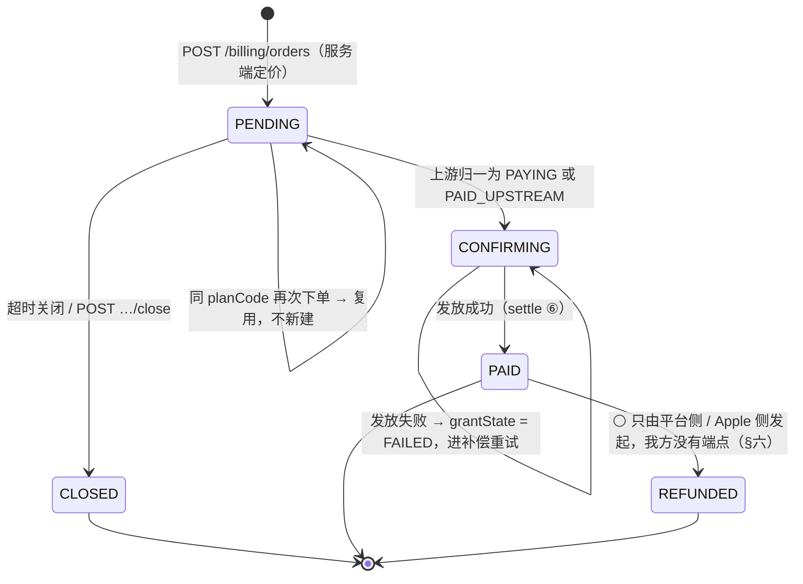

<!-- 受众=后端开发组(M7 执行人)+ stage 3 总装人 | 篇幅上限=1100 行 / 4.5 万字 | 深度档位=详设 | 代码 0 行 -->

> **基线**：`origin/v1` @ `81a2c23`，fetch 于 2026-09-03。代码侧取证全部实读该基线，行号即该基线的行号。
>
> **前提取 `B0-平台底座与横切契约`（KUBI-97，分支 `KUBI-97-后端B0底座` @ `20b69f8`）的十条结论，本文一条都不重定。**
> 与 `B0` 冲突时以 `B0` 为准并在 §十二 登记；与 `接口契约-签名与错误码全集`（下称 `接口契约`）冲突时以契约为准。
>
> **本轮代码 0 行。** 下面出现的所有类名、方法签名、配置键都是**待实现的目标形态**；现状一律另起一行标「现状」并给出文件与行号。
>
> **本文不定价、不定次数、不定阈值。** 数字的真源是 `商业化与额度设计` §一；本文只定**形状**（字段在不在、类型是什么、缺失时退到哪一档）。
> 要合进 `接口契约` 的原文写在 §十三 `§契约增量`，**本轮不改那份文件一个字**。

## 一、七条结论速查

**每一条都配一条可跑判据。判据跑不了的结论不算结论。** 红着的判据如实标红，不写成已完成。

| # | 题目 | 结论（一句话） | 判据 | 今天 |
|---|---|---|---|---|
| 1 | **额度账本** | 一次扣减 = 一次原子写：条件更新 `used < granted` + 写一行调用流水（唯一键）。`remaining` 是派生值，**结构上取不到负数** | 并发测试：`granted=10`、50 线程各扣 1 → 成功恰好 10 次、`used==10`、流水恰好 10 行（§2.6） | 🔴 待建 |
| 2 | **三条路一次幂等写入** | 回调 / 主动查单 / 定时补偿三条路进**同一个** `settle()`；上游态先归一，再撞 `transactionId` 唯一键 | `grep` 全仓「推进订单到 PAID」的写点只有一处（§3.5） | 🔴 待建 |
| 3 | **订单状态机** | 五个态、三个终态；`grantState` 三值只在 `CONFIRMING` 出现；**不设保留期**（形状补，天数不补） | store 接口上没有 `purge`/`deleteBefore`/`retainedDays`（§4.6） | 🔴 待建 |
| 4 | **档位三字段与通道** | `billingPeriod` / `badge` 可选、`autoRenew` 恒 `false`；通道三值含 `apple_iap`，**支付宝不加** | 通道枚举 `values().length == 3`，且不含 `alipay`（§5.4） | 🔴 待建 |
| 5 | **退款** | 只做死两条：**同一笔只处理一次** + **额度不许为负**。A/B/C 三种写法原样搬进本文，**由律师稿定，技术侧不选** | 商业化两个包下 `refund`/`退款` 零命中（§6.5） | ✅ 空扫为 0，如实标注 |
| 6 | **`GET /billing/plans` 要令牌** | 它不在白名单七行里，走默认档 `scope=full`。**这是一次只改文档不改代码的裁定** | 白名单常量里没有 `billing/plans`（§7.2） | 🔴 待建（白名单本身归 `B0-4`） |
| 7 | **商业化不进 `domain`** | 全部落 `app`，不新建第五个模块；**开票不补** | `grep -rn 'billing\|[Qq]uota' server/kaodian-domain/…/main/java` 期望 0 —— **今天不是 0**（§11.3） | 🔴 **红**：`TouchKind.java:41,59` |

🔴 **七条里没有一条是「待定」。** 需要人拍板的三处写在 §十四，指了名、指了时点，**且都不拦本模块开工**。

---

## 二、额度账本：一次扣减是一次原子写

### 2.1 口径（冻结，本文不重开）

| 口径 | 出处 |
|---|---|
| 额度**只计外部模型调用**；记录动作不经额度 | `U7.1` §2.1 · `接口契约` §6.7.2 |
| 额度耗尽时**记录照样落库**，只是不打标，落 `TS-06` 待补 | `U7.2` §2.6 · `接口契约` §6.7.2 约束 4 |
| 两个池子：`ai_capture`（语音转写 + 图片识别打标）、`ai_ask`（AI 代发提问）。**互不借用** | `U7.1` §2.3 · `技术架构与接口契约` §5.5.2 |
| 自然月重置，不按购买日滚动 | `U7.1` §2.4 |
| 🔴 **扣减没有端点** | `接口契约` §6.7.1：有端点客户端就能只调不扣、或只扣不调 |
| 🔴 **额度不许为负**：条件更新，受影响 0 行即视为耗尽 | 冻结口径 2 · `接口契约` §8.8 约束 2 |

⚠️ **一次操作扣几次，`U7.1` §2.5 已经逐格写死，本文不改一格**：成功扣 1、失败扣 0、同幂等键重试扣 0、离线补传重发扣 0、识别成功但「没对上」扣 1、结果被丢弃扣 1 不退还。
🔴 **因为失败根本不扣，所以账本里没有「退还」这个动作，也没有一个能把 `used` 减回去的方法**（§2.4 的接口上找不到它）。

### 2.2 两个实体（字段清单 + Java 类型，🔴 不写 DDL）

**`B0-1` 已裁定：本轮交付 store 接口，不交付 `CREATE TABLE`。** 下面给的是字段与类型、唯一性说成什么组合唯一、哪几次写必须原子。

```java
// kaodian-app · com.kaodian.server.billing
public record QuotaPeriod(
        long      userId,      // B0-2：long，起始 10001，0 不是合法值
        String    periodYm,    // "2026-09"，自然月，见 §2.5 的时区裁定
        QuotaType quotaType,   // 闭集两值，见下
        int       granted,     // 发放时写进这一行的数字，不是编译期常量
        int       used         // 🔴 不变式：0 <= used <= granted（由 §2.3 的条件更新保证）
) {}

public enum QuotaType { AI_CAPTURE, AI_ASK }   // JSON 里是 "ai_capture" / "ai_ask"

public record AiCallLog(
        long      id,
        long      userId,
        QuotaType quotaType,
        String    endpoint,        // 扣减发生在哪个端点内部，见唯一键
        String    idempotencyKey,
        String    provider,
        String    model,
        CallStatus status,         // SUCCESS / FAILED
        int       latencyMs,
        long      costMicro,       // 整数微元，记账用
        Instant   createdAt
) {}
```

| 组合唯一 | 防的是 |
|---|---|
| `QuotaPeriod`：`(userId, periodYm, quotaType)` | 同一人同一月同一类只有一行 |
| `AiCallLog`：**`(userId, endpoint, idempotencyKey)`** | 同一次调用只扣一次。⚠️ **不是单列 `idempotency_key` 唯一**，理由见 §2.7 |

🔴 **两个实体里都没有 prompt、没有答案、没有图片、没有 `nodeCode`。** 红线 4（库里不存在能装下题干的字段）与红线 5（原图不上云）在这一层的形态就是「本来就没有能装的地方」——
`NoStemFieldTest` 与 `ImageRetentionTest` 反射扫到这两个 record 时应当零命中，**不需要为它们加例外**。
`costMicro` 是记账不是内容（`技术架构与接口契约` §5.5.2 已写死）。

### 2.3 store 接口：扣减是一个方法，不是三次调用

```java
// kaodian-app · com.kaodian.server.billing.QuotaStore
public interface QuotaStore {

    Optional<QuotaPeriod> find(long userId, String periodYm, QuotaType type);

    /**
     * 发放/抬档。已存在则把 granted 抬到 max(旧, 新)，🔴 used 一格不动。
     * 到账时按新档位重发本周期额度（U7.6 §2.6）走的就是这一条。
     */
    QuotaPeriod grant(long userId, String periodYm, QuotaType type, int granted);

    /** 🔴 一次原子写。三步要么全成、要么全不成，见下表。 */
    ConsumeResult consume(long userId, String periodYm, QuotaType type, AiCallLog call);

    /** 失败调用只留流水、不动 used。返回的行允许被后来的一次成功覆盖（§2.7）。 */
    void recordFailure(AiCallLog failedCall);
}

sealed interface ConsumeResult permits Consumed, Replayed, Exhausted {
    record Consumed(int remaining) implements ConsumeResult {}
    record Replayed(AiCallLog previous) implements ConsumeResult {}   // 同键上次已成功
    record Exhausted(int granted, int used) implements ConsumeResult {}
}
```

**`consume` 内部的三步，同一个事务 / 同一把写锁：**

| 步 | 动作 | 不满足时 |
|---|---|---|
| ① | 按 `(userId, endpoint, idempotencyKey)` 落 `AiCallLog` | 撞唯一键且旧行 `status=SUCCESS` → **整体回滚，返回 `Replayed`，不扣** |
| | | 撞唯一键且旧行 `status=FAILED` → **就地覆盖那一行**（`接口契约` §1.5：上次失败允许重试） |
| ② | `used = used + 1` **且带条件 `used < granted`** | 受影响 0 行 → **整体回滚，返回 `Exhausted`，不扣、不留流水** |
| ③ | 提交 | —— |

🔴 **`used` 的更新永远带 `AND used < granted`，绝不「先查再写」。** 先查再写在两端并发时会各自读到「还有」，然后各自加一 —— 那正是 `U7.1` §2.5 最后一行「两端并发用光 → 不会扣穿」要挡的东西。

🔴 **`ConsumeResult` 是密封接口，不是一个 `boolean`。** 三种结果在界面上是三句不同的话（`U7.2` §2.6：耗尽 / 重试不重复扣 / 正常扣一次），一个 `boolean` 表达不了「重放」这一档，而重放被当成成功扣一次的后果，是一次断网重连把用户的额度扣光。

### 2.4 接口上找不到的三个方法，各自是一条红线

| 找不到的 | 为什么不能有 |
|---|---|
| `refund(...)` / `restore(...)` / 任何让 `used` 变小的方法 | 失败根本不扣，所以没有「退还」这个动作（`U7.1` §2.5）。有这个方法，界面上迟早长出「额度退还中」这一态 |
| `setUsed(...)` / `setRemaining(...)` | 只要能直接写 `used`，`used <= granted` 这条不变式就不再由结构保证，而是由「记得带条件」保证 |
| `deductWithoutCall(...)` | 扣减只发生在 AI 端点内部、外部调用成功之后（`接口契约` §6.7.1）。一个不带流水的扣减方法就是那个不该存在的扣减端点的内部版本 |

### 2.5 🔴 裁定：自然月边界用 `Asia/Shanghai`，且一次调用只算一次

**`U7.1` §五 缺口 1 把这一格明写给「技术同事」：跨月零点那一秒的扣减归哪个月。裁定如下。**

| 项 | 裁定 |
|---|---|
| 时区 | **`Asia/Shanghai`，落成配置项 `kaodian.billing.zone`，默认 `Asia/Shanghai`** |
| 依据 | 仓库里已有先例：`FileSmsRateLimiter` 的日限计数就是按 `ZoneId.of("Asia/Shanghai")` 切天（装配处见 `AuthApiTest.java:237`）。**再引入第二个时区口径，就会出现「短信日限已经跨天、额度还没跨月」这种没人能解释的组合** |
| 算几次 | 🔴 **`periodYm` 在一次 `consume` 的最外层算一次，作为参数一路传下去。** 不许在 store 内部再算一次 —— 00:00:00 前后各算一次会落到两行上，而那正好是「扣了两个月各一次」 |
| 前端 | 不参与。周期标识由服务端返回，端只显示（`U7.1` §2.4，已冻结） |

```bash
# 判据：额度这条路上没有第二个时区口径，也没有不带时区的「今天」
grep -rn 'LocalDate.now()\|LocalDateTime.now()\|ZoneId.systemDefault' \
     server/kaodian-app/src/main/java/com/kaodian/server/billing/     # 期望 0 命中
grep -rn 'ZoneId.of(' server/kaodian-app/src/main/java/com/kaodian/server/billing/  # 期望 0：时区从配置来，不写字面量
```

### 2.6 并发下的正确性论证 + 一个能跑的判据

**要证的只有一句：任何交错顺序下，`used` 都不会超过 `granted`，因而 `remaining` 取不到负数。**

1. `used` 的**唯一**增长路径是 §2.3 的第 ② 步，且它是一次带条件的更新。
2. 条件更新在同一行上由存储层串行化（JDBC 态：行锁；文件态：`consume` 整体在同一把写锁内，与 `TouchStore.append` 的「查 + 写在自己的写锁里完成」同一形态）。
3. 于是每一次成功的 ② 都能看到之前所有成功的 ②，`used` 严格递增 1，且执行前满足 `used < granted` ⇒ 执行后满足 `used <= granted`。
4. 第 `granted+1` 次到达时前置条件不成立 → 受影响 0 行 → 整体回滚 → `Exhausted`。**不产生第 `granted+1` 行流水。**
5. `remaining` 从不是一个存储列，它是 `max(granted - used, 0)`（§8.3）。由 3 得 `granted - used >= 0`，**扣减路径上那个 `max` 永远不生效**。

⚠️ **一条要认下来的代价，不含糊过去**：外部模型调用发生在 ② 之前（`接口契约` §6.7.1 的时序：失败不扣，所以必须先调后扣）。
于是**极端并发下可能出现「外部账单已产生、②扣不进去」**：两端同时在 `used == granted - 1` 时通过预检、各自调了一次模型，第二次扣减撞回滚。
**这一次的成本我方自己承担**，界面按耗尽处置（`U7.2` §2.5 第 9 行「中途被另一端用光 → 就地转受限态，未扣额度」逐字如此）。
🔴 **不许为了消掉这一格而改成「先扣后调」** —— 那会让每一次模型调用失败都变成一次替自己的故障收费，而那是 `接口契约` §6.7.2 约束 1 明令禁止的。

```java
// 判据（🔴 红线 2 的落点，B0 §11.2 把它归给本模块）
// kaodian-app/src/test/java/com/kaodian/server/billing/QuotaLedgerConcurrencyTest.java
@Test void 五十个线程同时扣一次_成功次数恰好等于发放数且余量不为负() throws Exception {
    store.grant(10001L, "2026-09", AI_CAPTURE, 10);
    var ok = new AtomicInteger();
    runConcurrently(50, i -> {
        var r = store.consume(10001L, "2026-09", AI_CAPTURE, callWithKey("k-" + i));
        if (r instanceof Consumed) ok.incrementAndGet();
    });
    assertThat(ok.get()).isEqualTo(10);                             // 不多发
    var p = store.find(10001L, "2026-09", AI_CAPTURE).orElseThrow();
    assertThat(p.used()).isEqualTo(10);                             // 不扣穿
    assertThat(p.granted() - p.used()).isGreaterThanOrEqualTo(0);   // 🔴 不为负
    assertThat(callLogStore.countByUser(10001L)).isEqualTo(10);     // 账单与扣减一一对应
}

@Test void 同一幂等键重放不重复扣() {
    store.grant(10001L, "2026-09", AI_ASK, 5);
    store.consume(10001L, "2026-09", AI_ASK, callWithKey("same"));
    var second = store.consume(10001L, "2026-09", AI_ASK, callWithKey("same"));
    assertThat(second).isInstanceOf(Replayed.class);
    assertThat(store.find(10001L, "2026-09", AI_ASK).orElseThrow().used()).isEqualTo(1);
}
```

🔴 **这条判据必须先红过一次才算数**（CLAUDE.md）：把 ② 的条件去掉改成先查后写，上面第一个用例应当变红（成功次数 > 10）。**红过再改回来。**

### 2.7 唯一键为什么是三列，不是 `idempotency_key` 一列

**现状：`技术架构与接口契约` §5.5.2 把 `ai_call_log.idempotency_key` 写成单列唯一键。本文改成 `(userId, endpoint, idempotencyKey)`，理由是一个能复现的错。**

`接口契约` §6.7.2 约束 2 明写：「客户端可复用 `record_event.client_token`」。
于是同一条记录先走 `POST /records/{id}/audio`（语音转写）、再走 `POST /records/{id}/tags/suggest`（闭集分类）时，**两次外部调用带着同一个 `clientToken`**。

| 唯一键 | 第二次调用的结果 |
|---|---|
| 单列 `idempotency_key` | 撞唯一键 → 被当成重放 → 🔴 **不扣额度，而且返回了第一次的转写结果** —— 用户拿到一个牛头不对马嘴的答案，账单却真实发生了 |
| **`(userId, endpoint, idempotencyKey)`** | 两个 `endpoint` 不同 → 两行 → 各扣一次，各返回各自的结果 |

🔴 **这三列与 `B0` §7.3 的 `IdempotencyGuard` 锚定键 `(userId, path, Idempotency-Key)` 是同一个概念，不是第二套。**
`IdempotencyGuard` 是第一道（命中就返回上次结果，请求根本不进业务）；`AiCallLog` 的唯一键是兜底（守卫失效或并发穿透时撞唯一键）。
**两道并存不冲突**，与订单侧 `Idempotency-Key` + `outTradeNo`/`transactionId` 是同一个分层（`接口契约` §1.5）。

### 2.8 🔴 关卡数字与额度物理隔离（`R-37` 的防线）

**`U7.2` §2.2 已经把这条从纪律变成结构事实。本文的活是给它一条能跑的判据。**

| 关卡要的那个数 | 经不经过额度 |
|---|---|
| 「今天记了几条」 | **不经过** —— 记录动作不调外部模型 |
| 「主动查看盲区的人数」 | **不经过** —— 差集是一次计算 |
| 「点进去看的比例」 | **不经过** —— 盲区诊断永不上锁 |

```bash
# 判据 ①（结构层）：差集与时间线这条路上取不到额度类型
grep -rn 'billing\|[Qq]uota' server/kaodian-domain/src/main/java   # 期望 0 —— 🔴 今天不是 0，见 §11.3
```

```java
// 判据 ②（行为层）：两类余量都为 0 时，关卡的三个动作一步不少
@Test void 额度为零时记录看盲区导出三步全通() throws Exception {
    store.grant(u, ym, AI_CAPTURE, 0);
    store.grant(u, ym, AI_ASK, 0);
    mvc.perform(post("/api/v1/records").content(manualTouch())).andExpect(status().isCreated());
    mvc.perform(get("/api/v1/coverage/summary")).andExpect(status().isOk());
    mvc.perform(get("/api/v1/export")).andExpect(status().isOk());
}
```

**判据 ② 是 `U7.2` §四 那条「走『记一条 → 看盲区 → 导出』三步全部走通」的服务端一半。** 界面那一半（过程中没有任何一屏出现付费入口）不在后端，本文不认领。

---

## 三、订单：三条路，一次幂等写入

### 3.1 三条路各是什么

**真源 `后端系统设计与组件接入` §1.10 与 `U7.4` §2.2，本文只补落点与归一。**

| 路 | 触发 | 落点 |
|---|---|---|
| 一 · 回调 | `POST /billing/notify/wxpay` | 🔴 **不走应用鉴权链路，独立验签**（§7.3） |
| 二 · 主动查单 | `GET /billing/orders/{outTradeNo}` | 端拿到支付结果后**立即查一次**，之后按 `U7.4` §2.4 的固定间隔轮询 |
| 三 · 定时补偿 | 服务端扫 `state ∈ {PENDING, CONFIRMING}` 且早于阈值的单 | 独立于客户端是否在线 |

🔴 **三条路不各写一段发放代码，全部收敛到一个方法：**

```java
// kaodian-app · com.kaodian.server.billing.PaymentSettleService
/** 🔴 全仓唯一一处能把订单推进到 PAID 的地方。三条路都调它，参数只差 UpstreamState 从哪来。 */
SettleResult settle(String outTradeNo, UpstreamState upstream);
```

### 3.2 先把上游态归一，再谈发放

**三条路拿到的都是支付平台的原始状态，形状各不相同。归一表放在一处，`settle` 只认归一后的枚举。**

| 上游（微信 `trade_state`） | 归一为 | 我方动作 |
|---|---|---|
| `SUCCESS` | `PAID_UPSTREAM` | 校金额 → 发放（§3.3） |
| `USERPAYING` | `PAYING` | `state = CONFIRMING`，`grantState = NOT_STARTED` |
| `NOTPAY` | `NOT_PAID` | **不动**（订单留在 `PENDING`） |
| `CLOSED` / `REVOKED` | `CLOSED_UPSTREAM` | `state = CLOSED` |
| `PAYERROR` | `NOT_PAID` | **不动**。「支付失败」是端本地态（`接口契约` §8.6.2 那两行 🔵 之一） |
| `REFUND` | `REFUNDED_UPSTREAM` | `state = REFUNDED`（§6.4：平台侧发起，我方无端点） |
| **其它 / 未识别** | `UNKNOWN` | 🔴 **不动 + 告警。** 与端「未知 `state` 按确认中处置，不猜成功也不猜失败」（`接口契约` §8.6）同构 |

Apple 内购走同一张表：收据校验通过 → `PAID_UPSTREAM`；收据无效 → `UNKNOWN`（不是 `NOT_PAID` —— 它不说明这笔没付）；网络/上游错误 → **根本不调 `settle`**（§4.5）。

🔴 **归一表是一处，不是每条路各写一份。** 三条路各自映射会分叉，而分叉的方向一定是「其中一条把 `UNKNOWN` 当成了 `NOT_PAID`」—— 那一刻订单会被关掉，而钱在我方。

### 3.3 `settle` 的六步，与它们各自的幂等锚点

| 步 | 动作 | 幂等锚点 / 失败落点 |
|---|---|---|
| ① | 载入订单；**已是终态（`PAID`/`CLOSED`/`REFUNDED`）→ 立即返回，什么都不做** | 三条路重复到达时最先撞上的那一道 |
| ② | 🔴 **校金额**：与 `order.amountFen` 不符 → **拒绝 + 告警 + 不发放，订单不推进** | `U7.4` §2.2：回调是外部输入，金额校验是最后一道 |
| ③ | 写 `transactionId`（**唯一键**）。撞唯一键 → **视为已处理，返回成功但不重复发放** | 自然键，`接口契约` §1.5 |
| ④ | `state = CONFIRMING`，`grantState = IN_PROGRESS` | 收款已确认、发放进行中 |
| ⑤ | **同一次原子写**：`user_subscription.expiresAt` 延长 + `QuotaStore.grant(...)` 抬到新档位 | 见下 |
| ⑥ | `state = PAID`，`paidAt`，🔴 **`grantState` 整个字段清除** | `接口契约` §8.6.1：`PAID` 本身就说明发放完成 |

**⑤ 失败时**：`grantState = FAILED`，`state` 停在 `CONFIRMING`，🔴 **告警 + 进补偿重试**（`接口契约` §8.6.1）。
🔴 **`IN_PROGRESS` 与 `FAILED` 在服务端必须是两种情况**，合并的后果是一笔已经失败过的发放一直穿着「正在到账」这件衣服（`U7.6` §2.2）。

**⑤ 为什么必须原子**：续费的语义是「延长到期日的**同时**按新档位重发本周期额度」（`U7.6` §2.6）。
两次写分开，中间挂掉就会出现「会员期延长了、额度还是免费档」——而这个状态没有任何一条路径会发现它，因为订单已经是 `PAID`。

**续费不新建订阅行**：`user_subscription` 唯一索引建在 `userId` 上，续费 = 延长 `expiresAt`，历史在 `payment_order` 里（`技术架构与接口契约` §5.5.2，本文照抄）。

**下一个自然月的额度从哪来**：`QuotaPeriod` 那一行**首次被使用时按当时的有效订阅档位懒发放**，不做月初批量任务。
于是 `U7.6` §2.6 那一格「会员已过期但当月额度尚未重置」就是结构事实：**这一行的 `granted` 是当初发的那个数，不因订阅到期而回落**，界面按服务端返回显示，前端不推算。

### 3.4 下单侧的幂等：同档位复用，不新建

| 情形 | 处置 |
|---|---|
| 同一 `userId` + 同一 `planCode` 已有 `PENDING` 的单 | 🔴 **复用那一笔**，返回同一个 `outTradeNo` + 重新拉取的调起参数。**不新建** |
| 同一 `userId` + 同一 `planCode` 已有 `CONFIRMING` 的单 | `409 IN_PROGRESS` —— 上一笔还在确认中，`U7.6` 已定「确认中不给重新支付」 |
| 带同一个 `Idempotency-Key` 重放 | `IdempotencyGuard` 返回上次结果（`B0` §7.3），🔴 不产生第二笔 |
| 连点两次、两个不同的 `Idempotency-Key` | 落到第一行「同档位复用」，**最多一笔待支付**（`U7.4` §2.5） |

🔴 **`outTradeNo` 由服务端生成，端不参与。** 它同时是路径参数（`close` / `receipt/verify`）与自然键；让端生成等于把幂等的锚点交给端。

### 3.5 判据

```bash
# ① 全仓只有一处能把订单推进到 PAID
grep -rn 'OrderState.PAID' server/kaodian-app/src/main/java | grep -v '/dto/\|Test'
#    期望：只出现在 PaymentSettleService 里（DTO 的映射与测试不算）

# ② 归一表只有一份
grep -rn 'USERPAYING\|NOTPAY\|trade_state' server/kaodian-app/src/main/java
#    期望：全部命中集中在一个文件（UpstreamState 的映射处）

# ③ 端不能自己造订单号
grep -rn 'outTradeNo' server/kaodian-app/src/main/java/com/kaodian/server/api/billing/dto/*Request*.java
#    期望 0 命中 —— 请求体里没有这个字段
```

```java
// ④ 三条路各到达一次，权益只发一次 —— 本节的核心判据
@Test void 回调与查单与补偿三条路各到一次_只发放一次() {
    var no = orders.create(u, "plus", WX_JSAPI).outTradeNo();
    var up = new UpstreamState(PAID_UPSTREAM, 990, "wx-tx-1");
    settle.settle(no, up);   // 路一 · 回调
    settle.settle(no, up);   // 路二 · 主动查单
    settle.settle(no, up);   // 路三 · 定时补偿
    assertThat(subscriptions.find(u).orElseThrow().expiresAt())
            .isEqualTo(oneMonthAfter(start));                    // 🔴 不是三个月
    assertThat(quota.find(u, ym, AI_CAPTURE).orElseThrow().granted())
            .isEqualTo(plusCapture);                             // 🔴 不是三倍
}

@Test void 金额不符时拒绝并且不发放() {
    var no = orders.create(u, "plus", WX_JSAPI).outTradeNo();
    settle.settle(no, new UpstreamState(PAID_UPSTREAM, 1, "wx-tx-2"));
    assertThat(orders.find(no).orElseThrow().state()).isNotEqualTo(PAID);
    assertThat(subscriptions.find(u)).isEmpty();
}
```

---

## 四、订单状态机全集、保留期限、主动关单、收据校验

### 4.1 五个态、三个终态



| `state` | 终态 | `grantState` 出不出现 |
|---|---|---|
| `PENDING` | 否 | ❌ |
| `CONFIRMING` | 否 | ✅ **三值必出现**：`NOT_STARTED` / `IN_PROGRESS` / `FAILED` |
| `PAID` | ✅ | ❌ |
| `CLOSED` | ✅ | ❌ |
| `REFUNDED` | ✅ | ❌ |

🔴 **`grantState` 只在 `CONFIRMING` 时出现，其余四态整个 key 不存在**（`接口契约` §8.6.1 + §1.1 空值规则）。
落法：DTO 上 `@JsonInclude(NON_NULL)`，`state != CONFIRMING` 时置 `null`。**不是返回 `"grantState": null`。**

🔴 **`CONFIRMING → CLOSED` 这条边不存在。** 钱可能已在我方，关掉它就是把一笔已付款的单变成不可查。超时关闭只对 `PENDING` 生效（§4.4）。

### 4.2 九个界面态里，服务端这一侧要守的两条

**`接口契约` §8.6.2 已经给了完整映射，本文不重画，只补执行约束：**

| 约束 | 落法 |
|---|---|
| 「支付失败」与「已取消」是端本地态，**服务端不给字段** | 🔴 `payment_order` 上**没有** `closeReason`、**没有** `lastPayFailedAt`。加它们的条件是「用户隔一天回来看仍然需要看到这个区别」（`接口契约` §8.6.2），今天不成立 |
| 未识别的 `state` 端按 `CONFIRMING` 处置 | 服务端这一侧对应 §3.2 那行 `UNKNOWN` → 不动 + 告警。**两边都不猜** |

### 4.3 保留期限：形状补，天数不补

**`接口契约` §8.6 已裁定「不设保留期」（缺口 22，`G-9` 关闭）。本文把它落成 store 接口上的一个空缺：**

```java
public interface PaymentOrderStore {
    Optional<PaymentOrder> findByOutTradeNo(String outTradeNo);
    Page<PaymentOrder>     findByUser(long userId, Cursor cursor, int limit);   // 倒序
    PaymentOrder           save(PaymentOrder order);
    // 🔴 没有 purge(...)、没有 deleteBefore(...)、没有总量上限检查
}
```

```bash
# 判据：保留策略在结构上不存在
grep -rn 'purge\|deleteBefore\|retainedDays\|retentionDays\|maxOrders' \
     server/kaodian-app/src/main/java/com/kaodian/server/billing/    # 期望 0 命中
```

**界面翻到底说「没有更多」—— 而这句话是真的**（`接口契约` §8.6）。加一条保留策略才需要重开 `G-9`。

### 4.4 主动关单 `POST /billing/orders/{outTradeNo}/close`

| 情形 | HTTP | `code` |
|---|---|---|
| `PENDING` → 关闭成功 | `200` | —— |
| 本来就是 `CLOSED` | `200` | ——（幂等） |
| `PAID` / `REFUNDED` | `409` | `ORDER_ALREADY_PAID` |
| **`CONFIRMING`** | `409` | 🆕 `ORDER_NOT_CLOSEABLE` |
| 不存在 / 不属于本人 | `404` | `ORDER_NOT_FOUND` |

🔴 **`CONFIRMING` 那一档 `接口契约` §8.4 没有给码，本文补一个而不是复用 `ORDER_ALREADY_PAID`。**
判据是 §1.3 那条：两个端会不会对同一个 `code` 写出不同的用户文案？会 —— 「这一笔已经支付」与「这一笔还在确认中，不能关」是两句话，而后者接着的动作是「再查一次」不是「去看详情」。**合并就等于让端自己编一句话去解释它。**

🔴 **「不属于本人」返回 `404` 不是 `403`。** 订单号是可枚举的，`403` 等于确认「这个号存在」。这与 `接口契约` §6.8 给 agent 会话定的「不属本人 → `403` 不是 `404`」方向相反，**理由也相反**：会话 id 是不可枚举的随机串，而 `outTradeNo` 带商户前缀与时间戳。⚠️ 这一处差异登记在 §十三 增量 4，请 stage 3 一并看过。

**界面上仍然不弹「确定放弃购买吗」** —— 关单是返回动作的副产物，不是一次挽留（`U7.4` §6.1 ※1）。

### 4.5 收据校验 `POST /billing/orders/{outTradeNo}/receipt/verify`

| 档 | HTTP | `code` | 之后 |
|---|---|---|---|
| 校验通过 | `200` | —— | 归一为 `PAID_UPSTREAM` → 走 §3.3 的 `settle` |
| 收据无效 | `422` | `RECEIPT_INVALID` | 归一为 `UNKNOWN` → **订单不动**。端只说「没能确认」，🔴 不说「失败」 |
| 网络 / 上游错误 | `502` / `504` | `SERVER_ERROR` | 🔴 **不调 `settle`**，订单不动。端主按钮 = 再试一次 |

🔴 **`422` 与 `5xx` 必须分得开，而这条要求靠 HTTP 状态分类就满足了，不需要额外约定**（`接口契约` §8.5 原文）。
🔴 **幂等锚点与其它通道共用一套**：`transactionId` 唯一键 + `Idempotency-Key`，只发放一次（`U7.5` §三）。
Apple 侧的交易号与微信的落在**同一列同一唯一键**上 —— 两条通道共用一个锚点，不是两个。

**未完成事务的接续是静默的**（`U7.5` §2.4）：端进屏时把待校验的收据直接打过来，服务端按 `Idempotency-Key` 幂等，**没有任何一个「接续」端点**。

### 4.6 判据

```bash
# ① grantState 只在 CONFIRMING 出现
grep -n 'grantState' \
  server/kaodian-app/src/main/java/com/kaodian/server/api/billing/dto/OrderDetailResponse.java
#    期望：字段上带 @JsonInclude(NON_NULL)

# ② 没有代扣字段 —— 结构上不可能发生自动扣款
grep -rn 'contractId\|nextChargeAt\|autoRenewEnabled\|subscription_contract' \
     server/kaodian-app/src/main/java                        # 期望 0 命中

# ③ 开票不补：只占端点位，不给签名不给字段
grep -rni 'invoice\|开票\|发票' server/kaodian-app/src/main/java    # 期望 0 命中
```

```java
// ④ CONFIRMING 关不掉
@Test void 确认中的订单关不掉() throws Exception {
    var no = givenOrderIn(CONFIRMING);
    mvc.perform(post("/api/v1/billing/orders/" + no + "/close").header("Idempotency-Key", uuid()))
       .andExpect(status().isConflict())
       .andExpect(jsonPath("$.code").value("ORDER_NOT_CLOSEABLE"));
}
```

---

## 五、档位、通道与订阅

### 5.1 `GET /billing/plans` 的三个字段（缺口 16 / 17，形状见 `接口契约` §8.2）

| 字段 | 类型 | 必填 | 服务端这一侧的落法 |
|---|---|---|---|
| `billingPeriod` | `"month"` \| `"year"` | — | 从定价配置读；**配置里没写就整个 key 不出现**，不填 `null` |
| `badge` | `string` | — | 🔴 **是文字，不是一个布尔 `recommended`。** 布尔会逼端自己编一句文案，而那句文案要朗读得出来（`U7.3` §2.5） |
| `autoRenew` | `bool` | ✅ | 🔴 **恒 `false`，落成常量不是配置项。** 配置项意味着有人能改它，而改它需要的平台资质根本不存在（`商业化与额度设计` §6.3） |
| `plans` | `array` | ✅ | 数组，加档时前端不改 |
| `purchasable` | `bool` | ✅ | 由定价配置给；`free` 恒 `false` |
| `quota` | `object` | ✅ | 键是 `QuotaType` 的两个值，**与 `GET /quota` 同一套键名**（§8.3） |

🔴 **`originalPriceFen` 之类的锚点字段与任何「别端价格」字段不存在，也不许加**（`接口契约` §8.2）。
判据：`grep -rn 'originalPrice\|listPrice\|priceFor(' server/kaodian-app/src/main/java` 期望 0。

**定价从哪来**：一个配置源（`kaodian.billing.plans.*`），**不是编译期枚举**。`接口契约` §6.6 已写死「校验依据是服务端 `plans` 列表，不是写死在代码里的枚举」——
判据：`grep -rn '"plus"\|"free"' server/kaodian-app/src/main/java` 期望只命中配置绑定类与测试，**不出现在 `if` 分支里**。

### 5.2 `GET /billing/channels`：三个取值，本文不加第四个

| 取值 | 用在哪 |
|---|---|
| `wx_jsapi` | 小程序 / 公众号内 |
| `wx_virtual_ios` | iOS 上的微信虚拟支付 |
| `apple_iap` | Apple 内购 |

🚫 **支付宝不加。** `Q-8` / `U7.4` 缺口 4 是「做不做」还没裁定，**而一个取值加进枚举就等于替它答了「做」**（`接口契约` §8.3）。

| 情形 | 契约 |
|---|---|
| 该端全部不可用 | `channels: []`。界面只显示免费兜底 + 一句「这个端上不能买」，🔴 不给任何指向别处付款的出口 |
| 拉不到 | 🔴 端不渲染那一格，不自己编、也不按端硬编码 |
| 🔴 不做 | 这个端点**不返回任何其它能力位** —— 那会长成 `U6.2` 禁止的可下发端矩阵 |

**服务端怎么决定「这一端可用哪些」**：按请求头里的端标识 + 配置里的开通状态取交集。🔴 **不做「按 userId 灰度」** —— 那是一个能悄悄改的产品边界。

```bash
grep -rn 'alipay\|ALIPAY\|支付宝' server/kaodian-app/src/main/java     # 期望 0 命中
```
```java
@Test void 通道枚举恰好三个() { assertThat(Channel.values()).hasSize(3); }
```

### 5.3 `GET /billing/subscription` 的 `pendingOrders`

**`接口契约` §8.9 已定形状，本文补服务端的取数口径：**

| 项 | 落法 |
|---|---|
| 取哪些 | `state ∈ {PENDING, CONFIRMING}` 的单，按 `createdAt` 倒序 |
| 一笔都没有 | 🔴 **整个 key 不出现**，不是空数组（§1.1） |
| 为什么是数组 | 今天实际长度恒为 0 或 1（同档位复用，§3.4）；写成对象的话，重开第二个付费档那天这里就是一次契约变更 |
| `expiresAt` 为空 | 表示免费档，界面那一行整行不渲染（`U7.6` §2.6）。🔴 **不返回「永久有效」这类字符串** |

⚠️ **`user_subscription` 上不建 `status` 列，与 `技术架构与接口契约` §5.5.2 的字段清单有一处出入。**
理由：`status` 与 `expiresAt` 表达同一件事，而它需要一个定时任务把「到期」写进去才准 —— **没有那个任务它就是一个会静默过期的第二真源**。
派生：`active = expiresAt != null && expiresAt.isAfter(now)`。登记在 §十三 增量 5。

### 5.4 判据

```bash
grep -rn 'autoRenew' server/kaodian-app/src/main/java   # 期望：只有一处赋值，且右边是字面 false
```

---

## 六、退款：本轮只把与政策无关的两条做死

### 6.1 契约侧：一个端点都不补

**`接口契约` §8.8 的裁定原样执行，技术侧不发明：**

> 一个 `POST /billing/orders/{id}/refund` 端点，会让「退款之后额度和权益怎么算」被这个端点的实现定义。
> 而那条规则在整个文档集里没有任何一处写过。🔴 **有契约没规则，比没契约更糟** —— 没契约时缺口是可见的，有契约时它变成了一个没人认的既成事实。

`REFUNDED` 保留在取值域里（平台侧或 Apple 侧可能自己发起，订单必须能显示这个事实），**但没有任何一个我方端点能把订单推进到这个态**。

### 6.2 三种写法与它们的后果（原样搬进，本文不选）

| | 写法 | 后果 |
|---|---|---|
| **A** | 额度立刻收回到免费档 | 已用可能超过免费上限（已用 47 > 免费 30）→ **`used > granted`**，库里出现 `remaining = -17`。⚠️ **这是覆盖率之外第二个会算出负数的地方**，后面每一处读额度的代码都要各自处理一次负数 |
| **B** | 本周期不动，下月起回免费档 | 最简单，已发生的不追回。**技术侧倾向这一种** |
| **C** | 按已用比例扣退款金额 | 🔴 **必须在支付页事先讲清楚，否则是事后改规则** |

| 谁来定 | 什么 |
|---|---|
| **律师稿（`L-A5`，`执行清单` 合规轨）** | A / B / C 选哪一种。规则属于用户协议，架构定不了，产品也定不了 |
| **产品** | 支付页上写什么。⚠️ 它的输入是上一行 —— 规则不定这半格写不出来；**在裁定之前一个字都不写**，而不是先写一句模糊的 |
| **技术侧（本文）** | 只有 §6.3 那两条 |

🔴 **写法 A 不许被悄悄选中。** 它是唯一一种会让库里出现负数的写法，而 §2.6 的不变式论证建立在「`granted` 只升不降」上。
**如果最终选 A，§2.3 的条件更新挡不住它** —— 因为负数不是扣出来的，是 `granted` 被下调出来的。
所以 A 一旦被选，要一起补的是「下调 `granted` 时怎么处置 `used > granted` 的行」，而那是一次契约变更，不是一次实现细节。

### 6.3 现在就能做死的两条

| # | 约束 | 落在哪 | 判据 |
|---|---|---|---|
| 1 | 🔴 **同一笔只处理一次** | `payment_order.transaction_id` 唯一键 + `Idempotency-Key`。**这条对任何一种写法都成立** | §3.5 判据 ④ 覆盖它；平台侧发起的退款同样撞这个锚点 |
| 2 | 🔴 **扣减一律条件更新，受影响 0 行即视为耗尽；退款不构成例外** | §2.3 的第 ② 步 | §2.6 的并发用例 |

🔴 **余量的最小值是 0，契约里不存在负数余量**（`接口契约` §8.8）。
落法：`remaining` 是派生值 `max(granted - used, 0)`，**不是存储列**。
⚠️ **那个 `max` 是一层可见的兜底，不是一次修复**：扣减路径上它永远不生效（§2.6 论证 5）；它唯一会生效的场景就是写法 A。
**所以它不能被当成「A 也没关系」的理由** —— 它让界面不显示负数，不让账实相符。这句话必须写下来，否则下一个人会拿它当选 A 的许可。

### 6.4 `REFUNDED` 怎么进来

| 来源 | 我方动作 |
|---|---|
| 微信侧发起（上游 `trade_state = REFUND`） | 三条路里任一条查到 → §3.2 归一为 `REFUNDED_UPSTREAM` → `state = REFUNDED`，`refundedAt` |
| Apple 侧发起 | 同上。`U7.7` §五 缺口 6 已写死：**与非 iOS 是同一个缺口，不是第二个** |
| 我方后台执行 | ⚪ **那个后台今天不存在**（`U7.7` §2.5）。落点是运营后台占位树，不是任何一条后端契约 |

🔴 **`state` 变成 `REFUNDED` 之后，额度与会员期一格不动。** 这不是一个裁定，是「A/B/C 未选」的直接后果 ——
**在规则定下来之前，不动是唯一一个不预设规则的动作。** 登记在 §十四，不写成已完成。

### 6.5 判据

```bash
grep -rni 'refund\|退款' \
     server/kaodian-app/src/main/java/com/kaodian/server/billing/ \
     server/kaodian-app/src/main/java/com/kaodian/server/api/billing/     # 期望 0 命中
```

**为什么不扫全仓**：全仓今天有 8 处命中，其中 `AuthController.java:155` 的 `f.quotaRefunded()` 是**短信频控的日限归还**（`FileSmsRateLimiter`），与商业化额度无关 —— 属**同名不同物**，其余是注释与测试断言。
🔴 **禁词表撞上同名不同物时，正确的做法是缩范围而不是加例外名单** —— 例外名单会越长，而每加一行都在削弱这条判据。
⚠️ **上面两个包今天都不存在，所以它现在是一次空扫。空扫也是 0 命中，本文如实标注这一点，不把它当成已验证。**

---

## 七、`GET /billing/plans` 与那条回调的鉴权链

### 7.1 结论：它就是要令牌

**`接口契约` §8.1 已裁定，本文执行并给判据。理由不是「未登录的人不该看价格」，是那个界面不存在**：
未登录只能看到产品说明与登录门，**没有一个未登录的用户走得到定价这一屏**（`U7.3` §2.4：枚举里没有「未登录」这一态）。
一个匿名端点服务于一个不存在的界面，它唯一的实际用途是给爬价格的人省事。

🔴 **它不在 §三 白名单七行里。** ⚠️ **2026-09-03 更正（KUBI-89 审核轮）：本行上一版写「五行」并列了一份五行清单，那份清单已作废。** 七行的全集见 `B0` §5.2 的 `WHITELIST` 常量与 `接口契约` §三（两处必须逐行一致，由 `B0` §5.5 判据 ② 判红）；`M5` 增量 1 补进的 `POST /auth/wechat/phone-login` 与 `GET /auth/wechat/authorize-url` 是**两个一直开着的口终于被数进来了**，不是新开的口。**本文不再抄这份清单** —— 上一版抄了一份，这次就过期了一次。
**「加一行」只许因为真的多了一个匿名入口而发生**，不许靠改路径前缀把入口移出统计。

### 7.2 判据

```bash
# ① 白名单里没有 billing/plans（白名单常量归 B0-4，本文只断言它不在里面）
grep -n 'billing' server/kaodian-app/src/main/java/com/kaodian/server/api/support/ApiAuthFilter.java
#    期望：只命中 notify/wxpay 一行
```
```java
// ② 无令牌打 plans → 401
@Test void 无令牌拿不到档位列表() throws Exception {
    mvc.perform(get("/api/v1/billing/plans")).andExpect(status().isUnauthorized());
}
// ③ 只读令牌打 /billing/** 与 /quota/** → 403，不论方法（锁 4）
@Test void 只读令牌在商业化域一律403() throws Exception {
    for (var p : List.of("/api/v1/billing/plans", "/api/v1/billing/orders", "/api/v1/quota"))
        mvc.perform(get(p).header("Authorization", "Bearer " + readonlyToken))
           .andExpect(status().isForbidden())
           .andExpect(jsonPath("$.code").value("READONLY_TOKEN"));
}
```

### 7.3 `POST /billing/notify/wxpay`：不是匿名，是另一条鉴权链

| 项 | 落法 |
|---|---|
| 过滤器 | 🔴 **在白名单里放行，但放行的是应用令牌那一道，不是全部** |
| 验签 | controller 自己做：平台证书验签 + 报文解密。**验签失败 → 直接拒，不进任何业务** |
| 响应体 | 🔴 **不是 `ApiError`。** 平台要求的是 `{"code":"SUCCESS"}` / `{"code":"FAIL","message":"…"}`，与 §1.3 的错误体是两套。**这一处例外要写进契约**（§十三 增量 6），否则下一个人会拿 `ApiError` 去回它，而平台会一直重推 |
| 原始报文 | 🔴 **不落库。** 只存解析后的交易号与金额；原始报文进结构化日志且不含任何学习内容（`技术架构与接口契约` §5.5.1） |
| 幂等 | 撞 `transactionId` 唯一键 → 返回 `SUCCESS` 但不重复发放 |

```bash
grep -n 'ApiError' \
  server/kaodian-app/src/main/java/com/kaodian/server/api/billing/WxPayNotifyController.java   # 期望 0 命中
```

---

## 八、端点签名全集

**共 11 个端点，全部在 `/api/v1` 前缀下**（⚠️ 代码里今天十个 controller 全挂在 `/api/**`，迁移时点由项目经理排 —— `接口契约` §1.1 已登记，本文不越过去）。
**下面不重复 §1.1 的全局约定**：金额一律整数分且字段以 `Fen` 结尾；时间 ISO-8601 带时区；标识 `int64` 以字符串传输；没有的字段整个 key 不出现。

### 8.1 鉴权与幂等总表

| Method | Path | 鉴权 | 幂等 |
|---|---|---|---|
| GET | `/billing/plans` | `full` | — |
| GET | `/billing/channels` | `full` | — |
| POST | `/billing/orders` | `full` | **`Idempotency-Key`** |
| GET | `/billing/orders` | `full` | — |
| GET | `/billing/orders/{outTradeNo}` | `full` | — |
| POST | `/billing/orders/{outTradeNo}/close` | `full` | **`Idempotency-Key`** |
| POST | `/billing/orders/{outTradeNo}/receipt/verify` | `full` | **`Idempotency-Key`** |
| GET | `/billing/subscription` | `full` | — |
| POST | `/billing/notify/wxpay` | 🔴 **另一条鉴权链**（§7.3） | 自然键 `transactionId` |
| GET | `/quota` | `full` | — |
| POST | `/quota/precheck` | `full` | —（只读） |

🔴 **只读令牌命中 `/billing/**` 或 `/quota/**` 一律 `403 READONLY_TOKEN`，不论方法**（锁 4）。
⚠️ **`B0` §十五 增量 2 把要标 `Idempotency-Key` 的写成三行，漏了 `close` 与 `receipt/verify`** —— 而 `接口契约` §8.4 / §8.5 的示例里逐字写着那个头。更正见 §十三 增量 1。

### 8.2 订单侧

```
POST /api/v1/billing/orders
     Idempotency-Key: <uuid>
     { "planCode": "plus", "channel": "wx_jsapi" }
→ 200
     { "outTradeNo": "…", "amountFen": 990, "productName": "记多点 · 月度",
       "state": "PENDING", "payParams": { … }, "expireAt": "2026-09-03T16:05:00+08:00" }
```

| 字段 | 类型 | 必填 | 说明 |
|---|---|---|---|
| `planCode` | `string` | ✅ | 🔴 **body 不接受金额。** 金额由服务端按 `plans` 定 |
| `channel` | `string` | ✅ | 三个取值之一（§5.2），且必须是**这一端此刻可用的那个** |
| `payParams` | `object` | ✅ | 调起参数，形状**随 `channel` 变**，端原样透传给平台 SDK。🔴 服务端不解释它，端也不解析它 |
| `expireAt` | `string` | ✅ | 🔴 **与传给支付平台的过期时点是同一个值**，不是第二个数字（§8.5） |

| 档 | HTTP | `code` |
|---|---|---|
| 档位不存在 / 不可购 | `422` | 🆕 `PLAN_NOT_PURCHASABLE` |
| 通道在这一端不可用 | `422` | 🆕 `CHANNEL_UNAVAILABLE` |
| 同档位已有 `CONFIRMING` 的单 | `409` | `IN_PROGRESS` |
| 没带 `Idempotency-Key` | `400` | `IDEMPOTENCY_KEY_REQUIRED` |
| 上游下单失败 / 超时 | `502` / `504` | `SERVER_ERROR` |

```
GET /api/v1/billing/orders?cursor=<opaque>&limit=20
→ 200 { "items": [ { "productName": "…", "amountFen": 990,
                     "state": "PAID", "createdAt": "…" } ],
        "nextCursor": "…" }
```
🔴 **列表只有四类字段**，多一类就要回答它服务于哪一个关卡。**不返回 `total` / `hasMore`**（§1.4）。
🔴 **列表里没有 `planCode`** —— 档位屏那个「继续上一笔」按钮走 `GET /billing/subscription` 的 `pendingOrders`（§5.3），不为一个按钮撑破列表的字段约束（`接口契约` §8.9）。
**档位屏区四**：同一个端点取 `limit=3`，🔴 不建「档位屏专用的订单摘要端点」（`接口契约` §8.10）。

```
GET /api/v1/billing/orders/{outTradeNo}
→ 200 { "outTradeNo": "…",            // 🔴 完整不截断
        "productName": "…", "amountFen": 990,
        "state": "CONFIRMING", "grantState": "IN_PROGRESS",
        "createdAt": "…", "paidAt": "…" }
```
详情比列表多三项：`paidAt` / `outTradeNo` / `grantState`（后者只在 `CONFIRMING` 出现）。
🔴 **这个 GET 会触发一次上游反查并可能推进订单状态**（三条路的路二，§3.1）。它仍然是幂等的：多次调用结果相同，发放本身撞唯一键。**不为它另建一个 `POST /orders/{no}/query`** —— 那会让端多记一条规矩，而 `U7.4` 要的就是「支付后必须主动查一次」。

### 8.3 额度侧

```
GET /api/v1/quota
→ 200
{
  "periodYm": "2026-09",
  "quotas": {
    "ai_capture": { "granted": 300, "used": 47, "remaining": 253 },
    "ai_ask":     { "granted": 50,  "used": 3,  "remaining": 47  }
  }
}
```

| 字段 | 类型 | 必填 | 说明 |
|---|---|---|---|
| `periodYm` | `string` | ✅ | 🔴 **服务端返回的周期标识。** 缺它前端就要自己算月份（`U7.1` §2.4 明令禁止） |
| `quotas` | `object` | ✅ | 🔴 **键是闭集两值的对象，不是数组。** 与 `plans[].quota` 同一个形状。**这里和 `plans` 相反是有理由的**：档位数会变（加档只加值），而计费维度**永远是两个** —— 第三维就是加油包，而 `商业化与额度设计` §三 只允许两个。**对象把「维度不可改」写进了结构** |
| `granted` / `used` | `int` | ✅ | 三个数一起返回，缺 `granted` 前端就做不出换算行（`U7.1` §三） |
| `remaining` | `int` | ✅ | 🔴 **派生值 `max(granted - used, 0)`，不是存储列**（§6.3） |

```
POST /api/v1/quota/precheck
     { "quotaType": "ai_capture" }
→ 200  { "quotaType": "ai_capture", "granted": 300, "used": 47, "remaining": 253, "periodYm": "2026-09" }
→ 403  { "code": "QUOTA_EXHAUSTED", "message": "…", "traceId": "…",
         "details": { "quotaType": "ai_capture", "periodYm": "2026-09", "manualEntry": "manual_tag" } }
```

🔴 **只读不扣减**（`接口契约` §6.7）。有扣减端点客户端就能只调不扣、或只扣不调。

**`QUOTA_EXHAUSTED` 的 `details` 形状（`B0` §6.1 把这一格留给本模块）：**

| 字段 | 类型 | 取值域 | 为什么是它 |
|---|---|---|---|
| `quotaType` | `string` | `ai_capture` \| `ai_ask` | 两个池子互不借用，界面要说清是哪一个用完了 |
| `periodYm` | `string` | —— | 周期由服务端裁定，端不算 |
| `manualEntry` | `string` | `manual_text` \| `manual_tag` \| `copy_context` | **免费兜底动作的标识**，对应 `U7.2` §2.5 那六行的三种兜底：手动补一句 / 手动挂考点（含从树里选）/ 复制上下文自己去问 |

🔴 **`manualEntry` 是一个标识，不是一句文案。** 展示文案由端按 `code` 与这个标识查自己的词表（§1.3：`message` 端一律不直接展示）。
服务端下发文案等于把四个端的词表搬到后端，而那是词表的第二处定义。

🔴 **`details` 里不出现任何指向购买的东西** —— 没有 `planCode`、没有 `upgradeUrl`、没有「去看档位」。
**受限态里付费入口的视觉权重必须低于免费兜底**（`U7.2` §2.7），而一个由服务端下发的购买字段会让这条约束变成端的自觉。

```bash
grep -rn 'upgrade\|planCode\|purchase\|去看档位' \
     server/kaodian-app/src/main/java/com/kaodian/server/api/billing/dto/QuotaExhaustedDetails.java  # 期望 0
```

### 8.4 档位、通道、订阅

```
GET /api/v1/billing/plans
→ 200 { "autoRenew": false,
        "plans": [ { "code": "free", "name": "免费", "priceFen": 0,
                     "quota": { "ai_capture": 30, "ai_ask": 5 }, "purchasable": false },
                   { "code": "plus", "name": "记多点", "priceFen": 990, "billingPeriod": "month",
                     "quota": { "ai_capture": 300, "ai_ask": 50 }, "purchasable": true, "badge": "推荐" } ] }

GET /api/v1/billing/channels
→ 200 { "channels": [ { "code": "wx_jsapi", "name": "微信支付" } ] }

GET /api/v1/billing/subscription
→ 200 { "planCode": "free", "autoRenew": false,
        "pendingOrders": [ { "outTradeNo": "…", "planCode": "plus",
                             "state": "PENDING", "createdAt": "…" } ] }
```

⚠️ **上面三段里的数字是 `接口契约` §8.2 的形状示例，不是真源。** 数字的真源是 `商业化与额度设计` §一，改额度 = 改一行配置。

### 8.5 配置项

| 键 | 默认 | 说明 |
|---|---|---|
| `kaodian.billing.zone` | `Asia/Shanghai` | 自然月边界（§2.5） |
| `kaodian.billing.order.expire-minutes` | `120` | 🔴 **一个数字，两个用途**：写进订单的 `expireAt`，同时作为传给支付平台的过期时点。`U7.4` §五 缺口 2 问的「以谁为准」，答案是**以我方这一个值为准并下发给平台**，而不是两边各有一个 |
| `kaodian.billing.settle.scan-after-seconds` | `120` | 定时补偿扫「>2min 未终结」的单（`后端系统设计与组件接入` §1.10） |
| `kaodian.billing.plans.*` | —— | 定价与额度配置源。🔴 **不是编译期枚举** |
| 支付平台密钥 / Apple 共享密钥 | —— | 🔴 **一律 `${ENV_VAR}` 占位，不写默认值，不进仓库**（`B0` §8.3） |

```bash
grep -n 'secret\|api-key\|apiv3\|mch\|shared-secret' \
     server/kaodian-app/src/main/resources/application.properties   # 每一处右边必须是 ${…} 或整行注释
```

---

## 九、本模块的错误码

**`code` 的取值域 = `ErrorCode` 枚举全集（`B0` §6.2），端上不许出现契约 §十 之外的码。**

### 9.1 已在契约 §10.7 里的四个

| `code` | HTTP | 何时 |
|---|---|---|
| `QUOTA_EXHAUSTED` | 403 | 预检剩 0 / 扣减时条件更新 0 行。🔴 **必须带 `details`**（§8.3） |
| `ORDER_NOT_FOUND` | 404 | 订单不存在**或不属于本人**（§4.4） |
| `ORDER_ALREADY_PAID` | 409 | 关单时订单已是 `PAID` / `REFUNDED` |
| `RECEIPT_INVALID` | 422 | 收据校验失败。🔴 **必须与网络错误（5xx）分得开** |

### 9.2 本模块新增的三个

| `code` | HTTP | 何时 | 它指回哪一条「界面需要后端能区分 N 档」 |
|---|---|---|---|
| 🆕 `ORDER_NOT_CLOSEABLE` | 409 | 关单时订单是 `CONFIRMING` | `U7.6` §2.1：确认中「能做什么」只有再查一次 / 先去看盲区，与 `PAID` 的「看详情」是两句话两个动作 |
| 🆕 `PLAN_NOT_PURCHASABLE` | 422 | `planCode` 不存在、或 `purchasable=false` | `U7.3` §2.7：「所选档位已下架 → 该卡片消失 + 页内提示，下单被拒」，与网络失败的「再试一次」是两条落点 |
| 🆕 `CHANNEL_UNAVAILABLE` | 422 | 该端此刻不支持这个 `channel` | `U7.4` §2.1 步 4：「通道不可用 → 页内提示 + 换通道」，出路是换通道不是重试 |

🔴 **只加了三个，而且每一个都能指回一条界面要求。指不回去的一个都没加。**
🔴 **`/billing/**` 与 `/quota/**` 下不存在任何以 `REFUND` 开头的码**（`接口契约` §10.7），本文不加第一个。

### 9.3 明确不新增的四处

| 想加的 | 为什么不加 |
|---|---|
| `PAYMENT_FAILED` | 「支付失败」是端本地态，服务端从来不知道用户刚才试了一次没成（`接口契约` §8.6.2）。给它一个码等于让服务端假装知道 |
| `ORDER_EXPIRED` | 超时关闭之后订单就是 `CLOSED`，界面文案与「已关闭」完全一样（`U7.6` §2.1 那两行的「能做什么」逐格相同）。按 §1.3 判据：两个端不会写出不同文案 → 太宽，不拆 |
| `AMOUNT_MISMATCH` | 金额不符发生在回调那一侧，而回调不回 `ApiError`（§7.3）。用户面上没有这一档 |
| 任何 `INVOICE_*` | 开票不补（`接口契约` §8.7） |

---

## 十、分页与幂等语义

### 10.1 分页：只有游标一种

**唯一用到分页的是 `GET /billing/orders`。** 形状照 `B0` §7.1 的 `Page<T>`，一个字不改：

```java
@JsonInclude(JsonInclude.Include.NON_NULL)
public record Page<T>(List<T> items, String nextCursor) {}
```

| 项 | 约定 |
|---|---|
| 游标位置 | `(createdAt, id)` 两级，倒序。与 `RecordCursor` 同一形态，提升为 `api/dto/common/Cursor` 的一个 `Position`（`B0` §7.1） |
| `limit` | `1..100`，默认 `20`。超界 → `400 INVALID_LIMIT`。档位屏区四取 `limit=3` |
| `nextCursor` | 🔴 没有下一页时**整个 key 不出现** |
| 解不开的游标 | `400 INVALID_CURSOR`，🔴 **不回显原值** |
| 🔴 不返回 | `total` / `pageCount` / `hasMore` —— `U7.6` 逐字要求「不做『加载更多』按钮」 |

```bash
grep -rn '\btotal\b\|hasMore\|pageCount\|pageNo\|\boffset\b' \
     server/kaodian-app/src/main/java/com/kaodian/server/api/billing/    # 期望 0 命中
```

### 10.2 幂等：三种键，本模块用到其中两种

| 类型 | 键 | 本模块的落点 | 重复时 |
|---|---|---|---|
| **业务键** | body 里的 `clientToken` | ❌ 本模块不用（它属于采集面） | —— |
| **请求键** | HTTP 头 `Idempotency-Key` | `POST /billing/orders`、`…/close`、`…/receipt/verify` | 上次成功 → 返回上次结果，🔴 不再产生第二笔账单；上次进行中 → `409 IN_PROGRESS`；上次失败 → 允许重试 |
| **自然键** | `outTradeNo` / `transactionId` / `AiCallLog` 那三列 | 下单幂等 / 回调幂等 / 额度扣减幂等 | 撞唯一键即视为已处理 |

| 项 | 约定 |
|---|---|
| 锚定 | `(userId, path, Idempotency-Key)`。🔴 **不是参数哈希** —— 哈希在「重试」与「合法的二次操作」之间分不出来 |
| 标了要带而没带 | `400 IDEMPOTENCY_KEY_REQUIRED` |
| 保留期 | **本模块定为 24 小时**（`B0` §7.3 把保留期下放给各模块）。理由：订单的合理重试窗口是一次支付会话，而 `expireAt` 默认 120 分钟 —— 24 小时已经覆盖「断网一夜后回来重放」，再长就是给一个不会发生的场景付存储 |

```bash
grep -rn 'hashCode()\|DigestUtils\|sha256(' \
     server/kaodian-app/src/main/java/com/kaodian/server/api/support/IdempotencyGuard.java   # 期望 0
```

---

## 十一、模块依赖方向

### 11.1 全部落 `app`，一条新边都不建

**`技术架构与接口契约` §5.6 已写死「商业化侧不碰行为层」，依赖图上是同一件事（`接口契约` §11.1）。**

| 落点 | 包 | 有没有新建那条不许有的边 |
|---|---|---|
| 11 个端点的 controller 与 DTO | `kaodian-app` · `com.kaodian.server.api.billing` | ❌ 无 |
| `QuotaStore` / `PaymentOrderStore` / `SubscriptionStore` + 实体 | `kaodian-app` · `com.kaodian.server.billing` | ❌ 无 |
| `PaymentSettleService` / `UpstreamState` 归一表 | 同上 | ❌ 无 |
| 定时补偿任务 | 同上 | ❌ 无 |

🔴 **不新建第五个 Maven 模块。** 四个模块是按**真实的包依赖方向**切的，而商业化只被 `app` 用、也只用 `app` 已有的东西 —— 一个只有一个使用者的模块是一层没有人跨过的边界。
🔴 **`kaodian-domain` / `kaodian-agent` / `kaodian-auth` 三个模块里不出现任何商业化类型。**
额度扣减发生在 `app` 的 AI 端点内部：`app` 从鉴权上下文取出 `userId`，调 `QuotaStore.consume(...)`，再把 `userId` 显式传给 `domain` / `agent` 的方法参数（`接口契约` §11.2 允许列）。

### 11.2 一条会被顺手破坏的边

**最省事的实现是把「这次调用扣不扣额度」问到 `domain` 头上** —— 因为 `TouchKind` 已经知道哪几种方式调外部模型。
🔴 **那一步就把商业化概念搬进了领域层**，而 `技术架构与接口契约` §5.6 那张 ER 图的全部信息量就是「商业化侧与骨架层、行为层没有一条外键关系」。

| 允许 | 不允许 |
|---|---|
| `domain` 的枚举上有「这种方式调不调外部模型」这个**事实** | `domain` 上出现 `quota` / `billing` 字样的**命名** |
| `app` 拿这个事实去决定扣不扣 | `domain` 依赖任何商业化类型，或反过来 |

### 11.3 ⚠️ 这条判据今天是红的

```bash
grep -rn 'billing\|[Qq]uota' server/kaodian-domain/src/main/java   # 期望 0 —— 今天 2 命中
```

**实读基线 `81a2c23`：`server/kaodian-domain/src/main/java/com/kaodian/server/collect/TouchKind.java:41,59`**

```java
private final boolean consumesAiQuota;
public boolean consumesAiQuota() { … }
```

**这不是「引错了依赖」，是一个商业化概念被写进了领域层的方法名。**
`domain` 真正知道的事实是「这种记录方式会不会调外部模型」；「会不会消耗额度」是 `app` 拿那个事实推出来的结论 —— 两者今天恰好等价，**而它们等价这件事本身是 `I-4` 的内容，不是 `TouchKind` 的内容**。

**裁定：改名，不删。** `consumesAiQuota()` → `callsExternalModel()`，字段同名改。语义一格不变，`CoverageServiceTest.java:206-210` 五个断言只改方法名。

| 项 | 值 |
|---|---|
| 谁执行 | 🔴 **`M1`（KUBI-90）** —— 那个文件在采集面，本模块本轮 0 行代码，不跨手去改 |
| 改完判据转绿 | `grep -rn 'billing\|[Qq]uota' server/kaodian-domain/src/main/java` → 0 |
| 不改的后果 | 下一个人给 `TouchKind` 加一个 `quotaCost()` 时不会觉得有什么不对，而那时候扣减规则就有了第二个真源 |

⚠️ **本文如实报红，不写成已完成。**

---

## 十二、契约与代码 / 契约与契约的活冲突

**每一处都是实读基线得出的，不是推测。**

| # | 冲突 | 两边各说什么 | 裁定 | 归谁 |
|---|---|---|---|---|
| 1 | **`TouchKind.consumesAiQuota()` 在 `domain` 里** | `技术架构与接口契约` §5.6：商业化侧不碰行为层；代码 `TouchKind.java:41,59` | 改名 `callsExternalModel()`，语义不变（§11.3） | `M1` · KUBI-90 |
| 2 | **`ai_call_log` 唯一键是单列** | `技术架构与接口契约` §5.5.2：`idempotency_key`（UK）；而 §6.7.2 允许客户端复用 `client_token` | 改为 `(userId, endpoint, idempotencyKey)` 三列（§2.7） | 本模块，落进 §十三 增量 2 |
| 3 | **`B0` 增量 2 的幂等列只写了三行** | `B0` §十五 增量 2：三行；`接口契约` §8.4 / §8.5 示例里逐字写着 `Idempotency-Key` | ⚠️ **2026-09-03 更正**：本文上一版判「五行」，四份各数一个数（`B0` 三 / `M2` 四 / `M4` 五 / `M7` 五），KUBI-96 已取**并集八行**并落进 `接口契约` §3.3。**该表是唯一真源，本文不再自己数**（§8.1） | 已落地，`接口契约` §3.3 |
| 7 | 🔴 **`payment_order.channel` 取值域，两边都是目标态** | `技术架构与接口契约` §5.5.2 与 §5.5 的 ER 图：**二值** `wx_jsapi` / `wx_virtual_ios`；本文 §5.4 与 `接口契约` §8.3：**三值**，含 `apple_iap` | **取三值。** `接口契约` §8.3 是端点级真源且逐字写着 `apple_iap` 是 `U7.5` 缺口「内购通道取值」要的那一个。🔴 **这一条不能只登记不改**：本文 §一 第 4 行的判据是 `values().length == 3`，照二值建枚举**当场跑红** | 本模块，落进 §十三 增量 11 |
| 8 | 🔴 **订单状态字段叫 `status` 还是 `state`，两边都是目标态** | `技术架构与接口契约` §5.5.2 与 ER 图：列名 `status`；本文全文（§4.1 状态机 / §4.6 判据 / §8.2 响应）与 `接口契约` §8.4 / §8.5 / §8.7：`state` | **取 `state`，库列与 API 字段同名。** 不同名就要有一层映射，而那层映射今天没有任何一份文档写过 —— 一个没人写下来的映射等于每个人各写一遍。⚠️ 只读令牌那个 `status`（`ACTIVE`/`REVOKED`/`EXPIRED`，`接口契约` §6.7）是另一个实体，不受本条影响 | 本模块，落进 §十三 增量 12 |
| 4 | **`user_subscription.status`** | `技术架构与接口契约` §5.5.2 有这一列；本文认为它是 `expiresAt` 的第二真源 | 不建这一列，`active` 派生（§5.3） | 本模块，落进 §十三 增量 5 |
| 5 | **归属校验返回 `404` 还是 `403`** | `接口契约` §6.8：agent 会话不属本人 → `403` **不是 `404`**；本文订单侧取 `404` | 两处都对，理由相反（id 可不可枚举，§4.4）。**要在契约里写清楚是两条规则不是一条** | 本模块，落进 §十三 增量 4 |
| 6 | **商业化侧代码一行都没有** | `接口契约` §九 待办 3 实测：全仓无 `BillingController`；本文实测 `billing` 在 `main/java` 里零命中 | 不是冲突，是**落差**。11 个端点、4 个实体、3 个 store 全部待建 | `M7` 实现轮次 |

---

## 十三、§契约增量

**下面每一段都是「要合进 `接口契约-签名与错误码全集.md` 的原文」。🔴 本轮一个字都不自己去改那份文件，stage 3 串行合并。**

### 增量 1 · §三 鉴权总表的「幂等」列，本模块认领其中三行

⚠️ **2026-09-03 更正（KUBI-89 审核轮）：本增量上一版的标题是「本模块占五行里的三行」，那个「五」是数漏的。**
四份模块设计各数出一个数，KUBI-96 stage 3 已取**并集八行**并落进 `接口契约` §3.3。**该表是唯一真源，本文不再复述行数。**

> **本模块认领 `接口契约` §3.3 那张八行表里的三行**：`POST /billing/orders`（外部账单）、`POST /billing/orders/{outTradeNo}/close`、`POST /billing/orders/{outTradeNo}/receipt/verify`（后两者的示例里本来就逐字写着这个头，见 §8.4 / §8.5）。`POST /ai/ask` 与 `DELETE /account` 同在那张表上，但分别归 `B0`/`M4` 与 `B0`/`M5` 认领。
> `POST /billing/notify/wxpay` **不在这一列**：它的幂等锚点是自然键 `transactionId`，而它根本不带应用令牌，`(userId, path, key)` 这个锚定形状对它不成立。
>
> **这三行的保留期是 24 小时**（§10.2 给了数与理由）。🔴 `接口契约` §3.3 上一版把它们标成「⚪ 未定」并登记为缺口 —— 那是数没被搬过去，不是数不存在。**该缺口已关闭。**

### 增量 2 · §5.5.2 `ai_call_log` 那一行，唯一键改为三列

> `ai_call_log` 的唯一键是 **`(user_id, endpoint, idempotency_key)`**，不是单列 `idempotency_key`。
> 理由是 §6.7.2 约束 2 自己写着「客户端可复用 `record_event.client_token`」：同一条记录先走 `POST /records/{id}/audio` 再走 `POST /records/{id}/tags/suggest` 时，两次外部调用带着同一个键。单列唯一会把第二次当成重放 —— 🔴 **不扣额度，而且返回第一次的转写结果**，用户拿到一个牛头不对马嘴的答案，账单却真实发生了。
> 三列与 §1.5「请求键」的锚定 `(userId, path, Idempotency-Key)` 是同一个概念，不是第二套。

### 增量 3 · §8.4 主动关单，补第四档与一个新码

> | 档 | HTTP | `code` |
> |---|---|---|
> | 关闭成功 / 本来就已关闭 | `200` | —（幂等） |
> | 订单已支付 / 已退款 | `409` | `ORDER_ALREADY_PAID` |
> | **订单在确认中** | `409` | **`ORDER_NOT_CLOSEABLE`** |
> | 订单不存在或不属于本人 | `404` | `ORDER_NOT_FOUND` |
>
> 🔴 **`CONFIRMING` 不能复用 `ORDER_ALREADY_PAID`**：钱可能已在我方但尚未确认，界面要说的是「这一笔还在确认中」而接着的动作是「再查一次」——与「已支付」那一档的文案与动作都不同，按 §1.3 的窄度判据应当拆。
> 🔴 **`CONFIRMING → CLOSED` 这条边不存在**：关掉一笔钱可能已在我方的单，等于让它不可查。超时关闭只对 `PENDING` 生效。

### 增量 4 · §三 之后，补一行「归属校验用哪个状态码」

> **归属校验的状态码按标识可不可枚举分两档，这是两条规则不是一条：**
> 不可枚举的标识（agent 会话 id 等随机串）→ **`403`**，用 `404` 会让「不存在」与「不是你的」分不开而没有收益（§6.8）。
> **可枚举的标识（`outTradeNo` 带商户前缀与时间戳）→ `404`**，用 `403` 等于确认「这个号存在」，把订单号变成一个可探测的资源。

### 增量 5 · §5.5.2 `user_subscription` 那一行，去掉 `status`

> `user_subscription` **不建 `status` 列**，「是否生效」派生自 `expires_at`（`active = expires_at != null && expires_at > now`）。
> 一个需要定时任务写进去才准的状态列，是 `expires_at` 的第二真源 —— 而两个真源里先过期的一定是那个没人盯着的。**没有那个任务它就是一个会静默过期的字段。**

### 增量 6 · §1.3 错误体，补一处例外登记

> ⚠️ **`POST /billing/notify/wxpay` 的响应体不是本节的错误体。** 它按支付平台要求返回 `{"code":"SUCCESS"}` / `{"code":"FAIL","message":"…"}`，与 `{code, message, traceId, details}` 是两套。
> 这一处例外必须写下来：拿 `ApiError` 去回它，平台会因为读不到期望的字段而**一直重推同一条通知**，而重推撞唯一键之后表现为「一切正常、日志一条没有」。

### 增量 7 · §10.7 商业化，补三个码

> | `code` | HTTP | 来源 |
> |---|---|---|
> | `ORDER_NOT_CLOSEABLE` | 409 | 🆕 §8.4（订单在确认中，关不掉） |
> | `PLAN_NOT_PURCHASABLE` | 422 | 🆕 `POST /billing/orders`（档位不存在或不可购；`U7.3` §2.7「档位已下架 → 卡片消失 + 页内提示」） |
> | `CHANNEL_UNAVAILABLE` | 422 | 🆕 `POST /billing/orders`（该端此刻不支持这个通道；`U7.4` §2.1 步 4「通道不可用 → 换通道」） |
>
> **明确不加的四个**：`PAYMENT_FAILED`（支付失败是端本地态，服务端不知道）、`ORDER_EXPIRED`（与「已关闭」在界面上逐格相同）、`AMOUNT_MISMATCH`（发生在回调侧，而回调不回本节的错误体）、任何 `INVOICE_*`（§8.7 不补）。

### 增量 8 · §6.7 额度，补两个端点的签名与 `QUOTA_EXHAUSTED` 的 `details`

> `GET /quota` → `{ "periodYm": "2026-09", "quotas": { "ai_capture": {granted, used, remaining}, "ai_ask": {…} } }`。
> 🔴 **`quotas` 是键为闭集两值的对象，不是数组** —— 与 `plans` 是数组的理由正相反：档位数会变，而计费维度永远是两个（第三维就是加油包，`商业化与额度设计` §三 只允许两个）。**对象把「维度不可改」写进了结构。**
> 🔴 **`remaining` 是派生值 `max(granted - used, 0)`，不是存储列。**
>
> `POST /quota/precheck` 请求 `{ "quotaType": "ai_capture" }`；剩余为 0 → `403 QUOTA_EXHAUSTED`，`details` 形状：
> `{ "quotaType": "ai_capture" | "ai_ask", "periodYm": "2026-09", "manualEntry": "manual_text" | "manual_tag" | "copy_context" }`。
> `manualEntry` 是**免费兜底动作的标识，不是一句文案**（文案由端按 `code` 查自己的词表）。
> 🔴 **`details` 里不出现 `planCode` / `upgradeUrl` / 任何指向购买的字段** —— 受限态里付费入口的权重必须低于免费兜底，服务端下发一个购买字段会把这条约束变成端的自觉。

### 增量 9 · §8.8 退款，补一句「那个 `max` 不是修复」

> ⚠️ **`remaining = max(granted - used, 0)` 是一层可见的兜底，不是一次修复。**
> 扣减路径上它永远不生效（条件更新保证 `used <= granted`）；它唯一会生效的场景是写法 A 把 `granted` 下调到 `used` 之下。
> 🔴 **所以它不能被当成「选 A 也没关系」的理由**：它让界面不显示负数，不让账实相符。若最终选 A，要一起补的是「下调 `granted` 时怎么处置 `used > granted` 的行」，**那是一次契约变更，不是一次实现细节。**

### 增量 10 · ⚠️ 导航文件本轮一份都不改

| 文件 | stage 3 要补什么 |
|---|---|
| `docs/文档规范与目录` §二 | `docs/technical/backend/` 目录下本文一行（简称、状态、读者） |
| `docs/technical/INDEX.md` | 指向 `docs/technical/backend/` 的路由（与 `B0` §十五 增量 9 同一条，**不要补两遍**） |

---

### 增量 11 · §5.5.2 `payment_order` 那一行与 §5.5 的 ER 图，`channel` 改为三值

> `payment_order.channel` 的取值域是 **`wx_jsapi` / `wx_virtual_ios` / `apple_iap` 三值**，不是二值。
> `apple_iap` 是 `U7.5` 缺口「内购通道取值」要的那一个，`接口契约` §8.3 已逐字定下（`M7-额度与订单` §5.4）。
> 🔴 **支付宝仍不加**：`Q-8` / `U7.4` 缺口 4 是「做不做」还没裁定，**一个取值加进枚举就等于替它答了「做」**。
> 判据：通道枚举 `values().length == 3` 且不含 `alipay`。**照二值建枚举会让这条判据当场跑红** —— 这一处不是措辞差异，是两份目标态定义打架。

### 增量 12 · §5.5.2 `payment_order` 那一行与 §5.5 的 ER 图，状态列名 `status` → `state`

> `payment_order` 的状态列名是 **`state`**，不是 `status`，与 `接口契约` §8.4 / §8.5 / §8.7 的响应字段同名。
> 取值 `PENDING` / `CONFIRMING` / `PAID` / `CLOSED` / `REFUNDED`（`M7-额度与订单` §4.1）。
> **为什么同名**：不同名就要有一层库列 ↔ API 字段的映射，而那层映射今天没有任何一份文档写过 —— **一个没人写下来的映射，等于每个人各写一遍**。
> ⚠️ 只读令牌那张表的 `status`（`ACTIVE` / `REVOKED` / `EXPIRED`，§6.7）是另一个实体，不受本条影响。

## 十四、缺口与需要人拍板的

**本模块不自行放宽。三处都不拦实现轮次开工。**

| # | 事 | 谁 | 什么时候 | 不定的后果 |
|---|---|---|---|---|
| 1 | **退款走 A / B / C 哪一条** | 律师稿 `L-A5`（`执行清单` 合规轨）+ 产品（支付页那半格） | 支付页定稿前 | 五条异常的「钱的最终状态」全部悬空；订单进 `REFUNDED` 之后额度与会员期**一格不动**（§6.4），这是「不预设规则」的动作，不是一个裁定 |
| 2 | **注销与账号合并时，未消耗的额度与会员期怎么算** | 🔴 **需人裁定**（`U7.1` §五 缺口 3 / `U7.6` §五 缺口 6 都指向「技术同事」，但它有钱的一面） | `M5`（KUBI-94）的合并 / 注销落地前 | 见下 |
| 3 | **是否上架 iOS** | 需人裁定（`U7.5` §2.5：不可逆，四个主体必须同一） | 注册开发者账号前 | `apple_iap` 这个取值本轮先进枚举（`接口契约` §8.3 已定），但收据校验那条路今天没有对手方可测 |

**第 2 条本文能给的一半，与不能给的一半，分开写：**

| 能给（技术事实） | 不能给（需人拍板） |
|---|---|
| `quota_period` 与 `user_subscription` 都挂在 `userId` 上，**合并不会自动把它们搬过去** —— 与 `AccountMergeLog.java:14`（`kaodian-auth`）注释里 `movedRecordCount`「当前恒为 0」是同一个成因：搬迁必须是显式代码 | **该不该搬。** 合并掉一个仍在会员期内的账号，等于让用户损失一段已付费的权益；不合并则两个账号各有一份余量，而「两个池子互不借用」在同一个人身上讲不通 |
| 注销时账号消失，两张表随之无主。按 `B0` §4.4 的形态，孤儿数据**拒绝启动 + 显式配置项放行 + 丢弃留痕** | **注销后已付费但未用完的会员期怎么办。** 它的下游还压着注销删除时点那份律师稿 |

🔴 **本文不替第 2 条拍板，理由与 `U7.7` 同一条：钱的规则不是架构能定的。** 提请 `M5`（KUBI-94）在合并 / 注销落地前把它升上去，**不要顺手实现一个搬迁**。

---

## 十五、最后一次自检

| 交付项 | 在哪 |
|---|---|
| 接口签名 | §八（11 个端点，含鉴权与幂等总表） |
| 请求 / 响应字段及类型 | §8.2 – §8.4，实体在 §2.2 与 §4.3 |
| 错误码全集 | §九（已有 4 个 + 新增 3 个 + 明确不加的 4 处） |
| 分页与幂等语义 | §十 |
| 本模块触及的模块依赖方向 | §十一（全部 `app`，一条新边不建；§11.3 一条判据今天是红的） |
| `§契约增量` | §十三（10 条，stage 3 串行合并） |
| 每条结论配可跑判据 | §2.5 · §2.6 · §2.8 · §3.5 · §4.6 · §5.4 · §6.5 · §7.2 · §8.3 · §8.5 · §10.1 · §11.3 |

| 不做的，逐条确认 | |
|---|---|
| 额度在打标管线里的扣点时机 | `M2`（KUBI-91）定。本文只定账本形状与 `consume` 的语义 |
| 代发提问的错误分档 | `M4`（KUBI-93）定 |
| 开票 | 🔴 不补（`接口契约` §8.7） |
| 退款端点 | 🔴 一个都不补（`接口契约` §8.8） |
| 保留期限的天数 | 🔴 不定（§4.3，`G-9` 已关闭） |
| DDL | 🔴 不写（`B0-1`）。全仓 `.sql` 文件数期望仍为 0 |
| 代码 | **0 行** |
