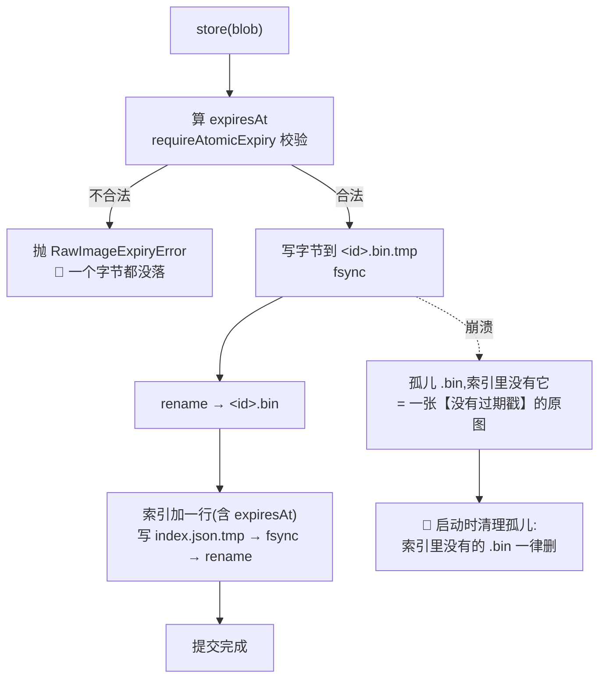
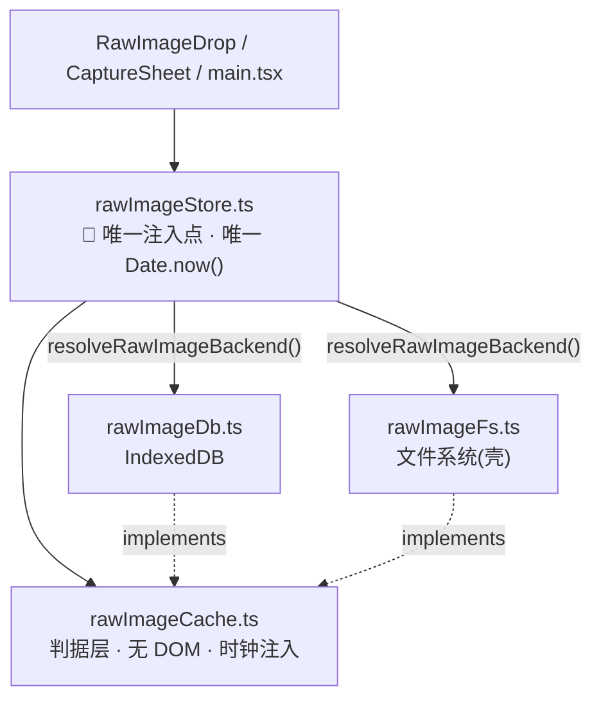
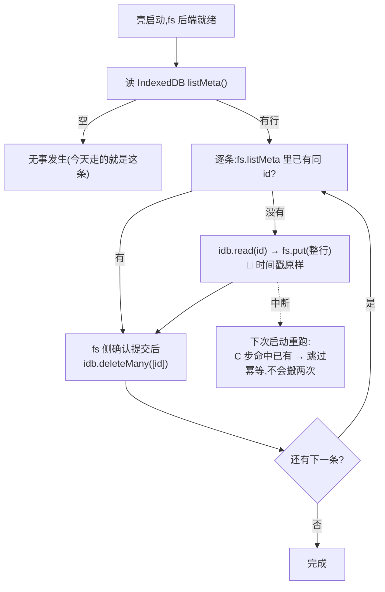
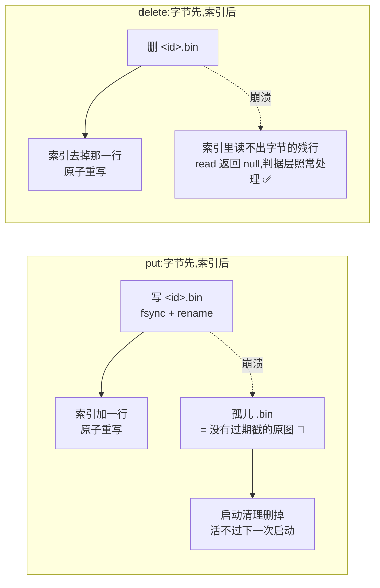

# 原图存储：判据层与存储层

> `KUBI-63`。原图从浏览器存储迁到文件系统——存储抽象怎么切、两种形态如何共存、已有的图怎么办。
>
> **2026-08-31 起,这份文档不再只是契约:`R-105` 已经落地。**
> §一~§四 是契约(2026-08-29 定,原文冻结);**§九、§十是落地后的实测记录**,
> 包括线协议、三条结构约束、以及一处契约当时没写清的边界(迁移的 origin 边界)。
>
> **判据层与存储层的分离早就存在**(`web/src/lib/rawImageCache.ts` / `rawImageDb.ts`,
> 2026-08-29 `fdf8e03`),而且切得对。这次**没有另起一套形状**:
> 判据层一份、只多一个 `RawImageBackend` 实现,`rawImageCache.ts` 里
> 关于到期/归档/上限的每一行都**一个字没动**。
>
> ⚠️ 本文一个数都不产生。见 §八。

---

## 零、基线

**基线:`origin/v1` @ `793f60d`,fetch 于 2026-08-31T01:19Z。**(上一轮是 `339e8b8`。)

```
git ls-remote origin refs/heads/v1     → 793f60d649be43f16009d22637126eb2677972b8
git diff --stat HEAD origin/v1         → 空(工作副本与远端逐字节一致)
```

⚠️ 人审给的基线是 `14eedf4`,而 `origin/v1` 此刻已到 `793f60d` ——
中间三个提交(`c50f9e5` 的 `R-106` 修复、留存文案统一、插件开关)都在里面,
也就是**人审说「我改完并推了」的那些**。核对通过,不是冲突。

⚠️ 分支 `KUBI-63-image-storage-fs` **在远端已经不存在**
(`git ls-remote origin 'refs/heads/KUBI-63*'` 空)——8-30 的合流把它并进 `v1` 后删了引用,
`docs/17` 也在那次改号成了 `docs/21`。所以这一轮是**从 `origin/v1` 重新开的分支**,
不是在旧分支上追加。

这一节存在的理由写在 `交付工作流 §九` 之外的一次事故里:上一轮 `KUBI-63` 的结论建立在
「代码库里没有这段实现」之上,而那段实现存在、只是没推到远端。**结论整条作废。**
教训不是谁记错了,是没人先确认过大家看的是不是同一份代码。
**此后每一份设计文档的第一节都是基线声明。**

---

## 一、既有切分:照抄,不重新发明

三个文件,职责已经分开,而且分得比「分层」更硬——**分的是「能不能被测」**:

| 文件 | 是什么 | 硬性质 |
|---|---|---|
| `lib/rawImageCache.ts` | **判据层** | 一个 DOM 符号都没有:没有 `indexedDB`、没有 `window`、没有 `Blob`。时钟注入。22 条断言在 node 里拨着假时钟跑 |
| `lib/rawImageDb.ts` | **存储层** | **不含任何判断**。五个方法各自只是一次 IndexedDB 调用。真时钟只在这里绑一次 |
| `features/RawImageDrop.tsx` | 界面 | 收图的唯一入口;图不进 React state、不做 `createObjectURL` |

> **这个切法的判据不是「逻辑归逻辑、IO 归 IO」,是:
> 一层能被测但不接真存储,一层接真存储但没有可测的判断——
> 未被测到的那半边因此没有地方藏逻辑。**

### 1.1 由此,壳形态的答案已经写好了一大半

`rawImageCache.ts` **今天就已经是形态无关的**。它不认识 IndexedDB,只认识
`RawImageBackend` 这个五方法接口和一个注入的 `Clock`。

🔴 **所以壳带来的是 `RawImageBackend` 的第二个实现,不是第二套逻辑。**

这句话是本文全部约束的来源。它的反面判据很好用:
**如果 `KUBI-68` 需要写第二套到期规则,说明这一层切错了,回来改这里,不要在壳里补。**

---

## 二、冻结的契约

### 2.1 `RawImageBackend` —— 五个方法,不增第六个

原文即契约(`rawImageCache.ts` L197–217),文件系统实现照这个接:

```ts
export interface RawImageBackend {
  put(row: StoredRawImage): Promise<void>            // 🔴 一次事务写整行
  listMeta(): Promise<RawImageMeta[]>                // 不含字节
  read(id: string): Promise<StoredRawImage | null>
  deleteMany(ids: readonly string[]): Promise<void>  // 真删
  archive(ids: readonly string[], at: number): Promise<void>  // 只写 archivedAt
}
```

三条实现方必须兑现的语义,和存储介质无关:

| 语义 | IndexedDB 侧怎么兑现的 | 文件系统侧必须怎么兑现 |
|---|---|---|
| `put` **要么整行在,要么整行不在** | `tx.oncomplete` 才 resolve,不用 `request.onsuccess` | **先写临时文件 → `fsync` → 原子 `rename`**;元信息与字节的关系见 2.4 |
| `deleteMany` 批量是**一个事务** | 一个 `readwrite` 事务删完整批 | 逐个删,但**失败必须整体报错**;不能留下「已过期又没归档」的半批 |
| `archive` **只碰 `archivedAt`**,碰不到 `expiresAt`、碰不到字节 | 读整行 → 换一个字段 → put 回去 | **只重写元信息,字节文件一个字节都不动**(见 2.4,这一点文件系统比 IndexedDB 做得更干净) |

**幂等**:`deleteMany` 删不存在的 id 不算错;`archive` 对已归档的行**跳过,不重复推后时刻**
(`rawImageDb.ts` L185 的 `if (typeof row.archivedAt === 'number') return`,以及断言
「归档是一次性的 —— 反复 sweep 不会把 archivedAt 一路往后推」)。这两条一起构成「可中断可续跑」的基础,§四 直接用。

**错误码**:两个错误类型已经存在,不新增第三个。

| 类型 | 含义 | 界面必须说的话 |
|---|---|---|
| `RawImageExpiryError` | 算不出合法过期戳 → **一个字节都没落** | 「这张图没被本地缓存」 |
| `RawImageStorageError` | 本地缓存整个用不了(隐私模式/配额/权限) | 同上 —— 🔴 **不是「记不下来」** |

> `后端详设 §1.5`:降级方向是「少功能」,不是「少记录」。**原图存不下 ≠ 这一笔记不了。**
> 与 `1.3.7.1`「识别挂了 ≠ 记录挂了」同构。壳侧新增的失败模式(目录没权限、磁盘满)
> 全部归到 `RawImageStorageError`,**不新增一种需要界面单独处理的形态**。

### 2.2 判据层的三条「只减不增」约束 —— 复核结果

上一轮我提出三条防红线的类型约束。既有实现是否已满足,逐条查:

| 约束 | 结论 | 证据 |
|---|---|---|
| **到期判据里没有删除分支** | ✅ 满足 | `sweep()` 只调 `backend.archive`。到期路径上没有 `deleteMany` |
| **接口上没有 `extendExpiry` / `touch`** | ✅ 满足 | `RawImageBackend` 五个方法里没有;`archive` 碰不到 `expiresAt`。**一次重试延不了留存期** |
| **签名里没有 URL / bucket / fileId 的位置** | ✅ 满足 | `RawImageMeta` 八个字段全部是本机语义。与 `后端详设 §七` 守 `R-04` 同一手法:不靠注释写「别传上去」,靠**类型上写不出来** |

⚠️ **但第一条只在「到期」这条路上成立。** 完整的复核结论见 §五 发现一 ——
存在**第二条非用户触发的真删路径**,而它不是到期。这不是我能顺手改的东西,交你落笔。

### 2.3 🔴 撤回:`capacity()` **不**进 `RawImageBackend`

上一轮我把 `capacity()` 冻进了存储口签名。**撤回,理由是它会破坏本层最硬的那条性质。**

`rawImageDb.ts` 的开头写着「这个文件里没有任何判断,这是刻意的」。
而容量一旦进了 `RawImageBackend`,判据层就拿得到它,拿得到就迟早会有人写
`if (capacity.usedBytes > limit) …` —— **那一刻「归档也淘汰」就从后门回来了**,
正是 `R-105` 明确拒绝的东西。

容量是**给用户看的一个数**,不是判据。所以它单独成型,判据层永远看不见:

```ts
// 只由界面读,不进 RawImageBackend,不进 RawImageCache
export interface RawImageCapacity {
  readonly usedBytes: number
  readonly limitBytes: number | null   // 🔴 null = 没有软上限(文件系统形态)
}
```

浏览器侧由 `navigator.storage.estimate()` 填;壳侧 `limitBytes` 恒为 `null`。
**这是两形态之间允许存在的差异的全部**(见 3.2)。它服务的是 `R-105` 的备选②
——「界面上给用户看归档占了多少,让他自己清」——而清是**用户手按的删**,那条路本来就通。

> ⚠️ **`RawImageCapacity` 这次<u>没有</u>落地,而这是有意的。** 它服务的是「给用户看一个数」,
> 也就是**界面**;而这一轮换的是**存储**。两件事一起做的话,`web/` 的改动就不再是
> 「一条缝 + 三处 import」,`§9.4` 那条新验收判据也就没法说清它到底在守什么。
> 🔴 界面上今天没有任何地方显示归档占了多少 —— **这是一个已知的缺口,不是已经做完的事**。
> 它要不要做、做成什么样,属于界面决策,不该由这次存储迁移顺手定下来。

### 2.4 文件系统侧多出来的一个形状问题:元信息与字节放哪

IndexedDB 一行装得下「元信息 + Blob」,文件系统装不下。**这是本次迁移唯一真正的新设计。**

| 方案 | 「整行原子」怎么办 | 判 |
|---|---|---|
| 一个文件装 JSON 头 + 字节 | 天然原子 | ❌ 每次 `listMeta` 都要打开全部文件读头。而本层全部纪律就是「少碰几次字节」 |
| 字节一个文件 + 元信息一个文件(每图两文件) | 两次写,**做不到原子** | ❌ 直接违反「要么整行在,要么整行不在」 |
| **字节一个文件 + 全部元信息一个索引文件** | 索引原子重写(临时文件 + `rename`) | ✅ 采用 |

**顺序写死,不可调换:**



🔴 **第 C 步与第 E 步之间崩溃,会留下一个索引里没有的字节文件——
那正好是 `R-04` 要防的终局:没有过期戳 = 永不过期。**
所以文件系统实现**必须**带一步启动清理:`.bin` 集合减去索引 id 集合,差集删除。
IndexedDB 形态不需要这一步(事务保证了),**这是壳形态自己引入的缺口,必须自己补上。**

反方向的残留(索引有行、`.bin` 不在)不危险:`read` 返回 `null`,判据层照常处理。

> **归档在文件系统上比在 IndexedDB 上更干净**:只重写索引文件,字节文件一个字节都不动。
> IndexedDB 那侧受限于「没有部分更新」,归档要把整行读出来再写回去。

---

## 三、两形态如何共存

### 3.1 注入点:今天是隐式的,必须给它一个名字

**现状有一处结构问题,而它今天不显眼:**

```ts
// rawImageDb.ts L213 —— 存储层的模块作用域
export const rawImages = new RawImageCache({ backend: indexedDbRawImageBackend, now: () => Date.now() })
```

`RawImageDrop.tsx` / `CaptureSheet.tsx` 都是 `import { rawImages } from '../lib/rawImageDb'`
—— **界面 import 的是「IndexedDB 那个文件」**。今天只有一种形态,所以没人觉得别扭;
加第二种形态的那一刻,这行 import 就成了分叉点:要么界面里出现 `if`,要么
`rawImageDb.ts` 里出现一个 `import { fsBackend }`,而那会让存储层互相认识。

🔴 **这是本次唯一需要改动既有文件的地方,而且只改一处:**

| 文件 | 改成 |
|---|---|
| `lib/rawImageDb.ts` | **只导出 `indexedDbRawImageBackend`**。删掉 `rawImages` 与 `sweepRawImagesOnStartup` |
| `lib/rawImageFs.ts` | 新增。只导出 `fsRawImageBackend`。**不 import `rawImageDb`** |
| `lib/rawImageStore.ts` | 新增。**全应用唯一的注入点**:选后端、绑真时钟、导出 `rawImages` 与 `sweepRawImagesOnStartup` |
| 界面 / `main.tsx` | import 路径从 `rawImageDb` 改成 `rawImageStore`。**没有别的改动** |



**依赖单向,无环:界面 → store → 判据层;两个存储实现各自只依赖判据层的类型,彼此不认识。**

`resolveRawImageBackend()` 里那一句形态判断是**全链路唯一允许存在的形态分支**,
可以 grep,而且只有一处:

```ts
// rawImageStore.ts —— 🔴 全链路唯一的形态判断。多一处,能力边界就少一道防线。
function resolveRawImageBackend(): RawImageBackend {
  return isTauriShell() ? fsRawImageBackend : indexedDbRawImageBackend
}
```

> ⚠️ **落地时这一句变了形,原文保留在上面**(`实施路径 §成本` 的惯例)。实际写的是:
>
> ```ts
> async function resolveBackend(): Promise<RawImageBackend> {
>   if (!(await localRawImageStoreAvailable())) return indexedDbRawImageBackend
>   await migrateRawImages(indexedDbRawImageBackend, fsRawImageBackend)   // 见 §四
>   return fsRawImageBackend
> }
> ```
>
> 🔴 **变的是问法,不是数量:仍然只有一处,仍然可 grep,而且现在由 `build.sh` ③.5 数着。**
> 两处不同,各有理由:
>
> - **问「那个口在不在」,不问「我是不是 Tauri」。** `isTauriShell()` 问的是**宿主**,
>   而真正要知道的是**「有没有一个能写文件的后端」**。两者今天等价,明天不一定 ——
>   而形态判断每多一处不等价,能力边界就少一道防线。能力探测同时让它**可测**:
>   一个假 `fetch` 就能把两种形态都跑一遍,不需要真的起一个壳。
> - **因此它是异步的。** 代价是 `rawImages` 的后端要延到探测之后 ——
>   由一个只会「等后端、原样转调」的转发对象吸收,**判据层一个字都不知道这回事**。

> `rawImageDb.ts` L203 写着「这是整条链路里 `Date.now()` 出现的唯一一处」。
> **这条性质随注入点一起搬到 `rawImageStore.ts`,不因为搬家而失效** ——
> 搬完之后 `grep -rn "Date.now()" web/src/lib/rawImage*` 仍应只有一行。

### 3.2 允许存在的形态差异 —— 穷举,只有两处

| 差异 | 浏览器 | 壳 | 为什么允许 |
|---|---|---|---|
| `RawImageCapacity.limitBytes` | 数字(配额) | `null` | 这是**事实差异**,不是逻辑差异。文件系统确实没有那个上限 |
| 启动时清理孤儿字节文件 | 不需要 | **必须** | 见 2.4。事务保证在文件系统上不存在,缺口由引入它的那一侧补 |

**除此之外没有任何 `if (isShell)`。** TTL、条数上限、到期判据、归档语义、
删除语义、错误分类,两形态**逐字节相同**——因为它们全在判据层,而判据层只编译一份。

### 3.3 契约测试:一份,两个实现各跑一遍

既有的 22 条断言里,有一批测的是**判据**(拨时钟、归档一次性、残行处理),
它们跑在内存假后端上,和形态无关,**一行不改**。

新增一份**后端契约测试**,参数化跑三个实现(内存 / IndexedDB / 文件系统),至少覆盖:

| # | 断言 |
|---|---|
| 1 | `put` 之后 `listMeta` 看得到,且 `expiresAt` 与写入时一致 |
| 2 | 🔴 `put` 中途失败之后,**既没有元信息也没有字节**(不能只剩一半) |
| 3 | `archive` 只改 `archivedAt`,`expiresAt` 与 `byteSize` 不变 |
| 4 | `archive` 对已归档行是 no-op,`archivedAt` 不被推后 |
| 5 | `deleteMany` 删不存在的 id 不抛 |
| 6 | 🔴 `read` 读得出**已归档**的行(归档不是删除) |
| 7 | 🔴 壳侧专有:索引里没有的字节文件,启动清理后不存在 |

> 第 2 条与第 7 条是这份契约测试存在的**全部理由**。其余五条判据层已经守着了。

### 3.4 🔴 壳侧的目录选择本身就是红线的物理落点

**原图目录不得落在 `~/Documents` / `~/Desktop` / `~/Pictures`。**

macOS 的 iCloud「桌面与文稿」同步默认可开,开着就等于**原图自动上云**——
而红线原文是「不做长期云端存储和任何形式的共享」。这条破口的性质和
`技术架构 §8.1` 第 5 条的 Nginx `client_body_temp` 完全一样:
**不在你写的代码里、不报错、不出现在任何 review 里、测试全绿。**

| 必须 | 理由 |
|---|---|
| 落**应用数据目录**(`$APPDATA/kaodian/rawimages`) | 不在任何默认同步范围内 |
| Tauri capability 白名单**只开这一个目录** | 目录写死在 capability 里,配置文件本身就是断言 |
| 🔴 **不提供「让用户选目录」的入口** | 用户选到 iCloud Drive / Dropbox / OneDrive 的那一刻红线就破了,而**产品这边不会有任何征兆** |

最后一条是一次刻意的功能删减。理由和 `1.1.3` 整条一致:
**便利换不来这条线**——而这条线「第一天不定,后面改不回来」。

---

## 四、迁移路径:已经在浏览器里的图怎么办

### 4.1 语义:这是**搬家**,不是删除也不是复制

与 `TouchStore.reassign`「搬家不重置时间戳」同构。三条不变式:

| 不变式 | 违反的后果 |
|---|---|
| `expiresAt` / `storedAt` / `archivedAt` **原样搬**,一个都不重算 | 重置一次「多久前」,这个产品唯一的产出就错了 |
| 🔴 已归档的搬过去**仍然是归档态** | 归档态搬成活跃态 = 一张已到期的图重新开始计时 |
| 单向:浏览器 → 壳。**没有反向** | 反向意味着字节回到配额受限的存储里,而配额正是这次要解决的问题 |

### 4.2 步骤:逐条、幂等、可中断可续跑



**逐条而不是整批**:整批意味着中断时要么全丢要么全留,而逐条的中断代价是
「有几张两边都在」,下次启动 C 步就化解了。

**先写目的地、确认提交,再删源**。反过来会在中断时**丢字节**,而丢的是用户的原图。

### 4.3 🔴 第 E 步的删除为什么不违反「只有用户手按才真删」

它是**同一台机器上换一个抽屉的后半步**,不是一次留存决定:

- 前提是 `fs.put` 已提交——**字节在删之前就已经在本机的新位置上了**;
- 它不由到期触发,不由容量触发,**只由「这一行已经在别处存在」触发**;
- 中断在这一步的后果是「两边都在」,不是「都不在」。

**这条豁免只覆盖迁移这一处,不外借。** 任何其他「顺手清一下旧的」都不适用。

### 4.4 今天的存量:零

拍照入口 `CommandPalette.tsx` 标着「未接入」`disabled`,服务端没有图片 controller
通到 `CaptureService.captureFromPhoto`。**存储层实现了但还没有真实调用者,所以没有用户图片落过盘。**

⚠️ **这不意味着迁移可以不写。** 它意味着:

| | |
|---|---|
| 迁移代码 | **要写、要测**——用假数据跑,不能等有了真图才验证 |
| 今天跑一次的效果 | 空跑,零条 |
| 这个窗口的价值 | **写错了也伤不到任何人的原图。这是这段代码最便宜的一刻,而它现在开着** |

---

## 四点五、⚠️ 契约当时没写清的一条:迁移**够不到**浏览器里的图

`§四` 通篇假设「源」是一个读得到的 IndexedDB。**落地时发现这个假设只在一半场景下成立。**

浏览器侧的一切本地存储**按 origin 隔离**,而壳的 origin 是 `http://127.0.0.1:17840`
(`shell/src/config.rs` 顶部那段就是为这条写的:端口换一次,存的东西全部读不回来)。
于是「已经在浏览器里的图」其实是**两批**:

| 图在哪儿 | 这次怎么办 | 为什么 |
|---|---|---|
| **壳自己的 IndexedDB**(装过旧版壳的机器) | **自动搬**,`rawImageMigrate.ts` | 同一个 origin,读得到 |
| **用户浏览器里**(另一个 origin,`https://…`) | 🔴 **不搬** —— 留在那儿,照它自己的 TTL 到期转归档,用户随时能在那边手动删 | **结构上读不到**。要读到它只能造一条「导出原图 / 导入原图」的通路,而那是一条**原图离开原存储的路** |

🔴 **「不搬」是这一侧的答案,不是没做完。** 你在议题里给的选项(「可以是『不迁,自然过期』」)
正好覆盖它 —— 而落地之后能说得更准:**对第二批,「不迁」不是选择,是唯一可能。**

两种形态的图各自在各自的机器位置上到期、各自能被手动删掉,
红线「原图只在用户自己的机器上」在两边都成立。唯一没有的是「在壳里看见浏览器里的那几张」,
而那个便利要用一条导出通路来换 —— **不划算**,理由和 `§3.4` 拒绝「让用户选目录」是同一条。

---

## 五、本次复核发现的三处不一致 —— 不自行修,交你落笔

> **2026-08-31 状态:三条都已由人落笔闭合,原文保留。**
>
> | | 你的裁定 | 落在哪 |
> |---|---|---|
> | 发现一 `R-106` | 选了①(**上限也改归档**),不是我倾向的③ | `c50f9e5`。整层不再有任何自动删除路径,`deleteMany` 只剩 `forget`/`forgetAll` 两处调用 |
> | 发现二 `R-107` | 五处文案改「转入留存区」;顺带修了 h5/小程序/pad/app 那句「识别完就删」 | `793f60d` + `design/ui-a` 五端 |
> | 发现三 | 三处「到期删除」已随文案统一一并处理 | `793f60d` |
>
> 🔴 **①与③的差别在这次落地之后消失了。** 我当时倾向③(壳形态取消条数上限)的理由是
> 「条数上限本来就是配额的代物」——而①落地后 `maxEntries` 限的是**活跃段条数**
> (界面上列几张),不是配额。两种形态在这一点上**行为完全一致**,
> `§3.2` 那张穷举表因此**不需要加第三行**。你选①带来的正是这个结果。

按 `交付工作流` 的规矩:agent 的结论是**输入**不是判决。三条都可复现。

### 发现一 🔴 上限淘汰把**活图真删**,而过期图**永久保留** —— 语义反转

```
repro: cd web && npm run test:retention        # 22 条全绿
       断言「条数上限:超了先删最早到期的那几张」assert.equal(backend.rows.size, 3)
       —— 5 张都没过期(ttl 10h,时钟只走了 5 秒),其中 2 张被 deleteMany 真删了
```

`store()` 的顺序是 `sweep()` → `evictBeyondCap(maxEntries - 1)`。
`sweep` 把**过期的**转归档;`evictBeyondCap` 随后在 `!isArchived` 的行里删掉最早到期的几张
——**那些行没有过期**。于是:

| | 2026-08-29 之前 | 现在 |
|---|---|---|
| 过期的图 | 删 | **永久保留(归档)** |
| 没过期但超了条数上限的图 | 删 | **删** |

**用得越勤,活着的图越容易被真删;而放着不管的过期图一张都不会走。**
这是 8-29 那次改动的**副作用**,不是那次决策的内容——决策原文动的是「到期」,
`evictBeyondCap` 走的是另一条路,没被那次改动扫到。

⚠️ 它同时意味着 §2.2 第一条约束**只在到期路径上成立**:
链路上存在第二条非用户触发的真删,而它归档不了(归档不释放空间,归档它没有意义)。

**三个出路,需要你选一个,我不自行改:**

| | 做法 | 代价 |
|---|---|---|
| ① | 上限也改成归档 | `maxEntries` 立刻失去全部作用(不释放空间),等于删掉这个上限 |
| ② | 保持现状,**写进文档承认「上限淘汰是一条真删路径」** | 用户会遇到「我今天导的图没到期就不见了」,而同意点没提过这件事 |
| ③ | 壳形态下 `maxEntries` 设为无限,浏览器保持 12 | ⚠️ 违反 §3.2「除两处外无形态差异」。**如果选它,§3.2 要改,不能默默留一个第三处差异** |

> 我的意见:③ 最贴合这次迁移的目的(条数上限本来就是配额的代物,配额没了它就没了理由),
> 但它要付一处形态差异的代价,**而这个代价该由你判,不该由我在契约里顺手写进去。**

### 发现二 🔴 同意点仍写「N 小时后自动删除」,而同意键**不会因此重新问**

```
repro: grep -n "自动删除\|自动删" web/src/features/RawImageDrop.tsx
       → L186 / L281 / L335 三处;L352 CONSENT_PREFIX + L355 consentKey
```

`ConsentGate` 的原文是「原图只存在这台设备上,**{hours} 小时后自动删除**」。
**这句话现在是假的**:到期转归档,字节留在本机,`read` 还读得出来。

而更要紧的是同意键的设计:

```ts
const CONSENT_PREFIX = 'kaodian.rawimage.consent.'
function consentKey(ttlMs) { return `${CONSENT_PREFIX}${Math.round(ttlMs / 3_600_000)}h` }
```

它带着**小时数**,注释写得很清楚:「哪天 TTL 被人从 6 小时调成 24,旧的同意自动失效,
所有人被重新问一遍——因为他当初同意的是 6 小时,不是 24。」

🔴 **而这次变的不是小时数,是留存的种类:从「删」变成「不删」。
键没变,于是没有任何人会被重新问。** 这正好是那个键要防的事,
它从侧门过去了——**因为那个键防的是「时长变了」,防不住「承诺的性质变了」。**

`决策记录 §2.3` 你已经落笔加注了(2026-08-29 修正),**决策层这条已闭合**。
剩下的是**用户那一侧**:他同意的是「6 小时后删掉」,产品做的是「6 小时后归档、无限期留着」。

需要你定的是两件事:

1. 同意文案改成什么(「{hours} 小时后转为本机归档,不再用于识别,随时可手动删除」之类);
2. 🔴 **同意键是否要一并换掉**(例如 `consent.6h.archive`),让所有既有同意失效、重新问一遍。
   —— 按那个键自己的设计意图,**该换**;但那是一次面向用户的动作,不是我能替你决定的。

### 发现三 docs 里还剩三处写着「到期删除」,其中两处是**规格**

你 `339e8b8` 修了 6 处(`决策记录` `执行清单` `详细排期` `总路线图 §1.1.3.2` 等),按下面这条重扫,还剩三处:

```
repro: grep -rn "删除" docs/ | grep -i "原图\|TTL\|1\.1\.3\|到期\|过期\|R-04"
```

| 位置 | 原文 | 为什么要紧 |
|---|---|---|
| `交付工作流` L173 | `R-04` 断言表:「② 原图 TTL **到期删除**的注入时钟测试」 | 🔴 **断言规格**。`KUBI-65` 的自检照这一行核对,会把 8-29 的改判判成违规 |
| `总路线图` L124 | `1.1.3.3 验证:改系统时间实测**删除**生效` | 🔴 **验收判据**。它就在 L121 那条修正注释的正下方,`1.1.3.2` 已改而 `1.1.3.3` 没改 —— 实际断言测的是「拨过期之后**归档**」 |
| `技术架构` L846 | 时序图 Note:「到期后本地自动删除(1.1.3.2)」 | 描述的是**已经不成立的行为** |

**本文一处都没改。** 上一轮我就地改过 `交付工作流` L173,这次不重复:
断言规格与验收判据和 `决策记录 §2.3` 属同一类——**该由人落一次笔,不该被一次实现默默确立**。
本文只在 `技术架构 §八` 的开头加了一条指针,**原文一个字没动**(`实施路径 §成本` 的惯例)。

`数据线` L25 与 `技术架构` L814 是**红线原文的逐字引用**,`决策记录` L61 / L199 是改判记录本身,
都不算不一致,不列入。

---

## 六、更正:我上一轮的两处错

按 `思考模式` 的规矩,记在这里而不是悄悄改掉:

| 我写过 | 事实 | 更正 |
|---|---|---|
| 新登记 `R-72`(浏览器归档段撞配额) | `R-72` 早已被占用(`NaN` 置信度穿过阈值);而配额这件事 **`R-105` 已经登记过了**,就在 `fdf8e03` 里 | **作废,不新增。**以 `R-105` 为准 |
| 新登记 `R-73`(红线释义收窄未落笔) | `R-73` 早已被占用(登录链路自由文本字段);而这件事**你已经在 `339e8b8` 里落笔了**(`决策记录 §2.3` 的 2026-08-29 修正块) | **作废,已闭合** |

两处都源于同一个原因:上一轮我读的是 `origin/v1` @ `1accbba`,
而 `R-99`…`R-105` 与 `决策记录 §2.3` 的加注都在没推上来的那 20 个提交里。
**这不是编号手滑,是基线不对导致的整段偏差**——§零 那一节就是为它存在的。

**本文新登记的是 `R-106`(§五 发现一,上限淘汰的语义反转)与
`R-107`(§五 发现二,同意文案与同意键)。** 现有最大编号为 `R-105`。

---

## 七、给下游两句

- **`docs/Agent框架` 的落点归 `KUBI-62`。** 共享包目录名与构建落点以它为准。
  本文只对「判据层不碰 IO / 依赖单向无环 / 形态判断只有一处」这三条负责。
  ⚠️ 壳试水期间 `web/` 一行不改,所以 §3.1 那次 import 路径搬迁
  **不能单独进 `web/`**,要和壳的落地批次一起走。
- 🔴 **`KUBI-68`(壳内后台定时器)的前置仍然是原图链路先有真实调用者。**
  今天没有任何一张用户原图,那个定时器会是一个每小时准时扫出零条的循环——
  不是「先做好等着」,是**做完了无法验证**。
  另:`R-102` 已因「到期不再删」消解,**定时器要扫的东西比原先少了一件**,
  排期时按新范围重估,不要照着旧的 `R-102` 去做。

---

## 八、这份文档写完不构成任何进度

照 `KUBI-61` 的口径重复一遍,而且这次更该重复——本轮花在基线核对上的时间,
和花在契约上的一样多。

**关卡 0 要的是「自用两周、每天记两个数」(`1.1.4`)。本文一个数都不产生。**

`思考模式 §盲区二`:注意力流向能被建出来的那一部分,而不是最不确定的那一部分。
一份写得工整的存储契约,是这个失败模式最舒服的形态之一。
自检那句照旧:**我是在给一条还没有任何用户图片的链路定契约,还是在找那两个数字?**

---

## 九、落地(2026-08-31,`R-105`)

契约在 §一~§四,**这一节记的是它变成代码之后长什么样**,以及三处契约当时没说的选择。

### 9.0 🔴 web 与壳之间走**回环 HTTP**,不走 Tauri IPC

契约只说了「壳侧是 `RawImageBackend` 的第二个实现」,没说那条进程边界怎么过。落地时有两条路:

| | Tauri IPC(`@tauri-apps/api`) | **回环 HTTP(选中)** |
|---|---|---|
| 要不要给 `web/` 加运行时依赖 | **要** | 不要。只用 `fetch` |
| 原图字节怎么过去 | IPC 只传得了可序列化的值 —— 原图得先 **base64** | 请求体直接是二进制 |
| 形态判断 | `window.__TAURI__`,问的是**宿主** | 探测那个口在不在,问的是**能力** |
| 壳侧要开的东西 | 远程 origin 的 IPC 白名单(壳的页面是 `http://127.0.0.1:17840`,对 Tauri 是「远程域」) | 已有的回环服务加一条路由 |

🔴 **第二行是决定性的。** `rawImageDb.ts` 选 IndexedDB 而不选 localStorage 的头号理由就是
「不要在内存里多出一份原图的 base64 文本副本」。**换一个存储介质不该把那条理由丢掉。**

代价是 `main.rs` 顶上那句「壳不读请求体」不再全对 —— 见 9.3。

### 9.1 线协议(两侧各一份字面量,以本表为准)

前缀 `/__local/rawimages`。**刻意不是 `/api/*`**:那条路整条反代给上游,这条路一个字节都不出这台机器。

| 方法 · 路径 | 请求 | 响应 |
|---|---|---|
| `GET /health` | — | `{"store":"fs","version":1}` |
| `GET /index` | — | `{"rows":[<元信息>…]}` |
| `PUT /blob/<id>` | body = **原图字节**;头 `x-raw-meta` = base64(UTF-8(JSON 元信息)) | `204` |
| `GET /blob/<id>` | — | body = 字节;头 `x-raw-meta`;`content-type` 恒为 `application/octet-stream` |
| `POST /delete` | `{"ids":[…]}` | `204` |
| `POST /archive` | `{"ids":[…],"at":<数>}` | `204` |

三条落在协议形状上、不靠自觉的性质:

- 🔴 **元信息 base64 的对象是元信息(<1 KB),不是原图。** 原图走 body,一个字节都没被 base64 过。
  base64 是因为 HTTP 头只装得下 ISO-8859-1,而 `label` 是用户本机的文件名(可能是中文)。
- 🔴 **`content-type` 恒为 `octet-stream`,壳不按图片类型回。** 按图片类型回的话,
  这个本地地址就是一条**能在浏览器里直接打开原图的链接**,而 `技术架构 §8.1` 禁令 4 是
  「不做任何形式的图片分享/外链」。界面拿到的 mime 取自元信息,不取自这个头。
- 🔴 **没有第七个端点。** 尤其没有「改任意字段」的口 —— `archivedAt` 只能由 `POST /archive` 写,
  `expiresAt` 只能由 `PUT /blob/<id>` 那次**整行写入**带进来。
  「一次重试就把留存期延到无限」在两种形态上一样写不出来。

### 9.2 壳侧目录布局与两条顺序

```text
~/Library/Application Support/kaodian/originals/     ← platform::archive_dir()
  index.json        ← 全部元信息,一个文件,原子重写(临时文件 → fsync → rename)
  <id>.bin          ← 一张图的字节,一个文件
  <id>.tmp/index.tmp ← 写到一半的残留,启动清理
```

**两条顺序是反的,而且都不是风格问题:**



| | `put` | `delete` |
|---|---|---|
| 崩在中间留下 | 孤儿字节文件 | 元信息残行 |
| 为什么可以接受 | 启动清理一次就没了 | `read` 返回 `null`,`§2.4` 已判过不危险 |
| 反过来会怎样 | 索引有行、字节没有 —— 界面上一张**没有字节的图带着倒计时** | 🔴 **用户按了「删」,而字节还在磁盘上** |

最后一格是 `delete` 选这个顺序的全部理由:**「用户手按的删就是真删」是这条链路上唯一不能打折的承诺。**

两条顺序**各有一条能单独变红的断言**(`put_writes_bytes_before_the_index_…` /
`delete_removes_bytes_before_the_index_…`),手法是在 `index.tmp` 那个位置放一个目录,
让下一次索引重写必然失败 —— 这是把「中途崩溃」变成断言的唯一办法。

🔴 还有一条同类的:**索引读不动时,启动清理什么都不做并报错**。
把读不动当成「索引是空的」,下一步就会把目录里每一张图都当孤儿删光 ——
一次静默的、不可逆的数据事故。与 `config.rs`「坏配置绝不覆盖」是同一条纪律,第二次出现。

### 9.3 🔴 壳的能力边界变了一次,代价与三处钉子

`local_server.rs` 原文:「请求体在这里原样交给上游连接……壳读不到它一个字节,
所以它结构上不可能把原图落盘。」

**这句话现在只对 `/api/*` 成立。** `/__local/rawimages/*` 会把原图写到磁盘上 ——
那正是 `R-105` 要的。**能力换来了,代价必须说出来,并且钉住:**

| # | 钉子 | 由谁保证 |
|---|---|---|
| 1 | 原图存储层**没有网络出口** —— 不 import 任何 HTTP 客户端 | `build.sh` ①.6 grep(与 `scheduler.rs` 那条同一手法) |
| 2 | **写盘点只有两个模块**:`raw_image_store.rs`(原图)/ `config.rs`(端口) | `build.sh` ①.6 grep `File::create`/`fs::write`/`fs::rename`/… |
| 3 | 🔴 **壳读不到 `expiresAt` / `storedAt`** —— 元信息对它是一块不透明 JSON | `build.sh` ①.6 grep(剥注释 + 排除 `#[cfg(test)]` 之后) |

第 3 条是最要紧的一条,它是「判据只有一份」在 Rust 侧的**结构形态**:
壳只认识 `id`(拿来当文件名)和 `archivedAt`(只写、永不读)。
**「壳自己判一下有没有过期」在那边写不出来**,不是「说好了不写」。

⚠️ 三条 grep 都**先剥注释、并且跳过测试模块** —— `交付工作流 §9.10` 那条教训第四次出现:
断言不能红在自己的说明上,也不能红在**为了证明这条约束成立而写的测试**上
(`raw_image_store.rs` 的测试里必然出现 `expiresAt`,那正是它证明「原样进、原样出」的方式)。

### 9.4 🔴 `build.sh` 的「`web/` 零改动」被换掉了 —— 这是一次**验收判据变更**

`docs/18 §十`(与 `§2.5`)的原判据是:`git status --porcelain -- web server` 必须为空。
**它挡不住这次改动,而且挡不住的方式是结构性的**:壳形态要用文件系统,
判据层就得知道该拿哪个后端,而这件事**没有任何办法在不碰 `web/` 的前提下完成**
(壳没有 IPC,而 web 也不该为壳装一个 —— 见 9.0)。

那条判据是一个**代理**:它真正想说的是「壳不许把 web 改出第二套」。
当形态分支的数量是 0 时,「一行都不改」恰好等价于那句话,还便宜得多。
数字变成 1 之后代理不再等价,而**代理不再等价时该做的是换成直接断言那句话,不是删掉它**:

| | 旧 | 新(`build.sh` 步骤 ③.5) |
|---|---|---|
| 判据 | `web/` 的 git diff 必须为空 | **形态判断恰好 1 处,且在 `lib/rawImageStore.ts`** |
| 附带 | — | `__TAURI` / `isTauriShell` 在 `web/src` 里零命中;线协议路径只出现在 `rawImageFs.ts`;原图链路上 `Date.now()` 恰好 1 处 |
| 强在哪 | — | 旧判据挡不住「在注入点里写十个 `if`」,也挡不住有人在界面组件里加一句 `window.__TAURI__` |
| `server/` 零改动 | 保留 | **一个字没变** |

🔴 **这一条是我改的,而它动的是你写下的验收判据。** 按 `交付工作流` 的规矩记在这里等你过目:
**如果你认为验收判据不该由实现方改,退回这一处即可**,代码其余部分不依赖它。

⚠️ 顺带被这条新判据抓到一个**既有缺陷**:`rawImageCache.ts` 的 `defaultNewId()`
里有一个 `Date.now()`(退路 id 的时间前缀)。它**用时钟当熵源、不当时刻**,
所以没有制造过任何一个错误的到期判断 —— 但它让「这条链路上 `Date.now()` 只有一处」
这句话**字面上是假的**,而那句话正是「时钟必须注入」唯一可执行的形态。
已改成两段随机数(没有任何地方依赖那个时间前缀,排序一律按 `expiresAt`)。
**一条数不准的断言等于没有断言**,而「这一处良性、那一处不是」这种区分留不住。

### 9.5 测试分工:三段,各自守住的东西不重叠

| 在哪 | 条数 | 守什么 | 跑得动的前提 |
|---|---|---|---|
| `web/tests/rawImageCache.test.ts` | 23 | **判据**:拨时钟、归档一次性、上限、残行 | 一个内存后端 + 假时钟 |
| `web/tests/rawImageFs.test.ts` | 21 | 后端**契约**(内存 / 文件系统各跑一遍)+ 线协议的 web 那半 + 形态探测 | 一个假 `fetch` |
| `web/tests/rawImageMigrate.test.ts` | 7 | **迁移**:顺序、幂等、中断、残行 | 两个内存后端 |
| `shell/src/raw_image_store.rs` | 12 | **真实文件系统**:原子写、两条顺序、孤儿清理、坏索引、路径穿越、base64 | 真的临时目录 |
| `shell/src/local_server.rs` | 1 | 🔴 **线协议整条,走真的 HTTP** | 真的起一个服务 |

最后一行是这套设计里最容易被省掉、也最不能省的一条。省掉它的话:
假壳那一侧全绿、存储层那一侧也全绿,而**中间那道 HTTP 边界一次都没有被真的走过** ——
路由字符串写歪一个字母,两边照样全绿,壳里的原图链路整条不通(`R-116`)。
那条测试里的路径**逐字抄自 `rawImageFs.ts`**,不是从本文件的常量拼出来的:
从常量拼等于让断言和被断言的东西共用同一个错误。改错一个字母那条会红,**已验证**。

> **本轮所有「🔴」级断言都被故意弄红过一次再修回来**(`交付工作流 §9.10` 的规矩),
> 包括:迁移顺序调换、形态探测两条判据各拆一次、坏索引当成空索引、
> `delete` 顺序调换、线协议路由改一个字母。**没红过的断言不算断言。**

---

## 十、还没关上的三个口(新登记)

按 `思考模式` 的规矩:不确定的留在不确定这一栏,一个**看起来合理的推断不能关闭一条**。

| 号 | 是什么 | 为什么今天不咬人 | 什么时候会咬人 |
|---|---|---|---|
| `R-114` | **两种形态的图互相看不见。** 壳读不到浏览器 origin 里的图,反之亦然;用户会看到「我明明存过」 | 存量为零 | 有人先在浏览器里用了一阵,再装壳 |
| `R-115` | **迁移失败没有出口。** 失败时那几行留在 IndexedDB 里(**没丢**,先写目的地再删源),下次启动重跑;但在重跑成功之前它们**在界面上看不见,且用户不会收到任何提示** | 存量为零 | 壳的 IndexedDB 里真的有图,而磁盘那一侧出了问题 |
| `R-116` | **线协议两侧各写一份字面量。** 真 HTTP 的集成测试已经把「写歪一个字母」挡住了;剩下的是「两侧同时改成同一个别的串」 | 已被集成测试压到很窄 | 有人只改一侧、并且顺手把集成测试也改了 |

🔴 **三条都是真的口,不是「已经解决但记一笔」。** 尤其 `R-115`:
「下次启动重跑」是缓解,不是修复 —— 修复要么给用户一个看得见的出口,
要么承认它并写进界面,而两条都是面向用户的动作,不该由实现方顺手决定。

---

