# 后端系统设计与组件接入

> 这份文档回答两个问题:**基础功能流程按什么顺序发生**,以及 **spring-ai / spring-ai-alibaba / 语音具体怎么装配进来**。
>
> 它是 `技术架构与接口契约` 的下一层。10 定的是分层、表、接口签名;13 定的是**这些东西被调用的次序**,以及**外部模型客户端落在哪一层、用什么坐标**。
>
> **`识别链路选型 · ASR 与图像识别` 的选型结论与 `技术架构与接口契约` 的技术栈表在这里一个字都不改。** 分叉与冲突在 §零 显式登记,不静默覆盖。
>
> **§三 的版本结论是本机实测得来的,不是查文档得来的。** 实测环境与 `server/` 同款(Spring Boot 4.1.1 / Java 21 / 独立 Maven 配置),命令与原始错误都记在表里。
> 实测日期 **2026-08-26**。构件会更新,带 `⚠` 的项动手前复核一次。
>
> **字段一律是草案。** `§八` 的表结构会随阶段 1 的真实使用而改,现在不值得精细化——真正稳定的只有 `§七` 那张红线落点表。

---

## 零、这份文档与既有文档的关系

三条必须先说清楚,否则后面每一节都会被误读。

### 0.1 归属:整份文档描述的是**接上外部模型之后**的形态

`识别链路选型 · ASR 与图像识别` §六 与 `阶段 0 至阶段 2 · 详细排期` 的技术选型表都写着:**阶段 0 用本机 whisper + 系统原生 OCR,零调用成本、零网络依赖**,而且**阶段 0 不做打标**。多模态的全部优势在打标那一步,阶段 0 用不上。

> ⚠️ **2026-09-02 用户裁定「取消功能分期」:产品按一个完整的 App 设计与开发,功能的有无不再由阶段决定。** 上面那句「**阶段 0 不做打标**」**作为功能裁剪已作废** —— 打标是完整 App 的一部分,**就是有的**;原文留着可追溯。**仍然成立的是选型本身**(本机 whisper / 系统 OCR 与云端多模态各自的成本与依赖,见 §5.1):用哪一个是 `识别链路选型 · ASR 与图像识别` 的事,本文不改;先接哪一个是排期,由项目经理排。

所以这份文档里的任何内容,**都不构成在阶段 0 之前动手接模型的理由**。阶段 0 的判据没有变:两周、日均 ≥3 条、「懒得记」次数下降。

> `思考模式与选择框架` §盲区二:注意力会流向能动手的那部分。**接模型是这份文档里最好玩、也最容易提前开工的一段。**

### 0.2 已经存在的分叉:Spring Boot 版本

| | 值 | 出处 |
|---|---|---|
| `技术架构与接口契约` §三 写的 | Spring Boot **3.5.x** | 「Step2 实测跑得起来的版本线,少踩一遍版本坑」 |
| `server/pom.xml` 实际 | Spring Boot **4.1.1** | 已存在并通过全部测试 |

**这条分叉不是本文造成的,但本文必须处理它**——因为它直接决定 spring-ai 能用哪条版本线(§三)。

本文按**实际的 4.1.1** 推进,理由与代价都在 §三.4 列出。`技术架构与接口契约` §三那一行**不改**,按仓库惯例在原处加指针即可。

### 0.3 厂商变更:spring-ai-alibaba 属于**换供应商**,不只是换框架

`识别链路选型 · ASR 与图像识别` §一 的结论是:

| 环节 | `识别链路选型 · ASR 与图像识别` 定的 | 理由 |
|---|---|---|
| 语音 → 文字 | **腾讯云一句话识别** | 免费额度 5,000 次/月,覆盖到阶段 3 |
| 图片 → 文字 + 考点 | **DeepSeek 多模态一步到位** | 比两步方案便宜 29–95 倍,且少一个环节 |

`spring-ai-alibaba` = 阿里云百炼(DashScope)。引入它**不是引入一个框架,是把两个环节的供应商都换掉**,并且会失去腾讯云那份覆盖到阶段 3 的免费额度。

**本文不替 `识别链路选型 · ASR 与图像识别` 做这个决定。** §三 给出实测的可行性、§四 给出接入形态、§五 给出「换供应商时改什么」——把决定所需的材料备齐,决定本身留在 `识别链路选型 · ASR 与图像识别`。

> 值得注意的是:`识别链路选型 · ASR 与图像识别` 坑三早就为这一天做了准备——「识别调用**必须走接口层抽象,保留一个切换点**」。而 `server/` 里 `AsrClient` / `VisionTagger` 两个接口已经把切换点建好了。**所以换供应商的成本,现在确实只是换一个实现类。**

---

## 一、基础功能流程

### 1.1 全景:一条记录从按下到进入差集

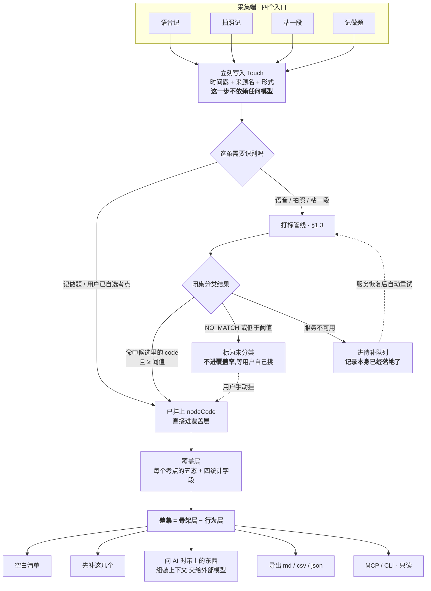
```mermaid
flowchart TD
    subgraph IN["采集端 · 四个入口"]
        A1[语音记]
        A2[拍照记]
        A3[粘一段]
        A4[记做题]
    end

    A1 --> W["立刻写入 Touch<br/>时间戳 + 来源名 + 形式<br/><b>这一步不依赖任何模型</b>"]
    A2 --> W
    A3 --> W
    A4 --> W

    W --> Q{"这条需要识别吗"}
    Q -->|"记做题 / 用户已自选考点"| DONE["已挂上 nodeCode<br/>直接进覆盖层"]
    Q -->|"语音 / 拍照 / 粘一段"| P["打标管线 · §1.3"]

    P --> R{"闭集分类结果"}
    R -->|"命中候选里的 code<br/>且 ≥ 阈值"| DONE
    R -->|"NO_MATCH 或低于阈值"| U["标为未分类<br/><b>不进覆盖率</b>,等用户自己挑"]
    R -->|"服务不可用"| RETRY["进待补队列<br/><b>记录本身已经落地了</b>"]

    DONE --> COV["覆盖层<br/>每个考点的五态 + 四统计字段"]
    U -.->|"用户手动挂"| DONE
    RETRY -.->|"服务恢复后自动重试"| P

    COV --> DIFF["<b>差集 = 骨架层 − 行为层</b>"]
    DIFF --> O1[空白清单]
    DIFF --> O2[先补这几个]
    DIFF --> O3["问 AI 时带上的东西<br/>组装上下文,交给外部模型"]
    DIFF --> O4["导出 md / csv / json"]
    DIFF --> O5["MCP / CLI · 只读"]
```

**这张图里有一条线是产品的命门:`W` 那一步不依赖任何模型。**

识别、转写、打标全部在 `W` 之后。所以断网、模型超时、密钥没配、额度用尽——任何一种都不会让「按下记一笔」失败。`总路线图 · 脑图与父子待办` §1.3.7.1 的原话是**记录动作本身永不失败**,在架构上就是这条线。

反过来说:**任何把识别放在写入之前的重构,都是在拆掉这条线**,不管它看起来多顺。

### 1.2 采集:四个入口收敛成一次写入

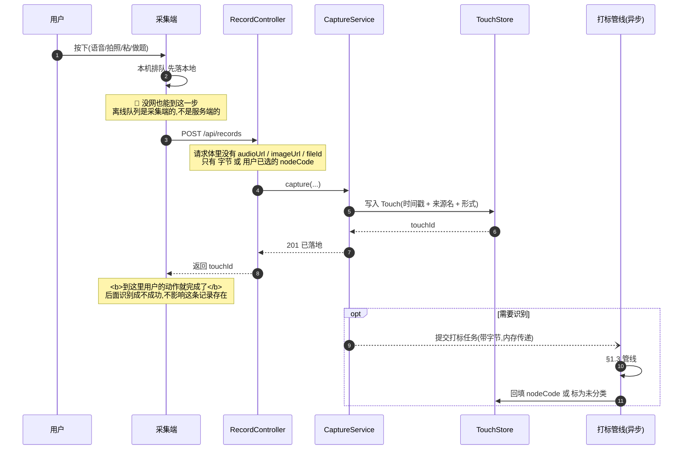
```mermaid
sequenceDiagram
    autonumber
    participant U as 用户
    participant C as 采集端
    participant API as RecordController
    participant S as CaptureService
    participant ST as TouchStore
    participant T as 打标管线(异步)

    U->>C: 按下(语音/拍照/粘/做题)
    C->>C: 本机排队,先落本地
    Note over C: 🔴 没网也能到这一步<br/>离线队列是采集端的,不是服务端的

    C->>API: POST /api/records
    Note over API: 请求体里没有 audioUrl / imageUrl / fileId<br/>只有 字节 或 用户已选的 nodeCode

    API->>S: capture(...)
    S->>ST: 写入 Touch(时间戳 + 来源名 + 形式)
    ST-->>S: touchId
    S-->>API: 201 已落地
    API-->>C: 返回 touchId
    Note over C: <b>到这里用户的动作就完成了</b><br/>后面识别成不成功,不影响这条记录存在

    opt 需要识别
        S--)T: 提交打标任务(带字节,内存传递)
        T->>T: §1.3 管线
        T->>ST: 回填 nodeCode 或 标为未分类
    end
```

> ⚠️ **「没网也能到这一步」说的是网,不是账号(2026-09-02 用户裁定「没有本地模式」)。** 登录是记录的前置,
> **这条离线队列是「已登录用户的离线队列」**;未登录 + 离线的处理是「等联网再登录」,不是「先记着,以后再说归谁」。
> **已登录状态下的离线可用性一格不变** —— 本地先落盘、联网后同步,「记录动作本身永不失败」这条线不动。

两个签名上的事实,不是约定而是结构:

| 事实 | 后果 |
|---|---|
| 请求体里**没有** `audioUrl` / `imageUrl` / `fileId` | 「先把原图传到某处,再传个引用过来」这条路不存在(`R-04`) |
| `Touch` 里**没有**能装下转写文本或题干的字段 | 「不碰内容」不是靠不填,是靠没有位置(`R-01` / `R-06`) |

> ⚠️ **2026-09-03 补一条指针(🔴 上面那张图一个字不改)** —— 原文见 `M1-记录采集与离线补传` §十二 增量 5。
>
> 图上 `S--)T: 提交打标任务(带字节,内存传递)` 画的是一次往返,而实际是两次:`POST /records` 的请求体六个字段里没有 `byte[]`
> (`CreateRecordRequest.java:67-90`),字节走第二次往返 `POST /records/{id}/image` 或 `/audio`。
> **这不是图画错了,是图画的是「记录先落地、识别在后」这个意图** —— `U1.1` 推论 2 逐字要求「识别是第二次往返,不是第一次的后半段」,
> 而两次往返正是那条推论的落地形态。落法见 `M1-记录采集与离线补传` §5.1。

### 1.3 打标管线:四段,**每一段都能丢弃**

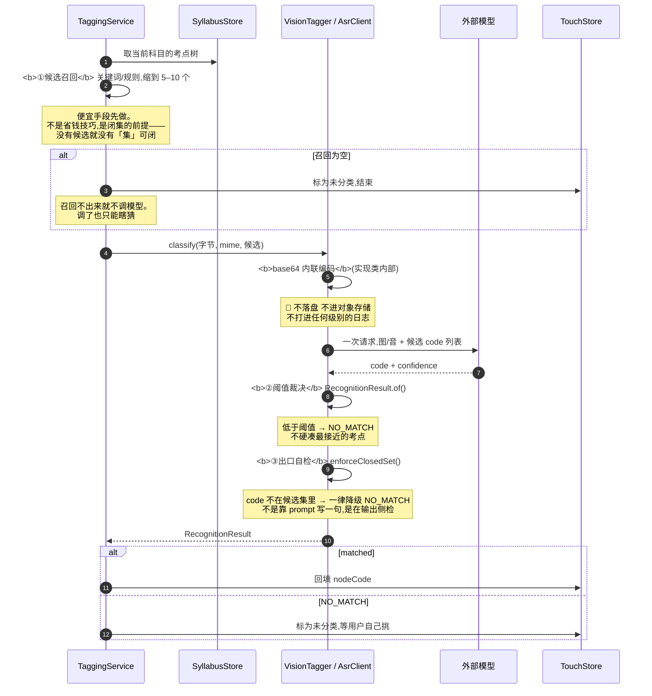
```mermaid
sequenceDiagram
    autonumber
    participant T as TaggingService
    participant SY as SyllabusStore
    participant V as VisionTagger / AsrClient
    participant M as 外部模型
    participant ST as TouchStore

    T->>SY: 取当前科目的考点树
    T->>T: <b>①候选召回</b> 关键词/规则,缩到 5–10 个
    Note over T: 便宜手段先做。<br/>不是省钱技巧,是闭集的前提——<br/>没有候选就没有「集」可闭

    alt 召回为空
        T->>ST: 标为未分类,结束
        Note over T: 召回不出来就不调模型。<br/>调了也只能瞎猜
    end

    T->>V: classify(字节, mime, 候选)
    V->>V: <b>base64 内联编码</b>(实现类内部)
    Note over V: 🔴 不落盘 不进对象存储<br/>不打进任何级别的日志
    V->>M: 一次请求,图/音 + 候选 code 列表
    M-->>V: code + confidence

    V->>V: <b>②阈值裁决</b> RecognitionResult.of()
    Note over V: 低于阈值 → NO_MATCH<br/>不硬凑最接近的考点
    V->>V: <b>③出口自检</b> enforceClosedSet()
    Note over V: code 不在候选集里 → 一律降级 NO_MATCH<br/>不是靠 prompt 写一句,是在输出侧检
    V-->>T: RecognitionResult

    alt matched
        T->>ST: 回填 nodeCode
    else NO_MATCH
        T->>ST: 标为未分类,等用户自己挑
    end
```

**四段里有三段的作用是「丢掉」。** 这不是保守,是 `项目现状与决策记录` §2.2 宁缺毋滥的技术形态:

> 覆盖度失真的话,这个产品就没有指标了。

阈值裁决与出口自检**都写在接口层,不写在实现类里**——`RecognitionResult.of()` 和 `VisionTagger.enforceClosedSet()` 都是接口上的静态方法。理由在 `server/` 的注释里已经写死了:**换厂商换的是实现类,换不掉这条线**。`识别链路选型 · ASR 与图像识别` 坑三要的切换点,不能顺带把红线也切换掉。

### 1.4 覆盖度与差集:唯一的那个数怎么算出来

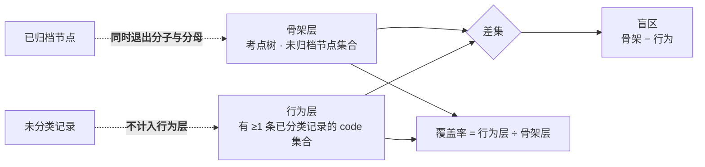
```mermaid
flowchart LR
    SY["骨架层<br/>考点树 · 未归档节点集合"] --> D{"差集"}
    BE["行为层<br/>有 ≥1 条已分类记录的 code 集合"] --> D
    D --> BLIND["盲区<br/>骨架 − 行为"]

    SY --> COV["覆盖率 = 行为层 ÷ 骨架层"]
    BE --> COV

    UNC["未分类记录"] -.->|"<b>不计入行为层</b>"| BE
    ARC["已归档节点"] -.->|"<b>同时退出分子与分母</b>"| SY
```

三条计算规则,每条都对应一个已登记的风险:

| 规则 | 为什么 | 风险 |
|---|---|---|
| **未分类记录不计入行为层** | 记了但没认出来 ≠ 碰过这个考点。计进去就是拿「记录数」冒充「覆盖」 | `R-05` 的延伸 |
| **已归档节点同时退出分子与分母** | 比值仍然诚实。只退分母会凭空涨,只退分子会凭空跌 | — |
| **归档数必须常驻可见** | 归档是**唯一一个不用真学就能让覆盖率上升的操作**——把空白全归档,44% 立刻变 100% | `R-49`(新) |

第三条是这一节里唯一需要产品动作的:归档计数常驻状态栏、导出带完整归档清单、归档区永远可见可找回。**三条都不做成开关。** 界面形态见 `notetool-ui-a` D21。

### 1.5 降级:哪些能砍,哪些永远不砍

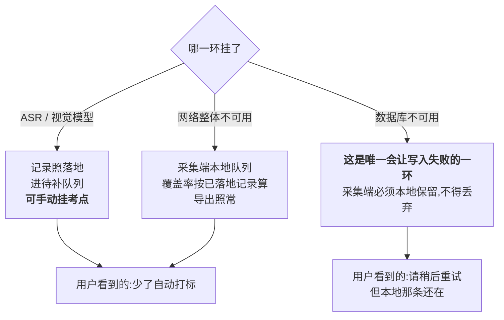
```mermaid
flowchart TD
    F{"哪一环挂了"}
    F -->|"ASR / 视觉模型"| K1["记录照落地<br/>进待补队列<br/><b>可手动挂考点</b>"]
    F -->|"网络整体不可用"| K2["采集端本地队列<br/>覆盖率按已落地记录算<br/>导出照常"]
    F -->|"数据库不可用"| K3["<b>这是唯一会让写入失败的一环</b><br/>采集端必须本地保留,不得丢弃"]

    K1 --> OK["用户看到的:少了自动打标"]
    K2 --> OK
    K3 --> BAD["用户看到的:请稍后重试<br/>但本地那条还在"]
```

**降级方向是「少功能」,不是「少记录」。** 一个记录工具只要失败过一次,用户就不再信它,后面所有的差集都失去意义。

还有一条容易混掉的区分,`server/` 里已经用两种返回形态钉死了:

| 情况 | 返回 | 界面该说的话 |
|---|---|---|
| 模型看了,说不匹配 | `RecognitionResult.noMatch()` | 「自己从树里挑一个」 |
| 模型压根没看成 | 抛 `RecognitionUnavailableException` | 「稍后重试」 |

混成一个返回值,界面上就只能说一句含糊的话。

### 1.6 登录与账号合并

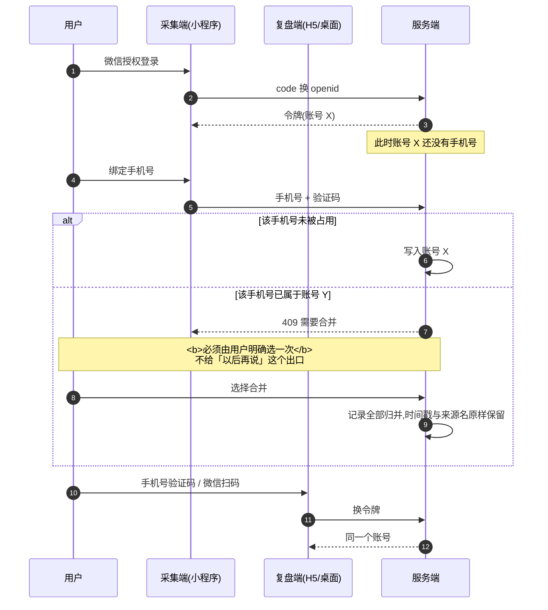
```mermaid
sequenceDiagram
    autonumber
    participant U as 用户
    participant A as 采集端(小程序)
    participant W as 复盘端(H5/桌面)
    participant S as 服务端

    U->>A: 微信授权登录
    A->>S: code 换 openid
    S-->>A: 令牌(账号 X)
    Note over S: 此时账号 X 还没有手机号

    U->>A: 绑定手机号
    A->>S: 手机号 + 验证码
    alt 该手机号未被占用
        S->>S: 写入账号 X
    else 该手机号已属于账号 Y
        S-->>A: 409 需要合并
        Note over U,S: <b>必须由用户明确选一次</b><br/>不给「以后再说」这个出口
        U->>S: 选择合并
        S->>S: 记录全部归并,时间戳与来源名原样保留
    end

    U->>W: 手机号验证码 / 微信扫码
    W->>S: 换令牌
    S-->>W: 同一个账号
```

**手机号是跨端的那个锚点。** 小程序只管采集、复盘在网页,如果两端不是一个账号,`盲区 = 骨架层 − 行为层` 会算出一个偏大的差集。

用户看到的症状是:**「我明明在 iPad 上听过这节课,为什么这里说我没碰过」**——而这一次误报,足以让他不再相信后面所有的差集。宁缺毋滥防的是错标,账号合并防的是漏记,**两者威胁的是同一个数**。界面见 `notetool-ui-a` D23。

### 1.7 注册即登录:**没有独立的注册**

契约里没有 `/auth/register`,以后也不会有。`/auth/sms/verify` 通过的那一刻,号码没见过就建号、见过就登进去。

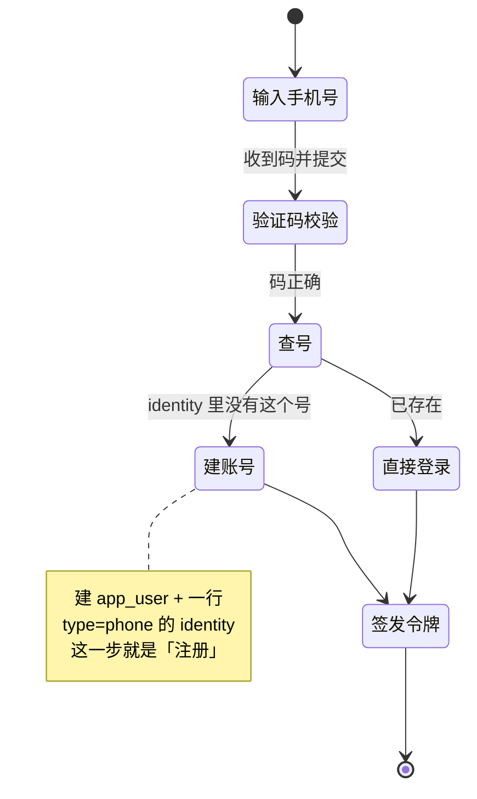
```mermaid
stateDiagram-v2
    [*] --> 输入手机号
    输入手机号 --> 验证码校验 : 收到码并提交
    验证码校验 --> 查号 : 码正确
    查号 --> 建账号 : identity 里没有这个号
    查号 --> 直接登录 : 已存在
    建账号 --> 签发令牌
    直接登录 --> 签发令牌
    签发令牌 --> [*]

    note right of 建账号
        建 app_user + 一行
        type=phone 的 identity
        这一步就是「注册」
    end note
```

**少一个页面是次要的,少一个「我到底注册过没有」的犹豫才是主要的**——而这个犹豫恰好发生在用户离开成本最低的那一秒。界面见 `notetool-ui-a` D25 右下角。

但有一个后果必须在服务端处理掉:

> **阶段 3 的判据是「累计 50 个陌生注册」,而界面上没有「注册」这个动作。**
> 所以 `建账号` 这条分支必须单独打点——**不能只统计登录成功次数**,那个数里混着老用户。
> 这不是产品需求,是判据能不能被算出来的问题。

### 1.8 验证码:四道闸的顺序决定了它防不防得住

契约里的约束是齐的(5 分钟有效、单次使用、错 5 次锁定、单号 1/60s 与 10/日、单 IP 20/日、外加滑块),**但契约没有写它们的先后**,而顺序恰恰是这件事的全部。


```mermaid
flowchart TD
    REQ["请求发送验证码"] --> G1{"① 行为验证<br/>滑块"}
    G1 -->|未通过| X1["拒绝<br/><b>一分钱没花</b>"]
    G1 -->|通过| G2{"② 单号频控<br/>1/60s · 10/日"}
    G2 -->|超限| X2["拒绝 · 告知准确重置时点"]
    G2 -->|通过| G3{"③ 单 IP 频控<br/>20/日"}
    G3 -->|超限| X2
    G3 -->|通过| SEND["④ 调运营商发短信<br/><b>这一步开始花钱</b>"]
    SEND --> OK["写入 sms_code<br/>5 分钟过期"]

    style SEND fill:#2a1a1a,stroke:#FF6B5A
    style G1 fill:#1a2a1a,stroke:#C9F24D
```

**滑块必须在①,不能在校验那一步。** 纯计数频控挡不住换 IP 刷短信费——换一批 IP、换一批号,单号 1/60s 与单 IP 20/日 两条都不触发,而每一条短信都是真金白银的外部账单。

> `商业化与额度设计` §3.2 已经定了:**短信验证码是按次外部账单,而且是用户主动触发的,但它不进额度**——对它计费等于对注册计费。
> 它由频控与滑块管住,不由额度管住。**频控解决薅羊毛,额度解决成本分摊,两者不能互相替代。**(`R-43`)
>
> 这是整条链路上**唯一一处「还没有账号的人就能让你花钱」的地方**。拦要拦在花钱那一步。

验证码本身的状态机:

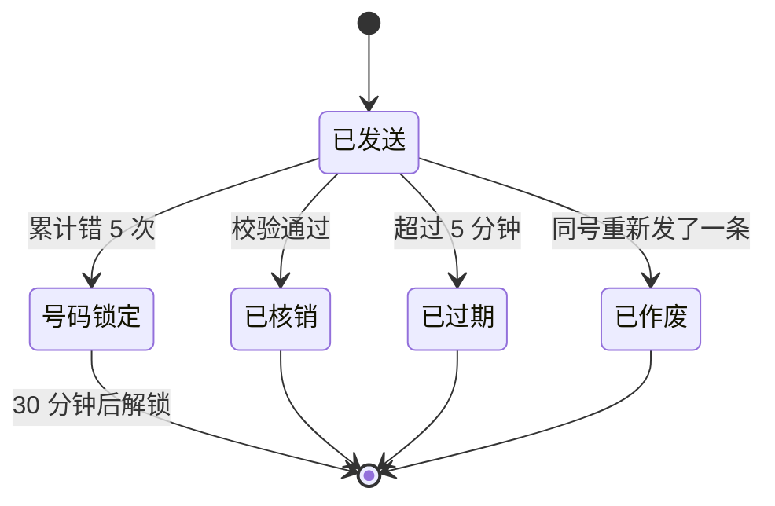
```mermaid
stateDiagram-v2
    [*] --> 已发送
    已发送 --> 已核销 : 校验通过
    已发送 --> 已过期 : 超过 5 分钟
    已发送 --> 已作废 : 同号重新发了一条
    已发送 --> 号码锁定 : 累计错 5 次
    号码锁定 --> [*] : 30 分钟后解锁
    已核销 --> [*]
    已过期 --> [*]
    已作废 --> [*]
```

**四种终态要给四句不同的话,不能合并成一句「验证码错误」。**

| 终态 | 用户该做的事 | 说成同一句话的后果 |
|---|---|---|
| 输错 | 重输 | — |
| 已过期 | **重发** | 用户拿着过期的码反复输,把自己输到锁定 |
| 已作废(同号发了新的) | **用新的那条** | 同上 |
| 频控/锁定 | **等到具体时点** | 「请稍后再试」只惩罚真实用户;刷子不会因为文案含糊而少刷 |

界面见 D25 / H18。

### 1.9 令牌:为什么「立即失效」这四个字排除了 JWT

`技术架构与接口契约` §7.4 已经定了形态(不透明随机串、只存 SHA-256、30 天滑动、多设备并存、前缀 `at_`/`ro_`)。这里只补生命周期与一处冲突。

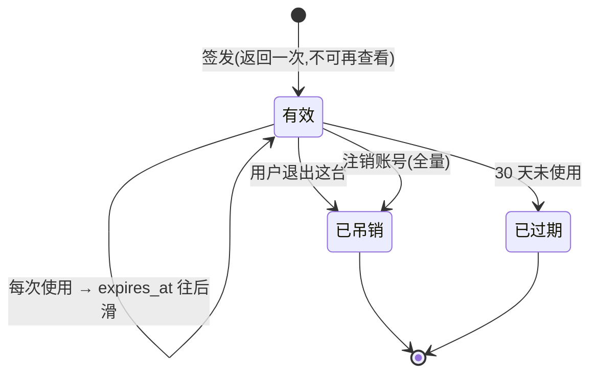
```mermaid
stateDiagram-v2
    [*] --> 有效 : 签发(返回一次,不可再查看)
    有效 --> 有效 : 每次使用 → expires_at 往后滑
    有效 --> 已吊销 : 用户退出这台
    有效 --> 已吊销 : 注销账号(全量)
    有效 --> 已过期 : 30 天未使用
    已吊销 --> [*]
    已过期 --> [*]
```

产品里有两处硬要求**撤销必须立刻生效**:注销账号,以及设备管理页的「退出这台」。JWT 在过期前无法撤销,要撤销就得另建黑名单表——**那等于每次请求都回库查一次,绕一圈回到有状态,还多背一套签名机制**。

`ro_` 前缀不是装饰:**拿着 `ro_` 的客户端换不出写能力,不是被判断为不许写。** MCP 与 CLI 用它,而 `技术架构与接口契约` §6.7.3 已定死支付与额度一律不进 MCP 白名单。

**一处会丢东西的冲突,必须在退出登录时拦一次:**

> 离线队列在设备本地。退出登录会连同本地缓存一起清掉——**「记录动作永不失败」这条线,不能被一次退出登录从背后捅穿。**
> 所以「退出这台」在检测到有未上传记录时先拦一次,提示先上传。界面见 D26。

### 1.10 订单:三条路,一次幂等写入

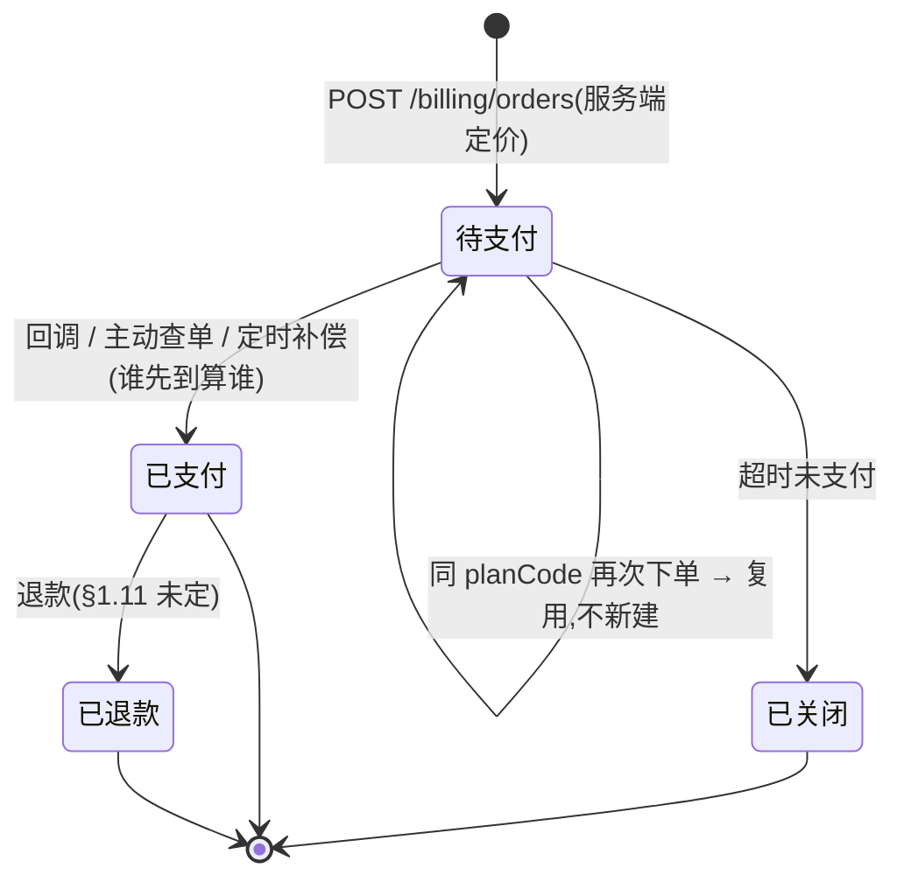
```mermaid
stateDiagram-v2
    [*] --> 待支付 : POST /billing/orders(服务端定价)
    待支付 --> 待支付 : 同 planCode 再次下单 → 复用,不新建
    待支付 --> 已支付 : 回调 / 主动查单 / 定时补偿(谁先到算谁)
    待支付 --> 已关闭 : 超时未支付
    已支付 --> 已退款 : 退款(§1.11 未定)
    已关闭 --> [*]
    已支付 --> [*]
    已退款 --> [*]
```

**「确认中」是一个独立的态,不能就近归到成功或失败。**

| 就近归到 | 后果 |
|---|---|
| 成功 | 没收到钱却发了权益 |
| **失败** | **用户明明扣了款,界面说没付上,他会再付一次** |

第二个更糟,因为那是产品主动诱导用户重复付款。所以界面上不给「重新支付」按钮,只给「再查一次」和「先去看盲区」——后者能成立,是因为 `商业化与额度设计` §2.1 定了**盲区诊断永不上锁**。界面见 D28。

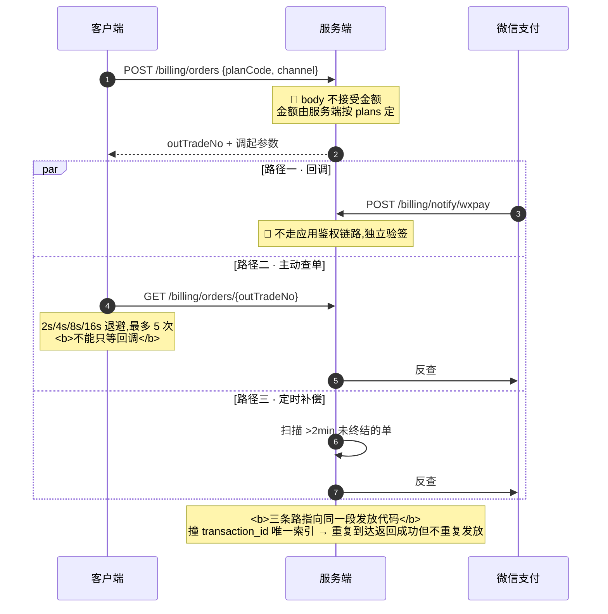
```mermaid
sequenceDiagram
    autonumber
    participant C as 客户端
    participant S as 服务端
    participant WX as 微信支付

    C->>S: POST /billing/orders {planCode, channel}
    Note over S: 🔴 body 不接受金额<br/>金额由服务端按 plans 定
    S-->>C: outTradeNo + 调起参数

    par 路径一 · 回调
        WX->>S: POST /billing/notify/wxpay
        Note over S: 🔴 不走应用鉴权链路,独立验签
    and 路径二 · 主动查单
        C->>S: GET /billing/orders/{outTradeNo}
        Note over C: 2s/4s/8s/16s 退避,最多 5 次<br/><b>不能只等回调</b>
        S->>WX: 反查
    and 路径三 · 定时补偿
        S->>S: 扫描 >2min 未终结的单
        S->>WX: 反查
    end

    Note over S: <b>三条路指向同一段发放代码</b><br/>撞 transaction_id 唯一索引 → 重复到达返回成功但不重复发放
```

**如果三条路各自发一次权益,用户付一次钱会拿到三个月会员。** 幂等锚点有两个,分工不同:

| 锚点 | 防的是 |
|---|---|
| `out_trade_no` 唯一 | **下单**幂等——用户连点两次不产生两笔单 |
| `transaction_id` 唯一 | **回调**幂等——重复通知/多路径到达不重复发放 |

还有一条不能省:**金额与 `payment_order.amount_fen` 不符 → 拒绝并告警,不发放。** 回调是外部输入,金额校验是最后一道。

会员生效侧只有一条规则值得写:**续费是延长 `expires_at`,不是新建行。** 所以 `user_subscription` 的唯一索引建在 `user_id` 上,历史在 `payment_order` 里。

### 1.11 退款:一个已经画进界面、但后端从没定义过的缺口 ⚪

**`notetool-ui-a` D18 的订单列表里已经有一笔「用了 2 天后退款」的已退款订单,而「退款之后额度和权益怎么算」在整个文档集里没有任何一处写过。** `商业化与额度设计` §7.3 只在年付语境下提了一句「退款规则怎么写、退多少,是律师稿的事」。

这不是措辞问题,因为那 2 天里用掉的 AI 调用是**真实发生的外部账单**——退款退的是 ¥9.90,成本收不回来。

三种写法,后果差别很大:

| | 写法 | 问题 |
|---|---|---|
| **A** | 额度立刻收回到免费档 | 已用 47 > 免费上限 30 → **`used > granted`**。库里出现 `remaining = -17`,后面每一处读额度的代码都要各自处理一次负数。**这是覆盖率之外第二个会算出负数的地方** |
| **B** | 本周期不动,下月起回免费档 | 最简单,已发生的不追回。**技术上倾向这个** |
| **C** | 按已用比例扣退款金额 | 必须在支付页事先讲清楚,否则是事后改规则 |

**但退款规则属于用户协议,不是架构能定的。** 和 `技术架构与接口契约` §6.1 那条「注销后的删除时点」一样,留到 `L-A5` 的律师稿,定完回填。

**现在就能定死的两条,与选 A/B/C 无关:**

| 约束 | 为什么与政策无关 |
|---|---|
| **退款幂等** —— 同一笔只处理一次 | 无论哪种写法,重复处理都是错的 |
| **额度不许为负** —— 条件更新,受影响 0 行即视为耗尽 | 这是 `技术架构与接口契约` §6.7.2 已定的第 3 条,退款不构成例外 |

---

## 二、分层与包结构

按 `server/` 的实际形态,不是理想形态。

| 包 | 职责 | 当前状态 |
|---|---|---|
| `api` | 收参数、翻 DTO、出错误码。**不含任何规则** | 已建,6 个 controller |
| `collect` | `Touch` / `TouchStore` / `CaptureService`——采集与落地 | 已建,文件存储 |
| `syllabus` | 考点树的读与写,**所有骨架规则在这里** | 已建,文件存储 |
| `coverage` | 五态推导、覆盖率、差集 | 已建 |
| `recognize` | **整个后端唯一允许出现外部模型调用的地方** | 接口已建,实现为 Stub |
| `tagging` | 打标管线(候选召回 → 调用 → 回填) | **未建**,§1.3 是它的设计 |

两条已经在代码里生效的纪律,值得写下来因为它们容易在赶工时被破坏:

- **规则放在 store 而不是 controller**——controller 可以再写一个,store 只有这一个。
- **`recognize` 之外不得出现 HTTP 调模型**。别处出现就是绕开了 `识别链路选型 · ASR 与图像识别` 坑三要的切换点。

---

## 三、外部模型接入:实测版本矩阵 🔴

**这一节是本文最重要的一节,而且结论与直觉相反。**

### 3.1 实测方法

不查文档,建一个与 `server/` 同款的探针工程(Spring Boot 4.1.1 / Java 21),用独立 Maven 配置构建:

```
./mvnw -s ~/.m2/settings-side.xml dependency:tree
./mvnw -s ~/.m2/settings-side.xml test     # 起 Spring 上下文 + 反射解析类的全部方法签名
```

#### 这套方法能证明什么、不能证明什么 ⚠

**先把取证强度说清楚,否则后面每条结论都会被读大。**

| 这套方法能证明 | 不能证明 |
|---|---|
| 依赖能否解析、版本如何收敛 | 模型调用能否成功 |
| 类能否加载、方法签名与接口关系能否解析 | 转写 / 闭集分类的**能力**是否可用 |
| Spring 上下文能否启动 | 端到端延迟、准确率、配额 |

**全程没有一次真实模型调用**——探针里的 key 是 `sk-probe-not-real`,拿不到任何真实响应。

**还有一处不对称要说明:** 下面的 `[PROBE] OK/FAIL` 逐类测试只针对 `dashscope.*`,也就是**最终被排除的那条路**。推荐的路径 A 没有同样形式的逐类探针,它的证据来自探针工程的**两次运行**:

| 运行 | 配置 | 结果 | 证明了什么 |
|---|---|---|---|
| 第一次 | `@SpringBootTest` **不带任何 api-key** | 上下文启动失败:<br/>`OpenAiAudioSpeechModel` → `At least one credential source must be specified` | OpenAI 那一整套自动装配**确实被执行到了**,而且是**急切实例化**——`§4.2` 那条「必须显式 exclude 用不到的模型」就是从这里来的 |
| 第二次 | 加上 `spring.ai.openai.api-key=sk-probe-not-real` | 上下文正常启动,`[PROBE]` 用例跑完 | 路径 A **装配得起来** |

**下面贴的测试类是第二次那一版**(带占位 key),所以它自己不会再复现第一次那个失败——那条结论属于第一次运行,两次是分开的。

**两次都只是装配层证据,不是能力层证据**,与上表的口径一致。

由此产生一个**证据强度的不对称**,是理解 §3.3 的前提:

- **否定性结论是充分的。** 类加载不了,就一定不能用——不需要再调一次模型来确认。
- **肯定性结论只到「链接层」。** 「能加载」不等于「能干活」,所以下面凡是正面结论都只说到链接为止,不外推。

#### 探针工件(复现所需的最小集)

`pom.xml` 关键部分——与 `server/` 同 parent,只 import **一个 BOM**(`spring-ai-bom`),外加**一个手写版本号的依赖**。

**为什么这里没有 `spring-ai-alibaba-bom`:** 它存在,但**不托管任何 dashscope 构件**(核心库与 starter 都不在;它实际托管的 8 个构件逐一列在 §3.5)。import 了也管不到我们要的那个,所以干脆不引、直接手写版本号——**这件事本身就是 §3.5 「何时重新评估」那条判据的来源**。

```xml
<parent><groupId>org.springframework.boot</groupId>
  <artifactId>spring-boot-starter-parent</artifactId><version>4.1.1</version></parent>
<dependencyManagement><dependencies>
  <dependency><groupId>org.springframework.ai</groupId>
    <artifactId>spring-ai-bom</artifactId><version>2.0.1</version>
    <type>pom</type><scope>import</scope></dependency>
</dependencies></dependencyManagement>
<dependencies>
  <dependency><groupId>org.springframework.boot</groupId>
    <artifactId>spring-boot-starter-webmvc</artifactId></dependency>
  <dependency><groupId>org.springframework.ai</groupId>
    <artifactId>spring-ai-starter-model-openai</artifactId></dependency>
  <!-- 核心库,不走 starter:starter 因打包缺陷起不来,见结论二 -->
  <dependency><groupId>com.alibaba.cloud.ai</groupId>
    <artifactId>spring-ai-alibaba-dashscope</artifactId><version>2.0.0-M1.1</version></dependency>
</dependencies>
```

测试类——**只做类加载与签名解析,不发请求**:

```java
@SpringBootTest(properties = {"spring.ai.openai.api-key=sk-probe-not-real"})
class DashScopeLinkTest {
    @Test void 链接测试() {
        for (String t : new String[]{
            "com.alibaba.cloud.ai.dashscope.chat.DashScopeChatModel",
            "com.alibaba.cloud.ai.dashscope.api.DashScopeApi",
            "com.alibaba.cloud.ai.dashscope.audio.transcription.DashScopeAudioTranscriptionModel"}) {
            try {
                Class<?> c = Class.forName(t);
                for (var m : c.getDeclaredMethods()) { m.getParameterTypes(); m.getReturnType(); }
                for (Class<?> i : c.getInterfaces()) i.getName();   // 接口漂移在这里暴露
                System.out.println("[PROBE] OK  " + t);
            } catch (Throwable e) {
                System.out.println("[PROBE] FAIL " + t + " → " + e.getClass().getSimpleName());
            }
        }
    }
}
```

`~/.m2/settings-side.xml` 的最小内容——**只有一个公共镜像,没有任何内网地址与凭据**:

```xml
<settings>
  <localRepository>${user.home}/.m2/repo-side</localRepository>
  <mirrors><mirror>
    <id>aliyun-public</id>
    <url>https://maven.aliyun.com/repository/public</url>
    <mirrorOf>central</mirrorOf>
  </mirror></mirrors>
  <proxies/><servers/>   <!-- 🔴 servers 必须为空:公共镜像不需要凭据,出现凭据即说明指向了私服 -->
</settings>
```

完整版与白名单校验逻辑见 `技术架构与接口契约` §1.3 与 `server/build.sh`(后者会剥掉 XML 注释后逐个校验 `<url>` 的 host)。

> **顺带实测到一件事:** 第一次跑忘了带 `-s`,构建立刻打向 `maven.corp.fenbi.com`(公司私服)并失败。
> 这把 `技术架构与接口契约` §1.3 从「预测」变成了「实测」——**本机 `~/.m2/settings.xml` 里那条 `mirrorOf=central` 的公司私服镜像是真实生效的**——`mirrorOf=central` 会把所有本该发往 Maven Central 的请求改道,所以**不带 `-s` 且需要下载任何依赖的 `mvn`,都会走公司内网**。(全部命中本地缓存、不出网的构建除外——但那不是可依赖的状态,清一次缓存就没了。)
> `server/build.sh` 已经把这条隔离做成强制入口,而且正确处理了「注释里出现内网地址是反例说明、不是配置」这个细节。**隔离线是稳的,自检五条全过。**

### 3.2 版本事实(权威来源:`repo1.maven.org` 的 `maven-metadata.xml`)

| 构件 | 最新 GA | 最新任意版 | 对应 Spring Boot |
|---|---|---|---|
| `org.springframework.ai:spring-ai-bom` | **2.0.1** | 2.0.1 | **4.0 / 4.1** ✅ |
| ↳ 同构件的 1.1.x 线 | **1.1.8**(1.1.0–1.1.8 共 9 个 GA) | — | 3.5.x |
| `com.alibaba.cloud.ai:spring-ai-alibaba-bom` | **1.1.2.3** | `2.0.0-M1.1`(里程碑) | GA 线 → **3.5.x** |

> ⚠ **官网文档页 `java2ai.com/docs/versions/` 说「最新 1.1.2.0」,与 Maven Central 不一致(实际 GA 已到 1.1.2.3,另有 2.0.0-M1.1)。**
> 遇到这类不一致,以 `maven-metadata.xml` 为准——文档页会滞后,仓库不会。

### 3.3 三项实测结论

**结论一:`spring-ai 2.0.1` + `Spring Boot 4.1.1` 在依赖与启动层面成立。** 依赖树干净收敛,上下文正常启动。**没有做过一次真实模型调用**,所以这条只说到「装得起来」,不含「调得通」。

**结论二:`spring-ai-alibaba-starter-dashscope:2.0.0-M1.1` 起不来——打包缺陷。**

```
IllegalStateException: Unable to read meta-data for class
  com.alibaba.cloud.ai.autoconfigure.dashscope.DashScopeMultimodalEmbeddingAutoConfiguration
Caused by: FileNotFoundException: ... cannot be opened because it does not exist
```

拆开 jar 核对:`AutoConfiguration.imports` **注册了 10 个自动装配类,jar 里只有 9 个**。`DashScopeMultimodalEmbeddingAutoConfiguration` 被注册但没打进去。

**结论三:绕开 starter 直接用核心库,视觉那条路仍然断;语音那条路只证明到「类能加载」。**

| 类 | 在 `spring-ai 2.0.1 GA` 上 | 说明 |
|---|---|---|
| `DashScopeChatModel` | ❌ `NoClassDefFoundError:`<br/>`org/springframework/ai/model/tool/ToolExecutionEligibilityPredicate` | **闭集分类要用的就是它** |
| `DashScopeApi` | ✅ 链接成功(39 方法) | |
| `...audio.transcription.DashScopeAudioTranscriptionModel` | ⚠ 链接成功(17 方法) | 语音路径。**仅类加载通过,未验证转写可用** |

根因已核实到字节码层:

| jar | `ToolExecutionEligibilityPredicate` |
|---|---|
| `spring-ai-model:2.0.0-M1` | 存在 |
| `spring-ai-model:2.0.1` | **不存在** |

`spring-ai-alibaba 2.0.0-M1.1` 编译在 `spring-ai 2.0.0-M1` 上,而 GA 把这个类移走了。Maven 能解析、能编译,**在类加载那一刻失败**——最坏的一类失败:构建期无声,调模型时才炸。

> 这和 `识别链路选型 · ASR 与图像识别` 坑三是同一个形状,只是下沉了一层:**坑三防的是实验版*模型*没有稳定性承诺,这里是里程碑版*框架*没有稳定性承诺。** `R-35` 的缓解手段在这里同样有效——因为切换点已经建好了。

### 3.4 三条路对照

| | A · 保持 Boot 4 + spring-ai GA | B · 降到 Boot 3.5 换 alibaba GA | C · Boot 4 + alibaba 里程碑 |
|---|---|---|---|
| Spring Boot | 4.1.1(现状,不动) | **3.5.x(降级)** | 4.1.1 |
| spring-ai | 2.0.1 GA | 1.1.8 GA | 2.0.1 GA |
| spring-ai-alibaba | **不引** | 1.1.2.3 GA | 2.0.0-M1.1 |
| 视觉闭集分类 | OpenAI 兼容端点 | DashScope 原生 | ❌ **实测起不来** |
| 语音 | **腾讯云一句话识别**(`识别链路选型 · ASR 与图像识别` 既定)<br/>备选:百炼 `qwen3-asr`(⚠ 见 §5.2) | DashScope 原生 | ⚠ 单类可用,starter 不可用 |
| 代价 | 用不上 DashScope 独有特性 | 要回退 `spring-boot-starter-webmvc` → `-web`、**Jackson 3 → 2**(`application.properties` 里两处键名要改),现有测试全部重跑 | **实测不可行** |
| 结论 | ✅ **推荐** | ⚪ 可行但代价明确 | ❌ 排除 |

#### 排除 C 之前,考虑过的缓解手段 ⚠

**「类被移走」这件事有一个显而易见的绕法:把 `spring-ai` 钉回 `2.0.0-M1`。** `ToolExecutionEligibilityPredicate` 在 M1 里存在,钉回去 `NoClassDefFoundError` 理论上就消失了。

**这条路没有实测,而且不打算测。** 理由不是懒,是它把问题换了个地方而不是解决:

| 钉回 M1 之后 | |
|---|---|
| spring-ai 从 **GA** 变回 **里程碑** | 为了迁就一个里程碑版适配器,把底座也降成里程碑版 |
| Spring Boot 4.1.1 兼容性重新变成未知 | `spring-ai 2.0.0-M1` 的基线是 Boot 4.0,4.1 未验证 |
| 整条依赖被钉死 | 之后 spring-ai 的任何补丁都吃不到,除非 alibaba 先发 GA |

**所以 C 的排除理由要说准确:不是「技术上无解」,是「已知的那条解要求把 GA 底座降成里程碑,代价高于它带来的收益」。** 上表「实测不可行」四个字指的是**默认依赖解析下的实测结果**,不是「穷尽了所有配置组合」——所以这里也不写「唯一」:可能还有别的绕法,只是都得先回答同一个问题「为了一个用不上的适配器,愿意付出多少」。

### 3.5 推荐:A,并且理由不止「它能跑」

**DeepSeek 与阿里百炼都提供 OpenAI 兼容端点。** 所以在**视觉闭集分类**这条路上,`spring-ai-starter-model-openai` 一个客户端靠 `base-url` 就能覆盖两家:

| 供应商 | base-url | 对应 `识别链路选型 · ASR 与图像识别` |
|---|---|---|
| DeepSeek | `https://api.deepseek.com` | `识别链路选型 · ASR 与图像识别` §一 的既定选择 |
| 阿里百炼 | `https://dashscope.aliyuncs.com/compatible-mode/v1` | 备选 / 切换目标 |

**在这条路上,换供应商 = 改一行配置,不改代码。**

#### 🔴 但这句话**只对视觉/文本路径成立,不能推广到语音**

这是本节最容易被读大的一句,所以把边界写死:

| 路径 | 换供应商的真实成本 | 为什么 |
|---|---|---|
| 视觉闭集分类 | **改一行 `base-url`** | 两家都提供 OpenAI 兼容的 chat/completions |
| **语音转写** | **换一个 `AsrClient` 实现类** | `识别链路选型 · ASR 与图像识别` §一 定的是**腾讯云一句话识别**,它既不是 OpenAI 兼容端点、也不是 base-url 能切的。语音当然也可以换供应商(腾讯云 → 百炼 / 本机 whisper / 别家),**但换的是一个实现类,不是一行配置**——上面那张 base-url 表里的「DeepSeek / 百炼」这一对在语音上不成立,因为 **DeepSeek 根本没有音频转写接口** |

所以 §3.4 方案 A 的语音格**直接点名供应商,不写协议名**:腾讯云是既定选择,百炼是备选。两者是**两条不同的接入方式**——一条手写 `RestClient`,一条走 chat/completions(⚠ §5.2)——**不是同一个客户端的两个 base-url**。用「OpenAI 兼容」四个字去描述语音选项,恰好会被读成后者。

**协议兼容 ≠ 能力等价**,这一点还有第二层:闭集分类依赖的结构化输出/受限枚举在两家兼容端点上的行为是否一致,**本文没有实测**(§3.1 的方法只到类加载层)。真要切换供应商,那一次必须是端到端跑评测集,不是改完配置就发版。

> 而 `AsrClient` / `VisionTagger` 两个接口的价值恰恰在这里:**上面这两种成本差异,被挡在接口下面,调用方一行都不用改。**

而 `spring-ai-alibaba` 的增量价值(DashScope 原生特性、Graph、Agent 框架、Nacos 集成)对本产品**一个都用不上**:我们只要「图 + 候选 → 一个 code」和「音频 → 一段文字」这两个最普通的能力。

**何时重新评估(可逆决策的改变条件):** `spring-ai-alibaba` 发布对齐 `spring-ai 2.x GA` 的正式版,**且**其 BOM 真正托管 dashscope 相关构件。

> **✅ 复核记录 · 2026-08-28(应「把两个都换成最新版」的要求实测,结论:两条件<u>仍未满足</u>,不改)**
>
> | 查的东西 | 实测结果 |
> |---|---|
> | `spring-ai-bom` 最新 | **2.0.1** —— 就是我们在用的版本,没有更新的 |
> | `spring-ai-alibaba-bom` 最新 | **2.0.0-M1.1**,仍是里程碑,**至今无 GA**(GA 线仍止于 1.1.2.3) |
> | 该 BOM 托管的构件 | **7 个**(a2a-nacos / config-nacos / graph-observation / agent-framework / graph-core / studio / sandbox)——**dashscope 核心库与 starter 都不在** |
> | `spring-ai-alibaba-dashscope` 最新 | 2.0.0-M1.1(手写版本号仍是唯一办法) |
> | `DashScopeChatModel` 引用 `ToolExecutionEligibilityPredicate` | **12 次** |
> | 该类在 `spring-ai 2.0.1` | **不存在**(`javap` 找不到类) |
> | 该类在 `spring-ai 2.0.0-M1` | 存在 |
>
> 也就是说:**要引入 alibaba 最新版,必须把 `spring-ai` 从 2.0.1 GA <u>降回</u> 2.0.0-M1 里程碑版。**
> 那正是本节上面已经否决过的那条路(底座退回里程碑 / Boot 4.1.1 兼容性重新变未知 / 吃不到后续补丁),
> 而且失败形态最坏 —— **Maven 能解析、能编译,在类加载那一刻才炸**。
>
> 顺带核对:`spring-boot-starter-parent` 最新正式版也是 **4.1.1**,即当前所用。
> **三个版本号全部已是最新,本次零改动。**
>
> ⚠️ 下次再有人问「能不能升级 alibaba」,先跑这三条命令,不要凭印象答:
> ```bash
> curl -s https://repo1.maven.org/maven2/com/alibaba/cloud/ai/spring-ai-alibaba-bom/maven-metadata.xml | grep -o '<release>[^<]*'
> curl -s https://repo1.maven.org/maven2/com/alibaba/cloud/ai/spring-ai-alibaba-bom/<版本>/spring-ai-alibaba-bom-<版本>.pom | grep dashscope   # 空 = BOM 仍不托管
> javap -cp <spring-ai jars> org.springframework.ai.model.tool.ToolExecutionEligibilityPredicate  # 找不到类 = 仍不兼容
> ```

> 当前 `spring-ai-alibaba-bom:2.0.0-M1.1` 只托管 8 个构件(agent-framework / graph-core / sandbox / studio / 三个 starter-*-nacos / bom 自身),**`spring-ai-alibaba-dashscope`(核心库)与 `spring-ai-alibaba-starter-dashscope`(starter)两个都不在里面**——无论走哪条路都只能手写版本号。一个 BOM 不托管自己最主要的模型构件,**这本身就是没准备好的信号**。

---

## 四、spring-ai 落在哪一层

### 4.1 落在实现类内部,**不上升**


```mermaid
flowchart TD
    C["Controller / TaggingService"] --> I["<b>AsrClient / VisionTagger</b><br/>接口层 · 09 坑三的切换点"]
    I --> IMPL1["OpenAiVisionTagger<br/><i>内部持有 spring-ai ChatModel</i>"]
    I --> IMPL2["TencentAsrClient<br/><i>内部持有 RestClient</i>"]
    I --> IMPL3["StubVisionTagger / StubAsrClient<br/><i>没配密钥时诚实失败</i>"]

    IMPL1 --> SA["spring-ai 2.0.1"]
    SA --> EP["OpenAI 兼容端点<br/>base-url 决定是谁"]

    style I fill:#1a1a1a,stroke:#C9F24D,stroke-width:2px
```

**`ChatModel` / `ChatClient` 不得越过那条绿线。** 三个理由,每个都对应一条已定的约束:

| 如果让 `ChatClient` 上升到 service 层 | 会踩到 |
|---|---|
| 返回的是自由文本,`RecognitionResult` 那层「没有 String label 字段」的类型保护就没了 | `R-07` / `识别链路选型 · ASR 与图像识别` 坑一 |
| 切换点从「我们的接口」变成「spring-ai 的接口」,厂商下线时要改的地方从 1 处变成 N 处 | `R-35` / `识别链路选型 · ASR 与图像识别` 坑三 |
| 任何人都能在别处 `@Autowired ChatModel` 直接问模型,**能力边界就没有物理形态了** | `R-05` 不判断对错 |

> **⚠ 2026-08-28:这条绿线被 agent 触碰了,处理方式记在这里 —— 见 `R-75`。**
>
> `kaodian-agent` 模块接了一个对话 agent,它**本来就是要问模型的**,与上面第三行直接冲突。
> 处理办法不是给它开一个例外(例外没有形状,下一个人会照着开第二个),而是
> **把同一条纪律在 agent 侧再执行一遍**,三件事都有物理形态:
>
> | 做法 | 由什么钉住 |
> |---|---|
> | 模型接入封在 `AgentLlm` 接口后面,实现只有 `OpenAiAgentLlm` / `StubAgentLlm` 两个 | 代码结构 |
> | spring-ai 的类型**只许出现在 `agent.llm` 一个包内** | `AgentBoundaryTest#springAiStaysInsideLlmPackage`(扫源码) |
> | 模型能做什么由**工具池白名单**封顶,且池内**不许有 EFFECT 级工具** | `AgentBoundaryTest#toolPoolIsReadOnly` |
>
> 于是「除 `recognize` 外无 `ChatModel` 注入点」这句话本身**不再成立**,
> 代之以更弱但仍可检查的一条:**注入点仍然可数,而且每一处都有名字**
> (今天是 `recognize` 与 `agent.llm` 两处)。
>
> 🔴 **最要紧的一句**:提示词里那段「不判断对错」是**第二道**防线,不是第一道 ——
> 它只是<u>请求</u>模型别做某事,模型可以不听,而且不会有任何东西报错。
> 真正让它做不到的是工具池:判断对错所需要的数据(题干、标准答案、解析)**一个工具都拿不到**。
> 谁将来往工具池里加一个能返回题目内容的工具,这条边界就在那一刻失效了 ——
> 而那**不会**是一次重构,那是一次产品定义的改变。

### 4.2 装配形态

```xml
<!-- pom.xml · dependencyManagement -->
<dependency>
  <groupId>org.springframework.ai</groupId>
  <artifactId>spring-ai-bom</artifactId>
  <version>2.0.1</version>
  <type>pom</type><scope>import</scope>
</dependency>
```

```properties
# 🔴 密钥只走环境变量,不进仓库(R-08 的延伸)
spring.ai.openai.api-key=${KAODIAN_MODEL_KEY}
spring.ai.openai.base-url=${KAODIAN_MODEL_BASE_URL}
spring.ai.openai.chat.options.model=${KAODIAN_VISION_MODEL}
spring.ai.openai.chat.options.temperature=0
```

⚠️ **2026-09-03 实读:上面这一行与 `application.properties` 对不上**(`M2-打标管线与模型接入` §十三 增量 6)。
实际那一行是 `${KAODIAN_AGENT_MODEL:minimax/minimax-m3:free}`(`application.properties:232`),
**`KAODIAN_VISION_MODEL` 在配置文件里根本不存在**,且这一行是**对话 agent 与视觉打标共用**的。

**后果**:视觉打标一旦复用这个自动装配的 `ChatModel`,「换视觉供应商」会连带把对话 agent 的模型也换掉 ——
§3.5「换供应商 = 改一行 `base-url`」这句话对协议成立,**对今天这份代码不成立**。
收口见 `M2-打标管线与模型接入` §七:视觉自己造 `ChatClient`,切换点落在 `kaodian.recognize.vision.base-url` 一行。

**⚠ 一个实测踩到的坑:`spring-ai-starter-model-openai` 会把 OpenAI 的全套模型都自动装配一遍**——chat、embedding、image、audio-speech、audio-transcription。探针里只要没给 `api-key`,上下文在 `OpenAiAudioSpeechModel` 就启动失败:

```
Failed to instantiate [org.springframework.ai.openai.OpenAiAudioSpeechModel]:
  At least one credential source must be specified
```

我们只需要 chat 一个。**多出来的那几个不只是浪费,它们是能力边界上的漏洞**——一个装配好的 `OpenAiImageModel` 意味着「让模型画个图」在技术上随时可用。所以要显式排除:

```properties
spring.autoconfigure.exclude=\
  org.springframework.ai.model.openai.autoconfigure.OpenAiImageAutoConfiguration,\
  org.springframework.ai.model.openai.autoconfigure.OpenAiAudioSpeechAutoConfiguration,\
  org.springframework.ai.model.openai.autoconfigure.OpenAiEmbeddingAutoConfiguration
```

> ⚠ 类名以实际引入的 `spring-ai` 版本为准,动手时用 `--debug` 看一遍自动装配报告再抄。

> **⚠ 2026-08-28 勘误(实测):上面这份清单是三条,而 `spring-ai 2.0.1` 实际有<u>六个</u>自动装配类
> —— 漏了 `audio-transcription` 与 `moderation`。** 原文保留在上面不删(它记录了探针阶段的认知),
> 生效清单以下面这份为准,已落到 `server/kaodian-app/src/main/resources/application.properties`:
>
> ```properties
> spring.autoconfigure.exclude=\
>   org.springframework.ai.model.openai.autoconfigure.OpenAiEmbeddingAutoConfiguration,\
>   org.springframework.ai.model.openai.autoconfigure.OpenAiImageAutoConfiguration,\
>   org.springframework.ai.model.openai.autoconfigure.OpenAiAudioSpeechAutoConfiguration,\
>   org.springframework.ai.model.openai.autoconfigure.OpenAiAudioTranscriptionAutoConfiguration,\
>   org.springframework.ai.model.openai.autoconfigure.OpenAiModerationAutoConfiguration
> ```
>
> **`moderation` 尤其不能漏** —— 它在 `NoGenerativeModelBeanTest` 的禁令表里就有一行,
> 理由是「内容审核要求把内容送出去,而我们不碰内容」。也就是说:**这份文档漏掉的那一项,
> 恰好是断言表里已经写着的那一项** —— 两份清单各写各的,于是各漏各的。
>
> 教训不是「下次写全一点」,而是 **清单不该靠人记**。正确做法是直接问 jar:
> ```bash
> unzip -p ~/.m2/repo-side/org/springframework/ai/spring-ai-autoconfigure-model-openai/2.0.1/\
> spring-ai-autoconfigure-model-openai-2.0.1.jar \
>   META-INF/spring/org.springframework.boot.autoconfigure.AutoConfiguration.imports
> ```
> 升级 `spring-ai` 版本时**必须重跑这条命令** —— 新版本多出来的模型不会有人通知你,
> 而 `R-51` 的破口正是这么产生的。

> **另一条实测记录(2026-08-28):曾试过比 exclude 更强的一档,走不通。**
> 思路是只引核心库 `spring-ai-openai`(不引 starter),自己 `@Bean` 造 `ChatModel` ——
> 这样那五个越界模型的自动装配类**根本不在类路径上**,不是「排除掉」而是「不存在」。
> 失败原因:`spring-ai 2.x` 的 `OpenAiChatModel` 底层换成了官方 `openai-java` SDK,
> 唯一装配入口是 `OpenAiSetup.setupSyncClient(...)` —— **一个 16 参、无文档的内部 API**
> (`Credential` / `AzureOpenAIServiceVersion` / `azureUrlPathMode` 等参数含义只能靠猜),
> 流式还要再造一个 async client。手写它换来的不是更安全,是一个**参数顺序错了也不会报错**的装配。
> 所以退回 starter + exclude 这条路。`kaodian-agent/pom.xml` 里记着同一段。

`Stub` 与真实实现的切换用 `@ConditionalOnProperty` 挂在密钥上:**没配密钥 = Stub 生效 = 诚实失败**,不是静默降级成假数据。这条已经在 `StubAsrClient` 的注释里写死了。

---

## 五、语音接入

### 5.1 三个阶段用三样东西,这不是折中

| 阶段 | 用什么 | 为什么 | 出处 |
|---|---|---|---|
| **阶段 0** | 本机 whisper(mlx-whisper) | 零调用成本、零网络依赖,**专注测采集摩擦** | `识别链路选型 · ASR 与图像识别` §六 |
| **阶段 1–2** | 腾讯云一句话识别 | 免费 5,000 次/月,覆盖到阶段 3,**成本为 0** | `识别链路选型 · ASR 与图像识别` §一 |
| 备选 | 百炼 `qwen3-asr-flash` | 与视觉同一家,少一套密钥 | 本文 §三 |

> `识别链路选型 · ASR 与图像识别` §六 实测过本机现状:M2 Max 跑得动,但 **mlx-whisper 与 pyobjc Vision 都未安装**。「本地模型」目前是计划不是现成能力,阶段 0 动手前要先装。

### 5.2 ⚠ 一个会让人白写代码的坑

百炼的 `qwen3-asr` 在 OpenAI 兼容模式下走的是 **`/compatible-mode/v1/chat/completions`**,**不是 `/audio/transcriptions`**。

这意味着:**Spring AI 的 `OpenAiAudioTranscriptionModel` 对不上**——它打的是 `/audio/transcriptions`。要接百炼 ASR,得用 `ChatModel` + 音频 `Media`,不是 `AudioTranscriptionModel`。

> ⚠ 这一条来自文档检索,**未实测**。真要走这条路,先用 curl 打一次确认端点形态,再写代码。

而 `AsrClient` 这个接口把这件事挡在了外面:签名是 `String transcribe(byte[], String)`,**接口不关心对面是 chat 还是 transcription 端点**。换实现类就行。

### 5.3 时长与体积

`总路线图 · 脑图与父子待办` `1.1.1.4` 定的 ≤60s 上限属于**调用方约束,不放在接口里**——`AsrClient` 只负责「一段字节进,一段文字出」。上限在 `CaptureService` 里校验,理由是它会随供应商变,而接口不该跟着变。

⚠️ **2026-09-03 实测落点更正(原句不改,`M1-记录采集与离线补传` §十二 增量 5)**:校验实际在 `RecognitionController.java:401`,
且 `CaptureService` 的构造器四个参数里**没有 `AsrClient`**。
**裁定:保留现状** —— 校验的是 HTTP 请求的可接受性(`413`/`415`),天然是 web 层的事;
「上限会随供应商变」这个理由要求的是**「上限是配置值不是字面量」**,而不是「上限住在 domain 里」。
落法见 `M1-记录采集与离线补传` §4.1。

---

## 六、登录通道接入:微信授权与短信 🔴

> **本节是实现完成后回写的,不是设计稿。** 代码在 `server/src/main/java/com/kaodian/server/auth/`,
> 226 个测试全绿(其中鉴权相关 83 个)。
> **默认配置下这一整层不花一分钱**:短信不真发、滑块不真校、微信整个关着 —— 见 `§6.8`。

### 6.1 微信不是一条通道,是**三条**

接入前最容易被合成一件事的,恰恰是最该分开的。三条入口最后都调同一个
`/sns/oauth2/access_token`,但它们是**三个不同的应用、三套 appid/secret、三笔认证费**。

| 入口 | 平台 | 拿 code 的方式 | 门槛(2026-08 核) |
|---|---|---|---|
| 小程序 | 微信公众平台 | `wx.login` 直接给 | 非个人主体 + 已认证 ¥300/年,**且依赖 ICP 备案** |
| 公众号 H5 | 微信公众平台 · **服务号** | 跳 `connect/oauth2/authorize` 回跳带 code | **只有已认证的服务号有网页授权**;订阅号与未认证服务号<b>都没有这个能力</b>。**网页授权域名也要 ICP 备案** |
| PC 扫码 | 微信**开放平台** | 跳 `connect/qrconnect` 回跳带 code | 开发者资质认证 ¥300(境内)+ 网站应用审核 |

> **⚠ 两条会推翻直觉的事实(2026-08 核):**
>
> **一、ICP 备案是三条入口的<b>共同</b>前置,不只是小程序的。** `技术架构与接口契约` §7.2 写的理由是
> 「微信登录依赖小程序、小程序依赖 ICP 备案」—— 那条因果链不完整:
> **公众号的网页授权域名同样要求已备案**(新备案域名还需 24 小时后才可配置)。
> 所以「绕开小程序、先上公众号 H5」这条路<b>并不能绕开备案</b>。
> 结论没变,但**真正的那道门是 ICP 备案,不是小程序**(2026-09-02 裁定后更清楚:微信登录不带阶段前提,卡住它的是备案这个客观前置)。
> 按仓库惯例,`技术架构与接口契约` §7.2 原处已加指针,原文不改。
>
> **二、公众号的类型决定了 H5 这条路存不存在。** 订阅号根本没有网页授权;
> 未认证的服务号也没有。**「有一个公众号」不等于「H5 登录可用」** —— 得是<b>已认证的服务号</b>。

> **✅ 本项目的实际状态(2026-08 确认):公众号是<b>已认证的服务号</b>,且<b>已绑定到同一个微信开放平台账号</b>。**
>
> 这两条各清掉一道门:
>
> | 确认 | 后果 |
> |---|---|
> | 已认证服务号 | **H5 网页授权可用** —— 而阶段 2 的头 10 个真实用户就在 H5 上,这是三条入口里唯一在阶段 2 有意义的那条。`R-66` 对本项目**不适用** |
> | 已绑定同一开放平台账号 | **unionid 从第一天就有** —— `R-63`(unionid 从无到有导致的账号分裂)对本项目**不会发生**;`require-unionid=true` 这个默认值是对的 |
>
> **但 `R-63` 的防御代码保留。** 它防的不只是「当初没绑」,还有「哪天被解绑或配错了应用」——
> 那时它是唯一能让同一个人不被拆成两半的东西,而它的成本是一次多余的查询。
>
> **🔴 剩下的门只有一道,而且不是技术问题:ICP 备案**(`R-65`:网页授权域名同样要求它)。
> 原来还写着第二道「**阶段 2 本身**」—— **2026-09-02 裁定「取消功能分期」后它不再成立**:微信登录是完整 App 的一部分,不带阶段前提。
> `技术架构与接口契约` §7.2 那条「阶段 2 只做手机号」的分期部分已在该处加注作废;仍然成立的是 ——
> 手机号登录已经能跑,微信不是当前的瓶颈。`思考模式与选择框架` §盲区二 记着这个项目自己的失败模式:
> **注意力流向能做的部分,不是最不确定的部分。**

**用错 appid 的表现是 `errcode 40029 invalid code`** —— 字面是「code 无效」,
而排查时几乎所有人都会先去怀疑 code 本身。这一条写在 `WeChatEntry` 的类注释里。

> 🔴 **阶段 2 的头 10 个真实用户用的是 H5,不是小程序。** 所以真要接微信,
> 公众号那条比小程序更早有用 —— 而 `技术架构与接口契约` §7.2 已就地加注:**微信登录不带阶段前提,两条入口的共同前置都是 ICP 备案**。

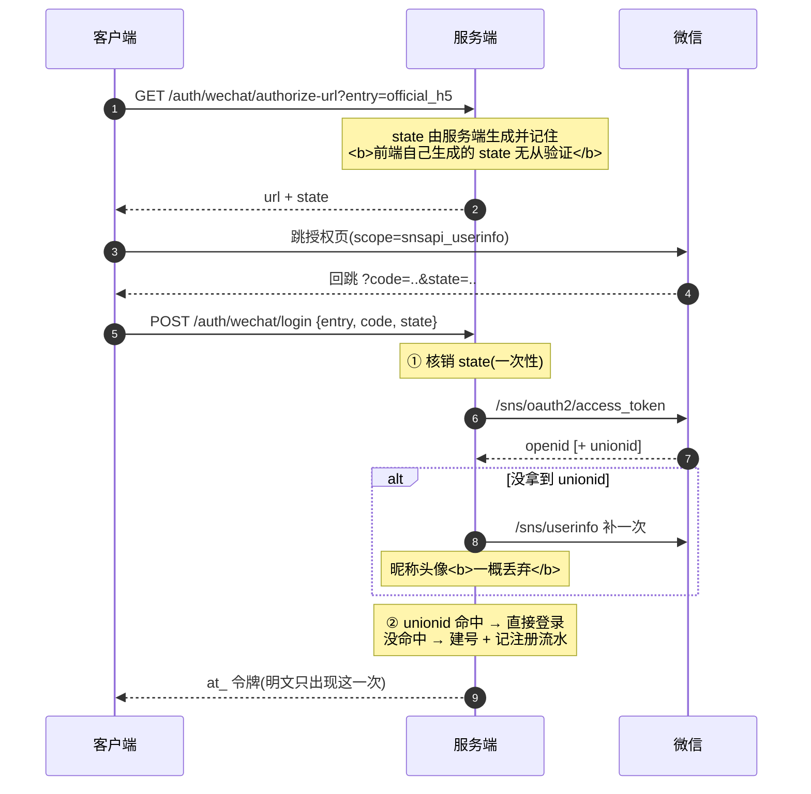
```mermaid
sequenceDiagram
    autonumber
    participant C as 客户端
    participant S as 服务端
    participant WX as 微信

    C->>S: GET /auth/wechat/authorize-url?entry=official_h5
    Note over S: state 由服务端生成并记住<br/><b>前端自己生成的 state 无从验证</b>
    S-->>C: url + state
    C->>WX: 跳授权页(scope=snsapi_userinfo)
    WX-->>C: 回跳 ?code=..&state=..
    C->>S: POST /auth/wechat/login {entry, code, state}
    Note over S: ① 核销 state(一次性)
    S->>WX: /sns/oauth2/access_token
    WX-->>S: openid [+ unionid]
    alt 没拿到 unionid
        S->>WX: /sns/userinfo 补一次
        Note over S: 昵称头像<b>一概丢弃</b>
    end
    Note over S: ② unionid 命中 → 直接登录<br/>没命中 → 建号 + 记注册流水
    S-->>C: at_ 令牌(明文只出现这一次)
```

### 6.2 `state` 不校验会发生什么

具体到一次攻击:攻击者先自己走一遍授权,拿到**属于他自己**的 `code`;
然后诱导已登录的受害者访问带这个 code 的回跳地址。受害者的浏览器带着自己的登录态提交上来,
服务端一看「这个 unionid 没绑过」→ **把攻击者的微信绑到了受害者的账号上**。
此后攻击者用自己的微信就能登进受害者的账号。

落地:`OneTimeStateStore`,10 分钟、一次性、**服务端生成与校验**。
小程序没有回跳因而没有 state,这条分支在 `AuthController#exchange` 里显式写明。

### 6.3 拿不到 unionid,就是 `R-33` 本身

`openid` 是「这个人在**这个应用**里」的 id,同一个人在小程序和网站应用下的 openid **不同**。
拿不到 unionid 的唯一原因是该应用**没绑定到同一个微信开放平台账号** —— 一次控制台配置。

但后果很具体:**同一个人从不同入口进会得到两个账号**,行为层被拆两半,盲区凭空多出来。
所以实现里 `WeChatIdentity#hasUnionId` 存在的意义是让「没绑开放平台」表现为
**一个可被检查、可被告警的事实**,而不是一个静默降级。

> **🔴「有公众号 + 有开放平台」≠「unionid 可用」。**
> unionid 的定义是「同一个<b>微信开放平台账号</b>下的各个应用,用户标识唯一」——
> 决定性的不是两个账号都存在,而是**它们有没有互相绑定,以及是不是绑到了同一个开放平台账号上**。
> 那是控制台里一次五分钟的操作,而它决定 `R-63` 那条账号分裂路径存不存在。
>
> 既然绑定做对了 unionid 就<b>必然存在</b>,那么运行时拿不到它就只可能是配置坏了。
> 所以 `kaodian.auth.wechat.require-unionid` **默认为 `true`:直接失败,不降级建号**
> —— 降级的后果是攒出一批 `wx_open` 账号,等着将来靠 `R-63` 的自愈路径去修。
> **能修不等于该发生。** 端点回 `503 WECHAT_UNIONID_MISSING`(不是 502:
> 这不是微信出了问题,是我们的配置没做对),消息里直接点名要去绑什么。
>
> ⚪ 出路仍然留着(`require-unionid=false`),理由与 `accept-key-loss` 同一条:
> **没有出路的守卫会被撞上它的人在半夜关掉。**

### 6.4 联合登录:契约那张表覆盖不到的两条 🔴

`技术架构与接口契约` §7.1 的场景表是这样的:

| 场景 | 处理 |
|---|---|
| 微信登录,unionid 已存在 | 直接登录对应账号 |
| 微信登录,unionid 不存在且未登录 | 建新账号,引导补绑手机号 |
| 两端各建过一个账号 | 走 `merge/preview` → `merge/confirm` |

写代码时发现它有一个前提没写出来:**它假设 unionid 从第一天就有。**

#### 一、unionid 从无到有 —— 一条我们自己造出来的 `R-33`

拿不到 unionid 的唯一原因是应用没绑到微信开放平台。而这是一次控制台配置,**会在某天被补上**：

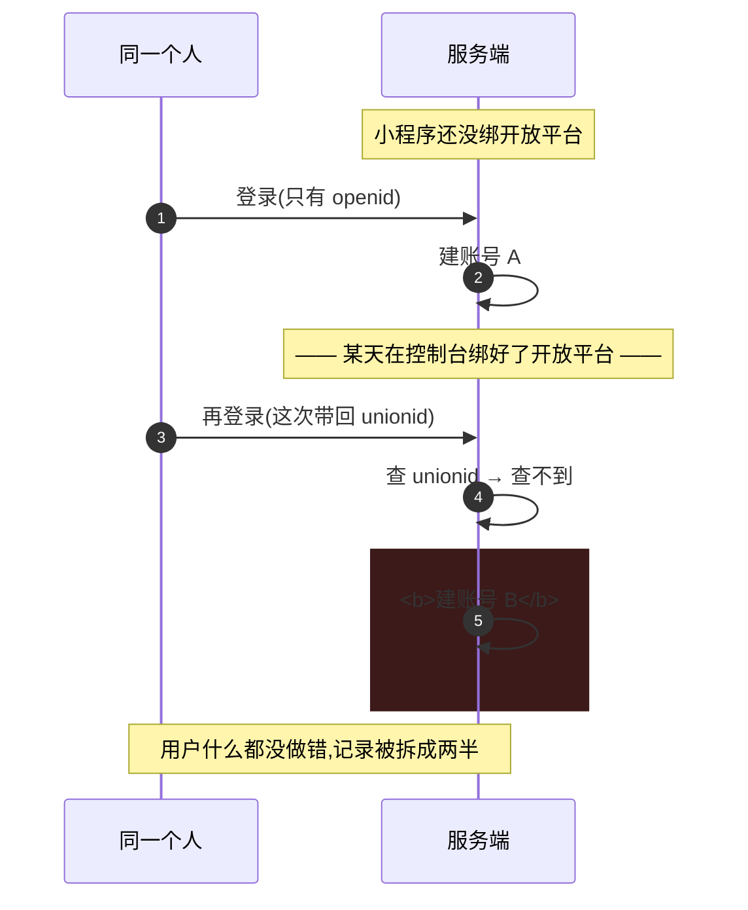
```mermaid
sequenceDiagram
    autonumber
    participant U as 同一个人
    participant S as 服务端

    Note over S: 小程序还没绑开放平台
    U->>S: 登录(只有 openid)
    S->>S: 建账号 A
    Note over S: —— 某天在控制台绑好了开放平台 ——
    U->>S: 再登录(这次带回 unionid)
    S->>S: 查 unionid → 查不到
    rect rgb(60,26,26)
    S->>S: <b>建账号 B</b>
    end
    Note over U,S: 用户什么都没做错,记录被拆成两半
```

**照契约表逐字实现,第 5 步就是「建新账号」。** 用户同一个微信、同一个入口、什么都没做错,
记录却被拆成两半 —— 那正是 `R-33`,而且是我们自己造的。

**处理:unionid 查不到时,还要按 openid 再查一次。** 查到了就说明是同一个人 ——
给那个账号**补一行 unionid identity**,而不是建新号。

> 相应地,每次微信登录都会**幂等补齐 unionid 与 openid 两行**。
> openid 那一行是将来的保险:哪天 unionid 取不到,或者这个人从另一个还没绑开放平台的入口进来,
> 靠它仍然认得出是同一个人。

#### 二、分裂已经发生时:登进 unionid 那个,**建议**合并

如果在补上开放平台之前,这个人已经从另一个入口建了第二个账号,那么一次登录里
unionid 和 openid 会命中**两个不同的账号**。

此时登进 unionid 那个(它是「现在这个人」的权威身份),并返回一个一次性
`splitMergeToken`。**绝不自动合并** —— `技术架构与接口契约` §7.1 的理由是
「自动合并可能把两个人的记录并到一起,而那会让覆盖度彻底失真」。

#### 三、一步登录:让 `R-33` 根本没有发生的机会

小程序的手机号快速验证能在**同一次交互**里给出微信身份和手机号,于是两条通道
从第一天起就落在同一个账号上 —— 不需要事后引导补绑,更不需要合并。

`POST /auth/wechat/phone-login`,**顺序就是它的全部要点**:


```mermaid
flowchart TD
    A["wx.login 的 code 换 openid"] --> B{"频控<br/>按 openid · 60s / 日限"}
    B -->|超限| X["拒绝 · 告知准确时点<br/><b>一分钱没花</b>"]
    B -->|通过| C["换手机号<br/><b>0.03 元/次,开始花钱</b>"]
    C --> D["联合查找 → 签发令牌"]

    style A fill:#1a2a1a,stroke:#C9F24D
    style C fill:#2a1a1a,stroke:#FF6B5A
```

**频控键用 openid 而不是手机号 —— 因为手机号要花完那 0.03 元才知道。**
这正是第一步必须在前面的原因:它免费,而且它产出了限流所需的身份。
与验证码四道闸(`§1.8`)完全同构。

两边都已存在但不是同一个账号时,**登进手机号那个**。不是随便挑的:
`技术架构与接口契约` §7.2 已定阶段 2 只做手机号、微信在阶段 2 后,所以微信那个账号必然更晚建、
更可能是个刚建的空号。**登错一边的代价是用户打开就看见一片空白的盲区页 —— 而那是这个产品的首屏。**

> ⚠️ **2026-09-02 用户裁定「取消功能分期」后,这条的前提要重估:** 微信登录不再「必然更晚建」——
> 两条通道同属完整 App,谁先建号由用户实际走的路径决定,不由阶段决定。
> **选边规则本身是鉴权设计,本文不自行改** —— 登记待技术侧定:是改判据(例如登进记录条数多的那个),还是保留原判并另写一条理由。

> ⚠ 这条路径 `技术架构与接口契约` §6.1 那张表里**没有**,它写于手机号快速验证未纳入考虑时。
> **这是新增,不是对既有条目的改写。**

#### 四、四种结果对照

| 场景 | `isNewAccount` | `needsPhoneBinding` | `splitMergeToken` |
|---|---|---|---|
| 手机号登录 | 视情况 | `false` | `null` |
| 微信登录,已绑过手机号 | `false` | `false` | `null` |
| 微信登录,建了新号 | `true` | **`true`** | `null` |
| 登录成功但发现有两个账号 | `false` | 视情况 | **一次性令牌** |

`needsPhoneBinding` 不是装饰:**没有手机号 = 这个人下次换个入口进来可能又多一个账号。**
`技术架构与接口契约` §7.1 已经写明补绑「是最顺的那条路径,产品应主动引导走这条」——
它比事后走合并便宜得多,而合并是不可逆的、要二次确认的、会出错的那一条。

### 6.5 一次外部代码审阅逼出来的八个修正 🔴

> 2026-08,用 openCode(deepseek-v4-pro)对整个 `auth` 层做了一次只读审阅。
> 它报了 10 条,**8 条成立并已修**,2 条我给出不同的处置。全部修正都补了能撞到它的测试。

#### 最要紧的一条:229 个测试对并发缺陷**没有任何证明力**

修之前那 229 个测试<b>全绿</b>,而下面这两条缺陷就躺在里面:

| 缺陷 | 触发 | 后果 |
|---|---|---|
| **建号竞态** | 用户在登录页连点两次 / 前端重试一次 | 两个请求都查不到身份、都建号 → 第二个拿到 `IdentityTakenException`(RuntimeException)→ 逃到兜底 handler → **500**。而在微信一步登录那一格,**那 0.03 元已经花掉了** |
| **核销非原子** | 同一条码被并发提交 | 「读出来 → 比对 → 写回 consumed」三步之间没有锁 → 都通过。实测:**一条验证码换出 8 个会话** |

原因很简单:**单线程跑完的测试永远是绿的。** 所以补了 `ConcurrencyTest`
(8 线程 + `CyclicBarrier` 同时起跑),并<b>把修复临时撤掉验证过它会变红</b> ——
一个改前改后都绿的测试等于没写。撤掉核销的 CAS 之后那句断言是
`expected: <1> but was: <8>`,那就是这个缺陷最赤裸的形态。

#### 八条修正

| # | 问题 | 修法 |
|---|---|---|
| 1 | 建号竞态 → 500 | `createOrJoin`:撞上 `IdentityTakenException` 就**登进那个账号**,不报错。语义本来就该是幂等的 |
| 2 | 核销非原子 | `SmsCodeStore.consumeIfSent` —— **compare-and-set,在 store 的锁里比对+改状态** |
| 3 | 失败计数丢更新 | `recordFailure` 读-改-写原子化。<b>不改的话,攻击者只要并发就能把「错 5 次锁定」打对折</b> |
| 4 | `bind` 抛 `IllegalStateException` → 500 | 新增 `BindResult.Refused` → 409。用户需要的是「先解绑旧号」,不是一串 traceId |
| 5 | 一步登录只查一条微信身份 | 改成与 `loginByWeChat` 一致的 unionid/openid 双查 + 分裂检测 |
| 6 | **回环 IP 让频控塌缩成全站 20/日** | 见下 |
| 7 | 供应商返回非 JSON 时裸抛 | `readTree` 包进 try → 受控异常,落进「不确定」那一档 |
| 8 | 密钥长度不校验 | 16 字节会让 AES-256 **静默降级成 AES-128**,测试全绿而强度减半。改成硬校验 |

#### 第 6 条值得单独说:我给的修法和审阅建议的不一样

审阅建议加一个启动期校验。但更准的修法是**把回环地址当成「取不到 IP」**:

线上是同机 Caddy 反代,`getRemoteAddr()` <b>恒为 `127.0.0.1`</b>。
把它当成一个真实 IP 计进频控,「单 IP 20/日」就塌缩成
**全体用户共享一个 20 条/日的桶** —— 那不是防线失效,是<b>我们自己把自己 DoS 了</b>:
每天第 21 个用户再也收不到验证码。
<p>

而频控对空串的处理是「这道闸没有意义,放行」——那才是这种部署下的正确语义:
**IP 维度此刻不携带任何信息,拿不到就别假装拿到了。**

#### 两条没修,登记为风险

- **`R-68`** 微信换手机号那条路没有滑块。**有意的差异**:拿到有效 `phoneCode` 需要真人在微信内主动点授权,门槛与短信不是一个量级。登记差异,不假装等强度。
- **`R-70`** 🔴 **文件存储 + `synchronized` 只在单 JVM 单实例下成立。** 多实例时各进程各持内存快照、全量重写互相覆盖 —— 频控、令牌、账号唯一性全部失效。**这不是「以后优化」,是「现在不能横向扩容」**:单实例是当前形态的<b>前提条件</b>,不是缺省选择。

---

### 6.6 手机号快速验证:一步合并两条通道,但它是**按次账单**

小程序的 `phonenumber.getPhoneNumber` 能让用户点一下就同时给出 unionid 和手机号 ——
两条通道从第一天起就落在同一个账号上,`R-33` 根本不会发生。

> 🔴 **但它自 2023-08-28 起收费:0.03 元/次成功调用,每个小程序 1000 次体验额度。**
> 它和短信一样,是**注册环节的按次外部账单**,而 `商业化与额度设计` §3.2 已定这类不进额度
> (对它计费等于对注册计费)。**所以它同样必须被频控与滑块管住** —— 不能因为「体验好」就无限量开着。

### 6.7 短信:十一个配置项,和一段手写的签名

> **勘误 2026-08-31(`KUBI-74`)**:本节标题与末尾原写「四个配置项」,与代码不符。
> `AuthBeans#smsSender` 强制的是 **5 项**(`secret-id` / `secret-key` / `sdk-app-id` /
> `sign-name` / `template-id`);而 `§6.8` 的配对红线使短信一旦切真,**滑块也必须切真**,
> 于是还要 `AuthBeans#captchaVerifier` 的 **4 项** 加两个 `provider` 开关 —— **合计 11 项**。
> 差别不在数字本身,在于「四项」读起来像一次十分钟的配置,而实际还要先在控制台
> **单独开通验证码产品并建一个验证码应用**才拿得到那个 `app-id`。完整清单见
> `server/kaodian-app/src/main/resources/application.properties` 的「签名批下来那天」模板段。

`SmsSender` 是切换点(与 `recognize` 的 `AsrClient` 完全同构,理由见 `识别链路选型 · ASR 与图像识别` 坑三)。
真实实现是腾讯云 `SendSms` —— 跟着 `识别链路选型 · ASR 与图像识别` 已选的 ASR 走同一家,省掉的是
**第二次实名、第二次充值、第二份发票、第二个控制台**。

**没有引官方 SDK。** 原因是一次实测:

| | 引 `tencentcloud-sdk-java-sms` | 手写 TC3-HMAC-SHA256 |
|---|---|---|
| 传递依赖 | **5 个**:okhttp3(带 Kotlin 运行时)、gson、logging-interceptor、commons-configuration2、commons-logging | **0 个** |
| 换来什么 | 两个接口的一次 POST | 同上 |
| 复用 | 短信一家 | **短信 + 验证码共用同一段签名** |

`server/` 到目前为止除 Spring Boot 之外**一个第三方依赖都没有**。
这与 `§三` 拒绝 `spring-ai-alibaba` 里程碑版是同一类判断:
**为一次 HTTP 调用背一整棵依赖树,代价不在今天,在它哪天和别的东西冲突的那天。**

> ⚠ **上线前置仍然没有被这段代码提前一天。** 国内签名与模板审核各需 **1-3 个工作日**、
> **需主体资质**(2025-09-18 起个人自用签名已不再开放)。`R-34` 说的就是这件事:
> **签名没批,第 9 周的登录写不出来,阶段 2 直接停在起点。**
> 报备是行政流程,不是工程任务 —— 这个类存在的意义只是让「批下来的那天」只需要填配置项,
> 不必再动代码。**那一天要填的是 11 项,不是 4 项**(见本节开头的勘误)。

### 6.8 一条被写成「起不来」的配对红线 🔴

`§1.8` 定的四道闸里,第①道滑块是**唯一真正的闸** —— 单号 1/60s 与单 IP 20/日 都是纯计数,
换一批 IP、换一批号两条都不触发,而每一条短信都是真金白银。

默认组合(假短信 + 不校验)是安全的:**没有账单可刷**。
危险的只有 **真短信 + 不校验滑块** 这一种组合 —— 而它恰好是
「先把短信配上,验证码回头再说」这个**最自然的接入顺序**会产生的中间状态。

所以 `AuthBeans#checkVendorPairing` 让它**拒绝启动**,而不是打一条警告:

```
拒绝启动:短信已切到真实供应商,但行为验证仍是 disabled。
```

**警告会被划过去,账单不会。**

### 6.9 落地清单

| 契约(`技术架构与接口契约` §6.1) | 实现 | 默认开关 |
|---|---|---|
| `POST /auth/sms/send` | `AuthController#send` → `SmsCodeService#send` | **默认不真发**(`sms.provider=logging`) |
| `POST /auth/sms/verify` | `#verify` → `AccountService#loginByPhone` | — |
| `POST /auth/refresh` / `logout` | `#refresh` / `#logout` | — |
| `DELETE /account` | `AccountController#deactivate` | — |
| `POST /auth/wechat/login` | `#wechatLogin` → `AccountService#loginByWeChat` | **默认关**:`kaodian.auth.wechat.enabled=false` |
| `POST /auth/wechat/phone-login` ⭐新增 | `#wechatPhoneLogin` → `#loginByWeChatWithPhone` | 同上。**契约表里没有这一条**,见 `§6.4` |
| `POST /auth/bind/phone` · `bind/wechat` | `#bindPhone` / `#bindWeChat` | 同上 |
| `POST /auth/merge/preview` · `confirm` | `#mergePreview` / `#mergeConfirm` | 同上 |

三个默认值构成一个**零成本、零外部依赖**的本机组合:

```properties
kaodian.auth.sms.provider=logging      # 验证码打进日志,不发真短信
kaodian.auth.captcha.provider=disabled # 与上一条【成对】,见 §6.6
kaodian.auth.wechat.enabled=false      # 默认关,开它的前置是 ICP 备案
```

关着的端点回 **503 `WECHAT_NOT_ENABLED`,不是 404** —— 端点存在,只是这个开关还关着。

### 6.10 手机号在库里的两种形态

`技术架构与接口契约` §5.2 已定:**哈希用于查,密文用于发短信**。落地是 `PhoneCipher`:

| 形态 | 算法 | 去处 |
|---|---|---|
| `hmac` | HMAC-SHA256 | `user_identity.identifier` —— **唯一索引建在它上面** |
| `ciphertext` | AES-256-GCM(随机 IV) | 单独一行,只在要给这个号发短信时解一次 |
| `masked` | `138****8000` | **只为了显示**,不参与任何判断 |

**为什么必须是 HMAC 而不是 SHA-256:** 手机号取值空间只有约 2×10⁹,
一台笔记本几分钟就能把全部中国手机号的 SHA-256 算完做成彩虹表。
**不带密钥的哈希对手机号等于没哈希** —— 那把密钥才是这条防线本身。

### 6.11 `R-59`:把「换了密钥」从无声毁数据变成启动期的一次响亮事件 🔴

不做任何事的话,这是本模块唯一一个**会毁数据而且全程无声**的失败模式:
HMAC 密钥换一把,同一个手机号算出的 `identifier` 就变了,于是**每一次登录都会走
「查不到 → 建号」分支**。接口全部 200、日志一条没有,而老用户各自多出一个空账号、
记录留在再也查不到的旧账号上。等到有人发现时,`SignupLedger` 上已经多了一批假注册 ——
**而那是阶段 3 判据的数据源。**

「请记得备份密钥文件」是一句叮嘱,不是一道防线。所以落成了 `PhoneKeyGuard`。

#### 做法:给密钥盖指纹,和账号数据一起原子落盘

指纹 = **用密钥对一个固定常量算 HMAC** 的前 16 个十六进制字符。
常量公开,但没有密钥算不出这 16 个字符;拿到这 16 个字符也推不回 256 位的密钥 ——
所以它可以明文躺在 `auth-accounts.json` 里。

> 指纹必须和账号数据**同一次**原子落盘。分两次写会出现「盖了章但数据没写进去」的中间态,
> 而那恰好会让下一次启动认为「密钥没变」—— **把守卫本身骗过去。**

#### 🔴 关键的一条不对称:丢一把和丢两把,后果完全不同

| 丢的是 | 能不能救 | 怎么救 |
|---|---|---|
| **只有 HMAC** | **能,而且零损失** | AES 密文还在 → 解出手机号 → 用新密钥重算一遍 |
| **AES**(无论 HMAC 在不在) | **不能** | 手机号明文再也拿不回来,`identifier` 也就再也算不出来 |

**而「只丢 HMAC」恰恰是最常见的那种** —— 配置项写错一个字符、`auth-keys.properties`
被部分覆盖、环境变量少注入一个。把两把合成一个指纹的话,这两种情况长得一模一样,
**于是本可以自动治好的那种也会变成一次半夜的事故。**

所以指纹分两把记,守卫按四种情形分四种处置 —— **只有一种拒绝启动:**


```mermaid
flowchart TD
    A["启动:比对指纹"] --> B{"库里盖过章?"}
    B -->|没有| C["补盖 + WARN<br/>老数据,没依据说密钥变过"]
    B -->|有| D{"两把都没变?"}
    D -->|是| E["放行"]
    D -->|否| F{"AES 没变?"}
    F -->|是| G["<b>自动换钥</b><br/>解密文 → 重算 HMAC<br/><b>零账号丢失</b>"]
    F -->|否| H{"配了旧密钥?"}
    H -->|是| G
    H -->|否| I{"库里有手机号?"}
    I -->|没有| C
    I -->|有| J{"accept-key-loss?"}
    J -->|否| K["<b>拒绝启动</b>"]
    J -->|是| L["记 ERROR + 条数<br/>账号成为孤儿,不可逆"]

    style G fill:#1a2a1a,stroke:#C9F24D
    style K fill:#2a1a1a,stroke:#FF6B5A
```

#### 为什么必须留一条出路

**一个没有出路的守卫,会被撞上它的人在半夜关掉 —— 然后它就永远关着了。**

所以最后一格给了 `kaodian.auth.keys.accept-key-loss=true`。它不是「跳过检查」,
而是「我确认这些账号找不回来了」:日志里留下一条 ERROR 和**确切的条数**,
因为那批人再次登录会被当成新用户建号 —— **阶段 3 的累计注册数据此需要人工扣减**,
而这一行是唯一的线索。

异常消息里把三条出路按可能性排全,而不是只说「指纹不匹配」:
只说不匹配的异常,会让人直接去找怎么把它关掉。

#### 一个不藏着的副作用

`auth-sms.json` 与 `auth-sms-quota.json` 也按手机号 HMAC 建键,但**不参与换钥** ——
里面可能有**还没有账号**的号(正在注册的人,以及正在被锁定的刷子),那些号没有密文,
算不出新的 HMAC。
<p>

所以换钥之后:未核销的验证码作废(重发一次即可),**而号码锁定与当日频控计数会被清零**。
后者是一次真实但短暂的防线削弱 —— 代价远小于「拿不准就拒绝启动」,
而换钥是罕见且有人在场的操作,不是常态。

> **实测钉住:** `PhoneKeyGuardTest` 14 个用例,其中最要紧的一条断言是
> 换钥自愈之后再登录 `isNewAccount == false` —— **那一行为 `true` 就意味着 `R-59` 正在发生。**

### 6.12 顺带被测试逼出来的一个缺陷

第一版实现里,验证码存储**每个号只留最新一条**。看起来是对的:
「同号重新发了一条 → 旧的作废」在存储上就是覆盖。

**但那样一来 `SUPERSEDED` 这个终态永远观察不到** —— 用户拿着旧码来验,
库里只剩新码,哈希对不上 → 回的是「验证码不对」。
而 `§1.8` 那张表要求这是**四句话里的一句**,它的代价很具体:

> 用户以为自己手抖,**对着那条旧码反复输,把自己输到锁定** —— 而他手机里其实躺着一条能用的新码。

修法:每号两个槽(`findLatest` / `findSuperseded`),而且**命中旧码不计入错误次数** ——
拿着自己刚收到过的码不是在猜。

**这一条值得单独写出来,因为它说明 `§1.8` 那张表不是文风,是判据。**
四种终态如果只是写在文档里而没有一个测试去撞,它会以「代码看起来完全正确」的形态消失。


> **⚠ 同一个缺陷,在两个产物里各出现了一次。**
>
> 后端这边是「`SUPERSEDED` 状态不可达」(store 每号只留一条,新码把标记为已作废的旧码直接覆盖)。
> 而原型 `notetool-ui-a` 的 **D25** —— 那一屏存在的<b>唯一理由</b>就是「四种失败要说四句不同的话」——
> 画的四种是 `输错 / 过期 / 已用过 / 频控`,**把「已作废」换成了「已用过」**。
>
> 这两个的动作是<b>相反</b>的:
>
> | 状态 | 用户该做的 |
> |---|---|
> | 已用过(`CONSUMED`) | **重发** —— 这条码登进去过一次了 |
> | 已作废(`SUPERSEDED`) | **用最新那条** —— 手机里已经躺着一条能用的 |
>
> 说成「重发」的代价很具体:用户再发一条,把手里刚收到的那条也顶掉,
> **然后陷在这个循环里**,直到把自己输锁。而会撞上它的通常是「没等够 60 秒、连点了两次重发」。
>
> 已补进 D25(现在是五种失败 + 滑块,编号顺延),并同步了 `index` / `h5` 里的相关描述。
>
> **值得记下来的是这件事的形状:** 一条规则写在文档里、落进后端、画进界面 —— 它在<b>三处</b>都可能各自走样,
> 而三处都「看起来完全正确」。后端那次是被测试撞出来的,界面这次是被<b>逐个错误码对照</b>撞出来的。
> 光靠通读任何一处,都发现不了。
---

## 七、红线在框架层的落点

**这张表是本文唯一不会随版本过时的部分。** 但九条的**强度并不相同**,把它们并排写会让人以为都一样硬——所以先把分级说清楚:

| 强度 | 含义 | 违反它会在什么时候、以什么方式暴露 |
|---|---|---|
| **类型层** | 结构上写不出来 | **编译期**。得先改接口签名或加字段才谈得上违反 |
| **运行时不变式** | 写得出来,但一执行就炸 | **每次执行,自动**。不依赖任何人记得做什么 |
| **构建层** | 构建脚本会拦 | **构建期,自动**。前提是没人绕开那个脚本 |
| **装配层** | 容器里没有那个 bean | 注入直接启动失败;**手写 `new` 仍可绕过** |
| **检查层** | 能做,会被机械检查抓到 | 一行代码就能违反,**发现依赖于记得跑那条检查** |
| **纪律** | 只有约定 | 一行代码,**没有任何自动发现手段** |

> **原先只分四档,把「运行时不变式」并进了类型层——那是不准确的:构造器抛异常是运行时行为,不是编译期。** 分开写之后才看得出,真正编译期就挡住的只有三条。

> **检查层与纪律这两档是这张表的软肋,不该被含糊过去。** `思考模式与选择框架` §盲区二 的同构问题:一条只靠「记得 grep 一下」维持的红线,在赶工的那一周最先失效。

| 红线 | 强度 | 框架层的落点 | 怎么验证它还在 |
|---|---|---|---|
| 🔴 `R-07` 闭集,模型不生成标签 | **类型层 + 运行时**<br/>(两档,拆开看) | **类型层(只有这一条)**:② 返回类型里没有 `String label` 字段 —— **自由生成的标签根本没地方放,编译期就写不出来**。<br/>**运行时**:① `candidates` 虽是必填入参,但必填只挡「漏传实参」,<b>挡不住传 `null` 或空集</b> —— 非空是实现类里的运行时校验;③ `enforceClosedSet` 在出口再核 code 是否真在候选集里,防的是**模型幻觉**,编译期防不了 | `RecognitionResult` 里没有 label/tag/text 字段;`enforceClosedSet` 有单元测试钉住 |
| 🔴 `R-01` 真题原文不进线上库 | **类型层** | `Touch` 里没有能装下题干或转写文本的字段 | DTO 与实体逐个看一遍 |
| 🔴 `R-04` 原图不上云(入口侧) | **类型层** | 接口入参是 `byte[]`,**签名里没有 URL / fileId / bucket 的位置** | `grep -r "fileId\|imageUrl\|ossUrl" server/src` 零命中 |
| ⬜ 宁缺毋滥 | **运行时不变式** | `RecognitionResult` 紧凑构造器里**两条**不变式合起来生效:① `aboveThreshold != (nodeCode != null)` → 抛(有 code ⇔ 过阈值);② `aboveThreshold && confidence < MIN_CONFIDENCE` → 抛。**两条缺一不可** —— 只有 ② 挡不住「低置信度 + code + aboveThreshold=false」这种构造 | **「低于阈值却带着 nodeCode」的实例构造不出来**,每次 new 都会检,不靠调用方自觉。残留风险是另一回事:实现类可以**编一个高置信度**糊弄过去 —— 那属于「信不信厂商给的分」,不属于阈值被绕过 |
| 🔴 `R-08` 与公司体系零交集 | **构建层** | `build.sh` 强制 `-s ~/.m2/settings-side.xml` + 独立本地仓库,并做依赖源白名单校验 | `./build.sh` 是唯一构建入口 |
| 🔴 `R-05` 不判断对错 | **装配层 + 检查层** | OpenAI 的 image / speech 自动装配显式排除(**容器里没有那个 bean,`@Autowired` 会启动失败**);但「别处不手写 `new ChatModel`」只能靠检查 | 除 `recognize` 外无 `ChatModel` 注入点 |
| ⬜ 记录永不失败 | **检查层** | 写入在识别之前;`RecognitionUnavailableException` 在 `CaptureService` 被接住 | §1.1 那条线不被重构掉——**测试要钉住「识别失败时记录仍落地」** |
| 🔴 `R-04` 禁用厂商文件暂存 | **检查层** ⚠ | 不调用任何 Files API / 临时存储。百炼的临时存储返回 `oss://dashscope-instant/...`(48h),**与 DeepSeek Files API 同一类,同样禁用** | 代码里不出现 `X-DashScope-OssResourceResolve` 等上传端点标记 |
| 🔴 `R-04` 不落日志 | **纪律** ⚠ | 实现类不得 `log.debug(request)`——**一次就等于把原图落了盘** | 日志里不出现 base64 片段 |

### 7.1 最后两条是这张表最薄的地方,得说破

**九条里,编译期就挡住的只有三处,而且都是同一种形态——「那个字段/位置根本不存在」**:`RecognitionResult` 无 `label` 字段、`Touch` 无题干字段、接口签名无 URL/fileId 位置。<br/>**「必填参数」不算编译期保证**:它只挡漏传,挡不住传 `null` 或空集(R-07 ① 就是这种情况)。其余六条各有各的软处,最软的是下面这两条。

**`byte[]` 的签名挡住的是「把一个 fileId 传进来」,挡不住实现类内部自己上传一次再拿 URL 回来。** 同理,没有任何结构能阻止一行 `log.debug(request)`。

这两条目前只有「记得检查」在兜底,而 `R-04` 恰恰是文档里写着**「第一天不定,后面改不回来」**的那条。**强度与后果不匹配。**

可选的加固手段(**尚未实施,不写成已完成**):

| 手段 | 能把它抬到哪一档 |
|---|---|
| 出站请求白名单:实现类只允许打一个已知 host + path | 装配层 |
| 一条构建期检查:`recognize` 包内禁止出现上传端点标记 | 检查层但**自动化**,不依赖记得跑。**仅对上传端点有效**——它们是固定字符串 |
| ~~同一条检查顺带禁 `log.*(request)`~~ | ⚠ **不要指望这条**:语法 grep 抓不住 `log.debug(base64Str)`、更抓不住字符串拼接。**把它写成防线会制造假安全** —— 日志这一侧只有下面那条过滤器是真的 |
| 日志脱敏过滤器:对超过 N 字节的字符串参数一律截断 | **装配层。这是日志侧唯一真正 robust 的一条** —— 它不依赖代码怎么写,只看数据长度,所以改个变量名绕不过去 |

**在其中任何一条落地之前,这两行就是纪律,不是形态。** 已登记为 `R-75`。

---

## 八、实体关系图:**代码里真实存在的那一份** 🔴

> **这一节描述的是<u>现状</u>,不是目标。** `技术架构与接口契约` §5.3 那张 ER 图画的是将来那套 MySQL 表
> (8 个实体,写于 `auth` 与 `agent` 落地之前);这一节画的是<b>此刻 `server/` 里跑着的东西</b>。
> 两张图不一样是正常的 —— 但差在哪里必须写出来,否则会有人拿着 `技术架构与接口契约` §5.3 去读代码。
>
> 🔴 **2026-09-03(KUBI-96 总装)补第三条指针:本节这张<u>现状</u>图一个字不改。**
> **目标态的 ER 图与模块依赖图在 [`docs/technical/backend/INDEX.md`](backend/INDEX.md) §二 / §三**,
> 那是七份后端设计合起来推出的形态,与本节这张「三座岛互不相连」**必然不一样**。
> **差在哪里由 `backend/INDEX.md` §2.3 那张对照表逐行写出** —— 不写出来就会有人拿着目标图去读代码,
> 那正是本节头注这两行一开始要防的事。
>
> **存储形态是文件,不是表**(`1.2.4` 之前都如此)。所以下面每个「实体」对应的是
> 一个 JSON 数组里的一种对象,「唯一索引」对应的是一个 `Map` 的键。

### 8.1 一句话结论:**三座岛,互不相连**


```mermaid
graph LR
    subgraph A["账号岛 · kaodian-auth"]
        AU["AppUser"]
    end
    subgraph D["记录岛 · kaodian-domain"]
        SY["Syllabus.Node"]
        TO["Touch"]
    end
    subgraph G["agent 岛 · kaodian-agent"]
        AS["AgentSession"]
    end

    AU -.->|"🔴 没有这条边"| TO
    AU -.->|"🔴 类型对不上<br/>String vs long"| AS
    SY --> TO

    style A fill:#1a2333,stroke:#5a7fbf
    style D fill:#1a2a1a,stroke:#C9F24D
    style G fill:#2a2419,stroke:#bf9a5a
```

**行为层的三个实体(`Touch` / `RecordTag` / `UserAssertion`)<u>一个 `userId` 字段都没有</u>。**
不是可空,是<b>不存在</b>。整个进程一份 `touches.json`,谁登录看到的都是同一份数据。

这解释了本文档里两处看起来奇怪的地方,它们其实是同一件事的两个投影:

| 现象 | 真正的原因 |
|---|---|
| `AccountService.movableRecordCount()` 恒返回 0 | 没有「A 的记录」这个概念,合并时无处可搬 |
| `CurrentSessionResolver` 不接管 `/api/records` | 数据层不分租户时加鉴权,只会造出「看起来分了用户」的假象 |

> 🔴 **2026-09-02 用户裁定「没有本地模式」之后,这条裂缝的性质变了。** 裁定的原话是「不登录不能记;能记的一定已登录」,
> 而现状是 `/api/records` 不经 `CurrentSessionResolver`、行为层三个实体一个 `userId` 都没有 —— **等于未登录也能写进来,写进来的记录不归任何人**。
> 旧形态下这是「将来要补的租户隔离」,新形态下它**与产品形态直接冲突**。
> **怎么补(采集端点加鉴权 + `userId` 落到行为层)由技术侧定,本文只加注,现状描述一个字不改。**

### 8.2 账号岛(`kaodian-auth`)

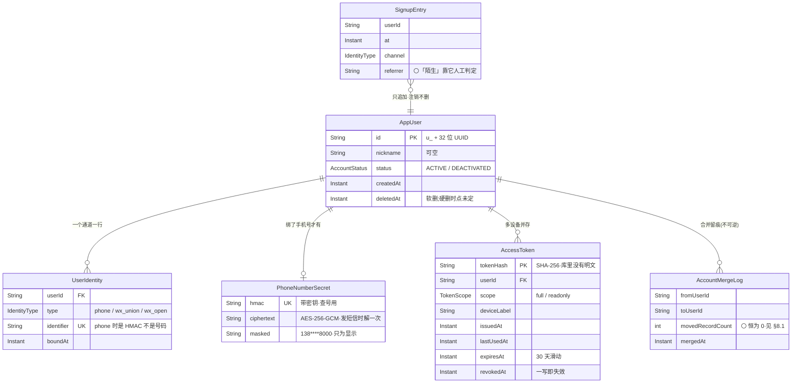
```mermaid
erDiagram
    AppUser ||--o{ UserIdentity : "一个通道一行"
    AppUser ||--o| PhoneNumberSecret : "绑了手机号才有"
    AppUser ||--o{ AccessToken : "多设备并存"
    AppUser ||--o{ AccountMergeLog : "合并留痕(不可逆)"
    SignupEntry }o--|| AppUser : "只追加·注销不删"

    AppUser {
        String id PK "u_ + 32 位 UUID"
        String nickname "可空"
        AccountStatus status "ACTIVE / DEACTIVATED"
        Instant createdAt
        Instant deletedAt "软删;硬删时点未定"
    }
    UserIdentity {
        String userId FK
        IdentityType type "phone / wx_union / wx_open"
        String identifier UK "phone 时是 HMAC 不是号码"
        Instant boundAt
    }
    PhoneNumberSecret {
        String hmac UK "带密钥·查号用"
        String ciphertext "AES-256-GCM·发短信时解一次"
        String masked "138****8000·只为显示"
    }
    AccessToken {
        String tokenHash PK "SHA-256·库里没有明文"
        String userId FK
        TokenScope scope "full / readonly"
        String deviceLabel
        Instant issuedAt
        Instant lastUsedAt
        Instant expiresAt "30 天滑动"
        Instant revokedAt "一写即失效"
    }
    AccountMergeLog {
        String fromUserId
        String toUserId
        int movedRecordCount "⚪ 恒为 0·见 §8.1"
        Instant mergedAt
    }
    SignupEntry {
        String userId
        Instant at
        IdentityType channel
        String referrer "⚪「陌生」靠它人工判定"
    }
```

**`(type, identifier)` 是唯一索引,而它同时承担登录查号与绑定冲突判定。**
🔴 注意 `identifier` 在 `type=phone` 时存的是 <b>HMAC</b> —— 全岛没有一个手机号明文
(`技术架构与接口契约` §5.2「手机号不明文落库」)。

#### 8.2.1 三个**不挂账号**的实体

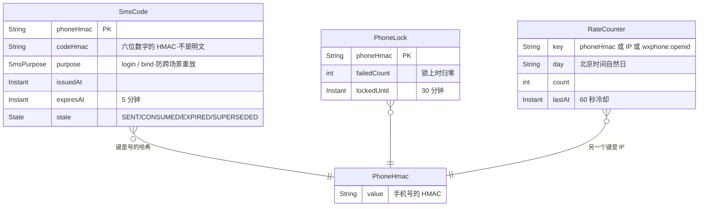
```mermaid
erDiagram
    SmsCode }o--|| PhoneHmac : "键是号的哈希"
    PhoneLock }o--|| PhoneHmac : ""
    RateCounter }o--|| PhoneHmac : "另一个键是 IP"

    PhoneHmac {
        String value "手机号的 HMAC"
    }
    SmsCode {
        String phoneHmac PK
        String codeHmac "六位数字的 HMAC·不是明文"
        SmsPurpose purpose "login / bind·防跨场景重放"
        Instant issuedAt
        Instant expiresAt "5 分钟"
        State state "SENT/CONSUMED/EXPIRED/SUPERSEDED"
    }
    PhoneLock {
        String phoneHmac PK
        int failedCount "锁上时归零"
        Instant lockedUntil "30 分钟"
    }
    RateCounter {
        String key "phoneHmac 或 IP 或 wxphone:openid"
        String day "北京时间自然日"
        int count
        Instant lastAt "60 秒冷却"
    }
```

**为什么它们挂在号上而不是账号上:** 锁定发生的那一刻<b>可能还没有账号</b> ——
注册即登录,账号是在验证码通过那一瞬间才建的。挂在账号上意味着
「猜一个陌生号的验证码」永远不会被锁定,而那正是要防的那件事。

> 每号<b>两个槽</b>:`SmsCode` 的最新一条 + 被它顶掉的上一条。
> 少了第二个槽,「请用最新收到的那一条」这句话就说不出来(见 `§6.12`)。

### 8.3 记录岛(`kaodian-domain`)

```mermaid
erDiagram
    Subject ||--o{ Group : ""
    Group ||--o{ Node : ""
    Node ||--o{ Touch : "记录挂 code 不挂 name"
    Touch ||--o{ RecordTag : "一条记录可挂多个考点"
    Node ||--o{ RecordTag : ""
    Node ||--o| UserAssertion : "我已掌握"

    Subject {
        String code PK
        String region
        String exam
        String module
        String recent5yWindow
    }
    Group {
        String code PK
        String name
    }
    Node {
        String code PK "改名不动它·所以改名不丢记录"
        String name "≤40·是个名字不是放内容的地方"
        int recent5yCount
        boolean archived "归档退出差集·但不删"
    }
    Touch {
        String id PK
        String nodeCode FK
        String sourceName "只有来源名·没有来源的内容"
        TouchKind kind
        Instant occurredAt "「多久前」的唯一依据"
        Drill drill "practiced/correct·用户自己填的"
        String clientToken UK "离线队列补传去重"
    }
    RecordTag {
        String id PK
        String recordId FK
        String nodeCode FK
        double confidence
        TagOrigin origin "auto/manual·写入后不可变"
        Instant confirmedAt
        boolean discarded "可见·但不计覆盖度"
    }
    UserAssertion {
        String nodeCode PK
        Instant assertedAt "独立状态·不计入覆盖度"
    }
```

🔴 **这一岛里没有一个字段能装下学习内容。** 没有 `content`、没有 `text`、
没有 `question`、没有 `transcript`、没有 `imageUrl` —— <b>不是不填,是不建这个位置</b>
(决策记录 §2.2 / `技术架构与接口契约` §5.1)。最长的字符列是 `Node.name`(40 字),
一句话放得下,一道资料分析题的题干放不下。

> **`RecordTag.origin` 写入后不可变**,用户确认只写 `confirmedAt`。
> 改了它,`1.2.5.2` 那套准确率口径(标对的 / 标了的)在真实数据上就再也算不出来了。

### 8.4 agent 岛(`kaodian-agent`)

```mermaid
erDiagram
    AgentSession ||--o{ AgentRun : "一次会话多轮"
    AgentRun ||--o{ AgentMessage : "按 iteration 排"
    AgentMessage ||--o{ MessagePart : "sealed·只有三种"
    AgentRun ||--o{ ToolCall : ""
    AgentRun ||--o{ TraceEvent : "events.ndjson"

    AgentSession {
        String sessionId PK
        long userId "🔴 恒为 0·见 §8.5"
        String title
        int runCount
        Instant createdAt
        Instant updatedAt
    }
    AgentRun {
        String runId PK
        long userId "🔴 同上"
        String sessionId FK
        String agentName
        String modelId
        RunState state "PENDING/RUNNING/SUCCEEDED/FAILED"
        Instant startedAt
        Instant completedAt
    }
    AgentMessage {
        String messageId PK
        String runId FK
        Role role
        int iteration
        Instant createdAt
    }
    MessagePart {
        String kind "TextPart / ToolCallPart / ToolResultPart"
    }
    ToolCall {
        String callId PK
        String runId FK
        String llmCallId
        String toolName
        ToolLevel level "READ / COMPUTE / EFFECT"
        String arguments
        String result
        boolean error
        Instant startedAt
        Instant completedAt
    }
    TraceEvent {
        String runId FK
        String phase
        String name
        String status
        long durationMs
        String detail
        Instant timestamp
    }
```

🔴 **`MessagePart` 是 sealed 的,而且只有三种:`TextPart` / `ToolCallPart` / `ToolResultPart`。**
<b>没有一种能装图片</b> —— 这正是「聊天图片只在内存里活到送进模型为止」
那条红线的物理形态(CLAUDE.md)。不是约定不写,是<b>类型上写不出来</b>。

> **工具池当前 6 个,`ToolLevel` 全是 `READ` 或 `COMPUTE`,零 `EFFECT`。**
> 能力边界的真正防线是这个池子 —— 提示词只是<b>请求</b>模型别越界,
> 工具池是<b>物理上</b>让它拿不到题干、答案、解析。
> 加一个能返回题目内容的工具,边界当场结束,而且<b>不会有任何报错</b>。

### 8.5 两条把三座岛隔开的裂缝

| # | 裂缝 | 后果 | 现状 |
|---|---|---|---|
| 1 | **行为层无 `userId`** | 合并搬不动记录;鉴权挡不住数据 | 已在 `AccountService` / `CurrentSessionResolver` 的注释里写明,不假装做完了 |
| 2 | **`AgentRun.userId` 是 `long`,`AppUser.id` 是 `String`** | 两边<b>连类型都对不上</b>,想 join 也 join 不了;而且 `AgentController` 里硬编码 `0L` | ⚪ **本文档首次记录**,登记为 `R-93` |

第 2 条尤其值得说:它不是「还没接上」,是<b>接上的时候会发现接口不匹配</b>。
`long` 那个选择大概率来自「以后用自增主键」的假设,而账号那边最后落成了
`u_` + UUID 的字符串。**两个模块各自都自洽,合起来才发现对不上** ——
而这正是模块边界切得好的地方会付的一种代价:Maven 保证了 `agent` 不依赖 `auth`
(CLAUDE.md 的「刻意」之一),于是也就没有任何编译期检查会撞到这处不一致。

### 8.6 落盘位置

| 文件 | 装什么 | 模块 |
|---|---|---|
| `syllabus.json` | Subject / Group / Node | domain |
| `touches.json` | Touch | domain |
| `record-tags.json` | RecordTag | domain |
| `assertions.json` | UserAssertion | domain |
| `auth-accounts.json` | AppUser + UserIdentity + PhoneNumberSecret + AccountMergeLog + 密钥指纹 | auth |
| `auth-tokens.json` | AccessToken | auth |
| `auth-sms.json` | SmsCode(两个槽)+ PhoneLock | auth |
| `auth-sms-quota.json` | RateCounter | auth |
| `auth-signups.json` | SignupEntry(**只追加**) | auth |
| `auth-keys.properties` | 两把密钥(600) —— <b>属于数据,不属于配置</b> | auth |
| `<run>/run.json` · `messages.ndjson` · `events.ndjson` | AgentRun / AgentMessage / TraceEvent | agent |

**`auth-accounts.json` 把四类数据放在一个文件里,是因为它们必须一起原子落盘** ——
建账号是「写 AppUser + 写 UserIdentity」两件事,分两个文件就出现了
「账号建了但登不进去」的中间态。换 JDBC 那天,这一条变成一个事务,形状不变。

> ⚠ **只在内存、进程一停就没的三样:** 微信 `state`(`OneTimeStateStore`)、
> 合并预览令牌(`AccountService.pendingMerges`)、SSE 帧总线(`RunChunkBus`)。
> 前两个是<b>有意的</b> —— 重启导致它们失效是<b>收紧</b>而不是放松,
> 与「号码锁定必须落盘」正好相反(那条重启失效是放松一道防线)。

---

## 九、新增风险登记

按仓库惯例,新风险进 `总路线图 · 脑图与父子待办` §四,这里只列摘要与 id。

| ID | 级别 | 风险 | 挂接 | 防线 |
|---|---|---|---|---|
| `R-49` | 🟠 | **归档可以无声刷高覆盖率**——把空白全归档,44% 立刻变 100%,而用户一道题没多做 | `1.2.3` `§1.4` | 归档计数常驻状态栏 + 导出带完整归档清单 + 归档区永远可见可找回。**三条都不做成开关** |
| `R-50` | 🟠 | **spring-ai-alibaba 无 Boot 4 正式版**,里程碑版实测在类加载期失败 | `1.2.5` `§三` | 走 spring-ai GA + OpenAI 兼容端点;`spring-ai-alibaba` 出 GA 且 BOM 托管 dashscope 时再评估 |
| `R-51` | 🟡 | **spring-ai 的 OpenAI starter 会自动装配全套模型**(image / speech / embedding),等于给能力边界开了后门 | `§4.2` | `spring.autoconfigure.exclude` 显式排除;上线前看一遍自动装配报告 |
| `R-52` | 🟡 | **百炼临时文件存储**返回 `oss://dashscope-instant/...`(48h),形态上与已禁用的 Files API 等价,容易被当成"不是 Files API 所以能用" | `§七` | `R-04` 适用范围显式扩展到**所有厂商的文件暂存**,不限于 DeepSeek |
| `R-53` | ⚪ | `qwen3-asr` 在 OpenAI 兼容模式走 `chat/completions` 而非 `/audio/transcriptions`,**本条未实测** | `§5.2` | 真要走这条路前先 curl 打一次 |
| `R-58` | 🟠 | **微信三条入口是三个应用,appid 不通用** —— 用错的表现是 `errcode 40029 invalid code`,而排查时几乎所有人先去怀疑 code 本身 | `§6.1` | `WeChatCredentials#of` 缺配置时抛出的消息直接点名是哪一条入口;三条入口在枚举里分开,不合并成一个 `wechat` |
| `R-59` | 🔴 | **手机号密钥变更 = 全部老用户静默登不回原账号** —— 每次登录都走「查不到 → 建号」分支,不报错,记录留在再也查不到的旧账号上,`SignupLedger` 多出一批假注册 | `§6.11` | **已落防线**(`PhoneKeyGuard`,14 个用例):密钥指纹与账号数据一起原子落盘,启动期比对。**只丢 HMAC → 自动换钥零损失**(AES 密文还能解出明文);AES 也丢 → **拒绝启动**,异常消息里把三条出路排全。`accept-key-loss` 是显式的不可逆确认,不是跳过检查 |
| `R-60` | 🟠 | **微信手机号快速验证是按次外部账单**(0.03 元/次,1000 次体验额度),容易因为「体验最好」被无限量开着 | `§6.4` | 与短信同一条纪律(`商业化与额度设计` §3.2):不进额度,但**必须被频控与滑块管住** |
| `R-61` | 🟡 | **不校验 `state` 可被 CSRF 绑号** —— 攻击者把自己的 code 塞给受害者浏览器,微信被绑到受害者账号上,此后攻击者可直接登入 | `§6.2` | `OneTimeStateStore`:服务端生成、服务端记住、服务端校验,10 分钟一次性。**前端自己生成的 state 无从验证,等于没有** |
| `R-62` | 🟡 | **`X-Forwarded-For` 可伪造** —— 信任它而前面没有反代,「单 IP 20/日」这道闸永远不触发 | `§6.6` | `kaodian.auth.trust-forwarded-for` 默认 `false`;打开后取**最右**那一个(逐跳追加,伪造值在左) |
| `R-63` | 🟠(本项目**已绑定开放平台**,不会发生;**防御代码保留**,防的是将来被解绑或配错应用) | **unionid 从无到有会把同一个人拆成两个账号** —— 照 `技术架构与接口契约` §7.1 那张表逐字实现就会发生:先用 openid 建号,应用后来绑了开放平台,同一个人再登录时 unionid 查不到 → 建第二个账号。**用户什么都没做错** | `§6.4` | unionid 查不到时**按 openid 再查一次**,查到即补一行 unionid identity(升级),不建新号;每次登录幂等补齐两行。已分裂的情况登进 unionid 那个并给出 `splitMergeToken`,**绝不自动合并** |
| `R-64` | 🟠 | **微信换手机号那一步的频控不能按手机号做** —— 手机号要花完那 0.03 元才知道,按它限流等于限流发生在花钱之后 | `§6.4` | 频控键用 **openid**(免费的 `wx.login` 那一步就能拿到),顺序写死:换 openid → 频控 → 换手机号。与 `§1.8` 四道闸同构。键上加 `wxphone:` 前缀,与短信计数空间独立 |
| `R-65` | 🔴 | **ICP 备案是三条微信入口的共同前置,不只是小程序的** —— `技术架构与接口契约` §7.2 的因果链写的是「微信登录依赖小程序、小程序依赖 ICP 备案」,于是容易得出「绕开小程序先上公众号 H5 就能绕开备案」。**公众号的网页授权域名同样要求已备案** | `§6.1` | 结论不变,但真正的那道门是**备案**。`技术架构与接口契约` §7.2 已就地加指针,原文不改 |
| `R-66` | ~~🟠~~ **本项目不适用**(2026-08 确认为已认证服务号) | **「有公众号」不等于「H5 登录可用」** —— 网页授权只有**已认证的服务号**有,订阅号与未认证服务号都没有 | `§6.1` | 启用 `official_h5` 入口前先确认公众号类型。是订阅号的话这条入口<b>根本不存在</b>,只能走小程序或 PC 扫码 |
| `R-67` | 🟠 | **「有开放平台账号」不等于「unionid 可用」** —— 决定性的是各应用有没有绑到**同一个**开放平台账号。没绑时静默降级用 openid 建号,会攒出一批要靠 `R-63` 自愈的账号 | `§6.3` | `kaodian.auth.wechat.require-unionid` 默认 `true`:拿不到就回 `503 WECHAT_UNIONID_MISSING`,**不降级**。⚪ 出路留着(置 `false`),理由同 `accept-key-loss` |
| `R-93` | 🟠 | **`AgentRun.userId` / `AgentSession.userId` 是 `long`,而 `AppUser.id` 是 `String`(`u_`+UUID)** —— 两个模块各自自洽,合起来<b>连类型都对不上</b>;而且 `AgentController` 里硬编码 `0L` | `§8.5` | 接账号体系那天必须先统一类型。**没有任何编译期检查会撞到它** —— Maven 保证 `kaodian-agent` 不依赖 `kaodian-auth`(那是刻意的),代价就是这类不一致只能靠人看出来 |
| `R-68` | 🟠 | **微信换手机号那条路没有第①道滑块** —— 与短信四道闸不完全同构:只有频控,没有行为验证 | `§6.4` | **有意的差异,不是遗漏**:拿到有效 `phoneCode` 需要真人在微信内主动点授权,分布式刷的门槛与短信不是一个量级。若将来这条路的账单异常增长,补 `DescribeCaptchaMiniResult`(小程序版验证码)。**登记差异,不假装等强度** |
| `R-69` | 🟡 | **建号跨三个文件不原子**(账号 / 注册流水 / 令牌各一个 store) —— `create` 成功后崩溃会少记一笔阶段 3 的注册 | `§6.4` | 阶段性取舍。`app_user + user_identity` 已合在同一文件同一次原子写(那是「建了账号却登不进去」的那一格);流水与令牌的偏差只影响统计,不影响可用性。换 JDBC 时合成一个事务 |
| `R-70` | 🔴 | **文件存储 + `synchronized` 只在单 JVM 单实例下成立** —— 一旦多实例,频控、令牌、账号唯一性<b>全部失效</b>(各进程各持一份内存快照,全量重写互相覆盖) | `§6.4` | **这不是「以后优化」,是「现在不能横向扩容」**。上线前若考虑多实例,必须先换 JDBC(`1.2.4`)。单实例是当前形态的<b>前提条件</b>,不是缺省选择 |

---

## 十、待确认

| 项 | 状态 |
|---|---|
| `L-A4` 生成式 AI 登记 | **仍未关闭。** `识别链路选型 · ASR 与图像识别` §五 把它缩小到「大概率走登记、需律师书面闭环一次」,本文没有推进它 |
| Spring Boot 3.5 vs 4.1 的分叉 | `技术架构与接口契约` §三 与 `server/` 实际不一致。本文按 4.1.1 推进,**这一条需要在 `技术架构与接口契约` 原处加指针**,不是改掉那一行 |
| 供应商是否从腾讯云/DeepSeek 换到百炼 | **属于 `识别链路选型 · ASR 与图像识别` 的决定,本文不做。** 材料已备齐:§3.4 对照表 + §3.5 切换成本(改一行 base-url) |
| `R-53` ASR 端点形态 | 未实测 |

---

## 十一、最后一次自检

这份文档描述了一整套还没有被任何真实用户验证过的后端。

**`P0-6` 那张表——每天记了几条、懒得记几次——仍然是阶段 0 的全部输入,而它和这份文档一个字的关系都没有。**

`总路线图 · 脑图与父子待办` §六 的判据在这里同样适用:如果某一周后端设计的进展比 `P0-6` 大,那一周就是跑偏的。**接模型是这份文档里最好玩的一段,也是最容易在阶段 0 之前提前开工的一段。**
