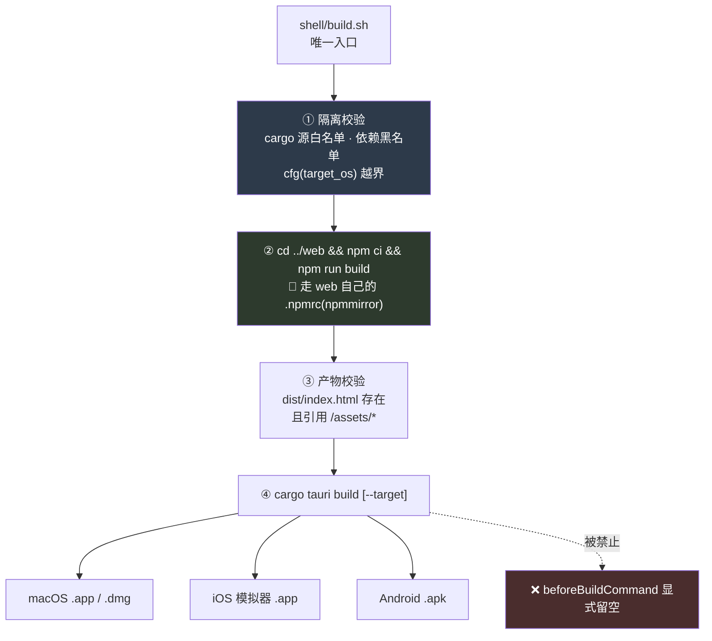
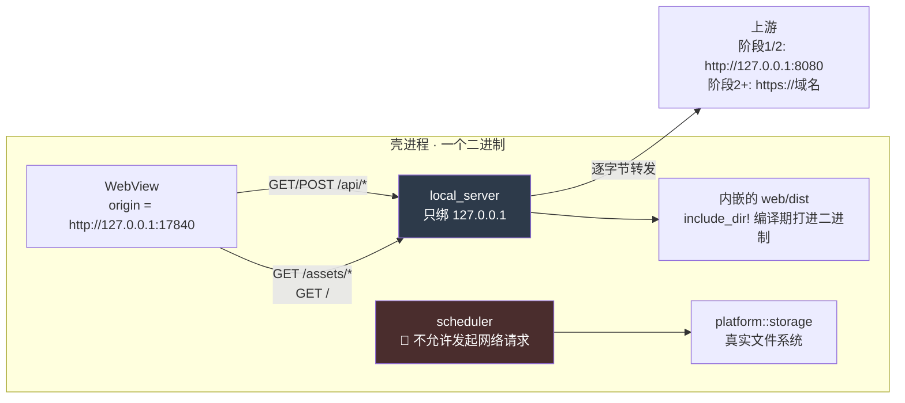

> 这份文档只回答 `KUBI-62` 的三个问题:**壳与 web 工程什么关系、壳与服务端怎么通信、三端共用多少。**
>
> **它是契约,不是排期。** 排期在 `KUBI-61` 那条链上,判据在 `实施路径`,本文一件都不重排。
>
> **🔴 它与 `技术架构` §4.4 / §十 冲突,冲突是显式的、由项目所有者拍板的。** 处理方式见 §零。`技术架构` 那两处原文一个字不改,只加指针。
>
> **它不服务于任何关卡。** `KUBI-61` 已经自己写清楚了:最近那个关卡要的是「自用两周、每天记两个数」,而这件事一个数都不产生。本文不替它找关卡理由,§零 的上限就是为这一条存在的。
>
> 载重的一句话:**现有 web 工程零改动,是这份方案的约束,不是它的优点。** 方案里每一处设计,只要能用「改一下前端更简单」解决,就说明选错了。

> ⚠️ **本文原编号为 `Agent框架`,与 `15-Agent框架与能力边界.md` 撞号,2026-08-30 改为 `壳技术方案`。**
> 撞号原因:写它的分支 `KUBI-62` 基点是 `1accbba`,落后 `v1` 二十个提交,
> 当时 `docs/Agent框架` 还没被占用。同一分支对 `总路线图` / `技术架构` 的改动当时**未采纳**——
> 那是旧基线上的版本,`v1` 已经走在前面(08:581 vs 535 行,10:964 vs 958 行)。
> 本文内容本身按当时的方案原样保留,macOS/iOS/Android 三端已按它落地并验证。
> > ✅ **补记(2026-08-30):那五条风险已在同日并入时补登进 `总路线图` §四,编号 `R-108`…`R-112`**
> > (旧号 `R-72`…`R-76` 在 `v1` 上早已另有所属)。本文正文里的引用已全部跟改。
> > 补登的理由:其中 `R-110`(反代缓冲把原图落盘)与 `R-111`(cargo 源走公司私服)
> > **是两条红线的执行装置**,不在登记册里就没有人会回来查它们还成不成立。

---

## 零、这份文档与既有文档的关系

### 0.1 归属:执行层,挂在 `技术架构` 下面

`技术架构` 是选型记录,本文是它 §4.4 那一格被推翻之后的展开。**本文不产生新的决策层内容**,`决策记录`-`实施路径` 一个字不动。

### 0.2 冲突:`技术架构` §4.4 与 §十 已把桌面壳判为「不做」🔴

| | 内容 | 时间 |
|---|---|---|
| `技术架构` §4.4 | 「✅ 先用 PWA,§十 已把桌面壳列进「不做」」;触发条件是「出现 PWA 拿不到的本地能力需求,**且不止一个**」 | 2026-08 |
| `技术架构` §十 | 「桌面客户端壳 \| PWA 顶着,§4.4 的触发条件未满足」 | 2026-08 |
| `KUBI-61` | **项目所有者直接拍板开工。** 并自己声明「这不服务于当前最近的那个关卡」 | 2026-08-29 |

**触发条件其实已经满足了两条,但这不是开工理由 —— 开工理由是拍板。** 两条是:

| 候选能力 | `技术架构` §4.4 的原话 | 现在成不成立 |
|---|---|---|
| 后台定时器 | 未列入候选 | ✅ **成立**。原图到期处理是红线的执行装置,而浏览器页面关掉之后没有任何定时器能跑 |
| 真实文件系统 | 未列入候选 | ✅ **成立**。归档段只增不减,浏览器配额是一条会撞上的硬墙(`KUBI-63`) |
| 全局快捷键 / 监听截图目录 / 悬浮窗 | §4.4 列的三个候选 | ❌ **一个都不成立**,而且前两个正好是 `web/README.md` 明写「不做」的那条线(「替你听、替你截,不行」) |

**记清楚这个差别:成立的两条都是「红线的执行装置」,不是新功能。** §4.4 原文担心的是「桌面壳的唯一产出是看起来像个正经软件」—— 那个担心对上面前三个候选完全成立,对后两条不成立。**`技术架构` §4.4 那一行不改**,理由在这里加注。

### 0.3 上限:沿用 `R-71`,不新开一份

`R-71` 给自动化交付流水线设的上限是「`P0-6` 那张表为空期间 ≤ 2 个周六 + 每周 1 小时维护」,跑偏判据是「任一周流水线提交数 > 产品轨提交数」。

**壳工程与它是同一个失败模式的同一个预算,不是第二份预算。** 两件事**合并计入同一个 2 个周六**,不是各拿 2 个。理由是 `思考模式` §盲区二 管的是注意力总量,而注意力不因为换了个题目就变多。已登记为 `R-112`。

---

## 一、结论速览

| # | 问题 | 结论 | 一句话理由 |
|---|---|---|---|
| 1 | 复用产物还是复用源码 | 🔴 **复用产物。** 壳编译期把 `web/dist` 整个内嵌进二进制 | 复用源码 = 壳里有第二条前端构建链,两条链迟早出两个界面 |
| 2 | 构建链怎么串 | `shell/build.sh` 是唯一入口,它**调用 web 自己的 `npm run build`**,不另起 | 「构建只走项目自带的构建脚本」;`beforeBuildCommand` 显式留空,防止长出第二条路径 |
| 3 | 沿用 HTTP 还是壳内 IPC | 🔴 **沿用现有 HTTP 契约,一个字节都不改。** 壳内起一个**只绑回环的静态服务 + `/api` 反代** | 前端永远只写相对路径 `/api/*`。vite proxy、Caddy、壳 —— 同一条契约的第三个实现 |
| 4 | 跨域怎么处理 | **不存在跨域。** 页面 origin 与 `/api` 同源,`ApiCorsConfig` 与 `allowed-origins` 一个字不改 | 跨域是部署形态的事(`ApiCorsConfig` javadoc),而这个部署形态里前后端同源 |
| 5 | 证书怎么处理 | **TLS 边界不动,仍在 Caddy。** 壳内回环段一律明文 HTTP,**不做本地 TLS** | 本地 TLS 只有两种实现:让用户信任一张自签证书,或把私钥打进安装包。两种都是安全倒退 |
| 6 | 三端共用多少 | **一份 `web/dist` + 一个 cargo crate**,三端共用。平台差异只允许出现在 `shell/src/platform/` 一个模块里 | `#[cfg(target_os)]` 越界由 `build.sh` 在构建期拦死,不靠自觉 |
| 7 | iOS / Android 接不接后端 | **不接。** 脚手架阶段上游留空,首屏直接落在前端已有的「离线示例数据」整屏回退上 | `KUBI-66` 只要「能构建、能装、能打开首页」。接后端要先回答回环监听口在移动端的暴露面,那是多做的部分 |

---

## 二、问题一:壳工程与现有前端工程的关系

**最早落地阶段:`KUBI-65`(macOS 落地)。本节在此之前只是契约。**

### 2.1 结论:复用产物,不复用源码

| 方案 | 形态 | 结论 |
|---|---|---|
| **复用产物** ✅ | 壳只认 `web/dist` 这个目录,对 React / Vite / Tailwind 一无所知 | **选它。** 壳与前端之间只有一个接口:一个静态目录 |
| 复用源码 | 壳里再放一份 `vite.config.ts`(改 `base`、改 proxy target、加 Tauri 插件) | ❌ 那是**第二条前端构建链**。两条链只要有一处配置漂移,壳里和浏览器里就是两个界面,而 `KUBI-61` 的硬约束正是「壳不引入第二套界面」 |
| 源码软链 / monorepo workspace | 把 `web/src` 挂进壳工程 | ❌ 同上,而且额外要求改 `web/package.json`,直接撞「web 工程一行不改」 |

**判据只有一条:壳能不能在完全不读 `web/src` 的情况下构建出来。** 能,就是复用产物。

### 2.2 这条路能走通的实测依据(2026-08-29)

**这不是推断,是跑出来的。** 在 `web/` 未做任何改动的情况下:

```
$ cd web && npm ci && npm run build
added 73 packages in 805ms
vite v8.2.2 building client environment for production...
✓ 135 modules transformed.
dist/index.html                   0.54 kB
dist/assets/index-CPYaovjY.css   23.25 kB
dist/assets/index-D6UDK_aB.js   347.37 kB
✓ built in 441ms

$ git status --porcelain
(空)
```

产出的 `dist/index.html`:

```html
<link rel="icon" type="image/svg+xml" href="/favicon.svg" />
<script type="module" crossorigin src="/assets/index-D6UDK_aB.js"></script>
<link rel="stylesheet" crossorigin href="/assets/index-CPYaovjY.css">
```

三个事实,决定了后面所有设计:

| # | 事实 | 后果 |
|---|---|---|
| 1 | 资源路径是**根绝对路径** `/assets/*`、`/favicon.svg` | 只要 dist 目录就是那个 origin 的根,路径天然成立。**`vite.config.ts` 的 `base` 不用改** —— 这是「零改动」能成立的第一根支柱 |
| 2 | `grep -rn "http://\|https://\|localhost" web/src` **零命中** | 前端代码里没有任何 host。`client.ts` 的注释写死了这条:「没有 baseURL 配置,也没有环境变量 —— 少一个能配错的地方」。**壳不需要注入任何地址** |
| 3 | **没有路由**(`MainScreen` 里一个 `view` 状态切两个视图) | 不存在 history 模式 / hash 模式之争,也不需要 SPA fallback。`/` 之外的任何路径都不该被访问到 |

> **第 3 条要写进反代规则,不能只当成幸运。** 没有路由意味着**静态服务不需要 fallback**,而「找不到就返回 index.html」这条最常见的 SPA 默认行为,恰好是 `client.ts` 里点名的那个故障:「有 body 但不是 JSON —— 最常见的成因是 /api 压根没被反代出去,静态服务器把 index.html 当兜底返回了」。**壳里必须显式没有这条 fallback。** 见 §3.4。

### 2.3 构建链



| 步 | 动作 | 为什么不能省 |
|---|---|---|
| ① | 校验 `~/.cargo/config.toml` 的生效源在公共镜像白名单里;校验 `Cargo.toml` 依赖不含任何模型 SDK;校验 `#[cfg(target_os` 只出现在 `shell/src/platform/` 下 | **Rust 是这个项目的第三条工具链,而 §一 的隔离红线只写了 Maven 和 npm。** `~/.cargo/config.toml` 里一行 `[source.crates-io] replace-with = "公司源"` 会让依赖静默走内网 —— 和 `server/build.sh` 拦的是同一件事(`R-111`) |
| ② | **调用 web 自己的 `npm run build`**,不复制它的命令 | 「构建只走项目自带的构建脚本」。`npm` 读的是**当前工作目录**的 `.npmrc`,所以必须真的 `cd ../web`,不能用 `npm --prefix` |
| ③ | 产物校验 | ④ 的 `include_dir!` 是编译期读盘。dist 不存在时报的是一句 Rust 宏错误,和「前端没构建」这件事对不上号 |
| ④ | `cargo tauri build` | — |

**`tauri.conf.json` 里 `build.beforeBuildCommand` 必须是空字符串,并在旁边写明原因。** 留着它,下一个人会顺手填上 `npm run build` —— 那就出现了**第二条构建路径,而它绕过 ①**。绕过隔离校验的构建路径和没有隔离校验是一回事。

### 2.4 目录

```
shell/                         # 与 server/ web/ 平级的第四个顶层目录
  build.sh                     # 唯一构建入口
  README.md
  Cargo.toml
  tauri.conf.json
  capabilities/
    desktop.json               # macOS 的权限集
    mobile.json                # iOS / Android 的权限集
  src/
    main.rs                    # 只做装配:读配置 → 起回环服务 → 开窗
    config.rs                  # 配置读写(含端口持久化)
    local_server.rs            # 静态直出 + /api 反代
    scheduler.rs               # 🔴 唯一的后台定时器注入点,见 §五
    strings.rs                 # 🔴 所有面向用户的字符串,见 §六
    platform/                  # 🔴 唯一允许出现 #[cfg(target_os)] 的模块
      mod.rs                   # trait 定义
      macos.rs  ios.rs  android.rs
  icons/
  gen/                         # tauri ios/android init 生成,git-ignored
  target/                      # git-ignored
```

**`web/dist` 不进 git**(`web/.gitignore` 里已经有 `dist`),壳依赖的是**同一次 checkout 里现构建出来的产物**,不是仓库里存着的。

### 2.5 这一节的三条不做

| 不做 | 为什么 | 何时改变 |
|---|---|---|
| 不在壳里改 `base` / 加 vite 插件 / 装 `@tauri-apps/api` | 装了 `@tauri-apps/api` 就要改 `web/package.json`,一行不改这条当场失效 | 出现一个**必须由页面主动发起**的本地能力需求。目前一个都没有 —— 后台定时器和文件系统都在 Rust 侧 |
| 不把 `web/dist` 提交进仓库 | 提交产物 = 允许产物与源码不一致,而「壳里看到的和浏览器里一致」就是靠它们一致 | 永不 |
| 不做自动更新(`tauri-plugin-updater`) | 要一个签名密钥 + 一个托管的 manifest 端点,两样都是新增的年费与新增的实名 | 有第二个使用者。当前使用者是一个人 |

---

## 三、问题二:壳与服务端的通信

**最早落地阶段:`KUBI-65`。**

### 3.1 问题的确切形状

前端只写 `/api/*` 相对路径。这条路径解析成什么,取决于**页面 origin**:

| 形态 | 页面 origin | `/api/syllabus/tree` 解析成 | 通不通 |
|---|---|---|---|
| dev | `http://localhost:5173` | `http://localhost:5173/api/...` → vite proxy → `:8080` | ✅ |
| 生产 web | `https://<域名>` | 同源 → Caddy 反代 → `:8080` | ✅ |
| **Tauri 默认** | `tauri://localhost` | `tauri://localhost/api/...` → **打到资源协议上,返回 404 或 index.html** | ❌ |

**注意:资源加载是通的**(§2.2 事实 1:`/assets/*` 在资源协议下就是 dist 的根)。**唯一不成立的是 `/api/*`。** 问题的全部范围就是这一条路径。

### 3.2 五个方案对照

| # | 方案 | 要改 web 吗 | 跨域 | 致命处 |
|---|---|---|---|---|
| **A** | **壳内起只绑回环的静态服务 + `/api` 反代,窗口指向 `http://127.0.0.1:<固定端口>`** ✅ | **不改** | **不存在** | 多一个回环监听口(`R-108`);端口即 origin,必须稳定(`R-109`) |
| B | 用 `tauri-plugin-http` 的 fetch 绕过 CORS | ❌ 要改 `client.ts` | 绕开 | 直接撞硬约束。而且它把「只写相对路径」这条纪律换成「壳里走一套、浏览器里走另一套」 |
| C | 窗口直接指向线上 URL | 不改 | 不存在 | 阶段 1/2 没有线上;而且它就是一个没有地址栏的浏览器 —— 拿不到后台定时器和文件系统,**这次开工的两个理由同时消失** |
| D | 用 Tauri IPC(`invoke`)替代 HTTP | ❌ 要改 | — | 会长出**第二套契约**。更严重的是它诱导把业务规则搬进 Rust —— 那是第二个后端,而 `技术架构` §2.2 的整节都在讲不要出现第二个 |
| E | 往 `kaodian.api.cors.allowed-origins` 里加 `tauri://localhost` | 不改 web,但要改 server 配置 | 靠 CORS 兜 | `tauri://` 不是 http(s) scheme,Spring 的 origin 匹配对它不可靠;真正的问题是**它把跨域从「部署形态的事」变成「客户端形态的事」**,而 `ApiCorsConfig` 的 javadoc 明写着相反的话。此外未来接 Bearer 令牌时预检会持续踩坑 |

**选 A。** 它的价值不在于技术上高明,在于它让 `/api/*` 这条契约**在第三个部署形态里仍然只有一份**:

> dev 是 vite proxy,生产是 Caddy,壳是它自己。**三个实现,一条契约,前端一个字不知道自己在哪儿跑。**

### 3.3 选定方案



| 项 | 值 |
|---|---|
| 监听地址 | **`127.0.0.1`,不是 `0.0.0.0`** —— 与 `application.properties` 里 `server.address=127.0.0.1` 同一条理由,同一句注释 |
| 端口 | **固定 `17840`**,首次运行写进配置文件;**被占用时拒绝启动并点名占用进程,不自动换端口**(理由见 §3.7) |
| 静态资源来源 | 编译期 `include_dir!` 内嵌 |
| 上游地址 | 配置项 `shell.upstream`,默认 `http://127.0.0.1:8080` |

**为什么内嵌而不是读安装包资源目录:** 三端拿资源的方式各不相同(macOS 在 `.app/Contents/Resources`,Android 在 APK 里要走 AssetManager)。内嵌把这个差异消成零 —— **这是 §四「差异如何隔离」的第一笔,而且它的成本只是二进制大几 MB。**

### 3.4 反代契约

**这是要交给 `KUBI-65` 照做的部分,逐条都有理由,一条都不是风格问题。**

| # | 规则 | 理由 |
|---|---|---|
| 1 | 路由表只有两条:`/api/*` → 反代;其余 → 内嵌静态。**没有第三条,没有 fallback** | `client.ts` 点名的故障:静态服务器把 index.html 当兜底返回,前端拿到「Unexpected token '<'」。**`/api/*` 永不回退到 index.html** |
| 2 | 方法、路径、query、请求头、请求体**逐字节转发**,壳不解析、不重写、不补默认值 | 壳一旦开始读请求体,它就变成了契约的第三个参与方。契约只有两方 |
| 3 | 🔴 **`Authorization` 原样透传,且不进任何级别的日志** | 阶段 2 起会有 Bearer 令牌(`技术架构` §7.4)。壳不签发、不缓存、不刷新令牌 |
| 4 | 🔴 **请求体流式转发,不缓冲落盘** | `技术架构` §8.1 禁令 5 的新实例:「接入层不得把请求体落盘」。原文点名的是 Nginx 的 `client_body_temp`,**而壳现在是第三个接入层**。图片走 `POST /api/records/{id}/image` 的 base64 内联,6 张图必然超过任何默认缓冲(`R-110`) |
| 5 | 🔴 **不打印请求体与响应体的任何级别日志** | 同上。`技术架构` §8.1 禁令 3 |
| 6 | 上游连不上 / 超时 → 返回 **`502`**,body 是 `{code,message,traceId}` 形状 | `client.ts` 已经把 502/503/504 翻译成「后端 :8080 没起来?」。返回别的状态码等于让一条已经写好的错误提示失效 |
| 7 | 上游连接超时设 **1500ms**,短于前端的 `TIMEOUT_MS = 2000` | 让前端拿到一个**有意义的 502**,而不是自己 abort 后显示一句泛泛的「请求超时」 |
| 8 | 上游是 https 时走系统信任库,**不做证书固定、不加自定义 CA、不允许跳过校验** | 见 §3.6 |
| 9 | 请求带 `Sec-Fetch-Site: same-origin` 之外的值时拒绝 | 纵深防御,不是边界。真正的边界讨论见 `R-108` |

### 3.5 跨域:不存在,而且这一条要写进验收

页面 origin 是 `http://127.0.0.1:17840`,`/api/*` 由同一个监听口应答 —— **同源**。

| 要改吗 | 项 |
|---|---|
| ❌ 不改 | `ApiCorsConfig.java` |
| ❌ 不改 | `kaodian.api.cors.allowed-origins`(仍是 `http://localhost:5173`,那是 dev 用的) |
| ❌ 不改 | `server.address=127.0.0.1` |
| ❌ 不加 | 任何 `tauri://` 白名单条目 |

**验收判据:接壳这件事在 `server/` 里的 diff 是空的。** 有 diff 就是选了 §3.2 的 E 方案。

### 3.6 证书:TLS 边界一寸不动

| 段 | 协议 | 谁出证书 |
|---|---|---|
| WebView ↔ 壳内回环 | **明文 HTTP** | 无 |
| 壳 ↔ 上游(阶段 1/2 本机) | 明文 HTTP | 无 |
| 壳 ↔ 上游(阶段 2+ 线上) | **HTTPS** | Caddy,与浏览器访问时同一张 |

**壳内回环段不做本地 TLS。** 本地 TLS 只有两种实现方式,两种都是安全倒退:

| 实现 | 后果 |
|---|---|
| 自签证书 + 让用户点信任 | 往用户的系统信任库里塞一张我们控制的根证书。**这比它要解决的问题严重得多** |
| 把证书和私钥打进安装包 | 私钥随安装包分发 = 私钥公开。同时它会过期,过期那天所有装了的人同时打不开 |

**明文只在回环上成立的理由要说清楚:这段流量不出网卡。** 它的暴露面是「同机其它进程」,而那是 `R-108` 讨论的问题 —— **TLS 解决不了它**(同机进程一样能连上并完成 TLS 握手)。**用 TLS 去挡一个 TLS 挡不住的威胁,是拿一次真实的安全倒退换一个心理安慰。**

### 3.7 origin 必须跨启动稳定 —— 交给 `KUBI-63` 的硬契约 🔴

浏览器侧的一切本地存储(localStorage / IndexedDB / OPFS / Cache)都**按 origin 隔离**,而 `http://127.0.0.1:17840` 里的端口**是 origin 的一部分**。

> **端口换一次,浏览器侧存的东西全部消失,而且不报错、不提示、看起来就像「数据没了」。**

所以:

| 规则 | 说明 |
|---|---|
| 端口固定并持久化 | 首次运行选定后写进配置,之后每次读同一个 |
| 🔴 **被占用时拒绝启动**,不自动换端口 | 自动换端口是「让它先跑起来」的自然写法,而它的代价是静默丢数据。**拒绝启动是响亮的,静默换端口是无声的** —— 与 `PhoneKeyGuard`(`R-59`)同一条纪律 |
| 顺带的一个好处 | `http://127.0.0.1` 是**安全上下文**,`crypto.subtle`、OPFS 这些能力都在。这一条对 `KUBI-63` 的选型有意义,但**选哪种存储是 `KUBI-63` 的事,本文不定** |

**这不构成对 `KUBI-63` 的建议。** `KUBI-63` 若决定把原图搬到 Rust 侧的真实文件系统,这条约束的重要性会下降但不会消失(前端仍可能存别的东西)。本文只负责把这条约束交出去。

---

## 四、问题三:三端共用多少、差异在哪、如何隔离

**最早落地阶段:macOS `KUBI-65`,iOS `KUBI-66`,Android `KUBI-67`。**

> ⚠ **勘误(2026-08-29,人审放行后):初稿写的是「Android 本轮不排期」,当时议题树里还没有 `KUBI-67`。** 现已有,且与 iOS 同档(仅可构建、可安装、可打开首页)。**设计一个字不用改** —— 本节的共用面、`platform` trait、「不接后端」的处置从一开始就是按三端写的,变的只是排期事实。

### 4.1 共用什么

| 共用物 | 共用程度 | 说明 |
|---|---|---|
| `web/dist` | **100%,同一份产物,同一次构建** | 不是「同一份源码各自构建」。三端装的是**同一批字节** |
| cargo crate | **一个**,三端同一个 `Cargo.toml`、同一个 `main.rs` | Tauri 2 的移动端是在同一个 crate 上 `cargo tauri ios init` / `android init`,生成物落在 `gen/`(git-ignored) |
| `local_server.rs` / `config.rs` / `scheduler.rs` / `strings.rs` | **100%,零 `#[cfg]`** | 这是判据:这四个文件里出现一个 `#[cfg(target_os)]`,隔离就已经破了 |
| HTTP 契约 | **100%** | 三端跑的是同一份 `client.ts` |

### 4.2 差异在哪

| 维度 | macOS | iOS | Android |
|---|---|---|---|
| 本轮目标 | **可用的客户端**(`KUBI-65`) | **仅可构建可安装可打开首页**(`KUBI-66`) | 同 iOS(`KUBI-67`) |
| 上游后端 | 可配置,默认 `127.0.0.1:8080` | **留空 —— 不接** | 同 iOS |
| 首屏内容 | 真数据 | **前端已有的「离线示例数据」整屏回退** | 同 iOS |
| 后台定时器 | ✅ **这次开工的实在收益** | ❌ 系统不保证后台执行 | ❌ 同 |
| 归档目录 | `~/Library/Application Support/<bundle-id>/` | app 沙箱容器 | app 私有目录 |
| 窗口 / 菜单栏 | 有窗口,**菜单栏用系统默认,不自定义** | 无 | 无 |
| 签名 | ad-hoc(见 §4.4) | 模拟器不需要 | debug keystore |

> **iOS/Android 不接后端不是偷懒,是不多做。** `KUBI-66` 的原话:「做多了反而要在后面删掉」。接上后端要先回答一个真问题:**回环监听口在移动端对同设备其它 app 是可见的**(`R-108`),而那个问题在 macOS 上有答案(单用户机器)、在移动端没有。**没答案的时候正确动作是不做,不是先做了再说。**
>
> 顺带一个已经验证过的便利:前端「四个 GET 任一不可达 → 整屏回退到离线示例数据 + 红字标明原因」是**已经写好并跑通的行为**(`web/README.md`)。所以移动端首屏**不需要写一行额外代码**就有内容,而且它诚实地标着自己是示例数据。

### 4.3 差异如何隔离

**两个落点,一条构建期强制。**

| 落点 | 规则 |
|---|---|
| 1 · Rust | `#[cfg(target_os = "...")]` **只允许出现在 `shell/src/platform/` 下**。其余模块通过 `platform::` 暴露的 trait 拿能力,不知道自己在哪个系统上 |
| 2 · Tauri 权限 | 按平台分文件:`capabilities/desktop.json` / `capabilities/mobile.json`。**不写一个"全都给"的通配 capability** |

构建期强制(`build.sh` 步骤 ①):

```
grep -rn 'cfg(target_os' shell/src --exclude-dir=platform   # 期望零命中,命中即构建失败
```

**这条必须在 `build.sh` 里,不能只写在 README 里。** 理由与 `server/build.sh` 的镜像白名单、`web` 的 `--shadow-*: initial` 是同一条:

> **靠自觉的约束在赶工的那一周会失效,而赶工的那一周正是它最需要生效的时候。**

`platform` trait 的最小面(交给 `KUBI-65` 定实现,签名在这里定):

```rust
pub trait Platform {
    /// 归档目录。三端各自的沙箱位置,调用方不关心它在哪。
    fn archive_dir(&self) -> PathBuf;

    /// 本平台是否保证后台定时执行。iOS/Android 返回 false,
    /// scheduler 据此决定「只在前台扫一次」还是「常驻」。
    /// 🔴 返回 false 不等于降级成"假装能跑"——见 §五。
    fn background_timer_supported(&self) -> bool;
}
```

**这个 trait 现在只有两个方法,这是有意的。** 每加一个方法就是多一处三端会分叉的地方;加之前先问它服务于哪个已成立的需求。

### 4.4 签名与年费:这一轮一分钱不花

`技术架构` §4.4 留了一个 ⚪ 待确认项:「桌面分发要代码签名 —— Apple Developer $99/年 + Windows 代码签名证书……不在 `总路线图` §五 的成本表里」。

**本轮的答案:不需要,因为本轮没有分发。**

| 端 | 本轮怎么做 | 什么时候才要花钱 |
|---|---|---|
| macOS | **ad-hoc 签名,自用**。首次打开走一次「右键 → 打开」 | 出现**第二个使用者**的那一天。分发给别人才需要 Developer ID + 公证 |
| iOS | **只上模拟器**。模拟器不需要签名身份 | 要装真机时。`KUBI-66` 写的是「模拟器**或**真机」,选模拟器这一支就绕开了 |
| Android | debug keystore | 上架时 |

**同时把 `技术架构` §4.4 那条 ⚪ 的另一半留着不动:签名主体应与域名实名、ICP 备案、小程序主体一致。** 那条在真要签名的那天仍然成立,而域名(`L-A1`)还没注册。**本轮不花钱,也就不需要现在回答这个问题 —— 这是不花钱的第二个理由。**

---

## 五、后台定时器:唯一的具名注入点 🔴

这是 `KUBI-61` 说的「这次试水最实在的技术收益」。它也是壳里**唯一一个会自己动起来的东西**,所以边界要划得比别处更死。

| 规则 | 理由 |
|---|---|
| **只有一个定时器,叫 `shell::scheduler`,别处不许起线程做周期任务** | 「注入点必须可数且各有其名」。多一个没人知道的定时器,就多一处没人审过的自动行为 |
| 🔴 **scheduler 不允许发起任何网络请求** | 一个能上网的后台定时器,就是「原图绝不上云、不同步、不共享」这条红线的现成破口。它在代码里的形态:scheduler 模块不 import 任何 HTTP 客户端 |
| **scheduler 只负责「什么时候问」,不负责「该不该删」** | `KUBI-63` 的硬约束是「判据层(纯逻辑、可测)与存储层(碰真实 IO)必须继续分开」。定时器属于**触发**,判据仍在判据层。定时器里出现一行 `if now > expire_at` 就已经把两层合并了 |
| **`background_timer_supported() == false` 时不假装** | iOS/Android 拿不到后台执行保证。正确行为是**前台启动时扫一次**,并且不在界面上承诺任何「到期自动处理」。与 `web/README.md`「做不出来的东西,界面上不留承诺」同一条 |
| 到期动作的**判据与文案**由 `KUBI-63` / `KUBI-64` 定 | 本文只定注入点,不定它做什么 |

---

## 六、红线在壳里的形态

| 红线 | 在壳里的落点 |
|---|---|
| 原图只在用户自己的机器上,不上云、不同步、不共享 | ①scheduler 不 import HTTP 客户端;②反代流式转发不落盘(§3.4 规则 4);③壳的依赖里**不引任何崩溃上报 / 遥测 SDK**(Sentry 及同类) |
| 服务端不写磁盘、不进对象存储 | 壳是**第三个接入层**,§3.4 规则 4/5 是 `技术架构` §8.1 禁令 5 在壳上的实例(`R-110`) |
| 不做教研 / 永不判断对错 | 壳不新增任何界面。**壳里所有面向用户的字符串集中在 `shell/src/strings.rs` 一个文件** —— `KUBI-65` 要跑的「能力边界文案扫描」因此只有一处要扫。撞词时**改文案,不改词表** |
| 能力边界的注入点可数 | 🔴 **壳不调用任何外部模型。** `AsrClient` / `VisionTagger` 仍然只在 server 的 `recognize` 包里(`后端详设` §二:「`recognize` 之外不得出现 HTTP 调模型」)。`build.sh` 步骤 ① 的依赖黑名单就是这条的执行装置 |
| 不碰内容 | 壳不解析请求体(§3.4 规则 2),所以它**结构上不可能**存下任何学习内容 |
| 与主业公司零交集 | `build.sh` 步骤 ① 的 cargo 源白名单(`R-111`)。`grep -ri "fenbi" shell/` 加进 `技术架构` §1.5 的自检清单 |

---

## 七、交给谁

**本文的结论是输入,不是判决。** 三个下游各自拿走一段契约:

| 议题 | 拿走什么 | 本文**不**替它决定什么 |
|---|---|---|
| `KUBI-63` 原图存储 | §3.7 的 origin 稳定性约束;§五 的 scheduler 注入点与「只触发不判据」 | 存哪儿、怎么迁、判据层怎么切 —— **一条都不定** |
| `KUBI-64` 交互差异 | §4.2 的三端差异表;§4.3「窗口菜单栏用系统默认」是**建议不是结论**;§六 的字符串集中 | 三处承诺(同意留存 / 到期提示 / 立即删除)怎么呈现;托盘与原生通知要不要用 |
| `KUBI-65` macOS 落地 | §2.3 构建链、§2.4 目录、§3.3 参数、§3.4 反代契约九条、§4.3 trait 签名 | 具体用哪个 Rust HTTP 库 |
| `KUBI-66` iOS 脚手架 | §4.2「不接后端,首屏落在离线示例数据」;§4.4「只上模拟器,不买账号」 | — |

**契约变更必须回来改这份文档。** 反代那九条里任何一条被实现绕过,是文档过期,不是实现聪明。

---

## 八、新增风险登记

**按 `总路线图` §四 的约定,以下五条登记进风险登记册,`R-108` 起编号。**

| id | 风险 | 缓解 |
|---|---|---|
| `R-108` | 🟠 **壳内回环监听口对同机其它进程可见** —— 任何本地程序都能连上 `127.0.0.1:17840` 并通过反代访问用户的账号。移动端更糟:同设备其它 app 一样能连 | **诚实的现状**:阶段 1/2 的 server 本身就绑回环且**完全没有鉴权**(`application.properties` 原话:「咖啡馆里任何人 curl 一下就能悄悄归档掉你的考点」),所以壳**没有新增一类暴露面**,只是搬了个位置。缓解:随机不可猜端口不解决问题(可扫);§3.4 规则 9 是纵深不是边界。**真正的处置是移动端本轮不接后端**(§4.2)。**何时改变:阶段 2 接入 Bearer 令牌时,回来重估一次 —— 那时 server 有鉴权了,壳这一段就成了整条链上唯一没有的那一环** |
| `R-109` | 🟠 **页面 origin 随端口漂移 → 浏览器侧本地存储静默全失** —— 端口是 origin 的一部分,自动换端口这个「让它先跑起来」的自然写法会让用户的本地数据看起来凭空消失,不报错、不提示 | §3.7:端口固定并持久化,**被占用时拒绝启动并点名占用进程**。与 `R-59` / `PhoneKeyGuard` 同一条纪律:**响亮地失败,不无声地毁数据** |
| `R-110` | 🔴 **壳是第三个接入层,它的反代缓冲会把原图落盘** —— `技术架构` §8.1 禁令 5 原本点的是 Nginx 的 `client_body_temp`,而那条禁令的形状在壳上原样重现:图片走 base64 内联,6 张图必然超过任何默认缓冲 | §3.4 规则 4/5:流式转发不缓冲落盘、不打印请求体。**写进 `KUBI-65` 的验收,不是写进注释** |
| `R-111` | 🟠 **Rust 是第三条工具链,而 `技术架构` §一 的隔离红线只写了 Maven 和 npm** —— `~/.cargo/config.toml` 里一行 `[source.crates-io] replace-with` 会让依赖静默走公司私服,**在公司网络里不会报错**,与 `server/build.sh` 拦的是同一件事 | `shell/build.sh` 步骤 ①:cargo 源公共镜像白名单 + 凭据检查,照抄 `server/build.sh` 的形态。`技术架构` §1.5 的自检清单加两行 |
| `R-112` | 🟡 **壳工程与 `R-71` 是同一份预算,不是第二份** —— 两件事都可量化、都上瘾、都不需要面对任何真实用户;分开记预算等于把上限翻倍 | §0.3:**合并计入同一个「≤2 个周六 + 每周 1 小时」**,跑偏判据沿用 `R-71`(任一周非产品轨提交数 > 产品轨提交数即为跑偏)。**何时改变:`P0-6` 那张表填满两周** |

---

## 九、不做什么

| 不做 | 为什么 | 何时重新评估 |
|---|---|---|
| 全局快捷键 / 监听截图目录 / 系统悬浮窗 | `技术架构` §4.4 列的三个候选**一个都不成立**,而且前两个正好撞 `web/README.md` 的「替你听、替你截,不行」 | 永不(前两个);第三个不评估 |
| 壳内 IPC 契约(`invoke`) | 会长出第二套契约和第二个后端 | 出现一个 HTTP 表达不了的本地能力,**且它不能放在 server 侧** |
| 自动更新 | 新增签名密钥 + 托管端点 | 有第二个使用者 |
| 崩溃上报 / 遥测 | **它会把数据送出这台机器**,而红线的原话是「只存在他自己的机器上」 | 永不 |
| 本地 TLS | §3.6 的两种实现都是安全倒退 | 永不 |
| Windows / Linux 端 | `KUBI-61` 的范围是 macOS + iOS/Android 脚手架 | 不评估 |
| 壳内缓存 API 响应 | 前端已有 TanStack Query 的缓存与「四个端点要么全真要么全假」的整屏纪律。壳再加一层 = 同屏两个来源 | 不评估 |
| Tauri 的 `updater` / `notification` / `tray` 插件 | 每引入一个原生能力,就多一处浏览器与壳不一致的地方(`KUBI-64` 的原话) | 由 `KUBI-64` 判定,不由本文判定 |

---

## 十、自检

这份文档写完不构成任何进度。**`总路线图` §六 的自检没有变。**

三条现在就成立的判据:

1. **`server/` 的 diff 是空的** —— 有 diff 就是选了 §3.2 的 E 方案(§3.5)。
2. **`web/` 的 diff 是空的** —— `git status --porcelain` 在跑完 `npm run build` 之后仍然是空的(§2.2 已实测)。
3. **`grep -rn 'cfg(target_os' shell/src --exclude-dir=platform` 零命中** —— 由 `build.sh` 而不是由自觉保证(§4.3)。

> ⚠️ **2026-08-31:第 2 条已被 `KUBI-63` / `R-105` 换掉,原文一个字没改(`04 §成本` 的惯例)。**
> 换掉的**不是**它想说的那句话,是它用的那个代理:
>
> | | |
> |---|---|
> | 它真正要守的 | **壳不许把 web 改出第二套** |
> | 旧代理 | `web/` 的 git diff 为空 —— 在形态分支数量是 **0** 时恰好等价,还便宜得多 |
> | 为什么不再等价 | 壳形态改用文件系统,判据层就得知道拿哪个后端,而这件事**没有任何办法在不碰 `web/` 的前提下完成**(壳没有 IPC,web 也不该为壳装一个) |
> | 新判据 | `build.sh` 步骤 ③.5:**形态判断恰好 1 处且在 `lib/rawImageStore.ts`**;`__TAURI`/`isTauriShell` 在 `web/src` 零命中;原图链路上 `Date.now()` 恰好 1 处 |
>
> 新判据比旧的强:旧判据挡不住「在注入点里写十个 `if`」,也挡不住有人在界面组件里加一句
> `window.__TAURI__` —— 只要那次改动被一起提交。第 1 条与第 3 条**一个字没变**。
> 🔴 **这是实现方改了一条验收判据,理由与全部代价写在 `21 §9.4`,退回这一处不影响其余代码。**
>
> 同时 §2.5 与本文首页那句「现有 web 工程零改动」也随之失效 ——
> 现在成立的是**「壳不引入第二套逻辑,形态分支可数且只有一处」**,理由同上。

一条现在就要说出口的:

> **本文描述的一切,加起来对最近那个关卡的贡献是零。** `KUBI-61` 自己写了这句,本文重复一遍,因为写方案的过程本身就是 `思考模式` §盲区二 点名的那种「能立刻动手、有完成感、完全不需要面对真实用户」的事 —— 而且它比写代码更容易让人觉得自己在推进。

**产品不是变量,需求才是。**
