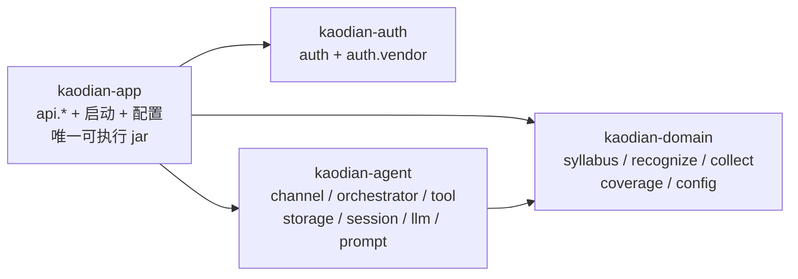

# 接口契约：签名与错误码全集

> **这份文档只回答一个问题：后端拿着它，能不能不问人就把表结构与接口定出来。**
>
> **它不是端点清单的第二份。** 端点该不该存在、属于哪一域、为什么这么设计，真源仍在
> [`技术架构与接口契约`](INDEX.md) §六 与 `product/modules/` 九域五十一单元。
> 本文只补那一层**故意没写**的四样东西：**签名、字段与类型、错误码全集、分页与幂等语义**。
> 一个端点在 `技术架构与接口契约` §六 有行、在这里没有条目，是本文的缺口；
> 反过来在这里有条目而那边没有行，一律在本文 §二 的对照表里点名说明它从哪个 `[契约缺]` 补出来。
>
> **基线**：`origin/v1` @ `44320c9`，fetch 于 2026-09-03（§十二 落盘时刷新；初版基线是 `73041df`）。
> **状态**：活跃。**过期判定**：`技术架构与接口契约` §六 增删任一端点；`模块地图` §四 状态名变化；
> 九域单元文档里任一 `[契约缺]` 被补上或新增；**§12.12 那十一条落差里任一条被实现补上**。
>
> ⚠️ **本文不排期、不定价、不定阈值数字。** 数字的真源是 `商业化与额度设计` §一 与各单元文档；
> 本文只定**形状**（字段在不在、类型是什么、缺失时前端退到哪一档）。
> ⚠️ **本文不新增任何产品能力。** 出现在这里的每一个端点，都必须能指回一份单元文档里的 `[契约缺]` 或
> `技术架构与接口契约` §六 已有的一行。指不回去的，就是本文越权。

---

## 零、与既有文档的关系（§3.3 要求的显式登记）

| 既有结论 | 本文的动作 |
|---|---|
| `技术架构与接口契约` §六 头注「下面几张契约表没有一列写鉴权要求……鉴权列怎么补由技术侧定」 | **本文补上**，见 §三。原文不改 |
| `技术架构与接口契约` §6.6 头注「`GET /billing/plans` 匿名可访问……由技术侧裁定」 | **本文裁定为需登录**，见 §九·待办 3。原文不改，就地已有注 |
| `技术架构与接口契约` §九 「阶段 2 才第一次需要服务器」 | 本文不改部署形态，只记它与「登录是硬门」的关系，见 §九·待办 5 |
| 各单元文档里的 `[契约缺]` | **本文逐条补齐或逐条判为「不该有端点」**，见 §二 对照表。单元文档原文不改，由产品经理在下一轮把 `[契约缺]` 换成指向本文的指针 |
| `U7.7` 退款、`U3.6` 反向断言 | 🔴 **本文一个端点都不补。** 理由在 §二 那两行 —— 有契约没规则比没契约更糟 |
| 头注「指不回去的端点就是本文越权」 | ⚠️ **§十二 是唯一一处例外**，且方向是反的：能力已在生产代码里跑着，缺的是契约。判据与边界见 §12.1.1 |
| §1.6「本文不允许出现第二个流式端点」 | ⚠️ **已被实现推翻**（`POST /agent/chat` 已存在）。§12.1.2 裁定为「保留两个、帧语义收敛成一套」，§1.6 就地加注 |
| `基础数据 · 抓取范围与渠道` §2.3「`province_codes` 本期直接不要」 | ⚠️ **本文不拿它当契约的拒绝理由**（那是数据侧的排期口径）。`/coverage/blindspots` **暂不加** `province`，理由是同文 §2.5 的**统计单位错误**，解锁条件写在 §12.9.3。原文不改 |
| 2026-09-03 用户裁定「不要局限在现在的 agent tool，数据跟着产品走螺旋迭代」 | **§十二 据此重写**，两处改判见 §12.1.3。初稿 `bcf9b62` 从现有 `tool/impl/` 倒推的那版作废 |

**本文没有推翻任何既有结论。** 唯一一处口径收窄（`/billing/plans` 由匿名改为需登录）是既有文档自己登记的待裁定项，裁定权本来就在技术侧。

⚠️ **2026-09-03 补注**：上表后三行是本轮新增的登记。其中 §1.6 那条**是被实现推翻的，不是被本文推翻的** ——
代码先于契约落地了一个流式端点，本文做的是把它收编进契约。这个先后顺序本身值得记一笔（见 §12.1.1）。

---

## 一、全局约定

这一节是全文的公因式。**下面每个端点条目里不再重复这些。**

### 1.1 传输与编码

| 项 | 约定 |
|---|---|
| 前缀 | `/api/v1` |
| ⚠️ 前缀现状落差 | 🔴 **代码里十个 controller 全部挂在 `/api/**` 下，没有一个带 `v1`**（`@RequestMapping("/api/auth")` `("/api/records")` …，实测 2026-09-03）。**契约不改** —— 迁到 `/api/v1` 是一次一次性改动，改晚了每多一个端点就多一处要改。本文只登记这处落差，迁移时点由项目经理排 |
| 编码 | 请求与响应一律 `application/json; charset=utf-8`。唯一例外：`POST /records/{id}/audio` 是 `multipart/form-data` |
| 时间 | ISO-8601 带时区，形如 `2026-09-03T14:05:00+08:00`。**服务端一律返回带时区的绝对时间，不返回「3 天前」这类相对描述** —— 相对描述是展示层的事，落进契约就等于把「多久前」的口径分叉到四个端 |
| 金额 | 整数分，字段名一律以 `Fen` 结尾（`priceFen` / `amountFen`）。**不用小数、不用浮点、不用字符串金额** |
| 布尔 | 真布尔，不用 `0/1`、不用 `"true"` |
| 标识 | 服务端标识一律 `int64`，JSON 里**以字符串传输**（`"nodeId": "10231"`）。理由：JS `Number` 在 2^53 之上丢精度，而四个端里有两个是 JS |
| 空值 | 🔴 **「没有这个字段」与「值是 0/空串」必须能被区分**：没有就不出现这个 key，不要用 `0` 或 `""` 代替。这条不是风格，是 `U5.4` 合并预览与 `U3.1` 未分类计数两处点名要求的能力 |
| 缺字段的降级 | 🔴 **前端拿不到一个可选字段时，退化成「不显示那一项」，永不自己编一个默认值。** 这条在 `U7.3` 的三处 `[契约缺]` 上是逐字要求 |

### 1.2 鉴权

| 项 | 约定 |
|---|---|
| 传输 | `Authorization: Bearer <token>` |
| 令牌前缀 | `at_` = 应用令牌（`scope=full`）；`ro_` = 只读令牌（`scope=readonly`）。前缀参与语义（`技术架构与接口契约` §7.4） |
| 默认 | 🔴 **全部端点默认需要 `scope=full` 的有效令牌。** 免鉴权的端点必须在 §三 的白名单里逐个列出，**白名单之外没有第二个匿名入口** |
| 只读令牌 | 命中任何非 `GET` 方法 → `403 READONLY_TOKEN`；命中 `/billing/**` 或 `/quota/**` → `403 READONLY_TOKEN`，不论方法（`技术架构与接口契约` §6.5 锁 2 与锁 4，本文不改） |
| 未授权两档 | 🔴 **`401` 必须能区分「从没登录」与「登录过期」**：`UNAUTHORIZED` / `TOKEN_EXPIRED`。`U5.1` 要求这两档 —— 区分不出来登录门的副标题就写不出来。**这两个码名不是本文新起的**，`用户侧功能规格 · 总纲` §三 已经在用，本文照抄 |

### 1.3 错误体

```
HTTP 4xx / 5xx
{
  "code": "QUOTA_EXHAUSTED",
  "message": "本月 AI 录入额度已用完",
  "traceId": "01a0631a7f2c",
  "details": { }
}
```

| 字段 | 类型 | 必填 | 说明 |
|---|---|---|---|
| `code` | `string` | ✅ | 大写蛇形。**全集在 §十，端上不许出现 §十 之外的码** |
| `message` | `string` | ✅ | **仅供日志与排查，端一律不直接展示。** 展示文案由端按 `code` 查自己的词表 |
| `traceId` | `string` | ✅ | 排查用 |
| `details` | `object` | — | 只在本文逐个端点明确写了形状时才有。**没写形状就不许有** |

🔴 **`code` 的设计判据只有一条**（`U6.3` / `U6.4` 逐字要求）：**窄到端不需要自己编一句话去解释它。**
含糊的码（`ERROR`、`FAILED`、`BAD_REQUEST`）等于把朗读文本推给四个端各写一遍，**那就是词表的第二处定义**。
判据可查：如果两个端对同一个 `code` 会写出不同的用户文案，那这个 `code` 太宽，拆。

**HTTP 状态码的取值收窄到九个**，多一个都要在本文加行：

| 状态 | 何时用 |
|---|---|
| `400` | 请求体结构或类型不合法（缺必填、类型不对） |
| `401` | 未认证 / 令牌过期 |
| `403` | 已认证但越权（含只读令牌命中写方法与黑名单路径） |
| `404` | 目标不存在 |
| `409` | 状态冲突（重复提交、目标已被占用、已终态） |
| `422` | 结构合法但语义不成立（如 `nodeId` 不是 level 3） |
| `429` | 频控命中 |
| `500` | 服务端自身错误 |
| `502` / `504` | 🔴 **上游（外部模型 / 支付平台）错误与超时，必须与 `500` 分开** —— `U4.6` 要求的六档里有两档就靠它 |

### 1.4 分页

**全库只有一种分页：游标。** 没有第二种，`page` / `offset` / `pageNo` 这三个词不许出现在任何端点上。

```
GET /xxx?cursor=<opaque>&limit=20
{
  "items": [ ... ],
  "nextCursor": "eyJpZCI6MTAyMzF9"   // 没有下一页时：不出现这个 key
}
```

| 项 | 约定 |
|---|---|
| `cursor` | 不透明字符串，端不许解析、不许构造、不许持久化过一个会话 |
| `limit` | `1..100`，默认 `20`。超界 → `400 INVALID_LIMIT` |
| `nextCursor` | **没有下一页时整个 key 不出现**（§1.1 空值规则）。不要返回 `null` 或 `""` 让端去判空 |
| 🔴 **不返回 `total` / `pageCount` / `hasMore`** | `U5.6` 逐字要求「前端不猜总数」；`U7.6` 要求「不做『加载更多』按钮」。一个 `total` 字段会立刻长出页码条，而页码条要求随机跳页，游标做不到 |

**唯一的例外**：`U3.1` 的未分类计数、`U3.5` 的归档计数是**计数本身就是产品要回答的问题**（「有没有、几次」），
它们是独立的计数字段，**不是分页的 `total`**，见 §五。

### 1.5 幂等

**三种幂等键，各有其名，不混用：**

| 类型 | 键 | 用在哪 | 语义 |
|---|---|---|---|
| **业务键** | body 里的 `clientToken`（客户端生成的 UUIDv4） | `POST /records`、`POST /records/batch` | 端上落库时就生成，离线队列补传原样重发。服务端唯一索引 `record_event.client_token`。**重复 → `200` + 返回上一次的结果，不是 `409`** |
| **请求键** | HTTP 头 `Idempotency-Key` | 所有会触发**外部账单**的端点、所有会**不可逆**改变账号状态的端点 | 服务端按 `(userId, path, Idempotency-Key)` 锚定。命中且上次成功 → 返回上次结果，🔴 **不再扣额度、不再产生第二笔账单**；命中且上次进行中 → `409 IN_PROGRESS`；命中且上次失败 → 允许重试 |
| **自然键** | `outTradeNo` / `transactionId` | 支付下单与回调 | 唯一索引兜底（`技术架构与接口契约` §5.5.2），与 `Idempotency-Key` 并存不冲突 |

🔴 **哪些端点必须带 `Idempotency-Key`，在 §三 的总表里逐行标 `幂等` 列。** 标了而没带 → `400 IDEMPOTENCY_KEY_REQUIRED`。
**不许「服务端自己兜着」**：兜的那一版一定是「按参数哈希去重」，而参数哈希在重试与合法二次操作之间分不出来。

### 1.6 流式响应

只有 `POST /ai/ask`（AI 代发提问）是流式。约定见 §六，**本文不允许出现第二个流式端点**——
多一个就多一套「首帧/结束帧/断流」的语义，而那套语义端上要各写一遍。

> ⚠️ **2026-09-03 补注（原文一个字不改）**：第二个流式端点 `POST /agent/chat` **已经存在于生产代码里**
> （`AgentController.java:75`），而且上面担心的两套语义**已经分叉**。裁定与收敛口径见 **§12.1.2** ——
> 结论是保留两个端点、帧语义收敛成一套。**这一条约束从「不允许有第二个」改为「不允许有第三个」。**

---

## 二、22 处 `[契约缺]` 的处置总表

**这张表是本文的验收清单。** 每一行的「处置」只有三个取值，没有第四个：

- **补** —— 本文给出签名、字段、错误码、幂等与分页语义，见指向的小节
- **判为不该有端点** —— 界面这一侧确实缺一行契约，而那一行的内容是「**这里不该有端点**」。写下来它就不再是缺口
- 🔴 **不补** —— 上游产品规则本身悬空。**有契约没规则比没契约更糟**：补了端点，规则就会被实现反向定义

| # | 域 | 出处 | 缺口 | 处置 | 落点 |
|---|---|---|---|---|---|
| 1 | M2 | `U2.2` §7.3 | 恢复丢掉的标签 | 补 | §四 |
| 2 | M2 | `U2.4` §7.3 | 树内搜索三档 | **判为不该有端点** | §四 |
| 3 | M3 | `U3.1` | 未分类计数「为 0」与「没查到」两档 | 补 | §五 |
| 4 | M3 | `U3.3` | 默认口径退到本地默认时的偏离登记 | 补 | §五 |
| 5 | M3 | `U3.6` | 反向断言「我卡住了」 | 🔴 **不补** | §五 |
| 6 | M4 | `U4.1` | 免费复制路径没有行 · 四档区分 | 判为不该有端点 | §六 |
| 7 | M4 | `U4.1` / `U4.5` / `U4.6` | 付费代发路径没有行 | 补 | §六 |
| 8 | M4 | `U4.2` | 大数据量导出「发起 + 轮询」两档 | 补 | §六 |
| 9 | M4 | `U4.4` | 免费复制路径要一行「这里不该有端点」 | 判为不该有端点 | §六 |
| 10 | M4 | `U4.5` | 分档阈值由服务端下发还是端上写死 | 补（裁定为端上写死） | §六 |
| 11 | M4 | `U4.5` | 代发一侧「文本超长」与其它失败可区分 | 补 | §六 |
| 12 | M4 | `U4.6` | 代发六档错误 + 首帧 + 结束帧 | 补 | §六 |
| 13 | M4 | `U4.7` | 「全部吊销」两档 | 补 | §六 |
| 14 | M5 | `U5.2` | `L-8` 协议版本号与正文地址 · 三档 | 补 | §七 |
| 15 | M5 | `U5.3` | `L-15` 小程序一步拿两条身份 · 两档 | 补 | §七 |
| 16 | M7 | `U7.3` | 计费周期字段 | 补 | §八 |
| 17 | M7 | `U7.3` | 推荐标记字段 | 补 | §八 |
| 18 | M7 | `U7.3` / `U7.4` / `U7.5` | 本端可用通道（含内购通道取值） | 补 | §八 |
| 19 | M7 | `U7.4` | 主动关单端点 | 补 | §八 |
| 20 | M7 | `U7.5` | 收据校验端点 | 补 | §八 |
| 21 | M7 | `U7.6` | 开票流程 | 🔴 **不补** | §八 |
| 22 | M7 | `U7.6` | 订单保留期限 | 补（形状补，天数不补） | §八 |

**另有 6 处标了 `[契约缺]` 但不是缺口**，本文一并结掉，防止下一个人再数一遍：

| 出处 | 原文结论 | 本文动作 |
|---|---|---|
| `U3.4` / `U3.5` | 「`[契约缺]` 无」 | 确认：用到的四档 / 两档在 `技术架构与接口契约` §6.4 已有行 |
| `U5.1` / `U5.4` / `U5.5` / `U5.6` | 「本节没有 `[契约缺]`」 | 确认，并在 §七 把它们要求的「能区分几档」落成具体错误码 |
| `U6.1` / `U6.2` / `U6.3` / `U6.4` | 🔴「不需要、也不许有端点」 | **确认并加固**：见 §1.3 关于 `code` 窄度的判据，那正是 `U6.3`/`U6.4` 唯一要的东西 |

🔴 **`U6.2` 那一条要单独说一次：端矩阵不许有契约行。** 一个可下发的能力矩阵等于一个可以悄悄改的产品边界 ——
本文全篇没有任何返回「这个端能不能做 X」的端点，**这是有意的空缺，不是遗漏**。

---

## 三、鉴权总表：每个端点属于哪一档

**`技术架构与接口契约` §六 头注把「鉴权列怎么补」留给了技术侧。这一节就是那一列。**

**默认全部需要 `scope=full`。** 下面这张白名单**是匿名端点的全集，五行**：

| Method | Path | 为什么它必须匿名 |
|---|---|---|
| POST | `/auth/sms/send` | 登录门本身。它匿名不了，登录就没有入口 |
| POST | `/auth/sms/verify` | 同上 |
| POST | `/auth/wechat/login` | 同上 |
| GET | `/auth/agreements/current` | 🔴 **协议版本必须在登录前拿得到**，否则 `agreedVersion` 填不出、登录门点不动（§7.1）。它只返回版本号与正文地址，**不返回任何用户数据** |
| POST | `/billing/notify/wxpay` | 🔴 **不是匿名，是另一条鉴权链**：独立验签，不走应用令牌（`技术架构与接口契约` §6.6）。放在这张表里是为了让「匿名的只有四个」不被误读成「回调漏了」 |

**除这五行之外，`/api/v1` 下没有第二个不带令牌能打通的端点。** 健康检查不在 `/api/v1` 下。

🔴 **这张表的行数只许因为「真的多了一个匿名入口」而变。** 靠改路径前缀（挪到 `/public/**`）把入口移出统计，
是把审计口径做小而不是把风险做小 —— 上一版对协议端点这么做过一次，本版撤回，理由在 §7.1。

### 3.1 逐域的鉴权与令牌档

| 域 | 端点 | 需要 | 备注 |
|---|---|---|---|
| 鉴权 | `/auth/bind/**` `/auth/merge/**` `/auth/logout` `DELETE /account` | `full` | — |
| 鉴权 | `POST /auth/refresh` | **过期令牌可调** | 唯一接受 `TOKEN_EXPIRED` 令牌的端点；被吊销的令牌不行 → `401 UNAUTHORIZED` |
| 采集 | `/records/**` 全部 | `full` | ⚠️ **这是待办 1 的落点**，见 §九 |
| 打标 | `/records/{id}/tags/**` | `full` | — |
| 查询 | `GET /syllabus/**` `GET /coverage/**` `GET /timeline` | `full` 或 `readonly` | MCP 五个 tool 映射到这里 |
| 查询 | `POST/DELETE /assertions` | `full` | 只读令牌命中非 GET → `403 READONLY_TOKEN` |
| 导出 | `GET /export` | `full` 或 `readonly` | — |
| 导出 | `/tokens` `/tokens/readonly` | `full` | 🔴 只读令牌不能管理令牌 |
| 支付 | `/billing/**` `/quota/**` | `full` | 🔴 只读令牌一律 `403`，不论方法（锁 4） |
| 问答 | `POST /agent/chat` `GET /agent/suggestions` `/agent/sessions/**` | `full` | 🔴 **只读令牌一律 `403 READONLY_TOKEN`，不论方法** —— 它写会话、扣额度，与 `/billing/**` 同档。⚠️ **这是 §12.12 落差 1 的落点：今天这五个端点完全不校验令牌**，见 §12.2.1 |
| 档案 | `GET`/`PUT /profile/exam` | `full` | `PUT` 是写，只读令牌 `403`；`GET` 也要 `full`（备考档案是用户数据，不属于 MCP 五个 tool 的只读面） |

### 3.2 一条落到构建工具上的约束

**「默认需要令牌」不能靠每个 controller 自觉。** 它的实现形态与 `技术架构与接口契约` §6.5 的锁 2 / 锁 4 同一个位置：
**一个过滤器 + 一张写死的白名单常量**，白名单之外的路径没有令牌直接 `401`。

🔴 **判据可查**：新增一个 controller 而忘了加鉴权注解时，它应当**默认打不通**，而不是默认打得通。
「忘了加注解就裸奔」是待办 1 的成因本身 —— 修的是那个默认值，不是那一个端点。

---

## 四、M2 打标与未分类

### 4.1 `POST /records/{id}/tags/suggest` —— 触发闭集分类（已有行，本文补形状）

**这一节补的是 `U2.1` §7.3 的硬要求：响应要让前端能自行判定「返回的 id 在不在本次候选集内」。**

```
POST /api/v1/records/{recordId}/tags/suggest
Idempotency-Key: <uuid>        // 必带（会触发外部模型调用 = 外部账单）
{ }                            // 🔴 请求体为空对象。不接受任何标签文本、不接受候选、不接受阈值
```

**成功响应（`200`）—— 两种形态，二选一，不存在第三种：**

```
// 形态 A · 有候选
{
  "state": "MATCHED",
  "candidates": [ { "nodeId": "10231", "path": "法律 / 行政法 / 行政处罚的种类" } ],
  "selectedNodeId": "10231",
  "tagId": "88117",
  "remaining": { "ai_capture": 271 }
}

// 形态 B · 无匹配
{ "state": "NO_MATCH", "candidates": [ ... ], "remaining": { "ai_capture": 271 } }
```

| 字段 | 类型 | 必填 | 说明 |
|---|---|---|---|
| `state` | `"MATCHED"` \| `"NO_MATCH"` | ✅ | 🔴 **「无匹配」是一个明确取值，不是空数组、不是空体。** `U2.1` 逐字要求 |
| `candidates` | `array` | ✅ | 🔴 **本次候选集全集，两种形态下都必须返回。** 前端靠它自行判定 `selectedNodeId` 在不在集内 —— 这是 `I-3` 在客户端的第二道校验 |
| `candidates[].nodeId` / `.path` | `string` | ✅ | 🔴 **只有 id 与路径，没有第三个字段。** 尤其没有任何自由文本字段 |
| `selectedNodeId` | `string` | `MATCHED` 时 ✅ | 必须是 `candidates` 里某个 `nodeId` |
| `tagId` | `string` | `MATCHED` 时 ✅ | 新建的标签标识，供 confirm / discard / restore 使用 |
| `remaining` | `object` | ✅ | 就地更新余量（`U7.1`：成功响应带剩余量，不再单独发一次查询） |
| 🔴 **`confidence`** | — | ❌ | **响应里不返回置信度。** 阈值裁决在服务端做完（`U2.1` §2.1 段③④「写在接口层」），端上没有任何理由拿到它，拿到了就有人会显示它（`模块地图` §4.3 第 3 条） |

🔴 **`candidates` 长度上限 12。** 超过即**契约违规**，端的正确行为是整条响应丢弃并上报（`U2.1` §2.5）。
这个数是契约的一部分：**改它是一次契约变更，不是一次调参。** 它同时关闭 `T-10`。

**错误码（四档，`U2.3` §7.3 逐字要求「少一档，界面上就少一张空态」）：**

| 档 | HTTP | `code` | 落到 | 会不会自动重试 |
|---|---|---|---|---|
| 无匹配 | `200` | —（`state=NO_MATCH`） | `TS-05` | 不会 |
| 服务不可用 / 超时 | `502` / `504` | `SERVER_ERROR` / `NETWORK_TIMEOUT` | `TS-06` | **会**，进待补队列 |
| 额度不足 | `403` | `QUOTA_EXHAUSTED` | `TS-06` | 🔴 **不会**，不进待补队列（`I-4`：它要等用户补额度或换月） |
| 该科目无骨架 | `422` | `SYLLABUS_EMPTY` | `TS-05` | 不会 |

🔴 **`NO_MATCH` 与 `SYLLABUS_EMPTY` 不许共用一个值**（`U2.3`：前者用户可以手动挂载，后者手动挂载入口禁用 —— 两张空态里用户的正确动作相反）。
🔴 **召回为空走 `NO_MATCH`，不额外提示、不给重试**（`U2.3` §2.6 第五种成因；界面不可见是有意的）。

**幂等**：同一 `Idempotency-Key` 重试 → 返回上次结果，🔴 不重复扣额度（`技术架构与接口契约` §6.7.2 第 2 条）。
客户端可复用 `record_event.client_token` 作为这个键。

**待补队列的重试参数（关闭 `T-4` / `T-5`）**：队列长度上限 **200 条**，超出丢最旧并在界面上说一次；
自动重试 **3 次**，退避 `30s / 5min / 30min`，仍失败则停在 `TS-06` 等用户手动触发。
🔴 **重试只对 `SERVER_ERROR` / `NETWORK_TIMEOUT` 两档生效**，另外两档一次都不试。

### 4.2 `POST /records/{id}/tags/{tagId}/restore` —— 恢复丢掉的标签（缺口 1，新增）

```
POST /api/v1/records/{recordId}/tags/{tagId}/restore
（无请求体）
→ 200 { "tagId": "88117", "tagState": "TS-02" }
```

| 档 | HTTP | `code` | 界面下一步 |
|---|---|---|---|
| 置回成功 | `200` | — | 回到 `TS-02` 待确认 |
| 标签行已不存在 | `404` | `TAG_NOT_FOUND`（已有码） | 就地说明 + 「重新挑一个」 |
| 标签还在，它指的考点已归档 / 已失效 | `409` | `NODE_ARCHIVED` | 同上 |

**界面是两档，契约是三档 —— 后两档走同一个界面分支，但码不合并。**
理由：`NODE_ARCHIVED` 在 `U3.4`（归档与不存在两档）、`U3.6`（归档节点不能断言）两处也是硬要求，
把它并进 `TAG_NOT_FOUND` 会让那两处也失去区分能力。**一个码只在一处窄，不如在三处都窄。**

**幂等**：天然幂等。已经是 `TS-02` → `200` 原样返回，不报错。
🔴 **恢复不触发重新分类，也不写 `confirmed_at`**（`U2.2` §三：恢复表达的是「我想再看看」）。
🔴 **不改 `origin`** —— 它是来源不是状态。

### 4.3 树内搜索：🔴 判为不该有端点（缺口 2）

**不建 `GET /syllabus/search`。搜索在端内做。**

**裁的不是「哪种实现更省」，是两份产品文档给了相反的指示，而其中一条撞在红线上。**

| 出处 | 说的是 |
|---|---|
| `U2.4` §三 | 「在线走搜索、离线在缓存树上本地过滤」 —— 预设了一个在线搜索端点 |
| `U3.5` §三 | 🔴 「**搜索在端内做**，不需要一个把用户输入送上服务端的接口」；且「搜索词**不进 URL**」 |

**取 `U3.5`，理由是它那一条不是偏好：**

1. 🔴 **一个把用户自由输入送上服务端的接口，就是一条能装下题干的通道。** `文档规范与目录` §五 禁的是「能承载题干的字段」，而一个 `q` 参数在结构上正是那个字段 —— 它还会进访问日志。这不是「用户不会那么用」能挡住的。
2. **树已经整棵在本地**：`GET /syllabus/tree` 单模块整棵树一次返回、前端不做懒加载（`U3.5` §三 已定）。**搜索需要的数据已经在端上了**，再建一个端点是把同一份数据要第二遍。

**`U2.4` 要的三档因此变成：**

| 档 | 在新形态下是什么 | 界面 |
|---|---|---|
| 有结果 | 本地过滤命中 | 结果列表，每条带完整路径 |
| 零结果 | 本地过滤为空 | 空态：换个词 / 就这样留着，🔴 没有第三个动作 |
| 搜不动 | **树没拉到** —— `GET /syllabus/tree` 的错误档 | 错误态：只有结果区变，**树浏览与重试都在这一区** |

**三档一个都没丢，而且第三档变得更准确**：原来的「搜不动」是一次搜索请求失败，现在是「这棵树本来就没在手上」，
而后者恰好就是用户此刻真实的处境。**`T-6`（搜索结果条数上限）随之关闭 —— 本地过滤不需要上限。**

⚠️ **代价要认下**：树很大的端（`B-3` 未实测）上，本地过滤的首字延迟由端上性能决定，服务端补不了。
这条代价换来的是「用户输入永不离开设备」，**在这个产品上不是一笔可讨价的交易**。

---

## 五、M3 盲区与覆盖度

### 5.1 `GET /coverage/summary` —— 覆盖概览（已有行，本文补形状）

```
GET /api/v1/coverage/summary?subject=<code>
→ 200
{
  "nodeTotal": 412, "nodeTouched": 180, "nodeUntouched": 232,
  "archivedCount": 6,
  "assertedCount": 3,
  "statsAsOfYear": 2024,
  "recalculating": false
}
```

| 字段 | 类型 | 必填 | 语义 |
|---|---|---|---|
| `nodeTotal` / `nodeTouched` / `nodeUntouched` | `int` | 见下 | 🔴 **三个数一律由服务端算并返回，前端不做任何一次减法**（`U3.1`）。分母 = 未归档的 level 3 节点数；分子 = 有 ≥1 条已确认且未丢弃标签的节点数（`TS-03` / `TS-07` / `TS-08`） |
| `archivedCount` | `int` | ✅ **恒在** | 🔴 **常驻，为 0 也返回，重算中也返回**（`I-6`）。它不参与覆盖度重算 |
| `assertedCount` | `int` | ✅ | 🔴 **单列，不并入三个数**（`U3.6`：断言之后三个数一个都不变） |
| `statsAsOfYear` | `int` | — | 统计截止年 |
| `recalculating` | `bool` | ✅ | 🔴 **「重算中」与「已是最新」两档就是这一个布尔。** 见下 |

🔴 **重算中时，三个数的 key 整个不出现**（§1.1 空值规则），`archivedCount` 与 `assertedCount` 照常出现。
这样界面上「数字位换占位块、屏幕上找不到旧值」（`U3.2`）是**结构上做到的**，不是靠前端记得去清。
🔴 **服务端只返回了三个数里的两个时，前端不补第三个** —— 该区进错误块（`U3.1` §三）。

### 5.2 `GET /records/unclassified/count` —— 未分类计数（缺口 3，新增）

```
GET /api/v1/records/unclassified/count
→ 200 { "count": 12 }      // 数过了
→ 200 { }                  // 没查到
```

**两档就是这个 key 在不在**（§1.1 空值规则的直接后果）：`count` 在 → 为 0 时整行隐藏；`count` 不在 → 写缺失文案。
**不需要为这两档新造任何错误码。**

🔴 **为什么是一个独立端点，而不是 `/coverage/summary` 里的一个字段**：它是**记录平面**的数，单位是「条」，
另外三个是「个（节点）」。**放进同一个响应，早晚有人把它们加起来。** 两个平面各自的恒等式在 `U3.1` §2.3，
物理隔开是最省的守法方式 —— 一个 controller 方法、一行 SQL。

未分类列表本身走 `GET /records?tagState=unclassified`（在已有 `GET /records` 上加一个查询参数，不新建端点）。

### 5.3 `GET /coverage/blindspots` —— 盲区 Top N（已有行，本文补形状）

```
GET /api/v1/coverage/blindspots?subject=<code>&orderBy=recent5y_count&filter=untouched
→ 200
{
  "orderBy": "recent5y_count",
  "items": [ { "nodeId": "10231", "path": "...", "recent5yCount": 14, "touchCount": 0 } ]
}
```

| 项 | 契约 |
|---|---|
| `orderBy` 取值域 | `recent5y_count` \| `last_touch_at` \| `touch_count` \| `syllabus_order` —— **四个，没有第五个**（`U3.3` §2.2）。🚫 不存在 `recommended` / `smart` / `priority` |
| `orderBy` 默认值 | 🔴 **由服务端给，响应里回显 `orderBy`。** 前端不硬编码默认值 |
| 未知 `orderBy` | `422 UNKNOWN_ORDER_BY`。🔴 **不许静默按默认返回**（`U3.3` §三） |
| 排序稳定性 | 🔴 **三级链在服务端满足**：当前口径 → 骨架自然序 → `nodeId` 字典序。禁止随机、禁止打散、禁止按更新时间兜底 |
| 统计字段缺失 | 🔴 **key 不出现**（§1.1），**不返回 0**。这类节点在出现次数口径下沉到末尾独立分组 |
| `top` / N | **服务端定，前端不硬编码**；🔴 **不分页** —— 超出 N 一律走树 |
| 已断言节点 | 🔴 **榜排除，概览不减** —— 两条都保留，不为了对齐改任何一条（`R-100` 已裁定接受两个数各说各话） |
| 归档节点 | 不进榜（`I-6`） |
| 骨架缺失 | 🔴 **一档独立结果，不是空数组**：`422 SYLLABUS_EMPTY` |

### 5.4 口径下发与偏离登记（缺口 4）

```
GET /api/v1/config/effective
→ 200 { "blindspotOrderBy": "recent5y_count", "blindspotTop": 20 }
```

**偏离登记：🔴 不建端点、不建表。**

`U3.3` 要的只有一句：**这次退让发生过就要留下痕迹。** 落点由技术侧定 —— 定如下：

| 步骤 | 落法 |
|---|---|
| 1 | 拿不到 `GET /config/effective` → 端上退到本地默认，**并在本地计数器上 +1** |
| 2 | **下一次任何成功的 API 请求**，带请求头 `X-Config-Fallback: blindspotOrderBy=3` |
| 3 | 服务端把它计入已有的 `error_event` 表（`path=/config/effective`，`error_code=CONFIG_FALLBACK`），**不新建表** |

**为什么不是「发生时上报一次」**：🔴 **偏离恰好发生在服务端够不着的那一刻** —— 那一刻上报也发不出去。
一个只在网络好的时候才记得下来的痕迹，记的是最不需要被记的那些次。
**捎带在下一次成功请求上，是唯一能覆盖真实场景的形态，而且它零新端点、零新表。**
🔴 这个请求头**只装口径名与次数**，不装任何用户输入 —— 它过不了红线就不该存在。

### 5.5 `POST` / `DELETE /assertions` —— 断言（已有行，本文补形状）

```
POST /api/v1/assertions   { "nodeId": "10231" }
→ 200 { "coverageChanged": false }
```

| 项 | 契约 |
|---|---|
| 请求体 | 🔴 **只接受 `nodeId`，不接受任何文本**（`I-3` 在断言侧的同一条） |
| 归档节点 | `409 NODE_ARCHIVED` —— 🔴 **要能被单独区分，不是一个泛化的失败**（`U3.6` §三） |
| 节点不存在 | `404 NODE_NOT_FOUND`（已有码） |
| `coverageChanged` | `bool`，✅ 必填。让前端知道要不要重取概览。🔴 **断言之后它恒为 `false`** —— 三个数一个都不变，这个字段存在是为了让「不变」被显式说出来，而不是让前端去猜 |
| 幂等 | 天然幂等：已断言再 `POST` → `200`，不报错 |

### 5.6 🔴 反向断言「我卡住了」：本文一个端点都不补（缺口 5）

**`U3.6` 的原文是：「界面这一侧连需要后端区分几档都不写 —— 写下去就是在替一个不存在的契约定形状。」**

**技术侧的回答对称：本文连端点名都不给。** 补一个 `POST /assertions/stuck` 出来，
「碰过但没通过算不算覆盖」这条规则就会被这个端点的实现反过来定义 —— 而那是 `盲区 = 骨架层 − 行为层`
这条公式本身的一个已知盲点（`用户价值与主流程` §185），**不是一个可以用端点补上的功能待办**。

`B-1` 保持开着。它关闭的条件是**有人先定「碰过但没通过」在差集里算什么**，不是有人写了个端点。

### 5.7 北极星埋点去重放哪边（关闭 `B-10`）

**服务端去重。** `POST /api/v1/events/blindspot-opened`，body `{ "localDate": "2026-09-03" }`。

| 项 | 契约 |
|---|---|
| 去重键 | `(userId, localDate)` 唯一索引 —— 🔴 **不含任何设备指纹**（`U3.2` §2.7） |
| `localDate` | 🔴 **端上产生这次动作时的本地自然日**，不是上报时刻。补传时原样带上，服务端按它去重 |
| 重复上报 | `200`，不报错，不计第二次 |
| 端的责任 | 只管上报与本地队列补传，**不做去重** |

**为什么不在客户端**：客户端去重挡不住重装与多端，而这个数是北极星指标 ——
**它不能被客户端状态左右。** 端上仍要有本地队列（防丢），但正确性由服务端的唯一索引兜。

---

## 六、M4 出口

**`M4/INDEX.md` §七 把本域两条缺口排在最前，理由是它们接在北极星落点的正下游 ——
用户点进盲区之后的第一个动作就是本域，而这条路径当前没有契约，等于第一步靠记忆传递。本节结掉它们。**

⚠️ **一处悬空编号，本文只登记不改**：`E-1` 这个编号被 `导出与问AI` §十八 与 `文档规范与目录` §二 引用了 5 次，
而它在 `M4/INDEX.md` 里**一次都没出现**（§七 写成了无前缀的「🔴 1」「🔴 2」两行）。
本文按「`E-1` = `M4/INDEX.md` §七 第 1、2 行的合称」理解。**补编号是 M4 域索引那一侧的事。**

### 6.1 免费复制：🔴 这里不该有端点（缺口 6 / 9）

**这条路径要的不是一个端点，是一行写明「这里不该有端点」的契约。这就是那一行：**

> 🔴 **组装「问 AI 的文本」全部在端上完成。契约里没有、也不许有任何接收或返回这段文本的端点。**
> 它的输入只有两个已有的只读端点：`GET /syllabus/nodes/{id}` 与 `GET /coverage/blindspots`。
> **免费复制路径零网络请求** —— 这是它「没有开关、永不移除」的前提（`U4.4`）。

| 约束 | 落法 |
|---|---|
| 取数端点不返回记录正文 | 🔴 `GET /syllabus/nodes/{id}` 没有 `extractedText`，也没有讲解字段（`R-05`）。**这不是「不查」，是结构上没有这一列** |
| 没有接收改动的端点 | 用户在预览框里改了文本，**改动不回传**。也不该有 |
| 分档阈值由谁持有 | **裁定：端上写死。** 见 6.2 |

**界面要的那一档区分（`U4.4`：缺骨架 ≠ 请求失败）由取数端点承担：**

| 档 | HTTP | `code` |
|---|---|---|
| 缺骨架 | `422` | `SYLLABUS_EMPTY` |
| 请求失败 | `500` / `502` / `504` | `SERVER_ERROR` / `NETWORK_TIMEOUT` |

**两句话不共用一句 —— 而它们本来就是两个已有的码，本文只是把这条对应关系写下来。**

### 6.2 分档阈值：裁定为端上写死（缺口 10）

`U4.5` §五 把两条后果都摆出来了，本文选前者：

| 选项 | 后果 |
|---|---|
| ✅ **端上写死** | 改一次阈值要发一次版 |
| ❌ 服务端下发 | **免费路径就有了一个网络依赖 —— 而零网络请求正是它「没有开关」的前提** |

**裁定理由是后者会拆掉 6.1 那一行契约。** 一旦阈值要从服务端拿，免费复制就不再是零网络请求，
「它不该有端点」这句话当场失效，而那一句是本域最贵的一条。
🔴 **发一次版的代价是可以承受的；把一条零依赖路径变成有依赖，是不可逆的。**

⚠️ **本文不定阈值的数**（`U4.5` §2.2 的 14 天 / 30 天是产品侧写的占位，`X-6` 未定稿）。
定的只是**它住在哪一侧**。

### 6.3 大数据量导出：发起 + 轮询（缺口 8，新增两个端点）

```
POST /api/v1/export/jobs
Idempotency-Key: <uuid>
{ "format": "md" | "csv" | "json", "scope": "all" | "subject" | "node", "scopeId": "10231" }
→ 202 { "jobId": "9f2a...", "chunkTotal": 37 }

GET /api/v1/export/jobs/{jobId}
→ 200 { "state": "RUNNING",  "chunkDone": 12, "chunkTotal": 37 }
→ 200 { "state": "SUCCEEDED","chunkDone": 37, "chunkTotal": 37, "downloadUrl": "..." }
→ 200 { "state": "FAILED",   "chunkDone": 12, "chunkTotal": 37, "failure": "CHUNK_FAILED" }
```

| 字段 | 类型 | 说明 |
|---|---|---|
| `chunkDone` / `chunkTotal` | `int` | 🔴 **两个整数，不是百分比、不是进度条。** 分块单位是**考点节点**，不是字节（`U4.2` §2.5） |
| `state` | `"RUNNING"` \| `"SUCCEEDED"` \| `"FAILED"` \| `"CANCELLED"` | — |
| `failure` | `"CHUNK_FAILED"` \| `"JOB_FAILED"` | 🔴 **这就是要求的两档**：`CHUNK_FAILED` = 这一块失败（服务端自动重试有限次）；`JOB_FAILED` = 整个任务失败。少这一档界面只能说「没成」 |

| 项 | 契约 |
|---|---|
| 骨架版本 | 任务按**发起时**的骨架版本锁定，生成期间骨架更新不影响本次 |
| 取消 | `DELETE /export/jobs/{jobId}` → `state=CANCELLED`，🔴 **已完成分块立即删除** |
| 半份文件 | 🔴 **单块重试仍失败 → 整个任务失败，不交付半份文件** |
| 🚫 不做 | 🔴 **不做「后台继续导出，完了通知你」** —— 那是第四种反馈形态（`U4.2` §2.5） |
| 幂等 | `Idempotency-Key` 必带。同键重发 → 返回同一个 `jobId`，不新建任务 |
| 离线导出 | 🔴 **不经过任何端点，也不该被加上一个端点**（`U4.2` §三） |

### 6.4 导出文件格式：`kaodian-export/1` 不升版本（待办 4）

**待办 4 说「`account_mode` 取值域收窄，按文档自己的规矩该升 `kaodian-export/2`」。裁定：不升。**

`导出与问AI` §6.13 定的升版本条件是三条：**改字段含义 / 删字段 / 改类型**。
`account_mode` 从 `{local, cloud}` 收窄到 `{cloud}`，三条一条都没命中：

| 规矩 | 命中了吗 |
|---|---|
| 改字段含义 | ❌ 它仍然回答同一个问题（这份数据属于哪种账号形态） |
| 删字段 | ❌ 字段还在，本文明确**不删** |
| 改类型 | ❌ 仍是枚举串 |

**决定性的一条**：一个按 `/1` 写的消费方，代码里若有 `if account_mode == "local"`，
在新数据上恒走 `else` 分支 —— **它得到的结论仍然是对的**。
§6.13 之所以要求这三种变更升版本，理由写得很清楚：「会让老的消费方读出**错误的结论**」。**这里没有错误结论。**

**契约定死：**

> `meta.account_mode` **冻结为常量 `cloud`**，取值域只有这一个值。
> 🔴 **不删它。** 删它才是「删字段」，那时候才升 `kaodian-export/2`。
> 保留一个单值常量的成本是 20 个字节；删掉它的成本是每一个消费方都要改。

⚠️ **同时登记一处口径落差**（`导出与问AI` §6.4 与现有实现不一致，本文给出对齐口径）：

| 层 | 归档节点长什么样 |
|---|---|
| **导出文件**（用户拿到的 md / csv / json） | 🔴 **`nodes` 表里的 `archived` / `archived_at` 两列**，归档节点占用与普通节点完全一样的一行。**不是第四张表、不是单独一节** —— 单独一节可以被下游漏读，漏读之后覆盖率看起来就是满的 |
| **HTTP 响应 DTO**（`ExportResponse`） | 现有实现是顶层 `archivedNodes` 数组。**这是内部形态，允许保留**，条件是渲染成文件时必须并进 `nodes` 并写上两列 |
| 可断言检查 | 🔴 `meta.node_archived` **必须等于** `nodes` 里 `archived=true` 的行数（`A-22`）。对不上就是导出实现坏了 |

### 6.5 AI 代发提问：`POST /ai/ask`（缺口 7 / 11 / 12，新增）

**这是本文唯一一个流式端点（§1.6）。**

```
POST /api/v1/ai/ask
Idempotency-Key: <uuid>
Accept: text/event-stream
{ "text": "<端上组装好的那段文本>", "sessionId": "<可选，追问用>" }
```

🔴 **请求体只有那段文本。服务端不额外附加任何库里的字段**（`U4.6` §三）。

**前置失败（流还没开始，用 HTTP 状态）—— 六档里的前两档：**

| 档 | HTTP | `code` |
|---|---|---|
| 未登录 / 登录过期 | `401` | `UNAUTHORIZED` / `TOKEN_EXPIRED` |
| 额度耗尽 | `403` | `QUOTA_EXHAUSTED` |
| （另加）文本超长 | `413` | `AI_TEXT_TOO_LONG` |

`AI_TEXT_TOO_LONG` 是 `U4.5` 缺口 11 要的那一档：🔴 **它必须与其它失败分得开，且服务端不静默截断。**
一段被悄悄截掉一半的文本，用户拿到的是基于残缺数据的回答，**而他不会知道数据是残缺的**。

**流的形状 —— 三种帧，顺序固定：**

```
event: meta
data: {"model":"...","filingId":"..."}          // 🔴 必须先于首个 delta

event: delta
data: {"text":"..."}

event: done
data: {"reason":"ok","remaining":{"ai_ask":12}}
```

| 帧 | 契约 |
|---|---|
| `meta` | 🔴 **模型名称与备案标识必须先于首帧返回。** 拿不到就不发 —— 这是硬前置，不是降级项（`U4.6` §2.4）。它取自服务端配置，**不取自上游**，所以它永远拿得到 |
| `delta` | 只有文本 |
| `done` | 🔴 **一定要发出去，三条路径（成功 / 失败 / 上游断流）都要走到。漏发的表现是界面永远转圈** |

**`done.reason` 取值域 —— 六档里的后四档：**

| 值 | 含义 | 可重试 |
|---|---|---|
| `ok` | 正常结束 | — |
| `upstream_timeout` | 上游超时 | ✅ |
| `upstream_error` | 上游错误（5xx） | ✅ |
| `upstream_blocked` | 上游内容审核拦截 | ❌ 🔴 **不当成产品的错误** |
| `empty` | 上游返回空 | ✅ |

🔴 **为什么后四档是帧字段而不是 HTTP 状态**：`meta` 帧一发出去，HTTP 状态就已经是 `200` 了，
改不回来。**「结束帧一定要发出去」这条要求，和「错误分六档」是同一件事的两半** —— 后四档只能住在 `done` 里。

**扣减语义（`技术架构与接口契约` §6.7.1，本文不改）：**

🔴 **扣减发生的充要条件只有一条：服务端把 `done{reason:"ok"}` 成功写出去了。**
扣减在那之后用条件更新完成，受影响 0 行即按耗尽处理并回滚；同一 `Idempotency-Key` 重试不重复扣。

#### 6.5.1 界面六档 与 不扣七种：两个集合本来就不该相等

**`U4.6` ※11 的读法「不扣额度的判据用七种、界面能说出哪一种用六档，两者不必相等」——✅ 确认，照这个读。**

**而它成立的理由比「两者不必相等」更硬：契约侧根本不用枚举那七种。** 上面那一条充要条件把七种全覆盖了：

| `U4.6` 列的七种 | 为什么它必然不扣 |
|---|---|
| 用户主动停 | 连接已断，`done` 写不出去 → 条件不成立 |
| 连接断开 | 同上 |
| 首字超时 | `done.reason = upstream_timeout` |
| 帧间隔超时 | `done.reason = upstream_timeout`（**与上一行同一个 reason，这就是七 → 六少掉的一个**） |
| 上游错误 | `done.reason = upstream_error` |
| 上游返回空 | `done.reason = empty` |
| 上游内容审核拒绝 | `done.reason = upstream_blocked` |

**七条没有一条要单独实现。** 「七种一律不扣」是产品层对同一条规则的穷举式表述，
🔴 **契约层实现它需要的枚举值是一个（`ok`），不是七个。**

**两个集合各自独有的项，也各有其道理：**

| | 在七种里 | 在六档里 | 为什么 |
|---|---|---|---|
| 未登录 · 额度耗尽 | ❌ | ✅ | 它们是**前置失败**，流根本没开始，谈不上「扣不扣」 |
| 用户主动停 · 连接断开 | ✅ | ❌ | **用户自己做的动作，界面不需要回头告诉他一遍** |
| 首字超时 / 帧间隔超时 | 两条 | 合成 `upstream_timeout` 一档 | 用户的下一步都是「再试一次」。**分两档不会让他做不同的事** |

**交集是四项**（两种超时 → 一档，加上游错误 / 返回空 / 拦截）。
🔴 **下一个人不要去把它们对齐** —— 对齐意味着要么给界面加两个说不出下一步的档，要么把两个前置失败塞进流里。

**四个超时参数（`U4.6` §五 点名「不能拿一次性请求的超时去套」）：**

| 参数 | 值 | 为什么不能共用一个数 |
|---|---|---|
| 首字超时 | `20s` | 上游排队可能很久，但一旦开始就该很快 |
| 帧间隔超时 | `15s` | 首字之后卡住，与首字慢是两回事 |
| 整体超时 | `180s` | 长回答是正常的 |
| 上下文有效期 | `30min` | 追问用；过期后 `409 SESSION_EXPIRED`，界面回到新的一问 |

🔴 **请求体那段文本与回答都不落库、不入日志。** 它一次性过内存送给模型，与 `I-5` 对原图的处置同构。
`ai_call_log` 只写「谁、什么时候、哪个模型、成功还是失败、花了多少」——
**没有提示词，没有答案**（`商业化与额度设计` §5.4）。
🔴 **服务端不得删改回答**，越界内容的处置是界面加一行标注，不是在服务端剪掉。

### 6.6 `POST /tokens/revoke-all` —— 全部吊销（缺口 13，新增）

**`U4.7` 问的是：给一个批量动作，还是端上循环调用逐个吊销？两者失败语义不同。**

**裁定：给一个批量动作。**

```
POST /api/v1/tokens/revoke-all
Idempotency-Key: <uuid>
{ "scope": "readonly" }        // 只吊销只读令牌；不传则吊销全部只读令牌，🔴 永不吊销当前 full 令牌
→ 200 { "revokedCount": 4 }
→ 500 { "code": "REVOKE_ALL_FAILED" }
```

| 档 | 语义 |
|---|---|
| `200` | 🔴 **全成或全不成，没有中间态。** 界面可以说出那句确定的话：「配了它的地方现在开始读不到任何东西」 |
| `500 REVOKE_ALL_FAILED` | 整个动作没生效，**一个都没吊销**。界面给重试 |

**为什么不选端上循环**：`U4.7` 要的是「一句确定的话」，而端上循环只能给出「哪几个成了、哪几个没成」——
**那正是这一步不能说的话。** 这个入口存在的场景是泄露（认不出是哪一个），
用户此刻需要的是一个确定的结论，不是一份部分成功的清单。
**服务端一个事务能给的确定性，端上循环给不了。**

🔴 **吊销是即时硬失效，不是软标记**；**已吊销与已过期的行仍留在 `GET /tokens` 列表里**（`U4.7` §三）。

---

## 七、M5 账号

### 7.1 `GET /auth/agreements/current` —— 协议版本与正文地址（缺口 14，新增）

```
GET /api/v1/auth/agreements/current        // 匿名？否 —— 见下
→ 200 { "version": "2026-09-01", "url": "https://.../agreement" }
```

**`U5.2` 要三档：有新版本 / 没有新版本 / 正文拉不到，且 🔴 第三档不许被当成「已同意」。**

**裁定：不靠规则挡，靠结构挡。**

| 做法 | 结果 |
|---|---|
| ❌ 端点返回 `agreed: true/false`，并写一条「拉不到时不许当同意」的规矩 | 那条规矩靠四个端各自记得 |
| ✅ **这个端点不返回任何「已同意」语义**，同意由提交时携带版本号来表达 | 拉不到 → 端**填不出版本号** → 提交必然被拒。**第三档在结构上不可能变成已同意** |

**落法：`POST /auth/sms/verify` 与 `POST /auth/wechat/login` 的请求体增加必填字段：**

```
{ "phone": "...", "code": "...", "agreedVersion": "2026-09-01" }
```

| 档 | 端看到的 | HTTP | `code` |
|---|---|---|---|
| 有新版本 | 本机记住的版本 ≠ 响应里的 `version` → 勾选回到未勾 | — | — |
| 没有新版本 | 两者相同 → 保持已勾 | — | — |
| 正文拉不到 | `version` 拿不到 → **`agreedVersion` 填不出** → 用户点不了登录 | — | — |
| 版本对不上就提交 | 服务端校验 `agreedVersion` == 当前版本 | `409` | `AGREEMENT_VERSION_STALE` |

🔴 **`agreedVersion` 缺失 → `400 VALIDATION_FAILED`。** 服务端不接受「没带版本号」的登录。
**这一条让「拉不到就当同意」在契约层面无法表达。**

**鉴权：它是第四个匿名端点，`GET /api/v1/auth/agreements/current`，已进 §三 白名单。**

⚠️ **上一版把它挪到 `/public/agreements/current` 以保住「白名单只有三行」，本版撤回。**
挪出去并不会让它少一个匿名入口，只是让白名单的行数变好看 —— **而白名单存在的意义正是「匿名入口的全集在这一处数得清」**。
一个靠改路径前缀维持的数字，下一个人查审计时会漏掉它。**老实加一行，比让数字好看更重要。**
撤回还顺手对上了 `登录与账号` §十四 与 `U5.2` §7.3 已经写着的路径 —— 那两处写的一直是 `/auth/agreements/current`。

⚠️ **正文本身仍在 `L-A5` 律师稿里，本文不填 `url` 指向的内容，也不定版本号格式之外的任何东西。**

### 7.2 `POST /auth/wechat/phone-login` —— 小程序一步两身份（缺口 15）

⚠️ **这个端点在代码里已经存在**（`AuthController.java:257`，`WECHAT_PHONE_TOO_FREQUENT` 等四个码也已实现）。
**缺的从来不是端点，是契约行** —— `登录与账号` §十八 自己写着「契约表里没有这一条」。
**本文补的是那一行，不是一个新端点。**

**`U5.3` 要两档：这次是否是一笔按次外部账单 —— 是的话它必须与手机号通道同受频控与人机验证管。**

```
POST /api/v1/auth/wechat/phone-login
{ "code": "...", "phoneCode": "...", "captchaTicket": "...", "agreedVersion": "2026-09-01" }
→ 200 { "token": "at_...", "billed": true, "mergeCandidate": { ... } }
```

| 项 | 契约 |
|---|---|
| `billed` | `bool`，✅ 必填。🔴 **这就是那两档** —— `true` = 这一次产生了按次外部账单 |
| 频控 | 🔴 **与 `/auth/sms/send` 共用同一组计数器**，不是「也做一套」。同一个手机号在两条路上共享单号日限；同一个 IP 共享 IP 日限 |
| 频控错误码 | 复用 `SMS_TOO_FREQUENT` / `SMS_PHONE_DAILY_LIMIT` / `SMS_IP_DAILY_LIMIT`，**不新起码** |
| 人机验证 | 同 `/auth/sms/send` 的四道闸：人机验证在第 ① 道，**拦在花钱那一步之前**。服务端可返回 `403 CAPTCHA_REQUIRED` |
| 幂等 | `Idempotency-Key` 必带（按次外部账单） |

🔴 **共用计数器是这一条的全部内容。** 各做一套的后果是频控口径在两条路上不一致 ——
而攻击者只会打便宜的那一条。**「同受管」如果不是同一个计数器，就只是一句话。**

### 7.3 两条身份同时命中两个账号：登进发起边（`U5.4` §2.4 留给技术侧的那一格）

**产品给的硬约束只有一条：无论登进哪一边，都不许自动合并。选边规则属鉴权设计，由技术侧定。定如下：**

> 🔴 **登进「这次登录动作的发起边」对应的账号。**
> 小程序一键手机号里，发起边是微信授权 → 登进 `unionid` 对应的账号；
> 手机号那条身份即使命中另一个账号，也只作为 `mergeCandidate` 返回，**不自动合并、不改变登进哪一边**。

**判据**：**发起边是用户唯一显式选择过的东西**，另一边是系统在同一次交互里顺带拿到的。
这与产品口径「用哪个通道登录就登进哪个账号」逐字一致 —— 本文只是把「通道」定义为「发起边」。

🔴 **旧的选边理由（「微信必然更晚建号」）本文不继承**：它的前提是分期，而分期 2026-09-02 已取消（待办 6）。
**新规则不依赖谁先建号**，所以它不会随排期变化再次失效。

```
mergeCandidate: { "otherAccountLabel": "尾号 8821", "mergeToken": "<一次性>", "expiresAt": "..." }
```

`mergeCandidate` 缺席（`key` 不出现）= 没有另一个账号。🔴 **不用空对象表示**（§1.1）。

### 7.4 合并、注销、退出（`U5.4` / `U5.5` / `U5.6` —— 无缺口，本文把「几档」落成码）

| 端点 | 要求 | 落成 |
|---|---|---|
| `POST /auth/merge/preview` | 🔴 只读无副作用 + 一次性凭证 | `200 { movedRecordCount, earliestAt, latestAt, coverageBefore, coverageAfter, mergeToken, expiresAt }`。**无 `Idempotency-Key`** —— 只读的东西不需要幂等键 |
| 同上 · 覆盖前后值缺失 | 🔴 **必须能被识别为「没有这个字段」而不是 0** | `coverageBefore` / `coverageAfter` 两个 key **整个不出现**（§1.1）。界面据此整行不显示 |
| `POST /auth/merge/confirm` | 执行失败三档 | `409 MERGE_TOKEN_INVALID`（凭证失效/数据变了）· `404 ACCOUNT_NOT_FOUND`（目标账号已注销）· `500 INTERNAL_ERROR`。**三个码都已存在，本文只是把对应关系写下来** |
| 同上 · 幂等 | 🔴 **不可逆 + 用户会重试** | `Idempotency-Key` **必带**。两台设备同时发起 → 只并一次。少这一条，用户的覆盖度会凭空翻倍 —— 而那是这个产品唯一的产出 |
| `DELETE /account` | ①响应带导出入口提示 ②吊销全部令牌立即生效 | `200 { "exportUrl": "..." }`（🔴 `exportUrl` 必填）；`Idempotency-Key` 必带。旧令牌下一个请求 → `401`，且 🔴 **码要能说出「已注销」而不是「登录过期」**：`401 ACCOUNT_DEACTIVATED` |
| 同上 · 删除时点 | 🚧 `L-3` 律师稿 | 🔴 **本文不填任何天数。** 契约里没有 `hardDeleteAt` 字段 —— 加了它就等于替律师稿选了「软删」那一支 |
| `POST /auth/logout` | 只吊销当前令牌 | `200`。别的设备不受影响 |
| `GET /tokens` | 设备标签 + 最近使用时间 + 游标分页 | `{ items: [ { tokenId, deviceLabel, lastUsedAt, scope, revokedAt? } ], nextCursor? }`。🔴 **不返回 total**（§1.4）。已吊销/已过期的行仍在列表里 |

**`deviceLabel` 从哪来（关闭 `L-9`）**：🔴 **服务端在签发令牌时生成，取自归一化后的 `User-Agent` 机型串，不可改。**

**理由是 `U5.6` 自己写的**：「能改就多一个自由文本字段」。
一个用户可编辑的设备名，就是一个能装下任意文本的列 —— 它离 `文档规范与目录` §五 只有一步。
**代价认下**：两台同型号设备看起来一样，用 `lastUsedAt` 区分。

### 7.5 未授权两档的完整落法（`U5.1`）

| 处境 | HTTP | `code` | 界面 |
|---|---|---|---|
| 从没登录（没带令牌） | `401` | `UNAUTHORIZED` | 是**门**，不是受限态 |
| 登录过期 | `401` | `TOKEN_EXPIRED` | 先静默续期；续期失败才当门。🔴 这一档**没有免费兜底** |
| 已注销 | `401` | `ACCOUNT_DEACTIVATED` | 门上说的是「已注销」，不是「登录过期」 |
| 只读令牌越权 | `403` | `READONLY_TOKEN` | — |

**三个 `401` 码里前两个已经存在，第三个是本文新增** —— `U5.5` 点名要求「旧令牌仍被使用时，
门上说的是『已注销』」，而 `TOKEN_EXPIRED` 说不出这句话。

---

## 八、M7 商业化

### 8.1 `GET /billing/plans`：改为需登录（待办 3 / `U7.3` 缺口 6）

**`技术架构与接口契约` §6.6 把这一格留给技术侧裁定。裁定：需登录。**

理由不是「未登录的人不该看价格」，是**那个界面不存在**：未登录只能看到产品说明与登录门，
**没有一个未登录的用户走得到定价这一屏**（2026-09-02 裁定）。
一个匿名端点服务于一个不存在的界面，它唯一的实际用途是给爬价格的人省事。

🔴 **它从 §三 白名单里出去，走默认档（`scope=full`）。** 原文不改，此处裁定。

### 8.2 `GET /billing/plans` 的响应补三个字段（缺口 16 / 17）

```
{
  "autoRenew": false,
  "plans": [
    { "code": "free", "name": "免费",   "priceFen": 0,
      "quota": { "ai_capture": 30,  "ai_ask": 5  }, "purchasable": false },
    { "code": "plus", "name": "记多点", "priceFen": 990, "billingPeriod": "month",
      "quota": { "ai_capture": 300, "ai_ask": 50 }, "purchasable": true, "badge": "推荐" }
  ]
}
```

| 字段 | 类型 | 必填 | 缺失时端做什么 |
|---|---|---|---|
| `billingPeriod` | `"month"` \| `"year"` | — | 🔴 **只显示价格，不显示周期，不自己编一个**（`U7.3` ※3） |
| `badge` | `string` | — | 🔴 **必须是文字且朗读得出来。** 缺失 → 不显示推荐标记。**永远不用颜色单独表达它**（`U7.3` ※6） |
| `autoRenew` | `bool` | ✅ | 🔴 **恒为 `false`，不是可变字段** |
| `plans` | `array` | ✅ | 🔴 数组，不是两个固定字段。加档时前端不改 |
| `purchasable` | `bool` | ✅ | 可购 / 不可购 |
| 🔴 **`originalPriceFen` 之类的锚点字段** | — | ❌ | **不存在，也不许加。** 单档意味着页面上没有价格锚点，这是删档的代价，不是接口能补的（`R-48`） |
| 🔴 **任何「别端价格」字段** | — | ❌ | **不提供。** 对所有 `channel` 返回同一个价 —— 用契约兜住红线，不靠前端自觉 |

⚠️ **`plans` 里也没有「这个档位有没有一笔没走完的单」。** 那是用户态不是定价，落点在 §8.9。

### 8.3 `GET /billing/channels` —— 本端可用通道（缺口 18，新增）

```
GET /api/v1/billing/channels
→ 200 { "channels": [ { "code": "wx_jsapi", "name": "微信支付" } ] }
```

**`channel` 取值域 —— 三个，本文新增第三个：**

| 取值 | 用在哪 |
|---|---|
| `wx_jsapi` | 小程序 / 公众号内 |
| `wx_virtual_ios` | iOS 上的微信虚拟支付 |
| **`apple_iap`** | 🆕 Apple 内购。这是 `U7.5` 缺口「内购通道取值」要的那一个 |

🚫 **支付宝不加。** `Q-8` / `U7.4` 缺口是「做不做」还没裁定，**而一个取值加进枚举，就等于替它答了「做」。**

| 项 | 契约 |
|---|---|
| 拉不到 | 🔴 **端不渲染那一格，不自己编一个，也不按端硬编码** —— 硬编码是另一种硬编码（`U7.3` §三） |
| 该端全部不可用 | `channels: []`。界面：只显示免费兜底 + 一句「这个端上不能买」，🔴 **不给任何指向别处付款的出口**（`R-36`） |
| 🔴 不做 | 这个端点**不返回「这个端能不能做 X」的任何其它能力位** —— 那会长成 `U6.2` 禁止的那张可下发端矩阵 |

### 8.4 `POST /billing/orders/{outTradeNo}/close` —— 主动关单（缺口 19，新增）

```
POST /api/v1/billing/orders/{outTradeNo}/close
Idempotency-Key: <uuid>
→ 200 { "state": "CLOSED" }
```

| 档 | HTTP | `code` |
|---|---|---|
| 关闭成功 / 本来就已关闭 | `200` | —（幂等） |
| 订单已支付 | `409` | `ORDER_ALREADY_PAID` |
| 订单不存在 | `404` | `ORDER_NOT_FOUND` |

`U7.4` 自己说它「不是必需项，没有它就靠超时关闭」。**建它的理由是那句代价**：
没有它，用户明确放弃后下次进来仍会撞到那笔旧单并被要求「接着付」。
🔴 **但界面上仍然不弹「确定放弃购买吗」** —— 关单是返回动作的副产物，不是一次挽留（`U7.4` ※1）。

### 8.5 `POST /billing/orders/{outTradeNo}/receipt/verify` —— 收据校验（缺口 20，新增）

```
POST /api/v1/billing/orders/{outTradeNo}/receipt/verify
Idempotency-Key: <uuid>
{ "receiptData": "<Apple 收据>" }
→ 200 { "state": "PAID", "transactionId": "..." }
```

| 档 | HTTP | `code` | 界面 |
|---|---|---|---|
| 校验通过 | `200` | — | 已到账 |
| **校验失败** | `422` | `RECEIPT_INVALID` | 🔴 只说「没能确认」，**不说「失败」**，指向订单 |
| **网络 / 上游错误** | `502` / `504` | `NETWORK_TIMEOUT` / `SERVER_ERROR` | `C-ERR`，主按钮 = 再试一次 |

🔴 **这两档必须分得开。分不开界面就只能说「没成」，而这三个字会让一个已经扣款的用户去再付一次。**
`422` 与 `5xx` 是两类 HTTP 状态，端上分不混 —— **这条要求靠状态码分类就满足了，不需要额外约定。**

**幂等**：`Idempotency-Key` + `transactionId` 唯一索引双保险。🔴 **幂等锚点与其它通道共用一套，只发放一次。**

### 8.6 `GET /billing/orders` / `{outTradeNo}` —— 订单列表与单笔（已有行，本文补形状）

**单笔查询必须能区分五个态**（`U7.4` 只说「五个态」不说态名，态名在 `U7.6` §4.1 —— 本文按后者写死）：

| `state` | 含义 | 终态 |
|---|---|---|
| `PENDING` | 待支付 | 否 |
| `CONFIRMING` | 确认中 | 否 |
| `PAID` | 已支付 | ✅ |
| `CLOSED` | 已关闭 | ✅ |
| `REFUNDED` | 已退款 | ✅ |

🔴 **端遇到取值域外的 `state` → 显示「处理中」并按 `CONFIRMING` 处置**，不猜成功也不猜失败。

#### 8.6.1 `grantState`：`CONFIRMING` 在界面上是三种说法，不是两种

⚠️ **本文上一版把 `grantState` 定成两个取值（`PENDING` / `FAILED`），少了一个。**
`U7.6` §2.1 那张表里挂在「确认中」下面的界面态有 **三个** —— 支付中 / 已支付待发货 / 支付成功但发货失败，
两个取值只映射得出后两个。**这一处是本文的缺，不是产品层没提。**

```
{ "state": "CONFIRMING", "grantState": "NOT_STARTED" | "IN_PROGRESS" | "FAILED" }
```

| `grantState` | 收款确认了吗 | 发放 | 服务端 |
|---|---|---|---|
| `NOT_STARTED` | ❌ 还没 | 没开始 | 支付已拉起，回调 / 查单 / 补偿三条路一条都还没到 |
| `IN_PROGRESS` | ✅ 已确认 | 进行中，**预期会成** | 一次都没失败过 |
| `FAILED` | ✅ 已确认 | **已失败过至少一次** | 🔴 必须告警 + 进补偿重试 |

🔴 **`grantState` 只在 `state = CONFIRMING` 时出现**，其余四态下这个 key 整个不存在（§1.1）——
`PAID` 本身就说明发放完成了，再带一个 `grantState` 就是同一件事的第二处说法。

🔴 **`IN_PROGRESS` 与 `FAILED` 在服务端必须是两种情况。合并的后果是：一笔已经失败过的发放，会一直穿着「正在到账」这件衣服，直到用户自己放弃。**

#### 8.6.2 九个界面态 ← 契约字段的完整映射

**`U7.6` §2.1 的九个界面态里，七个由契约字段唯一确定，两个是端本地的瞬态。**
下表就是那张映射，前端不需要再推导一次：

| `U7.6` 的界面态 | `state` | `grantState` | 谁决定 |
|---|---|---|---|
| 待支付 | `PENDING` | — | 契约 |
| **支付失败** | `PENDING` | — | 🔵 **端本地** |
| 支付中 | `CONFIRMING` | `NOT_STARTED` | 契约 |
| 已支付待发货 | `CONFIRMING` | `IN_PROGRESS` | 契约 |
| 支付成功但发货失败 | `CONFIRMING` | `FAILED` | 契约 |
| 已到账 | `PAID` | — | 契约 |
| **已取消** | `CLOSED` | — | 🔵 **端本地** |
| 已关闭 | `CLOSED` | — | 契约 |
| 已退款 | `REFUNDED` | — | 契约 |

**那两个 🔵 为什么不给字段：**

| 界面态 | 它是什么 | 为什么契约不管 |
|---|---|---|
| 支付失败 | **这台端刚发起支付并拿到一次失败结果**，订单在服务端仍是 `PENDING` | 服务端从来不知道「用户刚才试了一次没成」—— 支付平台不通知失败。这是端自己刚做过的动作，端自己记得 |
| 已取消 | **这台端刚调完 `close`**，订单已是 `CLOSED` | 「用户主动关的」与「超时关的」在服务端都是 `CLOSED`，而 `U7.6` 给这两个界面态的「能做什么」完全一样（重新下单）。**刷新一次这个区别就没了** —— 一个活不过一次刷新的区别，不值一个契约字段 |

🔴 **判据写下来，省得下次重问**：这两条要变成契约字段的条件是
**「用户在订单历史里、隔一天回来看，仍然需要看到这个区别」**。
今天不需要 —— 需要的那天加的是 `closeReason`，那是一次契约变更，本文不预留位。

**列表（`GET /billing/orders`）**：

| 项 | 契约 |
|---|---|
| 字段 | 🔴 **只有四类**：`productName` / `amountFen` / `state` / `createdAt`。**多一类就要回答它服务于哪一个关卡** |
| 详情比列表多三项 | `paidAt` / `outTradeNo`（🔴 完整不截断） |
| 分页 | 游标，🔴 **不做「加载更多」按钮**，不返回 total（§1.4） |
| 🔴 无代扣字段 | 契约里没有 `contractId` / `nextChargeAt` —— **结构上不可能发生自动扣款** |

**订单保留期限（缺口 22）：裁定为「不设保留期」。**

`U7.6` 的缺口是「保留多久没人定 → 界面上说不出『只保留多久』」。
**最省的解法不是定一个天数，是不建这条策略**：订单表小、增长慢（手动续费，一年最多几笔），
**删它们没有任何收益**。于是：

> 🔴 **契约里没有 `retainedDays` 字段，订单不做总量上限、不做定期清理。**
> 界面翻到底说「没有更多」—— **而这句话是真的**，不是因为说不出别的。

`G-9` 关闭。**加一个保留策略才需要重开它。**

### 8.7 开票：🔴 不补（缺口 21）

`POST /billing/orders/{outTradeNo}/invoice` 在 `技术架构与接口契约` §6.6 已经占着端点位，
自己标着「只占端点位，不展开」。**本文不给它签名、不给它字段、不给它错误码。**

**理由是 `U7.6` §2.4 的原话，技术侧一字不改地接受：**
🔴 **「画一个看起来完整的开票流程，比留一个明写『未定』的入口更糟 —— 前者会被下游当成契约来实现。」**

「能开几次、能不能改抬头、开票主体是谁」（`G-2`）里没有一条是技术问题。
**补出来的每一个字段都会替合规轨拍一次板。**

### 8.8 退款：🔴 一个端点都不补（`U7.7`）

**`U7.7` 说的不是「后端契约缺一行」，是「上游整棵树悬空」：
界面态成立的前提是有人能在某个后台执行退款，而那个角色今天不存在。**

**技术侧确认这个判断，并补一句它在契约层的形状：**

> 一个 `POST /billing/orders/{id}/refund` 端点，会让「退款之后额度和权益怎么算」被这个端点的实现定义。
> 而那条规则**在整个文档集里没有任何一处写过**（`U7.7` §一）。
> 🔴 **有契约没规则，比没契约更糟** —— 没契约时缺口是可见的，有契约时它变成了一个没人认的既成事实。

**`U7.7` 里有两条现在就能写进契约，本文照收（它们与 A/B/C 三种退款写法无关）：**

| # | 约束 | 落在哪 |
|---|---|---|
| 1 | 🔴 **同一笔只处理一次** | `payment_order.transaction_id` 唯一索引 + `Idempotency-Key`。这条对任何一种退款写法都成立 |
| 2 | 🔴 **扣减一律条件更新，受影响 0 行即视为耗尽；退款不构成例外** | `quota_period.used` 的更新永远带 `AND used < granted`。🔴 **余量的最小值是 0，契约里不存在负数余量** |

`REFUNDED` 这个订单态**保留在取值域里**（支付平台侧或 Apple 侧可能自己发起退款，订单必须能显示这个事实），
但**没有任何一个我方端点能把订单推进到这个态**。这不是遗漏，是 `G-1` / `G-13` 的准确形状。


### 8.9 `GET /billing/subscription` 补 `pendingOrders` —— 「继续上一笔」的那个字段

**`U7.3` §2.4 有一个卡片态「已有进行中订单 → 按钮换成『继续上一笔』」，而 §三 七行契约意图里没有一条供得出它。补在这里。**

```
GET /api/v1/billing/subscription
→ 200
{
  "planCode": "free",
  "autoRenew": false,
  "pendingOrders": [
    { "outTradeNo": "...", "planCode": "plus", "state": "PENDING", "createdAt": "..." }
  ]
}
```

| 字段 | 类型 | 语义 |
|---|---|---|
| `pendingOrders` | `array` | **未终结订单**（`state ∈ {PENDING, CONFIRMING}`）。🔴 **一笔都没有时整个 key 不出现**（§1.1），不用空数组 |
| `pendingOrders[].planCode` | `string` | 界面按它匹配到具体某张卡片 —— 🔴 **卡片态是「同档位存在未终结订单」，不是「有任何未终结订单」** |
| `pendingOrders[].state` | 见 §8.6 | 界面据它决定按钮：`PENDING` → 「继续上一笔」可点；`CONFIRMING` → 🔴 **按钮禁用 + 说明「上一笔还在确认中」**（`U7.6` 已定「确认中不给重新支付」） |

**三个「为什么是这样」：**

| 问 | 答 |
|---|---|
| 为什么不新建一个端点 | 档位屏本来就要调 `GET /billing/subscription`（区一要显示当前档位与到期日）。**这个信息搭同一次请求回来，零新增往返** |
| 为什么不放进 `GET /billing/plans` | `plans` 是定价，**它对所有用户返回同一份**。掺进用户态会让它没法被缓存，也会让「改价不发版」那条好处打折 |
| 为什么不给订单列表加 `planCode` | `U7.6` 🔴 写死「列表只有四类信息，多一类就要回答它服务于哪一个关卡」。**为了档位屏一个按钮去撑破订单列表的字段约束，代价放错了地方** |

**为什么是数组不是单个对象**：与 `plans` 是数组同一个理由 —— 🔴 **今天只有一个可购档，所以实际长度恒为 0 或 1；
重开第二个付费档时前端不用改。** 写成对象的话，加档那天这里就是一次契约变更。

### 8.10 档位屏区四（订单区）：契约不缺行，缺的是一条指针

**`U7.3` §2.1 的区四把「最近若干笔 + 全部订单入口」画进了常态整屏，而 §三 没有任何一行提到订单。**

**结论：这不是契约缺口。** `GET /billing/orders` 在 `技术架构与接口契约` §6.6 有行，形状在本文 §8.6。
区四要的东西，那一行**已经全给了**：

| 区四要什么 | 用已有的什么 |
|---|---|
| 最近若干笔 | `GET /billing/orders?limit=3` —— §1.4 的游标分页本来就带 `limit` |
| 每笔显示什么 | §8.6 的四类信息（商品名 / 金额 / 状态 / 时间），一个字段都不用加 |
| 「全部订单」入口 | 通向 `U7.6` 那一屏，**同一个端点、同一份契约，只是不带 `limit`** |

🔴 **不为区四新建一个「档位屏专用的订单摘要端点」。** 建了它，订单列表就有了第二个真源，
而两个真源里先过期的一定是那个只有一个界面在用的。**区四是同一份列表的一次有界读，不是另一件事。**

⚠️ **`U7.3` §三 缺的是一行指针，不是一行契约。** 那一行该写的是
「订单区 → 见 `U7.6` §三 订单列表行 / `接口契约：签名与错误码全集` §8.6，取 `limit=3`」。
**这一处我按「技术侧只动 §三 与契约意图行」的分工补进 `U7.3` §三 了。**

---

## 九、KUBI-72 转过来的八条技术待办

**每条按「现状取证 → 裁定 → 落在本文哪一节」写。取证于 2026-09-03，基线 `dcb2667`。**

### 待办 1 · `/api/records` 不经鉴权

**现状（不是「文档没写」，是代码真的没有）：**

- `server/kaodian-app/src/main/java/com/kaodian/server/api/record/RecordController.java:92` 起的四个方法**没有一个声明 `CurrentSession` 参数**
- 全仓**没有任何拦截器、过滤器或 Spring Security**：`OncePerRequestFilter` / `HandlerInterceptor` / `SecurityFilterChain` / `spring-boot-starter-security` **零命中**（含 `pom.xml`）
- 鉴权是靠**参数解析器**实现的（`api/support/CurrentSessionResolver.java`）—— 它只对**声明了 `CurrentSession` 的方法**生效
- 唯一的「安全配置」是 `application.properties:164` 的 `server.address=127.0.0.1`
- agent 侧同样没有：`api/agent/AgentController.java:76-79` 里 `userId` 恒为 `0L`

**裁定：修的不是这一个端点，是那个默认值。**

🔴 **一个新增的 controller 忘了加鉴权，它应当默认打不通，而不是默认打得通。**
落法在 §3.2：**一个过滤器 + 一张写死的白名单常量**，白名单只有三行（§三）。
「参数解析器」这个形态本身就是待办 1 的成因 —— **它把鉴权做成了一件需要每个作者记得的事**。

### 待办 2 · 行为层三个实体没有 `userId`

**现状：三个实体的字段清单里，`userId` 不是可空，是不存在。**

| 实体 | 文件 | 现有字段 |
|---|---|---|
| `Touch` | `server/kaodian-domain/.../collect/Touch.java:40-49` | `id` `nodeCode` `sourceName` `kind` `occurredAt` `drill` `clientToken` |
| `RecordTag` | `.../collect/RecordTag.java:47-65` | `id` `recordId` `nodeCode` `confidence` `origin` `confirmedAt` `discarded` |
| `UserAssertion` | `.../collect/UserAssertion.java:58` | `nodeCode` `assertedAt` —— **只有两个字段** |

连带后果已经在别处显形：`AccountMergeLog.java:15` 注释写着 `movedRecordCount` **恒为 0** ——
**合并功能完整存在，但它搬不动任何记录，因为「A 的记录」这个概念在数据里不存在。**

**裁定：三个实体都加 `userId`，而 🔴 加的方式受 §11.2 那张表约束。**

最省事的实现（让 `domain` 注入一个「当前用户」）会建出 `domain → auth` 这条边 ——
**那是四模块无环图里唯一还没被建出来的那条边**，而它一旦建出来，
`kaodian-domain` 就再也不能脱离账号体系被测。判据可查：`kaodian-domain/pom.xml` 里出现 `kaodian-auth` 即为违规。

### 待办 3 · `GET /billing/plans` 匿名可访问

**现状：这个端点在代码里根本不存在**（全仓无 `BillingController`；`billing` 一词唯一的命中是
`ExportApiTest.java:234` 的一张禁词表，那是「导出这条路上不许出现额度依赖」的反向断言）。
所以这是一次**只改文档不改代码**的裁定，成本为零。

**裁定：改为需登录。** 理由与落法见 §8.1。

### 待办 4 · 导出 `account_mode` 取值域收窄，该不该升 `kaodian-export/2`

**现状：`kaodian-export` 这个字符串在代码里零命中**，只在 `导出与问AI` §6.1 / 三段样例 / §6.13 出现，取值是 `/1`。
现有 `ExportResponse` 八个字段里**没有 `schema`、没有 `account_mode`** —— 版本号与账号形态两样都还没实现。

**裁定：不升版本，把 `account_mode` 冻结为常量 `cloud`，不删。** 完整论证见 §6.4。
一句话：§6.13 要求升版本的三条（改含义 / 删字段 / 改类型）**一条都没命中**，
而那三条的理由是「会让老的消费方读出错误的结论」—— **这里没有错误结论**。

### 待办 5 · 部署阶梯与「登录是硬门」冲突

**现状**：`技术架构与接口契约` §九 的头注已经把冲突登记了，并原样保留了带删除线的
「~~最早落地阶段：阶段 2 才第一次需要服务器~~」，明确请技术侧重述。**重述如下：**

> **「第一次需要服务器」这个时点消失了；取代它的是「第一次需要一台公网可达的服务器」，而那个时点仍然存在。**

| 原来的读法 | 现在的读法 |
|---|---|
| 阶段 0/1 没有服务端 | ❌ 作废。登录是硬门，服务端从第一天就在 |
| 阶段 2 第一次需要服务器 | ✅ 改读作：**第一次需要一台公网可达的服务器**。在此之前它跑在本机（`localhost` + 本机 MySQL 容器），形态与线上完全一致 |

**§9.1 的部署形态一个字不改**：Docker Compose 三容器（caddy / app / mysql），不用 K8s。
🔴 **它从第一天就是这个形态，只是先跑在开发机上。** 「本机跑」与「线上跑」的差别是**部署位置，不是架构**。

**仍然客观存在的前置**（它们不是功能分期，是外部依赖）：ICP 备案、短信签名与模板报备、微信已认证服务号。
**谁先谁后由项目经理排，本文不重排。**

### 待办 6 · 账号合并选边规则的理由失效

**现状**：合并链路在代码里完整存在（`AccountService.java:445` `previewMerge` / `:459` `confirmMerge`，
一次性令牌先摘再执行防重放），端点也已鉴权。缺的只有选边规则的**理由**。

**裁定：产品口径「用哪个通道登录就登进哪个账号」原样成立；技术侧只补它没覆盖的那一格 ——
两条身份同时命中两个账号时登进「发起边」。** 完整论证见 §7.3。

🔴 **新规则不依赖谁先建号**，所以它不会像旧理由那样随排期变化再次失效。

### 待办 7 · `user_identity` 留位论证的时序前提已变

**现状**：`UserIdentity` 实体存在（`kaodian-auth/.../UserIdentity.java:30-35`，四字段 record，
唯一键 `type + identifier`），但**全仓没有任何 `.sql` 文件** —— 实际落盘是 `auth-accounts.json`。

**裁定：结论不动，理由重写。**

| | 旧理由 | 新理由 |
|---|---|---|
| 依据 | 「阶段 2 先做手机号，阶段 2 之后接微信 —— 多态 identity 表让后接微信变成插入一行数据，不是一次表结构迁移」 | 🔴 **账号的锚点必须是 `app_user.id`，不能是任何一条凭证。** 两条通道同属完整 App，谁先建号由用户实际走的路径决定 —— **没有哪一条凭证有资格当锚点** |
| 随分期消失吗 | ✅ 会（前提是分期） | ❌ 不会（前提是「一个人可以有多条身份」，这是产品事实不是排期事实） |

**旧理由原文留在 §7.2 可追溯。** 结论（用 `user_identity` 这张多态表）一个字不改 ——
**它现在有了一个不会过期的理由。**

### 待办 8 · ASR 供应商阶梯是「选型 + 排期」还是功能分期

**现状**：`kaodian-domain/.../recognize/` 七个文件 —— 两个接口（`AsrClient` / `VisionTagger`）、
**两个 Stub 实现**、三个辅助类。**没有腾讯云、没有百炼、没有任何真实 provider**，也没有 provider 开关配置项。

**技术侧确认：是选型 + 排期，不是功能分期。** 三条证据：

1. **切换点已经在了。** `识别链路选型` 坑三写死「识别调用必须走接口层抽象，保留一个切换点」，
   而代码里 `AsrClient` / `VisionTagger` 两个接口就是那个切换点 —— **换 provider 的成本是改一个 client**
2. **功能不随 provider 变。** 「语音记一笔」「拍照记一笔」在任何一档 provider 下都是同一个能力、同一条契约（`POST /records/{id}/audio` / `/image`）。变的只有**谁在接口后面**
3. **三档的差别是成本与可用性**：本机 whisper（零调用成本、零网络）→ 腾讯云一句话识别（免费 5,000 次/月）→ 备选百炼。**这是一张选型表，不是一张功能开关表**

🔴 **一处必须点破**：`识别链路选型` §六 的本机实测（2026-08-25）自述
「mlx-whisper / faster-whisper 未安装、pyobjc Vision 未安装 —— **『本地模型』目前是计划不是现成能力**」，
而代码里两个实现都是 Stub。**所以「阶段 0 用本机模型」这一档今天既没装也没写。**
这不改变「是选型不是分期」的结论，但它意味着：**第一档在今天是空的，真正能跑的第一档是云端那一档。**
本文不排期，只把这个事实登记清楚。

---

## 十、错误码全集

**这是 `code` 取值的唯一真源。** 端上不许出现本表之外的码；服务端新增一个码要在这里加行。

`用户侧功能规格 · 总纲` §三 的表是**码 → 界面表现**的映射，**不是码的定义**。两张表分工写死：
**这里定有哪些码，那里定每个码长成什么样子。**

### 10.1 ⚠️ 四处码名对不上，本表以运行时为准

**`用户侧功能规格 · 总纲` §三 里有四个码，代码里返回的是另外的名字。**
按那张表实现的前端，这四种情况会一律落到「未知错误」行 —— **也就是四种处境合成一句「没成，再试一次」。**

| §三 写的 | 代码实际返回 | 出处 |
|---|---|---|
| `SMS_CODE_WRONG` | **`CODE_WRONG`** | `AuthController.java:380` |
| `SMS_CODE_EXPIRED` | **`CODE_EXPIRED`** | `AuthController.java:384` |
| `SMS_LOCKED` | **`PHONE_LOCKED`** | `AuthController.java:148, 396` |
| `PHONE_TAKEN` | **`BIND_REFUSED`** | `AuthController.java:411` |

🔴 **本表取右列。** 理由不是右边更好听，是**右边是运行时事实** ——
改文档改一处，改代码要改代码 + 测试 + 文档三处，而两边最终都要一致。
**已在 `用户侧功能规格 · 总纲` §三 就地加了一行指针，那张表的行本身没动。**

### 10.2 通用

| `code` | HTTP | 何时 | 来源 |
|---|---|---|---|
| `UNAUTHORIZED` | 401 | 没带令牌 / 令牌无效 | 已有 |
| `TOKEN_EXPIRED` | 401 | 令牌过期，可续期 | 已有 |
| `ACCOUNT_DEACTIVATED` | 401 | 账号已注销，旧令牌被拒 | 🆕 `U5.5` 要求「门上说的是已注销」 |
| `READONLY_TOKEN` | 403 | 只读令牌命中写方法或黑名单路径 | 已有 |
| `VALIDATION_FAILED` | 400 | 缺必填 / 类型不对 | 已有 |
| `UNKNOWN_FIELD` | 400 | 请求体多了未知字段 | 已有 |
| `MALFORMED_BODY` | 400 | JSON 解不开 | 已有 |
| `INVALID_ARGUMENT` | 400 | 参数值不合法 | 已有 |
| `INVALID_CURSOR` | 400 | 游标解不开 | 已有 |
| `INVALID_LIMIT` | 400 | `limit` 超出 `1..100` | 🆕 §1.4 |
| `IDEMPOTENCY_KEY_REQUIRED` | 400 | 该端点要求 `Idempotency-Key` 而没带 | 🆕 §1.5 |
| `IN_PROGRESS` | 409 | 同一幂等键的上一次仍在进行 | 🆕 §1.5 |
| `SERVER_ERROR` | 500 | 服务端自身错误 | 已有（代码里叫 `INTERNAL_ERROR`，🔴 **本表统一为 `SERVER_ERROR`**，与 §三 映射表一致） |
| `SYLLABUS_DATA_BROKEN` | 500 | 骨架数据自身坏了 | 已有 |
| `REQUEST_REJECTED` | 透传 | 容器层拒绝 | 已有 |

⚠️ **`NETWORK_TIMEOUT` 不是服务端返回的码。** 它是端在请求超时/断网时**自己产生**的一个值，
用来复用同一张界面映射表。**服务端永远不会返回它** —— 本表列出它只为说明这一点。

### 10.3 骨架与查询

| `code` | HTTP | 何时 | 来源 |
|---|---|---|---|
| `NODE_NOT_FOUND` | 404 | 节点标识指不到任何地方 | 已有 |
| `NODE_ARCHIVED` | 409 | 节点已归档：不能断言、不能恢复挂载 | 🆕 `U3.4` / `U3.6` / `U2.2` 三处要求 |
| `NODE_NOT_IN_SYLLABUS` | 400 | 节点不在本科目树里 | 已有 |
| `SUBJECT_NOT_LOADED` | 404 | 科目没加载 | 已有 |
| `SYLLABUS_EMPTY` | 422 | 该科目骨架还没建好 | 已有 |
| `UNKNOWN_ORDER_BY` | 422 | `orderBy` 不在四个取值里 | 🆕 §5.3。🔴 不许静默按默认返回 |

### 10.4 记录与打标

| `code` | HTTP | 何时 | 来源 |
|---|---|---|---|
| `RECORD_NOT_FOUND` | 404 | — | 已有 |
| `TAG_NOT_FOUND` | 404 | 标签行不存在（含恢复时） | 已有 |
| `MISSING_CLIENT_TOKEN` | — | 批量补传的条目级失败 | 已有 |
| `MISSING_NODE_CODE` | 400 | — | 已有 |
| `NO_MATCH_AND_NO_USER_NODE` | 422 | — | 已有 |
| `RECOGNIZER_UNAVAILABLE` | 503 | 识别服务不可用 | 已有 |
| `UNSUPPORTED_IMAGE_FORMAT` | 400 | — | 已有 |
| `MISSING_AUDIO` / `AUDIO_TOO_LARGE` / `AUDIO_TOO_LONG` / `UNSUPPORTED_AUDIO_FORMAT` | 400 / 413 / 413 / 415 | — | 已有 |

⚠️ 🔴 **`NO_MATCH` 不是一个 `code`。** 它是 `POST /tags/suggest` **成功响应**里的 `state` 取值（§4.1）。
`用户侧功能规格 · 总纲` §三 把它列在错误码表里并注明「不是错误」—— **本文把这件事在契约层说死：它不进错误体。**

### 10.5 鉴权与账号

| `code` | HTTP | 来源 |
|---|---|---|
| `BAD_PHONE` / `WRONG_PURPOSE` / `BAD_PURPOSE` | 400 | 已有 |
| `CAPTCHA_FAILED` | 400 | 已有 |
| `CAPTCHA_REQUIRED` | 403 | 已有（`登录与账号` §2.7；🔴 **服务端说了算，前端只是提前挡一道**） |
| `SMS_TOO_FREQUENT` | 429 | 已有 |
| `SMS_PHONE_DAILY_LIMIT` / `SMS_IP_DAILY_LIMIT` | 429 | 已有。🔴 **与 `/auth/wechat/phone-login` 共用同一组计数器**（§7.2） |
| `PHONE_LOCKED` | 429 | 已有。🔴 响应必须带**准确的解锁时点** |
| `SMS_SEND_FAILED` | 502 | 已有 |
| `CODE_WRONG` | 400 | 已有。🔴 响应必须带**剩余次数** |
| `CODE_EXPIRED` / `CODE_SUPERSEDED` / `CODE_NONE` | 400 | 已有。**四种终态四句话，合并成一句就等于让用户在四种处境里做同一件不对的事** |
| `BIND_REFUSED` | 409 | 已有（目标标识已属他人 → 走合并，🔴 **不自动合并**） |
| `MERGE_TOKEN_INVALID` | 409 | 已有（凭证失效 / 数据变了） |
| `ACCOUNT_NOT_FOUND` | 404 | 已有（合并目标已注销） |
| `NOT_YOUR_SESSION` | 403 | 已有 |
| `AGREEMENT_VERSION_STALE` | 409 | 🆕 §7.1 |
| `WECHAT_ENTRY_INVALID` / `WECHAT_STATE_INVALID` | 400 | 已有 |
| `WECHAT_AUTHORIZE_BUSY` | 429 | 已有 |
| `WECHAT_UNIONID_MISSING` | 503 | 已有。🔴 **必须是 503 不是 502** —— 它的语义是「配置没做对」，不是「上游挂了」 |
| `WECHAT_EXCHANGE_FAILED` | 502 | 已有 |
| `WECHAT_NOT_ENABLED` | 503 | 已有（通道未开通，🔴 **不是 404**） |
| `WECHAT_PHONE_TOO_FREQUENT` / `WECHAT_PHONE_DAILY_LIMIT` / `WECHAT_PHONE_IP_LIMIT` | 429 | 已有 |
| `WECHAT_PHONE_FAILED` | 502 | 已有 |

### 10.6 导出、AI 与令牌

| `code` | HTTP | 来源 |
|---|---|---|
| `UNKNOWN_EXPORT_FORMAT` | 400 | 已有 |
| `UNKNOWN_GRANULARITY` | 400 | 已有 |
| `AI_TEXT_TOO_LONG` | 413 | 🆕 §6.5。🔴 必须与其它失败分得开，且**服务端不静默截断** |
| `SESSION_EXPIRED` | 409 | 🆕 §6.5（追问上下文过期） |
| `SESSION_NOT_FOUND` / `TITLE_REQUIRED` / `TITLE_TOO_LONG` | 404 / 400 / 400 | 已有（agent 会话）。**端点契约在 §12.5** |
| `REVOKE_ALL_FAILED` | 500 | 🆕 §6.6。🔴 **全成或全不成，没有中间态** |
| `MESSAGE_REQUIRED` / `MESSAGE_TOO_LONG` / `IMAGE_TOO_MANY` | 400 | 🆕 §12.10 |
| `UNKNOWN_CONTEXT_SOURCE` | 422 | 🆕 §12.10（`context.from` 不在闭集四值里） |
| `CONTEXT_ALREADY_BOUND` | 409 | 🆕 §12.10（会话已绑上下文，中途不许改） |
| `EXAM_TYPE_UNSUPPORTED` | 422 | 🆕 §12.10。🔴 **与「这一场暂无考情数据」分开** —— 后者不是错误，走 `statScope` 回显 |
| `EXAM_DATE_OUT_OF_RANGE` | 400 | 🆕 §12.10 |

🔴 **`SESSION_EXPIRED` 只属于 `POST /ai/ask`，不适用于 `POST /agent/chat`。** 两条链路的会话不是一回事，
理由见 §12.8 末段 —— 混用会让端写出一句错的话。

**两组不是 `code` 的取值域，单列，端要按它们分支：**

| 位置 | 字段 | 取值域 |
|---|---|---|
| `POST /ai/ask` 的 `done` 帧 | `reason` | `ok` / `upstream_timeout` / `upstream_error` / `upstream_blocked` / `empty` |
| `GET /export/jobs/{id}` | `failure` | `CHUNK_FAILED` / `JOB_FAILED` |

### 10.7 商业化

| `code` | HTTP | 来源 |
|---|---|---|
| `QUOTA_EXHAUSTED` | 403 | 已有（文档；代码未实现）。🔴 **响应体必须带手动记录入口提示**，界面靠它决定兜底文案 |
| `ORDER_NOT_FOUND` | 404 | 🆕 §8.4 |
| `ORDER_ALREADY_PAID` | 409 | 🆕 §8.4 |
| `RECEIPT_INVALID` | 422 | 🆕 §8.5。🔴 **必须与网络错误（5xx）分得开** |

🔴 **`/billing/**` 与 `/quota/**` 下不存在任何以 `REFUND` 开头的码。** 见 §8.8。

### 10.8 本文新增的码：20 个

**§一～§十一（初版 13 个）**：
`ACCOUNT_DEACTIVATED` · `INVALID_LIMIT` · `IDEMPOTENCY_KEY_REQUIRED` · `IN_PROGRESS` ·
`NODE_ARCHIVED` · `UNKNOWN_ORDER_BY` · `AGREEMENT_VERSION_STALE` · `AI_TEXT_TOO_LONG` ·
`SESSION_EXPIRED` · `REVOKE_ALL_FAILED` · `ORDER_NOT_FOUND` · `ORDER_ALREADY_PAID` · `RECEIPT_INVALID`

**§十二（2026-09-03 新增 7 个）**：
`MESSAGE_REQUIRED` · `MESSAGE_TOO_LONG` · `IMAGE_TOO_MANY` · `UNKNOWN_CONTEXT_SOURCE` ·
`CONTEXT_ALREADY_BOUND` · `EXAM_TYPE_UNSUPPORTED` · `EXAM_DATE_OUT_OF_RANGE`

**每一个都能指回一条「界面需要后端能区分 N 档」的要求。** 指不回去的码，本文一个都没加。
§十二 那 7 个的逐条对应写在 §12.10 的表里。

---
## 十一、本次改动触及的模块依赖方向

**实测（`server/*/pom.xml`，2026-09-03）**，四个模块的依赖边只有四条，无环：



| 模块 | 依赖 | 这条「刻意」防的是什么 |
|---|---|---|
| `kaodian-domain` | **无** | 领域层不依赖 web。`盲区 = 骨架层 − 行为层` 这条公式必须能脱离 HTTP 被测 |
| `kaodian-auth` | **无** | 账号体系不依赖业务领域。反过来接上，注销一个账号就会牵动覆盖度计算 |
| `kaodian-agent` | `domain` | 🔴 **never auth。** agent 拿不到账号体系，就没有一条从 agent 通向登录凭证的路 |
| `kaodian-app` | 全部 | 唯一知道「谁在调用」的地方 |

### 11.1 本文新增的端点各自落在哪个模块

| 新增端点 | 落点模块 | 理由 |
|---|---|---|
| `POST /records/{id}/tags/{tagId}/restore`（§4.2） | `domain` + `app` | 标签轨状态迁移，纯领域 |
| `GET /records/unclassified/count`（§5.2） | `domain` + `app` | 记录平面的派生计数 |
| `GET /config/effective`（§5.4） | `domain.config` + `app` | 口径下发 |
| `POST /events/blindspot-opened`（§5.7） | `app` | 埋点，不进领域 |
| `POST /export/jobs` · `GET`/`DELETE /export/jobs/{id}`（§6.3） | `domain` + `app` | 导出内容全部来自领域层 |
| `POST /ai/ask`（§6.5） | `agent` + `app` | 🔴 **`userId` 与额度校验由 `app` 传入，`agent` 不自己去查账号** |
| `POST /tokens/revoke-all`（§6.6） | `auth` + `app` | 令牌属账号体系 |
| `GET /public/agreements/current`（§7.1） | `app` | 静态配置，不在鉴权域内 |
| `POST /auth/wechat/phone-login`（§7.2） | `auth` + `app` | — |
| `GET /billing/channels`（§8.3） | `app` | 🔴 **商业化不进 `domain`** —— `技术架构与接口契约` §5.6 已写死「商业化侧不碰行为层」，依赖图上是同一件事 |
| `POST /billing/orders/{outTradeNo}/close`（§8.4） | `app` | 同上 |
| `POST /billing/orders/{outTradeNo}/receipt/verify`（§8.5） | `app` | 同上 |

🔴 **本文没有新建 `GET /syllabus/search`** —— 它被判为不该有端点（§4.3），所以这张表里没有它。

⚠️ **§十二 的落点单列在 §12.11**，不并进上表：那五个端点里有四个**是给已存在的实现补契约**，不是本文新建的，混进一张「本文新增」的表会让下一个人以为它们还没写。`/coverage/blindspots` 的 `province` 参数**暂不加**（§12.9.3），所以两张表里都没有它。

### 11.2 🔴 一条会被顺手破坏的边：行为层加 `userId` 不等于 `domain` 依赖 `auth`

**待办 2 要给 `Touch` / `RecordTag` / `UserAssertion` 加 `userId`。** 最省事的实现是让 `domain` 注入一个
「当前用户」的东西 —— **那一步就把 `domain → auth` 这条边建出来了，而它是无环图里唯一还没被建出来的那条边。**

**约束写死：**

| 允许 | 不允许 |
|---|---|
| `domain` 的方法签名里出现 `long userId` 参数 | `domain` 里出现任何 `CurrentUser` / `SecurityContext` / `Principal` / `@AuthenticationPrincipal` |
| `app` 从鉴权上下文取出 `userId`，显式传给 `domain` | `domain` 依赖 `kaodian-auth` 的任何类型 |
| `domain` 校验 `userId > 0` | `domain` 自己去查「这个用户存不存在」 |

**判据可查**：`kaodian-domain/pom.xml` 里出现 `kaodian-auth` 即为违规，`grep` 一行就能测。
**这比「大家注意别引错」强，因为它是构建工具的事，不是自觉的事。**

同一条约束对 `agent` 更严：`agent` 连 `userId` 都只能从 `app` 的调用参数里拿，
**不许有一个「从会话里读出当前用户」的入口** —— `技术架构与接口契约` §6.5 的四道锁全在 `app` 的过滤器上，
agent 自己开一个入口就等于绕过全部四道。

---

## 十二、M9 产品内问答（`S-ASK`）与备考档案

> **基线**：`origin/v1` @ `44320c9`，fetch 于 2026-09-03。
> **来源**：2026-09-03 用户裁定「**不要局限在现在的 agent tool，数据跟着产品走螺旋迭代**」+ 产品经理据此重做的
> `S-ASK` 流程定义（`J-ASK`）。**本节按产品需要定契约，不按现有实现的现成度定。**

### 12.1 先处理三条冲突，再写签名 🔴

绕过去写完，下一个人会以为它们不冲突。

#### 12.1.1 冲突一：本节的端点「指不回去」

本文头注写死：「出现在这里的每一个端点，都必须能指回一份单元文档里的 `[契约缺]` 或 `技术架构与接口契约` §六 已有的一行。**指不回去的，就是本文越权。**」

`/agent/**` 五个端点两边都指不回去 —— 而**实现已经存在并且在跑**：

| 事实 | 证据 |
|---|---|
| `POST /api/agent/chat`（SSE）+ 四个会话端点 | `AgentController.java:74`、`AgentSessionController.java:54,68,90,110` |
| 前端已接上，挂在主屏 | `web/src/api/agent.ts:190-199`、`web/src/screens/MainScreen.tsx:200` |
| 产品侧十三屏里没有对话屏 | `U6.2:43-55`、`docs/product/specs/INDEX.md:69`「十三屏,一屏不多」 |

🔴 **裁定：本节是那条越权判据的唯一一处例外，不扩大。** 头注防的是「契约层凭空发明产品能力」；这里方向是反的 —— 能力已经落在主干上，缺的是契约。

⚠️ **措辞收准（2026-09-03 产品经理更正，采纳）**：本节**不说「已经在生产环境跑着」** —— 没有这个产品对外部署的证据。准确说法是：**它在 `v1` 主干上、有前端调用方、服务端不校验令牌。** 说过头会让这条在人那里贬值。

即便按这个更准的说法，结论一格不变：一个能被前端调到、却在两份契约文档里都查不到的端点，不是「本文克制」，是**它没人能审**（§12.2.1 那处越权就是这么来的）。

#### 12.1.2 冲突二：§1.6「本文不允许出现第二个流式端点」

第二个流式端点已经存在（`AgentController.java:75`），且 §1.6 担心的事已经发生 —— 两套帧语义已经分叉：

| | `POST /ai/ask`（§6.5） | `POST /agent/chat`（实测） |
|---|---|---|
| 首帧 / 正文帧 | `meta` / `delta` | `run-meta` / `token` |
| 独有帧 | — | `tool-call` / `tool-result` / `error` |

**裁定：保留两个端点，帧语义收敛成一套。**

不合并端点的理由是硬的：`/ai/ask` 契约写着「🔴 **请求体只有那段文本。服务端不额外附加任何库里的字段**」。把它和一个带工具池、会去查库、还持有上下文的端点合并，等于当场拆掉这一条。**两个端点语义不同不是冗余，是那条红线的形状。**

**收敛口径**：以 `/ai/ask` 已有的 `meta` / `delta` / `done` 三个帧名为准（`U4.6` 在引用它们）。`/agent/chat` 的 `run-meta` / `token` 改名到位；`tool-call` / `tool-result` / `error` / `node-ref` 是它独有的四帧，`/ai/ask` 永不发。§1.6 原文不改，就地加注：**这条约束从「不允许有第二个」改为「不允许有第三个」。**

#### 12.1.3 冲突三：本节初稿自己踩的那个坑 ⚠️

**2026-09-03 本节初稿（`bcf9b62`）是从 `tool/impl/` 现有两个工具类倒推出来的**：「现在只有两个工具，所以补第三个」「`province_codes` 在代码里不存在，所以不加 `province` 参数」。

**那是拿实现现成度给契约划范围，不是拿产品需要划。** 用户当天已明确否掉这个做法。

**本节据此重写，两处实质改判：**

| 初稿 | 现在 |
|---|---|
| `SyllabusTools` 两个工具，字段限定在「今天有值的」 | 工具池按产品要的四类考情定（§12.8），**缺数据的照样定契约，按空值规则不出现** |
| `/coverage/blindspots` **不加** `province`，理由是「今天没数据」 | 仍然**暂不加**，但**理由整条换掉**：不是没数据，是**按省份计数的统计单位本身算错**（§12.9.3）。「今天没数据」这条理由作废 |

**留下这一条不是自责，是判据**：契约层判断一个能力该不该有，唯一合法的依据是产品要不要它 —— 「现在查得到什么」是实现进度，把它当边界用，产品就被昨天的实现定义了。

---

### 12.2 件一：`POST /agent/chat` —— `S-ASK` 会话契约

```
POST /api/v1/agent/chat
Authorization: Bearer at_xxx
Idempotency-Key: <uuid>
Accept: text/event-stream
Content-Type: application/json
{
  "message": "这些里哪几个近几年考得最多",
  "sessionId": "s-3f2a...",
  "context": { "from": "S-BLIND", "orderBy": "recent5y_count" },
  "images": ["<base64>"]
}
```

| 字段 | 类型 | 必填 | 说明 |
|---|---|---|---|
| `message` | `string` | 条件必填 | ≤ **2000** 字符。`images` 非空时可为空串；两者皆空 → `400 MESSAGE_REQUIRED` |
| `sessionId` | `string` | — | `s-<uuid>`，端上生成。不传 = 单轮提问：不读历史、不建会话锚点 |
| `context` | `object` | **仅首轮** | 见 §12.2.2。🔴 **后续轮次不传** |
| `images` | `string[]` | — | base64 内联，最多 6 张。🔴 不是 `multipart`，也**没有 `imageUrls`** —— 有 URL 就意味着它在某个 bucket 里（`R-04`） |

**2000 字上限不是体验参数，是红线的形状**：它把「问一句话」和「贴一段材料」分在两边。资料分析一道题的材料就上千字，让它整段贴进来就等于给了一条把真题送进模型的路。🔴 **服务端不静默截断** → `400 MESSAGE_TOO_LONG`。

#### 12.2.1 鉴权：🔴 今天这条链路完全没有鉴权

实测 2026-09-03：

| 缺口 | 证据 |
|---|---|
| `userId` 恒为 `0L` | `AgentController.java:79`、`AgentSessionController.java:43` |
| 无鉴权拦截器，两个 controller 都没有 `CurrentSession` 参数 | `AuthWebConfig.java:51-55` 只注册了参数解析器 |
| **任何人可读 / 删任意 `sessionId`** | `AgentSessionController.java:69-71,111-113` 不校验归属 |
| 前端已在发 `Bearer`，服务端不读 | `web/src/api/agent.ts:124-132` |

与 §九·待办 1（`/api/records` 不经鉴权）同一个根因、同一个修法：§3.2「新增 controller 忘了加注解应当**默认打不通**」。

| 项 | 契约 |
|---|---|
| `/agent/**` 全部端点 | `scope=full`。🔴 `readonly` 令牌一律 `403 READONLY_TOKEN`，不论方法 —— 它写会话、扣额度 |
| 会话归属 | 🔴 不属于当前 `userId` → **`403 NOT_YOUR_SESSION`，不是 `404`**。返 `404` 等于把「这个 id 存不存在」告诉了不该知道的人 |
| `userId` 从哪来 | `app` 的鉴权上下文，**显式作为参数传给 `agent`**。🔴 `agent` 不许有「从会话里读出当前用户」的入口（§11.2 末段） |

#### 12.2.2 件二上半：上下文入参 —— 四个入口各带什么

产品的硬要求：**入口一律带上下文进，没有空手进的通道**（空输入框会让用户第一句就是「这道题怎么做」，第一次体验就是被拒绝）。

| `from` | 附带字段 | 语义 |
|---|---|---|
| `S-BLIND` | `orderBy` · `subject?` · `filter?` · `province?` | 「**这份清单**」—— 与 `GET /coverage/blindspots` 同一组查询参数 |
| `S-NODE` | `nodeId` | 「**这一个考点**」 |
| `S-REC` | `recordId` | 「**刚记的这条**」 |
| `S-HOME` | 无 | 「**我的全局状态**」 |

🔴 **三条约束，每条都有具体要防的东西：**

| # | 约束 | 防什么 |
|---|---|---|
| 1 | **`context` 只传锚点，不传数据本身** —— 传 `orderBy` 不传那 50 行清单，传 `nodeId` 不传考点详情 | 请求体成为「装内容的字段」的替身。这与 `message` 2000 字上限是同一条：**任何一个能被客户端塞进大段文本的入口，都是那条红线的缺口** |
| 2 | **`context` 只在首轮传，服务端绑在会话上**；后续轮次只传 `sessionId` | 产品明写「上下文由服务端持有，前端不回传整段历史」。前端每轮回传 = 上下文有两个副本，两个副本一定会分叉 |
| 3 | 已有上下文的会话又传 `context` → **`409 CONTEXT_ALREADY_BOUND`** | 中途改上下文等于把两次不同的提问混进一条会话，而会话是计费与归属的锚 |

`from` 取值域是**闭集四值**，未知值 → `422 UNKNOWN_CONTEXT_SOURCE`。🔴 **不许有 `"other"` 或自由文本 `from`** —— 一个可扩展的来源枚举，第一次被用来传的就是别的东西。

`nodeId` / `recordId` 不属于当前用户或不存在 → `404`（复用既有码），**不静默降级成全局上下文**。

#### 12.2.3 SSE 帧（收敛后，共七帧）

| `event` | `data` 字段 | 说明 |
|---|---|---|
| `meta` | `agent` `runId` `modelId` `contextSummary` | 🔴 **必须先于首个 `delta`**。`contextSummary` 是一行上下文摘要（「带着你的 50 个盲区」），**闭集模板填数，不过模型**（§12.3.1） |
| `delta` | `agent` `delta` | 正文增量 |
| `tool-call` | `agent` `id` `name` `label` `level` | 🔴 **不下发 `arguments`** |
| `tool-result` | `agent` `id` `name` `label` `error` | 🔴 **不下发工具返回正文**。端只知道「查过什么」，不知道「查到什么」—— 那部分只应出现在模型组织过的 `delta` 里 |
| `node-ref` 🆕 | `agent` `nodeId` `name` `start` `end` | 件三。见 §12.4 |
| `error` | `agent` `code` `message` | 🔴 **错误作为一帧正常发出，然后正常结束流**，不断开连接 |
| `done` | `runId` `reason` `latencyMs` `remaining` | 三条路径（成功 / 失败 / 断流）都必须发出 |

`done.reason` 取值域**与 §6.5 完全相同，不新起**：`ok` / `upstream_timeout` / `upstream_error` / `upstream_blocked` / `empty`。

🔴 **不新增 `refused` 档，也不在 `reason` 里加「模型拒绝了」。** 模型拒答一个越界问题产出的**就是一段正常正文**，走 `delta`、`reason: ok`。加一个 refused 信号等于**让被约束方自证守约** —— 那一档在它真的越界那次恰好最不可信。`R-88` 的验收仍是人手跑那两个 prompt（`CLAUDE.md:53-55`）。

⚠️ 产品要求「拒绝在服务端判，不靠前端过滤」。**契约层只能兑现一半，必须说清楚**：服务端能保证的是「模型手里没有讲题所需的数据」（§12.8.1 的工具池判据）；至于模型凭训练知识自己讲起来，服务端**没有一个可靠的检测点**，靠的仍是提示词。**不要把「服务端判」写成一道并不存在的闸** —— 这与 `R-89` 登记的是同一处厚度差。

#### 12.2.4 带图轮次 🔴

| 项 | 契约 |
|---|---|
| 字节生命周期 | **只在内存里活到发给模型为止**：不落盘、不进 `messages.ndjson`、不打任何级别日志、不走任何厂商文件暂存 API（`R-04` / `R-52`） |
| 落盘的是什么 | 只有「这一轮附了 N 张图」这个事实。结构上保证：`MessagePart` 里没有能装图的类型 |
| 回放 | 🔴 **下一轮模型看不到上一轮的图**（`R-89` 已付过价）。不要为了「体验连贯」把图存下来 |
| 出口 | 🔴 **识别出考点 id 集合，返回的是 id 与统计，不是图的内容。** 不复述题干 |
| 超 6 张 | `400 IMAGE_TOO_MANY` |
| 边界厚度 | ⚠️ `R-89`：带图时「不判断对错」**只剩提示词在守**。据此：**带图轮次不得启用任何返回题干 / 解析的工具**（§12.8.1 的白名单保证将来也加不进来） |

#### 12.2.5 幂等

触发外部账单 → 按 §1.5 **必须带 `Idempotency-Key`**，缺 → `400 IDEMPOTENCY_KEY_REQUIRED`。命中且上次成功 → 返回上次结果，🔴 **不再扣额度**。⚠️ 今天代码未实现，登记为落差。

---

### 12.3 件二下半：建议问法由服务端给

```
GET /api/v1/agent/suggestions?from=S-BLIND&orderBy=recent5y_count
→ 200
{
  "contextSummary": "带着你的 50 个盲区",
  "suggestions": [
    { "id": "blind.top_freq",    "text": "这些里哪几个近几年考得最多？" },
    { "id": "blind.by_chapter",  "text": "按章节分，我哪一块空得最厉害？" },
    { "id": "blind.recent_fill", "text": "我最近两周记的，补上了其中几个？" }
  ]
}
```

查询参数与 §12.2.2 的 `context` **同构**（同一组 `from` + 锚点字段）。返回 **3 条**，`S-ASK` 开屏时调一次。

#### 12.3.1 🔴 建议问法不过模型 —— 本节最重要的一条约束

产品要的是「建议问法由服务端给，**它知道数据长什么样**，不写死在前端」。**「服务端生成」有两种实现，差别是架构级的：**

| 实现 | 后果 |
|---|---|
| ❌ 让模型生成三条问法 | **凭空多出一个大模型注入点**，而且是一个**没有工具池约束、直接产出用户可见文案**的注入点。今天全系统的注入点是可数的（`recognize` 识别 + `agent` 对话 + `/ai/ask` 代发）；多这一个，「能力边界靠工具池封顶」立刻失效 —— 它的输出不经过任何工具 |
| ✅ **闭集模板 + 服务端填数** | 模板 id 写死在服务端，服务端只填数字与名称 |

🔴 **裁定：闭集模板填数，不过模型。** `suggestions[].id` 是模板 id，`text` 是填完数的成品。**模板全集写死在服务端，新增一条是一次代码改动，不是一次配置改动** —— 与 `R-07` 闭集打标同一条纪律：**可选，不可生成。**

`contextSummary` 同理，它出现在 `meta` 帧里（§12.2.3），也是模板填数。

⚠️ **代价诚实登记**：模板是死的，建议问法不会因为用户数据的细微差别变得更贴切。**这个代价换的是「用户可见文案的产生路径可数」**，而那是能力边界能被审计的前提。要放开，先在 `项目现状与决策记录` 记一条带「何时改变」的决策，再回来改契约。

#### 12.3.2 空态

用户没有任何盲区 / 没有任何记录时，`suggestions` **返回适配该空态的模板**，🔴 **不返回空数组** —— 空数组会让开屏退化成一个空白输入框，而那正是这一整节要防的东西。

---

### 12.4 件三：回答里的考点必须带 id 回来

产品红线：「回答里的考点必须带 id 回来，🔴 **不能让前端拿名字去反查** —— 反查就会把『名字对上了』当成『是同一个考点』。」

```
event: node-ref
data: { "agent":"kaodian", "nodeId":"10231", "name":"增长率计算", "start":42, "end":47 }
```

| 字段 | 类型 | 说明 |
|---|---|---|
| `nodeId` | `string` | int64 转字符串（§1.1） |
| `name` | `string` | 考点名。**给前端做校验用，不是给它反查用** |
| `start` / `end` | `int` | **本轮正文的字符偏移量**（`delta` 累积后的下标，含头不含尾） |

🔴 **前端按 `start`/`end` 渲染可点区域，一个字都不做名字匹配。** 这就是那条红线的形状：前端手里根本没有「按名字找 id」的路径，所以走不了那条错路。

#### 12.4.1 🔴 候选集只能来自本轮工具调用实际返回的节点

**这才是这一帧真正的约束，偏移量只是它的表现形式。**

服务端怎么知道模型提到了哪个考点？不是「让模型标注」（模型会把没查过的也标上），而是：

> **本轮 `tool-call` 实际返回过的 `nodeId` 集合，就是 `node-ref` 的候选全集。模型没查过的考点，永不产生 `node-ref`。**

这一条同时挡住三件事：

| 挡住 | 怎么挡的 |
|---|---|
| 模型编一个不存在的考点名，被渲染成可点链接 | 它不在候选集里 |
| 同名考点挂错 id | 候选集被本轮工具调用限定，歧义在召回那一步就消掉了 |
| 模型「凭印象」提考点而没查库 | 没查就没有 `node-ref` —— **可点与否成了「查没查过」的可见信号** |

⚠️ 服务端在正文里定位 `name` 仍是串匹配，但**候选集只有本轮查过的那几个**，与「拿名字去全库反查」不是一回事。名字在正文里没出现 → 不发这一帧，**不猜位置**。

#### 12.4.2 这一帧是北极星的落点

`实施路径:126` 的关卡是「看到缺口清单后点进去的比例 **>30%**」。**从 `S-ASK` 的回答点进 `S-NODE`，直接生产这个指标的分子。**

埋点复用既有的 `POST /events/blindspot-opened`（§5.7），**新增一个 `from` 字段**：

| `from` | 语义 |
|---|---|
| `S-BLIND` | 从盲区清单点进（今天唯一的路径） |
| `S-ASK` 🆕 | **从对话回答里点进** |

🔴 **两条路径必须分得开。** 分不开的话，`S-ASK` 到底有没有在抬那个数就永远说不清 —— 而「答不上服务于哪个关卡就是还不该做」这条判据，靠的正是事后能把它测出来。

---

### 12.5 回答下方的两个常驻动作

产品：「复用已有的记录与断言动作，**不新造一条写入路径**。」

| 动作 | 端点 | 本节新增什么 |
|---|---|---|
| 记一笔 | `POST /records`（§6.2） | **什么都不加。** 从 `S-ASK` 发起就是一次普通的记录 |
| 标记已掌握 | `POST /assertions`（§6.4） | **什么都不加。** body 仍只接受 `nodeId` |

🔴 **本节不给这两个端点加任何「来源」字段，也不给它们加 `sessionId`。** 写入路径上每多一个字段，`record_event` 这张表就多一处将来会被塞内容的地方；而 `sessionId` 更糟 —— 它会在 `domain` 的写入模型上建出一条指向 `agent` 会话的引用，**那是依赖图上「`domain` 不认识 agent」这条边的第一个缺口**。

#### 12.5.1 ⚠️ 一处我自己写错的指针，连同它暴露的缺口一起登记

本节初稿写着「想知道从对话里发起的记录有多少，走 §12.4.2 的埋点」。**那句是错的**：§12.4.2 的埋点是 `POST /events/blindspot-opened`，它记的是**点进 `S-NODE`**，测不了「在对话里记了一笔」。

**据此，产品给 `J-ASK` 挂的两个信号今天不是一个待遇：**

| 信号 | 契约落点 | 状态 |
|---|---|---|
| 🌟 主：从 `S-ASK` 点进 `S-NODE` 的次数 | `POST /events/blindspot-opened` 的 `from=S-ASK`（§12.4.2） | ✅ **有** |
| 次：一次会话里发生「记一笔 / 标记已掌握」的比例 | —— | ❌ **今天没有** |

🔴 **裁定：不为「次」信号新造埋点，并且把这个决定的理由写下来。**

它服务的是 `实施路径` **阶段 1**「差集结果符合你的自我认知」，而阶段 1 的验收形态是**自用两周**（N=1）。**给一个 N=1 的比值造一条埋点链路，产出的是形状不是判断力** —— 阶段 1 要的那个观察，用的人自己就看得见。

**解锁条件**：阶段 1 过了、有真实用户之后再决定埋不埋。到那时候它的形状是 `POST /events/` 下与 `blindspot-opened` 并列的一个**新事件名**，🔴 **不是往 `blindspot-opened` 里塞第二种事件** —— 一个端点名一旦开始撒谎，读它的人就再也不能只看名字判断它记了什么。

⚠️ **这一条要按产品自己的判据读**：「答不上服务于哪个关卡就是还不该做」—— **`J-ASK` 流程图里 `H` 那个分支（回答下方两个动作）今天答得上关卡，但答不上「怎么测」。** 它照做，只是别把它当成一个到时候能拿数字说话的东西。

⚠️ 特别不要碰 `record_tag.origin`：它是 `auto`/`manual`、**写入后不可变**，记的是**标签从哪来**，不是记录从哪来（§5.2）。把 `S-ASK` 塞进这个枚举，`1.2.5.2` 那套准确率口径在真实数据上就再也算不出来了。

---

### 12.6 件四：`S-ASK` 与 `U4.6` 的计费关系

**答案：是同一个计费动作，并进 `ai_ask`，不新开维度。**

依据是 `商业化与额度设计:124-134` 的判定流程本身：「会产生按次外部账单 → 用户主动触发 → 进额度 / **并入 AI 录入或 AI 代发** / **不新开第三个维度**」。`quota_type` 取值域只有 `ai_capture` / `ai_ask` 两个（`技术架构与接口契约:511,532`）。

| 项 | 契约 |
|---|---|
| `quota_type` | `ai_ask`。**不新增 `agent_chat`** |
| 计几次 | 🔴 **一次会话 = 1 次**，在该会话**第一轮**的 `done` 帧扣。会话内后续轮次**不再扣**。见 §12.6.2 |
| 扣减充要条件 | 🔴 与 §6.5 逐字相同：**服务端把 `done{reason:"ok"}` 成功写出去了**。之后条件更新 `used = used+1 WHERE used < granted`，affected rows = 0 → 回滚按耗尽。**变的只有「哪一轮扣」，不是「什么时候扣」** |
| 会话轮数上限 | **20 轮**，到顶 → `409 SESSION_TURN_LIMIT`，界面提示新开一次。⚠️ 这是**成本闸不是产品判断**，数字按上游成本调 |
| 前置失败 | `403 QUOTA_EXHAUSTED`，响应体必须带手动记录入口提示（§10.7） |
| `GET /agent/suggestions` | 🔴 **不计费。** 它不过模型（§12.3.1），没有外部账单 |
| 扣在哪一层 | 🔴 **`app`**。`app` 传 `userId` 与额度校验给 `agent`，`agent` 不自己查账号 |

#### 12.6.1 一条 `/ai/ask` 没有、必须在这里新定的口径 🔴

一次用户提问会产生**多次上游模型调用**（模型说几句 → 调工具 → 拿到结果 → 接着说）。`/ai/ask` 没有工具池，从没遇到这个情形。

> 🔴 **一次提问扣 1 次，不按上游 round-trip 次数扣。**

判据就是 `商业化` §三 那一条：「这个动作会不会让我收到一张按次的外部账单？」—— 工具是本地查库，不产生外部账单；**用户主动触发的动作只有一个：他按了发送。** 按 round-trip 扣等于让用户为模型的规划质量买单，而那是我们的实现细节。

⚠️ **成本代价诚实登记**：一次带工具的提问上游调用可能是 2–4 次，成本高于 `/ai/ask` 的 1 次。上游轮次上限已有闸门（`AgentLlmConfig.java:39-61`）。**成本口径与计费口径不许互相调整。**

#### 12.6.2 计量单位：轮 → 会话（2026-09-03 产品裁定）

**技术侧先摆的问题**：`ai_ask` 免费档 **5 次/月**（`商业化与额度设计:54`），`U4.6` 追问吃同一个池子。按轮计，免费用户聊完第 5 轮 `S-ASK` 与 `U4.6` 一起停。

**产品裁定（采纳，本节据此定死）**：

| 项 | 值 | 性质 |
|---|---|---|
| 维度 | `ai_ask`，**不新开第三个** | 沿用既有裁定，未变 |
| 计量单位 | 🔴 **会话**，不是轮 | **本次改动的唯一一处** |
| 扣减时点 | 会话**首轮**的 `done{ok}` | 时点机制未变，变的是哪一轮 |
| 免费档 | 仍是 **5** —— 但现在是 5 次完整对话 | 数字未变，含义变了 |
| 会话轮数上限 | **20** | 成本闸，技术侧按上游成本调 |

**判据（产品原话，记下来因为它可证伪）**：`S-ASK` 的价值是「让看完清单有下一步」，而一次「下一步」平均要 2–3 轮才问明白 —— **按轮计的 5 次/月 ≈ 2 次会话，这个功能对免费用户实际不存在。而一个免费用户用不到的功能，不可能服务北极星。**

⚠️ **`5` 与 `20` 都是没有数据支撑的占位，这一条必须写在契约里**：定死它们需要「一次会话平均几轮」，而那个数要真有人用两周才有。**`1.1.4` 那张表这一次卡住的是额度设计本身**，不是别人。

🔴 **界面上不出现逐轮递减的「还剩 N 次」**（`done.remaining` 在会话内恒定）—— 逐轮递减会把多轮对话变成让人数着说话，而这一屏的设计意图是让人愿意接着问。

---

### 12.7 会话管理四端点

四个端点**已存在**（`AgentSessionController.java`），本节只补契约形状。

| Method | Path | 请求 | 响应 |
|---|---|---|---|
| GET | `/agent/sessions` | `?cursor=&limit=20` | `{ items: [SessionSummary], nextCursor? }` |
| GET | `/agent/sessions/{sessionId}` | — | `SessionDetail` |
| PATCH | `/agent/sessions/{sessionId}` | `{ "title": "..." }` | `SessionSummary` |
| DELETE | `/agent/sessions/{sessionId}` | — | `{ "sessionId": "..." }` |

| 字段 | 类型 | 说明 |
|---|---|---|
| `sessionId` | `string` | `s-<uuid>` |
| `title` | `string` | ≤ **40** 字。🔴 取自用户输入而用户输入最长 2000 字 —— **不截断的话一条会话记录就能装下一整段材料**。上限是红线不是排版 |
| `context` | `object` | 该会话首轮绑定的上下文（§12.2.2），**只读** |
| `runCount` | `int` | 轮次 |
| `createdAt` / `updatedAt` | `string` | ISO-8601 带时区。列表按 `updatedAt` 倒序 |

| 项 | 契约 |
|---|---|
| 分页 | 🔴 按 §1.4 **游标分页**。⚠️ 今天 `SessionRepository.findByUser(long)` 一次全返，登记为落差 |
| 删除 | 硬删，无回收站。删会话**同时删该会话下的 run 与消息** |
| 改名 | `PATCH`。空 → `400 TITLE_REQUIRED`；超 40 字 → `400 TITLE_TOO_LONG`；不存在 → `404 SESSION_NOT_FOUND`；不属本人 → `403 NOT_YOUR_SESSION` |
| 幂等 | 四个都**不要** `Idempotency-Key`：三个是读或天然幂等，`DELETE` 重复删返 `404`（§1.5「只读的东西不需要幂等键」） |

⚠️ **前后端方法不一致（实测 bug，登记不代劳修）**：`web/src/api/agent.ts:102` 用 `POST` 改名，服务端是 `@PatchMapping`（`AgentSessionController.java:90`）→ **改名走真实后端必然 405**，且 `web/tests/` 没有任何 agent 用例，这条今天没有网。**契约以 `PATCH` 为准。**

---

### 12.8 工具池：按产品要的考情定，不按现在有哪些 tool

产品第四节列了四类考情，**明说「现在大概率一条都没有，照样按产品需要定契约，数据后面跟上」**。本节据此定工具池的**形状**，不定实现顺序。

| # | 产品要的考情 | 工具 | 今天有数据吗 |
|---|---|---|---|
| 1 | **你要考的那一场**的近 N 年出现次数 | `syllabus_stat`（带 `province` 维度） | ❌ 见 §12.9.3 |
| 2 | 在整卷里的**分值 / 题量占比** | `syllabus_stat` | ❌ |
| 3 | **常一起考的考点** | `syllabus_cooccurrence` 🆕 | ❌ |
| 4 | **今年考纲有没有动** | `syllabus_diff` 🆕 | ❌ |
| — | 章节结构 + 同章节我碰过没 | `syllabus_tree` | ✅ |
| — | 我的覆盖 / 盲区 / 时间线 | 既有 `CoverageTools` / `RecordTools` | ✅ |

🔴 **数据缺失时按 §1.1 空值规则：整个 key 不出现，不返回 `0`、不返回「暂无」。** 返回 `0` 会让模型说出「这个考点近五年考了 0 次」，那是一句**编出来的事实** —— 「宁缺毋滥」在这一层的落点。

#### 12.8.1 「加了这个工具边界就那一刻结束」的机器判据 🔴

产品要求这条有机器判据，不是承诺。**今天没有**：工具返回裸 `String`，`NoStemFieldTest` 扫的是字段名与字段长度，**看不见一个 `String` 里装了什么**。所以判据不能落在返回值上。

> 🔴 **落在数据源上**：`tool/impl/` 下每个工具类的**构造器参数类型**必须落在一张写死的白名单里
> （今天是 `CoverageReader` · `SyllabusReader` · `java.time.Clock`，随工具池增长逐条加，**加一个要改一次白名单**）。
> 白名单之外的任何注入 → `AgentBoundaryTest` 红。

**为什么这条管用**：模型能说什么，上限是它能查到什么（`AtomicToolRegistry` 类注释已写死）。而这些 Reader 背后的表由 `NoStemFieldTest` 守着「没有能装题干的字段」。**于是「工具会不会返回题干」被化简成「工具有没有注入白名单之外的东西」—— 后者一行 `assert` 测得到。**

要防的失败模式很具体：将来某人加一个 `QuestionRepository` / `ExplanationService` 并注入某个工具。**那一刻没有任何东西会报错** —— 除非有这条断言。

**新增断言**：`AgentBoundaryTest#toolConstructorsInjectOnlyWhitelistedReaders`，与既有 `toolPoolIsReadOnly`（不许有 `EFFECT`）并列 —— 一条管**写**，一条管**读什么**。

🔴 **工具池增长的唯一合法方式是加白名单行，而白名单越长这道闸越弱** —— 所以加一行必须同时写清「它背后的表为什么不可能装下题干」。**这条纪律比闸本身重要。**

#### 12.8.2 排序口径一格不动 ⚠️

产品明写：「agent 可以按客观计数**说明**先后，🔴 但界面上的清单排序仍只有那四个可解释口径。」

| 允许 | 不允许 |
|---|---|
| agent 在回答里说「这三个近五年各考了 12/9/8 次」 | `GET /coverage/blindspots` 的 `orderBy` 增加第五个取值 |

`orderBy` 仍是 `recent5y_count` / `last_touch_at` / `touch_count` / `syllabus_order`，**四个，没有第五个**（§5.3）。🚫 不存在 `recommended` / `smart` / `priority` / `province_weighted`。

**这条区分很细但很硬**：模型在对话里陈述计数是「有没有、几次」；界面上给出一个不可解释的顺序，是产品在做学科判断。

---

### 12.9 备考档案与 `province` 参数

#### 12.9.1 `user_exam_profile`

```
GET  /api/v1/profile/exam    → 200 { "examType": "national", "examDate": "2027-11-28" }
PUT  /api/v1/profile/exam    ← { "examType": "national", "examDate": "2027-11-28" }
```

| 字段 | 类型 | 说明 |
|---|---|---|
| `examType` | `string` | 闭集：`national` \| 省级行政区代码。**没设过时整个 key 不出现**（§1.1），不返回 `null` / `"unknown"` |
| `examDate` | `string` | `YYYY-MM-DD`，**`date` 不是 `datetime`**。同样，没设过则 key 不出现 |

`PUT` 是**全量覆盖**，两个字段都可为空（等于清空这一项）。

| 问 | 答 |
|---|---|
| **存哪** | 🆕 表 `user_exam_profile(user_id PK, exam_type, exam_date, updated_at)` |
| **为什么不加到 `app_user`** | 🔴 那是 `kaodian-auth` 的表（`技术架构与接口契约:386`「主表不放任何登录凭证」），而备考档案**进公式**。加进去等于让账号体系长出业务字段，而 `kaodian-auth` 刻意不依赖 domain |
| **落哪个模块** | `domain` + `app` |
| **谁写 / 能不能改** | 用户自己，随时改，`PUT` 覆盖 |
| **留不留历史** | 🔴 **不留。** 留了就长出「你的备考轨迹」，那是学习分析 —— `R-05` 的正对面 |

**入口两处（2026-09-03 产品裁定，已不是待确认项）：**

| 入口 | 时机 | 为什么两处都要 |
|---|---|---|
| 首启 | `M0`，进来收一次 | 用户裁定「进来就收集点用户信息」 |
| `S-SET` | 随时改 | 🔴 **考试日期会变**（延考、改报）。**不能改的字段等于一次填错就永久错** |

`设置与原图:109`（这一屏没有任何 `开关` 类条目）与 `:131-133`（没有一格能输入自由文本）两条**都不撞**：闭集选择器不是开关，日期选择器不是自由文本。

🔴 **这一格只显示日期本身，不显示倒计时** —— 与 §12.9.2 是两道不同的闸：契约不返回天数是第一道，**界面不自己算天数是第二道**。少任何一道都拦不住「还有 37 天，你有 50 个盲区」这句话。

#### 12.9.2 🔴 服务端不返回「还剩几天」

| 允许 | 不允许 |
|---|---|
| 返回 `examDate` 这个绝对日期 | 返回 `daysUntilExam` / `remainingDays` / 任何派生天数 |

**这条不是为这个功能新写的**，它就是 §1.1 已有的那一条：「服务端一律返回带时区的绝对时间，**不返回『3 天前』这类相对描述** —— 相对描述是展示层的事，落进契约就等于把口径分叉到四个端。」

⚠️ 产品另有一条**文案层**约束（天数与盲区数不许出现在同一句敦促文案里，否则 `capability-boundary-scan.mjs` 判为复习提醒）。**那条守在 `web/src/` 的扫描上，不在契约层。契约不返回天数只是让它更难被写出来，不等于守住了 —— 两道都要有。**

#### 12.9.3 `/coverage/blindspots` 的 `province` 参数 —— 🔴 **暂不加**，但拒绝理由只剩一条

**这一小节被改判过两次，两次都值得留在这里，因为它们是两种不同的错。**

| 版本 | 结论 | 理由 | 判定 |
|---|---|---|---|
| 初稿 `bcf9b62` | 不加 | 「`syllabus_stat` 无建表 DDL、`province_codes` 只有一处注释」= **今天没数据** | ❌ **这条理由作废** —— 拿实现现成度划契约范围，正是用户当天否掉的做法（§12.1.3） |
| `6cc08e0` | 加，用 `statScope` 回显缺数据 | 契约先定、数据跟上 | ⚠️ **矫枉过正** —— 见下 |
| **本版** | **暂不加** | 🔴 **统计单位本身是错的**（下表） | ✅ 用户的裁定不覆盖这一条 |

🔴 **两种「今天还没有」必须分开，这是本小节唯一要说清的事：**

| | 例子 | 契约怎么办 |
|---|---|---|
| **数据还没采** | 分值题量占比、常一起考的考点、考纲变动（§12.8 那四类考情） | ✅ **照定契约**，缺失按 §1.1 空值规则整个 key 不出现。数据跟上就通了 |
| **口径本身是错的** | 按省份计数 | ❌ **不定**。定了就是把一个已知算错的数固化进契约，而契约固化下来的东西改一次是四个端各改一遍 |

**存活下来的那一条拒绝理由**（`基础数据 · 抓取范围与渠道:150`）：

> 按省份计数把**同年同省的 3 张卷算成 1 次**，统计单位应为 `(年份, 考试, 卷种)` 三元组 —— **这个统计从第一天起就是错的。**

用户 2026-09-03 的裁定说的是「**考情很容易搞，后面会加**」，讲的是**数据可得性**；它不涉及、也没有推翻「这个统计单位算错了」。**所以这一条不是「局限在现有字段」，是「不把错的口径写进契约」。**

⚠️ 另一条登记仍在，但它是**数据侧的范围问题，不是契约的拒绝理由**：`province_codes` 真要填必须采购 20 余省真题书（`基础数据:152`），`:154` 还留了预警「当有人提出要给『出现过的省份』填上真实数据时，范围已经在越线了」。

**解锁条件写死，免得下一轮又从头吵一遍：**

> ✅ 数据侧把统计单位改成 `(年份, 考试, 卷种)` 三元组之后，`province` 参数**照本小节的形状加**（下面这份留着，不是废稿）：
>
> | 项 | 契约 |
> |---|---|
> | `province` | 可选。省级行政区代码或 `national`。不传时取 `user_exam_profile.examType`；档案也没设 → 全国口径 |
> | 响应 `statScope` | 本次统计**实际**用的哪一档。🔴 **必须回显** —— 用户要考某省而我们给了全国口径，界面得说得出来 |
> | `orderBy` | 一格不动，仍是四个取值（§12.8.2） |

**在那之前**：`examType` 只接受 `national`，其余 → `422 EXAM_TYPE_UNSUPPORTED`。🔴 **不静默降级成全国口径** —— 丢弃是少一条数据，静默降级是**多一条假的**。这是「宁缺毋滥」在这一处的形状。

---

### 12.10 本节的错误码

**新增 8 个**，逐个都指得回一条「界面需要后端能区分 N 档」（§10.8 的判据）：

| `code` | HTTP | 何时 | 界面靠它区分什么 |
|---|---|---|---|
| `MESSAGE_REQUIRED` | 400 | `message` 与 `images` 皆空 | 「你还没写问题」vs「写太长了」。⚠️ 今天抛 `IllegalArgumentException` → `500`，两档都拿不到 |
| `MESSAGE_TOO_LONG` | 400 | `message` > 2000 字 | 同上。🔴 **服务端不静默截断** |
| `IMAGE_TOO_MANY` | 400 | `images` > 6 张 | 「最多 6 张」是一句能说清的话 |
| `UNKNOWN_CONTEXT_SOURCE` | 422 | `context.from` 不在闭集四值里 | 与「参数类型不对」分开 —— 前者是端上传了个新枚举，后者是 bug |
| `CONTEXT_ALREADY_BOUND` | 409 | 已有上下文的会话又传了 `context` | 「这条会话已经绑在别的上下文上，要不要新开一条」 |
| `EXAM_TYPE_UNSUPPORTED` | 422 | `examType` 不是 `national`（省级代码在统计单位改对前一律拒） | 「这一场我们还没有考情数据」vs「你填错了」。🔴 **不静默降级成全国** —— 丢弃是少一条数据，静默降级是多一条假的（§12.9.3） |
| `EXAM_DATE_OUT_OF_RANGE` | 400 | `examDate` 超出 `今天 −1 年 .. 今天 +2 年` | 「日期格式不对」vs「这个日期不像考试日期」 |
| `SESSION_TURN_LIMIT` | 409 | 会话轮数到 20 | 「这次聊得够长了，新开一次」vs「额度用完了」—— **两句话完全不同，混一个码就说不清** |

**复用既有码，不新起**：`UNAUTHORIZED` / `TOKEN_EXPIRED` · `READONLY_TOKEN` · `NOT_YOUR_SESSION` · `SESSION_NOT_FOUND` · `TITLE_REQUIRED` / `TITLE_TOO_LONG` · `QUOTA_EXHAUSTED` · `IDEMPOTENCY_KEY_REQUIRED` · `IN_PROGRESS` · `INVALID_LIMIT` / `INVALID_CURSOR` · `NODE_ARCHIVED`。

🔴 **`SESSION_EXPIRED`（§6.5 的 30 分钟追问上下文过期）不适用于 `/agent/chat`。** 两条链路的会话不是一回事：`/ai/ask` 的上下文在第一轮冻结、30 分钟过期；`/agent/chat` 的会话是持久的、每轮重新查库。**混用会让端写出一句错的话。**

---

### 12.11 本节触及的模块依赖方向

| 端点 / 组件 | 落点模块 | 理由 |
|---|---|---|
| `POST /agent/chat`（§12.2） | `agent` + `app` | 🔴 与 `POST /ai/ask` 同一条：**`userId` 与额度校验由 `app` 传入，`agent` 不自己去查账号** |
| `GET /agent/suggestions`（§12.3） | `domain` + `app` | 🔴 **不落 `agent`** —— 它不过模型（§12.3.1），是一次纯查询 + 模板填数。放进 `agent` 会让人以为它经过了对话链路 |
| `/agent/sessions/**`（§12.7） | `agent` + `app` | 会话存储在 `agent.session`；**归属校验在 `app`** —— `agent` 拿不到账号体系 |
| `node-ref` 帧（§12.4） | `agent` | 候选集来自本轮 `ToolCall` 记录，编排层已经持有 |
| `GET`/`PUT /profile/exam` · 表 `user_exam_profile`（§12.9） | `domain` + `app` | 备考档案进公式，不进 `auth` |
| ~~`province` 参数 · `statScope`~~（§12.9.3） | —— | 🔴 **暂不加**，解锁条件是数据侧先把统计单位改对。留一行是为了下一轮不用重新查一遍为什么 |
| 工具池新增（§12.8） | `agent` | 🔴 构造器注入白名单由 `AgentBoundaryTest` 守 |

🔴 **依赖图一条边都没多**：`agent → domain`、`app → 全部` 都已存在。**`agent` 仍然 never auth** —— §12.2.1 那条「会话归属校验在 `app`」正是为了不建出 `agent → auth` 这条边：**会话归属是账号问题，不是对话问题。**

⚠️ `domain` 新增 `user_exam_profile` 要守 §11.2：方法签名里出现 `long userId` 可以，出现 `CurrentUser` / `SecurityContext` 不可以。

---

### 12.12 落差登记：契约与实现今天差在哪

**每一行都是「契约已定、代码未到」，不是待讨论项。**

| # | 落差 | 现状证据 | 严重度 |
|---|---|---|---|
| 1 | **`/agent/**` 完全无鉴权，`userId` 恒 `0L`，可读删他人会话** | `AgentController.java:79`、`AgentSessionController.java:43,69-71,111-113` | 🔴 **最高。与 §九·待办 1 同一个修法** |
| 2 | 无额度扣减挂钩点 | 全仓 `quota\|额度` 在 agent 链路零命中 | 🔴 高 |
| 3 | **无 `context` 入参**，四个入口一个都没有 | `AgentRequest.java:24` 只有 `userId/sessionId/message/images` | 高（产品设计的重心之一） |
| 4 | **无 `node-ref` 帧**，回答里的考点不可点 | `AgentChunk.java:11-49` 只有五种帧 | 高（**北极星的落点**） |
| 5 | 无 `GET /agent/suggestions`，开屏是空白输入框 | 无此 controller | 高（产品明说这是最容易掉进去的坑） |
| 6 | 无 `Idempotency-Key` | §12.2.5 | 中 |
| 7 | 帧名未收敛（`run-meta`/`token`） | `SseChannelAdapter.java:31-43`、`web/src/api/agent.ts:18-30` | 中 |
| 8 | 改名前端 `POST` / 服务端 `PATCH` → **405**，且无测试覆盖 | `agent.ts:102` vs `AgentSessionController.java:90` | 中 |
| 9 | 七个新错误码未实现，参数非法一律 `500` | `AgentRequest.java:36-49` 抛 `IllegalArgumentException` | 中 |
| 10 | 会话列表未分页 | `SessionRepository.java:16-32` | 低 |
| 11 | 路径无 `/v1` 前缀 | **与 §1.1 登记的全局落差同一处，不单独修** | 低 |

🔴 **第 1 条与其余十条不是一个量级。** 其余是「功能没做完」；第 1 条是**已经上线的越权**：今天任何人不带令牌就能读、能删别人的对话会话。**它不该排在这一波功能后面。**

---

### 12.13 这一节服务于哪个关卡

按 `总路线图 · 脑图与父子待办` §六 的自检（「am I adding a tool to the agent, or am I finding those two daily numbers?」），本节自己回答一次：

| 这一条 | 关卡 | 可观测信号 |
|---|---|---|
| 🌟 **§12.4 `node-ref` + 埋点 `from=S-ASK`** | `实施路径:126`「看到缺口清单后点进去的比例 **>30%**」 | **从 `S-ASK` 回答点进 `S-NODE` 的次数 —— 它直接生产这个指标的分子** |
| 次 | 阶段 1「差集结果符合你的自我认知」 | 一次会话里发生「记一笔 / 标记已掌握」的比例。⚠️ **今天没有契约落点，且刻意不造** —— 阶段 1 是自用两周（N=1），理由与解锁条件见 §12.5.1 |
| §12.9 备考档案 | ⚠️ **不抬北极星**（2026-09-03 产品改口，采纳） | 它今天服务的是 **`S-ASK` 的上下文**（agent 知道你考哪一场、还有多久，回答会不一样），不是盲区排序。按场次排序的前置是数据侧先把统计单位改对（§12.9.3） |

**产品经理改判「`S-ASK` 直接作用在北极星上」，技术侧同意，并且给了它一个可测的形状**：不是「对话框让人愿意回来」这种说不清的话，而是 §12.4.2 那个能分得开的埋点。**分不开，这条改判就永远无法证伪。**

🔴 **本节交付之后，`1.1.4` 仍然 0 行。** 契约让前后端能独立开工，它不产生一条真实使用记录 —— 这两件事不互相替代。**这句写在契约里，是因为写在聊天里的会被下一轮忘掉。**

---
