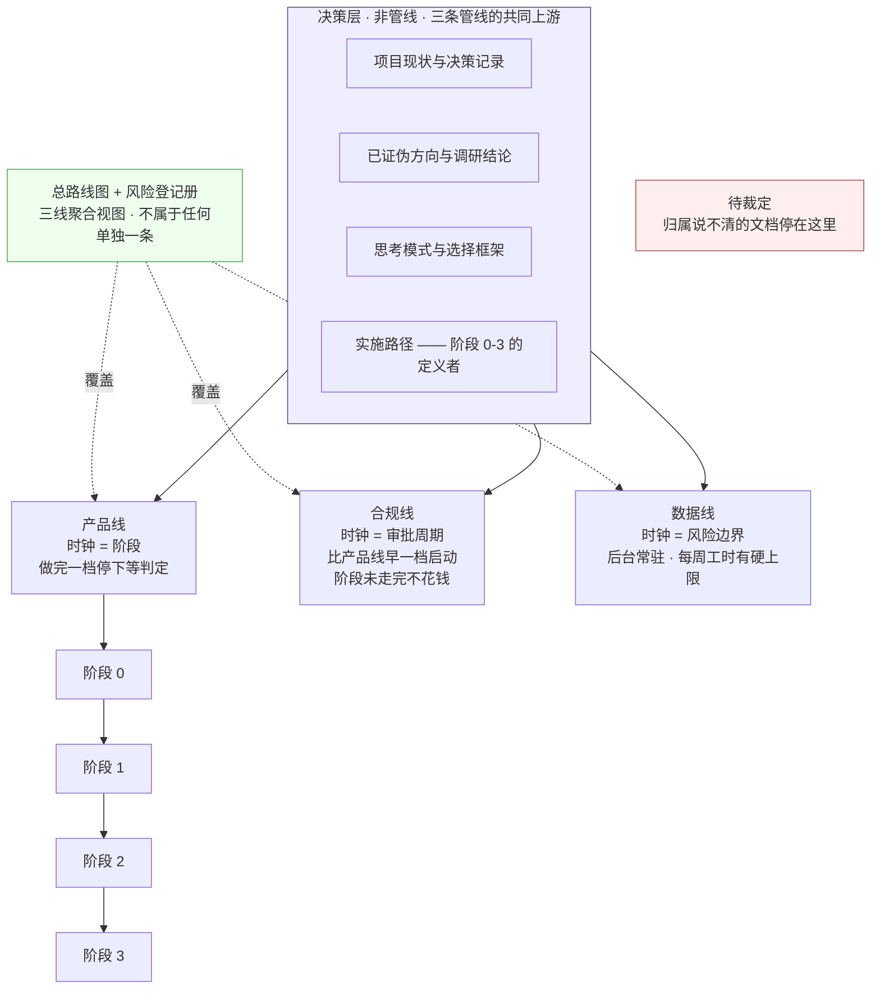

# 文档规范与目录

> 这份文档回答两个问题:**每一份文档属于哪条管线**,以及 **同一件事该由谁定义、怎么看出哪份是最新的**。
>
> **它不产生任何新结论。** 决策层四份的判据、`总路线图 · 脑图与父子待办` 的风险登记册、各契约文档的字段,本文一个字都不改。
> 发现的冲突与空洞一律登记在 §2.4「待裁定」,**不自行裁定、不硬塞进某条管线**。
>
> **基线:`origin/v1` @ `afab5a7`,fetch 于 2026-08-31T05:20Z**(方案 B 分目录那一轮)。双向核对干净。
> `产品模块脑图` 与 `模块 A · 骨架层`–`模块 E · 出口层` 登记那一轮基线为 `3253cb0`;导航层那一轮为 `14eedf4`;首版为 `04a0054`。
>
> **2026-08-31:`docs/` 已按方案 B 分目录**(裁定人 chenyj)。目录树在 [`INDEX.md`](INDEX.md) §零,
> 选目录的规则在 §3.2。
>
> **2026-08-31 同日第二批裁定(chenyj),四件事一次落地**:
> ① 方案 A 文件名规范化**已执行**(§2.6 `E7` 关闭);② 新开 `docs/misc/` 杂项目录,`Agent 框架与能力边界` 移入(§2.4-③ 关闭);
> ③ `产品路线图与用户共创` **作废**,不再维护(§2.4-④ 关闭);④ §2.4 的 C 组三项(`E1` / `KUBI-63` / `E4`)**裁定为不处理**。
> **§2.4 待裁定与 §2.6 待执行现在都是空的。** 那张每轮重贴的存量清单到此为止。
>
> 🔴 **2026-08-31 同日第三批裁定(chenyj):文件名去掉编号,改用 `doc-management` skill 的标准命名。**
> **编号不再是身份,文件名与标题才是**(§3.1 已改写)。每个子目录的**主文档叫 `INDEX.md`** —— 这是唯一能保证
> 「主文档排在细节文档前面」的机制:字母序里 `INDEX.md` 恒在中文名之前,而中文名之间的先后是码位顺序、没有含义。
> 原编号台账按 §4.3 **标记不删除**,移到 §2.3 作为历史对照表 —— 旧提交、旧议题评论里还写着号,查得到才不断线。
>
> **它对阶段 0 的贡献是零。** 阶段 0 要的是「自用两周、每天记两个数」,整理目录一个数都不产生。
> 这句留在最前面,是因为本文正好属于 `思考模式与选择框架` §盲区二 点名的那类工作:进展可量化、做起来舒服、不需要面对任何一个真实用户。
>
> **状态:活跃。** 每新增、移动、冻结一份文档,§二 的表与 [`INDEX.md`](INDEX.md) 必须同一次改动内更新;不更新即视为该文档不存在(§六)。

---

## 零、本文的唯一职责

现在的乱**不是格式乱**。逐份读下来,格式其实相当统一:每份都有 `>` 头注、都有 as-of 日期、都有「与既有文档的关系」一节。

乱在三个地方:

| 症状 | 具体表现 | 现在 |
|---|---|---|
| **同一件事有多处说法** | 文档清单曾同时存在于 `CLAUDE.md`「The fifteen documents」两张表里和读者的记忆里,而主干实际有 16 份、分支上还有 3 份 | ✅ 两张表已撤,`CLAUDE.md` 只留指针 |
| **看不出哪份是最新的** | `CLAUDE.md` 曾写「`R-01`…`R-87`」,`总路线图 · 脑图与父子待办` 实际已到 `R-105`;写「Fifteen documents」,实际 16 份 | ✅ 数量与风险号一律不在 `CLAUDE.md` 里复述 |
| **看不出一份文档属于哪儿** | `自动化交付工作流 · 基于 Multica` 自称「不构成一条新的线」,`Agent 框架与能力边界` 被描述为「长在三条线之外」,`产品路线图与用户共创` 的阶段归属自带 ⚪ 未决 —— 三份文档,三种无处安放 | ✅ 2026-08-31 三份各有结局:`自动化交付工作流 · 基于 Multica` 留 `ops/`;`Agent 框架与能力边界` 进 `misc/`(收纳)+ 产品线(归属,依据 `总路线图 · 脑图与父子待办` `R-90`);`产品路线图与用户共创` 作废。**§2.4 待裁定已清空** |

**2026-08-30 第二轮补的是第四个症状:主次、先后、深浅、产品/技术看不出来。** 那不是属性问题,是**读法**问题 ——
22 份文档在 `docs/` 下平级并列、编号即写作顺序、没有任何入口,审计里 22 份全是孤儿。解法是 [`INDEX.md`](INDEX.md),不是往本文里再加列。

**分工写死,两边不重叠:**

| 文件 | 管什么 | 什么时候改 |
|---|---|---|
| `文档规范与目录`(本文) | 文档的**属性与规则**:管线 / 层 / 状态 / 过期判定 / 唯一真源 / 🔴 红线 / 待裁定 / 待执行 | 新增、移动、冻结、裁定 |
| [`INDEX.md`](INDEX.md) | 文档的**读法**:先读哪份、读到多深、产品还是技术 | 同上 —— **同一次改动里两边都要改** |

本文只解决这些。**它是清单与规则,不是内容。** 任何想在这里写下新判断的冲动,都说明写错了地方。

---

## 一、管线:目录按什么分

### 1.1 三条管线,时钟各不相同

管线划分**不是新发明的**,它就是 `执行清单` §总原则 与 `数据线 · 骨架原料的获取与隔离` §一 已经定死的三条轨。目录照它分,不照角色分 —— 角色会变,时钟不会。



**四个格子,只有三个是管线。**

| 格子 | 是管线吗 | 时钟 | 判定标准 |
|---|---|---|---|
| 产品线 | 是 | 阶段 | 这份文档不写,某个阶段就走不完 |
| 合规线 | 是 | 审批周期 | 这份文档的动作有外部审批等待期 |
| 数据线 | 是 | 风险边界 | 这份文档管的是「抓什么 / 不抓什么 / 怎么隔离」 |
| 决策层 | **否** | 无 | 三条管线共同的上游。改它会同时改三条线 |
| 待裁定 | **否** | 无 | 上面四条都套不上。**停在这里,不硬塞** |

### 1.2 归属规则:一份文档只有一个归属

一份文档在 §二 的表里**只能出现一次,只能填一个管线**。理由:归属决定的是「谁的时钟推动它更新」,两个时钟等于没有时钟。

跨线的内容用 **关联管线** 一列标注,关联不改变归属:

- `执行清单` 归属产品线(块一受阶段管辖),块二上线准备关联合规线
- `识别链路选型 · ASR 与图像识别` 归属数据线(识别链路是数据侧选型),§五 合规结论关联合规线
- `商业化与额度设计` 归属产品线(阶段 2 后的产品能力),§六 支付合规关联合规线

**判断归属时问的是:这份文档过期了,是哪条线先撞墙。**

---

## 二、目录

### 2.1 主干文档(`origin/v1`,2026-08-30 八条 `KUBI-*` 分支全部并入后)

**一份文档只有一个名字:它自己的标题。** 正文引用一律写全名并给链接
(`` 见 [`后端系统设计与组件接入`](technical/后端系统设计与组件接入.md) §6.9 ``),**不另起简称、不写编号**。
编号 2026-08-31 已废,历史对照在 §2.3。文档在哪个子目录看 [`INDEX.md`](INDEX.md) §零 那棵树。

| 文档 | 管线 | 关联管线 | 层 | 状态 | 过期判定依据 |
|---|---|---|---|---|---|
| [`INDEX.md`](INDEX.md) 文档索引 | — 元文档 | — | 元 | 活跃 | 新增/移动任一文档;某文档的阶段归属变化 |
| [`文档规范与目录`](文档规范与目录.md) | — 元文档 | — | 元 | 活跃 | 新增/移动/冻结任一文档 |
| [`项目现状与决策记录`](decisions/INDEX.md) | 决策层 | 三线全覆盖 | 决策 | 活跃 | §7 决策日志某行的「何时改变」条件命中 |
| [`已证伪方向与调研结论`](decisions/已证伪方向与调研结论.md) | 决策层 | — | 决策 | 冻结 | 新调研推翻某个方向的死因 |
| [`思考模式与选择框架`](decisions/思考模式与选择框架.md) | 决策层 | — | 方法 | 冻结 | 新增一条盲区或判断规则 |
| [`实施路径`](decisions/实施路径.md) | 决策层 | 三线全覆盖 | 决策 | 冻结 | 阶段验收判据变更 —— **只能由人裁定** |
| [`执行清单`](execution/执行清单.md) | 产品线 | 合规线(块二) | 执行 | 活跃 | 2026-08 监管与平台规则调研过期;带 `⚠待确认` 项动手前复核 |
| 阶段 0 至阶段 2 详细排期 | 产品线 | — | 执行 | 活跃 | 排期偏移,或 §二 打标工时测算被实测推翻 |
| 数据线:骨架原料的获取与隔离 | 数据线 | — | 执行 | 活跃 | §七 待确认项闭合;§六 冲突声明的判据(第二个科目是否已人工校正命名)命中 |
| [`总路线图 · 脑图与父子待办`](execution/INDEX.md) | **三线聚合** | 三线全覆盖 | 执行 | 活跃 | 新增/关闭任一 `R-xx` |
| 识别链路选型 | 数据线 | 合规线(§五) | 契约 | as-of 2026-08 | 价格变动;`Exp` 实验模型下线;§六 本机实测(2026-08-25)环境变更 |
| [`技术架构与接口契约`](technical/INDEX.md) | 产品线 | — | 契约 | 活跃 · **有已被推翻章节** | §4.3/§4.4 已被 `多端选型与端矩阵` 推翻(原文保留 + 就地指针) |
| [`商业化与额度设计`](product/商业化与额度设计.md) | 产品线 | 合规线(§六) | 契约 | 冻结待触发 | 2026-08 支付合规调研过期(§6.5 自评「取证状态比 `识别链路选型 · ASR 与图像识别` 弱一档」) |
| 基础数据:抓取范围与渠道 | 数据线 | — | 契约 | as-of 2026-08-25 | robots 实测过期;黑名单/白名单渠道状态变更 |
| [`后端系统设计与组件接入`](technical/后端系统设计与组件接入.md) | 产品线 | — | 契约 | 活跃 | §三 版本矩阵 as-of 2026-08-26,构件更新即过期;§八 字段自述「一律是草案」 |
| 自动化交付工作流 | 产品线 · 支撑设施 | — | 执行 | 活跃 | Multica 版本更新;§一 数据 as-of 2026-08-27 |
| [`Agent 框架与能力边界`](misc/Agent框架与能力边界.md) | 产品线(依据 `总路线图 · 脑图与父子待办` `R-90` 末句,2026-08-29 已定) | — | 契约 | 活跃 · **收纳在 `misc/`** | §四 第三道防线补齐或仍缺 |
| [`产品路线图与用户共创`](misc/产品路线图与用户共创-已作废.md) | — | — | — | ⛔ **已作废(2026-08-31,chenyj)** | 不再判定过期 —— 见 §2.3 与 §2.4-④ |
| [`Multica 操作备忘`](ops/Multica操作备忘.md) | — 支撑设施(仅查阅) | — | 执行 | 活跃 | `multica` 版本更新;实测于 2026-08-30 / `v0.4.34`,ID 表或坑的复现方式变化 |
| 壳技术方案:Tauri 2 包现有 Web 工程 | 产品线 | — | 契约 | 活跃 | 反代九条任一被实现绕过;`R-108`…`R-112` 任一关闭 |
| [`多端选型与端矩阵`](technical/多端选型与端矩阵.md) | 产品线 | — | 契约 | **已冻结** | 某一端的触发条件命中(每条选型自带);§4.6 路由契约变更 |
| [`产品模块地图与产品逻辑`](product/INDEX.md) | — 元文档(仅指针) | 三线全覆盖 | 元 | 活跃 | 模块增删;某模块的阶段归属变化 |
| 原图存储:判据层与存储层 | 产品线 | — | 契约 | 活跃 | `R-105`/`R-106`/`R-107` 任一关闭;缓存层实现改形 |
| [产品模块脑图](product/产品模块脑图.md) | — 元文档(仅指针) | 三线全覆盖 | 元 | 活跃 | 模块增删;某模块的阶段归属变化 —— 与 `产品模块地图与产品逻辑` §三 同一次改动内更新 |
| [模块 A · 骨架层](product/modules/模块A-骨架层.md) | 产品线 | 数据线 | 契约 | 活跃 | 冷启动四步任一步形态变化;`R-12`/`R-13` 任一命中 |
| [模块 B · 采集层](product/modules/模块B-采集层.md) | 产品线 | 合规线(原图) | 契约 | 活跃 | 入口增删;「记录动作永不失败」的任一失败落点变化 |
| [模块 C · 打标层](product/modules/模块C-打标层.md) | 产品线 | 数据线 | 契约 | 活跃 | 管线段数增删;两种失败形态被合并或拆分 |
| [模块 D · 差集层](product/modules/模块D-差集层.md) | 产品线 | — | 契约 | 活跃 | 三条计算规则任一变化;反向断言被定义 |
| [模块 E · 出口层](product/modules/模块E-出口层.md) | 产品线 | 合规线(导出) | 契约 | 活跃 | 出口增删;`E-1` 契约缺口被补上 |
| [模块 F · 账号与端](product/modules/模块F-账号与端.md) | 产品线 | 合规线(注销/删除时点) | 契约 | 活跃 | 登录通道增删;合并策略变化;任一端的阶段归属被裁定 |
| [模块 G · 商业化](product/modules/模块G-商业化.md) | 产品线 | 合规线(支付) | 契约 | **冻结待触发** | 与 `商业化与额度设计` 同档:`商业化与额度设计` 的口径变化,或 `R-37`/`R-48` 任一关闭 |
| [用户侧功能规格 · 总纲](product/specs/INDEX.md) | 产品线 | — | 契约 | 活跃 | 屏幕增删;全局交互约定变化 |
| [登录与账号](product/specs/登录与账号.md) | 产品线 | 合规线(注销) | 契约 | 活跃 | 登录通道增删;频控数值变化;合并策略变化 |
| [记一次学习](product/specs/记一次学习.md) | 产品线 | 合规线(原图) | 契约 | 活跃 | 采集入口增删;离线队列行为变化;两个每日数字口径变化 |
| [看盲区](product/specs/看盲区.md) | 产品线 | — | 契约 | 活跃 | 盲区排序口径、断言形态、空态策略变化 |
| [打标与未分类](product/specs/打标与未分类.md) | 产品线 | — | 契约 | 活跃 | 候选呈现方式、失败形态增删 |
| [导出与问AI](product/specs/导出与问AI.md) | 产品线 | 合规线(导出) | 契约 | 活跃 | 出口增删;代发的额度与回答处置变化 |
| [额度与购买](product/specs/额度与购买.md) | 产品线 | 合规线(支付) | 契约 | **冻结待触发** | 与 `商业化与额度设计` 同档 |
| [设置与原图](product/specs/设置与原图.md) | 产品线 | 合规线(原图/注销) | 契约 | 活跃 | 原图状态与留存区文案变化;边界页与 `项目现状与决策记录` §2 不一致时 |
| [骨架数据采集流水线](data/骨架数据采集流水线.md) | 数据线 | 合规线(抓取) | 契约 | 活跃 | 段数增删;人工闸位置变化;统计字段口径变化 |

> **`product/` 之下有三层:** `产品模块地图与产品逻辑` 是唯一的模块 × 阶段对照表;`产品模块脑图` 是脑图(markmap,可折叠);
> `modules/` 七份写「模块自己怎么运转」;`specs/` 八份写「屏幕长什么样、点下去发生什么」,**写到可以直接做 UI 与前后端开发**。
> **X 没有单独文件,而且不该有**:它不是模块是负空间,逐条落在每份模块文档的 §五,再写一份就是第二处说法(§3.1)。
> ⚠️ **H 这一组没有展开文档** —— 原来顶这一格的 `产品路线图与用户共创` 已作废,**而这一格没有被别的文档接手**(重建时点:产品模块与流程完善之后)。
>
> **`modules/` 与 `specs/` 的分工写死:** 模块文档说「为什么这么设计」,规格文档说「它长什么样」。
> 模块文档不定字段、不定接口、不定阈值;规格文档可以写界面文案与交互规则,**但涉及数字、字段、端点一律给指针**。

**层的取值**:决策(定方向与判据)/ 方法(定怎么想)/ 执行(定做什么、什么时候做)/ 契约(定长什么样)/ 元(定文档本身的规则)。

### 2.2 分支未并主干的文档

**已清空(2026-08-30):八条 `KUBI-*` 分支全部并入 `v1`,分支引已删。** 本节保留是因为它随时会再有内容 ——
新文档仍然按 §3.2 先落在 `KUBI-<n>-<简述>` 分支上。

| 位置 | 文档 | 管线 | 状态 | 阻塞 |
|---|---|---|---|---|
| — | — | — | 当前无 | — |

> 那一轮并入解掉的撞号记在这里,因为它们正是「分支各写各的」必然产生的东西,而且**三次都是同一个成因:
> 分支基线早于主干,写它的时候那个号还空着**。
>
> | 撞的东西 | 怎么解 |
> |---|---|
> | `Agent 框架与能力边界` 壳技术方案 vs 主干 Agent 框架 | 壳改 `壳技术方案：Tauri 2 包现有 Web 工程`(此前已由人执行) |
> | `Multica 操作备忘` 原图存储 vs 主干 Multica 操作备忘 | 原图存储改 `原图存储：判据层与存储层` |
> | `R-72`…`R-76` 五条壳风险 vs 主干上早已另有所属的同号 | 壳的五条改 `R-108`…`R-112` |
>
> ⚠️ **其中 `R-74` 那一行在三方合并里没有产生冲突标记,是静默重号。** 只看 git 报的冲突会漏掉它 ——
> **这是 §3.1「`R-xx` 唯一收口在 `总路线图 · 脑图与父子待办` §四」那条规则的代价**:收口在一份文件里,分支就必然在同一段行尾
> 各自追加,而追加与追加之间 git 看不出矛盾。**下次并分支,先对一遍号,别等 git 报。**

### 2.3 旧编号 → 现在的文件(历史对照)

⛔ **编号 2026-08-31 由 chenyj 裁定作废**,理由是它做不到自己声称的事:编号是写作顺序,却被当成阅读顺序读,
而且**细节文档的号排在主文档前面**(`商业化与额度设计` 号 11 排在 `产品模块地图与产品逻辑` 号 20 之前,`执行清单` 号 05 排在
`总路线图 · 脑图与父子待办` 号 08 之前)。按 §4.3 标记不删除 —— 下表保留全部旧号,**因为旧提交信息、旧议题评论、
旧分支名里还写着它们,对不上就是断线**。

| 旧号 | 现在的文件 |
|---|---|
| `00` | `docs/文档规范与目录.md` |
| `01` | `docs/decisions/INDEX.md` |
| `02` | `docs/decisions/已证伪方向与调研结论.md` |
| `03` | `docs/decisions/思考模式与选择框架.md` |
| `04` | `docs/decisions/实施路径.md` |
| `05` | `docs/execution/执行清单.md` |
| `06` | `docs/execution/阶段0至阶段2详细排期.md` |
| `07` | `docs/data/INDEX.md` |
| `08` | `docs/execution/INDEX.md` |
| `09` | `docs/data/识别链路选型.md` |
| `10` | `docs/technical/INDEX.md` |
| `11` | `docs/product/商业化与额度设计.md` |
| `12` | `docs/data/基础数据-抓取范围与渠道.md` |
| `13` | `docs/technical/后端系统设计与组件接入.md` |
| `14` | `docs/ops/INDEX.md` |
| `15` | `docs/misc/Agent框架与能力边界.md` |
| ~~`16`~~ | `docs/misc/产品路线图与用户共创-已作废.md` ⛔ 已作废(2026-08-31) |
| `17` | `docs/ops/Multica操作备忘.md` |
| `18` | `docs/technical/壳技术方案-Tauri2包现有Web工程.md` |
| `19` | `docs/technical/多端选型与端矩阵.md` |
| `20` | `docs/product/INDEX.md` |
| `21` | `docs/technical/原图存储-判据层与存储层.md` |
| `22` | `docs/product/产品模块脑图.md` |
| `23`–`29` | `docs/product/modules/模块<字母>-<层名>.md` |

**编号时代解掉的三次撞号记在这里,因为换成文件名之后,同一种事故换了个形状但没有消失:**

| 撞的东西 | 当时怎么解 |
|---|---|
| `15` 壳技术方案 vs 主干 Agent 框架 | 壳改号 `18`(此前已由人执行),即今天的 `壳技术方案：Tauri 2 包现有 Web 工程` |
| `17` 原图存储 vs 主干 Multica 操作备忘 | 原图存储改号 `21`,即今天的 `原图存储：判据层与存储层` |
| `R-72`…`R-76` 五条壳风险 vs 主干同号 | 壳的五条改 `R-108`…`R-112` |

⚠️ **三次都是同一个成因:分支基线早于主干,写它的时候那个号还空着。**
**换成文件名之后这个成因一个字都没变** —— 两条分支同时给新文档起同一个文件名,合并时一样撞。
`R-xx` 仍然按号分配(唯一收口在 `总路线图 · 脑图与父子待办` §四),所以那一类撞号原样保留。
**下次并分支,先对一遍文件名与 `R-xx`,别等 git 报** —— §2.2 记过 `R-74` 那次静默重号,git 不会报。

> **上一版在这里预言过一次,结果反了,值得留着:** 原文写「F/G/H/X 将来若要补文档,拿不到连号」。
> 实际上 `模块 F · 账号与端`/`模块 G · 商业化` 的号(28/29)正好接上,因为**中间没有别人领号**。预言错的方向不重要,
> 它命中的那一半是:**编号是分配顺序,不是分类顺序。** 这正是 2026-08-31 废掉编号的直接理由 ——
> 一个不表达分类的东西,却长年被当成排序依据摆在文件名最前面。
> 想按模块字母查文档,查 `产品模块地图与产品逻辑` §九 或直接看 `product/modules/`,那里的字母序是真的。

### 2.4 待裁定

**以下各项我不裁定。** 每一项都需要人拍板或需要另一条议题的所有者执行,写在这里是为了它们不再靠记忆传递。

> ✅ **2026-08-31:本节已清空。** ① ② ⑤ 于 2026-08-30 闭合;③ ④ ⑥(含方案 A)于 2026-08-31 由 chenyj 一次裁完。
> 原文一律保留在下面并标注结果 —— 按 §4.3「标记,不删除」。**当前没有任何一项停在待裁定。**
>
> **这一节空着,不等于没有未决的东西。** 它的口径很窄:**只收「我判不了、需要人拍板」的岔口**。
> 各文档自己的 ⚪ 未决项(`R-94` 的重定时点、`总路线图 · 脑图与父子待办` 的三条线归属、各模块文档 §六 的缺口)仍在各自的位置上,
> 它们不进这里,因为它们不是「谁来拍板」的问题,是「还没到该定的时候」。

**① 主干是 `main` 还是 `v1`** ✅ **已裁定(2026-08-30,chenyj):主干一律用 `v1`。**

| 事实 | 值 |
|---|---|
| `origin/HEAD` 指向 | `main` |
| `origin/main` | `2231ca7`,单次提交,只有 `docs/决策记录`–`实施路径` |
| `origin/v1` | `04a0054`,全部代码 + 16 份文档 |
| `main` 落后 `v1` | 14 份文档、6,567 行,以及 `server/` `web/` `scripts/` 全部 |
| 所有 `KUBI-*` 分支的分叉点 | `v1`,无一例外 |

本文原按**事实上的主干 `v1`** 建立基线,并把「是把 `main` 快进到 `v1`,还是把 `origin/HEAD` 改指 `v1`」留给人裁定。

**裁定结果(2026-08-30,chenyj):主干一律用 `v1`。** 落到三处,不再有歧义:

| 场景 | 现在的唯一写法 |
|---|---|
| 开新分支 | 从 `origin/v1` 开 `KUBI-<议题号>-<简述>`,**不直接在 `v1` 上提交** |
| PR 目标分支 | `v1` |
| 基线声明 | `基线:origin/v1 @ <SHA7>,fetch 于 <时间>` |

**裁定选的是「`origin/HEAD` 改指 `v1`」这一支,不是「把 `main` 快进到 `v1`」** —— 裁定的原话是「主干都用 v1 分支」,
它指定的是**哪条分支是主干**,没有说要动 `main`。**`main` 保持原样,不快进、不删除**(§4.3 标记不删除同一条)。

**剩下一个执行动作,不是裁定:`origin/HEAD` 仍指向 `main`。** 在它改指 `v1` 之前,任何人 clone 下来默认仍落在
只有 `docs/决策记录`–`实施路径` 的那条分支上。这个动作需要仓库管理员在 GitHub 仓库设置里改默认分支(或用 `gh repo edit
--default-branch v1`),**不是文档能改的,也不是本议题能代劳的**。已在 §2.6 登记为待执行。

**② `docs/Agent框架` 编号冲突** —— ✅ **已解(2026-08-30)**:壳技术方案改号 `壳技术方案：Tauri 2 包现有 Web 工程` 并入 `v1`,主干 `Agent 框架与能力边界` 保号,`总路线图 · 脑图与父子待办` / `技术架构与接口契约` / `shell/` 里指向壳方案的引用全部跟改。⚠️ 同批发现并解掉的还有第二处撞号:`Multica 操作备忘`(原图存储 → `原图存储：判据层与存储层`),以及风险号 `R-72`…`R-76`(壳的五条 → `R-108`…`R-112`)。成因与本条完全相同,见 §2.2 那张表。

**③ `Agent 框架与能力边界` 的管线归属** —— ✅ **已裁定(2026-08-31,chenyj):放进单独的杂项目录 `docs/misc/`。** 原文保留:

> `CLAUDE.md` 自述它「长在三条线之外」;`总路线图 · 脑图与父子待办` `R-85` 已把 agent 登记为「文档化失败模式的最新实例」。**它是产品线的一部分,还是一条本不该开的第四条线,需要人裁定。** 在裁定前它停在待裁定,不塞进产品线。

**裁定落成两件事,而它们是两个维度,别混:**

| 维度 | 结果 | 依据 |
|---|---|---|
| **收纳位置**(目录,判据「谁来读」) | `docs/misc/` —— 新开的第七个目录 | **本次裁定** |
| **管线归属**(判据「哪条线先撞墙」) | **产品线** | **`总路线图 · 脑图与父子待办` `R-90` 末句,2026-08-29 已定,不是本次新裁的** |

⚠️ **本条真正暴露的东西,比裁定本身重要:** `总路线图 · 脑图与父子待办` `R-90` 那一句「2026-08-29 定:归入产品轨(线 1)」
**从 2026-08-29 起就存在**,而本节从 2026-08-30 建起一直把同一件事记为「待裁定」。
**同一件事两处说法,而其中一处正是本文** —— 症状表第一行说的病,本文自己犯了一次。
成因是可复现的:本节收的是「归属说不清」,`总路线图 · 脑图与父子待办` 收的是「风险条目的处置」,**同一个结论落在两处不同用途的表里,谁都不觉得自己在复述。**
防它的规则已经在 §3.1(一件事只在一处定义),本条是它第一个实例。**已改:`文档规范与目录` §2.1 归属列改填「产品线」并注明依据是 `R-90`。**

**④ `产品路线图与用户共创` 的阶段归属** —— ✅ **已裁定(2026-08-31,chenyj):这份文档不要了。** 原文保留:

> 文档自己带着 ⚪ `R-94`「阶段归属:未决」。归属产品线是清楚的,**属于哪个阶段未决**,原样保留。

**裁定的原话是「这个文档不要了;产品模块和流程完善后这个待定」,落成三件事:**

| # | 动作 | 状态 |
|---|---|---|
| 1 | `产品路线图与用户共创` 标为**作废**,退出 §2.1 主表,进 §2.3 台账;编号不回收 | ✅ 已做 |
| 2 | **文件不删**(§4.3 标记不删除),留在 `docs/misc/`,头注顶部写清作废声明与「不得据此动手」 | ✅ 已做 |
| 3 | 所有指向它的引用就地加注:`产品模块地图与产品逻辑` §三/§五/§六/§九、`产品模块脑图` H 组、`INDEX` 四处、`项目现状与决策记录` §2.7、`总路线图 · 脑图与父子待办` `R-94` | ✅ 已做 |

⚠️ **两件必须说清的后果,它们不随作废一起消失:**

1. **H 这一组现在没有任何真源。** `产品模块地图与产品逻辑` §五 里「H 路线图」「H 反馈流」两行的产品结论**当前是空的**,不是「维持原样」。
   **不立刻补写一份顶上** —— 补出来的就是给一个还没定的东西写第二版。
2. **`R-94` 不因此关闭。** 「这一块归哪个阶段」这个问题仍然没有答案,只是现在连一份写它的文档都没有了。
   **重定的时点是「产品模块与流程完善之后」**,由人重新裁定,届时另领新号(§2.3),不改 `产品路线图与用户共创`。

**为什么保留文件而不是删掉:** `已证伪方向与调研结论` 整份文档靠「被推翻的记录本身是资产」成立,§4.3 与 §3.3 是同一条。
**要的是真从仓库里删掉的话,说一声 —— 那是另一个裁定,不是本条的默认动作。**

**⑤ `docs/壳技术方案` 空洞** —— ✅ **已解(2026-08-30)**:两者都不是。`壳技术方案：Tauri 2 包现有 Web 工程` 是留给壳技术方案的号(`KUBI-71` §P0 先行分配),改号落位后空洞不再存在。

**⑥ 文档重组:方案 A 改名 / 方案 B 分目录** —— 2026-08-30 由项目经理提出,他**推荐 A、不推荐 B**,理由是
「跨文档引用 357 处按编号、18 处按路径,分目录不增加信息却让编号台账与目录路径两处维护同一件事」。

**✅ 方案 B 已裁定(2026-08-31,chenyj):分目录,已执行。** 目录树见 [`INDEX.md`](INDEX.md) §零,
选目录规则见 §3.2。**原反对意见按 §4.3 原样留在上面,并记下它命中的那一半:**

| 他担心的 | 实际发生的 |
|---|---|
| 「编号台账与目录路径两处维护同一件事」 | **确实存在,已用规则挡掉**:§2.1 不写路径、目录不写管线、正文引用一律写编号(§3.1 新增那条)。代价是这条规则得有人守 |
| 「收益只在 `ls` 的时候」 | 属实。目录本身不产生新信息,**它省的是 `ls` 与 IDE 文件树里的一眼** |
| —— | **他没预见的一条**:分目录**掐断了 `.githooks/pre-commit` 里按 `^docs/0[1-4]-` 写死的决策层闸门**,已同批改掉并写进 §3.2 末尾 |

**✅ 方案 A 已裁定并执行(2026-08-31,chenyj):5 份文件名里的空格与全角冒号已去掉。** 原「未批未执行」的记录保留在上一版里,结果如下:

| 原文件名 | 现文件名 |
|---|---|
| `07-数据线:骨架原料的获取与隔离.md` | `07-数据线-骨架原料的获取与隔离.md` |
| `12-基础数据:抓取范围与渠道.md` | `12-基础数据-抓取范围与渠道.md` |
| `17-Multica 操作备忘.md` | `17-Multica操作备忘.md` |
| `18-壳技术方案:Tauri 2 包现有 Web 工程.md` | `18-壳技术方案-Tauri2包现有Web工程.md` |
| `21-原图存储:判据层与存储层.md` | `21-原图存储-判据层与存储层.md` |

**命名规则同时写死进 §3.2**,不然下一份新文档又会带进空格。
**文档 H1 标题里的全角冒号不动** —— 改的是文件名,不是标题。
`E7` 关闭。改名与移动一起掐断的路径引用已逐条改掉(§六 第 9 条那道 `grep`),清单见本轮提交。

### 2.6 待执行(已裁定,只差动手)

> ✅ **2026-08-31:本表也已清空。** `E1` `E4` 连同「`KUBI-63` 那 1 个提交推不推」被 chenyj 一并裁定为**不处理**;
> `E7` 已执行;`E2` 是常驻纪律不是动作,已并进 §3.2。**只剩 `E6` 一条,它不等裁定,等的是有人接。**

| # | 动作 | 谁做 | 状态 |
|---|---|---|---|
| E1 | 把 `origin/HEAD` / GitHub 默认分支从 `main` 改为 `v1` | 仓库管理员 | ⛔ **裁定为不处理(2026-08-31,chenyj)。** 已知代价照旧成立:**新 clone 一份仓库、默认落在 `main` 上的人,看到的是分目录之前的旧树**,「`v1` 有所有文件」这句话对他不成立。**接受这个代价是本次裁定的内容,不是遗漏。** 要改随时是 GitHub 设置里点一下 |
| E2 | 已开在别的分支上的活,确认它接的是 `v1` 再动手,**不擅自改基** | 各分支所有者 | 🔁 **不是一次性动作,是常驻纪律** —— 已并进 §3.2,本表不再收 |
| E3 | ✅ **已做(2026-08-30)**:八条 `KUBI-*` 分支全部并入 `v1`,分支引已删 | — | 关闭 |
| E4 | 壳补 `[lib]` 目标 + 把 `local_server` 按 hyper 供移动端复用,才能编出 iOS / Android | 壳的所有者 | ⛔ **裁定为不处理(2026-08-31,chenyj)。** 代价:`shell/` **仍然只有桌面**,iOS / Android 编不出来。⚠️ 而按 `模块 F · 账号与端` §六 `F-3`,这三个端本来就不服务任何阶段 —— **不补它,北极星一格不动;补了也一格不动** |
| E5 | ✅ **已做(2026-08-30)**:`main` 快进到 `v1`,两条分支现在指同一个提交 | — | 关闭 |
| E6 | **文档侧红线扫描**:代码侧已有 `NoStemFieldTest`,文档侧没有对应的机器断言,§五 现在靠 §六 第 6 条人工执行 | 待派工程项 | ⏳ **仍开着,且没被本轮裁定碰过。** 它不等人拍板,等的是有人接。**本表现在唯一开着的一条** |
| E7 | **方案 A · 文件名规范化** | — | ✅ **已执行(2026-08-31)**,见 §2.4-⑥。原文:`数据线 · 骨架原料的获取与隔离` `基础数据 · 抓取范围与渠道` `Multica 操作备忘` `壳技术方案：Tauri 2 包现有 Web 工程` `原图存储：判据层与存储层` 五份文件名里有空格或全角冒号,`audit_docs.py` 因此报 7 条死链/孤儿(**是脚本对 `%20`/空格的判定,不是链接真的坏**) |

**另一件被一并裁定为不处理的,它不在本表里,因为它从来不是我的动作:**
`KUBI-63-image-storage-fs` @ `b8a8a8a` 那 1 个提交(`R-105` 壳形态原图改存文件系统,2,949 行 web 代码)
**仍然没有进 `v1`**,而它动的是 🔴 原图留存那条红线所在的那一层。⛔ **2026-08-31 裁定:不管。**
**代价:那条红线在壳形态下有没有守住,今天没有任何一处给出过判定** —— 不是判定为「守住了」,是没判过。
它是 `KUBI-63` 的交付物,要推由那条议题的所有者推。

**关于 `main`(2026-08-30)**

`main` 曾经是 `v1` 的**严格祖先** —— `origin/v1..origin/main` 为空,合并基就是 `main` 自己。
所以「把 `main` 合并进 `v1`」在 git 上是一次 `Already up to date`,**一个字节都不会进来**;
`main` 上唯一 `v1` 没有的文件是 `.DS_Store`,那正是不该进来的东西。方向只能反过来:把 `main` 快进到 `v1`。

已快进(E5)。**但这只是一次性的:再往 `v1` 推一次,`main` 又落后了。**
真正一劳永逸的是 E1 —— 改 GitHub 默认分支。在那之前:

- ⚠️ **不要往 `main` 提交任何东西。** 它现在是 `v1` 的镜像,不是第二条主干。
  `v1` 是唯一主干(§2.4-①),分支照旧从 `origin/v1` 开。
- **`main` 落后了不算事故**,不需要有人定期去同步它;它存在的唯一理由是
  `origin/HEAD` 还指着它,E1 做完之后它就没有存在理由了。

## 三、唯一真源

### 3.1 一件事只在一份文档里定义

| 规则 | 具体 |
|---|---|
| **定义只有一处** | 一个结论、一个判据、一张表、一个字段,只在它归属的那份文档里定义 |
| **其他文档只能引用** | 写 `` 见 `技术架构与接口契约` §5.2 ``,**不复述内容**。复述就是第二处说法,而且一定会先过期 |
| **表格与数字不得跨文档复制** | 需要同一张表的两个地方,一个定义、一个指针。⚠️ **2026-08-31 补的实例**:`模块 A · 骨架层`–`模块 E · 出口层` 五份的头注都写着「不定字段、不定接口、不定阈值」,正文却复述了 `总路线图 · 脑图与父子待办`/`技术架构与接口契约`/`商业化与额度设计`/`后端系统设计与组件接入` 已定义的阈值、题量、查询参数与字段名。**头注声明了纪律不等于正文守住了纪律** —— 已按 `模块 F · 账号与端`/`模块 G · 商业化` 的口径改成指针:**说「有一个上限」,不说上限是多少;说「幂等键」,不说键叫什么** |
| **`R-xx` 唯一收口在 `总路线图 · 脑图与父子待办` §四** | 新风险一律进 `总路线图 · 脑图与父子待办`,不建临时清单。`商业化与额度设计` §九、`基础数据 · 抓取范围与渠道` §八、`后端系统设计与组件接入` §九、`产品路线图与用户共创` §七 的「新增风险登记」都是**待并入 `总路线图 · 脑图与父子待办` 的暂存区**,并入后应改为指针 |
| **写现状,不写修订过程** | 🔴 **正文里不出现「上一版这里写的是…」「本轮改了…」「第 N 次更新」这类叙述。** 文档回答「现在是什么」,不回答「它怎么变成这样的」。变更过程在 git log 与议题评论里,那才是它该待的地方。**唯一例外**:某个错误结论**至今仍在别处被引用**时,就地留一句「已作废,见 X」——留的是指针,不是过程 |
| **文档清单唯一收口在本文 §二** | `CLAUDE.md` 与任何其他地方不得再列第二份清单,只能指向这里 |
| **跨文档引用写标题 + 链接** | 正文里写 `` 见 [`后端系统设计与组件接入`](technical/后端系统设计与组件接入.md) §6.9 ``。**一份文档只有一个名字,就是它的标题**;路径由链接给出,不另起简称。⚠️ **换身份的代价已经付过两遍**:2026-08-31 编号 → 简称(全仓 1,301 处反引号编号、670 处 `docs/NN`、188 条链接),2026-09-01 简称 → 标题(1,322 处反引号简称、653 处 `docs/<简称>`,**其中大部分在 `server/` `web/` `shell/` 的代码注释里**)。**换身份是全仓动作,不是 `docs/` 内部动作** —— 这正是不再另起第三套名字的理由 |

### 3.2 位置规则:一份文档在哪儿,是有规矩的

| 状态 | 位置 | 目录里怎么标 |
|---|---|---|
| 已冻结 / 已被引用 | `origin/v1` 的 `docs/<子目录>/`(主干 = `v1`,§2.4-① 已裁定) | §2.1 |
| 在研,归属某个议题 | `KUBI-<n>-<简述>` 分支的 `docs/<子目录>/` | §2.2,必须写明分支名 + SHA7 |
| 已推翻但仍被引用 | **留在原处**,就地加指针,不删 | §2.1 状态列标「有已被推翻章节」 |
| 作废 | 在 §2.3 标「作废」,文件名后缀加 `-已作废`,文件不删 | §2.3 |

**选哪个子目录(2026-08-31 方案 B):判据是「谁来读」,不是「属于哪条管线」。**

| 子目录 | 收什么 | 判据 |
|---|---|---|
| `docs/`(根) | 只有两份:`INDEX.md` 与本文 | 它描述这棵树,不属于树上任何一枝 |
| `decisions/` | 定方向与判据、以及被证伪的方向 | 改它会同时改三条管线 |
| `execution/` | 做什么、什么时候做、风险登记册 | 读者在排期或看阶段 |
| `product/` | 产品模块、脑图、模块展开、商业化、对外 | 读者在讨论「做什么、给谁」 |
| `technical/` | 架构契约、后端详设、端与壳、Agent 边界 | 读者在写代码或定契约 |
| `data/` | 抓什么 / 不抓什么 / 怎么隔离 / 识别链路 | 读者在碰数据线 |
| `ops/` | 交付流水线与操作备忘 | 读者在跑流程,不在做产品 |
| `misc/` | **杂项** —— 上面六条读者判据都套不上的,加上已作废但按 §4.3 不删的 | **2026-08-31 新开(裁定人 chenyj)**,见下 |
| `research/` | **外部调研原件** —— 记录外部世界在某一天是什么样,**不记录本项目的任何结论** | 它不是本项目的文档,见下 |

**目录第一级只能承载一个维度,这里放的是「读者」。**「管线归属」在 §2.1 的表里,两处不重叠 ——
§2.1 不写路径,目录不写管线。

⚠️ **上一版这里写的是「不要新开第七个目录」。2026-08-31 由人裁定新开了 `misc/`,这句话作废。**
按 §4.3 记下它命中的那一半:**规则本身没错,错在它没给「确实套不上」的那种文档留出路** ——
`Agent 框架与能力边界` 在 `technical/` 底下停了一天,而它自述「长在三条线之外」,谁读它都不是因为要写代码。

**`misc/` 唯一的危险是变成垃圾桶,所以它带两道闸,少一道都不成立:**

| 闸 | 内容 |
|---|---|
| **进得来** | 进 `misc/` 的文档**必须在 §2.4 或 §2.3 有一条对应登记** —— 要么写清它为什么套不上六条判据,要么写清它作废于哪一天。**没登记的不许进** |
| **出得去** | `misc/` 里的活跃文档**不是永久居民**。哪一天它的读者判据清楚了,搬回对应子目录,同一次改动里改 `INDEX` §零 与本文 §2.1 |

**填不出目录时仍然先放进最接近的那一个并在 §2.4 登记 —— `misc/` 是最后一档,不是第一档。**

**`research/` 不在上面那套规则里,因为它装的不是文档:**

| | |
|---|---|
| **不进本文 §2.1** | 它没有归属管线。它是**别人的结论在某一天的快照**,本项目的结论在引用它的那份文档里 |
| **不进份数与行数口径** | 计数命令一直带着 `-not -path '*/research/*'` |
| **但必须在 `INDEX.md` 里有链接** | `audit_docs.py` 要求 `docs/` 下每份 `.md` 都能从某个索引到达。⚠️ **2026-08-31 把两份 HTML 转成 `.md` 时才发现这一条**:HTML 不受这条规则管,`.md` 受 —— **换格式会改变一份文件受哪些规则管**,而转换本身不会提醒你 |
| **文件名 `YYYY-MM-DD-<简述>.md`** | `doc-management` skill 原则 6。原件的 as-of 日期是它最重要的属性,摆在文件名最前面则过期与否不用打开就知道,且字母序＝时间序 |
| **原件冻结不改** | 要更新就另做一份新日期的,不覆盖旧的 —— 两份并排才看得出外部世界变了什么 |

### 3.2.1 文件名规范(2026-08-31 第三批裁定:去编号,用 skill 标准命名)

**规则四条,一条都不能省:**

| 规则 | 说明 |
|---|---|
| 🔴 **不带编号** | 文件名是 `<简述>.md`,不是 `<编号>-<简述>.md`。**编号 2026-08-31 作废**(§2.3 保留对照表) |
| 🔴 **每个子目录的主文档叫 `INDEX.md`** | `doc-management` skill 原则 5(目录索引一律 `INDEX.md`,禁用 `README.md`)。它同时是**唯一**能保证主文档排在细节文档前面的机制 —— 见下 |
| **不含空格、不含全角标点** | 连英文词之间也不留(`Multica操作备忘.md`);主副标题之间用半角 `-` 连(`原图存储-判据层与存储层.md`) |
| **标题不受这条管** | 文档 H1 里的全角冒号照旧,**改的是文件名,不是标题** |

**为什么必须是 `INDEX.md`,而不是「给主文档起个排在前面的名字」:**

中文文件名之间的先后是 **UTF-8 码位顺序**,与含义无关 —— `技术架构与接口契约`(技 U+6280)排在 `原图存储：判据层与存储层`(原 U+539F)
**后面**,`基础数据 · 抓取范围与渠道` 排在 `数据线 · 骨架原料的获取与隔离` 前面。**在中文文件名里,没有任何起名方式能让主文档稳定排第一。**
`INDEX.md` 是 ASCII 大写,在任何 `ls` / IDE 文件树里都排在全部中文名之前 —— 这不是约定,是排序本身的性质。

原来的编号做的正是这件事,而它做失败了:**编号是写作顺序,不是主次顺序**,于是
`商业化与额度设计`(11)排在 `产品模块地图与产品逻辑`(20)前面、`执行清单`(05)排在 `总路线图 · 脑图与父子待办`(08)前面 ——
**细节文档排在了它的主文档前面**,这正是 2026-08-31 废掉编号的直接理由。

| 子目录 | 它的 `INDEX.md` 是 | 细节文档 |
|---|---|---|
| `decisions/` | 项目现状与决策记录 | 已证伪方向 / 思考模式 / 实施路径 |
| `execution/` | 总路线图(待办树 + 风险登记册) | 执行清单 / 详细排期 |
| `product/` | 产品模块地图与产品逻辑 | 产品模块脑图 / 商业化与额度设计 / `modules/` 七份 |
| `technical/` | 技术架构与接口契约 | 后端详设 / 壳技术方案 / 多端选型 / 原图存储 |
| `data/` | 数据线:骨架原料的获取与隔离 | 识别链路选型 / 基础数据 |
| `ops/` | 自动化交付工作流(为什么) | Multica 操作备忘(怎么操作) |
| `misc/` | **没有,而且不该有** | 杂项按定义没有主文档 —— 它的收纳规则在本节,读法在 `INDEX.md` §零 |

⚠️ **`product/modules/` 不设 `INDEX.md`。** 七份模块文档的唯一清单在 `产品模块地图与产品逻辑` §三/§九,
在 `modules/` 下再放一份索引就是第二处说法(§3.1)。**子目录不自动配 `INDEX.md`,只有主文档存在时才配。**

⚠️ **搬目录或改文件名会静默掐断按路径写死的守卫。** `.githooks/pre-commit` 里那条决策层闸门
**已经被同一种成因掐断过两次**:分目录时 `^docs/0[1-4]-` 没跟着改,去编号时 `^docs/decisions/0[1-4]-`
又对不上新文件名 —— **两次都不报错,只是一声不响地放行所有决策层改动**,与 `自动化交付工作流 · 基于 Multica` §9.4 记的
`core.quotepath` 那次是同一种失效形状。现在它匹配的是**整个目录**(`^docs/decisions/`),不再依赖文件名。
**以后再动目录或改名,先 `grep -rn 'docs/' .githooks scripts` 一遍。**

**分支上的文档超过一个阶段周期未并入主干,视为过期**(§4.2 第三条)—— 因为主干读者读不到它,而它可能已经推翻了主干的结论。`多端选型与端矩阵` 现在就是这个状态。

### 3.3 冲突规则:下游记录更正,上游就地加指针

这条规则**已经在跑,本文只是把它写死**:

- **不静默改写上游。** `执行清单` 头注:「`实施路径` 的判据在这里一个字都不改」;`后端系统设计与组件接入` 头注:「`识别链路选型 · ASR 与图像识别` 的选型结论与 `技术架构与接口契约` 的技术栈表在这里一个字都不改」
- **被推翻的数字留在原地加注**,不删。`实施路径` §成本 保留了被推翻的 ¥2,000 原估 + 指针
- **冲突必须显式登记**,写在下游文档的 §零「与既有文档的关系」里,逐条点名。`后端系统设计与组件接入` §0.2/§0.3、`自动化交付工作流 · 基于 Multica` §0.2/§0.3、`多端选型与端矩阵` §零 都是这个形状
- **谁推翻谁写。** 推翻方负责在被推翻方就地加指针,不留给下一个人发现

---

## 四、过期判定

「看不出哪份是最新的」是本次要解决的第二个症状。判定必须机械,不靠读者感觉。

### 4.1 每份文档的头注必须能回答三个问题

现有文档大多已经做到,本节只是把它变成必须项:

| 必须有 | 形式 | 已有范例 |
|---|---|---|
| **这份文档是什么、不是什么** | `>` 头注第一段 | `技术架构与接口契约`:「它是选型记录,不是开工许可」 |
| **as-of 日期或基线** | `>` 头注中一行,格式 `基线:origin/<分支> @ <SHA7>,fetch 于 <时间>` 或 `调研数据截至 <日期>` | `Multica 操作备忘` §零、`多端选型与端矩阵` 头注、`执行清单` 头注 |
| **状态** | `活跃` / `冻结` / `冻结待触发` / `as-of <日期>` / `待裁定` | `多端选型与端矩阵`:「状态:已冻结,无开放项」 |

### 4.2 三条过期触发条件

| # | 触发 | 判定动作 |
|---|---|---|
| 1 | **带 as-of 的调研数据超过 90 天**,或文档自带的 `⚠待确认` 项动手前未复核 | 标 `⚠ 过期待复核` + 日期 |
| 2 | **上游被引章节变了** —— 引用方的 `见 X §Y` 指向的章节内容改动 | 引用方标过期;由改动上游的那次改动负责扫描并标注 |
| 3 | **文档自带的「何时改变」条件命中**,或分支文档超过一个阶段周期未并主干 | 标过期;分支未并的另标阻塞 |

### 4.3 过期后的动作:标记,不删除

```
> ⚠ 过期待复核(2026-XX-XX):§X 的价格数据 as-of 2026-08,已超 90 天。
> 复核前不得据此下单或写进代码。最新结论见 `NN` §Y。
```

**不删原文、不改数字。** 理由与 §3.3 同一条 —— 被推翻的记录本身是资产,`已证伪方向与调研结论` 整份文档就是靠这个成立的。

---

## 五、🔴 红线:文档不得出现能承载题干的模板字段

**这条写死在规范里,不是提醒。** 它是 `数据线 · 骨架原料的获取与隔离` §二 / `R-01` 的文档侧延伸:线上库里不存在能装下题干的字段,连预留位都不留 —— **文档里同样不留**,因为文档是代码的上游,模板里留了位,早晚有人照着建出来。

**禁止出现在任何文档中的东西:**

| 禁止 | 包括但不限于 |
|---|---|
| 能承载题干/选项/答案/解析的**字段名** | 出现在 ER 图、建表语句、接口签名、DTO 示例中的任何此类列 |
| 上述字段的**示例值** | 哪怕写的是 `"示例"` `"xxx"` `"TODO"` |
| 上述字段的**占位与预留** | 「预留」「暂不启用」「后续扩展」一律不算例外 |
| **附录里的样例题面** | 真题片段、机构讲义片段、任何长度的题目正文 |
| 机构课程内容 | 只允许记来源名称与时间(`项目现状与决策记录` §2、CLAUDE.md 硬约束「不碰内容」) |

**允许且必须保留的**:上面这张表本身,以及各文档中以否定形式写下的合规说明(「不建 prompt 列」「不建答案列」)。`自动化交付工作流 · 基于 Multica` §9.10 已经记过这个教训 —— **黑名单不能命中本仓库自己的合规注释**,那些注释按定义包含被禁的词。

**执行状态**:代码侧已有 `NoStemFieldTest` 机器断言。**文档侧目前没有对应扫描,这是一个缺口**,登记为待派工程项 **§2.6 `E6`**,不在本议题内实现。在扫描落地前,这条靠 §六 第 6 条人工执行。

> 这句原来写的是「§六 第 5 条」。§六 后来插进过新条目,整体下移,那个序号**指到了「登记冲突」上** ——
> 一条正确的引用被上游重排悄悄改错。这正是 §4.2 触发条件 2 说的那种过期(上游被引章节变了),
> 也说明**按序号引用章节比按标题引用脆**:能写「§2.6 `E6`」就不要写「§六 第 N 条」。

### 5.1 另一条红线的适用范围:`doc-management` 红线 1 与 §4.3 谁大

**这一条 2026-08-31 由 chenyj 裁定,写在这里是因为两条纪律此前一直在对撞,而撞的次数已经到了 7 处。**

| | 说的是什么 |
|---|---|
| `doc-management` **红线 1** | 正文不写「这份文档是怎么写出来的」 |
| `已证伪方向与调研结论` + 本文 **§4.3 / §3.3** | 被推翻的记录本身是资产,**标记,不删除**;原文一个字不改,就地加指针 |

**裁定:两条都留,靠适用范围分开,而不是靠谁大。**

| 红线 1 **禁的** | 红线 1 **不禁的** |
|---|---|
| **自证材料** —— 「我读了 N 份文档」「本轮扫描了 M 个文件」「这一版比上一版好在哪」,以及任何只服务于证明作者干过活的句子 | **被推翻的记录** —— 原结论 + 谁在哪一天推翻了它 + 新结论的指针。它是下一个人不再犯同一个错的唯一凭据 |
| 过程叙述:先做了什么、又做了什么 | **预言写错了的记录**(§2.3 那条 `模块 F · 账号与端`–`模块 G · 商业化` 接得上号的预言就是) |
| 工作量陈述 | **规则命中过的实例**,以及规则自己错过的那一半(§3.2 「不新开第七个目录」那句) |

**判据一句话:删掉这段话,下一个人会不会重犯一次已经犯过的错?**
**会 → 留下,它是记录;不会 → 删掉,它是自证。**

**本文里命中的那 7 处按此判据一律保留** —— 它们全是「某条规则被推翻/被打脸」的记录,不是自证材料。
⚠️ **代价要认下:这条判据靠人执行,而写文档的人天然倾向把自己的过程读成「记录」。**
它挡不住一个想写自证材料的人,只能挡住一个愿意先问自己这句话的人。

---

## 六、新增 / 移动 / 冻结一份文档时要做的事

0. **先选子目录**(§3.2 那张表):判据是「谁来读」。选不出就放进最接近的一个并在 §2.4 登记;
   **六条判据都确实套不上时才进 `misc/`,而且进 `misc/` 必须同时在 §2.4 或 §2.3 留一条登记**(§3.2 两道闸)
0.5 **起文件名**:文件名 `<简述>.md`,**不带编号、不含空格、不含全角标点**;它若是该目录的主文档,名字就是 `INDEX.md`(§3.2.1)。**不另起简称** —— 正文引用写标题 + 链接(§3.1)
1. **在 §2.1 或 §2.2 加一行**,填满全部列。填不出「管线」→ 放进 §2.4 待裁定,**不要猜一个填上**
2. **同一次改动里把 [`INDEX.md`](INDEX.md) 也改了** —— §零 目录树、§一 路线表、§二 分层(**含各档的份数与行数,重算,别只加文件**)、§四 产品/技术,该进哪几格就进哪几格。**漏一边就是「同一件事有多处说法」的下一个实例**
3. **文件名必须与既有文档不重名**,**不复用已作废文档的文件名**
4. **写头注三件套**(§4.1):是什么/不是什么、基线或 as-of、状态
5. **登记冲突**(§3.3):新文档若推翻了既有结论,在自己的 §零 逐条点名,并去被推翻方就地加指针
6. **自查 §五 红线**:通读一遍,确认没有任何字段/示例/占位/附录能承载题干
7. **分支纪律**:分支名 `KUBI-<议题号>-<简述>`;头注写「基线:`origin/v1` @ `<SHA7>`,fetch 于 `<时间>`」;一组改动过闸即推远端
8. **新风险进 `总路线图 · 脑图与父子待办` §四**,领一个 `R-xx`,不建临时清单
9. **搬目录或改文件名时,另外 `grep -rn 'docs/' .githooks scripts shell web server design`** —— 按路径写死的守卫与说明不会自己跟着改,而它们失效时是静默的(§3.2.1 末尾)。⚠️ **`server/` 是 2026-08-31 补进这一行的**:去编号那次数出 655 处文档指针写在 `server/` `web/` `shell/` 的代码注释里,而上一版这行没有 `server`
10. **作废一份文档时**(2026-08-31 补,`产品路线图与用户共创` 是第一个实例):①§2.1 划掉该行、②§2.3 标作废、
    ③**文件不删**,头注顶部加作废声明 + 「不得据此动手」、④搬进 `misc/`、
    ⑤**逐条走一遍指向它的引用**,每一处就地加注它作废了 —— **⑤ 是最容易漏的一步,漏了就是一片指向作废结论的活指针**,
    ⑥ 如果它是某一组/某一格的唯一真源,**在那一格写明「当前没有真源」,不要立刻补一份顶上**

**§二 的表与文档的实际状态不一致时,以文档实际状态为准,并立刻改表。** 目录是索引,不是事实来源 —— 这一条是为了目录本身不变成第 N 处说法。

---

## 七、这份规范最容易被用错的方式

| 用错的方式 | 为什么是错的 |
|---|---|
| **把它当进度** | 目录建完不等于任何一格推进了。自检仍只看 `总路线图 · 脑图与父子待办` §六那一条:`1.1.4` 那张表有没有在填 |
| **把 §2.4 待裁定当 TODO 自行清掉** | 每一项都需要人拍板或需要另一条议题的所有者执行。自行裁定 = 用一处新说法覆盖一处老说法,正是本文要治的病。⚠️ **2026-08-31 §2.4 确实清空了,但清它的是人不是我** —— 这一行不因此作废,它防的正是下一次没人拍板时自己动手 |
| **把 §2.4 空了读成「没有未决的东西了」** | 本节口径很窄:**只收「需要人拍板」的岔口**。各文档自带的 ⚪ 未决(`R-94` 的重定时点、`总路线图 · 脑图与父子待办` 三条线里没有位置的那两条、各模块文档 §六 的缺口)仍在各自的位置上 —— **它们没被裁定,只是从来不归这里管** |
| **把「裁定为不处理」读成「已经解决」** | `E1` / `E4` / `KUBI-63` 那一个提交是**接受代价**,不是代价消失了:新 clone 的人仍然落在旧树上、iOS / Android 仍然编不出来、壳形态那条原图红线仍然没人判过。§2.6 逐条写着代价,**那几行不许删** |
| **为了让目录整齐而给文档硬找管线归属** | 「说不清就停在待裁定」是规则,不是妥协。硬塞进去之后,那份文档就再也不会被重新审视 |
| **在这里写新结论** | 本文只有清单与规则。任何新判断都属于它归属的那份文档,写在这里就是第二处说法 |
