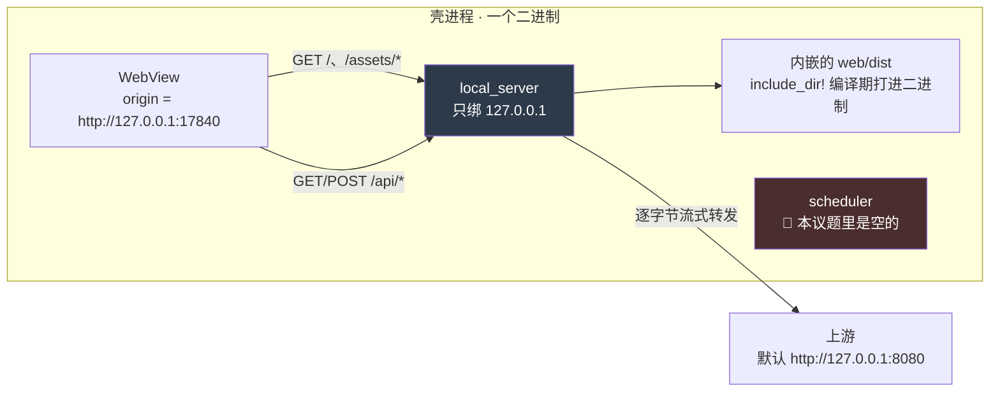

> 桌面壳。**它把现有的 `web/dist` 装进一个窗口,不做别的。**
>
> 契约在 `docs/technical/18-壳技术方案-Tauri2包现有Web工程.md`(`KUBI-62`),本文件只讲怎么跑、
> 以及代码里那几个「看起来像漏了」的地方为什么是有意的。**契约变更必须回去改那份文档** ——
> 反代那九条里任何一条被实现绕过,是文档过期,不是实现聪明。
>
> ✅ **那个编号冲突已在并入 `v1` 时解掉(2026-08-30):** 壳技术方案由 `Agent框架` 改号为 `壳技术方案`,
> 主干原有的 `docs/misc/15-Agent框架与能力边界.md` 保号。本目录里所有 `docs/technical/18 §x` 指的都是壳技术方案。
> 同批解掉的还有风险号:壳的五条风险由 `R-72…R-76` 改为 **`R-108…R-112`**(旧号在主干上早已另有所属)。
>
> ⚠ 这个目录**对阶段 0的贡献是零**。阶段 0 要的是「自用两周、每天记两个数」,
> 而壳一个数都不产生。它是后续阶段的前置准备,由项目所有者直接拍板开工(`KUBI-61`)。
> 在这里待着很舒服 —— 可量化、有完成感、完全不需要面对真实用户,正是 `思考模式` §盲区二 点名的那种事。

## 跑起来

```bash
./shell/build.sh            # 三道自检 + 打包,出 .app / .dmg
./shell/build.sh --check    # 只跑三道自检,不打包(提交前 / CI)
```

**这是唯一允许的构建方式。** 直接 `cargo tauri build` 会绕过步骤 ① 的隔离校验,
而绕过隔离校验的构建路径和没有隔离校验是一回事(`R-111`)。

前置:

| 需要 | 装法 | 为什么不自动装 |
|---|---|---|
| Rust + 目标平台 std | `rustup target add aarch64-apple-darwin` | 改动别人机器上的工具链应当是一次显式的决定 |
| `cargo-tauri` | `cargo install tauri-cli --version "^2.0" --locked` | 同上 |
| Node | 走 `web/` 已有的那套 | 壳自己**不引入任何 npm 依赖** |

装好之后双击 `target/<triple>/release/bundle/macos/考点盲区.app`。
**ad-hoc 签名,自用**,首次打开走一次「右键 → 打开」。分发给别人才需要
Developer ID + 公证,而本轮没有分发(`docs/technical/壳技术方案-Tauri2包现有Web工程.md` §4.4)。

## Android

```bash
./shell/scripts/android-build.sh          # 出 debug apk(默认 aarch64)
ANDROID_TARGET=x86_64 ./shell/scripts/android-build.sh   # x86_64 模拟器
```

**这是 Android 唯一允许的出包方式**,理由与 macOS 那条一模一样:直接
`cargo tauri android build` 会绕过 `build.sh --check`,而绕过隔离校验的构建路径
和没有隔离校验是一回事(`R-111`)。这个脚本自己不做校验 ——
它把 `build.sh --check` 原样跑一遍,只补上 Android 独有的前置与断言。

### 前置

一条都不自动装。缺哪一件脚本会点名说,不会让它到 Gradle 那一步才炸。

| 需要 | 装法 | 实测通过的版本(2026-09-05) |
|---|---|---|
| Android SDK | `brew install --cask android-commandlinetools`,再 `sdkmanager --install 'platforms;android-34' 'build-tools;34.0.0'` | `platforms;android-34`、`build-tools;34.0.0` |
| NDK | `sdkmanager --install 'ndk;26.3.11579264'` | `26.3.11579264` |
| JDK 21 | `brew install --cask temurin@21` | Oracle `21.0.7` (arm64) |
| Rust 目标 | `rustup target add aarch64-linux-android` | `rustc 1.93.1` |
| `cargo-tauri` | `cargo install tauri-cli --version "^2.0" --locked` | `tauri-cli 2.11.4` / `tauri 2.11.5` / `wry 0.55.1` |
| Node | 走 `web/` 已有的那套 | `v22.22.1` |

`ANDROID_HOME` 要自己 export;`NDK_HOME` 与 `JAVA_HOME` 不设的话脚本会自己找,
**找到多个就停下来问,不替你挑**(NDK 带一串补丁号,写死在文档里的那一串换台机器就不对)。

### 装与跑

```bash
adb install -r shell/gen/android/app/build/outputs/apk/universal/debug/app-universal-debug.apk
adb reverse tcp:8080 tcp:8080     # 上游在宿主机上,不加这条 /api 一律 502
```

🔴 `gen/` 是 gitignore 的,每台机器由 `cargo tauri android init` 现生成。
由此得到一条纪律:**任何改动都不许落在 `gen/` 里** —— 下一次 init 会把它抹掉,
而抹掉的那一刻不会有任何东西变红。

### 返回键

系统返回键 → webview 历史回退 → 栈空才退出。**壳侧一行代码都没写** ——
这是 wry `WryActivity` 的默认行为,而 webview 的历史就是路由的历史
(`web/src/main.tsx` 用 `createBrowserRouter`),两者恰好对上。
一行不写的东西没有任何一处会在它消失时变红,所以那条契约由
`scripts/android-build.sh` 步骤 ④ 对**生成出来的 Kotlin** 做文本断言。

实测(模拟器 Android 14 / API 34):

| 从哪儿按 | 结果 |
|---|---|
| `/export`(历史深 5) | 逐级回退 `/capture` → `/records?filter=unclassified` → `/records` → `/coverage` |
| `/coverage`(历史底) | 退出应用 ✅ 这正是要的 |
| 登录门 | 地址一直是 `/`,历史深度 1,一按即退出 —— 门没有历史,符合设计 |

⚠️ **覆盖层不在这条链上,这一条没修。** ⌘K 面板是 `useState` 不是历史条目,实测:

- 面板开着、历史深度 1 → **一按返回键整个应用退出**,面板从没被关过
- 面板开着、历史深度 2 → 第一下关软键盘,第二下**弹掉了背后那一屏而面板还开着**

修法在 `web/`,不在壳里 —— 本轮 `web/` 的所有者是 `KUBI-117`,补丁说明已发到 `KUBI-111`。

### 安全区与手势条

实测(1080×2400 @420dpi,`dpr=2.625`,视口 412×915 CSS px):

| 量 | 值 | 说明 |
|---|---|---|
| `env(safe-area-inset-top)` | `49px` | ↔ 系统报的 128 物理像素,**对得上** |
| `env(safe-area-inset-bottom)` | **`0px`** | 而系统报的 `navigationBars` 是 63 物理像素(24 CSS px)—— **它在说谎** |
| 底部状态条 | CSS `836.3–862.3` | 最低一行内容落在 `874.9`,手势条从 `890.3` 起 —— **净空 15.4 CSS px,没被压** ✅ |
| 屏底动作区 | CSS `862.3–915.0` | 底部 24 CSS px 落在手势条区里,但**点击照样进得来**(实测在 `y=2360` / `2380` 物理像素上点仍然跳转),`U6.4` 的 44px 触控下限没有被吃掉 |

所以 `77fecc3` 那次「把底栏挪到屏底动作区上面」是**真的生效了**,不是看着像生效。
`inset-bottom` 为 0 这条差异写在 `src/platform/android.rs` 里 ——
它是这个系统的性质,不是那份样式的选择。

### 停在哪一档

**A 档**:装得上、起得来、主链路六屏逐屏点得完(登录门 M5 / 首启 M0 / 记录 M1 /
未分类 M2 / 盲区 M3 / 出口 M4),截图见 `KUBI-118`。
六屏中的后四屏走的是**离线示例数据** —— 底部状态条红着写「离线示例数据」,那就是证据。

**B 档(连真后端拿真数)没做**:本机没有 MySQL / Redis,登录要真后端才过得去,
那是 `KUBI-114` / `KUBI-112` 的事。所以「登录门」这一屏验的是它**渲染并能输入**
(手机号那一格调起数字键盘、「未接入 行为验证」那条说明在位),**不是**登录跑通了。

🔴 **门后那五屏是怎么点到的,必须说清楚**:debug 包开着 webview 远程调试,
所以是从 `chrome://inspect` 往 `localStorage` 里塞了一个**假令牌**绕过门,
再往下点的。这证明的是「门后那五屏在 Android 上渲染并跳得动」,
**不证明**登录链路通。真令牌要等 `KUBI-114`。

## 它是怎么工作的



前端只写相对路径 `/api/*`。这条路径解析成什么取决于页面 origin ——
dev 是 vite proxy,生产是 Caddy,壳是 `local_server.rs`。
**三个实现,一条契约,前端一个字不知道自己在哪儿跑。**

`server/` 一个字节都没改:页面 origin 与 `/api` 同源,所以**不存在跨域**。

## 那几个「看起来像漏了」的地方

| 看起来 | 其实 | 在哪写着理由 |
|---|---|---|
| `beforeBuildCommand` 是空串 | 填上它就出现第二条构建路径,而它绕过隔离校验 | `tauri.conf.json5` |
| 没配 `frontendDist` | 壳不走 `tauri://` 资源协议;配上会让同一批字节存两份、并多出一个永不访问的 origin | `tauri.conf.json5` |
| `windows: []` | 窗口在 `setup()` 里建,因为它必须发生在**端口绑定成功之后** | `tauri.conf.json5` / `src/main.rs` |
| `capabilities/*.json` 的 `permissions` 是空的 | 页面从来不发 IPC,没有 core 命令需要授权 | `capabilities/desktop.json` |
| `scheduler.rs` 里什么都没有 | 后台定时器是 `KUBI-68`,它还卡在 `KUBI-63` 上;但**具名的位置现在就要有** | `src/scheduler.rs` |
| 没有托盘 | 托盘是那个**常驻进程**的可见表示,而常驻进程还不存在 | `src/main.rs` |
| 端口被占时直接不启动 | 换端口 = 换 origin = 浏览器侧本地存储静默全失(`R-109`) | `src/strings.rs` |

## 三端隔离

`#[cfg(target_os = ...)]` **只允许出现在 `src/platform/` 下**,由 `build.sh` 步骤 ① grep 拦死:

```bash
grep -rn 'cfg(target_os' shell/src --exclude-dir=platform   # 期望零命中
```

`local_server.rs` / `config.rs` / `scheduler.rs` / `strings.rs` 四个文件里出现一个 `#[cfg(target_os)]`,
隔离就已经破了。这条不靠自觉 —— **靠自觉的约束在赶工的那一周会失效,
而赶工的那一周正是它最需要生效的时候。**

## 能力边界文案扫描

`scripts/capability-boundary-scan.mjs`,扫 `src` 全树 + `capabilities/` + `tauri.conf.json5`。

🔴 **词表不在壳里,是从 `web/scripts/capability-boundary-scan.mjs` 现读的。**
这不是省事:壳这边复制一份词表,「改词表绕过」就从一件所有人都会看见的事,
变成一件只有壳的人知道的事。现在改词表只有一处可改,而那一处同时管着 web 的 30 个文件。

代价是它要按文本去读另一个脚本里的两个数组。读不出来时**报错退出**,
不静默降级成「零命中,通过」—— 一条会假绿的断言比没有断言更糟。

## 图标

由 `web/public/favicon.svg` 生成,不新画一个 —— **壳不出新视觉方向**。
底色是页面底 `#0e0f11`(`web/src/index.css` 的 `--color-bg`)。重新生成:

```bash
# 1024 见方的 icon.png 已在 icons/ 里;只在 favicon 改了之后才需要重跑
cd shell/icons && mkdir -p icon.iconset
for s in 16 32 128 256 512; do
  sips -z $s $s icon.png --out icon.iconset/icon_${s}x${s}.png
  sips -z $((s*2)) $((s*2)) icon.png --out icon.iconset/icon_${s}x${s}@2x.png
done
iconutil -c icns icon.iconset -o icon.icns && rm -rf icon.iconset
```

⚪ **待 UI 审核判**:现在是一个满幅方形图标(产品底色 + 现有标记),
没有 macOS 惯例的圆角矩形外形。加圆角是一次视觉决定,不由壳来做。

## 不做什么

| 不做 | 为什么 | 何时重新评估 |
|---|---|---|
| 全局快捷键 / 监听截图目录 / 悬浮窗 | 撞 `web/README.md` 的「替你听、替你截,不行」;监听截图目录还绕过「同意那一刻」(`KUBI-64` 人审确认) | 永不(前两个) |
| 壳内 IPC(`invoke`) | 会长出第二套契约和第二个后端 | 出现一个 HTTP 表达不了、且不能放在 server 侧的本地能力 |
| 自动更新 | 新增签名密钥 + 托管端点 | 有第二个使用者 |
| 崩溃上报 / 遥测 | 它会把数据送出这台机器 | 永不 |
| 本地 TLS | 自签根证书与私钥入包都是安全倒退,而它要挡的同机进程威胁 TLS 本来也挡不住 | 永不 |
| 壳内缓存 API 响应 | 前端已有 TanStack Query 与「四个端点要么全真要么全假」的整屏纪律。壳再加一层 = 同屏两个来源 | 不评估 |
